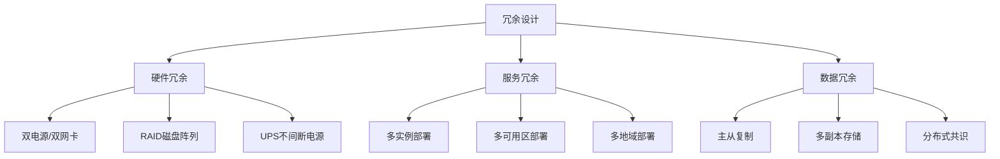
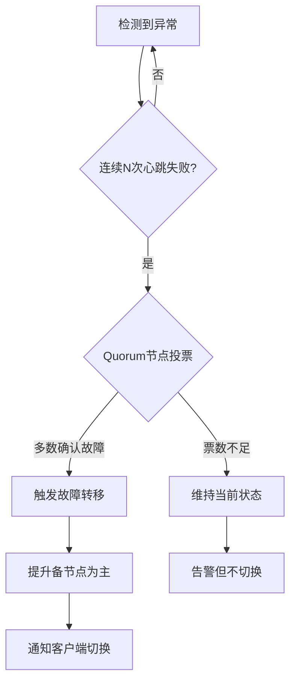
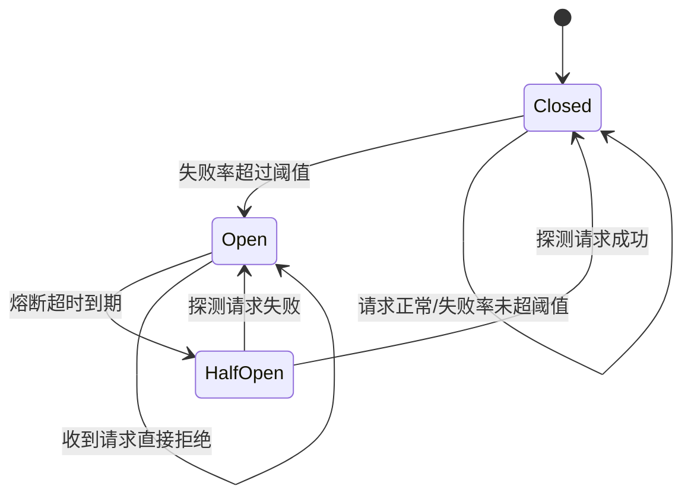
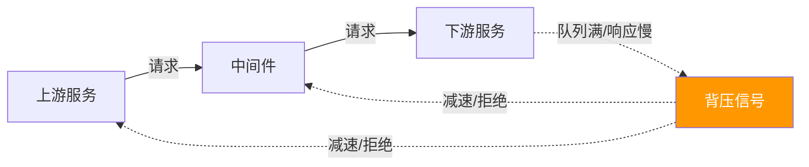
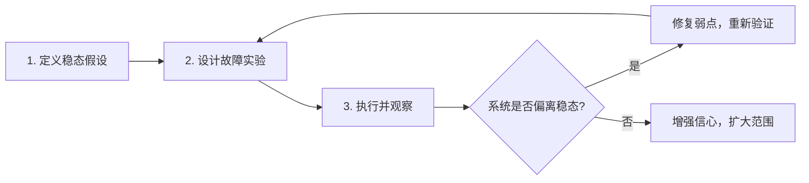

## 核心技巧

高可用架构的"道"是理论基础，而"术"就是本节要展开的核心技巧。这些技巧是从无数生产事故和架构演进中提炼出来的最佳实践，覆盖冗余设计、负载均衡、故障转移、熔断降级、数据一致性、健康检查、容量规划、弹性伸缩、超时重试背压和混沌工程十大维度。掌握这些技巧，你就能在面对单点故障、流量洪峰、数据不一致等典型挑战时，有章法地设计和运维一个真正可靠的系统。

在深入每个技巧之前，需要理解一个核心观点：**高可用不是一个单点技术，而是一套纵深防御体系**。就像瑞士奶酪模型（Swiss Cheese Model）揭示的——每层防御都有漏洞，但多层叠加后，漏洞不会对齐，故障就无法贯穿所有防线。冗余是第一道防线，负载均衡是第二道，故障转移是第三道，熔断降级是第四道……每层各司其职，层层兜底。

---

## 1. 冗余设计：消除单点故障

高可用的第一原则是**永远不要让任何单一组件成为系统的唯一依赖**。冗余设计就是通过在关键路径上部署多份副本，确保任何一个节点挂掉时，系统仍能正常运行。

### 1.1 冗余的三个层次



| 层次 | 目标 | 典型方案 | 成本等级 | 投入产出比 |
|------|------|----------|----------|-----------|
| 硬件冗余 | 消除物理故障 | 双电源、RAID、ECC内存 | 低 | 极高（成本低、效果显著） |
| 服务冗余 | 消除进程/机器故障 | 多实例、多AZ、多地域 | 中 | 高（核心投资） |
| 数据冗余 | 消除数据丢失风险 | 主从复制、纠删码、三副本 | 高 | 最高（数据丢失不可逆） |

**关键原则**：冗余要覆盖整条调用链路。如果 Web 层有 3 个实例但数据库只有一个，那么数据库就是单点。真正高可用的架构要求从接入层到存储层，每一层都有冗余。

### 1.2 副本数量选择

副本数不是越多越好，需要在**可用性、成本、一致性**三者之间取平衡：

| 副本数 | 可容忍故障数 | 典型场景 | 一致性开销 | 年可用性估算* |
|--------|-------------|----------|-----------|-------------|
| 1 | 0（无冗余） | 开发环境 | 无 | 取决于单机 MTBF |
| 2 | 0（仅硬件冗余） | 低优先级服务 | 低 | 99.9%~99.99% |
| 3 | 1 | 生产环境标配（数据库、缓存） | 中 | 99.99%~99.999% |
| 5 | 2 | 金融/核心交易系统 | 高 | 99.999%+ |

> *注：年可用性估算基于各节点年故障率 5%（即 MTBF ≈ 7300 小时）的简化模型。

**实际选择依据**：如果你的系统需要 99.99% 可用性，每个组件的年故障时间不超过 52.6 分钟。对于 MTTR（平均修复时间）为 10 分钟的系统，单副本就够了；如果 MTTR 是 1 小时，你至少需要 2 个冗余副本（即总共 3 个实例）才能保证在修复期间系统仍可用。

**副本选择决策公式**：

所需副本数 N = f(目标可用性, MTTR, 单节点MTBF)

简化计算：
假设单节点年故障概率 p = 0.05（常见值）
N 个副本同时故障的概率 = p^N

- N=1: 5%    → 年故障时间 4380 分钟
- N=2: 0.25% → 年故障时间 219 分钟
- N=3: 0.0125% → 年故障时间 10.95 分钟  ← 大多数生产环境
- N=4: 0.000625% → 年故障时间 0.55 分钟

### 1.3 活跃-待机 vs 活跃-活跃

| 模式 | 描述 | 优点 | 缺点 | 适用场景 |
|------|------|------|------|----------|
| 活跃-待机(Active-Standby) | 一个节点服务，另一个待命 | 简单、一致性好 | 资源浪费50%、切换有延迟 | 传统数据库、单主架构 |
| 活跃-活跃(Active-Active) | 多个节点同时服务 | 资源利用率高、吞吐量大 | 需处理写冲突、架构复杂 | 无状态服务、多活架构 |

**活跃-待机的典型实现**（以 Keepalived + VIP 为例）：

```bash
# Master节点配置 /etc/keepalived/keepalived.conf
vrrp_script chk_mysql {
    script "/usr/local/bin/check_mysql.sh"
    interval 2
    weight -20
    fall 3
    rise 2
}

vrrp_instance VI_1 {
    state MASTER
    interface eth0
    virtual_router_id 51
    priority 100
    advert_int 1
    authentication {
        auth_type PASS
        auth_pass mypassword
    }
    virtual_ipaddress {
        192.168.1.100/24 dev eth0
    }
    track_script {
        chk_mysql
    }
    notify_master "/usr/local/bin/notify_master.sh"
    notify_backup "/usr/local/bin/notify_backup.sh"
}

# 健康检查脚本 /usr/local/bin/check_mysql.sh
#!/bin/bash
mysql -u monitor -p"password" -e "SELECT 1" > /dev/null 2>&amp;1
if [ $? -ne 0 ]; then
    exit 1  # MySQL不可用，触发故障转移
fi
exit 0
```

```bash
# Slave节点只需修改：
# state BACKUP
# priority 90（低于Master）
# 其余配置完全一致
```

**活跃-活跃的冲突处理策略**：

| 冲突类型 | 解决方案 | 原理 | 示例 |
|----------|---------|------|------|
| Last-Write-Wins (LWW) | 时间戳取最新 | 依赖时钟同步，简单但可能丢写入 | Cassandra 默认策略 |
| 向量时钟 | 保留在多版本直到收敛 | 每个副本维护版本向量，冲突时保留所有版本 | Dynamo 论文 |
| CRDT | 数据结构本身保证无冲突 | 数学证明的收敛性，无需协调 | 计数器(G-Counter)、集合(LWW-Element-Set)、Flag |
| 分片路由 | 不同Key路由到不同主节点 | 规避冲突而非解决冲突 | 分库分表，每个分片单主 |

**CRDT 实际应用案例**：Redis 的 RedisCRDB、Riak 数据库、Apache Geode 都原生支持 CRDT。以购物车为例，用 G-Counter（只增计数器）实现加减操作：用户 A 和 B 分别加了商品 X 3 件和 2 件，最终合并结果为 5 件，无需冲突协调。

### 1.4 多活架构的层次

根据业务连续性要求，多活架构可分为几个层次：

| 层次 | 名称 | RPO | RTO | 复杂度 | 典型案例 |
|------|------|-----|-----|--------|---------|
| L0 | 单机房单活 | 高 | 小时级 | 低 | 早期创业公司 |
| L1 | 同城双活 | 秒级 | 分钟级 | 中 | 多数中型企业 |
| L2 | 异地双活 | 秒级 | 秒级 | 高 | 电商平台 |
| L3 | 异地多活 | 0 | 秒级 | 极高 | 金融核心系统 |

> RPO（Recovery Point Objective）= 可容忍的最大数据丢失量；RTO（Recovery Time Objective）= 可容忍的最大服务中断时间。

---

## 2. 负载均衡：流量的智能分配

负载均衡是高可用架构的流量入口，核心目标是将请求均匀地分发到多个后端实例，避免任何单点过载。

### 2.1 四层 vs 七层负载均衡

| 维度 | 四层(L4) | 七层(L7) |
|------|---------|---------|
| 工作层级 | 传输层(TCP/UDP) | 应用层(HTTP/gRPC) |
| 转发依据 | IP+端口 | URL/Header/Cookie/内容 |
| 性能 | 极高（10M+ QPS） | 较高（100K-1M QPS） |
| 功能 | 纯转发 | 路由、改写、鉴权、缓存 |
| 代表方案 | LVS、NLB、DPVS | Nginx、Envoy、HAProxy |
| 适用场景 | 数据库代理、Redis集群 | Web服务、API网关 |

**混合部署模式**：大型系统通常采用 L4 + L7 两层架构——L4 负责入口流量分发（如 LVS/DPVS），L7 负责精细化路由（如 Nginx/Envoy）。这种模式兼顾了 L4 的极致性能和 L7 的灵活功能。

用户请求
    ↓
L4 负载均衡 (LVS/DPVS)  ← 高性能分发，10M+ QPS
    ↓
L7 负载均衡 (Nginx/Envoy) ← 精细化路由、鉴权、缓存
    ↓
后端服务集群

### 2.2 七种负载均衡算法对比

| 算法 | 原理 | 优点 | 缺点 | 适用场景 |
|------|------|------|------|----------|
| 轮询(Round Robin) | 依次分发 | 简单、均匀 | 不感知实例状态 | 实例性能一致时 |
| 加权轮询(Weighted RR) | 按权重比例分配 | 灵活、适应异构 | 权重需手动配置 | 服务器性能不同时 |
| 随机(Random) | 随机选择 | 实现简单、大QPS下均匀 | 小样本不够均匀 | 大规模集群 |
| 最少连接(Least Conn) | 选择连接数最少的实例 | 动态感知负载 | 需维护连接计数 | 长连接场景(HTTP2/gRPC) |
| IP哈希(IP Hash) | 同一IP分到同一实例 | 会话保持 | 负载不均 | 需要Session粘性的场景 |
| 一致性哈希(Consistent Hash) | 按Key哈希映射到环 | 节点变动时迁移最小 | 节点少时可能不均 | 分布式缓存、分片路由 |
| 最短响应时间(Least RT) | 选择响应最快的实例 | 真实反映处理能力 | 统计开销大 | 对延迟敏感的服务 |

**一致性哈希的虚拟节点**：当物理节点较少时，环上分布不均匀会导致热点。解决方案是引入虚拟节点——每个物理节点映射 100~200 个虚拟节点到哈希环上，显著提升均匀度。典型实现：Nginx 的 upstream_hash 模块、Java 的 Guava Hashing、Go 的 hashicorp/consistent 包。

### 2.3 Nginx 完整负载均衡配置

```nginx
# /etc/nginx/conf.d/upstream.conf
upstream backend {
    # 最少连接算法（推荐用于长短混合连接场景）
    least_conn;
    
    # 会话保持（基于cookie的粘性）
    sticky cookie srv_id expires=1h domain=.example.com path=/;
    
    # 后端实例配置
    server 10.0.1.1:8080 weight=5 max_fails=3 fail_timeout=30s;
    server 10.0.1.2:8080 weight=3 max_fails=3 fail_timeout=30s;
    server 10.0.1.3:8080 weight=2 max_fails=3 fail_timeout=30s;
    
    # 备用节点（所有主节点都故障时启用）
    server 10.0.1.4:8080 backup;
    
    # 连接复用（减少TCP握手开销）
    keepalive 32;
}

server {
    listen 80;
    
    location / {
        proxy_pass http://backend;
        proxy_http_version 1.1;
        proxy_set_header Connection "";  # 启用keepalive
        
        # 超时设置
        proxy_connect_timeout 5s;
        proxy_read_timeout 60s;
        proxy_send_timeout 60s;
        
        # 失败重试
        proxy_next_upstream error timeout http_502 http_503 http_504;
        proxy_next_upstream_tries 3;
        proxy_next_upstream_timeout 10s;
    }
}
```

**max_fails 与 fail_timeout 的关系**：在 fail_timeout 时间窗口内，如果某后端连续失败 max_fails 次，Nginx 将其标记为不可用，并在接下来的 fail_timeout 时间内不再向其转发请求。到期后自动重新尝试。这个机制等效于一个简易的熔断器。

### 2.4 健康检查机制

负载均衡器必须能自动检测后端实例的健康状态，将故障实例从转发池中摘除。

| 检查方式 | 实现层级 | 频率 | 准确性 | 适用场景 |
|----------|---------|------|--------|----------|
| TCP端口检查 | 传输层 | 1-5秒 | 低（端口开不代表服务正常） | 通用、快速排除宕机 |
| HTTP状态码检查 | 应用层 | 5-30秒 | 中 | Web服务 |
| gRPC Health Check | 应用层 | 5-10秒 | 中高 | gRPC服务（标准协议） |
| 自定义脚本检查 | 应用层 | 10-60秒 | 高 | 复杂依赖检查 |
| 被动检查(错误计数) | 传输层 | 实时 | 中 | 配合主动检查使用 |

**被动健康检查的 Nginx 配置**（基于错误计数自动摘除）：

```nginx
# max_fails=3: 连续3次失败后标记为不健康
# fail_timeout=30s: 标记不健康的持续时间，30秒后重新尝试
server 10.0.1.1:8080 max_fails=3 fail_timeout=30s;

# 在error log中观察摘除行为
# 2026/06/26 [warn] upstream server temporarily disabled while connecting to upstream
```

**主动+被动联合检查**：生产环境推荐同时使用主动检查（定期探测）和被动检查（基于实际请求的错误计数）。主动检查能快速发现完全宕机的实例，被动检查能发现"端口在但服务异常"的情况。Envoy 同时支持这两种模式，且支持将健康检查结果广播给其他代理节点。

---

## 3. 故障转移：自动化的生死切换

故障转移（Failover）是高可用架构最核心的能力——当主节点不可用时，系统能在无人工干预的情况下自动将流量切换到备用节点，将中断时间压缩到秒级甚至毫秒级。

### 3.1 核心指标：RTO 与 RPO

理解故障转移，必须先理解两个核心指标：

| 指标 | 定义 | 目标值 | 影响因素 |
|------|------|--------|---------|
| RTO (Recovery Time Objective) | 从故障发生到服务恢复的时间 | 越小越好 | 故障检测时间 + 选举时间 + 切换时间 |
| RPO (Recovery Point Objective) | 可容忍的最大数据丢失量 | 越小越好 | 复制策略（同步/异步/半同步） |

**RTO 的典型分层**：

| RTO | 代表系统 | 实现方式 |
|-----|---------|---------|
| 0（零中断） | 金融核心 | 同步复制 + 自动切换，双活架构 |
| <1秒 | 电商支付 | 自动故障转移 + 本地缓存兜底 |
| <10秒 | 一般Web服务 | 自动故障转移 |
| <5分钟 | 内部管理系统 | 半自动（自动检测+人工确认） |
| <1小时 | 非核心服务 | 手动切换 |

### 3.2 故障检测：如何判断节点真的挂了

故障检测是故障转移的前提，检测的准确性直接决定了系统是否会误切换（脑裂）或漏切换（真故障未响应）。

| 检测方式 | 原理 | 检测延迟 | 误判率 | 适用场景 |
|----------|------|---------|--------|----------|
| 心跳超时 | 周期性ping/heartbeat | 1-10秒 | 中 | 通用 |
| quorum投票 | 多数节点投票确认 | 3-15秒 | 低 | 分布式协调(ZK/etcd) |
| 信号量(Lease) | 租约过期自动释放 | 1-30秒 | 低 | 分布式锁、主节点选举 |
| 应用层探活 | 检查业务逻辑是否正常 | 5-30秒 | 最低 | 高可用数据库 |

**核心原则：避免误判**。一次误切换导致的脑裂（双主并存）比短暂的不可用更危险。因此故障检测通常要求**多数派确认**：



**Fencing（隔离）机制**：在确认节点故障后，必须通过 STONITH（Shoot The Other Node In The Head）确保旧主被彻底隔离。否则旧主恢复后可能仍持有旧的 VIP 或锁，导致双主并存。常见 Fencing 手段包括：关闭电源（IPMI/iLO）、撤销 Token（ZooKeeper Session）、断开网络（防火墙规则）。

### 3.3 故障转移的五步流程

一个完整的故障转移流程包括五个步骤，每一步都不能省略：

**步骤一：故障检测** → 判定主节点不可用

**步骤二：备节点选举** → 在多个备节点中选出最优的一个提升为新主

选举优先级的常见考量因素：

| 优先级 | 因素 | 原因 |
|--------|------|------|
| 1 | 数据新鲜度（复制延迟最小） | 避免数据丢失 |
| 2 | 资源充足度（CPU/内存余量大） | 提升后能承载流量 |
| 3 | 网络质量（到其他节点延迟低） | 减少后续复制延迟 |
| 4 | 地理位置（就近原则） | 减少用户访问延迟 |

**步骤三：数据一致性保障** → 确保新主的数据是最新的

**步骤四：流量切换** → DNS/VIP/代理层将流量指向新主

**步骤五：旧主恢复与重建** → 旧主恢复后降级为备节点，重新从新主同步数据

**故障转移时间分解**：

总 RTO = 故障检测时间 + 选举时间 + 数据同步时间 + 流量切换时间 + DNS传播时间

典型值（etcd + K8s）：
  故障检测:   10秒 (heartbeat_interval × miss_count)
  选举时间:   2秒  (etcd leader election)
  Pod重建:    30秒 (image pull + startup)
  DNS传播:    30秒 (TTL配置)
  ─────────────────
  总计:       约72秒

优化后（预热Pod + 短TTL）：
  降至 15-30秒

### 3.4 脑裂防护

脑裂（Split-Brain）是故障转移中最危险的问题：两个节点都认为自己是主，同时接受写入，导致数据分叉。

**防护策略对比**：

| 策略 | 原理 | 优点 | 缺点 |
|------|------|------|------|
| Quorum机制 | 需要多数节点确认才能成为主 | 最可靠 | 需要奇数个节点 |
| Fencing(隔离) | STONITH: Shoot The Other Node In The Head | 彻底防止双主 | 需要硬件支持 |
| 比较器(Compare-And-Set) | 写入前比较epoch/版本号 | 实现简单 | 可能丢写入 |
| 外部仲裁 | 共享存储或第三方服务仲裁 | 独立于集群 | 仲裁服务本身是单点 |

```bash
# etcd 集群的 Quorum 配置示例（5节点集群，容忍2节点故障）
# etcd.conf.yml
initial-cluster: "node1=http://10.0.1.1:2380,node2=http://10.0.1.2:2380,node3=http://10.0.1.3:2380,node4=http://10.0.1.4:2380,node5=http://10.0.1.5:2380"
initial-cluster-state: new
# Quorum = N/2 + 1 = 3（5个节点中至少3个存活才能选举Leader）
# 这意味着即使2个节点同时故障，集群仍可正常工作
```

**为什么 Quorum 必须用奇数节点**：3 个节点容忍 1 个故障，5 个节点容忍 2 个故障——增加 2 个节点只多容忍 1 个故障，但通信复杂度从 O(3²) 增加到 O(5²)，复制开销显著增加。因此生产中通常选择 3 或 5 个节点，极少使用偶数个。

---

## 4. 熔断降级：防止故障雪崩

熔断降级是微服务架构中防止级联故障的关键机制。它的核心思想是：**当某个服务不可用时，快速失败而不是等待超时，避免故障沿调用链传播**。

### 4.1 熔断器的三种状态



| 状态 | 行为 | 类比 |
|------|------|------|
| Closed（关闭） | 正常放行所有请求，同时统计失败率 | 电路正常，电流通过 |
| Open（打开） | 直接拒绝所有请求，返回降级响应 | 电路熔断，电流中断 |
| Half-Open（半开） | 放行少量探测请求，测试下游是否恢复 | 试探性合闸 |

### 4.2 熔断器核心参数

| 参数 | 含义 | 推荐值 | 调优方向 |
|------|------|--------|---------|
| failure_rate_threshold | 触发熔断的失败率 | 50% | 降低=更敏感，升高=更宽容 |
| slow_call_rate_threshold | 慢调用触发熔断的比例 | 80% | 根据P99延迟定义"慢调用" |
| sliding_window_size | 统计窗口大小 | 10次请求 | 增大=更稳定，减小=更灵敏 |
| wait_duration_in_open_state | 熔断持续时间 | 30-60秒 | 短=快速恢复，长=更保守 |
| permitted_number_of_calls_in_half_open_state | 半开状态探测数 | 3-5次 | 增大=更快验证，减小=更安全 |

**参数调优的实际经验**：滑动窗口大小（sliding_window_size）对行为影响巨大。窗口太小（如 5 次请求），偶发的几次失败就可能触发熔断——在高 QPS 下，5 次请求可能只覆盖 1 毫秒的数据，统计意义不足。窗口太大（如 1000 次请求），对故障的响应又太慢。生产环境推荐 50~200 次请求，或使用时间窗口（如 60 秒）而非计数窗口。

### 4.3 多语言熔断器实现

**Java: Resilience4j**

```java
CircuitBreakerConfig config = CircuitBreakerConfig.custom()
    .failureRateThreshold(50)                    // 失败率超过50%触发熔断
    .slowCallRateThreshold(80)                    // 慢调用比例超过80%触发熔断
    .slowCallDurationThreshold(Duration.ofSeconds(1)) // 超过1秒算慢调用
    .slidingWindowType(SlidingWindowType.COUNT_BASED) // 基于次数的滑动窗口
    .slidingWindowSize(10)                        // 窗口大小10次请求
    .minimumNumberOfCalls(5)                      // 至少5次请求后才开始计算失败率
    .waitDurationInOpenState(Duration.ofSeconds(30)) // 熔断30秒
    .permittedNumberOfCallsInHalfOpenState(3)     // 半开状态放行3个探测请求
    .build();

CircuitBreaker breaker = CircuitBreaker.of("priceService", config);

// 包装远程调用
Supplier<String> decoratedSupplier = CircuitBreaker
    .decorateSupplier(breaker, () -> priceService.getPrice(productId));

Try<String> result = Try.ofSupplier(decoratedSupplier)
    .recover(CallNotPermittedException.class, e -> {
        // 熔断状态：返回缓存价格或默认价格
        return cachedPriceService.getPrice(productId);
    })
    .recover(TimeoutException.class, e -> {
        // 超时状态：返回默认价格
        return Price.DEFAULT;
    });

// 监听熔断状态变化
breaker.getEventPublisher()
    .onStateTransition(event -> {
        log.warn("熔断器状态变化: {} -> {}", 
            event.getStateTransition().getFromState(),
            event.getStateTransition().getToState());
        alertService.sendAlert("circuit_breaker_state_change", event);
    });
```

**Go: 自研轻量熔断器**

```go
package circuit

import (
    "sync"
    "time"
)

type State int

const (
    StateClosed   State = iota
    StateOpen
    StateHalfOpen
)

type CircuitBreaker struct {
    mu                 sync.Mutex
    state              State
    failureCount       int
    successCount       int
    failureThreshold   int           // 触发熔断的连续失败次数
    openTimeout        time.Duration // 熔断持续时间
    halfOpenMaxTries   int           // 半开状态最大探测数
    lastFailureTime    time.Time
}

func New(failureThreshold int, openTimeout time.Duration) *CircuitBreaker {
    return &amp;CircuitBreaker{
        state:            StateClosed,
        failureThreshold: failureThreshold,
        openTimeout:      openTimeout,
        halfOpenMaxTries: 3,
    }
}

func (cb *CircuitBreaker) Call(fn func() error) error {
    cb.mu.Lock()
    
    switch cb.state {
    case StateOpen:
        // 检查是否已过熔断期
        if time.Since(cb.lastFailureTime) > cb.openTimeout {
            cb.state = StateHalfOpen
            cb.successCount = 0
            cb.failureCount = 0
        } else {
            cb.mu.Unlock()
            return ErrCircuitOpen // 快速失败
        }
    case StateHalfOpen:
        // 半开状态有次数限制
        if cb.successCount >= cb.halfOpenMaxTries {
            cb.mu.Unlock()
            return ErrCircuitOpen
        }
    }
    
    cb.mu.Unlock()
    
    // 执行实际调用
    err := fn()
    
    cb.mu.Lock()
    defer cb.mu.Unlock()
    
    if err != nil {
        cb.failureCount++
        cb.lastFailureTime = time.Now()
        
        switch cb.state {
        case StateClosed:
            if cb.failureCount >= cb.failureThreshold {
                cb.state = StateOpen // 触发熔断
            }
        case StateHalfOpen:
            cb.state = StateOpen // 半开期间失败，重新熔断
        }
        return err
    }
    
    // 成功
    switch cb.state {
    case StateHalfOpen:
        cb.successCount++
        if cb.successCount >= cb.halfOpenMaxTries {
            cb.state = StateClosed // 恢复正常
            cb.failureCount = 0
        }
    case StateClosed:
        cb.failureCount = 0 // 连续成功，重置失败计数
    }
    
    return nil
}
```

**Python: 装饰器风格熔断器**

```python
import time
import threading
from enum import Enum
from functools import wraps
from collections import deque

class State(Enum):
    CLOSED = "closed"
    OPEN = "open"
    HALF_OPEN = "half_open"

class CircuitBreaker:
    def __init__(self, failure_threshold=5, recovery_timeout=30,
                 half_open_max_calls=3, window_size=60):
        self.failure_threshold = failure_threshold
        self.recovery_timeout = recovery_timeout
        self.half_open_max_calls = half_open_max_calls
        self.window_size = window_size  # 滑动窗口（秒）
        
        self._state = State.CLOSED
        self._failure_times = deque()  # 时间戳滑动窗口
        self._half_open_calls = 0
        self._half_open_successes = 0
        self._lock = threading.Lock()
    
    @property
    def state(self):
        with self._lock:
            if self._state == State.OPEN:
                # 检查是否可以进入半开
                if self._failure_times:
                    oldest = self._failure_times[0]
                    if time.time() - oldest > self.recovery_timeout:
                        self._state = State.HALF_OPEN
                        self._half_open_calls = 0
                        self._half_open_successes = 0
            return self._state
    
    def _record_failure(self):
        now = time.time()
        self._failure_times.append(now)
        # 清理滑动窗口外的记录
        while self._failure_times and now - self._failure_times[0] > self.window_size:
            self._failure_times.popleft()
    
    def call(self, func):
        @wraps(func)
        def wrapper(*args, **kwargs):
            with self._lock:
                if self._state == State.OPEN:
                    raise CircuitOpenError("熔断器已打开")
                if self._state == State.HALF_OPEN:
                    if self._half_open_calls >= self.half_open_max_calls:
                        raise CircuitOpenError("熔断器半开状态已达最大探测数")
                    self._half_open_calls += 1
            
            try:
                result = func(*args, **kwargs)
                with self._lock:
                    if self._state == State.HALF_OPEN:
                        self._half_open_successes += 1
                        if self._half_open_successes >= self.half_open_max_calls:
                            self._state = State.CLOSED
                            self._failure_times.clear()
                    elif self._state == State.CLOSED:
                        self._failure_times.clear()  # 成功重置
                return result
            except Exception as e:
                with self._lock:
                    self._record_failure()
                    if self._state == State.CLOSED:
                        if len(self._failure_times) >= self.failure_threshold:
                            self._state = State.OPEN
                    elif self._state == State.HALF_OPEN:
                        self._state = State.OPEN
                raise
        return wrapper

class CircuitOpenError(Exception):
    pass
```

### 4.4 降级策略矩阵

降级不是简单的"返回错误"，而是根据业务特点选择最合理的降级方案：

| 降级策略 | 适用场景 | 实现复杂度 | 用户体验 | 数据准确性 |
|----------|---------|-----------|---------|-----------|
| 返回缓存数据 | 数据类查询（商品信息、推荐列表） | 低 | 好（数据略有延迟） | 中（取决于缓存时间） |
| 返回默认值 | 配置类查询（价格、库存上限） | 低 | 一般（信息可能不准） | 低 |
| 功能降级 | 非核心功能（评论、推荐、积分） | 中 | 好（核心功能不受影响） | N/A（功能关闭） |
| 写转读 | 写操作失败时返回最近结果 | 高 | 一般（用户需重试） | 中 |
| 排队等待 | 有削峰需求的写操作（下单、支付） | 中 | 一般（需等待） | 高（最终一致） |
| 直接拒绝 | 超载保护 | 低 | 差（需用户重试） | N/A |

```python
# Python: 多层降级策略实现
import functools
import json
from datetime import datetime, timedelta

class DegradationChain:
    """降级链：按优先级逐级降级"""
    
    def __init__(self):
        self.strategies = []
    
    def add_strategy(self, name, func, priority=0):
        self.strategies.append((priority, name, func))
        self.strategies.sort(key=lambda x: x[0])
    
    def execute(self, *args, **kwargs):
        for priority, name, func in self.strategies:
            try:
                result = func(*args, **kwargs)
                return {"data": result, "degradation": name, "level": priority}
            except Exception as e:
                continue
        raise Exception("所有降级策略都失败了")

# 使用示例：商品价格查询
chain = DegradationChain()

# 策略1（优先级0）：调用真实服务
def call_real_service(product_id):
    response = price_service.get_price(product_id, timeout=2)
    if response.status_code != 200:
        raise Exception("服务返回错误")
    return response.json()

# 策略2（优先级1）：返回Redis缓存
def get_from_cache(product_id):
    cached = redis_client.get(f"price:{product_id}")
    if cached is None:
        raise Exception("缓存未命中")
    data = json.loads(cached)
    if datetime.fromisoformat(data['updated_at']) < datetime.now() - timedelta(hours=1):
        raise Exception("缓存已过期")
    return data['price']

# 策略3（优先级2）：返回数据库快照
def get_from_db(product_id):
    return db.query("SELECT price FROM products WHERE id = %s", product_id)

# 策略4（优先级3）：返回静态默认价格
def get_default_price(product_id):
    return {"price": 99.9, "source": "default", "note": "降级返回"}

chain.add_strategy("real_service", call_real_service, priority=0)
chain.add_strategy("redis_cache", get_from_cache, priority=1)
chain.add_strategy("db_snapshot", get_from_db, priority=2)
chain.add_strategy("default_price", get_default_price, priority=3)

# 执行
result = chain.execute("product_12345")
print(result)
# 正常时: {"data": {"price": 59.9}, "degradation": "real_service", "level": 0}
# 服务故障: {"data": {"price": 55.0}, "degradation": "redis_cache", "level": 1}
# 缓存也挂: {"data": {"price": 59.9}, "degradation": "db_snapshot", "level": 2}
```

### 4.5 限流：熔断的前置防线

限流和熔断是互补关系：**限流是预防（控制进入系统的请求量），熔断是应急（系统已经出问题时快速止损）**。

| 限流算法 | 原理 | 优点 | 缺点 | 适用场景 |
|----------|------|------|------|----------|
| 固定窗口计数器 | 固定时间段内计数 | 实现简单 | 窗口边界突发问题 | 简单限流 |
| 滑动窗口计数器 | 滑动时间段内计数 | 平滑 | 实现复杂 | 通用 |
| 漏桶(Leaky Bucket) | 固定速率流出 | 绝对平滑 | 突发流量需排队 | API网关 |
| 令牌桶(Token Bucket) | 固定速率放入令牌 | 允许突发 | 需要调优令牌速率 | 通用（推荐） |
| 信号量(Semaphore) | 限制并发数 | 精确控制并发 | 不控制速率 | 数据库连接池 |
| 滑动日志 | 记录每个请求的时间戳 | 精确 | 内存开销大 | 低QPS精确限流 |

```nginx
# Nginx 令牌桶限流配置
http {
    # 定义限流区域：每秒10个请求，突发允许20个排队
    limit_req_zone $binary_remote_addr zone=api_limit:10m rate=10r/s;
    
    # 并发连接限制：每个IP最多50个并发连接
    limit_conn_zone $binary_remote_addr zone=conn_limit:10m;
    
    server {
        location /api/ {
            # 令牌桶限流：burst=20表示允许突发20个请求排队
            # nodelay表示排队的请求不延迟，直接处理
            limit_req zone=api_limit burst=20 nodelay;
            
            # 返回429而非503，语义更准确
            limit_req_status 429;
            
            # 并发限制
            limit_conn conn_limit 50;
            limit_conn_status 429;
            
            # 自定义429响应
            error_page 429 = @rate_limited;
        }
        
        location @rate_limited {
            default_type application/json;
            return 429 '{"error":"请求过于频繁，请稍后重试","retry_after":5}';
        }
    }
}
```

**限流的分布式挑战**：单机限流无法应对多实例场景。分布式限流通常采用以下方案：

| 方案 | 原理 | 精确性 | 性能 |
|------|------|--------|------|
| Redis + Lua 原子操作 | 在 Redis 中用 Lua 脚本实现令牌桶 | 高 | 中（网络RTT） |
| 本地限流 + 全局限流 | 每个实例先本地限流，再用 Redis 做全局 | 中 | 高（减少Redis交互） |
| 滑动窗口(Redis ZSET) | 用有序集合记录请求时间戳 | 最高 | 低（内存开销大） |

---

## 5. 数据一致性：CAP 与 PACELC 的工程权衡

在分布式系统中，一致性（Consistency）、可用性（Availability）、分区容错性（Partition Tolerance）三者不可兼得——这就是著名的 CAP 定理。但 CAP 只是故事的开始，更完整的理论框架是 **PACELC 定理**：在网络分区（P）发生时选择 A（可用性）还是 C（一致性）；在正常运行（E, Else）时选择 L（延迟）还是 C（一致性）。

### 5.1 一致性模型光谱

从强到弱，一致性模型构成一个光谱：


| 一致性模型 | 保证 | 性能 | 适用场景 | 代表系统 |
|-----------|------|------|---------|---------|
| 强一致性(Linearizability) | 读到最新写入，仿佛单机操作 | 最低 | 金融交易、库存扣减 | Spanner、CockroachDB |
| 顺序一致性(Sequential) | 所有节点看到相同的操作顺序 | 低 | 状态机复制 | ZooKeeper |
| 因果一致性(Causal) | 因果相关的操作有序，无因果关系的可以乱序 | 中 | 社交动态、协作编辑 | MongoDB(因果一致性模式) |
| 读写一致性(Read-Your-Writes) | 自己的写入自己能读到 | 中高 | 个人设置、购物车 | 微博Timeline |
| 最终一致性(Eventual) | 最终所有副本收敛到相同状态 | 最高 | 用户资料、评论、日志 | Cassandra、DynamoDB |

### 5.2 PACELC：更完整的选择框架

CAP 告诉我们在网络分区时必须选 A 或 C，但 PACELC 进一步指出：即使网络正常，延迟和一致性之间也需要权衡。

| 系统类型 | 分区时选择 | 正常时选择 | 代表系统 |
|---------|-----------|-----------|---------|
| PA/EL | 选可用性 | 选低延迟 | Cassandra, DynamoDB |
| PA/EC | 选可用性 | 选一致性 | MongoDB（默认） |
| PC/EL | 选一致性 | 选低延迟 | 特定配置的数据库 |
| PC/EC | 选一致性 | 选一致性 | Spanner, CockroachDB, ZooKeeper |

**实际选择指南**：

- 用户个人资料、评论、日志 → PA/EL（最终一致即可，性能优先）
- 电商库存、订单状态 → PA/EC 或 PC/EC（数据不能出错）
- 金融交易、银行转账 → PC/EC（强一致 + 强一致性）
- 社交 Feed、时间线 → PA/EC（分区时保可用，正常时保顺序）

### 5.3 复制策略对比

| 策略 | 同步/异步 | 数据安全性 | 写入延迟 | 适用场景 |
|------|----------|-----------|---------|---------|
| 同步复制 | 主节点等从节点确认 | 最高（零数据丢失） | 高（1-10ms） | 金融核心、库存 |
| 异步复制 | 主节点不等从节点 | 低（可能丢数据） | 最低 | 日志、非核心数据 |
| 半同步复制 | 至少一个从节点确认 | 高（最多丢一个从节点的数据） | 中 | MySQL半同步、PostgreSQL同步复制 |
| 组复制(MGR) | 多数派确认 | 高 | 中高 | MySQL Group Replication |

```sql
-- MySQL半同步复制配置（兼顾安全性和性能）
-- 主节点配置
INSTALL PLUGIN rpl_semi_sync_master SONAME 'semisync_master.so';
SET GLOBAL rpl_semi_sync_master_enabled = 1;
SET GLOBAL rpl_semi_sync_master_timeout = 1000;  -- 1秒超时后降级为异步

-- 从节点配置
INSTALL PLUGIN rpl_semi_sync_slave SONAME 'semisync_slave.so';
SET GLOBAL rpl_semi_sync_slave_enabled = 1;

-- 验证半同步状态
SHOW STATUS LIKE 'Rpl_semi_sync%';
-- Rpl_semi_sync_master_status: ON（半同步模式生效中）
-- Rpl_semi_sync_master_clients: 2（2个半同步从节点）
-- Rpl_semi_sync_master_no_tx: 0（无降级为异步的事务）
```

**半同步复制的降级陷阱**：当所有半同步从节点都不可用时，MySQL 会自动降级为异步复制。这意味着在从节点全部故障期间，主节点的数据可能丢失。因此，生产环境建议至少部署 3 个从节点（2 个半同步 + 1 个异步备份），并在监控中追踪 `Rpl_semi_sync_master_no_tx` 指标——非零值意味着降级发生过。

### 5.4 分布式事务方案选型

| 方案 | 一致性 | 性能 | 复杂度 | 适用场景 |
|------|--------|------|--------|---------|
| 两阶段提交(2PC) | 强一致 | 低（阻塞式） | 中 | 单数据库多表、同构数据库 |
| 三阶段提交(3PC) | 强一致 | 低 | 高 | 理论方案，生产少用 |
| Saga | 最终一致 | 高 | 高 | 跨服务长事务（订单+支付+库存） |
| TCC(Try-Confirm-Cancel) | 最终一致 | 高 | 极高 | 金融级事务 |
| 本地消息表 | 最终一致 | 高 | 中 | 异步解耦场景 |
| 可靠消息(RocketMQ事务消息) | 最终一致 | 高 | 中 | 异步事件驱动 |

**Saga 模式的补偿策略选择**：

Saga 模式将长事务拆分为一系列本地事务，每个事务都有对应的补偿操作。补偿策略有两种：

- **正向补偿（Forward Recovery）**：重试失败的操作直到成功。适用于瞬时性故障（网络抖动、超时），实现简单但对持续性故障无效。
- **反向补偿（Backward Recovery）**：依次执行已完成操作的补偿（回滚）。适用于不可恢复的故障，保证最终一致性，但补偿逻辑设计复杂。

实际生产中通常混合使用：先尝试正向补偿（重试 N 次），失败后再执行反向补偿。

---

## 6. 健康检查与自愈：系统的免疫系统

健康检查是高可用架构的"眼睛"，自愈是"免疫系统"。两者配合，让系统能自动发现故障、自动修复故障，将人工干预降到最低。

### 6.1 健康检查的三个层次

| 层次 | 检查内容 | 失败后果 | 示例 | 适用场景 |
|------|---------|---------|------|---------|
| 存活检查(Liveness) | 进程是否还活着 | 重启Pod | /healthz 返回200 | K8s LivenessProbe |
| 就绪检查(Readiness) | 服务是否能接收流量 | 从Service摘除 | /ready 返回200 | K8s ReadinessProbe |
| 启动检查(Startup) | 服务是否启动完成 | 不进行存活检查 | /started 返回200 | 启动慢的服务(Java) |

```yaml
# Kubernetes 健康检查配置
apiVersion: apps/v1
kind: Deployment
spec:
  template:
    spec:
      containers:
      - name: order-service
        image: order-service:v2.1
        
        # 存活检查：进程死了就重启Pod
        livenessProbe:
          httpGet:
            path: /healthz
            port: 8080
          initialDelaySeconds: 30      # 给应用启动时间
          periodSeconds: 10            # 每10秒检查一次
          timeoutSeconds: 3            # 3秒无响应视为失败
          failureThreshold: 3          # 连续3次失败重启Pod
        
        # 就绪检查：服务没准备好就从Service摘除
        readinessProbe:
          httpGet:
            path: /ready
            port: 8080
          initialDelaySeconds: 10
          periodSeconds: 5
          timeoutSeconds: 2
          failureThreshold: 2          # 2次失败从Service摘除
        
        # 启动检查：针对启动慢的服务
        startupProbe:
          httpGet:
            path: /started
            port: 8080
          periodSeconds: 5
          failureThreshold: 30         # 最多等150秒(5*30)
```

**健康检查的常见陷阱**：

| 陷阱 | 描述 | 正确做法 |
|------|------|---------|
| Liveness 检查依赖外部服务 | 检查数据库/Redis，外部故障导致Pod被杀 | Liveness 只检查进程自身状态 |
| Readiness 检查过于简单 | 只检查端口是否监听 | 应检查依赖是否就绪（缓存预热、连接池初始化） |
| 检查间隔太短 | 频繁探测增加系统负载 | Liveness 10-30秒，Readiness 5-15秒 |
| 超时设置太短 | 网络波动导致误判 | 超时设置为正常响应时间的 2-3 倍 |

### 6.2 自愈模式

| 自愈模式 | 触发条件 | 动作 | 适用场景 |
|----------|---------|------|---------|
| 进程重启 | 进程崩溃/OOM | systemd/docker restart | 单机部署 |
| Pod重建 | LivenessProbe失败 | K8s删除并重建Pod | Kubernetes |
| 节点替换 | 节点NotReady | 云平台自动替换节点 | 云原生 |
| 自动扩容 | CPU>80%持续5分钟 | 新增Pod/实例 | 流量波动场景 |
| 故障转移 | 主节点不可用 | 提升备节点为主 | 数据库、中间件 |

```bash
# 基于Prometheus AlertManager的自动伸缩配置
# alertmanager.yml
route:
  receiver: 'auto-scaling'
  group_wait: 30s
  group_interval: 5m

receivers:
- name: 'auto-scaling'
  webhook_configs:
  - url: 'http://autoscaler:9090/webhook'
    send_resolved: true

# Prometheus告警规则
groups:
- name: scaling
  rules:
  - alert: HighCPUUsage
    expr: avg(rate(container_cpu_usage_seconds_total{namespace="production"}[5m])) > 0.8
    for: 5m
    labels:
      severity: warning
    annotations:
      summary: "CPU使用率持续超过80%，触发自动扩容"
  
  - alert: LowCPUUsage
    expr: avg(rate(container_cpu_usage_seconds_total{namespace="production"}[5m])) < 0.2
    for: 15m
    labels:
      severity: info
    annotations:
      summary: "CPU使用率持续低于20%，触发自动缩容"
```

### 6.3 健康检查端点设计最佳实践

一个生产级的健康检查端点不应该只返回 200，而应提供详细的依赖状态：

```python
# Flask 健康检查端点设计
from flask import Flask, jsonify

app = Flask(__name__)

@app.route('/healthz')
def liveness():
    """存活检查：只检查进程自身"""
    return jsonify({"status": "alive"}), 200

@app.route('/ready')
def readiness():
    """就绪检查：检查所有关键依赖"""
    checks = {}
    all_healthy = True
    
    # 检查数据库
    try:
        db.execute("SELECT 1")
        checks["database"] = {"status": "ok", "latency_ms": 2}
    except Exception as e:
        checks["database"] = {"status": "error", "message": str(e)}
        all_healthy = False
    
    # 检查Redis
    try:
        redis_client.ping()
        checks["redis"] = {"status": "ok", "latency_ms": 1}
    except Exception as e:
        checks["redis"] = {"status": "error", "message": str(e)}
        all_healthy = False
    
    # 检查消息队列
    try:
        mq_client.connected()
        checks["mq"] = {"status": "ok", "latency_ms": 3}
    except Exception as e:
        checks["mq"] = {"status": "error", "message": str(e)}
        all_healthy = False
    
    status_code = 200 if all_healthy else 503
    return jsonify({
        "status": "ready" if all_healthy else "not_ready",
        "checks": checks
    }), status_code
```

---

## 7. 容量规划：用数字驱动决策

容量规划是高可用架构的"粮草先行"——在故障发生之前，就确保系统有足够的资源余量来应对突发流量。

### 7.1 容量评估公式

所需实例数 = (峰值QPS × 安全系数) / 单实例最大QPS

示例：
峰值QPS = 10,000
安全系数 = 1.5（预留50%余量应对突发）
单实例最大QPS = 2,000

所需实例数 = (10,000 × 1.5) / 2,000 = 7.5 → 取整为 8 个实例

**不同类型服务的安全系数推荐**：

| 服务类型 | 安全系数 | 原因 |
|----------|---------|------|
| 核心交易（订单、支付） | 2.0-3.0 | 故障直接影响收入，必须有充足余量 |
| 核心查询（搜索、商品） | 1.5-2.0 | 故障影响用户体验 |
| 非核心功能（评论、推荐） | 1.2-1.5 | 可降级，影响有限 |
| 后台任务（报表、日志） | 1.0-1.2 | 异步处理，可排队 |

**Little's Law 的应用**：利用排队论中的 Little's Law（L = λ × W），可以计算系统所需的并发连接数：

L = λ × W
L = 平均并发请求数
λ = 请求到达速率（QPS）
W = 平均处理时间（秒）

示例：
λ = 1000 QPS
W = 0.1秒（每个请求平均处理时间）
L = 1000 × 0.1 = 100 个并发连接

考虑安全系数 1.5：100 × 1.5 = 150 个连接
每个实例分配 50 个连接 → 至少需要 3 个实例

### 7.2 压力测试方法论

| 测试类型 | 目标 | 工具 | 持续时间 | 适用阶段 |
|----------|------|------|---------|---------|
| 基准测试(Benchmark) | 测单实例极限 | wrk、ab、sysbench | 5-10分钟 | 开发阶段 |
| 负载测试(Load Test) | 测正常负载表现 | JMeter、Gatling、k6 | 30-60分钟 | 测试阶段 |
| 压力测试(Stress Test) | 测超出容量的表现 | JMeter、Gatling | 15-30分钟 | 预发布 |
| 浸泡测试(Soak Test) | 测长时间运行的稳定性 | JMeter、k6 | 4-24小时 | 预发布/生产 |
| 峰值测试(Spike Test) | 测突发流量冲击 | JMeter、k6 | 5-15分钟 | 预发布 |

```bash
# k6 压力测试脚本示例
import http from 'k6/http';
import { check, sleep } from 'k6';

export const options = {
    stages: [
        { duration: '2m', target: 100 },   // 阶段1: 2分钟爬升到100用户
        { duration: '5m', target: 100 },   // 阶段2: 保持100用户5分钟
        { duration: '2m', target: 500 },   // 阶段3: 2分钟爬升到500用户（峰值）
        { duration: '5m', target: 500 },   // 阶段4: 保持500用户5分钟
        { duration: '2m', target: 100 },   // 阶段5: 2分钟降回100用户
        { duration: '2m', target: 0 },     // 阶段6: 2分钟降到0
    ],
    thresholds: {
        http_req_duration: ['p(95)<500'],  // 95%的请求延迟小于500ms
        http_req_failed: ['rate<0.01'],     // 错误率小于1%
    },
};

export default function () {
    const res = http.get('http://api.example.com/products');
    check(res, {
        'status is 200': (r) => r.status === 200,
        'response time < 500ms': (r) => r.timings.duration < 500,
    });
    sleep(1);
}
```

**压测的关键指标**：

| 指标 | 定义 | 健康阈值 | 危险信号 |
|------|------|---------|---------|
| P50 延迟 | 50%请求的响应时间 | <100ms | 突然升高50%+ |
| P95 延迟 | 95%请求的响应时间 | <500ms | 超过SLO阈值 |
| P99 延迟 | 99%请求的响应时间 | <1s | 与P95差距过大（长尾严重） |
| 错误率 | 失败请求占比 | <0.1% | 超过1%且持续上升 |
| 吞吐量 | 成功处理的QPS | 达到预期峰值 | 上不去或波动大 |
| CPU利用率 | 计算资源使用 | <80% | >90%持续超过5分钟 |

### 7.3 弹性伸缩策略

| 策略 | 触发条件 | 优点 | 缺点 | 适用场景 |
|------|---------|------|------|---------|
| 定时伸缩 | 按时间计划 | 可预测、稳定 | 不感知实际负载 | 流量有规律（如每天晚高峰） |
| 指标伸缩 | CPU/内存/自定义指标 | 按需分配 | 有滞后性 | 通用（推荐） |
| 预测伸缩 | 基于历史趋势预测 | 提前准备 | 需要机器学习模型 | 有明显趋势的场景 |
| 队列伸缩 | 消息队列深度 | 直接反映负载 | 需要队列基础设施 | 异步任务处理 |

```yaml
# Kubernetes HPA 配置（基于CPU和自定义指标的自动伸缩）
apiVersion: autoscaling/v2
kind: HorizontalPodAutoscaler
metadata:
  name: order-service-hpa
spec:
  scaleTargetRef:
    apiVersion: apps/v1
    kind: Deployment
    name: order-service
  minReplicas: 3        # 最少3个副本（保证高可用）
  maxReplicas: 20       # 最多20个副本（成本上限）
  behavior:
    scaleUp:
      stabilizationWindowSeconds: 30     # 扩容稳定窗口30秒
      policies:
      - type: Pods
        value: 4                          # 每次最多扩4个Pod
        periodSeconds: 60                 # 60秒内
    scaleDown:
      stabilizationWindowSeconds: 300     # 缩容稳定窗口5分钟（更保守）
      policies:
      - type: Percent
        value: 10                         # 每次最多缩10%的Pod
        periodSeconds: 60
  metrics:
  - type: Resource
    resource:
      name: cpu
      target:
        type: Utilization
        averageUtilization: 70            # CPU超过70%扩容
  - type: Resource
    resource:
      name: memory
      target:
        type: Utilization
        averageUtilization: 80            # 内存超过80%扩容
  - type: Pods
    pods:
      metric:
        name: http_requests_per_second
      target:
        type: AverageValue
        averageValue: "1000"              # 每个Pod超过1000 QPS扩容
```

**缩容比扩容更危险**：扩错实例只是多花点钱，缩错实例可能导致流量打爆剩余实例。因此缩容窗口（stabilizationWindowSeconds）应设置为扩容窗口的 5-10 倍，且缩容策略应更加保守（每次只缩 10%）。

---

## 8. 超时、重试与背压：精细化的流量控制

超时、重试和背压是三个相互配合的精细化流量控制机制，共同保障系统在异常条件下仍能有序运行。

### 8.1 超时设置原则

超时设置过长会导致线程/连接被长时间占用，过短会导致正常请求被误杀。推荐的设置方法：

超时时间 = P99延迟 × 3 + 安全余量

示例：
P99延迟 = 100ms
安全余量 = 50ms
超时时间 = 100ms × 3 + 50ms = 350ms → 取整为 500ms

**各层超时配置推荐**：

| 层级 | 超时参数 | 推荐值 | 原因 |
|------|---------|--------|------|
| DNS解析 | dns_timeout | 3-5秒 | DNS可能很慢，但不应超过5秒 |
| TCP连接 | connect_timeout | 3-5秒 | 连接握手超过5秒基本没戏 |
| HTTP请求 | read_timeout | 10-30秒 | 取决于业务逻辑复杂度 |
| 数据库查询 | query_timeout | 5-10秒 | 长查询应该异步化 |
| 缓存操作 | cache_timeout | 1-3秒 | 缓存操作应该极快 |
| RPC调用 | rpc_timeout | 3-10秒 | gRPC默认无限等待，必须设置 |

**超时链路设计原则**：调用链上每一层的超时必须递减，即上游超时 > 下游超时。否则上游超时先到，但下游还在处理，导致资源浪费。

用户 → API网关(10s) → 服务A(8s) → 服务B(5s) → 数据库(3s)
                                  ↑
                        这里的超时必须逐级递减

### 8.2 重试策略

重试不是简单地"再来一次"，需要精心设计避免重试风暴：

| 策略 | 描述 | 适用场景 |
|------|------|---------|
| 立即重试 | 失败后立即重试 | 瞬时网络抖动 |
| 固定间隔重试 | 每隔固定时间重试 | 简单场景 |
| 指数退避 | 重试间隔指数增长（1s→2s→4s→8s） | 通用（推荐） |
| 指数退避+抖动 | 在指数退避基础上加随机抖动 | 高并发场景（强烈推荐） |
| 线性退避 | 重试间隔线性增长（1s→2s→3s） | 数据库写冲突 |

```python
import random
import time

def retry_with_backoff(func, max_retries=3, base_delay=1.0, max_delay=30.0):
    """指数退避 + 抖动 重试策略"""
    for attempt in range(max_retries + 1):
        try:
            return func()
        except Exception as e:
            if attempt == max_retries:
                raise  # 最后一次重试也失败，抛出异常
            
            # 指数退避
            delay = min(base_delay * (2 ** attempt), max_delay)
            # 添加随机抖动（0~delay之间的随机值，避免多个请求同时重试）
            jitter = random.uniform(0, delay)
            
            print(f"尝试 {attempt + 1} 失败: {e}，{jitter:.2f}秒后重试")
            time.sleep(jitter)

# 使用示例
result = retry_with_backoff(
    lambda: call_remote_service(),
    max_retries=3,
    base_delay=0.5
)
```

**为什么抖动（Jitter）至关重要**：假设 1000 个请求同时失败，如果用纯指数退避，它们会在完全相同的时间点重试（1秒后、2秒后、4秒后……），形成周期性的流量尖峰，称为"惊群效应"（Thundering Herd）。加入抖动后，重试时间分散在 [0, delay] 区间内，将尖峰拉平为均匀负载。

**重试安全原则**：

| 操作类型 | 是否可重试 | 原因 |
|----------|-----------|------|
| GET 查询 | ✅ 可以 | 幂等操作 |
| PUT 更新 | ✅ 可以 | 幂等操作 |
| DELETE 删除 | ✅ 可以 | 幂等操作 |
| POST 创建 | ⚠️ 谨慎 | 非幂等，需业务侧保证幂等性（如唯一请求ID） |
| 转账/扣款 | ❌ 不建议 | 非幂等，重试可能导致重复扣款 |

**幂等性设计**：对于 POST 请求，如果需要支持重试，必须在业务侧保证幂等性。常见做法是客户端生成唯一请求 ID（如 UUID），服务端用 `INSERT ... ON DUPLICATE KEY IGNORE` 或 Redis SETNX 去重，确保同一请求无论执行多少次，结果都相同。

### 8.3 背压(Backpressure)机制

背压是当下游处理不过来时，上游主动减速或拒绝新请求的机制，防止系统过载崩溃。



| 背压实现 | 原理 | 适用场景 |
|----------|------|---------|
| 有界队列 | 队列满时拒绝新消息 | 消息队列、任务队列 |
| 信号量 | 并发数达到上限时阻塞/拒绝 | 数据库连接池、线程池 |
| 速率限制 | 超过速率上限时排队/拒绝 | API限流 |
| 反馈延迟 | 下游响应变慢时自动降低发送速率 | Reactive Streams (Project Reactor/RxJava) |

**有界队列 vs 无界队列**：无界队列看似"永远不丢消息"，但在生产环境中是定时炸弹——当下游处理速度跟不上生产速度时，队列无限增长，最终 OOM 崩溃。正确的做法是使用有界队列，当队列满时触发背压策略（拒绝新消息、触发告警、启动应急扩容）。

---

## 9. 混沌工程：主动验证高可用

混沌工程（Chaos Engineering）是通过**主动注入故障**来验证系统在异常条件下的行为，发现隐藏的脆弱点。它的哲学是：不要等到真实故障暴露问题，而是提前制造故障来加固系统。

### 9.1 混沌工程四步法



| 步骤 | 内容 | 示例 |
|------|------|------|
| 1. 定义稳态 | 明确系统的正常运行指标 | P99延迟<200ms，错误率<0.1% |
| 2. 设计实验 | 选择要注入的故障类型 | 模拟某后端实例突然宕机 |
| 3. 执行观察 | 在可控环境中运行实验 | 在预发布环境注入故障 |
| 4. 分析修复 | 对比实验前后的指标差异 | 发现单点依赖并修复 |

### 9.2 常见故障注入类型

| 故障类型 | 注入方式 | 验证目标 | 风险等级 |
|---------|---------|---------|---------|
| Pod杀灭 | kubectl delete pod | 自愈能力、健康检查有效性 | 低 |
| 网络延迟 | tc netem delay | 超时配置、重试策略有效性 | 中 |
| 网络分区 | iptables DROP | 分布式一致性、脑裂防护 | 高 |
| CPU满载 | stress-ng --cpu | 限流、降级、弹性伸缩 | 中 |
| 磁盘填满 | dd if=/dev/zero of=/tmp/fill | 磁盘监控、日志清理 | 中 |
| DNS故障 | 修改/etc/resolv.conf | DNS重试、服务发现容错 | 高 |

### 9.3 混沌工程工具

| 工具 | 特点 | 适用场景 |
|------|------|---------|
| Chaos Monkey (Netflix) | 随机杀灭生产实例 | 大规模生产环境验证 |
| Litmus Chaos | Kubernetes 原生混沌工程 | K8s 环境首选 |
| Chaos Mesh | 全面的故障注入，支持网络/CIO/内核 | K8s 全栈故障注入 |
| Toxiproxy | 代理层注入网络故障 | 微服务间通信测试 |
| Pumba | Docker 容器故障注入 | Docker 环境 |

```bash
# Chaos Mesh 示例：注入网络延迟
# 对 order-service 的所有 Pod 注入 500ms 网络延迟，持续 5 分钟
apiVersion: chaos-mesh.org/v1alpha1
kind: NetworkChaos
metadata:
  name: order-service-delay
spec:
  action: delay
  mode: all
  selector:
    labelSelectors:
      app: order-service
  delay:
    latency: "500ms"
    jitter: "100ms"
    correlation: "75"
  duration: "5m"
```

### 9.4 混沌工程的渐进式推进

混沌工程不能一步到位，需要从低风险环境逐步推进到生产环境：

1. **开发环境**：新功能上线前，开发者本地验证容错逻辑
2. **测试环境**：CI/CD 流水线中集成自动化混沌测试
3. **预发布环境**：定期（每周/每月）执行完整混沌实验
4. **生产环境**：小范围（单 AZ）开始，逐步扩大到全集群

**关键原则**：生产环境的混沌实验必须有明确的终止条件（circuit breaker for chaos），一旦影响扩大到不可控范围，立即停止并恢复。

---

## 误区与纠正

### 误区一："部署多个实例就是高可用"

**错误认知**：只要部署了多个实例，系统就是高可用的。

**实际情况**：多实例只是高可用的必要条件之一。如果多个实例共享同一个数据库、同一个配置中心、同一个网络出口，那么这些共享组件就是单点。真正的高可用要求**整个调用链路上的每一层都有冗余**。

**自检清单**：画出你的系统架构图，检查以下每层是否都有冗余——DNS → 负载均衡 → 应用服务 → 缓存 → 数据库 → 消息队列 → 配置中心。任何一层是单点，高可用就不成立。

### 误区二："自动故障转移一定比手动好"

**错误认知**：自动化程度越高越好，应该完全无人值守。

**实际情况**：自动故障转移如果配置不当（如故障检测阈值过低），可能导致误切换。脑裂（两个节点同时认为自己是主）的危害远大于短暂的手动切换。**建议保留人工确认环节**，至少在初期通过半自动化（自动检测+人工确认+自动执行）的方式运行。

### 误区三："超时设置越长越安全"

**错误认知**：超时设长一点，给请求更多时间完成，就不会误杀了。

**实际情况**：超时过长会导致线程/连接长时间被占用，如果下游持续故障，上游线程池很快被耗尽，反而导致整个系统崩溃。**超时应该基于P99延迟设置，宁可误杀也不能让线程被长时间占用**。

### 误区四："重试越多成功率越高"

**错误认知**：失败了就重试，多试几次总能成功。

**实际情况**：在下游已经过载的情况下，重试请求相当于"火上浇油"。如果100个请求失败后各重试3次，下游会收到400个请求——比原来多了4倍的压力，可能导致系统从"接近崩溃"变成"彻底崩溃"。**重试必须配合指数退避和最大重试次数**。

### 误区五："监控告警越多越安全"

**错误认知**：把所有指标都加上告警，就能第一时间发现问题。

**实际情况**：告警太多会导致"告警疲劳"——运维人员对告警麻木，真正严重的告警被淹没。**告警必须分级、精简**：Critical（立即处理，电话通知）、Warning（尽快处理，IM通知）、Info（记录日志，不通知）。一个运维团队每天收到的Critical告警不应超过3-5条。

### 误区六："CAP 定理是非此即彼的"

**错误认知**：必须在一致性和可用性之间做二选一。

**实际情况**：CAP 定理只在**网络分区发生时**才成立。在正常运行时（没有分区），系统可以同时保证一致性和可用性。更重要的是，CAP 忽略了**延迟**这个关键维度——PACELC 定理补充了这一视角。实际系统设计不是选 C 还是选 A，而是在不同场景、不同时间点上做出精细的权衡。

---

## 本节小结

本节的十大核心技巧构成了高可用架构的完整"工具箱"：

| 技巧 | 解决的核心问题 | 关键原则 |
|------|---------------|---------|
| 冗余设计 | 消除单点故障 | 整条调用链路都要冗余 |
| 负载均衡 | 流量分配不均 | 选择适合场景的算法+健康检查 |
| 故障转移 | 主节点故障时快速恢复 | Quorum投票防止脑裂 |
| 熔断降级 | 防止级联故障雪崩 | 快速失败优于超时等待 |
| 数据一致性 | 副本间数据不同步 | PACELC权衡，按业务选型 |
| 健康检查与自愈 | 不能及时发现故障 | 三类探针各司其职 |
| 容量规划 | 资源不足导致故障 | 压测驱动，安全系数1.5-3.0 |
| 超时重试背压 | 异常流量冲击系统 | 指数退避+抖动，幂等才重试 |
| 混沌工程 | 隐藏的脆弱点 | 主动注入，渐进推进 |
| 弹性伸缩 | 资源浪费或不足 | 扩容快、缩容慢 |

这些技巧不是孤立使用的，而是在实际架构中相互配合、形成体系。一个真正高可用的系统，往往是这些技巧的有机组合：

冗余提供基础保障
  → 负载均衡分配流量
    → 健康检查发现问题
      → 故障转移快速恢复
        → 熔断降级控制爆炸半径
          → 超时重试背压精细化流量
            → 容量规划确保有足够余量
              → 弹性伸缩按需调配
                → 混沌工程持续验证

掌握这些技巧的组合运用，才是从"知道"到"做到"的关键一步。
