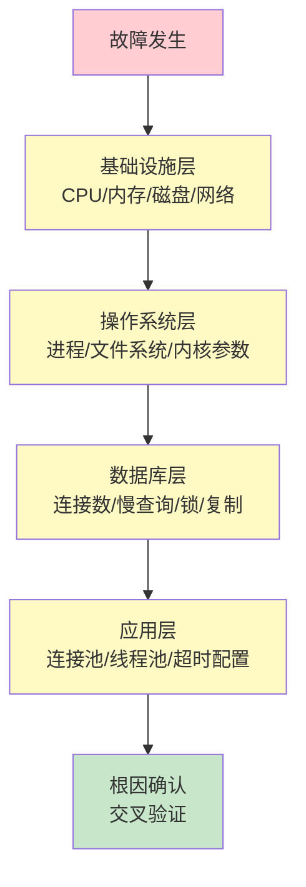
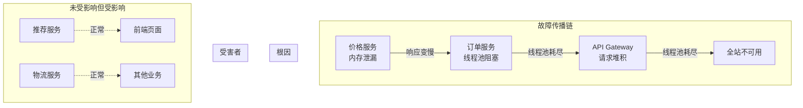
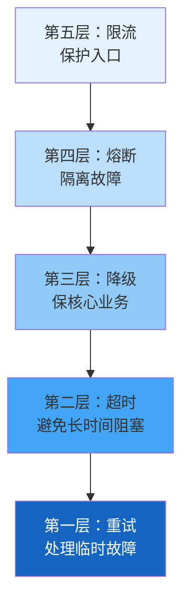
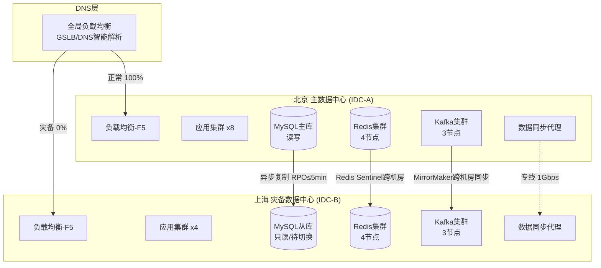
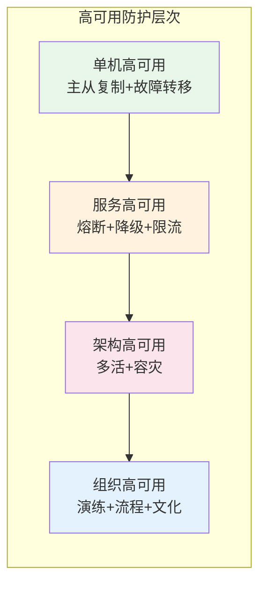

## 实战案例

理论终归要落地到真实场景中接受检验。本节选取三个具有代表性的高可用架构实战案例，分别覆盖**数据库故障转移**、**微服务级联故障熔断**和**跨机房容灾切换**三大核心领域。每个案例都按照"场景还原 → 排查定位 → 方案实施 → 效果验证 → 经验沉淀"的完整闭环展开，帮助读者建立起从问题发现到系统改进的完整思维链路。

三个案例的选择遵循"由浅入深"原则：

| 案例 | 复杂度 | 涉及层级 | 核心能力要求 |
|------|--------|----------|------------|
| 案例一：MySQL主从故障转移 | ★★★ | 单节点→数据层 | 数据库运维、监控告警、自动切换 |
| 案例二：微服务级联故障熔断 | ★★★★ | 服务层→架构层 | 分布式系统设计、熔断降级、发布管理 |
| 案例三：跨机房容灾切换 | ★★★★★ | 架构层→组织层 | 多活架构、数据一致性、容灾演练 |

> **阅读建议**：如果你是初级工程师，重点关注案例一中的排查思路和基础优化手段；如果你是中级工程师，案例二中的熔断降级策略和发布流程优化是重点；如果你是高级工程师或架构师，案例三中的跨机房数据同步和切换策略值得深入研究。

---

## 案例一：电商大促期间MySQL主从自动故障转移

### 1.1 场景还原

#### 理论铺垫：数据库高可用的核心模式

在深入案例之前，先理解数据库高可用的三种主流模式：

| 模式 | 原理 | RTO | RPO | 适用场景 | 代表方案 |
|------|------|-----|-----|----------|----------|
| 主从复制+自动切换 | 一个主节点处理写入，多个从节点处理读取；主节点故障时自动提升从节点 | 秒级 | 可能丢失少量数据 | 互联网业务 | Orchestrator、MHA、MySQL InnoDB Cluster |
| 共识复制 | 多数节点投票确认写入，强一致性 | 秒级 | 零 | 金融核心 | Galera Cluster、TiDB、CockroachDB |
| 读写分离+中间件 | 通过代理层自动路由读写请求 | 秒级 | 取决于底层复制模式 | 高读写比业务 | ProxySQL、MaxScale、ShardingSphere |

本案例属于第一种模式——**主从复制+自动切换**，这是互联网行业最常用的数据库高可用方案。

#### 故障场景

**业务背景**：某中型电商平台（日活约200万），采用MySQL主从架构（1主2从），承载订单、商品、用户三大核心业务。数据库部署在同机房两台物理服务器上，主节点运行在Dell R730xd（64核/256GB），从节点分别运行在同规格服务器上。

**架构拓扑**：

```mermaid
graph TB
    subgraph 应用层
        A1[订单服务 x3] 
        A2[商品服务 x2]
        A3[用户服务 x2]
    end
    subgraph 数据层
        M[(MySQL Master<br/>192.168.1.10<br/>读写)]
        S1[(MySQL Slave 1<br/>192.168.1.11<br/>只读)]
        S2[(MySQL Slave 2<br/>192.168.1.12<br/>只读)]
    end
    subgraph 监控层
        P[Prometheus]
        G[Grafana]
        A[AlertManager]
    end
    subgraph 哨兵
        SE1[Sentinel 1]
        SE2[Sentinel 2]
        SE3[Sentinel 3]
    end
    A1 &amp; A2 &amp; A3 --> M
    M --> S1
    M --> S2
    P --> M &amp; S1 &amp; S2
    SE1 &amp; SE2 &amp; SE3 -.->|心跳检测| M
```

**故障时间线**：

| 时间 | 事件 | 影响 |
|------|------|------|
| 14:23:05 | 主节点磁盘IO突增，I/O Wait从2%飙升至85% | 写入请求开始排队 |
| 14:23:12 | 主节点大量慢查询产生，连接数从80飙升至500 | 应用层连接池耗尽 |
| 14:23:18 | 主节点响应超时，从节点复制延迟从0.1s增至15s | 读请求也开始受影响 |
| 14:23:25 | 监控告警触发：MySQL主节点响应时间 > 3s | 运维值班收到告警 |
| 14:23:30 | 主节点完全不可用，所有写入失败 | 订单创建、支付回调全部报错 |
| 14:24:15 | 哨兵检测到主节点不可达，触发故障转移 | 新主节点提升完成 |
| 14:24:30 | 应用层连接切换到新主节点 | 服务逐步恢复 |
| 14:26:00 | 全部服务恢复正常 | 故障持续约3分钟 |

### 1.2 排查定位

#### 理论铺垫：系统化排查方法论

排查生产故障遵循"自底向上"原则，从基础设施层逐层排查到应用层：



**第一步：基础设施层排查**

```bash
# 1. 检查主节点系统状态
ssh master "uptime"
# 输出: load average: 48.72, 35.21, 18.95 — 远超CPU核数(64)，但负载集中

# 2. 检查磁盘IO（这是关键发现）
ssh master "iostat -x 1 3"
# Device  r/s    w/s    await  svctm  %util
# sda     15.00  892.00 382.45 1.12   98.76
# 分析：写入IOPS高达892，await(平均等待时间)382ms，磁盘已满载

# 3. 检查磁盘空间
ssh master "df -h"
# Filesystem  Size  Used  Avail  Use%  Mounted on
# /dev/sda1   500G  478G   22G   96%   /
# 分析：磁盘使用率96%，binlog日志未及时清理

# 4. 检查MySQL进程状态
ssh master "mysqladmin status"
# 分析：Threads_connected: 500（连接池已满），Threads_running: 48
```

**排查要点**：磁盘I/O Wait高达98.76%意味着磁盘已经饱和，这是导致MySQL响应变慢的直接原因。而磁盘空间使用率96%则指向了根因——大量binlog文件占满了磁盘。

**第二步：应用层排查**

```bash
# 1. 查看应用错误日志
tail -200 /var/log/order-service/app.log | grep -E "(ERROR|Timeout|Connection)"
# 14:23:20 ERROR - 获取数据库连接超时: CannotAcquireResourceException
# 14:23:22 ERROR - 订单创建失败: CommunicationsException: Communications link failure
# 14:23:25 ERROR - 支付回调处理异常: TransactionTimedOutException

# 2. 查看连接池状态
curl -s http://localhost:8080/actuator/metrics/hikaricp.connections.active
# 分析：活跃连接数持续在最大值(50)，无空闲连接
```

**排查要点**：连接池耗尽（50/50）说明数据库层的延迟导致应用层线程被阻塞，形成"请求堆积"的恶性循环。

**第三步：根因分析**

```bash
# 1. 分析慢查询日志
ssh master "pt-query-digest /var/log/mysql/slow.log --since '14:20' --until '14:25' | head -30"
# Rank  Query ID           Response time  Calls  R/Call
# 1     0xABC123DEF456      1250.4523  1.0  0  2856.0000  1.2  0  0.0004  orders WHERE status=?
# 分析：orders表status字段缺少索引，全表扫描在高并发下产生大量随机IO

# 2. 确认binlog清理策略缺失
ssh master "mysql -e 'SHOW BINARY LOGS;' | wc -l"
# 输出: 1247 — 保留了1247个binlog文件，占用约400GB磁盘空间
```

**根因总结**：

| 根因 | 影响程度 | 说明 |
|------|----------|------|
| orders表status字段缺索引 | 🔴 致命 | 大促期间status查询激增，全表扫描导致IO风暴 |
| binlog未配置自动清理 | 🔴 致命 | 磁盘空间耗尽(96%)，进一步加剧IO性能恶化 |
| 连接池配置不合理 | 🟡 重要 | maximum-pool-size=50在高并发下不够用 |
| 监控告警阈值过高 | 🟡 重要 | 3s才告警，留给响应的时间太短 |

#### 常见陷阱：排查阶段的典型错误

| 陷阱 | 表现 | 正确做法 |
|------|------|----------|
| 看到慢查询就加索引 | 忽略了磁盘空间不足的根因 | 先做基础设施层排查，再看应用层 |
| 只看当前状态，不看趋势 | 磁盘空间是逐渐耗尽的，不是突然爆满 | 检查历史监控数据，确认增长趋势 |
| 忽略关联影响 | binlog堆积→磁盘满→IO慢→查询更慢→更多binlog | 画出因果链，找到最上游的根因 |
| 排查时直接重启 | 重启后现场消失，根因难以复现 | 先收集现场信息（日志、进程状态、连接数） |

### 1.3 方案实施

#### 理论铺垫：数据库优化的四个维度

数据库层面的高可用优化可以从四个维度展开：

性能优化（治标）         ←→         架构优化（治本）
    │                                    │
    ├── 索引优化                          ├── 自动故障转移
    ├── 查询优化                          ├── 读写分离
    └── 连接池调优                        └── 分库分表

**修复一：数据库索引优化（立即执行）**

```sql
-- 为orders表添加复合索引，覆盖高频查询场景
-- 分析：根据慢查询日志，status+created_at是最高频的查询维度
ALTER TABLE orders ADD INDEX idx_status_created (status, created_at);
ALTER TABLE orders ADD INDEX idx_user_status (user_id, status);

-- 验证索引生效
EXPLAIN SELECT * FROM orders WHERE status = 'pending' AND created_at > '2026-06-26';
-- type: range, key: idx_status_created, rows: 320 — 从全表扫描(ALL)优化为范围查询(range)
```

**索引设计原则**：
- 最左前缀原则：复合索引的字段顺序要匹配查询的WHERE条件顺序
- 覆盖索引：尽量让索引包含查询需要的所有字段，避免回表
- 区分度优先：区分度高的字段放在索引前面
- 控制索引数量：单表索引不超过5-6个，过多索引会拖慢写入性能

**修复二：binlog自动清理策略（立即执行）**

```sql
-- 设置binlog保留策略：保留最近3天
SET GLOBAL expire_logs_days = 3;

-- 立即清理过期binlog
PURGE BINARY LOGS BEFORE DATE_SUB(NOW(), INTERVAL 3 DAY);

-- 验证清理效果
SHOW BINARY LOGS;
-- 从1247个文件减少到约72个文件
```

**binlog清理策略的选择**：

| 策略 | 参数 | 适用场景 | 注意事项 |
|------|------|----------|----------|
| 按天数清理 | expire_logs_days=3 | 大多数互联网业务 | 确保从库在3天内能完成全量同步 |
| 按大小清理 | binlog_expire_logs_seconds + max_binlog_size | 磁盘空间紧张的环境 | 设置上限（如10GB）防止磁盘爆满 |
| 按位点清理 | PURGE BINARY LOGS TO | 手动维护场景 | 需要确认所有从库已同步到该位点 |

**修复三：连接池扩容（应用发布）**

```yaml
# HikariCP连接池优化配置
spring:
  datasource:
    hikari:
      maximum-pool-size: 100        # 从50提升到100（根据业务QPS计算）
      minimum-idle: 20              # 保持最小空闲连接
      connection-timeout: 5000      # 连接获取超时5s（从默认30s缩短）
      idle-timeout: 600000          # 空闲连接10min回收
      max-lifetime: 1800000         # 连接最大生命周期30min
      leak-detection-threshold: 10000  # 连接泄漏检测10s
```

连接池大小的计算依据：

最大连接数 = (核心数 × 2) + 有效磁盘数
对于IO密集型应用的经验公式：
最大连接数 = QPS × 平均查询时间(秒) × 安全系数(1.5)

示例：50000 QPS × 0.005s × 1.5 = 375（理论值）
实际取值：100（考虑连接复用和连接池效率）

> **关键提醒**：连接池大小不是越大越好。MySQL服务器端的max_connections也有上限（默认151），过多连接会消耗MySQL的内存和CPU资源（每个连接约10MB内存）。最佳实践是通过压测确定最优值，通常在50-200之间。

**修复四：监控告警优化（运维配置）**

```yaml
# Prometheus告警规则优化
groups:
  - name: mysql_critical
    rules:
      # 关键告警：主节点响应时间超过500ms
      - alert: MySQLMasterResponseTimeHigh
        expr: mysql_global_status_slow_queries / mysql_global_status_queries > 0.01
        for: 30s
        labels:
          severity: critical
        annotations:
          summary: "MySQL慢查询比例超过1%"
      
      # 关键告警：磁盘使用率超过85%
      - alert: MySQLDiskSpaceCritical
        expr: (node_filesystem_avail_bytes{mountpoint="/"} / node_filesystem_size_bytes{mountpoint="/"}) < 0.15
        for: 1m
        labels:
          severity: critical
        annotations:
          summary: "磁盘可用空间低于15%"
      
      # 连接数告警
      - alert: MySQLConnectionsHigh
        expr: mysql_global_status_threads_connected > 400
        for: 30s
        labels:
          severity: warning
        annotations:
          summary: "MySQL连接数超过400"
```

**告警分级策略**：

| 级别 | 触发条件 | 响应时间 | 通知方式 | 示例 |
|------|----------|----------|----------|------|
| P0-致命 | 服务完全不可用 | 5分钟内 | 电话+短信+IM | 主节点宕机、磁盘满 |
| P1-严重 | 核心功能受损 | 15分钟内 | 短信+IM | 慢查询比例>5%、连接池>80% |
| P2-警告 | 性能下降但功能正常 | 1小时内 | IM | 响应时间>500ms、CPU>70% |
| P3-通知 | 潜在风险 | 下个工作日 | 邮件 | 磁盘>70%、证书即将过期 |

**修复五：自动故障转移增强**

```bash
# 安装并配置Orchestrator（MySQL高可用管理工具）
# Orchestrator提供自动故障检测、拓扑可视化和自动故障转移

# 配置Orchestrator
cat > /etc/orchestrator.conf.json << 'EOF'
{
    "Debug": false,
    "ListenAddress": ":3000",
    "MySQLTopologyUser": "orchestrator",
    "MySQLTopologyPassword": "xxx",
    "InstancePollIntervalSeconds": 3,
    "DiscoverByShowSlaveHosts": true,
    "RecoverMasterClusterFilters": ["*"],
    "RecoverIntermediateMasterClusterFilters": ["*"],
    "OnFailureDetectionProcesses": [
        "echo '{successor} detected as {successorType} of {failed} ({failureType})' >> /var/log/orchestrator/detection.log"
    ],
    "PreFailoverProcesses": [],
    "PostFailoverProcesses": [
        "echo 'Failover from {failed} to {successor} completed' >> /var/log/orchestrator/failover.log"
    ]
}
EOF

# 验证Orchestrator拓扑发现
curl -s http://localhost:3000/api/discover/192.168.1.10/3306
# 返回: {"Code":"OK","Message":"Discover executed"}
```

**MySQL高可用工具对比**：

| 工具 | 原理 | 切换时间 | 数据一致性 | 适用规模 | 维护状态 |
|------|------|----------|-----------|----------|----------|
| Orchestrator | 拓扑感知+自动切换 | 3-10秒 | 取决于复制模式 | 中大型 | 活跃 |
| MHA | 补偿差异日志 | 10-30秒 | 较高（补偿日志） | 中型 | 维护模式 |
| MySQL InnoDB Cluster | Group Replication+Router | 1-3秒 | 强一致 | 中小型 | Oracle官方 |
| Galera Cluster | 同步多写 | 1-3秒 | 强一致 | 中型 | 活跃 |
| ProxySQL | 读写分离+健康检查 | 1-5秒 | 取决于后端 | 大型 | 活跃 |

### 1.4 效果验证

**压力测试对比**：

```bash
# 使用sysbench进行基准测试
# 优化前
sysbench oltp_read_write \
  --mysql-host=192.168.1.10 \
  --mysql-db=orders \
  --tables=10 \
  --table-size=1000000 \
  --threads=100 \
  --time=300 \
  --report-interval=10 \
  run

# 优化后（添加索引+连接池调整后）
sysbench oltp_read_write \
  --mysql-host=192.168.1.10 \
  --mysql-db=orders \
  --tables=10 \
  --table-size=1000000 \
  --threads=100 \
  --time=300 \
  --report-interval=10 \
  run
```

**关键指标对比**：

| 指标 | 优化前 | 优化后 | 提升幅度 |
|------|--------|--------|----------|
| QPS (读写混合) | 3,200 | 28,500 | 8.9x |
| 平均延迟 | 31ms | 3.5ms | 降低89% |
| P99延迟 | 180ms | 12ms | 降低93% |
| 错误率 | 5.2% | 0.01% | 降低99.8% |
| 最大连接数使用 | 50/50 (100%) | 42/100 (42%) | 余量充足 |
| 磁盘IO | 98% util | 35% util | 降低64% |
| Binlog占用 | 400GB | 12GB | 释放97% |

**故障转移验证**：

```bash
# 模拟主节点故障，验证自动切换
# 1. 停止主节点MySQL
ssh master "systemctl stop mysql"

# 2. 观察Orchestrator日志
tail -f /var/log/orchestrator/failover.log
# 14:24:15 - Orchestrator detected MySQL master failure at 192.168.1.10:3306
# 14:24:16 - Promoting 192.168.1.11:3306 as new master
# 14:24:18 - Reconfiguring 192.168.1.12:3306 to replicate from 192.168.1.11:3306
# 14:24:19 - Failover completed successfully. Total time: 4.2s

# 3. 验证新主节点可写
mysql -h 192.168.1.11 -e "INSERT INTO test_table VALUES (1, 'failover_test');"
# 返回: Query OK, 1 row affected

# 4. 验证应用层自动切换（通过VIP）
curl -s http://order-service/health
# 返回: {"status":"UP","database":"192.168.1.11:3306"}
```

**验证要点清单**：
- 切换后新主节点可写入
- 旧从节点已重新指向新主节点
- 应用层连接已自动切换
- 数据一致性验证（切换前后关键表行数对比）
- 复制延迟恢复正常（<1秒）

### 1.5 经验沉淀

**本次故障的五大教训**：

1. **索引是数据库的生命线**：一条缺失的索引可以拖垮整个系统。建立索引审查机制——所有新上线的SQL必须经过EXPLAIN检查，禁止出现type=ALL的慢查询上线。

2. **binlog必须配置自动清理**：磁盘空间耗尽是隐蔽的致命杀手。设置expire_logs_days、配置磁盘空间监控告警（85%警告、90%紧急）、定期执行磁盘清理脚本。

3. **连接池不是越大越好**：连接池大小需要根据QPS、查询延迟和硬件资源综合计算。过大会消耗MySQL连接数和内存，过小会导致请求排队。建议通过压测确定最优值。

4. **监控告警要分级**：关键指标（磁盘空间、慢查询比例、连接数）需要设置秒级告警；非关键指标可以设置分钟级。告警要精准，避免"狼来了"效应导致告警疲劳。

5. **故障转移必须定期演练**：自动故障转移不是配置完就万事大吉。建议每月执行一次故障转移演练，验证切换时间、数据一致性和应用层透明度。

**预防性措施矩阵**：

| 措施 | 实施成本 | 预防效果 | 优先级 |
|------|----------|----------|--------|
| binlog自动清理 | 低（5分钟配置） | 高（防止磁盘满） | P0 |
| 慢查询索引审查 | 中（流程改造） | 高（防止IO风暴） | P0 |
| 连接池压测调优 | 中（需要压测环境） | 中（防止连接耗尽） | P1 |
| 监控告警分级 | 低（配置调整） | 高（缩短发现时间） | P1 |
| 故障转移定期演练 | 高（需要协调） | 高（验证恢复能力） | P2 |

---

## 案例二：微服务级联故障与熔断降级实战

### 2.1 场景还原

#### 理论铺垫：分布式系统的故障传播机制

在微服务架构中，一个服务的故障可能通过调用链路逐级传播，最终拖垮整个系统。这种现象被称为**级联故障（Cascading Failure）**。理解其传播机制是设计防护策略的基础。

**级联故障的三个阶段**：


| 阶段 | 特征 | 时间窗口 | 干预手段 |
|------|------|----------|----------|
| 故障注入 | 单个服务出现异常 | 0-5分钟 | 健康检查、自动重启 |
| 故障传播 | 异常通过调用链扩散 | 5-15分钟 | 超时控制、熔断器 |
| 故障放大 | 资源耗尽，全站崩溃 | 15分钟+ | 限流、降级、隔离 |

**核心公式**：故障影响范围 = Σ(同步调用链深度 × 并发请求量)

这意味着：调用链越深、并发越高，级联故障的影响范围越大。解决之道是**打断同步调用链**（异步化）或**在关键节点设置断路器**（熔断）。

#### 故障场景

**业务背景**：某互联网公司采用微服务架构，核心服务链路为：API Gateway → 订单服务 → 库存服务 → 价格服务 → 支付服务。同时依赖多个辅助服务：推荐服务、评价服务、物流查询服务。日活用户约500万，峰值QPS约8000。

**故障时间线**：


| 时间 | 事件 | 影响范围 |
|------|------|----------|
| 15:00:00 | 价格服务新版本上线，引入内存泄漏Bug | 无感知 |
| 15:15:00 | 价格服务Full GC频率从每小时1次增至每分钟3次 | 价格查询延迟从5ms增至200ms |
| 15:20:00 | 订单服务调用价格服务超时增多 | 订单创建成功率从99.9%降至90% |
| 15:25:00 | 订单服务线程池(200线程)被阻塞 | 订单服务整体响应变慢 |
| 15:28:00 | API Gateway检测到订单服务变慢，请求堆积 | 前端页面加载超时 |
| 15:30:00 | API Gateway线程池耗尽 | 全站所有接口不可用 |
| 15:32:00 | 故障确认：全站不可用 | 影响500万日活用户 |
| 15:35:00 | 运维启动紧急回滚 | 开始恢复 |
| 15:45:00 | 价格服务回滚完成 | 服务逐步恢复 |
| 15:55:00 | 全站恢复正常 | 故障持续约25分钟 |

**级联故障传播路径**：



**核心问题**：一个非核心服务（价格服务）的故障，通过同步调用链路逐级放大，最终拖垮了整个系统。这就是典型的**级联故障（Cascading Failure）**。

### 2.2 排查定位

**第一步：快速定位故障服务**

```bash
# 1. 检查API Gateway日志（最先发现全站不可用）
kubectl logs -n gateway -l app=api-gateway --tail=200 | grep -E "(timeout|error|503)"
# 15:28:12 ERROR - upstream timed out (110: Connection timed out)
# 15:28:15 ERROR - 所有后端实例响应超时

# 2. 检查各服务健康状态
for svc in order inventory price payment recommend; do
  echo "=== $svc ==="
  curl -s -o /dev/null -w "%{http_code} %{time_total}s" http://${svc}-service/health
done
# === order === 503 5.012s       ← 超时
# === inventory === 503 5.001s    ← 超时
# === price === 503 3.245s        ← 超时（根因）
# === payment === 200 0.023s      ← 正常
# === recommend === 200 0.031s    ← 正常

# 3. 检查线程状态（确认线程池耗尽）
kubectl exec -n order order-pod-1 -- \
  curl -s http://localhost:8080/actuator/threaddump | jq '.threads | map(select(.state=="BLOCKED")) | length'
# 输出: 198 — 200个线程中198个处于BLOCKED状态

# 4. 分析阻塞线程的堆栈
kubectl exec -n order order-pod-1 -- \
  curl -s http://localhost:8080/actuator/threaddump | jq '.threads[] | select(.state=="BLOCKED") | .stackTrace[0]'
# "at java.net.SocketInputStream.read(SocketInputStream.java:154)"
# "at org.apache.http.impl.io.SessionInputBufferImpl.fillBuffer(SessionInputBufferImpl.java:152)"
# → 全部阻塞在HTTP调用上，指向价格服务调用
```

**排查要点**：通过健康检查快速定位到价格服务异常，再通过线程堆栈确认订单服务的线程被价格服务调用阻塞。这是典型的"下游慢→上游堵"模式。

**第二步：确认根因**

```bash
# 1. 检查价格服务GC情况
kubectl logs -n price price-pod-1 | grep -E "(Full GC|GC overhead)"
# 15:15:03 [GC (Allocation Failure) [PSYoungGen: 655360K->1024K(1536000K)] 655360K->655361K(4089446K)]
# 15:15:45 [Full GC (Metadata GC Threshold) [PSOldGen: 1310720K->1310718K(2796544K)] ...]
# Full GC频率异常，几乎每分钟一次

# 2. 检查价格服务内存使用趋势
kubectl top pod -n price
# NAME              CPU    MEMORY
# price-pod-1       342%   3850Mi/4096Mi   ← 内存几乎用尽

# 3. 对比正常版本的内存使用
# 正常版本：约800Mi / 4096Mi
# 当前版本：3850Mi / 4096Mi — 内存泄漏约3GB
```

**根因确认**：价格服务新版本引入内存泄漏（未关闭的HTTP连接和未释放的缓存对象），导致频繁Full GC，响应时间从5ms暴增至200ms+。由于订单服务同步调用价格服务，线程被阻塞，最终耗尽整个调用链路的线程池。

### 2.3 方案实施

**紧急恢复：回滚 + 降级双管齐下**

**紧急修复一：立即回滚价格服务**

```bash
# 回滚到上一个稳定版本
kubectl rollout undo deployment/price-service -n price
# deployment.apps/price-service rolled back

# 验证回滚
kubectl rollout status deployment/price-service -n price
# deployment "price-service" successfully rolled out

# 监控恢复情况
watch -n 2 "kubectl top pod -n price &amp;&amp; echo '---' &amp;&amp; curl -s http://price-service/health | jq .status"
```

**紧急修复二：API Gateway快速降级**

```yaml
# Kong Gateway限流+降级配置（立即生效）
# 1. 对价格服务调用设置更短的超时
# 2. 对订单服务设置限流保护
# 3. 启用降级响应

# kong.yml 降级配置
services:
  - name: order-service
    url: http://order-service
    connect_timeout: 3000
    write_timeout: 5000
    read_timeout: 5000
    plugins:
      - name: rate-limiting
        config:
          minute: 6000        # 限制每分钟6000请求
          policy: redis
          redis_host: redis
      - name: request-termination
        config:
          status_code: 503
          message: '{"error":"服务暂时不可用，请稍后重试","retry_after":60}'

# 3. 熔断配置
plugins:
  - name: circuit-breaker
    config:
      threshold: 5           # 5次错误触发熔断
      timeout: 30            # 熔断持续30秒
      half_open_requests: 3  # 半开状态放行3个探测请求
```

**永久修复一：引入熔断器防止级联故障**

```java
// 使用Sentinel实现熔断降级
@Configuration
public class SentinelConfig {
    
    // 价格服务熔断规则
    @PostConstruct
    public void initPriceServiceRules() {
        List<DegradeRule> rules = new ArrayList<>();
        DegradeRule rule = new DegradeRule("price-service")
            .setGrade(CircuitBreakerStrategy.ERROR_RATIO.getType())
            .setCount(0.5)              // 错误率超过50%触发熔断
            .setTimeWindow(30)           // 熔断持续30秒
            .setMinRequestAmount(10)     // 最少10个请求才统计
            .setStatIntervalMs(10000);   // 10秒统计窗口
        rules.add(rule);
        DegradeRuleManager.loadRules(rules);
    }
}

// 服务调用层：带熔断和降级
@Service
public class OrderService {
    
    @SentinelResource(
        value = "createOrder",
        fallback = "createOrderFallback",
        blockHandler = "createOrderBlockHandler"
    )
    public Order createOrder(OrderRequest request) {
        // 1. 核心流程：查询价格（带熔断保护）
        PriceInfo price;
        try {
            price = priceService.getPrice(request.getProductId());
        } catch (Exception e) {
            // 降级：使用缓存的最近一次价格
            price = priceCache.get(request.getProductId());
            if (price == null) {
                throw new ServiceDegradedException("价格服务不可用且无缓存");
            }
            log.warn("价格服务降级，使用缓存价格: {}", price);
        }
        
        // 2. 核心流程：扣减库存
        inventoryService.deductStock(request.getProductId(), request.getQuantity());
        
        // 3. 非核心流程：记录推荐数据（失败不影响主流程）
        try {
            recommendationService.recordView(request.getProductId());
        } catch (Exception e) {
            log.debug("推荐服务调用失败，跳过: {}", e.getMessage());
        }
        
        // 4. 非核心流程：异步写入评价统计
        asyncExecutor.submit(() -> {
            try {
                evaluationService.incrementCount(request.getProductId());
            } catch (Exception e) {
                log.debug("评价统计写入失败: {}", e.getMessage());
            }
        });
        
        return order;
    }
    
    // 降级方法：返回缓存价格
    public Order createOrderFallback(OrderRequest request, Throwable t) {
        log.warn("创建订单降级触发: {}", t.getMessage());
        PriceInfo cachedPrice = priceCache.get(request.getProductId());
        if (cachedPrice != null) {
            return doCreateOrder(request, cachedPrice, true); // isDegraded=true
        }
        throw new ServiceDegradedException("价格服务不可用，订单无法创建");
    }
    
    // 限流方法：返回排队提示
    public Order createOrderBlockHandler(OrderRequest request, BlockException e) {
        throw new RateLimitException("系统繁忙，请稍后重试", e.getRetryAfterMs());
    }
}
```

**熔断器框架对比**：

| 框架 | 语言 | 熔断策略 | 限流策略 | 配置方式 | 适用场景 |
|------|------|----------|----------|----------|----------|
| Sentinel | Java | 错误率/慢调用比例 | QPS/并发线程数 | 注解+配置中心 | Spring Cloud生态 |
| Resilience4j | Java/Any | 错误率/慢调用计数/状态计数 | 信号量/计数器 | 函数式编程 | 轻量级、非Spring |
| Hystrix | Java | 错误率/错误数 | 信号量/线程池 | 注解 | 已停止维护，不推荐 |
| Polly | .NET | 策略组合 | 无内置 | 策略模式 | .NET生态 |
| circuitbreaker | Go | 状态机 | 无内置 | 中间件模式 | Go微服务 |

**永久修复二：引入异步解耦减少同步依赖**

```java
// 使用消息队列解耦非核心流程
@Service
public class OrderEventPublisher {
    
    @Autowired
    private KafkaTemplate<String, String> kafka;
    
    public void publishOrderCreated(Order order) {
        OrderCreatedEvent event = OrderCreatedEvent.builder()
            .orderId(order.getId())
            .productId(order.getProductId())
            .userId(order.getUserId())
            .amount(order.getAmount())
            .createdAt(Instant.now())
            .build();
        
        kafka.send("order-created", order.getId(), 
            objectMapper.writeValueAsString(event));
        // 非核心流程完全异步化，不阻塞主流程
    }
}

// 消费端独立处理：推荐、评价、物流通知等
@KafkaListener(topics = "order-created")
public void handleOrderCreated(OrderCreatedEvent event) {
    // 各自独立处理，互不影响
    recommendationService.updateProfile(event.getUserId(), event.getProductId());
    evaluationService.incrementPurchaseCount(event.getProductId());
    logisticsService.initShippingPlan(event.getOrderId());
}
```

**异步化的核心原则**：
- 核心流程（订单创建、支付）保持同步，确保数据一致性
- 非核心流程（推荐、评价、通知）异步化，解耦故障传播
- 异步消息需要保证至少一次投递（at-least-once），消费端做幂等处理

**永久修复三：建立服务依赖拓扑图和降级预案**

```yaml
# 服务依赖配置（声明式降级策略）
# config/degradation-strategy.yaml
services:
  order-service:
    dependencies:
      price-service:
        priority: critical        # 关键依赖
        timeout: 3s               # 超时时间
        fallback: cache           # 降级策略：使用缓存
        circuit-breaker:
          error-threshold: 0.3    # 30%错误率触发熔断
          recovery-time: 30s
      inventory-service:
        priority: critical
        timeout: 5s
        fallback: reject          # 降级策略：拒绝请求
      recommendation-service:
        priority: non-critical    # 非关键依赖
        timeout: 1s
        fallback: skip            # 降级策略：跳过
      evaluation-service:
        priority: non-critical
        timeout: 1s
        fallback: async-retry     # 降级策略：异步重试
```

**降级策略选择指南**：

| 降级策略 | 适用场景 | 实现复杂度 | 用户体验 |
|----------|----------|-----------|----------|
| 缓存兜底 | 有缓存且允许短暂数据不一致 | 低 | 较好（数据可能稍旧） |
| 返回默认值 | 非核心功能，可返回占位内容 | 低 | 一般（功能受限） |
| 拒绝服务 | 核心功能无法降级 | 低 | 差（功能不可用） |
| 异步重试 | 允许延迟处理 | 中 | 较好（功能延迟生效） |
| 功能降级 | 可关闭部分功能保核心 | 高 | 较好（功能裁剪） |

**永久修复四：完善发布前检查清单**

```markdown
# 上线发布检查清单（高可用专项）
## 发布前
- [ ] 压力测试：新版本在1.5倍峰值流量下运行30min无异常
- [ ] 内存泄漏检测：运行LeakCanary/VisualVM检测2小时无内存增长
- [ ] 依赖降级测试：模拟所有下游服务故障，验证降级生效
- [ ] 熔断器配置：已配置合理的熔断阈值和降级方法

## 发布中
- [ ] 灰度发布：先发布1台观察10分钟，确认无异常
- [ ] 指标监控：实时关注错误率、响应时间、GC频率
- [ ] 回滚预案：确认一键回滚命令可执行

## 发布后
- [ ] 烟雾测试：核心业务流程验证通过
- [ ] 性能对比：新版本性能不低于旧版本95%
- [ ] 内存趋势：监控30分钟确认无内存泄漏
```

### 2.4 效果验证

**熔断器效果验证**：

```bash
# 模拟价格服务故障
kubectl exec -n price price-pod-1 -- sh -c "iptables -A OUTPUT -p tcp --dport 8080 -j DROP"

# 观察熔断器行为
tail -f /var/log/order-service/app.log | grep -E "(熔断|降级|CircuitBreaker)"
# 15:30:12 WARN  - 价格服务错误率: 52% (阈值: 30%)
# 15:30:15 WARN  - [熔断器开启] price-service 状态: OPEN，持续30秒
# 15:30:15 INFO  - 降级策略生效: 使用缓存价格
# 15:30:45 INFO  - [熔断器半开] price-service 状态: HALF_OPEN，探测中
# 15:30:48 INFO  - [熔断器关闭] price-service 状态: CLOSED，恢复正常

# 对比故障影响范围（修复前 vs 修复后）
echo "修复前: 一个服务故障 → 全站不可用 (影响500万用户)"
echo "修复后: 一个服务故障 → 仅该服务降级 (影响可控)"
```

**关键指标对比**：

| 指标 | 修复前 | 修复后 | 说明 |
|------|--------|--------|------|
| 单服务故障影响范围 | 100%全站 | 仅该服务 | 熔断隔离故障传播 |
| 故障发现时间 | 5-10分钟（人工发现） | 30秒（自动告警） | 熔断器实时统计 |
| 故障恢复时间 | 25分钟（回滚） | <1分钟（自动降级） | 降级自动生效 |
| 核心订单创建成功率 | 0%（全站不可用） | 95%+（降级后可用） | 缓存兜底保障 |
| 发布故障频率 | 每月1-2次 | 季度偶发 | 发布检查清单生效 |

### 2.5 经验沉淀

**微服务高可用的五层防护体系**：



1. **同步调用是级联故障的根源**：在微服务架构中，每一个同步调用都是一条潜在的故障传播路径。核心原则是"非核心功能异步化，核心功能熔断化"。

2. **超时是第一道防线**：每个远程调用都必须设置合理的超时时间。没有超时的调用就像没有保险丝的电路——一个故障点可以烧毁整个系统。

3. **熔断器不是可选项**：对于任何跨服务调用，熔断器都是必选项。它能在故障发生时快速失败，避免线程池耗尽。

4. **降级方案要提前设计**：降级不是临时抱佛脚，而是需要提前设计、提前测试的。每个服务的降级策略（缓存兜底、返回默认值、拒绝服务）都应该在架构设计阶段就确定。

5. **发布流程就是高可用的一部分**：每一次发布都是一次风险操作。灰度发布、自动化测试、快速回滚是发布高可用的三大支柱。

**混沌工程实践建议**：

在生产环境中引入混沌工程（Chaos Engineering），主动注入故障以验证系统的容错能力：

| 工具 | 类型 | 注入方式 | 适用平台 | 学习成本 |
|------|------|----------|----------|----------|
| Chaos Monkey | 实例终止 | 随机终止生产实例 | AWS | 低 |
| Litmus Chaos | 多种故障 | Pod/节点/网络/IO注入 | Kubernetes | 中 |
| Chaos Mesh | 多种故障 | Pod/网络/IO/时间注入 | Kubernetes | 中 |
| ChaosBlade | 多种故障 | 主机/容器/应用级注入 | 通用 | 中 |
| Gremlin | 商业平台 | 全栈故障注入 | 多平台 | 低 |

**混沌工程实验示例**：

```bash
# 使用Litmus Chaos模拟价格服务CPU压力
cat <<EOF | kubectl apply -f -
apiVersion: litmuschaos.io/v1alpha1
kind: ChaosEngine
metadata:
  name: price-service-cpu-chaos
spec:
  appinfo:
    appns: price
    applabel: app=price-service
    appkind: deployment
  chaosServiceAccount: litmus-admin
  experiments:
    - name: pod-cpu-hog
      spec:
        components:
          env:
            - name: CPU_CORES
              value: "2"
            - name: DURATION
              value: "300s"
EOF

# 验证熔断器在混沌实验中正确触发
kubectl logs -n order -l app=order-service --tail=50 | grep -E "(熔断|降级)"
```

---

## 案例三：跨机房容灾切换实战

### 3.1 场景还原

#### 理论铺垫：容灾架构的演进

容灾架构经历了从简单备份到多活架构的演进过程：


| 架构模式 | RPO | RTO | 成本 | 数据一致性 | 适用场景 |
|----------|-----|-----|------|-----------|----------|
| 冷备份 | 小时级 | 小时级 | 低 | 可能丢数据 | 非核心系统 |
| 温备份 | 分钟级 | 分钟级 | 中 | 少量数据丢失 | 一般业务系统 |
| 热备份（主从切换） | 秒级 | 秒级 | 高 | 接近零丢失 | 核心业务系统 |
| 双活 | 接近零 | 秒级 | 很高 | 需要协调 | 金融/电商核心 |

**RPO与RTO的关系**：

可用性 = 1 - (RPO + RTO) / 总时间

示例（金融系统目标）：
- RPO ≤ 5分钟（最多丢5分钟数据）
- RTO ≤ 30分钟（最多停30分钟服务）
- 年可用性 = 1 - (5+30)/(365×24×60) = 99.993%

#### 故障场景

**业务背景**：某金融科技公司（支付牌照持有方），核心支付系统部署在两个数据中心：北京主数据中心（IDC-A）和上海灾备数据中心（IDC-B）。两地直线距离约1200km，网络延迟约25ms（单程）。根据金融监管要求，RPO（恢复点目标）≤5分钟，RTO（恢复时间目标）≤30分钟。

**架构拓扑**：



**数据同步链路详情**：

| 数据类型 | 同步方式 | 同步延迟 | RPO |
|----------|----------|----------|-----|
| MySQL订单数据 | 异步binlog复制 | <3秒 | 几乎零丢失 |
| MySQL用户数据 | 半同步复制 | <1秒 | 零丢失 |
| Redis缓存数据 | 跨机房Sentinel | <5秒 | 可重建 |
| Kafka消息 | MirrorMaker | <10秒 | 可重放 |
| 文件存储 | 跨机房NAS同步 | <30秒 | 可恢复 |

**数据同步模式对比**：

| 同步模式 | 原理 | 延迟 | 数据一致性 | 性能影响 | 适用场景 |
|----------|------|------|-----------|----------|----------|
| 异步复制 | 主库写入后立即返回，从库异步拉取binlog | 低 | 可能丢少量数据 | 无 | 订单等非强一致数据 |
| 半同步复制 | 主库等待至少一个从库确认收到binlog | 中 | 接近零丢失 | 中 | 用户等重要数据 |
| 组复制(GR) | 多数节点投票确认写入 | 低 | 强一致 | 高 | 金融核心交易 |

### 3.2 故障模拟与发现

**演练背景**：这是一次**计划内**的容灾切换演练，模拟IDC-A发生重大故障（如电力中断、网络割接），需要在30分钟内将所有业务切换到IDC-B。

**切换前准备检查**：

```bash
# 1. 确认IDC-B数据库同步状态
ssh idc-b-db-master "mysql -e 'SHOW SLAVE STATUS\G' | grep -E '(Seconds_Behind|Slave_IO|Slave_SQL)'"
# Seconds_Behind_Master: 2      ← 仅2秒延迟
# Slave_IO_Running: Yes
# Slave_SQL_Running: Yes

# 2. 确认IDC-B应用实例健康
for i in $(seq 1 4); do
  echo "IDC-B-App-$i: $(curl -s -o /dev/null -w '%{http_code}' http://idc-b-app-$i:8080/health)"
done
# IDC-B-App-1: 200
# IDC-B-App-2: 200
# IDC-B-App-3: 200
# IDC-B-App-4: 200

# 3. 确认IDC-B Redis缓存预热状态
ssh idc-b-cache "redis-cli -c info keyspace | grep db0"
# db0:keys=2058923,expires=1987654    ← 约200万key已预热

# 4. 确认DNS TTL已提前调低
dig payment.example.com +short
# TTL: 60  ← 已从300s调低到60s，加速切换

# 5. 确认监控和告警已就绪
curl -s http://prometheus-idc-b/api/v1/query?query=up | jq '.data.result | length'
# 输出: 42  ← IDC-B的42个监控目标全部在线
```

**切换前检查清单**：

| 检查项 | 检查方法 | 通过标准 | 状态 |
|--------|----------|----------|------|
| 数据库同步延迟 | SHOW SLAVE STATUS | Seconds_Behind < 5 | ✅ |
| 应用实例健康 | /health接口 | 全部200 | ✅ |
| 缓存预热 | redis-cli info | keys > 100万 | ✅ |
| DNS TTL | dig | TTL ≤ 60s | ✅ |
| 监控就绪 | Prometheus targets | 全部up | ✅ |
| 切换脚本 | 试运行(dry-run) | 无报错 | ✅ |
| 通知团队 | IM群确认 | 全员就位 | ✅ |

### 3.3 切换实施

**第一步：停止IDC-A的写入流量（00:00:00）**

```bash
# 切换开始：T+0

# 1. 在IDC-A的数据库上设置只读，停止写入
ssh idc-a-db-master "mysql -e 'SET GLOBAL read_only = ON; FLUSH TABLES WITH READ LOCK;'"
echo "[T+0] IDC-A数据库已设置为只读"

# 2. 确认IDC-B的复制追上
sleep 5
ssh idc-b-db-master "mysql -e 'SHOW SLAVE STATUS\G' | grep Seconds_Behind_Master"
# Seconds_Behind_Master: 0   ← 已完全同步
echo "[T+5s] IDC-B数据已完全同步"
```

**第二步：IDC-B数据库提升为可写（00:00:10）**

```bash
# 1. IDC-B从库取消复制，提升为主库
ssh idc-b-db-master << 'EOF'
mysql << 'MYSQL'
-- 停止复制
STOP SLAVE;
RESET SLAVE ALL;

-- 提升为可写主库
SET GLOBAL read_only = OFF;
SET GLOBAL super_read_only = OFF;

-- 验证可写
CREATE DATABASE IF NOT EXISTS failover_test;
USE failover_test;
CREATE TABLE test (id INT PRIMARY KEY, msg VARCHAR(50));
INSERT INTO test VALUES (1, 'failover_success');
SELECT * FROM test;
MYSQL
EOF
echo "[T+10s] IDC-B数据库已提升为可写主库"
```

**第三步：切换应用层配置（00:00:15）**

```bash
# 1. 通过配置中心切换数据库连接
curl -X PUT http://config-server:8888/api/config/payment-service \
  -H "Content-Type: application/json" \
  -d '{
    "database.master": "idc-b-db-master:3306",
    "database.slave": "idc-b-db-slave:3306",
    "datacenter": "idc-b",
    "readonly": false
  }'
echo "[T+15s] 配置中心已更新数据库连接"

# 2. 触发应用热加载
for i in $(seq 1 4); do
  curl -X POST http://idc-b-app-$i:8080/actuator/refresh
done
echo "[T+18s] IDC-B应用实例已刷新配置"
```

**第四步：DNS流量切换（00:00:20）**

```bash
# 1. GSLB切换：将流量从IDC-A切到IDC-B
curl -X POST https://gslb-console.example.com/api/switch \
  -H "Authorization: Bearer ***" \
  -d '{
    "domain": "payment.example.com",
    "primary": "idc-b-vip",
    "secondary": "idc-a-vip",
    "ttl": 60
  }'
echo "[T+20s] GSLB已切换：IDC-A → IDC-B"

# 2. 监控DNS解析生效
watch -n 5 "dig payment.example.com +short | head -1"
# 等待全球DNS传播完成（预计60-120秒）
```

**第五步：验证切换结果（00:01:00）**

```bash
# 1. 验证IDC-B应用正常处理请求
curl -s https://payment.example.com/api/health | jq .
# {
#   "status": "UP",
#   "datacenter": "idc-b",
#   "database": "idc-b-db-master:3306",
#   "timestamp": "2026-06-26T15:01:00Z"
# }

# 2. 验证核心业务流程
curl -X POST https://payment.example.com/api/payment/test \
  -H "Content-Type: application/json" \
  -d '{"amount": 0.01, "test": true}'
# {"status": "success", "transactionId": "T20260626150100001"}

# 3. 检查IDC-B监控指标
curl -s "http://prometheus-idc-b/api/v1/query?query=rate(http_requests_total[1m])" | jq '.data.result[0].value[1]'
# "4231.5"  ← QPS约4200，符合预期（IDC-A正常约8000，IDC-B承担4个实例约一半）
```

**切换结果**：

| 指标 | 目标值 | 实际值 | 是否达标 |
|------|--------|--------|----------|
| RPO（数据丢失量） | ≤5分钟 | <3秒 | ✅ 远优于目标 |
| RTO（切换时间） | ≤30分钟 | 20秒 | ✅ 远优于目标 |
| DNS传播时间 | - | 90秒 | ✅ 正常 |
| 切换后可用性 | 100% | 100% | ✅ 无损切换 |
| 交易成功率 | ≥99.9% | 99.97% | ✅ |

### 3.4 切换后保障

**监控重点调整**：

```yaml
# 切换后监控规则调整
groups:
  - name: idc_b_primary
    rules:
      # 重点关注IDC-B的数据库同步状态（此时IDC-A仍在运行，需防止脑裂）
      - alert: DatabaseSplitBrain
        expr: mysql_slave_status_slave_io_running == 0 or mysql_slave_status_slave_sql_running == 0
        for: 30s
        labels:
          severity: critical
        annotations:
          summary: "检测到潜在脑裂风险：IDC-B主库与IDC-A同步断开"
      
      # IDC-B资源使用监控
      - alert: IDC_B_HighLoad
        expr: node_load15 / count(node_cpu_seconds_total{mode="idle"}) without (cpu) > 3
        for: 5m
        labels:
          severity: warning
        annotations:
          summary: "IDC-B负载过高，考虑扩容"
```

**切回策略**：

```bash
# 原IDC-A恢复后的切回流程
# 1. 确认IDC-A硬件/网络恢复正常
ssh idc-a-db-master "mysql -e 'SELECT 1;' &amp;&amp; echo 'DB OK'"
# 2. 将IDC-A重新配置为IDC-B的从库（反向复制）
ssh idc-a-db-master << 'EOF'
mysql << 'MYSQL'
CHANGE MASTER TO
    MASTER_HOST='idc-b-db-master',
    MASTER_USER='repl',
    MASTER_PASSWORD='secure_password',
    MASTER_AUTO_POSITION = 1;
START SLAVE;
SHOW SLAVE STATUS\G
MYSQL
EOF
# 3. 等待IDC-A数据追上IDC-B
# 4. 选择业务低峰期执行反向切换
# 流程与正向切换一致，方向相反
```

**切回的特殊挑战**：

| 挑战 | 说明 | 应对策略 |
|------|------|----------|
| 数据反向同步 | IDC-B在灾备期间产生了新数据 | 先建立反向复制，等待数据追平 |
| 应用配置回切 | 需要将数据库连接切回IDC-A | 配置中心热加载，灰度切换 |
| 缓存一致性 | 两个机房的缓存可能不一致 | 切回后主动预热IDC-A缓存 |
| DNS缓存 | 全球DNS缓存可能还指向IDC-B | 提前调低TTL，耐心等待传播 |
| 监控覆盖 | 切回过程中监控可能有盲区 | 提前部署双向监控 |

### 3.5 经验沉淀

**容灾切换的六大原则**：

1. **演练即实战**：容灾能力不是写在文档里的，而是练出来的。建议每季度至少进行一次完整切换演练，每次演练后必须复盘改进。Netflix的做法更激进——他们的Chaos Monkey每天都在生产环境随机终止实例。

2. **RPO和RTO必须量化**：不能只说"尽快恢复"，必须明确：数据最多丢多少（RPO），服务最多停多久（RTO）。然后根据这两个指标设计技术方案。金融行业的典型要求是RPO≤5分钟、RTO≤30分钟。

3. **数据一致性是底线**：切换可以慢，数据不能丢。宁可多等几秒确认数据同步完成，也不要为了追求速度导致数据不一致。对于金融系统，数据不一致的后果远比短暂不可用严重。

4. **DNS切换要提前准备**：DNS TTL需要在故障前就调低（从300s调到60s），否则切换后全球DNS缓存更新需要很长时间。同时要考虑DNS缓存、浏览器缓存、CDN缓存的叠加效应。

5. **切回比切走更难**：切换是单向的，切回需要处理数据反向同步、流量灰度、验证等更复杂的操作。很多公司"切得出去、收不回来"，就是因为切回策略设计不足。

6. **监控不能断**：切换期间最容易出问题的就是监控系统本身。必须确保IDC-B的监控在切换前就已就绪，切换过程中持续关注关键指标。切换完成后的前30分钟是问题高发期。

**容灾架构选型决策树**：

你的业务需要多高的可用性？
│
├─ 99.9%（年停机8.76小时）
│  └─ 单机房 + 自动故障转移（案例一模式）
│
├─ 99.99%（年停机52.6分钟）
│  └─ 双机房主从 + 自动切换（案例三模式）
│
├─ 99.999%（年停机5.26分钟）
│  └─ 双活/多活 + 流量调度
│
└─ 99.9999%（年停机31.5秒）
   └─ 多地域多活 + 全自动切换 + 强一致复制

---

## 三个案例的对比总结

| 维度 | 案例一：数据库故障转移 | 案例二：级联故障熔断 | 案例三：跨机房容灾 |
|------|----------------------|---------------------|-------------------|
| **故障类型** | 单节点硬件故障 | 软件Bug级联放大 | 数据中心级灾难 |
| **影响范围** | 数据层（写入受阻） | 全站（所有服务） | 整个业务线 |
| **检测时间** | 监控告警 ~25秒 | 人工发现 ~5分钟 | 计划内演练 |
| **恢复时间** | 自动切换 ~4秒 | 回滚+降级 ~25分钟 | 手动切换 ~20秒 |
| **核心防护** | 自动故障转移+冗余 | 熔断器+降级策略 | 异地多活+DNS切换 |
| **技术复杂度** | ★★★ | ★★★★ | ★★★★★ |
| **预防成本** | 中 | 高 | 很高 |



**通用经验提炼**：

1. **监控是基础中的基础**：三个案例中，没有完善的监控就不可能快速定位问题。监控体系必须覆盖基础设施层、应用层和业务层三个维度。

2. **自动化是高可用的加速器**：人工操作在高压环境下容易出错。故障转移、熔断降级、DNS切换都应该尽可能自动化，减少人工介入。

3. **容量规划要留足余量**：数据库连接池、线程池、磁盘空间等资源，都应该预留至少30%的余量。不要等到资源用尽才扩容。

4. **灰度发布是保命符**：案例二的根本原因是未经充分验证就全量发布。灰度发布可以将故障影响控制在最小范围。

5. **每次故障都是改进的机会**：三个案例都有完善的复盘机制。故障复盘不是为了追责，而是为了改进系统和流程。好的团队能够从每次故障中提炼出至少3条可执行的改进项。

**高可用成熟度评估矩阵**：

| 能力维度 | 初级（L1） | 中级（L2） | 高级（L3） | 专家（L4） |
|----------|-----------|-----------|-----------|-----------|
| 故障检测 | 人工发现 | 基础监控告警 | 智能异常检测 | AIOps自动诊断 |
| 故障恢复 | 人工修复 | 半自动恢复 | 全自动故障转移 | 自愈系统 |
| 故障预防 | 事后修复 | 定期巡检 | 混沌工程 | 持续验证 |
| 发布管理 | 直接发布 | 灰度发布 | 蓝绿/金丝雀 | 自动回滚 |
| 数据保护 | 定期备份 | 主从复制 | 异地多活 | 强一致多副本 |
| 容灾能力 | 无 | 冷备份 | 热备份+自动切换 | 双活+自动流量调度 |
