## 高可用架构常见误区

高可用架构是分布式系统设计中最容易"看起来正确、实则致命"的领域。许多团队投入大量资源搭建冗余架构，却因为认知偏差、设计盲区或运维疏忽，在真实故障面前不堪一击。本节系统梳理高可用架构设计与运维中的常见误区，从**架构设计、数据一致性、容量规划、故障处理、监控运维、缓存策略、安全防护、组织流程、SLA认知**九个维度展开分析，帮助读者建立正确的高可用思维框架。

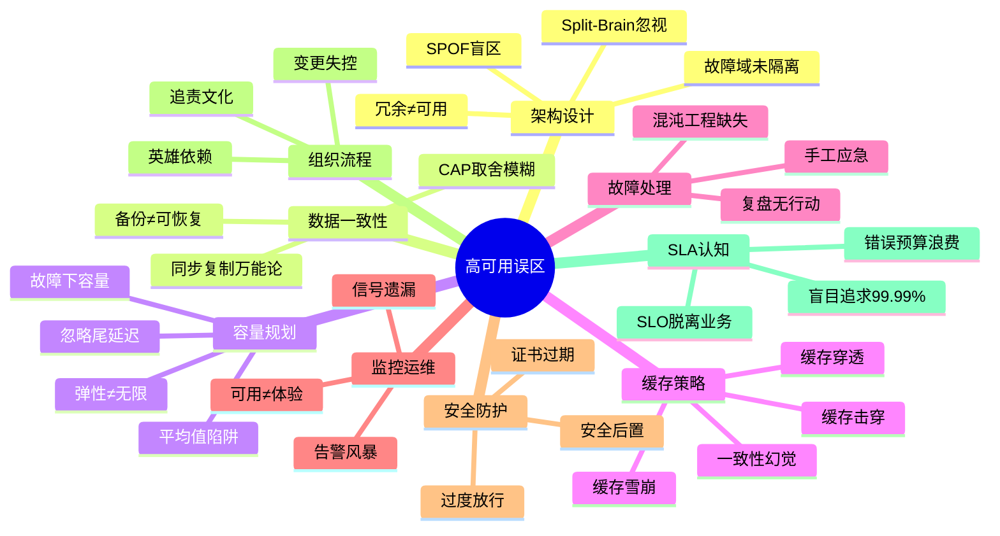

---

### 误区一：单点故障（SPOF）盲区——"我们已经做了冗余"

**错误认知：** 很多团队认为部署了多台服务器就消除了单点故障，实际上真正的 SPOF 往往藏在看不见的地方。

**为什么 SPOF 盲区如此普遍？** 根本原因是团队关注的视角过于局部——开发者关注应用层的冗余，DBA 关注数据库的主从，运维关注服务器的高可用。但没有任何一个人从端到端的全链路视角审视系统，导致"每个组件都有人管，但整条链路没人看"。

**常见隐藏 SPOF 清单：**

| 隐藏 SPOF | 典型表现 | 后果 | 真实案例 |
|-----------|---------|------|---------|
| DNS 服务器 | 只部署了单一 DNS 解析器 | 域名无法解析，全部流量丢失 | 2021年 Cloudflare DNS 配置错误导致大面积中断 |
| 负载均衡器 | 单个 Nginx/HAProxy 无热备 | 所有请求无法到达后端 | 某电商大促期间 LB 单机 OOM，全站不可用 |
| 分布式协调器 | 单节点 ZooKeeper/etcd | 集群脑裂，服务注册失效 | 某金融系统 ZK 单节点故障，全部微服务无法发现彼此 |
| 数据库连接串 | 硬编码单一数据库地址 | 主库宕机，应用无法切换 | 老系统 DB 地址写死在配置文件，主从切换后 50% 请求失败 |
| 密钥/配置中心 | 单点 Vault/KMS | 服务无法获取密钥，启动失败 | Vault 升级重启期间，所有依赖动态密钥的服务重启失败 |
| 网络交换机 | 单核心交换机 | 机架级别网络中断 | 某IDC机房核心交换机故障，整个机架 50+ 台服务器失联 |
| 时间同步 | 单 NTP 服务器 | 时间漂移导致分布式锁失效 | NTP 服务器不可达后，集群时间逐步偏移，分布式锁出现双获 |
| 消息队列 Broker | 单节点 Kafka/RabbitMQ | 异步消息全部积压，下游服务饿死 | MQ 单节点磁盘写满，订单异步处理中断 2 小时 |
| API Gateway | 单实例网关 | 所有 API 流量中断 | 某 SaaS 平台网关单点故障，所有客户 API 不可用 |

**正确做法：系统性 SPOF 检查**

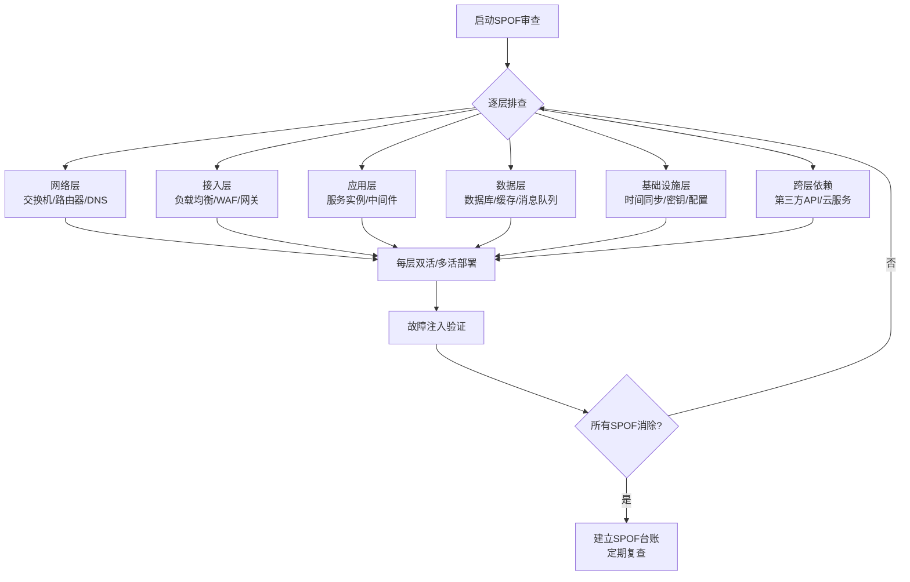

**实践方法——混沌断路测试：** 按照上述清单逐项切断每个组件，验证系统是否真的能自动恢复。Netflix 的 Chaos Monkey 正是基于这一理念：只有真正杀掉一个进程，才能确认冗余是否生效。

**关键洞察：** SPOF 审查不是一次性工作。每次架构变更（新增服务、引入中间件、调整部署拓扑）都可能引入新的 SPOF。建议将 SPOF 审查纳入架构评审流程，作为上线前的必检项。

---

### 误区二：冗余 ≠ 高可用——"部署了三个节点就安全了"

**错误认知：** 部署了多个实例就自动具备高可用能力。实际上，冗余只是高可用的必要条件，远非充分条件。

**冗余失效的典型场景：**

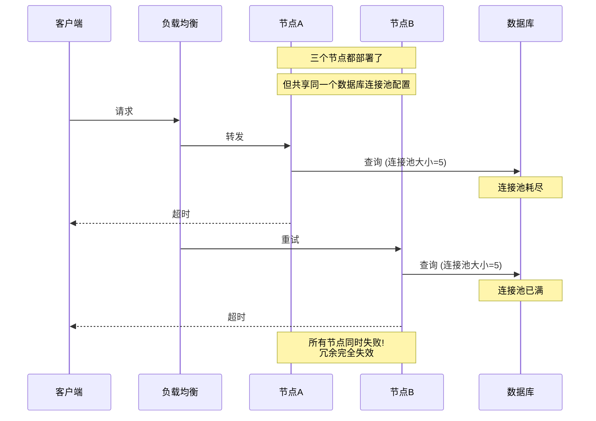

**冗余失效的四大模式：**

1. **共模故障（Common Mode Failure）：** 所有冗余节点使用相同的软件版本、相同的配置、部署在同一机架。一个 bug 或一次硬件故障同时影响所有节点。
   - *案例：* 2021年 Fastly 全球宕机，一个配置变更导致所有边缘节点同时失效。根因是配置验证逻辑的缺陷——变更通过了语法检查但触发了运行时 bug，而所有节点运行相同的验证器，所以全部中招。
   - *教训：* 冗余节点之间应有**版本差异性**，灰度发布时确保不同节点运行不同版本。

2. **共享依赖（Shared Dependency）：** 多个节点依赖同一个上游服务（如数据库、第三方 API），上游故障等同于所有节点故障。
   - *案例：* 2020年 Amazon Kinesis 事故，一个内部子系统故障引发级联雪崩，影响了 Lambda、CloudWatch、EC2 等数十个 AWS 服务。
   - *教训：* 识别所有**隐式共享依赖**，为关键依赖设计独立的降级路径。

3. **资源竞争（Resource Contention）：** 冗余节点部署在同一台物理机或共享网络带宽，物理资源成为瓶颈。
   - *案例：* 同一物理机上的多个容器在 CPU 密集型任务下互相挤压，所有实例同时变慢。
   - *教训：* 使用 Kubernetes 的 resource limits 和 pod anti-affinity 规则，确保关键服务的物理隔离。

4. **状态耦合（State Coupling）：** 节点之间共享有状态资源（如本地缓存、文件系统），节点切换后状态丢失导致服务异常。
   - *案例：* 服务依赖本地磁盘上的缓存文件，主节点宕机后新节点无缓存，冷启动导致数据库压力暴增，引发数据库雪崩。
   - *教训：* 无状态设计是高可用的基础；有状态服务必须有状态恢复/预热机制。

**正确做法：冗余有效性验证框架**

```python
# 检查清单：冗余有效性验证
def validate_redundancy(architecture):
    checks = {
        "故障域隔离": {
            "物理机分散": check_hosts_spread(architecture),
            "可用区分散": check_az_spread(architecture),
            "区域分散": check_region_spread(architecture),
            "机架分散": check_rack_spread(architecture),
        },
        "依赖独立性": {
            "数据库主从": check_db_replication(architecture),
            "缓存集群": check_cache_cluster(architecture),
            "独立DNS": check_dns_redundancy(architecture),
            "独立MQ": check_mq_redundancy(architecture),
        },
        "配置差异性": {
            "版本灰度": check_version_spread(architecture),
            "参数差异化": check_config_diversity(architecture),
            "故障注入": chaos_kill_node(architecture),
            "网络分区": chaos_network_partition(architecture),
            "延迟注入": chaos_latency_injection(architecture),
            "资源耗尽": chaos_disk_fill(architecture),
        }
    }
    return checks
```

**关键指标——冗余有效性评分：** 对每个冗余组件，计算"故障隔离度"：

故障隔离度 = (独立故障域数量) / (总冗余节点数)

- 隔离度 = 1.0：每个节点在独立的故障域中（最优）
- 隔离度 0.5-1.0：可接受，但需注意共模风险
- 隔离度 < 0.5：冗余形同虚设，需要重新规划部署拓扑

---

### 误区三：同步复制一定比异步复制好——"数据不能丢"

**错误认知：** 为了保证数据零丢失，所有场景都使用同步复制。这在很多场景下会导致性能灾难和可用性下降。

**背后的心理动因：** "数据丢失"是所有工程师的噩梦——没有人想因为数据丢失而写故障报告。这种恐惧导致团队倾向于"什么都同步"，却忽略了同步复制对可用性的直接冲击。

**同步 vs 异步复制的真实权衡：**

| 维度 | 同步复制 | 异步复制 | 半同步复制 |
|------|---------|---------|-----------|
| 数据丢失风险 | 零丢失 | 可能丢失少量数据 | 极小概率丢失 |
| 写入延迟 | 等待所有副本确认 | 不等待副本 | 等待至少一个副本 |
| 可用性影响 | 任一副本不可用则写入失败 | 不受副本状态影响 | 折中 |
| 适用场景 | 金融交易、支付记录 | 日志、浏览记录、用户行为 | 订单、库存等核心业务 |
| 典型延迟增加 | +5ms ~ +50ms（跨机房） | 几乎无额外延迟 | +2ms ~ +10ms |
| 副本故障时 | 写入直接失败 | 不受影响 | 降级为异步 |

**真实案例：同步复制的陷阱**

某银行系统对所有表启用同步复制（跨机房），某天机房间网络延迟从 2ms 飙升到 200ms（光纤链路抖动），导致：
- 所有写操作延迟从 5ms 增加到 400ms
- 应用层超时率飙升到 30%
- 部分写操作因超时被应用层重试，造成数据重复
- 最终被迫紧急降级为异步复制

**更深层的思考：同步复制的安全幻觉**

同步复制≠绝对安全。以下场景即使使用同步复制也会丢数据：
1. **脑裂场景：** 网络分区后两个分区各自接受写入，合并时数据冲突
2. **写入确认后、持久化前崩溃：** 应用收到副本确认但副本在持久化到磁盘前崩溃
3. **人为误操作：** 同步复制无法防止误删数据（DDL 操作通常不经过复制保护）
4. **应用层重试：** 超时后应用重试，但原始请求其实已成功，造成数据重复

**正确做法：分级数据保护策略**

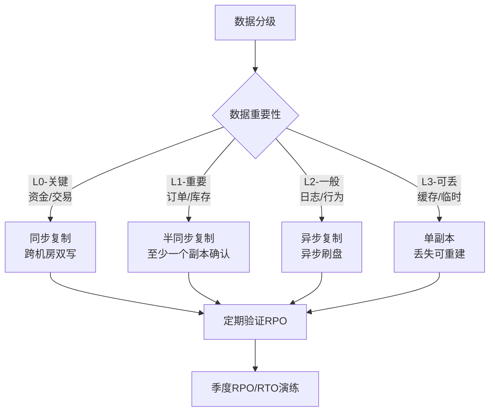

```yaml
# MySQL 半同步复制配置示例
# 主库配置
rpl_semi_sync_master_enabled = 1
rpl_semi_sync_master_timeout = 1000  # 1秒超时后降级为异步
rpl_semi_sync_master_wait_for_slave_count = 1  # 至少1个从库确认

# 从库配置
rpl_semi_sync_slave_enabled = 1

# 关键：设置超时降级，避免网络抖动导致全量阻塞
# 当从库不可达时，1秒后自动降级为异步复制
# 同时监控 semi_sync 状态，异常时告警
```

**PostgreSQL 的流复制配置参考：**

```sql
-- 主库 postgresql.conf
synchronous_commit = on
synchronous_standby_names = 'ANY 1 (standby1, standby2)'
# ANY 1 表示至少 1 个从库确认即可，兼顾安全与性能

-- 关键参数：同步提交超时
wal_receiver_timeout = 10s  -- 从库响应超时
```

---

### 误区四：备份了就等于可恢复——"我们有备份策略"

**错误认知：** 配置了定时备份任务就万事大吉。实际上，未经验证的备份等于没有备份。

**行业数据触目惊心：** 根据 Veeam 2023 年数据保护报告，全球企业中：
- 76% 的组织经历过备份恢复失败
- 平均恢复时间比预期长 3-5 倍
- 只有 24% 的企业对备份进行过完整的恢复测试

**备份失效的常见原因：**

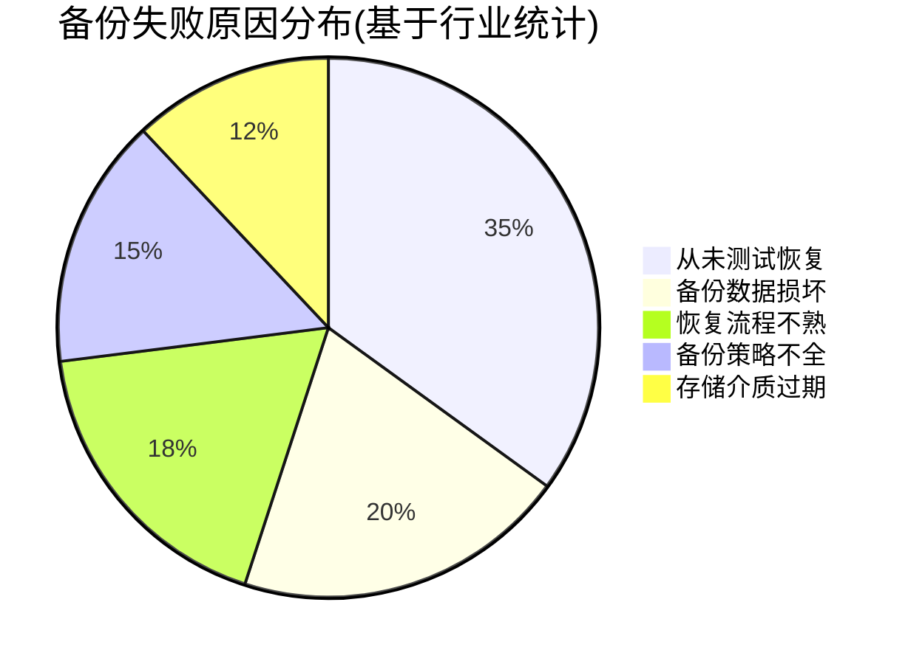

1. **备份从未验证：** 90%以上的团队从未做过完整的恢复演练。当真正需要恢复时，才发现备份文件损坏、恢复脚本有 bug、恢复步骤不完整。更可怕的是，有些团队的备份脚本本身就是有 bug 的——它"成功运行"了 3 年，但实际从未成功备份过数据。

2. **RPO/RTO 未经计算：** 不清楚"最多能丢多少数据"（RPO）和"恢复需要多久"（RTO），导致备份策略与业务需求不匹配。例如：支付系统可能需要 RPO=0（零丢失），而用户行为日志的 RPO=1h 也是可接受的。

3. **备份存储与生产同域：** 备份数据和生产数据放在同一个机房/可用区，一旦该区域灾难（火灾、断电），备份和数据一起丢失。2021年 OVHcloud 数据中心火灾导致多个客户数据永久丢失，正是因为备份在同一园区。

4. **增量备份链过长：** 长期只做增量备份，恢复时需要从第一个全量备份开始逐个应用增量，恢复时间远超预期。实际案例：某公司需要恢复 3 个月前的数据，增量链包含 90 个增量包，恢复耗时超过 12 小时。

5. **备份加密密钥丢失：** 为了安全对备份进行加密，但加密密钥和备份放在同一存储系统中。系统崩溃后，有备份但无法解密。

**正确做法：3-2-1-1-0 原则与定期恢复演练**

| 原则 | 含义 | 实施方法 |
|------|------|---------|
| 3 份副本 | 至少保留 3 份数据副本 | 生产 + 异地备份 + 冷备 |
| 2 种介质 | 使用至少 2 种不同存储介质 | 本地磁盘 + 对象存储/磁带 |
| 1 份异地 | 至少 1 份在不同地理位置 | 跨城市或跨区域备份 |
| 1 份离线/不可变 | 至少 1 份不可篡改 | WORM 存储 / 空气隔离备份 |
| 0 错误 | 验证备份完整性 | 每次备份后校验 + 定期恢复演练 |

```bash
#!/bin/bash
# 备份恢复验证脚本（每月执行一次）
# 验证步骤：下载→校验→恢复到隔离环境→验证数据完整性

BACKUP_BUCKET="s3://prod-backups"
VERIFY_DB="restore-verify-db"
TEST_TABLE="orders"
ALERT_WEBHOOK="https://hooks.slack.com/services/xxx"

echo "=== 第1步：下载最近备份 ==="
LATEST_BACKUP=$(aws s3 ls $BACKUP_BUCKET/ --recursive | sort | tail -1 | awk '{print $4}')
aws s3 cp "$BACKUP_BUCKET/$LATEST_BACKUP" /tmp/restore/

echo "=== 第2步：校验完整性 ==="
md5sum -c /tmp/restore/${LATEST_BACKUP}.md5
if [ $? -ne 0 ]; then
    echo "CRITICAL: 备份文件校验失败!"
    curl -X POST -H 'Content-type: application/json' \
        --data '{"text":"🚨 备份校验失败！文件可能已损坏"}' $ALERT_WEBHOOK
    exit 1
fi

echo "=== 第3步：恢复到隔离环境 ==="
mysql -h $VERIFY_DB < /tmp/restore/${LATEST_BACKUP}

echo "=== 第4步：数据完整性验证 ==="
SOURCE_COUNT=$(mysql -h prod-db -N -e "SELECT COUNT(*) FROM $TEST_TABLE WHERE created_at > DATE_SUB(NOW(), INTERVAL 1 DAY)")
RESTORE_COUNT=$(mysql -h $VERIFY_DB -N -e "SELECT COUNT(*) FROM $TEST_TABLE WHERE created_at > DATE_SUB(NOW(), INTERVAL 1 DAY)")

if [ "$SOURCE_COUNT" != "$RESTORE_COUNT" ]; then
    echo "CRITICAL: 数据不一致! 生产=$SOURCE_COUNT 恢复=$RESTORE_COUNT"
    exit 1
fi

echo "=== 第5步：恢复时间记录 ==="
# 记录恢复耗时，用于 RTO 评估
RESTORE_DURATION=$SECONDS
echo "恢复耗时: ${RESTORE_DURATION}秒"
echo "RTO评估: 目标RTO=3600秒, 实际=${RESTORE_DURATION}秒"

if [ $RESTORE_DURATION -gt 3600 ]; then
    echo "WARNING: 恢复时间超过目标RTO(1小时)"
fi

echo "=== 验证通过 ==="
echo "恢复数据量: $RESTORE_COUNT 条"
```

**备份恢复演练日历：**

| 频率 | 演练内容 | 目标 |
|------|---------|------|
| 每次备份 | MD5/SHA256 校验 | 确认备份文件完整性 |
| 每月 | 恢复到隔离环境 + 数据对比 | 验证备份可恢复性 |
| 每季度 | 全量恢复 + RTO 计时 | 验证恢复时间是否达标 |
| 每年 | 灾难恢复演练（跨地域） | 验证异地恢复能力 |

---

### 误区五：平均值能反映系统健康——"P50 延迟只有 10ms"

**错误认知：** 监控面板上的平均延迟和中位数看起来很健康，但用户投诉不断。原因是平均值掩盖了长尾问题。

**为什么平均值会说谎：**

假设一个服务的响应时间分布如下：

请求分布（1000次请求）：
  900次：  5ms    → 看起来很快
   90次：  50ms   → 有点慢但可接受
    9次：  500ms  → 用户开始不耐烦
    1次：  5000ms → 用户直接离开

| 指标 | 值 | 含义 |
|------|-----|------|
| 平均值 | 9.5ms | 看起来非常健康 |
| P50 | 5ms | 一半请求在 5ms 内完成 |
| P90 | 50ms | 90% 的请求在 50ms 内完成 |
| P99 | 500ms | 1% 的请求需要 500ms |
| P999 | 5000ms | 千分之一的请求需要 5秒 |

如果系统有 100 万日活用户，P999 意味着每天有 **1000 个用户** 遭遇 5 秒延迟。

**平均值陷阱的深层原因：** 平均值假设数据服从正态分布，但互联网系统的延迟分布通常是**长尾分布**（类似帕累托分布）。少数极慢请求对平均值的影响微乎其微，但对用户体验的影响是灾难性的。

**高可用系统必须关注的四个黄金指标（Google SRE）：**

| 指标 | 定义 | 为什么重要 | 典型告警阈值 |
|------|------|-----------|-------------|
| 延迟（Latency） | 请求处理耗时 | 直接影响用户体验 | P99 > SLA 的 50% |
| 流量（Traffic） | 请求速率 | 反映系统负载 | 突增/突降 > 50% |
| 错误率（Errors） | 失败请求比例 | 反映系统健康 | > 0.1%（核心服务） |
| 饱和度（Saturation） | 资源使用率 | 反映系统容量余量 | CPU > 70% / 内存 > 80% |

**正确做法：基于百分位的监控与告警**

```yaml
# Prometheus 告警规则示例
groups:
  - name: latency_alerts
    rules:
      # P99 延迟告警
      - alert: HighP99Latency
        expr: histogram_quantile(0.99, rate(http_request_duration_seconds_bucket[5m])) > 0.5
        for: 5m
        labels:
          severity: warning
        annotations:
          summary: "P99 延迟超过 500ms"
          description: "当前 P99: {{ $value | humanizeDuration }}"

      # P999 延迟告警（更敏感）
      - alert: HighP999Latency
        expr: histogram_quantile(0.999, rate(http_request_duration_seconds_bucket[5m])) > 2
        for: 3m
        labels:
          severity: critical
        annotations:
          summary: "P999 延迟超过 2秒，千分之一用户受影响"

      # 错误率告警
      - alert: HighErrorRate
        expr: rate(http_requests_total{status=~"5.."}[5m]) / rate(http_requests_total[5m]) > 0.001
        for: 3m
        labels:
          severity: critical
        annotations:
          summary: "错误率超过 0.1%"

      # 饱和度告警
      - alert: HighCPU
        expr: 100 - (avg by(instance) (irate(node_cpu_seconds_total{mode="idle"}[5m])) * 100) > 80
        for: 10m
        labels:
          severity: warning

      # 延迟突增告警（对比历史基线）
      - alert: LatencySpike
        expr: |
          histogram_quantile(0.99, rate(http_request_duration_seconds_bucket[5m]))
          > 
          histogram_quantile(0.99, rate(http_request_duration_seconds_bucket[5m] offset 1d)) * 2
        for: 5m
        labels:
          severity: warning
        annotations:
          summary: "P99延迟相比昨日同期翻倍"
```

**进阶：延迟预算（Latency Budget）管理**

Google SRE 实践中的一个关键概念——每个服务为下游调用分配延迟预算：

总延迟预算 = 100ms
├── 网络传输: 5ms
├── 负载均衡: 2ms
├── 鉴权服务: 10ms
├── 业务逻辑: 30ms
├── 数据库查询: 40ms
├── 缓存查询: 3ms
└── 序列化/反序列化: 5ms
    └── 缓冲: 5ms

每个组件必须在自己的预算内完成，超出即触发告警。这比单纯的 P99 告警更精准——它能在劣化影响用户之前就发现问题。

---

### 误区六：超时、重试、熔断配置一刀切——"所有接口统一 30 秒超时"

**错误认知：** 为简化管理，所有服务间调用使用统一的超时时间和重试策略。实际上，不同接口的特性差异巨大，一刀切的配置会导致级联故障。

**一刀切配置的危害场景：**

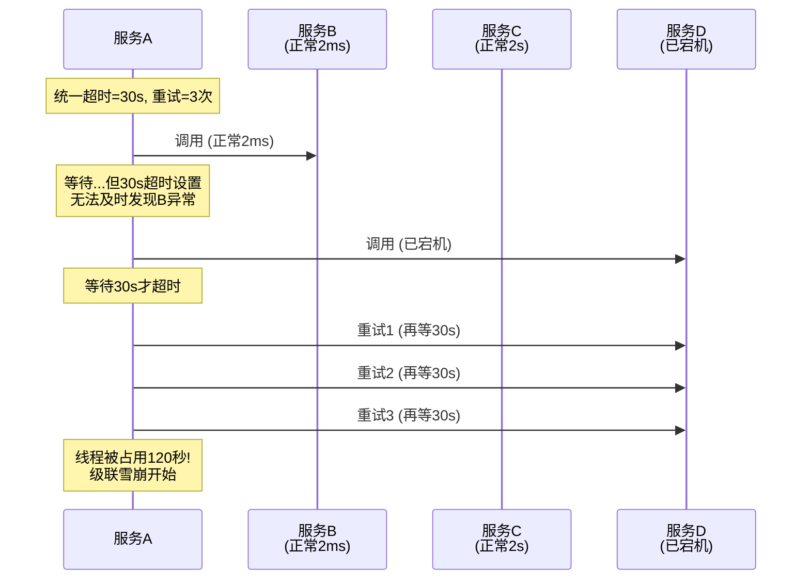

**不同接口需要不同策略：**

| 接口类型 | 超时设置 | 重试次数 | 熔断阈值 | 重试策略 |
|---------|---------|---------|---------|---------|
| 内部 RPC（查询） | 500ms | 2次 | 50% 错误率 | 指数退避+抖动 |
| 内部 RPC（写入） | 2s | 1次 | 30% 错误率 | 不重试（幂等才重试） |
| 第三方支付回调 | 10s | 0次 | 100% 错误率 | 无重试（对方保证） |
| 数据库查询 | 3s | 0次 | N/A | 不重试（加重DB负担） |
| 文件上传 | 60s | 2次 | 50% 错误率 | 断点续传 |
| 消息发送 | 5s | 3次 | 70% 错误率 | 指数退避+抖动 |

**正确做法：精细化容错配置**

```python
# 基于接口特性的差异化容错配置
class FaultToleranceConfig:
    """每个服务接口应有独立的容错配置"""
    
    CONFIGS = {
        "user.query": {
            "timeout_ms": 500,
            "retries": 2,
            "retry_backoff": "exponential",  # 100ms, 200ms, 400ms
            "circuit_breaker": {
                "failure_threshold": 5,       # 连续5次失败
                "half_open_after_s": 30,      # 30秒后尝试恢复
                "success_threshold": 3,        # 连续3次成功才关闭
            }
        },
        "order.create": {
            "timeout_ms": 2000,
            "retries": 0,                     # 写操作默认不重试
            "idempotency_key": True,          # 必须幂等
            "circuit_breaker": {
                "failure_threshold": 3,
                "half_open_after_s": 60,
            }
        },
        "payment.process": {
            "timeout_ms": 10000,
            "retries": 0,                     # 支付绝不重试
            "idempotency_key": True,
            "circuit_breaker": {
                "failure_threshold": 1,        # 一次失败就熔断
                "half_open_after_s": 120,
            }
        },
    }
```

**重试风暴的防护：**

```python
import random
import time

def retry_with_jitter(func, max_retries=3, base_delay_ms=100):
    """
    指数退避 + 随机抖动（Jitter）
    防止多个客户端同时重试造成"重试风暴"
    
    不加抖动: 100ms, 200ms, 400ms (所有客户端同时重试)
    加抖动:   100-200ms, 200-400ms, 400-800ms (请求分散)
    """
    for attempt in range(max_retries):
        try:
            return func()
        except Exception as e:
            if attempt == max_retries - 1:
                raise
            # 指数退避 + 均匀抖动
            delay = base_delay_ms * (2 ** attempt)
            jitter = random.uniform(0, delay)
            time.sleep(jitter / 1000)
```

**进阶：自适应熔断器**

传统熔断器使用固定阈值，但无法应对流量突变。自适应熔断器根据实时流量动态调整：

```python
class AdaptiveCircuitBreaker:
    """自适应熔断器：根据实时错误率和流量动态调整阈值"""
    
    def __init__(self, base_threshold=0.5, min_requests=10):
        self.base_threshold = base_threshold
        self.min_requests = min_requests
        self.request_count = 0
        self.failure_count = 0
        self.state = "closed"  # closed=正常, open=熔断, half_open=试探
        
    def record_result(self, success: bool):
        self.request_count += 1
        if not success:
            self.failure_count += 1
        
        # 流量不足时不触发熔断（避免低流量时误判）
        if self.request_count < self.min_requests:
            return
            
        failure_rate = self.failure_count / self.request_count
        
        # 流量越大，阈值越严格（高流量时容错空间更小）
        adaptive_threshold = self.base_threshold * (1 + 1 / (1 + self.request_count / 100))
        
        if failure_rate > adaptive_threshold:
            self.state = "open"
```

---

### 误区七：故障转移后不需要验证——"切换成功了就行了"

**错误认知：** 故障转移（Failover）完成后就万事大吉，不需要验证切换后的系统状态。

**为什么团队倾向于"切换完就走"？** 因为故障转移时通常处于高压状态——所有人都在等你"修好"。切换成功的那一刻，心理压力释放，团队本能地想"松口气"。但恰恰是这个时刻，最需要冷静地完成验证。

**故障转移后常见的隐性问题：**

1. **数据不一致：** 主从切换后，部分数据尚未同步到新主库。用户看到的数据与切换前不一致。
2. **连接泄漏：** 应用层持有旧主库的连接未释放，新主库连接池建立不及时，导致切换后短暂不可用。
3. **缓存脏数据：** 缓存中存储了旧主库的数据，新主库写入后缓存未失效，用户读到过期数据。
4. **定时任务重复执行：** 主从切换后，原来在旧主库上运行的定时任务可能在新主库上重新触发。
5. **自增 ID 冲突：** 双主架构切换后，两个主库的自增 ID 范围可能重叠。
6. **IP/DNS 漂移延迟：** DNS TTL 未提前调低，切换后部分客户端仍访问旧 IP。
7. **Session 丢失：** 有状态服务切换后，用户 Session 丢失，被迫重新登录。

**正确做法：故障转移验证清单**

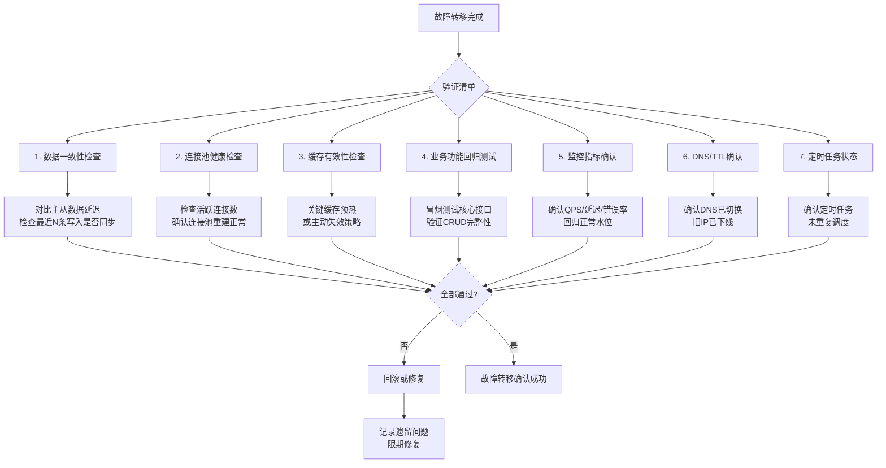

**自动验证脚本示例：**

```bash
#!/bin/bash
# 故障转移后自动验证脚本
set -e

NEW_PRIMARY="10.0.1.100"
OLD_PRIMARY="10.0.1.99"

echo "=== 故障转移验证 ==="

# 1. 检查新主库连通性
echo "[1/6] 检查新主库连通性..."
if ! mysqladmin ping -h $NEW_PRIMARY --connect-timeout=5; then
    echo "FAIL: 新主库不可达"
    exit 1
fi

# 2. 检查复制延迟
echo "[2/6] 检查复制延迟..."
SLAVE_LAG=$(mysql -h $NEW_PRIMARY -N -e "SHOW SLAVE STATUS\G" | grep Seconds_Behind_Master | awk '{print $2}')
if [ "$SLAVE_LAG" -gt 5 ]; then
    echo "WARN: 复制延迟 ${SLAVE_LAG}秒"
fi

# 3. 冒烟测试
echo "[3/6] 冒烟测试核心接口..."
for endpoint in "/api/health" "/api/user/me" "/api/order/list"; do
    STATUS=$(curl -s -o /dev/null -w "%{http_code}" "http://$NEW_PRIMARY$endpoint")
    if [ "$STATUS" != "200" ]; then
        echo "FAIL: $endpoint 返回 $STATUS"
        exit 1
    fi
done

# 4. 连接池检查
echo "[4/6] 检查连接池状态..."
ACTIVE_CONNS=$(mysql -h $NEW_PRIMARY -N -e "SHOW STATUS LIKE 'Threads_connected'" | awk '{print $2}')
echo "当前连接数: $ACTIVE_CONNS"

# 5. 旧主库状态
echo "[5/6] 检查旧主库状态..."
if mysqladmin ping -h $OLD_PRIMARY --connect-timeout=3 2>/dev/null; then
    echo "WARN: 旧主库仍然可达，请确认已摘除流量"
fi

# 6. 数据一致性抽查
echo "[6/6] 数据一致性抽查..."
SOURCE_COUNT=$(mysql -h prod-master -N -e "SELECT COUNT(*) FROM orders WHERE id > (SELECT MAX(id)-100 FROM orders)")
REPLICA_COUNT=$(mysql -h $NEW_PRIMARY -N -e "SELECT COUNT(*) FROM orders WHERE id > (SELECT MAX(id)-100 FROM orders)")
if [ "$SOURCE_COUNT" != "$REPLICA_COUNT" ]; then
    echo "FAIL: 数据不一致 生产=$SOURCE_COUNT 新主库=$REPLICA_COUNT"
    exit 1
fi

echo "=== 所有验证通过 ==="
```

---

### 误区八：告警越多越好——"一个都不能漏"

**错误认知：** 希望监控覆盖所有细节，告警规则设置得越多越细越好。结果是告警风暴淹没真正的问题。

**告警疲劳的真实代价：**


某知名互联网公司的统计：平均每天产生 3000+ 条告警，运维人员每周处理告警时间超过 20 小时，其中真正需要处理的不到 5%。关键业务告警被淹没在噪声中，平均响应时间从 5 分钟退化到 45 分钟。

**告警疲劳的心理学机制：** 当人类持续暴露在高频次的无意义刺激中，大脑会自动"降敏"——就像住在铁路旁的人不再听到火车声。这是进化赋予我们的能力，但在运维场景中是致命的。

**告警分级与治理框架：**

| 级别 | 含义 | 响应时间 | 通知方式 | 处理要求 |
|------|------|---------|---------|---------|
| P0-致命 | 服务完全不可用 | < 5分钟 | 电话 + 短信 + IM | 立即响应，全员集结 |
| P1-严重 | 核心功能受损 | < 15分钟 | 短信 + IM | 专人处理 |
| P2-警告 | 非核心功能异常 | < 1小时 | IM 通知 | 工作时间处理 |
| P3-提示 | 潜在风险 | < 24小时 | 邮件/工单 | 排期处理 |

**正确做法：告警治理四步法**

```yaml
# 告警治理原则
alert_governance:
  step1_reduce_noise:
    - "合并同源告警：相同服务、相同指标的告警聚合为一条"
    - "设置合理阈值：避免在正常波动范围内触发"
    - "排除已知维护窗口：维护期间静默相关告警"
    - "设置静默规则：已知问题的临时静默，最长不超过48小时"
    
  step2_classify:
    - "按影响范围分级：用户影响 > 业务影响 > 系统影响"
    - "按紧急程度分级：即时处理 > 延迟处理 > 仅记录"
    - "区分告警来源：自动化触发 vs 人工触发 vs 混沌工程"
    
  step3_enrich:
    - "每条告警必须包含：什么服务、什么指标、当前值、阈值、处理手册链接"
    - "避免'xxx服务异常'这类无信息量的告警"
    - "附带关联上下文：最近变更记录、相关告警、依赖服务状态"
    
  step4_review:
    - "每周回顾：告警总数趋势、误报率、响应时间"
    - "每月优化：删除无用告警、调整阈值、更新手册"
    - "季度审计：告警覆盖率 vs 实际故障发现率"
    - "告警ROI评估：每条告警的维护成本 vs 发现问题的价值"
```

**告警治理效果度量：**

| 指标 | 目标值 | 说明 |
|------|-------|------|
| 告警总量/天 | < 50条 | 减少噪声 |
| 误报率 | < 5% | 告警准确性 |
| 平均响应时间 | P0 < 5min, P1 < 15min | 响应速度 |
| 告警 → 故障映射率 | > 80% | 告警有效性 |
| 自动恢复比例 | > 30% | 自愈能力 |

---

### 误区九：安全是高可用的对立面——"安全检查太慢影响可用性"

**错误认知：** 安全措施（认证、加密、审计）会增加延迟和复杂度，与高可用目标矛盾。为了"可用性"而简化安全流程。

**安全与可用性的关系不是对立，而是共生：**

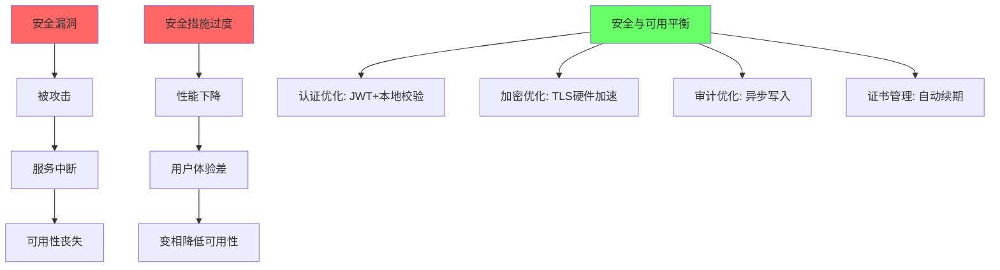

**典型的安全引发可用性事故：**

1. **证书过期导致全站不可用：** 2020年 Microsoft Teams 全球中断，根因是 TLS 证书过期。自动续期机制未正确配置。类似事件在 2023 年也发生在 Slack、Zoom 等多个知名服务上。
2. **DDoS 防护规则误杀正常流量：** WAF 规则配置不当，将正常 API 调用误判为攻击，批量拒绝。某电商在大促期间因 WAF 误判导致 40% 的正常请求被拦截。
3. **密钥轮转导致服务重启：** 密钥集中管理服务故障，所有依赖密钥的服务无法获取新密钥，全部启动失败。
4. **审计日志写满磁盘：** 审计日志未做轮转，磁盘写满后服务无法写入任何数据，被迫停机。
5. **SSL/TLS 握手风暴：** 每次请求都进行完整的 TLS 握手，在高并发下 CPU 被加密计算占满，服务响应变慢。

**正确做法：安全措施的高可用设计**

```python
# 安全与可用性并重的实践

class SecureAndAvailable:
    
    # 1. 证书管理：自动续期 + 提前告警
    CERT_CONFIG = {
        "auto_renew": True,
        "renew_before_days": 30,       # 到期前30天自动续期
        "alert_before_days": [60, 30, 14, 7, 1],  # 多级告警
        "fallback_cert_path": "/etc/ssl/fallback.pem",  # 备用证书
        "check_interval_h": 6,          # 每6小时检查一次证书状态
    }
    
    # 2. 认证：本地校验优先，减少网络依赖
    AUTH_CONFIG = {
        "jwt_local_verify": True,      # 本地公钥验证JWT，不调用认证服务
        "token_cache_ttl": 300,         # 缓存验证结果5分钟
        "degraded_auth": True,          # 认证服务不可用时降级（限流而非拒绝）
        "fallback_tokens": True,        # 预置紧急访问令牌（物理信封保存）
    }
    
    # 3. 加密：硬件加速减少性能损耗
    ENCRYPTION_CONFIG = {
        "tls_version": "1.3",          # TLS 1.3 比 1.2 快 30%
        "hardware_acceleration": True,  # 启用 AES-NI 硬件加速
        "session_resumption": True,     # TLS 会话复用，减少握手开销
        "session_ticket_ttl": 3600,     # 会话票据有效期1小时
    }
    
    # 4. 审计：异步写入，不影响主流程
    AUDIT_CONFIG = {
        "async_write": True,            # 异步写入审计日志
        "buffer_size": 10000,           # 内存缓冲区大小
        "flush_interval_s": 5,          # 5秒刷盘一次
        "log_rotation": "daily",        # 每日轮转
        "max_size_gb": 10,              # 单文件最大10GB
        "retention_days": 90,           # 保留90天
        "disk_usage_alert": 80,         # 磁盘使用率>80%告警
    }
    
    # 5. WAF：白名单优先，避免误杀
    WAF_CONFIG = {
        "mode": "allowlist",            # 白名单模式（允许已知流量）
        "rate_limit_per_ip": 1000,      # 每IP每分钟最大请求数
        "custom_rules_path": "/etc/waf/custom-rules.yaml",
        "test_mode_before_deploy": True, # 新规则先测试再部署
    }
```

---

### 误区十：故障复盘走形式——"开个会总结一下就行了"

**错误认知：** 故障发生后开个复盘会、写个文档就算完成。实际上没有行动项跟踪的复盘只是浪费时间。

**无效复盘的典型症状：**

- 复盘报告写的是"加强监控""优化代码"这类空洞结论
- 没有明确的 Action Item 负责人和截止日期
- 复盘报告写完就束之高阁，没有人跟进
- 同类故障反复发生，每次都"第一次遇到"
- 复盘变成了追责会，团队不敢暴露真实问题

**有效复盘的结构化框架：**

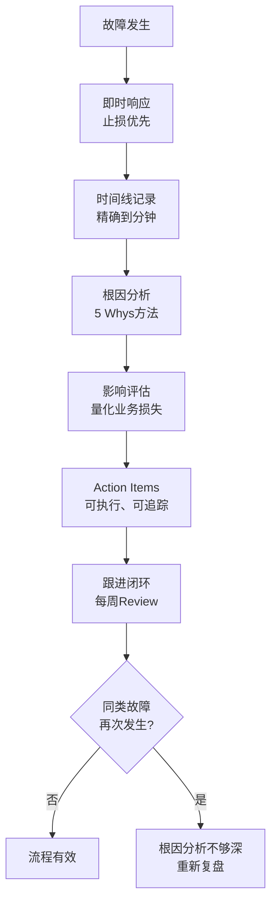

**5 Whys 分析示例：**

| 层级 | 问题 | 回答 |
|------|------|------|
| Why 1 | 为什么服务不可用？ | 数据库连接池耗尽 |
| Why 2 | 为什么连接池耗尽？ | 大量慢查询占用了连接 |
| Why 3 | 为什么出现慢查询？ | 新上线的 SQL 缺少索引 |
| Why 4 | 为什么缺少索引的 SQL 能上线？ | 没有 SQL Review 流程 |
| Why 5 | 为什么没有 SQL Review 流程？ | 团队快速增长，流程建设跟不上 |

**正确做法：Action Item 追踪模板**

```markdown
## 故障复盘 Action Items

| # | 问题根因 | 改进措施 | 负责人 | 截止日期 | 状态 | 验证方式 |
|---|---------|---------|--------|---------|------|---------|
| 1 | 缺少SQL Review | 引入SQL审核工具，PR必须通过审核 | 张三 | 2026-07-15 | 进行中 | 检查最近30个PR |
| 2 | 连接池无监控 | 添加连接池使用率告警 | 李四 | 2026-07-10 | 已完成 | 告警规则已上线 |
| 3 | 应急手册过时 | 更新Runbook，补充数据库切换步骤 | 王五 | 2026-07-20 | 未开始 | 下次演练验证 |
```

**复盘文化建设的核心原则：**

1. **Blameless（无追责）：** 复盘的目的是修复系统，不是追责个人。Google SRE 的核心原则是"假设每个人都是善意的，错误来自系统设计而非个人疏忽"。
2. **可执行（Actionable）：** 每个 Action Item 必须有明确的负责人、截止日期和验证方式。"加强监控"不是 Action Item，"为 order.create 接口添加 P99 延迟告警（阈值 2s）"才是。
3. **可量化（Measurable）：** 故障影响必须量化——影响了多少用户、持续了多长时间、造成了多少经济损失。只有量化了才能评估改进的效果。

---

### 误区十一：过度依赖单一技术栈——"我们只用 Kubernetes"

**错误认知：** 认为某个高可用技术（如 K8s、微服务、Service Mesh）能解决所有可用性问题，忽视了架构复杂度本身带来的风险。

**过度复杂化的代价：**

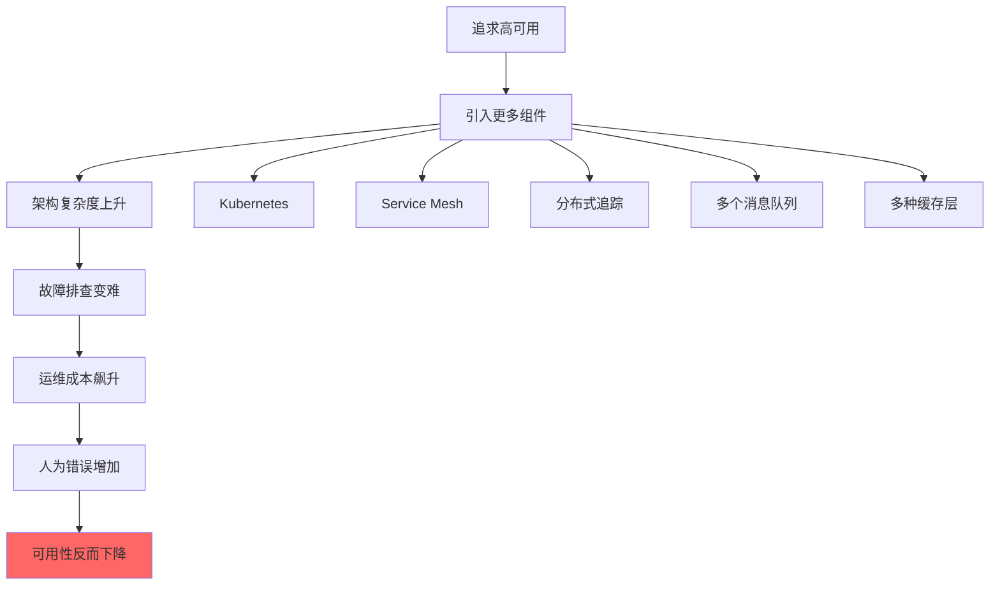

**真实案例：** 某中型团队（10人）将单体应用拆分为 40+ 微服务，引入 K8s + Istio + Jaeger + Prometheus + Grafana + ELK。结果：
- 每次部署需要协调多个服务的版本兼容性
- 一次故障平均排查时间从 30 分钟增加到 3 小时
- 运维人员 60% 的时间花在维护基础设施上
- 最终回退到简化的单体+读写分离架构，可用性反而从 99.9% 提升到 99.95%

**正确做法：根据团队规模选择架构复杂度**

| 团队规模 | 推荐架构 | 高可用手段 | 可用性目标 |
|---------|---------|-----------|-----------|
| 1-5 人 | 单体 + 主从 | 主从切换 + 进程守护 + 简单监控 | 99.9% |
| 5-15 人 | 模块化单体/少量服务 | 读写分离 + 缓存 + 基本熔断 | 99.95% |
| 15-50 人 | 微服务（适度拆分） | K8s + 负载均衡 + 分布式追踪 | 99.99% |
| 50+ 人 | 完整微服务 + Service Mesh | 多活 + 混沌工程 + AIOps | 99.99%+ |

---

### 误区十二：忽视变更管理——"改个配置而已"

**错误认知：** 小变更不需要走审批流程，直接在生产环境修改配置文件。这是导致高可用系统故障的最常见原因之一。

**变更引发故障的统计：** 根据 Google SRE 和多个行业报告，**70%以上的生产事故与变更相关**，包括代码发布、配置变更、基础设施调整、容量扩缩等。

**变更管理的防护层次：**

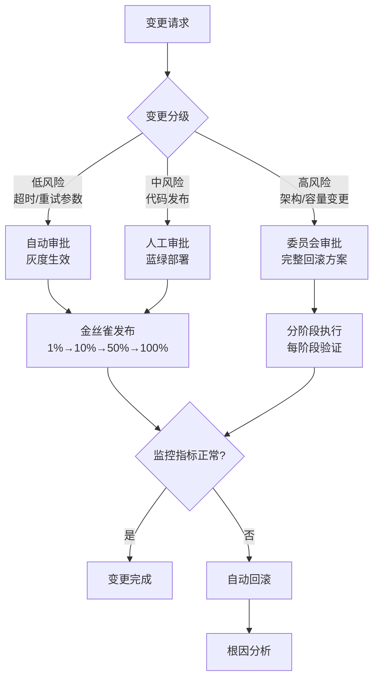

**正确做法：变更 Checklist**

□ 变更已分级（低/中/高风险）
□ 回滚方案已准备并验证
□ 变更窗口已确认（避开业务高峰）
□ 相关团队已通知
□ 监控面板已打开
□ 灰度策略已确认（金丝雀/蓝绿/滚动）
□ 变更后验证脚本已就绪
□ 变更记录已归档
□ 变更影响范围已评估（依赖服务是否受影响）
□ 数据库变更是否需要特殊处理（DDL执行窗口、数据迁移）

**真实案例：配置变更的蝴蝶效应**

某公司运维工程师在凌晨 2 点修改了一个 Nginx 配置——只改了一个 `proxy_read_timeout` 参数（从 60s 改为 30s），没有走变更流程。第二天早高峰，由于某个上游服务响应变慢（偶尔超过 30s），Nginx 开始大量返回 504 Gateway Timeout。而此时运维人员并不知道配置被修改过，花了 2 小时才定位到原因。

**教训：** 即使是"改个参数"这种小变更，也需要记录变更日志。否则当问题出现时，没有人知道系统配置发生了什么变化。

---

### 误区十三：容量规划只看平时——"平时够用就行了"

**错误认知：** 容量规划基于日常平均流量设计，只要平时能扛住就行。忽略了故障场景下容量需求会发生剧烈变化。

**故障场景下的容量放大效应：**

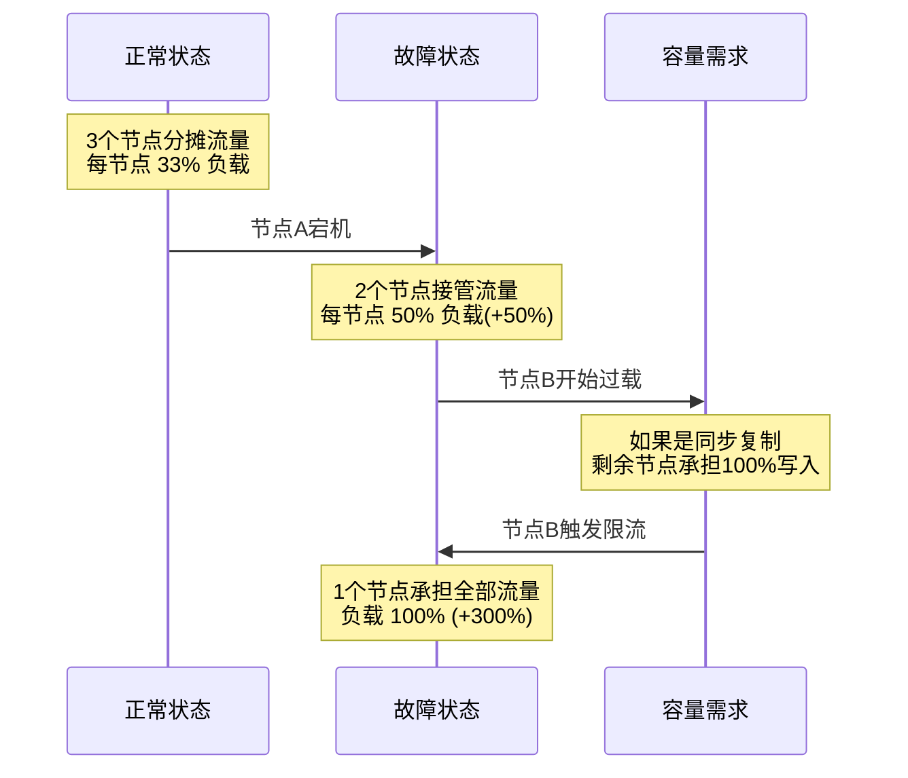

**容量放大的四种场景：**

| 场景 | 正常容量需求 | 故障时容量需求 | 放大倍数 |
|------|------------|--------------|---------|
| N节点集群，1节点宕机 | N-1 节点分摊 | N-1 节点分摊 | N/(N-1) |
| 数据库主从切换 | 读写分离，从库分担读 | 新主库承担所有读写 | 2-3x |
| 缓存失效（雪崩） | 80% 命中缓存 | 100% 打到数据库 | 5-10x |
| 依赖服务降级 | 正常调用链 | 降级逻辑可能更重 | 1.5-3x |

**正确做法：容量规划公式**

所需容量 = 正常峰值 × 故障放大系数 × 安全余量 × 增长预期

示例：
  正常峰值 QPS:     10,000
  故障放大系数:      1.5（假设3节点，允许1节点故障）
  安全余量:         1.3（预留30%余量）
  增长预期(6个月):   1.5
  
  所需容量 = 10,000 × 1.5 × 1.3 × 1.5 = 29,250 QPS

**容量压测的正确姿势：**

| 压测类型 | 目的 | 方法 |
|---------|------|------|
| 基线压测 | 确定单节点最大吞吐 | 逐步加压直到性能拐点 |
| 故障压测 | 模拟节点故障后的容量 | 杀掉节点后继续加压 |
| 级联压测 | 模拟依赖服务降级 | Mock 下游服务响应变慢 |
| 长尾压测 | 发现内存泄漏等问题 | 持续运行 24-72 小时 |
| 峰值压测 | 模拟大促等突发流量 | 瞬间注入 3-5x 正常流量 |

---

### 误区十四：缓存是万能药——"加一层缓存就解决了"

**错误认知：** 遇到性能问题就加缓存，认为缓存能解决一切读性能问题。实际上，缓存引入了一整套新的故障模式，处理不当反而加剧系统脆弱性。

**缓存的三大经典陷阱：**

1. **缓存穿透（Cache Penetration）：** 查询的数据在缓存和数据库中都不存在，每次请求都穿透缓存直达数据库。恶意用户构造大量不存在的 key 发起请求，等同于 DDoS 攻击。

2. **缓存击穿（Cache Breakdown）：** 热点 key 突然过期，大量并发请求同时涌入数据库查询同一条数据，数据库瞬间压力暴增。

3. **缓存雪崩（Cache Avalanche）：** 大量缓存 key 同时过期（或缓存服务整体宕机），所有请求瞬间打到数据库，引发数据库雪崩。

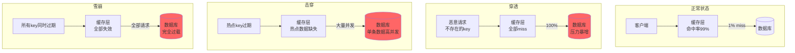

**正确做法：缓存安全设计**

```python
import hashlib
import time
import random
from functools import wraps

# 1. 防穿透：布隆过滤器 + 空值缓存
class BloomFilter:
    """布隆过滤器：快速判断key是否可能存在"""
    def __init__(self, capacity=1000000, error_rate=0.001):
        self.capacity = capacity
        self.error_rate = error_rate
        self.bit_array = [False] * capacity
        
    def add(self, key):
        for seed in range(3):
            idx = hash(f"{key}_{seed}") % self.capacity
            self.bit_array[idx] = True
    
    def might_contain(self, key):
        return all(
            self.bit_array[hash(f"{key}_{seed}") % self.capacity]
            for seed in range(3)
        )

def cache_with_null_protection(cache_client, bloom_filter):
    """带空值保护的缓存查询"""
    def wrapper(key, query_fn):
        # 1. 布隆过滤器快速拒绝
        if not bloom_filter.might_contain(key):
            return None  # 确定不存在，直接返回
        
        # 2. 查缓存
        result = cache_client.get(key)
        if result is not None:
            return result
        
        # 3. 查数据库
        result = query_fn()
        if result is None:
            # 空值缓存：防止穿透，但TTL较短
            cache_client.set(key, "NULL", ex=60)
        else:
            bloom_filter.add(key)
            cache_client.set(key, result, ex=3600)
        return result
    return wrapper

# 2. 防击穿：互斥锁（singleflight模式）
class SingleFlight:
    """确保同一个key只有一个线程去查数据库"""
    def __init__(self):
        self._in_flight = {}
        
    def do(self, key, fn):
        if key in self._in_flight:
            # 其他线程正在查询，等待结果
            return self._in_flight[key]
        
        import threading
        event = threading.Event()
        self._in_flight[key] = {"event": event, "result": None}
        
        try:
            result = fn()
            self._in_flight[key]["result"] = result
            return result
        finally:
            self._in_flight[key]["event"].set()
            del self._in_flight[key]

# 3. 防雪崩：TTL随机化 + 多级缓存 + 熔断降级
def randomized_ttl(base_ttl=3600, jitter_ratio=0.1):
    """TTL加随机抖动，避免同时过期"""
    jitter = int(base_ttl * jitter_ratio)
    return base_ttl + random.randint(-jitter, jitter)

def multi_level_cache_get(key, l1_cache, l2_cache, db_fn):
    """多级缓存：L1(本地) → L2(Redis) → DB"""
    # L1: 本地内存缓存（最快，但容量小）
    result = l1_cache.get(key)
    if result is not None:
        return result
    
    # L2: 分布式缓存
    result = l2_cache.get(key)
    if result is not None:
        l1_cache.set(key, result, ex=60)  # L1 TTL更短
        return result
    
    # DB兜底
    try:
        result = db_fn(key)
        if result is not None:
            l2_cache.set(key, result, ex=randomized_ttl())
            l1_cache.set(key, result, ex=60)
        return result
    except Exception:
        # 数据库也挂了，返回降级结果
        return get_degraded_response(key)
```

**缓存一致性策略对比：**

| 策略 | 实现方式 | 一致性 | 复杂度 | 适用场景 |
|------|---------|--------|-------|---------|
| Cache Aside | 先更新DB，再删缓存 | 最终一致 | 低 | 通用场景 |
| Read/Write Through | 缓存层代理DB读写 | 强一致 | 高 | 需要强一致的场景 |
| Write Behind | 异步写入DB | 弱一致 | 高 | 写多读少、允许丢失 |
| 延迟双删 | 更新DB后删缓存，延迟再删一次 | 最终一致 | 中 | 并发写入场景 |

---

### 误区十五：盲目追求 99.99%——"四个九才是高可用"

**错误认知：** 认为可用性目标越高越好，盲目追求 99.99%（四个九）甚至 99.999%（五个九），忽略了可用性目标与成本之间的指数关系。

**可用性等级的真实代价：**

| 可用性 | 年停机时间 | 月停机时间 | 相对成本 | 典型行业 |
|-------|----------|----------|---------|---------|
| 99%（两个九） | 3.65 天 | 7.3 小时 | 1x | 内部工具、开发环境 |
| 99.9%（三个九） | 8.76 小时 | 43.8 分钟 | 3-5x | 一般 SaaS、电商 |
| 99.95% | 4.38 小时 | 21.9 分钟 | 5-8x | 核心电商、社交 |
| 99.99%（四个九） | 52.6 分钟 | 4.38 分钟 | 10-20x | 金融支付、云服务 |
| 99.999%（五个九） | 5.26 分钟 | 26.3 秒 | 50-100x | 电信核心、医疗生命系统 |

**从三个九到四个九的成本跳跃：** 不是线性增长，而是**指数增长**。原因在于：
- 需要跨地域多活部署（至少 2 个机房）
- 需要完整的自动化故障转移（人工切换不够快）
- 需要混沌工程持续验证
- 需要 7×24 运维团队
- 需要更严格的变更管理流程

**SLO（服务级别目标）的正确制定方法：**

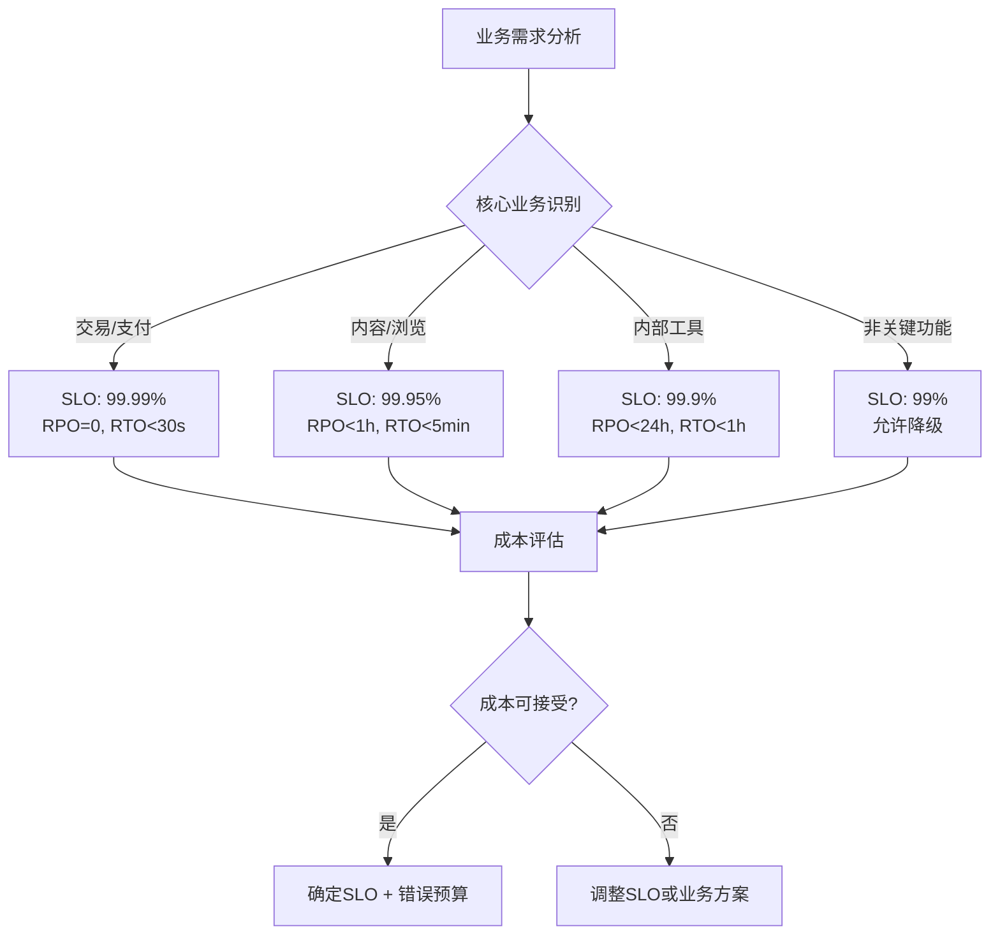

**错误预算（Error Budget）机制：** Google SRE 的核心实践——每个 SLO 对应一个错误预算。只要错误预算没用完，团队可以自由发布新功能；一旦错误预算耗尽，冻结所有变更，优先修复稳定性问题。

```yaml
# 错误预算计算示例
slo:
  target: 99.95%  # 目标可用性
  window: 30d     # 30天滚动窗口
  
  error_budget:
    total_minutes: 43200  # 30天总分钟数
    allowed_downtime: 21.6min  # 允许的停机时间
    consumed: 8.3min     # 已消耗
    remaining: 13.3min   # 剩余
    
  policy:
    when_remaining_gt_50pct: "可自由发布"
    when_remaining_20_to_50pct: "需要额外审批"
    when_remaining_lt_20pct: "冻结非关键变更"
    when_consumed: "全面冻结，优先修复稳定性"
```

**错误的 SLO 设定带来的危害：**
1. **目标过高（99.99% 但团队只有 5 人）：** 团队把所有精力花在稳定性上，无法迭代新功能，最终产品竞争力下降。
2. **目标过低（99% 但面向付费用户）：** 用户流失率上升，收入下降，最终还是得投入资源提升可用性。
3. **没有错误预算机制：** 团队要么过度保守（不敢发布），要么过度激进（频繁故障），缺乏可量化的决策依据。

---

### 误区总结与自检清单

```mermaid
graph TD
    subgraph 架构设计
        A1[✗ SPOF未排查] -.-> A2[✓ 系统性SPOF审计]
        A2 -.-> A3[✓ 混沌断路测试]
    end
    
    subgraph 冗余设计
        B1[✗ 冗余=高可用] -.-> B2[✓ 故障域隔离验证]
        B2 -.-> B3[✓ 共模故障防护]
    end
    
    subgraph 数据保护
        C1[✗ 同步复制万能] -.-> C2[✓ 分级数据保护]
        C1b[✗ 备份=可恢复] -.-> C3[✓ 定期恢复演练]
    end
    
    subgraph 监控告警
        D1[✗ 只看平均值] -.-> D2[✓ 百分位监控]
        D1b[✗ 告警越多越好] -.-> D3[✓ 告警治理]
    end
    
    subgraph 容错设计
        E1[✗ 一刀切配置] -.-> E2[✓ 差异化容错]
        E1b[✗ 切换后不验证] -.-> E3[✓ 切换验证清单]
    end
    
    subgraph 缓存安全
        F1a[✗ 缓存万能药] -.-> F2a[✓ 穿透/击穿/雪崩防护]
        F1b[✗ 容量只看平时] -.-> F2b[✓ 故障场景容量规划]
    end
    
    subgraph 安全与运维
        G1[✗ 安全对立可用] -.-> G2[✓ 安全高可用设计]
        G1b[✗ 复盘走形式] -.-> G3[✓ 结构化复盘]
        G1c[✗ 过度复杂化] -.-> G4[✓ 适度架构]
        G1d[✗ 忽视变更管理] -.-> G5[✓ 变更防护]
    end
    
    subgraph SLA认知
        H1[✗ 盲目追求99.99%] -.-> H2[✓ 基于业务的SLO]
        H1b[✗ 无错误预算] -.-> H3[✓ 错误预算机制]
    end
```

### 高可用架构自检清单

在设计和运维高可用系统时，对照以下清单逐项检查：

| 维度 | 检查项 | 状态 |
|------|-------|------|
| 架构 | 是否完成了全链路 SPOF 审计？ | □ |
| 架构 | 是否对所有冗余节点做过故障注入测试？ | □ |
| 架构 | 故障域是否真正隔离（物理机/可用区/区域）？ | □ |
| 数据 | 数据保护策略是否按业务等级差异化？ | □ |
| 数据 | 是否做过完整的备份恢复演练（RPO/RTO 验证）？ | □ |
| 监控 | 是否使用百分位延迟而非平均值？ | □ |
| 监控 | 是否覆盖四个黄金指标（延迟/流量/错误/饱和）？ | □ |
| 告警 | 是否有告警分级制度？告警数量是否在合理范围？ | □ |
| 容错 | 超时/重试/熔断是否按接口差异化配置？ | □ |
| 容错 | 是否有重试风暴防护（指数退避+抖动）？ | □ |
| 切换 | 故障转移后是否有验证清单？ | □ |
| 缓存 | 是否防护了缓存穿透/击穿/雪崩三大陷阱？ | □ |
| 缓存 | TTL 是否有随机化防雪崩？ | □ |
| 容量 | 容量规划是否考虑了故障场景的放大效应？ | □ |
| 安全 | TLS 证书是否自动续期？是否有过期告警？ | □ |
| 安全 | 密钥管理是否具备降级能力？ | □ |
| 变更 | 是否有变更分级和回滚机制？ | □ |
| 变更 | 是否所有生产变更都有记录和日志？ | □ |
| 复盘 | 故障复盘是否有可追踪的 Action Items？ | □ |
| 复盘 | 同类故障是否闭环验证？ | □ |
| SLO | 是否为每个服务定义了明确的 SLO？ | □ |
| SLO | 是否建立了错误预算机制？ | □ |

---

> **核心教训：** 高可用不是一个技术问题，而是一个**系统性工程**。它需要正确的架构设计、精细化的运维策略、持续的验证演练，以及最重要的——**承认系统一定会出故障**的心态。真正的高可用不是"永远不出故障"，而是"出了故障能快速恢复，且用户几乎无感"。
>
> 避免误区的关键不是记住每一个陷阱，而是建立**系统性的检查机制**——让正确的做法成为默认流程，而不是依赖个人记忆和经验。正如 W. Edwards Deming 所说："把事情做对是不够的，要做对的事情。"
