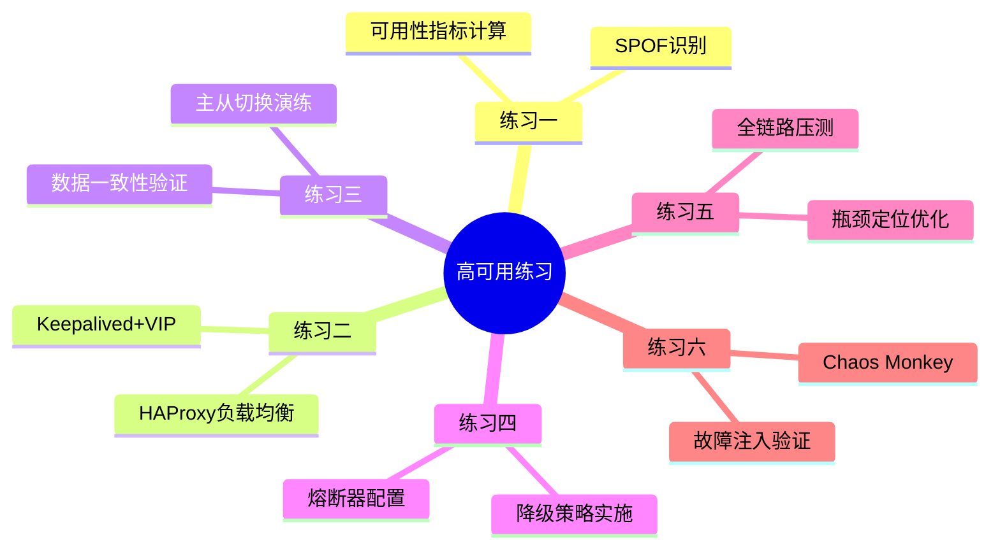
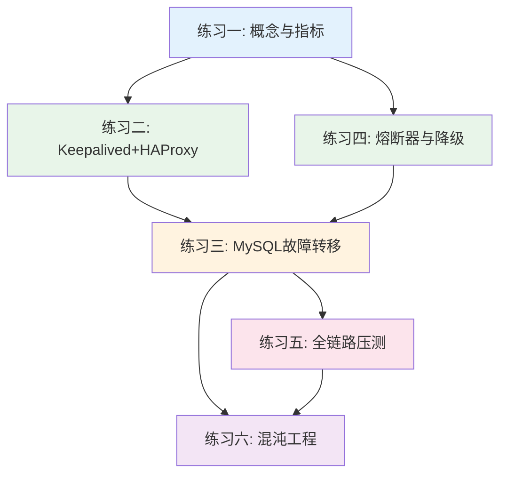

## 练习方法

### 为什么动手实践是掌握高可用架构的唯一路径

理论学习只是高可用架构的第一步，真正的掌握来自于亲手搭建、亲手破坏、亲手修复。高可用架构不是"读几篇论文就能设计出来的"——它是一门实践性极强的工程学科。原因很简单：

1. **故障是不可预测的**：你在设计文档中看到的"主从切换延迟 < 3秒"，在生产环境中可能因为网络抖动、磁盘 IO 竞争、连接池配置不当等因素变成30秒甚至3分钟。只有亲手经历过，你才能理解理论与现实之间的差距。

2. **配置的魔鬼在细节中**：Keepalived 的 `virtual_router_id` 不一致、MySQL 的 `gtid_mode` 没有在所有节点统一启用、熔断器的 `recovery_timeout` 设置过短导致频繁抖动——这些坑，只有踩过才知道。

3. **信心来自验证**：你敢在凌晨3点告诉老板"我们的系统能扛住主库宕机"吗？混沌工程的核心精神就是"通过主动注入故障来建立信心"——而信心只能来自实践。

4. **团队协作需要肌肉记忆**：当线上真的出现故障时，值班工程师需要的是条件反射般的操作能力，而不是翻阅文档的速度。反复练习能将操作步骤内化为肌肉记忆。

### 练习方法论：六步循环法

每个练习都建议按照以下六步循环来完成，这不仅仅是做实验，更是一种工程思维的训练：

┌─────────────────────────────────────────────────┐
│  1. 阅读理论 (Read)                              │
│     理解概念、原理和设计意图                        │
│         ↓                                        │
│  2. 深度理解 (Understand)                        │
│     画架构图、梳理数据流、明确边界条件               │
│         ↓                                        │
│  3. 动手复现 (Replicate)                         │
│     按步骤搭建环境、运行代码、记录输出               │
│         ↓                                        │
│  4. 主动破坏 (Break)                              │
│     注入故障、修改配置、制造异常场景                  │
│         ↓                                        │
│  5. 分析修复 (Fix)                                │
│     定位根因、实施修复、验证恢复                     │
│         ↓                                        │
│  6. 复盘反思 (Reflect)                            │
│     总结经验、记录文档、思考改进                     │
│         └─────────── 回到步骤1 ──────────┘       │
└─────────────────────────────────────────────────┘

**关键原则**：不要急于完成步骤3就跳到下一个练习。真正的收获来自步骤4（主动破坏）和步骤5（分析修复）。一个从未被破坏过的高可用架构，只是"理论上高可用"。

### 六个练习的渐进设计

本章提供六个由浅入深的实战练习，覆盖**概念理解、环境搭建、故障模拟、性能调优、架构设计、混沌工程**六大维度。练习的设计遵循渐进原则：

- **练习一（概念层）**：建立高可用的量化思维，理解"几个9"到底意味着什么
- **练习二（接入层）**：从零搭建高可用接入层，理解 VIP 漂移和负载均衡
- **练习三（数据层）**：攻克高可用中最棘手的问题——数据库故障转移
- **练习四（应用层）**：理解级联故障的成因，掌握熔断器和降级策略
- **练习五（性能层）**：从"能用"到"好用"，掌握全链路压测和瓶颈定位
- **练习六（混沌层）**：生产级混沌工程，主动注入故障验证系统韧性

每个练习都标注了预计时间、前置条件和检查标准，建议按顺序完成。如果你时间有限，至少完成练习一、二、四，它们涵盖了高可用的核心概念和关键技术。



---

### 练习一：高可用基础概念与指标计算（预计40分钟）

**目标**：能够准确计算可用性等级对应的停机时间，识别系统中的单点故障（SPOF），理解 RPO/RTO 的实际含义。

**前置条件**：无，纯理论练习。

#### 步骤一：可用性等级计算（10分钟）

可用性通常用"几个9"来表示，但很多工程师对"几个9"到底意味着多长停机时间没有直观感受。请完成以下计算表：

可用性等级计算（以年为单位，一年 = 365.25天 = 8766小时 = 525,960分钟）
1个9 (90%):   停机 = 876.6 小时  = 36.5 天/年  ≈ 每天 2.4 小时
2个9 (99%):   停机 = 87.66 小时  = 3.65 天/年  ≈ 每天 14.4 分钟
3个9 (99.9%): 停机 = 8.766 小时  = 526 分钟/年 ≈ 每周 60 分钟
4个9 (99.99%): 停机 = 52.6 分钟/年              ≈ 每周 6 分钟
5个9 (99.999%): 停机 = 5.26 分钟/年             ≈ 每周 36 秒

**计算练习**：

| 场景 | 你的计算 | 参考答案 |
|------|----------|----------|
| 电商平台承诺SLA 99.95%，一年最多允许停机多少小时？ | | 4.383小时（约4小时23分钟） |
| 金融支付系统要求99.99%，一个月最多允许停机多少分钟？ | | 4.38分钟 |
| 一个99.99%的系统每季度最多允许多少秒的故障？ | | 78.9秒 |
| 你的团队需要支撑日活500万用户，99.9%的可用性意味着每天有多少用户遇到服务不可用？ | | 5000人（按每人访问1次估算） |

#### 步骤二：SPOF 全链路排查（15分钟）

对以下架构逐层识别所有单点故障：

```mermaid
graph TB
    subgraph 用户接入
        DNS1[DNS<br/>单一解析器]
    end
    subgraph 接入层
        LB[负载均衡<br/>单个Nginx]
    end
    subgraph 应用层
        APP1[应用实例1]
        APP2[应用实例2]
        APP3[应用实例3]
    end
    subgraph 缓存层
        REDIS[(Redis<br/>单节点)]
    end
    subgraph 数据层
        MASTER[(MySQL Master)]
        SLAVE[(MySQL Slave)]
    end
    subgraph 消息层
        MQ[RabbitMQ<br/>单节点]
    end
    subgraph 基础设施
        NTP[NTP服务器<br/>单节点]
        VAULT[密钥管理<br/>单节点]
    end

    DNS1 --> LB
    LB --> APP1 &amp; APP2 &amp; APP3
    APP1 &amp; APP2 &amp; APP3 --> REDIS
    APP1 &amp; APP2 &amp; APP3 --> MASTER
    MASTER --> SLAVE
    APP1 &amp; APP2 &amp; APP3 --> MQ
```

**要求**：列出上述架构中所有隐藏和明显的 SPOF，并为每个 SPOF 给出至少一种消除方案。

**参考答案**：

| SPOF | 风险等级 | 消除方案 |
|------|----------|----------|
| DNS 单一解析器 | 🔴 致命 | 部署主从DNS + 云DNS多线解析 + 本地 /etc/hosts 缓存 |
| Nginx 单节点 | 🔴 致命 | Keepalived VIP双活 + 多台Nginx + 云SLB |
| Redis 单节点 | 🟠 高危 | Redis Sentinel（3节点）或 Redis Cluster |
| RabbitMQ 单节点 | 🟠 高危 | RabbitMQ镜像集群（3节点+） + 消息持久化 |
| MySQL 主从同步延迟 | 🟡 中等 | 半同步复制 + 自动故障转移（Orchestrator） |
| NTP 单节点 | 🟡 中等 | 多NTP源（2.pool.ntp.org等）+ chrony本地漂移校准 |
| Vault 单节点 | 🟠 高危 | Vault HA模式（Raft存储后端，3+节点） |
| 应用层共享配置文件 | 🟡 中等 | 配置中心（Consul/Nacos）+ 配置变更自动推送 |

#### 步骤三：RPO/RTO 场景匹配（15分钟）

为以下业务场景选择合适的 RPO/RTO 目标，并说明理由：

| 业务场景 | 选择 RPO | 选择 RTO | 理由 |
|----------|----------|----------|------|
| 银行核心交易系统 | | | |
| 电商订单系统 | | | |
| 社交媒体 Feed 流 | | | |
| 内部 OA 系统 | | | |
| 实时竞拍系统 | | | |

**参考答案**：

| 业务场景 | RPO | RTO | 理由 |
|----------|-----|-----|------|
| 银行核心交易 | 0（零丢失） | < 30秒 | 资金安全不可妥协，每笔交易都不能丢，同步复制+热备 |
| 电商订单 | < 1分钟 | < 5分钟 | 订单数据重要但可从日志重建，异步复制+自动切换 |
| 社交 Feed | < 5分钟 | < 30分钟 | 非结构化数据容忍短暂丢失，从缓存/日志恢复 |
| 内部 OA | < 1小时 | < 4小时 | 可用性要求相对宽松，冷备+人工恢复可接受 |
| 实时竞拍 | 0（零丢失） | < 10秒 | 竞拍数据不能丢失且需秒级恢复，多活+同步复制 |

**检查标准**：

- [ ] 能准确计算任意可用性等级对应的年度/月度/周度停机时间
- [ ] 能从架构图中识别出至少8个 SPOF（含隐藏SPOF）
- [ ] 能根据业务特征合理选择 RPO/RTO 目标并说明理由
- [ ] 理解"几个9"不是空谈，而是与真金白银的业务损失直接挂钩

#### 常见误区与陷阱

1. **SLA 不等于实际可用性**：很多团队承诺 99.99% 的 SLA，但从未做过真正的故障演练。SLA 应该是"通过实践验证过的承诺"，而不是"写在 PPT 上的数字"。没有经过混沌工程验证的 SLA 只是一厢情愿。

2. **只关注单个组件的可用性**：即使每个组件都是 99.99% 可用，串联后的整体可用性可能远低于此。例如一个5层架构，如果每层独立可用性为 99.99%，串联后只有 99.95%。必须从全链路视角看可用性。

3. **混淆 RPO 和 RTO**：RPO 关注的是"能丢多少数据"，RTO 关注的是"能停多久服务"。有些团队把两者混为一谈，导致设计出的方案要么过度投入（两方面都追求极致），要么存在盲区（只关注一个而忽略另一个）。

4. **忽视"隐藏 SPOF"**：明显的单点故障容易识别（如单一负载均衡器），但隐藏的 SPOF 更危险——比如 NTP 服务故障导致分布式系统时间不一致、密钥管理服务不可用导致新实例无法启动、配置中心宕机导致新配置无法下发。

#### 真实案例

> **2011年 Amazon EC2 大规模宕机事件**：一个网络配置变更导致大量 EC2 实例无法通信，随后 EBS（弹性块存储）出现大规模故障。由于很多公司把所有鸡蛋放在同一个 EC2 可用区里，Netflix、Reddit、Quora 等知名服务同时中断。这次事件让业界深刻认识到：单一可用区本身就是 SPOF，跨可用区部署不是可选项，而是必选项。

---

### 练习二：Keepalived + HAProxy 搭建高可用接入层（预计90分钟）

**目标**：搭建一套 Keepalived + HAProxy 双活高可用接入层，实现虚拟IP（VIP）漂移和后端健康检查，亲手验证主节点宕机后 VIP 自动切换。

**前置条件**：
- 两台 Linux 服务器（或两台虚拟机），建议 Ubuntu 20.04+，各 2GB 内存以上
- root 或 sudo 权限
- 两台服务器之间网络互通

**环境规划**：

| 角色 | IP | VIP |
|------|-----|-----|
| HAProxy-1（Master） | 192.168.1.101 | 192.168.1.200（VIP） |
| HAProxy-2（Backup） | 192.168.1.102 | 同上 |
| 后端 Web-1 | 192.168.1.201 | - |
| 后端 Web-2 | 192.168.1.202 | - |

#### 步骤一：安装 Keepalived（15分钟）

**在两台 HAProxy 服务器上分别执行：**

```bash
# 安装 Keepalived
sudo apt-get update &amp;&amp; sudo apt-get install -y keepalived

# 启用IP转发和VIP所需的内核参数
cat >> /etc/sysctl.conf << 'EOF'
net.ipv4.ip_nonlocal_bind = 1
net.ipv4.ip_forward = 1
EOF
sudo sysctl -p

# 验证安装
keepalived --version
```

#### 步骤二：配置 Keepalived（20分钟）

**在 Master（192.168.1.101）上配置：**

```bash
cat > /etc/keepalived/keepalived.conf << 'EOF'
global_defs {
    router_id HA_MASTER
    script_user root
    enable_script_security
}

# 健康检查脚本：检测 HAProxy 是否存活
vrrp_script check_haproxy {
    script "/usr/bin/killall -0 haproxy"  # 返回0表示haproxy在运行
    interval 2                             # 每2秒检查一次
    weight -20                             # 失败时降低优先级
    fall 3                                 # 连续3次失败才判定
    rise 2                                 # 连续2次成功才恢复
}

vrrp_instance VI_1 {
    state MASTER                          # 主节点
    interface eth0                        # 网卡名（用 ip addr 确认）
    virtual_router_id 51                  # 主备必须相同
    priority 101                          # Master优先级 > Backup
    advert_int 1                          # VRRP通告间隔1秒

    authentication {
        auth_type PASS
        auth_pass 1234                    # 主备必须相同
    }

    virtual_ipaddress {
        192.168.1.200/24                  # VIP地址
    }

    # 健康检查脚本关联
    track_script {
        check_haproxy
    }

    # 状态切换时执行的脚本
    notify_master "/etc/keepalived/scripts/notify.sh master"
    notify_backup "/etc/keepalived/scripts/notify.sh backup"
    notify_fault  "/etc/keepalived/scripts/notify.sh fault"
}
EOF
```

**在 Backup（192.168.1.102）上配置（仅修改标记部分）：**

```bash
# 与Master配置的差异点：
#   state BACKUP        ← 改为BACKUP
#   priority 100        ← 优先级低于Master
cat > /etc/keepalived/keepalived.conf << 'EOF'
global_defs {
    router_id HA_BACKUP
    script_user root
    enable_script_security
}

vrrp_script check_haproxy {
    script "/usr/bin/killall -0 haproxy"
    interval 2
    weight -20
    fall 3
    rise 2
}

vrrp_instance VI_1 {
    state BACKUP
    interface eth0
    virtual_router_id 51
    priority 100
    advert_int 1

    authentication {
        auth_type PASS
        auth_pass 1234
    }

    virtual_ipaddress {
        192.168.1.200/24
    }

    track_script {
        check_haproxy
    }

    notify_master "/etc/keepalived/scripts/notify.sh master"
    notify_backup "/etc/keepalived/scripts/notify.sh backup"
    notify_fault  "/etc/keepalived/scripts/notify.sh fault"
}
EOF
```

**创建状态切换通知脚本（两台机器都执行）：**

```bash
mkdir -p /etc/keepalived/scripts

cat > /etc/keepalived/scripts/notify.sh << 'SCRIPT'
#!/bin/bash
# Keepalived状态切换通知脚本
STATE=$1
HOSTNAME=$(hostname)
DATE=$(date '+%Y-%m-%d %H:%M:%S')

case $STATE in
    master)
        echo "[$DATE] MASTER: $HOSTNAME 已切换为MASTER节点" >> /var/log/keepalived-state.log
        # 可选：发送告警通知（邮件/钉钉/飞书）
        # curl -X POST "https://your-webhook-url" -d "{\"text\": \"VIP已切换至 $HOSTNAME\"}"
        ;;
    backup)
        echo "[$DATE] BACKUP: $HOSTNAME 已切换为BACKUP节点" >> /var/log/keepalived-state.log
        ;;
    fault)
        echo "[$DATE] FAULT: $HOSTNAME 进入FAULT状态" >> /var/log/keepalived-state.log
        ;;
esac
SCRIPT

chmod +x /etc/keepalived/scripts/notify.sh
```

#### 步骤三：安装和配置 HAProxy（20分钟）

```bash
# 安装 HAProxy
sudo apt-get install -y haproxy

# 配置 HAProxy（两台机器配置相同）
cat > /etc/haproxy/haproxy.cfg << 'EOF'
global
    log /dev/log local0
    log /dev/log local1 notice
    maxconn 4096
    user haproxy
    group haproxy
    daemon

defaults
    log     global
    mode    http
    option  httplog
    option  dontlognull
    option  forwardfor
    option  http-server-close
    timeout connect 5000ms
    timeout client  50000ms
    timeout server  50000ms
    retries 3

# 前端：接收客户端请求（绑定VIP）
frontend http_front
    bind 0.0.0.0:80
    bind 0.0.0.0:443 ssl crt /etc/haproxy/certs/  # 如有SSL证书
    default_backend web_servers

# 后端：Web服务器池
backend web_servers
    balance roundrobin                   # 轮询负载均衡
    option httpchk GET /health           # 健康检查路径
    
    # 后端Web服务器列表
    server web1 192.168.1.201:80 check inter 3000 rise 2 fall 3 weight 1
    server web2 192.168.1.202:80 check inter 3000 rise 2 fall 3 weight 1
    
    # 健康检查参数说明：
    # inter 3000  — 每3秒检查一次
    # rise 2      — 连续2次成功才标记为可用
    # fall 3      — 连续3次失败才标记为不可用
    # weight 1    — 权重（可用于灰度发布）

# HAProxy统计页面
listen stats
    bind *:8404
    stats enable
    stats uri /stats
    stats refresh 10s
    stats auth admin:your_password_here
EOF

# 验证配置文件语法
haproxy -c -f /etc/haproxy/haproxy.cfg
# 输出: Configuration file is valid

# 启动 HAProxy
sudo systemctl enable haproxy
sudo systemctl restart haproxy
```

#### 步骤四：启动并验证高可用（20分钟）

```bash
# === 在两台机器上启动 Keepalived ===
sudo systemctl enable keepalived
sudo systemctl restart keepalived

# === 验证VIP已绑定到Master ===
# 在Master上执行：
ip addr show eth0 | grep 192.168.1.200
# 应该看到: inet 192.168.1.200/24 scope global eth0

# === 测试负载均衡 ===
for i in $(seq 1 10); do
    curl -s http://192.168.1.200/ | grep "Server:"
done
# 应该看到交替返回 web1 和 web2

# === 测试VIP漂移（模拟Master故障）===
# 在Master上停止Keepalived：
sudo systemctl stop keepalived

# 等待5秒，在Backup上检查：
ip addr show eth0 | grep 192.168.1.200
# VIP应该已经漂移到Backup节点

# 在Backup上查看状态切换日志：
tail -5 /var/log/keepalived-state.log
# 应该看到: MASTER: backup-hostname 已切换为MASTER节点

# 验证服务仍然可用：
curl -s http://192.168.1.200/ | head -5
# 服务应该正常响应
```

#### 步骤五：故障恢复验证（15分钟）

```bash
# 在原Master上重新启动Keepalived：
sudo systemctl start keepalived

# 由于Master优先级(101) > Backup优先级(100)，VIP会切回Master
# 观察VIP漂移过程：
watch -n 1 "ip addr show eth0 | grep 192.168.1.200"

# 查看切换日志：
# Master日志: MASTER: master-hostname 已切换为MASTER节点
# Backup日志: BACKUP: backup-hostname 已切换为BACKUP节点

# 访问HAProxy统计页面确认后端状态：
# 浏览器打开 http://192.168.1.200:8404/stats
# 观察所有后端server的状态（应为绿色UP）
```

**检查标准**：

- [ ] 两台 HAProxy + Keepalived 均正常启动
- [ ] VIP 绑定在 Master 节点上
- [ ] 负载均衡将请求均匀分发到两个后端
- [ ] 停止 Master 的 Keepalived 后，VIP 在5秒内漂移到 Backup
- [ ] VIP 漂移后服务不中断（或中断时间 < 3秒）
- [ ] Master 恢复后 VIP 自动切回
- [ ] 状态切换通知日志正确记录

**进阶挑战**：

- 配置 HAProxy 支持 HTTPS（自签证书即可）
- 实现"抢占模式"与"非抢占模式"的对比
- 添加 keepalived 的 nopreempt 配置，观察行为差异

#### 常见误区与陷阱

1. **脑裂（Split-Brain）问题**：当网络分区发生时，两台 Keepalived 节点可能同时认为自己是 Master，导致两个节点同时持有 VIP。这会造成 ARP 表混乱，客户端请求被随机路由到任一节点，甚至两个节点的 HAProxy 状态不同步导致请求失败。**解决方案**：使用 `nopreempt` 配置非抢占模式，配合仲裁机制（如第三方检查节点），或使用云环境的弹性 IP 替代 VIP。

2. **VIP 地址冲突**：如果 `virtual_router_id` 配置不一致，两个节点会各自持有不同的 VIP，负载均衡完全失效。另一个常见错误是在同一个局域网中 `virtual_router_id` 与其他 Keepalived 实例冲突。**解决方案**：确保主备节点的 `virtual_router_id` 完全一致，且在局域网内唯一。

3. **组播（Multicast）vs 单播（Unicast）选择不当**：默认情况下 Keepalived 使用组播通信（224.0.0.18），但在云环境（AWS、阿里云等）中组播通常不被支持，导致 VRRP 通告无法送达，切换失败。**解决方案**：在云环境中必须使用 `unicast_src_ip` 和 `unicast_peer` 配置单播通信。

4. **健康检查脚本的误判**：`killall -0 haproxy` 只检查进程是否存在，不检查 HAProxy 是否真正能正常处理请求。如果 HAProxy 进程存活但连接数耗尽或后端全部不可用，Keepalived 不会触发切换。**解决方案**：使用 HTTP 健康检查脚本（如 `curl -s http://localhost:8080/health`）替代简单的进程检查。

5. **通知脚本执行权限问题**：notify 脚本如果没有执行权限，状态切换时不会报错但也不会执行通知。在生产环境中这会导致运维团队无法感知 VIP 切换。**解决方案**：始终使用 `chmod +x` 赋予执行权限，并在脚本中添加 `set -e` 和日志记录。

#### 故障排查指南

| 故障现象 | 排查方向 | 具体操作 |
|----------|----------|----------|
| VIP 无法绑定 | 内核参数/网卡名 | `ip addr` 确认网卡名；检查 `net.ipv4.ip_nonlocal_bind=1` 是否生效 |
| VIP 在两个节点间反复漂移 | 健康检查误判/网络抖动 | 查看 `dmesg` 和 `/var/log/syslog` 中 Keepalived 日志；调大 `fall` 值 |
| HAProxy 无法绑定 VIP | HAProxy 绑定地址 | 确保 `bind 0.0.0.0:80` 而非绑定具体 IP；或配置 `bind *:80` |
| 后端全部显示 DOWN | 健康检查路径/网络 | 从 HAProxy 节点 `curl` 后端健康检查路径；检查防火墙规则 |
| 切换后客户端连接中断 | ARP 缓存 | 客户端可能缓存了旧的 MAC 地址；发送免费 ARP 加速刷新 |
| 高并发下 VIP 漂移变慢 | VRRP 优先级配置 | 检查 `advert_int` 和 `weight` 配置；确保优先级差值合理（建议 ≥ 10） |

#### 工具生态速览

Keepalived + HAProxy 是经典组合，但在不同场景下有更合适的替代方案：

**负载均衡替代方案**：

| 工具 | 特点 | 适用场景 |
|------|------|----------|
| **Nginx** | 七层负载均衡，配置灵活，社区活跃 | 传统 Web 应用、反向代理 |
| **Traefik** | 云原生，自动服务发现，内置 Let's Encrypt | Kubernetes/Docker 环境 |
| **Envoy** | 云原生 L4/L7 代理，丰富的可观测性 | Service Mesh（Istio）、微服务 |
| **云 SLB** | 托管服务，免运维，弹性伸缩 | 云环境首选，省去 Keepalived 的复杂度 |

**高可用切换替代方案**：

| 工具 | 特点 | 适用场景 |
|------|------|----------|
| **Pacemaker + Corosync** | 企业级资源管理器，支持复杂资源约束 | 传统数据中心、数据库集群 |
| **云 SLB + 健康检查** | 无需 VIP 漂移，云平台自动故障转移 | 云环境首选 |
| **DNS 轮询 + 健康检查** | 简单轻量，但 TTL 导致切换慢 | 对切换速度要求不高的场景 |

#### 真实案例

> **2020年某电商平台双十一大促故障**：大促期间单台 Nginx 的连接数突破 65535 上限，导致新连接无法建立。由于 Keepalived 的健康检查只检查 HAProxy 进程存活，没有检查实际连接数，VIP 没有漂移，所有用户请求堆积在一台节点上。**教训**：健康检查必须检查应用层的真实处理能力，而非仅检查进程是否存活。

---

### 练习三：MySQL 主从故障转移演练（预计75分钟）

**目标**：搭建 MySQL 主从复制环境，模拟主库宕机场景，完成手动和自动故障转移，并验证数据一致性。

**前置条件**：
- 两台 Linux 服务器，已安装 MySQL 8.0
- 了解 MySQL 基本操作

**环境规划**：

| 角色 | IP | 端口 |
|------|-----|------|
| MySQL Master | 192.168.1.10 | 3306 |
| MySQL Slave | 192.168.1.11 | 3306 |
| VIP | 192.168.1.20 | 3306 |

#### 步骤一：搭建主从复制（20分钟）

**Master 配置（192.168.1.10）：**

```ini
# /etc/mysql/mysql.conf.d/mysqld.cnf
[mysqld]
server-id = 1
log-bin = mysql-bin
binlog-format = ROW
binlog-expire-logs-seconds = 604800    # 7天自动清理
sync_binlog = 1                         # 每次事务后同步binlog
gtid-mode = ON                          # 启用GTID（推荐）
enforce-gtid-consistency = ON
```

```sql
-- 创建复制用户
CREATE USER 'repl'@'192.168.1.11' IDENTIFIED BY 'Repl@2026!';
GRANT REPLICATION SLAVE ON *.* TO 'repl'@'192.168.1.11';
FLUSH PRIVILEGES;

-- 确认Master状态
SHOW MASTER STATUS;
-- +------------------+----------+--------------+------------------+-------------------------------------------+
-- | File             | Position | Binlog_Do_DB | Binlog_Ignore_DB | Executed_Gtid_Set                         |
-- +------------------+----------+--------------+------------------+-------------------------------------------+
-- | mysql-bin.000003 |      856 |              |                  | 3e11fa47-71ca-11e1-9e33-c80aa9429562:1-5 |
-- +------------------+----------+--------------+------------------+-------------------------------------------+
```

**Slave 配置（192.168.1.11）：**

```ini
# /etc/mysql/mysql.conf.d/mysqld.cnf
[mysqld]
server-id = 2
relay-log = relay-bin
read-only = ON                          # 从库只读（防止误写）
super-read-only = ON
```

```sql
-- 配置主从关系（使用GTID自动定位）
CHANGE MASTER TO
    MASTER_HOST = '192.168.1.10',
    MASTER_USER = 'repl',
    MASTER_PASSWORD = 'Repl@2026!',
    MASTER_AUTO_POSITION = 1;

START SLAVE;

-- 检查复制状态（两个关键字段都必须为Yes）
SHOW SLAVE STATUS\G
-- Slave_IO_Running: Yes
-- Slave_SQL_Running: Yes
-- Seconds_Behind_Master: 0    ← 复制延迟
```

#### 步骤二：写入测试数据（10分钟）

```sql
-- 在Master上创建测试表和数据
CREATE DATABASE IF NOT EXISTS ha_test;
USE ha_test;

CREATE TABLE orders (
    id BIGINT AUTO_INCREMENT PRIMARY KEY,
    order_no VARCHAR(32) NOT NULL,
    amount DECIMAL(10,2) NOT NULL,
    status ENUM('pending','paid','shipped') DEFAULT 'pending',
    created_at TIMESTAMP DEFAULT CURRENT_TIMESTAMP
) ENGINE=InnoDB;

-- 插入1000条测试数据
INSERT INTO orders (order_no, amount, status)
SELECT 
    CONCAT('ORD', LPAD(seq, 8, '0')),
    ROUND(RAND() * 10000, 2),
    ELT(FLOOR(RAND() * 3) + 1, 'pending', 'paid', 'shipped')
FROM (
    SELECT @rownum := @rownum + 1 AS seq 
    FROM information_schema.columns a, information_schema.columns b, (SELECT @rownum := 0) r
    LIMIT 1000
) t;

-- 在Slave上验证数据已同步
SELECT COUNT(*) FROM ha_test.orders;
-- 应返回 1000

-- 记录最后几条数据（用于故障转移后验证）
SELECT * FROM ha_test.orders ORDER BY id DESC LIMIT 5;
```

#### 步骤三：手动故障转移演练（20分钟）

```bash
# === 模拟Master宕机 ===
ssh master "sudo systemctl stop mysql"

# === 在Slave上确认Master不可达 ===
SHOW SLAVE STATUS\G
-- Slave_IO_Running: Connecting  ← IO线程无法连接Master

# === 手动执行故障转移（在Slave上） ===
# 停止从库复制
STOP SLAVE;
RESET SLAVE ALL;

# 提升为Master
SET GLOBAL read_only = OFF;
SET GLOBAL super_read_only = OFF;

# 验证新Master可写
INSERT INTO ha_test.orders (order_no, amount, status) 
VALUES ('EMERGENCY-001', 9999.99, 'paid');
-- Query OK, 1 row affected
```

#### 步骤四：自动故障转移——使用 Orchestrator（25分钟）

Orchestrator 是开源的 MySQL 高可用拓扑管理工具，支持自动故障检测和转移。

```bash
# === 安装 Orchestrator（在独立节点上） ===
# 下载最新版本
wget https://github.com/openark/orchestrator/releases/latest/download/orchestrator-community-linux-amd64.tar.gz
tar xzf orchestrator-community-linux-amd64.tar.gz
sudo mv orchestrator /usr/local/bin/

# === 配置 Orchestrator ===
mkdir -p /etc/orchestrator /var/log/orchestrator

cat > /etc/orchestrator/orchestrator.conf.json << 'EOF'
{
    "Debug": false,
    "ListenAddress": ":3000",
    "MySQLTopologyUser": "orchestrator",
    "MySQLTopologyPassword": "Orch@2026!",
    "MySQLTopologyCredentialsConfigFile": "",
    "MySQLOrchestratorHost": "localhost",
    "MySQLOrchestratorPort": 3306,
    "MySQLOrchestratorDatabase": "orchestrator",
    "InstancePollIntervalSeconds": 3,
    "DiscoverByShowSlaveHosts": true,
    "RecoverMasterClusterFilters": ["*"],
    "RecoverIntermediateMasterClusterFilters": ["*"],
    "OnFailureDetectionProcesses": [
        "echo '{successor} detected as {successorType} of {failed} ({failureType}) at {timestamp}' >> /var/log/orchestrator/detection.log"
    ],
    "PostFailoverProcesses": [
        "echo 'Failover from {failed} to {successor} completed successfully' >> /var/log/orchestrator/failover.log"
    ],
    "PostUnsuccessfulFailoverProcesses": [
        "echo 'FAILOVER FAILED: {failed} → {successor}' >> /var/log/orchestrator/failover.log"
    ]
}
EOF
```

```sql
-- 在MySQL中创建Orchestrator用户（Master和Slave上都要创建）
CREATE USER 'orchestrator'@'%' IDENTIFIED BY 'Orch@2026!';
GRANT SUPER, PROCESS, REPLICATION SLAVE, REPLICATION CLIENT, RELOAD ON *.* TO 'orchestrator'@'%';
GRANT SELECT ON meta.* TO 'orchestrator'@'%';
GRANT ALL PRIVILEGES ON orchestrator.* TO 'orchestrator'@'%';
FLUSH PRIVILEGES;
```

```bash
# === 启动 Orchestrator ===
# 初始化数据库
/usr/local/bin/orchestrator -config /etc/orchestrator/orchestrator.conf.json -text

# 启动服务（后台运行）
nohup /usr/local/bin/orchestrator \
    -config /etc/orchestrator/orchestrator.conf.json \
    > /var/log/orchestrator/orchestrator.log 2>&amp;1 &amp;

# === 发现拓扑 ===
# 注册Master节点
curl -s "http://localhost:3000/api/discover/192.168.1.10/3306"
# 返回: {"Code":"OK","Message":"Discover executed"}

# 等待30秒后查看拓扑
curl -s "http://localhost:3000/api/cluster/cluster-127.0.0.1/instance/192.168.1.10/3306" | python3 -m json.tool

# 也可以通过Web界面查看拓扑：
# 浏览器打开 http://localhost:3000
```

```bash
# === 模拟Master故障，观察Orchestrator自动转移 ===

# 1. 停止Master的MySQL
ssh 192.168.1.10 "sudo systemctl stop mysql"

# 2. 观察Orchestrator日志（等待约15-30秒）
tail -f /var/log/orchestrator/detection.log
# 192.168.1.11:3306 detected as CandidateMaster of 192.168.1.10:3306 (DeadMaster)

tail -f /var/log/orchestrator/failover.log
# Failover from 192.168.1.10:3306 to 192.168.1.11:3306 completed successfully

# 3. 验证新的Master
mysql -h 192.168.1.11 -e "SHOW MASTER STATUS\G"
# 确认已切换为Master

mysql -h 192.168.1.11 -e "INSERT INTO ha_test.orders (order_no, amount, status) VALUES ('AUTO-FAILOVER-001', 8888.88, 'paid')"
# 确认可写

# 4. 验证数据一致性
mysql -h 192.168.1.11 -e "SELECT COUNT(*) FROM ha_test.orders"
# 应该包含所有之前的数据 + 新插入的数据

# 5. 通过Web界面查看Orchestrator拓扑变化
# 浏览器打开 http://localhost:3000 — 192.168.1.11 应显示为 Master
```

**检查标准**：

- [ ] 主从复制正常建立（IO/SQL线程均为Yes）
- [ ] 测试数据在主从之间正确同步
- [ ] 手动故障转移后新Master可正常读写
- [ ] Orchestrator 自动检测到主节点故障
- [ ] Orchestrator 自动完成故障转移（< 30秒）
- [ ] 故障转移后数据完整无丢失
- [ ] 故障转移日志正确记录

#### 常见误区与陷阱

1. **GTID 间隙（GTID Gap）导致复制中断**：在使用 GTID 模式时，如果某些事务在主库执行但从未被从库接收（例如主库在事务执行期间宕机），从库恢复后会因为找不到对应的 GTID 事务而报错。这在使用 Orchestrator 故障转移后尤为常见——新的从库可能缺少部分事务。**解决方案**：定期检查 `gtid_subtract()` 差异，使用 `orchestrator` 的 `relocate` 功能自动修复拓扑。

2. **写入高峰期的复制延迟**：在主库执行大批量写入（如 `INSERT ... SELECT`、大事务）时，从库的回放延迟可能从0秒飙升到数十秒。此时如果主库宕机，Orchestrator 可能将延迟较大的从库提升为新主库，导致部分数据丢失。**解决方案**：配置半同步复制（`rpl_semi_sync_master_enabled=1`），确保至少一个从库确认收到 binlog 后主库才返回事务提交成功。

3. **Orchestrator 自身的高可用问题**：Orchestrator 依赖后端 MySQL 存储元数据，如果存储 Orchestrator 元数据的 MySQL 也宕机了，整个自动故障转移机制就瘫痪了。**解决方案**：使用 Orchestrator 的 Raft 模式部署多实例，确保 Orchestrator 自身也是高可用的。

4. **老主库"复活"导致双写**：故障转移后，如果原主库只是暂时不可达（网络分区），恢复后可能以 Master 身份继续接受写入，导致"双写"——两个节点同时接受写入，数据分叉。**解决方案**：故障转移时对原主库执行 `iptables` 封禁其写入权限，或使用 Orchestrator 的 `DeadMaster` 恢复策略自动处理。

5. **从库 `read_only` 被意外关闭**：某些运维脚本可能在从库上执行了 `SET GLOBAL read_only=OFF`，导致应用程序误写入从库。在故障转移时，这些"脏数据"会成为新主库的数据，造成主从数据不一致。**解决方案**：使用 `super_read_only=ON`（不仅普通用户，SUPER 权限用户也无法写入），并在配置文件中持久化。

#### 故障排查指南

| 故障现象 | 排查方向 | 具体操作 |
|----------|----------|----------|
| Slave_IO_Running: Connecting | 网络/账号/防火墙 | 检查复制用户权限、3306 端口连通性、`SHOW SLAVE STATUS` 中的 Last_IO_Error |
| Slave_SQL_Running: No | 从库数据冲突/DDL报错 | 查看 `Last_SQL_Error`；常见原因是主键冲突或表不存在 |
| Seconds_Behind_Master 持续增大 | 大事务/从库性能 | 检查主库慢查询日志；检查从库磁盘 IO 和 CPU |
| Orchestrator 不触发自动转移 | 拓扑发现失败 | 检查 Orchestrator 的 `DiscoverByShowSlaveHosts` 配置；手动执行 `/api/discover` |
| 故障转移后数据丢失 | 半同步未启用/复制延迟 | 检查转移前 `Seconds_Behind_Master`；评估是否需要半同步复制 |
| GTID 复制报错 | GTID 间隙 | 执行 `SELECT GTID_SUBTRACT('@@global.gtid_executed', ...)` 检查差异 |

#### 工具生态速览

MySQL 高可用的工具生态远比本练习使用的组合丰富，了解全貌有助于做出更好的架构决策：

| 工具 | 类型 | 特点 | 适用场景 |
|------|------|------|----------|
| **Orchestrator** | 拓扑管理+自动故障转移 | Web 界面、Raft 多实例、丰富的恢复策略 | 中大规模 MySQL 集群 |
| **MHA (Master High Availability)** | 故障转移 | 日本 DeNA 开发，轻量级，但已停止维护 | 小型集群（新项目不推荐） |
| **MySQL Group Replication** | 原生多主/单主复制 | MySQL 8.0 原生支持，基于 Paxos 协议 | 新建集群首选 |
| **InnoDB Cluster** | 集成方案 | Group Replication + MySQL Router + MySQL Shell | 云原生 MySQL 高可用 |
| **ProxySQL** | 读写分离+查询路由 | 丰富的查询路由规则，连接池，查询缓存 | 复杂读写分离场景 |

> **建议**：对于新项目，优先考虑 InnoDB Cluster 或 MySQL Group Replication。Orchestrator 适合已有的异步复制架构升级。MHA 已停止维护，不建议新项目使用。

#### 真实案例

> **2017年某社交平台数据库故障**：凌晨3点，主库所在物理机的 RAID 控制器固件 bug 导致磁盘阵列离线，数据库进程被 OOM Killer 终止。由于之前从未做过故障转移演练，值班工程师在慌乱中手动执行了 `RESET SLAVE ALL`，导致从库丢失了所有复制元数据。最终从备份恢复，丢失了约45分钟的数据（RPO=45分钟），服务中断2小时（RTO=2小时）。**教训**：故障转移操作必须经过充分演练，且必须有自动化的故障转移工具，不能依赖人工操作。

---

### 练习四：熔断器与降级策略实战（预计70分钟）

**目标**：理解级联故障的成因，动手实现熔断器（Circuit Breaker）和优雅降级策略，亲手验证熔断器如何阻止雪崩效应。

**前置条件**：
- 本地已安装 Python 3.8+ 和 pip
- 了解基本的 HTTP 服务开发

#### 核心原理：熔断器模式

在动手实现之前，我们需要深入理解熔断器（Circuit Breaker）模式的核心原理。

**起源与背景**

熔断器模式最早由 Michael T. Nygard 在《Release It!》一书中提出，后经 Martin Fowler 在其经典博客文章 "Circuit Breaker" 中系统化阐述。该模式的灵感来源于家庭电路中的保险丝——当电流过大时，保险丝自动熔断以保护整个电路。在软件系统中，熔断器的作用类似：当下游服务出现故障时，自动"熔断"调用链路，防止故障向上游扩散，避免级联失败（Cascading Failure）。

**状态机模型**

熔断器是一个典型的状态机，包含三种状态：

        ┌─────────────────────────────────────┐
        │                                     │
        │    成功次数达到阈值                    │
        │    ┌──────────┐                     │
        │    ↓          │                     │
  ┌─────────────┐  ┌─────────────┐  ┌─────────────┐
  │   CLOSED    │──│    OPEN     │──│  HALF_OPEN   │
  │  （正常放行）│  │（快速拒绝）  │  │（探测放行）  │
  └─────────────┘  └─────────────┘  └─────────────┘
        ↑                ↑                │
        │                │                │
        │         失败次数达到阈值          │
        │                │        超时后自动进入
        │                │                │
        │                └────────────────┘
        │                                     │
        └───── 探测成功：恢复正常运行 ─────────┘
                    探测失败：回到 OPEN

**三种状态详解**：

1. **CLOSED（关闭/正常）**：系统正常运行，所有请求都通过熔断器转发到下游服务。熔断器持续监控失败次数和失败率。当连续失败次数达到预设阈值（如5次）时，熔断器状态切换为 OPEN。

2. **OPEN（打开/熔断）**：熔断器已触发，所有请求都被立即拒绝（快速失败），不再尝试调用下游服务。这保护了上游服务的线程池和连接池不会被耗尽。经过预设的超时时间（如30秒）后，熔断器自动进入 HALF_OPEN 状态。

3. **HALF_OPEN（半开/探测）**：熔断器放行少量请求（如1-3个）到下游服务进行探测。如果探测请求全部成功，说明下游服务已恢复，熔断器切回 CLOSED 状态；如果探测请求仍然失败，熔断器切回 OPEN 状态，重新开始计时。

**从 Netflix Hystrix 到 Resilience4j 的演进**

Netflix 在2012年开源了 Hystrix 熔断器库，它在微服务架构早期被广泛使用，是"熔断器模式"的标杆实现。Hystrix 引入了线程池隔离、信号量隔离、Fallback 降级等概念，深刻影响了后续的熔断器设计。

然而，随着响应式编程和非阻塞架构的兴起，Hystrix 的线程池隔离模型暴露了局限性。2018年 Netflix 宣布 Hystrix 进入维护模式。Resilience4j 作为其继任者，基于 Java 8 的函数式编程和装饰器模式，提供了更轻量、更灵活的实现，支持 Resilient4j、Sentinel（阿里开源）、Polly（.NET 生态）等。

**熔断器在真实系统中的价值**

以一个典型的电商微服务架构为例：用户下单 → 订单服务 → 库存服务 → 价格服务 → 支付服务。如果支付服务出现故障（如第三方支付网关超时），没有熔断器的情况下，每个请求都会在支付服务上等待超时（如10秒），导致订单服务的线程池迅速耗尽，进而导致库存服务、价格服务也因为线程池耗尽而不可用——这就是"雪崩效应"。有了熔断器，订单服务在检测到支付服务连续失败后，立即快速拒绝后续请求，返回"支付暂时不可用，请稍后重试"的友好提示，保护了自身和上游服务的可用性。

#### 步骤一：搭建模拟微服务环境（20分钟）

创建一个包含故障注入能力的微服务模拟环境：

```python
# server.py — 模拟微服务链路
import time
import random
import threading
from http.server import HTTPServer, BaseHTTPRequestHandler
import json

# 全局状态：是否注入故障
fault_injected = False
request_count = 0
lock = threading.Lock()

class ServiceHandler(BaseHTTPRequestHandler):
    def do_GET(self):
        global fault_injected, request_count
        
        if self.path == '/health':
            self._respond(200, {"status": "UP"})
            return
        
        if self.path == '/toggle-fault':
            fault_injected = not fault_injected
            self._respond(200, {"fault_injected": fault_injected})
            return
        
        if self.path == '/stats':
            with lock:
                self._respond(200, {
                    "requests": request_count,
                    "fault_injected": fault_injected
                })
            return
        
        # 模拟业务接口
        with lock:
            request_count += 1
        
        if fault_injected:
            # 模拟高延迟（5秒超时）
            time.sleep(5)
            self._respond(503, {"error": "Service Unavailable"})
        else:
            # 正常响应（5ms）
            time.sleep(0.005)
            self._respond(200, {"result": "success", "data": random.randint(1, 100)})
    
    def _respond(self, status, data):
        self.send_response(status)
        self.send_header('Content-Type', 'application/json')
        self.end_headers()
        self.wfile.write(json.dumps(data).encode())
    
    def log_message(self, format, *args):
        pass  # 静默日志

if __name__ == '__main__':
    port = int(__import__('sys').argv[1]) if len(__import__('sys').argv) > 1 else 8080
    server = HTTPServer(('0.0.0.0', port), ServiceHandler)
    print(f"Service running on port {port}")
    server.serve_forever()
```

```python
# circuit_breaker.py — 熔断器实现
import time
import threading
from enum import Enum
from typing import Callable, Any

class CircuitState(Enum):
    CLOSED = "CLOSED"         # 正常：所有请求通过
    OPEN = "OPEN"             # 熔断：拒绝所有请求
    HALF_OPEN = "HALF_OPEN"   # 半开：放行少量探测请求

class CircuitBreaker:
    """
    熔断器实现（参考 Martin Fowler 的 Circuit Breaker 模式）
    
    三种状态的转换：
    CLOSED → OPEN:   失败次数达到阈值
    OPEN → HALF_OPEN: 超时后自动进入半开
    HALF_OPEN → CLOSED: 探测请求成功
    HALF_OPEN → OPEN:   探测请求失败
    """
    
    def __init__(self, 
                 failure_threshold=5,    # 触发熔断的连续失败次数
                 recovery_timeout=30,    # 熔断持续时间（秒）
                 half_open_max_calls=3): # 半开状态的最大探测请求数
        self.failure_threshold = failure_threshold
        self.recovery_timeout = recovery_timeout
        self.half_open_max_calls = half_open_max_calls
        
        self.state = CircuitState.CLOSED
        self.failure_count = 0
        self.success_count = 0
        self.last_failure_time = 0
        self.half_open_calls = 0
        self.total_requests = 0
        self.total_failures = 0
        self.total_rejected = 0
        self.lock = threading.Lock()
    
    def call(self, func: Callable, *args, **kwargs) -> Any:
        """通过熔断器执行函数调用"""
        with self.lock:
            self.total_requests += 1
            
            # 检查是否需要从OPEN切换到HALF_OPEN
            if self.state == CircuitState.OPEN:
                if time.time() - self.last_failure_time >= self.recovery_timeout:
                    print(f"[CIRCUIT] OPEN → HALF_OPEN (after {self.recovery_timeout}s cooldown)")
                    self.state = CircuitState.HALF_OPEN
                    self.half_open_calls = 0
                    self.success_count = 0
                else:
                    self.total_rejected += 1
                    raise CircuitOpenError(
                        f"Circuit is OPEN. {self.failure_threshold} consecutive failures. "
                        f"Will retry after {self.recovery_timeout}s."
                    )
            
            # 半开状态限制探测请求数
            if self.state == CircuitState.HALF_OPEN:
                if self.half_open_calls >= self.half_open_max_calls:
                    # 判断探测结果
                    if self.success_count >= self.half_open_max_calls:
                        print(f"[CIRCUIT] HALF_OPEN → CLOSED (probe succeeded)")
                        self.state = CircuitState.CLOSED
                        self.failure_count = 0
                    else:
                        print(f"[CIRCUIT] HALF_OPEN → OPEN (probe failed)")
                        self.state = CircuitState.OPEN
                        self.last_failure_time = time.time()
                    self.half_open_calls = 0
                    self.success_count = 0
                    return self.call(func, *args, **kwargs)
                self.half_open_calls += 1
        
        # 执行调用
        try:
            result = func(*args, **kwargs)
            self._on_success()
            return result
        except Exception as e:
            self._on_failure()
            raise
    
    def _on_success(self):
        with self.lock:
            if self.state == CircuitState.HALF_OPEN:
                self.success_count += 1
            elif self.state == CircuitState.CLOSED:
                self.failure_count = 0  # 重置连续失败计数
    
    def _on_failure(self):
        with self.lock:
            self.total_failures += 1
            self.failure_count += 1
            self.last_failure_time = time.time()
            
            if self.state == CircuitState.CLOSED:
                if self.failure_count >= self.failure_threshold:
                    print(f"[CIRCUIT] CLOSED → OPEN (failures: {self.failure_count}/{self.failure_threshold})")
                    self.state = CircuitState.OPEN
            elif self.state == CircuitState.HALF_OPEN:
                print(f"[CIRCUIT] HALF_OPEN → OPEN (probe failed)")
                self.state = CircuitState.OPEN
    
    def get_stats(self):
        return {
            "state": self.state.value,
            "total_requests": self.total_requests,
            "total_failures": self.total_failures,
            "total_rejected": self.total_rejected,
            "failure_count": self.failure_count,
            "failure_rate": f"{self.total_failures/self.total_requests*100:.1f}%" if self.total_requests > 0 else "0%",
        }


class CircuitOpenError(Exception):
    pass
```

#### 步骤二：模拟无熔断器的级联故障（15分钟）

```python
# cascade_without_breaker.py — 没有熔断器时的级联故障
import requests
import time
import threading

SERVICE_URL = "http://localhost:8080"

def simulate_request(request_id):
    """模拟一次请求"""
    try:
        start = time.time()
        resp = requests.get(f"{SERVICE_URL}/data", timeout=10)
        elapsed = time.time() - start
        return {"id": request_id, "status": resp.status_code, "time": f"{elapsed:.2f}s"}
    except requests.Timeout:
        return {"id": request_id, "status": "TIMEOUT", "time": "10.00s"}
    except Exception as e:
        return {"id": request_id, "status": "ERROR", "time": str(e)}

def run_without_breaker():
    """无熔断器：所有请求都会等待超时"""
    print("\n=== 无熔断器：级联故障模拟 ===")
    print(f"模拟100个并发请求，服务端已注入故障（响应延迟5秒）\n")
    
    results = {"success": 0, "timeout": 0, "error": 0, "total_time": 0}
    threads = []
    
    start = time.time()
    
    for i in range(100):
        t = threading.Thread(target=lambda idx=i: results.update(
            {**simulate_request(idx), "count": results.get("success", 0) + 1}
        ))
        threads.append(t)
    
    # 所有线程同时启动
    for t in threads:
        t.start()
    
    # 等待所有线程完成（最长等待60秒）
    for t in threads:
        t.join(timeout=60)
    
    total_time = time.time() - start
    print(f"总耗时: {total_time:.1f}秒")
    print(f"预期: 100个请求 × 10秒超时 = 如果串行需要1000秒")
    print(f"实际: {total_time:.1f}秒（所有请求并发等待超时）")
    print(f"\n关键问题: 所有线程都被阻塞在超时等待中!")
    print(f"如果这是Web服务器的工作线程池，新请求将无法处理！")

# 先启动server
# python3 server.py 8080 &amp;
# 然后注入故障
# curl http://localhost:8080/toggle-fault
# 最后运行此脚本
# python3 cascade_without_breaker.py
```

#### 步骤三：使用熔断器保护系统（20分钟）

```python
# cascade_with_breaker.py — 有熔断器时的优雅降级
import requests
import time
import threading
import sys
sys.path.insert(0, '.')
from circuit_breaker import CircuitBreaker, CircuitOpenError

SERVICE_URL = "http://localhost:8080"

# 创建熔断器
breaker = CircuitBreaker(
    failure_threshold=5,       # 5次失败后熔断
    recovery_timeout=30,       # 30秒后尝试恢复
    half_open_max_calls=3      # 半开状态放3个探测请求
)

def call_service_with_breaker(request_id):
    """通过熔断器调用服务"""
    def _do_request():
        resp = requests.get(f"{SERVICE_URL}/data", timeout=2)
        if resp.status_code != 200:
            raise Exception(f"HTTP {resp.status_code}")
        return resp.json()
    
    try:
        start = time.time()
        result = breaker.call(_do_request)
        elapsed = time.time() - start
        return {"id": request_id, "status": "OK", "time": f"{elapsed:.2f}s", "circuit": breaker.get_stats()["state"]}
    except CircuitOpenError as e:
        return {"id": request_id, "status": "REJECTED (Circuit Open)", "time": "0.00s", "circuit": "OPEN"}
    except Exception as e:
        return {"id": request_id, "status": f"ERROR: {e}", "circuit": breaker.get_stats()["state"]}

def run_with_breaker():
    """有熔断器：快速失败 + 优雅降级"""
    print("\n=== 有熔断器：优雅降级演示 ===")
    print(f"模拟发送请求，服务端已注入故障\n")
    
    # Phase 1: 正常请求（服务正常）
    print("--- Phase 1: 服务正常（关闭熔断器）---")
    # 先关闭故障
    requests.get(f"{SERVICE_URL}/toggle-fault")
    time.sleep(1)
    
    for i in range(5):
        result = call_service_with_breaker(i)
        print(f"  请求 {i}: {result['status']} | 耗时: {result['time']} | 熔断状态: {result['circuit']}")
    
    # Phase 2: 注入故障
    print("\n--- Phase 2: 注入故障（服务变慢+503）---")
    requests.get(f"{SERVICE_URL}/toggle-fault")
    time.sleep(1)
    
    for i in range(15):
        result = call_service_with_breaker(i)
        print(f"  请求 {i}: {result['status']} | 耗时: {result['time']} | 熔断状态: {result.get('circuit', 'N/A')}")
    
    # Phase 3: 熔断后快速失败
    print("\n--- Phase 3: 熔断生效，快速失败 ---")
    for i in range(10):
        result = call_service_with_breaker(i)
        print(f"  请求 {i}: {result['status']} | 耗时: {result['time']} | 熔断状态: {result.get('circuit', 'N/A')}")
    
    # Phase 4: 等待恢复
    print(f"\n--- Phase 4: 等待 {breaker.recovery_timeout} 秒后自动恢复 ---")
    print(f"  等待中...")
    time.sleep(breaker.recovery_timeout)
    
    print("\n--- Phase 4b: 探测恢复 ---")
    for i in range(5):
        result = call_service_with_breaker(i)
        print(f"  请求 {i}: {result['status']} | 耗时: {result['time']} | 熔断状态: {result.get('circuit', 'N/A')}")
    
    # 打印最终统计
    print("\n=== 熔断器统计 ===")
    stats = breaker.get_stats()
    for k, v in stats.items():
        print(f"  {k}: {v}")
    
    print("\n=== 关键对比 ===")
    print("  无熔断器: 100个请求全部等待10秒超时 → 线程池耗尽 → 级联雪崩")
    print("  有熔断器: 连续5次失败后快速拒绝 → 保护线程池 → 系统存活")

if __name__ == '__main__':
    run_with_breaker()
```

#### 步骤四：实现优雅降级策略（15分钟）

```python
# graceful_degradation.py — 多级降级策略
import requests
import time
import json

class DegradationManager:
    """
    优雅降级策略：三级降级
    
    Level 0 (正常):    完整功能，调用远程服务
    Level 1 (轻度降级): 降级到缓存数据，延迟数据更新
    Level 2 (中度降级): 仅保留核心功能，非核心功能关闭
    Level 3 (重度降级): 返回静态兜底页，提示用户稍后重试
    """
    
    def __init__(self):
        self.current_level = 0
        self.cache = {}  # 简化版缓存
        
    def get_product_price(self, product_id):
        """获取商品价格（演示多级降级）"""
        
        if self.current_level >= 3:
            # Level 3: 重度降级，返回兜底页
            return {
                "status": "degraded",
                "level": 3,
                "message": "系统繁忙，请稍后重试",
                "fallback_price": None
            }
        
        if self.current_level >= 2:
            # Level 2: 中度降级，返回缓存价格（可能过期）
            cached = self.cache.get(product_id, {"price": 99.99, "source": "cache"})
            cached["source"] = "cache_degraded"
            cached["warning"] = "价格可能未更新"
            return cached
        
        if self.current_level >= 1:
            # Level 1: 轻度降级，优先缓存，异步更新
            cached = self.cache.get(product_id)
            if cached:
                cached["source"] = "cache_async_refresh"
                return cached
        
        # Level 0: 正常调用远程服务
        try:
            resp = requests.get(f"http://price-service:8081/price/{product_id}", timeout=2)
            data = resp.json()
            self.cache[product_id] = data  # 更新缓存
            data["source"] = "live"
            return data
        except Exception:
            # 远程失败时自动降一级
            self.current_level = 1
            return self.get_product_price(product_id)  # 重试（现在用缓存）
    
    def degrade(self):
        """手动升级降级等级"""
        self.current_level = min(self.current_level + 1, 3)
        print(f"[DEGRADE] 降级至 Level {self.current_level}")
    
    def recover(self):
        """恢复降级等级"""
        self.current_level = max(self.current_level - 1, 0)
        print(f"[RECOVER] 恢复至 Level {self.current_level}")

# 使用示例
dm = DegradationManager()

print("=== 优雅降级演示 ===\n")

# 正常状态
print("Level 0 (正常):", dm.get_product_price("P001"))

# 逐步降级
dm.degrade()
print("Level 1 (缓存降级):", dm.get_product_price("P001"))

dm.degrade()
print("Level 2 (核心降级):", dm.get_product_price("P001"))

dm.degrade()
print("Level 3 (完全降级):", dm.get_product_price("P001"))

# 逐步恢复
dm.recover()
dm.recover()
dm.recover()
print("\n恢复后:", dm.get_product_price("P001"))
```

**检查标准**：

- [ ] 熔断器实现正确，能经历 CLOSED → OPEN → HALF_OPEN → CLOSED 的完整状态循环
- [ ] 能清晰观察到：无熔断器时线程全部阻塞，有熔断器时快速失败
- [ ] 熔断器的失败计数、拒绝计数等统计指标正确
- [ ] 降级策略能根据故障等级返回不同级别的响应
- [ ] 理解熔断器与重试策略的配合：指数退避 + 抖动

#### 常见误区与陷阱

1. **线程安全问题**：熔断器的状态（failure_count、state 等）是多线程共享的。如果 `call()` 方法中的状态检查和修改不是原子操作（如本练习使用 `threading.Lock`），在高并发下会出现竞态条件——两个线程同时看到 failure_count=4，各自递增后都变成5，但只触发一次熔断。实际生产中，更推荐使用 `threading.RLock`（可重入锁）或无锁的 CAS 操作。**解决方案**：确保所有状态修改都在锁内完成，或使用 `atomic` 原子操作库。

2. **重试风暴（Retry Storm）**：当熔断器从 OPEN 切换到 HALF_OPEN 时，所有被阻塞的请求会同时涌向下游服务，形成"重试风暴"。如果下游服务刚刚恢复但还未完全稳定，这波流量可能再次将其压垮，导致熔断器重新打开。**解决方案**：在 HALF_OPEN 状态下限制探测请求的速率（如使用令牌桶），而不是让所有等待请求同时放行。

3. **级联超时（Cascading Timeouts）**：即使有了熔断器，如果调用方的超时时间设置不合理（如调用方超时10秒，但熔断器的 recovery_timeout 只有5秒），会出现调用方还在等待响应，但熔断器已经进入 HALF_OPEN 并开始探测的情况。**解决方案**：确保 `调用方超时 < 熔断器 recovery_timeout`，且调用方超时应小于下游服务的 P99 延迟的合理倍数。

4. **半开状态的探测请求不足**：如果 `half_open_max_calls` 设置为1，单次探测成功就恢复 CLOSED 状态，但下游服务可能只是"短暂恢复"——这种"假阳性"会导致熔断器反复在 HALF_OPEN 和 CLOSED 之间切换，产生"熔断器抖动"。**解决方案**：将 `half_open_max_calls` 设置为3-5，并要求连续多次成功才恢复 CLOSED 状态。

5. **降级策略的"降级疲劳"**：如果降级逻辑设计不当（如 Level 1 降级仍然调用了另一个可能也不稳定的服务），会导致降级本身也失败，系统在多个降级级别之间反复跳转。**解决方案**：每个降级级别的数据源必须是独立的、确定性的（如本地缓存、静态配置），避免降级链路上出现新的不稳定依赖。

#### 故障排查指南

| 故障现象 | 排查方向 | 具体操作 |
|----------|----------|----------|
| 熔断器未触发（OPEN） | 阈值配置 | 检查 `failure_threshold` 和 `failure_count` 是否正确递增；检查锁是否生效 |
| 熔断器频繁抖动 | 阈值过低/recovery 太短 | 增大 `failure_threshold`（如5→10）；增大 `recovery_timeout`（如30→60） |
| HALF_OPEN 恢复太快 | 探测数量不足 | 增大 `half_open_max_calls`；要求更高比例的成功率 |
| 降级后仍返回错误 | 降级数据源不可用 | 检查 Level 1 的缓存是否已预热；检查 Level 3 的兜底页面是否正确部署 |
| 熔断器状态异常（统计不准） | 竞态条件/计数器溢出 | 检查线程锁是否正确使用；检查 `total_requests` 是否在锁内递增 |
| 调用方感知到长延迟 | 超时配置不合理 | 确保调用方超时 < 下游超时；确保熔断器在超时前就能触发拒绝 |

#### 工具生态速览

本练习从零实现了熔断器，但在生产环境中建议使用成熟的开源库：

| 工具 | 语言/生态 | 特点 | 状态 |
|------|-----------|------|------|
| **Resilience4j** | Java | 轻量级、函数式设计、支持 Circuit Breaker/Rate Limiter/Retry/Bulkhead | 活跃维护 |
| **Sentinel** | Java（阿里开源） | 丰富的流控规则、Dashboard、支持 Dubbo/Spring Cloud | 活跃维护 |
| **Polly** | .NET | .NET 生态首选，支持 Circuit Breaker/Retry/Timeout/Bulkhead | 活跃维护 |
| **Hystrix** | Java（Netflix） | 微服务熔断器的"鼻祖"，线程池隔离模型 | ⚠️ 已停止维护 |
| **ToxiProxy** | 语言无关 | 网络层故障注入代理，可模拟延迟/断连/丢包 | 活跃维护 |

> **注意**：Hystrix 虽然经典，但已停止维护。新项目请使用 Resilience4j 或 Sentinel。ToxiProxy 是一个强大的网络层故障注入工具，可以作为熔断器测试的辅助工具。

#### 真实案例

> **2012年 Netflix Hystrix 实战验证**：Netflix 是熔断器模式的最大实践者。在一次圣诞节大促中，Netflix 的推荐服务依赖的某个下游服务出现故障。Hystrix 熔断器在5秒内触发，将原本需要等待10秒超时的请求改为立即返回降级结果（使用缓存的推荐列表），使得 Netflix 的核心流媒体服务在整个故障期间仍然保持可用。如果没有熔断器，推荐服务的线程池耗尽将波及到视频播放、用户认证等核心服务，影响数百万用户的观影体验。

---

### 练习五：全链路压测与性能瓶颈定位（预计90分钟）

**目标**：掌握高可用系统在高负载下的性能特征，能够建立性能基线、定位瓶颈并实施针对性优化。

**前置条件**：
- 已完成练习二（HAProxy + Keepalived 环境）
- 安装 wrk 或 hey 压测工具

#### 步骤一：搭建测试环境（15分钟）

```bash
# 安装压测工具
# 方案A: wrk（推荐，性能更好）
sudo apt-get install -y wrk

# 方案B: hey（Go语言编写，更易用）
go install github.com/rakyll/hey@latest

# 安装 Python + Flask 作为被测服务
pip3 install flask gunicorn

# 创建简单的被测Web服务
cat > /opt/app/server.py << 'EOF'
from flask import Flask, jsonify
import time, os, threading

app = Flask(__name__)
counter = 0
lock = threading.Lock()

@app.route('/health')
def health():
    return jsonify({"status": "UP"})

@app.route('/fast')
def fast_endpoint():
    """快速接口：纯内存操作"""
    return jsonify({"result": "ok", "ts": time.time()})

@app.route('/slow')
def slow_endpoint():
    """慢接口：模拟数据库查询"""
    time.sleep(0.01)  # 模拟10ms DB查询
    return jsonify({"result": "ok", "ts": time.time()})

@app.route('/cpu')
def cpu_endpoint():
    """CPU密集型接口"""
    result = 0
    for i in range(100000):
        result += i ** 2
    return jsonify({"result": result, "ts": time.time()})

if __name__ == '__main__':
    app.run(host='0.0.0.0', port=8080, threaded=True)
EOF
```

#### 步骤二：建立性能基线（20分钟）

```bash
# === 基线测试：每个接口分别测试 ===

# 测试快速接口
echo "=== 快速接口基线 (10秒, 50并发) ==="
wrk -t4 -c50 -d10s http://localhost:8080/fast
# 关注: Requests/sec, Latency分布, Transfer/sec

# 测试慢接口
echo "=== 慢接口基线 (10秒, 50并发) ==="
wrk -t4 -c50 -d10s http://localhost:8080/slow
# 关注: 延迟是否稳定在10ms左右

# 测试CPU密集接口
echo "=== CPU密集接口基线 (10秒, 10并发) ==="
wrk -t4 -c10 -d10s http://localhost:8080/cpu
# 关注: QPS受CPU核数限制

# === 找到QPS拐点（逐步增加并发） ===
echo "=== QPS拐点测试 ==="
for c in 10 50 100 200 500 1000; do
    echo -n "并发=$c: "
    wrk -t4 -c$c -d5s --latency http://localhost:8080/fast 2>&amp;1 | grep "Requests/sec"
done
# 记录每个并发级别下的QPS，找到QPS不再增长的拐点
```

**建立基线记录表**：

| 并发数 | fast QPS | fast P99 | slow QPS | slow P99 | CPU使用率 |
|--------|----------|----------|----------|----------|-----------|
| 10 | | | | | |
| 50 | | | | | |
| 100 | | | | | |
| 200 | | | | | |
| 500 | | | | | |
| 1000 | | | | | |

#### 步骤三：瓶颈定位（30分钟）

```bash
# === 在压测过程中监控系统资源 ===

# 终端1: 启动持续压测
wrk -t4 -c200 -d60s http://localhost:8080/fast

# 终端2: 实时监控系统资源
# CPU和内存
top -bn1 | head -20

# 磁盘IO
iostat -x 1 5

# 网络连接
ss -s
ss -tnp | grep :8080 | wc -l    # 活跃连接数

# 进程级CPU分析
pid=$(pgrep -f "python.*server.py")
pidstat -p $pid 1 5

# === 使用 perf 或 py-spy 进行CPU Profiling ===

# 安装 py-spy（Python专用profiler，无需修改代码）
pip3 install py-spy

# 在压测期间进行采样
py-spy top --pid $pid
# 观察哪些函数占用最多CPU时间

# 生成火焰图（更直观）
py-spy record -o profile.svg --pid $pid --duration 10 &amp;
# 在压测期间采样10秒
# 生成的 profile.svg 可在浏览器中打开
```

#### 步骤四：针对性优化与验证（25分钟）

```bash
# === 优化1: 如果瓶颈在连接数 ===
# 增加系统最大文件描述符
ulimit -n 65535
echo "* soft nofile 65535" >> /etc/security/limits.conf
echo "* hard nofile 65535" >> /etc/security/limits.conf

# 优化内核TCP参数
cat >> /etc/sysctl.conf << 'EOF'
net.core.somaxconn = 65535
net.ipv4.tcp_max_syn_backlog = 65535
net.ipv4.ip_local_port_range = 1024 65535
net.ipv4.tcp_tw_reuse = 1
net.core.netdev_max_backlog = 65535
EOF
sysctl -p

# === 优化2: 如果瓶颈在CPU ===
# 使用 gunicorn 多进程模式
gunicorn -w $(nproc) -b 0.0.0.0:8080 --threads 2 server:app
# 每个CPU核一个worker进程 + 2个线程

# === 优化3: 如果瓶颈在IO ===
# 使用异步IO替代同步IO
pip3 install gevent
cat > /opt/app/server_async.py << 'PYEOF'
from gevent import monkey
monkey.patch_all()

from flask import Flask, jsonify
import time

app = Flask(__name__)

@app.route('/fast')
def fast():
    return jsonify({"result": "ok", "ts": time.time()})

@app.route('/slow')
def slow():
    # 异步IO：gevent会自动切换到其他协程
    import gevent
    gevent.sleep(0.01)
    return jsonify({"result": "ok", "ts": time.time()})

if __name__ == '__main__':
    from gevent.pywsgi import WSGIServer
    server = WSGIServer(('0.0.0.0', 8081), app)
    server.serve_forever()
PYEOF

# === 优化后重新压测对比 ===
echo "=== 优化后快速接口 ==="
wrk -t4 -c200 -d10s --latency http://localhost:8080/fast
```

**优化效果对比表**：

| 指标 | 优化前 | 优化后 | 提升比例 |
|------|--------|--------|----------|
| QPS (fast) | | | |
| P99延迟 (fast) | | | |
| QPS (slow) | | | |
| P99延迟 (slow) | | | |
| 最大并发 | | | |
| CPU利用率 | | | |

**检查标准**：

- [ ] 完成三个不同特性接口的基线测试并记录数据
- [ ] 找到 QPS 拐点（即增加并发不再提升吞吐量的临界点）
- [ ] 能在压测期间使用工具定位CPU热点函数
- [ ] 实施至少两种针对性优化措施
- [ ] 优化前后有清晰的数据对比

#### 常见误区与陷阱

1. **预热偏差（Warm-up Bias）**：压测刚开始时，JIT 编译器（Java/Go）、Python 的字节码缓存、操作系统页缓存都未达到稳态，前几秒的数据往往偏低。很多工程师直接用第一轮压测数据作为"基线"，导致优化效果被高估。**解决方案**：每次压测先进行30-60秒的预热阶段（丢弃结果），然后再记录正式数据。至少进行3轮压测试验取平均值。

2. **连接池耗尽导致结果失真**：当并发数超过连接池上限时，新增的并发请求会被阻塞在获取连接上，而不是真正被服务端处理。此时看到的"P99延迟升高"可能不是服务端性能问题，而是客户端连接池配置不足。**解决方案**：确保压测客户端的连接数上限 ≥ 测试并发数；使用 `ss -tnp` 监控实际活跃连接数。

3. **只关注平均延迟，忽略尾部延迟**：平均延迟（Avg Latency）在高可用场景下毫无意义。一个接口平均延迟5ms，但 P99 延迟 500ms，意味着每100个用户就有1个体验极差。很多优化只改善了平均延迟，但对尾部延迟毫无帮助（如 GC 停顿）。**解决方案**：始终关注 P99/P999 延迟，使用 wrk 的 `--latency` 参数查看完整的延迟分布。

4. **压测环境与生产环境差异过大**：在8核16GB的开发机上测出的 QPS，在4核8GB的生产容器上可能完全不同。网络拓扑、磁盘类型（SSD vs HDD）、CPU 型号（物理机 vs 虚拟化）都会影响结果。**解决方案**：尽可能在与生产环境配置一致的环境中压测；如果做不到，至少记录压测环境的硬件配置，作为结果解读的参考。

5. **压测期间忽略了系统级资源竞争**：压测工具本身（如 wrk、hey）也消耗 CPU 和内存。如果压测工具和被测服务在同一台机器上运行，压测工具本身可能成为瓶颈，导致测出的 QPS 低于实际能力。**解决方案**：压测工具和被测服务部署在不同机器上；使用 `mpstat -P ALL 1` 监控所有 CPU 核心的使用率。

#### 故障排查指南

| 故障现象 | 排查方向 | 具体操作 |
|----------|----------|----------|
| QPS 上不去，CPU 使用率也不高 | 连接数/线程池/IO | 检查 `ss -tnp` 活跃连接数；检查 `ulimit -n` 文件描述符限制 |
| P99 延迟突然飙升 | GC 停顿/锁竞争 | 检查应用 GC 日志；使用 py-spy/async-profiler 定位热点 |
| 压测客户端报大量超时 | 客户端瓶颈/服务端过载 | 检查客户端 CPU/内存；降低并发数观察是否恢复 |
| 优化后 QPS 反而下降 | 锁竞争/过度优化 | 检查 gunicorn worker 数是否过多；检查协程切换开销 |
| 磁盘 IO 等待时间高 | 日志写入/数据库慢查询 | 使用 `iostat -x` 检查 `await`；使用 `strace` 跟踪系统调用 |
| 内存持续增长 | 内存泄漏/连接泄漏 | 使用 `valgrind` 或 `tracemalloc` 检查；监控 RSS 内存增长趋势 |

#### 工具生态速览

本练习使用了 wrk 作为压测工具，但不同场景有不同的最佳选择：

| 工具 | 语言 | 特点 | 适用场景 |
|------|------|------|----------|
| **wrk** | C/Lua | 极高性能，单机可打数十万 QPS | 简单 HTTP 接口压测 |
| **k6** | Go | JavaScript 脚本编写，支持复杂场景，内置指标系统 | 复杂业务场景压测、CI/CD 集成 |
| **Locust** | Python | 分布式压测，Python 编写负载逻辑 | 需要复杂用户行为模拟 |
| **JMeter** | Java | 功能最全面，GUI+CLI 模式，插件丰富 | 企业级测试、协议兼容性好 |
| **Gatling** | Scala | 基于 Akka 的异步架构，详细的 HTML 报告 | 需要精美测试报告 |
| **wrk2** | C | wrk 的改进版，支持恒定吞吐量模式 | 需要精确控制吞吐量 |
| **vegeta** | Go | 支持固定速率攻击（constant rate），可输出直方图 | 持续恒定负载测试 |

> **推荐组合**：日常开发用 wrk（简单快速）；CI/CD 集成用 k6（脚本化、可编程）；复杂用户行为模拟用 Locust（Python 生态）；企业级全功能测试用 JMeter。

#### 真实案例

> **2020年某在线教育平台崩溃事件**：在开学季直播课高峰期，平台的压测数据来自开发环境的"高配机器"，显示系统可承受10万并发。但生产环境的实际容器配置是压测环境的1/4，加上直播流媒体服务的内存占用远超预期，实际只能承受2万并发。当5万学生同时进入直播间时，OOM Killer 终止了多个服务实例，引发级联故障。**教训**：压测环境必须与生产环境保持一致，且压测必须覆盖所有核心服务的混合场景，而非单接口单独测试。

---

### 练习六：混沌工程——故障注入与韧性验证（预计80分钟）

**目标**：理解混沌工程的核心理念（"在生产环境中主动注入故障，验证系统的韧性"），掌握常见的故障注入方法，亲手验证高可用架构在各种故障场景下的行为。

**前置条件**：
- 已完成前面的练习，有一套可运行的高可用环境
- 安装 Docker（推荐用于隔离测试环境）

#### 核心原理：混沌工程的科学方法论

在动手注入故障之前，我们需要深入理解混沌工程的理论基础。混沌工程不是"随机搞破坏"，而是一套严谨的科学方法论。

**混沌工程的起源**

混沌工程起源于 Netflix。2010年，Netflix 的工程团队面临一个核心问题：他们的系统正从单体架构迁移到 AWS 云上的微服务架构，但没有人能确切知道这些分布式服务在各种故障场景下的表现。传统的方法是在预发布环境做测试，但预发布环境与生产环境之间总存在差距——规模不同、流量模式不同、依赖关系不同。

于是，Netflix 的工程师们提出了一个革命性的想法：**在生产环境中主动注入故障**，通过实验来验证系统的韧性。这就像对飞机进行风洞测试——你不会等到飞机真正遇到暴风雨才知道它是否安全，而是在可控的条件下主动制造恶劣环境。

2011年，Netflix 开源了 Chaos Monkey（混沌猴子），它会在工作时间随机终止生产环境中的虚拟机实例。这个看似疯狂的做法背后的逻辑是：如果你的系统连一只随机终止的猴子都扛不住，那在真实的硬件故障面前它只会更脆弱。

**Principles of Chaos Engineering 五大原则**

混沌工程社区总结了五大核心原则，每一条都对应着本练习的关键操作：

1. **建立稳态假设（Build a Hypothesis Around Steady State Behavior）**
   
   在注入任何故障之前，你必须定义什么是"正常"。稳态不是指系统没有任何波动，而是指系统的宏观行为是可预测的。例如：在正常流量下，订单服务的 QPS 应该在 1000-2000 之间，错误率低于 0.1%，P99 延迟低于 200ms。这就是你的稳态假设。

   在本练习中，步骤一要求你记录基线指标——这就是在建立稳态假设。

2. **真实世界事件模拟（Real World Events）**
   
   混沌实验应该模拟真实世界中会发生的事情，而不是理论上可能出现的极端情况。优先级应该是：硬件故障（磁盘满、CPU 过载）、网络问题（延迟增加、丢包、分区）、软件缺陷（内存泄漏、配置错误）、依赖故障（下游服务不可用）。

   在本练习的混沌实验矩阵中，每种故障类型都对应着真实世界的场景。

3. **在生产环境中运行实验（Run Experiments in Production）**
   
   这是最具争议性但也是最重要的原则。预发布环境永远无法完全模拟生产环境的复杂性——流量模式、数据量、网络拓扑、硬件差异都会影响实验结果。当然，这并不意味着第一次就在生产环境注入故障，而是说：最终的验证必须在生产环境中完成。

   Netflix 的做法是：新上线的服务先在预发布环境做 Chaos 测试，通过后再在生产环境以最小爆炸半径开始。

4. **自动化实验以持续运行（Automate Experiments to Run Continuously）**
   
   一次性实验只能验证某个时间点的系统状态。系统会变化——代码更新、配置变更、流量增长——今天的韧性不代表明天的韧性。混沌实验应该自动化并持续运行，成为 CI/CD 流水线的一部分。

   在本练习中，你手动执行了混沌实验。在生产环境中，建议使用 Chaos Mesh 或 LitmusChaos 等工具将实验自动化。

5. **最小化爆炸半径（Minimize Blast Radius）**
   
   混沌实验必须有明确的终止条件和回滚方案。从最小的爆炸半径开始——先在一个实例上注入故障，确认影响可控后，再逐步扩大到整个集群。每次实验只注入一种故障类型，避免多故障叠加导致不可控的连锁反应。

   在本练习的 Docker 环境中，爆炸半径天然被限制在容器内。在生产环境中，需要使用标签或命名空间隔离实验目标。

**混沌实验的成熟度模型**

Level 1: 手动混沌      → 人工执行故障注入，适合学习和验证
Level 2: 计划混沌      → 定期在预发布环境执行，有完整的实验计划
Level 3: 自动化混沌    → 集成到 CI/CD，每次部署自动验证
Level 4: 持续混沌      → 在生产环境中持续运行，如 Chaos Monkey
Level 5: 混沌文化      → 全团队参与，故障注入成为日常习惯

本练习处于 Level 1-2 之间。完成本练习后，你可以逐步向 Level 3-4 迈进。

#### 步骤一：理解混沌工程原则（10分钟）

混沌工程的核心公式（源自 Netflix/Principles of Chaos）：

稳定状态假设 → 设计故障实验 → 运行实验 → 验证假设 → 改进系统

关键原则：
1. 从最小爆炸半径开始（先在测试环境，再在预生产，最后在生产）
2. 每次只注入一种故障（避免多故障叠加导致不可控）
3. 有明确的终止条件和回滚方案
4. 实验结果要可量化（故障恢复时间、数据丢失量、用户体验影响）

**混沌实验矩阵**：

| 故障类型 | 注入方法 | 影响范围 | 恢复验证点 |
|----------|----------|----------|------------|
| 进程崩溃 | kill -9 / systemctl stop | 单个服务实例 | 自动重启是否生效 |
| CPU过载 | stress-ng --cpu N | 单台主机 | 负载均衡是否摘除慢节点 |
| 内存溢出 | stress-ng --vm 1 --vm-bytes 90% | 单台主机 | OOM Killer行为+自动恢复 |
| 网络延迟 | tc qdisc add dev eth0 root netem delay 200ms | 网络链路 | 超时重试+熔断是否生效 |
| 网络分区 | iptables -A INPUT -s X -j DROP | 服务间通信 | 一致性协议/主从切换是否正常 |
| 磁盘满 | dd if=/dev/zero of=/data/fill bs=1G count=50 | 单台主机 | 磁盘告警+日志清理是否及时 |
| DNS故障 | rm /etc/resolv.conf | 域名解析 | DNS缓存/本地hosts是否兜底 |
| 依赖服务宕机 | docker stop / systemctl stop | 上游/下游服务 | 熔断降级是否生效 |

#### 步骤二：使用 Docker Compose 搭建混沌测试环境（20分钟）

```yaml
# docker-compose-chaos.yml
version: '3.8'

services:
  # 反向代理层
  nginx:
    image: nginx:alpine
    ports:
      - "80:80"
    volumes:
      - ./nginx.conf:/etc/nginx/nginx.conf:ro
    depends_on:
      - web1
      - web2
    networks:
      - ha-network

  # 后端服务实例1
  web1:
    build: .
    environment:
      - INSTANCE_ID=web1
      - PORT=8080
    networks:
      - ha-network

  # 后端服务实例2
  web2:
    build: .
    environment:
      - INSTANCE_ID=web2
      - PORT=8080
    networks:
      - ha-network

  # 数据库
  mysql:
    image: mysql:8.0
    environment:
      MYSQL_ROOT_PASSWORD: rootpass
      MYSQL_DATABASE: testdb
    volumes:
      - mysql-data:/var/lib/mysql
    networks:
      - ha-network

  # 监控
  prometheus:
    image: prom/prometheus:latest
    volumes:
      - ./prometheus.yml:/etc/prometheus/prometheus.yml:ro
    ports:
      - "9090:9090"
    networks:
      - ha-network

networks:
  ha-network:
    driver: bridge

volumes:
  mysql-data:
```

```nginx
# nginx.conf
events { worker_connections 1024; }
http {
    upstream backend {
        server web1:8080;
        server web2:8080;
    }
    server {
        listen 80;
        location / {
            proxy_pass http://backend;
            proxy_connect_timeout 5s;
            proxy_read_timeout 10s;
        }
        location /health {
            return 200 '{"status":"UP"}';
        }
    }
}
```

```bash
# 构建并启动
docker-compose -f docker-compose-chaos.yml up -d --build

# 验证服务正常
curl http://localhost/
# 应该看到 web1 和 web2 交替响应

# 记录基线指标
for i in $(seq 1 20); do
    curl -s -o /dev/null -w "%{http_code} %{time_total}\n" http://localhost/
done
```

#### 步骤三：执行混沌实验（40分钟）

**实验1：进程崩溃恢复**

```bash
echo "=== 实验1: 进程崩溃恢复 ==="

# 1. 记录基线
echo "基线请求:"
for i in $(seq 1 10); do curl -s http://localhost/ | grep INSTANCE; done

# 2. 注入故障：杀掉一个后端实例
echo "注入故障: 杀掉 web1..."
docker-compose -f docker-compose-chaos.yml stop web1

# 3. 观察影响
echo "故障期间请求:"
for i in $(seq 1 10); do
    echo -n "请求$i: "
    curl -s http://localhost/ | grep INSTANCE || echo "FAILED"
done
# 预期: 所有请求都路由到web2，或部分请求502

# 4. 观察Nginx错误日志
docker-compose -f docker-compose-chaos.yml logs nginx --tail=20

# 5. 恢复故障
echo "恢复: 重启 web1..."
docker-compose -f docker-compose-chaos.yml start web1
sleep 3

# 6. 验证恢复
echo "恢复后请求:"
for i in $(seq 1 10); do curl -s http://localhost/ | grep INSTANCE; done
# 预期: web1和web2都正常响应
```

**实验2：网络延迟注入**

```bash
echo "=== 实验2: 网络延迟注入 ==="

# 1. 注入200ms网络延迟到web1
echo "注入故障: web1延迟200ms..."
docker-compose -f docker-compose-chaos.yml exec -d web1 \
    sh -c "apk add --no-cache iproute2 &amp;&amp; tc qdisc add dev eth0 root netem delay 200ms 50ms"

# 2. 观察对延迟的影响
echo "延迟注入后:"
for i in $(seq 1 10); do
    START=$(date +%s%N)
    RESP=$(curl -s http://localhost/)
    END=$(date +%s%N)
    ELAPSED=$(( (END - START) / 1000000 ))
    echo "  请求$i: ${ELAPSED}ms - $(echo $RESP | grep INSTANCE)"
done

# 3. 清除延迟
docker-compose -f docker-compose-chaos.yml exec web1 \
    tc qdisc del dev eth0 root

# 4. 验证恢复正常
echo "延迟清除后:"
for i in $(seq 1 5); do
    START=$(date +%s%N)
    RESP=$(curl -s http://localhost/)
    END=$(date +%s%N)
    ELAPSED=$(( (END - START) / 1000000 ))
    echo "  请求$i: ${ELAPSED}ms - $(echo $RESP | grep INSTANCE)"
done
```

**实验3：CPU过载**

```bash
echo "=== 实验3: CPU过载 ==="

# 1. 安装 stress-ng
docker-compose -f docker-compose-chaos.yml exec web1 \
    sh -c "apk add --no-cache stress-ng" 2>/dev/null || \
docker-compose -f docker-compose-chaos.yml exec web1 \
    sh -c "apt-get update &amp;&amp; apt-get install -y stress-ng" 2>/dev/null

# 2. 注入CPU负载（使用8个worker压满CPU）
echo "注入故障: CPU 100%..."
docker-compose -f docker-compose-chaos.yml exec -d web1 \
    stress-ng --cpu $(nproc) --timeout 30s &amp;

# 3. 监控响应时间变化
echo "CPU过载期间:"
for i in $(seq 1 20); do
    START=$(date +%s%N)
    STATUS=$(curl -s -o /dev/null -w "%{http_code}" http://localhost/)
    END=$(date +%s%N)
    ELAPSED=$(( (END - START) / 1000000 ))
    echo "  请求$i: HTTP $STATUS, ${ELAPSED}ms"
    sleep 1
done

# 4. 等待stress-ng结束后验证恢复
echo "等待恢复..."
sleep 10
echo "恢复后:"
for i in $(seq 1 5); do
    START=$(date +%s%N)
    STATUS=$(curl -s -o /dev/null -w "%{http_code}" http://localhost/)
    END=$(date +%s%N)
    ELAPSED=$(( (END - START) / 1000000 ))
    echo "  请求$i: HTTP $STATUS, ${ELAPSED}ms"
done
```

**实验4：磁盘空间耗尽**

```bash
echo "=== 实验4: 磁盘空间耗尽 ==="

# 1. 记录当前磁盘使用
docker-compose -f docker-compose-chaos.yml exec web1 df -h /tmp

# 2. 快速填满磁盘
echo "注入故障: 填充1GB磁盘空间..."
docker-compose -f docker-compose-chaos.yml exec web1 \
    dd if=/dev/zero of=/tmp/disk_fill bs=1M count=1024 2>/dev/null

# 3. 检查对应用的影响
echo "磁盘满后:"
docker-compose -f docker-compose-chaos.yml exec web1 df -h /tmp
curl -s http://localhost/ | head -3

# 4. 清理并恢复
docker-compose -f docker-compose-chaos.yml exec web1 rm /tmp/disk_fill
echo "清理后:"
docker-compose -f docker-compose-chaos.yml exec web1 df -h /tmp
```

#### 步骤四：实验总结与记录（10分钟）

填写混沌实验记录表：

| 实验编号 | 故障类型 | 注入方式 | 影响范围 | 恢复时间(RTO) | 数据丢失(RPO) | 是否符合预期 | 改进措施 |
|----------|----------|----------|----------|---------------|---------------|-------------|----------|
| 1 | 进程崩溃 | docker stop | 单实例 | | | | |
| 2 | 网络延迟 | tc netem | 单链路 | | | | |
| 3 | CPU过载 | stress-ng | 单主机 | | | | |
| 4 | 磁盘满 | dd填充 | 单主机 | | | | |

**关键观察清单**：

- [ ] 进程崩溃后：负载均衡是否自动摘除故障节点？新请求是否正常服务？
- [ ] 网络延迟后：超时机制是否触发？客户端是否感知到延迟增加？
- [ ] CPU过载后：是否影响同机其他服务（共模故障）？
- [ ] 磁盘满后：是否触发了磁盘告警？日志是否还能正常写入？

**检查标准**：

- [ ] 完成至少3种不同类型的混沌实验
- [ ] 每次实验都有基线→注入→观察→恢复→验证的完整流程
- [ ] 填写了完整的实验记录表
- [ ] 基于实验结果提出了至少3条系统改进建议
- [ ] 理解"故障注入不是为了破坏，而是为了建立信心"

#### 常见误区与陷阱

1. **过度注入故障（Over-injecting Faults）**：初学者容易在混沌实验中同时注入多种故障（如同时杀死进程、注入网络延迟、填满磁盘），导致系统完全不可用。这种"压力测试"不是混沌工程——混沌实验的目的是**验证单一故障场景下的系统行为**，而非制造极端灾难。每次实验只注入一种故障，观察清楚后再进行下一种。

2. **没有回滚方案（No Rollback Plan）**：在生产环境中进行混沌实验前，必须准备完整的回滚方案。例如：停止故障注入的具体命令、恢复配置的脚本、通知相关人员的流程。如果没有回滚方案就注入故障，一旦实验失控（如故障范围超出预期），可能导致真实的服务中断。**黄金法则**：如果你不能在60秒内回滚故障注入，就不要执行这个实验。

3. **在生产环境没有金丝雀部署时进行混沌实验**：直接在生产环境注入故障，而没有先在预发布环境验证，是极其危险的做法。正确的流程是：预发布环境 → 小范围生产环境（金丝雀） → 全量生产环境。每一步都要有明确的通过标准和终止条件。

4. **忽略混沌实验的"实验结论"**：很多团队做了混沌实验，记录了数据，但没有转化为具体的改进措施。混沌工程的价值不在于"发现了什么问题"，而在于"解决了什么问题"。每次实验后必须产出：(a) 发现的问题列表；(b) 问题的优先级排序；(c) 具体的改进计划和负责人。

5. **将混沌实验等同于故障模拟**：混沌工程不仅仅是"模拟故障"，它是一套完整的科学方法：提出假设 → 设计实验 → 执行实验 → 分析结果 → 改进系统。如果只是随意 kill 进程，而不验证"系统是否按预期行为运行"，那只是故障模拟，不是混沌工程。

#### 故障排查指南

| 故障现象 | 排查方向 | 具体操作 |
|----------|----------|----------|
| 故障注入后服务完全不可用 | 爆炸半径过大 | 检查是否同时影响了多个实例；降低注入强度（如只影响1个实例） |
| tc netem 命令不生效 | 容器内核权限 | 确保容器有 `NET_ADMIN` capability；Alpine 需要安装 `iproute2` |
| stress-ng 安装失败 | 包管理器/基础镜像 | Alpine 使用 `apk add`；Debian/Ubuntu 使用 `apt-get install` |
| 磁盘填充后容器无法清理 | 文件描述符/权限 | 使用 `docker exec` 而非 `docker-compose exec`；确保有写权限 |
| 混沌实验后服务未恢复 | 清理不完整 | 检查 tc 规则是否已清除（`tc qdisc show`）；检查临时文件是否删除 |
| Prometheus 无法采集指标 | 网络/配置 | 检查 prometheus.yml 的 scrape 配置；确认服务间网络连通性 |

#### 工具生态速览

本练习使用了手动注入和 Docker 容器环境，但生产级混沌工程需要更专业的工具：

| 工具 | 开发者 | 特点 | 适用场景 |
|------|--------|------|----------|
| **Chaos Monkey** | Netflix | 经典混沌工具，随机终止 VM 实例 | AWS 环境下的实例级故障注入 |
| **LitmusChaos** | CNCF | Kubernetes 原生，丰富的 ChaosHub 实验库 | Kubernetes 环境首选 |
| **Chaos Mesh** | PingCAP | Kubernetes 原生，支持 Network/Stress/IO/Kernel 故障 | Kubernetes 环境，功能丰富 |
| **Gremlin** | Gremlin Inc. | 商业混沌工程平台，图形化操作，企业级支持 | 企业级混沌工程（付费） |
| **ChaosBlade** | 阿里巴巴 | 支持 Kubernetes、Docker、物理机，丰富的故障场景 | 国内 Kubernetes 环境 |

> **入门推荐**：学习阶段使用 Docker + 手动注入（本练习）；Kubernetes 环境使用 Chaos Mesh 或 LitmusChaos；企业级场景评估 Gremlin 或 ChaosBlade。

#### 真实案例

> **2017年 AWS S3 US-EAST-1 大规模故障**：一位运维人员在执行调试命令时，意外输入了过大的参数，导致大量 S3 服务器被意外移除。由于 S3 系统内部存在一个依赖循环（S3 的元数据服务本身也运行在 S3 上），移除操作触发了连锁反应，导致 US-EAST-1 区域的 S3 服务中断长达4小时。大量依赖 S3 的服务（如 Slack、Quora、Trello 等）同时受到影响。**教训**：即使是最成熟的云服务商，也可能因为人为操作失误导致大规模故障。混沌工程的核心价值在于：通过主动注入故障，让你在真正的灾难来临之前就发现并修复系统中的脆弱点。

---

### 学习路径建议



| 阶段 | 练习 | 预计时间 | 难度 |
|------|------|----------|------|
| 入门 | 练习一：概念与指标 | 40分钟 | ★☆☆☆☆ |
| 基础 | 练习二：接入层高可用 | 90分钟 | ★★☆☆☆ |
| 基础 | 练习四：熔断器与降级 | 70分钟 | ★★☆☆☆ |
| 进阶 | 练习三：数据库故障转移 | 75分钟 | ★★★☆☆ |
| 进阶 | 练习五：全链路压测 | 90分钟 | ★★★☆☆ |
| 高级 | 练习六：混沌工程 | 80分钟 | ★★★★☆ |

**总预计时间：约8小时**。建议分2-3天完成，每天2-3个练习。

---

### 综合评估

完成全部六个练习后，你可以用以下清单进行自我评估。这些能力覆盖了高可用架构工程师的核心技能：

#### 技术能力评估

| 能力维度 | 评估标准 | 达标？ |
|----------|----------|--------|
| **量化思维** | 能够计算任意可用性等级对应的停机时间，能为业务场景选择合理的 RPO/RTO | □ |
| **SPOF 识别** | 能从架构图中识别隐藏和明显的单点故障，并给出消除方案 | □ |
| **接入层高可用** | 能搭建 Keepalived + HAProxy 双活环境，理解 VIP 漂移机制 | □ |
| **数据库故障转移** | 能搭建 MySQL 主从复制，理解 GTID 和 Orchestrator 的工作原理 | □ |
| **熔断降级** | 能从零实现熔断器，理解状态机模型和降级策略 | □ |
| **性能测试** | 能使用 wrk/k6 进行压测，能定位性能瓶颈并实施优化 | □ |
| **混沌工程** | 能设计和执行混沌实验，理解 Principles of Chaos 的五大原则 | □ |

#### 工程实践评估

| 实践维度 | 评估标准 | 达标？ |
|----------|----------|--------|
| **故障恢复** | 故障发生后能在目标 RTO 内恢复服务 | □ |
| **数据保护** | 故障转移后数据丢失量在目标 RPO 以内 | □ |
| **监控告警** | 能建立关键指标的监控和告警（QPS、错误率、延迟） | □ |
| **文档记录** | 每次故障/实验都有完整的记录和复盘 | □ |
| **工具选型** | 了解各层的主流工具，能根据场景做出合理选择 | □ |

#### 软技能评估

| 技能维度 | 评估标准 | 达标？ |
|----------|----------|--------|
| **沟通能力** | 能用非技术语言向管理层解释"为什么需要投入高可用建设" | □ |
| **风险意识** | 在设计系统时主动考虑故障场景和降级方案 | □ |
| **持续改进** | 能从每次故障中提取教训，推动系统改进 | □ |

### 下一步进阶

如果你已经完成了全部练习并希望深入高可用架构领域，以下是推荐的进阶方向：

**1. 深入分布式系统理论**
- 学习 CAP 定理和 PACELC 模型的实际含义
- 研究 Raft、Paxos 共识算法（推荐《Designing Data-Intensive Applications》）
- 理解分布式事务的 2PC、TCC、Saga 模式

**2. 构建完整的可观测性体系**
- 从指标监控扩展到分布式追踪（Jaeger/Zipkin）和日志聚合（ELK/Loki）
- 学习 RED（Rate/Error/Duration）和 USE（Utilization/Saturation/Errors）方法论
- 建立 SLO（Service Level Objective）和 Error Budget 机制

**3. 实践云原生高可用**
- 在 Kubernetes 上部署和管理有状态服务（MySQL Operator、Redis Operator）
- 研究 Service Mesh（Istio）的流量管理、熔断、重试能力
- 实践 GitOps 驱动的高可用部署（ArgoCD + 混沌实验）

**4. 参与开源混沌工程社区**
- 贡献 Chaos Mesh 或 LitmusChaos 项目
- 参加 ChaosConf（混沌工程年度会议）
- 编写混沌实验案例，分享实践经验

**5. 建立团队级混沌工程文化**
- 在团队内推行定期混沌实验（如每月一次"故障注入日"）
- 建立混沌实验的自动化流水线
- 培训团队成员的故障处理能力（GameDay 演练）

> **最后的忠告**：高可用架构不是一个终点，而是一个持续演进的过程。今天的"高可用"在明天的流量规模下可能就不够用了。保持学习、保持实践、保持对故障的敬畏——这才是高可用架构师的核心素养。

**完成全部练习后，你将具备设计、实施和验证高可用架构的完整能力。记住：理论给你方向，实践给你信心，故障给你教训，反思给你成长。**
