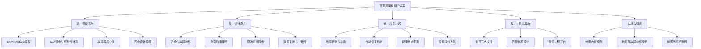
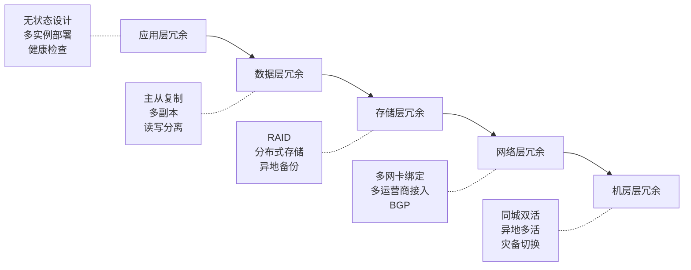
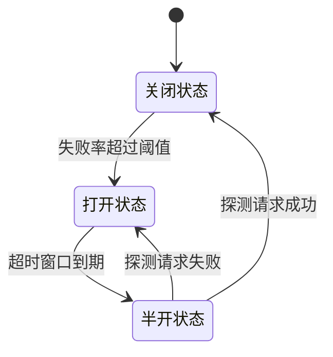
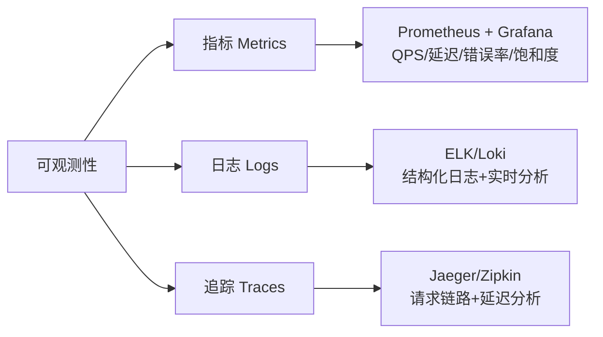
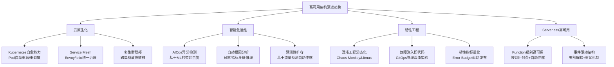

## 本章小结

### 一、知识体系全景回顾

高可用架构（High Availability Architecture）是分布式系统设计中最核心、最具挑战性的领域之一。它不是某一个单一技术，而是一套涵盖**故障预防、故障检测、故障恢复、故障容错**的完整方法论体系。通过本章的学习，我们从理论根基出发，经过核心技巧的锤炼，再到实战案例的检验，最终建立起对高可用架构的系统性认知。

本章的知识体系围绕"道→法→术→器"四个层次展开：



#### 本章各节内容索引

| 节次 | 标题 | 核心内容 | 建议阅读时间 |
|------|------|---------|-------------|
| 01 | 理论基础 | CAP定理、PACELC模型、SLA计算、故障模型分类、冗余原理 | 60-90分钟 |
| 02 | 核心技巧 | 冗余设计、负载均衡、故障转移、熔断降级、数据一致性、健康检查、容量规划、弹性伸缩 | 120-150分钟 |
| 03 | 实战案例 | MySQL主从切换、微服务级联故障熔断、跨机房容灾切换 | 90-120分钟 |
| 04 | 常见误区 | 架构设计、数据一致性、容量规划、故障处理、监控运维、安全防护、组织流程七维误区 | 60-90分钟 |
| 05 | 练习方法 | 六大实战练习：指标计算、环境搭建、故障模拟、性能调优、架构设计、混沌工程 | 180-360分钟（动手） |
| 06 | 本章小结 | 本节——知识回顾、核心提炼、学习路径、推荐资源 | 30-45分钟 |

### 二、核心概念深度总结

#### 1. 可用性的精确定义与量化

可用性不是一个模糊的"系统尽量不挂"，而是可以用数学精确定义的工程指标。不同的SLA等级背后代表着截然不同的架构成本和技术投入：

| SLA等级 | 年停机时间 | 月停机时间 | 日停机时间 | 典型行业 | 架构复杂度 | 典型成本倍数 |
|---------|-----------|-----------|-----------|---------|-----------|-------------|
| 99.9%（三个9） | 8小时45分钟 | 43分钟 | 1.4分钟 | 一般企业应用 | 中等 | 1x |
| 99.95%（三个9五） | 4小时22分钟 | 21分钟 | 43秒 | 电商平台 | 较高 | 2-3x |
| 99.99%（四个9） | 52分钟 | 4分钟 | 8.6秒 | 金融支付、在线交易 | 高 | 5-10x |
| 99.999%（五个9） | 5分钟 | 26秒 | 0.86秒 | 电信核心网、医疗生命系统 | 极高 | 10-50x |
| 99.9999%（六个9） | 31.5秒 | 2.6秒 | 0.086秒 | 半导体制造、国家级基础设施 | 极致 | 50-100x |

**关键认知**：从三个9到四个9，停机时间缩短了10倍，但架构成本可能增加5-10倍。每多一个9意味着需要在冗余、故障转移自动化、数据一致性保障等维度全面升级。选择SLA等级时必须与业务价值对齐——核心交易链路追求四个9甚至五个9，而边缘服务三个9即可满足。

**可用性计算公式**：

可用性 = MTBF / (MTBF + MTTR)

其中：
- **MTBF**（Mean Time Between Failures）：平均故障间隔，反映系统"抗造"程度
- **MTTR**（Mean Time To Repair）：平均修复时间，反映团队"救火"速度

这告诉我们两个优化方向：

| 优化方向 | 手段 | 投入 | 效果 | 适用阶段 |
|---------|------|------|------|---------|
| 提高MTBF | 冗余部署、硬件升级、代码质量、压力测试 | 高 | 减少故障频率 | 架构设计阶段 |
| 降低MTTR | 自动故障转移、监控告警、混沌工程、应急预案 | 中 | 加快恢复速度 | 运维运营阶段 |

**实际经验**：降低MTTR往往比提高MTBF更经济——因为故障几乎不可避免，而自动化的故障恢复可以在秒级完成。Google SRE的实践表明，将MTTR从1小时降到5分钟，比将MTBF从100小时提高到1000小时容易得多。

**错误预算（Error Budget）机制**：

错误预算 = 1 - SLA目标

例如：SLA为99.99%的系统，年度错误预算为52.6分钟。当错误预算消耗超过50%时，应暂停非紧急变更；消耗超过80%时，冻结所有非安全类变更；消耗殆尽时，全员投入稳定性治理。这是SRE实践中平衡"快速迭代"和"系统稳定"的核心机制。

#### 2. CAP定理与PACELC模型

CAP定理是分布式系统的"第一定律"：在网络分区（Partition）发生时，系统必须在一致性（Consistency）和可用性（Availability）之间做选择。但CAP定理过于简化了现实世界的复杂性，Daniel Abadi提出的PACELC模型提供了更完整的视角：

PACELC模型：
if (Partition) {
    choose between Availability and Consistency  // CAP视角
} else {
    choose between Latency and Consistency       // 延迟与一致性权衡
}

这告诉我们：即使在系统正常运行（无分区）时，一致性与延迟之间也存在不可回避的权衡。理解这一点对于实际的架构选型至关重要：

| 系统类型 | 分区时选择 | 正常时选择 | 典型代表 | 一致性保证 | 延迟特征 |
|---------|-----------|-----------|---------|-----------|---------|
| CP + 低延迟 | 一致性 | 延迟 | TiDB、CockroachDB（读优化） | 线性一致性读 | 亚毫秒级读延迟 |
| CP + 强一致 | 一致性 | 一致性 | ZooKeeper、etcd、Spanner | 线性一致性读写 | 毫秒级写延迟 |
| AP + 低延迟 | 可用性 | 延迟 | Cassandra、DynamoDB、CouchDB | 最终一致性 | 毫秒级读写延迟 |
| AP + 最终一致 | 可用性 | 一致性 | DNS、CDN | 最终一致性 | 秒级到分钟级同步延迟 |

**架构选型决策树**：

1. 数据是金钱（金融交易、库存扣减）→ 选CP，优先一致性
2. 数据是体验（社交动态、商品评论）→ 选AP，优先可用性
3. 读多写少 → CP系统 + 读优化缓存
4. 写多读少 → AP系统 + 异步同步
5. 全球分布 → Spanner/cockroachdb（TrueTime / HLC）

#### 3. 故障模式分类与应对策略

高可用设计的第一步是理解系统可能面对的故障类型。不同的故障模式需要不同的应对策略：

**按严重程度分级**：

| 级别 | 故障类型 | 影响范围 | 检测难度 | 恢复方式 | 典型案例 |
|------|---------|---------|---------|---------|---------|
| L1 崩溃故障 | 节点突然停止工作 | 单节点 | 容易（超时检测） | 重启/替换 | 服务器宕机、进程OOM |
| L2 拜占庭故障 | 节点产生错误输出 | 可能传播 | 极难（需冗余验证） | 共识协议 | 磁盘静默错误、内存位翻转 |
| L3 网络分区 | 节点间网络中断 | 集群分裂 | 中等（需多角度探针） | 分区恢复策略 | 交换机故障、光纤中断 |
| L4 脑裂 | 分区后各分区独立选举 | 集群数据不一致 | 困难（需仲裁机制） | Fencing/Quorum | 网络抖动导致误判 |
| L5 级联故障 | 一个组件故障引发连锁反应 | 全系统 | 中等 | 熔断/降级/限流 | 下游超时导致线程池耗尽 |
| L6 资源耗尽 | CPU/内存/磁盘/连接数耗尽 | 单节点或集群 | 容易（监控告警） | 扩容/回收 | 连接池打满、磁盘写满 |

**按故障来源分类**：

**硬件故障**：
- 服务器宕机：通过冗余部署和自动故障转移应对
- 磁盘损坏：通过RAID、多副本、定期备份应对
- 网络分区：通过多链路、多机房部署应对
- 机房级故障：通过同城双活、异地多活应对
- 电源故障：通过双路供电、UPS、柴发应对

**软件故障**：
- 进程崩溃：通过进程守护（systemd/supervisor）、自动重启应对
- 内存泄漏：通过内存监控、自动OOM kill和重启应对
- 死锁：通过超时机制、死锁检测和事务回滚应对
- 依赖服务故障：通过熔断器、降级方案、本地缓存应对
- 数据不一致：通过分布式事务、最终一致性、补偿机制应对

**人为故障**：
- 错误配置变更：通过配置审计、灰度发布、快速回滚应对
- 误操作删除数据：通过软删除、回收站机制、备份恢复应对
- 恶意攻击：通过DDoS防护、WAF、入侵检测应对
- 误删数据：通过延迟删除（TTL 7天）、回收站机制应对

**流量异常**：
- 突发流量（热点事件/大促）：通过弹性伸缩、限流、排队机制应对
- 流量不均衡（数据倾斜）：通过一致性哈希、动态分片应对
- 慢查询拖垮系统：通过SQL审计、慢查询隔离、读写分离应对

#### 4. 冗余设计原理

冗余是高可用的基石，但不是简单的"多部署几台机器"。冗余设计需要考虑三个核心维度：

**冗余层次模型**：



**副本数量选择**：

| 副本数 | 可容忍故障数 | 典型场景 | 一致性开销 | 年可用性（假设单节点99%） |
|--------|-------------|---------|-----------|------------------------|
| 1 | 0（无冗余） | 开发环境 | 无 | 99% |
| 2 | 0（仅硬件冗余） | 低优先级服务 | 低 | 99.99%（假设MTTR=1小时） |
| 3 | 1 | 生产环境标配 | 中 | 99.9999%（假设MTTR=10分钟） |
| 5 | 2 | 金融/核心交易 | 高 | 99.99999999%（理论值） |

**活跃-待机 vs 活跃-活跃**：

| 模式 | 描述 | 优点 | 缺点 | 适用场景 |
|------|------|------|------|---------|
| Active-Standby | 一个节点服务，另一个待命 | 简单、一致性好 | 资源浪费50%、切换有延迟 | 传统数据库、单主架构 |
| Active-Active | 多个节点同时服务 | 资源利用率高、吞吐量大 | 需处理写冲突、架构复杂 | 无状态服务、多活架构 |

### 三、核心设计模式总结

#### 1. 冗余与故障转移

**故障转移的关键决策点**：

- **谁来判断故障？** 常见方式有：心跳检测（最常用）、健康检查接口（HTTP/TCP探测）、主观感知（如Sentinel的RT异常探测）
- **谁来执行切换？** 中心化决策（如Redis Sentinel的Sentinel节点投票）vs 去中心化决策（如Raft协议的Leader选举）
- **切换多久完成？** 总恢复时间 = 故障检测时间 + 故障确认时间 + 切换执行时间 + 服务恢复时间
- **如何避免脑裂？** Quorum机制（多数派投票）、Fencing Token（隔离旧主）、STONITH（Shoot The Other Node In The Head）

**故障转移时间优化目标**：

| 指标 | 行业基准 | 优秀水平 | 顶尖水平 | 优化手段 |
|------|---------|---------|---------|---------|
| 故障检测时间 | 30秒 | 5秒 | <1秒 | 缩短心跳间隔、多维度探测 |
| 故障确认时间 | 10秒 | 3秒 | <1秒 | Quorum投票优化、预判机制 |
| 切换执行时间 | 30秒 | 5秒 | <1秒 | 自动化脚本、预热连接池 |
| 服务恢复时间 | 60秒 | 10秒 | <3秒 | DNS TTL优化、客户端重连 |
| **端到端恢复** | **~2分钟** | **~20秒** | **<5秒** | **全链路自动化** |

#### 2. 负载均衡

负载均衡决定了请求如何分配到多个后端实例，直接影响系统的吞吐量和资源利用率：

| 策略 | 原理 | 优点 | 缺点 | 适用场景 | 实现复杂度 |
|------|------|------|------|---------|-----------|
| 轮询（Round Robin） | 依次分配 | 简单公平 | 不考虑后端差异 | 后端实例性能一致 | 低 |
| 加权轮询 | 按权重分配 | 考虑实例差异 | 权重需人工设置 | 异构集群 | 低 |
| 最少连接（Least Connections） | 分配给连接数最少的实例 | 动态感知负载 | 需要维护连接计数 | 长连接场景 | 中 |
| 一致性哈希 | 请求按key哈希到同一实例 | 会话亲和性好 | 可能数据倾斜 | 缓存、有状态服务 | 中 |
| IP哈希 | 按客户端IP分配 | 简单的会话亲和 | 多人共用IP时不均 | 会话保持需求 | 低 |
| 随机 | 随机选择实例 | 实现简单 | 短期可能不均 | 大规模集群 | 最低 |

**四层 vs 七层负载均衡**：

| 维度 | 四层（L4） | 七层（L7） |
|------|-----------|-----------|
| 工作层级 | TCP/UDP端口+IP地址 | HTTP/HTTPS应用层协议 |
| 性能 | 高（百万级QPS） | 中（十万级QPS） |
| 功能 | 纯转发，不解析内容 | URL路由、Header改写、内容缓存 |
| 健康检查 | TCP连接检查 | HTTP状态码检查 |
| 代表产品 | LVS、HAProxy（TCP模式） | Nginx、Envoy、HAProxy（HTTP模式） |
| 适用场景 | 数据库代理、游戏服务器 | Web应用、API网关、微服务 |

#### 3. 限流、熔断与降级

这三个机制构成了高可用系统的"安全阀"，防止故障雪崩式蔓延：

**限流（Rate Limiting）**：

控制进入系统的请求速率，保护系统不被突发流量压垮。

| 算法 | 原理 | 突发处理 | 精确度 | 实现复杂度 | 适用场景 |
|------|------|---------|--------|-----------|---------|
| 令牌桶 | 以恒定速率向桶中放入令牌 | 允许桶内突发 | 中 | 中 | API限流、微服务间调用 |
| 滑动窗口计数器 | 将时间划分为多个小窗口 | 窗口内统计 | 高 | 中 | 精确限流场景 |
| 信号量限流 | 限制同时处理的并发请求数 | 不允许突发 | 低 | 低 | 并发控制、资源池保护 |
| 漏桶算法 | 以恒定速率处理请求 | 不允许突发 | 高 | 中 | 流量整形、CDN限速 |

```python
# 令牌桶限流实现示例（生产级）
import time
import threading

class TokenBucket:
    """线程安全的令牌桶限流器"""
    
    def __init__(self, capacity, refill_rate):
        """
        Args:
            capacity: 桶容量（最大令牌数）
            refill_rate: 每秒补充令牌数
        """
        self.capacity = capacity
        self.tokens = capacity
        self.refill_rate = refill_rate
        self.last_refill = time.monotonic()
        self.lock = threading.Lock()

    def allow(self, tokens=1):
        """尝试获取令牌"""
        with self.lock:
            now = time.monotonic()
            # 补充令牌
            elapsed = now - self.last_refill
            self.tokens = min(
                self.capacity,
                self.tokens + elapsed * self.refill_rate
            )
            self.last_refill = now

            if self.tokens >= tokens:
                self.tokens -= tokens
                return True
            return False

# 使用示例
limiter = TokenBucket(capacity=100, refill_rate=10)  # 100容量，每秒补充10个
if limiter.allow():
    process_request()
else:
    return_http_429()  # 返回 429 Too Many Requests
```

**熔断（Circuit Breaker）**：

当下游服务出现故障时，快速失败而不是等待超时，防止级联故障。经典的状态机模型：



| 状态 | 行为 | 触发条件 | 关键参数 |
|------|------|---------|---------|
| 关闭（Closed） | 正常转发请求，统计失败率 | 初始状态/半开恢复 | 失败率阈值（如50%） |
| 打开（Open） | 直接拒绝所有请求，快速失败 | 失败率超过阈值 | 超时窗口（如30秒） |
| 半开（Half-Open） | 允许少量探测请求通过 | 超时窗口到期 | 探测请求比例（如10%） |

**降级（Degradation）**：

当系统压力过大时，有策略地降低服务质量，保障核心功能可用。

| 降级类型 | 策略 | 适用场景 | 用户感知 |
|---------|------|---------|---------|
| 功能降级 | 关闭非核心功能（推荐、评论、弹幕） | 大促高峰、系统异常 | 部分功能不可用 |
| 数据降级 | 返回缓存数据或陈旧数据 | 实时查询压力过大 | 数据更新稍有延迟 |
| 体验降级 | 延长超时时间、显示排队页面、使用兜底内容 | 超出容量上限 | 等待时间增加 |
| 读降级 | 读请求使用本地缓存，不再穿透到数据库 | 数据库压力过大 | 数据一致性降低 |
| 写降级 | 写操作转异步处理，先确认后落库 | 写入压力过大 | 写入延迟增加 |

#### 4. 数据复制与一致性

数据层的高可用是最具挑战性的部分。核心问题在于：如何在保证数据一致性的同时，实现高可用和高性能。

**复制策略对比**：

| 策略 | 一致性 | 性能 | 数据丢失风险 | 适用场景 | 典型实现 |
|------|--------|------|-------------|---------|---------|
| 同步复制 | 强一致 | 低（受最慢副本限制） | 无 | 金融交易、库存扣减 | MySQL半同步、etcd Raft |
| 异步复制 | 最终一致 | 高 | 可能丢失最近写入 | 日志、分析、非关键数据 | MySQL异步复制、Kafka |
| 半同步复制 | 一主一从强一致 | 中等 | 主从同时故障时可能丢失 | MySQL主从复制 | MySQL半同步模式 |
| Quorum写入 | 可调一致 | 中等 | 由W+R>N决定 | Dynamo风格系统 | Cassandra、Riak |

**W+R>N规则详解**：在N副本系统中，写操作确认W个副本成功，读操作从R个副本读取。当W+R>N时，可以保证读到最新写入的数据。

| 配置 | W | R | 一致性 | 可用性 | 适用场景 |
|------|---|---|--------|--------|---------|
| 强一致读写 | N | 1 | 最强 | 最低 | 金融交易 |
| 强一致写，高可用读 | N | 1 | 写强一致 | 读高可用 | 写少读多 |
| 高可用写，强一致读 | 1 | N | 读强一致 | 写高可用 | 写多读少 |
| 最终一致性 | 1 | 1 | 最弱 | 最高 | 日志、分析 |

### 四、监控与可观测性

高可用系统的"眼睛"——没有完善的监控，任何高可用设计都是盲人摸象。

#### 1. 监控三大支柱



| 支柱 | 数据类型 | 存储方案 | 查询方式 | 适用场景 |
|------|---------|---------|---------|---------|
| 指标（Metrics） | 数值型时间序列 | Prometheus、InfluxDB | PromQL | 实时监控、告警、趋势分析 |
| 日志（Logs） | 文本/结构化事件 | ELK Stack、Loki | 全文搜索、SQL | 问题排查、审计、分析 |
| 追踪（Traces） | 请求链路数据 | Jaeger、Zipkin、OpenTelemetry | 依赖图、延迟分析 | 微服务调用链、性能瓶颈 |

**RED方法（面向服务）**：
- **R**ate：请求速率（QPS/RPS）——衡量系统负载
- **E**rrors：错误率——衡量系统健康
- **D**uration：请求延迟分布（P50/P95/P99/P999）——衡量用户体验

**USE方法（面向资源）**：
- **U**tilization：资源使用率（CPU/内存/磁盘/网络）
- **S**aturation：资源饱和度（队列长度、等待数、可运行线程数）
- **E**rrors：资源错误数（磁盘I/O错误、网卡丢包、内存ECC错误）

#### 2. 告警设计原则

好的告警应该满足：**准确、及时、可操作**。

| 原则 | 要求 | 反例 | 正例 |
|------|------|------|------|
| 准确 | 告警必须有真实故障对应 | "CPU 80%"（可能是正常负载） | "CPU > 95% 持续 5分钟" |
| 及时 | P0告警必须5分钟内送达 | 告警规则每小时检查一次 | P0告警每分钟检查一次 |
| 可操作 | 每条告警必须关联处理SOP | "Redis连接数高" | "Redis连接数>1000→检查连接泄漏→执行xxx" |

**告警分级与响应**：

| 级别 | 定义 | 响应时间 | 响应方式 | 升级条件 |
|------|------|---------|---------|---------|
| P0（紧急） | 核心业务完全不可用 | 5分钟内 | 电话+即时通讯+值班响应 | 无 |
| P1（重要） | 核心业务部分受损 | 30分钟内 | 即时通讯+值班响应 | 30分钟未解决→升级P0 |
| P2（一般） | 非核心功能异常 | 2小时内 | 工单系统 | 工作日处理 |
| P3（低优先级） | 优化类告警 | 工作日处理 | 邮件 | 不影响SLA |

**告警收敛策略**：
- **聚合**：相同告警在时间窗口内合并为一条，避免告警风暴
- **抑制**：上游故障时不告警下游（如数据库宕机时，不告警依赖数据库的服务）
- **静默**：维护窗口期自动静默相关告警
- **升级**：P2告警超时未处理自动升级为P1

### 五、关键公式与量化模型

掌握以下公式和模型，可以帮助你在设计和调优高可用架构时做出数据驱动的决策：

| 概念 | 公式/模型 | 实际应用 | 注意事项 |
|------|-----------|---------|---------|
| 可用性计算 | A = MTBF / (MTBF + MTTR) | 衡量优化方向：提高MTBF还是降低MTTR | MTTR应包含检测+切换+恢复全链路 |
| Little定律 | L = λ × W（系统中平均请求数 = 到达速率 × 平均处理时间） | 容量规划：已知QPS和延迟，可计算所需并发连接数 | λ必须是稳态到达率 |
| 错误预算 | Budget = 1 - SLA | 控制发布节奏：预算耗尽时冻结非紧急变更 | 需要实时追踪消耗进度 |
| 阿姆达尔定律 | Speedup = 1 / ((1-P) + P/N) | 评估垂直/水平扩展的收益上限 | P（可并行比例）通常<90% |
| 99法则 | P99延迟可能远大于平均延迟 | 关注尾延迟，而非平均延迟 | 建议同时关注P95/P99/P999 |
| 容量公式 | 所需实例数 = 峰值QPS / (单实例QPS × 冗余系数) | 峰值流量规划 | 冗余系数通常取1.5-2.0 |
| N+X冗余 | 总实例数 = N（满足峰值）+ X（容错余量） | 确保故障时容量不降 | X通常为N的10%-30% |

**常用容量规划经验值**：

| 指标 | 单机典型值 | 可优化到 | 优化手段 |
|------|-----------|---------|---------|
| Web服务器（Nginx） | 1万QPS | 5-10万QPS | 静态资源CDN、连接复用、sendfile |
| 应用服务器（Java） | 500-1000 QPS | 2000-5000 QPS | 线程池调优、异步处理、连接池 |
| MySQL单机 | 1000-3000 TPS | 5000-10000 TPS | 索引优化、读写分离、分区表 |
| Redis单机 | 5万-10万 QPS | 20万+ QPS | Pipeline、Lua脚本、集群模式 |

### 六、最佳实践清单

#### 设计阶段

- [ ] **明确SLA等级**：根据业务重要性确定可用性目标（99.9%？99.99%？），并与业务方达成书面共识
- [ ] **识别单点故障**：使用故障树分析（FTA）逐一排查系统中的SPOF（Single Point of Failure），特别注意DNS、负载均衡器、配置中心、密钥管理等"隐形SPOF"
- [ ] **设计冗余方案**：至少消除以下层面的SPOF：应用层（多实例）、数据层（主从/多副本）、网络层（多链路/BGP）、依赖服务层（本地缓存/降级）
- [ ] **定义降级策略**：明确每个非核心功能的降级条件（触发阈值）、降级行为（返回什么）、恢复条件（何时恢复）
- [ ] **制定容量模型**：基于业务增长预期，建立容量模型和扩容触发条件（如CPU>70%持续5分钟触发扩容）
- [ ] **设计故障注入方案**：在架构评审阶段就规划混沌工程实验，验证设计的容错能力

#### 实现阶段

- [ ] **无状态设计**：应用层不存储会话状态，状态外置到Redis等共享存储，确保任意实例可随时替换
- [ ] **超时设置**：所有远程调用必须设置超时，包括HTTP请求、数据库查询、RPC调用、消息队列消费。推荐超时值：HTTP=5s、数据库=3s、RPC=3s、MQ=30s
- [ ] **重试策略**：采用指数退避+随机抖动（Exponential Backoff with Jitter），设置最大重试次数（通常3次），避免重试风暴
- [ ] **熔断机制**：对所有下游依赖配置熔断器，设置合理的失败率阈值（通常50%）和恢复窗口（通常30秒）
- [ ] **幂等设计**：所有写操作支持幂等重试，通过请求ID去重，确保网络重试不会产生重复数据
- [ ] **优雅关闭**：服务停止时先摘除流量注册，再等待存量请求处理完成（graceful period），最后退出进程

#### 部署阶段

- [ ] **灰度发布**：新版本先部署1-2台实例，观察30分钟无异常后再逐步扩大范围（1→10%→50%→100%）
- [ ] **蓝绿/金丝雀发布**：关键服务采用蓝绿部署（零停机切换）或金丝雀发布（小流量验证），降低变更风险
- [ ] **快速回滚**：确保回滚可以在5分钟内完成，包括数据库Schema兼容性（向后兼容设计）
- [ ] **容量压测**：上线前进行压力测试，验证在2-3倍峰值流量下系统表现，确认不会出现级联故障
- [ ] **故障注入测试**：在预发布环境注入网络延迟、节点宕机、磁盘满、CPU打满等故障，验证系统的容错能力

#### 运维阶段

- [ ] **监控巡检**：每日检查关键指标趋势（延迟、错误率、资源利用率），发现趋势异常及时处理
- [ ] **告警响应**：建立On-Call轮值制度，确保P0告警5分钟内有人响应，P1告警30分钟内有人响应
- [ ] **容量规划**：每月评估资源使用趋势，提前2周完成扩容（避免大促/月末突发流量）
- [ ] **备份验证**：定期（至少每月）执行备份恢复演练，验证备份可用性和RTO/RPO达标
- [ ] **混沌工程**：定期在测试环境（成熟后推广到生产环境）注入故障，持续验证系统韧性
- [ ] **故障复盘**：每次故障后48小时内完成复盘，产出改进Action Item并跟踪闭环，建立故障知识库

### 七、常见误区与纠正

| 误区 | 错误认知 | 正确认知 | 纠正方法 | 严重度 |
|------|---------|---------|---------|--------|
| 盲目追求五个9 | 可用性越高越好 | SLA应与业务价值匹配 | 建立SLA-成本-业务损失的量化模型 | 高 |
| 只做主从不做切换 | 有冗余就够了 | 故障自动切换才是高可用的关键 | 配置健康检查和自动故障转移，定期演练 | 高 |
| 过度依赖缓存 | 缓存能解决一切性能问题 | 缓存一致性、缓存穿透、缓存雪崩都是新问题 | 设计缓存失效策略、布隆过滤器、多级缓存 | 中 |
| 忽视小概率故障 | 双机房就够了 | "双机房"可能有共同故障域（如同一运营商） | 真正的多活需要物理隔离：不同机房+不同运营商+不同电力 | 高 |
| 监控盲区 | 有Prometheus就万事大吉 | 未覆盖的链路可能藏着致命问题 | 定期Review监控覆盖率，使用分布式追踪补充链路级监控 | 中 |
| 变更即风险 | 不变更就不会出故障 | 不更新本身就是最大的风险（安全漏洞、技术债） | 建立安全的变更流程：灰度→监控→全量→回滚预案 | 高 |
| 数据备份=数据安全 | 定期备份就安全了 | 备份不验证等于没有备份 | 定期执行恢复演练，验证RTO/RPO | 高 |
| 英雄式运维 | 出了问题找老X就行 | 个人依赖是最大的单点故障 | 建立标准化SOP，知识共享，消除Bus Factor | 中 |

### 八、实战案例关键经验提炼

本章实战案例展示了三个典型场景的完整处理过程，提炼出以下关键经验：

**案例一：电商大促MySQL主从切换**

1. **监控先行**：问题的快速定位得益于完善的系统监控（load average、CPU、IO）和应用监控（线程状态、GC日志）。没有监控数据，排查将如同大海捞针
2. **工具是利器**：熟练使用 `top`、`iostat`、`jstack`、`SHOW PROCESSLIST`、`EXPLAIN` 等工具，是快速定位根因的前提。建议每个工程师都建立自己的"排障工具箱"
3. **数据驱动**：所有优化决策都应基于数据而非直觉。先用EXPLAIN确认全表扫描，再添加索引；先测量当前连接池利用率，再调整参数。脱离数据的优化是盲目的

**案例二：微服务级联故障熔断**

4. **系统性思维**：性能问题往往不是单一原因。根因可能涉及数据库索引、连接池配置、缓存策略三个维度——需要全链路分析，不能头痛医头
5. **熔断是生命线**：当下游服务出现异常时，熔断器可以在毫秒级切断调用链，防止故障蔓延。没有熔断的微服务架构，一个服务的抖动可能导致全链路雪崩

**案例三：跨机房容灾切换**

6. **预防胜于治疗**：大促前的容量评估和压测可以提前发现80%的问题。建立性能基线和容量水位线，在日常就发现趋势异常，远比事后救火更有效
7. **演练验证一切**：再完美的容灾方案，不经过实际演练都是纸上谈兵。定期执行灾备切换演练，验证切换时间、数据一致性、业务连续性

**排障工具箱速查**：

| 场景 | 工具 | 用法要点 |
|------|------|---------|
| CPU高 | top/htop | 看%CPU、%MEM、COMMAND列；按P排序 |
| IO瓶颈 | iostat -x 1 | 看%util、await、r/s、w/s |
| 内存问题 | free -h、vmstat 1 | 关注available、swap使用量 |
| 线程问题 | jstack | 导出线程堆栈，分析BLOCKED/WAITING |
| 连接问题 | netstat -an \| grep ESTABLISHED | 统计连接数，识别连接泄漏 |
| SQL慢查询 | EXPLAIN、SHOW PROCESSLIST | 分析执行计划、全表扫描、锁等待 |

### 九、技术演进趋势

高可用架构正在向以下方向演进：



**云原生化**：Kubernetes提供了声明式的自愈能力（Pod重启、节点重调度、健康检查），Service Mesh（如Istio）将流量管理、熔断、重试等能力下沉到基础设施层，让应用代码专注于业务逻辑。核心优势：开发者无需在代码中实现重试、熔断、负载均衡等逻辑，基础设施层统一处理。

**智能化运维（AIOps）**：基于机器学习的异常检测可以发现人工监控遗漏的"软故障"趋势；基于知识图谱的根因分析可以将故障定位时间从小时级缩短到分钟级。关键场景：异常指标检测、日志聚类分析、告警关联、自动扩缩容预测。

**韧性工程（Resilience Engineering）**：混沌工程从Netflix的实验项目发展为行业标准实践，通过主动注入故障来验证和提升系统的韧性。核心理念是"故障不是if而是when"，与其等待故障发生再应对，不如主动暴露和修复弱点。关键工具：Chaos Mesh、LitmusChaos、Gremlin、AWS Fault Injection Simulator。

**Serverless高可用**：函数计算平台（如AWS Lambda、阿里云函数计算）内置了高可用能力——自动伸缩、自动重试、跨AZ部署，让开发者无需关心底层基础设施。适用场景：事件驱动型应用、API后端、数据处理流水线。

### 十、进阶学习路径

掌握本章内容后，建议按以下路径深入学习：

**第一阶段：夯实基础（1-2个月）**

| 学习目标 | 具体行动 | 产出物 | 验证标准 |
|---------|---------|--------|---------|
| 分布式系统理论 | 精读《Designing Data-Intensive Applications》第5-9章 | 读书笔记，覆盖复制、分区、事务、一致性模型 | 能向他人讲解CAP/PACELC/W+R>N |
| 一致性协议实践 | 在本地搭建Raft集群（etcd），手动模拟Leader选举、日志复制、成员变更 | 搭建笔记+故障模拟记录 | 能解释etcd集群在各种故障场景下的行为 |
| 故障注入入门 | 在测试环境使用 Chaos Mesh 或 LitmusChaos 进行故障注入实验 | 实验报告：注入了什么故障、观察到什么现象、系统如何恢复 | 系统在30%节点宕机后30秒内恢复服务 |

**第二阶段：深入实践（2-3个月）**

| 学习目标 | 具体行动 | 产出物 | 验证标准 |
|---------|---------|--------|---------|
| 源码阅读 | 研究Redis Sentinel故障转移实现、MySQL主从切换机制、Kubernetes Pod调度器 | 关键流程的源码分析笔记 | 能画出故障转移的完整时序图 |
| 环境搭建 | 用Docker Compose搭建一主两从MySQL集群 + Redis Sentinel + Nginx负载均衡 + Prometheus/Grafana监控 | 可运行的docker-compose.yml + 配置文档 | 能模拟主节点宕机并自动恢复 |
| 故障演练 | 制定演练方案，执行预定义的故障场景，验证系统自动恢复能力 | 演练报告：场景、过程、结果、改进建议 | 端到端恢复时间<60秒 |

**第三阶段：架构能力（3-6个月）**

| 学习目标 | 具体行动 | 产出物 | 验证标准 |
|---------|---------|--------|---------|
| 业界案例研究 | 分析AWS、阿里云、Google Cloud的架构设计文档和案例分享 | 架构分析报告：关键设计决策、权衡取舍、可借鉴点 | 能设计一个满足特定SLA的完整架构方案 |
| 混沌工程方法论 | 阅读《Chaos Engineering》+ 实践 | 混沌工程实验手册 | 能设计并执行包含5+故障场景的完整混沌实验 |
| 开源贡献 | 为高可用相关开源项目（etcd、Prometheus、Istio）贡献代码或文档 | PR/MR记录 | 至少合并2个PR |

**第四阶段：工程领导力（持续）**

| 学习目标 | 具体行动 | 产出物 | 验证标准 |
|---------|---------|--------|---------|
| SRE实践建设 | 制定SLI/SLO体系、错误预算策略、On-Call轮值制度 | 团队SRE手册 | 团队P0告警响应时间<5分钟 |
| 混沌工程平台 | 构建组织级混沌工程平台，让故障演练成为每次发布的标准流程 | 混沌工程平台+演练计划 | 每月至少执行一次生产级故障演练 |
| 行业交流 | 关注QCon、GOTC等技术大会的高可用专题，分享和学习实战经验 | 技术博客/演讲 | 在技术社区发布至少2篇高可用实战文章 |

### 十一、思考题

#### 1. 理论题：Raft Leader选举

**题目**：在一个三节点的Raft集群中，如果Leader节点所在的机房发生网络分区，描述Leader选举的完整过程。如果分区恢复后旧Leader重新加入集群，它会扮演什么角色？

**答题要点**：
- 分区后，少数分区（含旧Leader）无法获得多数派（2/3）投票，旧Leader降级为Follower
- 多数分区中的Follower在election timeout后发起选举，获得2票（含自己）成为新Leader
- 分区恢复后，旧Leader发现新Leader的term更高，自动降级为Follower，同步新Leader的日志

#### 2. 设计题：千万级消息推送系统

**题目**：设计一个支持千万级用户的消息推送系统，要求消息不丢失、允许秒级延迟。请给出架构方案，并说明在CAP三角中你做了哪些取舍。

**答题要点**：
- 架构选型：AP系统（优先可用性），使用消息队列（Kafka）作为缓冲层
- 消息不丢失：生产端确认+消息持久化+消费端ACK，三重保障
- 延迟控制：消息队列+长轮询/WebSocket，确保秒级到达
- CAP取舍：网络分区时选择可用性（AP），通过消息持久化+重试保证最终一致性

#### 3. 实践题：Chaos Mesh故障注入

**题目**：在你的测试环境中，使用Chaos Mesh注入以下故障并观察系统行为：(a) 随机杀死50%的Pod；(b) 给数据库连接增加500ms延迟；(c) 将某个服务的CPU限制到10%。记录系统的自动恢复时间和恢复过程中出现的异常。

**预期收获**：
- 理解Kubernetes的Pod自愈机制（自动重启、重调度）
- 观察延迟注入对下游服务的影响（超时、重试、熔断）
- 体验资源限制对服务吞吐量和延迟的直接影响

#### 4. 分析题：SLA未达标分析

**题目**：某系统的SLA为99.99%，但上个月实际可用性只有99.9%。分析可能的原因，并设计一个改进计划，说明如何在下个月回到99.99%的目标。

**答题要点**：
- 可能原因：未识别的SPOF、变更引发故障、容量不足、备份未验证、监控盲区
- 改进计划：错误预算分析→故障根因分类→优先级排序→SPOF修复→监控补齐→混沌工程验证
- 关键指标：MTBF提升（减少故障次数）+ MTTR降低（加快恢复速度）

#### 5. 对比题：三种数据复制架构

**题目**：对比分析主从复制、多主复制、无主复制三种数据复制架构的优缺点。在什么场景下选择哪种方案？如果需要在"零数据丢失"和"最低延迟"之间做选择，各方案如何取舍？

**答题要点**：
- 主从复制：简单、一致性好，但主节点是瓶颈和单点故障
- 多主复制：写入性能高、可用性好，但需要处理写冲突
- 无主复制：可用性最高，但一致性最弱，读写延迟受最慢副本影响
- 零数据丢失 vs 最低延迟：同步复制保证零丢失但增加延迟，异步复制降低延迟但可能丢数据

### 十二、关键术语表

| 术语 | 英文全称 | 定义 | 缩写 |
|------|---------|------|------|
| 高可用 | High Availability | 系统在指定时间内持续提供服务的能力 | HA |
| 单点故障 | Single Point of Failure | 系统中一旦故障就会导致整个系统不可用的组件 | SPOF |
| 平均故障间隔 | Mean Time Between Failures | 两次故障之间的平均时间 | MTBF |
| 平均修复时间 | Mean Time To Repair | 从故障发生到恢复服务的平均时间 | MTTR |
| 服务等级协议 | Service Level Agreement | 与业务方约定的可用性目标 | SLA |
| 服务等级指标 | Service Level Indicator | 衡量服务可靠性的具体指标 | SLI |
| 错误预算 | Error Budget | 1-SLA，允许的最大不可用时间 | - |
| 故障注入 | Fault Injection | 主动向系统注入故障以验证容错能力 | FI |
| 混沌工程 | Chaos Engineering | 通过科学实验方法验证分布式系统的韧性 | - |
| 脑裂 | Split Brain | 网络分区后各分区独立选举主节点 | - |
| Fencing Token | - | 用于隔离旧主节点的递增令牌 | - |
| 优雅关闭 | Graceful Shutdown | 服务停止时先摘除流量再处理存量请求 | - |
| 金丝雀发布 | Canary Deployment | 先对少量用户发布新版本验证 | - |
| 蓝绿部署 | Blue-Green Deployment | 两套环境交替使用实现零停机切换 | - |
| 服务网格 | Service Mesh | 将流量治理能力下沉到基础设施层 | - |
| 可观测性 | Observability | 通过外部输出推断系统内部状态的能力 | - |

### 十三、推荐资源

#### 经典书籍

| 书名 | 作者 | 推荐理由 | 重点章节 |
|------|------|---------|---------|
| 《Designing Data-Intensive Applications》 | Martin Kleppmann | 分布式系统设计的"圣经"，第5-9章是高可用设计的核心 | 5-9章（复制、分区、事务、一致性） |
| 《Site Reliability Engineering》 | Google SRE团队 | SRE方法论的奠基之作，系统性地介绍了大规模系统的可靠性保障实践 | 第1-5章（SRE基础）、第25-28章（事故管理） |
| 《Chaos Engineering》 | Casey Rosenthal等 | 混沌工程的权威指南，从理论到实践完整覆盖 | 全书通读，第6-9章（实验设计） |
| 《Database Internals》 | Alex Petrov | 深入数据库内部实现，理解复制、分区、一致性的底层机制 | 第3-5章（复制）、第8-10章（分布式事务） |
| 《The Site Reliability Workbook》 | Google SRE团队 | SRE方法论的实践手册，包含大量可操作的模板和案例 | 第4-7章（SLO实践）、第12章（混沌工程） |

#### 技术论文

| 论文 | 发表时间 | 核心贡献 | 阅读建议 |
|------|---------|---------|---------|
| Amazon Dynamo论文 | 2007 | 开创AP系统设计范式，W+R>N规则出处 | 重点关注ACM Queue的简化版 |
| Google Spanner论文 | 2012 | TrueTime API和全球分布式数据库的高可用设计 | 重点关注CockroachDB作者的解读 |
| Raft协议论文 | 2014 | 可理解的分布式共识算法 | 配合动画实现（thesecretlivesofdata.com/raft）阅读 |
| Kafka设计文档 | 2011 | Partition、ISR、Consumer Group设计对高可用消息系统的启示 | 重点关注Kafka KIP文档 |

#### 开源项目

| 项目 | 链接 | 学习价值 | 入门方式 |
|------|------|---------|---------|
| etcd | github.com/etcd-io/etcd | Raft协议参考实现 | 搭建集群+手动模拟故障 |
| Prometheus | github.com/prometheus/prometheus | 云原生监控标杆 | 部署+编写告警规则 |
| Chaos Mesh | github.com/chaos-mesh/chaos-mesh | Kubernetes混沌工程平台 | 执行第一个混沌实验 |
| Istio | github.com/istio/istio | Service Mesh标杆 | 部署+配置熔断/限流规则 |
| Sentinel | github.com/alibaba/Sentinel | 流量治理框架（限流/熔断/降级） | 集成到Spring Boot应用 |

#### 在线资源

| 资源 | 链接 | 内容特点 |
|------|------|---------|
| AWS Architecture Blog | aws.amazon.com/blogs/architecture/ | 大规模高可用架构案例 |
| 阿里云技术社区 | developer.aliyun.com | 国内电商场景的高可用实践 |
| Netflix Tech Blog | netflix.github.io | 混沌工程和微服务高可用的先驱实践 |
| Google Cloud Architecture Center | cloud.google.com/architecture | Google级高可用架构设计指南 |
| High Scalability | highscalability.com | 各种规模系统的架构分析 |

### 十四、本章核心收获速查

完成本章学习后，你应该能够：

| 能力维度 | 具体能力 | 验证方式 |
|---------|---------|---------|
| 理论理解 | 解释CAP/PACELC定理及其对架构选型的影响 | 能画出PACELC模型并举出3个系统的分类 |
| 量化分析 | 使用SLA公式计算可用性，设计错误预算策略 | 能为一个系统设计完整的SLA方案 |
| 架构设计 | 识别SPOF、设计冗余方案、选择负载均衡策略 | 能为一个中型系统设计高可用架构图 |
| 故障应对 | 配置熔断器、限流器、降级策略 | 能在代码中实现令牌桶限流和熔断器 |
| 监控告警 | 设计RED/USE监控指标、制定告警分级策略 | 能为一个服务配置完整的监控+告警 |
| 实战排障 | 使用top/iostat/jstack等工具定位性能瓶颈 | 能在30分钟内定位一个模拟的性能问题 |
| 混沌工程 | 设计并执行故障注入实验，验证系统韧性 | 能用Chaos Mesh执行5种故障场景 |
| 持续改进 | 执行故障复盘，产出改进计划并跟踪闭环 | 能完成一次完整的故障复盘报告 |
