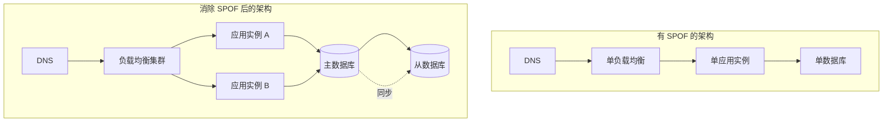
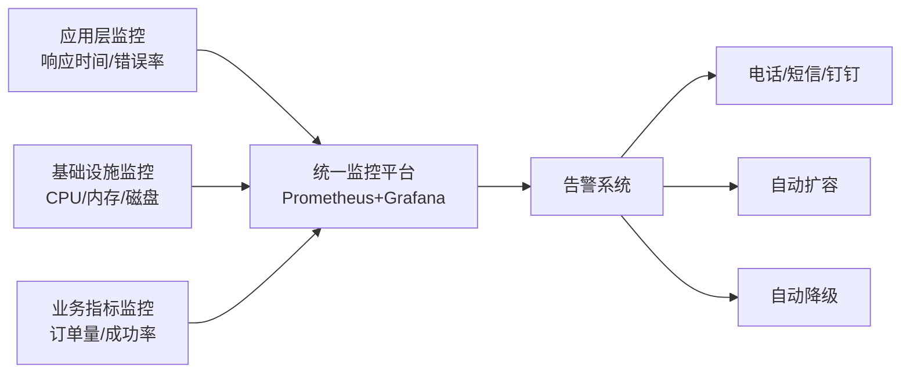
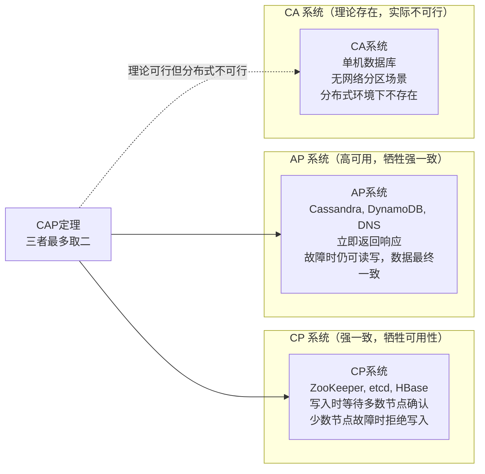
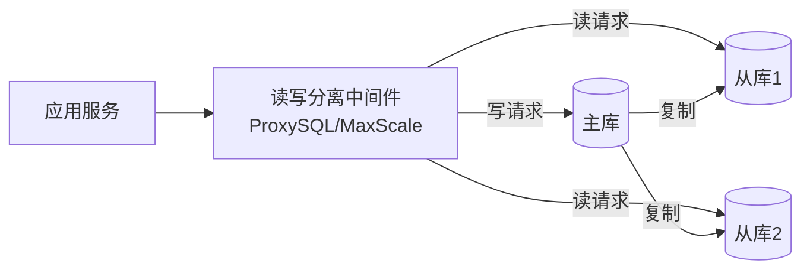
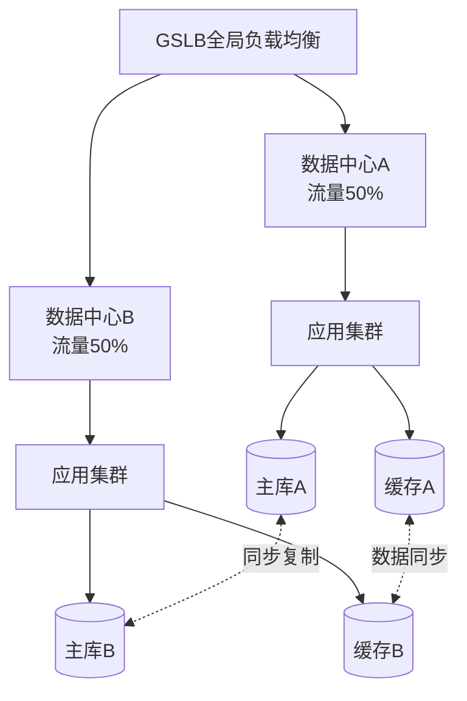
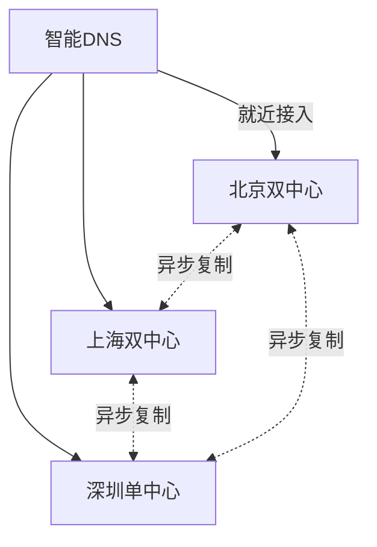
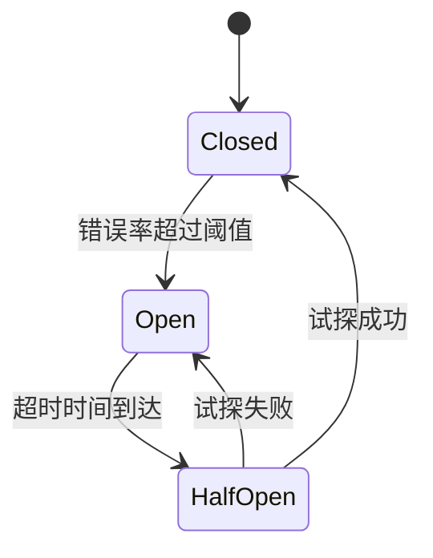
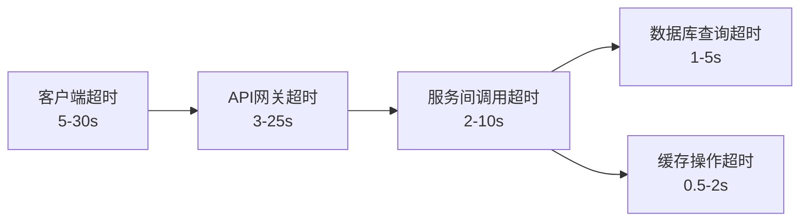
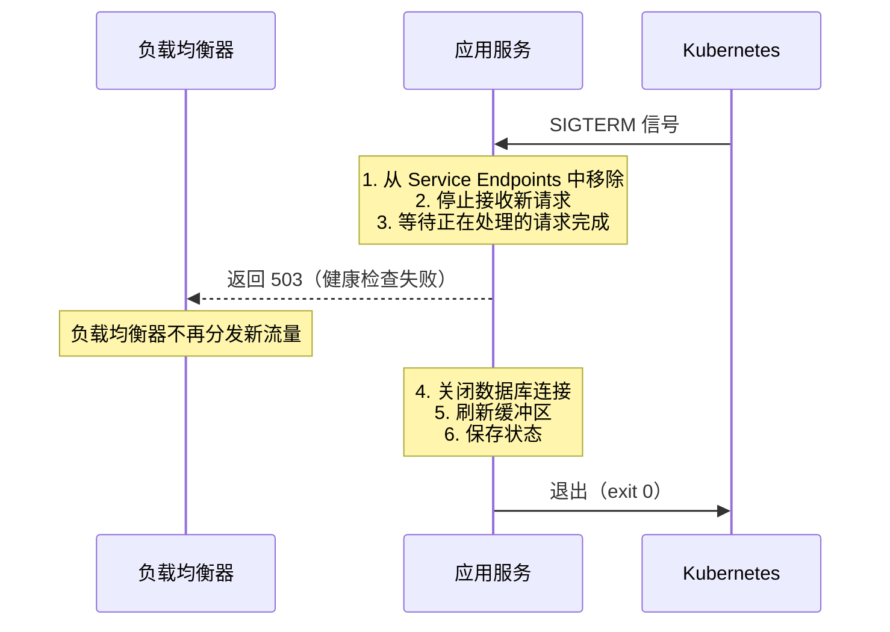

# 第37章 高可用架构

高可用性（High Availability，HA）是现代分布式系统架构的核心设计目标之一。在互联网时代，系统的服务中断每分钟都可能带来巨大的经济损失和用户流失——Amazon 曾因 2021 年 6 小时宕机估计损失超 3400 万美元，Cloudflare 统计显示全球网站平均每年因故障损失约 7500 万美元。本章将系统地介绍高可用架构的设计原理和实践方法，帮助读者从理论到实操构建稳定可靠的分布式系统。

***

## 本章结构

本章从高可用的基本概念出发，逐步深入到高级的高可用技术。首先介绍可用性的定义、度量方法和核心设计原则，这是理解高可用架构的基础。然后深入讲解 CAP 定理和 BASE 理论，建立高可用设计的理论框架。接着系统讲解主从复制和故障转移机制，这是高可用架构的基石。在数据库高可用部分，深入讲解 MySQL InnoDB Cluster、Redis Cluster、PostgreSQL 和 Elasticsearch 的高可用方案。在应用层高可用部分，详细讨论无状态设计、重试机制、超时控制、优雅关闭和熔断降级模式。在限流与降级部分，实现令牌桶算法和多维度限流策略。在基础设施部分，涵盖负载均衡策略、服务发现与注册、Service Mesh、分布式协调、容灾备份策略等内容。在级联故障防护部分，系统讲解五层雪崩防护防线。在 SLA 与混沌工程部分，介绍可用性的量化分析方法和主动故障注入实践。最后通过电商大促、金融系统、SaaS 多租户三个实战案例，展示高可用架构在真实场景中的应用。

***

## 学习目标

完成本章学习后，读者应当能够：

1. **理论层面**：理解可用性度量体系（几个九）、CAP/FLP 定理对高可用设计的约束、BASE 理论的工程实践
2. **架构层面**：掌握主从复制、多活架构、数据库集群的设计原理和适用场景
3. **技术层面**：能够配置 MySQL InnoDB Cluster、Redis Cluster、Kubernetes 健康检查、Nginx 负载均衡与限流
4. **工程层面**：能够设计熔断降级策略、限流方案、优雅关闭流程、级联故障防护体系、SLA 体系、混沌工程实验
5. **实战层面**：能够为电商、金融、SaaS 等场景设计完整的高可用方案

***

## 前置知识

学习本章需要具备以下基础知识：

- 分布式系统的基本概念，包括 CAP 定理（一致性、可用性、分区容错性不可兼得）
- 数据库复制的基本原理，理解 binlog、WAL 等日志机制
- 网络基础知识，包括 DNS、TCP/IP、负载均衡器的工作原理
- 微服务架构的基本概念，包括服务注册发现、网关、链路追踪

如果读者已经学习了本书前面关于分布式理论和网络架构的章节，将能够更好地理解本章内容。

***

# 理论基础

## 可用性的定义与度量

可用性（Availability）是指系统在指定时间内能够正常提供服务的能力。可用性通常用"几个九"来表示，其核心计算公式为：

可用性 = 正常运行时间 / (正常运行时间 + 故障时间) × 100%

不同级别的可用性对应的年不可用时间如下：

| 可用性级别 | 年不可用时间 | 月不可用时间 | 适用场景 | 典型代表 |
|-----------|------------|------------|---------|---------|
| 99%（两个九） | 3.65 天 | 7.31 小时 | 内部管理系统、开发/测试环境 | 企业 OA 系统 |
| 99.9%（三个九） | 8.76 小时 | 43.8 分钟 | 大多数互联网应用 | 一般 SaaS 服务 |
| 99.99%（四个九） | 52.6 分钟 | 4.38 分钟 | 核心业务系统 | 电商平台、社交网络 |
| 99.999%（五个九） | 5.26 分钟 | 26.3 秒 | 金融交易、医疗、电信 | 银行核心系统、911 紧急服务 |

**关键认知**：从三个九到四个九，不可用时间从 8.76 小时压缩到 52.6 分钟——这需要投入的成本通常是指数级增长的。根据 AWS 和 Google 的工程实践，每提升一个九的成本大约增加 10-100 倍。因此，合理设定可用性目标至关重要。

### 可用性的影响因素

系统的可用性受到以下因素的综合影响：

**基础设施层**：硬件故障（磁盘损坏、内存故障、网络设备宕机）、机房环境（电力中断、空调故障、网络线路被挖断）

**软件层**：代码缺陷（空指针、死锁、内存泄漏）、配置错误（超时设置不当、连接池耗尽）、依赖服务故障（第三方 API 超时、DNS 解析失败）

**人为因素**：误操作（错误的运维命令、错误的配置发布）、变更故障（代码发布引入回归 Bug、数据库 Schema 变更导致锁表）

**外部因素**：DDoS 攻击、自然灾害（地震、洪水）、运营商网络故障

### 消除单点故障

提高可用性的核心思想是消除单点故障（Single Point of Failure，SPOF）。单点故障是指系统中任何一旦故障就会导致整个系统不可用的组件。常见的 SPOF 及其解决方案：

- **应用单点**：通过多实例部署 + 负载均衡解决
- **数据库单点**：通过主从复制、集群方案解决
- **缓存单点**：通过 Redis Cluster 或多节点哨兵解决
- **负载均衡单点**：通过多层负载均衡（DNS 级 + 应用级）解决
- **网络单点**：通过多线接入、多链路冗余解决



### 可用性度量的监控体系

建立完善的监控体系是度量可用性的前提。核心指标分为四个维度：

**服务层指标**：响应时间（P50/P95/P99/P999）、错误率（HTTP 5xx 比例）、吞吐量（QPS/TPS）、成功率

**基础设施指标**：CPU 使用率、内存使用率、磁盘 I/O（IOPS、吞吐量）、网络 I/O（带宽、丢包率、延迟）

**中间件指标**：数据库连接池使用率、缓存命中率、消息队列积压量、线程池活跃线程数

**业务指标**：订单量、支付成功率、用户登录成功率、搜索响应时间



***

## CAP 定理与高可用设计约束

CAP 定理是分布式系统设计的理论基石，它指出在分布式系统中，一致性（Consistency）、可用性（Availability）和分区容错性（Partition Tolerance）三者最多只能同时满足两个。

### CAP 三要素详解

| 要素 | 定义 | 高可用影响 |
|------|------|-----------|
| **一致性（C）** | 所有节点在同一时间看到相同的数据 | 要求强一致时，写操作必须等待所有副本确认，降低可用性 |
| **可用性（A）** | 每个请求都能收到非错误响应（不保证最新数据） | 要求高可用时，不能因部分节点故障而拒绝服务 |
| **分区容错性（P）** | 系统在网络分区（节点间通信中断）时仍能继续运行 | 网络故障不可控，P 是分布式系统的必选项 |

由于网络分区在分布式系统中不可避免，P 是必须保留的。因此实际选择只有 CP 或 AP：



**工程实践中的 CAP 选择**：

- **CP 选择场景**：金融交易、库存扣减、分布式锁——数据错误的代价远高于暂时不可用。典型系统：ZooKeeper、etcd、Google Spanner（TrueTime）
- **AP 选择场景**：社交动态、搜索索引、推荐结果——短暂的数据不一致可接受，但服务不可用会流失用户。典型系统：Cassandra、DynamoDB、DNS
- **混合策略**：同一系统内不同模块采用不同策略。例如电商系统中，库存服务选择 CP（宁可拒绝请求也不超卖），而商品浏览选择 AP（允许短暂的数据延迟）

### BASE 理论：AP 系统的设计哲学

BASE（Basically Available, Soft state, Eventually consistent）是 AP 系统的设计哲学：

- **Basically Available（基本可用）**：系统在出现故障时允许损失部分功能（如降级到只读模式），而不是完全不可用
- **Soft state（软状态）**：允许系统中的数据存在中间状态，各节点之间的数据同步存在延迟
- **Eventually consistent（最终一致）**：系统保证在没有新的写入操作后，经过足够的时间，所有节点的数据最终会达到一致

**BASE 与 ACID 的权衡**：

| 特性 | ACID（强一致） | BASE（最终一致） |
|------|--------------|----------------|
| 数据写入 | 等待所有副本确认后返回 | 立即返回，后台异步同步 |
| 故障处理 | 拒绝服务以保证一致性 | 降级服务以保证可用性 |
| 性能 | 低（同步阻塞） | 高（异步非阻塞） |
| 适用场景 | 金融、订单、库存 | 社交、日志、推荐 |

### CAP 定理的工程实践启示

1. **不要试图同时满足三者**：试图在所有场景下同时保证 C、A、P 会导致系统既不一致也不可用
2. **按业务场景选择策略**：同一系统内不同服务可以采用不同的 CAP 策略
3. **用最终一致性换取可用性**：大多数互联网应用不需要强一致性，最终一致性即可满足需求
4. **设计幂等操作**：在 AP 系统中，重试可能导致重复操作，需要保证操作的幂等性

### FLP 不可能定理

FLP 定理（FLP Impossibility）是 CAP 定理的理论延伸，它证明了在异步分布式系统中，即使只有一个节点崩溃，也不存在一个确定性算法能够保证所有非故障节点达成一致。这意味着：

- 在异步网络中，完美的故障检测是不可能的
- 分布式共识算法（如 Raft、Paxos）通过引入超时等机制来解决实际问题
- 工程实践中通过"大多数节点存活即可工作"来绕过理论限制

***

## 主从复制

主从复制（Master-Slave Replication）是高可用架构的基石。在主从复制架构中，一个节点被选为主节点（Master/Primary），负责处理所有的写操作；其他节点为从节点（Slave/Replica），负责从主节点同步数据，并可以处理读操作。

### 数据同步方式对比

主从复制的数据同步方式分为三种，各有优劣：

| 特性 | 同步复制 | 异步复制 | 半同步复制 |
|------|---------|---------|-----------|
| 数据一致性 | 强一致 | 最终一致 | 至少一个从节点一致 |
| 写入延迟 | 高（需等待所有从节点确认） | 低（立即返回） | 中等（等待至少一个从节点确认） |
| 可用性 | 低（任一从节点故障阻塞写入） | 高 | 中等 |
| 数据丢失风险 | 无 | 可能丢失未同步数据 | 最多丢失未确认从节点的数据 |
| 适用场景 | 金融核心交易 | 日志、社交动态 | 电商订单、用户数据 |

### MySQL 主从复制

MySQL 使用 binlog（二进制日志）来记录所有的数据变更操作。从节点通过 IO 线程从主节点获取 binlog，然后通过 SQL 线程执行 binlog 中的操作来同步数据。

```sql
-- MySQL主从复制配置
-- 主节点配置 (my.cnf)
[mysqld]
server-id=1
log-bin=mysql-bin
binlog-format=ROW          -- ROW格式最安全，推荐生产使用
sync-binlog=1              -- 每次事务都刷盘，保证binlog不丢失
innodb-flush-log-at-trx-commit=1  -- 每次事务都刷redo log

-- 从节点配置 (my.cnf)
[mysqld]
server-id=2
relay-log=relay-bin
read-only=1                -- 从节点设为只读，防止误写
super-read-only=1           -- 超级用户也只读

-- 在主节点上创建复制用户
CREATE USER 'repl'@'%' IDENTIFIED BY 'StrongPassword123!';
GRANT REPLICATION SLAVE ON *.* TO 'repl'@'%';

-- 查看主节点状态（获取binlog文件名和位置）
SHOW MASTER STATUS;

-- 在从节点上配置主节点信息
CHANGE MASTER TO
    MASTER_HOST='master-host',
    MASTER_USER='repl',
    MASTER_PASSWORD='StrongPassword123!',
    MASTER_LOG_FILE='mysql-bin.000001',
    MASTER_LOG_POS=154,
    MASTER_CONNECT_RETRY=10;

START SLAVE;

-- 检查复制状态（关键字段：Slave_IO_Running和Slave_SQL_Running都应为Yes）
SHOW SLAVE STATUS\G
```

**MySQL 8.0+ 的改进**：MySQL 8.0 推出了 `CHANGE REPLICATION SOURCE TO` 语法替代旧的 `CHANGE MASTER TO`，同时引入了 `clone` 插件，可以从现有从节点直接克隆数据来搭建新从节点，比传统的 `mysqldump` 方式快得多。

### Redis 主从复制

Redis 主从复制采用了类似的设计。Redis 主节点将数据变更操作记录到 RDB 快照和 AOF 日志中，从节点通过全量同步和增量同步两种方式来获取主节点的数据：

- **全量同步（FULLRESYNC）**：从节点首次连接或断线超过 repl-backlog-size 时触发。主节点执行 `BGSAVE` 生成 RDB 快照并发送给从节点，期间的新命令记录到 `repl_backlog` 缓冲区。从节点加载 RDB 后再执行缓冲区中的增量命令。
- **增量同步（PSYNC）**：从节点断线时间较短（未超过 backlog 窗口）时，只需传输缺失的命令流。

```bash
# Redis主从配置
# 从节点redis.conf
replicaof 192.168.1.100 6379
masterauth StrongPassword123!
repl-backlog-size 256mb       # 增大backlog，减少全量同步概率
repl-diskless-sync yes        # 无盘复制，减少磁盘IO
repl-diskless-sync-delay 5    # 等待5秒再开始传输，让更多从节点加入
min-replicas-to-write 1       # 主节点至少1个从节点在线才接受写入
min-replicas-max-lag 10       # 从节点延迟不超过10秒
```

### PostgreSQL 流复制

PostgreSQL 使用 WAL（Write-Ahead Logging）实现流复制。主节点将 WAL 日志实时流式传输给从节点，从节点持续重放 WAL 日志来保持数据同步。

```ini
# PostgreSQL主节点配置 (postgresql.conf)
wal_level = replica
max_wal_senders = 10
wal_keep_size = '1GB'
synchronous_standby_names = 'standby1'  # 同步复制指定从节点名称

# pg_hba.conf - 允许复制连接
host replication repl_user 192.168.1.0/24 scram-sha-256
```

***

## 故障转移

故障转移（Failover）是指当主节点发生故障时，系统自动将一个从节点提升为新的主节点，以保证服务的持续可用。故障转移是高可用架构的核心机制，它需要解决三个关键问题：故障检测、主节点选举和数据一致性保证。

### 故障检测

故障检测通常通过心跳机制实现。监控节点定期向主节点发送心跳请求，如果在指定时间内没有收到主节点的响应，就认为主节点发生了故障。为了防止误判（网络分区导致的假死），通常需要多个监控节点共同判断。

**故障检测的核心参数**：

| 参数 | 说明 | 典型值 | 过小的后果 | 过大的后果 |
|------|------|--------|-----------|-----------|
| heartbeat_interval | 心跳间隔 | 1-5 秒 | 增加网络和 CPU 负担 | 故障发现延迟 |
| failure_threshold | 故障判定阈值 | 3-5 次连续失败 | 误判率高（网络抖动） | 故障发现延迟 |
| grace_period | 宽限期（启动后延迟检测） | 30-60 秒 | 服务启动中被误杀 | 故障发现延迟 |

**防脑裂（Split-Brain）机制**：当网络分区导致两个"主节点"同时存在时，可能发生数据不一致。解决方案包括：

- **仲裁机制（Quorum）**：超过半数节点同意才可选举新主节点（如 Redis Sentinel 的 `quorum` 参数）
- **Fencing（隔离）**：通过 STONITH（Shoot The Other Node In The Head）机制强制关闭旧主节点（如通过 IPMI/BMC 远程关机）
- **共享存储**：主从切换时，通过共享存储保证数据一致性（如 MySQL InnoDB Cluster 使用 Group Replication）

### Redis Sentinel 故障转移

Redis Sentinel 是 Redis 官方的高可用方案。Sentinel 是一组特殊的 Redis 实例（建议至少部署 3 个），负责监控 Redis 主从集群的健康状态。当 Sentinel 检测到主节点故障时，会通过 Raft 协议选举一个 Leader Sentinel 来执行故障转移操作。

```yaml
# Redis Sentinel配置（sentinel.conf）
sentinel monitor mymaster 127.0.0.1 6379 2    # quorum=2，至少2个Sentinel同意
sentinel down-after-milliseconds mymaster 5000  # 5秒无响应判定为主观下线
sentinel failover-timeout mymaster 60000        # 故障转移超时60秒
sentinel parallel-syncs mymaster 1              # 故障转移时同时同步的从节点数
sentinel auth-pass mymaster StrongPassword123!
```

```python
# Python连接Sentinel实现高可用读写分离
from redis.sentinel import Sentinel
import redis

# 初始化Sentinel连接
sentinel = Sentinel([
    ('sentinel1', 26379),
    ('sentinel2', 26379),
    ('sentinel3', 26379)
], socket_timeout=0.5, retry_on_timeout=True)

# 获取主节点连接（用于写操作）
master = sentinel.master_for('mymaster', socket_timeout=0.5,
                              password='StrongPassword123!')
master.set('key', 'value')

# 获取从节点连接（用于读操作）
slave = sentinel.slave_for('mymaster', socket_timeout=0.5,
                            password='StrongPassword123!')
value = slave.get('key')

# 实现读写分离的装饰器
def read_write_split(func):
    def wrapper(self, *args, **kwargs):
        if func.__name__.startswith('get') or func.__name__.startswith('read'):
            return func(self, self._slave, *args, **kwargs)
        else:
            return func(self, self._master, *args, **kwargs)
    return wrapper
```

### VIP/ DNS 切换机制

数据库的故障转移通常使用 VIP（Virtual IP）或 DNS 切换来实现。当主节点故障时，将 VIP 或 DNS 记录指向新的主节点，客户端的连接会自动切换到新的主节点。这种方式对客户端是透明的，不需要修改客户端的配置。

**Keepalived + VIP 方案**：Keepalived 通过 VRRP 协议实现 VIP 的自动漂移。主节点持有 VIP 并定期向备节点发送 VRRP 心跳，主节点故障时备节点接管 VIP。

```bash
# Keepalived配置示例（主节点）
vrrp_script check_mysql {
    script "/usr/bin/mysqladmin ping -h localhost"
    interval 2
    weight -20
}

vrrp_instance VI_1 {
    state MASTER
    interface eth0
    virtual_router_id 51
    priority 101        # 主节点优先级高于备节点
    advert_int 1
    authentication {
        auth_type PASS
        auth_pass 1234
    }
    virtual_ipaddress {
        192.168.1.100/24
    }
    track_script {
        check_mysql
    }
    notify_master "/etc/keepalived/notify.sh master"
    notify_backup "/etc/keepalived/notify.sh backup"
    notify_fault  "/etc/keepalived/notify.sh fault"
}
```

### 读写分离架构

读写分离是将写操作路由到主节点、读操作路由到从节点的架构模式，可以有效分散数据库压力：



**ProxySQL 配置示例**：

```sql
-- 添加MySQL后端服务器
INSERT INTO mysql_servers(hostgroup_id, hostname, port, weight)
VALUES (10, '192.168.1.100', 3306, 1000);   -- 写组（hostgroup_id=10）
INSERT INTO mysql_servers(hostgroup_id, hostname, port, weight)
VALUES (20, '192.168.1.101', 3306, 500);     -- 读组（hostgroup_id=20）
INSERT INTO mysql_servers(hostgroup_id, hostname, port, weight)
VALUES (20, '192.168.1.102', 3306, 500);

-- 配置读写分离规则
INSERT INTO mysql_query_rules(rule_id, match_pattern, destination_hostgroup)
VALUES (1, '^SELECT.*FOR UPDATE$', 10);      -- SELECT FOR UPDATE走主库
INSERT INTO mysql_query_rules(rule_id, match_pattern, destination_hostgroup)
VALUES (2, '^SELECT', 20);                    -- 普通SELECT走从库

-- 加载配置生效
LOAD MYSQL SERVERS TO RUNTIME;
LOAD MYSQL QUERY RULES TO RUNTIME;
SAVE MYSQL SERVERS TO DISK;
SAVE MYSQL QUERY RULES TO DISK;
```

***

## 多活架构

多活架构是指多个数据中心同时提供服务的架构设计。与传统的主备架构相比，多活架构能够更好地利用硬件资源，提高系统的整体吞吐量和可用性。

### 主备 vs 多活对比

| 特性 | 主备架构 | 同城双活 | 异地多活 |
|------|---------|---------|---------|
| 资源利用率 | 备中心闲置（约50%浪费） | 双中心均提供服务 | 多中心均提供服务 |
| 故障切换时间 | 分钟级（需手动或自动切换） | 秒级（流量自动切换） | 秒级（就近接入自动切换） |
| 数据一致性 | 强一致（同步复制） | 强一致（同步复制） | 最终一致（异步复制） |
| 网络延迟 | 无特殊要求 | 1-3ms（同城专线） | 20-100ms（跨地域） |
| 实现复杂度 | 低 | 中 | 高 |
| 成本 | 低 | 中 | 高 |
| 适用场景 | 非核心系统 | 核心业务同城容灾 | 全球化业务、大规模系统 |

### 同城双活

同城双活是指在同一个城市的两个数据中心同时提供服务。两个数据中心之间的网络延迟通常在 1-3 毫秒以内，可以支持同步数据复制。

**架构设计要点**：

1. **流量分发**：全局负载均衡器（GSLB）将用户请求分发到两个数据中心，正常情况下各承担 50% 的流量
2. **数据同步**：数据库之间通过半同步或同步复制保证数据一致性
3. **路由规则**：基于用户 ID 或地理位置的分片路由，确保同一用户的读写请求尽量落在同一个数据中心
4. **故障切换**：当一个数据中心故障时，GSLB 将所有流量切换到另一个数据中心



**数据冲突处理方案**：

- **主写从读**：指定一个数据中心为主写入中心，另一个为只读中心。优点是无冲突，缺点是另一个中心的写入延迟较高
- **分片写入**：按照用户 ID 的奇偶或 hash 值将数据分片，每个分片只在一个数据中心写入。优点是支持双写且无冲突，缺点是跨分片查询需要跨中心
- **CRDT（Conflict-free Replicated Data Types）**：使用无冲突复制数据类型，天然支持多中心并发写入并自动合并。适用于计数器、集合等特定数据结构

### 异地多活

异地多活是指在不同城市的多个数据中心同时提供服务。由于城市之间的网络延迟较高（通常在 20-100 毫秒），异地多活通常采用异步数据复制。

**阿里巴巴"三地五中心"架构**是异地多活的经典案例。该架构在北京、上海、深圳三个城市部署五个数据中心（北京2个、上海2个、深圳1个），核心设计原则包括：

- **数据分区**：按照地域将用户数据分区，每个分区的数据只在一个数据中心写入
- **异步复制**：数据中心之间通过异步复制同步数据，接受秒级的数据延迟
- **就近接入**：用户通过 DNS 或 Anycast 技术接入最近的数据中心
- **单元化部署**：每个数据中心部署完整的业务链路，实现流量的单元化管理



### 数据中心级故障切换实战

异地多活的故障切换流程通常分为三个阶段：

**第一阶段：故障检测（0-30秒）**
- 多点健康检查探测故障数据中心的可用性
- 结合被动指标（错误率飙升、延迟激增）辅助判断
- 避免因网络抖动导致的误切换

**第二阶段：流量切换（30秒-5分钟）**
- GSLB 更新 DNS 记录或 IP 路由表，将故障中心的流量切到正常中心
- 由于异地复制的延迟，切换期间可能有秒级数据不一致
- 对用户表现为短暂的请求超时或重试

**第三阶段：数据修复（5分钟-数小时）**
- 检查故障期间未同步的数据
- 通过数据对比和修复工具进行数据一致性修复
- 逐步恢复故障中心的服务，反向同步增量数据

***

## 数据库高可用方案

数据库是系统中最关键的组件，也是高可用架构中最难处理的部分。不同的数据库有不同的高可用解决方案。

### MySQL InnoDB Cluster

MySQL InnoDB Cluster 是 MySQL 官方推荐的高可用方案，由三个组件构成：

- **Group Replication（MGR）**：多节点数据同步，基于 Paxos 协议保证一致性
- **MySQL Router**：透明的读写分离和故障转移代理
- **MySQL Shell**：集群管理和配置工具

```sql
-- MySQL InnoDB Cluster配置（使用MySQL Shell）

-- 步骤1：在每个节点上安装Group Replication插件
INSTALL PLUGIN group_replication SONAME 'group_replication.so';

-- 步骤2：配置Group Replication参数
SET GLOBAL group_replication_group_name = "aaaaaaaa-bbbb-cccc-dddd-eeeeeeeeeeee";
SET GLOBAL group_replication_start_on_boot = OFF;
SET GLOBAL group_replication_local_address = "node1:33061";
SET GLOBAL group_replication_group_seeds = "node1:33061,node2:33061,node3:33061";
SET GLOBAL group_replication_single_primary_mode = ON;  -- 单主模式
SET GLOBAL group_replication_enforce_update_everywhere_checks = OFF;

-- 步骤3：启动Group Replication
START GROUP_REPLICATION;

-- 步骤4：使用MySQL Shell创建集群
-- mysqlsh
-- \connect root@node1:3306
-- dba.configureInstance('root@node1:3306')
-- var cluster = dba.createCluster('myCluster')
-- cluster.addInstance('root@node2:3306')
-- cluster.addInstance('root@node3:3306')
-- cluster.status()

-- 查看集群状态
SELECT * FROM performance_schema.replication_group_members;
```

### Redis Cluster

Redis Cluster 是 Redis 官方的分布式集群方案。Redis Cluster 将数据分布在 16384 个槽（slot）上，每个节点负责一部分数据槽。Redis Cluster 支持自动故障检测和转移。

```bash
# 创建Redis Cluster（6节点，3主3从）
redis-cli --cluster create \
    192.168.1.1:6379 192.168.1.2:6379 192.168.1.3:6379 \
    192.168.1.4:6379 192.168.1.5:6379 192.168.1.6:6379 \
    --cluster-replicas 1

# 检查集群状态
redis-cli --cluster check 192.168.1.1:6379

# 查看集群信息
redis-cli -c -h 192.168.1.1 cluster info
redis-cli -c -h 192.168.1.1 cluster nodes

# 添加新节点
redis-cli --cluster add-node 192.168.1.7:6379 192.168.1.1:6379

# 重新分片（将192.168.1.1的部分槽迁移到192.168.1.7）
redis-cli --cluster reshard 192.168.1.1:6379 \
    --cluster-from <source-node-id> \
    --cluster-to <target-node-id> \
    --cluster-slots <number-of-slots> \
    --cluster-yes
```

**Redis Cluster 关键配置**：

```bash
# redis.conf
cluster-enabled yes
cluster-config-file nodes-6379.conf
cluster-node-timeout 5000         # 节点超时时间
cluster-require-full-coverage yes # 部分槽不可用时是否停止接受请求
cluster-migration-barrier 1       # 主节点至少保留的从节点数
```

### PostgreSQL 高可用

PostgreSQL 的高可用方案通常基于流复制 + Patroni 实现自动故障转移。Patroni 是一个开源的 PostgreSQL 高可用管理工具，支持多种分布式一致性存储（etcd、ZooKeeper、Consul）作为分布式锁。

```yaml
# Patroni配置（patroni.yml）
scope: pg-cluster
name: node1

etcd3:
  hosts: 192.168.1.10:2379,192.168.1.11:2379,192.168.1.12:2379

bootstrap:
  dcs:
    ttl: 30
    loop_wait: 10
    retry_timeout: 10
    maximum_lag_on_failover: 1048576   # 1MB，超过此延迟的从节点不参与选举
    postgresql:
      use_pg_rewind: true
      parameters:
        max_connections: 200
        wal_level: replica
        max_wal_senders: 10
        hot_standby: "on"

postgresql:
  listen: 0.0.0.0:5432
  data_dir: /var/lib/postgresql/data
  authentication:
    replication:
      username: repl_user
      password: ReplicationPassword
    superuser:
      username: postgres
      password: SuperPassword

tags:
  nofailover: false
  noloadbalance: false
  clonefrom: false
```

### Elasticsearch 高可用

Elasticsearch 通过分片（Shard）副本（Replica）机制实现高可用。每个索引可以配置多个主分片和副本分片，分布在不同的节点上。当某个节点故障时，其上的副本分片会被自动提升为主分片。

```bash
# Elasticsearch索引高可用配置
curl -X PUT "localhost:9200/orders" -H 'Content-Type: application/json' -d'
{
  "settings": {
    "number_of_shards": 3,         # 3个主分片
    "number_of_replicas": 1,       # 每个主分片1个副本
    "refresh_interval": "5s",
    "translog.durability": "async",
    "translog.sync_interval": "5s"
  }
}'

# 集群健康状态检查
curl -X GET "localhost:9200/_cluster/health?pretty"
# green = 所有主分片和副本分片正常
# yellow = 所有主分片正常，部分副本分片未分配
# red = 部分主分片未分配
```

***

## 健康检查

健康检查是高可用架构的基础组件，它负责检测服务实例的健康状态，为负载均衡器和故障转移提供决策依据。

### 健康检查类型对比

| 类型 | 实现方式 | 优点 | 缺点 | 适用场景 |
|------|---------|------|------|---------|
| 主动检查 | 定期发送探测请求 | 实现简单，覆盖全面 | 增加系统负担，有检测延迟 | 负载均衡器、Kubernetes |
| 被动检查 | 分析实际请求结果 | 反映真实状态，无额外开销 | 反应滞后，故障已影响用户 | 错误率监控、熔断器 |
| 深度检查 | 验证业务功能（查数据库、调下游） | 发现隐性故障（如数据库连接耗尽） | 检查逻辑复杂，耗时较长 | 生产环境关键服务 |

### Spring Boot 健康检查实现

```java
// Spring Boot健康检查实现
@RestController
public class HealthController {
    @Autowired
    private DataSource dataSource;
    @Autowired
    private RedisTemplate<String, String> redis;
    @Autowired
    private RabbitTemplate rabbitTemplate;

    @GetMapping("/health")
    public ResponseEntity<HealthStatus> health() {
        HealthStatus status = new HealthStatus();

        // 浅层检查：数据库连接
        try (Connection conn = dataSource.getConnection()) {
            conn.isValid(1);
            status.setDatabase("UP");
        } catch (SQLException e) {
            status.setDatabase("DOWN");
            status.setDatabaseError(e.getMessage());
        }

        // 浅层检查：Redis连接
        try {
            redis.getConnectionFactory().getConnection().ping();
            status.setRedis("UP");
        } catch (Exception e) {
            status.setRedis("DOWN");
            status.setRedisError(e.getMessage());
        }

        // 深层检查：数据库读写能力
        try {
            jdbcTemplate.queryForObject("SELECT 1", Integer.class);
            status.setDatabaseReadWrite("UP");
        } catch (Exception e) {
            status.setDatabaseReadWrite("DEGRADED");
        }

        // 浅层检查：磁盘空间
        File root = new File("/");
        long freeSpace = root.getFreeSpace();
        long totalSpace = root.getTotalSpace();
        double usageRatio = 1.0 - (double) freeSpace / totalSpace;
        if (usageRatio > 0.95) {
            status.setDisk("DOWN");    // 磁盘使用超过95%判定为不健康
        } else if (usageRatio > 0.85) {
            status.setDisk("WARNING"); // 磁盘使用超过85%预警
        } else {
            status.setDisk("UP");
        }

        // 综合判断
        boolean healthy = "UP".equals(status.getDatabase())
                       &amp;&amp; "UP".equals(status.getRedis());
        return healthy ?
            ResponseEntity.ok(status) :
            ResponseEntity.status(503).body(status);
    }

    @GetMapping("/health/live")
    public ResponseEntity<String> liveness() {
        // 存活检查：只判断进程是否存活
        return ResponseEntity.ok("alive");
    }

    @GetMapping("/health/ready")
    public ResponseEntity<String> readiness() {
        // 就绪检查：判断是否准备好接受请求
        boolean ready = isDataSourceAvailable() &amp;&amp; isRedisAvailable();
        return ready ?
            ResponseEntity.ok("ready") :
            ResponseEntity.status(503).build();
    }
}
```

### Kubernetes 健康检查

Kubernetes 的健康检查包括三种探针：

```yaml
apiVersion: apps/v1
kind: Deployment
metadata:
  name: order-service
spec:
  replicas: 3
  selector:
    matchLabels:
      app: order-service
  template:
    metadata:
      labels:
        app: order-service
    spec:
      containers:
      - name: order-service
        image: order-service:latest
        ports:
        - containerPort: 8080

        # 存活探针：检测容器是否在运行，失败则重启容器
        livenessProbe:
          httpGet:
            path: /health/live
            port: 8080
          initialDelaySeconds: 30    # 容器启动后等待30秒开始探测
          periodSeconds: 10          # 每10秒探测一次
          timeoutSeconds: 5          # 超时时间5秒
          failureThreshold: 3        # 连续失败3次判定为不健康

        # 就绪探针：检测容器是否准备好接受请求，失败则从Endpoints中移除
        readinessProbe:
          httpGet:
            path: /health/ready
            port: 8080
          initialDelaySeconds: 10
          periodSeconds: 5
          timeoutSeconds: 3
          failureThreshold: 3

        # 启动探针：检测容器是否启动完成（解决慢启动应用的问题）
        startupProbe:
          httpGet:
            path: /health/live
            port: 8080
          initialDelaySeconds: 5
          periodSeconds: 5
          failureThreshold: 30       # 最多等待150秒启动完成
          # startupProbe成功之前，liveness和readiness不会执行
```

**三种探针的关系**：启动探针优先级最高，在其成功之前其他探针不执行；存活探针检测到失败后 kubelet 会重启容器；就绪探针检测到失败后 Pod 会从 Service 的 Endpoints 中移除（不再接收流量，但不会重启）。

***

## 优雅降级

优雅降级（Graceful Degradation）是指当系统出现故障或过载时，有策略地关闭非核心功能，保证核心功能的可用性。优雅降级是高可用架构的重要组成部分，它能够在系统资源不足时最大化业务价值。

### 降级策略分级

降级策略通常分为多个级别，从轻度到重度逐步递进：

| 降级级别 | 策略 | 影响范围 | 典型场景 |
|---------|------|---------|---------|
| L1-功能降级 | 关闭非核心功能（推荐、评论、分享） | 用户体验轻微下降 | 依赖服务超时 |
| L2-数据降级 | 返回缓存数据或历史快照 | 数据时效性下降 | 数据库压力过大 |
| L3-体验降级 | 降低图片质量、关闭动画、简化页面 | 视觉效果下降 | CDN 故障、带宽不足 |
| L4-流量降级 | 限流、排队、只允许 VIP 用户 | 部分用户被拒绝 | 系统过载、大促活动 |
| L5-服务降级 | 关闭整个服务，返回兜底页面 | 功能完全不可用 | 机房级故障 |

### 熔断器模式（Circuit Breaker）

熔断器是优雅降级的核心实现机制。它通过监控下游服务的错误率，当错误率超过阈值时自动"熔断"（停止调用下游服务），经过一段时间后进入半开状态试探性恢复。



```java
// 使用Resilience4j实现熔断器
@Service
public class OrderService {

    @CircuitBreaker(name = "productService", fallbackMethod = "getProductFallback")
    @RateLimiter(name = "productService")
    @Retry(name = "productService")
    public OrderDetail getOrderDetail(String orderId) {
        Order order = orderDao.findById(orderId);
        Product product = productClient.getProduct(order.getProductId());

        // 非核心功能，降级处理（不通过熔断器，失败直接忽略）
        List<Product> recommendations = Collections.emptyList();
        try {
            recommendations = recommendationClient.getRecommendations(order.getProductId());
        } catch (Exception e) {
            log.warn("推荐服务降级: {}", e.getMessage());
        }

        return new OrderDetail(order, product, recommendations);
    }

    // 熔断降级方法
    public OrderDetail getProductFallback(String orderId, Throwable t) {
        log.warn("商品服务熔断，使用缓存数据: {}", t.getMessage());
        Order order = orderDao.findById(orderId);
        Product cachedProduct = cacheClient.getProduct(order.getProductId());
        if (cachedProduct == null) {
            cachedProduct = Product.defaultProduct(); // 返回默认占位商品
        }
        return new OrderDetail(order, cachedProduct, Collections.emptyList());
    }
}
```

```yaml
# Resilience4j配置
resilience4j:
  circuitbreaker:
    instances:
      productService:
        slidingWindowSize: 100           # 统计窗口大小（请求数）
        slidingWindowType: COUNT_BASED    # 基于计数的滑动窗口
        minimumNumberOfCalls: 10          # 最少请求数才开始计算
        failureRateThreshold: 50          # 错误率阈值50%
        waitDurationInOpenState: 30s      # 熔断状态持续30秒
        permittedNumberOfCallsInHalfOpenState: 5  # 半开状态允许5个试探请求
        automaticTransitionFromOpenToHalfOpenEnabled: true

  retry:
    instances:
      productService:
        maxAttempts: 3
        waitDuration: 500ms
        enableExponentialBackoff: true
        exponentialBackoffMultiplier: 2
        retryExceptions:
          - java.io.IOException
          - java.util.concurrent.TimeoutException

  ratelimiter:
    instances:
      productService:
        limitForPeriod: 100               # 每个周期允许的请求数
        limitRefreshPeriod: 1s            # 周期长度
        timeoutDuration: 500ms            # 等待超时时间
```

### 降级触发方式

降级的触发方式分为自动降级和手动降级：

- **自动降级**：通过熔断器、限流器等组件自动触发。当错误率、响应时间或系统资源指标超过预设阈值时自动执行降级策略。
- **手动降级**：通过配置中心或管理后台手动触发。通常在预知的高峰期（如电商大促活动）提前开启降级，或在紧急情况下快速关闭特定功能。
- **半自动降级**：监控系统检测到异常后发出告警，由值班人员确认后触发降级。兼顾了自动化速度和人工决策的准确性。

### 限流策略与实现

限流（Rate Limiting）是高可用架构的重要防线，它通过控制请求的速率来保护系统免受过载冲击。限流的本质是"允许系统以可控的速度拒绝请求"，而不是让系统被请求压垮。

#### 限流算法对比

| 算法 | 原理 | 优点 | 缺点 | 适用场景 |
|------|------|------|------|---------|
| 固定窗口 | 每个时间窗口内限制请求数 | 实现最简单 | 窗口边界突发流量问题 | 简单场景 |
| 滑动窗口 | 基于时间戳精确统计窗口内请求数 | 精确，无边界问题 | 内存开销较大 | 精确限流 |
| 令牌桶 | 固定速率向桶中放入令牌，请求消费令牌 | 允许突发流量，平滑限流 | 实现稍复杂 | API 限流、微服务 |
| 漏桶 | 请求进入队列，固定速率处理 | 流量最平滑 | 不允许任何突发 | 流量整形 |

#### 令牌桶算法实现（Go）

```go
// 令牌桶限流器实现
type TokenBucket struct {
    rate       float64    // 每秒产生的令牌数
    burst      int        // 桶的最大容量
    tokens     float64    // 当前令牌数
    lastRefill time.Time  // 上次补充令牌的时间
    mu         sync.Mutex
}

func NewTokenBucket(rate float64, burst int) *TokenBucket {
    return &amp;TokenBucket{
        rate:       rate,
        burst:      burst,
        tokens:     float64(burst),
        lastRefill: time.Now(),
    }
}

func (tb *TokenBucket) Allow() bool {
    tb.mu.Lock()
    defer tb.mu.Unlock()

    now := time.Now()
    // 计算时间差，补充令牌
    elapsed := now.Sub(tb.lastRefill).Seconds()
    tb.tokens += elapsed * tb.rate
    if tb.tokens > float64(tb.burst) {
        tb.tokens = float64(tb.burst)
    }
    tb.lastRefill = now

    // 尝试消费一个令牌
    if tb.tokens >= 1.0 {
        tb.tokens -= 1.0
        return true
    }
    return false
}

// 分布式限流：基于Redis的令牌桶
func DistributedRateLimit(redisClient *redis.Client, key string,
    rate float64, burst int) bool {
    luaScript := `
    local tokens_key = KEYS[1] .. ":tokens"
    local last_key = KEYS[1] .. ":last"
    local rate = tonumber(ARGV[1])
    local burst = tonumber(ARGV[2])
    local now = tonumber(ARGV[3])

    local last = tonumber(redis.call("get", last_key) or now)
    local tokens = tonumber(redis.call("get", tokens_key) or burst)
    local elapsed = math.max(0, now - last)
    tokens = math.min(burst, tokens + elapsed * rate)

    if tokens >= 1 then
        tokens = tokens - 1
        redis.call("setex", tokens_key, 3600, tokens)
        redis.call("setex", last_key, 3600, now)
        return 1
    else
        redis.call("setex", tokens_key, 3600, tokens)
        redis.call("setex", last_key, 3600, now)
        return 0
    end
    `
    result, err := redisClient.Eval(luaScript, []string{key},
        rate, burst, time.Now().UnixMicro()).Int()
    if err != nil {
        return false
    }
    return result == 1
}
```

#### 限流维度设计

生产环境中的限流通常需要多维度配合使用：

| 限流维度 | 限流目标 | 实现方式 | 典型阈值 |
|---------|---------|---------|---------|
| 全局限流 | 整个服务的总请求量 | 服务端统一计数 | 根据服务容量设置 |
| 用户级限流 | 单个用户的请求频率 | Redis 按 user_id 计数 | 100次/分钟 |
| IP 级限流 | 防止恶意攻击 | Nginx limit_req 或 Redis | 1000次/分钟 |
| 接口级限流 | 保护热点接口 | API 网关按 path 计数 | 根据接口承载能力设置 |
| 租户级限流 | SaaS 多租户资源分配 | Redis 按 tenant_id 计数 | 按套餐等级设置 |

#### Nginx 限流配置

```nginx
# Nginx限流配置
http {
    # 定义限流区域：按客户端IP，每秒10个请求
    limit_req_zone $binary_remote_addr zone=api_limit:10m rate=10r/s;
    # 按用户ID限流（需从请求中提取user_id）
    map $http_x_user_id $user_id {
        default $binary_remote_addr;
        ~.+    $http_x_user_id;
    }
    limit_req_zone $user_id zone=user_limit:10m rate=100r/m;

    server {
        # API接口限流
        location /api/ {
            limit_req zone=api_limit burst=20 nodelay;
            # burst=20: 允许突发20个请求排队
            # nodelay: 不延迟处理，立即处理排队请求
            limit_req_status 429;  # 返回429 Too Many Requests
            proxy_pass http://backend;
        }

        # 登录接口更严格的限流（防暴力破解）
        location /api/login {
            limit_req zone=user_limit burst=5 nodelay;
            limit_req_status 429;
            proxy_pass http://backend;
        }
    }
}
```

***

## SLA 计算与管理

SLA（Service Level Agreement，服务级别协议）是服务提供方和使用方之间关于服务质量的约定。SLA 通常包含可用性目标、响应时间目标、吞吐量目标等指标。

### SLA 串联计算

系统的整体可用性等于各串联组件可用性的乘积。如果系统由应用服务（99.9%）、数据库（99.9%）、缓存（99.99%）和负载均衡（99.99%）组成：

整体可用性 = 99.9% × 99.9% × 99.99% × 99.99% ≈ 99.78%

这意味着即使每个组件都达到了三个九以上的可用性，整体系统可能只有不到三个九。

### SLA 并联计算

如果两个组件是并联关系（冗余部署），整体可用性为：

整体可用性 = 1 - (1 - A1) × (1 - A2)

例如两个 99.9% 可用性的组件并联：1 - (0.001 × 0.001) = 99.9999%

```python
# SLA计算工具
def calculate_sla_series(component_availabilities):
    """计算串联系统的整体可用性"""
    overall = 1.0
    for avail in component_availabilities:
        overall *= avail / 100
    return overall * 100

def calculate_sla_parallel(component_availabilities):
    """计算并联系统的整体可用性"""
    failure_prob = 1.0
    for avail in component_availabilities:
        failure_prob *= (1 - avail / 100)
    return (1 - failure_prob) * 100

def calculate_downtime(sla_percentage, period_days=365):
    """计算指定SLA对应的不可用时间"""
    total_minutes = period_days * 24 * 60
    downtime_minutes = total_minutes * (1 - sla_percentage / 100)
    return {
        'minutes': downtime_minutes,
        'hours': downtime_minutes / 60,
        'days': downtime_minutes / (24 * 60)
    }

# 示例：典型电商系统SLA计算
print("=== 串联系统 ===")
components = [99.99, 99.99, 99.99, 99.95]  # 网关、应用、数据库、缓存
overall_sla = calculate_sla_series(components)
downtime = calculate_downtime(overall_sla)
print(f"整体可用性: {overall_sla:.4f}%")
print(f"年不可用时间: {downtime['hours']:.2f}小时")

print("\n=== 并联冗余后 ===")
redundant = [99.99, 99.99, 99.99, 99.99, 99.99, 99.99, 99.95, 99.95]
overall_sla_p = calculate_sla_parallel(redundant)
downtime_p = calculate_downtime(overall_sla_p)
print(f"整体可用性: {overall_sla_p:.4f}%")
print(f"年不可用时间: {downtime_p['minutes']:.2f}分钟")
```

### RPO 与 RTO

RPO（Recovery Point Objective，恢复点目标）和 RTO（Recovery Time Objective，恢复时间目标）是衡量容灾能力的两个关键指标：

- **RPO**：系统能够容忍的最大数据丢失量。RPO=0 意味着不允许丢失任何数据（需要同步复制）；RPO=1小时意味着最多丢失1小时的数据（可使用每小时增量备份）
- **RTO**：系统从故障中恢复所需的最长时间。RTO=0 意味着零中断恢复（需要热备或多活架构）；RTO=4小时意味着允许4小时的恢复时间（可使用定期备份方案）

| RTO/RPO | 备份策略 | 架构方案 | 年成本（估算） |
|---------|---------|---------|-------------|
| RTO<1分钟, RPO≈0 | 实时同步复制 | 双活/多活架构 | 极高 |
| RTO<15分钟, RPO<15分钟 | 近实时增量备份 | 主从复制+自动切换 | 高 |
| RTO<1小时, RPO<1小时 | 每小时增量备份 | 主从复制+手动切换 | 中 |
| RTO<4小时, RPO<24小时 | 每日全量备份 | 定期备份+恢复流程 | 低 |

***

## 混沌工程

混沌工程（Chaos Engineering）是一种通过主动注入故障来验证系统高可用性的实践方法。混沌工程的核心思想是：与其等待故障发生后再被动应对，不如主动制造故障来提前发现问题。

### 混沌工程实施步骤

混沌工程的实施遵循科学实验方法论：

**第一步：建立稳态假设**。定义系统的正常行为指标（如 QPS、错误率、延迟），作为实验的基准线。例如："在正常负载下，订单服务的 P99 延迟应低于 200ms，错误率低于 0.1%"

**第二步：设计实验**。选择要注入的故障类型（如 Pod 被杀、网络延迟、磁盘满、CPU 打满）和影响范围（如只影响一个副本、一个可用区、整个集群）

**第三步：执行实验**。在预生产或生产环境中注入故障，同时监控系统指标的变化

**第四步：分析结果**。对比故障注入前后的系统行为，验证稳态假设是否成立。如果系统行为偏离预期，说明存在高可用性缺陷

**第五步：修复并复盘**。修复发现的问题，将实验结果和修复方案记录到知识库

### 主流混沌工程工具

| 工具 | 类型 | 故障注入能力 | 适用平台 | 特点 |
|------|------|------------|---------|------|
| Chaos Monkey (Netflix) | VM 实例 | 随机终止实例 | AWS | 混沌工程鼻祖，已演化为 Simian Army |
| Chaos Mesh | Kubernetes | Pod/网络/IO/时钟 | K8s | 功能全面，CNCF 沙箱项目 |
| Litmus Chaos | Kubernetes | 多种预定义实验 | K8s | 实验库丰富，社区活跃 |
| ChaosBlade | 通用 | JVM/OS/容器/Docker/网络 | 多平台 | 阿里开源，支持 Java Agent |
| ToxiProxy | 网络 | TCP 代理注入延迟/丢包 | 通用 | 适合本地开发和集成测试 |

### Kubernetes Chaos Mesh 实战

```yaml
# 1. Pod故障注入：随机杀死Pod
apiVersion: chaos-mesh.org/v1alpha1
kind: PodChaos
metadata:
  name: pod-kill-example
  namespace: chaos-testing
spec:
  action: pod-kill
  mode: one                     # 每次只影响1个Pod
  selector:
    namespaces:
      - production
    labelSelectors:
      app: order-service
  scheduler:
    cron: '@every 1h'          # 每小时执行一次

---
# 2. 网络延迟注入：模拟跨机房网络延迟
apiVersion: chaos-mesh.org/v1alpha1
kind: NetworkChaos
metadata:
  name: network-delay-example
spec:
  action: delay
  mode: all
  selector:
    namespaces:
      - production
    labelSelectors:
      app: payment-service
  delay:
    latency: '200ms'           # 增加200ms延迟
    jitter: '50ms'             # 50ms抖动
    correlation: '50'          # 50%相关性
  duration: '5m'               # 持续5分钟

---
# 3. IO故障注入：模拟磁盘满
apiVersion: chaos-mesh.org/v1alpha1
kind: IOChaos
metadata:
  name: io-latency-example
spec:
  action: latency
  mode: one
  selector:
    namespaces:
      - production
    labelSelectors:
      app: order-service
  delay: '100ms'               # IO延迟增加100ms
  volumePath: /data
  duration: '10m'

---
# 4. CPU压力注入：模拟CPU打满
apiVersion: chaos-mesh.org/v1alpha1
kind: StressChaos
metadata:
  name: cpu-stress-example
spec:
  mode: one
  selector:
    namespaces:
      - production
    labelSelectors:
      app: order-service
  stressors:
    cpu:
      workers: 4               # 4个CPU压力线程
      load: 80                 # 80% CPU负载
  duration: '10m'
```

### 混沌工程实践原则

1. **从最小爆炸半径开始**：先在开发环境验证，再在测试环境演练，最后逐步扩展到生产环境
2. **建立自动化实验**：将混沌实验纳入 CI/CD 管道，实现定期自动执行
3. **建立快速回滚机制**：当实验导致严重问题时，能够一键停止所有故障注入并恢复系统
4. **建立实验记录和复盘机制**：从每次实验中总结经验教训，持续改进系统韧性
5. **结合监控告警**：故障注入时观察监控系统能否正常检测和告警，验证监控体系的有效性

***

# 核心技巧

## 应用层高可用设计

应用层的高可用设计需要考虑服务的无状态化、请求的重试机制、超时控制等方面。

### 无状态化设计

无状态化是应用层高可用的基础。有状态的服务在故障转移时需要同步状态，这会增加故障转移的复杂性和时间。无状态服务可以随时被替换，故障转移只需要启动新的实例即可。

```java
// 无状态服务设计：将会话存储到外部存储
@Service
public class SessionService {
    @Autowired
    private RedisTemplate<String, Object> redis;

    // 将会话存储到Redis而不是本地内存
    public void createSession(String sessionId, UserSession session) {
        redis.opsForValue().set("session:" + sessionId, session,
            30, TimeUnit.MINUTES);
    }

    public UserSession getSession(String sessionId) {
        return (UserSession) redis.opsForValue().get("session:" + sessionId);
    }

    public void invalidateSession(String sessionId) {
        redis.delete("session:" + sessionId);
    }
}
```

**无状态化的关键原则**：

- 将所有会话状态存储到外部存储（Redis、数据库）
- 将文件存储到对象存储（S3、OSS）而非本地磁盘
- 使用分布式锁替代本地锁
- 将配置信息存储到配置中心（Apollo、Nacos）而非本地文件
- 避免在本地文件系统写入临时数据（如果必须，使用共享存储）

### 指数退避重试

请求重试是处理临时故障的重要机制。但重试机制需要谨慎设计，避免重试风暴（Retry Storm）对故障服务造成更大的压力。

```go
// Go语言实现指数退避重试（带抖动）
func RetryWithBackoff(maxRetries int, baseDelay time.Duration,
    fn func() error) error {
    var lastErr error
    for i := 0; i < maxRetries; i++ {
        err := fn()
        if err == nil {
            return nil
        }
        lastErr = err

        // 指数退避 + 随机抖动（Jitter）
        // 纯指数退避的问题：大量请求会在同一时刻重试，造成"惊群效应"
        // 添加随机抖动可以分散重试时间
        delay := baseDelay * time.Duration(1<<uint(i))
        jitter := time.Duration(rand.Int63n(int64(delay) / 2))
        delay = delay + jitter

        // 可选：添加最大延迟上限
        maxDelay := 30 * time.Second
        if delay > maxDelay {
            delay = maxDelay
        }

        time.Sleep(delay)
    }
    return fmt.Errorf("重试%d次后仍然失败: %w", maxRetries, lastErr)
}
```

**重试策略的设计要点**：

- **幂等性保证**：只有幂等操作（如 GET、PUT、DELETE）才自动重试，非幂等操作（如扣款）需要人工确认
- **重试预算（Retry Budget）**：限制重试请求占总请求的比例（如不超过 10%），防止重试风暴
- **差异化重试**：根据错误类型决定是否重试——超时和 503 错误可以重试，400 和 404 错误不应重试
- **熔断器配合**：重试失败累积到阈值后触发熔断，快速失败

### 超时控制

合理的超时设置是高可用系统的必备要素。没有超时的请求可能永远阻塞线程，导致线程池耗尽和服务雪崩。

```java
// 超时控制最佳实践
@Service
public class UserService {

    // 读操作：设置较短的超时（快速失败）
    @TimeLimiter(name = "userRead", fallbackMethod = "getUserFallback")
    public CompletableFuture<User> getUser(String userId) {
        return CompletableFuture.supplyAsync(() -> {
            return httpClient.get()
                .uri("/users/{id}", userId)
                .timeout(Duration.ofSeconds(2))  // HTTP客户端层超时
                .retrieve()
                .bodyToMono(User.class)
                .block();
        });
    }

    // 写操作：允许较长的超时（保证完成）
    @TimeLimiter(name = "userWrite")
    public CompletableFuture<Void> updateUser(User user) {
        return CompletableFuture.supplyAsync(() -> {
            // 数据库操作超时
            try (Connection conn = dataSource.getConnection()) {
                conn.setQueryTimeout(10);  // SQL执行超时10秒
                // ... 执行更新操作
            }
            return null;
        });
    }
}
```

**超时层级设计**：



超时设置的原则：**越靠近底层，超时越短**。上游的总超时应大于下游所有串联调用的超时之和，否则上游会在下游还没返回时就超时断开。

### 优雅关闭（Graceful Shutdown）

优雅关闭是高可用架构中常被忽视但至关重要的机制。当服务实例需要停止时（如发布新版本、扩缩容），如果直接杀死进程，正在处理的请求会被中断，导致用户看到错误。优雅关闭确保服务在收到停止信号后，先停止接收新请求，等待正在处理的请求完成，再安全退出。

**优雅关闭的生命周期**：



**Spring Boot 优雅关闭配置**：

```yaml
# application.yml
server:
  shutdown: graceful   # 启用优雅关闭

spring:
  lifecycle:
    timeout-per-shutdown-phase: 30s  # 每个关闭阶段的超时时间
```

```java
// Spring Boot优雅关闭：注册关闭回调
@Component
public class GracefulShutdownHandler implements DisposableBean {

    @Autowired
    private DataSource dataSource;

    @Override
    public void destroy() throws Exception {
        // 1. 停止接收新任务
        // 2. 等待正在执行的任务完成
        // 3. 关闭数据库连接池
        if (dataSource instanceof HikariDataSource) {
            ((HikariDataSource) dataSource).close();
        }
        log.info("应用优雅关闭完成");
    }
}
```

**Kubernetes 优雅关闭配置**：

```yaml
apiVersion: apps/v1
kind: Deployment
metadata:
  name: order-service
spec:
  replicas: 3
  strategy:
    rollingUpdate:
      maxSurge: 1          # 最多多启动1个Pod
      maxUnavailable: 0    # 关闭时不允许有Pod不可用
  template:
    spec:
      terminationGracePeriodSeconds: 60  # 优雅关闭等待时间
      containers:
      - name: order-service
        lifecycle:
          preStop:
            exec:
              command: ["/bin/sh", "-c", "sleep 5"]
              # preStop sleep：等待负载均衡器探测到Pod被终止
              # 避免在Pod从Endpoints移除前就收到SIGTERM
```

**优雅关闭的关键要点**：

- **超时设置**：关闭超时应大于最长请求处理时间，否则正在处理的请求会被强制中断
- **preStop sleep**：在 Kubernetes 中，preStop 钩子中的 sleep 可以等待负载均衡器更新路由，避免请求发送到正在关闭的 Pod
- **连接池清理**：关闭前必须清理数据库连接池、Redis 连接、HTTP 连接池等资源
- **缓冲区刷新**：将内存中的日志、监控数据等缓冲区内容刷新到持久化存储
- **分布式锁释放**：如果服务持有分布式锁，关闭前需要主动释放，避免锁过期导致的并发问题

***

## 负载均衡策略

负载均衡是高可用架构的重要组件，它将用户请求分发到多个服务实例，实现流量的均匀分配和故障实例的自动隔离。

### 负载均衡算法对比

| 算法 | 原理 | 优点 | 缺点 | 适用场景 |
|------|------|------|------|---------|
| 轮询（Round Robin） | 按顺序分发请求 | 实现简单，分配均匀 | 不考虑实例负载差异 | 实例性能相近 |
| 加权轮询 | 按权重比例分发 | 适配不同性能实例 | 权重需手动配置 | 混合部署场景 |
| 最少连接 | 分发到连接数最少的实例 | 自适应负载 | 需要实时统计连接数 | 长连接、处理时间差异大 |
| 一致性哈希 | 相同特征请求路由到同一实例 | 缓存命中率高 | 节点变化时缓存失效 | 缓存层、有状态服务 |
| IP Hash | 基于客户端 IP hash 分发 | 简单的会话保持 | 负载可能不均匀 | 无外部会话存储的场景 |
| 最短响应时间 | 分发到响应最快的实例 | 最优用户体验 | 需要持续采样 | 对延迟敏感的场景 |

### Nginx 负载均衡配置

```nginx
# Nginx负载均衡配置（生产级）
upstream backend {
    least_conn;  # 使用最少连接算法

    # 主力服务器
    server backend1.example.com:8080 weight=3 max_fails=3 fail_timeout=30s;
    server backend2.example.com:8080 weight=2 max_fails=3 fail_timeout=30s;
    server backend3.example.com:8080 weight=1 max_fails=3 fail_timeout=30s;

    # 备用服务器（只在所有主力服务器不可用时启用）
    server backend4.example.com:8080 backup;

    # 长连接池，减少连接建立开销
    keepalive 32;
    keepalive_timeout 60s;
}

server {
    listen 443 ssl http2;
    server_name api.example.com;

    ssl_certificate     /etc/ssl/certs/example.com.crt;
    ssl_certificate_key /etc/ssl/private/example.com.key;

    location / {
        proxy_pass http://backend;
        proxy_set_header Host $host;
        proxy_set_header X-Real-IP $remote_addr;
        proxy_set_header X-Forwarded-For $proxy_add_x_forwarded_for;
        proxy_set_header X-Forwarded-Proto $scheme;

        # 复用长连接
        proxy_http_version 1.1;
        proxy_set_header Connection "";

        # 超时配置（梯度设计）
        proxy_connect_timeout 5s;     # 连接上游超时
        proxy_read_timeout 30s;       # 读取上游响应超时
        proxy_send_timeout 30s;       # 发送请求到上游超时

        # 故障转移：遇到错误/超时自动尝试下一个后端
        proxy_next_upstream error timeout http_500 http_502 http_503 http_504;
        proxy_next_upstream_tries 3;         # 最多重试3次
        proxy_next_upstream_timeout 10s;     # 重试总时间上限

        # 缓冲配置
        proxy_buffering on;
        proxy_buffer_size 16k;
        proxy_buffers 4 32k;
    }

    # 健康检查端点
    location /nginx-health {
        access_log off;
        return 200 "OK";
    }
}
```

### Kubernetes Ingress 负载均衡

```yaml
apiVersion: networking.k8s.io/v1
kind: Ingress
metadata:
  name: order-service-ingress
  annotations:
    # Nginx Ingress注解
    nginx.ingress.kubernetes.io/upstream-hash-by: "$request_uri"  # 一致性哈希
    nginx.ingress.kubernetes.io/proxy-connect-timeout: "5"
    nginx.ingress.kubernetes.io/proxy-read-timeout: "30"
    nginx.ingress.kubernetes.io/proxy-send-timeout: "30"
    nginx.ingress.kubernetes.io/proxy-next-upstream: "error timeout"
    nginx.ingress.kubernetes.io/proxy-next-upstream-tries: "3"
    nginx.ingress.kubernetes.io/rate-limit: "100"    # 限流
spec:
  rules:
  - host: api.example.com
    http:
      paths:
      - path: /orders
        pathType: Prefix
        backend:
          service:
            name: order-service
            port:
              number: 8080
```

***

## 服务发现与注册

在微服务架构中，服务实例的地址是动态变化的（扩缩容、故障替换），服务发现机制使得服务之间能够自动找到彼此，无需硬编码地址。

### 主流服务发现方案对比

| 方案 | 一致性模型 | 语言 | 部署复杂度 | 适用场景 |
|------|-----------|------|-----------|---------|
| Eureka | AP（最终一致） | Java | 低 | Spring Cloud 生态 |
| Consul | CP（强一致）/AP可选 | Go | 中 | 多数据中心、健康检查 |
| Nacos | CP/AP 可切换 | Java | 中 | 阿里生态、配置中心集成 |
| etcd | CP（强一致） | Go | 低 | Kubernetes 基础设施 |
| ZooKeeper | CP（强一致） | Java | 高 | Kafka、Hadoop 等大数据生态 |

### Consul 服务发现

```yaml
# Consul服务注册配置（Docker）
version: '3'
services:
  consul:
    image: consul:latest
    ports:
      - "8500:8500"
    command: "agent -server -bootstrap-expect=1 -ui -client=0.0.0.0"

  order-service:
    build: ./order-service
    environment:
      - CONSUL_HTTP_ADDR=consul:8500
      - SERVICE_NAME=order-service
      - SERVICE_PORT=8080
```

```java
// Spring Cloud Consul服务发现
@SpringBootApplication
@EnableDiscoveryClient
public class OrderServiceApplication {

    @Bean
    @LoadBalanced
    public RestTemplate restTemplate() {
        return new RestTemplate();
    }
}

// 通过服务名调用（无需知道具体地址）
@Service
public class OrderClient {
    @Autowired
    private RestTemplate restTemplate;

    public Product getProduct(String productId) {
        // "product-service"会被Consul解析为具体的IP:PORT
        return restTemplate.getForObject(
            "http://product-service/products/{id}", Product.class, productId);
    }
}
```

### Service Mesh：新一代高可用基础设施

Service Mesh（服务网格）通过 Sidecar 代理模式将高可用相关的网络逻辑（负载均衡、熔断、重试、限流、可观测性）从应用代码中剥离出来，下沉到基础设施层。应用代码无需关心这些横切关注点，Service Mesh 代理自动处理。

**传统方式 vs Service Mesh 对比**：

| 维度 | 传统方式 | Service Mesh |
|------|---------|-------------|
| 负载均衡 | 应用内 SDK（如 Ribbon） | Sidecar 代理自动处理 |
| 熔断降级 | 应用内代码（如 Resilience4j） | Sidecar 代理 + 策略配置 |
| 重试/超时 | 应用内代码 | Sidecar 代理 + 超时预算 |
| 可观测性 | 应用内埋点 | Sidecar 自动采集指标/链路 |
| TLS/mTLS | 应用内配置 | Sidecar 自动处理证书和加密 |
| 流量管理 | Nginx/HAProxy 配置 | 声明式 YAML 配置 |

**Istio 高可用配置示例**：

```yaml
# Istio VirtualService：配置超时、重试和故障注入
apiVersion: networking.istio.io/v1beta1
kind: VirtualService
metadata:
  name: order-service
spec:
  hosts:
  - order-service
  http:
  - route:
    - destination:
        host: order-service
        subset: stable
      weight: 90
    - destination:
        host: order-service
        subset: canary
      weight: 10
    timeout: 5s                    # 请求超时
    retries:
      attempts: 3                  # 最多重试3次
      perTryTimeout: 2s            # 每次重试超时
      retryOn: "5xx,reset,connect-failure"  # 重试条件

---
# Istio DestinationRule：配置熔断器和连接池
apiVersion: networking.istio.io/v1beta1
kind: DestinationRule
metadata:
  name: order-service
spec:
  host: order-service
  trafficPolicy:
    connectionPool:
      tcp:
        maxConnections: 100        # 最大TCP连接数
      http:
        h2UpgradePolicy: DEFAULT
        http1MaxPendingRequests: 50   # 最大等待请求数
        http2MaxRequests: 100         # 最大并发请求数
        maxRequestsPerConnection: 10  # 每连接最大请求数
    outlierDetection:                # 熔断器（异常检测）
      consecutive5xxErrors: 5        # 连续5次5xx错误
      interval: 10s                  # 检测间隔
      baseEjectionTime: 30s          # 最小驱逐时间
      maxEjectionPercent: 50         # 最大驱逐比例
      minHealthPercent: 30           # 健康实例最低比例
```

***

## 分布式协调

分布式系统中的很多操作需要跨多个节点协调完成，如分布式锁、领导者选举、配置同步等。

### 分布式锁

```python
# 使用Redis实现分布式锁
import redis
import uuid
import time

class DistributedLock:
    def __init__(self, redis_client, lock_name, timeout=10):
        self.redis = redis_client
        self.lock_name = f"lock:{lock_name}"
        self.lock_value = str(uuid.uuid4())  # 唯一标识，防止误释放
        self.timeout = timeout

    def acquire(self, retry=3, delay=0.2):
        """获取锁"""
        for i in range(retry):
            if self.redis.set(self.lock_name, self.lock_value,
                            nx=True, ex=self.timeout):
                return True
            time.sleep(delay)
        return False

    def release(self):
        """安全释放锁（Lua脚本保证原子性）"""
        lua_script = """
        if redis.call("get", KEYS[1]) == ARGV[1] then
            return redis.call("del", KEYS[1])
        else
            return 0
        end
        """
        return self.redis.eval(lua_script, 1, self.lock_name, self.lock_value)

# 使用示例
r = redis.Redis(host='localhost', port=6379)
lock = DistributedLock(r, "order-process:12345")
if lock.acquire():
    try:
        # 执行业务逻辑
        process_order("12345")
    finally:
        lock.release()
```

### etcd 分布式协调

etcd 是 Kubernetes 的基础组件，也是优秀的分布式协调服务。它基于 Raft 协议保证强一致性，支持键值存储、Watch 机制和租约（Lease）。

```go
// Go语言使用etcd实现服务注册
import (
    "context"
    "go.etcd.io/etcd/client/v3"
    "time"
)

func registerService(client *clientv3.Client, name, address string, ttl int64) error {
    // 创建租约
    resp, err := client.Grant(context.Background(), ttl)
    if err != nil {
        return err
    }

    // 注册服务
    _, err = client.Put(context.Background(),
        "/services/"+name+"/"+address,
        address,
        clientv3.WithLease(resp.ID))
    if err != nil {
        return err
    }

    // 保持租约活跃（KeepAlive）
    ch, err := client.KeepAlive(context.Background(), resp.ID)
    if err != nil {
        return err
    }

    // 消费KeepAlive响应
    go func() {
        for range ch {
            // 租约自动续期成功
        }
    }()

    return nil
}

// Watch服务变化
func watchServices(client *clientv3.Client, name string) {
    watchCh := client.Watch(context.Background(),
        "/services/"+name+"/",
        clientv3.WithPrefix())

    for resp := range watchCh {
        for _, event := range resp.Events {
            switch event.Type {
            case clientv3.EventTypePut:
                fmt.Printf("服务上线: %s\n", event.Kv.Value)
            case clientv3.EventTypeDelete:
                fmt.Printf("服务下线: %s\n", event.Kv.Key)
            }
        }
    }
}
```

***

## 级联故障与雪崩防护

级联故障（Cascading Failure）是高可用系统中最危险的故障模式。当一个服务或组件出现故障时，如果缺乏有效的防护机制，故障会像多米诺骨牌一样传播到整个系统，最终导致全站不可用——这就是所谓的"雪崩效应"。

### 级联故障的典型传播路径


**经典案例**：2021 年 Facebook 全球宕机事故。一个 BGP 配置变更导致内部 DNS 不可用，进而导致所有依赖 DNS 的内部服务（包括员工无法登录的门禁系统）全部瘫痪，修复耗时超过 6 小时。

### 雪崩防护的五层防线

#### 第一层：超时控制

每个外部调用都必须设置超时。没有超时的调用可能永远阻塞线程，导致线程池耗尽。

```java
// 正确的超时设置
@Component
public class SafeHttpClient {
    private final WebClient client;

    public SafeHttpClient() {
        this.client = WebClient.builder()
            .clientConnector(new ReactorClientHttpConnector(
                HttpClient.create()
                    .responseTimeout(Duration.ofSeconds(3))   // 响应超时
                    .connectTimeout(Duration.ofSeconds(2)))    // 连接超时
            ).build();
    }
}
```

#### 第二层：重试退避与预算

重试是必要的，但无节制的重试会加剧故障。必须实现重试预算（Retry Budget）：

```python
# 重试预算：限制重试占总请求的比例
import time
import random
from functools import wraps

class RetryBudget:
    """重试预算管理器：限制重试请求占总请求的比例"""
    def __init__(self, max_retry_ratio=0.1, window_seconds=10):
        self.max_retry_ratio = max_retry_ratio
        self.window_seconds = window_seconds
        self.total_requests = 0
        self.retry_requests = 0
        self.window_start = time.time()

    def _reset_if_needed(self):
        now = time.time()
        if now - self.window_start > self.window_seconds:
            self.total_requests = 0
            self.retry_requests = 0
            self.window_start = now

    def can_retry(self):
        self._reset_if_needed()
        self.retry_requests += 1
        if self.total_requests == 0:
            return True
        ratio = self.retry_requests / (self.total_requests + self.retry_requests)
        return ratio <= self.max_retry_ratio

    def record_request(self):
        self._reset_if_needed()
        self.total_requests += 1

def retry_with_budget(budget, max_retries=3, base_delay=0.5):
    def decorator(func):
        @wraps(func)
        def wrapper(*args, **kwargs):
            budget.record_request()
            for attempt in range(max_retries):
                try:
                    return func(*args, **kwargs)
                except Exception as e:
                    if attempt == max_retries - 1 or not budget.can_retry():
                        raise
                    delay = base_delay * (2 ** attempt) + random.uniform(0, 0.5)
                    time.sleep(delay)
            return None
        return wrapper
    return decorator
```

#### 第三层：熔断器（快速失败）

当下游服务故障率超过阈值时，熔断器直接返回错误，不再向故障服务发送请求，给故障服务恢复的时间。详细的熔断器实现见前述"熔断器模式"章节。

#### 第四层：舱壁隔离（Bulkhead）

舱壁隔离源自船舶设计——将船体分隔成多个水密隔舱，一个隔舱进水不会导致整船沉没。在软件中，通过资源隔离防止一个服务的故障影响其他服务。

```go
// Go语言实现舱壁隔离：为不同服务分配独立的连接池
type BulkheadPool struct {
    pools map[string]*ConnectionPool
    mu    sync.RWMutex
}

func NewBulkheadPool() *BulkheadPool {
    bp := &amp;BulkheadPool{pools: make(map[string]*ConnectionPool)}
    // 为关键服务分配独立的连接池
    bp.pools["order-service"] = NewConnectionPool(50)   // 订单服务：50连接
    bp.pools["user-service"] = NewConnectionPool(30)    // 用户服务：30连接
    bp.pools["recommend-service"] = NewConnectionPool(10) // 推荐服务：10连接（非核心）
    return bp
}

func (bp *BulkheadPool) GetConn(service string) (*Connection, error) {
    bp.mu.RLock()
    pool, exists := bp.pools[service]
    bp.mu.RUnlock()

    if !exists {
        return nil, fmt.Errorf("unknown service: %s", service)
    }
    return pool.Acquire(time.Second * 5)
}
```

#### 第五层：自适应限流

根据系统实时负载动态调整限流阈值，而不是使用固定的限流值。当系统负载低时放宽限制，负载高时收紧限制。

### 级联故障预防检查清单

| 检查项 | 说明 | 风险等级 |
|--------|------|---------|
| 所有外部调用都有超时 | 没有超时的调用可能导致线程池耗尽 | 极高 |
| 重试有退避和预算 | 无节制重试会加剧故障 | 高 |
| 熔断器已配置 | 熔断器可以在故障时快速失败 | 高 |
| 资源池已隔离 | 关键服务和非核心服务使用独立资源池 | 中 |
| 限流已启用 | 保护系统免受流量洪峰冲击 | 高 |
| 依赖服务有降级方案 | 下游不可用时有兜底响应 | 中 |
| 健康检查覆盖业务功能 | 不仅检查进程存活，还检查业务能力 | 中 |

***

## 容灾备份策略

容灾备份是高可用架构的最后一道防线。当系统发生灾难性故障时，容灾备份能够保证数据不丢失，并在最短时间内恢复服务。

### 备份策略对比

| 备份类型 | 备份内容 | 备份时间 | 恢复时间 | 存储空间 | 适用场景 |
|---------|---------|---------|---------|---------|---------|
| 全量备份 | 所有数据 | 长 | 短（只需恢复一份） | 大 | 每周/每月基线备份 |
| 增量备份 | 上次备份后的变化 | 短 | 长（需按顺序应用所有增量） | 小 | 每日/每小时备份 |
| 差异备份 | 上次全量后的变化 | 中等 | 中等（全量+最新差异） | 中等 | 折中方案 |

### MySQL 备份脚本

```bash
#!/bin/bash
# MySQL自动化备份脚本
BACKUP_DIR="/backup/mysql"
DATE=$(date +%Y%m%d_%H%M%S)
RETENTION_DAYS=7
MYSQL_HOST="localhost"
MYSQL_USER="backup_user"
MYSQL_PASS="StrongPassword123!"
LOG_FILE="/var/log/mysql-backup.log"

log() {
    echo "[$(date '+%Y-%m-%d %H:%M:%S')] $1" | tee -a "$LOG_FILE"
}

# 全量备份（每周日）
if [ $(date +%u) -eq 7 ]; then
    log "开始全量备份..."
    mysqldump --all-databases \
        --single-transaction \          # InnoDB一致性快照
        --routines --triggers --events \ # 包含存储过程、触发器、事件
        --master-data=2 \               # 记录binlog位置（注释形式）
        --flush-logs \                  # 刷新binlog
        -u "$MYSQL_USER" -p"$MYSQL_PASS" \
        | gzip > "$BACKUP_DIR/full_$DATE.sql.gz"

    if [ $? -eq 0 ]; then
        log "全量备份成功: full_$DATE.sql.gz"
        # 上传到对象存储（如AWS S3）
        aws s3 cp "$BACKUP_DIR/full_$DATE.sql.gz" \
            s3://my-backups/mysql/full/ --storage-class STANDARD_IA
    else
        log "全量备份失败！"
        exit 1
    fi

    # 清理过期全量备份
    find $BACKUP_DIR -name "full_*.sql.gz" -mtime +$RETENTION_DAYS -delete
fi

# 增量备份（其他日期，基于binlog）
if [ $(date +%u) -ne 7 ]; then
    log "开始增量备份（binlog）..."
    mysqlbinlog --read-from-remote-server \
        --host=$MYSQL_HOST \
        --user="$MYSQL_USER" --password="$MYSQL_PASS" \
        --raw --to-last-log \
        --result-file="$BACKUP_DIR/binlog_$DATE." \
        mysql-bin.000001

    if [ $? -eq 0 ]; then
        log "增量备份成功"
    else
        log "增量备份失败！"
    fi
fi

# 验证备份完整性
LATEST_BACKUP=$(ls -t $BACKUP_DIR/full_*.sql.gz 2>/dev/null | head -1)
if [ -n "$LATEST_BACKUP" ]; then
    gzip -t "$LATEST_BACKUP" 2>/dev/null
    if [ $? -eq 0 ]; then
        log "备份文件完整性验证通过"
    else
        log "警告：备份文件损坏！"
    fi
fi
```

### 自动化备份监控

备份成功不等于数据可恢复。很多团队只关注备份是否成功，忽略了备份的恢复验证。建议建立以下监控：

- **备份文件大小监控**：如果某次备份文件大小异常偏小或为空，说明备份可能有问题
- **备份定时监控**：如果备份没有按时完成，立即告警
- **恢复演练**：每月至少一次从备份恢复到测试环境，验证备份的完整性和可恢复性
- **备份加密**：对备份文件进行加密存储，防止数据泄露

***

# 实战案例

## 电商大促活动的高可用保障

电商大促活动（如双 11、618）是高可用架构面临的最大挑战之一。在大促活动期间，系统的流量可能是平时的数十倍甚至数百倍，同时对系统的可用性和性能有极高的要求。

### 三阶段保障体系

**第一阶段：活动前（提前 2-4 周）**

容量规划需要根据历史数据和业务预期，估算活动期间的流量峰值。然后通过压力测试验证系统是否能够承受预期的流量。压测通常分阶段进行：单机压测 → 集群压测 → 内部压测 → 全链路压测。

```java
// 全链路压测标记与流量路由
public class StressTestContext {
    private static final ThreadLocal<Boolean> IS_STRESS_TEST = new ThreadLocal<>();

    public static void markAsStressTest() { IS_STRESS_TEST.set(true); }
    public static boolean isStressTest() { return Boolean.TRUE.equals(IS_STRESS_TEST.get()); }
    public static void clear() { IS_STRESS_TEST.remove(); }
}

// 压测流量识别和路由
@Component
public class StressTestInterceptor implements HandlerInterceptor {
    @Override
    public boolean preHandle(HttpServletRequest request,
                           HttpServletResponse response, Object handler) {
        String stressFlag = request.getHeader("X-Stress-Test");
        if ("true".equals(stressFlag)) {
            StressTestContext.markAsStressTest();
            // 压测流量路由到压测环境的数据库和缓存（隔离生产数据）
            DynamicDataSource.setKey("stress_test");
        }
        return true;
    }

    @Override
    public void afterCompletion(HttpServletRequest request,
                              HttpServletResponse response, Object handler, Exception ex) {
        StressTestContext.clear();
        DynamicDataSource.clear();
    }
}
```

**容量规划核心公式**：

峰值QPS = 平时QPS × 预期增长倍数 × 安全系数(1.5-2.0)
所需实例数 = 峰值QPS / 单实例最大QPS × 冗余系数(1.3)
数据库连接数 = 峰值QPS × 平均查询时间(秒) × 连接复用系数

**第二阶段：活动中**

实时监控需要关注以下指标：系统的 QPS 和响应时间、错误率和错误类型、各个服务的健康状态、数据库和缓存的使用情况。当指标异常时，需要及时采取限流、降级等措施。

预定义的应急预案包括：

| 异常场景 | 检测指标 | 自动响应 | 人工介入 |
|---------|---------|---------|---------|
| 流量激增 | QPS > 峰值阈值 | 自动扩容 + 启用限流 | 评估是否需要更多扩容 |
| 响应变慢 | P99 > 2s | 自动降级非核心功能 | 分析慢查询原因 |
| 错误率飙升 | 错误率 > 5% | 熔断故障服务 + 自动切换 | 排查根因、决定是否回滚 |
| 数据库压力 | 连接数 > 80% | 读写分离 + 限流写入 | 考虑分库分表 |
| 缓存雪崩 | 缓存命中率 < 50% | 开启本地缓存 + 限流 | 排查缓存失效原因 |

**第三阶段：活动后**

复盘分析流量数据、故障记录、性能指标，制定优化方案。关注点包括：哪些服务在高峰期出现瓶颈、降级策略是否有效、扩容是否及时、有哪些可以自动化改进的环节。

***

## 金融系统的同城双活架构

金融系统对可用性和数据一致性有极高的要求。同城双活架构能够在保证数据一致性的同时，提供 99.99% 以上的可用性。

### 架构设计

```yaml
# 同城双活的数据库配置
# 数据中心A的配置
database:
  primary:
    host: dc-a-db-master
    port: 3306
  replica:
    host: dc-a-db-slave
    port: 3306
  cross_dc_replica:
    host: dc-b-db-replica
    port: 3306
    sync_mode: semi_sync
    repl_timeout: 5   # 复制超时5秒

# 数据中心B的配置
database:
  primary:
    host: dc-b-db-master
    port: 3306
  replica:
    host: dc-b-db-slave
    port: 3306
  cross_dc_replica:
    host: dc-a-db-replica
    port: 3306
    sync_mode: semi_sync
    repl_timeout: 5
```

### 数据冲突处理

同城双活的关键挑战是数据冲突的处理。当两个数据中心同时处理同一个用户的数据时，可能会产生数据冲突。解决方案包括：

1. **基于用户 ID 的数据分片**：使用用户 ID 的 hash 值决定该用户的数据由哪个数据中心写入。例如 `hash(user_id) % 2 == 0` 走 A 中心，否则走 B 中心
2. **分布式锁防并发**：对跨中心的共享数据（如库存），使用 Redis 分布式锁保证同一时刻只有一个中心在修改
3. **乐观冲突检测**：使用版本号（version）字段检测并发冲突，冲突时自动合并或通知业务层处理
4. **数据对比和修复**：定期对比两个中心的数据，发现不一致时通过修复脚本自动对账

***

## SaaS 服务的多租户高可用设计

SaaS 服务需要为多个租户提供服务，不同租户的 SLA 要求可能不同。多租户的高可用设计需要考虑租户隔离、资源配额、故障隔离等方面。

### 租户隔离级别

| 隔离级别 | 实现方式 | 隔离性 | 成本 | 适用场景 |
|---------|---------|--------|------|---------|
| 数据库级 | 每个租户独立数据库实例 | 最强 | 最高 | 大客户、金融租户 |
| Schema 级 | 同库不同 Schema | 强 | 中高 | 中型租户 |
| 表级 | 同库不同表 | 中等 | 中等 | 小型租户 |
| 行级 | 同表通过 tenant_id 区分 | 最弱 | 最低 | 免费/入门租户 |

### 多租户数据隔离实现

```java
// 多租户数据隔离实现
@Component
public class TenantDataSourceRouter extends AbstractRoutingDataSource {
    @Override
    protected Object determineCurrentLookupKey() {
        return TenantContext.getTenantId();
    }
}

// 租户上下文管理（通过Interceptor自动设置）
public class TenantContext {
    private static final ThreadLocal<String> TENANT_ID = new ThreadLocal<>();

    public static void setTenantId(String tenantId) { TENANT_ID.set(tenantId); }
    public static String getTenantId() { return TENANT_ID.get(); }
    public static void clear() { TENANT_ID.remove(); }
}

// MyBatis拦截器：自动在SQL中追加tenant_id条件
@Intercepts({@Signature(type = StatementHandler.class, method = "prepare",
    args = {Connection.class, Integer.class})})
public class TenantInterceptor implements Interceptor {
    @Override
    public Object intercept(Invocation invocation) throws Throwable {
        StatementHandler handler = (StatementHandler) invocation.getTarget();
        String tenantId = TenantContext.getTenantId();
        if (tenantId != null) {
            BoundSql boundSql = handler.getBoundSql();
            String originalSql = boundSql.getSql();
            // 追加WHERE tenant_id = ? 条件
            String newSql = originalSql + " AND tenant_id = '" + tenantId + "'";
            // 通过反射替换SQL（简化示例，生产环境应使用更安全的方式）
        }
        return invocation.proceed();
    }
}

// 租户资源配额管理（基于Redis滑动窗口限流）
@Service
public class TenantQuotaService {
    @Autowired
    private RedisTemplate<String, String> redis;

    /**
     * 检查租户资源配额
     * @param tenantId 租户ID
     * @param resource 资源类型（如 "api_calls", "storage", "compute"）
     * @return 是否在配额内
     */
    public boolean checkQuota(String tenantId, String resource) {
        String key = "quota:" + tenantId + ":" + resource;
        String limit = getQuotaLimit(tenantId, resource);
        Long current = redis.opsForValue().increment(key);
        if (current == 1) {
            redis.expire(key, 1, TimeUnit.MINUTES); // 1分钟窗口
        }
        return current <= Long.parseLong(limit);
    }

    /**
     * 根据租户等级获取配额限制
     */
    private String getQuotaLimit(String tenantId, String resource) {
        String plan = getTenantPlan(tenantId); // enterprise / pro / basic / free
        Map<String, Map<String, String>> quotaMap = Map.of(
            "enterprise", Map.of("api_calls", "10000", "storage", "100", "compute", "50"),
            "pro",        Map.of("api_calls", "5000",  "storage", "50",  "compute", "20"),
            "basic",      Map.of("api_calls", "1000",  "storage", "10",  "compute", "5"),
            "free",       Map.of("api_calls", "100",   "storage", "1",   "compute", "1")
        );
        return quotaMap.getOrDefault(plan, quotaMap.get("free")).get(resource);
    }
}
```

### 故障隔离

多租户系统中，一个租户的异常行为不应影响其他租户。故障隔离措施包括：

- **线程池隔离**：为重要租户分配独立的线程池，避免被低价值租户的高并发请求抢占资源
- **数据库连接池隔离**：大租户使用独立的数据库连接池，小租户共享连接池
- **限流隔离**：每个租户独立的限流规则，防止单个租户的流量洪峰影响全局
- **熔断隔离**：单个租户的请求故障不应触发全局熔断

***

# 常见误区

## 误区一：过度追求高可用

高可用是有成本的，包括硬件成本、运维成本和开发成本。过度追求高可用会导致资源浪费和系统复杂化。例如，对于内部管理系统，99.9% 的可用性已经足够，不需要投入大量资源来实现 99.99%。

**正确做法**：根据业务的重要性和用户的容忍度来设定合理的可用性目标。核心业务（如支付、下单）需要 99.99% 以上的可用性，非核心业务（如推荐、评论）可以接受 99.9%。将有限的资源投入到最需要的地方，而不是平均分配。

## 误区二：忽视故障演练

很多团队建立了高可用架构，但从未进行过故障演练。没有经过验证的高可用架构，在真正的故障发生时可能无法正常工作。例如，故障转移脚本可能因为环境变化而失效，监控告警可能因为配置错误而没有触发，团队成员可能因为不熟悉流程而手忙脚乱。

**正确做法**：定期进行故障演练，验证高可用架构的有效性。故障演练应该从低风险的场景开始，逐步增加复杂度。每次演练后需要复盘总结。

## 误区三：数据一致性与可用性的权衡不清

在分布式系统中，数据一致性和可用性是一对矛盾。很多开发者在设计系统时，没有明确说明对数据一致性的要求，导致系统在一致性和可用性之间摇摆不定。

**正确做法**：根据业务场景明确数据一致性的要求：

- **强一致性**（金融交易、库存扣减）：使用同步复制、分布式事务
- **因果一致性**（社交动态、消息通知）：使用因果一致性协议
- **最终一致性**（搜索索引、推荐结果）：使用异步复制、消息队列

## 误区四：健康检查设计不当

常见的健康检查问题包括：只检查进程是否存活（太粗），不检查业务功能是否正常；检查频率太高增加系统负担，太低延迟故障发现；超时设置不合理导致误判。

**正确做法**：设计多级别的健康检查——浅层检查（存活）、中层检查（就绪）、深层检查（业务功能）。根据业务场景调整频率和超时参数。

## 误区五：忽视容量规划

高可用架构能够处理单点故障，但无法处理容量不足的问题。当系统的流量超过设计容量时，即使所有组件都正常工作，系统也无法正常响应。

**正确做法**：定期进行容量评估和规划。根据业务增长预期提前扩容基础设施。在大型活动前通过压力测试验证容量。建立容量告警机制，当资源使用率超过阈值（如 CPU 70%、内存 80%）时及时告警。

## 误区六：备份等于容灾

很多团队做了备份就认为有了容灾能力，但从未验证过备份能否成功恢复。备份文件可能损坏、恢复流程可能不熟练、恢复时间可能远超 RTO 目标。

**正确做法**：建立备份验证机制，每月至少一次从备份恢复到测试环境。定期进行完整的容灾切换演练，验证从故障检测到服务恢复的完整流程。

## 误区七：重试风暴加剧故障

很多开发者知道要加重试机制，但没有限制重试的频率和总量。当下游服务已经过载时，大量客户端同时重试会产生"惊群效应"（Thundering Herd），瞬间流量翻倍，进一步压垮已经不堪重负的服务。

**正确做法**：实施重试预算——限制重试请求占总请求的比例（通常不超过 10%）。使用指数退避 + 随机抖动分散重试时间。配合熔断器，在下游故障率高时停止重试直接降级。

## 误区八：忽视优雅关闭导致发布中断

在 Kubernetes 滚动更新时，如果服务没有实现优雅关闭，Pod 被终止时正在处理的请求会被强制中断。用户看到的是请求超时或 502 错误。尤其是在金丝雀发布时，新旧版本切换瞬间的请求丢失会影响用户体验。

**正确做法**：实现优雅关闭机制——收到 SIGTERM 后先从服务发现中摘除，等待在途请求处理完毕，再关闭连接池和退出进程。Kubernetes 中配置 preStop hook sleep 和 terminationGracePeriodSeconds。

***

# 练习方法

## 基础练习：搭建 MySQL 主从复制

**目标**：理解主从复制的原理和配置方法

**实现步骤**：

1. 使用 Docker 部署两个 MySQL 8.0 实例（主节点和从节点）
2. 配置主节点的 binlog，创建复制用户
3. 配置从节点的主节点信息，启动复制
4. 在主节点上执行数据操作，验证从节点是否同步成功
5. 模拟主节点故障，练习手动故障转移
6. 使用 `SHOW SLAVE STATUS` 检查复制延迟和状态

**验证要点**：复制延迟是否在可接受范围内（<1秒）、数据是否完整同步、故障转移后数据是否一致

## 中级练习：实现服务健康检查和故障转移

**目标**：为微服务应用实现完整的健康检查和故障转移机制

**实现步骤**：

1. 使用 Spring Boot 创建一个微服务，实现三级健康检查接口（/health/live、/health/ready、/health/deep）
2. 使用 Docker Compose 部署多个服务实例和一个 Nginx 负载均衡器
3. 配置 Nginx 的健康检查和故障转移（proxy_next_upstream）
4. 模拟服务实例故障，验证负载均衡器是否自动隔离故障实例
5. 使用 Prometheus 和 Grafana 监控服务的健康状态
6. 实现一个简单的熔断器（记录错误率，超过阈值自动熔断）

```yaml
# Docker Compose配置
version: '3.8'
services:
  app1:
    build: ./app
    ports:
      - "8081:8080"
    environment:
      - SERVER_ID=1
      - REDIS_HOST=redis
    healthcheck:
      test: ["CMD", "curl", "-f", "http://localhost:8080/health/live"]
      interval: 10s
      timeout: 5s
      retries: 3

  app2:
    build: ./app
    ports:
      - "8082:8080"
    environment:
      - SERVER_ID=2
      - REDIS_HOST=redis
    healthcheck:
      test: ["CMD", "curl", "-f", "http://localhost:8080/health/live"]
      interval: 10s
      timeout: 5s
      retries: 3

  nginx:
    image: nginx:latest
    ports:
      - "80:80"
    volumes:
      - ./nginx.conf:/etc/nginx/nginx.conf
    depends_on:
      - app1
      - app2

  redis:
    image: redis:7-alpine
    ports:
      - "6379:6379"
```

## 高级练习：设计同城双活架构

**目标**：为电商系统设计同城双活架构

**设计要点**：

1. 将应用部署在两个数据中心，使用全局负载均衡器分发流量
2. 设计数据分片策略（基于用户 ID hash），确保同一用户的数据在同一个数据中心处理
3. 配置 MySQL 半同步复制，保证两个数据中心的数据一致性
4. 设计故障切换方案，当一个数据中心故障时，另一个接管所有流量
5. 使用 Chaos Mesh 模拟数据中心故障，验证故障切换方案的有效性
6. 监控并记录 RTO 和 RPO，确保满足业务要求

***

# 本章小结

## 核心概念回顾

本章系统地介绍了高可用架构的设计原理和实践方法。

**可用性度量**是高可用的基础。"几个九"量化了系统的可靠程度，但每提升一个九都需要指数级的成本投入。合理设定可用性目标是架构设计的第一步。

**主从复制**是高可用架构的基石。同步复制保证数据一致性但牺牲性能，异步复制保证性能但可能丢数据，半同步复制是两者的平衡。MySQL、Redis、PostgreSQL 都有成熟的主从复制方案。

**故障转移**是高可用的核心机制。它需要解决故障检测（心跳 + 仲裁）、主节点选举（数据最新 + 负载最低）和数据一致性（防止脑裂）三个关键问题。

**多活架构**代表了高可用的最高形态。同城双活通过同步复制保证数据一致性，异地多活通过数据分区和异步复制实现跨地域的高可用。

**熔断降级**是系统的"减震器"。通过熔断器模式和分级降级策略，在系统压力过大时主动关闭非核心功能，保证核心业务可用。

**CAP 定理**是高可用设计的理论约束。P（分区容错）是分布式系统的必选项，实际选择只有 CP（强一致）或 AP（高可用）。大多数互联网应用采用 AP + BASE 的最终一致性策略。

**限流策略**是系统的"刹车"。通过令牌桶、滑动窗口等算法控制请求速率，配合全局限流、用户级限流、接口级限流等多维度策略保护系统。

**级联故障防护**是高可用的底线。通过超时控制、重试预算、熔断器、舱壁隔离和自适应限流五层防线，防止局部故障扩散为全局雪崩。

## 关键技术总结

| 技术 | 核心目标 | 典型工具 |
|------|---------|---------|
| CAP/BASE | 理论约束 | 按业务场景选择 CP 或 AP |
| 主从复制 | 数据冗余 | MySQL InnoDB Cluster, Redis Sentinel/Cluster |
| 故障转移 | 自动恢复 | Keepalived, Patroni, Kubernetes |
| 负载均衡 | 流量分发 | Nginx, HAProxy, Envoy, Istio |
| 健康检查 | 故障发现 | Kubernetes Probes, Spring Boot Actuator |
| 限流 | 过载保护 | 令牌桶, 滑动窗口, Nginx limit_req |
| 熔断降级 | 系统保护 | Resilience4j, Hystrix, Istio |
| 舱壁隔离 | 资源隔离 | 独立连接池, 独立线程池 |
| 服务发现 | 动态寻址 | Consul, Nacos, etcd |
| Service Mesh | 基础设施级HA | Istio, Linkerd, Envoy |
| 混沌工程 | 主动验证 | Chaos Mesh, ChaosBlade, Litmus |
| 备份恢复 | 数据安全 | mysqldump, WAL归档, Velero |

## 实践要点

1. **合理设定目标**：根据业务重要性设定可用性目标，不要过度追求高可用
2. **定期故障演练**：没有经过验证的高可用架构等于没有高可用
3. **明确一致性要求**：根据业务场景选择强一致或最终一致（CAP 理论指导）
4. **设计多级检查**：健康检查应覆盖存活、就绪和业务功能三个层次
5. **持续容量规划**：定期评估系统容量，提前应对业务增长
6. **备份必须验证**：定期从备份恢复，确保数据可恢复
7. **渐进式改进**：从消除单点故障开始，逐步提升系统的韧性
8. **实施五层防护**：超时→重试预算→熔断→舱壁隔离→限流，层层防护级联故障
9. **优雅关闭零中断**：发布和扩缩容时使用优雅关闭机制，确保在途请求不被中断

***

## 延伸阅读

- **《Site Reliability Engineering》**（Google SRE 团队）：介绍了 Google 的 SRE 实践，是高可用运维领域的经典著作
- **《Release It!》**（Michael T. Nygard）：讨论了生产环境中的常见故障模式（级联故障、雪崩效应、正反馈循环）和应对策略
- **《混沌工程》**（Netflix Chaos Engineering 团队）：系统地介绍了混沌工程的原理和实践方法
- **《Database Reliability Engineering》**（Laine Campbell & Charity Majors）：详细讲解了数据库高可用的设计和运维
- **《Building Microservices》**（Sam Newman）：微服务架构中高可用设计的全面指南
- **《Designing Data-Intensive Applications》**（Martin Kleppmann）：分布式系统数据复制和一致性问题的深度分析
