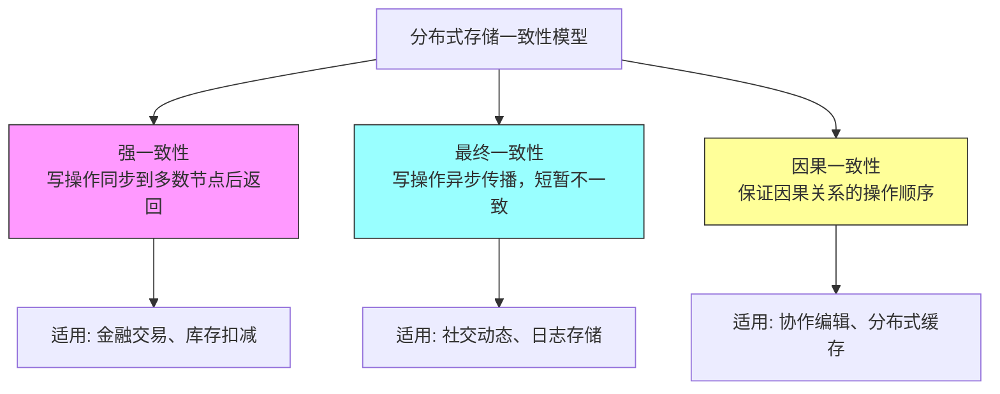

## 第38章-存储服务

### 1. 章节定位与学习目标

本章系统性地讲解存储服务的设计原理、核心架构与工程实践。存储服务是现代信息系统的基石——从数据库的底层持久化，到云对象存储的大规模数据湖，再到分布式文件系统的高可用设计，存储服务的质量直接决定了整个系统的可靠性、性能和扩展能力。

**本章学习目标：**

1. 理解存储服务的分层架构，掌握块存储、文件存储、对象存储三类范式的本质区别与适用场景
2. 掌握存储协议（SCSI/iSCSI、NFS/CIFS、S3/Swift）的设计原理与选型依据
3. 深入理解复制、纠删码、快照、精简配置等存储核心技术的实现机制
4. 能够设计和评估面向不同业务场景的存储解决方案
5. 了解分布式存储系统（Ceph、MinIO、GlusterFS）的架构与运维要点

### 2. 存储服务全景图

存储服务并非单一技术，而是一个多层级、多范式的完整技术栈：

┌─────────────────────────────────────────────────────┐
│                  应用层 (Application)                  │
│    数据库  │  对象存储API  │  文件系统挂载  │  块设备   │
├─────────────────────────────────────────────────────┤
│                  接口层 (Interface)                    │
│    SQL/NOSQL  │  REST API  │  POSIX  │  SCSI/iSCSI  │
├─────────────────────────────────────────────────────┤
│                  服务层 (Service)                      │
│  数据均衡  │  一致性协议  │  快照/克隆  │  压缩/加密   │
├─────────────────────────────────────────────────────┤
│                  逻辑层 (Logical)                      │
│  卷管理  │  RAID  │  纠删码  │  多副本  │  分条       │
├─────────────────────────────────────────────────────┤
│                  物理层 (Physical)                     │
│  HDD  │  SSD(NVMe/SATA)  │  持久化内存(CXL/PMEM)     │
└─────────────────────────────────────────────────────┘

### 3. 三大存储范式深度解析

#### 3.1 块存储（Block Storage）

块存储将数据划分为固定大小的块（通常 512B 或 4KB），每个块有独立的地址标识，支持随机读写。

**核心特征：**
- 以块为单位寻址，操作系统将其视为裸磁盘
- 支持随机 I/O，延迟最低（NVMe SSD 可达 10-50μs）
- 无内建元数据——文件系统由上层（操作系统）管理
- 通过 SCSI、iSCSI、FC（光纤通道）等协议访问

**典型场景：** 数据库数据文件（MySQL InnoDB、PostgreSQL）、虚拟机磁盘（QCOW2/VMDK）、高事务型 OLTP 系统。

**性能基准参考：**

| 存储介质 | 随机读 IOPS | 随机写 IOPS | 顺序带宽 | 典型延迟 |
|----------|------------|------------|---------|---------|
| SATA SSD | 80K-100K | 60K-80K | 500MB/s | 100-200μs |
| NVMe SSD | 500K-1M+ | 300K-800K | 3-7GB/s | 10-50μs |
| 持久化内存(CXL) | 5-10M+ | 3-5M+ | 10GB/s+ | <10μs |
| 15K HDD | 200-400 | 150-300 | 200MB/s | 3-5ms |

#### 3.2 文件存储（File Storage）

文件存储以文件和目录层级组织数据，通过 POSIX 接口提供标准化的文件操作（open/read/write/close）。

**核心特征：**
- 层次化命名空间（目录树），人类可读
- 支持文件锁、权限控制（ACL/POSIX permissions）
- 共享访问——多客户端可通过 NFS/SMB 挂载同一文件系统
- 延迟高于块存储（网络协议开销），但易用性和共享性更强

**典型场景：** Web 静态资源、开发团队共享代码库、用户上传文件存储、大数据 HDFS 的上层。

**分布式文件系统对比：**

| 特性 | NFS v4.1 | GlusterFS | CephFS |
|------|----------|-----------|--------|
| 架构 | C/S | 无中心 | 元数据集群 |
| 容量扩展 | 有限 | 线性扩展 | 线性扩展 |
| 元数据 | 服务端管理 | 无独立元数据服务 | MDS 集群 |
| 小文件性能 | 一般 | 较差（每个文件一个inode） | 较好 |
| 典型部署 | 企业内网 | 中小规模集群 | 大规模集群 |

#### 3.3 对象存储（Object Storage）

对象存储将数据封装为不可变的"对象"（Object），每个对象包含数据本体、元数据和全局唯一标识符，通过 RESTful API 访问。

**核心特征：**
- 扁平命名空间（无目录层级），通过 key-value 方式存取
- 对象不可变（写时覆盖为新版本），适合写一次读多次（WORM）场景
- 内建冗余——数据自动跨节点/机架/数据中心分布
- 海量扩展——理论无上限，EB 级存储
- 单对象大小限制（通常 5TB），不适合频繁随机写

**典型场景：** 静态资源托管（图片/视频/CDN 回源）、数据湖/数据归档、机器学习训练数据集、日志存储与分析。

**S3 API 核心操作：**

PUT    /bucket/key          # 上传对象
GET    /bucket/key          # 下载对象
HEAD   /bucket/key          # 获取对象元数据
DELETE /bucket/key          # 删除对象
LIST   /bucket?prefix=xxx   # 列举对象
POST   /bucket/key?uploadId  # 分片上传

### 4. 存储协议与接口体系

#### 4.1 块存储协议

| 协议 | 传输方式 | 典型延迟 | 适用场景 |
|------|---------|---------|---------|
| SAS/SATA | 本地总线直连 | <1ms | 本地磁盘 |
| FC (Fibre Channel) | 光纤网络(8/16/32Gbps) | 0.5-2ms | 企业 SAN |
| iSCSI | TCP/IP 网络 | 1-5ms | 以太网 SAN |
| NVMe-oF (FC/RoCE/TCP) | 高速网络 | 0.1-1ms | 新一代高性能 SAN |
| virtio-blk | 虚拟化直通 | 变化 | 虚拟机磁盘 |

#### 4.2 文件存储协议

| 协议 | 操作系统 | 特点 | 典型部署 |
|------|---------|------|---------|
| NFS v3 | Unix/Linux | 无状态，高性能 | 传统 Linux 环境 |
| NFS v4.1 | Unix/Linux | 有状态，pNFS并行 | 企业级共享 |
| SMB/CIFS | Windows | 集成AD认证 | Windows 域环境 |
| 9P (Plan 9) | 跨平台 | 轻量级 | 容器挂载(如 virtiofs) |
| FUSE | 用户空间 | 灵活但有性能损耗 | 云存储客户端挂载 |

#### 4.3 对象存储协议

- **S3（Amazon Simple Storage Service）**：事实标准，几乎所有对象存储系统都提供 S3 兼容 API
- **OpenStack Swift**：开源对象存储，适合私有云部署
- **CDMI（Cloud Data Management Interface）**：ISO 标准，推广有限

### 5. 存储核心技术深入

#### 5.1 数据复制与冗余

**多副本（Replication）：**
将数据完整复制到多个节点，默认 3 副本，容忍 2 节点故障。优点是恢复速度快（直接读副本），缺点是存储开销大（3 倍原始数据量）。

数据块 A ──┬──→ 节点1 (副本1)
           ├──→ 节点2 (副本2)     容忍任意 2 节点故障
           └──→ 节点3 (副本3)

**纠删码（Erasure Coding）：**
将数据分为 N 个数据块 + M 个校验块，只需任意 K = N 个块即可恢复原始数据。典型配置如 Reed-Solomon(4,2) 表示 4 数据块 + 2 校验块，存储开销仅 1.5 倍（对比 3 副本的 3 倍），同时容忍 2 块丢失。

原始数据 [A][B][C][D] → 编码 → [A][B][C][D][P1][P2]
存储开销: 6/4 = 1.5x  (对比 3 副本: 3x)
恢复任意 4/6 块 → 重建原始数据

**副本 vs 纠删码选型：**

| 维度 | 多副本 | 纠删码 |
|------|--------|--------|
| 存储效率 | 1/N（3副本=33%） | N/(N+M)（如67%） |
| 写性能 | 优秀（并发写3份） | 中等（需计算校验） |
| 读性能 | 优秀（就近读） | 需解码计算 |
| 故障恢复 | 快速（直接复制） | 需重建编码计算 |
| 适用场景 | 热数据、延迟敏感 | 冷数据、归档、大文件 |

#### 5.2 快照与克隆

**快照（Snapshot）**是存储在特定时间点的数据视图：

- **写时复制（CoW, Copy-on-Write）**：快照创建时仅记录元数据指针，仅在原始数据被修改时才复制原数据到快照空间。创建瞬间完成，但修改操作有额外延迟。
- **写时重定向（RoW, Redirect-on-Write）**：写操作将新数据写到新位置，旧数据保留在原处作为快照。读快照无需额外开销，但写操作需更新指针。
- **快照调度**：按时间策略（每小时/每日）自动创建，保留策略控制快照数量上限和生命周期。

**克隆（Clone）**基于快照创建可写副本，广泛用于数据库测试环境、开发环境的快速创建。

#### 5.3 数据压缩与去重

**在线压缩：**
- LZ4：压缩速度极快（>500MB/s），压缩比适中（2-3x），适合热数据
- ZSTD（Facebook）：可调压缩级别，平衡速度与压缩比（3-8x），Netflix、Cloudflare 广泛使用
- DEFLATE/gzip：高压缩比但 CPU 开销大，适合归档数据

**内联去重（Inline Deduplication）：**
写入时对数据块计算哈希（SHA-256），若已存在相同哈希的数据块则仅存储引用。典型去重率在虚拟化环境中可达 10:1 以上（大量相同 OS 镜像）。

**后处理去重（Post-process Deduplication）：**
先写入数据，后台定期扫描进行去重。延迟低但瞬时存储占用高。

#### 5.4 精简配置（Thin Provisioning）

传统存储预分配固定容量——即使实际使用很少，也占用全部配额。精简配置按实际使用量分配，管理员可以超额分配（如物理 10TB，分配给用户 30TB），依靠实际使用率不超过物理容量来保证运行。

传统配置:  分配 10TB → 物理占用 10TB → 实际使用 2TB → 浪费 8TB
精简配置:  分配 10TB → 物理占用 2TB  → 实际使用 2TB → 无浪费
          (需要监控实际使用率，防止超出物理容量)

### 6. 分布式存储架构设计

#### 6.1 架构模式

**中心化元数据架构（如 HDFS）：**
NameNode 存储所有文件→块的映射关系，DataNode 存储实际数据。简单但 NameNode 是单点瓶颈和故障点。

**无中心架构（如 GlusterFS）：**
使用一致性哈希将数据分布到所有节点，无元数据服务。扩展性好但目录遍历和小文件性能差。

**元数据集群架构（如 Ceph、MinIO）：**
元数据服务本身是分布式的，兼顾扩展性和元数据查询性能。Ceph 使用 CRUSH 算法计算数据位置，MinIO 使用 EC（Erasure Coding）+ 一致性哈希。

#### 6.2 一致性与可用性权衡

#### 6.3 数据放置策略

**CRUSH 算法（Ceph）：**
数据位置 = CRUSH(hash, cluster_map, ruleset)
- 基于集群拓扑（host → rack → row → datacenter）计算放置位置
- 不依赖中心化元数据，每个 OSD 可独立计算
- 支持故障域隔离（如两副本放在不同机架）
- 权重调整实现冷热数据分层

**一致性哈希（Dynamo 风格）：**
数据位置 = ConsistentHash(key, ring)
- 节点和数据映射到环上，数据存储在顺时针方向最近的节点
- 节点增减只影响相邻区间，迁移数据量最小
- 虚拟节点解决数据倾斜问题

### 7. 主流存储系统对比

| 特性 | Ceph | MinIO | GlusterFS | SeaweedFS |
|------|------|-------|-----------|-----------|
| 存储范式 | 块/文件/对象 | 对象（S3兼容） | 文件 | 对象/文件 |
| 元数据管理 | CRUSH + MDS | 无中心 | 无中心 | Filer Server |
| 数据保护 | 多副本/纠删码 | 纠删码 | 复制 | 多副本/纠删码 |
| 容量扩展 | EB级 | PB级 | PB级 | PB级 |
| 运维复杂度 | 高 | 低 | 中 | 低 |
| 适用场景 | 企业/超大规模 | 云原生/AI数据 | 中小规模文件 | 轻量级对象存储 |
| 开源协议 | LGPL-2.1 | AGPL v3 | GPL v3 | MIT |

### 8. 存储性能优化实战

#### 8.1 IO 栈优化路径

一次写请求从应用到落盘经过多层缓存，每层都有优化空间：

应用写入 → Page Cache → 文件系统日志 → IO调度器 → 设备驱动 → SSD/HDD
   ①         ②           ③            ④          ⑤         ⑥

| 层级 | 优化手段 | 效果 |
|------|---------|------|
| ① 应用层 | 批量写入、减少小文件 | 减少系统调用次数 |
| ② Page Cache | Direct IO 绕过缓存 / O_SYNC 保证持久化 | 控制缓存策略 |
| ③ 文件系统 | 调整 journal 大小、使用 noatime | 减少元数据操作 |
| ④ IO调度 | mq-deadline（SSD）/ bfq（HDD） | 优化IO队列 |
| ⑤ 驱动 | 使用 NVMe 驱动替代 SCSI | 减少协议栈开销 |
| ⑥ 设备 | 选择合适介质、启用 TRIM/DISCARD | 保持设备性能 |

#### 8.2 延迟分析方法论

请求总延迟 = 应用处理 + 网络传输 + 存储协议开销 + 设备IO延迟

典型案例分解（iSCSI 写入 NVMe SSD）：
  应用处理:       ~5μs
  TCP/IP 网络:    ~50-100μs  ← 瓶颈（考虑 RDMA/RoCE）
  iSCSI 协议:     ~20-50μs   ← 瓶颈（考虑 NVMe-oF）
  NVMe SSD 写入:  ~10-20μs
  ─────────────────────────
  总延迟:         ~85-175μs

### 9. 本章内容导航

本章包含以下小节，建议按顺序阅读：

| 小节 | 内容 | 核心关键词 |
|------|------|-----------|
| 理论基础 | 存储分层模型、IO 栈原理、ACID 与持久化 | 理论框架 |
| 核心技巧 | 数据复制、纠删码、快照、压缩去重 | 存储核心技术 |
| 实战案例 | Ceph 集群搭建、MinIO 对象存储部署、性能调优 | 工程实践 |
| 常见误区 | 容量规划陷阱、RAID 误用、快照滥用 | 避坑指南 |
| 练习方法 | 存储基准测试、故障注入、容量评估 | 动手实践 |
| 本章小结 | 知识体系梳理、延伸阅读推荐 | 复习总结 |

### 10. 关键指标速查

| 指标 | 定义 | 块存储基准 | 对象存储基准 | 文件存储基准 |
|------|------|-----------|-------------|-------------|
| IOPS | 每秒读写操作数 | 100K-1M (NVMe) | 10K-100K | 5K-50K |
| 带宽 | 每秒传输数据量 | 3-7 GB/s (NVMe) | 1-10 GB/s (聚合) | 1-3 GB/s |
| 延迟(P99) | 99%请求的响应时间 | <100μs (NVMe) | 5-50ms | 1-10ms |
| 可用性 | 年度可用时间比例 | 99.99% | 99.99-99.999% | 99.9-99.99% |
| 持久性 | 数据不丢失概率 | 依赖 RAID/副本 | 11个9 (S3标准) | 依赖实现 |

---

> **阅读建议：** 本章内容偏重工程实践，建议读者结合动手实验学习。理论基础部分提供了必要的背景知识，核心技巧和实战案例是本章重点，建议至少通读一遍后再进入后续章节的深入学习。
