# 第38章-存储服务 — 理论基础

## 本章学习目标

完成本节学习后，你将能够：

1. **理解**存储抽象层次模型，从物理设备层到应用层存储的完整栈
2. **区分**块存储、对象存储、文件存储的接口语义、适用场景和工程约束
3. **分析**CAP 定理在存储系统中的具体表现，根据业务需求选择一致性模型
4. **设计**数据冗余方案，权衡副本策略与纠删码在存储效率和重建性能之间的取舍
5. **评估**存储系统性能，使用 IOPS、延迟、吞吐量等多维指标进行量化分析
6. **构建**备份与灾难恢复策略，基于 RPO/RTO 框架做出合理的备份决策
7. **实施**存储加密与访问控制，理解信封加密和最小权限原则的工程实践
8. **评估**软件定义存储方案，掌握 Ceph、MinIO 等主流开源存储系统的架构特点
9. **理解**存储网络技术栈（FC、iSCSI、NVMe-oF、RDMA）及其在不同场景中的选择依据

---

## 存储服务全景：从硬件到服务的抽象层次

存储服务是所有软件系统的基石。无论是日活过亿的社交平台，还是运行在机房角落的内部系统，数据最终都要落到某种存储介质上。然而，"存储"远非"把数据写到磁盘"这么简单——从最底层的物理介质到最上层的云存储服务，中间存在多层抽象，每一层都解决不同的工程问题。

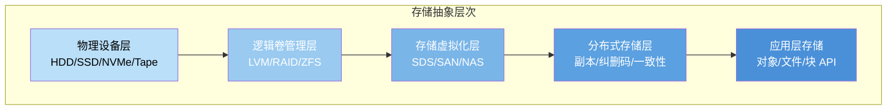

**每层抽象解决的核心问题：**

| 层次 | 核心问题 | 关键技术 | 典型故障模式 |
|------|----------|----------|-------------|
| 物理设备层 | 数据如何持久保存在介质上 | 磁记录/闪存/磁带 | 磁盘坏道、SSD 写放大、介质老化 |
| 逻辑卷管理层 | 如何聚合多块磁盘、提供容错 | RAID、LVM、ZFS、Btrfs | 重建期间 URE、RAID 5 写洞 |
| 存储虚拟化层 | 如何抽象物理资源、统一管理 | SAN、NAS、SDS | 控制器单点、网络拥塞 |
| 分布式存储层 | 如何跨节点分布数据并保证一致性 | 副本、EC、Raft/Paxos | 脑裂、数据不一致、网络分区 |
| 应用层存储 | 如何为应用提供合适的存储语义 | 对象/文件/块 API | API 语义误用、性能瓶颈 |

本节将从存储类型、存储网络、数据组织、一致性模型、冗余保护、性能指标、加密安全、数据管理、备份恢复九个维度，系统性地建立存储服务的理论框架。

---

## 一、三大存储类型深度剖析

### 1.1 块存储（Block Storage）

块存储是最底层的存储抽象，将物理设备划分为固定大小的块（通常 4KB），通过块地址（LBA, Logical Block Addressing）进行读写操作。它是数据库、虚拟机等对延迟敏感的工作负载的首选存储类型。

**I/O 栈分层**

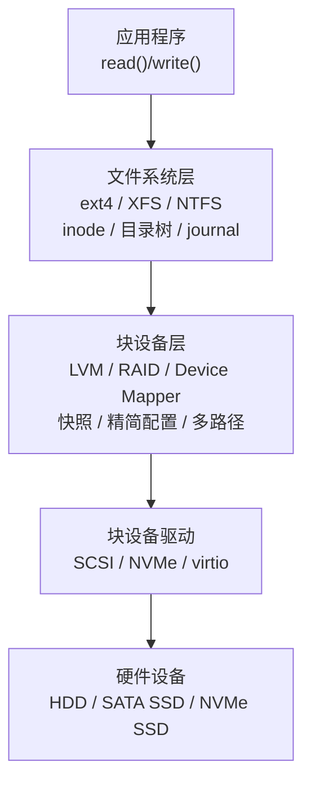

块存储的核心特征：

| 特征 | 说明 |
|------|------|
| 接口原语 | `read(lba, buffer)`, `write(lba, data)`, `flush()` |
| 寻址方式 | 线性块地址（LBA），无语义信息 |
| 典型块大小 | 512B（传统）或 4KB（高级格式化） |
| 一致性 | 强一致性（写入完成后即持久化） |
| 多客户端共享 | 不支持（同一时刻一个挂载点独占） |
| 对齐要求 | 现代 SSD 要求 4K 对齐，否则性能下降 50%+ |

**典型产品与场景**

| 产品类型 | 代表产品 | 协议 | 典型场景 | 延迟特征 |
|----------|----------|------|----------|----------|
| 本地磁盘 | /dev/sda, /dev/nvme0n1 | SCSI/NVMe | 数据库、日志 | μs 级 |
| SAN | Dell EMC PowerStore | FC (16/32Gbps) | Oracle RAC | 100μs 级 |
| iSCSI | NetApp ONTAP | iSCSI (10GbE) | VMware ESXi | 200μs 级 |
| 云块存储 | AWS EBS, 阿里云 ESSD | 私有协议 | 云服务器系统盘 | ms 级 |
| 分布式块 | Ceph RBD | RADOS | K8s PV | ms 级 |
| NVMe-oF | Lightbits, Pure//FlashArray//XL | NVMe/RoCEv2 | 分布式数据库 | <100μs 级 |

**性能指标详解**

```python
# 使用 fio 测试块存储性能的典型场景
# 场景1: 数据库 OLTP 负载（小随机读写）
fio --name=oltp --rw=randrw --rwmixread=70 \
    --bs=8K --size=100G --numjobs=8 \
    --iodepth=32 --runtime=120 --time_based \
    --filename=/dev/nvme0n1

# 场景2: 大文件顺序读（大数据分析）
fio --name=seqread --rw=read --bs=1M \
    --size=50G --numjobs=1 --iodepth=1 \
    --runtime=60 --filename=/dev/sda

# 场景3: 日志写入（顺序追加）
fio --name=append --rw=append --bs=4K \
    --size=10G --numjobs=1 --iodepth=4 \
    --filename=/dev/sda

# 场景4: 混合负载压测（模拟真实 OLTP）
fio --name=mixed --rw=randrw --rwmixread=70 \
    --bs=8K --size=200G --numjobs=16 \
    --iodepth=64 --runtime=600 --time_based \
    --group_reporting --filename=/dev/nvme0n1 \
    --write_bw_log=fio_log --write_lat_log=fio_log

# 场景5: 数据库 WAL 写入（同步小写入 + fsync）
fio --name=wal --rw=randwrite --bs=4K \
    --size=1G --numjobs=1 --iodepth=1 \
    --fsync=1 --filename=/dev/nvme0n1
```

| 存储类型 | 随机 IOPS (4K) | 顺序带宽 | 延迟 (avg) | 典型价位 ($/GB/月) |
|----------|----------------|----------|------------|---------------------|
| SATA HDD | 75-150 | 100-200 MB/s | 5-10 ms | 0.02 |
| SAS HDD | 150-250 | 200-300 MB/s | 3-5 ms | 0.04 |
| SATA SSD | 50K-90K | 500 MB/s | 0.1 ms | 0.10 |
| NVMe SSD | 100K-1M | 3-7 GB/s | 0.02-0.1 ms | 0.15-0.25 |
| NVMe-oF (RDMA) | 100K-1M | 3-7 GB/s | 0.03-0.15 ms | 0.20-0.30 |
| AWS EBS gp3 | 3K-16K | 125-1000 MB/s | 1 ms | 0.08 |
| AWS EBS io2 | 64K-256K | 1000 MB/s | 0.5 ms | 0.125 |
| 阿里云 ESSD PL1 | 10K-50K | 180-350 MB/s | 0.5-2 ms | 0.10 |
| 阿里云 ESSD PL3 | 1M | 4000 MB/s | 0.1 ms | 0.20 |

> **关键洞察**：IOPS 和带宽往往此消彼长。NVMe SSD 能同时提供高 IOPS 和高带宽，这正是它在高性能场景中不可替代的原因。选择存储时，必须先分析工作负载特征（随机 vs 顺序、读 vs 写比例、块大小），而非盲目追求参数最高值。一个常见的误区是只看 IOPS 数值——对于数据库来说，P99 延迟往往比峰值 IOPS 更重要。

**RAID 技术原理**

RAID（Redundant Array of Independent Disks）通过数据分布和冗余提升存储性能和可靠性：

| RAID 级别 | 数据分布 | 冗余方式 | 最少磁盘 | 容错 | 写惩罚 | 可用容量 |
|-----------|----------|----------|----------|------|--------|----------|
| RAID 0 | 条带化 | 无 | 2 | 0 | 1x | N × 磁盘 |
| RAID 1 | 镜像 | 完整复制 | 2 | N-1 | 2x | 磁盘/2 |
| RAID 5 | 分布式条带 | 分布式奇偶校验 | 3 | 1 | 4x | (N-1) × 磁盘 |
| RAID 6 | 分布式条带 | 双重奇偶校验 | 4 | 2 | 6x | (N-2) × 磁盘 |
| RAID 10 | 先镜像后条带 | 镜像 | 4 | 每组1 | 2x | N × 磁盘/2 |
| RAID 50 | RAID 5 + 条带化 | 分布式奇偶校验 | 6 | 每组1 | 4x | (N-G) × 磁盘 |
| RAID 60 | RAID 6 + 条带化 | 双重奇偶校验 | 8 | 每组2 | 6x | (N-2G) × 磁盘 |

```python
# RAID 5 奇偶校验计算演示
def raid5_write_demo():
    """
    RAID 5 写入流程（读-修改-写策略）
    假设 4 盘 RAID 5：D0, D1, D2, P（校验盘轮转分布）
    """
    # 新数据写入 D1
    new_data = 0b10110100

    # 步骤1：读取旧数据 D1_old 和旧校验 P_old
    D1_old = 0b01101010
    P_old  = 0b11000110

    # 步骤2：计算新校验（XOR 三元关系）
    # P_new = D0 XOR D1_new XOR D2 XOR ... = P_old XOR D1_old XOR D1_new
    P_new = P_old ^ D1_old ^ new_data

    # 步骤3：写入新数据和新校验
    write(new_data)   # D1
    write(P_new)      # P

    # 验证：D0 XOR D1_new XOR D2 XOR P_new 应等于 0
    print(f"新校验值: {P_new:#010b}")
    print(f"校验验证: {D0 ^ new_data ^ D2 ^ P_new}  (应为 0)")

# 磁盘故障恢复演示
def raid5_rebuild_demo():
    """
    RAID 5 单盘故障重建
    D1 故障，从 D0, D2, P 恢复
    """
    D0 = 0b11001100
    D2 = 0b10101010
    P  = 0b01100110

    # 恢复: D1 = D0 XOR D2 XOR P
    D1_recovered = D0 ^ D2 ^ P
    print(f"恢复数据: {D1_recovered:#010b}")
```

> **工程实践警示**：RAID 5 在大容量磁盘时代（>4TB）面临 URE（Unrecoverable Read Error）风险。重建期间需要读取全盘数据，如果遇到 URE（概率约 50%），整个 RAID 阵列将崩溃。生产环境建议使用 RAID 6 或 RAID 10，或配合 ZFS 的校验和机制。RAID 的写惩罚（Write Penalty）也是常被忽视的性能杀手：RAID 5 随机小写入需要"读旧数据+读旧校验+写新数据+写新校验"四次操作，实际 IOPS 可能降至裸盘的 1/4。

**ZFS 与传统 RAID 的对比**

ZFS 创造性地将文件系统和卷管理合并，提供了一系列超越传统 RAID 的能力：

| 能力 | 传统 RAID (mdadm) | ZFS |
|------|-------------------|-----|
| 数据校验 | 仅校验块级 | 端到端校验和（SHA-256/Edon-R） |
| 自修复 | 不支持 | 自动检测并修复静默数据损坏 |
| 快照 | 不支持 | 即时快照，COW 语义 |
| 压缩 | 不支持 | 透明在线压缩（LZ4/ZSTD） |
| 去重 | 不支持 | 基于块的在线去重 |
| 精简配置 | 不支持 | 原生 Thin Provisioning |
| 缓存 | 仅读缓存 | L2ARC（读缓存）+ ZIL（写日志） |
| 最小磁盘数 | 2 (RAID 1) | 1（单盘也享受校验和保护） |

---

### 1.2 对象存储（Object Storage）

对象存储是云时代最流行的存储范式，以**对象**为基本存储单位，通过 HTTP REST API 进行访问。它牺牲了文件系统的层级结构和块存储的随机读写能力，换取了近乎无限的横向扩展性和极低的每 GB 存储成本。

**对象的三元结构**

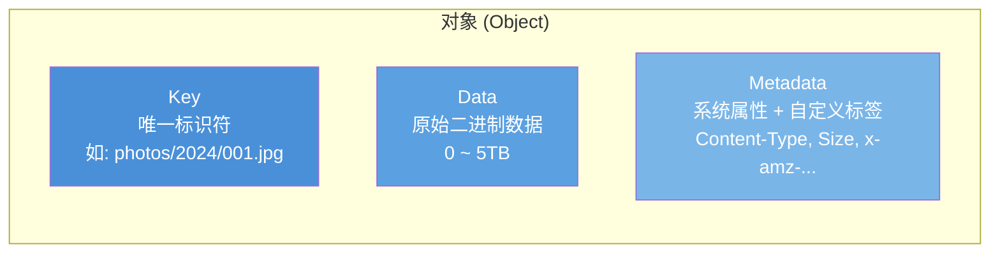

**核心设计原则**

| 原则 | 说明 | 工程影响 |
|------|------|----------|
| 扁平命名空间 | 无目录层级，只有 Key 字符串 | 支持十亿级对象，无需目录遍历 |
| 不可变性 | 对象创建后不可原地修改 | 只能删除后重新上传新版本 |
| 一次写入多处读 | 写入完成后可被任意位置的客户端读取 | 天然适合 CDN、跨地域复制 |
| 自包含元数据 | 对象携带丰富的元数据 | 支持基于元数据的搜索和策略 |
| HTTP 原生 | 通过 REST API 操作 | 跨语言、跨平台、易集成 |
| 幂等写入 | 相同 Key 重复 PUT 覆盖而非报错 | 简化重试逻辑，天然容错 |

**与文件系统的关键区别**

| 维度 | 文件系统 | 对象存储 |
|------|----------|----------|
| 组织方式 | 目录树层级结构（可深可浅） | 扁平键值空间（无层级） |
| 接口 | POSIX（open/read/write/close/seek） | HTTP REST（GET/PUT/DELETE/HEAD） |
| 原子性操作 | read/write（支持偏移量） | 整对象替换（不支持 append） |
| 元数据 | 有限的系统属性（mtime, size, perms） | 丰富的自定义元数据（用户标签） |
| 一致性 | 强一致性（本地文件系统） | 强/最终一致性（取决于实现） |
| 扩展性 | 受限于单机/单挂载点 | 天然分布式，无限横向扩展 |
| 访问控制 | POSIX 权限 + ACL | IAM + Bucket Policy + 预签名 URL |
| 适用数据量 | GB ~ TB 级 | TB ~ PB 级 |
| 单对象大小 | 无限制 | 通常最大 5TB (S3) |
| 列表性能 | 目录遍历 O(n) | 前缀查询 + 分页，极高性能 |

**S3 API 操作分类**

```python
import boto3

# 初始化 S3 客户端
s3 = boto3.client('s3',
    endpoint_url='http://minio:9000',
    aws_access_key_id='minioadmin',
    aws_secret_access_key='minioadmin'
)

# === Bucket 操作 ===
s3.create_bucket(Bucket='my-bucket')                     # 创建桶
s3.delete_bucket(Bucket='my-bucket')                     # 删除桶
s3.head_bucket(Bucket='my-bucket')                       # 检查桶是否存在

# === Object 写入操作 ===
# PUT 单个对象（最大 5GB）
s3.put_object(
    Bucket='my-bucket',
    Key='data/report.csv',
    Body=open('report.csv', 'rb'),
    ContentType='text/csv',
    Metadata={'department': 'finance', 'year': '2024'},
    ServerSideEncryption='aws:kms',                      # 服务端加密
    StorageClass='STANDARD_IA'                           # 低频存储
)

# 分段上传（>100MB 的大文件，断点续传）
from boto3.s3.transfer import TransferConfig
config = TransferConfig(multipart_threshold=100*1024*1024,
                        multipart_chunksize=100*1024*1024)
s3.upload_file('large_file.tar.gz', 'my-bucket',
               'backups/large_file.tar.gz', Config=config)

# === Object 读取操作 ===
response = s3.get_object(Bucket='my-bucket', Key='data/report.csv')
content = response['Body'].read().decode('utf-8')

# Range 请求（部分内容读取，适合断点续传和大文件分块读取）
response = s3.get_object(Bucket='my-bucket', Key='data/report.csv',
                         Range='bytes=0-1023')            # 只读前 1KB

# === Object 列表操作（前缀过滤 + 分页）===
paginator = s3.get_paginator('list_objects_v2')
for page in paginator.paginate(Bucket='my-bucket', Prefix='data/',
                               PaginationConfig={'MaxItems': 100}):
    for obj in page.get('Contents', []):
        print(f"{obj['Key']}  {obj['Size']} bytes  {obj['LastModified']}")

# === Object 管理操作 ===
# 复制对象（同桶或跨桶）
s3.copy_object(
    CopySource={'Bucket': 'my-bucket', 'Key': 'data/report.csv'},
    Bucket='my-bucket',
    Key='archive/report-2024.csv'
)

# 设置生命周期规则（自动过渡存储层级）
s3.put_bucket_lifecycle_configuration(
    Bucket='my-bucket',
    LifecycleConfiguration={
        'Rules': [{
            'ID': 'auto-archive',
            'Filter': {'Prefix': 'logs/'},
            'Status': 'Enabled',
            'Transitions': [
                {'Days': 30, 'StorageClass': 'STANDARD_IA'},
                {'Days': 90, 'StorageClass': 'GLACIER'},
            ],
            'Expiration': {'Days': 365}    # 365天后自动删除
        }]
    }
)
```

**一致性模型深度解析**

| 模型 | 说明 | S3 行为 | 适用场景 |
|------|------|---------|----------|
| 强一致性 | 写入完成后，后续读取立即可见最新数据 | S3 自 2020 年 12 月起提供 | 金融交易、库存管理 |
| 读后写一致性 | PUT 后 GET 一定能读到最新，但 LIST 可能延迟 | S3 的 LIST 操作 | 日常应用 |
| 最终一致性 | 写入后经过一段时间才能全局可见 | 旧版 S3、多数开源实现 | 日志、静态资源 |

> **实际影响**：在分布式文件系统（如 HDFS）中写入一个 Block 后，其他 DataNode 可能还未同步完成。如果客户端立即读取另一个副本，可能读到旧数据。设计系统时必须明确一致性语义。即使 S3 在 2020 年已提供强一致性，许多开源对象存储（如 MinIO 单节点）仍需关注其一致性保证。

**存储层级与成本优化**

```mermaid
graph LR
    subgraph "访问频率"
        A["频繁访问<br/>实时业务数据"] --> B["偶尔访问<br/>报表/分析数据"]
        B --> C["很少访问<br/>合规/审计数据"]
        C --> D["几乎不访问<br/>归档/冷备份"]
    end
    subgraph "对应存储层级"
        E["标准存储<br/>S3 Standard<br/>¥0.12/GB/月"]
        F["低频访问<br/>S3 Standard-IA<br/>¥0.08/GB/月"]
        G["归档存储<br/>S3 Glacier<br/>¥0.03/GB/月"]
        H["深度归档<br/>S3 Glacier Deep Archive<br/>¥0.01/GB/月"]
    end
    A --> E
    B --> F
    C --> G
    D --> H
```

| 层级 | AWS S3 | 阿里云 OSS | 访问延迟 | 取回费用 | 最小存储期限 |
|------|--------|------------|----------|----------|--------------|
| 标准 | S3 Standard | 标准存储 | 毫秒级 | 无 | 无 |
| 低频 | S3 Standard-IA | 低频访问 | 毫秒级 | ¥0.03/GB | 30 天 |
| 智能分层 | S3 Intelligent-Tiering | 智能分层 | 毫秒级 | 无 | 30 天 |
| 归档 | S3 Glacier Instant | 归档存储 | 分钟级 | ¥0.03/GB | 60 天 |
| 深度归档 | S3 Glacier Deep Archive | 冷归档 | 12-48 小时 | ¥0.02/GB | 180 天 |

> **成本优化要点**：存储层级选择不能只看存储单价——低频存储的取回费用和最小存储期限是关键约束。一个典型陷阱：将 10GB 日志设为 Glacier 存储，每天取回一次分析，取回费用（¥0.30/GB × 10GB × 30天 = ¥90/月）远超存储节省的费用。正确做法是根据实际访问频率，配合生命周期策略自动过渡存储层级。

---

### 1.3 文件存储（File Storage / NAS）

文件存储提供标准的文件系统接口（POSIX 或 SMB/CIFS），支持多个客户端通过网络同时挂载访问同一目录树。它是传统应用迁移上云和容器化场景中最常见的持久化方案。

**NFS 协议演进**

| 版本 | 发布年份 | 传输层 | 关键特性 |
|------|----------|--------|----------|
| NFSv2 | 1989 | UDP | 仅支持无状态操作，最大传输 32 位文件大小 |
| NFSv3 | 1995 | TCP/UDP | 支持大文件（64位偏移）、异步写入、直接 I/O |
| NFSv4 | 2000 | TCP | 增加状态管理、复合操作、ACL、委派、迁移 |
| NFSv4.1 | 2010 | TCP | 并行 NFS (pNFS)、会话持久化、pNFS flexfile |
| NFSv4.2 | 2016 | TCP | 拷贝操作、稀疏文件、服务器端复制、标签 |

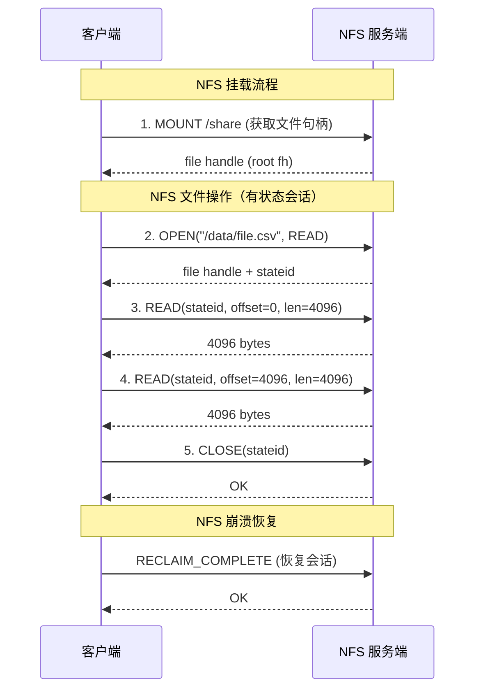

**NFS 性能调优关键参数**

| 参数 | 默认值 | 推荐值 | 说明 |
|------|--------|--------|------|
| rsize/wsize | 65536 | 1048576 (1MB) | 读/写块大小，增大可提升吞吐 |
| hard/soft | hard | hard | soft 模式下超时返回错误，可能丢数据 |
| async/sync | sync | async + flush | 异步写入提升性能，需配合 flush |
| noatime | 默认访问时间更新 | noatime | 减少元数据写入，提升性能 |
| numdelegations | 未设置 | 128-256 | NFSv4 委派数量，影响并发性能 |

**分布式文件系统对比**

| 系统 | 架构 | 元数据管理 | 数据分布 | 适用场景 | 限制 |
|------|------|------------|----------|----------|------|
| HDFS | Master-Slave | NameNode（单点/HAFS） | Block 128MB + 3 副本 | 大数据批处理 | 不支持小文件、不支持随机写 |
| CephFS | MDS + RADOS | 多 MDS 活跃集群 | 对象存储在 OSD 上 | 通用文件存储 | 配置复杂，MDS 调优需经验 |
| GlusterFS | 无中心 | 算法路由 | 一致性哈希 | 高吞吐文件共享 | 元数据性能受限，大目录慢 |
| JuiceFS | 元数据外部化 | Redis/TiKV/MySQL | 对象存储后端 | 云原生文件系统 | 需要外部元数据引擎，增加运维复杂度 |
| Amazon EFS | 托管 NFSv4.1 | AWS 内部 | 自动扩展 | K8s/ECS 持久化 | 仅 AWS 生态，成本较高 |
| Azure Files | 托管 SMB/NFS | Azure 内部 | 自动扩展 | 混合云文件共享 | 性能受限于 SKU 层级 |

**HDFS 架构深度解析**

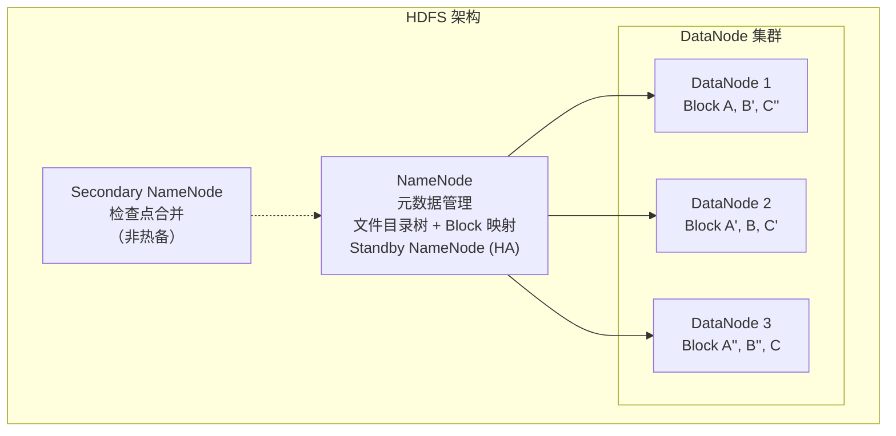

> **HDFS 设计哲学**：HDFS 针对大文件顺序读写优化，Block 大小默认 128MB（而非文件系统的 4KB），目的是减少 NameNode 元数据量和磁盘寻址开销。这使得 HDFS 非常适合 MapReduce/Spark 等批处理框架，但不适合存储海量小文件（每个文件约占 NameNode 内存 150 bytes）。生产中需要定期运行 HDFS 小文件合并工具（如 Hadoop Archive 或 Spark 聚合任务）来控制 NameNode 内存增长。

**POSIX 语义兼容性对比**

不同分布式文件系统对 POSIX 语义的支持程度差异很大，直接影响上层应用的兼容性：

| POSIX 语义 | HDFS | CephFS | GlusterFS | JuiceFS |
|------------|------|--------|-----------|---------|
| 顺序读写 | ✅ | ✅ | ✅ | ✅ |
| 随机读 | ✅ | ✅ | ✅ | ✅ |
| 随机写 | ❌（仅 append） | ✅ | ✅ | ✅ |
| 文件锁 (flock) | ❌ | ✅ | ✅ | ✅ |
| 硬链接 | ❌ | ✅ | ✅ | ❌ |
| 符号链接 | ❌ | ✅ | ✅ | ✅ |
| mmap | ❌ | ✅ | 部分 | ✅ |
| xattr | ❌ | ✅ | ✅ | 部分 |
| O_DIRECT | ❌ | ✅ | ✅ | ❌ |

---

## 二、存储网络技术

存储网络是连接计算节点和存储设备的基础设施，不同网络技术在延迟、带宽和成本上差异显著。

### 2.1 存储网络协议栈

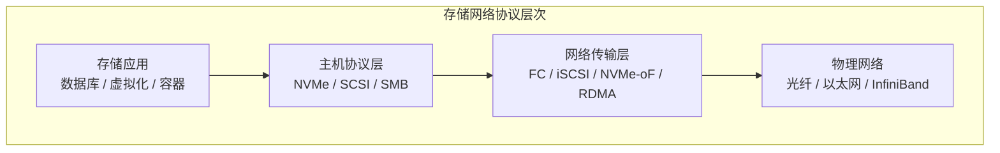

### 2.2 存储网络技术对比

| 技术 | 协议 | 带宽 | 延迟 | 成本 | 适用场景 |
|------|------|------|------|------|----------|
| Fibre Channel (FC) | FC-4 SCSI | 16/32/64 Gbps | 1-2 μs | 高（专用 HBA + 交换机） | 企业 SAN、Oracle RAC |
| iSCSI | TCP/IP + SCSI | 10/25/100 Gbps | 10-50 μs | 低（复用以太网） | VMware、中小型 SAN |
| NVMe over FC (FC-NVMe) | FC + NVMe | 32/64 Gbps | <1 μs | 高 | 高性能 NVMe SAN |
| NVMe over RoCEv2 | RDMA + NVMe | 100/200 Gbps | 2-5 μs | 中（需 RDMA 网卡） | 分布式数据库、AI 训练 |
| NVMe over TCP | TCP + NVMe | 10/25/100 Gbps | 10-30 μs | 低（标准以太网） | 云原生存储、NVMe-oF 入门 |
| SMB Direct (RDMA) | RDMA + SMB | 100 Gbps | 2-5 μs | 中 | Windows 文件共享 |

### 2.3 RDMA 技术深入

RDMA（Remote Direct Memory Access）允许一台计算机直接访问另一台计算机的内存，绕过操作系统内核，实现极低延迟的数据传输：

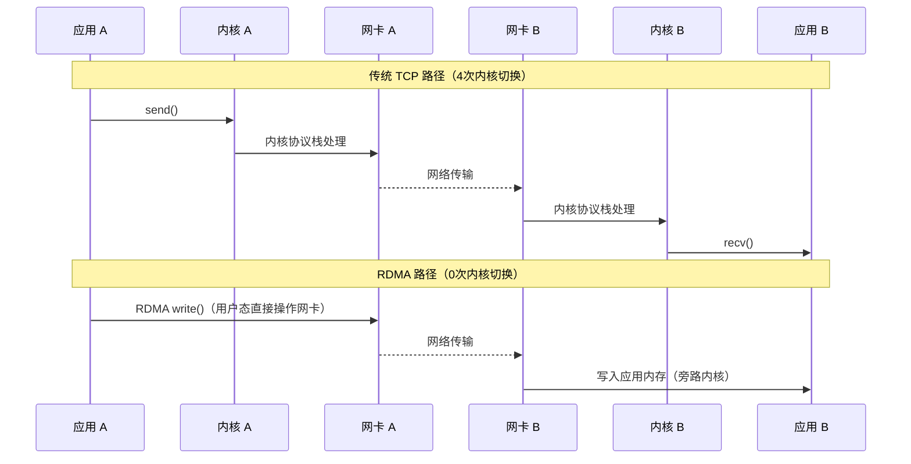

**RDMA 三种实现方式：**

| 实现 | 底层网络 | 部署难度 | 性能 | 适用场景 |
|------|----------|----------|------|----------|
| InfiniBand (IB) | InfiniBand 网络 | 高（专用网络） | 极致 | HPC、AI 训练集群 |
| RoCEv2 | 以太网（需 DCB） | 中等 | 接近 IB | 数据中心存储网络 |
| iWARP | 以太网（TCP） | 低 | 略低于 RoCE | 跨子网 RDMA |

### 2.4 存储网络选型决策

是否需要超低延迟（<10μs）？
├── 是 → 数据中心内还是跨子网？
│   ├── 数据中心内 → 有 InfiniBand？→ Yes: InfiniBand / No: RoCEv2
│   └── 跨子网 → iWARP
└── 否 → 复用现有以太网？
    ├── 是 → iSCSI 或 NVMe over TCP
    └── 否（有 FC 交换机）→ FC / FC-NVMe

---

## 三、存储一致性模型

一致性模型决定了存储系统在并发读写时的行为保证，是系统设计中最关键的权衡维度之一。

### 3.1 一致性光谱

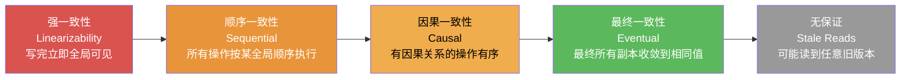

**一致性模型在实际系统中的映射：**

| 一致性模型 | 等待确认数 | 实现复杂度 | 性能代价 | 典型系统 |
|------------|-----------|-----------|---------|----------|
| 线性一致性 | 所有副本 (N) | 极高 | 延迟 = 最慢副本 | etcd (Raft quorum write) |
| 顺序一致性 | 多数副本 (N/2+1) | 高 | 延迟 = 中位副本 | ZooKeeper (ZAB) |
| 因果一致性 | 因果链内副本 | 中等 | 需要向量时钟 | MongoDB (因果一致性会话) |
| 最终一致性 | 仅主副本 (1) | 低 | 延迟最低 | Cassandra (默认)、DynamoDB |
| 会话一致性 | 单会话内保证 | 低 | 会话内缓存 | Redis Cluster (READONLY) |

### 3.2 CAP 定理在存储中的应用

CAP 定理指出：在网络分区（P）发生时，系统必须在一致性（C）和可用性（A）之间做出选择。

| 选择 | 特点 | 存储系统代表 | 实际影响 |
|------|------|-------------|----------|
| CP（一致性优先） | 宁可拒绝服务，也不返回脏数据 | etcd, ZooKeeper, HBase | 分区期间部分请求失败 |
| AP（可用性优先） | 宁可返回旧数据，也不拒绝请求 | Cassandra, DynamoDB, Riak | 可能读到过期数据 |
| CA（无分区容忍） | 仅在无网络分区时可用（单机数据库） | MySQL 单机, PostgreSQL 单机 | 单点故障风险 |

> **实际考量**：在现代云环境中，网络分区是常态而非异常。完全放弃分区容忍是不现实的。大多数分布式存储系统选择 AP 模式，配合应用层补偿来实现最终一致性。而 PACELC 定理进一步指出：即使在无分区（E）的正常运行时，也需要在延迟（L）和一致性（C）之间权衡——Cassandra 的 Tunable Consistency 就是这一思想的典型实践。

### 3.3 一致性在存储操作中的具体表现

```python
class StorageConsistencyDemo:
    """
    演示不同一致性模型下的读写行为
    假设一个 3 副本存储系统
    """
    def write_strong_consistency(self, key, value):
        """
        强一致性写入流程:
        1. 写入所有 3 个副本（同步）
        2. 等待所有副本确认
        3. 才返回成功给客户端
        """
        for replica in self.replicas:
            replica.write(key, value)  # 同步写入
        # 所有副本都写入成功后才返回
        return {"status": "ok", "ack_count": 3}

    def write_eventual_consistency(self, key, value):
        """
        最终一致性写入流程:
        1. 写入主副本（同步）
        2. 异步复制到从副本
        3. 主副本写入成功即返回
        """
        self.primary.write(key, value)  # 同步写主副本
        for replica in self.secondaries:
            self.async_replicate(replica, key, value)  # 异步复制
        return {"status": "ok", "ack_count": 1}

    def read_with_consistency(self, key, consistency='eventual'):
        """
        不同一致性模型的读取行为差异
        """
        if consistency == 'strong':
            # 强一致性读：从最新确认的副本读取
            return self.primary.read(key)

        elif consistency == 'quorum':
            # Quorum 读：从多数副本读取，取最新版本
            reads = []
            for r in self.replicas[:2]:  # 读 2 个副本 (quorum)
                reads.append(r.read(key))
            return max(reads, key=lambda v: v.version)

        else:
            # 最终一致性读：可能从任意副本读取（可能读到旧数据）
            replica = random.choice(self.replicas)
            return replica.read(key)

    def read_repair(self, key):
        """
        读修复（Read Repair）：读取时发现不一致，触发后台修复
        这是最终一致性系统保持数据收敛的常见机制
        """
        values = [r.read(key) for r in self.replicas]
        versions = [v.version for v in values]

        if len(set(versions)) > 1:  # 检测到不一致
            latest = max(values, key=lambda v: v.version)
            # 后台异步修复不一致的副本
            for r in self.replicas:
                if r.read(key).version != latest.version:
                    self.async_replicate(r, key, latest)
            return latest

        return values[0]  # 所有副本一致
```

---

## 四、数据冗余与保护机制

### 4.1 副本策略

多副本是最直观的数据保护方式，通过在不同节点存储数据副本来容忍节点故障。

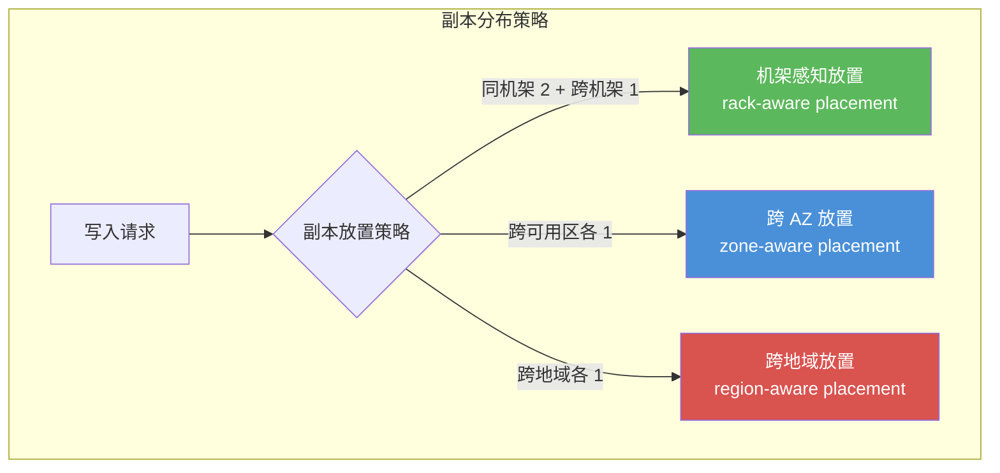

**副本放置策略对比**

| 策略 | 机架故障容忍 | AZ 故障容忍 | 地域故障容忍 | 网络开销 | 适用场景 |
|------|-------------|-------------|-------------|----------|----------|
| 3 副本同机架 | 0 | 0 | 0 | 最低 | 测试环境 |
| 3 副本跨机架 | 1 机架 | 0 | 0 | 中等 | 单 AZ 部署 |
| 3 副本跨 AZ | 1 机架 | 1 AZ | 0 | 较高 | 云上生产环境 |
| 3 副本跨地域 | 1 机架 | 1 AZ | 1 地域 | 最高 | 灾备场景 |
| 5 副本跨 AZ | 2 机架 | 2 AZ | 0 | 高 | 高可用金融场景 |

**Quorum 机制**

在 N 副本系统中，读写 quorum 保证数据一致性：

W + R > N    →  强一致性保证（读写 quorum 必然有交集）
W > N/2      →  写 quorum（至少多数确认才算成功）
R > N/2      →  读 quorum（至少多数响应中取最新）

常见配置：
- (N=3, W=2, R=2): 读写 quorum 交集 = 1，允许 1 副本故障
- (N=3, W=1, R=3): 写快读慢，适合写多读少场景
- (N=3, W=3, R=1): 写慢读快，适合读多写少场景

### 4.2 纠删码（Erasure Coding）

纠删码通过数学编码替代多副本，在相同容错能力下大幅降低存储开销。

**Reed-Solomon 编码原理**

```python
import numpy as np

def reed_solomon_encode(data_blocks, k, m):
    """
    Reed-Solomon 编码的核心原理
    k: 数据块数量
    m: 校验块数量
    总共 k+m 个块，任意 k 个可恢复原始数据
    """
    # 使用 Vandermonde 矩阵作为生成矩阵
    # Vandermonde 矩阵保证任意 k 行都是线性无关的
    # 这意味着任意 k 个编码块都能解码出原始数据
    n = k + m
    V = np.array([
        [pow(j, i) for j in range(1, n + 1)]
        for i in range(k)
    ], dtype=np.int64)

    # 编码：encoded = data @ V
    # 将 k 个数据块映射为 n 个编码块
    data_matrix = np.array(data_blocks, dtype=np.int64)
    encoded = data_matrix @ V

    # 返回数据块 + 校验块
    return encoded[:k].tolist(), encoded[k:].tolist()

def reed_solomon_decode(available_data, k, m, lost_indices):
    """
    Reed-Solomon 解码
    当丢失 m 个块时，从剩余 k 个块恢复
    """
    n = k + m
    # 构造子 Vandermonde 矩阵（只取可用的 k 个位置）
    available = [i for i in range(n) if i not in lost_indices][:k]
    V_sub = np.array([
        [pow(j + 1, i) for j in available]
        for i in range(k)
    ], dtype=np.int64)

    # 解码：data = available_blocks @ V_sub^{-1}
    V_inv = np.linalg.inv(V_sub)
    available_blocks = np.array(available_data, dtype=np.int64)
    recovered = available_blocks @ V_inv

    return recovered.tolist()
```

**纠删码 vs 副本：存储效率对比**

| 配置 | 数据块 k | 校验块 m | 存储开销 | 容错块数 | 存储效率 | 重建时间 |
|------|----------|----------|----------|----------|----------|----------|
| 3 副本 | — | — | 3.0x | 2 | 33.3% | 快（复制） |
| RS(4,2) | 4 | 2 | 1.5x | 2 | 66.7% | 中等 |
| RS(6,3) | 6 | 3 | 1.5x | 3 | 66.7% | 较慢 |
| RS(8,4) | 8 | 4 | 1.5x | 4 | 66.7% | 慢 |
| RS(10,4) | 10 | 4 | 1.4x | 4 | 71.4% | 较慢 |
| LRC(6,2,3) | 6 | 2+3 局部 | 1.5x | 2 局部+3 全局 | 66.7% | 快（局部修复） |
| LRC(10,4,2) | 10 | 4+2 局部 | 1.4x | 4 局部+2 全局 | 71.4% | 快（局部修复） |

> **工程权衡**：纠删码虽然节省存储空间，但编码/解码的 CPU 开销较高（特别是小文件场景），且重建时需要读取大量数据。生产环境中通常对大文件（>1MB）使用纠删码，小文件使用副本。Azure 的 LRC（Locally Repairable Codes）通过引入局部校验块，减少了单块修复时需要读取的数据量——修复一个块只需读取 k_local 个块而非全部 k 个块，这在大规模集群中显著降低了修复带宽和时间。

### 4.3 数据持久性计算

数据持久性（Durability）衡量数据在一定时间范围内不丢失的概率。业界标准如 AWS S3 宣称提供 11 个 9（99.999999999%）的持久性。

**年度数据丢失概率计算**

P(数据丢失) = 1 - (1 - P_URE)^(N_drives × P_failure × Time)

其中:
  P_URE: 不可恢复读错误概率 (如 10^-14 for enterprise HDD)
  N_drives: 总磁盘数
  P_failure: 年度磁盘故障率 (如 2% for enterprise HDD)
  Time: 存储时间（年）

```python
def calculate_durability():
    """
    计算不同冗余策略下的数据年丢失概率
    """
    import math

    # 磁盘参数
    drive_AFR = 0.02           # 年故障率 2%
    drive_URE_prob = 1e-14     # 不可恢复读错误概率
    sector_size = 4096         # 扇区大小

    configs = {
        "3副本(同机架)": {
            "replication": 3,
            "rack_failure_prob": 0.01,   # 机架年故障率
            "data_loss_condition": "2+ drives fail in same group"
        },
        "3副本(跨AZ)": {
            "replication": 3,
            "az_failure_prob": 0.001,     # AZ年故障率
            "data_loss_condition": "2+ AZs fail simultaneously"
        },
        "RS(4,2)": {
            "replication": 1.5,
            "max_drive_loss": 2,
            "data_loss_condition": "3+ drives fail before rebuild"
        }
    }

    # 示例：RS(6,3) 在 1000 节点集群中
    k, m = 6, 3
    n_drives = 1000
    rebuild_time_days = 8    # 重建时间 8 天

    # 重建期间故障概率
    P_rebuild_fail = 1 - (1 - drive_AFR) ** (rebuild_time_days / 365)

    # 需要连续丢失 (m+1) 个块才丢数据
    # 使用二项分布近似
    from scipy.stats import binom
    P_loss = binom.pmf(m + 1, n_drives, P_rebuild_fail)

    print(f"RS({k},{m}) 在 {n_drives} 节点集群中:")
    print(f"  重建时间: {rebuild_time_days} 天")
    print(f"  重建期间单盘故障概率: {P_rebuild_fail:.6f}")
    print(f"  数据丢失概率: {P_loss:.2e}")
    print(f"  等效持久性: {1 - P_loss:.15f}")

calculate_durability()
```

**11 个 9 持久性的含义**

AWS S3 宣称的 99.999999999%（11 个 9）持久性意味着：

存储 100 亿个对象，预期每年丢失 1 个对象

换算：
- 每 TB 每年丢失概率：0.000000000001
- 存储 1PB 数据 10 年：预期丢失 0.1 个对象
- 这不是磁盘级的保证，而是系统级的综合保证
  包括：多副本分布、自动修复、校验和检测、人工运维

---

## 五、存储性能深入分析

### 5.1 性能指标体系

存储性能不是单一指标，而是一个多维度的评估框架：

| 指标 | 定义 | 衡量维度 | 优化方向 |
|------|------|----------|----------|
| IOPS | 每秒 I/O 操作数 | 随机小 I/O 性能 | 增加并行度、使用 SSD |
| 吞吐量 | 每秒传输字节数 (MB/s) | 顺序大 I/O 性能 | 增大块大小、多流并发 |
| 延迟 | 单次 I/O 响应时间 | 用户体验 | 减少队列深度、就近部署 |
| P99 延迟 | 99 分位延迟 | 尾部延迟 | 减少抖动、资源隔离 |
| P999 延迟 | 99.9 分位延迟 | 极端尾部延迟 | 排除长尾、资源隔离 |
| 带宽利用率 | 实际带宽/理论带宽 | 资源效率 | 调优 I/O 调度器 |

> **为什么 P99 延迟比平均延迟更重要？** 假设平均延迟 1ms，但 P99 延迟达到 100ms。在每秒 10,000 次请求的系统中，这意味着约 100 次请求会超过 100ms。对于用户来说，这就是明显的卡顿。Google 的研究表明，延迟每增加 100ms，收入下降 1%。P999（千分之一）延迟在大规模系统中同样关键——在 QPS 为 100 万的系统中，P999 意味着每秒 1000 次请求超过阈值。

**延迟分解模型**


一次 I/O 请求的完整延迟链路：

| 延迟组成 | HDD | SATA SSD | NVMe SSD | NVMe-oF (RDMA) |
|----------|-----|----------|----------|-----------------|
| 应用层处理 | ~1 μs | ~1 μs | ~1 μs | ~1 μs |
| 网络栈（如适用） | N/A | N/A | N/A | ~2 μs |
| 协议栈 | ~5 μs | ~5 μs | ~5 μs | ~3 μs |
| 设备队列 | ~10 μs | ~5 μs | ~3 μs | ~3 μs |
| 介质访问 | 3-10 ms | ~50 μs | ~10 μs | ~10 μs |
| **总计** | **3-10 ms** | **~60 μs** | **~20 μs** | **~20 μs** |

### 5.2 I/O 调度与队列深度

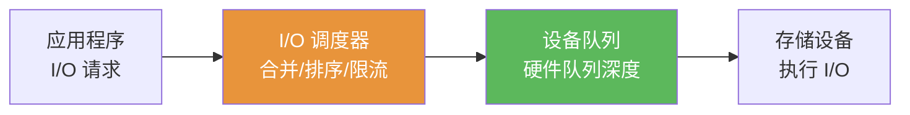

| I/O 调度器 | 适用场景 | 核心策略 | 内核版本 |
|------------|----------|----------|----------|
| none (noop) | SSD/NVMe | 不调度，直接下发 | Linux 2.6+ |
| deadline | HDD（旧版） | 按截止时间调度，避免饥饿 | Linux 2.6-5.0 |
| mq-deadline | 混合负载 | 多队列 + 截止时间调度 | Linux 4.11+ |
| bfq | 交互式负载 | 按进程分组，保证公平性 | Linux 4.12+ |
| kyber | 快速设备 | 双队列限流（同步/异步） | Linux 4.12+ |
| none (现代) | NVMe | 硬件多队列足够，无需软件调度 | 推荐 NVMe |

**队列深度对性能的影响**

```python
# 队列深度 (iodepth) 对 NVMe SSD IOPS 的影响
# 数据来自 fio 基准测试（三星 PM1733 NVMe SSD）

queue_depth_benchmark = {
    # iodepth: (IOPS, avg_latency_ms, P99_latency_ms)
    1:   (85_000,  0.012, 0.025),
    2:   (160_000, 0.013, 0.030),
    4:   (310_000, 0.013, 0.035),
    8:   (580_000, 0.014, 0.040),
    16:  (920_000, 0.017, 0.055),
    32:  (1_200_000, 0.027, 0.085),
    64:  (1_400_000, 0.046, 0.150),
    128: (1_500_000, 0.085, 0.300),
}

# 结论：
# - IOPS 随队列深度增加先线性增长，后趋于饱和
# - 延迟在队列深度 16 之后显著增加
# - 最佳性价比点通常在 iodepth=8~16
# - 数据库场景通常选择 iodepth=4~8（兼顾延迟和吞吐）
```

> **队列深度选择原则**：OLTP 数据库（MySQL/PostgreSQL）选择 iodepth=4~8，因为每次查询需要快速响应；大数据分析（Spark/HDFS）可选 iodepth=32~128，因为吞吐量优先于延迟；AI 训练的数据加载器通常选 iodepth=16~64，配合多线程预读。

### 5.3 缓存策略

存储缓存是平衡性能和成本的核心机制，存在于存储栈的多个层次：

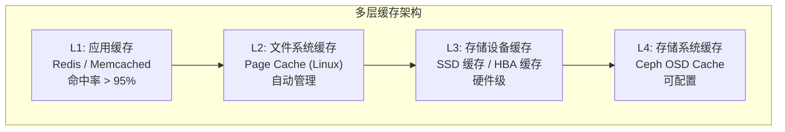

**写缓存策略**

| 策略 | 写入路径 | 一致性 | 性能 | 安全性 | 适用场景 |
|------|----------|--------|------|--------|----------|
| Write-Through | 同时写缓存和持久层 | 强 | 中等 | 高（有电池/UPS 保护） | 数据库 |
| Write-Back | 先写缓存，异步刷盘 | 弱（有丢数据风险） | 高 | 需要 UPS/BBU | 日志、临时数据 |
| Write-Around | 只写持久层，跳过缓存 | 强 | 低（首次读未命中） | 高 | 大文件、写后很少读 |
| Write-Invalidation | 写入后使缓存失效 | 强 | 中等 | 高 | 多节点共享缓存 |

```python
class WriteBackCache:
    """
    Write-Back 缓存的简化实现
    展示核心的缓存管理逻辑
    """
    def __init__(self, cache_size, flush_interval):
        self.cache = {}            # key -> (data, dirty_flag, version)
        self.cache_size = cache_size
        self.flush_interval = flush_interval
        self.access_order = []     # LRU 淘汰用

    def write(self, key, data):
        """写入缓存（标记为脏数据）"""
        if len(self.cache) >= self.cache_size:
            self._evict()          # LRU 淘汰最久未访问的条目
        self.cache[key] = {
            'data': data,
            'dirty': True,          # 脏标记
            'version': self._next_version()
        }
        self.access_order.append(key)

    def read(self, key):
        """读取：先查缓存，未命中则从持久层读取"""
        if key in self.cache:
            self._touch(key)
            return self.cache[key]['data']

        # 缓存未命中，从持久层读取
        data = self.persistent_store.read(key)
        self.cache[key] = {
            'data': data,
            'dirty': False,         # 首次读取不标记为脏
            'version': self._next_version()
        }
        self.access_order.append(key)
        return data

    def flush(self):
        """定期刷盘：将所有脏数据写入持久层"""
        for key, entry in self.cache.items():
            if entry['dirty']:
                self.persistent_store.write(key, entry['data'])
                entry['dirty'] = False
        # 可选：刷盘后调用 fsync 保证持久化
        self.persistent_store.fsync()

    def _evict(self):
        """LRU 淘汰"""
        while self.access_order:
            oldest_key = self.access_order.pop(0)
            if oldest_key in self.cache:
                entry = self.cache[oldest_key]
                if entry['dirty']:
                    # 脏数据淘汰前必须先写回持久层
                    self.persistent_store.write(oldest_key, entry['data'])
                del self.cache[oldest_key]
                return
```

**Linux Page Cache 实战调优**

```bash
# 查看当前 Page Cache 使用情况
free -h           # 查看 buff/cache 行
vmstat 1 5        # 观察 si/so（swap in/out）

# 调整脏页刷盘策略
# 脏页占比超过此值时，后台开始刷盘（默认 10%）
sysctl vm.dirty_ratio=20
# 前台进程触发刷盘的阈值（默认 20%）
sysctl vm.dirty_background_ratio=5
# 脏页最大存活时间（默认 3000 centiseconds = 30秒）
sysctl vm.dirty_expire_centisecs=3000

# 对于数据库服务器，建议的调优
sysctl vm.dirty_ratio=40           # 允许更多脏页，减少刷盘频率
sysctl vm.dirty_background_ratio=10
sysctl vm.dirty_expire_centisecs=1000  # 10秒内必须刷盘
```

---

## 六、存储数据管理

### 6.1 快照（Snapshot）

快照是存储系统在某一时刻的数据状态副本，是备份、测试、容灾的核心技术基础。

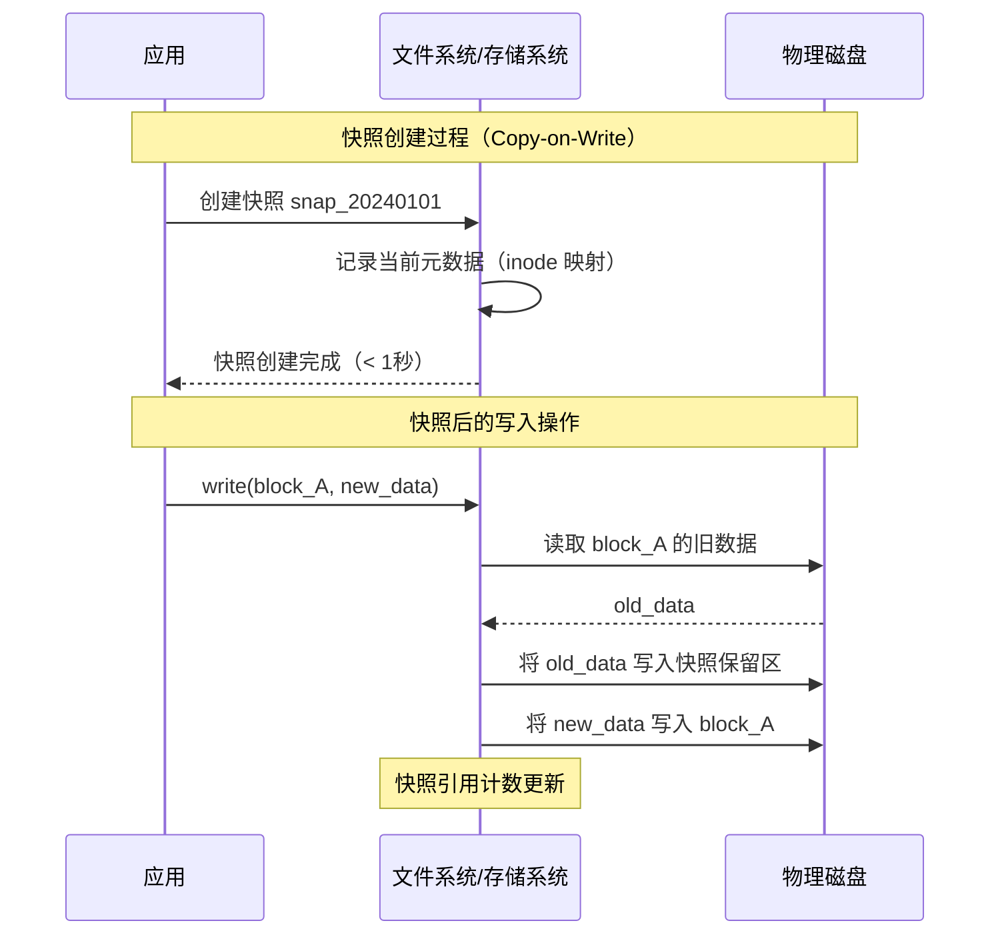

**快照技术对比**

| 技术 | 原理 | 创建速度 | 空间开销 | 性能影响 | 适用场景 |
|------|------|----------|----------|----------|----------|
| Copy-on-Write (COW) | 写入时复制旧块 | 即时 | 随写入增长 | 写入延迟增加 | VM 快照、数据库备份 |
| Copy-on-Write (Row) | 行级 COW | 即时 | 更精细 | 较小 | RDBMS（Oracle, PostgreSQL） |
| Redirect-on-Write (ROW) | 新数据写到新位置 | 即时 | 最小 | 写入几乎无影响 | ZFS、Btrfs |
| Delta Snapshots | 仅记录差异块 | 即时 | 最小 | 读取可能变慢 | LVM Snapshots |
| Copy-on-Write File | 文件级 COW | 即时 | 每文件副本 | 大 | 原子文件备份 |

> **快照使用的常见陷阱**：快照不是备份！快照存储在同一存储系统中，如果存储系统本身故障，快照也会丢失。正确的做法是"快照 + 异地备份"组合。另外，过多的快照会导致性能下降（COW 写放大），生产环境建议保留不超过 7-14 天的快照。

### 6.2 数据去重（Deduplication）

数据去重通过消除重复数据块来减少存储空间占用，在备份存储和虚拟化存储中效果尤为显著。

| 去重粒度 | 说明 | 优点 | 缺点 | 去重率 |
|----------|------|------|------|--------|
| 文件级 | 整个文件去重 | 实现简单 | 相似文件去重效果差 | 10-30% |
| 块级（固定大小） | 按固定块大小（如 4KB）切分 | 实现较简单 | 边界偏移问题 | 30-60% |
| 块级（可变大小） | 基于内容的切分（如 Rabin指纹） | 去重率最高 | CPU 开销大 | 50-90% |

```python
import hashlib

def content_defined_chunking(data, min_chunk=2048, max_chunk=65536, target=4096):
    """
    基于内容的可变大小分块算法（Rabin 指纹的简化版）
    相同内容的数据块会被分到相同位置，避免固定分块的边界偏移问题
    """
    chunks = []
    i = 0
    while i < len(data):
        # 在 [min_chunk, max_chunk] 范围内寻找切分点
        chunk_end = min(i + max_chunk, len(data))

        for j in range(i + min_chunk, chunk_end):
            # 使用滑动窗口计算指纹
            window = data[j - 32:j]
            fingerprint = hashlib.md5(window).digest()
            # 低位为 0 时切分（概率 = 1/target）
            if fingerprint[-1] % target == 0:
                chunk_end = j
                break

        chunk_data = data[i:chunk_end]
        chunk_hash = hashlib.sha256(chunk_data).hexdigest()
        chunks.append({
            'hash': chunk_hash,
            'offset': i,
            'size': len(chunk_data),
            'data': chunk_data
        })
        i = chunk_end

    return chunks

# 去重演示
def deduplicate_demo():
    """演示块级去重的效果"""
    # 两个版本的文件，只有部分内容变化
    version_a = b"header_data" + b"x" * 100000 + b"footer_v1"
    version_b = b"header_data" + b"y" * 100000 + b"footer_v2"

    chunks_a = content_defined_chunking(version_a)
    chunks_b = content_defined_chunking(version_b)

    # 去重：只存储唯一块
    unique_chunks = {}
    for chunk in chunks_a + chunks_b:
        if chunk['hash'] not in unique_chunks:
            unique_chunks[chunk['hash']] = chunk

    original_size = len(version_a) + len(version_b)
    dedup_size = sum(c['size'] for c in unique_chunks.values())
    savings = (1 - dedup_size / original_size) * 100

    print(f"原始总大小: {original_size:,} bytes")
    print(f"去重后大小: {dedup_size:,} bytes")
    print(f"节省空间: {savings:.1f}%")
```

### 6.3 数据压缩

压缩在存储层面可以显著降低空间占用，但会增加 CPU 开销。现代存储系统通常支持多种压缩算法。

| 算法 | 压缩率 | CPU 开销 | 速度 | 适用场景 |
|------|--------|----------|------|----------|
| LZ4 | 2.1:1 | 低 | 极快（>500MB/s） | 通用场景、热数据 |
| ZSTD | 2.7:1 | 中 | 快（~300MB/s） | 温数据、日志 |
| GZIP | 2.9:1 | 高 | 中（~100MB/s） | 冷数据、归档 |
| Snappy | 1.8:1 | 低 | 极快（>500MB/s） | Hadoop、Cassandra |
| ZSTD (max) | 3.5:1 | 高 | 慢（~100MB/s） | 冷存储、归档 |
| LZMA | 3.7:1 | 极高 | 极慢（~10MB/s） | 极端冷存储 |

> **选型建议**：热数据优先考虑 LZ4（速度换少量压缩率），温数据考虑 ZSTD（平衡点），冷数据考虑 GZIP/ZSTD-max（压缩率优先）。Ceph 默认使用 ZSTD，HDFS 支持 Snappy/LZ4/ZSTD。注意：对于已经压缩的数据（如 JPEG、H.264 视频），二次压缩通常只带来 1-5% 的空间节省，却消耗大量 CPU。

**压缩与去重的协同效应**

最佳实践：先压缩后去重（对于新数据）
或者：先去重后压缩（对于增量数据）

原因：
- 压缩后数据的压缩率差异大，有利于基于内容的分块去重
- 但压缩块的修改会导致后续块的指纹变化（Rabin 指纹除外）

生产建议：
- 大文件（>1MB）：先去重后压缩
- 小文件（<1MB）：直接压缩（去重收益低）
- 增量备份：先压缩差异数据，再存储

---

## 七、备份与灾难恢复

### 7.1 备份策略矩阵

| 策略 | 备份内容 | 恢复速度 | 备份速度 | 存储开销 | 适用场景 |
|------|----------|----------|----------|----------|----------|
| 全量备份 | 所有数据 | 最快（单步恢复） | 最慢 | 最大 (1x) | 小数据集、周备份 |
| 增量备份 | 上次备份后变化的数据 | 最慢（需逐层恢复） | 最快 | 最小 | 日备份 |
| 差异备份 | 上次全量后变化的数据 | 中等（全量+最新差异） | 中等 | 中等 | 日备份替代方案 |

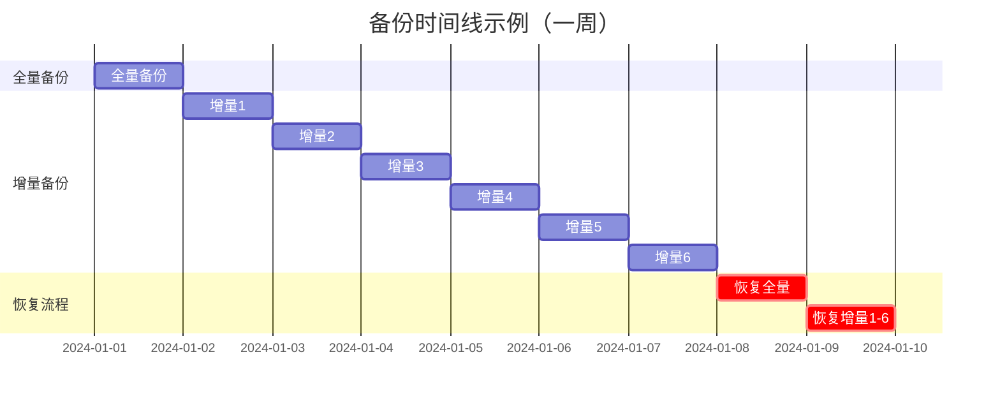

### 7.2 RPO 与 RTO 决策框架

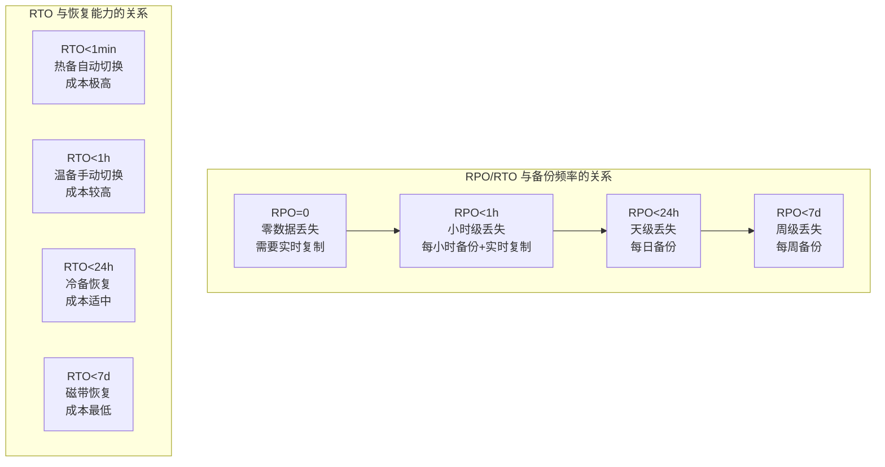

**典型业务场景的 RPO/RTO 需求**

| 业务场景 | RPO | RTO | 备份策略 | 年成本估算（1TB数据） |
|----------|-----|-----|----------|----------------------|
| 金融交易系统 | 0 | <1 分钟 | 实时同步复制 + 热备 | ¥50,000+ |
| 电商核心数据库 | <5 分钟 | <30 分钟 | 异步复制 + 温备 | ¥15,000-30,000 |
| 企业 ERP 系统 | <1 小时 | <4 小时 | 每小时快照 + 温备 | ¥5,000-15,000 |
| 内部文档系统 | <24 小时 | <24 小时 | 每日备份 + 冷备 | ¥1,000-5,000 |
| 归档合规数据 | <7 天 | <7 天 | 每周备份 + 磁带 | ¥500-1,000 |

### 7.3 3-2-1 备份规则与扩展

```python
class BackupStrategy321:
    """
    3-2-1 备份规则及其现代扩展
    3 份数据副本
    2 种不同存储介质
    1 份异地存储
    """

    def __init__(self):
        self.retention_policy = {
            'daily': 7,          # 保留 7 天日备份
            'weekly': 4,         # 保留 4 周周备份
            'monthly': 12,       # 保留 12 月月备份
            'yearly': 7,         # 保留 7 年年备份
        }

    def create_backup(self, data, backup_type='daily'):
        """
        执行备份并管理生命周期
        """
        # 副本1：本地 SSD（生产环境同机）
        local_ssd = self.write_to_local(data, tier='ssd')

        # 副本2：本地 NAS（同机房不同介质）
        local_nas = self.write_to_local(data, tier='nas')

        # 副本3：异地对象存储（跨地域）
        remote_s3 = self.upload_to_remote(data, region='us-west-2')

        # 验证完整性
        assert self.verify_checksum(local_ssd) == self.verify_checksum(remote_s3)

        # 执行保留策略
        self.apply_retention_policy(backup_type)

        return {
            'backup_id': self.generate_id(),
            'locations': ['local_ssd', 'local_nas', 'remote_s3'],
            'checksum': self.verify_checksum(data),
            'size': len(data)
        }

    def apply_retention_policy(self, backup_type):
        """清理过期备份"""
        for retention_type, keep_days in self.retention_policy.items():
            expired = self.list_expired_backups(retention_type, keep_days)
            for backup in expired:
                self.delete_backup(backup)
                self.log_deletion(backup)

# 3-2-1-1-0 规则（现代扩展）
# 3: 3 份副本
# 2: 2 种介质
# 1: 1 份异地
# 1: 1 份离线/不可变（防勒索软件）
# 0: 0 错误（备份后必须验证恢复）
```

### 7.4 备份验证与恢复演练

> **备份最大的风险不是没有备份，而是备份了但无法恢复。** 多起重大数据事故中，企业都有备份，但恢复时才发现备份损坏或恢复流程不可行。建议每个季度至少执行一次完整的恢复演练，并记录恢复时间、数据完整性验证结果。

**恢复验证清单：**

□ 全量恢复测试：从全量备份恢复全部数据
□ 增量恢复测试：从全量+增量链恢复到指定时间点
□ 数据完整性校验：比对 checksum、记录数、关键业务数据
□ 恢复时间记录：验证是否满足 RTO 要求
□ 应用兼容性验证：恢复的数据能被应用正常读取
□ 跨地域恢复测试：从异地备份恢复
□ 不可变备份验证：验证备份未被篡改或删除

---

## 八、存储加密与安全

### 8.1 加密层级架构

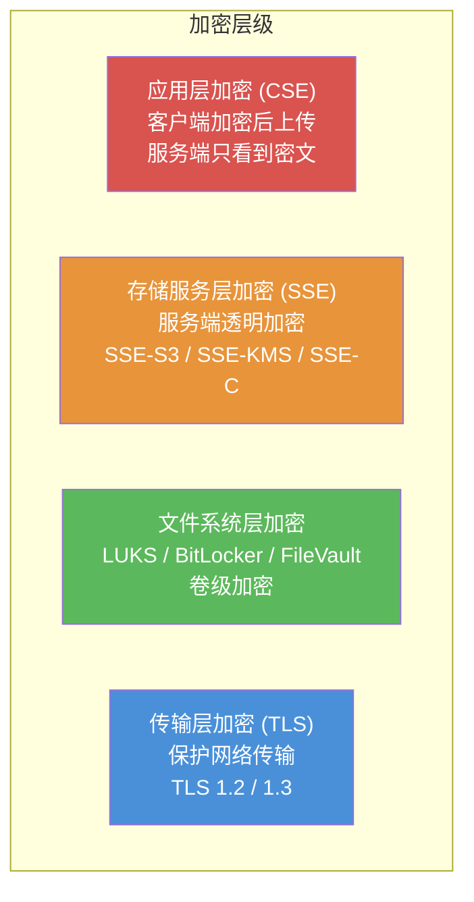

**加密方案选型：**

| 方案 | 密钥管理 | 加密位置 | 性能开销 | 安全级别 | 适用场景 |
|------|----------|----------|----------|----------|----------|
| SSE-S3 | S3 管理 | 服务端 | 低 | 中 | 基本合规要求 |
| SSE-KMS | KMS 管理 | 服务端 | 中（KMS 调用） | 高 | 企业级安全 |
| SSE-C | 客户提供 | 服务端 | 中 | 高 | 自管密钥 |
| CSE (客户端) | 客户端管理 | 客户端 | 高 | 极高 | 零信任架构 |
| LUKS | 系统管理 | 卷级 | 低 | 高 | 本地磁盘加密 |

### 8.2 SSE-KMS 加密流程详解

```python
class KMSEncryptionService:
    """
    SSE-KMS 信封加密 (Envelope Encryption) 流程
    这是 AWS/阿里云等云存储服务的标准加密模式
    """

    def encrypt(self, plaintext, key_id):
        """
        加密流程:
        1. 调用 KMS 生成一次性数据密钥 (DEK)
        2. 用 DEK 的明文副本加密数据
        3. 存储: 加密数据 + DEK 的加密副本
        """
        # 步骤1: 从 KMS 获取数据密钥
        dek_response = self.kms.generate_data_key(
            KeyId=key_id,
            KeySpec='AES_256'
        )
        plaintext_dek = dek_response['Plaintext']   # 明文 DEK（仅在内存中）
        encrypted_dek = dek_response['CiphertextBlob']  # 加密的 DEK

        # 步骤2: 使用 DEK 加密数据（AES-256-GCM）
        cipher = AES_GCM(plaintext_dek)
        nonce = os.urandom(12)
        ciphertext, tag = cipher.encrypt_and_digest(nonce, plaintext)

        # 步骤3: 返回加密结果
        return {
            'ciphertext': ciphertext,
            'encrypted_dek': encrypted_dek,    # 随数据一起存储
            'nonce': nonce,
            'tag': tag,
            'key_id': key_id
        }

    def decrypt(self, encrypted_data):
        """
        解密流程:
        1. 用 KMS 解密 DEK
        2. 用明文 DEK 解密数据
        """
        # 步骤1: 调用 KMS 解密 DEK
        dek_response = self.kms.decrypt(
            CiphertextBlob=encrypted_data['encrypted_dek']
        )
        plaintext_dek = dek_response['Plaintext']

        # 步骤2: 用 DEK 解密数据
        cipher = AES_GCM(plaintext_dek)
        plaintext = cipher.decrypt_and_verify(
            encrypted_data['nonce'],
            encrypted_data['ciphertext'],
            encrypted_data['tag']
        )

        return plaintext

    # DEK 轮转（Key Rotation）
    def rotate_key(self, old_key_id, new_key_id):
        """
        密钥轮转：用新 KMS Key 重新加密所有 DEK
        数据本身不需要重新加密（只需重新包装 DEK）
        """
        for obj in self.list_objects():
            # 用旧 KMS Key 解密旧 DEK
            old_dek = self.kms.decrypt(obj['encrypted_dek'])

            # 用新 KMS Key 加密旧 DEK
            new_encrypted_dek = self.kms.encrypt(
                KeyId=new_key_id,
                Plaintext=old_dek
            )

            # 更新元数据中的加密 DEK
            self.update_object_metadata(obj['key'], {
                'encrypted_dek': new_encrypted_dek,
                'key_id': new_key_id
            })
```

### 8.3 访问控制模型

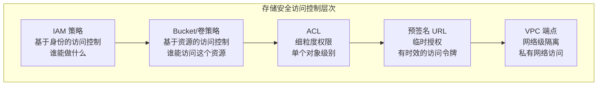

**最小权限原则实践**

```json
// 示例: 只允许应用服务读写特定前缀的对象
{
    "Version": "2012-10-17",
    "Statement": [
        {
            "Sid": "AllowAppReadWrite",
            "Effect": "Allow",
            "Principal": {"AWS": ["arn:aws:iam::123456789:role/app-service"]},
            "Action": [
                "s3:GetObject",
                "s3:PutObject",
                "s3:DeleteObject"
            ],
            "Resource": ["arn:aws:s3:::my-bucket/app-data/*"]
        },
        {
            "Sid": "DenyDeleteWithoutMFA",
            "Effect": "Deny",
            "Principal": "*",
            "Action": "s3:DeleteObject",
            "Resource": ["arn:aws:s3:::my-bucket/production/*"],
            "Condition": {
                "Bool": {"aws:MultiFactorAuthPresent": "false"}
            }
        },
        {
            "Sid": "DenyUnencryptedUploads",
            "Effect": "Deny",
            "Principal": "*",
            "Action": "s3:PutObject",
            "Resource": ["arn:aws:s3:::my-bucket/*"],
            "Condition": {
                "StringNotEquals": {
                    "s3:x-amz-server-side-encryption": "aws:kms"
                }
            }
        }
    ]
}
```

**存储安全检查清单：**

□ 静态加密：所有存储数据启用 SSE-KMS 或等效加密
□ 传输加密：所有存储访问强制使用 TLS 1.2+
□ 密钥轮转：KMS 密钥至少每年轮转一次
□ 访问日志：开启存储访问日志并集中分析
□ 防公共访问：Bucket 默认禁止公共访问
□ 版本控制：开启对象版本控制，防止误删除
□ 对象锁定：合规数据启用 WORM（一次写入多次读取）保护
□ 网络隔离：通过 VPC 端点限制存储访问网络
□ 多因素认证：敏感操作要求 MFA
□ 检测告警：异常访问模式实时告警

---

## 九、软件定义存储（SDS）

软件定义存储将存储控制平面和数据平面与硬件解耦，通过软件实现存储服务。这是现代存储架构的核心趋势，也是构建私有云和混合云存储基础设施的基础。

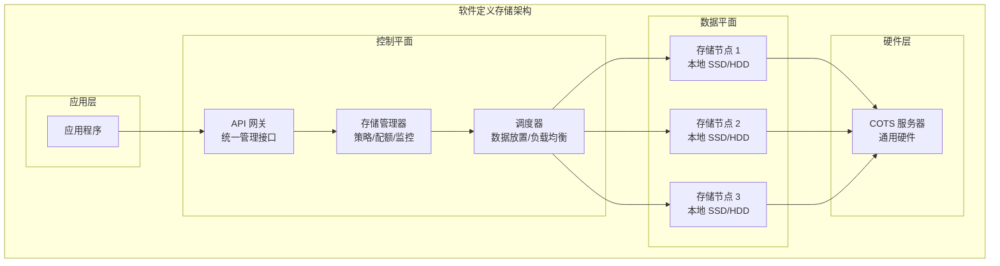

**SDS 的核心设计目标：**

| 目标 | 说明 | 实现方式 |
|------|------|----------|
| 硬件无关 | 运行在通用 x86 服务器上 | 抽象硬件层，软件实现存储逻辑 |
| 弹性扩展 | 按需增减存储节点 | 自动数据再平衡、一致性哈希 |
| 多协议支持 | 同一套存储提供块/文件/对象 | 统一后端，多协议网关 |
| 自动化运维 | 减少人工干预 | 自动故障检测、数据修复、负载均衡 |
| 策略驱动 | 通过策略管理存储行为 | QoS、分层、复制、加密策略 |

**SDS 产品深度对比**

| 产品 | 类型 | 数据保护 | 协议支持 | 单集群规模 | 适用场景 | 社区/商业 |
|------|------|----------|----------|-----------|----------|-----------|
| Ceph | 统一存储 | 副本/纠删码 | RBD/CephFS/RGW | 1000+ 节点 | 私有云/混合云 | 开源 |
| MinIO | 对象存储 | 纠删码 | S3 API | 500+ 节点 | 云原生/ML/AI | 开源/商业 |
| Longhorn | 块存储 | 副本 | iSCSI/CSI | 100 节点 | K8s 持久化 | 开源 |
| OpenEBS | 块/文件 | 副本/EC | iSCSI/NFS/CSI | 200 节点 | K8s 存储 | 开源 |
| GlusterFS | 文件存储 | 副本/EC | NFS/CIFS/FUSE | 1000+ 节点 | 文件共享 | 开源 |
| Robin.io | 统一存储 | 副本/EC | NVMe/CSI | 500 节点 | K8s 数据库 | 商业 |
| Portworx | 块存储 | 副本 | CSI | 100 节点 | K8s 有状态应用 | 商业 |

**Ceph 架构深入解析**

Ceph 是目前最成熟的开源统一存储系统，其 CRUSH 算法和 RADOS 层提供了极高的可靠性和扩展性：

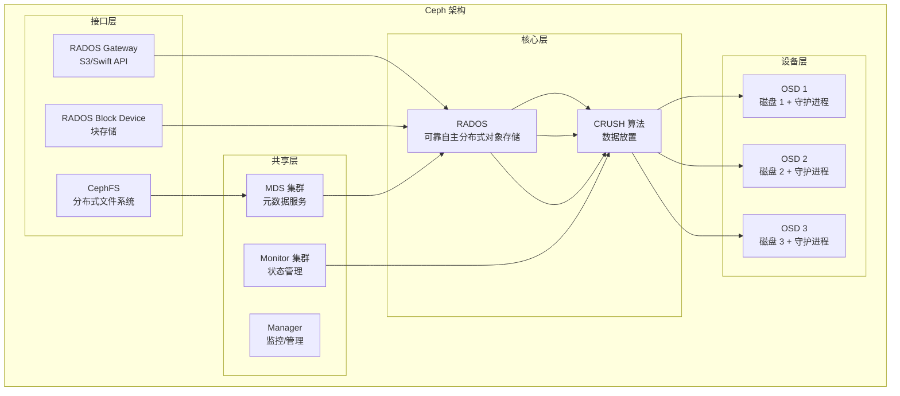

> **Ceph 的 CRUSH 算法**：CRUSH（Controlled Replication Under Scalable Hashing）是 Ceph 的核心创新——它无需中心化的元数据服务器来决定数据放置，而是通过一个确定性算法直接计算数据应该存储在哪个 OSD 上。这使得添加/删除节点时数据自动再平衡，且元数据开销极小。CRUSH 支持机架感知、故障域分层等策略，可以在不同故障域之间均匀分布数据。

---

## 十、存储系统设计决策框架

在实际系统设计中，选择存储方案需要综合考虑多个维度。以下是一个实用的决策矩阵：

```mermaid
graph TB
    START["选择存储方案"] --> Q1{"数据类型?"}
    Q1 -->|"结构化数据<br/>(表格/关系)"| RDBMS["关系型数据库<br/>块存储"]
    Q1 -->|"半结构化数据<br/>(JSON/XML)"| DOCDB["文档数据库<br/>块/对象存储"]
    Q1 -->|"非结构化数据<br/>(文件/图片/视频)"| OBJ["对象存储"]
    Q1 -->|"需要 POSIX 接口"| NAS["文件存储<br/>NFS/CephFS"]

    RDBMS --> Q2{"规模?"}
    Q2 -->|"TB级"| SINGLE["单机 SSD"]
    Q2 -->|"PB级"| SHARD["分库分表 + 分布式"]

    OBJ --> Q3{"访问模式?"}
    Q3 -->|"热数据<br/>频繁读写"| HOT_OBJ["S3 Standard / MinIO"]
    Q3 -->|"冷数据<br/>归档合规"| COLD_OBJ["S3 Glacier / 磁带库"]
```

**存储选型决策表**

| 需求特征 | 推荐方案 | 理由 |
|----------|----------|------|
| ACID 事务 + 高并发小写入 | MySQL/PostgreSQL + SSD | 块存储 + WAL 保证一致性 |
| 海量小文件（亿级）| 对象存储 + 前缀分片 | 扁平命名空间，避免目录树瓶颈 |
| 大文件顺序读写（PB 级）| HDFS / MinIO | 数据局部性优化 |
| 多客户端共享文件 | NFS / CephFS | 文件系统语义 |
| 低延迟实时缓存 | NVMe SSD + 内存缓存 | 硬件级延迟 |
| 跨地域数据同步 | 对象存储 + 跨区域复制 | S3 API 标准化 |
| K8s 持久化存储 | Ceph RBD / Longhorn | CSI 标准化集成 |
| AI 训练数据集 | MinIO / Ceph + NVMe | 高带宽 + 高 IOPS |
| 时序数据（IoT/监控）| InfluxDB / Prometheus + 本地 SSD | 时序压缩 + 快速写入 |
| 图数据（社交网络）| Neo4j / JanusGraph + 块存储 | 图遍历低延迟 |

---

## 常见误区与陷阱

### 误区 1：RAID 等于备份

❌ "我们有 RAID 6，数据很安全"
✅ RAID 保护的是磁盘故障，不保护：
   - 误删除
   - 勒索软件加密
   - 存储控制器故障
   - 机房级灾难（火灾、洪水）
   RAID 是可用性方案，不是备份方案

### 误区 2：云存储不需要备份

❌ "数据在 AWS S3 上，AWS 负责持久性"
✅ AWS 的 11 个 9 持久性不包括：
   - 用户误删除（没有回收站的早期配置）
   - 应用 Bug 导致的数据损坏（Garbage In, Garbage Out）
   - 账号被盗（恶意删除）
   - 云服务区域性故障
   即使用云存储，仍需备份 + 版本控制

### 误区 3：NVMe 一定比 SATA SSD 快

❌ "所有场景都应该用 NVMe SSD"
✅ NVMe 优势仅在以下场景显著：
   - 高队列深度随机 I/O（数据库、虚拟化）
   - 需要极低延迟的场景
   以下场景 SATA SSD 足够：
   - 静态资源存储
   - 日志写入
   - 冷数据存储
   SATA SSD 性价比更高（价格低 30-50%）

### 误区 4：对象存储可以替代文件系统

❌ "我们把所有数据都迁到 S3"
✅ 对象存储不适合：
   - 需要 POSIX 语义的应用（数据库 WAL、临时文件）
   - 需要原子性 rename/move 的工作流
   - 需要文件锁的多进程应用
   - 小文件高频读写（HTTP 开销远大于本地文件系统）
   正确做法：分析工作负载特征，混合使用多种存储类型

### 误区 5：压缩总是值得的

❌ "开启 ZSTD 压缩，所有数据都能节省空间"
✅ 压缩前需要考虑：
   - 已压缩数据（图片/视频/压缩包）：二次压缩几乎无收益，浪费 CPU
   - CPU 资源：高压缩率算法（LZMA）可能吃满 CPU
   - 延迟：压缩+解压增加 I/O 路径延迟
   - 去重兼容：某些压缩算法会降低去重率
   建议：先 profiling 再决定，不要盲目开启

---

## 存储可观测性

存储系统的可观测性是保障 SLA 的关键能力。缺乏存储层面的监控，很多问题在影响扩大后才被发现。

### 关键监控指标

| 指标类别 | 具体指标 | 告警阈值建议 | 说明 |
|----------|----------|-------------|------|
| 性能 | IOPS 利用率 | > 80% 持续 5 分钟 | 接近容量上限 |
| 性能 | 延迟 P99 | > 业务阈值的 2 倍 | 性能恶化 |
| 容量 | 磁盘使用率 | > 85% | 需要扩容或清理 |
| 容量 | IOPS 使用率 | > 70% | 需要升级或分片 |
| 可靠性 | 重建进度 | 超过预期时间 | 硬件故障后恢复慢 |
| 可靠性 | URE 计数 | > 0 | 不可恢复读错误，需立即处理 |
| 网络 | 存储网络丢包率 | > 0.01% | 网络问题导致性能下降 |
| 网络 | RDMA 重传统计 | 持续增长 | RDMA 网络不稳定 |

### 存储性能监控工具

```bash
# Linux 存储性能观测
iostat -x 1                    # 磁盘 I/O 统计（util, await, %util）
iotop -oP                      # 按进程查看 I/O
blktrace -d /dev/nvme0n1 -o - | blkparse -i -  # 块设备追踪
bpftrace -e 'tracepoint:block:block_rq_complete { @us = hist(args->nr_sector); }'

# NVMe 特有监控
nvme smart-log /dev/nvme0n1     # SSD 健康状态（磨损、温度、错误）
nvme id-ctrl /dev/nvme0n1       # 控制器信息

# 文件系统缓存监控
vmstat 1                       # 观察 si/so（swap I/O）
cachestat 1                    # BPF 工具：Page Cache 命中率
```

---

> **本节小结**：存储服务的理论基础涵盖十大核心领域——存储类型（块/对象/文件）、存储网络（FC/iSCSI/NVMe-oF/RDMA）、一致性模型（CAP 与一致性光谱）、数据冗余（副本与纠删码）、性能分析（IOPS/延迟/缓存/调度）、数据管理（快照/去重/压缩）、备份恢复（RPO/RTO）、安全加密（SSE-KMS）、软件定义存储（Ceph/MinIO）和存储可观测性。掌握这些理论，能在系统设计中做出科学的存储选型决策——在性能、成本、可靠性和可维护性之间找到最佳平衡点。记住：没有万能的存储方案，只有最适合特定工作负载的存储方案。
