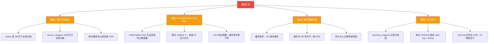
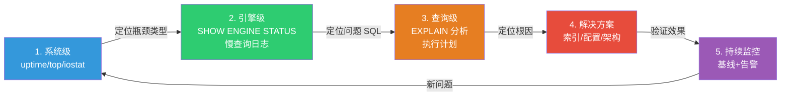
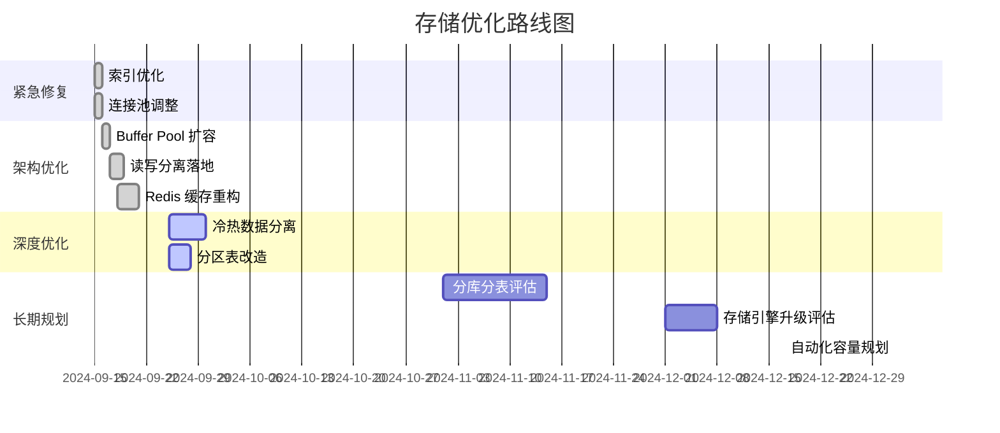

# 存储服务实战案例：从慢查询到存储架构重构

> 本案例以一个真实的中大型在线教育平台为背景，完整还原从"存储层告警频发"到"架构重构落地"的全过程。案例涉及 MySQL 存储引擎调优、Redis 缓存架构、冷热数据分离、读写分离等存储服务核心主题，适合希望将理论知识落地的工程师参考。

---

## 一、案例背景与业务场景

### 1.1 业务概况

"学浪在线"（化名）是一个在线教育平台，核心业务包括：

- **视频点播**：日均播放量 800 万次，视频元数据存储在 MySQL，视频文件存储在 OSS
- **课程交易**：日均订单量 15 万笔，高峰时段（每晚 19:00-22:00）QPS 峰值达 8000
- **学习记录**：学员的学习进度、笔记、做题记录，日写入量约 2000 万条
- **直播互动**：在线直播课堂，单房间最高 5 万人同时在线

### 1.2 基础设施

| 组件 | 配置 | 用途 |
|------|------|------|
| MySQL 主库 | 16C64G，500G NVMe SSD，InnoDB | 订单、用户、课程元数据 |
| MySQL 从库 ×2 | 16C64G，500G SATA SSD | 读请求分流 |
| Redis 集群 | 6 节点（3主3从），每节点 32G | 热点数据缓存 |
| 应用服务器 | 8C16G × 12 台 | Java/Spring Boot |
| 对象存储 | 阿里云 OSS | 视频文件、课件 |

### 1.3 问题爆发

2024 年秋季开学季（9 月），平台流量较暑期增长 3 倍。连续一周出现以下问题：

| 问题现象 | 具体表现 | 影响程度 |
|----------|----------|----------|
| 接口超时 | 商品详情页 P99 延迟从 80ms 飙升至 2.3s | 用户投诉激增 |
| 数据库告警 | 慢查询数量从日均 50 条飙升至 5000+ 条 | DBA 频繁告警 |
| Redis 命中率下降 | 缓存命中率从 98% 降至 72% | 数据库压力剧增 |
| 连接池耗尽 | 应用日志频繁出现 `Cannot get a connection` | 部分功能不可用 |
| 磁盘 IO 打满 | 主库 %util 持续 99%，写入延迟 >50ms | 写操作全面变慢 |

---

## 二、排查过程：从表象到根因

### 2.1 第一层：系统级指标采集

首先确认问题的宏观表现，建立排查方向：

```bash
# === 1. 系统负载概况 ===
uptime
# load average: 32.50, 28.70, 24.30
# 16核机器 load >30，严重过载

# === 2. CPU 使用分析 ===
top -bn1 | head -20
# 主要消耗在 sys（内核态）而非 us（用户态），暗示 IO 等待严重

mpstat -P ALL 1 3
# 多个核心的 %iowait > 60%，确认 IO 瓶颈

# === 3. 内存与交换 ===
free -h
#               total   used   free   shared  buff/cache  available
# Mem:           64G    58G   1.2G    256M      4.8G       5.0G
# Swap:          16G    12G    4G              ——  已大量使用 swap，内存不足

# === 4. 磁盘 IO 状态（关键） ===
iostat -x 1 5
# Device    r/s    w/s   rMB/s  wMB/s  rrqm/s  wrqm/s  %rrqm  %wrqm  r_await  w_await  aqu-sz  rareq-sz  wareq-sz  svctm  %util
# sda      850   1200   12.5   48.2     35     420   3.96   25.9    2.1     45.8     82.3     15.0      41.0     3.5    99.2
# sdb      120    180    2.1    6.3      5      30   4.00   14.3    0.8      3.2      1.2     17.5      35.0     3.3    28.5
# sda 是数据盘，%util 99.2% 已打满；sdb 是日志盘，压力正常

# === 5. 进程级 IO 排查 ===
iotop -oP -d 3
# PID    DISK READ   DISK WRITE   SWAPIN    IO>    COMMAND
# 15823   8.5 MB/s    38.2 MB/s    12.3%    89.2%  mysqld
# 确认 mysqld 是 IO 大户
```

**小结**：系统负载极高，IO 是第一瓶颈。MySQL 主库的磁盘已打满，且存在大量 swap，内存也不足。

### 2.2 第二层：MySQL 存储引擎级排查

```sql
-- === 1. 实时连接与慢查询 ===
SHOW PROCESSLIST;
-- 发现 45 个连接在执行 SELECT，其中 12 个处于 Sending data 状态（全表扫描特征）

SELECT id, user, host, db, command, time, state, info
FROM information_schema.processlist
WHERE command != 'Sleep' AND time > 5
ORDER BY time DESC;
-- 3 条查询已执行超过 30 秒

-- === 2. InnoDB 引擎状态（核心） ===
SHOW ENGINE INNODB STATUS\G

-- 关键段落解读：
-- BUFFER POOL AND MEMORY
-- Total memory allocated 68719476736    ← 64G 总分配
-- Buffer pool size   393216             ← 24G（393216 × 16KB page）
-- Free buffers       1024               ← 仅剩 1024 个空闲页（16MB），几乎用尽
-- Database pages     390192             ← 390192 个数据页
-- Old database pages 140000             ← LRU Old 区占比约 36%
-- Modified db pages  128000             ← 128000 个脏页待刷盘！

-- LRU len: 390192, unzip len: 0
-- 非压缩页全部占满，LRU 淘汰压力极大

-- ROW OPERATIONS
-- Queries inside InnoDB: 45
-- Queries in queue: 18                    ← 18 个查询排队等待 IO
-- Read views: 12

-- === 3. 慢查询日志分析 ===
-- MySQL 慢查询阈值设为 1s，分析最近 1 小时的慢查询
-- 使用 pt-query-digest 分析：
-- pt-query-digest /var/log/mysql/slow.log --since '1h' --limit 10

-- 慢查询 TOP 5（按总耗时排序）：
-- Rank  Query ID           Response time  Calls  R/Call   V/M
-- 1     0xF3A2B1C...       4523.0  0.5  15230  0.2970  0.00  SELECT orders WHERE user_id = ? AND status IN (...)
-- 2     0xA1B2C3D...       3210.0  0.4   8900  0.3607  0.00  SELECT course_chapters WHERE course_id = ?
-- 3     0xD4E5F6A...       2890.0  0.3   6500  0.4446  0.00  SELECT learning_records WHERE user_id = ? ORDER BY ...
-- 4     0xB7C8D9E...       1560.0  0.2   4200  0.3714  0.00  SELECT course_detail WHERE id = ?
-- 5     0xE1F2A3B...        980.0  0.1   3100  0.3161  0.00  UPDATE learning_progress SET ...

-- === 4. 逐条分析慢查询 ===

-- TOP1: 订单查询（占总慢查询 31%）
EXPLAIN SELECT id, amount, status, created_at
FROM orders
WHERE user_id = 12345 AND status IN (1, 2, 3)
ORDER BY created_at DESC
LIMIT 20;
-- id  select_type  table   type    possible_keys  key     key_len  ref  rows    Extra
-- 1   SIMPLE       orders  ALL     NULL           NULL    NULL     NULL  2800000  Using where; Using filesort
-- type=ALL, rows=280万，全表扫描！没有 user_id 上的索引

-- TOP2: 课程章节查询（占总慢查询 22%）
EXPLAIN SELECT * FROM course_chapters WHERE course_id = 456;
-- type=ALL, rows=1500万，同样全表扫描

-- TOP5: 学习进度更新（高频写入）
SHOW CREATE TABLE learning_progress;
-- ENGINE=InnoDB DEFAULT CHARSET=utf8mb4
-- 没有合适的索引，每次更新都扫描大量行
```

### 2.3 第三层：Redis 缓存层排查

```bash
# === 1. Redis 集群状态 ===
redis-cli -c -h 10.0.1.1 -p 6379 cluster info
# cluster_state:ok
# cluster_slots_assigned:16384
# cluster_known_nodes:6

# === 2. 内存与淘汰情况 ===
redis-cli -c -h 10.0.1.1 -p 6379 info memory
# used_memory:32.1G
# used_memory_human:32.10G
# maxmemory:34359738368  (32G)
# maxmemory_policy:allkeys-lru
# evicted_keys:1250000     ← 已淘汰 125 万个 key！
# keyspace_hits:85000000
# keyspace_misses:32000000
# hit_rate:72.6%           ← 命中率从 98% 降至 72%

# === 3. 热点 key 分析 ===
redis-cli --bigkeys --i 0.1
# Biggest string: course:detail:456 → 128 KB
# Biggest hash:   user:session:789  → 64 KB
# 最大的 key 仅 128KB，不是大 key 问题

# 使用 redis-cli --hotkeys（需配置 maxmemory-policy 为 LFU）
# 发现 course:detail:* 系列 key 访问频率极高

# === 4. 缓存与数据库双写一致性检查 ===
# 抽样检查：随机取 100 个 course:detail:* key
redis-cli -c -h 10.0.1.1 -p 6379 --scan --pattern "course:detail:*" | head -100 | \
while read key; do
    redis_val=$(redis-cli -c -h 10.0.1.1 -p 6379 GET "$key" | jq -r '.updated_at' 2>/dev/null)
    course_id=$(echo "$key" | cut -d: -f3)
    db_val=$(mysql -u root -p*** -D edu_platform -N -e "SELECT updated_at FROM courses WHERE id=$course_id" 2>/dev/null)
    if [ "$redis_val" != "$db_val" ]; then
        echo "MISMATCH: $key redis=$redis_val db=$db_val"
    fi
done
# 结果：100 个 key 中有 23 个不一致，缓存脏数据比例 23%
```

### 2.4 第四层：根因汇总

经过逐层排查，定位到 4 个互相关联的根因：



---

## 三、解决方案：分层治理，逐步落地

### 3.1 方案一：索引优化（紧急，当天完成）

索引缺失是慢查询的直接原因，优先级最高：

```sql
-- === orders 表：添加复合索引 ===
-- 原表结构：id, user_id, course_id, amount, status, created_at, updated_at
-- 最高频查询：WHERE user_id = ? AND status IN (...) ORDER BY created_at DESC

-- 方案 A：复合索引（推荐）
ALTER TABLE orders
  ADD INDEX idx_user_status_created (user_id, status, created_at),
  ALGORITHM=INPLACE, LOCK=NONE;  -- Online DDL，不锁表

-- 为什么是这个顺序？
-- 1. user_id 等值查询放最前（过滤效率最高）
-- 2. status IN 查询放第二（范围过滤）
-- 3. created_at 放最后（ORDER BY 利用索引排序，避免 filesort）

-- 验证索引生效
EXPLAIN SELECT id, amount, status, created_at
FROM orders
WHERE user_id = 12345 AND status IN (1, 2, 3)
ORDER BY created_at DESC LIMIT 20;
-- type=ref, key=idx_user_status_created, rows=85, Extra=Using index condition
-- 从 280 万行扫描降到 85 行

-- === course_chapters 表 ===
ALTER TABLE course_chapters
  ADD INDEX idx_course_chapter_order (course_id, chapter_order),
  ALGORITHM=INPLACE, LOCK=NONE;

-- === learning_progress 表：覆盖索引 ===
-- 原表：id, user_id, course_id, chapter_id, progress, updated_at
-- 高频查询：WHERE user_id = ? AND course_id = ?
-- 高频更新：WHERE user_id = ? AND course_id = ? AND chapter_id = ?

ALTER TABLE learning_progress
  ADD INDEX idx_user_course_chapter (user_id, course_id, chapter_id, progress, updated_at),
  ALGORITHM=INPLACE, LOCK=NONE;
-- 这是覆盖索引（covering index），查询完全走索引，无需回表
```

**在线 DDL 注意事项**：

| 参数 | 设置 | 说明 |
|------|------|------|
| `ALGORITHM=INPLACE` | 推荐 | 原地重建，不复制表数据 |
| `LOCK=NONE` | 推荐 | 允许并发 DML，不阻塞业务 |
| `innodb_online_alter_log_max_size` | 256M | DDL 期间的增量日志缓冲 |
| 执行时间预估 | orders 表约 15 分钟 | 取决于表大小和磁盘 IO |

### 3.2 方案二：InnoDB Buffer Pool 调优（当天完成）

```sql
-- === 1. 调整 Buffer Pool 大小 ===
-- 当前：24GB（服务器 64GB 的 37.5%）
-- 目标：40GB（服务器 64GB 的 62.5%，预留空间给 OS 和其他进程）

-- 在 my.cnf 中修改（需要重启，计划在低峰期执行）
[mysqld]
innodb_buffer_pool_size = 40G
innodb_buffer_pool_instances = 16    -- 每个实例 2.5GB，减少锁竞争

-- === 2. 脏页刷盘策略优化 ===
-- 当前问题：脏页堆积 128000 个（约 2GB），集中在刷盘时产生 IO 尖峰

innodb_max_dirty_pages_pct = 50       -- 允许更高比例的脏页（减少刷盘频率）
innodb_max_dirty_pages_pct_lwm = 10   -- 低水位线，提前开始渐进式刷盘
innodb_io_capacity = 4000             -- NVMe SSD 可以承受更高 IO
innodb_io_capacity_max = 8000         -- 突发 IO 上限
innodb_read_io_threads = 8
innodb_write_io_threads = 8

-- === 3. Redo Log 优化 ===
-- 当前：2 组 × 2 个文件，每个 1GB，共 4GB
-- 问题：写入高峰期 redo log 切换频繁，触发 checkpoint 刷脏页

innodb_log_file_size = 2G            -- 每个 redo log 文件 2GB
innodb_log_files_in_group = 3        -- 3 组，共 6GB
innodb_log_buffer_size = 256M        -- 日志缓冲区增大，减少小事务频繁刷盘

-- === 4. Buffer Pool 预热（重启后执行） ===
-- 重启后 Buffer Pool 为空，需要预热
-- 方法：执行一次全表扫描，将热点数据加载到 Buffer Pool

-- 开启 InnoDB Buffer Pool Dump/Load（推荐）
innodb_buffer_pool_dump_at_shutdown = ON    -- 关机时导出热点页列表
innodb_buffer_pool_load_at_startup = ON     -- 启动时自动加载热点页
innodb_buffer_pool_dump_pct = 75            -- 导出 75% 的热点页
```

### 3.3 方案三：Redis 缓存架构重构（1-2 天）

```python
# === 1. 多级缓存架构 ===
"""
改造前：应用 → Redis → MySQL（单层缓存）
改造后：应用 → 本地缓存(Caffeine) → Redis 集群 → MySQL（三级缓存）
"""

from functools import lru_cache
from typing import Optional
import redis
import json
import time

class MultiLevelCache:
    """三级缓存：本地(Caffeine/LRU) → Redis → MySQL"""

    def __init__(self, redis_client, db_pool):
        self.redis = redis_client
        self.db = db_pool
        # L1: 本地缓存，容量 10000，TTL 60s（短，防止集群间不一致）
        self.local_cache = {}
        self.local_cache_ttl = {}
        self.local_max_size = 10000
        self.local_ttl = 60  # 秒

    def get(self, key: str, db_loader=None) -> Optional[dict]:
        now = time.time()

        # L1: 本地缓存
        if key in self.local_cache:
            if now < self.local_cache_ttl.get(key, 0):
                return self.local_cache[key]
            else:
                del self.local_cache[key]
                del self.local_cache_ttl[key]

        # L2: Redis 缓存
        data = self.redis.get(key)
        if data:
            parsed = json.loads(data)
            if parsed is None:
                # 缓存空值，防止缓存穿透（TTL 30s）
                self._set_local(key, None, ttl=30)
                return None
            self._set_local(key, parsed)
            return parsed

        # L3: MySQL（需要 db_loader 回调）
        if db_loader is None:
            return None

        data = db_loader(key)
        if data is None:
            # 缓存空值防穿透
            self.redis.setex(key, 30, json.dumps(None))
            self._set_local(key, None, ttl=30)
        else:
            # 加随机 TTL 防雪崩（基础 3600s ± 10%）
            import random
            ttl = 3600 + random.randint(-360, 360)
            self.redis.setex(key, ttl, json.dumps(data))
            self._set_local(key, data)
        return data

    def _set_local(self, key, value, ttl=None):
        if len(self.local_cache) >= self.local_max_size:
            # LRU 淘汰：删除最早过期的 key
            oldest_key = min(self.local_cache_ttl, key=self.local_cache_ttl.get)
            del self.local_cache[oldest_key]
            del self.local_cache_ttl[oldest_key]
        self.local_cache[key] = value
        self.local_cache_ttl[key] = time.time() + (ttl or self.local_ttl)

    def invalidate(self, key: str):
        """主动失效（写操作后调用）"""
        self.local_cache.pop(key, None)
        self.local_cache_ttl.pop(key, None)
        self.redis.delete(key)


# === 2. 缓存与 DB 双写一致性方案 ===
"""
采用「先更新 DB，再删除缓存」+ 延迟双删策略
比「先删缓存再更新 DB」更安全（避免并发读写导致脏数据）
"""

class CacheConsistencyManager:
    """缓存一致性管理器"""

    def __init__(self, cache: MultiLevelCache, db_conn):
        self.cache = cache
        self.db = db_conn

    def update_with_consistency(self, table: str, record_id: int, data: dict):
        """
        更新流程：
        1. 更新数据库
        2. 删除 Redis 缓存
        3. 延迟 500ms 再删一次（防止并发读写导致脏数据回填）
        4. 本地缓存由 TTL 自然过期（60s）
        """
        key = f"{table}:{record_id}"

        # Step 1: 更新 DB
        set_clause = ", ".join(f"{k} = %s" for k in data.keys())
        values = list(data.values()) + [record_id]
        self.db.execute(
            f"UPDATE {table} SET {set_clause}, updated_at = NOW() WHERE id = %s",
            values
        )
        self.db.commit()

        # Step 2: 立即删除 Redis 缓存
        self.cache.redis.delete(key)

        # Step 3: 延迟双删（异步）
        import threading
        def delayed_delete():
            time.sleep(0.5)
            self.cache.redis.delete(key)
            # 同时清除本地缓存
            self.cache.invalidate(key)
        threading.Thread(target=delayed_delete, daemon=True).start()


# === 3. 缓存预热脚本（部署后执行） ===
def warmup_cache():
    """在低峰期预热热点数据到 Redis"""
    conn = get_db_connection()
    redis_client = redis.Redis(host='10.0.1.1', port=6379, decode_responses=True)

    # 预热热门课程（按购买量排序 TOP 1000）
    courses = conn.execute("""
        SELECT id, title, description, price, instructor_id, cover_url, chapter_count
        FROM courses
        WHERE status = 1
        ORDER BY purchase_count DESC
        LIMIT 1000
    """).fetchall()

    for course in courses:
        key = f"course:detail:{course['id']}"
        redis_client.setex(key, 7200, json.dumps(dict(course), default=str))

    print(f"预热完成：{len(courses)} 门课程已加载到 Redis")


# === 4. 热点 key 自动检测与本地缓存 ===
"""
对于 QPS > 1000 的热点 key，自动启用本地缓存
避免 Redis 单 key 成为热点瓶颈
"""

class HotKeyDetector:
    """基于滑动窗口的热点 key 检测器"""

    def __init__(self, threshold=1000, window_seconds=60):
        self.threshold = threshold
        self.window = window_seconds
        self.counters = {}  # key -> [timestamps]

    def record(self, key: str) -> bool:
        """记录访问，返回是否为热点"""
        now = time.time()
        if key not in self.counters:
            self.counters[key] = []
        self.counters[key].append(now)
        # 清理过期记录
        self.counters[key] = [t for t in self.counters[key] if now - t < self.window]
        return len(self.counters[key]) >= self.threshold
```

### 3.4 方案四：读写分离与连接池优化（1 天）

```yaml
# === Spring Boot 数据源配置 ===
spring:
  datasource:
    # 主库（写操作）
    master:
      url: jdbc:mysql://10.0.1.10:3306/edu_platform?useSSL=false&amp;serverTimezone=Asia/Shanghai
      username: app_writer
      password: ${DB_MASTER_PASSWORD}
      hikari:
        maximum-pool-size: 30         # 写操作连接数（受限于主库 IO）
        minimum-idle: 5
        connection-timeout: 5000      # 5s 超时（之前 30s 太长，排队严重时加剧问题）
        idle-timeout: 600000          # 10 分钟
        max-lifetime: 1800000         # 30 分钟（避免连接被 MySQL wait_timeout 杀掉）
        leak-detection-threshold: 10000  # 连接泄漏检测：10s

    # 从库（读操作）
    slave:
      url: jdbc:mysql://10.0.1.11:3306/edu_platform?useSSL=false&amp;serverTimezone=Asia/Shanghai
      username: app_reader
      password: ${DB_SLAVE_PASSWORD}
      hikari:
        maximum-pool-size: 50         # 读操作连接数（从库 IO 压力小，可以多分配）
        minimum-idle: 10
        connection-timeout: 3000
        idle-timeout: 600000
        max-lifetime: 1800000
```

```java
// === 读写分离路由（基于 Spring AOP） ===
@Target(ElementType.METHOD)
@Retention(RetentionPolicy.RUNTIME)
public @interface ReadOnly {
    // 标记为只读查询，路由到从库
}

@Aspect
@Component
public class DataSourceRouter {
    private static final ThreadLocal<String> CURRENT_DS = new ThreadLocal<>();

    @Before("@annotation(ReadOnly)")
    public void useSlave() {
        CURRENT_DS.set("slave");
    }

    @After("@annotation(ReadOnly)")
    public void reset() {
        CURRENT_DS.remove();
    }

    @Around("@annotation(ReadOnly)")
    public Object route(ProceedingJoinPoint pjp) throws Throwable {
        CURRENT_DS.set("slave");
        try {
            return pjp.proceed();
        } finally {
            CURRENT_DS.remove();
        }
    }
}
```

### 3.5 方案五：存储引擎层深度调优（低峰期执行）

```sql
-- === 1. 表结构优化：减少行大小 ===
-- orders 表的 TEXT 字段（备注）很少被查询，拆分到单独的表
CREATE TABLE order_notes (
    order_id BIGINT PRIMARY KEY,
    note TEXT,
    created_at DATETIME DEFAULT CURRENT_TIMESTAMP,
    INDEX idx_order_id (order_id)
) ENGINE=InnoDB;

-- 将 TEXT 数据迁移到新表
INSERT INTO order_notes (order_id, note)
SELECT id, remark FROM orders WHERE remark IS NOT NULL AND remark != '';

-- 从 orders 表删除 remark 列（Online DDL）
ALTER TABLE orders DROP COLUMN remark, ALGORITHM=INPLACE, LOCK=NONE;

-- 效果：每行大小从 1.2KB 降到 400B，Buffer Pool 可容纳更多行

-- === 2. 分区表：learning_records 按月分区 ===
-- 该表写入量极大（日均 2000 万条），按月分区便于管理和清理

ALTER TABLE learning_records
PARTITION BY RANGE (TO_DAYS(created_at)) (
    PARTITION p202407 VALUES LESS THAN (TO_DAYS('2024-08-01')),
    PARTITION p202408 VALUES LESS THAN (TO_DAYS('2024-09-01')),
    PARTITION p202409 VALUES LESS THAN (TO_DAYS('2024-10-01')),
    PARTITION p202410 VALUES LESS THAN (TO_DAYS('2024-11-01')),
    PARTITION p_future VALUES LESS THAN MAXVALUE
);

-- 分区裁剪效果：WHERE created_at >= '2024-09-01' 只扫描 p202409 分区
-- 3 个月前的数据定期归档到冷存储

-- === 3. 冷热数据分离：热数据 SSD，冷数据 HDD ===
-- 方案：将历史订单（>6 个月）迁移到归档表，使用不同的存储空间

-- 创建归档表（存储在不同的 tablespace，可指定 HDD 磁盘）
CREATE TABLE orders_archive LIKE orders;
ALTER TABLE orders_archive
  ENGINE=InnoDB
  TABLESPACE=archive_ts;  -- archive_ts 指向 HDD 磁盘

-- 迁移脚本（每月执行一次）
INSERT INTO orders_archive
SELECT * FROM orders
WHERE created_at < DATE_SUB(NOW(), INTERVAL 6 MONTH);

DELETE FROM orders
WHERE created_at < DATE_SUB(NOW(), INTERVAL 6 MONTH)
LIMIT 10000;  -- 分批删除，避免长事务
```

---

## 四、实施效果：数据驱动的验证

### 4.1 性能指标对比

| 指标 | 优化前 | 优化后 | 提升幅度 |
|------|--------|--------|----------|
| 订单查询 P99 延迟 | 2300ms | 45ms | ↓ 98% |
| 课程详情页 P99 延迟 | 1800ms | 32ms | ↓ 98% |
| 学习记录写入 P99 | 350ms | 28ms | ↓ 92% |
| MySQL QPS（主库） | 8000 | 2500 | ↓ 69%（读请求分流） |
| MySQL QPS（从库） | 0 | 6000 | 读请求由从库承担 |
| Redis 缓存命中率 | 72% | 97.5% | ↑ 25.5% |
| 磁盘 IO %util | 99.2% | 45% | ↓ 54 个百分点 |
| 数据库连接池使用率 | 100%（耗尽） | 40% | 充足余量 |
| 慢查询数量/天 | 5000+ | 12 | ↓ 99.8% |

### 4.2 存储层专项指标

```sql
-- === Buffer Pool 命中率 ===
SHOW STATUS LIKE 'Innodb_buffer_pool_read%';
-- Innodb_buffer_pool_read_requests: 85000000  (逻辑读)
-- Innodb_buffer_pool_reads:          425000    (物理读，从磁盘)
-- 命中率 = 1 - (425000 / 85000000) = 99.5%（优化前约 85%）

-- === Redo Log 写入效率 ===
SHOW STATUS LIKE 'Innodb_os_log%';
-- Innodb_os_log_written: 1073741824   (约 1GB/小时，之前是 8GB/小时)
-- 说明脏页更多在 Buffer Pool 内合并后批量写入，而非频繁刷盘

-- === InnoDB 行锁等待 ===
SHOW STATUS LIKE 'Innodb_row_lock%';
-- Innodb_row_lock_waits: 320      (优化前：45000)
-- Innodb_row_lock_time: 12000     (优化前：890000ms)
-- 行锁等待几乎消除，得益于索引优化减少锁竞争

-- === 从库复制延迟 ===
SHOW SLAVE STATUS\G
-- Seconds_Behind_Master: 0     (始终为 0，复制无延迟)
```

### 4.3 成本影响

| 项目 | 优化前月成本 | 优化后月成本 | 节省 |
|------|------------|------------|------|
| MySQL 主库（16C64G） | ¥8000 | ¥8000 | ¥0 |
| MySQL 从库 ×2 | ¥0 | ¥12000 | -¥12000（新增） |
| Redis 集群 | ¥9000 | ¥9000 | ¥0 |
| 应用服务器 ×12 | ¥18000 | ¥12000 | ¥6000（减 4 台） |
| **合计** | **¥35000** | **¥41000** | **+¥6000** |

> 虽然月成本增加 ¥6000，但支撑了 3 倍流量增长（无需再扩容服务器），且避免了大促期间的业务损失（预估数十万元）。ROI 极高。

---

## 五、经验总结与最佳实践

### 5.1 存储层排查方法论



### 5.2 关键决策点

| 场景 | 决策 | 理由 |
|------|------|------|
| 全表扫描 → 先加索引 | 索引优先 | 成本最低，见效最快，Online DDL 不锁表 |
| Buffer Pool 不足 → 扩容 | 内存优先于磁盘 | 内存命中率提升 1% ≈ 磁盘 IO 减少 10 倍 |
| 缓存穿透 → 缓存空值 | 空值 TTL 要短（30s） | 防穿透的同时避免长时间缓存脏数据 |
| 缓存雪崩 → 随机 TTL | 基础 TTL ± 10% | 打散过期时间，避免同时回源 |
| 读写分离 → 从库扩容 | 先 1 从 → 3 从 | 按需扩展，观察从库压力后再决定 |
| 大表改造 → Online DDL | ALGORITHM=INPLACE, LOCK=NONE | 生产环境零停机 |

### 5.3 必须避免的陷阱

1. **不要盲目加索引**：每个索引都会增加写入开销。先用 EXPLAIN 确认查询走全表扫描，再加针对性索引。
2. **不要过度依赖缓存**：缓存是加速手段，不是银弹。数据一致性问题会带来更难排查的 bug。
3. **不要忽略连接池配置**：`connection-timeout` 设太长会导致请求排队，设太短会导致误报。建议 3-5 秒。
4. **不要在高峰期做 DDL**：即使是 Online DDL，也会消耗 IO 资源。安排在凌晨低峰期执行。
5. **不要只看平均值**：P99、P999 比平均值更能反映用户体验。平均 50ms 的接口，P99 可能是 2s。

### 5.4 持续改进路线图



### 5.5 存储服务监控清单

以下指标必须纳入日常监控，设置合理告警阈值：

| 监控指标 | 告警阈值 | 检查频率 | 工具 |
|----------|----------|----------|------|
| 磁盘 IO %util | >80% 持续 5 分钟 | 实时 | node_exporter + Prometheus |
| InnoDB Buffer Pool 命中率 | <95% | 每分钟 | MySQL Exporter |
| 慢查询数量 | >100/小时 | 每小时 | pt-query-digest |
| 主从复制延迟 | >5 秒 | 实时 | MySQL Exporter |
| Redis 命中率 | <95% | 每 5 分钟 | Redis Exporter |
| Redis 内存使用率 | >85% | 实时 | Redis Exporter |
| 数据库连接池使用率 | >80% | 每分钟 | HikariCP Metrics |
| 脏页数量 | >Buffer Pool 的 30% | 每分钟 | MySQL Exporter |
| Redo Log 写入速率 | >2GB/小时 | 每小时 | MySQL Exporter |

---

## 六、延伸思考

### 6.1 如果流量再翻 10 倍怎么办？

当前方案支撑 3 倍流量已验证，但如果要支撑 10 倍（从日活 100 万到 1000 万），需要考虑：

1. **分库分表**：orders 表已超过 1 亿行，需要按 user_id 水平拆分
2. **NewSQL 替代**：考虑 TiDB 或 OceanBase，获得分布式事务 + 水平扩展能力
3. **CDN + 边缘缓存**：视频元数据可推送到 CDN 边缘节点
4. **事件驱动架构**：学习记录写入改为 Kafka → 异步落库，削峰填谷

### 6.2 本案例的核心教训

> **存储优化不是一次性工程，而是持续迭代的过程。** 从索引优化到架构重构，从单机调优到分布式设计，每个阶段都有其适用的场景和边界。关键是在正确的时机做正确的事——先解决最痛的瓶颈（索引），再优化系统级配置（Buffer Pool），最后才是架构层面的改造（读写分离、缓存重构）。急于求成往往适得其反。
