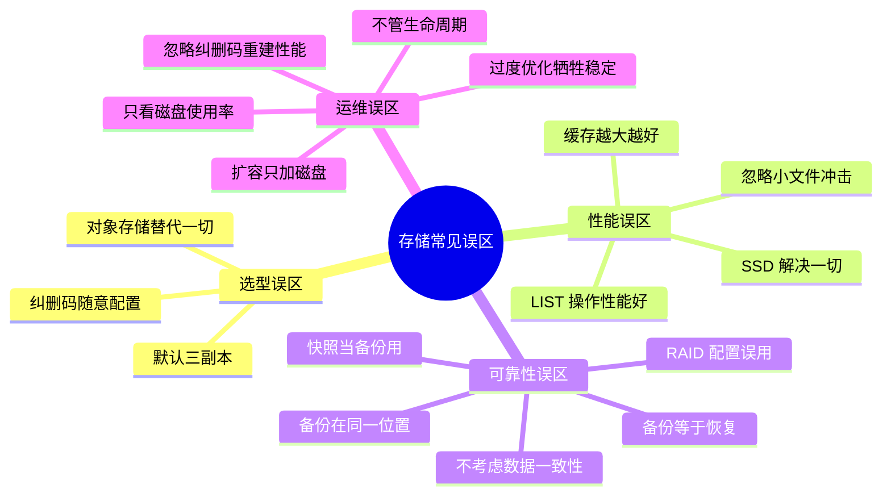
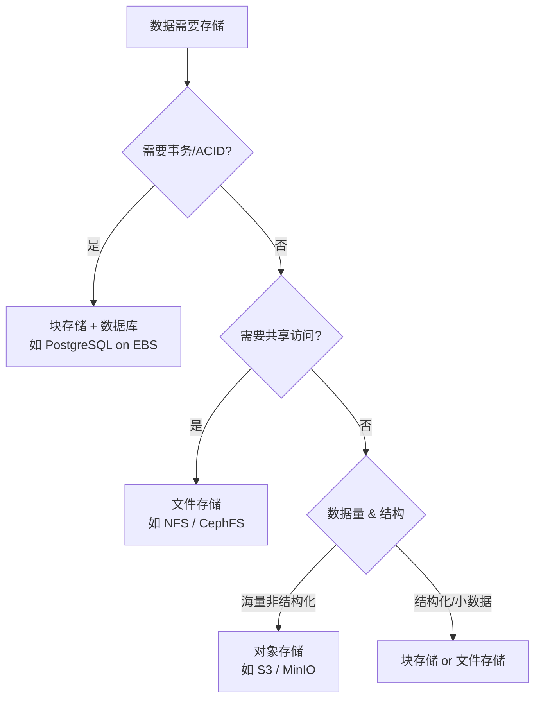
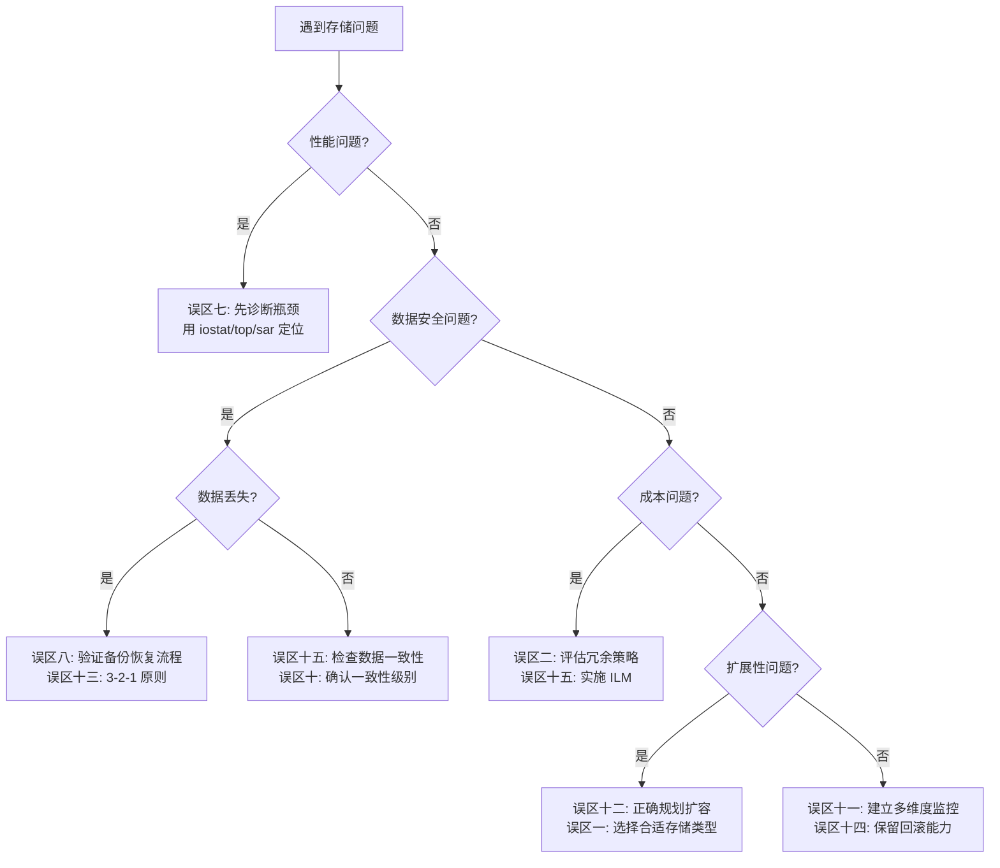

# 第38章 存储服务 — 常见误区

在存储服务的设计、部署和运维过程中，工程师常常因为对底层机制理解不足、过度追求某个极端指标、或者照搬"最佳实践"而不结合自身场景，而陷入各种设计陷阱。本节系统梳理存储服务中最常见的十七个误区，逐一剖析其成因、危害和正确的应对策略。



---

## 误区一：用对象存储替代一切存储需求

**典型表现**

"对象存储便宜又好扩展，所有数据都扔到 S3/MinIO 就行了"——这种想法在初创团队中极为常见。当数据库需要低延迟随机读写时，团队却把数据放在对象存储上，再包一层代理去模拟块设备接口。

**为什么这是个误区**

对象存储的核心设计目标是高吞吐、高扩展、低成本，而非低延迟随机 IO。其内部将数据切块后以追加方式写入磁盘，元数据存储在独立的索引服务中，每次读取都需要先查元数据再定位数据块。这种架构导致：

- **随机读延迟高**：单次 PUT/GET 延迟通常在 5-50ms（对比 NVMe SSD 的 0.02ms）
- **不支持原地修改**：对象写入后只能整体替换，无法修改某个字节
- **元数据查询有上限**：LIST 操作在海量对象场景下可能需要数秒
- **事务支持缺失**：没有原子性读写，无法实现 ACID 事务

**正确做法**

根据数据特征选择合适的存储类型：

| 数据特征 | 推荐存储类型 | 典型场景 |
|---------|-------------|---------|
| 高频随机读写、需要事务 | 块存储 + 数据库 | 交易系统、用户会话 |
| 大文件顺序读写 | 文件存储 (NFS/CephFS) | 视频编辑、日志归档 |
| 海量非结构化数据 | 对象存储 (S3/MinIO) | 图片视频、备份归档 |
| 共享访问、多客户端读写 | 文件存储 (NFS/SMB) | 代码仓库、配置共享 |

实际项目中常见的合理组合是：数据库运行在块存储上提供事务和低延迟，应用产生的日志和媒体文件写入对象存储实现低成本持久化，代码仓库和共享配置通过文件存储提供 NFS/SMB 共享访问。



---

## 误区二：三副本是最安全的默认选择

**典型表现**

"数据放三个副本就安全了"——很多团队在设计存储方案时，不假思索地选择三副本复制，认为这是最安全的默认配置。

**为什么这是个误区**

三副本确实能容忍两台节点同时故障，但它带来三个严重问题：

1. **存储开销高达 300%**：存 1TB 数据需要消耗 3TB 磁盘空间，存储成本直接翻三倍
2. **写放大严重**：每次写入需要同步写三份数据，网络带宽和磁盘 IO 都需要三倍
3. **恢复时间长**：一台节点故障后，需要从其余两台复制全部数据，1TB 数据可能需要数小时

在大规模集群中，三副本的恢复时间窗口（MTTR）过长会显著增加数据丢失风险。当集群规模超过 100 台节点时，任意一台节点在恢复期间再次故障的概率不可忽略。

**正确做法**

根据数据的重要性和访问模式选择冗余策略：

| 冗余策略 | 存储开销 | 容错能力 | 适用场景 |
|---------|---------|---------|---------|
| 三副本 | 3x | 容忍任意 2 节点故障 | 元数据、核心业务数据 |
| 纠删码 (6,3) | 1.5x | 容忍任意 3 块丢失 | 大文件存储、温冷数据 |
| 纠删码 (8,4) | 1.5x | 容忍任意 4 块丢失 | 冷数据归档 |
| 两副本 + 纠删码 | 约 2x | 容忍 1 节点故障 + 编码保护 | 一般业务数据 |

Ceph 的最佳实践是：对需要低延迟访问的热数据使用三副本，对温冷数据使用纠删码。MinIO 默认使用纠删码（EC:4/2 配置），在提供等同于双副本可靠性的同时只消耗 1.5 倍存储空间。

---

## 误区三：忽略纠删码的重建性能影响

**典型表现**

使用纠删码后，运维团队发现集群容量从 300% 降到了 150%，成本大幅下降。但当一台磁盘故障后，数据重建需要数天时间，期间集群性能严重下降。

**为什么这是个误区**

纠删码的数据重建与副本复制有本质区别：副本复制只需要复制一份完整数据，而纠删码重建需要读取剩余的 k 个块，在内存中执行矩阵运算，再写入新的校验块。这个过程涉及：

- **大量网络 IO**：需要从 k 个远端节点读取数据块
- **CPU 计算开销**：有限域矩阵运算消耗大量 CPU
- **磁盘压力**：故障磁盘上的数据需要从其余磁盘读取，导致正常 IO 性能下降
- **重建窗口长**：单块 4MB 的对象重建一个 10GB 文件可能需要数十分钟

在 100TB 规模的集群中，一块 4TB HDD 故障后的完整重建可能需要 24-48 小时，期间集群吞吐量可能下降 30-50%。

**正确做法**

1. **预留重建带宽**：确保集群网络带宽有 30-50% 的余量用于数据重建
2. **分层纠删码**：对热数据使用较小的 k+m（如 4+2），对冷数据使用较大的 k+m（如 8+4）
3. **监控重建进度**：设置告警，当重建时间超过阈值时通知运维
4. **使用 SSD 加速重建**：SSD 的高 IOPS 可以显著缩短重建时间
5. **实施磁盘预替换策略**：在磁盘 SMART 预警时主动替换，避免被动重建

```bash
# 监控 Ceph 重建进度
ceph status | grep -E "pgs|recovery"
# 查看具体正在恢复的 PG
ceph pg dump_stuck recovery

# 控制恢复速度（避免影响正常 IO）
ceph tell 'osd.*' injectargs --osd-max-backfills=2
ceph tell 'osd.*' injectargs --osd-recovery-max-active=3
```

---

## 误区四：对象存储的 LIST 操作性能很好

**典型表现**

在设计文件管理系统时，直接对存储桶执行 `list_objects_v2` 来获取文件列表，然后在应用层做分页。当存储桶中有数百万个对象时，系统变得极慢甚至不可用。

**为什么这是个误区**

对象存储的 LIST 操作需要遍历元数据索引。对于扁平命名空间的对象存储来说：

- **前缀越多越慢**：如果使用 `photos/2024/06/` 这样的多级前缀，每次 LIST 都需要过滤大量对象
- **分页有硬限制**：单次 LIST 最多返回 1000 个对象，百万对象需要数千次请求
- **一致性延迟**：在最终一致性模型下，新写入的对象可能在 LIST 中延迟出现
- **无法原子操作**：LIST 结果在遍历过程中可能已经变化

S3 的 LIST API 在前缀筛选时的性能曲线：1000 个对象时 50ms，10 万个对象时 500ms，100 万个对象时可能超过 5 秒。

**正确做法**

1. **避免深层前缀嵌套**：对象键尽量扁平化，使用 UUID 或哈希作为前缀
2. **维护外部索引**：将文件元数据存储在数据库中，通过数据库查询替代 LIST
3. **使用事件通知**：配置 S3/MinIO 的事件通知，在对象创建/删除时更新索引
4. **利用标签过滤**：使用对象标签（Object Tags）结合 CloudFront 或 CDN 缓存

```python
# 错误做法：依赖 LIST 操作
objects = []
for page in paginator.paginate(Bucket='my-bucket', Prefix='photos/2024/'):
    objects.extend(page.get('Contents', []))

# 正确做法：使用 DynamoDB/数据库维护元数据索引
import boto3
dynamodb = boto3.resource('dynamodb')
table = dynamodb.Table('file-index')

# 查询时直接查数据库
response = table.query(
    IndexName='category-date-index',
    KeyConditionExpression=Key('category').eq('photos')
)
# O(1) 查询，毫秒级响应
```

---

## 误区五：缓存越大越好，不需要考虑淘汰策略

**典型表现**

"给存储系统加 128GB 内存做缓存，IOPS 一定能上去"——这种想法忽略了缓存命中率和缓存污染问题。

**为什么这是个误区**

缓存的有效性取决于命中率，而非绝对大小。在以下场景中，大缓存可能毫无帮助：

- **工作集超出缓存容量**：如果热数据总量是 200GB，缓存 128GB 仍然有大量缓存未命中
- **顺序扫描污染**：一次全表扫描会将缓存中的热数据全部替换为冷数据
- **随机访问模式**：如果数据访问没有局部性，缓存命中率可能低于 10%
- **缓存一致性开销**：缓存越大，维护缓存一致性的开销越高

典型的缓存污染场景：数据库做了一次大查询（如生成报表），将 50GB 的冷数据刷入缓存，导致原本命中率 90% 的缓存暴跌到 30%，在线业务的延迟从 1ms 飙升到 50ms。

**正确做法**

1. **选择合适的缓存淘汰算法**：LRU 适合大多数场景，LFU 适合热点数据固定的场景
2. **设置缓存上限和淘汰阈值**：当缓存使用率超过 80% 时开始主动淘汰
3. **使用多级缓存**：L1（本地内存）+ L2（分布式缓存）分层
4. **监控缓存命中率**：设置告警，当命中率低于 70% 时排查原因

```bash
# Redis 缓存命中率监控
redis-cli INFO stats | grep -E "keyspace_hits|keyspace_misses"

# 计算命中率
# hit_rate = keyspace_hits / (keyspace_hits + keyspace_misses) * 100

# 设置最大内存和淘汰策略
# redis.conf
maxmemory 16gb
maxmemory-policy allkeys-lru
```

---

## 误区六：忽略小文件对存储系统的冲击

**典型表现**

存储集群设计容量是 100TB，实际只存了 20TB 数据就出现性能瓶颈——集群响应变慢，CPU 使用率居高不下。

**为什么这是个误区**

小文件（通常指小于 1MB 的文件）对存储系统的冲击是多维度的：

- **元数据膨胀**：每个文件至少占用一个 inode/元数据条目，1000 万个 10KB 文件的元数据本身可能超过 1GB
- **IO 效率低下**：每次文件操作都是独立的 IO 请求，1000 万个小文件意味着 1000 万次 IO
- **纠删码效率低**：对象最小粒度是 4MB，10KB 的文件也会占用 4MB 的纠删码条带
- **内存压力大**：文件系统的 dentry cache 和 inode cache 都需要内存

一个经典案例：某公司的图片存储集群，存了 5000 万张图片（平均 50KB/张），总计约 2.5TB 数据。但集群需要 100 台 OSD 节点，而存 2.5TB 大文件只需要 5-6 台。

**正确做法**

1. **使用打包/合并策略**：将小文件合并为大文件（如 tar 归档），通过索引定位
2. **调整对象最小大小**：MinIO 可配置 `MINIO_STORAGE_CLASS_STANDARD=EC:4,2` 优化小对象
3. **使用元数据缓存**：为小文件的元数据单独建立缓存层
4. **按大小分桶**：将大文件和小文件分别存入不同存储池，配置不同参数

```python
# 小文件打包存储示例
class SmallFilePacker:
    def __init__(self, pack_size_mb=64):
        self.pack_size = pack_size_mb * 1024 * 1024
        self.current_pack = bytearray()
        self.index = {}  # key -> (pack_id, offset, length)

    def put(self, key, data):
        """将小文件打包后写入"""
        if len(self.current_pack) + len(data) > self.pack_size:
            self._flush_pack()
        offset = len(self.current_pack)
        self.current_pack.extend(data)
        self.index[key] = (self.current_pack_id, offset, len(data))

    def get(self, key):
        """根据索引从大文件中读取"""
        pack_id, offset, length = self.index[key]
        pack_data = self._read_pack(pack_id)
        return pack_data[offset:offset+length]
```

---

## 误区七：认为 SSD 一定能解决所有 IO 问题

**典型表现**

"数据库慢了？换 SSD。应用卡了？磁盘换 SSD。"——盲目将 SSD 作为 IO 性能问题的万能药。

**为什么这是个误区**

SSD 确实能显著提升随机读性能，但 IO 瓶颈可能出现在多个层面：

- **文件系统层**：ext4 的日志写入、inode 分配可能成为瓶颈，而非磁盘本身
- **应用层**：数据库的锁竞争、查询未命中索引、连接池耗尽等问题不是磁盘 IO 造成的
- **网络层**：分布式存储中，网络延迟和带宽可能比磁盘 IO 更先成为瓶颈
- **CPU 层**：加密解压缩（如 AES-NI 未启用）可能消耗大量 CPU 时间

一个典型案例：某 MySQL 实例在 HDD 上 QPS 只有 500，换 SSD 后提升到 2000。但团队期望的 10000 QPS 始终达不到，排查后发现是慢查询和缺少索引的问题，与磁盘无关。

**正确做法**

在更换 SSD 之前，先进行全面的性能诊断：

```bash
# 第一步：确认是否真的是磁盘 IO 瓶颈
iostat -x 1 10    # 查看 %util、await、svctm
# 如果 %util < 60%，磁盘不是瓶颈

# 第二步：检查 CPU 使用情况
top -bn1 | head -20
# 如果 sys% 过高，可能是文件系统锁竞争

# 第三步：检查网络
sar -n DEV 1 10
# 如果网络使用率高，瓶颈可能在网络层

# 第四步：检查应用层
# MySQL: SHOW PROCESSLIST; SHOW ENGINE INNODB STATUS\G
# 查看是否有大量锁等待、慢查询
```

---

## 误区八：备份等于恢复，不需要验证恢复流程

**典型表现**

"我们每天都在做备份，所以数据是安全的"——团队从不测试备份的可恢复性，直到真正需要恢复时才发现备份文件损坏或格式不兼容。

**为什么这是个误区**

备份的真正价值在于"能恢复"，而非"有备份"。以下情况在实际中非常常见：

- **备份文件损坏**：磁盘静默损坏（bit rot）导致备份文件部分数据错误
- **恢复流程过时**：软件升级后，旧版备份格式与新版不兼容
- **恢复时间超出预期**：没有验证过恢复时间，RTO 目标形同虚设
- **依赖关系缺失**：恢复了数据库文件但缺少配置文件、密钥证书等依赖
- **备份策略漏洞**：增量备份链断裂，某个时间点的数据实际无法恢复

2023 年的一项调查显示，约 60% 的企业承认从未完整测试过灾难恢复流程，而其中约 25% 在真正需要恢复时遇到了严重问题。

**正确做法**

1. **定期执行恢复演练**：每月至少一次完整恢复测试
2. **验证恢复数据完整性**：恢复后执行 checksum 校验和业务验证查询
3. **记录恢复步骤和时间**：建立恢复 Runbook，记录实际恢复时间
4. **测试不同的故障场景**：单文件恢复、整表恢复、完全恢复

```bash
#!/bin/bash
# 自动化恢复验证脚本
BACKUP_DIR="/backup/daily"
VERIFY_DIR="/tmp/restore-verify"

# 1. 恢复最近的备份
mkdir -p $VERIFY_DIR
mc mirror minio/backup-bucket/latest/ $VERIFY_DIR/

# 2. 校验文件完整性
find $VERIFY_DIR -type f -exec sha256sum {} \; | \
    while read hash file; do
        original_hash=$(mc stat minio/source-bucket/${file#$VERIFY_DIR/} --json | jq -r '.sha256')
        if [ "$hash" != "$original_hash" ]; then
            echo "INTEGRITY FAILURE: $file"
            exit 1
        fi
    done

# 3. 验证数据库恢复（以 PostgreSQL 为例）
pg_restore -d verify_db $VERIFY_DIR/db_dump.sql
psql -d verify_db -c "SELECT COUNT(*) FROM users;" > /dev/null

echo "恢复验证通过: $(date)"
```

---

## 误区九：纠删码配置中的 k 和 m 随意设置

**典型表现**

"纠删码配 4+2 不够安全？那就配 8+8，既能容错又高效。"——不理解 k 和 m 的含义就随意配置，导致存储开销暴增或容错能力不足。

**为什么这是个误区**

纠删码 RS(k,m) 中 k 是数据块数量，m 是校验块数量。配置选择直接影响三个核心指标：

- **存储效率** = k / (k+m)：RS(4,2) = 66.7%，RS(8,8) = 50%
- **容错能力** = 最多容忍 m 个块丢失
- **重建时间**：m 越大，需要读取的块越多，重建越慢

RS(8,8) 看起来容错能力强（容忍任意 8 个块丢失），但存储效率只有 50%，比三副本（33% 效率）还低，完全失去了纠删码的意义。

RS(4,2) 的存储效率是 66.7%，容错 2 块，但重建时只需读取 4 个块，重建速度快。

**正确做法**

| 配置 | 存储效率 | 容错块数 | 重建需读块数 | 推荐场景 |
|------|---------|---------|------------|---------|
| RS(4,2) | 66.7% | 2 | 4 | 热数据、对重建速度敏感 |
| RS(6,3) | 66.7% | 3 | 6 | 通用场景、平衡选择 |
| RS(8,4) | 66.7% | 4 | 8 | 温数据、机架感知部署 |
| RS(10,4) | 71.4% | 4 | 10 | 冷数据、存储效率优先 |

经验法则：**m 不应超过 k 的 50%**，否则存储效率低于 66.7%，纠删码的优势不再明显。对于需要高容错的场景，建议使用 RS(6,3) 或 RS(8,4) 而非增大 m。

---

## 误区十：存储系统不需要考虑数据一致性

**典型表现**

"最终一致性反正也是'一致'，不需要特别关注"——在涉及金融交易、订单系统等场景中使用最终一致性的存储，导致数据不一致。

**为什么这是个误区**

不同的一致性模型适用于完全不同的场景：

- **强一致性**：写入完成后立即可读，适合金融交易、库存扣减
- **最终一致性**：写入后存在短暂的不一致窗口，适合社交动态、日志
- **因果一致性**：保证因果关系的操作有序，适合聊天记录

在金融系统中，如果使用最终一致性的对象存储来记录账户余额，可能出现：A 向 B 转账 100 元，A 的余额立即扣减成功，但 B 的余额在数秒后才更新——在这段时间内，B 可能重复看到旧余额并发起另一笔转账。

**正确做法**

根据业务场景选择合适的一致性级别：

```python
# 根据业务场景选择一致性级别
class StorageConfig:
    @staticmethod
    def for_financial_transaction():
        """金融交易：需要强一致性"""
        return {
            'consistency': 'strong',
            'write_quorum': 'all',  # 写入所有副本才返回成功
            'read_quorum': 'all',   # 从所有副本读取最新数据
            'storage_backend': 'postgresql'  # 使用关系型数据库
        }

    @staticmethod
    def for_social_feed():
        """社交动态：最终一致性即可"""
        return {
            'consistency': 'eventual',
            'write_quorum': 'one',  # 写入一个副本即返回
            'read_quorum': 'one',   # 任意副本都可读
            'storage_backend': 'dynamodb'  # 使用 NoSQL
        }

    @staticmethod
    def for_inventory():
        """库存管理：需要线性一致性"""
        return {
            'consistency': 'linearizable',
            'write_quorum': 'majority',
            'read_quorum': 'majority',
            'storage_backend': 'etcd'  # 使用共识系统
        }
```

---

## 误区十一：监控只需要看磁盘使用率

**典型表现**

运维团队只监控存储集群的磁盘使用率，设置 80% 告警阈值。当磁盘使用率才 50% 时集群就出现严重性能问题，运维团队完全措手不及。

**为什么这是个误区**

磁盘使用率只是存储健康状况的一个维度。以下指标同样关键甚至更重要：

- **IOPS 使用率**：磁盘 IOPS 已达上限，但空间还剩一半
- **延迟 P99**：平均延迟正常但尾延迟飙高，影响用户体验
- **网络带宽**：集群内部复制和恢复依赖网络，网络拥塞是常见瓶颈
- **PG/对象分布不均**：数据倾斜导致部分 OSD 过载
- **重建状态**：集群正在重建时性能会显著下降
- **未修复告警**：硬件降级（如单条内存 ECC 错误）可能引发数据损坏

**正确做法**

建立多维度的存储监控体系：

```bash
# Ceph 全面健康检查
# 1. 集群整体状态
ceph health detail

# 2. OSD 性能（注意 await 和 util）
ceph daemon osd.0 perf dump | jq '.filestore'

# 3. 延迟分布
ceph daemon osd.0 perf dump | jq '.op_lat'

# 4. 网络带宽
iftop -i eth0 -t -s 10

# 5. PG 分布均匀性
ceph osd df tree
# 关注 %USE 列的标准差，理想值 < 5%
```

建议使用 Prometheus + Grafana 构建存储监控仪表盘，核心面板包括：集群 IOPS、平均延迟、P99 延迟、OSD 利用率分布、网络带宽、重建进度。

---

## 误区十二：存储扩容只需要加磁盘

**典型表现**

"集群容量快满了，买几台新节点加上去就行了。"——实际扩容后发现性能反而下降，数据分布不均，部分节点过载。

**为什么这是个误区**

存储扩容远不止"加磁盘"这么简单：

- **数据再平衡需要时间**：新节点加入后，集群需要重新平衡数据分布，这个过程可能持续数天
- **再平衡期间性能下降**：大量数据迁移会占用网络带宽和磁盘 IO
- **CRUSH Map 更新不及时**：Ceph 的 CRUSH Map 更新后，数据迁移需要等所有 OSD 感知新规则
- **硬件异构问题**：新节点的磁盘性能和容量可能与旧节点不同，导致数据倾斜
- **网络拓扑影响**：新节点的网络位置可能影响数据分布的均匀性

一个实际案例：某团队在 20 台 NVMe 节点的集群中加入了 5 台 HDD 节点，CRUSH Map 将等量数据分配到所有节点。结果 HDD 节点成为性能热点，整个集群的 P99 延迟从 2ms 飙升到 50ms。

**正确做法**

1. **设置合适的权重**：新节点的权重应该根据其容量和性能设置，而非默认等权
2. **分批扩容**：一次加入 2-3 台节点，观察再平衡完成后再加入下一批
3. **限制再平衡带宽**：设置 `osd max backfills` 限制并发迁移数量
4. **监控再平衡进度**：确保再平衡按预期完成

```bash
# Ceph 扩容正确步骤
# 1. 添加新 OSD
ceph orch daemon add osd new-host:/dev/sdb

# 2. 设置合适的权重（根据磁盘容量）
ceph osd crush reweight osd.20 1.5  # 根据实际容量设置

# 3. 限制再平衡带宽，避免影响正常业务
ceph tell 'osd.*' injectargs --osd-max-backfills=1
ceph tell 'osd.*' injectargs --osd-recovery-max-active=3

# 4. 监控再平衡进度
watch -n 5 'ceph -s | grep pgs'

# 5. 等待再平衡完成后恢复默认值
ceph tell 'osd.*' injectargs --osd-max-backfills=3
```

---

## 误区十三：将备份存储在同一物理位置

**典型表现**

"我们有三副本，而且每天都在做异地备份。"——实际上，"异地备份"是把备份文件放在了同一个数据中心的不同机柜。

**为什么这是个误区**

数据冗余和灾难恢复是两个不同的概念：

- **三副本**：防止单节点/单磁盘故障，副本在同一集群内
- **异地容灾**：防止机房级灾难（火灾、洪水、断电），需要真正的异地部署
- **本地备份**：防止误操作和数据损坏，但无法应对物理灾害

2021 年 OVHcloud 数据中心火灾事件中，数万家企业的数据因仅在同一数据中心做了冗余而永久丢失。虽然他们有"备份"，但备份与生产数据在同一栋建筑内。

一个常见的认知误区是将"备份"和"容灾"混为一谈。备份解决的是"数据丢失"问题（误删、损坏），容灾解决的是"服务中断"问题（机房灾难）。两者需要分别规划。

**正确做法**

遵循 **3-2-1 备份原则**：

- **3 份数据**：1 份生产数据 + 2 份备份
- **2 种介质**：磁盘 + 对象存储（或磁带）
- **1 份异地**：至少一份备份在不同地理区域

```bash
# 3-2-1 备份策略示例
#!/bin/bash

# 副本1: 本地 SSD（生产环境）
rsync -avz /data/ /backup/local/

# 副本2: 同城对象存储（不同机房）
mc mirror /backup/local/ minio-local/backup-bucket/

# 副本3: 异地对象存储（不同地域）
mc mirror /backup/local/ minio-remote/backup-bucket/

# 验证异地备份完整性
DIFF=$(mc diff minio-local/backup-bucket/ minio-remote/backup-bucket/)
if [ -n "$DIFF" ]; then
    echo "异地备份不一致: $DIFF"
    alert "异地备份异常"
fi
```

---

## 误区十四：过度优化存储配置，忽略稳定性

**典型表现**

为了追求极限性能，将所有参数调到最激进的配置：关闭日志写入、禁用数据校验、调小超时时间。结果系统在压力测试时表现优异，生产环境中却频繁出现数据损坏。

**为什么这是个误区**

存储系统的配置需要在性能和可靠性之间取得平衡。以下常见"优化"实际上是在牺牲安全性：

| 激进配置 | 潜在风险 | 建议做法 |
|---------|---------|---------|
| 关闭 WAL/日志 | 崩溃后数据丢失 | 保持日志开启，使用 SSD 存储日志 |
| 禁用数据校验（checksum） | 静默数据损坏无法检测 | 始终启用数据校验 |
| 调小超时时间 | 网络抖动导致误判故障 | 设置合理的超时阈值 |
| 关闭 fsync | 崩溃后数据丢失 | 除非明确理解风险，否则保持 fsync |
| 使用 RAID 0 | 一块磁盘故障导致全部数据丢失 | 至少使用 RAID 5 或 RAID 10 |

一个真实案例：某团队为了提升 MinIO 性能，将 `MINIO_STORAGE_CLASS_STANDARD` 配置为无纠删码。在一次电力故障后，15% 的数据因磁盘故障无法恢复，损失超过 500 万元。

**正确做法**

遵循"先稳定，后优化"的原则：

1. **先建立基准**：使用 fio 等工具测量默认配置下的性能
2. **逐项调整**：每次只修改一个参数，观察效果
3. **压力测试**：在生产环境上线前进行充分的压力测试
4. **监控关键指标**：性能提升的同时确保数据完整性指标不下降
5. **保留回滚能力**：记录每次配置变更，确保可以快速回滚

---

## 误区十五：不考虑存储的生命周期管理

**典型表现**

所有数据都存放在同一级别的存储上，不管数据创建了多久、被访问了多少次。结果是大量的历史数据占用了昂贵的高性能存储资源，而真正需要高性能的热数据却因为空间不足而被挤压。

**为什么这是个误区**

存储资源是有成本的，不同级别的存储成本差异巨大：

| 存储层级 | 典型介质 | 月成本 (每 TB) | 访问延迟 | 适用数据 |
|---------|---------|---------------|---------|---------|
| 热存储 | NVMe SSD | $200-400 | < 0.1ms | 过去 7 天的数据 |
| 温存储 | SATA SSD | $50-100 | < 1ms | 7-90 天的数据 |
| 冷存储 | HDD | $10-20 | < 10ms | 90 天-1 年的数据 |
| 归档存储 | 磁带/冷存储 | $1-5 | 分钟-小时 | 1 年以上的数据 |

如果不做分层管理，所有数据都存放在 SSD 上，100TB 数据一年的存储成本约为 $240,000-$480,000。而合理的分层策略可以将成本降低到 $30,000-$80,000，节省 70-85%。

**正确做法**

实施自动化数据生命周期管理：

```yaml
# MinIO ILM（Information Lifecycle Management）配置
# 使用 mc ilm 命令设置生命周期规则
mc ilm rule add minio/my-bucket \
    --expire-days 365 \           # 365天后自动删除
    --transition-days 30 \        # 30天后转为低频存储
    --storage-class GLACIER \     # 转入归档存储
    --expire-delete-marker \      # 删除标记过期清理
    --prefix "logs/"              # 只对 logs 前缀生效
```

```python
# 自定义存储生命周期管理
class DataLifecycleManager:
    def __init__(self, storage_client):
        self.client = storage_client

    def apply_lifecycle_rules(self, bucket):
        """应用数据生命周期规则"""
        objects = self.client.list_objects(bucket)

        for obj in objects:
            age_days = (datetime.now() - obj.created_at).days

            if age_days > 365:
                # 超过1年的数据迁移到归档存储
                self.client.transition(obj, target='GLACIER')
                print(f"归档: {obj.key} (age: {age_days}d)")

            elif age_days > 90:
                # 超过90天的数据转为低频存储
                self.client.transition(obj, target='STANDARD_IA')
                print(f"转冷: {obj.key} (age: {age_days}d)")

            elif age_days > 30:
                # 超过30天的数据转为标准存储
                self.client.transition(obj, target='STANDARD')
                print(f"转温: {obj.key} (age: {age_days}d)")
```

---

## 误区十六：将 RAID 等同于数据安全的保障

**典型表现**

"我们的存储服务器配了 RAID 5，数据很安全。"——认为只要配置了 RAID 就万事大吉，不关注 RAID 级别的容错能力差异和 RAID 重建过程中的风险窗口。

**为什么这是个误区**

RAID（Redundant Array of Independent Disks）有多种级别，容错能力差异巨大。许多团队为了平衡容量和安全选择了 RAID 5，但忽视了 RAID 5 在大容量磁盘时代的致命缺陷：

- **RAID 0**：无冗余，一块磁盘故障即全部数据丢失——这不是容错方案，而是性能方案
- **RAID 1**：镜像复制，存储效率 50%，容错 1 块——简单可靠但成本高
- **RAID 5**：单校验块，容错 1 块，存储效率 (N-1)/N——**大容量磁盘重建时间过长是致命问题**
- **RAID 6**：双校验块，容错 2 块——比 RAID 5 安全，但存储效率更低

RAID 5 的核心问题在于：现代 HDD 容量已达到 4TB-20TB，重建一块 20TB 磁盘可能需要 24-48 小时。在此期间，同组磁盘如果再出现一个不可纠正读取错误（URE），数据将永久丢失。研究表明，大容量 HDD 在重建过程中遇到 URE 的概率超过 50%。

此外，许多团队使用硬件 RAID 控制器却不配置 BBU（电池备份单元）或超级电容。断电时，RAID 控制器缓存中的未落盘数据和校验信息将丢失，可能导致数据不一致。

**正确做法**

1. **根据磁盘容量选择 RAID 级别**：4TB 以上磁盘避免 RAID 5，优先选择 RAID 6 或 RAID 10
2. **配置 BBU/超级电容**：确保 RAID 控制器缓存在断电时有保护
3. **启用磁盘一致性检查**：定期执行一致性扫描，避免静默数据损坏
4. **考虑用纠删码替代传统 RAID**：在软件定义存储（Ceph、MinIO）中，纠删码提供了更灵活、更高效的冗余方案

```bash
# RAID 健康检查（Linux mdadm）
# 查看 RAID 状态
cat /proc/mdstat

# 查看详细信息
sudo mdadm --detail /dev/md0

# 启动一致性检查（避免影响业务，设置较低速度）
echo 1000 > /proc/sys/dev/raid/speed_limit_min
echo 20000 > /proc/sys/dev/raid/speed_limit_max
sudo mdadm --run --scan /dev/md0

# 检查 RAID 重建进度
watch -n 10 'cat /proc/mdstat | head -20'
```

| RAID 级别 | 最少磁盘数 | 存储效率 | 容错能力 | 重建风险 | 推荐场景 |
|-----------|-----------|---------|---------|---------|---------|
| RAID 0 | 2 | 100% | 无容错 | N/A | 临时数据、缓存 |
| RAID 1 | 2 | 50% | 容忍 1 块故障 | 低 | 系统盘、小容量关键数据 |
| RAID 5 | 3 | (N-1)/N | 容忍 1 块故障 | **高（大磁盘）** | 已不推荐大磁盘使用 |
| RAID 6 | 4 | (N-2)/N | 容忍 2 块故障 | 中 | 大容量 HDD 阵列 |
| RAID 10 | 4 | 50% | 每组容忍 1 块 | 低 | 数据库、高 IO 场景 |

---

## 误区十七：把快照当作备份来使用

**典型表现**

"我们每隔一小时做一次快照，数据非常安全。"——将快照等同于备份，不区分快照和备份的本质区别，也不验证快照的可恢复性。

**为什么这是个误区**

快照和备份虽然都用于数据保护，但在底层实现、容灾能力和恢复机制上有根本区别：

- **快照依赖源数据**：大多数快照采用写时复制（CoW）或写时重定向（RoW）实现，快照本身只存储变更数据或指针。如果源数据所在的存储系统损坏，快照也随之不可用
- **快照在同一存储域**：快照与原始数据通常在同一存储阵列或集群中，无法防御机房级灾难
- **快照无法脱离存储系统**：快照不能导出到独立的存储介质，存储阵列故障时快照无法独立恢复数据
- **快照的删除容易误操作**：存储管理员误删快照或存储系统故障导致快照链断裂的案例屡见不鲜

一个典型场景：某公司依赖 VMware 快照保护虚拟机，快照链长达 24 层。一次存储阵列控制器故障后，所有快照与原始磁盘一起丢失，数据完全不可恢复。

**正确做法**

建立快照 + 备份的多层保护体系：

| 保护层级 | 技术手段 | 防御场景 | 恢复粒度 | RPO |
|---------|---------|---------|---------|-----|
| 第一层：快照 | 本地快照 | 误操作、软件 bug | 秒级 | 分钟级 |
| 第二层：本地备份 | 异机备份/克隆 | 磁盘故障、RAID 崩溃 | 分钟级 | 小时级 |
| 第三层：异地备份 | 异地复制/云备份 | 机房级灾难 | 小时级 | 天级 |

```bash
# 快照 + 备份分层策略示例

# 1. 本地快照（每小时，保留 24 个）
# Ceph RBD 快照
rbd snap create mypool/vm-disk@hourly-$(date +\%H)
rbd snap ls mypool/vm-disk
# 保留策略：删除 24 小时前的快照
rbd snap rm mypool/vm-disk@hourly-$(date -d '25 hours ago' +\%H)

# 2. 本地备份（每天，保留 30 个）
# 从快照导出完整备份到独立存储
rbd export --snap=hourly-00 mypool/vm-disk /backup/$(date +\%Y\%m\%d)/vm-disk.img

# 3. 异地备份（每周，保留 12 个）
# 使用 rclone 同步到异地对象存储
rclone sync /backup/weekly/ remote-backup:bucket/vm-backups/ \
    --transfers 4 --checkers 8
```

**关键原则**：快照是"保险丝"，备份是"安全网"。快照提供快速恢复能力，备份提供真正的数据安全保障。两者缺一不可。

---

## 总结

存储服务中的误区往往源于对底层机制的误解、对"最佳实践"的盲目照搬、以及对成本和性能的过度权衡。以下是一张核心误区与纠正策略的速查表：

| 误区 | 核心问题 | 纠正策略 |
|------|---------|---------|
| 对象存储替代一切 | 误解对象存储的定位 | 按数据特征选择存储类型 |
| 默认三副本 | 忽视存储成本和重建开销 | 根据数据重要性选择冗余策略 |
| 忽略纠删码重建性能 | 只关注存储效率 | 预留重建带宽，监控重建进度 |
| LIST 操作性能好 | 高估 LIST 能力 | 维护外部索引，优化键结构 |
| 缓存越大越好 | 忽视命中率和污染 | 选择合适淘汰策略，监控命中率 |
| SSD 解决一切 | 忽视多层瓶颈 | 先诊断再优化，确认真正瓶颈 |
| 备份等于恢复 | 未验证恢复流程 | 定期恢复演练，建立恢复 Runbook |
| 纠删码随意配置 | 不理解 k/m 含义 | m ≤ k/50%，根据场景选择 |
| 不考虑一致性 | 混淆一致性级别 | 按业务需求选择一致性模型 |
| 只看磁盘使用率 | 监控维度单一 | 建立多维度监控体系 |
| 扩容只加磁盘 | 忽视数据再平衡 | 设置权重，分批扩容，限制带宽 |
| 备份在同一位置 | 混淆备份和容灾 | 遵循 3-2-1 原则 |
| 过度优化 | 牺牲稳定性换性能 | 先稳定后优化，保留回滚能力 |
| 不管生命周期 | 浪费存储成本 | 实施 ILM 自动化分层 |
| RAID 等于安全 | 误解 RAID 级别容错能力 | 大磁盘避免 RAID 5，用 RAID 6/10 或纠删码 |
| 快照当备份 | 混淆快照和备份的本质区别 | 快照+备份分层保护，备份必须异地 |



**核心原则**：存储系统的设计必须基于对业务场景的深入理解，没有放之四海而皆准的"最佳"配置。理解每种技术的适用边界，在性能、成本、可靠性和运维复杂度之间找到平衡点，才是存储架构设计的正确之道。
