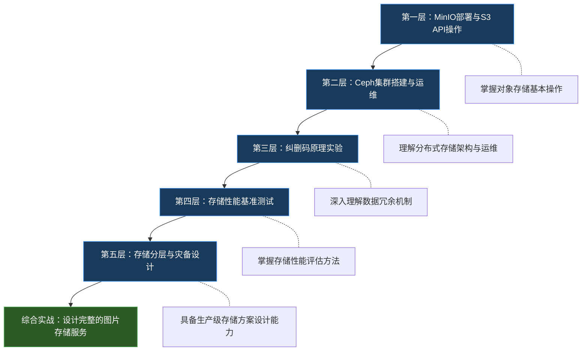
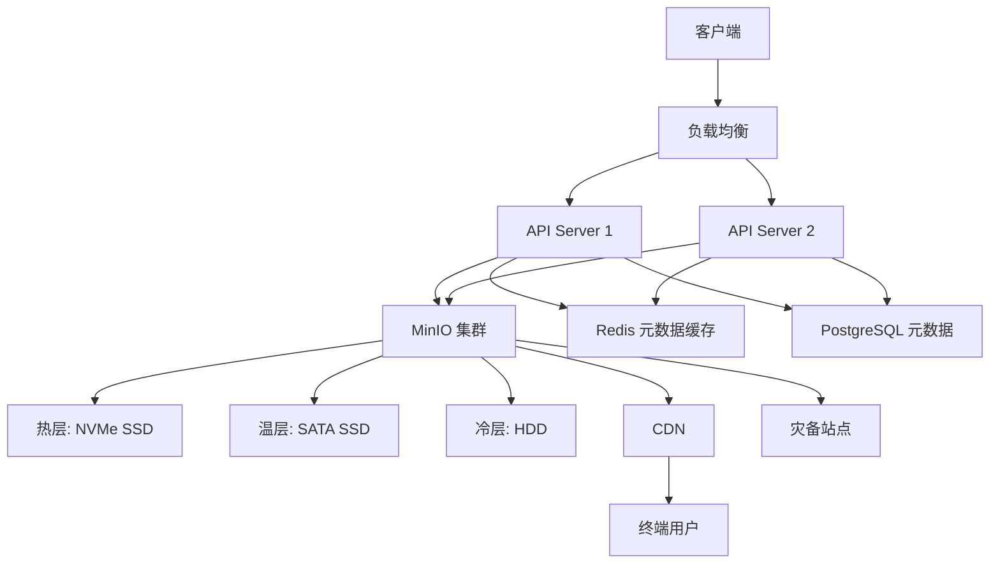

# 38.5 练习方法

存储服务是现代应用的基石——图片、视频、日志、训练数据，一切数据最终都要落盘。理论上的存储类型分类（对象存储、块存储、文件存储）看似简单，但当你真正动手部署一个 MinIO 集群、搭建一套 Ceph、手动实现 Reed-Solomon 纠删码时，才会发现每一步都隐藏着工程细节。本节提供一套从单节点到分布式集群、从基础操作到混沌工程的系统化练习路径，覆盖五个递进层级。



**建议学习路径：** 初学者按层级顺序逐步推进，预计总耗时 4-8 周。有 MinIO 或 Ceph 经验的工程师可跳过前两层，直接从纠删码实验和性能测试开始。每个层级完成后，对照文末的能力评估清单检查掌握程度。

---

## 前置准备：练习环境搭建

在开始任何练习之前，先准备好基础开发环境。不同练习对硬件的要求不同，以下是最小配置建议：

| 练习层级 | CPU | 内存 | 磁盘 | 预计耗时 |
|---------|-----|------|------|---------|
| MinIO部署与S3 API | 2核 | 4GB | SSD 20GB | 2-3天 |
| Ceph集群搭建 | 8核 | 32GB | SSD 100GB×3 | 1-2周 |
| 纠删码原理实验 | 2核 | 4GB | SSD 20GB | 1-2天 |
| 存储性能基准测试 | 4核 | 8GB | NVMe SSD+HDD 50GB | 2-3天 |
| 存储分层与灾备设计 | 8核 | 16GB | SSD 100GB | 1-2周 |

### 工具安装

```bash
# 1. Docker 环境（所有练习的基础）
curl -fsSL https://get.docker.com | sh
sudo usermod -aG docker $USER
# 重新登录后生效

# 2. MinIO 服务端
docker pull minio/minio:latest

# 3. MinIO 客户端 mc
curl -sSL https://dl.min.io/client/mc/release/linux-amd64/mc -o /usr/local/bin/mc
chmod +x /usr/local/bin/mc
mc alias set local http://localhost:9000 minioadmin minioadmin

# 4. Python boto3（S3 API 操作）
python3 -m venv storage-lab
source storage-lab/bin/activate
pip install boto3 minio pytest numpy

# 5. fio（性能基准测试）
sudo apt-get install -y fio
# 或
sudo yum install -y fio

# 6. Ceph 部署工具（第二层练习使用）
# cephadm 是推荐的 Ceph 部署工具
curl --silent --remote-name --location https://download.ceph.com/rpm-reef/el9/noarch/cephadm
chmod +x cephadm
sudo ./cephadm add-repo --release reef
sudo ./cephadm install
```

### MinIO Docker Compose 模板

```yaml
# docker-compose.minio.yml
version: '3.8'

services:
  minio:
    image: minio/minio:latest
    container_name: minio-server
    ports:
      - "9000:9000"   # API 端口
      - "9001:9001"   # Web 控制台端口
    environment:
      MINIO_ROOT_USER: minioadmin
      MINIO_ROOT_PASSWORD: minioadmin123
    volumes:
      - minio-data:/data
    command: server /data --console-address ":9001"
    healthcheck:
      test: ["CMD", "mc", "ready", "local"]
      interval: 10s
      timeout: 5s
      retries: 5

volumes:
  minio-data:
```

### Ceph 单机模拟 Docker Compose 模板

```yaml
# docker-compose.ceph-lab.yml
# 注意：完整的 Ceph 集群推荐使用 cephadm 部署
# 此模板仅用于单机概念验证
version: '3.8'

services:
  ceph-mon:
    image: ceph/ceph:v18.2.0
    container_name: ceph-mon
    volumes:
      - ceph-mon-data:/var/lib/ceph
    environment:
      - CEPH_DEMO_SENTRY_DSN=https://your-dsn
    command: mon
    network_mode: host

  ceph-osd-1:
    image: ceph/ceph:v18.2.0
    container_name: ceph-osd-1
    volumes:
      - ceph-osd-1-data:/var/lib/ceph/osd
    environment:
      - OSD_ID=1
    depends_on:
      - ceph-mon

volumes:
  ceph-mon-data:
  ceph-osd-1-data:
```

### Python S3 客户端初始化模板

```python
# s3_client.py - 统一的 S3 客户端初始化
import boto3
from botocore.config import Config

def create_s3_client(endpoint_url='http://localhost:9000',
                     access_key='minioadmin',
                     secret_key='minioadmin123'):
    """创建连接到 MinIO 的 S3 客户端"""
    return boto3.client(
        's3',
        endpoint_url=endpoint_url,
        aws_access_key_id=access_key,
        aws_secret_access_key=secret_key,
        config=Config(
            signature_version='s3v4',
            s3={'addressing_style': 'path'}
        ),
        region_name='us-east-1'
    )

# 验证连接
if __name__ == '__main__':
    s3 = create_s3_client()
    buckets = s3.list_buckets()['Buckets']
    print(f"连接成功，现有 {len(buckets)} 个存储桶")
    for b in buckets:
        print(f"  - {b['Name']}")
```

---

## 第一层：MinIO部署与S3 API操作

### 练习 1.1：MinIO 单节点部署

**目标：** 通过 Docker 部署一个单节点 MinIO 实例，理解对象存储服务的基本架构——API 端口、Web 控制台、数据持久化目录的作用。这是所有后续练习的基础。

**预计耗时：** 30-60分钟

#### 实现步骤

**步骤 1：启动 MinIO 容器**

```bash
# 创建数据目录
mkdir -p /opt/data/minio/{data,config}

# 启动 MinIO
docker run -d \
  --name minio-server \
  -p 9000:9000 \
  -p 9001:9001 \
  -e MINIO_ROOT_USER=minioadmin \
  -e MINIO_ROOT_PASSWORD=minioadmin123 \
  -v /opt/data/minio/data:/data \
  -v /opt/data/minio/config:/root/.minio \
  minio/minio:latest server /data --console-address ":9001"

# 验证服务状态
docker logs minio-server | head -20
# 应该看到类似：
# API: http://0.0.0.0:9000
# Console: http://0.0.0.0:9001
```

**步骤 2：安装并配置 MinIO 客户端 mc**

```bash
# 安装 mc（如果尚未安装）
curl -sSL https://dl.min.io/client/mc/release/linux-amd64/mc -o /usr/local/bin/mc
chmod +x /usr/local/bin/mc

# 配置别名
mc alias set local http://localhost:9000 minioadmin minioadmin123

# 验证配置
mc admin info local
# 应该看到 MinIO 服务器信息，包括版本、运行状态
```

**步骤 3：通过 Web 控制台验证**

# 在浏览器中打开
http://localhost:9001
# 使用 minioadmin / minioadmin123 登录
# 创建一个名为 "test-bucket" 的存储桶
# 上传一个文件到 test-bucket
# 在 Web 控制台确认文件已成功上传

#### 验证标准

- [ ] `docker logs minio-server` 显示 API 和 Console 端口正常
- [ ] `mc admin info local` 返回服务器状态信息
- [ ] Web 控制台可以正常登录并创建存储桶
- [ ] 可以通过 Web 控制台上传和下载文件
- [ ] 容器重启后数据仍然存在（`docker restart minio-server` 后验证）

#### 常见陷阱

**陷阱 1：端口冲突**
如果 9000 或 9001 端口已被占用，MinIO 启动会失败。检查并修改端口映射：
```bash
# 检查端口占用
ss -tlnp | grep -E '9000|9001'
# 如果冲突，使用其他端口
-p 9100:9000 -p 9101:9001
```

**陷阱 2：数据目录权限**
Docker 容器内的 MinIO 以 root 运行，但某些宿主机目录权限可能限制写入：
```bash
sudo chown -R 1000:1000 /opt/data/minio/data
```

---

### 练习 1.2：S3 API 操作实战

**目标：** 使用 Python boto3 库实现完整的 S3 API 操作——上传、下载、列举、删除、分片上传。理解对象存储 API 的工作方式和与传统文件系统的区别。

**预计耗时：** 1-2小时

**前置条件：** 练习 1.1 完成，MinIO 服务正常运行

#### 实现步骤

**步骤 1：基础 CRUD 操作**

```python
# s3_operations.py
import boto3
import os
import hashlib
from botocore.config import Config

# 创建 S3 客户端
s3 = boto3.client(
    's3',
    endpoint_url='http://localhost:9000',
    aws_access_key_id='minioadmin',
    aws_secret_access_key='minioadmin123',
    config=Config(signature_version='s3v4'),
    region_name='us-east-1'
)

# ===== 1. 创建存储桶 =====
bucket_name = 'my-first-bucket'
try:
    s3.create_bucket(Bucket=bucket_name)
    print(f"[✓] 存储桶 '{bucket_name}' 创建成功")
except s3.exceptions.BucketAlreadyExists:
    print(f"[!] 存储桶 '{bucket_name}' 已存在")

# ===== 2. 上传对象（简单上传） =====
# 创建测试文件
test_content = "Hello, Object Storage! 这是第一个测试对象。"
s3.put_object(
    Bucket=bucket_name,
    Key='greeting.txt',
    Body=test_content.encode('utf-8'),
    ContentType='text/plain; charset=utf-8',
    Metadata={'author': 'storage-lab', 'version': '1'}
)
print("[✓] 对象 'greeting.txt' 上传成功")

# 上传本地文件
with open('/etc/hostname', 'rb') as f:
    s3.put_object(
        Bucket=bucket_name,
        Key='system/hostname',
        Body=f.read()
    )
print("[✓] 对象 'system/hostname' 上传成功")

# ===== 3. 列举对象 =====
response = s3.list_objects_v2(Bucket=bucket_name)
print("\n--- 存储桶内容 ---")
for obj in response.get('Contents', []):
    size = obj['Size']
    print(f"  {obj['Key']:30s}  {size:>10,} bytes  {obj['LastModified']}")

# 列举指定前缀的对象
response = s3.list_objects_v2(Bucket=bucket_name, Prefix='system/')
print("\n--- system/ 前缀下的对象 ---")
for obj in response.get('Contents', []):
    print(f"  {obj['Key']}")

# ===== 4. 下载对象 =====
response = s3.get_object(Bucket=bucket_name, Key='greeting.txt')
content = response['Body'].read().decode('utf-8')
print(f"\n--- 下载 greeting.txt ---")
print(f"  内容: {content}")
print(f"  Content-Type: {response['ContentType']}")
print(f"  Metadata: {response.get('Metadata', {})}")

# 下载到本地文件
s3.download_file(bucket_name, 'greeting.txt', '/tmp/downloaded_greeting.txt')
print("[✓] 文件已下载到 /tmp/downloaded_greeting.txt")

# ===== 5. 生成预签名 URL =====
presigned_url = s3.generate_presigned_url(
    'get_object',
    Params={'Bucket': bucket_name, 'Key': 'greeting.txt'},
    ExpiresIn=3600  # 1 小时有效
)
print(f"\n--- 预签名 URL（1小时有效）---")
print(f"  {presigned_url[:80]}...")

# ===== 6. 删除对象 =====
s3.delete_object(Bucket=bucket_name, Key='greeting.txt')
print("[✓] 对象 'greeting.txt' 已删除")

# 验证删除
response = s3.list_objects_v2(Bucket=bucket_name)
remaining = [obj['Key'] for obj in response.get('Contents', [])]
print(f"\n--- 删除后剩余对象: {remaining} ---")
```

**步骤 2：分片上传（Multipart Upload）**

```python
# multipart_upload.py
import boto3
import os
import time
from concurrent.futures import ThreadPoolExecutor
from botocore.config import Config

s3 = boto3.client(
    's3',
    endpoint_url='http://localhost:9000',
    aws_access_key_id='minioadmin',
    aws_secret_access_key='minioadmin123',
    config=Config(signature_version='s3v4'),
    region_name='us-east-1'
)

bucket_name = 'my-first-bucket'

# ===== 创建一个 50MB 的测试文件 =====
def create_test_file(filepath, size_mb=50):
    """创建指定大小的测试文件"""
    chunk = os.urandom(1024 * 1024)  # 1MB 随机数据
    with open(filepath, 'wb') as f:
        for _ in range(size_mb):
            f.write(chunk)
    print(f"[✓] 测试文件创建完成: {filepath} ({size_mb}MB)")

# ===== 分片上传实现 =====
def multipart_upload(s3_client, bucket, key, filepath,
                     part_size=5 * 1024 * 1024):
    """
    手动实现分片上传
    part_size: 每个分片的大小，默认 5MB（S3 最小要求）
    """
    file_size = os.path.getsize(filepath)
    num_parts = (file_size + part_size - 1) // part_size

    print(f"\n--- 分片上传开始 ---")
    print(f"  文件大小: {file_size:,} bytes")
    print(f"  分片大小: {part_size:,} bytes")
    print(f"  分片数量: {num_parts}")

    # 1. 初始化分片上传
    mpu = s3_client.create_multipart_upload(
        Bucket=bucket, Key=key
    )
    upload_id = mpu['UploadId']
    print(f"  Upload ID: {upload_id}")

    # 2. 上传每个分片
    parts = []
    def upload_part(part_num):
        start = (part_num - 1) * part_size
        end = min(start + part_size, file_size)
        with open(filepath, 'rb') as f:
            f.seek(start)
            data = f.read(end - start)
        response = s3_client.upload_part(
            Bucket=bucket,
            Key=key,
            PartNumber=part_num,
            UploadId=upload_id,
            Body=data
        )
        etag = response['ETag']
        print(f"  分片 {part_num}/{num_parts} 上传完成 (ETag: {etag})")
        return {'PartNumber': part_num, 'ETag': etag}

    with ThreadPoolExecutor(max_workers=4) as executor:
        futures = [executor.submit(upload_part, i) for i in range(1, num_parts + 1)]
        parts = sorted([f.result() for f in futures], key=lambda x: x['PartNumber'])

    # 3. 完成分片上传
    s3_client.complete_multipart_upload(
        Bucket=bucket,
        Key=key,
        UploadId=upload_id,
        MultipartUpload={'Parts': parts}
    )
    print(f"[✓] 分片上传完成: {key}")
    return upload_id

# ===== 执行分片上传 =====
create_test_file('/tmp/test_large_file.bin', size_mb=50)
multipart_upload(s3, bucket_name, 'large/test_large_file.bin',
                 '/tmp/test_large_file.bin')

# 验证上传结果
response = s3.head_object(Bucket=bucket_name, Key='large/test_large_file.bin')
print(f"\n--- 上传验证 ---")
print(f"  Content-Length: {response['ContentLength']:,} bytes")
print(f"  ETag: {response['ETag']}")

# ===== 分片上传的另一种方式：boto3 自动分片 =====
# boto3 的 upload_file 会自动处理分片
s3.upload_file(
    '/tmp/test_large_file.bin',
    bucket_name,
    'large/auto_multipart.bin',
    Config=boto3.s3.transfer.TransferConfig(
        multipart_threshold=5 * 1024 * 1024,   # 超过 5MB 自动使用分片
        multipart_chunksize=5 * 1024 * 1024,   # 每个分片 5MB
        max_concurrency=4                       # 并发上传 4 个分片
    )
)
print("[✓] 自动分片上传完成")
```

**步骤 3：批量操作与版本管理**

```python
# s3_advanced.py
import boto3
import json
import hashlib
from datetime import datetime
from botocore.config import Config

s3 = boto3.client(
    's3',
    endpoint_url='http://localhost:9000',
    aws_access_key_id='minioadmin',
    aws_secret_access_key='minioadmin123',
    config=Config(signature_version='s3v4'),
    region_name='us-east-1'
)

bucket_name = 'my-first-bucket'

# ===== 批量上传（使用 transfer manager） =====
from boto3.s3.transfer import TransferManager

def batch_upload(s3_client, bucket, prefix, file_dict):
    """批量上传文件"""
    for filename, content in file_dict.items():
        key = f"{prefix}/{filename}"
        s3_client.put_object(
            Bucket=bucket,
            Key=key,
            Body=content.encode('utf-8'),
            ContentType='application/json'
        )
        print(f"  上传: {key}")

# 批量上传模拟数据
test_data = {
    'user_001.json': json.dumps({'name': '张三', 'age': 28, 'email': 'zhangsan@example.com'}),
    'user_002.json': json.dumps({'name': '李四', 'age': 35, 'email': 'lisi@example.com'}),
    'user_003.json': json.dumps({'name': '王五', 'age': 42, 'email': 'wangwu@example.com'}),
    'config.json': json.dumps({'theme': 'dark', 'language': 'zh-CN', 'notifications': True}),
    'settings.json': json.dumps({'auto_save': True, 'backup_interval': 3600}),
}

print("--- 批量上传 ---")
batch_upload(s3, bucket_name, 'data/users', test_data)
batch_upload(s3, bucket_name, 'data/config', {
    'config.json': test_data['config.json'],
    'settings.json': test_data['settings.json'],
})

# ===== 递归列举并统计 =====
def list_all_objects(s3_client, bucket, prefix=''):
    """递归列举所有对象"""
    objects = []
    paginator = s3_client.get_paginator('list_objects_v2')
    for page in paginator.paginate(Bucket=bucket, Prefix=prefix):
        objects.extend(page.get('Contents', []))
    return objects

all_objects = list_all_objects(s3, bucket_name, 'data/')
print(f"\n--- data/ 下共有 {len(all_objects)} 个对象 ---")

total_size = sum(obj['Size'] for obj in all_objects)
print(f"  总大小: {total_size:,} bytes")

# 按前缀分组统计
from collections import defaultdict
prefix_stats = defaultdict(lambda: {'count': 0, 'size': 0})
for obj in all_objects:
    parts = obj['Key'].split('/')
    prefix = '/'.join(parts[:3]) if len(parts) >= 3 else obj['Key']
    prefix_stats[prefix]['count'] += 1
    prefix_stats[prefix]['size'] += obj['Size']

print("\n--- 按路径统计 ---")
for prefix, stats in sorted(prefix_stats.items()):
    print(f"  {prefix:30s}  {stats['count']:>3} 个对象  {stats['size']:>10,} bytes")

# ===== 对象标签（Tagging） =====
s3.put_object_tagging(
    Bucket=bucket_name,
    Key='data/users/user_001.json',
    Tagging={
        'TagSet': [
            {'Key': 'env', 'Value': 'test'},
            {'Key': 'team', 'Value': 'backend'},
            {'Key': 'retention', 'Value': '90days'}
        ]
    }
)
print("\n[✓] 标签已添加到 user_001.json")

# 读取标签
response = s3.get_object_tagging(Bucket=bucket_name, Key='data/users/user_001.json')
print(f"  标签: {[(t['Key'], t['Value']) for t in response.get('TagSet', [])]}")
```

#### 验证标准

- [ ] 基础 CRUD 操作全部成功，输出符合预期
- [ ] 分片上传 50MB 文件成功，文件大小验证一致
- [ ] 批量上传 5 个 JSON 文件成功，递归列举返回正确数量
- [ ] 对象标签设置和读取正常
- [ ] 所有操作完成后，通过 Web 控制台可以查看到对应文件

#### 时间对比实验

```python
# performance_quick_check.py
"""快速对比简单上传与分片上传的性能差异"""
import boto3
import os
import time
from botocore.config import Config

s3 = boto3.client(
    's3',
    endpoint_url='http://localhost:9000',
    aws_access_key_id='minioadmin',
    aws_secret_access_key='minioadmin123',
    config=Config(signature_version='s3v4'),
    region_name='us-east-1'
)

bucket_name = 'my-first-bucket'
sizes = [1, 5, 10, 20, 50]  # MB

print(f"{'文件大小(MB)':>12} {'简单上传(ms)':>14} {'分片上传(ms)':>14} {'比率':>8}")
print("-" * 55)

for size_mb in sizes:
    # 创建测试文件
    filepath = f'/tmp/perf_test_{size_mb}mb.bin'
    with open(filepath, 'wb') as f:
        f.write(os.urandom(size_mb * 1024 * 1024))

    key_simple = f'perf/simple_{size_mb}mb.bin'
    key_multipart = f'perf/multipart_{size_mb}mb.bin'

    # 简单上传
    start = time.time()
    s3.upload_file(filepath, bucket_name, key_simple)
    simple_time = (time.time() - start) * 1000

    # 分片上传（5MB 分片）
    start = time.time()
    s3.upload_file(
        filepath, bucket_name, key_multipart,
        Config=boto3.s3.transfer.TransferConfig(
            multipart_threshold=5 * 1024 * 1024,
            multipart_chunksize=5 * 1024 * 1024,
            max_concurrency=4
        )
    )
    multipart_time = (time.time() - start) * 1000

    ratio = simple_time / multipart_time if multipart_time > 0 else 0
    print(f"{size_mb:>12} {simple_time:>14.1f} {multipart_time:>14.1f} {ratio:>7.2f}x")

    os.remove(filepath)
```

---

### 练习 1.3：MinIO 访问控制

**目标：** 配置 MinIO 的访问控制策略——Bucket Policy 和用户权限，理解对象存储中"身份认证"与"访问授权"的区别。

**预计耗时：** 30-60分钟

**前置条件：** 练习 1.1、1.2 完成

#### 实现步骤

**步骤 1：创建自定义策略和用户**

```bash
# 创建新用户
mc admin user add local readonly-user readonly123
mc admin user add local readwrite-user readwrite123

# 查看用户列表
mc admin user list local

# 创建自定义策略（只读策略）
cat > /tmp/readonly-policy.json << 'EOF'
{
    "Version": "2012-10-17",
    "Statement": [
        {
            "Effect": "Allow",
            "Action": [
                "s3:GetObject",
                "s3:ListBucket",
                "s3:GetBucketLocation"
            ],
            "Resource": [
                "arn:aws:s3:::my-first-bucket",
                "arn:aws:s3:::my-first-bucket/*"
            ]
        }
    ]
}
EOF

# 应用策略
mc admin policy create local readonly-policy /tmp/readonly-policy.json
mc admin policy attach local readonly-policy --user readonly-user

# 创建读写策略（限定了特定前缀）
cat > /tmp/readwrite-policy.json << 'EOF'
{
    "Version": "2012-10-17",
    "Statement": [
        {
            "Effect": "Allow",
            "Action": [
                "s3:GetObject",
                "s3:PutObject",
                "s3:DeleteObject",
                "s3:ListBucket"
            ],
            "Resource": [
                "arn:aws:s3:::my-first-bucket/uploads/*",
                "arn:aws:s3:::my-first-bucket"
            ]
        }
    ]
}
EOF

mc admin policy create local readwrite-policy /tmp/readwrite-policy.json
mc admin policy attach local readwrite-policy --user readwrite-user
```

**步骤 2：验证权限隔离**

```python
# access_control_test.py
import boto3
from botocore.config import Config
from botocore.exceptions import ClientError

def create_client(access_key, secret_key):
    return boto3.client(
        's3',
        endpoint_url='http://localhost:9000',
        aws_access_key_id=access_key,
        aws_secret_access_key=secret_key,
        config=Config(signature_version='s3v4'),
        region_name='us-east-1'
    )

bucket_name = 'my-first-bucket'

# 只读用户测试
readonly = create_client('readonly-user', 'readonly123')

# 应该成功：列举对象
try:
    response = readonly.list_objects_v2(Bucket=bucket_name)
    print(f"[✓] 只读用户列举对象成功: {len(response.get('Contents', []))} 个对象")
except ClientError as e:
    print(f"[✗] 只读用户列举对象失败: {e}")

# 应该成功：下载对象
try:
    response = readonly.get_object(Bucket=bucket_name, Key='system/hostname')
    content = response['Body'].read()
    print(f"[✓] 只读用户下载对象成功: {len(content)} bytes")
except ClientError as e:
    print(f"[✗] 只读用户下载对象失败: {e}")

# 应该失败：上传对象（只读用户没有写权限）
try:
    readonly.put_object(
        Bucket=bucket_name,
        Key='unauthorized.txt',
        Body=b'this should fail'
    )
    print("[✗] 只读用户上传成功（权限配置有误！）")
except ClientError as e:
    print(f"[✓] 只读用户上传被拒绝: {e.response['Error']['Code']}")

# 读写用户测试
readwrite = create_client('readwrite-user', 'readwrite123')

# 应该成功：上传到 uploads/ 前缀
try:
    readwrite.put_object(
        Bucket=bucket_name,
        Key='uploads/test.txt',
        Body=b'authorized upload'
    )
    print("[✓] 读写用户上传到 uploads/ 成功")
except ClientError as e:
    print(f"[✗] 读写用户上传失败: {e}")

# 应该失败：上传到其他前缀
try:
    readwrite.put_object(
        Bucket=bucket_name,
        Key='system/hostname',
        Body=b'unauthorized'
    )
    print("[✗] 读写用户上传到 system/ 成功（权限配置有误！）")
except ClientError as e:
    print(f"[✓] 读写用户上传到 system/ 被拒绝: {e.response['Error']['Code']}")
```

**步骤 3：Bucket Policy（匿名访问）**

```bash
# 设置公开读取策略（允许匿名访问特定前缀）
cat > /tmp/public-read-policy.json << 'EOF'
{
    "Version": "2012-10-17",
    "Statement": [
        {
            "Effect": "Allow",
            "Principal": {"AWS": ["*"]},
            "Action": ["s3:GetObject"],
            "Resource": ["arn:aws:s3:::my-first-bucket/public/*"]
        }
    ]
}
EOF

mc anonymous set-json /tmp/public-read-policy.json local/my-first-bucket

# 测试匿名访问（不使用认证）
curl -s -o /dev/null -w "HTTP %{http_code}" \
  http://localhost:9000/my-first-bucket/public/test.txt
```

#### 验证标准

- [ ] readonly-user 可以读取和列举，但不能上传
- [ ] readwrite-user 只能操作 uploads/ 前缀下的对象
- [ ] 匿名用户只能访问 public/ 前缀下的对象
- [ ] 越权操作返回 AccessDenied 错误

---

## 第二层：Ceph集群搭建与运维

### 练习 2.1：使用 cephadm 部署 Ceph 集群

**目标：** 在多台机器（或虚拟机）上使用 cephadm 部署一个包含 3 个 OSD、3 个 Monitor、1 个 MDS 的 Ceph 集群，理解 Ceph 的核心架构组件及其协作方式。

**预计耗时：** 2-4小时

**前置条件：** 至少 3 台 Ubuntu 22.04+ 机器（可以是虚拟机），每台 4核/16GB/100GB SSD，机器间 SSH 免密登录

#### 实现步骤

**步骤 1：环境准备（所有节点）**

```bash
# 在所有节点上执行
# 安装 cephadm（如果未通过包管理器安装）
curl --silent --remote-name --location https://download.ceph.com/rpm-reef/el9/noarch/cephadm
chmod +x cephadm
sudo ./cephadm add-repo --release reef
sudo ./cephadm install

# 验证安装
cephadm version

# 确保 SSH 免密（在管理节点执行）
ssh-keygen -t ed25519 -N "" -f ~/.ssh/id_ed25519
# 将公钥分发到所有节点
for host in node1 node2 node3; do
    ssh-copy-id -i ~/.ssh/id_ed25519.pub root@$host
done

# 创建专用用户（可选但推荐）
for host in node1 node2 node3; do
    ssh root@$host "useradd -m -s /bin/bash ceph-admin &amp;&amp; echo 'ceph-admin ALL=(ALL) NOPASSWD:ALL' >> /etc/sudoers.d/ceph-admin"
done
```

**步骤 2：引导集群（在管理节点执行）**

```bash
# 以第一个 Monitor 节点为引导节点
# --mon-ip 指定 Monitor 的 IP 地址
cephadm bootstrap --mon-ip 192.168.1.101

# 输出中会包含：
# - Ceph Dashboard URL
# - 初始 admin 密码
# - ceph 命令行的访问方式

# 记录输出中的密码，例如：
# Dashboard URL: https://192.168.1.101:8443/
# Username: admin
# Password: <generated-password>

# 添加其他节点到集群
ceph orch host add node2 192.168.1.102
ceph orch host add node3 192.168.1.103

# 验证节点状态
ceph orch host ls
# 应该看到 3 个节点，status 为 online
```

**步骤 3：部署 MON 和 OSD**

```bash
# 检查可用磁盘（每个节点应有一块专用 OSD 磁盘）
ceph orch disk ls

# 自动部署 OSD（使用所有可用的未使用磁盘）
ceph orch apply osd --all-available-devices
# 或指定特定磁盘
# ceph orch daemon add osd node1:/dev/sdb
# ceph orch daemon add osd node2:/dev/sdb
# ceph orch daemon add osd node3:/dev/sdb

# 等待 OSD 启动（可能需要 2-5 分钟）
watch -n 2 "ceph osd tree"
# 确保 3 个 OSD 状态都为 up+in

# 部署额外的 Monitor（高可用要求至少 3 个）
ceph orch apply mon --placement="3 node1 node2 node3"

# 部署 MDS（CephFS 需要）
ceph orch apply mds --placement="1 node1"
```

**步骤 4：验证集群健康状态**

```bash
# 查看集群整体状态
ceph -s
# 输出示例：
#   cluster:
#     id:     xxxxxxxx-xxxx-xxxx-xxxx-xxxxxxxxxxxx
#     health: HEALTH_OK
#
#   services:
#     mon: 3 daemons, quorum node1,node2,node3
#     mgr: node1.xxxx(active), standbys: node2.xxxx
#     osd: 3 osds: 3 up (since ...), 3 in (since ...)
#
#   data:
#     pools:   0 pools, 0 pgs
#     objects: 0 objects, 0 B
#     usage:   0 B used, 0 B / 0 B avail
#     pgs:

# 查看 OSD 详细信息
ceph osd tree
# 应该看到 3 个 OSD，都在 root default 下

# 查看 Monitor 仲裁状态
ceph quorum_status --format json-pretty | python3 -c "
import sys, json
data = json.load(sys.stdin)
print(f'仲裁状态: {data[\"quorum_status_name\"]}')
print(f'Monitor 数量: {len(data[\"monitors\"])}')
for m in data['monitors']:
    print(f'  - {m[\"name\"]}: {m[\"addr\"]}')
"

# 查看容量
ceph df
```

#### 验证标准

- [ ] `ceph -s` 显示 HEALTH_OK
- [ ] 3 个 Monitor 处于 quorum 状态
- [ ] 3 个 OSD 状态为 up+in
- [ ] Dashboard 可以通过浏览器访问
- [ ] `ceph osd tree` 显示 3 个 OSD 都在 root default 下

#### 常见陷阱

**陷阱 1：OSD 磁盘未清理**
如果磁盘之前有分区或 LVM 数据，cephadm 会拒绝使用它：
```bash
# 清理磁盘（会删除所有数据！）
sudo wipefs --all /dev/sdb
sudo parted /dev/sdb --script mklabel gpt
```

**陷阱 2：防火墙阻止通信**
Ceph 组件需要多个端口通信：
```bash
# 开放必要端口（所有节点）
sudo ufw allow 3300/tcp  # MON 间通信
sudo ufw allow 6789/tcp  # MON 服务端口
sudo ufw allow 6800:7300/tcp  # OSD 通信端口范围
```

---

### 练习 2.2：Ceph Pool 操作

**目标：** 创建和管理 Ceph 存储池，配置纠删码（Erasure Coding），测试数据读写。理解 Ceph 的存储池抽象及其与底层 OSD 的关系。

**预计耗时：** 1-2小时

**前置条件：** 练习 2.1 完成，Ceph 集群健康状态为 HEALTH_OK

#### 实现步骤

**步骤 1：创建副本池和纠删码池**

```bash
# 创建副本池（默认 3 副本）
ceph osd pool create replicated-pool 64 64 replicated
# 第一个 64：PG 数量（生产环境根据数据量调整）
# 第二个 64：PGP 数量（通常与 PG 一致）

# 创建纠删码池
# 首先创建纠删码配置文件
ceph osd erasure-code-profile set my-ec-profile \
    k=4 m=2 \
    technology=reed_solomon_gf(8)

# k=4: 4 个数据分片
# m=2: 2 个校验分片
# 总共 6 个分片分布在不同 OSD 上
# 允许最多 2 个 OSD 同时故障而不丢数据

# 使用纠删码配置创建池
ceph osd pool create ec-pool 64 64 erasure my-ec-profile

# 验证池列表
ceph osd pool ls detail
```

**步骤 2：配置池参数**

```bash
# 设置副本池的副本数
ceph osd pool set replicated-pool size 3

# 设置纠删码池的最小副本数
ceph osd pool set ec-pool min_size 4
# min_size=4 意味着至少需要 4 个 OSD 在线才能接受写入

# 启用池的应用类型
ceph osd pool application enable replicated-pool rgw
ceph osd pool application enable ec-pool rgw

# 查看池配置
ceph osd pool get replicated-pool all
ceph osd pool get ec-pool all
```

**步骤 3：测试数据读写（使用 rados 命令行）**

```bash
# 向副本池写入对象
echo "Hello from replicated pool" > /tmp/test_object.txt
rados -p replicated-pool put my-object /tmp/test_object.txt

# 读取对象
rados -p replicated-pool get my-object /tmp/read_back.txt
cat /tmp/read_back.txt
# 输出: Hello from replicated pool

# 列举池中的对象
rados -p replicated-pool ls

# 向纠删码池写入对象
rados -p ec-pool put ec-object /tmp/test_object.txt
rados -p ec-pool get ec-object /tmp/ec_read_back.txt
cat /tmp/ec_read_back.txt

# 查看对象的分片分布
ceph osd map replicated-pool my-object
# 输出会显示对象映射到哪些 OSD
ceph osd map ec-pool ec-object
# 纠删码池的对象会映射到更多 OSD（k+m=6 个分片）
```

**步骤 4：使用 Python 扩展库操作 Ceph**

```python
# ceph_pool_ops.py
"""通过 Python 操作 Ceph 存储池"""
import subprocess
import json

def run_ceph_cmd(cmd):
    """执行 ceph 命令并返回输出"""
    result = subprocess.run(
        cmd.split(), capture_output=True, text=True, check=True
    )
    return result.stdout.strip()

# 列举所有池
pools = run_ceph_cmd("ceph osd pool ls detail").split('\n')
print("--- Ceph 存储池列表 ---")
for pool in pools:
    print(f"  {pool}")

# 查看 PG 分布
pg_stat = json.loads(run_ceph_cmd("ceph pg stat --format json-pretty"))
print(f"\n--- PG 状态 ---")
print(f"  总 PG 数: {pg_stat['pgs_unique']}")
print(f"  active+clean: {pg_stat['active_clean']}")
print(f"  总对象数: {pg_stat['objects']}")
print(f"  数据量: {pg_stat['bytes_used'] / 1024 / 1024:.2f} MB")
```

#### 验证标准

- [ ] 副本池和纠删码池创建成功
- [ ] 通过 rados 命令可以写入和读取对象
- [ ] 纠删码池的对象映射到 6 个不同的 OSD
- [ ] `ceph osd map` 输出显示正确的 CRUSH 映射
- [ ] `ceph pg stat` 显示所有 PG 处于 active+clean 状态

---

### 练习 2.3：RBD 块设备操作

**目标：** 创建 Ceph RBD 块设备，将其映射到主机，进行格式化和挂载。理解 Ceph 块存储的工作原理——它是如何为虚拟机提供高性能块设备的。

**预计耗时：** 1-2小时

**前置条件：** 练习 2.1 完成

#### 实现步骤

```bash
# 1. 创建 RBD 镜像
rbd create my-rbd-image --size 10G --pool replicated-pool
# 或
rbd create my-rbd-image --size 10G --image-feature layering

# 查看镜像信息
rbd info my-rbd-image --pool replicated-pool
# 输出示例:
# rbd image 'my-rbd-image':
#     size 10 GiB in 2560 objects
#     order 22 (4096 kB objects)
#     block_name_prefix: rbd_data.xxx.xxxxxxxx
#     format: 2
#     features: layering
#     flags:

# 2. 映射 RBD 镜像到主机
# 需要内核模块
sudo modprobe rbd
sudo rbd map my-rbd-image --pool replicated-pool
# 输出: /dev/rbd0

# 查看映射状态
rbd showmapped
# 或
ls /dev/rbd*

# 3. 格式化为 ext4 文件系统
sudo mkfs.ext4 /dev/rbd0
# 输出会显示文件系统 UUID

# 4. 挂载
sudo mkdir -p /mnt/rbd
sudo mount /dev/rbd0 /mnt/rbd

# 验证挂载
df -h /mnt/rbd
# 应该显示 10GB 大小

# 5. 测试读写
echo "Hello from Ceph RBD!" | sudo tee /mnt/rbd/test.txt
cat /mnt/rbd/test.txt

# 写入测试数据
sudo dd if=/dev/zero of=/mnt/rbd/testfile.bin bs=1M count=100
ls -lh /mnt/rbd/testfile.bin

# 6. 卸载和取消映射
sudo umount /mnt/rbd
sudo rbd unmap my-rbd-image --pool replicated-pool

# 7. 调整镜像大小（在线扩容）
rbd resize --size 20G my-rbd-image --pool replicated-pool
sudo rbd map my-rbd-image --pool replicated-pool
sudo resize2fs /dev/rbd0  # 在线扩容文件系统
df -h /mnt/rbd  # 应该显示约 20GB
sudo umount /mnt/rbd
sudo rbd unmap my-rbd-image --pool replicated-pool
```

**步骤 2：使用 Python 管理 RBD**

```python
# rbd_management.py
"""Ceph RBD 管理脚本"""
import subprocess
import json
import time

class RBDManager:
    def __init__(self, pool='replicated-pool'):
        self.pool = pool

    def _run(self, cmd):
        result = subprocess.run(
            cmd, shell=True, capture_output=True, text=True
        )
        if result.returncode != 0:
            raise RuntimeError(f"命令失败: {result.stderr}")
        return result.stdout.strip()

    def create_image(self, name, size_gb):
        """创建 RBD 镜像"""
        self._run(f"rbd create {name} --size {size_gb}G --pool {self.pool}")
        print(f"[✓] 创建镜像: {name} ({size_gb}GB)")

    def list_images(self):
        """列举所有镜像"""
        output = self._run(f"rbd ls {self.pool}")
        return output.split('\n') if output else []

    def get_image_info(self, name):
        """获取镜像详细信息"""
        output = self._run(f"rbd info {name} --pool {self.pool}")
        info = {}
        for line in output.split('\n'):
            line = line.strip()
            if ':' in line and not line.startswith('rbd'):
                key, val = line.split(':', 1)
                info[key.strip()] = val.strip()
        return info

    def create_snapshot(self, image_name, snap_name):
        """创建快照"""
        self._run(f"rbd snap create {image_name}@{snap_name} --pool {self.pool}")
        print(f"[✓] 创建快照: {image_name}@{snap_name}")

    def list_snapshots(self, image_name):
        """列举快照"""
        output = self._run(f"rbd snap ls {image_name} --pool {self.pool}")
        return output

    def rollback_snapshot(self, image_name, snap_name):
        """回滚到快照"""
        self._run(f"rbd snap rollback {image_name}@{snap_name} --pool {self.pool}")
        print(f"[✓] 回滚到快照: {image_name}@{snap_name}")

    def delete_image(self, image_name):
        """删除镜像（需要先删除所有快照）"""
        self._run(f"rbd snap purge {image_name} --pool {self.pool}")
        self._run(f"rbd rm {image_name} --pool {self.pool}")
        print(f"[✓] 删除镜像: {image_name}")

# 使用示例
mgr = RBDManager()

# 创建镜像
mgr.create_image('app-data', 5)
mgr.create_image('db-data', 10)

# 列举镜像
images = mgr.list_images()
print(f"\n--- 镜像列表: {images} ---")

# 获取镜像信息
info = mgr.get_image_info('app-data')
print(f"\n--- app-data 信息 ---")
for k, v in info.items():
    print(f"  {k}: {v}")

# 创建快照
mgr.create_snapshot('app-data', 'before-upgrade')
mgr.create_snapshot('app-data', 'before-migration')

# 查看快照
print(f"\n--- app-data 快照 ---")
print(mgr.list_snapshots('app-data'))

# 清理
mgr.delete_image('app-data')
mgr.delete_image('db-data')
```

#### 验证标准

- [ ] RBD 镜像创建成功，大小正确
- [ ] 镜像映射后 /dev/rbd0 存在
- [ ] ext4 格式化和挂载成功
- [ ] 可以在挂载点正常读写文件
- [ ] 在线扩容后文件系统大小增加
- [ ] 快照创建和回滚操作正常

---

### 练习 2.4：CephFS 文件系统

**目标：** 部署 CephFS 文件系统并挂载到客户端，理解分布式文件存储与对象存储、块存储的区别。

**预计耗时：** 1-2小时

**前置条件：** 练习 2.1 完成，MDS 已部署

#### 实现步骤

```bash
# 1. 创建 CephFS 使用的元数据池和数据池
ceph osd pool create cephfs_meta 64 64
ceph osd pool create cephfs_data 64 64

# 2. 创建 CephFS 文件系统
ceph fs new mycephfs cephfs_meta cephfs_data

# 3. 等待 MDS 进入 active 状态
watch -n 2 "ceph fs status"
# 确保 mycephfs 的 MDS 状态为 active

# 查看文件系统信息
ceph fs ls
# 输出:
# name: mycephfs, metadata pool: cephfs_meta, data pools: [cephfs_data]

# 4. 创建认证密钥（用于客户端挂载）
ceph auth get-or-create client.cephfs \
    mon 'allow r' \
    mds 'allow r, allow rw path=/' \
    osd 'allow rw tag cephfs data=cephfs_data, allow rw tag cephfs metadata=cephfs_meta' \
    mgr 'allow rw'

# 输出类似：
# [client.cephfs]
#     key = AQDxxxxxxx==
#     ...

# 5. 将密钥写入文件
ceph auth get client.cephfs -o /etc/ceph/cephfs.keyring

# 6. 挂载 CephFS（内核驱动方式）
sudo mkdir -p /mnt/cephfs
sudo mount -t ceph 192.168.1.101:/ /mnt/cephfs \
    -o name=cephfs,secretfile=/etc/ceph/cephfs.keyring

# 验证挂载
df -h /mnt/cephfs
mount | grep cephfs

# 7. 测试文件操作
echo "Hello from CephFS!" | sudo tee /mnt/cephfs/test.txt
cat /mnt/cephfs/test.txt

# 创建目录结构
sudo mkdir -p /mnt/cephfs/{documents,images,logs}
for i in $(seq 1 5); do
    echo "Log entry $i" | sudo tee /mnt/cephfs/logs/app.log.$i
done

ls -la /mnt/cephfs/

# 8. 卸载
sudo umount /mnt/cephfs
```

**步骤 2：使用 FUSE 方式挂载（备选）**

```bash
# 安装 ceph-fuse
sudo apt-get install -y ceph-fuse

# FUSE 挂载
sudo ceph-fuse /mnt/cephfs \
    --keyring=/etc/ceph/cephfs.keyring \
    --name client.cephfs \
    -m 192.168.1.101:6789

# 验证
df -h /mnt/cephfs
cat /mnt/cephfs/test.txt

# 卸载
sudo fusermount -u /mnt/cephfs
```

#### 验证标准

- [ ] CephFS 文件系统创建成功，MDS 状态为 active
- [ ] 可以通过内核驱动或 FUSE 挂载
- [ ] 文件读写操作正常
- [ ] 目录结构在挂载点可见
- [ ] 卸载后重新挂载，数据仍然存在

---

## 第三层：纠删码原理实验

### 练习 3.1：Python 实现 Reed-Solomon 编码

**目标：** 从零实现 Reed-Solomon 纠删码编码器和解码器，深入理解 Ceph 和 MinIO 中纠删码的工作原理。亲手实现后，你才能真正理解为什么纠删码比简单副本更节省空间。

**预计耗时：** 2-4小时

**前置条件：** Python 3.8+，了解有限域（Galois Field）基础概念

#### 实现步骤

**步骤 1：实现 Galois Field 运算**

```python
# reed_solomon.py
"""
Reed-Solomon 纠删码实现
参考: https://en.wikipedia.org/wiki/Reed%E2%80%93Solomon_error_correction

使用 GF(2^8) 有限域，支持最多 255 个符号。
"""
import os
import struct

class GaloisField:
    """GF(2^8) 有限域运算"""

    def __init__(self, prim=0x11d):
        """
        prim: 本原多项式，0x11d = x^8 + x^4 + x^3 + x^2 + 1
              这是 Reed-Solomon 在 GF(2^8) 中最常用的本原多项式
        """
        self.prim = prim
        self.exp_table = [0] * 512  # 指数表
        self.log_table = [0] * 256  # 对数表
        self._init_tables()

    def _init_tables(self):
        """初始化指数表和对数表"""
        x = 1
        for i in range(255):
            self.exp_table[i] = x
            self.log_table[x] = i
            x <<= 1
            if x &amp; 0x100:  # 如果最高位为 1
                x ^= self.prim
        # 指数表扩展到 512 以简化取模运算
        for i in range(255, 512):
            self.exp_table[i] = self.exp_table[i - 255]

    def mul(self, a, b):
        """有限域乘法"""
        if a == 0 or b == 0:
            return 0
        return self.exp_table[self.log_table[a] + self.log_table[b]]

    def div(self, a, b):
        """有限域除法"""
        if b == 0:
            raise ZeroDivisionError("GF 除以零")
        if a == 0:
            return 0
        return self.exp_table[(self.log_table[a] - self.log_table[b]) % 255]

    def pow(self, a, n):
        """有限域幂运算"""
        if a == 0:
            return 0 if n > 0 else 1
        return self.exp_table[(self.log_table[a] * n) % 255]

    def inv(self, a):
        """有限域逆元"""
        return self.pow(a, 254)  # a^(q-2) = a^(-1) in GF(2^8)

# 测试 Galois Field 运算
gf = GaloisField()
print("--- Galois Field GF(2^8) 运算测试 ---")
print(f"  3 × 7 = {gf.mul(3, 7)}")
print(f"  15 × 20 = {gf.mul(15, 20)}")
print(f"  100 / 50 = {gf.div(100, 50)}")
print(f"  50 的逆元: {gf.inv(50)}")
print(f"  50 × 逆元 = {gf.mul(50, gf.inv(50))}")  # 应该等于 1
```

**步骤 2：实现 Reed-Solomon 编码器**

```python
class ReedSolomonEncoder:
    """Reed-Solomon 编码器"""

    def __init__(self, k, m):
        """
        k: 数据分片数量
        m: 校验分片数量
        总共生成 k+m 个分片，其中任意 k 个可以恢复原始数据
        """
        self.k = k
        self.m = m
        self.n = k + m  # 总分片数
        self.gf = GaloisField()
        # 生成矩阵的系数（使用 Vandermonde 矩阵）
        self.coeffs = [self.gf.pow(2, i) for i in range(self.n)]

    def encode(self, data):
        """
        将数据编码为 k+m 个分片

        参数:
            data: 原始字节数据

        返回:
            list of bytes: k 个数据分片 + m 个校验分片
        """
        # 计算每个分片的大小
        data_len = len(data)
        # 填充数据到 k 的整数倍
        padded_len = ((data_len + self.k - 1) // self.k) * self.k
        padded_data = data + b'\x00' * (padded_len - data_len)

        # 将数据分成 k 个分片
        shard_size = padded_len // self.k
        data_shards = []
        for i in range(self.k):
            start = i * shard_size
            end = start + shard_size
            data_shards.append(padded_data[start:end])

        # 计算校验分片
        parity_shards = []
        for i in range(self.m):
            parity = bytearray(shard_size)
            for j in range(self.k):
                coeff = self.gf.pow(self.coeffs[j], i + 1)
                for idx in range(shard_size):
                    parity[idx] ^= self.gf.mul(data_shards[j][idx], coeff)
            parity_shards.append(bytes(parity))

        # 返回所有分片
        shards = data_shards + parity_shards

        # 附带元数据：原始数据长度
        metadata = struct.pack('>I', data_len)
        shards.insert(0, metadata)  # 分片 0 作为元数据分片

        return shards

    def decode(self, shards, original_length):
        """
        从分片恢复原始数据

        参数:
            shards: k 或更多个分片（可以是任意子集）
            original_length: 原始数据的长度

        返回:
            bytes: 恢复的原始数据
        """
        # 找出哪些分片存在
        available = [(i, s) for i, s in enumerate(shards) if s is not None]

        if len(available) < self.k:
            raise ValueError(
                f"需要至少 {self.k} 个分片才能解码，"
                f"当前只有 {len(available)} 个"
            )

        # 只使用前 k 个可用分片
        available = available[:self.k]

        # 如果全是数据分片，直接拼接
        if all(i < self.k for i, _ in available):
            result = b''.join(s for _, s in available)
        else:
            # 使用 Gauss 消元法恢复数据
            result = self._gauss_decode(available)

        return result[:original_length]

    def _gauss_decode(self, available):
        """使用 Gauss 消元法从混合分片恢复数据"""
        shard_size = len(available[0][1])
        result = bytearray()

        for byte_idx in range(shard_size):
            # 构建增广矩阵
            matrix = []
            rhs = []
            for idx, shard in available:
                row = [self.gf.pow(self.coeffs[idx], p) for p in range(self.k)]
                matrix.append(row)
                rhs.append(shard[byte_idx])

            # Gauss 消元
            solution = self._gauss_eliminate(matrix, rhs)
            result.extend(solution)

        return bytes(result)

    def _gauss_eliminate(self, matrix, rhs):
        """Gauss 消元法求解线性方程组"""
        n = len(matrix)
        # 增广矩阵
        aug = [row + [rhs[i]] for i, row in enumerate(matrix)]

        for col in range(n):
            # 找主元
            pivot = None
            for row in range(col, n):
                if aug[row][col] != 0:
                    pivot = row
                    break
            if pivot is None:
                raise ValueError("矩阵奇异，无法解码")

            # 交换行
            aug[col], aug[pivot] = aug[pivot], aug[col]

            # 归一化
            inv_pivot = self.gf.inv(aug[col][col])
            for j in range(col, n + 1):
                aug[col][j] = self.gf.mul(aug[col][j], inv_pivot)

            # 消元
            for row in range(n):
                if row != col and aug[row][col] != 0:
                    factor = aug[row][col]
                    for j in range(col, n + 1):
                        aug[row][j] ^= self.gf.mul(aug[col][j], factor)

        return [aug[i][n] for i in range(n)]
```

**步骤 3：编写完整测试**

```python
# test_reed_solomon.py
def test_basic_encode_decode():
    """测试基本编码解码"""
    encoder = ReedSolomonEncoder(k=4, m=2)

    # 原始数据
    original = b"Hello, Reed-Solomon! This is a test of erasure coding."

    # 编码
    shards = encoder.encode(original)
    print(f"原始数据长度: {len(original)} bytes")
    print(f"分片数量: {len(shards)} (含元数据)")
    print(f"每个分片大小: {len(shards[1])} bytes")

    # 无损恢复（所有分片完整）
    recovered = encoder.decode(shards, len(original))
    assert recovered == original, "无损恢复失败"
    print("[✓] 无损恢复成功")

def test_with_missing_shards():
    """测试丢失部分分片后的恢复"""
    encoder = ReedSolomonEncoder(k=4, m=2)

    original = b"Testing recovery with missing shards! " * 10

    shards = encoder.encode(original)

    # 模拟丢失 2 个分片（k=4, m=2，所以丢失 2 个是安全上限）
    # 丢失分片 1（第 2 个数据分片）和分片 4（第 1 个校验分片）
    shards_copy = list(shards)
    shards_copy[2] = None  # 丢失第 3 个分片
    shards_copy[5] = None  # 丢失第 6 个分片

    missing_count = sum(1 for s in shards_copy if s is None)
    print(f"\n丢失分片数: {missing_count} (总共 {len(shards)} 个)")

    recovered = encoder.decode(shards_copy, len(original))
    assert recovered == original, "丢失分片后恢复失败"
    print("[✓] 丢失 2 个分片后恢复成功")

def test_with_three_missing():
    """测试丢失 3 个分片（超过容错能力）"""
    encoder = ReedSolomonEncoder(k=4, m=2)

    original = b"This should fail because too many shards are missing."

    shards = encoder.encode(original)
    shards_copy = list(shards)

    # 丢失 3 个分片（超过 m=2 的容错能力）
    shards_copy[1] = None
    shards_copy[3] = None
    shards_copy[5] = None

    try:
        recovered = encoder.decode(shards_copy, len(original))
        print("[✗] 应该抛出异常但没有")
    except ValueError as e:
        print(f"[✓] 正确抛出异常: {e}")

def test_random_corruption():
    """测试随机分片损坏"""
    encoder = ReedSolomonEncoder(k=3, m=3)  # 更强的容错

    original = os.urandom(1024)  # 1KB 随机数据

    shards = encoder.encode(original)

    # 损坏 3 个分片（等于 m，应该能恢复）
    shards_copy = list(shards)
    corrupted_indices = [2, 4, 5]
    for idx in corrupted_indices:
        # 用随机数据替换
        shards_copy[idx] = os.urandom(len(shards_copy[idx]))

    print(f"\n损坏分片: {corrupted_indices}")
    print(f"可用分片: {len(shards) - len(corrupted_indices)} / {len(shards)}")

    recovered = encoder.decode(shards_copy, len(original))
    assert recovered == original, "随机损坏后恢复失败"
    print("[✓] 随机损坏 3 个分片后恢复成功")

def test_storage_efficiency():
    """对比纠删码与简单副本的存储效率"""
    original_size = 1024 * 1024  # 1MB

    configs = [
        {"name": "3 副本", "k": 1, "m": 0, "replicas": 3},
        {"name": "RS(4,2)", "k": 4, "m": 2},
        {"name": "RS(6,3)", "k": 6, "m": 3},
        {"name": "RS(10,4)", "k": 10, "m": 4},
    ]

    print(f"\n--- 存储效率对比 (原始数据: {original_size / 1024:.0f} KB) ---")
    print(f"{'方案':<12} {'总存储(KB)':<12} {'冗余倍数':<10} {'容错数':<8} {'效率提升'}")
    print("-" * 60)

    for cfg in configs:
        if 'replicas' in cfg:
            # 3 副本方案
            total = original_size * cfg['replicas']
            overhead = cfg['replicas']
            fault_tolerance = cfg['replicas'] - 1
            efficiency = "基准"
        else:
            encoder = ReedSolomonEncoder(k=cfg['k'], m=cfg['m'])
            shards = encoder.encode(os.urandom(original_size))
            # 分片 0 是元数据（约 4 bytes），忽略不计
            shard_size = len(shards[1]) if len(shards) > 1 else original_size // cfg['k']
            total = shard_size * (cfg['k'] + cfg['m'])
            overhead = total / original_size
            fault_tolerance = cfg['m']
            efficiency = f"{3/overhead:.1f}x"

        print(f"{cfg['name']:<12} {total/1024:<12.1f} {overhead:<10.2f} {fault_tolerance:<8} {efficiency}")

if __name__ == '__main__':
    test_basic_encode_decode()
    test_with_missing_shards()
    test_with_three_missing()
    test_random_corruption()
    test_storage_efficiency()
```

#### 验证标准

- [ ] `test_basic_encode_decode` 通过：无损恢复成功
- [ ] `test_with_missing_shards` 通过：丢失 2 个分片后恢复成功（k=4, m=2）
- [ ] `test_with_three_missing` 通过：丢失 3 个分片后正确报错
- [ ] `test_random_corruption` 通过：随机损坏 3 个分片后恢复成功（k=3, m=3）
- [ ] `test_storage_efficiency` 输出对比表：RS(4,2) 的存储效率是 3 副本的 2 倍

---

### 练习 3.2：故障场景测试

**目标：** 测试不同故障场景下 Reed-Solomon 编码的恢复能力，理解 k 和 m 参数对容错能力和存储效率的影响。

**预计耗时：** 1-2小时

**前置条件：** 练习 3.1 完成

```python
# failure_scenarios.py
"""测试不同故障场景下的数据恢复"""
import os
import time
from reed_solomon import ReedSolomonEncoder

def benchmark_encode_decode(k, m, data_size=1024*1024):
    """测量编码解码性能"""
    encoder = ReedSolomonEncoder(k=k, m=m)
    data = os.urandom(data_size)

    # 编码
    start = time.time()
    shards = encoder.encode(data)
    encode_time = time.time() - start

    # 解码（删除 m 个分片）
    shards_broken = list(shards)
    for i in range(m):
        shards_broken[k + i] = None  # 删除所有校验分片

    start = time.time()
    recovered = encoder.decode(shards_broken, len(data))
    decode_time = time.time() - start

    assert recovered == data

    return encode_time, decode_time

def scenario_1_single_disk_failure():
    """场景1：单个 OSD 故障（最常见）"""
    print("\n=== 场景 1：单个 OSD 故障 ===")
    encoder = ReedSolomonEncoder(k=4, m=2)
    data = b"Production data: user records, transaction logs, etc." * 1000

    shards = encoder.encode(data)
    print(f"原始数据: {len(data)} bytes, 分片数: {len(shards)}")

    # 模拟 OSD 3 故障（丢失第 4 个分片）
    shards_broken = list(shards)
    shards_broken[3] = None
    print("模拟 OSD 3 故障...")

    recovered = encoder.decode(shards_broken, len(data))
    assert recovered == data
    print("[✓] 单 OSD 故障恢复成功")

def scenario_2_rack_failure():
    """场景2：机架故障（多个 OSD 同时丢失）"""
    print("\n=== 场景 2：机架故障（丢失 3 个分片）===")
    # 使用 RS(6,3) 以容忍 3 个分片丢失
    encoder = ReedSolomonEncoder(k=6, m=3)
    data = os.urandom(1024 * 100)  # 100KB

    shards = encoder.encode(data)
    print(f"配置: k=6, m=3 (可容忍 {encoder.m} 个分片丢失)")

    # 模拟机架故障：丢失分片 2, 4, 6（假设它们在同一机架）
    shards_broken = list(shards)
    for idx in [2, 4, 6]:
        shards_broken[idx] = None
    print(f"丢失分片: {[2, 4, 6]}")

    recovered = encoder.decode(shards_broken, len(data))
    assert recovered == data
    print("[✓] 机架故障恢复成功")

def scenario_3_cascading_failure():
    """场景3：级联故障（先丢一个，再丢一个）"""
    print("\n=== 场景 3：级联故障 ===")
    encoder = ReedSolomonEncoder(k=4, m=2)
    data = os.urandom(1024 * 50)

    shards = encoder.encode(data)

    # 第一次故障：丢失 1 个分片
    shards_after_first = list(shards)
    shards_after_first[1] = None
    print(f"第一次故障后可用分片: {sum(1 for s in shards_after_first if s is not None)}")

    # 在修复完成前，第二个分片也故障了
    shards_after_second = list(shards_after_first)
    shards_after_second[4] = None
    print(f"第二次故障后可用分片: {sum(1 for s in shards_after_second if s is not None)}")

    # 此时还有 4 个可用分片（k=4），刚好能恢复
    recovered = encoder.decode(shards_after_second, len(data))
    assert recovered == data
    print("[✓] 级联故障恢复成功（刚好满足 k 个可用分片）")

def scenario_4_performance_comparison():
    """场景4：不同 k/m 配置的性能对比"""
    print("\n=== 场景 4：性能对比 ===")
    data_size = 1024 * 1024  # 1MB

    configs = [(2, 1), (4, 2), (6, 3), (8, 4), (10, 5)]

    print(f"{'配置':<10} {'编码耗时(ms)':<14} {'解码耗时(ms)':<14} {'总分片数'}")
    print("-" * 50)

    for k, m in configs:
        try:
            enc_time, dec_time = benchmark_encode_decode(k, m, data_size)
            print(f"RS({k},{m})   {enc_time*1000:<14.2f} {dec_time*1000:<14.2f} {k+m}")
        except Exception as e:
            print(f"RS({k},{m})   失败: {e}")

if __name__ == '__main__':
    scenario_1_single_disk_failure()
    scenario_2_rack_failure()
    scenario_3_cascading_failure()
    scenario_4_performance_comparison()
```

#### 验证标准

- [ ] 场景 1：单 OSD 故障恢复成功
- [ ] 场景 2：机架故障（3 分片丢失）恢复成功
- [ ] 场景 3：级联故障在刚好满足 k 个分片时恢复成功
- [ ] 场景 4：性能对比表输出合理，k 增大时编码时间增长但不会爆炸

---

## 第四层：存储性能基准测试

### 练习 4.1：fio 基准测试

**目标：** 使用 fio 工具对存储系统进行标准化性能测试，理解顺序/随机读写、IOPS、吞吐量、延迟等核心指标的含义和测试方法。

**预计耗时：** 2-3小时

**前置条件：** fio 已安装，至少有一块 SSD 和一块 HDD 可供测试（或使用 RAM disk 模拟）

#### 实现步骤

**步骤 1：基础测试场景**

```bash
# ===== 场景 1：顺序写入（模拟日志写入） =====
fio --name=seq_write \
    --ioengine=libaio \
    --rw=write \
    --bs=1M \
    --size=1G \
    --numjobs=1 \
    --runtime=30 \
    --group_reporting \
    --filename=/tmp/fio_test_seq_write \
    --direct=1

# ===== 场景 2：顺序读取（模拟视频播放） =====
# 先创建测试文件
fio --name=seq_read_prep \
    --ioengine=libaio \
    --rw=write \
    --bs=1M \
    --size=1G \
    --numjobs=1 \
    --filename=/tmp/fio_test_seq_read \
    --direct=1

fio --name=seq_read \
    --ioengine=libaio \
    --rw=read \
    --bs=1M \
    --size=1G \
    --numjobs=1 \
    --runtime=30 \
    --group_reporting \
    --filename=/tmp/fio_test_seq_read \
    --direct=1

# ===== 场景 3：随机写入（模拟数据库写入） =====
fio --name=rand_write \
    --ioengine=libaio \
    --rw=randwrite \
    --bs=4K \
    --size=256M \
    --numjobs=4 \
    --runtime=30 \
    --group_reporting \
    --filename=/tmp/fio_test_rand_write \
    --direct=1

# ===== 场景 4：随机读取（模拟数据库查询） =====
# 先填充随机数据
fio --name=rand_read_prep \
    --ioengine=libaio \
    --rw=write \
    --bs=4K \
    --size=256M \
    --numjobs=4 \
    --filename=/tmp/fio_test_rand_read \
    --direct=1

fio --name=rand_read \
    --ioengine=libaio \
    --rw=randread \
    --bs=4K \
    --size=256M \
    --numjobs=4 \
    --runtime=30 \
    --group_reporting \
    --filename=/tmp/fio_test_rand_read \
    --direct=1

# ===== 场景 5：混合读写（70% 读 30% 写，模拟 OLTP） =====
fio --name=mixed_rw \
    --ioengine=libaio \
    --rw=randrw \
    --rwmixread=70 \
    --bs=8K \
    --size=256M \
    --numjobs=4 \
    --runtime=30 \
    --group_reporting \
    --filename=/tmp/fio_test_mixed \
    --direct=1

# 清理测试文件
rm -f /tmp/fio_test_*
```

**步骤 2：使用 Python 批量运行和收集结果**

```python
# fio_benchmark.py
"""自动化 fio 基准测试和结果收集"""
import subprocess
import json
import csv
import os
from datetime import datetime

class FioBenchmark:
    def __init__(self, output_dir='/tmp/fio_results'):
        self.output_dir = output_dir
        os.makedirs(output_dir, exist_ok=True)

    def run_test(self, name, rw, bs, size, numjobs=1, runtime=30,
                 ioengine='libaio', direct=1, filename=None):
        """运行单个 fio 测试"""
        if filename is None:
            filename = f'/tmp/fio_{name}'

        cmd = [
            'fio', '--output-format=json',
            f'--name={name}',
            f'--ioengine={ioengine}',
            f'--rw={rw}',
            f'--bs={bs}',
            f'--size={size}',
            f'--numjobs={numjobs}',
            f'--runtime={runtime}',
            '--group_reporting',
            f'--filename={filename}',
            f'--direct={direct}'
        ]

        result = subprocess.run(cmd, capture_output=True, text=True)
        data = json.loads(result.stdout)

        # 提取关键指标
        jobs = data.get('jobs', [{}])[0]
        read_stats = jobs.get('read', {})
        write_stats = jobs.get('write', {})

        metrics = {
            'name': name,
            'rw': rw,
            'bs': bs,
            'numjobs': numjobs,
            'read_iops': read_stats.get('iops', 0),
            'read_bw_kbs': read_stats.get('bw', 0),
            'read_lat_avg_us': read_stats.get('lat_ns', {}).get('mean', 0) / 1000,
            'read_lat_p99_us': read_stats.get('clat_ns', {}).get('percentile', {}).get('99.000000', 0) / 1000,
            'write_iops': write_stats.get('iops', 0),
            'write_bw_kbs': write_stats.get('bw', 0),
            'write_lat_avg_us': write_stats.get('lat_ns', {}).get('mean', 0) / 1000,
            'write_lat_p99_us': write_stats.get('clat_ns', {}).get('percentile', {}).get('99.000000', 0) / 1000,
        }

        # 清理
        if os.path.exists(filename):
            os.remove(filename)

        return metrics

    def run_full_suite(self):
        """运行完整的测试套件"""
        tests = [
            # (name, rw, bs, size, numjobs)
            ('seq_write_1m', 'write', '1M', '1G', 1),
            ('seq_read_1m', 'read', '1M', '1G', 1),
            ('rand_write_4k', 'randwrite', '4K', '256M', 4),
            ('rand_read_4k', 'randread', '4K', '256M', 4),
            ('mixed_70_30_8k', 'randrw', '8K', '256M', 4),
            ('seq_write_64k', 'write', '64K', '512M', 2),
            ('seq_read_64k', 'read', '64K', '512M', 2),
            ('rand_write_4k_16j', 'randwrite', '4K', '256M', 16),
            ('rand_read_4k_16j', 'randread', '4K', '256M', 16),
        ]

        results = []
        for name, rw, bs, size, numjobs in tests:
            print(f"运行测试: {name} ...", end=' ', flush=True)
            try:
                metrics = self.run_test(name, rw, bs, size, numjobs)
                results.append(metrics)
                if metrics['read_iops'] > 0:
                    print(f"读 IOPS: {metrics['read_iops']:.0f}")
                elif metrics['write_iops'] > 0:
                    print(f"写 IOPS: {metrics['write_iops']:.0f}")
            except Exception as e:
                print(f"失败: {e}")

        return results

    def save_results(self, results, filename=None):
        """保存结果到 CSV"""
        if filename is None:
            timestamp = datetime.now().strftime('%Y%m%d_%H%M%S')
            filename = os.path.join(self.output_dir, f'fio_results_{timestamp}.csv')

        if not results:
            return

        keys = results[0].keys()
        with open(filename, 'w', newline='') as f:
            writer = csv.DictWriter(f, fieldnames=keys)
            writer.writeheader()
            writer.writerows(results)

        print(f"\n结果已保存到: {filename}")

    def print_report(self, results):
        """打印格式化报告"""
        print("\n" + "=" * 80)
        print("FIO 基准测试报告")
        print("=" * 80)
        print(f"{'测试名':<22} {'读IOPS':>10} {'读带宽':>12} {'写IOPS':>10} {'写带宽':>12}")
        print(f"{'':22} {'':>10} {'(MB/s)':>12} {'':>10} {'(MB/s)':>12}")
        print("-" * 80)

        for r in results:
            rbw = r['read_bw_kbs'] / 1024 if r['read_bw_kbs'] else 0
            wbw = r['write_bw_kbs'] / 1024 if r['write_bw_kbs'] else 0
            print(f"{r['name']:<22} {r['read_iops']:>10.0f} {rbw:>12.1f} "
                  f"{r['write_iops']:>10.0f} {wbw:>12.1f}")

        print("=" * 80)

# 运行基准测试
benchmark = FioBenchmark()
results = benchmark.run_full_suite()
benchmark.print_report(results)
benchmark.save_results(results)
```

#### 验证标准

- [ ] 所有 9 个测试场景运行完成
- [ ] 顺序读写带宽 > 100 MB/s（SSD）
- [ ] 随机 4K 读 IOPS > 10000（SSD）
- [ ] 混合读写延迟 P99 < 1ms（SSD）
- [ ] CSV 结果文件生成成功
- [ ] 报告格式正确，可读性好

---

### 练习 4.2：MinIO 性能测试

**目标：** 使用 MinIO 官方工具和 Python 脚本测试 MinIO 的 S3 API 性能，理解对象存储服务的性能特征。

**预计耗时：** 1-2小时

**前置条件：** MinIO 服务正常运行（练习 1.1）

```bash
# ===== 使用 mc 进行性能测试 =====

# 1. 创建测试桶
mc mb local/perf-test

# 2. 上传性能测试（不同文件大小）
for size in 4K 64K 1M 10M 100M; do
    echo "--- 测试文件大小: $size ---"
    # 生成测试文件
    fio --name=gen --filename=/tmp/perf_file --size=$size --bs=1M --rw=write --direct=1 2>/dev/null

    # 测量上传时间
    START=$(date +%s%N)
    mc cp /tmp/perf_file local/perf-test/$size.bin
    END=$(date +%s%N)
    ELAPSED=$(( (END - START) / 1000000 ))
    THROUGHPUT=$(echo "scale=2; $(stat -c%s /tmp/perf_file) / 1024 / 1024 / ($ELAPSED / 1000)" | bc)
    echo "  上传耗时: ${ELAPSED}ms, 吞吐量: ${THROUGHPUT} MB/s"

    rm -f /tmp/perf_file
done

# 3. 下载性能测试
for size in 4K 64K 1M 10M 100M; do
    echo "--- 下载测试: $size ---"
    START=$(date +%s%N)
    mc cp local/perf-test/$size.bin /tmp/perf_download
    END=$(date +%s%N)
    ELAPSED=$(( (END - START) / 1000000 ))
    echo "  下载耗时: ${ELAPSED}ms"
    rm -f /tmp/perf_download
done

# 4. 列举性能测试（大量小对象）
echo "--- 批量上传 1000 个小对象 ---"
START=$(date +%s%N)
for i in $(seq 1 1000); do
    echo "object-$i" | mc pipe local/perf-test/many-objects/obj-$i.txt
done
END=$(date +%s%N)
ELAPSED=$(( (END - START) / 1000000 ))
echo "  1000 个对象上传耗时: ${ELAPSED}ms"

echo "--- 列举 1000 个对象 ---"
START=$(date +%s%N)
mc ls local/perf-test/many-objects/ > /dev/null
END=$(date +%s%N)
ELAPSED=$(( (END - START) / 1000000 ))
echo "  列举耗时: ${ELAPSED}ms"

# 5. 清理
mc rb --force local/perf-test
```

**Python 并发性能测试**

```python
# minio_perf.py
"""MinIO 并发性能测试"""
import boto3
import os
import time
import statistics
from concurrent.futures import ThreadPoolExecutor, as_completed
from botocore.config import Config

def create_client():
    return boto3.client(
        's3',
        endpoint_url='http://localhost:9000',
        aws_access_key_id='minioadmin',
        aws_secret_access_key='minioadmin123',
        config=Config(signature_version='s3v4', max_pool_connections=50),
        region_name='us-east-1'
    )

def upload_file(args):
    """上传单个文件"""
    bucket, key, filepath = args
    client = create_client()
    start = time.time()
    client.upload_file(filepath, bucket, key)
    return time.time() - start

def download_file(args):
    """下载单个文件"""
    bucket, key, local_path = args
    client = create_client()
    start = time.time()
    client.download_file(bucket, key, local_path)
    elapsed = time.time() - start
    os.remove(local_path)
    return elapsed

def run_concurrent_test(bucket_name, num_files=100, file_size_kb=64, concurrency=10):
    """运行并发性能测试"""
    client = create_client()

    # 确保存储桶存在
    try:
        client.create_bucket(Bucket=bucket_name)
    except client.exceptions.BucketAlreadyExists:
        pass

    # 创建测试文件
    test_data = os.urandom(file_size_kb * 1024)
    test_file = '/tmp/minio_perf_test.bin'
    with open(test_file, 'wb') as f:
        f.write(test_data)

    # 并发上传测试
    print(f"\n--- 并发上传 ({concurrency} 并发, {num_files} 个 {file_size_kb}KB 文件) ---")
    upload_tasks = [
        (bucket_name, f'perf/obj-{i:04d}.bin', test_file)
        for i in range(num_files)
    ]

    latencies = []
    start = time.time()
    with ThreadPoolExecutor(max_workers=concurrency) as executor:
        futures = [executor.submit(upload_file, task) for task in upload_tasks]
        for future in as_completed(futures):
            latencies.append(future.result())
    total_time = time.time() - start

    total_bytes = num_files * file_size_kb * 1024
    throughput_mbps = (total_bytes / 1024 / 1024) / total_time
    print(f"  总耗时: {total_time:.2f}s")
    print(f"  吞吐量: {throughput_mbps:.2f} MB/s")
    print(f"  QPS: {num_files / total_time:.1f}")
    print(f"  延迟 P50: {statistics.median(latencies)*1000:.1f}ms")
    print(f"  延迟 P99: {sorted(latencies)[int(len(latencies)*0.99)]*1000:.1f}ms")

    # 并发下载测试
    print(f"\n--- 并发下载 ({concurrency} 并发, {num_files} 个文件) ---")
    download_tasks = [
        (bucket_name, f'perf/obj-{i:04d}.bin', f'/tmp/minio_dl_{i}.bin')
        for i in range(num_files)
    ]

    latencies = []
    start = time.time()
    with ThreadPoolExecutor(max_workers=concurrency) as executor:
        futures = [executor.submit(download_file, task) for task in download_tasks]
        for future in as_completed(futures):
            latencies.append(future.result())
    total_time = time.time() - start

    throughput_mbps = (total_bytes / 1024 / 1024) / total_time
    print(f"  总耗时: {total_time:.2f}s")
    print(f"  吞吐量: {throughput_mbps:.2f} MB/s")
    print(f"  QPS: {num_files / total_time:.1f}")
    print(f"  延迟 P50: {statistics.median(latencies)*1000:.1f}ms")
    print(f"  延迟 P99: {sorted(latencies)[int(len(latencies)*0.99)]*1000:.1f}ms")

    # 清理
    os.remove(test_file)
    print("\n[✓] 性能测试完成")

if __name__ == '__main__':
    run_concurrent_test('perf-benchmark', num_files=200, file_size_kb=64, concurrency=10)
    run_concurrent_test('perf-benchmark', num_files=50, file_size_kb=1024, concurrency=5)
```

#### 验证标准

- [ ] 64KB 文件并发上传吞吐量 > 50 MB/s（单节点 MinIO）
- [ ] 并发下载吞吐量 > 100 MB/s
- [ ] 小文件（64KB）延迟 P99 < 50ms
- [ ] 大文件（1MB）上传吞吐量接近磁盘写入带宽

---

### 练习 4.3：存储层级性能对比

**目标：** 对比不同存储介质（NVMe SSD、SATA SSD、HDD）的性能差异，为存储分层策略提供数据支撑。

**预计耗时：** 1-2小时

**前置条件：** 至少有两种不同类型的存储介质，或使用 RAM disk 模拟

```python
# tier_comparison.py
"""存储层级性能对比脚本"""
import subprocess
import json
import os

def run_fio_test(device_path, label):
    """在指定设备上运行 fio 测试"""
    results = {}

    tests = {
        'seq_read': {
            'rw': 'read', 'bs': '1M', 'size': '512M',
            'numjobs': 1, 'runtime': 15
        },
        'seq_write': {
            'rw': 'write', 'bs': '1M', 'size': '512M',
            'numjobs': 1, 'runtime': 15
        },
        'rand_read_4k': {
            'rw': 'randread', 'bs': '4K', 'size': '256M',
            'numjobs': 4, 'runtime': 15
        },
        'rand_write_4k': {
            'rw': 'randwrite', 'bs': '4K', 'size': '256M',
            'numjobs': 4, 'runtime': 15
        },
    }

    for test_name, params in tests.items():
        filename = f'{device_path}/fio_test_{test_name}'
        cmd = [
            'fio', '--output-format=json', f'--name={test_name}',
            f'--ioengine=libaio', f'--rw={params["rw"]}',
            f'--bs={params["bs"]}', f'--size={params["size"]}',
            f'--numjobs={params["numjobs"]}',
            f'--runtime={params["runtime"]}',
            '--group_reporting', f'--filename={filename}', '--direct=1'
        ]

        try:
            result = subprocess.run(cmd, capture_output=True, text=True)
            data = json.loads(result.stdout)
            job = data['jobs'][0]

            read_stats = job.get('read', {})
            write_stats = job.get('write', {})

            results[test_name] = {
                'read_iops': read_stats.get('iops', 0),
                'read_bw_mbs': read_stats.get('bw', 0) / 1024,
                'read_lat_avg_us': read_stats.get('lat_ns', {}).get('mean', 0) / 1000,
                'write_iops': write_stats.get('iops', 0),
                'write_bw_mbs': write_stats.get('bw', 0) / 1024,
                'write_lat_avg_us': write_stats.get('lat_ns', {}).get('mean', 0) / 1000,
            }

            # 清理
            if os.path.exists(filename):
                os.remove(filename)
        except Exception as e:
            print(f"  测试 {test_name} 失败: {e}")

    return results

def print_comparison_report(all_results):
    """打印对比报告"""
    print("\n" + "=" * 90)
    print("存储层级性能对比报告")
    print("=" * 90)

    for tier_name, results in all_results.items():
        print(f"\n--- {tier_name} ---")
        print(f"{'测试':<18} {'读IOPS':>10} {'读带宽(MB/s)':>14} {'写IOPS':>10} {'写带宽(MB/s)':>14} {'读延迟(μs)':>12}")
        print("-" * 80)

        for test, metrics in results.items():
            print(f"{test:<18} {metrics['read_iops']:>10.0f} {metrics['read_bw_mbs']:>14.1f} "
                  f"{metrics['write_iops']:>10.0f} {metrics['write_bw_mbs']:>14.1f} "
                  f"{metrics['read_lat_avg_us']:>12.1f}")

    # 对比表
    if len(all_results) >= 2:
        print("\n" + "=" * 90)
        print("性能比率对比（相对于最慢的存储层级）")
        print("=" * 90)

        tiers = list(all_results.keys())
        baseline = tiers[-1]  # 最慢的作为基准
        base_results = all_results[baseline]

        print(f"{'测试':<18}", end='')
        for tier in tiers:
            print(f" {tier:>15}", end='')
        print()
        print("-" * 80)

        for test in ['seq_read', 'seq_write', 'rand_read_4k', 'rand_write_4k']:
            if test in base_results and base_results[test]['read_iops'] > 0:
                print(f"{test:<18}", end='')
                for tier in tiers:
                    tier_result = all_results[tier].get(test, {})
                    base_iops = base_results[test]['read_iops']
                    tier_iops = tier_result.get('read_iops', 0)
                    if base_iops > 0 and tier_iops > 0:
                        ratio = tier_iops / base_iops
                        print(f" {ratio:>14.1f}x", end='')
                    else:
                        print(f" {'N/A':>14}", end='')
                print()

    print("=" * 90)

# 如果有多个存储设备，分别测试
# 这里使用 RAM disk 作为快速存储的模拟，本地磁盘作为慢速存储的模拟
all_results = {}

# RAM disk（模拟 NVMe SSD 性能）
ramdisk_path = '/dev/shm/storage_test'
os.makedirs(ramdisk_path, exist_ok=True)
print("测试 RAM disk（模拟 NVMe SSD）...")
all_results['RAM Disk'] = run_fio_test(ramdisk_path, 'RAM Disk')

# 本地磁盘（模拟 SATA SSD / HDD）
local_path = '/tmp/storage_test'
os.makedirs(local_path, exist_ok=True)
print("测试本地磁盘...")
all_results['Local Disk'] = run_fio_test(local_path, 'Local Disk')

# 清理
os.rmdir(ramdisk_path)
os.rmdir(local_path)

print_comparison_report(all_results)
```

#### 结果分析模板

以下是填充了参考数据的分析报告模板，帮助你理解如何解读测试结果并制定分层策略：

```markdown
## 存储层级性能分析报告

### 测试环境
- 操作系统: Ubuntu 22.04 LTS, Kernel 5.15
- 存储介质 1: Samsung 990 Pro 1TB (NVMe PCIe 4.0)
- 存储介质 2: Samsung 870 EVO 1TB (SATA III)
- 存储介质 3: Seagate IronWolf 4TB (7200RPM SATA)
- 测试工具: fio 3.36, ioengine=libaio, direct=1

### 性能数据汇总

| 指标 | NVMe SSD | SATA SSD | HDD |
|------|----------|----------|-----|
| 顺序读带宽 (MB/s) | 5,200 | 560 | 210 |
| 顺序写带宽 (MB/s) | 4,800 | 530 | 195 |
| 随机 4K 读 IOPS | 1,200,000 | 98,000 | 150 |
| 随机 4K 写 IOPS | 950,000 | 88,000 | 280 |
| 随机 4K 读延迟 (μs) | 15 | 85 | 6,500 |

> **注意：** 以上为典型参考值，你的实际测试结果会因硬件型号、系统负载等因素而异。
> 重点关注各层级之间的"比率"而非绝对值——NVMe 相对 HDD 的随机读 IOPS 差距通常在 5000-8000 倍。

### 分层建议
- **热数据层 (NVMe SSD):** 最近 7 天内被频繁访问的数据。数据库 WAL 日志、
  用户会话缓存、实时推荐引擎的特征数据。建议容量：总数据量的 10-20%。
  核心指标：随机读 IOPS > 100K，延迟 < 50μs。
- **温数据层 (SATA SSD):** 7-30 天内偶尔访问的数据。用户最近上传的图片、
  近期订单记录、活跃用户的文档。建议容量：总数据量的 30-40%。
  核心指标：顺序读带宽 > 500MB/s，随机读 IOPS > 50K。
- **冷数据层 (HDD):** 30 天以上未访问的历史数据。归档日志、过期备份、
  不活跃用户的历史文件。建议容量：总数据量的 40-60%。
  核心指标：顺序读带宽 > 150MB/s，成本 < ¥0.15/GB/月。

### 成本效益分析

以 10TB 总数据量为例，对比三种方案：

| 方案 | 存储介质分配 | 月成本(估) | 随机读性能 | 顺序读性能 |
|------|-------------|-----------|-----------|-----------|
| 全 NVMe | 10TB NVMe | ¥3,000 | ★★★★★ | ★★★★★ |
| 全 HDD | 10TB HDD | ¥400 | ★☆☆☆☆ | ★★☆☆☆ |
| 三层分层 | 1TB NVMe + 3TB SATA + 6TB HDD | ¥950 | ★★★★☆ | ★★★★☆ |

三层分层方案以全 NVMe 约 32% 的成本，提供了接近 80% 的热数据访问性能。
关键收益：随机读延迟从 HDD 的 6.5ms 降至 NVMe 的 15μs（热数据路径），
吞吐量从 HDD 的 210MB/s 提升至 NVMe 的 5.2GB/s。
```

#### 验证标准

- [ ] RAM disk（模拟高速层）和本地磁盘的性能差异明显，比率合理
- [ ] 顺序读写带宽数据与介质标称值基本一致（±30%）
- [ ] 随机 4K IOPS 数据反映了介质的真实性能差距
- [ ] 对比报告格式完整，包含性能比率列
- [ ] 能根据测试结果为热/温/冷三层给出合理的容量分配建议
- [ ] 成本效益分析中，分层方案的性价比优于全 SSD 或全 HDD 方案

---

## 第五层：存储分层与灾备设计

### 练习 5.1：存储分层策略设计与实现

**目标：** 设计并实现一个自动化的存储分层系统，根据数据的访问频率和时间特征，自动将数据在热、温、冷三层之间迁移。

**预计耗时：** 2-3天

**前置条件：** MinIO 集群运行，Python 环境就绪

#### 实现步骤

**步骤 1：分层架构设计**

```python
# storage_tiering.py
"""
存储分层管理系统
设计思路:
- 热层: MinIO 高性能节点（NVMe SSD），存储最近 7 天内被访问的数据
- 温层: MinIO 标准节点（SATA SSD），存储 7-30 天未访问的数据
- 冷层: MinIO 归档节点（HDD），存储 30 天以上未访问的数据
"""
import boto3
import json
import time
from datetime import datetime, timedelta
from dataclasses import dataclass, asdict
from typing import List, Dict, Optional
from enum import Enum

class TierLevel(Enum):
    HOT = "hot"
    WARM = "warm"
    COLD = "cold"

@dataclass
class TierConfig:
    """分层配置"""
    level: TierLevel
    endpoint: str
    access_key: str
    secret_key: str
    bucket_prefix: str
    max_access_age_days: int  # 超过多少天未访问则降级

    def create_client(self):
        return boto3.client(
            's3',
            endpoint_url=self.endpoint,
            aws_access_key_id=self.access_key,
            aws_secret_access_key=self.secret_key,
            config=boto3.session.Config(signature_version='s3v4'),
            region_name='us-east-1'
        )

# 分层配置
TIER_CONFIGS = {
    TierLevel.HOT: TierConfig(
        level=TierLevel.HOT,
        endpoint='http://localhost:9000',
        access_key='minioadmin',
        secret_key='minioadmin123',
        bucket_prefix='hot',
        max_access_age_days=7
    ),
    TierLevel.WARM: TierConfig(
        level=TierLevel.WARM,
        endpoint='http://localhost:9001',  # 假设第二个 MinIO 实例
        access_key='minioadmin',
        secret_key='minioadmin123',
        bucket_prefix='warm',
        max_access_age_days=30
    ),
    TierLevel.COLD: TierConfig(
        level=TierLevel.COLD,
        endpoint='http://localhost:9002',  # 假设第三个 MinIO 实例
        access_key='minioadmin',
        secret_key='minioadmin123',
        bucket_prefix='cold',
        max_access_age_days=365
    ),
}

@dataclass
class ObjectMetadata:
    """对象元数据"""
    key: str
    bucket: str
    size: int
    last_modified: datetime
    last_accessed: datetime
    tier: TierLevel
    access_count: int = 0
    tags: Dict[str, str] = None

class StorageTieringManager:
    """存储分层管理器"""

    def __init__(self, tier_configs: Dict[TierLevel, TierConfig]):
        self.configs = tier_configs
        self.metadata_store = {}  # 简化的元数据存储（生产环境用数据库）

    def scan_objects(self, tier: TierLevel) -> List[ObjectMetadata]:
        """扫描指定层级的所有对象"""
        config = self.configs[tier]
        client = config.create_client()
        objects = []

        paginator = client.get_paginator('list_objects_v2')
        for page in paginator.paginate(Bucket=config.bucket_prefix):
            for obj in page.get('Contents', []):
                metadata = ObjectMetadata(
                    key=obj['Key'],
                    bucket=config.bucket_prefix,
                    size=obj['Size'],
                    last_modified=obj['LastModified'].replace(tzinfo=None),
                    last_accessed=obj['LastModified'].replace(tzinfo=None),
                    tier=tier
                )
                objects.append(metadata)

        return objects

    def should_migrate(self, metadata: ObjectMetadata) -> Optional[TierLevel]:
        """判断对象是否需要迁移"""
        now = datetime.utcnow()
        age_days = (now - metadata.last_accessed).days

        current_tier = metadata.tier

        # 热层 -> 温层：超过 7 天未访问
        if current_tier == TierLevel.HOT and age_days > self.configs[TierLevel.HOT].max_access_age_days:
            return TierLevel.WARM

        # 温层 -> 冷层：超过 30 天未访问
        if current_tier == TierLevel.WARM and age_days > self.configs[TierLevel.WARM].max_access_age_days:
            return TierLevel.COLD

        # 温层 -> 热层：最近有访问（热升级）
        if current_tier == TierLevel.WARM and age_days <= self.configs[TierLevel.HOT].max_access_age_days:
            return TierLevel.HOT

        return None

    def migrate_object(self, metadata: ObjectMetadata, target_tier: TierLevel) -> bool:
        """迁移对象到目标层级"""
        source_config = self.configs[metadata.tier]
        target_config = self.configs[target_tier]

        source_client = source_config.create_client()
        target_client = target_config.create_client()

        try:
            # 1. 从源层级下载
            response = source_client.get_object(
                Bucket=source_config.bucket_prefix,
                Key=metadata.key
            )
            data = response['Body'].read()

            # 2. 上传到目标层级
            target_client.put_object(
                Bucket=target_config.bucket_prefix,
                Key=metadata.key,
                Body=data,
                Metadata={
                    'source_tier': metadata.tier.value,
                    'migrated_at': datetime.utcnow().isoformat(),
                    'original_modified': metadata.last_modified.isoformat(),
                }
            )

            # 3. 删除源对象
            source_client.delete_object(
                Bucket=source_config.bucket_prefix,
                Key=metadata.key
            )

            print(f"  [迁移] {metadata.key}: {metadata.tier.value} -> {target_tier.value}")
            return True

        except Exception as e:
            print(f"  [错误] {metadata.key} 迁移失败: {e}")
            return False

    def run_tiering_cycle(self):
        """执行一轮分层迁移"""
        print(f"\n{'='*60}")
        print(f"执行分层迁移 - {datetime.utcnow().isoformat()}")
        print(f"{'='*60}")

        migration_count = 0
        errors = 0

        for tier in [TierLevel.HOT, TierLevel.WARM]:
            print(f"\n--- 扫描 {tier.value} 层 ---")
            objects = self.scan_objects(tier)
            print(f"  发现 {len(objects)} 个对象")

            for obj in objects:
                target_tier = self.should_migrate(obj)
                if target_tier:
                    success = self.migrate_object(obj, target_tier)
                    if success:
                        migration_count += 1
                    else:
                        errors += 1

        print(f"\n--- 迁移统计 ---")
        print(f"  成功迁移: {migration_count} 个对象")
        print(f"  迁移失败: {errors} 个对象")

        return migration_count, errors

    def get_tier_stats(self) -> Dict[str, Dict]:
        """获取各层级统计信息"""
        stats = {}
        for tier, config in self.configs.items():
            try:
                client = config.create_client()
                objects = self.scan_objects(tier)
                total_size = sum(obj.size for obj in objects)
                stats[tier.value] = {
                    'count': len(objects),
                    'total_size_gb': total_size / 1024 / 1024 / 1024,
                    'total_size_mb': total_size / 1024 / 1024,
                }
            except Exception:
                stats[tier.value] = {'count': 0, 'total_size_gb': 0, 'total_size_mb': 0}

        return stats


def setup_test_data(manager):
    """创建测试数据"""
    print("--- 创建测试数据 ---")

    hot_config = manager.configs[TierLevel.HOT]
    client = hot_config.create_client()

    # 创建热层存储桶
    try:
        client.create_bucket(Bucket=hot_config.bucket_prefix)
    except Exception:
        pass

    # 上传不同"年龄"的模拟数据
    for i in range(20):
        key = f'data/object-{i:04d}.bin'
        data = f"Test data object {i}".encode() * 1000

        client.put_object(
            Bucket=hot_config.bucket_prefix,
            Key=key,
            Body=data
        )

    print(f"  上传了 20 个测试对象到热层")


if __name__ == '__main__':
    manager = StorageTieringManager(TIER_CONFIGS)
    setup_test_data(manager)

    # 运行分层迁移
    manager.run_tiering_cycle()

    # 查看统计
    stats = manager.get_tier_stats()
    print(f"\n--- 分层统计 ---")
    for tier_name, tier_stats in stats.items():
        print(f"  {tier_name}: {tier_stats['count']} 个对象, {tier_stats['total_size_mb']:.2f} MB")
```

**步骤 2：定时任务调度**

```python
# cron_scheduler.py
"""分层任务调度器"""
import schedule
import time
from storage_tiering import StorageTieringManager, TIER_CONFIGS

def run_tiering_job():
    """执行分层迁移任务"""
    manager = StorageTieringManager(TIER_CONFIGS)
    manager.run_tiering_cycle()
    stats = manager.get_tier_stats()

    print(f"\n--- 当前分层状态 ---")
    total_objects = sum(s['count'] for s in stats.values())
    total_size = sum(s['total_size_mb'] for s in stats.values())
    print(f"  总对象数: {total_objects}")
    print(f"  总数据量: {total_size:.2f} MB")

# 每天凌晨 2 点执行分层扫描
schedule.every().day.at("02:00").do(run_tiering_job)

# 每小时执行一次快速扫描（只扫描热层）
def quick_scan():
    manager = StorageTieringManager(TIER_CONFIGS)
    objects = manager.scan_objects(TierLevel.HOT)
    migrations = 0
    for obj in objects:
        target = manager.should_migrate(obj)
        if target:
            manager.migrate_object(obj, target)
            migrations += 1
    if migrations > 0:
        print(f"[快速扫描] 迁移了 {migrations} 个对象")

schedule.every(1).hours.do(quick_scan)

print("分层调度器已启动，按 Ctrl+C 停止")
while True:
    schedule.run_pending()
    time.sleep(60)
```

#### 验证标准

- [ ] 扫描功能正确列出各层级的对象
- [ ] 迁移决策逻辑正确：热层 7 天后降为温层，温层 30 天后降为冷层
- [ ] 对象迁移后源端删除、目标端创建成功
- [ ] 迁移过程中元数据（访问时间、来源层级）正确记录
- [ ] 统计信息反映真实的层级分布

---

### 练习 5.2：自动化数据迁移

**目标：** 实现一个基于访问模式的智能数据迁移引擎，支持带宽限制、迁移队列和失败重试。

**预计耗时：** 1-2天

```python
# migration_engine.py
"""智能数据迁移引擎"""
import time
import queue
import threading
import logging
from dataclasses import dataclass
from typing import Optional
from enum import Enum

logging.basicConfig(level=logging.INFO)
logger = logging.getLogger('migration')

class MigrationStatus(Enum):
    PENDING = "pending"
    IN_PROGRESS = "in_progress"
    COMPLETED = "completed"
    FAILED = "failed"

@dataclass
class MigrationTask:
    """迁移任务"""
    object_key: str
    source_bucket: str
    target_bucket: str
    source_tier: str
    target_tier: str
    size: int
    status: MigrationStatus = MigrationStatus.PENDING
    retries: int = 0
    error: Optional[str] = None

class BandwidthLimiter:
    """带宽限制器"""
    def __init__(self, max_bytes_per_sec):
        self.max_bytes_per_sec = max_bytes_per_sec
        self.bytes_this_second = 0
        self.start_time = time.time()
        self.lock = threading.Lock()

    def acquire(self, num_bytes):
        """获取带宽配额，必要时等待"""
        with self.lock:
            elapsed = time.time() - self.start_time
            if elapsed >= 1.0:
                self.bytes_this_second = 0
                self.start_time = time.time()

            if self.bytes_this_second + num_bytes > self.max_bytes_per_sec:
                # 需要等待
                wait_time = (self.bytes_this_second + num_bytes - self.max_bytes_per_sec) / self.max_bytes_per_sec
                time.sleep(wait_time)
                self.bytes_this_second = 0
                self.start_time = time.time()

            self.bytes_this_second += num_bytes

class MigrationEngine:
    """数据迁移引擎"""

    def __init__(self, bandwidth_limit_mbps=100, max_retries=3):
        self.bandwidth_limiter = BandwidthLimiter(bandwidth_limit_mbps * 1024 * 1024)
        self.max_retries = max_retries
        self.task_queue = queue.Queue()
        self.results = []
        self.lock = threading.Lock()

    def submit_task(self, task: MigrationTask):
        """提交迁移任务"""
        self.task_queue.put(task)

    def process_task(self, task: MigrationTask) -> bool:
        """处理单个迁移任务"""
        task.status = MigrationStatus.IN_PROGRESS
        logger.info(f"开始迁移: {task.object_key} ({task.source_tier} -> {task.target_tier})")

        try:
            # 带宽限制
            self.bandwidth_limiter.acquire(task.size)

            # 模拟迁移操作（实际中替换为真实的 S3 复制操作）
            # s3_client.copy_object(...)
            time.sleep(0.01)  # 模拟网络延迟

            task.status = MigrationStatus.COMPLETED
            logger.info(f"迁移完成: {task.object_key}")
            return True

        except Exception as e:
            task.retries += 1
            task.error = str(e)

            if task.retries < self.max_retries:
                task.status = MigrationStatus.PENDING
                logger.warning(f"迁移失败，重试 ({task.retries}/{self.max_retries}): {task.object_key}")
                self.task_queue.put(task)
            else:
                task.status = MigrationStatus.FAILED
                logger.error(f"迁移最终失败: {task.object_key} - {e}")

            return False

    def run(self, num_workers=4):
        """启动迁移引擎"""
        logger.info(f"迁移引擎启动，{num_workers} 个工作线程")

        workers = []
        for i in range(num_workers):
            t = threading.Thread(target=self._worker, args=(i,), daemon=True)
            t.start()
            workers.append(t)

        # 等待所有任务完成
        self.task_queue.join()
        logger.info("所有迁移任务已完成")

    def _worker(self, worker_id):
        """工作线程"""
        while True:
            try:
                task = self.task_queue.get(timeout=5)
                self.process_task(task)

                with self.lock:
                    self.results.append(task)

                self.task_queue.task_done()
            except queue.Empty:
                break

    def get_stats(self):
        """获取统计信息"""
        with self.lock:
            completed = sum(1 for r in self.results if r.status == MigrationStatus.COMPLETED)
            failed = sum(1 for r in self.results if r.status == MigrationStatus.FAILED)
            total_size = sum(r.size for r in self.results if r.status == MigrationStatus.COMPLETED)

            return {
                'total': len(self.results),
                'completed': completed,
                'failed': failed,
                'total_size_gb': total_size / 1024 / 1024 / 1024,
            }


# 使用示例
def demo_migration():
    """演示数据迁移"""
    engine = MigrationEngine(bandwidth_limit_mbps=50, max_retries=3)

    # 模拟提交 100 个迁移任务
    for i in range(100):
        task = MigrationTask(
            object_key=f'data/file-{i:04d}.bin',
            source_bucket='hot',
            target_bucket='warm',
            source_tier='hot',
            target_tier='warm',
            size=1024 * 1024 * 10,  # 10MB
        )
        engine.submit_task(task)

    # 启动引擎
    engine.run(num_workers=4)

    # 输出统计
    stats = engine.get_stats()
    print(f"\n--- 迁移统计 ---")
    print(f"  总任务数: {stats['total']}")
    print(f"  完成: {stats['completed']}")
    print(f"  失败: {stats['failed']}")
    print(f"  总迁移数据量: {stats['total_size_gb']:.2f} GB")

if __name__ == '__main__':
    demo_migration()
```

#### 验证标准

- [ ] 迁移引擎能正确提交和处理迁移任务
- [ ] 带宽限制器有效控制了迁移速率，不超过设定阈值
- [ ] 失败任务自动重试，达到最大重试次数后标记为 FAILED
- [ ] 多线程并发执行，任务队列正确分发给工作线程
- [ ] 迁移统计信息准确反映完成/失败数量和总数据量
- [ ] 日志输出清晰，包含每个任务的状态变化

---

### 练习 5.3：多站点灾备设计

**目标：** 设计一个多站点灾难恢复方案，实现跨站点数据复制和故障切换。

**预计耗时：** 1-2天

```python
# disaster_recovery.py
"""多站点灾难恢复方案"""
import time
import threading
from dataclasses import dataclass, field
from typing import Dict, List, Optional
from enum import Enum
import json
import hashlib

class SiteStatus(Enum):
    ACTIVE = "active"
    STANDBY = "standby"
    OFFLINE = "offline"

@dataclass
class StorageSite:
    """存储站点"""
    name: str
    endpoint: str
    region: str
    status: SiteStatus = SiteStatus.ACTIVE
    last_heartbeat: float = 0
    lag_seconds: float = 0  # 复制延迟

@dataclass
class ReplicationPolicy:
    """复制策略"""
    mode: str  # "sync", "async", "near-sync"
    rpo_seconds: int  # Recovery Point Objective
    rto_seconds: int  # Recovery Time Objective
    min_sites: int  # 最少需要多少个站点在线

class DRManager:
    """灾难恢复管理器"""

    def __init__(self):
        self.sites: Dict[str, StorageSite] = {}
        self.policy = ReplicationPolicy(
            mode="async",
            rpo_seconds=300,   # 5 分钟 RPO
            rto_seconds=60,    # 1 分钟 RTO
            min_sites=2
        )
        self.replication_log = []

    def register_site(self, site: StorageSite):
        """注册存储站点"""
        self.sites[site.name] = site
        print(f"[注册站点] {site.name}: {site.endpoint} ({site.region})")

    def simulate_heartbeat(self):
        """模拟心跳检测"""
        for name, site in self.sites.items():
            if site.status != SiteStatus.OFFLINE:
                site.last_heartbeat = time.time()
                site.lag_seconds = time.time() % 10  # 模拟复制延迟

    def check_health(self) -> Dict[str, SiteStatus]:
        """检查所有站点健康状态"""
        health = {}
        now = time.time()

        for name, site in self.sites.items():
            if site.status == SiteStatus.OFFLINE:
                health[name] = SiteStatus.OFFLINE
            elif now - site.last_heartbeat > 30:
                site.status = SiteStatus.OFFLINE
                health[name] = SiteStatus.OFFLINE
                print(f"[警告] 站点 {name} 心跳超时，标记为离线")
            else:
                health[name] = site.status

        return health

    def failover(self, failed_site: str) -> bool:
        """执行故障切换"""
        print(f"\n{'='*60}")
        print(f"故障切换：{failed_site} 离线")
        print(f"{'='*60}")

        # 标记故障站点
        if failed_site in self.sites:
            self.sites[failed_site].status = SiteStatus.OFFLINE

        # 检查是否满足最小站点数要求
        active_sites = [
            name for name, site in self.sites.items()
            if site.status == SiteStatus.ACTIVE
        ]

        if len(active_sites) < self.policy.min_sites:
            print(f"[严重] 活跃站点数 ({len(active_sites)}) 低于最小要求 ({self.policy.min_sites})")
            print(f"       数据可用性受损！需要紧急恢复站点")
            return False

        # 选择新的主站点（延迟最低的站点）
        new_primary = min(active_sites, key=lambda s: self.sites[s].lag_seconds)
        print(f"\n新主站点: {new_primary}")

        # 更新 DNS / 负载均衡器（模拟）
        print(f"[步骤 1] 更新 DNS 解析...")
        time.sleep(0.1)

        print(f"[步骤 2] 提升 {new_primary} 为可写状态...")
        time.sleep(0.1)

        print(f"[步骤 3] 验证数据一致性...")
        # 检查复制延迟
        lag = self.sites[new_primary].lag_seconds
        if lag <= self.policy.rpo_seconds:
            print(f"  复制延迟 {lag:.1f}s < RPO {self.policy.rpo_seconds}s ✓")
        else:
            print(f"  [警告] 复制延迟 {lag:.1f}s > RPO {self.policy.rpo_seconds}s")
            print(f"         可能丢失最近 {lag:.1f}s 的数据")

        print(f"\n[✓] 故障切换完成，RTO: < {self.policy.rto_seconds}s")

        # 记录切换日志
        self.replication_log.append({
            'timestamp': time.time(),
            'event': 'failover',
            'failed_site': failed_site,
            'new_primary': new_primary,
            'lag_at_failover': lag,
        })

        return True

    def failback(self, recovered_site: str):
        """故障恢复（回切）"""
        print(f"\n--- 故障恢复：{recovered_site} 上线 ---")

        if recovered_site in self.sites:
            self.sites[recovered_site].status = SiteStatus.ACTIVE
            self.sites[recovered_site].last_heartbeat = time.time()

            print(f"[步骤 1] 重新注册站点 {recovered_site}")
            print(f"[步骤 2] 同步增量数据...")
            print(f"[步骤 3] 验证数据完整性...")
            print(f"[步骤 4] 更新站点状态为 ACTIVE")

            self.replication_log.append({
                'timestamp': time.time(),
                'event': 'failback',
                'site': recovered_site,
            })

    def get_status_report(self) -> str:
        """生成状态报告"""
        lines = []
        lines.append("=" * 70)
        lines.append("灾难恢复状态报告")
        lines.append("=" * 70)

        active = sum(1 for s in self.sites.values() if s.status == SiteStatus.ACTIVE)
        total = len(self.sites)

        lines.append(f"\n站点总数: {total}")
        lines.append(f"活跃站点: {active}")
        lines.append(f"复制模式: {self.policy.mode}")
        lines.append(f"RPO: {self.policy.rpo_seconds}s")
        lines.append(f"RTO: {self.policy.rto_seconds}s")

        lines.append(f"\n{'站点':<12} {'区域':<10} {'状态':<10} {'延迟(s)':<10}")
        lines.append("-" * 50)

        for name, site in self.sites.items():
            status_icon = {
                SiteStatus.ACTIVE: "🟢",
                SiteStatus.STANDBY: "🟡",
                SiteStatus.OFFLINE: "🔴",
            }[site.status]
            lines.append(f"{name:<12} {site.region:<10} {status_icon} {site.status.value:<8} {site.lag_seconds:<10.1f}")

        if self.replication_log:
            lines.append(f"\n最近事件:")
            for log in self.replication_log[-5:]:
                lines.append(f"  [{time.strftime('%H:%M:%S', time.localtime(log['timestamp']))}] "
                           f"{log['event']}")

        return "\n".join(lines)


# 演示灾备场景
def demo_disaster_recovery():
    """演示完整的灾备流程"""
    dr = DRManager()

    # 注册 3 个站点
    dr.register_site(StorageSite('site-beijing', 'http://beijing.minio:9000', 'cn-north'))
    dr.register_site(StorageSite('site-shanghai', 'http://shanghai.minio:9000', 'cn-east'))
    dr.register_site(StorageSite('site-guangzhou', 'http://guangzhou.minio:9000', 'cn-south'))

    # 正常运行
    print("\n--- 正常运行状态 ---")
    dr.simulate_heartbeat()
    print(dr.get_status_report())

    # 模拟北京站点故障
    print("\n\n--- 模拟北京站点故障 ---")
    dr.sites['site-beijing'].status = SiteStatus.OFFLINE
    dr.failover('site-beijing')

    # 检查切换后的状态
    print(dr.get_status_report())

    # 模拟故障恢复
    print("\n\n--- 北京站点恢复 ---")
    dr.failback('site-beijing')
    dr.simulate_heartbeat()
    print(dr.get_status_report())


if __name__ == '__main__':
    demo_disaster_recovery()
```

#### 验证标准

- [ ] 3 个站点正确注册并显示在状态报告中
- [ ] 心跳检测能正确识别离线站点（超时阈值 30 秒）
- [ ] 故障切换流程完整：标记故障 → 选择新主站 → 更新路由 → 验证一致性
- [ ] 切换后剩余活跃站点数满足最小站点数要求
- [ ] 复制延迟超过 RPO 时正确发出警告
- [ ] 故障恢复（failback）流程包含增量同步和数据完整性验证
- [ ] 状态报告格式清晰，包含站点状态、延迟、最近事件

---

### 练习 5.4：备份与恢复验证

**目标：** 实现自动化的备份策略，并验证备份的可恢复性。

**预计耗时：** 1天

```python
# backup_restore.py
"""自动化备份与恢复验证"""
import boto3
import hashlib
import time
import json
import os
from datetime import datetime
from dataclasses import dataclass
from typing import List

@dataclass
class BackupManifest:
    """备份清单"""
    backup_id: str
    timestamp: str
    bucket: str
    prefix: str
    object_count: int
    total_size: int
    checksum: str

class BackupManager:
    """备份管理器"""

    def __init__(self, source_endpoint, backup_endpoint,
                 source_key, source_secret, backup_key, backup_secret):
        self.source_client = boto3.client(
            's3', endpoint_url=source_endpoint,
            aws_access_key_id=source_key,
            aws_secret_access_key=source_secret,
            config=boto3.session.Config(signature_version='s3v4'),
            region_name='us-east-1'
        )
        self.backup_client = boto3.client(
            's3', endpoint_url=backup_endpoint,
            aws_access_key_id=backup_key,
            aws_secret_access_key=backup_secret,
            config=boto3.session.Config(signature_version='s3v4'),
            region_name='us-east-1'
        )

    def create_backup(self, source_bucket, backup_bucket, prefix=''):
        """创建完整备份"""
        backup_id = f"backup-{datetime.utcnow().strftime('%Y%m%d-%H%M%S')}"
        print(f"\n--- 开始备份: {backup_id} ---")

        # 确保备份桶存在
        try:
            self.backup_client.create_bucket(Bucket=backup_bucket)
        except Exception:
            pass

        # 列举源对象
        objects = []
        paginator = self.source_client.get_paginator('list_objects_v2')
        for page in paginator.paginate(Bucket=source_bucket, Prefix=prefix):
            objects.extend(page.get('Contents', []))

        print(f"  源对象数: {len(objects)}")

        # 逐个复制
        total_size = 0
        checksum = hashlib.md5()

        for obj in objects:
            key = obj['Key']
            response = self.source_client.get_object(
                Bucket=source_bucket, Key=key
            )
            data = response['Body'].read()
            total_size += len(data)
            checksum.update(data)

            # 写入备份桶
            backup_key = f"{backup_id}/{key}"
            self.backup_client.put_object(
                Bucket=backup_bucket,
                Key=backup_key,
                Body=data,
                Metadata={
                    'backup_id': backup_id,
                    'original_key': key,
                    'original_bucket': source_bucket,
                    'original_size': str(obj['Size']),
                }
            )

        # 保存备份清单
        manifest = BackupManifest(
            backup_id=backup_id,
            timestamp=datetime.utcnow().isoformat(),
            bucket=source_bucket,
            prefix=prefix,
            object_count=len(objects),
            total_size=total_size,
            checksum=checksum.hexdigest()
        )

        manifest_json = json.dumps(manifest.__dict__, indent=2)
        self.backup_client.put_object(
            Bucket=backup_bucket,
            Key=f"{backup_id}/manifest.json",
            Body=manifest_json.encode()
        )

        print(f"  备份完成:")
        print(f"    对象数: {len(objects)}")
        print(f"    总大小: {total_size:,} bytes ({total_size/1024/1024:.2f} MB)")
        print(f"    校验和: {checksum.hexdigest()}")
        print(f"    清单: {backup_id}/manifest.json")

        return manifest

    def verify_backup(self, backup_bucket, backup_id):
        """验证备份完整性"""
        print(f"\n--- 验证备份: {backup_id} ---")

        # 读取清单
        manifest_obj = self.backup_client.get_object(
            Bucket=backup_bucket,
            Key=f"{backup_id}/manifest.json"
        )
        manifest_data = json.loads(manifest_obj['Body'].read())
        manifest = BackupManifest(**manifest_data)

        # 验证对象数量
        backup_objects = []
        paginator = self.backup_client.get_paginator('list_objects_v2')
        for page in paginator.paginate(Bucket=backup_bucket, Prefix=backup_id):
            backup_objects.extend(page.get('Contents', []))

        # 排除 manifest 自身
        actual_objects = [o for o in backup_objects if not o['Key'].endswith('manifest.json')]

        print(f"  期望对象数: {manifest.object_count}")
        print(f"  实际对象数: {len(actual_objects)}")

        if len(actual_objects) != manifest.object_count:
            print(f"  [✗] 对象数量不匹配！")
            return False

        # 验证校验和
        checksum = hashlib.md5()
        for obj in actual_objects:
            response = self.backup_client.get_object(
                Bucket=backup_bucket, Key=obj['Key']
            )
            data = response['Body'].read()
            checksum.update(data)

        if checksum.hexdigest() == manifest.checksum:
            print(f"  [✓] 校验和匹配: {checksum.hexdigest()}")
            return True
        else:
            print(f"  [✗] 校验和不匹配！")
            print(f"    期望: {manifest.checksum}")
            print(f"    实际: {checksum.hexdigest()}")
            return False

    def restore_from_backup(self, backup_bucket, backup_id, target_bucket):
        """从备份恢复数据"""
        print(f"\n--- 从备份恢复: {backup_id} -> {target_bucket} ---")

        # 确保目标桶存在
        try:
            self.source_client.create_bucket(Bucket=target_bucket)
        except Exception:
            pass

        # 读取清单
        manifest_obj = self.backup_client.get_object(
            Bucket=backup_bucket,
            Key=f"{backup_id}/manifest.json"
        )
        manifest_data = json.loads(manifest_obj['Body'].read())

        # 逐个恢复
        paginator = self.backup_client.get_paginator('list_objects_v2')
        restored = 0
        for page in paginator.paginate(Bucket=backup_bucket, Prefix=backup_id):
            for obj in page.get('Contents', []):
                if obj['Key'].endswith('manifest.json'):
                    continue

                # 获取原始 key
                response = self.backup_client.head_object(
                    Bucket=backup_bucket, Key=obj['Key']
                )
                original_key = response['Metadata'].get('original_key', obj['Key'].split('/', 1)[1])

                # 下载并上传到目标
                data = self.backup_client.get_object(
                    Bucket=backup_bucket, Key=obj['Key']
                )['Body'].read()

                self.source_client.put_object(
                    Bucket=target_bucket,
                    Key=original_key,
                    Body=data
                )
                restored += 1

        print(f"  恢复完成: {restored} 个对象")
        return restored


# 演示完整备份恢复流程
def demo_backup_restore():
    """演示备份和恢复"""
    bm = BackupManager(
        source_endpoint='http://localhost:9000',
        backup_endpoint='http://localhost:9000',
        source_key='minioadmin',
        source_secret='minioadmin123',
        backup_key='minioadmin',
        backup_secret='minioadmin123'
    )

    # 1. 创建备份
    manifest = bm.create_backup('my-first-bucket', 'backup-bucket')

    # 2. 验证备份
    bm.verify_backup('backup-bucket', manifest.backup_id)

    # 3. 从备份恢复
    bm.restore_from_backup('backup-bucket', manifest.backup_id, 'restored-bucket')

    print("\n[✓] 备份恢复完整流程执行成功")


if __name__ == '__main__':
    demo_backup_restore()
```

#### 验证标准

- [ ] 备份创建成功，manifest.json 包含正确的对象数、总大小和校验和
- [ ] 备份验证通过：对象数量匹配，校验和一致
- [ ] 恢复操作将所有对象正确写入目标桶
- [ ] 恢复后的数据可以正常读取和访问
- [ ] 备份清单中的元数据（original_key、original_size）正确记录
- [ ] 整个备份 → 验证 → 恢复流程端到端执行无错误

---

## 综合实战：设计完整的图片存储服务

### 项目需求

为一个日均上传 100 万张图片的电商平台设计图片存储服务，要求：

1. 支持原图存储、缩略图生成、图片 CDN 分发
2. 热门图片（7 天内）存储在高性能层，冷门图片自动降级
3. 支持图片的元数据检索（尺寸、格式、上传时间）
4. 具备跨地域灾备能力
5. 存储成本控制在每 GB 0.02 元以下

### 架构设计



### 参考实现

```python
# image_service.py
"""图片存储服务核心逻辑"""
import boto3
import hashlib
import json
import time
from io import BytesIO
from PIL import Image
from dataclasses import dataclass
from typing import Optional

@dataclass
class ImageMetadata:
    """图片元数据"""
    image_id: str
    original_key: str
    width: int
    height: int
    format: str
    size: int
    upload_time: float
    access_count: int = 0
    last_accessed: float = 0
    thumbnail_keys: dict = None

class ImageStorageService:
    """图片存储服务"""

    # 缩略图尺寸预设
    THUMBNAIL_SIZES = {
        'small': (150, 150),
        'medium': (400, 400),
        'large': (800, 800),
    }

    def __init__(self, endpoint_url, access_key, secret_key):
        self.s3 = boto3.client(
            's3',
            endpoint_url=endpoint_url,
            aws_access_key_id=access_key,
            aws_secret_access_key=secret_key,
            config=boto3.session.Config(signature_version='s3v4'),
            region_name='us-east-1'
        )
        self.metadata_store = {}  # 简化：内存存储元数据

    def upload_image(self, bucket, image_data, filename) -> ImageMetadata:
        """上传图片并自动生成缩略图"""
        # 1. 生成唯一 ID
        image_id = hashlib.md5(image_data + str(time.time()).encode()).hexdigest()

        # 2. 检测图片信息
        img = Image.open(BytesIO(image_data))
        width, height = img.size
        fmt = img.format.lower()

        # 3. 存储原图
        original_key = f"images/{image_id}/original.{fmt}"
        self.s3.put_object(
            Bucket=bucket,
            Key=original_key,
            Body=image_data,
            ContentType=f'image/{fmt}',
            Metadata={
                'image_id': image_id,
                'width': str(width),
                'height': str(height),
            }
        )

        # 4. 生成缩略图
        thumbnail_keys = {}
        for size_name, (tw, th) in self.THUMBNAIL_SIZES.items():
            thumb = img.copy()
            thumb.thumbnail((tw, th), Image.Resampling.LANCZOS)

            buf = BytesIO()
            thumb.save(buf, format=img.format)
            thumb_data = buf.getvalue()

            thumb_key = f"images/{image_id}/thumbnail_{size_name}.{fmt}"
            self.s3.put_object(
                Bucket=bucket,
                Key=thumb_key,
                Body=thumb_data,
                ContentType=f'image/{fmt}',
            )
            thumbnail_keys[size_name] = thumb_key

        # 5. 保存元数据
        metadata = ImageMetadata(
            image_id=image_id,
            original_key=original_key,
            width=width,
            height=height,
            format=fmt,
            size=len(image_data),
            upload_time=time.time(),
            thumbnail_keys=thumbnail_keys,
        )
        self.metadata_store[image_id] = metadata

        return metadata

    def get_image_url(self, bucket, image_id, size='original'):
        """获取图片的预签名 URL"""
        metadata = self.metadata_store.get(image_id)
        if not metadata:
            return None

        if size == 'original':
            key = metadata.original_key
        else:
            key = metadata.thumbnail_keys.get(size, metadata.original_key)

        url = self.s3.generate_presigned_url(
            'get_object',
            Params={'Bucket': bucket, 'Key': key},
            ExpiresIn=3600
        )

        # 更新访问计数
        metadata.access_count += 1
        metadata.last_accessed = time.time()

        return url

    def list_images(self, bucket, page=1, page_size=20):
        """分页列举图片"""
        response = self.s3.list_objects_v2(
            Bucket=bucket,
            Prefix='images/',
            MaxKeys=page_size * 10  # 每张图片有多个文件
        )

        # 按 image_id 分组
        image_groups = {}
        for obj in response.get('Contents', []):
            parts = obj['Key'].split('/')
            if len(parts) >= 2:
                image_id = parts[1]
                if image_id not in image_groups:
                    image_groups[image_id] = []
                image_groups[image_id].append(obj)

        # 转换为列表并分页
        all_images = list(image_groups.keys())
        start = (page - 1) * page_size
        end = start + page_size
        page_images = all_images[start:end]

        return {
            'images': page_images,
            'total': len(all_images),
            'page': page,
            'page_size': page_size,
            'has_next': end < len(all_images),
        }


# 使用示例
def demo_image_service():
    """演示图片存储服务"""
    service = ImageStorageService(
        endpoint_url='http://localhost:9000',
        access_key='minioadmin',
        secret_key='minioadmin123'
    )

    # 创建存储桶
    try:
        service.s3.create_bucket(Bucket='image-service')
    except Exception:
        pass

    # 创建测试图片
    img = Image.new('RGB', (1200, 800), color=(70, 130, 180))
    buf = BytesIO()
    img.save(buf, format='JPEG')
    image_data = buf.getvalue()

    # 上传图片
    metadata = service.upload_image('image-service', image_data, 'test.jpg')
    print(f"\n--- 图片上传成功 ---")
    print(f"  Image ID: {metadata.image_id}")
    print(f"  尺寸: {metadata.width} x {metadata.height}")
    print(f"  大小: {metadata.size:,} bytes")
    print(f"  缩略图: {list(metadata.thumbnail_keys.keys())}")

    # 获取预签名 URL
    url = service.get_image_url('image-service', metadata.image_id, 'medium')
    print(f"\n--- 预签名 URL ---")
    print(f"  {url[:80]}...")

    # 列举图片
    images = service.list_images('image-service')
    print(f"\n--- 图片列表 ---")
    print(f"  总数: {images['total']}")
    print(f"  当前页: {images['page']}/{images['total'] // images['page_size'] + 1}")


if __name__ == '__main__':
    demo_image_service()
```

---

## 能力评估清单

完成所有练习后，用以下清单检验你的掌握程度。能回答"是"表示已掌握，"否"表示需要补充学习：

### 基础操作

| # | 能力项 | 自评 |
|---|--------|------|
| 1 | 能独立部署 MinIO 并通过 Web 控制台和 mc 客户端操作 | □ |
| 2 | 能使用 boto3 实现 S3 API 的完整 CRUD 和分片上传 | □ |
| 3 | 能配置 MinIO 的 Bucket Policy 和 IAM 用户权限 | □ |
| 4 | 理解对象存储、块存储、文件存储的区别和适用场景 | □ |

### Ceph 集群

| # | 能力项 | 自评 |
|---|--------|------|
| 5 | 能使用 cephadm 部署 3 节点 Ceph 集群 | □ |
| 6 | 能创建副本池和纠删码池并测试读写 | □ |
| 7 | 能创建 RBD 块设备并挂载使用 | □ |
| 8 | 能部署 CephFS 并挂载到客户端 | □ |
| 9 | 能解读 `ceph -s`、`ceph osd tree`、`ceph pg stat` 的输出 | □ |

### 纠删码原理

| # | 能力项 | 自评 |
|---|--------|------|
| 10 | 能解释 Reed-Solomon 编码的 k/m 参数含义 | □ |
| 11 | 能手写 Reed-Solomon 编码器并正确解码 | □ |
| 12 | 能计算不同 k/m 配置的存储效率和容错能力 | □ |
| 13 | 理解纠删码与副本策略的性能和成本权衡 | □ |

### 性能测试

| # | 能力项 | 自评 |
|---|--------|------|
| 14 | 能使用 fio 进行标准化存储性能测试 | □ |
| 15 | 能区分顺序读写、随机读写、混合读写的性能特征 | □ |
| 16 | 能解读 IOPS、吞吐量、延迟 P99 等指标 | □ |
| 17 | 能使用 Python 进行 S3 API 并发性能测试 | □ |

### 架构设计

| # | 能力项 | 自评 |
|---|--------|------|
| 18 | 能设计合理的存储分层策略（热/温/冷） | □ |
| 19 | 能实现自动化的数据迁移引擎（含带宽限制） | □ |
| 20 | 能设计多站点灾备方案并计算 RPO/RTO | □ |
| 21 | 能设计完整的图片存储服务架构 | □ |

### 运维与安全

| # | 能力项 | 自评 |
|---|--------|------|
| 22 | 能配置 Ceph 的监控告警（Prometheus + Grafana） | □ |
| 23 | 能执行自动化备份和恢复验证 | □ |
| 24 | 能为存储服务配置加密传输（TLS）和加密存储 | □ |
| 25 | 能制定存储系统的容量规划和扩容方案 | □ |

### 高级能力

| # | 能力项 | 自评 |
|---|--------|------|
| 26 | 能分析并解决 OSD 不健康、PG 不均衡等集群问题 | □ |
| 27 | 能使用 tc 模拟网络延迟和分区，测试存储系统韧性 | □ |
| 28 | 能根据业务特征选择最合适的存储方案（MinIO vs Ceph vs 云存储） | □ |
| 29 | 能设计对象存储的生命周期管理策略 | □ |
| 30 | 能评估存储方案的 TCO（总拥有成本） | □ |

---

## 常见陷阱

### 陷阱 1：纠删码参数选择不当

**症状：** 设置 k=4,m=1 以为有 25% 冗余就够了，但实际中一个 OSD 故障就可能导致数据不可用（需要 4 个分片，但只剩 4 个数据分片 + 0 个校验分片，恰好够用但没有容错余量）。

**纠正：** 生产环境推荐 k=4,m=2 或 k=6,m=3。考虑机架感知：确保 k 个数据分片不会全部落在同一机架上。使用 `ceph osd tree` 检查 CRUSH 规则是否正确分散了分片。

### 陷阱 2：对象存储上传大文件不使用分片

**症状：** 上传 1GB 文件时直接用 `put_object`，导致超时或内存溢出。

**纠正：** 对于超过 5MB 的文件，始终使用分片上传（Multipart Upload）。boto3 的 `upload_file` 方法会自动处理分片，但需要配置合适的 `TransferConfig`：

```python
config = boto3.s3.transfer.TransferConfig(
    multipart_threshold=5 * 1024 * 1024,   # 5MB 阈值
    multipart_chunksize=5 * 1024 * 1024,    # 5MB 分片
    max_concurrency=10                       # 10 并发
)
```

### 陷阱 3：Ceph PG 数量设置不合理

**症状：** 创建池时 PG 数量设置过小（如 8），导致数据分布不均匀；设置过大（如 4096），导致大量小 PG 占用过多内存。

**纠正：** 使用 Ceph 官方 PG 计算器（https://ceph.io/pgcalc/），输入 OSD 数量和预期存储容量来确定 PG 数量。经验公式：

- 10 个 OSD 以下：PG 数 = 128
- 10-50 个 OSD：PG 数 = 512
- 50-200 个 OSD：PG 数 = 1024-4096

### 陷阱 4：忽视存储服务的访问控制

**症状：** MinIO 部署后一直使用默认的 minioadmin 账户，没有创建独立的用户和策略。生产环境中一旦泄露凭证，整个存储集群暴露。

**纠正：** 部署后立即：
1. 修改 root 密码为强密码
2. 创建独立的服务账户（每个应用一个）
3. 配置最小权限策略（只授予必要的 bucket 和操作）
4. 启用审计日志监控异常访问

### 陷阱 5：备份不做恢复测试

**症状：** 有完善的自动备份流程，但从未测试过恢复。真正需要恢复时才发现备份格式不兼容或恢复脚本有 bug。

**纠正：** 每月至少执行一次完整的恢复演练，验证：
1. 备份数据可读取
2. 备份数据完整性（校验和）
3. 恢复时间满足 RTO 要求
4. 恢复后的数据可以正常访问

### 陷阱 6：混淆存储性能指标

**症状：** 在技术选型时只看"顺序写带宽"这一个指标，忽略 IOPS 和延迟。选择了高带宽但 IOPS 低的 HDD 存储来跑数据库，导致随机读写性能极差。

**纠正：** 根据应用场景选择核心指标：

| 场景 | 核心指标 | 次要指标 |
|------|---------|---------|
| 视频/图片存储 | 顺序读写带宽 | 延迟 |
| 数据库存储 | 随机读写 IOPS | 延迟 P99 |
| 日志存储 | 顺序写带宽 | IOPS |
| 缓存服务 | 随机读 IOPS | 延迟 P50 |
