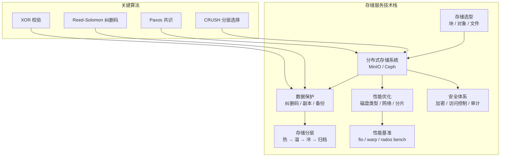

# 本章小结

本章系统性地介绍了现代分布式存储服务的全貌——从三种基本存储类型的本质区别，到 MinIO 和 Ceph 两大主流系统的架构设计与内部机制，再到纠删码、存储分层、数据备份、安全防护和性能调优的工程实践。以下是对全章核心知识的结构化回顾。

---

## 一、核心知识点回顾

### 1.1 三种存储类型：从底层原理到选型决策

存储系统的根本差异在于**数据的组织方式**和**访问接口**，这决定了它们各自适用的场景边界。

| 维度 | 块存储 | 对象存储 | 文件存储 |
|------|--------|----------|----------|
| 数据模型 | 固定大小块（4KB-数MB），线性 LBA 寻址 | 扁平键值对：Key + Data + Metadata | 层次化目录树（inode + dentry） |
| 访问接口 | SCSI/iSCSI/NVMe 块设备接口 | HTTP REST API（S3 兼容） | POSIX 文件系统接口（NFS/SMB） |
| 随机读写 | 原生支持，延迟 <1ms（本地 SSD） | 不支持随机写，仅覆盖/追加 | 支持，延迟 1-10ms |
| 共享访问 | 单客户端独占 | 原生多客户端共享 | NFS/SMB 多客户端共享 |
| 扩展上限 | TB-PB 级 | EB 级，线性扩展 | TB-PB 级，元数据是瓶颈 |
| 典型场景 | 数据库、虚拟机磁盘、K8s PV | 图片/视频分发、日志归档、数据湖 | 代码仓库、共享配置、Home 目录 |
| 代表系统 | EBS、Ceph RBD、iSCSI | MinIO、S3、Ceph RGW | NFS、CephFS、HDFS、JuiceFS |

**选型决策的核心原则**：先分析工作负载特征（随机 vs 顺序、读 vs 写比例、并发模式），再选择存储类型。数据库 OLTP 需要低延迟块存储；海量静态资源需要高扩展对象存储；团队协作需要文件共享存储。三者不是替代关系，而是互补关系——一个完整的系统架构通常同时使用多种存储类型。

### 1.2 MinIO：极简主义的对象存储

MinIO 的设计哲学是**用最少的代码实现最高的性能**，核心仅约 10 万行 Go 代码。理解 MinIO 需要把握三个关键设计决策：

**无共享架构（Shared-Nothing）**：每个节点独立运行 MinIO 进程，不共享内存、CPU 或磁盘。这种设计使得增加节点即可线性提升性能和容量，且一个节点故障不影响其他节点。

**纠删码替代副本**：MinIO 默认使用纠删码（Erasure Coding）保护数据。以 16 块磁盘的 EC 8+4 配置为例，可容忍任意 4 块磁盘故障而不丢数据，存储效率 66.7%——相比三副本的 33.3% 提升一倍。每个对象写入时计算 SHA-256 校验和，读取时验证，自动检测和修复静默数据损坏。

**三阶段部署演进**：

| 部署模式 | 磁盘配置 | 适用场景 | 启动命令 |
|----------|----------|----------|----------|
| 单节点单磁盘 | 1 块磁盘 | 开发测试 | `minio server /data` |
| 单节点多磁盘 | 4-16 块磁盘 | 单机生产 | `minio server /data{1,2,3,4}` |
| 分布式多节点 | 4+ 节点 × 4+ 磁盘 | 生产高可用 | `minio server http://minio{1...4}/data{1...4}` |

**性能调优优先级**：磁盘类型 > 网络带宽 > 纠删码参数 > 客户端分片。HDD→SATA SSD 可带来 10-50 倍 IOPS 提升；1Gbps→10Gbps 网络可提升约 10 倍吞吐；使用 XFS 替代 ext4 可提升约 20% 小文件性能。

### 1.3 Ceph：统一存储的工业标准

Ceph 的独特价值在于**一个集群同时提供块（RBD）、对象（RGW）和文件（CephFS）三种存储接口**，底层统一基于 RADOS 引擎。

**RADOS 核心架构**：

| 组件 | 职责 | 部署规模 | 关键机制 |
|------|------|----------|----------|
| OSD | 管理单块磁盘的数据存取 | 数百到数千个 | 心跳检测、自动恢复、再平衡 |
| MON | 维护集群状态（OSDMap/PGMap/CRUSH Map） | 3 或 5 个（奇数仲裁） | Paxos 协议保证一致性 |
| MGR | 管理功能（监控/Dashboard/告警） | Active-Standby | 主故障自动切换 |
| MDS | CephFS 元数据管理（仅 CephFS 需要） | 可水平扩展 | 分担不同子目录 |

**CRUSH 算法的核心创新**：数据放置决策在客户端本地计算完成，不需要查询任何中心化元数据服务。输入是对象 ID、CRUSH Map（集群拓扑描述）、放置规则和伪随机种子；输出是目标 OSD 列表。CRUSH Map 由四部分组成：设备列表、桶类型定义、桶层次结构（描述设备的 host→rack→datacenter 组织）和放置规则。

CRUSH 使用**分层选择**策略：从顶层桶开始，逐层向下选择，每层使用加权随机算法（权重由磁盘容量决定），最终选定 OSD。这种设计使得增加/移除磁盘时只需局部数据迁移，而非全量重新分配。

### 1.4 纠删码：用数学换存储空间

纠删码通过 Reed-Solomon 编码替代多副本，在相同容错能力下大幅降低存储开销。

**编码参数选择**：

| 配置 | 数据块(k) | 校验块(m) | 容错数 | 存储效率 | 适用场景 |
|------|-----------|-----------|--------|----------|----------|
| EC 4+2 | 4 | 2 | 2 | 66.7% | 小集群，高容错 |
| EC 8+4 | 8 | 4 | 4 | 66.7% | 中型集群（MinIO 默认） |
| EC 10+4 | 10 | 4 | 4 | 71.4% | 大集群，追求效率 |
| EC 8+2 | 8 | 2 | 2 | 80% | 大集群，容错要求低 |

**核心权衡**：校验块越多→容错越强，但存储开销越大、编码/解码 CPU 开销越高。实践中，EC 8+4 或 EC 10+4 是最常用的配置，在容错能力和存储效率之间取得平衡。纠删码的修复开销（需要读取 k 个块进行解码再重新编码）高于副本复制，因此频繁故障的场景下需谨慎使用。

### 1.5 存储一致性模型

一致性模型决定了存储系统在并发读写时的行为保证，是系统设计中最关键的权衡维度：

| 模型 | 保证 | 性能代价 | 代表系统 | 适用场景 |
|------|------|----------|----------|----------|
| 强一致性（Linearizability） | 写完立即全局可见 | 延迟高、吞吐低 | etcd、ZooKeeper、S3（2020年后） | 金融交易、库存管理 |
| 顺序一致性（Sequential） | 所有操作按某全局顺序执行 | 延迟中等 | 多数分布式数据库 | 需要因果无关的顺序保证 |
| 因果一致性（Causal） | 有因果关系的操作有序 | 延迟较低 | MongoDB（默认） | 社交动态、协作编辑 |
| 最终一致性（Eventual） | 最终所有副本收敛 | 延迟最低、吞吐最高 | Cassandra、DynamoDB | 日志、缓存、静态资源 |

**CAP 定理在存储中的应用**：在网络分区发生时，系统必须在一致性（C）和可用性（A）之间选择。完全放弃分区容忍在现代云环境中不现实，因此大多数分布式存储选择 AP 模型，配合应用层补偿（如读修复、反熵修复）实现最终一致性。

### 1.6 数据备份与恢复策略

| 策略 | RPO | RTO | 存储开销 | 实现复杂度 | 适用场景 |
|------|-----|-----|----------|------------|----------|
| 本地快照 | 接近 0 | 秒级 | 低（增量） | 低 | 开发测试、快速回滚 |
| 异地复制 | 秒-分钟级 | 分钟级 | 高（全量副本） | 中 | 跨 AZ 容灾 |
| 3-2-1 备份 | 取决于频率 | 小时级 | 高 | 中 | 数据安全保障 |
| 异步跨地域复制 | 分钟-小时级 | 小时级 | 高 | 高 | 灾备恢复 |
| 混合策略 | 接近 0 | 分钟级 | 中-高 | 高 | 企业级生产环境 |

**3-2-1 原则**是备份的黄金法则：至少保留 **3** 份数据副本，存储在 **2** 种不同介质上，其中 **1** 份放在异地。这是抵御硬件故障、人为误操作、自然灾害和勒索软件的最后防线。

### 1.7 存储安全体系

存储安全是一个多层次的防护体系，需要从物理到应用层层设防：

| 安全层次 | 措施 | 作用 |
|----------|------|------|
| 传输加密 | TLS 1.3、HTTPS | 防止网络嗅探和中间人攻击 |
| 静态加密 | AES-256-GCM、SSE-S3/SSE-KMS | 数据在磁盘上加密存储 |
| 访问控制 | IAM 策略、Bucket Policy、预签名 URL | 细粒度权限管理 |
| 数据完整性 | SHA-256 校验和、Bitrot Protection | 检测静默数据损坏 |
| 审计日志 | MinIO 审计日志、Ceph 审计 | 操作追溯和合规 |
| 网络隔离 | VPC、私有子网、安全组 | 限制存储服务的网络可达性 |

### 1.8 性能评估与基准测试

**关键性能指标**：

| 指标 | 含义 | 测量方法 | 参考值 |
|------|------|----------|--------|
| IOPS | 每秒 I/O 操作数 | fio --rw=randread --bs=4K | NVMe SSD: 100K-1M |
| 吞吐量 | 单位时间数据传输量 | fio --rw=read --bs=1M | NVMe SSD: 3-7 GB/s |
| 延迟(P50/P99/P999) | 请求到响应的时间分布 | fio --lat_percentiles=1 | NVMe SSD: P99 < 0.1ms |
| 纠删码重建时间 | 故障后数据恢复所需时间 | 实际故障注入测试 | 取决于磁盘速度和数据量 |

**fio 测试的三种典型负载模式**：

```bash
# OLTP 数据库负载：小随机读写，混合读写比 70:30
fio --name=oltp --rw=randrw --rwmixread=70 \
    --bs=8K --size=100G --numjobs=8 \
    --iodepth=32 --runtime=120 --time_based

# 大数据顺序读：大块顺序读取
fio --name=seqread --rw=read --bs=1M \
    --size=50G --numjobs=1 --iodepth=1 \
    --runtime=60

# 日志追加写：顺序写入模拟日志场景
fio --name=append --rw=append --bs=4K \
    --size=10G --numjobs=1 --iodepth=4
```

---

## 二、关键公式与模型

| 概念 | 公式/模型 | 实际含义 |
|------|-----------|----------|
| Little 定律 | QPS = 并发数 / 平均延迟 | 已知并发和延迟可推算吞吐量 |
| 可用性等级 | SLA = 正常时间 / 总时间 | 99.9%=8.76h/年停机；99.99%=52.6min/年 |
| 尾延迟 | P99 = 排序后第 99 百分位值 | 1% 请求超过此延迟 |
| 容量规划 | 总资源需求 = QPS × 单次请求资源 | 预估 CPU/内存/带宽/存储 |
| 纠删码存储效率 | 效率 = k / (k + m) | EC 8+4 效率 = 8/12 = 66.7% |
| 纠删码容错 | 最大容错 = m 块磁盘 | EC 8+4 可容忍任意 4 块故障 |
| RAID 5 写放大 | 写惩罚 = 4x（小随机写） | 每次小写需要 2 次读 + 2 次写 |
| 磁盘重建时间 | 重建时间 ≈ 磁盘容量 / 重建带宽 | 4TB HDD ≈ 6-8 小时（100MB/s 重建速度） |

---

## 三、最佳实践清单

### 设计阶段

- [ ] **明确工作负载特征**：分析读写比例、随机/顺序比例、数据大小分布、并发量级，据此选择存储类型和配置
- [ ] **选择合适的存储类型**：数据库→块存储；静态资源→对象存储；共享文件→文件存储；不盲目追求"万能方案"
- [ ] **设计容错和降级方案**：根据 RPO/RTO 要求选择复制策略和纠删码参数，确保单节点/AZ/地域故障不影响服务
- [ ] **制定一致性策略**：明确哪些操作需要强一致、哪些可以最终一致，在一致性和性能之间找到平衡点
- [ ] **规划容量增长**：预留 30-50% 的容量缓冲，避免频繁扩容；考虑数据生命周期管理（热→温→冷→归档）
- [ ] **设计安全基线**：传输加密（TLS）、静态加密（AES-256）、最小权限访问控制（IAM 策略）

### 实现阶段

- [ ] **配置纠删码参数**：生产环境推荐 EC 8+4 或 EC 10+4；避免使用 EC 4+2（容错不足）或过度冗余（浪费空间）
- [ ] **启用数据完整性保护**：开启 Bitrot Protection（SHA-256 校验和），防止静默数据损坏
- [ ] **配置合适的网络**：MinIO 分布式部署至少 10Gbps 网络；Ceph 集群网络和公共网络分离
- [ ] **编写性能基准测试脚本**：使用 fio 建立性能基线，便于后续优化对比
- [ ] **实施访问控制策略**：遵循最小权限原则，使用 IAM + Bucket Policy 细粒度控制，避免使用 `AllowPrincipal: *`

### 部署阶段

- [ ] **配置监控和告警**：关注磁盘使用率、IOPS、延迟 P99、纠删码重建状态、OSD 健康度
- [ ] **设置健康检查**：MinIO 使用 `/minio/health/live`；Ceph 使用 `ceph health detail`
- [ ] **制定回滚方案**：备份当前配置，确保可以快速回退到上一个稳定版本
- [ ] **进行压力测试**：使用 warp（MinIO）或 rados bench（Ceph）验证集群在峰值负载下的表现
- [ ] **验证故障恢复**：模拟磁盘故障，验证纠删码自动恢复是否正常工作

### 运维阶段

- [ ] **定期检查监控仪表盘**：每日查看容量使用趋势、性能指标变化、告警记录
- [ ] **执行定期备份验证**：每月至少一次恢复演练，确保备份数据确实可用
- [ ] **分析性能趋势**：对比月度性能数据，提前发现容量不足或性能退化趋势
- [ ] **更新纠删码映射**：磁盘更换后及时更新 CRUSH Map 或 MinIO 磁盘配置
- [ ] **审查安全策略**：每季度审查 IAM 策略和 Bucket Policy，清理过期的访问凭证
- [ ] **保持文档同步**：架构变更、配置调整后及时更新运维文档和故障手册

---

## 四、常见误区与纠正

| 误区 | 事实 | 纠正方法 |
|------|------|----------|
| "副本越多越安全" | 3 副本不防 AZ 级故障，纠删码在同等容错下更高效 | 使用跨 AZ 放置 + 纠删码替代副本 |
| "对象存储可以当文件系统用" | 对象存储不支持原子读写、文件锁、目录遍历 | 文件共享场景使用 NFS/CephFS |
| "纠删码性能一定比副本差" | 读操作性能相同（只读数据块），写操作有编码开销 | 读密集场景纠删码性能不受影响 |
| "RAID 可以替代分布式冗余" | RAID 不防机架级故障、重建时间长、大容量磁盘 URE 风险高 | 使用分布式存储自身的冗余机制 |
| "设置高可用就不用备份了" | 高可用防硬件故障，备份防数据损坏和人为误操作 | HA + 备份缺一不可 |
| "默认配置就是最优配置" | 默认配置针对通用场景，特定工作负载需要针对性调优 | 根据实际负载特征调整块大小、并发数、EC 参数 |

---

## 五、技术全景图



---

## 六、下一步学习建议

### 深入方向

1. **源码阅读**：阅读 MinIO 源码中的 `erasure-coding.go` 和 `bitrot.go`，理解纠删码和 Bitrot Protection 的工程实现；阅读 Ceph 源码中的 `crush mapper.c`，理解 CRUSH 算法的 straw2 选择逻辑
2. **论文研究**：精读 RUSH-A/RUSH-D 论文（CRUSH 算法原始论文）、Reed-Solomon 编码原始论文、Ceph 论文（SOSP 2006），理解设计决策背后的理论依据
3. **动手实验**：在虚拟机中搭建 4 节点 MinIO 集群和 5 节点 Ceph 集群，模拟磁盘故障，观察自动恢复过程
4. **性能调优实战**：使用 fio 对比不同磁盘类型、不同块大小、不同队列深度下的 IOPS 和延迟表现，建立性能直觉

### 推荐资源

**书籍**：
- 《Designing Data-Intensive Applications》（DDIA）by Martin Kleppmann — 存储引擎和分布式系统设计的必读经典
- 《Ceph分布式存储实战》— 从部署到调优的完整指南
- 《MinIO官方文档》（https://min.io/docs/）— MinIO 的权威参考

**论文**：
- Weil et al., "CRUSH: Controlled, Scalable, Decentralized Placement of Replicated Data" (FAST 2006)
- Weil et al., "Ceph: A Scalable, High-Performance Distributed File System" (OSDI 2006)
- Reed & Solomon, "Polynomial Codes Over Certain Finite Fields" (1960) — 纠删码的数学基础

**开源项目**：
- MinIO（https://github.com/minio/minio）— 生产级 S3 兼容对象存储
- Ceph（https://github.com/ceph/ceph）— 统一分布式存储平台
- JuiceFS（https://github.com/juicedata/juicefs）— 云原生分布式文件系统

**工具**：
- fio（https://github.com/axboe/fio）— 专业磁盘 I/O 基准测试工具
- warp（https://github.com/minio/warp）— MinIO 专用基准测试工具
- rados bench — Ceph RADOS 层性能测试工具

---

## 七、思考题

### 基础题

1. 对象存储的"扁平命名空间"意味着什么？它为什么能使对象存储扩展到 EB 级？
2. MinIO 的纠删码 EC 8+4 配置中，"8"和"4"分别代表什么？这种配置能容忍多少块磁盘同时故障？
3. Ceph 中 CRUSH 算法的核心输入和输出分别是什么？为什么说它"不需要中心化元数据服务"？

### 进阶题

4. 比较副本复制和纠删码在**写入性能**和**故障恢复速度**上的差异。在什么场景下纠删码不如副本？
5. 设计一个图片存储服务，需要支持每天 1000 万次读取和 100 万次写入，图片平均大小 500KB。你会选择哪种存储方案？给出具体的技术选型和配置参数。
6. Ceph 集群中，Monitor 使用 Paxos 协议保证一致性，但 OSD 之间的心跳检测使用的是最终一致性。为什么这两层需要不同的一致性模型？

### 思考题

7. 存储服务的未来发展趋势包括哪些方向？AI 和大模型对存储系统提出了哪些新需求？（提示：考虑大文件顺序写、高带宽、数据局部性等维度）
8. 如果你需要在公有云和私有云之间实现存储数据同步，需要考虑哪些技术挑战和架构决策？（提示：考虑一致性、带宽、成本、延迟等因素）
