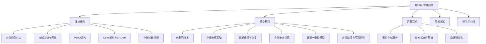
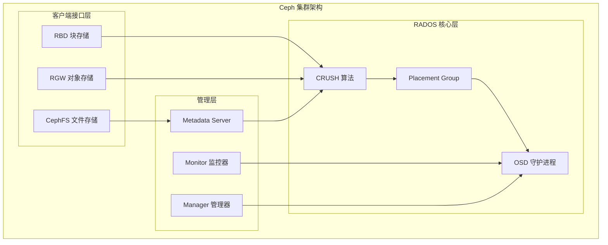
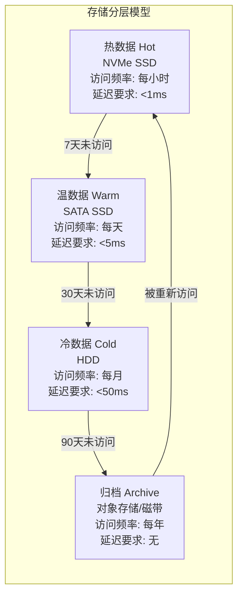
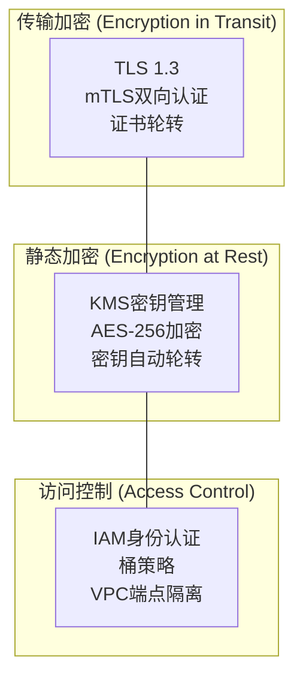
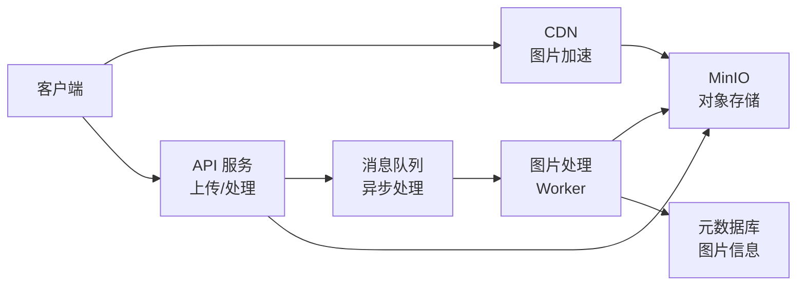
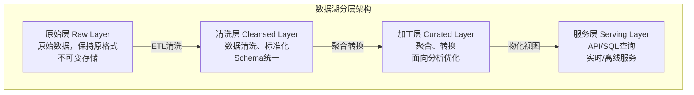

# 第38章 存储服务

存储服务是云计算和分布式系统架构的核心基础设施。从企业级数据库到海量图片分发，从机器学习训练到数据湖分析，几乎所有应用都依赖可靠的存储服务。随着数据量从GB级向PB级、EB级演进，传统的单机本地存储已经无法满足大规模分布式系统对容量、性能和可靠性的要求。

本章将系统地介绍现代存储服务的架构设计和实现原理。从三种基本存储类型的对比出发，深入分析MinIO和Ceph两大主流分布式存储系统的内部机制，剖析纠删码和CRUSH算法等核心技术，并结合实际案例讲解存储分层、备份恢复和安全防护的工程实践。

## 本章结构



## 学习目标

完成本章学习后，读者应当能够：

- **理解**对象存储、块存储和文件存储的核心区别，能根据业务需求做出正确的存储选型
- **掌握**MinIO的分布式部署、性能调优和生产环境最佳实践
- **深入理解**Ceph的RADOS架构、CRUSH算法的数学原理和工程实现
- **运用**纠删码技术优化存储效率，合理配置编码参数
- **设计**存储分层方案，在性能和成本之间取得最优平衡
- **评估**存储系统的性能指标，使用fio等工具进行基准测试
- **建立**存储监控与告警体系，及时发现和预防存储故障
- **设计**灾难恢复方案，根据RTO/RPO需求选择合适的DR等级

## 前置知识

学习本章需要具备以下基础知识：

- **文件系统基础**：理解inode、目录结构、文件读写的基本流程
- **网络基础**：了解TCP/IP、HTTP协议和REST API的概念
- **分布式系统基础**：理解CAP定理、一致性模型和故障容错的基本概念
- **Linux运维基础**：熟悉磁盘管理、文件系统挂载和基础的Shell操作

---

# 理论基础

## 存储类型全面对比

现代存储系统根据数据的访问方式和组织形式，分为三种基本类型：**对象存储**（Object Storage）、**块存储**（Block Storage）和**文件存储**（File Storage）。理解它们的本质区别是进行存储选型的前提。

### 三种存储类型的本质区别

**对象存储**将数据封装为独立的对象，每个对象包含三部分：原始数据（Payload）、自定义元数据（Metadata）和全局唯一标识符（Object Key）。对象存储采用**扁平化命名空间**——没有真正的目录层次结构，"目录"只是通过Key前缀模拟出来的。这种设计带来了极强的水平扩展能力：因为不需要维护复杂的目录树元数据，存储集群可以线性扩展到数千节点。

对象存储的优势在于：高可扩展性（可达EB级容量）、低成本（单位存储成本最低）、丰富的元数据支持（可存储自定义标签用于检索和管理）、原生支持REST API（便于与Web应用集成）。Amazon S3是对象存储的事实标准，几乎所有云存储服务都兼容S3 API。

**块存储**将数据划分为固定大小的块（通常4KB到数MB），每个块有唯一的逻辑地址（LBA, Logical Block Address）。块存储提供原始的块设备接口——操作系统将其视为一块裸磁盘，可以进行格式化、分区、创建文件系统等操作。块存储的优势在于**低延迟和高性能**，因为不涉及文件系统的元数据查找开销，特别适合需要频繁随机读写的场景。

块存储通常通过以下方式提供：SAN（Storage Area Network）网络直连、云平台的EBS（Elastic Block Store）、本地磁盘直接映射。块存储的限制在于：一次只能被一个客户端挂载（除非使用集群文件系统如GFS2/OCFS2），不支持跨节点共享访问。

**文件存储**将数据组织为文件和目录的层次结构，通过标准的POSIX文件系统接口（如`open`、`read`、`write`）访问。文件存储最大的优势在于**易用性和兼容性**——任何应用程序无需修改即可使用。同时，文件存储天然支持多个客户端通过网络协议共享访问同一个文件系统。

文件存储的典型实现包括：NFS（Network File System，Linux/Unix环境主流）、CIFS/SMB（Windows环境主流）、分布式文件系统（如CephFS、HDFS、GlusterFS）。文件存储的局限在于：在海量小文件场景下元数据管理成为瓶颈，水平扩展能力有限。

### 存储类型对比总结

| 特性 | 对象存储 | 块存储 | 文件存储 |
|------|---------|--------|---------|
| 数据模型 | 扁平键值对 | 固定大小块 | 文件/目录层次 |
| 访问接口 | REST API (S3) | 块设备接口 (SCSI/iSCSI) | POSIX文件系统 (NFS/SMB) |
| 容量扩展 | EB级，线性扩展 | TB到PB级 | TB到PB级 |
| 随机写 | 不支持（仅追加/覆盖） | 原生支持 | 支持 |
| 共享访问 | 原生支持 | 单客户端 | 多客户端（NFS/SMB） |
| 元数据 | 自定义KV，嵌入对象 | 简单（LBA映射） | 完整POSIX元数据 |
| 典型延迟 | 10-100ms | <1ms (本地SSD) | 1-10ms |
| 单位成本 | 最低 | 中等 | 中等 |
| 典型应用 | 图片/视频/备份/日志 | 数据库/虚拟机/容器 | 代码仓库/共享文档/配置文件 |
| 代表系统 | MinIO/S3/Ceph RGW | EBS/Ceph RBD/iSCSI | NFS/CephFS/HDFS |

### S3 API编程示例

以下示例展示了使用Python boto3库操作S3兼容存储（MinIO）的完整流程：

```python
import boto3
from boto3.s3.transfer import TransferConfig
import os

# 创建S3客户端
s3 = boto3.client('s3',
    endpoint_url='http://minio:9000',
    aws_access_key_id='minioadmin',
    aws_secret_access_key='minioadmin'
)

# ===== 创建存储桶 =====
s3.create_bucket(Bucket='my-bucket')

# 设置桶策略：允许公开读取
bucket_policy = {
    "Version": "2012-10-17",
    "Statement": [{
        "Effect": "Allow",
        "Principal": {"AWS": ["*"]},
        "Action": ["s3:GetObject"],
        "Resource": ["arn:aws:s3:::my-bucket/public/*"]
    }]
}
s3.put_bucket_policy(Bucket='my-bucket', Policy=json.dumps(bucket_policy))

# ===== 上传对象（含元数据） =====
s3.put_object(
    Bucket='my-bucket',
    Key='photos/image1.jpg',
    Body=open('image1.jpg', 'rb'),
    ContentType='image/jpeg',
    Metadata={'author': 'zhangsan', 'location': 'beijing'}
)

# ===== 大文件分片上传 =====
config = TransferConfig(
    multipart_threshold=1024 * 1024 * 50,   # 50MB以上自动分片
    multipart_chunksize=1024 * 1024 * 10,    # 每片10MB
    max_concurrency=10                        # 并发上传线程数
)
s3.upload_file('large_video.mp4', 'my-bucket', 'videos/large_video.mp4', Config=config)

# ===== 下载对象 =====
response = s3.get_object(Bucket='my-bucket', Key='photos/image1.jpg')
data = response['Body'].read()

# ===== 带条件的读取（Range请求） =====
response = s3.get_object(
    Bucket='my-bucket', Key='videos/large_video.mp4',
    Range='bytes=0-1048575'  # 读取前1MB
)

# ===== 列出对象（分页） =====
paginator = s3.get_paginator('list_objects_v2')
for page in paginator.paginate(Bucket='my-bucket', Prefix='photos/', PageSize=100):
    for obj in page.get('Contents', []):
        print(f"Key: {obj['Key']}, Size: {obj['Size']}, LastModified: {obj['LastModified']}")
```

## 存储协议与网络架构

存储协议定义了主机与存储设备之间的通信方式。理解存储协议是设计高效存储架构的基础。

### SAN存储协议

SAN（Storage Area Network）提供块级别的存储访问，主要包括以下协议：

**光纤通道（FC, Fibre Channel）**是企业级SAN的主流协议，运行在专用的FC交换机网络上。FC协议栈简化了TCP/IP的复杂性，提供无损、低延迟的传输。典型速率包括16Gbps、32Gbps和64Gbps。FC的优势在于确定性延迟和高可靠性，但部署成本高，需要专用的HBA卡和交换机。

**iSCSI（Internet Small Computer System Interface）**将SCSI命令封装在TCP/IP协议中传输，可以运行在标准的以太网络上。iSCSI的优势在于成本低（复用现有以太网基础设施），但延迟通常高于FC。对于延迟敏感度不高的场景（如文件服务器、Web应用后端），iSCSI是性价比很高的选择。

**NVMe over Fabrics（NVMe-oF）**是新一代高性能存储协议，将NVMe（Non-Volatile Memory Express）的低延迟特性扩展到网络环境。NVMe-oF支持RDMA（通过RoCE或InfiniBand）和TCP两种传输方式，可以实现微秒级的远程存储延迟，适合对延迟极端敏感的应用。

### NAS存储协议

**NFS（Network File System）**是Linux/Unix环境的事实标准文件共享协议。NFS v4引入了状态管理、租约机制和复合操作，显著提升了性能和安全性。NFS v4.2支持服务器端复制（Server-Side Copy）和稀疏文件空间预留。

**CIFS/SMB（Common Internet File System / Server Message Block）**是Windows环境的文件共享协议。SMB 3.0之后引入了多通道（Multi-Channel）传输、加密传输和持续句柄（Persistent Handles）等高级特性，可靠性大幅提升。

### 存储协议选型决策

| 场景 | 推荐协议 | 理由 |
|------|---------|------|
| 数据库存储 | FC/iSCSI/NVMe-oF | 需要低延迟块级别访问 |
| 虚拟机磁盘 | iSCSI/FC | 块级别访问，支持在线迁移 |
| 文件共享 | NFS v4.1+/SMB 3.0 | 多客户端共享，POSIX兼容 |
| 大数据分析 | NFS/S3 | 高吞吐量顺序读取 |
| 容器持久化存储 | iSCSI/RBD/NFS | K8s CSI原生支持 |
| 备份归档 | S3（对象存储） | 低成本、高扩展 |

## MinIO架构与实现

### 云原生存储服务对比

对于不打算自建存储集群的团队，云厂商提供了托管存储服务。理解其特性有助于做出选型决策：

| 特性 | AWS S3 | AWS EBS | AWS EFS | 阿里云 OSS | 阿里云 ESSD |
|------|--------|---------|---------|-----------|------------|
| 类型 | 对象存储 | 块存储 | 文件存储 | 对象存储 | 块存储 |
| 容量范围 | 无限 | 1GB-64TB | 无限 | 无限 | 1GB-64TB |
| 最大吞吐量 | 5Gbps/对象 | 4Gbps (io2) | 3Gbps | 100Gbps/桶 | 4Gbps |
| 最大IOPS | N/A | 256K (io2) | 7K+ (burst) | N/A | 1M (ESSD PLX) |
| 延迟 | 10-100ms | <1ms (SSD) | 1-10ms | 10-100ms | <0.5ms |
| 多挂载 | 原生 | 单AZ (io2) | 多AZ | 原生 | 单AZ |
| 每GB月费 | $0.023 | $0.08-$0.125 | $0.30 | ¥0.12 | ¥0.35-1.00 |
| 典型用途 | 静态资源/备份 | 数据库/VM | 共享文件/容器 | 静态资源/备份 | 数据库/VM |

> **选型建议**：高频随机读写（数据库）→ 块存储；静态资源/日志归档→ 对象存储；多节点共享访问→ 文件存储。混合场景可组合使用——例如数据库用EBS，静态资源用S3，通过CDN加速分发。

MinIO是一个高性能的分布式对象存储系统，完全兼容Amazon S3 API。它的设计哲学是**极简主义**——用最少的代码实现最高的性能，核心服务仅约10万行Go代码。

### 架构设计

MinIO采用**无共享（Shared-Nothing）**架构，每个节点独立运行MinIO进程，节点之间不共享内存、CPU或磁盘，仅通过网络通信协调。这种设计带来了两个关键优势：

1. **水平扩展**：增加节点即可线性提升性能和容量，不存在协调开销
2. **故障隔离**：一个节点的故障不影响其他节点，没有单点故障

MinIO的数据保护采用**纠删码（Erasure Coding）**而非传统的副本复制。纠删码将对象分割为数据块和校验块，分布在不同的磁盘上。例如，在16块磁盘的集群中，使用EC 8+4配置（8个数据块+4个校验块），可以容忍任意4块磁盘故障而不丢失数据，同时存储效率为66.7%——相比三副本的33.3%效率提升一倍。

MinIO还实现了**Bitrot Protection**（数据完整性保护）：每个对象写入时计算SHA-256校验和，读取时验证，自动检测和修复静默数据损坏（silent data corruption）。

### 部署模式

MinIO支持三种部署模式，适用于不同规模的场景：

**单节点单磁盘**：适合开发测试，一条命令即可启动：

```bash
# 单节点启动
minio server /data --console-address ":9001"
```

**单节点多磁盘**：适合单机生产环境，利用多块磁盘提供纠删码保护：

```bash
# 单节点4块磁盘
minio server /data{1,2,3,4} --console-address ":9001"
```

**分布式多节点多磁盘**：适合生产环境的高可用部署。MinIO推荐使用`Erasure Set`（纠删码集）来组织磁盘，一个纠删码集最多16块磁盘。

```yaml
# docker-compose.yml - 4节点分布式MinIO部署
# 每个节点贡献4块磁盘，形成16磁盘的纠删码集
# 使用YAML锚点避免重复配置
version: '3.8'

x-minio-common: &amp;minio-common
  image: minio/minio:latest
  environment:
    MINIO_ROOT_USER: minioadmin
    MINIO_ROOT_PASSWORD: StrongPassword2024!
  command: server http://minio{1...4}/data{1...4} --console-address ":9001"
  healthcheck:
    test: ["CMD", "curl", "-f", "http://localhost:9000/minio/health/live"]
    interval: 30s
    timeout: 10s
    retries: 3

services:
  minio1:
    <<: *minio-common
    hostname: minio1
    volumes: [/data1:/data1, /data2:/data2, /data3:/data3, /data4:/data4]
    ports: ["9000:9000", "9001:9001"]

  minio2:
    <<: *minio-common
    hostname: minio2
    volumes: [/data1:/data1, /data2:/data2, /data3:/data3, /data4:/data4]

  minio3:
    <<: *minio-common
    hostname: minio3
    volumes: [/data1:/data1, /data2:/data2, /data3:/data3, /data4:/data4]

  minio4:
    <<: *minio-common
    hostname: minio4
    volumes: [/data1:/data1, /data2:/data2, /data3:/data3, /data4:/data4]
```

> **注意**：MinIO的分布式部署要求所有节点的磁盘路径命名规则一致，且每个节点的磁盘数量必须相同。生产环境应为每个节点使用独立的物理磁盘而非共享存储。

### MinIO性能调优

MinIO的性能受磁盘类型、网络带宽和客户端配置三个因素影响：

| 优化维度 | 具体措施 | 性能提升 |
|---------|---------|---------|
| 磁盘 | HDD→SATA SSD | 随机IOPS提升10-50倍 |
| 磁盘 | SATA SSD→NVMe SSD | IOPS再提升3-5倍 |
| 网络 | 1Gbps→10Gbps | 吞吐量提升约10倍 |
| 纠删码 | 增加数据块比例 | 存储效率提升，但可靠性降低 |
| 客户端 | 启用分片并发上传 | 大文件上传速度提升5-10倍 |
| 元数据 | SSD存储MinIO元数据目录 | 延迟降低30-50% |
| 文件系统 | 使用XFS替代ext4 | 小文件性能提升约20% |

```bash
# 使用mc工具进行MinIO性能测试
# 安装mc客户端
wget https://dl.min.io/client/mc/release/linux-amd64/mc
chmod +x mc &amp;&amp; mv mc /usr/local/bin/

# 配置MinIO别名
mc alias set local http://minio:9000 minioadmin minioadmin

# 上传性能测试
mc cp --recursive /test-data/ local/test-bucket/

# 下载性能测试
mc cp --recursive local/test-bucket/ /tmp/download/

# 使用 warp 进行专业基准测试
# 安装 warp 测试工具
go install github.com/minio/warp@latest

# 运行混合读写基准测试
warp mixed --duration=5m --obj.size=1MB --concurrent=32 --host=minio:9000
```

## Ceph架构深入分析

Ceph是一个**统一的分布式存储系统**，独特之处在于一个存储集群同时提供对象存储、块存储和文件存储三种接口。这种统一架构避免了维护多个独立存储系统的复杂性。

### 整体架构



### RADOS：可靠自治分布式对象存储

RADOS（Reliable Autonomic Distributed Object Store）是Ceph的底层存储引擎，所有上层接口（RBD、RGW、CephFS）都构建在RADOS之上。

RADOS集群由两种核心守护进程组成：

**OSD（Object Storage Daemon）**：每个OSD守护进程管理一块物理磁盘，负责该磁盘上所有对象的存储和检索。OSD之间通过OSD间心跳检测故障，并自动进行数据恢复和再平衡。一个典型的Ceph集群可能包含数百甚至数千个OSD。

**Monitor（MON）**：Monitor维护整个集群的状态信息，包括OSD映射（OSDMap）、Monitor映射、PG映射和CRUSH Map。Monitor使用Paxos协议保证自身集群的一致性。生产环境通常部署3个或5个Monitor，以奇数保证仲裁。

**Manager（MGR）**：Manager提供集群管理功能，包括性能监控、Dashboard界面、容量统计和告警。Manager使用Active-Standby模式，主Manager故障时自动切换。

**MDS（Metadata Server）**：MDS仅用于CephFS，负责管理文件系统的元数据（目录树、文件属性、权限等）。MDS可以水平扩展，多个MDS分担不同子目录的元数据管理。

### CRUSH算法详解

CRUSH（Controlled Replication Under Scalable Hashing）是Ceph最核心的创新——它使得数据放置决策可以在客户端本地计算完成，完全不需要查询任何中心化的元数据服务。

CRUSH算法的输入：

- **对象ID**（RGW bucket + object name 或 RBD image name + offset）
- **CRUSH Map**（描述集群拓扑结构和设备权重的配置）
- **放置规则**（Placement Rule，定义数据放置策略）
- **伪随机种子**（由对象ID和PG ID计算得出）

CRUSH算法的输出：一个OSD列表，表示对象的主OSD和副本OSD的位置。

### CRUSH Map结构

CRUSH Map是Ceph集群拓扑的描述，由四个部分组成：

# 查看当前CRUSH Map
ceph osd getcrushmap -o /tmp/crushmap
crushtool -d /tmp/crushmap -o /tmp/crushmap.txt

# CRUSH Map 示例结构
# 1. 设备列表 - 列出所有OSD
device 0 osd.0
device 1 osd.1
device 2 osd.2
device 3 osd.3
device 4 osd.4
device 5 osd.5

# 2. 桶类型 - 定义层次结构的层级名称
type 0 osd
type 1 host
type 2 rack
type 3 datacenter

# 3. 桶层次 - 描述设备的组织结构
host node1 {
    id -2
    alg straw2
    item osd.0 weight 1.00
    item osd.1 weight 1.00
}

host node2 {
    id -3
    alg straw2
    item osd.2 weight 1.00
    item osd.3 weight 1.00
}

host node3 {
    id -4
    alg straw2
    item osd.4 weight 1.00
    item osd.5 weight 1.00
}

rack rack1 {
    id -5
    alg straw2
    item node1 weight 2.00
    item node2 weight 2.00
}

# 4. 放置规则 - 定义数据放置策略
rule replicated_rule {
    id 0
    type replicated
    min_size 1
    max_size 10
    step take default class ssd   # 从根节点开始
    step chooseleaf firstn 0 type host  # 选择不同主机
    step emit
}

### CRUSH算法的核心流程

CRUSH使用**分层选择**策略：从顶层桶（如datacenter）开始，逐层向下选择，直到找到最终的OSD。每一层的选择都使用**加权随机**算法，权重由磁盘容量决定。

```python
# CRUSH算法的核心概念实现
def crush_select(crush_map, object_id, rule, num_replicas):
    """CRUSH数据放置的核心逻辑"""
    selected_osds = []

    for i in range(num_replicas):
        # 第一步：从规则的根节点开始
        current_bucket = rule.root

        # 第二步：逐层向下选择
        while current_bucket.type != 'osd':
            children = crush_map.get_children(current_bucket)
            # 加权随机选择
            chosen = weighted_random_select(
                children,
                seed=crush_hash(object_id, i)  # 确定性伪随机
            )
            current_bucket = chosen

        # 第三步：确保不选择已选过的OSD（故障域独立）
        if current_bucket.id not in [o.id for o in selected_osds]:
            selected_osds.append(current_bucket)

    return selected_osds

def weighted_random_select(items, seed):
    """加权随机选择（straw2算法）"""
    # straw2是Ceph默认的选择算法
    # 它为每个item计算一个"吸管长度"（straw），
    # 长度最长的item被选中
    import random
    rng = random.Random(seed)

    max_straw = -1
    selected = None
    for item in items:
        # straw2的计算考虑了权重和随机性
        straw = rng.random() ** (1.0 / item.weight)
        if straw > max_straw:
            max_straw = straw
            selected = item
    return selected
```

### Ceph的三种存储接口

```bash
# ===== RBD块存储操作 =====
# 创建存储池（128个Placement Group）
ceph osd pool create rbd-pool 128
ceph osd pool set rbd-pool size 3  # 3副本

# 创建块设备
rbd create rbd-pool/myimage --size 10G --image-feature layering

# 查看块设备
rbd info rbd-pool/myimage

# 创建快照
rbd snap create rbd-pool/myimage@snap1

# 从快照克隆（薄克隆，不占用额外空间）
rbd clone rbd-pool/myimage@snap1 rbd-pool/myclone

# 映射到本地
rbd map rbd-pool/myimage
# 输出: /dev/rbd0
mkfs.ext4 /dev/rbd0
mount /dev/rbd0 /mnt/myimage

# ===== RGW对象存储操作 =====
# 启动RGW服务
radosgw-admin user create --uid=admin --display-name="Admin User" \
    --access-key=ADMINKEY --secret=ADMINSECRET

# 使用s3cmd操作
s3cmd --access_key=ADMINKEY --secret-key=ADMINSECRET \
    --host=minio:9000 --host-bucket=minio:9000 \
    put myfile.txt s3://mybucket/

# ===== CephFS文件存储操作 =====
# 创建CephFS
ceph fs volume create myfs /data/mds0

# 挂载CephFS
mount -t ceph minio1:6789:/ /mnt/cephfs \
    -o name=admin,secret=<keyring>
```

## 存储性能指标与基准测试

### 核心性能指标

存储系统的性能评估需要关注三个核心指标：

**IOPS（Input/Output Operations Per Second）**：每秒完成的IO操作数，反映存储系统的**随机IO性能**。IOPS是数据库、OLTP等随机读写密集型应用最关键的设计指标。

**吞吐量（Throughput）**：每秒的数据传输量，通常以MB/s或GB/s为单位，反映存储系统的**顺序IO性能**。吞吐量是大数据分析、视频处理等大文件顺序读写场景的核心指标。

**延迟（Latency）**：一次IO操作从发起到完成的端到端时间。延迟分为平均延迟和尾延迟（P99/P999），尾延迟对用户体验影响更大。在分布式系统中，一次操作可能涉及多次IO，延迟会叠加。

### 不同存储介质的性能特征

| 存储介质 | 随机读IOPS | 随机写IOPS | 顺序读带宽 | 顺序写带宽 | 典型延迟 | 每GB成本 |
|---------|-----------|-----------|-----------|-----------|---------|---------|
| HDD (7200rpm) | 100-200 | 100-150 | 150-200 MB/s | 150-200 MB/s | 5-10ms | $0.02 |
| SATA SSD | 50K-100K | 30K-60K | 500-550 MB/s | 400-500 MB/s | 0.1-0.5ms | $0.08 |
| NVMe SSD | 500K-1M | 200K-500K | 3-7 GB/s | 2-5 GB/s | 0.02-0.1ms | $0.15 |
| Intel Optane | 500K-1.5M | 200K-500K | 2-3 GB/s | 1.5-2 GB/s | 0.01-0.03ms | $0.50+ |

### 使用fio进行基准测试

fio（Flexible I/O tester）是Linux上最专业的存储基准测试工具：

```bash
# 安装fio
apt install fio  # Debian/Ubuntu
yum install fio  # CentOS/RHEL

# ===== 顺序读测试（测量吞吐量） =====
fio --name=seqread \
    --rw=read --bs=1M --size=10G \
    --numjobs=1 --runtime=60 --time_based \
    --filename=/mnt/testfile

# ===== 顺序写测试 =====
fio --name=seqwrite \
    --rw=write --bs=1M --size=10G \
    --numjobs=1 --runtime=60 --time_based \
    --filename=/mnt/testfile

# ===== 4K随机读测试（测量IOPS） =====
fio --name=randread_4k \
    --rw=randread --bs=4K --size=10G \
    --numjobs=4 --iodepth=32 --runtime=60 --time_based \
    --filename=/mnt/testfile

# ===== 4K随机读写混合测试（模拟数据库负载） =====
# 70%读30%写，这是典型的OLTP场景
fio --name=oltp_mix \
    --rw=randrw --rwmixread=70 --bs=4K --size=10G \
    --numjobs=8 --iodepth=64 --runtime=300 --time_based \
    --filename=/mnt/testfile

# ===== 输出结果解读 =====
# read: IOPS=50.0k, BW=195MiB/s (205MB/s)
#   slat (usec): min=1, max=2000, avg=5.2, stdev=8.1   # 提交延迟
#   clat (usec): min=2, max=5000, avg=25.5, stdev=12.3  # 完成延迟
#    lat (usec): min=3, max=5000, avg=30.7, stdev=14.5   # 总延迟
#   clat percentiles (usec):
#     | 1.00th=[5], 5.00th=[8], 50.00th=[22], 95.00th=[48], 99.00th=[85], 99.99th=[280]
```

---

# 核心技巧

## 纠删码技术深度解析

### 纠删码 vs 副本复制

纠删码（Erasure Coding，EC）是一种前向纠错编码技术，将原始数据编码为更多的数据块，使得部分块丢失后仍可恢复原始数据。与传统的副本复制相比，纠删码用更少的存储开销提供了同等甚至更高的数据保护级别。

| 对比维度 | 3副本复制 | 纠删码 (8+4) | 纠删码 (10+4) |
|---------|----------|-------------|-------------|
| 存储开销 | 300% | 150% | 140% |
| 存储效率 | 33.3% | 66.7% | 71.4% |
| 容错能力 | 丢失任意2块 | 丢失任意4块 | 丢失任意4块 |
| 写放大 | 3x（写3份） | 1.5x | 1.4x |
| 读性能 | 最高（只需读1份） | 较低（需读k块） | 较低 |
| 恢复速度 | 快（直接复制） | 慢（需解码计算） | 慢 |
| 适用场景 | 高性能、频繁修改 | 大规模冷数据存储 | 冷数据归档 |

### Reed-Solomon编码原理

Reed-Solomon是最广泛使用的纠删码算法，其核心思想基于**有限域（Galois Field）**上的矩阵运算。

编码过程：

1. 将原始数据划分为k个等大小的数据块 D₁, D₂, ..., Dₖ
2. 构造一个(k+m)×k的**生成矩阵** G（基于范德蒙德矩阵或柯西矩阵）
3. 将数据块视为有限域GF(2^8)上的向量，计算编码块：`[P₁, P₂, ..., Pₘ] = G_parity × [D₁, D₂, ..., Dₖ]`
4. 最终得到k个数据块 + m个校验块，共k+m个块

解码过程：只要收到任意k个块（可以是数据块和校验块的任意组合），就可以通过**高斯消元法**求解线性方程组，恢复原始的k个数据块。

```python
import numpy as np

class ReedSolomonCodec:
    """Reed-Solomon编解码器（概念性实现）

    实际生产中应使用专业库如 `reed-solomon` 或 `zfec`
    """
    GF_POLY = 0x11d  # GF(2^8) 的本原多项式 x^8 + x^4 + x^3 + x^2 + 1

    def __init__(self, k, m):
        """
        Args:
            k: 数据块数量
            m: 校验块数量
        """
        self.k = k
        self.m = m
        self.n = k + m  # 总块数
        self._build_encode_matrix()

    def _gf_mul(self, a, b):
        """GF(2^8)上的乘法"""
        result = 0
        for _ in range(8):
            if b &amp; 1:
                result ^= a
            a <<= 1
            if a &amp; 0x100:
                a ^= self.GF_POLY
            b >>= 1
        return result

    def _build_encode_matrix(self):
        """构造范德蒙德生成矩阵"""
        self.G = np.zeros((self.n, self.k), dtype=np.uint8)
        for i in range(self.n):
            for j in range(self.k):
                self.G[i][j] = pow(i, j, 256)  # 简化的范德蒙德矩阵

    def encode(self, data):
        """编码：将k个数据块编码为n个块

        Args:
            data: list of k byte arrays (每个块等长)
        Returns:
            list of n encoded blocks
        """
        assert len(data) == self.k
        # 简化实现：实际应使用GF矩阵乘法
        encoded = []
        for i in range(self.n):
            block = bytearray(len(data[0]))
            for j in range(self.k):
                # GF乘法并累加
                for pos in range(len(data[0])):
                    block[pos] ^= self._gf_mul(self.G[i][j], data[j][pos])
            encoded.append(bytes(block))
        return encoded

    def decode(self, received, indices):
        """解码：从k个可用块恢复原始数据

        Args:
            received: list of k received blocks
            indices: list of k block indices (对应received中的块编号)
        Returns:
            list of k original data blocks
        """
        assert len(received) == self.k
        # 提取对应行构造解码矩阵
        G_sub = np.zeros((self.k, self.k), dtype=np.uint8)
        for i, idx in enumerate(indices):
            for j in range(self.k):
                G_sub[i][j] = self.G[idx][j]
        # 高斯消元求逆（简化实现）
        # 实际应使用GF域上的高斯消元
        return self._gauss_decode(G_sub, received)

# 使用示例
codec = ReedSolomonCodec(k=8, m=4)

# 12个1MB的数据块
original_data = [os.urandom(1024 * 1024) for _ in range(8)]
encoded_blocks = codec.encode(original_data)

# 丢失任意4个块后仍可恢复
available = [(i, encoded_blocks[i]) for i in range(12) if i not in [3, 7, 9, 11]]
indices = [idx for idx, _ in available]
blocks = [blk for _, blk in available]
recovered = codec.decode(blocks, indices)
```

### 纠删码配置策略

选择纠删码参数需要权衡三个维度：

**存储效率** = k / (k+m)，值越高存储开销越低
**可靠性** = 容忍丢失m个块，m越大越可靠
**性能** = 编解码计算量随k+m增大而增大

常见配置建议：

| 数据类型 | 推荐配置 | 存储效率 | 容错能力 | 理由 |
|---------|---------|---------|---------|------|
| 高频读写数据 | 3副本 | 33.3% | 2块 | 性能最优，无编解码开销 |
| 温数据 | 4+2 | 66.7% | 2块 | 兼顾性能和效率 |
| 冷数据 | 8+4 | 66.7% | 4块 | 高可靠性 |
| 归档数据 | 10+4 | 71.4% | 4块 | 最高存储效率 |
| 极端可靠 | 8+6 | 57.1% | 6块 | 适合跨数据中心部署 |

```bash
# Ceph纠删码操作
# 创建纠删码profile（8数据+4校验，使用Jerasure插件）
ceph osd erasure-code-profile set ec-profile \
    plugin=jerasure \
    k=8 m=4 \
    technique=reed_sol_van \
    crush-failure-domain=host

# 使用纠删码profile创建存储池
ceph osd pool create ec-pool 128 128 erasure ec-profile

# 查看纠删码profile详情
ceph osd erasure-code-profile get ec-profile

# 查看纠删码存储池状态
ceph osd pool ls detail | grep ec-pool
```

## 存储分层策略

### 分层原理

存储分层（Storage Tiering）的核心思想是**将数据放在最合适的存储介质上**。根据数据的访问频率，将存储系统分为多个层级：



### 数据分层策略实现

```python
import time
import json
from dataclasses import dataclass
from typing import Optional

@dataclass
class StorageTier:
    name: str
    storage_type: str
    max_days: int       # 超过此天数则降级
    cost_per_gb: float  # 每GB每月成本（美元）

@dataclass
class DataObject:
    key: str
    size_bytes: int
    created_at: float
    last_accessed: float
    access_count: int
    current_tier: str

class StorageTieringManager:
    """智能存储分层管理器"""

    def __init__(self):
        self.tiers = [
            StorageTier('hot', 'nvme_ssd', 7, 0.23),     # AWS io3 $0.23/GB
            StorageTier('warm', 'sata_ssd', 30, 0.10),   # AWS gp3 $0.10/GB
            StorageTier('cold', 'hdd', 90, 0.025),        # AWS st1 $0.025/GB
            StorageTier('archive', 's3_ia', 365, 0.0125), # S3 IA $0.0125/GB
        ]
        self.migration_strategy = 'time_based'  # 可扩展为 'access_pattern'

    def evaluate_object(self, obj: DataObject) -> Optional[str]:
        """评估对象应该存储在哪个层级"""
        days_inactive = (time.time() - obj.last_accessed) / 86400
        days_since_creation = (time.time() - obj.created_at) / 86400

        # 策略1：基于时间的简单分层
        if days_inactive <= 7:
            return 'hot'
        elif days_inactive <= 30:
            return 'warm'
        elif days_inactive <= 90:
            return 'cold'
        else:
            return 'archive'

    def evaluate_with_access_pattern(self, obj: DataObject) -> Optional[str]:
        """基于访问模式的智能分层（考虑访问频率）"""
        days_inactive = (time.time() - obj.last_accessed) / 86400
        days_since_creation = (time.time() - obj.created_at) / 86400
        # 计算平均每日访问次数
        avg_daily_access = obj.access_count / max(days_since_creation, 1)

        # 高频访问的数据即使长时间未访问也保持在热层
        if avg_daily_access > 100 and days_inactive < 30:
            return 'hot'

        # 小文件使用更激进的分层（因为迁移成本低）
        if obj.size_bytes < 1024 * 1024:  # < 1MB
            threshold_multiplier = 0.5  # 分层阈值减半
        else:
            threshold_multiplier = 1.0

        return self.evaluate_object(obj)

    def estimate_cost_savings(self, objects: list):
        """估算分层策略带来的成本节省"""
        total_current = sum(
            obj.size_bytes * 0.10  # 假设全在gp3
            for obj in objects
        )

        total_optimized = 0
        tier_stats = {}
        for obj in objects:
            target_tier = self.evaluate_object(obj)
            tier = next(t for t in self.tiers if t.name == target_tier)
            cost = obj.size_bytes * tier.cost_per_gb
            total_optimized += cost

            if target_tier not in tier_stats:
                tier_stats[target_tier] = {'count': 0, 'bytes': 0, 'cost': 0}
            tier_stats[target_tier]['count'] += 1
            tier_stats[target_tier]['bytes'] += obj.size_bytes
            tier_stats[target_tier]['cost'] += cost

        savings_pct = (1 - total_optimized / total_current) * 100 if total_current > 0 else 0
        return {
            'current_cost': total_current,
            'optimized_cost': total_optimized,
            'savings_percentage': savings_pct,
            'tier_breakdown': tier_stats
        }
```

### Kubernetes存储分层

在Kubernetes环境中，存储分层通过StorageClass实现：

```yaml
# 高性能NVMe存储类 - 用于数据库等IOPS敏感型应用
apiVersion: storage.k8s.io/v1
kind: StorageClass
metadata:
  name: fast-nvme
  annotations:
    storageclass.kubernetes.io/is-default-class: "false"
provisioner: kubernetes.io/aws-ebs
parameters:
  type: io2
  iops: "20000"
  encrypted: "true"
reclaimPolicy: Retain
allowVolumeExpansion: true
volumeBindingMode: WaitForFirstConsumer

---
# 标准SSD存储类 - 用于通用工作负载
apiVersion: storage.k8s.io/v1
kind: StorageClass
metadata:
  name: standard-ssd
provisioner: kubernetes.io/aws-ebs
parameters:
  type: gp3
  iops: "3000"
  throughput: "125"
reclaimPolicy: Delete
allowVolumeExpansion: true

---
# 低成本HDD存储类 - 用于备份和归档
apiVersion: storage.k8s.io/v1
kind: StorageClass
metadata:
  name: cold-storage
provisioner: kubernetes.io/aws-ebs
parameters:
  type: st1
reclaimPolicy: Delete

---
# 使用不同存储类的PVC
apiVersion: v1
kind: PersistentVolumeClaim
metadata:
  name: database-pvc
spec:
  accessModes:
    - ReadWriteOnce
  storageClassName: fast-nvme
  resources:
    requests:
      storage: 100Gi

---
apiVersion: v1
kind: PersistentVolumeClaim
metadata:
  name: log-storage-pvc
spec:
  accessModes:
    - ReadWriteOnce
  storageClassName: cold-storage
  resources:
    requests:
      storage: 500Gi
```

## 数据备份与恢复

### 3-2-1备份黄金法则

业界公认的备份最佳实践是**3-2-1法则**：
- **3**份数据副本（1份生产数据 + 2份备份）
- **2**种不同的存储介质（如本地磁盘 + 对象存储，或SSD + HDD）
- **1**份异地备份（防区域性灾难，如地震、火灾）

对于关键业务数据，可升级为**3-2-1-1-0法则**：
- 在3-2-1基础上增加**1**份离线/不可变备份（防勒索软件）
- **0**错误——通过自动化验证确保备份可恢复（定期做恢复演练）

### 跨区域复制（CRR）配置

```bash
# MinIO跨站点复制配置
# 前提：两个MinIO集群均已启用版本控制
mc version enable source-minio/production-bucket
mc version enable dest-minio/production-bucket

# 配置复制规则
mc replicate add source-minio/production-bucket \
    --remote-bucket production-backup \
    --remote-server dest-minio \
    --remote-access-key backup-key \
    --remote-secret-key backup-secret \
    --replicate "delete,delete-marker" \
    --bandwidth "50M"  # 限速50MB/s避免占满带宽

# 查看复制状态
mc replicate status source-minio/production-bucket
```

### 备份策略对比

| 策略 | 原理 | 备份速度 | 恢复速度 | 存储开销 | 适用场景 |
|------|------|---------|---------|---------|---------|
| 全量备份 | 备份所有数据 | 最慢 | 最快（仅需恢复一份） | 最高 | 小数据量、关键数据 |
| 增量备份 | 备份上次备份后的变化 | 最快 | 最慢（需按序恢复） | 最低 | 大数据量、频繁变更 |
| 差异备份 | 备份上次全量后的变化 | 中等 | 中等 | 中等 | 折中方案 |
| 持续数据保护 | 实时记录每次变更 | 零感知 | 接近实时 | 高 | 数据库、金融系统 |

### MinIO跨站备份实践

```bash
#!/bin/bash
# minio-backup.sh - MinIO跨集群数据备份脚本
# 支持全量备份和增量备份

set -euo pipefail

# 配置
SOURCE_ALIAS="source"
DEST_ALIAS="dest"
SOURCE_BUCKET="production"
DEST_BUCKET="backup"
BACKUP_LOG="/var/log/minio-backup.log"
LOCK_FILE="/tmp/minio-backup.lock"

# 防止重复执行
exec 200>"$LOCK_FILE"
flock -n 200 || { echo "$(date): 已有备份任务在运行" >> "$BACKUP_LOG"; exit 1; }

log() { echo "$(date '+%Y-%m-%d %H:%M:%S'): $*" >> "$BACKUP_LOG"; }

# 全量备份
full_backup() {
    log "开始全量备份: ${SOURCE_BUCKET} -> ${DEST_BUCKET}/full-$(date +%Y%m%d)"
    mc mirror --overwrite \
        "${SOURCE_ALIAS}/${SOURCE_BUCKET}" \
        "${DEST_ALIAS}/${DEST_BUCKET}/full-$(date +%Y%m%d)" \
        2>> "$BACKUP_LOG"
    log "全量备份完成"
}

# 增量备份（仅同步新文件和修改过的文件）
incremental_backup() {
    log "开始增量备份: ${SOURCE_BUCKET} -> ${DEST_BUCKET}/latest"
    # --skip 减少已存在且未变化的文件
    mc mirror --overwrite \
        "${SOURCE_ALIAS}/${SOURCE_BUCKET}" \
        "${DEST_ALIAS}/${DEST_BUCKET}/latest" \
        2>> "$BACKUP_LOG"
    log "增量备份完成"
}

# 清理过期备份（保留最近30天）
cleanup_old_backups() {
    local cutoff_date=$(date -d "30 days ago" +%Y%m%d)
    log "清理${cutoff_date}之前的备份..."
    mc ls "${DEST_ALIAS}/${DEST_BUCKET}/" | while read -r line; do
        backup_date=$(echo "$line" | grep -oP 'full-\K\d{8}')
        if [[ -n "$backup_date" &amp;&amp; "$backup_date" < "$cutoff_date" ]]; then
            mc rm --recursive --force \
                "${DEST_ALIAS}/${DEST_BUCKET}/full-${backup_date}"
            log "已删除过期备份: full-${backup_date}"
        fi
    done
}

# 执行
case "${1:-incremental}" in
    full)      full_backup ;;
    incremental) incremental_backup ;;
    cleanup)   cleanup_old_backups ;;
    *)         echo "Usage: $0 {full|incremental|cleanup}" ;;
esac
```

### 灾难恢复（DR）方案

备份解决的是"数据不丢"的问题，灾难恢复解决的是"业务不停"的问题。两者互补但不可互替。

| DR等级 | RTO (恢复时间目标) | RPO (恢复点目标) | 实现方案 | 月成本倍数 |
|--------|-------------------|-----------------|---------|-----------|
| 1 - 基础备份 | 24小时+ | 24小时 | 定期备份到异地 | 1x |
| 2 - 快速恢复 | 4-8小时 | 1小时 | 异地备份+预配置恢复环境 | 2-3x |
| 3 - 温备 | 1-4小时 | 15分钟 | 异地热备集群+近实时复制 | 3-5x |
| 4 - 热备 | <15分钟 | 接近0 | 主动-主动多活+同步复制 | 5-10x |
| 5 - 双活 | <1分钟 | 0 | 多地域同时提供服务 | 10x+ |

> **选型建议**：大多数非核心业务选择RTO 4h + RPO 1h（等级2）即可满足需求。金融、医疗等关键业务需要等级4+。DR等级每提升一级，成本大致翻倍，需根据业务损失承受能力权衡。

## 存储安全体系

### 安全三层防护模型



### MinIO安全配置

```bash
# 配置TLS加密
# 生成自签名证书（生产环境应使用CA签发的证书）
openssl req -x509 -nodes -days 365 -newkey rsa:4096 \
    -keyout /etc/minio/private.key \
    -out /etc/minio/public.crt \
    -subj "/CN=minio.example.com"

# 启动MinIO时指定TLS证书
minio server /data \
    --certs-dir /etc/minio \
    --address ":9000" \
    --console-address ":9001"

# 配置客户端TLS
mc alias set secure-minio https://minio:9000 minioadmin minioadmin \
    --api S3v4

# 配置服务器端加密（SSE-S3：使用MinIO自动管理的密钥）
mc anonymous set download secure-minio/my-bucket
```

### 不可变存储（WORM）与合规保留

对于金融、医疗、法律等受监管行业，存储系统需要提供**不可变存储**能力——数据一旦写入，在保留期内无法被删除或修改，即使管理员也无法操作。这就是WORM（Write Once Read Many）模型。

```bash
# MinIO对象锁定（Object Lock）配置
# 启用对象锁定创建桶（必须在创建时指定，不可后续修改）
mc mb --with-lock source-minio/compliance-bucket

# 上传对象时指定保留期
mc cp --attr "X-Amz-Object-Lock-Mode=COMPLIANCE,X-Amz-Object-Lock-Retain-Until-Date=2027-06-01T00:00:00Z" \
    sensitive-data.csv source-minio/compliance-bucket/

# 查看对象锁定状态
mc stat source-minio/compliance-bucket/sensitive-data.csv
# 输出中会显示 Retain Until: 2027-06-01T00:00:00Z, Mode: COMPLIANCE
```

> **注意**：COMPLIANCE模式下即使管理员也无法删除保留期内的对象（适合合规审计）；GOVERNANCE模式允许具有特殊权限的用户提前解锁（适合内部管理）。

```json
// MinIO桶策略：精细化访问控制
{
    "Version": "2012-10-17",
    "Statement": [
        {
            "Sid": "AllowAppUserReadWrite",
            "Effect": "Allow",
            "Principal": {"AWS": ["arn:aws:iam::*:user/app-service"]},
            "Action": [
                "s3:GetObject",
                "s3:PutObject",
                "s3:DeleteObject"
            ],
            "Resource": ["arn:aws:s3:::my-bucket/app/*"],
            "Condition": {
                "StringEquals": {
                    "s3:x-amz-server-side-encryption": "AES256"
                }
            }
        },
        {
            "Sid": "DenyDeleteOnCriticalData",
            "Effect": "Deny",
            "Principal": "*",
            "Action": "s3:DeleteObject",
            "Resource": ["arn:aws:s3:::my-bucket/critical/*"]
        },
        {
            "Sid": "RestrictToVPCEndpoint",
            "Effect": "Deny",
            "Principal": "*",
            "Action": "s3:*",
            "Resource": ["arn:aws:s3:::my-bucket", "arn:aws:s3:::my-bucket/*"],
            "Condition": {
                "StringNotEquals": {
                    "aws:sourceVpce": "vpce-1a2b3c4d"
                }
            }
        }
    ]
}
```

## 数据一致性模型

理解存储系统的一致性模型对于正确设计分布式应用至关重要。不同存储系统提供不同的一致性保证，错误的一致性假设是分布式系统Bug的主要来源之一。

### 一致性级别

| 一致性级别 | 读取保证 | 写入保证 | 性能 | 典型系统 |
|-----------|---------|---------|------|---------|
| 强一致性 | 总是读到最新写入 | 写入确认后对所有读者可见 | 最低 | etcd, ZooKeeper |
| 线性一致性 | 等同于单一副本 | 看似单点串行执行 | 低 | Ceph RBD (同步复制时) |
| 因果一致性 | 保证因果顺序的读取 | - | 中 | MongoDB (默认) |
| 最终一致性 | 最终收敛到一致状态 | 副本异步同步 | 最高 | S3 (早期), Cassandra |

### S3一致性演进

Amazon S3在2020年12月之前提供的是**最终一致性**——在PUT新对象后立即GET可能返回404，覆盖已有对象后GET可能返回旧版本。2020年12月之后，S3提供了**强一致性**：所有PUT/DELETE操作在返回成功后立即对所有读取可见。

但需要注意的是，**其他S3兼容存储服务**（如MinIO早期版本、Ceph RGW）可能仍然只提供最终一致性。在设计跨存储平台的应用时，不能依赖特定平台的一致性保证。

### 避免一致性陷阱

```python
# 反模式：读-修改-写（Read-Modify-Write）无保护
def bad_pattern():
    """这种写法在最终一致性或并发环境下可能丢失数据"""
    obj = s3.get_object(Bucket='b', Key='counter')
    count = int(obj['Body'].read())
    count += 1
    s3.put_object(Bucket='b', Key='counter', Body=str(count))
    # 问题1：两个并发请求可能读到相同的count值，导致更新丢失
    # 问题2：在最终一致性环境下，读到的可能是旧版本

# 正确模式A：使用S3 Select或DynamoDB原子计数器
def correct_pattern_a():
    """将原子操作卸载到支持条件写入的存储"""
    import boto3
    dynamodb = boto3.resource('dynamodb')
    table = dynamodb.Table('counters')
    # DynamoDB的原子Increment操作，天然线程安全
    table.update_item(
        Key={'id': 'global_counter'},
        UpdateExpression='ADD #cnt :val',
        ExpressionAttributeNames={'#cnt': 'count'},
        ExpressionAttributeValues={':val': 1}
    )

# 正确模式B：使用S3对象版本控制 + 乐观锁
def correct_pattern_b():
    """通过版本控制检测并发冲突"""
    import time
    obj = s3.get_object(Bucket='b', Key='counter')
    current_version_id = obj.get('VersionId', 'null')
    count = int(obj['Body'].read()) + 1
    try:
        s3.put_object(
            Bucket='b', Key='counter',
            Body=str(count),
            # 注意：标准S3 API不直接支持"If-Match"条件写入
            # 但S3在2020年12月后提供强一致性，PUT后立即可见
            # 在S3上，同一区域的read-after-write是保证的
        )
    except s3.exceptions.ClientError as e:
        if e.response['Error']['Code'] == '409':
            time.sleep(0.1)  # 短暂等待后重试
            return correct_pattern_b()
        raise

# 正确模式C：使用分布式锁（适合跨服务协调）
def correct_pattern_c():
    """使用etcd/Redis分布式锁保护临界区"""
    import redis
    r = redis.Redis()
    lock_key = 'lock:counter'
    with r.lock(lock_key, timeout=10, blocking_timeout=5):
        obj = s3.get_object(Bucket='b', Key='counter')
        count = int(obj['Body'].read()) + 1
        s3.put_object(Bucket='b', Key='counter', Body=str(count))
```

---

# 存储监控与可观测性

生产级存储系统必须建立完善的监控体系。存储故障往往具有渐进性——磁盘性能劣化、空间缓慢增长、纠删码降级——只有持续监控才能在问题演变为事故前发现。

### 关键监控指标

| 指标类别 | 具体指标 | 告警阈值建议 | 说明 |
|---------|---------|-------------|------|
| 容量 | 磁盘使用率 | >80% 告警, >90% 紧急 | 留足重建和恢复空间 |
| 容量 | 纠删码降级盘数 | >0 即告警 | 表示有OSD离线，数据保护受损 |
| 性能 | 平均延迟 (P50/P99) | P99 > 50ms 告警 | 尾延迟突增可能预示磁盘故障 |
| 性能 | IOPS利用率 | >70% 告警 | 接近磁盘极限需扩容 |
| 健康 | OSD状态 | down/out 即告警 | 集群降级状态 |
| 健康 | 数据恢复进度 | 恢复时间>24h 告警 | 恢复过慢可能影响性能 |
| 网络 | 存储网络带宽利用率 | >70% 告警 | 网络拥塞影响所有IO |
| 一致性 | 副本/纠删码一致性 | 不一致数>0 即告警 | 数据可能丢失 |

### MinIO监控配置

MinIO原生支持Prometheus指标导出，通过`/minio/v2/metrics/cluster`端点暴露：

```bash
# MinIO Prometheus指标端点
curl -s http://minio:9000/minio/v2/metrics/cluster \
    -H "Authorization: Bearer <token>" | head -20
# 输出示例：
# minio_cluster_nodes_online_total 4
# minio_cluster_disk_free_bytes{server="minio1:/data1"} 1.073741824e+10
# minio_cluster_disk_used_bytes{server="minio1:/data1"} 5.36870912e+09

# Prometheus配置 - 抓取MinIO指标
# prometheus.yml
# scrape_configs:
#   - job_name: 'minio'
#     metrics_path: '/minio/v2/metrics/cluster'
#     bearer_token_file: '/path/to/token'
#     static_configs:
#       - targets: ['minio1:9000', 'minio2:9000', 'minio3:9000', 'minio4:9000']
```

```yaml
# Grafana告警规则示例 - 存储容量告警
apiVersion: monitoring.coreos.com/v1
kind: PrometheusRule
metadata:
  name: storage-capacity-alerts
spec:
  groups:
    - name: storage.rules
      rules:
        - alert: StorageDiskHighUsage
          expr: |
            (minio_cluster_disk_used_bytes / minio_cluster_disk_free_bytes) > 0.8
          for: 5m
          labels:
            severity: warning
          annotations:
            summary: "存储磁盘使用率超过80%"
            description: "{{ $labels.server }} 磁盘使用率已达 {{ $value | humanizePercentage }}"

        - alert: StorageHighLatency
          expr: histogram_quantile(0.99, rate(minio_s3_request_duration_seconds_bucket[5m])) > 0.05
          for: 2m
          labels:
            severity: critical
          annotations:
            summary: "存储P99延迟超过50ms"
```

### Ceph监控

Ceph通过`ceph status`和`ceph osd perf`提供实时监控：

```bash
# 查看集群整体状态
ceph status
# cluster status: HEALTH_WARN
#   1 osds down
#   Degraded PGs: 12 (active+undersized)

# 查看OSD性能（关注commit_latency和apply_latency）
ceph osd perf
# osd  commit_latency  apply_latency
#   0    2.100000      3.200000
#   1    1.800000      2.500000
#   2    85.000000    120.000000  # 异常！高延迟预示磁盘问题

# 查看存储池容量和使用率
ceph df

# 查看PG分布和降级状态
ceph pg stat

# 持续监控脚本（可集成到Prometheus exporter）
watch -n 5 "ceph health detail"
```

---

# 实战案例

## 图片存储服务设计

### 架构概览

一个生产级的图片存储服务需要支持：高并发上传、多种格式处理、全球加速分发、成本优化存储。



### Go语言实现图片服务

```go
package main

import (
    "context"
    "fmt"
    "net/http"
    "path/filepath"
    "time"

    "github.com/google/uuid"
    "github.com/minio/minio-go/v7"
)

var minioClient *minio.Client

// uploadHandler 处理图片上传
func uploadHandler(w http.ResponseWriter, r *http.Request) {
    // 1. 解析上传文件（限制最大10MB）
    r.ParseMultipartForm(10 << 20)
    file, header, err := r.FormFile("image")
    if err != nil {
        http.Error(w, "无法读取上传文件: "+err.Error(), http.StatusBadRequest)
        return
    }
    defer file.Close()

    // 2. 验证文件类型
    ext := filepath.Ext(header.Filename)
    allowedExts := map[string]bool{
        ".jpg": true, ".jpeg": true, ".png": true,
        ".gif": true, ".webp": true,
    }
    if !allowedExts[ext] {
        http.Error(w, "不支持的文件格式", http.StatusBadRequest)
        return
    }

    // 3. 生成唯一的存储路径（按日期分目录，避免单目录文件过多）
    objectKey := fmt.Sprintf("images/%s/%s%s",
        time.Now().Format("2006/01/02"),
        uuid.New().String(),
        ext,
    )

    // 4. 上传到MinIO（设置过期时间6个月）
    _, err = minioClient.PutObject(context.Background(),
        "image-bucket", objectKey, file, header.Size,
        minio.PutObjectOptions{
            ContentType:  header.Header.Get("Content-Type"),
            StorageClass: "STANDARD",  // 可选: STANDARDIA (低频访问)
        },
    )
    if err != nil {
        http.Error(w, "上传失败: "+err.Error(), http.StatusInternalServerError)
        return
    }

    // 5. 保存元数据
    image := Image{
        ID:         uuid.New().String(),
        Key:        objectKey,
        Size:       header.Size,
        OriginalName: header.Filename,
        CreatedAt:  time.Now(),
    }
    db.Create(&amp;image)

    // 6. 返回CDN访问URL
    imageURL := fmt.Sprintf("https://cdn.example.com/%s", objectKey)
    json.NewEncoder(w).Encode(map[string]interface{}{
        "url":    imageURL,
        "id":     image.ID,
        "size":   header.Size,
    })
}

// imageProxyHandler 支持URL参数实时处理图片
// 例如: /proxy/images/xxx.jpg?w=300&amp;h=200&amp;format=webp&amp;quality=80
func imageProxyHandler(w http.ResponseWriter, r *http.Request) {
    // 从URL获取原始图片Key
    key := r.URL.Path[len("/proxy/"):]

    // 解析处理参数
    params := r.URL.Query()
    width := params.Get("w")     // 目标宽度
    height := params.Get("h")    // 目标高度
    format := params.Get("format") // 输出格式 (webp/avif/jpg)
    quality := params.Get("quality") // 压缩质量 (1-100)

    // 优先从缓存获取处理后的图片
    cacheKey := fmt.Sprintf("%s:w%s:h%s:f%s:q%s", key, width, height, format, quality)
    if cached, ok := imageCache.Get(cacheKey); ok {
        http.ServeContent(w, r, "", time.Time{}, bytes.NewReader(cached))
        return
    }

    // 从MinIO获取原始图片
    obj, err := minioClient.GetObject(context.Background(),
        "image-bucket", key, minio.GetObjectOptions{})
    if err != nil {
        http.Error(w, "图片不存在", http.StatusNotFound)
        return
    }
    defer obj.Close()

    // 使用libvips进行图片处理（实际实现中）
    processed := processImage(obj, width, height, format, quality)

    // 缓存处理结果
    imageCache.Set(cacheKey, processed, cache.DefaultExpiration)

    http.ServeContent(w, r, "", time.Time{}, bytes.NewReader(processed))
}
```

## 数据湖存储架构

### 数据湖分层架构

数据湖（Data Lake）采用分层存储架构，将数据从原始状态逐步加工为可用的分析数据：



### Parquet格式的最佳实践

```python
import pyarrow as pa
import pyarrow.parquet as pq
import pyarrow.dataset as ds
import s3fs

# 连接到S3兼容存储
s3 = s3fs.S3FileSystem(
    endpoint_url='http://minio:9000',
    key='minioadmin',
    secret='minioadmin'
)

# ===== 写入分区数据 =====
def write_partitioned_dataset(df, root_path, partition_cols):
    """将DataFrame写入分区Parquet数据集

    Args:
        df: pandas DataFrame
        root_path: S3路径 (如 's3://data-lake/orders/')
        partition_cols: 分区列 (如 ['year', 'month'])
    """
    table = pa.Table.from_pandas(df)

    # 使用分区写入，自动生成 year=2024/month=06/ 的目录结构
    pq.write_to_dataset(
        table,
        root_path=root_path,
        filesystem=s3,
        partition_cols=partition_cols,
        compression='snappy',        # Snappy压缩：平衡压缩比和速度
        row_group_size=128 * 1024 * 1024,  # 128MB行组
        use_dictionary=True,          # 启用字典编码，提升小基数列的压缩比
    )

# ===== 高效查询（只读取需要的分区） =====
def query_orders(start_date, end_date):
    """只扫描指定日期范围的数据，利用分区裁剪"""
    dataset = ds.dataset(
        'data-lake/orders/',
        filesystem=s3,
        format='parquet',
        partitioning='hive'  # hive风格分区
    )

    # 分区裁剪：只扫描需要的分区，不读取全量数据
    filtered = dataset.to_table(
        filter=(ds.field('year') >= 2024) &amp;
               (ds.field('month') >= 1) &amp;
               (ds.field('day') >= 1),
        columns=['order_id', 'customer_id', 'amount', 'status']
    )

    return filtered.to_pandas()

# ===== Parquet文件优化 =====
def optimize_parquet(input_path, output_path):
    """优化Parquet文件：重合并小文件、优化列顺序"""
    dataset = ds.dataset(input_path, filesystem=s3, format='parquet')

    # 按指定列排序并重新写入，提升查询性能
    ds.write_dataset(
        dataset,
        base_dir=output_path,
        format='parquet',
        file_options=ds.ParquetFileFormat().make_write_options(
            compression='zstd',  # Zstd：更高的压缩比
        ),
        existing_data_behavior='overwrite_or_ignore',
    )
```

---

# 常见误区

## 误区一：混淆存储类型的选择

**错误做法**：将数据库文件存储在对象存储上（对象存储不支持随机写和原子追加），或者将大量小文件（百万级）存储在HDFS/块存储上（元数据管理成为瓶颈）。

**正确做法**：遵循存储选型矩阵：

| 需求特征 | 正确选择 | 错误选择 |
|---------|---------|---------|
| 数据库数据文件 | 块存储 (SSD) | 对象存储 |
| 虚拟机磁盘 | 块存储 | 文件存储 |
| 图片/视频存储 | 对象存储 | 块存储 |
| 日志文件 | 对象存储 | 文件存储 |
| 代码仓库 | 文件存储 (NFS/CephFS) | 对象存储 |
| 配置文件共享 | 文件存储 (NFS) | 块存储 |
| 容器临时存储 | 本地块存储 | NFS (延迟高) |
| 备份归档 | 对象存储 | 块存储 |

## 误区二：忽视数据一致性

**错误做法**：在最终一致性环境下，写入后立即读取并假设读到最新数据。

**正确做法**：明确了解存储系统的一致性保证。如果应用需要强一致性，选择提供强一致性的存储（如etcd、Ceph RBD同步模式），或在应用层实现读取-检查-重试逻辑。

## 误区三：纠删码配置不当

**错误做法**：为了追求存储效率选择过多的数据块（如12+2），导致只能容忍2个块丢失，可靠性不足；或选择过多校验块（如4+8），导致编解码开销过大。

**正确做法**：根据数据重要性和故障域大小选择。在跨机架部署的场景中，确保m的值大于单个机架的磁盘数量，避免机架故障导致数据丢失。

## 误区四：忽视存储成本管理

**错误做法**：不清理过期数据、不使用存储分层、不压缩数据。随着数据增长，存储成本线性增长。

**正确做法**：建立存储成本治理机制——实施数据生命周期策略（自动过期/降级）、启用压缩和去重、定期审计存储使用量、设置预算告警。云存储的"静默成本"往往比计算资源更可观。

## 误区五：单副本设计

**错误做法**：在生产环境只使用单副本存储，认为"数据在磁盘上不会丢"。磁盘故障、文件系统损坏、误删除都会导致数据丢失。

**正确做法**：至少使用2副本（或纠删码等效保护），关键数据实现跨机架/跨机房冗余，建立独立的备份机制（3-2-1规则：3份数据、2种介质、1份异地）。

---

# 练习方法

## 基础练习：部署MinIO并进行S3操作

**目标**：熟悉S3 API和对象存储基本操作。

**步骤**：

1. 使用Docker部署MinIO单节点实例：
```bash
docker run -d --name minio \
    -p 9000:9000 -p 9001:9001 \
    -v /data/minio:/data \
    -e MINIO_ROOT_USER=admin \
    -e MINIO_ROOT_PASSWORD=password123 \
    minio/minio server /data --console-address ":9001"
```

2. 通过Web控制台或mc客户端创建3个存储桶，分别设置不同的访问策略（private/public/readonly）

3. 使用Python boto3实现：上传文件（含元数据）、下载文件、列举文件、删除文件、生成预签名URL

4. 测试大文件分片上传（上传一个100MB以上的文件，观察分片过程）

5. 配置MinIO事件通知：当文件上传时打印日志

**验证标准**：能够独立完成S3 API的CRUD操作，理解桶策略和访问控制。

## 中级练习：部署Ceph集群并测试三种接口

**目标**：理解Ceph的统一存储架构。

**步骤**：

1. 使用cephadm部署一个包含3个OSD、3个Monitor的Ceph集群
2. 创建3个存储池：rbd-pool（块存储）、rgw-pool（对象存储）、cephfs-pool（文件存储）
3. 测试RBD块设备：创建、快照、克隆、映射到本地
4. 测试CephFS：挂载到多个节点，测试并发文件操作
5. 模拟OSD故障（`ceph osd out <osd_id>`），观察数据恢复过程
6. 使用`crushtool`模拟不同的CRUSH Map配置，分析数据分布变化

## 中级练习：存储监控与可观测性

**目标**：为MinIO集群搭建完整的监控体系。

**步骤**：

1. 使用Docker部署MinIO + Prometheus + Grafana监控栈
2. 配置Prometheus抓取MinIO的`/minio/v2/metrics/cluster`指标
3. 在Grafana中导入MinIO Dashboard（社区模板ID: 13502）
4. 配置以下告警规则：
   - 磁盘使用率 > 80%
   - S3请求P99延迟 > 50ms
   - 集群节点离线
5. 使用fio模拟高负载，观察监控面板中的指标变化
6. 编写一个Shell脚本，每5分钟检查MinIO健康状态并输出告警

**验证标准**：能够在Grafana中实时看到存储集群的容量、延迟、吞吐量指标，且告警规则能正确触发。

## 高级练习：设计生产级存储方案

**目标**：为一个日活100万的社交应用设计存储架构。

**需求分析**：

- 用户上传的图片和视频（日均10GB新增）
- 用户行为日志（日均50GB）
- 用户数据备份（全量100TB，增量10TB/天）
- 实时推荐系统需要低延迟读取用户特征数据

**设计方案要求**：

1. 画出存储架构图，标注每层使用的存储类型和原因
2. 设计数据生命周期：热→温→冷→归档的分层策略
3. 设计备份策略：全量+增量频率、跨机房同步
4. 估算存储成本（使用主流云厂商的定价）
5. 设计存储性能监控方案：关键指标、告警阈值

---

# 本章小结

## 核心概念回顾

本章系统地介绍了现代存储服务的架构设计和实现原理。

**三种存储类型**各有明确的适用场景：对象存储以扁平键值对存储海量非结构化数据，块存储以固定大小的块提供低延迟随机读写，文件存储以层次目录结构支持多客户端共享访问。

**MinIO**是私有云环境的S3兼容对象存储首选，其无共享架构和纠删码保护提供了高性能和高可靠性。生产部署需注意磁盘配置、网络带宽和分片上传策略的优化。

**Ceph**通过RADOS核心层实现了统一存储，CRUSH算法的去中心化设计使其可以扩展到数千节点的规模。理解CRUSH Map的层次结构和放置规则是调优Ceph集群的基础。

## 关键技术总结

**纠删码**以k个数据块+ m个校验块的组合，在存储效率和数据可靠性之间提供灵活的权衡。Reed-Solomon是最常用的算法，生产中应根据数据的重要性和访问模式选择合适的k/m参数。

**存储分层**通过将数据按访问频率放置在不同性能和成本的存储介质上，实现性能和成本的最优平衡。Kubernetes中的StorageClass为容器化工作负载提供了标准化的分层方案。

**数据一致性**是分布式存储中最容易被忽视的问题。最终一致性环境下的应用必须避免read-modify-write反模式，使用条件写入或分布式锁保证数据正确性。

## 实践要点

1. **存储选型**：根据数据特征（大小、访问模式、一致性需求）选择存储类型，不要一刀切
2. **冗余保护**：生产数据至少2副本或等效纠删码保护，关键数据实现跨机房冗余
3. **成本治理**：实施数据生命周期管理，定期清理无用数据，启用压缩和分层
4. **性能基准**：使用fio等工具建立性能基线，持续监控存储延迟和吞吐量
5. **安全防护**：传输加密（TLS）+ 静态加密（KMS）+ 访问控制（IAM）三层防护缺一不可
6. **监控告警**：建立容量、延迟、健康状态的全方位监控，告警阈值要留足处理余量
7. **灾备演练**：备份不等于恢复——定期执行恢复演练，验证备份数据的完整性和可用性

## 延伸阅读
- **《数据密集型应用系统设计》**（DDIA, Designing Data-Intensive Applications）：分布式存储系统的设计权衡
- **《Ceph设计原理与实现》**：深入讲解RADOS架构和CRUSH算法的数学原理
- **MinIO官方文档**（min.io/docs）：S3 API参考和部署最佳实践
- **AWS S3文档**：对象存储架构设计的行业标准参考
- **Ceph官方文档**（docs.ceph.com）：CRUSH算法调优和集群管理指南
- **《存储网络技术》**：SAN/NAS/iSCSI等存储协议的详细分析
- **《SRE: Google运维解密》**第6章（分布式系统监控）：存储可观测性的方法论
- **fio文档**（fio.readthedocs.io）：存储基准测试的完整参数参考
