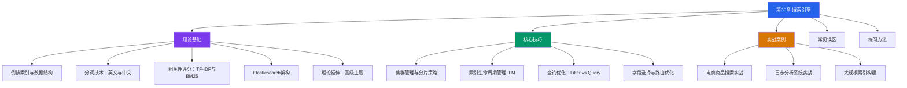
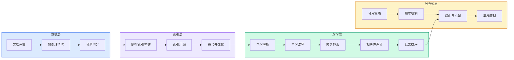
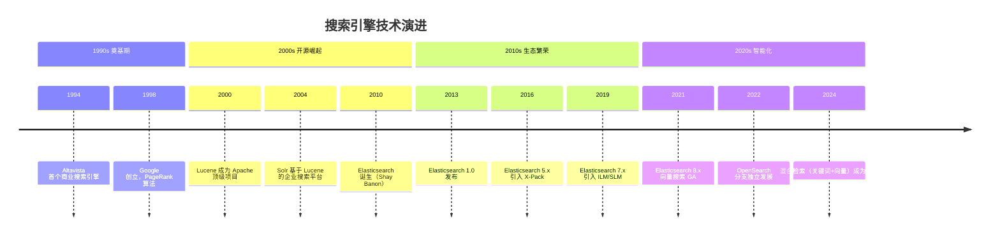

# 第39章 搜索引擎

搜索引擎是现代互联网基础设施的核心支柱——从Google每天处理85亿次搜索查询，到电商平台毫秒级商品检索，再到日志系统的实时全文分析，搜索引擎技术无处不在。本章将从倒排索引的底层数据结构出发，系统性地讲解搜索引擎的理论基础、核心算法与工程实践，最终落地到Elasticsearch的生产级应用。

## 本章定位与学习路径

本章在整本软件工程指南中处于**数据基础设施**模块。搜索引擎涉及的数据结构（倒排索引、B+树）、算法（BM25评分、分词）、分布式设计（分片、副本）横跨了前面多个章节的知识。学完本章后，你将具备独立设计和优化搜索系统的能力。



## 学习目标

完成本章学习后，读者应当能够：

| 层级 | 目标 | 对应内容 |
|------|------|----------|
| 理解 | 说出倒排索引与正排索引的区别，解释TF-IDF和BM25的评分逻辑 | 理论基础 |
| 掌握 | 用Python实现简易倒排索引和BM25评分器 | 理论基础 + 练习方法 |
| 应用 | 使用Elasticsearch创建索引、编写Query DSL、配置中文分词 | 核心技巧 + 实战案例 |
| 分析 | 诊断查询慢、索引膨胀、评分不准等生产问题 | 常见误区 |
| 设计 | 规划分片策略、设计ILM策略、优化集群架构 | 核心技巧 + 实战案例 |

## 前置知识

学习本章需要以下基础：

- **数据结构**：哈希表、B+树、Trie树的基本概念（用于理解词典实现）
- **概率与统计**：条件概率、对数运算（用于理解TF-IDF和BM25公式）
- **分布式系统**：主从复制、一致性哈希（用于理解ES的分片和副本机制）
- **Linux基础**：能够使用curl操作REST API，了解JSON格式

> 如果你已经学习了本书前面关于索引结构和分布式系统的章节，将能更顺畅地理解本章内容。搜索引擎本质上是数据结构（倒排索引）+ 信息检索理论（评分算法）+ 分布式工程（ES集群）的综合应用。

## 本章结构概览

### 第一部分：理论基础

本部分构建搜索引擎的理论地基，涵盖四大核心主题：

**1. 倒排索引 —— 搜索引擎的心脏**

倒排索引是搜索引擎最核心的数据结构。与正排索引（文档→词）相反，倒排索引建立词→文档的映射，使得"包含某个词的所有文档"的查询能在毫秒级完成。本节将详细讲解倒排索引的构建过程、词典与倒排列表的结构，以及差值编码、PForDelta、Roaring Bitmap等压缩技术。附带完整的Python实现。

**2. 分词技术 —— 理解文本的起点**

分词质量直接决定搜索准确性。英文分词基于空格切分，核心挑战在于词干提取（Porter Stemmer）和词形还原；中文分词则复杂得多，需要借助词典匹配（正向/逆向最大匹配）、统计模型（HMM、CRF）或深度学习（BiLSTM+CRF）来识别词边界。本节对比了jieba、HanLP、IK Analyzer等主流分词器的特点和适用场景。

**3. 相关性评分 —— 排序的数学基础**

为什么搜索"搜索引擎"时，讲搜索引擎原理的文档排在前面？TF-IDF给出了经典答案：词频越高、文档越稀有，得分越高。BM25在此基础上引入TF饱和处理和文档长度归一化，成为Elasticsearch的默认评分算法。本节从公式推导到代码实现，让你彻底理解评分机制。

**4. Elasticsearch架构 —— 从单机到分布式**

Elasticsearch将Lucene的单机全文检索能力扩展为分布式搜索集群。本节讲解ES的核心架构（节点、集群、索引、分片、副本）、写入流程（主分片→副本分片）、段合并策略，以及完整的REST API示例。

**5. 理论延伸 —— 超越基础**

深入探讨向量检索（ANN/HNSW）、学习排序（Learning to Rank）、查询理解（Query Suggestion/Correction）等进阶主题，为后续章节做铺垫。

### 第二部分：核心技巧

将理论转化为生产实践：

- **集群管理与分片策略**：主节点/数据节点/协调节点的角色划分，分片数量的计算公式，副本策略的读写权衡
- **索引生命周期管理（ILM）**：Hot→Warm→Cold→Delete四阶段自动化管理，配合Rollover实现索引自动轮转
- **查询优化**：Filter上下文的缓存机制、bool查询的性能陷阱、深度分页问题
- **字段选择与路由控制**：`_source`过滤、stored_fields、自定义路由减少跨分片查询

### 第三部分：实战案例

通过三个真实场景检验学习成果：

- 电商商品搜索系统：多字段加权、同义词扩展、拼写纠错、分面导航
- 日志分析系统：高写入吞吐优化、ILM策略设计、聚合查询分析
- 大规模索引构建：批量索引技巧、Bulk API、并行构建策略

### 第四部分：常见误区与练习

- **常见误区**：纠正"分片越多越好""query和filter没区别""_score越高越好"等典型错误认知
- **练习方法**：从搭建本地ES环境到实现完整搜索引擎的渐进式练习路径

## 知识体系全景



## 技术演进时间线



## 主流搜索引擎技术对比

| 维度 | Elasticsearch | Solr | Meilisearch | Typesense | Manticore |
|------|--------------|------|-------------|-----------|-----------|
| 底层引擎 | Lucene | Lucene | 自研(Rust) | 自研(C++) | Lucene |
| 分布式支持 | ✅ 原生分片 | ✅ SolrCloud | ⚠️ 有限 | ✅ 内置 | ✅ 原生 |
| 实时索引 | ✅ 近实时 | ⚠️ 需commit | ✅ 实时 | ✅ 实时 | ✅ 近实时 |
| 中文分词 | IK/jieba插件 | IK插件 | ⚠️ 有限 | ⚠️ 有限 | 内置cjk |
| 学习曲线 | 中等 | 较高 | 低 | 低 | 中等 |
| 适用场景 | 大规模企业级 | 传统企业搜索 | 小型应用 | 轻量全文搜索 | ES替代方案 |
| 社区活跃度 | ⭐⭐⭐⭐⭐ | ⭐⭐⭐ | ⭐⭐⭐⭐ | ⭐⭐⭐ | ⭐⭐ |

> **选型建议**：10GB以下数据量且追求简单部署，选Meilisearch或Typesense；大规模企业级场景（TB级数据、复杂聚合、高可用要求），Elasticsearch仍是首选；已有Solr技术栈的团队可继续使用Solr。

## 核心性能指标

评估搜索引擎性能需要关注以下关键指标：

| 指标 | 含义 | 典型目标 | 优化方向 |
|------|------|----------|----------|
| 查询延迟(P50/P99) | 50%/99%请求的响应时间 | P50<10ms, P99<100ms | filter缓存、分片优化、字段裁剪 |
| 索引吞吐量 | 每秒索引文档数 | 10K-100K docs/s | Bulk API、调整refresh_interval |
| 搜索吞吐量(QPS) | 每秒处理查询数 | 1K-50K QPS | 副本分片、查询缓存、硬件升级 |
| 索引膨胀率 | 原始数据/索引大小 | 压缩比3:1-10:1 | 字段裁剪、关闭不需要的特性 |
| 召回率@K | 前K个结果中相关文档的比例 | >80% | 查询扩展、同义词、向量检索 |
| MRR(NDCG) | 排序质量指标 | MRR>0.7 | BM25调参、Learning to Rank |
| 集群可用性 | 正常运行时间比例 | 99.9%+ | 副本、跨AZ部署、监控告警 |

## 前置环境准备

跟随本章实战练习前，建议准备好以下环境：

```bash
# 方式一：Docker 单节点（推荐入门）
docker run -d --name elasticsearch \
  -p 9200:9200 -p 9300:9300 \
  -e "discovery.type=single-node" \
  -e "ES_JAVA_OPTS=-Xms512m -Xmx512m" \
  elasticsearch:8.12.0

# 方式二：Docker Compose（3节点集群，适合核心技巧部分）
cat > docker-compose.yml << 'EOF'
version: '3.8'
services:
  es-node1:
    image: elasticsearch:8.12.0
    environment:
      - discovery.type=seed-hosts
      - cluster.name=es-cluster
      - node.name=es-node1
      - ES_JAVA_OPTS=-Xms512m -Xmx512m
      - xpack.security.enabled=false
    ports:
      - "9200:9200"
    volumes:
      - es-data1:/usr/share/elasticsearch/data

  es-node2:
    image: elasticsearch:8.12.0
    environment:
      - discovery.type=seed-hosts
      - cluster.name=es-cluster
      - node.name=es-node2
      - ES_JAVA_OPTS=-Xms512m -Xmx512m
      - xpack.security.enabled=false
    volumes:
      - es-data2:/usr/share/elasticsearch/data

  es-node3:
    image: elasticsearch:8.12.0
    environment:
      - discovery.type=seed-hosts
      - cluster.name=es-cluster
      - node.name=es-node3
      - ES_JAVA_OPTS=-Xms512m -Xmx512m
      - xpack.security.enabled=false
    volumes:
      - es-data3:/usr/share/elasticsearch/data

volumes:
  es-data1:
  es-data2:
  es-data3:
EOF

# 验证集群状态
curl -s "localhost:9200/_cluster/health?pretty" | jq .
```

```bash
# Python依赖（用于理论基础部分的代码示例）
pip install jieba nltk elasticsearch

# 下载NLTK数据（英文分词示例需要）
python -c "import nltk; nltk.download('punkt'); nltk.download('stopwords')"
```

## 阅读建议

- **入门读者**：从理论基础的"倒排索引"开始，按顺序阅读，重点关注概念理解而非代码细节
- **有经验的开发者**：可跳过倒排索引基础，直接阅读BM25算法和Elasticsearch架构部分
- **运维/架构师**：重点关注核心技巧中的集群管理、ILM策略和查询优化
- **准备面试的读者**：理论基础 + 常见误区 + 练习方法是高频面试内容

> 本章代码示例以Python为主（理论验证），Elasticsearch REST API为辅（工程实践）。所有代码均可在准备好上述环境后直接运行验证。
