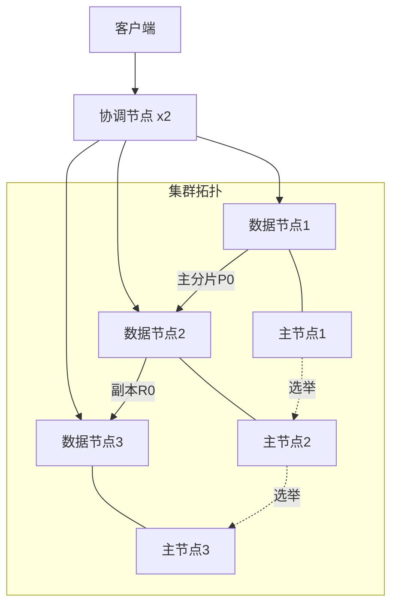

## 核心技巧

搜索引擎从理论走向生产环境，需要掌握一系列核心工程技巧。本节以 Elasticsearch 为核心平台，系统讲解集群架构设计、分片与副本策略、索引生命周期管理、查询优化、分页策略、Mapping 设计、中文分词配置、路由优化、聚合查询、BM25 参数调优、缓存机制、批量操作、慢查询分析与监控等关键主题。每个技巧都从原理出发，给出可直接落地的配置和代码。

---

## 集群架构设计

生产环境的 Elasticsearch 集群需要合理规划节点角色，避免资源争抢和单点瓶颈。

### 节点角色划分

Elasticsearch 节点通常分为四种角色，每种角色承担不同的职责：

| 角色 | 职责 | 资源特征 | 典型配置 |
|------|------|----------|----------|
| Master（主节点） | 集群管理：索引创建/删除、分片分配、节点加入/退出 | CPU 和内存需求较低，不存储数据 | 3 个独立主节点（防脑裂） |
| Data（数据节点） | 存储数据、执行搜索和写入请求 | 大内存 + SSD，CPU 和 IO 密集 | 32-64GB JVM 堆，SSD 磁盘 |
| Coordinating（协调节点） | 接收客户端请求，路由到对应分片，合并结果 | 内存和网络需求较高，不存储数据 | 2-3 个，独立部署 |
| Ingest（预处理节点） | 在写入前对文档执行 Pipeline 预处理 | CPU 需求适中 | 按预处理负载配置 |



### 主节点配置要点

主节点负责集群级元数据管理，**绝不能**同时承担数据角色。主节点宕机会导致整个集群无法服务。

```yaml
# elasticsearch.yml - 主节点配置
node.name: master-1
node.roles: [ master ]          # 仅主节点角色
discovery.seed_hosts:
  - master-1
  - master-2
  - master-3
cluster.initial_master_nodes:
  - master-1
  - master-2
  - master-3
discovery.zen.minimum_master_nodes: 2  # 7.x 之前需要手动设置
```

### 数据节点配置要点

数据节点是集群的"劳动力"，JVM 堆内存建议设为物理内存的 50%（但不超过 32GB，避免指针压缩失效）：

```yaml
# elasticsearch.yml - 数据节点配置
node.name: data-1
node.roles: [ data, ingest ]    # 数据节点 + 预处理节点
path.data: /data/elasticsearch
path.logs: /var/log/elasticsearch

# 网络配置
network.host: 0.0.0.0
http.port: 9200
transport.port: 9300
```

```bash
# JVM 堆内存配置 (/etc/elasticsearch/jvm.options)
-Xms16g     # 最小堆（与 -Xmx 相同）
-Xmx16g     # 最大堆（物理内存的 50%，不超过 32GB）
```

**内存分配公式**：ES 可用内存 = 物理内存 - JVM 堆 - 系统预留（1-2GB）。ES 可用内存中，50% 用于 Lucene 文件系统缓存，50% 用于聚合等操作的堆外内存。

---

## 分片与副本策略

分片策略是 ES 集群设计中最关键的决策之一，一旦创建**无法修改**（除非 Reindex）。

### 分片数量规划

**核心原则**：每个分片大小控制在 10-50GB，分片总数控制在 `节点数 × (1~3)` 以内。

| 数据量 | 推荐分片数 | 说明 |
|--------|-----------|------|
| < 10GB | 1 | 单分片足够 |
| 10-50GB | 1-3 | 根据节点数决定 |
| 50-200GB | 3-10 | 每分片保持 10-50GB |
| 200GB-1TB | 10-30 | 分散到多个节点 |
| > 1TB | 30+ | 配合 ILM 管理 |

**分片数计算公式**：

分片数 = ceil(预估数据总量 / 目标单分片大小) × (1 + 副本数)

**实际案例**：一个 3 节点集群，预估 2 年数据增长到 300GB，目标单分片 20GB：

主分片 = ceil(300GB / 20GB) = 15 个
副本数 = 1
总分片 = 15 × 2 = 30 个
每节点分片 ≈ 10 个（可接受范围）

### 副本策略

副本有两个核心作用：**高可用**和**读扩展**。

```json
// 读多写少场景：增加副本
PUT /logs_index
{
  "settings": {
    "number_of_shards": 5,
    "number_of_replicas": 2      // 2 个副本，共 3 份数据
  }
}

// 写入密集场景：减少副本
PUT /events_index
{
  "settings": {
    "number_of_shards": 5,
    "number_of_replicas": 0,     // 仅主分片，写入后异步复制
    "refresh_interval": "30s"    // 降低 Refresh 频率
  }
}
```

### 分片分配感知

通过分配过滤器（Allocation Filtering）控制分片的物理分布：

```json
// 索引只能在 zone-a 和 zone-b 的节点上分配
PUT /my_index
{
  "settings": {
    "index.routing.allocation.include.zone": "zone-a,zone-b",
    "index.routing.allocation.require.disk_usage": "low"
  }
}
```

---

## 索引生命周期管理（ILM）

随着日志和时序数据的增长，手动管理索引不可持续。ILM 通过自动化策略将索引的生命周期分为四个阶段：

| 阶段 | 数据特征 | 典型操作 | 存储介质 |
|------|---------|---------|---------|
| Hot | 频繁读写 | Rollover 创建新索引 | SSD（高性能） |
| Warm | 只读或低频写 | Force Merge、Shrink、段合并 | HDD 或大容量 SSD |
| Cold | 极少访问 | Freeze 冻结、只读挂载 | 对象存储/归档磁盘 |
| Delete | 不再需要 | 自动删除索引 | — |

### 完整 ILM 策略示例

```json
PUT _ilm/policy/logs_policy
{
  "policy": {
    "phases": {
      "hot": {
        "min_age": "0ms",
        "actions": {
          "rollover": {
            "max_age": "1d",
            "max_size": "50gb",
            "max_primary_shard_size": "45gb"
          },
          "set_priority": { "priority": 100 }
        }
      },
      "warm": {
        "min_age": "7d",
        "actions": {
          "shrink": { "number_of_shards": 1 },
          "forcemerge": { "max_num_segments": 1 },
          "set_priority": { "priority": 50 },
          "allocate": {
            "require": { "data": "warm" }
          }
        }
      },
      "cold": {
        "min_age": "30d",
        "actions": {
          "allocate": {
            "require": { "data": "cold" }
          },
          "set_priority": { "priority": 0 },
          "freeze": {}
        }
      },
      "delete": {
        "min_age": "90d",
        "actions": {
          "delete": {}
        }
      }
    }
  }
}
```

### Rollover 自动轮转

配合 Index Alias 实现自动轮转，避免单个索引过大：

```json
// 创建初始索引 + 别名
PUT /logs-000001
{
  "aliases": {
    "logs": {
      "is_write_index": true
    }
  }
}

// Rollover：当满足条件时自动创建 logs-000002
POST /logs/_rollover
{
  "conditions": {
    "max_age": "1d",
    "max_size": "50gb"
  }
}
```

**写入指向别名**：`POST /logs/_doc` — 始终写入当前活跃索引。

**查询覆盖所有索引**：`GET /logs/_search` — 通过别名搜索所有历史索引。

---

## 查询优化：Filter 与 Query

`query` 和 `filter` 是 Elasticsearch bool 查询中最关键的性能分水岭：

| 对比维度 | Query 上下文 | Filter 上下文 |
|---------|-------------|--------------|
| 是否计算 _score | 是 | 否（跳过评分） |
| 是否可缓存 | 否 | 是（bitset 缓存） |
| 适用场景 | 全文匹配、相关性搜索 | 精确匹配、范围过滤、存在性判断 |
| 性能开销 | 较高（需计算 TF-IDF） | 极低（缓存命中后零开销） |

### 优化原则

**原则一**：所有不需要评分的条件，一律放入 `filter`。

```json
// 反面示例：所有条件都放在 must 中，每个都计算 _score
{
  "query": {
    "bool": {
      "must": [
        { "match": { "title": "手机" } },
        { "term": { "status": "active" } },
        { "range": { "price": { "gte": 1000, "lte": 5000 } } },
        { "term": { "category": "electronics" } }
      ]
    }
  }
}

// 正面示例：全文匹配放 must，精确条件放 filter
{
  "query": {
    "bool": {
      "must": [
        { "match": { "title": "手机" } }
      ],
      "filter": [
        { "term": { "status": "active" } },
        { "range": { "price": { "gte": 1000, "lte": 5000 } } },
        { "term": { "category": "electronics" } }
      ]
    }
  }
}
```

**原则二**：filter 条件的顺序按选择性从高到低排列（选择性最高的放前面，尽早缩小候选集）。

**原则三**：避免在 filter 中使用 `match` 查询 — `match` 会触发分词和评分计算，应改用 `term` 进行精确匹配。

### Filter Bitset 缓存机制

filter 条件的匹配结果会被缓存为 bitset（位图），每个 bit 代表一个文档是否匹配。当相同 filter 再次出现时，直接读取缓存，无需重新执行查询。

```bash
# 查看缓存命中率
GET /my_index/_stats?filter_cache=true

# 返回结果中关注：
# indices.my_index.filter_cache.count    — 缓存的 bitset 数量
# indices.my_index.filter_cache.memory_size — 缓存占用内存
```

**缓存失效条件**：当索引发生 Refresh（默认每秒一次），bitset 缓存会失效。对于写入密集型索引，filter 缓存的实际命中率可能较低。此时可以适当增大 `refresh_interval`。

---

## 分页策略

Elasticsearch 提供三种分页方式，各有适用场景：

### from/size 分页（常规翻页）

最常用但有深度限制。每个分片需返回 `from + size` 条数据，协调节点合并后截取。`from + size` 超过 10000（默认）时会报错。

```json
// 前 10 条
GET /products/_search
{
  "from": 0,
  "size": 10,
  "query": { "match": { "title": "手机" } }
}

// 第 2 页（跳过前 10 条）
{
  "from": 10,
  "size": 10,
  "query": { "match": { "title": "手机" } }
}
```

**性能问题**：`from=10000, size=10` 时，每个分片需处理 10010 条数据，协调节点需合并 30030 条数据。对于 5 分片集群，总处理量高达 50050 条。

### search_after 分页（深度翻页推荐）

使用上一页最后一条文档的排序值作为游标，避免深度分页的性能问题：

```json
// 第一页
GET /products/_search
{
  "size": 10,
  "sort": [
    { "price": "asc" },
    { "_id": "asc" }
  ],
  "query": { "match_all": {} }
}

// 后续页：使用上一页最后一条的排序值
GET /products/_search
{
  "size": 10,
  "search_after": [99.9, "doc_100"],
  "sort": [
    { "price": "asc" },
    { "_id": "asc" }
  ],
  "query": { "match_all": {} }
}
```

> **要点**：`sort` 中必须包含唯一值字段（如 `_id`），否则在同值边界处会出现遗漏或重复。`search_after` 不能跳页，只能"下一页"式翻页。

### scroll 分页（批量导出）

适用于需要遍历全量数据的场景（如数据导出、Reindex）。Scroll 创建搜索快照，期间数据不会变化。**注意**：ES 7.x 起已被标记为弃用，推荐改用 Point in Time + search_after。

```json
// 创建 scroll 上下文
GET /products/_search?scroll=5m
{
  "size": 1000,
  "query": { "match_all": {} }
}

// 使用 scroll_id 获取后续数据
POST /_search/scroll
{
  "scroll": "5m",
  "scroll_id": "DXF1ZXJ5QW5kRmV0..."
}
```

### 三种分页方式对比

| 特性 | from/size | search_after | scroll |
|------|-----------|-------------|--------|
| 最大深度 | 10000（可配置更大） | 无限制 | 无限制 |
| 支持跳页 | 是 | 否 | 否 |
| 实时性 | 高（受 Refresh 影响） | 高 | 低（快照） |
| 资源消耗 | 深度分页时高 | 恒定低 | 高（占用上下文） |
| 适用场景 | 前 10000 条翻页 | 无限滚动/瀑布流 | 数据导出/批量处理 |

---

## Mapping 设计最佳实践

Mapping 定义了字段的存储方式和索引行为，一旦创建后只能添加新字段，**无法修改已有字段的类型**。

### 字段类型选择

| 数据特征 | 推荐类型 | 说明 |
|---------|---------|------|
| 全文文本 | `text` | 经过分词，支持全文搜索 |
| 精确值（ID、状态、标签） | `keyword` | 不分词，支持精确匹配、聚合、排序 |
| 数值 | `integer`/`long`/`float` | 根据取值范围选择最小够用的类型 |
| 日期 | `date` | 支持日期范围查询和日期聚合 |
| 布尔 | `boolean` | true/false |
| 地理位置 | `geo_point` | 支持距离计算和地理围栏 |
| 结构化数据 | `object`/`nested` | JSON 嵌套对象 |

### Multi-field 多字段映射

同一原始字段可以使用多种分析器索引，满足不同查询需求：

```json
PUT /products
{
  "mappings": {
    "properties": {
      "title": {
        "type": "text",
        "analyzer": "ik_max_word",
        "search_analyzer": "ik_smart",
        "fields": {
          "keyword": {
            "type": "keyword",
            "ignore_above": 256
          },
          "pinyin": {
            "type": "text",
            "analyzer": "ik_pinyin_analyzer"
          },
          "edge_ngram": {
            "type": "text",
            "analyzer": "edge_ngram_analyzer"
          }
        }
      }
    }
  }
}
```

**查询时按需选择子字段**：

```json
// 中文全文搜索
{ "match": { "title": "苹果手机" } }

// 精确匹配（排序、聚合）
{ "term": { "title.keyword": "Apple iPhone 15" } }

// 拼音搜索（输入 "pingguo shouji"）
{ "match": { "title.pinyin": "苹果手机" } }

// 前缀搜索（自动补全）
{ "match": { "title.edge_ngram": "手机" } }
```

### 禁用不需要的功能

减少不必要的索引体积：

```json
{
  "mappings": {
    "properties": {
      "created_at": {
        "type": "date",
        "index": false,           // 不需要对创建时间做搜索
        "doc_values": true        // 但需要用于聚合和排序
      },
      "internal_id": {
        "type": "keyword",
        "doc_values": false,      // 不需要聚合/排序
        "index": false            // 不需要搜索
      }
    }
  }
}
```

### 控制 _source 和 _all

```json
{
  "mappings": {
    "_source": {
      "enabled": true,            // 保留原始文档（需要更新/重新索引时开启）
      "excludes": ["large_blob"]  // 排除大字段以节省存储
    },
    "properties": {
      "large_blob": {
        "type": "text",
        "index": false
      }
    }
  }
}
```

---

## 中文分词配置

中文搜索质量高度依赖分词器。IK Analyzer 是最成熟的 ES 中文分词插件，提供两种分词模式：

### 索引与搜索分词策略

```json
PUT /chinese_docs
{
  "settings": {
    "analysis": {
      "analyzer": {
        "ik_index": {
          "type": "custom",
          "tokenizer": "ik_max_word",
          "filter": ["lowercase"]
        },
        "ik_search": {
          "type": "custom",
          "tokenizer": "ik_smart",
          "filter": ["lowercase"]
        }
      }
    }
  },
  "mappings": {
    "properties": {
      "title": {
        "type": "text",
        "analyzer": "ik_index",
        "search_analyzer": "ik_search"
      }
    }
  }
}
```

**核心原则：索引时细粒度，搜索时粗粒度**

- `ik_max_word`（索引时）：将文本切分为尽可能多的词项组合，最大化召回率
  - "搜索引擎技术" → ["搜索", "搜索引擎", "引擎", "技术", "搜索引擎技术"]
- `ik_smart`（搜索时）：将搜索词切分为最粗粒度，最小化噪声匹配
  - "搜索引擎技术" → ["搜索引擎", "技术"]

### 自定义词典

对于专业领域的搜索，必须添加领域术语：

```bash
# IK 分词器自定义词典目录
# /config/analysis-ik/ 目录下创建 custom_dict.dic
# 每行一个词：
# 倒排索引
# BM25算法
# 分布式搜索
# 近实时索引
```

```yaml
# elasticsearch.yml 中配置词典路径
ik-analysis.dict.path: /config/analysis-ik/
```

### 分词质量验证

```bash
# 使用 _analyze API 验证分词效果
POST /chinese_docs/_analyze
{
  "analyzer": "ik_index",
  "text": "Elasticsearch分布式搜索引擎的倒排索引实现"
}

# 对比不同分词器的效果
POST /_analyze
{
  "analyzer": "ik_smart",
  "text": "Elasticsearch分布式搜索引擎的倒排索引实现"
}
```

### 其他中文分词方案

| 分词器 | 特点 | 适用场景 |
|--------|------|---------|
| IK Analyzer | 可扩展词典、两种模式 | 通用中文搜索 |
| jieba (Python) | 精确/全模式/搜索引擎模式 | Python 项目 |
| HanLP | 支持 NER、词性标注 | NLP 深度处理 |
| Elasticsearch-analysis-smartcn | SmartChineseAnalyzer | 轻量级方案 |
| IK + 同义词 | 支持同义词扩展 | 搜索质量优化 |

---

## 路由优化

默认情况下，ES 使用 `hash(doc_id) % num_shards` 决定文档存储的分片。自定义路由可以让相关数据集中存储，减少跨分片查询。

### 使用场景

- **多租户系统**：将 `tenant_id` 作为路由值，同一租户的数据存储在同一分片
- **按用户聚类**：将 `user_id` 作为路由值，用户数据集中存储
- **时间序列数据**：按 `date` 路由，避免全分片扫描

### 路由配置

```json
// 写入时指定路由
PUT /user_messages/_doc/1?routing=user_123
{
  "user_id": "user_123",
  "message": "这是一条消息",
  "timestamp": "2024-01-01T10:00:00Z"
}

// 查询时指定路由（只查 1 个分片而非全部）
GET /user_messages/_search?routing=user_123
{
  "query": {
    "bool": {
      "must": [
        { "term": { "user_id": "user_123" } }
      ]
    }
  }
}
```

### 路由均衡策略

直接使用单个 `tenant_id` 作为路由值可能导致数据倾斜（某些租户数据量远超其他租户）。解决方案：

```json
// 方案一：复合路由值
PUT /user_messages/_doc/1?routing=user_123_month_01
{
  "user_id": "user_123",
  "timestamp": "2024-01-15T10:00:00Z"
}

// 方案二：使用 routing 分片数（而非索引分片数）
PUT /user_messages
{
  "settings": {
    "number_of_shards": 3,
    "number_of_routing_shards": 30   // 路由分片数 > 主分片数
  }
}
```

### 路由使用注意事项

1. **路由值变更**会导致数据分布变化，需 Reindex 迁移
2. **跨租户查询**必须不指定路由（或指定多值路由），否则查不到其他分片的数据
3. **副本分片**自动与主分片使用相同路由，无需重复指定
4. **建议保留路由文档**：在 Mapping 中增加 `routing` 字段存储路由值，便于维护

---

## 聚合查询优化

聚合是 ES 的数据分析核心，但容易因配置不当导致性能问题。

### 聚合类型与适用场景

| 聚合类型 | 用途 | 示例 |
|---------|------|------|
| Terms | 按字段值分组 | 按商品类别统计数量 |
| Histogram | 按数值区间分组 | 价格区间分布 |
| Date Histogram | 按时间区间分组 | 每日/每月销售趋势 |
| Range | 自定义区间分组 | 不同价格段的商品数量 |
| Cardinality | 统计唯一值数量 | 独立访客数（UV） |
| Percentiles | 百分位统计 | P50/P95/P99 响应延迟 |
| Avg / Sum / Min / Max | 基础统计 | 平均价格、总销量 |
| Value Count | 计数 | 商品评价数量 |

### 聚合性能优化

**优化一：设置合理的 `size`**

Terms 聚合默认返回 10 个桶。如果字段基数很高（如用户 ID），需要明确指定 size 并配合 `_count` 排序：

```json
GET /products/_search
{
  "size": 0,
  "aggs": {
    "top_categories": {
      "terms": {
        "field": "category",
        "size": 20,                // 返回前 20 个类别
        "order": { "_count": "desc" }
      }
    }
  }
}
```

**优化二：使用 `execution_hint`**

对于高基数字段的 Terms 聚合，可以指定执行方式：

```json
{
  "aggs": {
    "by_user": {
      "terms": {
        "field": "user_id",
        "execution_hint": "map"    // 使用 map 方式，内存换速度
      }
    }
  }
}
```

**优化三：避免深度嵌套聚合**

嵌套聚合的计算量是乘法关系。2 层嵌套 × 10 个桶 × 10 个子桶 = 1000 次聚合。尽量控制在 2-3 层以内。

**优化四：对大结果集使用 Pipeline 聚合**

```json
// 找出销量最高的前 5 个类别
GET /products/_search
{
  "size": 0,
  "aggs": {
    "by_category": {
      "terms": {
        "field": "category",
        "size": 100           // 先聚合出 100 个类别
      },
      "aggs": {
        "avg_price": {
          "avg": { "field": "price" }
        }
      }
    },
    "top_5_by_price": {
      "bucket_sort": {
        "sort": { "avg_price": "desc" },
        "size": 5             // 再取平均价格最高的 5 个
      }
    }
  }
}
```

### Cardinality 精度控制

```json
{
  "aggs": {
    "unique_visitors": {
      "cardinality": {
        "field": "visitor_id",
        "precision_threshold": 40000   // 精度阈值，超过后近似误差 < 0.5%
      }
    }
  }
}
```

---

## BM25 参数调优

Elasticsearch 默认使用 BM25 算法（k1=1.2, b=0.75），但针对不同业务场景需要调整参数。

### 参数含义与调优策略

| 参数 | 作用 | 默认值 | 调优建议 |
|------|------|--------|---------|
| k1 | 词频饱和速度 | 1.2 | 词频差异大（技术文档）→ 提高到 1.5-2.0；短文本为主 → 降低到 0.8-1.0 |
| b | 文档长度归一化 | 0.75 | 长短文本混合 → 降低到 0.3-0.5；文本长度均匀 → 保持 0.75 |

### 配置自定义 Similarity

```json
PUT /technical_docs
{
  "settings": {
    "similarity": {
      "custom_bm25": {
        "type": "BM25",
        "k1": 1.8,
        "b": 0.3
      }
    }
  },
  "mappings": {
    "properties": {
      "content": {
        "type": "text",
        "similarity": "custom_bm25"
      },
      "title": {
        "type": "text"
        // 默认使用内置 BM25
      }
    }
  }
}
```

### 自定义评分脚本

在 BM25 基础上叠加业务因子：

```json
GET /products/_search
{
  "query": {
    "script_score": {
      "query": {
        "match": { "title": "手机" }
      },
      "script": {
        "source": """
          double bm25_score = _score;
          double recency = Math.max(0.1, 1.0 / (1 + doc['created_at'].dateGetAsEpochDay() / 365.0));
          double popularity = Math.log(1 + doc['sales'].value);
          double rating_boost = doc['rating'].value;
          return bm25_score * 0.5 + popularity * 0.3 + rating_boost * 0.2;
        """
      }
    }
  }
}
```

### 评分效果验证

```bash
# 使用 Explain API 查看单条文档的评分详情
GET /products/_explain/doc_123
{
  "query": {
    "match": { "title": "手机" }
  }
}
```

---

## 缓存机制

Elasticsearch 内置多层缓存，理解并利用好缓存是性能优化的关键。

### 缓存类型总览

| 缓存类型 | 作用范围 | 缓存内容 | 失效时机 |
|---------|---------|---------|---------|
| Node Query Cache | 节点级 | Filter 查询的 bitset 结果 | Refresh 时按索引失效 |
| Request Cache | 索引级 | 整个搜索请求的结果 | Refresh 时失效 |
| Shard Request Cache | 分片级 | 分片级的搜索结果摘要 | Refresh 时失效 |
| Field Data Cache | 节点级 | 用于排序和聚合的 field data | 手动清除 |
| FS Cache（OS 层） | 系统级 | Lucene 段文件的文件系统缓存 | OS 内存压力时驱逐 |

### 启用和监控缓存

```json
// 启用 Request Cache（默认开启）
PUT /my_index/_settings
{
  "index.requests.cache.enable": true
}

// 查询时手动使用缓存
GET /my_index/_search?request_cache=true
{
  "size": 0,
  "query": {
    "bool": {
      "filter": [
        { "term": { "status": "active" } }
      ]
    }
  }
}

// 监控缓存命中率
GET /my_index/_stats?request_cache=true
```

### 缓存优化策略

1. **增大 `refresh_interval`**：从默认 1s 增大到 5-30s，减少缓存失效频率
2. **避免在 filter 中使用动态值**：如 `{"range": {"timestamp": {"gte": "now-1m"}}}` — 每次查询时间窗口不同，缓存无法命中
3. **使用 `constant_score` 包裹 filter**：明确表示不需要评分，最大化缓存利用

```json
{
  "query": {
    "constant_score": {
      "filter": {
        "bool": {
          "must": [
            { "term": { "status": "active" } },
            { "range": { "price": { "gte": 100 } } }
          ]
        }
      },
      "boost": 1.0
    }
  }
}
```

---

## 批量操作优化

批量操作是提升 ES 写入和查询吞吐量的关键手段。

### Bulk API 写入

Bulk API 通过一次 HTTP 请求发送多个操作，大幅减少网络开销：

```python
import elasticsearch
from elasticsearch.helpers import bulk, parallel_bulk

es = elasticsearch.Elasticsearch("http://localhost:9200")

# 基础 Bulk 写入
def generate_actions():
    for i in range(1_000_000):
        yield {
            "_index": "products",
            "_id": i,
            "_source": {
                "title": f"Product {i}",
                "price": 100 + i % 900,
                "category": f"cat_{i % 10}"
            }
        }

# 单线程 Bulk 写入（推荐起步配置）
bulk(es, generate_actions(), chunk_size=1000, request_timeout=30)

# 并行 Bulk 写入（高吞吐场景）
list(parallel_bulk(
    es, 
    generate_actions(), 
    chunk_size=1000,
    thread_count=4,
    request_timeout=30
))
```

### Bulk 写入参数调优

| 参数 | 推荐值 | 说明 |
|------|--------|------|
| chunk_size | 1000-5000 | 每次 Bulk 包含的文档数 |
| request_timeout | 30-60s | 请求超时时间 |
| max_retries | 3 | 重试次数 |
| initial_backoff | 2s | 初始重试间隔 |
| max_backoff | 60s | 最大重试间隔 |

### Bulk 写入性能基准

单节点 ES（SSD）:
  - chunk_size=1000: 约 10,000-20,000 docs/s
  - chunk_size=5000: 约 20,000-40,000 docs/s

三节点集群:
  - 并行 Bulk（4线程）: 约 60,000-120,000 docs/s

### 批量查询优化

```python
# Multi Search API：一次请求多个查询
body = []
# 第一个查询
body.extend([
    {"index": "products"},
    {"query": {"match": {"title": "手机"}}, "size": 10}
])
# 第二个查询
body.extend([
    {"index": "products"},
    {"query": {"match": {"title": "笔记本"}}, "size": 10}
])

result = es.msearch(body=body)
```

---

## 慢查询分析与监控

### 慢查询日志配置

```json
PUT /my_index/_settings
{
  "index.search.slowlog.threshold.query.warn": "5s",
  "index.search.slowlog.threshold.query.info": "2s",
  "index.search.slowlog.threshold.query.debug": "500ms",
  "index.search.slowlog.threshold.query.trace": "200ms",
  "index.search.slowlog.threshold.fetch.warn": "1s",
  "index.search.slowlog.threshold.fetch.info": "500ms",
  "index.search.slowlog.level": "info"
}
```

### Profile API 查询分析

```json
GET /my_index/_search
{
  "profile": true,
  "query": {
    "bool": {
      "must": [
        { "match": { "title": "搜索引擎" } }
      ],
      "filter": [
        { "range": { "created_at": { "gte": "2024-01-01" } } }
      ]
    }
  }
}
```

返回结果中 `shards[].searches[].query` 包含每个子查询的执行时间和策略细节。

### 集群健康监控指标

```bash
# 集群健康状态
GET _cluster/health
# 返回：status（green/yellow/red）、number_of_nodes、active_shards

# 节点统计
GET _nodes/stats
# 关注：jvm.mem.heap_used_percent、thread_pool.search.rejected

# 索引统计
GET /my_index/_stats
# 关注：search.query_total、search.query_time_in_millis

# 未分配分片原因
GET _cluster/allocation/explain
```

### 关键监控告警阈值

| 指标 | 正常范围 | 告警阈值 | 说明 |
|------|---------|---------|------|
| 集群状态 | Green | Yellow > 5min, Red 立即 | 红色表示主分片丢失 |
| JVM 堆使用率 | < 75% | > 85% | 超过 85% 触发 GC |
| 磁盘使用率 | < 75% | > 85%（Watermark） | 超过 85% 停止分片分配 |
| 搜索延迟 P99 | < 200ms | > 500ms | 影响用户体验 |
| 写入拒绝 | 0 | > 0 | Thread Pool 满载 |
| 未分配分片 | 0 | > 0 | Yellow 状态 |

---

## 常用优化速查表

| 场景 | 问题 | 优化方案 |
|------|------|---------|
| 搜索慢 | 查询延迟高 | 1. filter 替代 must（精确匹配）<br>2. _source 过滤返回字段<br>3. search_after 替代深度分页 |
| 写入慢 | Bulk 写入延迟高 | 1. 增大 refresh_interval<br>2. 异步 translog<br>3. 减少副本数<br>4. 使用 parallel_bulk |
| 内存不足 | OOM / Circuit Breaker | 1. 增大 JVM 堆<br>2. 限制聚合的 size<br>3. 检查 FieldData Cache |
| 分片不均 | 热点节点 | 1. 自定义路由均衡<br>2. 分片分配过滤器<br>3. Force Rebalance |
| 聚合超时 | Cardinality 太高 | 1. 降低 precision_threshold<br>2. 先 filter 缩小范围再聚合<br>3. 使用 Execution Hint |
| 磁盘满 | 写入拒绝 | 1. ILM 自动清理<br>2. 增大 Watermark 阈值<br>3. Force Merge 释放空间 |
