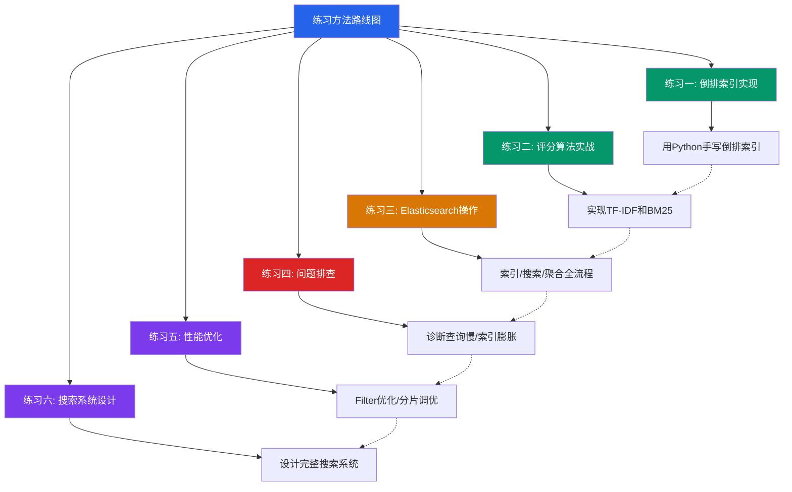
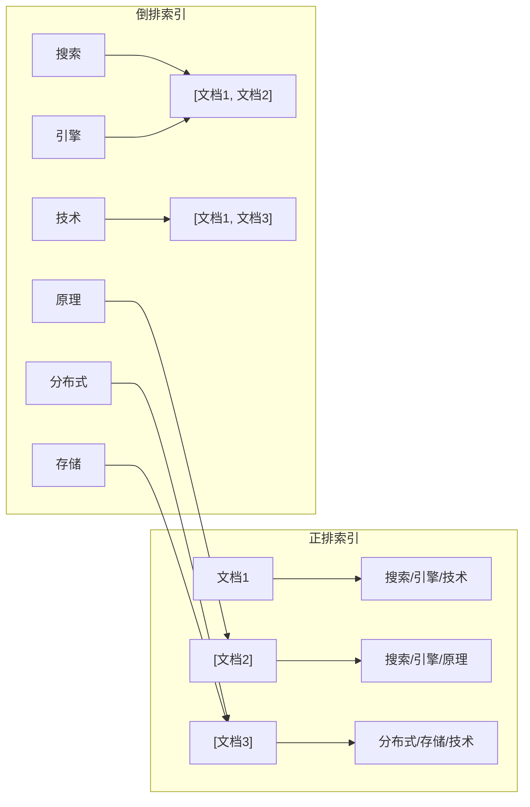
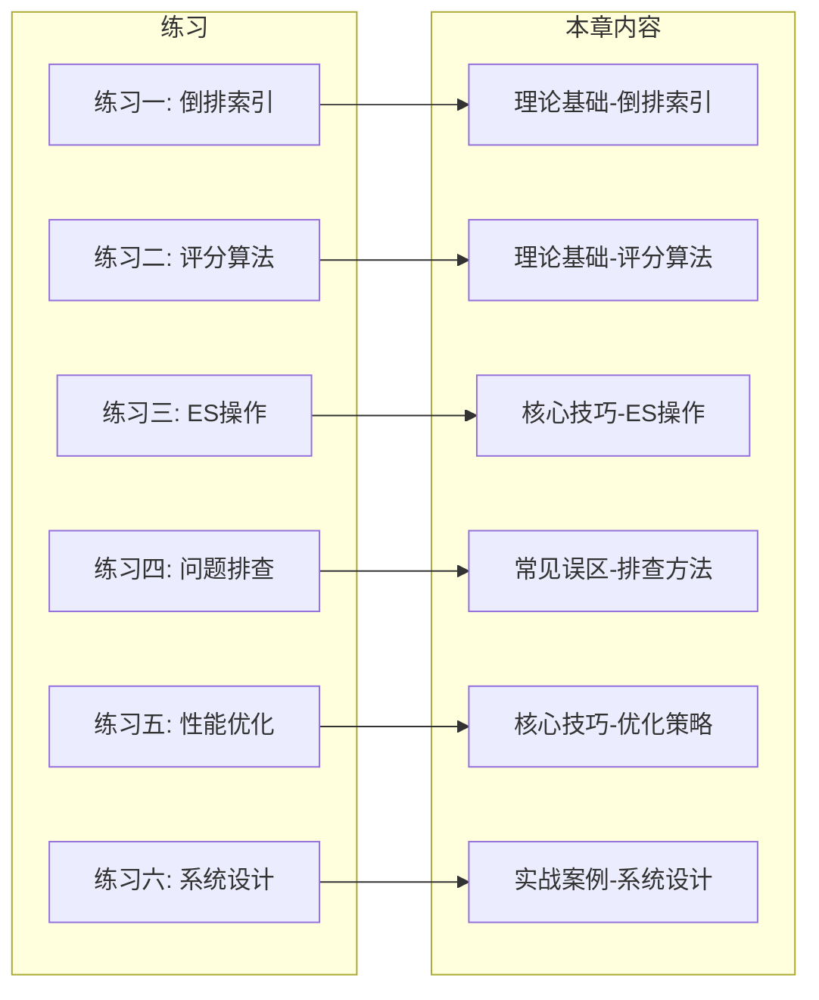

# 练习方法

本章涵盖了搜索引擎从理论到工程的完整知识链——倒排索引、分词技术、相关性评分、Elasticsearch架构与生产实践。以下练习按照"理解→实现→操作→排查→优化→设计"六个层级递进编排，每道练习都紧密对应本章内容，确保读者能将理论知识转化为实际能力。



## 练习一：倒排索引实现（预计45分钟）

**目标**：用Python从零实现一个支持中文分词的倒排索引，深入理解搜索引擎核心数据结构的构建过程和检索机制。

### 1.1 理解倒排索引原理（10分钟）

在动手编码之前，先回顾核心概念并用思维导图梳理：



**核心问题（先思考再看答案）**：
- 为什么搜索引擎不用数据库的LIKE '%keyword%' 来搜索？
- 倒排索引中"倒排"二字的含义是什么？
- 词典（Term Dictionary）和倒排列表（Posting List）各自用什么数据结构？为什么？

### 1.2 手写倒排索引（20分钟）

实现一个完整的倒排索引，支持中文分词、位置信息记录和布尔查询：

```python
"""
练习1.2: 从零实现倒排索引
要求: 支持中文分词(jieba)、记录词项位置、支持AND/OR查询
"""
import jieba
from collections import defaultdict
from typing import List, Dict, Set, Tuple


class InvertedIndex:
    """支持中文分词的倒排索引"""
    
    def __init__(self):
        # 倒排索引核心结构: 词项 -> [posting_list]
        # posting_list中每个元素: {doc_id, positions, term_freq}
        self.index: Dict[str, List[dict]] = defaultdict(list)
        # 文档存储: doc_id -> 原始文档
        self.documents: Dict[int, str] = {}
        # 文档元数据: doc_id -> {field: value}
        self.doc_meta: Dict[int, dict] = {}
        # 文档总数
        self.doc_count = 0
        # 停用词表（实际项目中应从文件加载）
        self.stop_words = set("的了是在有和人这中大为上个国我以要他时来用们生到作地于出会")
    
    def tokenize(self, text: str) -> List[str]:
        """中文分词 + 停用词过滤"""
        words = jieba.lcut(text)
        # 过滤停用词和空串
        return [w for w in words if w.strip() and w not in self.stop_words]
    
    def add_document(self, doc_id: int, content: str, meta: dict = None):
        """添加文档到索引"""
        self.documents[doc_id] = content
        self.doc_meta[doc_id] = meta or {}
        self.doc_count += 1
        
        # 分词并记录每个词项的位置
        tokens = self.tokenize(content)
        term_positions: Dict[str, List[int]] = defaultdict(list)
        
        for position, token in enumerate(tokens):
            term_positions[token].append(position)
        
        # 构建倒排列表
        for term, positions in term_positions.items():
            posting = {
                'doc_id': doc_id,
                'positions': positions,
                'term_freq': len(positions)
            }
            self.index[term].append(posting)
    
    def search_and(self, query: str) -> List[Tuple[int, float]]:
        """AND查询: 所有查询词项都必须出现"""
        query_terms = self.tokenize(query)
        if not query_terms:
            return []
        
        # 获取每个词项的文档集合
        doc_sets = []
        for term in query_terms:
            if term in self.index:
                doc_ids = set(p['doc_id'] for p in self.index[term])
                doc_sets.append(doc_ids)
            else:
                # 有词项不存在，AND结果为空
                return []
        
        # 求交集
        result = doc_sets[0]
        for ds in doc_sets[1:]:
            result = result &amp; ds
        
        return sorted(result)
    
    def search_or(self, query: str) -> List[Tuple[int, float]]:
        """OR查询: 任一查询词项出现即可"""
        query_terms = self.tokenize(query)
        if not query_terms:
            return []
        
        doc_ids = set()
        for term in query_terms:
            if term in self.index:
                for posting in self.index[term]:
                    doc_ids.add(posting['doc_id'])
        
        return sorted(doc_ids)
    
    def search_phrase(self, phrase: str) -> List[int]:
        """短语查询: 要求词项按顺序相邻出现"""
        query_terms = self.tokenize(phrase)
        if len(query_terms) < 2:
            return self.search_and(phrase)
        
        # 获取第一个词项的文档集合
        if query_terms[0] not in self.index:
            return []
        
        candidate_docs = {
            p['doc_id']: p['positions'] 
            for p in self.index[query_terms[0]]
        }
        
        # 逐个词项验证位置是否连续
        for term in query_terms[1:]:
            if term not in self.index:
                return []
            
            # 构建当前词项的位置映射
            term_positions = {
                p['doc_id']: p['positions'] 
                for p in self.index[term]
            }
            
            new_candidates = {}
            for doc_id, prev_positions in candidate_docs.items():
                if doc_id not in term_positions:
                    continue
                
                curr_positions = term_positions[doc_id]
                # 检查是否存在位置连续的情况
                for prev_pos in prev_positions:
                    if (prev_pos + 1) in curr_positions:
                        if doc_id not in new_candidates:
                            new_candidates[doc_id] = []
                        new_candidates[doc_id].append(prev_pos + 1)
            
            candidate_docs = new_candidates
        
        return sorted(candidate_docs.keys())
    
    def get_stats(self) -> dict:
        """获取索引统计信息"""
        total_terms = len(self.index)
        total_postings = sum(len(v) for v in self.index.values())
        avg_postings = total_postings / total_terms if total_terms > 0 else 0
        
        # 词项频率分布
        freq_dist = defaultdict(int)
        for term, postings in self.index.items():
            freq_dist[len(postings)] += 1
        
        return {
            '文档总数': self.doc_count,
            '词项总数': total_terms,
            '倒排列表总数': total_postings,
            '平均每词项文档数': round(avg_postings, 2),
            '索引稀疏度': round(1 - total_postings / (total_terms * self.doc_count), 4) if self.doc_count > 0 else 0
        }


# === 验证你的实现 ===
if __name__ == "__main__":
    index = InvertedIndex()
    
    # 添加测试文档
    docs = {
        1: "搜索引擎技术是互联网的核心技术之一，Google搜索引擎每天处理数十亿次查询",
        2: "倒排索引是搜索引擎的基础数据结构，通过词项到文档的映射实现快速检索",
        3: "Elasticsearch是基于Lucene的分布式搜索引擎，支持全文检索和实时分析",
        4: "分布式存储系统如HDFS和Ceph提供了大规模数据的可靠存储能力",
        5: "机器学习中的自然语言处理技术可以提升搜索引擎的语义理解能力"
    }
    
    for doc_id, content in docs.items():
        index.add_document(doc_id, content)
    
    # 测试AND查询
    print("=== AND查询: '搜索引擎 技术' ===")
    results = index.search_and("搜索引擎 技术")
    print(f"结果文档ID: {results}")
    for doc_id in results:
        print(f"  [{doc_id}] {index.documents[doc_id][:50]}...")
    
    # 测试OR查询
    print("\n=== OR查询: '分布式 存储' ===")
    results = index.search_or("分布式 存储")
    print(f"结果文档ID: {results}")
    
    # 测试短语查询
    print("\n=== 短语查询: '搜索引擎技术' ===")
    results = index.search_phrase("搜索引擎技术")
    print(f"结果文档ID: {results}")
    
    # 打印索引统计
    print("\n=== 索引统计 ===")
    stats = index.get_stats()
    for k, v in stats.items():
        print(f"  {k}: {v}")
    
    # 打印部分倒排索引
    print("\n=== 倒排索引片段 ===")
    for term in ["搜索", "引擎", "技术", "分布式"]:
        if term in index.index:
            postings = index.index[term]
            doc_info = [(p['doc_id'], p['term_freq']) for p in postings]
            print(f"  '{term}' -> {doc_info}")
```

### 1.3 实现倒排索引压缩（15分钟）

倒排列表中的文档ID通常是递增的，使用差值编码可以大幅压缩存储空间。实现一个简单的压缩和解压函数：

```python
"""
练习1.3: 差值编码压缩
要求: 实现delta encoding的编解码，观察压缩效果
"""
from typing import List


def delta_encode(doc_ids: List[int]) -> List[int]:
    """
    差值编码: 将递增的doc_id序列编码为差值序列
    例如: [1, 3, 7, 10] -> [1, 2, 4, 3]
    
    思考: 为什么差值通常比原始值更小？
    提示: 原始ID可能是很大的整数，但差值通常很小
    """
    # TODO: 实现差值编码
    pass


def delta_decode(encoded: List[int]) -> List[int]:
    """
    差值解码: 将差值序列还原为原始doc_id序列
    例如: [1, 2, 4, 3] -> [1, 3, 7, 10]
    """
    # TODO: 实现差值解码
    pass


def varint_encode(value: int) -> bytes:
    """
    变长整数编码(Varint)
    每个字节的最高位(MSB)作为标志位:
    - 1 表示后面还有字节
    - 0 表示这是最后一个字节
    
    例如: 
    - 5 -> bytes([5])          (1字节)
    - 130 -> bytes([2, 2])     (2字节, 130 = 2 + 128)
    - 300 -> bytes([44, 2])    (2字节, 300 = 44 + 256)
    """
    # TODO: 实现Varint编码
    pass


# === 验证 ===
if __name__ == "__main__":
    # 测试差值编码
    original = [1, 3, 7, 10, 15, 18, 22, 30]
    encoded = delta_encode(original)
    decoded = delta_decode(encoded)
    
    print(f"原始序列:  {original}")
    print(f"差值编码:  {encoded}")
    print(f"解码验证:  {decoded}")
    print(f"编解码一致: {original == decoded}")
    print(f"原始值平均: {sum(original)/len(original):.1f}")
    print(f"差值平均:  {sum(encoded)/len(encoded):.1f}")
    print(f"压缩率:    {len(str(encoded))}/{len(str(original))} = {len(str(encoded))/len(str(original))*100:.1f}%")
```

### 检查标准

- [ ] 能够解释倒排索引的词典和倒排列表的数据结构选择
- [ ] `InvertedIndex`的`search_and`和`search_or`方法正确运行
- [ ] 短语查询能正确匹配连续位置的词项
- [ ] 差值编码的编解码一致，能说明压缩原理
- [ ] 理解为什么倒排索引比数据库LIKE查询快几个数量级

---

## 练习二：评分算法实战（预计60分钟）

**目标**：手写实现TF-IDF和BM25评分算法，理解两种算法的差异和适用场景。

### 2.1 实现TF-IDF评分器（20分钟）

```python
"""
练习2.1: 实现TF-IDF评分器
要求: 支持多种TF计算方式，能对查询结果进行相关性排序
"""
import math
from collections import Counter
from typing import List, Dict


class TFIDFRanker:
    """TF-IDF相关性评分器"""
    
    def __init__(self, documents: List[List[str]]):
        """
        Args:
            documents: 分词后的文档列表, 每个文档是词项列表
        """
        self.documents = documents
        self.doc_count = len(documents)
        # 计算每个词项的文档频率(DF)
        self.df = self._compute_df()
    
    def _compute_df(self) -> Dict[str, int]:
        """计算文档频率: 包含词项t的文档数"""
        df = Counter()
        for doc in self.documents:
            for term in set(doc):  # 每个文档中每个词项只计一次
                df[term] += 1
        return df
    
    def idf(self, term: str) -> float:
        """
        逆文档频率: IDF(t) = log(N / df(t))
        
        思考题:
        - 当df(t) = N时, IDF = ? 意味着什么?
        - 当df(t) = 1时, IDF = ? 意味着什么?
        - IDF公式中为什么要用log而不是直接用N/df?
        """
        if term not in self.df:
            return 0.0
        return math.log(self.doc_count / self.df[term])
    
    def tf_raw(self, term: str, document: List[str]) -> float:
        """原始词频: 词项在文档中出现的次数"""
        return document.count(term)
    
    def tf_log(self, term: str, document: List[str]) -> float:
        """对数词频: 1 + log(count)"""
        count = document.count(term)
        if count == 0:
            return 0.0
        return 1 + math.log(count)
    
    def tf_boolean(self, term: str, document: List[str]) -> float:
        """布尔词频: 出现则为1，否则为0"""
        return 1.0 if term in document else 0.0
    
    def score(self, query_terms: List[str], document: List[str], 
              tf_mode: str = 'log') -> float:
        """
        计算查询与文档的TF-IDF得分
        
        Args:
            query_terms: 查询词项列表
            document: 目标文档的词项列表
            tf_mode: 词频计算方式 ('raw', 'log', 'boolean')
        
        Returns:
            综合得分
        """
        tf_func = {
            'raw': self.tf_raw,
            'log': self.tf_log,
            'boolean': self.tf_boolean
        }[tf_mode]
        
        score = 0.0
        for term in query_terms:
            tf = tf_func(term, document)
            idf_val = self.idf(term)
            score += tf * idf_val
        
        return score
    
    def search(self, query_terms: List[str], top_k: int = 5, 
               tf_mode: str = 'log') -> List[tuple]:
        """
        搜索并返回排序结果
        
        Returns:
            [(doc_index, score), ...] 按得分降序排列
        """
        results = []
        for i, doc in enumerate(self.documents):
            s = self.score(query_terms, doc, tf_mode)
            if s > 0:
                results.append((i, s))
        
        results.sort(key=lambda x: x[1], reverse=True)
        return results[:top_k]


# === 验证 ===
if __name__ == "__main__":
    # 准备测试文档（已分词）
    docs = [
        ["搜索", "引擎", "技术", "倒排", "索引", "实现"],
        ["搜索", "引擎", "原理", "排序", "算法", "评分"],
        ["分布式", "存储", "系统", "高", "可用", "架构"],
        ["搜索", "引擎", "优化", "查询", "性能", "缓存"],
        ["机器", "学习", "自然语言", "处理", "语义", "理解"]
    ]
    
    doc_labels = [
        "文档1: 搜索引擎技术-倒排索引实现",
        "文档2: 搜索引擎原理-排序算法评分",
        "文档3: 分布式存储系统-高可用架构",
        "文档4: 搜索引擎优化-查询性能缓存",
        "文档5: 机器学习-自然语言处理语义理解"
    ]
    
    ranker = TFIDFRanker(docs)
    
    # 测试不同TF模式
    query = ["搜索", "引擎"]
    print(f"查询词: {query}")
    print(f"{'='*60}")
    
    for mode in ['raw', 'log', 'boolean']:
        print(f"\n--- TF模式: {mode} ---")
        results = ranker.search(query, top_k=5, tf_mode=mode)
        for rank, (idx, score) in enumerate(results, 1):
            print(f"  #{rank} [得分={score:.4f}] {doc_labels[idx]}")
    
    # 打印IDF值分析
    print(f"\n--- IDF分析 ---")
    for term in ["搜索", "引擎", "技术", "分布式", "自然语言"]:
        idf_val = ranker.idf(term)
        df_val = ranker.df.get(term, 0)
        print(f"  '{term}': DF={df_val}, IDF={idf_val:.4f} (在{df_val}/{ranker.doc_count}个文档中出现)")
```

### 2.2 实现BM25评分器（20分钟）

BM25在TF-IDF基础上引入了**TF饱和**和**文档长度归一化**，是Elasticsearch的默认评分算法：

```python
"""
练习2.2: 实现BM25评分器
要求: 对比BM25与TF-IDF的评分差异，理解k1和b参数的含义
"""
import math
from collections import Counter
from typing import List


class BM25Ranker:
    """
    BM25评分器
    
    核心公式:
    score(D, Q) = Σ IDF(qi) * [f(qi,D) * (k1+1)] / [f(qi,D) + k1 * (1 - b + b * |D|/avgdl)]
    
    参数说明:
    - k1: 控制词频饱和度。k1越大，高词频文档得分越高；k1=0时退化为布尔模型
    - b:  控制文档长度归一化。b=1完全归一化，b=0忽略文档长度
    """
    
    def __init__(self, documents: List[List[str]], k1: float = 1.5, b: float = 0.75):
        self.documents = documents
        self.k1 = k1
        self.b = b
        self.doc_count = len(documents)
        
        # 平均文档长度
        self.avgdl = sum(len(doc) for doc in documents) / self.doc_count
        
        # 文档频率
        self.df = Counter()
        for doc in documents:
            for term in set(doc):
                self.df[term] += 1
    
    def idf(self, term: str) -> float:
        """BM25的IDF计算（Robertson-Sparck Jones版本）"""
        if term not in self.df:
            return 0.0
        df = self.df[term]
        return math.log((self.doc_count - df + 0.5) / (df + 0.5) + 1)
    
    def score(self, query_terms: List[str], doc: List[str]) -> float:
        """计算BM25得分"""
        doc_len = len(doc)
        word_count = Counter(doc)
        
        total_score = 0.0
        for term in query_terms:
            if term not in word_count:
                continue
            
            tf = word_count[term]
            idf_val = self.idf(term)
            
            # BM25 TF饱和处理
            numerator = tf * (self.k1 + 1)
            denominator = tf + self.k1 * (1 - self.b + self.b * doc_len / self.avgdl)
            
            total_score += idf_val * (numerator / denominator)
        
        return total_score
    
    def search(self, query_terms: List[str], top_k: int = 5) -> List[tuple]:
        results = []
        for i, doc in enumerate(self.documents):
            s = self.score(query_terms, doc)
            if s > 0:
                results.append((i, s))
        results.sort(key=lambda x: x[1], reverse=True)
        return results[:top_k]
    
    def analyze_params(self, query_terms: List[str], doc_idx: int):
        """
        分析k1和b参数对得分的影响
        帮助理解参数调优的直觉
        """
        doc = self.documents[doc_idx]
        doc_len = len(doc)
        word_count = Counter(doc)
        
        print(f"  文档长度: {doc_len}, 平均长度: {self.avgdl:.1f}")
        print(f"  长度比: {doc_len/self.avgdl:.2f}x")
        print(f"  k1={self.k1}, b={self.b}")
        
        for term in query_terms:
            if term in word_count:
                tf = word_count[term]
                idf_val = self.idf(term)
                tf_norm = tf + self.k1 * (1 - self.b + self.b * doc_len / self.avgdl)
                tf_component = (tf * (self.k1 + 1)) / tf_norm
                print(f"  词项 '{term}': tf={tf}, idf={idf_val:.4f}, "
                      f"tf归一化={tf_component:.4f}, 贡献={idf_val * tf_component:.4f}")


# === 对比实验: TF-IDF vs BM25 ===
if __name__ == "__main__":
    docs = [
        ["搜索", "引擎", "技术", "倒排", "索引", "实现"],
        ["搜索", "引擎", "原理", "排序", "算法", "评分"],
        ["分布式", "存储", "系统", "高", "可用", "架构"],
        ["搜索", "引擎", "优化", "查询", "性能", "缓存"],
        ["机器", "学习", "自然语言", "处理", "语义", "理解"]
    ]
    
    # BM25测试
    bm25 = BM25Ranker(docs, k1=1.5, b=0.75)
    query = ["搜索", "引擎", "技术"]
    
    print("=== BM25 搜索结果 ===")
    results = bm25.search(query, top_k=5)
    for rank, (idx, score) in enumerate(results, 1):
        print(f"  #{rank} [得分={score:.4f}] 文档{idx+1}")
    
    # 参数影响分析
    print("\n=== 参数影响分析 ===")
    bm25.analyze_params(query, doc_idx=0)  # 最相关的文档
    
    # 对比不同k1值
    print("\n=== 不同k1值的得分对比 ===")
    for k1 in [0.0, 0.5, 1.0, 1.5, 2.0]:
        bm25_k = BM25Ranker(docs, k1=k1, b=0.75)
        score_k = bm25_k.score(query, docs[0])
        print(f"  k1={k1:.1f}: 得分={score_k:.4f}")
    
    print("\n=== 不同b值的得分对比 ===")
    for b in [0.0, 0.25, 0.5, 0.75, 1.0]:
        bm25_b = BM25Ranker(docs, k1=1.5, b=b)
        score_b = bm25_b.score(query, docs[0])
        print(f"  b={b:.2f}: 得分={score_b:.4f}")
```

### 2.3 对比分析（10分钟）

完成上面的代码后，回答以下问题：

| 对比维度 | TF-IDF | BM25 |
|----------|--------|------|
| 词频处理 | 无界增长（原始TF）或对数增长（log TF） | **饱和处理**：超过k1后增速骤降 |
| 文档长度 | 不考虑 | **归一化**：长文档得分被拉低 |
| IDF公式 | log(N/df) | log((N-df+0.5)/(df+0.5)+1) |
| 参数数量 | 无参数 | k1（词频饱和度）、b（长度归一化） |
| ElasticSearch默认 | ❌ 已弃用 | ✅ 默认评分算法 |
| 适用场景 | 短文档、词频均匀 | 长短文档混合、词频差异大 |

**思考题**：
1. 当k1=0时，BM25退化为什么模型？为什么？
2. 当b=0时，BM25忽略文档长度，这时与TF-IDF有什么区别？
3. 在什么场景下，BM25可能表现不如TF-IDF？

### 检查标准

- [ ] TF-IDF评分器能正确计算三种TF模式的得分
- [ ] BM25评分器的得分计算与理论公式一致
- [ ] 能解释k1和b参数变化对得分的影响
- [ ] 能对比分析TF-IDF和BM25的优劣

---

## 练习三：Elasticsearch操作（预计60分钟）

**目标**：通过完整的CRUD操作，掌握Elasticsearch的索引管理、搜索查询和聚合分析。

> **前置条件**：确保Elasticsearch已启动。参考章节概览中的环境准备部分。
> ```bash
> docker run -d --name es-practice \
>   -p 9200:9200 -e "discovery.type=single-node" \
>   -e "ES_JAVA_OPTS=-Xms512m -Xmx512m" \
>   elasticsearch:8.12.0
> ```

### 3.1 创建索引和映射（15分钟）

```bash
# 创建商品索引，配置中文分词器
curl -X PUT "localhost:9200/products" -H 'Content-Type: application/json' -d '{
  "settings": {
    "number_of_shards": 2,
    "number_of_replicas": 1,
    "analysis": {
      "analyzer": {
        "ik_max_analyzer": {
          "type": "custom",
          "tokenizer": "ik_max_word"
        },
        "ik_smart_analyzer": {
          "type": "custom",
          "tokenizer": "ik_smart"
        }
      }
    }
  },
  "mappings": {
    "properties": {
      "name": {
        "type": "text",
        "analyzer": "ik_max_analyzer",
        "search_analyzer": "ik_smart_analyzer",
        "fields": {
          "keyword": {
            "type": "keyword",
            "ignore_above": 256
          }
        }
      },
      "description": {
        "type": "text",
        "analyzer": "ik_max_analyzer"
      },
      "price": {
        "type": "scaled_float",
        "scaling_factor": 100
      },
      "category": {
        "type": "keyword"
      },
      "brand": {
        "type": "keyword"
      },
      "stock": {
        "type": "integer"
      },
      "sales": {
        "type": "long"
      },
      "created_at": {
        "type": "date",
        "format": "yyyy-MM-dd HH:mm:ss||yyyy-MM-dd"
      },
      "tags": {
        "type": "keyword"
      }
    }
  }
}'
```

### 3.2 批量索引文档（10分钟）

```bash
# 使用Bulk API批量索引文档（注意：每行JSON后必须换行）
curl -X POST "localhost:9200/products/_bulk" -H 'Content-Type: application/json' -d '
{"index": {"_id": 1}}
{"name": "iPhone 15 Pro Max 256GB", "description": "苹果最新旗舰手机，A17 Pro芯片，钛金属设计", "price": 999900, "category": "手机", "brand": "Apple", "stock": 50, "sales": 12000, "created_at": "2024-09-20", "tags": ["5G", "旗舰", "苹果"]}
{"index": {"_id": 2}}
{"name": "华为Mate 60 Pro", "description": "华为麒麟芯片，卫星通信，鸿蒙系统", "price": 699900, "category": "手机", "brand": "Huawei", "stock": 30, "sales": 8000, "created_at": "2024-09-15", "tags": ["5G", "卫星通信", "鸿蒙"]}
{"index": {"_id": 3}}
{"name": "小米14 Ultra", "description": "小米影像旗舰，徕卡光学镜头，骁龙8Gen3", "price": 599900, "category": "手机", "brand": "Xiaomi", "stock": 100, "sales": 15000, "created_at": "2024-03-01", "tags": ["5G", "影像", "骁龙"]}
{"index": {"_id": 4}}
{"name": "MacBook Pro 14 M3", "description": "苹果笔记本，M3 Pro芯片，Liquid Retina XDR显示屏", "price": 1499900, "category": "笔记本", "brand": "Apple", "stock": 20, "sales": 3000, "created_at": "2024-01-10", "tags": ["笔记本", "苹果", "M3"]}
{"index": {"_id": 5}}
{"name": "联想ThinkPad X1 Carbon", "description": "商务轻薄本，14英寸2.8K OLED屏，酷睿Ultra处理器", "price": 999900, "category": "笔记本", "brand": "Lenovo", "stock": 40, "sales": 5000, "created_at": "2024-02-15", "tags": ["笔记本", "商务", "轻薄"]}
{"index": {"_id": 6}}
{"name": "Sony WH-1000XM5", "description": "索尼降噪耳机，业界领先降噪，30小时续航", "price": 249900, "category": "耳机", "brand": "Sony", "stock": 80, "sales": 20000, "created_at": "2024-01-05", "tags": ["降噪", "无线", "头戴"]}
{"index": {"_id": 7}}
{"name": "AirPods Pro 2", "description": "苹果主动降噪耳机，H2芯片，自适应音频", "price": 189900, "category": "耳机", "brand": "Apple", "stock": 150, "sales": 35000, "created_at": "2024-06-01", "tags": ["降噪", "苹果", "入耳"]}
{"index": {"_id": 8}}
{"name": "iPad Pro M4 11英寸", "description": "苹果平板电脑，M4芯片，Ultra Retina XDR", "price": 899900, "category": "平板", "brand": "Apple", "stock": 25, "sales": 6000, "created_at": "2024-05-20", "tags": ["平板", "苹果", "M4"]}
'

# 验证索引状态
curl -s "localhost:9200/products/_count" | python3 -m json.tool
```

### 3.3 搜索查询实践（20分钟）

```bash
# 练习1: 全文搜索 + Filter组合
# 任务: 搜索手机类目下，价格在3000-7000元之间的商品
curl -X GET "localhost:9200/products/_search" -H 'Content-Type: application/json' -d '{
  "query": {
    "bool": {
      "must": [
        { "match": { "name": "手机" } }
      ],
      "filter": [
        { "term": { "category": "手机" } },
        { "range": { "price": { "gte": 300000, "lte": 700000 } } }
      ]
    }
  },
  "_source": ["name", "price", "brand", "category"],
  "sort": [
    { "price": { "order": "asc" } }
  ]
}'

# 练习2: 多字段加权搜索
# 任务: 搜索"苹果"，标题权重高于描述
curl -X GET "localhost:9200/products/_search" -H 'Content-Type: application/json' -d '{
  "query": {
    "multi_match": {
      "query": "苹果",
      "fields": ["name^3", "description", "tags^2"],
      "type": "best_fields",
      "fuzziness": "AUTO"
    }
  },
  "_source": ["name", "brand", "tags"],
  "highlight": {
    "fields": {
      "name": {},
      "description": { "fragment_size": 50, "number_of_fragments": 2 }
    }
  }
}'

# 练习3: bool查询的四种条件
# 任务: 必须是苹果品牌，不能是耳机，应该是5G，可以是旗舰或高端
curl -X GET "localhost:9200/products/_search" -H 'Content-Type: application/json' -d '{
  "query": {
    "bool": {
      "must": [
        { "term": { "brand": "Apple" } }
      ],
      "must_not": [
        { "term": { "category": "耳机" } }
      ],
      "should": [
        { "match": { "tags": "5G" } },
        { "match": { "tags": "旗舰" } }
      ],
      "minimum_should_match": 1
    }
  },
  "_source": ["name", "brand", "category", "tags"]
}'
```

### 3.4 聚合查询实践（15分钟）

```bash
# 练习4: 分面统计 - 按品牌聚合商品数量和平均价格
curl -X GET "localhost:9200/products/_search" -H 'Content-Type: application/json' -d '{
  "size": 0,
  "query": { "match_all": {} },
  "aggs": {
    "brands": {
      "terms": { "field": "brand", "size": 10 },
      "aggs": {
        "avg_price": { "avg": { "field": "price" } },
        "total_sales": { "sum": { "field": "sales" } },
        "price_ranges": {
          "range": {
            "field": "price",
            "ranges": [
              { "key": "0-2000", "to": 200000 },
              { "key": "2000-5000", "from": 200000, "to": 500000 },
              { "key": "5000-10000", "from": 500000, "to": 1000000 },
              { "key": "10000+", "from": 1000000 }
            ]
          }
        }
      }
    }
  }
}'

# 练习5: 直方图分析 - 按价格区间统计销量分布
curl -X GET "localhost:9200/products/_search" -H 'Content-Type: application/json' -d '{
  "size": 0,
  "aggs": {
    "price_histogram": {
      "histogram": {
        "field": "price",
        "interval": 200000,
        "min_doc_count": 1
      },
      "aggs": {
        "total_sales": { "sum": { "field": "sales" } }
      }
    }
  }
}'
```

### 检查标准

- [ ] 索引创建成功，映射正确生效
- [ ] Bulk API批量索引8个文档，count查询返回8
- [ ] Filter查询正确过滤类目和价格范围
- [ ] 多字段加权搜索返回按相关性排序的结果
- [ ] 聚合查询正确统计品牌维度的数据

---

## 练习四：问题排查（预计45分钟）

**目标**：掌握搜索引擎常见问题的诊断方法，培养系统性排查思维。

### 4.1 排查查询性能问题（20分钟）

**场景**：某商品搜索接口P99延迟从50ms飙升到2000ms，需要定位原因。

```bash
# 第一步: 检查集群健康状态
curl -s "localhost:9200/_cluster/health?pretty"
# 关注: status(yellow/red), unassigned_shards, active_shards_percent

# 第二步: 查看慢查询日志
# 先开启慢查询日志（阈值设为0ms以捕获所有查询）
curl -X PUT "localhost:9200/products/_settings" -H 'Content-Type: application/json' -d '{
  "index.search.slowlog.threshold.query.warn": "0ms",
  "index.search.slowlog.threshold.query.info": "0ms",
  "index.search.slowlog.threshold.fetch.warn": "0ms",
  "index.search.slowlog.level": "info"
}'

# 第三步: 使用Profile API分析查询计划
curl -X GET "localhost:9200/products/_search" -H 'Content-Type: application/json' -d '{
  "profile": true,
  "query": {
    "bool": {
      "must": [
        { "match": { "description": "苹果芯片性能" } }
      ],
      "filter": [
        { "range": { "price": { "gte": 500000 } } }
      ]
    }
  }
}'
# 关注: 各查询子句的rewrites_time_in_nanos, collector时间

# 第四步: 分析索引分片分布
curl -s "localhost:9200/_cat/shards/products?v&amp;h=index,shard,prirep,state,docs,store"
# 关注: 单个分片文档数是否远超其他分片(数据倾斜)

# 第五步: 检查JVM内存和GC
curl -s "localhost:9200/_nodes/stats/jvm?pretty" | grep -A5 '"mem"'
# 关注: heap_used_percent是否超过75%
```

**排查清单**：

| 排查方向 | 检查命令 | 异常指标 |
|----------|----------|----------|
| 集群状态 | `_cluster/health` | status=red/yellow, unassigned>0 |
| 慢查询 | 慢查询日志 | query_time超过100ms |
| 查询复杂度 | `profile: true` | 某个子句耗时占比>80% |
| 数据倾斜 | `_cat/shards` | 单分片文档数>平均值2倍 |
| JVM内存 | `_nodes/stats/jvm` | heap_used_percent>75% |
| 磁盘使用 | `_cat/allocation` | disk_used_percent>85% |
| 线程池 | `_nodes/stats/thread_pool` | rejected>0 |

### 4.2 排查索引膨胀问题（15分钟）

**场景**：索引大小从预期的5GB增长到50GB，需要定位原因并清理。

```bash
# 第一步: 查看索引统计信息
curl -s "localhost:9200/products/_stats?pretty" | python3 -c "
import sys, json
stats = json.load(sys.stdin)
primaries = stats['_all']['primaries']
print(f'文档数: {primaries[\"docs\"][\"count\"]}')
print(f'删除文档数: {primaries[\"docs\"][\"deleted\"]}')
print(f'存储大小: {primaries[\"store\"][\"size_in_bytes\"] / 1024 / 1024:.2f} MB')
print(f'段数量: {primaries[\"segments\"][\"count\"]}')
print(f'内存中段: {primaries[\"segments\"][\"memory_in_bytes\"] / 1024:.2f} KB')
"

# 第二步: 检查是否有大量已删除文档未清理
curl -s "localhost:9200/_cat/segments/products?v&amp;h=index,shard,prirep,segment,size,docs,deleted"
# 关注: deleted列是否很高(说明更新操作频繁，旧文档未合并清理)

# 第三步: 查看字段存储占用
curl -X GET "localhost:9200/products/_search" -H 'Content-Type: application/json' -d '{
  "size": 0,
  "aggs": {
    "field_stats": {
      "script": {
        "source": "emit(doc[\"_field_names\"].size())",
        "lang": "painless"
      }
    }
  }
}'

# 第四步: 强制合并段
# 警告: 仅在维护窗口执行，会消耗大量IO
curl -X POST "localhost:9200/products/_forcemerge?max_num_segments=1"
```

### 4.3 排查评分异常问题（10分钟）

**场景**：搜索"手机壳"时，不相关的结果排名靠前。

```bash
# 第一步: 使用Explain API分析评分过程
curl -X GET "localhost:9200/products/1/_explain" -H 'Content-Type: application/json' -d '{
  "query": {
    "match": { "name": "手机壳" }
  }
}'
# 关注: 每个词项的idf, tf, norm值

# 第二步: 检查分词结果
curl -X GET "localhost:9200/products/_analyze" -H 'Content-Type: application/json' -d '{
  "analyzer": "ik_max_analyzer",
  "text": "手机壳"
}'
# 观察: 分词结果是否符合预期，是否有过度切分

# 第三步: 对比不同分词器的结果
curl -X GET "localhost:9200/products/_analyze" -H 'Content-Type: application/json' -d '{
  "tokenizer": "ik_max_word",
  "text": "华为Mate60Pro手机壳"
}'
# ik_max_word会切出更多词项，ik_smart更粗粒度
```

### 检查标准

- [ ] 能使用Profile API分析查询计划，定位慢查询子句
- [ ] 能识别索引膨胀的原因（删除文档过多、段未合并、字段存储冗余）
- [ ] 能使用Explain API分析评分过程，找到评分异常的根因
- [ ] 能使用Analyze API验证分词结果是否正确

---

## 练习五：性能优化（预计60分钟）

**目标**：针对实际场景，掌握搜索系统的关键优化手段。

### 5.1 查询优化实战（20分钟）

**任务**：以下查询性能不佳，请分析并优化。

```bash
# === 优化前: 慢查询示例 ===
curl -X GET "localhost:9200/products/_search" -H 'Content-Type: application/json' -d '{
  "query": {
    "bool": {
      "must": [
        { "match": { "name": "手机" } },
        { "match": { "description": "手机 性能 芯片 摄像头 屏幕" } },
        { "term": { "category": "手机" } },
        { "range": { "price": { "gte": 300000 } } },
        { "term": { "stock": { "gte": 1 } } }
      ]
    }
  },
  "sort": [ { "_score": { "order": "desc" } } ],
  "from": 0,
  "size": 100
}'

# === 优化后: 改进版 ===
curl -X GET "localhost:9200/products/_search" -H 'Content-Type: application/json' -d '{
  "query": {
    "bool": {
      "must": [
        { "match": { "name": "手机" } }
      ],
      "should": [
        { "match": { "description": "手机 性能 芯片 摄像头 屏幕" } }
      ],
      "filter": [
        { "term": { "category": "手机" } },
        { "range": { "price": { "gte": 300000 } } },
        { "range": { "stock": { "gte": 1 } } }
      ]
    }
  },
  "_source": ["name", "price", "brand", "category"],
  "size": 10
}'
```

**优化点分析**：

| 优化项 | 优化前 | 优化后 | 效果 |
|--------|--------|--------|------|
| Filter使用 | term+range放在must中 | 移入filter | 利用缓存，后续相同查询免计算 |
| 返回字段 | 默认返回全部字段 | _source指定3个字段 | 减少网络传输和内存开销 |
| 分页 | from+size=100 | size=10 | 减少排序和传输的数据量 |
| should vs must | 所有条件must | 描述匹配改为should | 降低匹配门槛，提升召回率 |

### 5.2 索引设计优化（20分钟）

```bash
# === 优化1: 合理设置refresh_interval ===
# 写入密集场景：增大refresh间隔，减少段生成频率
curl -X PUT "localhost:9200/products/_settings" -H 'Content-Type: application/json' -d '{
  "index.refresh_interval": "30s"
}'

# === 优化2: 启用最佳实践的mapping设置 ===
curl -X PUT "localhost:9200/products_optimized" -H 'Content-Type: application/json' -d '{
  "settings": {
    "number_of_shards": 2,
    "number_of_replicas": 1,
    "refresh_interval": "30s",
    "translog.durability": "async",
    "translog.sync_interval": "30s"
  },
  "mappings": {
    "dynamic": false,
    "properties": {
      "name": {
        "type": "text",
        "analyzer": "ik_max_analyzer",
        "search_analyzer": "ik_smart_analyzer",
        "fields": {
          "keyword": {
            "type": "keyword",
            "ignore_above": 128
          }
        }
      },
      "price": {
        "type": "scaled_float",
        "scaling_factor": 100
      },
      "category": {
        "type": "keyword"
      },
      "tags": {
        "type": "keyword"
      }
    }
  }
}'
# 注意: "dynamic": false 禁止自动mapping，避免字段爆炸
```

### 5.3 构建性能基线（20分钟）

```bash
# 使用esrally或curl构建简易基准测试
# 这里用curl循环模拟搜索请求

#!/bin/bash
# benchmark.sh: 简易搜索性能测试
QUERY_COUNT=100
CONCURRENCY=10

echo "=== 搜索性能基准测试 ==="
echo "查询次数: $QUERY_COUNT"
echo "并发数: $CONCURRENCY"

# 单线程串行测试
total_time=0
for i in $(seq 1 $QUERY_COUNT); do
    start_ms=$(date +%s%N)
    curl -s "localhost:9200/products/_search" \
        -H 'Content-Type: application/json' \
        -d '{
            "query": {
                "bool": {
                    "must": [{"match": {"name": "手机"}}],
                    "filter": [{"term": {"category": "手机"}}]
                }
            },
            "_source": ["name", "price"]
        }' > /dev/null
    end_ms=$(date +%s%N)
    elapsed_ms=$(( (end_ms - start_ms) / 1000000 ))
    total_time=$((total_time + elapsed_ms))
done

avg_ms=$((total_time / QUERY_COUNT))
qps=$(echo "scale=2; $QUERY_COUNT / ($total_time / 1000)" | bc)

echo ""
echo "=== 结果 ==="
echo "总耗时: ${total_time}ms"
echo "平均延迟: ${avg_ms}ms"
echo "QPS: ${qps}"
```

### 检查标准

- [ ] 能将合理的查询条件从`must`移入`filter`
- [ ] 能说明`_source`过滤和`stored_fields`的区别
- [ ] 理解`refresh_interval`对写入性能和搜索近实时性的影响
- [ ] 能编写简单的性能基准测试脚本并解读结果

---

## 练习六：搜索系统设计（预计90分钟）

**目标**：综合运用本章知识，设计一个完整的搜索系统方案。

### 6.1 需求分析（20分钟）

**场景**：为一个日均PV 500万的电商平台设计商品搜索系统。

**需求规格**：

| 维度 | 要求 |
|------|------|
| 数据规模 | 100万SKU，日均新增5000，更新10万 |
| 查询量 | 峰值5000 QPS，平均2000 QPS |
| 延迟要求 | P50 < 10ms, P99 < 100ms |
| 可用性 | 99.95%（全年停机<4.4小时） |
| 功能需求 | 全文搜索、筛选过滤、排序、分页、高亮、suggest |
| 语言 | 中文为主，支持中英混合查询 |

### 6.2 方案设计（40分钟）

请根据以下框架完成设计：

**一、集群架构设计**

```yaml
# 参考答案框架
cluster:
  master_nodes: 3      # 主节点(不存数据，仅管理)
  data_nodes: 6         # 数据节点
  coordinating_nodes: 2 # 协调节点(接收请求)
  
index:
  shards: 6             # 主分片数 = 数据节点数
  replicas: 1           # 每个主分片1个副本
  # 每个分片: 100万/6 ≈ 16万文档，远小于50GB上限
  
routing:
  # 建议: 使用category作为routing key
  # 同一分类的商品在同一个分片，减少跨分片查询
```

**二、索引设计**

```json
{
  "mappings": {
    "dynamic": "strict",
    "properties": {
      "sku_id": { "type": "keyword" },
      "name": {
        "type": "text",
        "analyzer": "ik_max_word",
        "search_analyzer": "ik_smart",
        "fields": {
          "keyword": { "type": "keyword" },
          "suggest": { "type": "completion" }
        }
      },
      "description": { "type": "text", "analyzer": "ik_max_word" },
      "category_l1": { "type": "keyword" },
      "category_l2": { "type": "keyword" },
      "brand": { "type": "keyword" },
      "price": { "type": "scaled_float", "scaling_factor": 100 },
      "sales": { "type": "long" },
      "stock_status": { "type": "keyword" },
      "tags": { "type": "keyword" },
      "update_time": { "type": "date" }
    }
  }
}
```

**三、ILM策略设计**

Hot (0-7天):   频繁写入和搜索，refresh_interval=5s
Warm (7-30天): 只读，forcemerge为1段，shrink到1个分片
Cold (30-90天): 冻结，快照归档
Delete (>90天): 自动删除或归档到OSS

**四、查询策略**

1. 用户输入 → Query Suggestion(补全/纠错)
2. 搜索查询 → bool查询
   - must: name全文匹配(最高权重)
   - should: description匹配(中权重), tags匹配(中权重)
   - filter: category, brand, price range, stock
3. 排序: 默认按_score*boost+sales衰减
4. 分页: 深度分页用search_after替代from/size

### 6.3 方案评审（30分钟）

用以下检查清单评审你的设计：

```markdown
## 设计评审清单

### 架构维度
- [ ] 分片数量是否合理？(每个分片 < 50GB)
- [ ] 节点角色是否分离？(主/数据/协调)
- [ ] 是否考虑了高可用？(副本、跨AZ)
- [ ] 扩展方案？(数据增长到10倍时怎么办)

### 索引维度
- [ ] mapping是否使用strict模式？(防止字段爆炸)
- [ ] 中文分词是否配置正确？(ik_max + ik_smart)
- [ ] 不需要搜索的字段是否设为keyword？
- [ ] 是否使用了scaled_float代替float？

### 查询维度
- [ ] 精确过滤条件是否放在filter中？
- [ ] 是否避免了深度分页？(from/size > 10000)
- [ ] 返回字段是否通过_source过滤？
- [ ] 高亮是否只针对必要字段？

### 运维维度
- [ ] ILM策略是否覆盖全生命周期？
- [ ] 监控告警是否配置？(集群状态、JVM、慢查询)
- [ ] 备份策略？(Snapshot)
- [ ] 容量规划？(存储、内存、网络带宽)

### 可观测性维度
- [ ] 是否有搜索质量监控？(零结果率、点击率)
- [ ] 是否有性能监控？(P50/P99延迟、QPS)
- [ ] 是否有慢查询日志分析？
```

### 检查标准

- [ ] 集群架构设计合理，节点角色清晰
- [ ] 索引mapping符合最佳实践
- [ ] 查询策略能兼顾搜索质量和性能
- [ ] ILM策略覆盖数据全生命周期
- [ ] 能识别方案中的潜在风险和改进点

---

## 练习总结与进阶路径

### 各练习与章节内容的对应关系



### 进阶建议

完成以上练习后，可以继续深入以下方向：

| 进阶方向 | 推荐实践 | 对应章节 |
|----------|----------|----------|
| 向量搜索 | 用Elasticsearch 8.x的dense_vector实现语义搜索 | 理论延伸 |
| 查询理解 | 实现拼音搜索、同义词扩展、查询纠错 | 核心技巧 |
| 写入优化 | 用Bulk API构建百万级商品索引 | 实战案例 |
| 集群运维 | 搭建3节点集群，模拟节点故障和恢复 | 核心技巧 |
| 搜索质量 | 收集用户行为日志，实现点击率统计和排序调优 | 实战案例 |
| A/B测试 | 对比BM25与自定义评分算法的搜索效果 | 理论基础 |

> **持续学习资源**：Elasticsearch官方文档（elastic.co/guide）、《Elasticsearch权威指南》、《信息检索导论》（Introduction to Information Retrieval）、Lucene源码。
