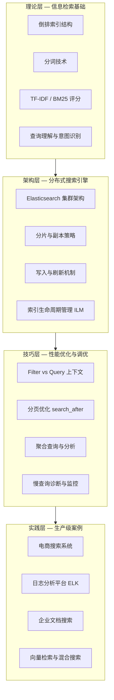

## 本章小结

本章从倒排索引这一核心数据结构出发，系统性地构建了搜索引擎的完整知识体系。从理论基础到生产实践，从传统关键词检索到向量语义搜索，覆盖了搜索引擎开发与运维的全链路。以下是本章的核心脉络与关键收获。

---

### 知识体系总览

本章的知识结构可以归纳为"四层架构"，自底向上层层递进：



---

### 第一部分：理论基础回顾

#### 倒排索引——搜索引擎的心脏

倒排索引是几乎所有搜索引擎的核心数据结构。与正排索引（文档→词）相反，倒排索引建立了"词→文档列表"的映射关系，使得搜索引擎能够以接近 O(1) 的时间复杂度定位包含特定词项的所有文档。

构建过程分为四个阶段：

1. **预处理与分词**：将原始文档拆分为词项（Token），英文通过大小写归一化、停用词过滤、词干提取（Porter Stemmer / Snowball）完成；中文则依赖词典匹配（正向/逆向最大匹配）、统计模型（HMM/CRF）或深度学习（BiLSTM+CRF）实现
2. **词项归一化**：统一词形变体，确保"running"和"runs"被合并到同一词项下
3. **倒排列表构建**：为每个词项建立 Posting List，记录文档 ID、词频、位置信息、字段信息
4. **压缩存储**：通过差值编码（Delta Encoding）、PForDelta、Roaring Bitmap 等技术将 Posting List 压缩到原始大小的 10%-30%

> **关键认知**：倒排索引的压缩率直接影响索引大小和查询性能。在十亿级文档场景下，Roaring Bitmap 相比传统位图可节省 50% 以上的存储空间。

#### 分词技术——中文搜索的第一道关卡

中文分词是中文搜索引擎的核心挑战。本章对比了三代分词技术的演进路线：

| 代际 | 方法 | 代表算法 | 优势 | 局限 |
|------|------|----------|------|------|
| 第一代 | 基于词典 | FMM/BMM 最大匹配 | 简单高效 | 无法处理歧义和新词 |
| 第二代 | 统计模型 | HMM/CRF | 处理未登录词 | 特征工程复杂 |
| 第三代 | 深度学习 | BiLSTM+CRF / BERT | 语义理解能力强 | 训练成本高、推理慢 |

生产环境中，IK Analyzer 是 Elasticsearch 最常用的中文分词插件，推荐索引时使用 `ik_max_word`（最细粒度切分），搜索时使用 `ik_smart`（智能切分），两者配合可最大化召回率和精确度。

#### 评分算法——从 TF-IDF 到 BM25

相关性评分决定了搜索结果的排序质量。本章详细推导了两个核心算法：

**TF-IDF**：词频与逆文档频率的乘积。高频出现的词在当前文档中重要，但在全局文档中罕见的词更具区分度。

**BM25**：在 TF-IDF 基础上的重要改进。引入了两个关键机制：
- **词频饱和**：通过参数 k1 控制 TF 的增长上限，避免高频词过度影响评分
- **文档长度归一化**：通过参数 b 控制长文档的惩罚力度，避免长文档仅因包含更多词而获得高分

```python
def bm25_score(tf, doc_len, avg_doc_len, idf, k1=1.2, b=0.75):
    """BM25评分公式"""
    tf_norm = (tf * (k1 + 1)) / (tf + k1 * (1 - b + b * doc_len / avg_doc_len))
    return idf * tf_norm
```

生产调优建议：k1 范围通常在 1.2-2.0，b 值在 0.5-0.8。短文本场景（如标题搜索）可降低 b 值，长文本场景（如全文检索）可适当提高 k1。

---

### 第二部分：Elasticsearch 架构与核心机制

#### 集群架构与节点角色

Elasticsearch 的分布式架构基于主从模型，包含三类核心节点：

- **Master 节点**：负责集群状态管理、索引创建删除、分片分配。生产环境应部署 3 个专用 Master 节点（不承载数据），确保高可用
- **Data 节点**：承担数据存储和搜索执行。磁盘、内存、CPU 是核心资源瓶颈
- **Coordinating 节点**：接收客户端请求，将查询分发到相关分片，汇总结果后返回。多 Coordinating 节点可分散查询压力

#### 写入流程与近实时搜索

Elasticsearch 的写入流程体现了"写内存→异步刷盘"的经典设计：

1. 文档写入内存 Buffer
2. 每秒（默认 `refresh_interval=1s`）将 Buffer 刷新为新的 Segment，此时文档可被搜索到（近实时 NRT）
3. 每 30 分钟或 translog 达到阈值时，执行 Flush 将 Segment 持久化到磁盘，并清空 translog
4. 后台持续执行 Segment Merge，合并小 Segment 为大 Segment，清理已删除文档

> **核心洞察**：`refresh_interval` 是延迟与吞吐量的权衡杠杆。批量导入场景可设为 30s-60s 显著提升写入性能；实时搜索场景则需保持 1s。

#### 索引生命周期管理（ILM）

生产环境中，数据的生命周期管理至关重要。ILM 将索引生命周期分为四个阶段：


典型的 ILM 策略配置：

```json
{
  "policy": {
    "phases": {
      "hot": {
        "min_age": "0ms",
        "actions": {
          "rollover": { "max_size": "50GB", "max_age": "7d" },
          "set_priority": { "priority": 100 }
        }
      },
      "warm": {
        "min_age": "30d",
        "actions": {
          "shrink": { "number_of_shards": 1 },
          "forcemerge": { "max_num_segments": 1 },
          "set_priority": { "priority": 50 }
        }
      },
      "cold": { "min_age": "90d" },
      "delete": { "min_age": "365d", "actions": { "delete": {} } }
    }
  }
}
```

这种策略在日志场景中尤为重要——50GB/天的日志数据如果不用 ILM，一年将积累超过 18TB 的索引，而 ILM 可自动将冷数据压缩、热数据轮转，将存储成本降低 60% 以上。

---

### 第三部分：查询优化核心技巧

#### Filter vs Query——最容易被忽视的性能杠杆

这是 Elasticsearch 查询优化中最高回报率的知识点之一：

| 维度 | Query Context | Filter Context |
|------|--------------|----------------|
| 是否评分 | 是，计算相关性分数 | 否，仅做 yes/no 判断 |
| 结果缓存 | 不缓存 | 使用 bitset 缓存 |
| 典型场景 | 文本搜索、模糊匹配 | 范围过滤、精确值匹配、状态过滤 |
| 性能影响 | 计算开销大 | 首次慢，后续命中缓存极快 |

**实践原则**：将不需要评分的条件（时间范围、状态字段、分类筛选）全部放入 `filter` 子句，仅将需要文本相关性评分的条件放在 `must` / `should` 中。

#### 分页优化——告别深分页

`from/size` 分页在深分页场景下性能急剧恶化，因为每个分片都需要返回 `from + size` 条结果到协调节点再合并排序。当 `from=10000` 时，每个分片需扫描 10000 条记录。

推荐方案：
- **浅分页（前 1000 条）**：使用 `from/size`，简单直接
- **深分页（超过 1000 条）**：使用 `search_after`，基于上一页最后一条文档的排序值游标式翻页，避免全量扫描
- **数据导出/重建**：使用 `scroll` API（已废弃但仍可用），或更推荐 `slice + search_after` 组合实现并行导出

#### 聚合查询——从搜索到分析

Elasticsearch 的聚合能力使其不仅是搜索引擎，更是分析引擎：

- **Bucket Aggregation**：按字段值分桶（如按商品分类统计销量）
- **Metric Aggregation**：数值计算（平均价格、最大评分）
- **Pipeline Aggregation**：对聚合结果再聚合（如移动平均趋势线）

高频使用的 `cardinality` 聚合基于 HyperLogLog++ 算法，以极低内存消耗（~16KB/字段）实现亿级数据的基数估算。

---

### 第四部分：生产实战案例要点

#### 案例一：电商搜索系统

核心架构：MySQL → Canal（CDC）→ Kafka → Consumer → Elasticsearch

关键技术决策：
- 使用 IK + Pinyin 分析器支持拼音搜索和模糊匹配
- 多字段映射（`product_name` + `brand` + `category` + `description`）+ 不同权重
- `function_score` 综合 BM25 文本相关性、销量、评分、时间衰减进行排序

#### 案例二：日志分析平台

核心架构：Filebeat → Kafka → Logstash → Elasticsearch → Kibana（ELK Stack）

关键设计：
- ILM 策略管理日志生命周期（Hot 7天 → Warm 30天 → Cold 90天 → Delete 365天）
- Watcher 基于聚合指标（如错误率 > 5% 持续 5 分钟）触发告警
- `trace_id` + `span_id` 支持分布式链路追踪

#### 案例三：企业文档搜索

核心挑战：多格式文档（PDF、Word、Excel、PPT）的统一文本提取与检索

解决方案：
- Apache Tika 作为统一文本提取层
- 自定义字段映射：`title`（高权重）+ `author` + `content`（中权重）+ `create_time`
- 权限控制通过 `query_string` + 角色过滤实现文档级安全

---

### 第五部分：向量检索与语义搜索前沿

本章的理论延伸部分引入了搜索引擎的前沿演进方向——从关键词匹配到语义理解：

#### 向量检索技术栈

| 技术 | 原理 | 适用场景 |
|------|------|----------|
| HNSW | 分层图导航，O(logN) 近似搜索 | 低延迟在线查询 |
| IVF | 倒排文件索引 + 聚类中心 | 大规模批量检索 |
| PQ | 乘积量化压缩向量 | 内存受限场景 |
| IVF+PQ | 聚类 + 量化的组合 | 超大规模亿级数据 |
| LSH | 局部敏感哈希 | 高维稀疏特征 |

#### 混合检索策略

生产环境中，单一检索方式无法覆盖所有场景。混合检索将 BM25 关键词匹配与 Dense Embedding 语义搜索融合：

- **Reciprocal Rank Fusion (RRF)**：无需归一化分数，直接基于排名融合，公式为 `score = Σ 1/(k + rank_i)`
- **线性加权**：`final_score = α × BM25_score + β × dense_score`，权重通过离线评估调优

ES 8.x 已原生支持 `kNN + RRF` 查询，开箱即用。

#### 重排序（Re-ranking）

两阶段检索范式：先用轻量级检索器（BM25/HNSW）召回 Top-K 候选，再用 Cross-Encoder 精排。ColBERT 的 late-interaction 机制在精度与延迟之间取得了更好的平衡。

---

### 第六部分：七大常见误区与纠正

| 误区 | 错误做法 | 正确做法 |
|------|----------|----------|
| 将 ES 当关系型数据库 | 频繁更新、JOIN 查询 | ES 适合写入一次、多次查询的场景 |
| 分片数量过多 | 每个用户一个分片 | 单分片 10-50GB，总数控制在集群节点数的 3 倍以内 |
| 忽视 Mapping 设计 | 使用默认自动映射 | 提前定义字段类型、分词器、索引策略 |
| 盲目调整 boost 权重 | 凭感觉设置权重 | 通过 `explain` API 和离线评估 A/B 测试调优 |
| 缺少监控告警 | 出了问题才排查 | 部署 Prometheus + Grafana，配置慢查询日志和 Circuit Breaker |
| 忽视批量导入优化 | 逐条 index 写入 | 使用 `_bulk` API，调大 refresh_interval，导入后再恢复 |
| 低效查询模式 | 通配符前缀查询、正则表达式、深分页 | 使用精确匹配、search_after、预计算聚合 |

---

### 第七部分：关键公式与度量指标

#### 核心度量公式

| 指标 | 公式 | 含义与应用 |
|------|------|-----------|
| 吞吐量（Little 定律） | QPS = 并发数 / 平均延迟 | 容量规划基础，估算集群需要的节点数 |
| 可用性 | SLA = 正常时间 / 总时间 | 99.9% = 年停机 8.76h；99.99% = 年停机 52.6min |
| 尾延迟 | P99 = 排序后第 99 百分位值 | 比平均延迟更真实反映用户体验 |
| 容量规划 | QPS × 单次请求资源 = 总资源需求 | 指导集群扩容决策 |

#### 信息检索评价指标

| 指标 | 适用场景 | 核心思想 |
|------|----------|----------|
| Precision@K | 短列表质量评估 | Top-K 结果中有多少是相关的 |
| MAP | 多查询综合评估 | 各相关结果位置的平均精确率 |
| MRR | 单答案查询 | 第一个相关结果的排名倒数 |
| NDCG | 带相关性等级的评估 | 考虑相关性程度和位置的归一化累积增益 |

---

### 第八部分：最佳实践清单

**设计阶段：**
- [ ] 明确搜索场景的核心指标（延迟要求、QPS 目标、可用性 SLA）
- [ ] 选择合适的分词方案（英文 Stemmer + 中文 IK/自定义词典）
- [ ] 提前设计 Mapping（字段类型、分词器、是否需要向量字段）
- [ ] 规划分片策略（目标单分片 10-50GB，预留 20% 余量）
- [ ] 设计 ILM 策略（Hot/Warm/Cold/Delete 生命周期）

**实现阶段：**
- [ ] Filter 放过滤条件，Query 放文本搜索条件
- [ ] 深分页使用 search_after 替代 from/size
- [ ] 批量写入使用 `_bulk` API 并调大 refresh_interval
- [ ] 高频查询启用 request cache 和 fielddata cache
- [ ] 聚合查询注意 `fielddata` 和 `doc_values` 的内存消耗

**部署阶段：**
- [ ] Master/Data/Coordinating 节点角色分离
- [ ] 至少 3 个 Master 节点 + 每个分片 1 个副本
- [ ] 配置 Circuit Breaker 防止 OOM
- [ ] 开启慢查询日志（index.search.slowlog.threshold.query.warn: 5s）
- [ ] 部署 Prometheus Exporter + Grafana 监控面板

**运维阶段：**
- [ ] 定期检查集群健康状态（green/yellow/red）
- [ ] 监控 Segment 数量和 Merge 频率
- [ ] 分析慢查询日志，持续优化高频查询
- [ ] 使用 ESRally 定期进行性能基准测试
- [ ] 根据数据增长趋势提前规划扩容

---

### 第九部分：下一步学习建议

#### 深入方向

1. **源码阅读**：Elasticsearch 和 Lucene 源码是理解搜索引擎底层机制的最佳途径。重点阅读 `IndexWriter`、`DirectoryReader`、`IndexSearcher` 的核心逻辑
2. **学术论文**：BM25（Robertson et al., 1994）、HNSW（Malkov & Yashunin, 2016）、ColBERT（Khattab & Zaharia, 2020）等经典论文是理解算法本质的必读材料
3. **实践项目**：从搭建 3 节点 ES 集群开始，逐步构建完整的搜索系统（分词→索引→查询→排序→分析→监控）
4. **社区参与**：关注 Elasticsearch 官方博客、Elastic 社区、GitHub Issues，跟踪版本演进和新特性

#### 推荐资源

| 类型 | 资源 | 说明 |
|------|------|------|
| 书籍 | 《Elasticsearch 权威指南》(O'Reilly) | ES 开发者的经典参考 |
| 书籍 | 《深度搜索引擎》(Manning) | 搜索引擎架构与算法的深入解析 |
| 书籍 | 《信息检索导论》(Cambridge) | 搜索引擎理论基础的权威教材 |
| 文档 | Elasticsearch 官方文档 | 最权威的 API 参考和最佳实践 |
| 工具 | ESRally | 官方性能基准测试工具 |
| 工具 | Kibana Dev Tools | 在线查询调试和集群管理 |
| 社区 | Elastic Discuss | 官方技术社区 |
| 开源 | Faiss (Meta) | 向量检索库，支持多种 ANN 算法 |

---

### 思考题

1. **倒排索引**为什么能成为搜索引擎的核心数据结构？与数据库 B+ 树索引相比，在什么场景下倒排索引更具优势？

2. **IK 分词器**的 `ik_max_word` 和 `ik_smart` 两种模式在索引和搜索阶段分别应该使用哪个？为什么？

3. **BM25 参数 k1 和 b** 分别控制什么行为？如果要为一个"标题短、正文长"的文档集合设置参数，你会如何调整？

4. **Filter vs Query**的核心区别是什么？为什么 Filter 可以被缓存而 Query 不能？请举例说明一个电商搜索页面中哪些条件适合放 Filter，哪些适合放 Query。

5. **search_after** 如何解决深分页问题？与传统的 from/size 相比，它的优势和限制分别是什么？

6. **混合检索**（BM25 + 向量检索）相比单一检索方式有哪些优势？RRF 融合策略的核心思想是什么？

7. **分片数量**过多会带来哪些问题？在设计分片策略时，如何平衡并行度和资源开销？

8. **ILM 索引生命周期管理**在日志场景中的价值是什么？如果每天产生 50GB 日志，你会如何设计 Hot/Warm/Cold/Delete 的时间阈值？

---

### 本章知识图谱

本章所学知识与本书其他章节的关联：

| 本章知识点 | 关联章节 | 关联关系 |
|------------|----------|----------|
| 倒排索引 | 数据结构与算法 | 索引结构是搜索的基础 |
| Elasticsearch 分布式架构 | 分布式系统设计 | 分片、副本、一致性机制 |
| Kafka + Canal 数据管道 | 消息队列 | 数据同步的异步解耦方案 |
| ILM 生命周期管理 | 云原生与运维 | 自动化运维的最佳实践 |
| 向量检索与语义搜索 | AI 与推荐系统 | Embedding 技术的延伸应用 |
| 监控告警体系 | 可观测性 | 搜索系统可观测性的具体落地 |
| function_score 业务排序 | 推荐系统 | 个性化排序算法的工程实现 |

搜索引擎不是一个孤立的技术领域——它与分布式系统、数据管道、可观测性、AI 推荐等技术深度交织。掌握了搜索引擎的核心原理和工程实践，就为构建高性能、高可用的信息检索系统奠定了坚实基础。
