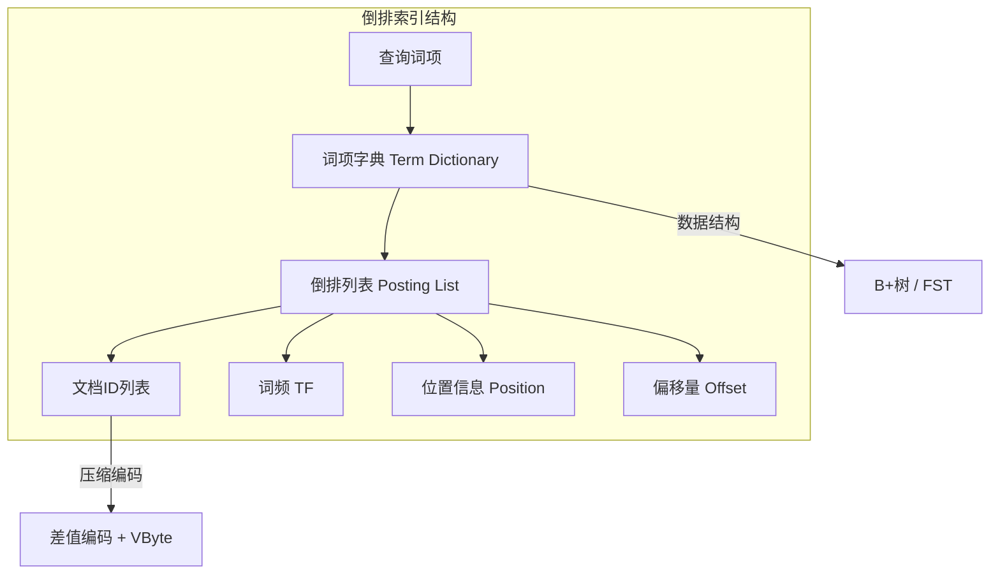
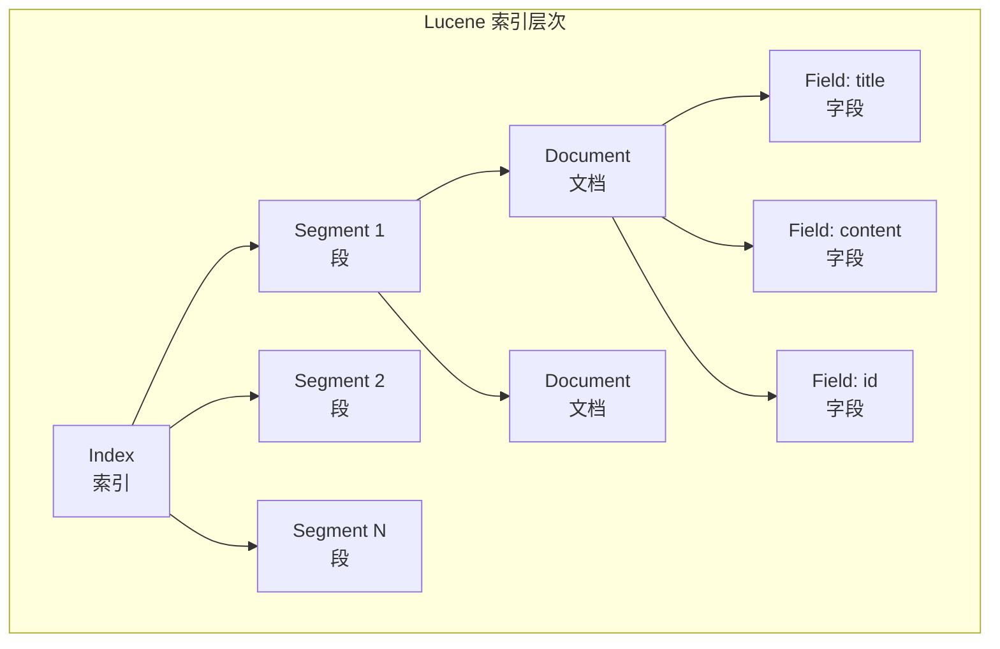
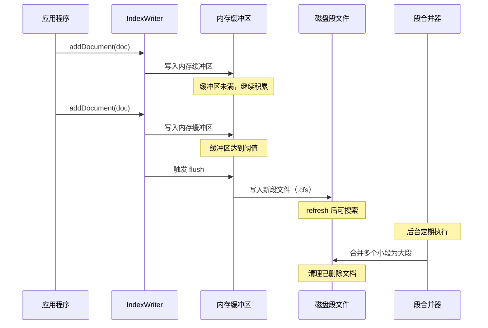
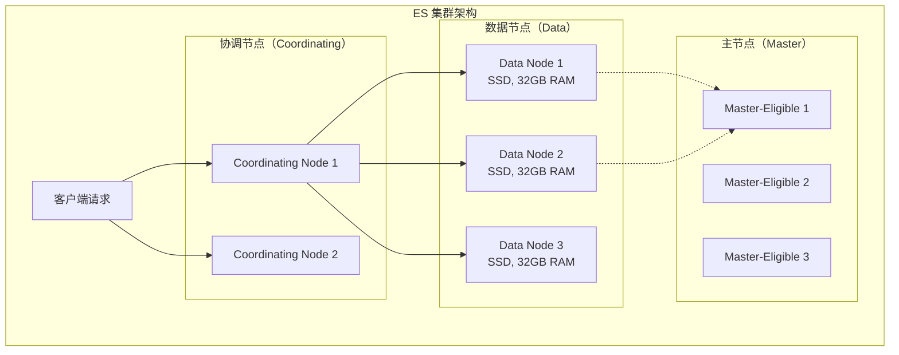
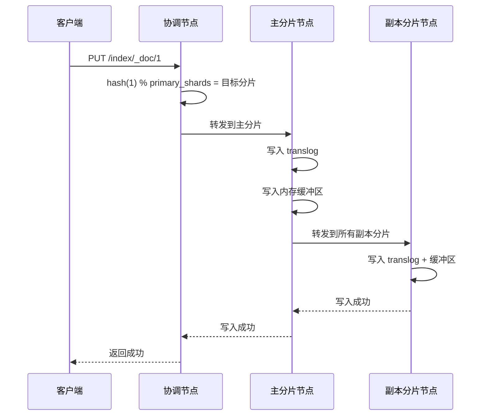

# 第39章 搜索引擎

搜索引擎是现代互联网应用中不可或缺的核心组件。从电商平台的商品搜索到运维体系的日志分析，从企业内部的全文检索到基于语义理解的智能搜索，搜索引擎在各种场景中扮演着关键角色。本章将系统地介绍搜索引擎的核心原理和实现技术，帮助读者建立从基础理论到工程实践的完整知识体系。

本章以 Elasticsearch 为核心展开，但搜索引擎的思想远不止于某一个工具。理解倒排索引、分词、相关性评分等底层原理，才能在面对不同技术选型时做出正确的判断，也才能在遇到性能瓶颈时找到真正的突破口。

---

## 本章结构

本章从搜索引擎的基础理论出发，逐步深入到工程实践，整体结构如下：

1. **理论基础**：倒排索引的原理与实现、分词技术、相关性评分算法（TF-IDF、BM25）
2. **搜索引擎生态**：Lucene、Elasticsearch、Solr 及新兴方案的技术对比
3. **核心技术**：Lucene 架构、Elasticsearch 架构、索引生命周期管理（ILM）、高级搜索功能
4. **向量搜索与混合搜索**：稠密向量检索、HNSW 索引、BM25 与向量的混合搜索
5. **查询优化**：Filter/Query 区别、字段控制、路由优化、分页策略、BM25 调优
6. **聚合分析**：Bucket/Metric/Pipeline 聚合
7. **监控与运维**：集群监控、慢查询分析、安全配置
8. **实战案例**：电商搜索、日志平台、企业文档搜索
9. **常见误区与练习**：七个典型误区及六个动手练习

---

## 学习目标

完成本章学习后，读者应当能够：

- **理解原理**：掌握倒排索引的结构与压缩机制，理解 Lucene 段模型和 Elasticsearch 分布式架构
- **掌握算法**：理解 TF-IDF 和 BM25 相关性评分的数学原理和参数调优方法
- **配置分词**：能够为中文和英文场景选择和配置合适的分词器，包括 IK、jieba 等工具
- **设计索引**：能够根据业务场景设计合理的 mapping、分片策略和 ILM 策略
- **优化查询**：掌握 filter 缓存、分页优化、自定义评分等查询优化手段
- **搭建平台**：能够搭建 ELK 日志平台，使用 ESRally 进行性能基准测试
- **评估质量**：理解 NDCG、MAP 等搜索质量评估指标，能够量化搜索效果

---

## 前置知识

学习本章需要具备以下基础知识：

- **数据结构**：哈希表、B+树、跳表等基本结构（与第6章"索引结构"互补）
- **文本处理**：字符编码、字符串匹配的基本概念
- **概率与统计**：条件概率、对数运算、调和平均等（用于理解 TF-IDF 和 BM25）
- **分布式系统**：一致性模型、分区策略等基本概念（与第12章"分布式系统"相关）
- **消息队列**：异步处理模式（与第8章"消息队列"中的 Canal/Kafka 架构相关）

如果读者已经学习了本书前面关于索引结构和分布式系统的章节，将能够更好地理解本章内容。

---

*** 

## 搜索引擎概述

### 什么是搜索引擎

搜索引擎是一种从非结构化或半结构化数据中查找信息的系统。与关系型数据库的精确查询不同，搜索引擎的核心目标是在海量文本中快速找到与用户查询最相关的结果，并按照相关性排序返回。

搜索引擎处理的核心问题包括：

- **索引**：如何将原始文档转化为可快速检索的数据结构？
- **匹配**：如何判断一个文档是否与用户查询相关？
- **排序**：如何将匹配的文档按照相关性从高到低排列？
- **效率**：如何在毫秒级延迟内从数十亿文档中返回结果？

### 搜索引擎的发展历程

搜索引擎的技术演进可以分为三个阶段：

**第一阶段：关键词匹配（1990s-2000s）**。早期的搜索引擎基于简单的关键词匹配和 TF-IDF 评分。 AltaVista 和早期的 Google 使用倒排索引实现了高效的关键词检索。这一阶段的核心突破是 PageRank 算法——通过分析网页间的链接关系来评估页面的重要性。

**第二阶段：分布式搜索（2000s-2010s）**。随着互联网数据量的爆发，单机搜索引擎无法满足需求。Nutch/Hadoop 生态系统出现了分布式爬虫和索引方案。2010 年 Elasticsearch 发布，基于 Lucene 提供了开箱即用的分布式搜索能力，迅速成为业界标准。

**第三阶段：语义搜索与 AI 融合（2020s-至今）**。传统关键词搜索无法理解用户意图（如搜索"便宜的手机"无法理解"便宜"的语义）。随着 BERT、GPT 等大语言模型的发展，向量搜索（Dense Retrieval）和混合搜索（Hybrid Search）成为新趋势。Elasticsearch 8.x 已原生支持 kNN 向量搜索，标志着搜索引擎进入了语义理解时代。

### 主流搜索引擎技术对比

| 特性 | Elasticsearch | Solr | Meilisearch | Typesense | Apache Lucene |
|:---|:---|:---|:---|:---|:---|
| **架构** | 分布式 REST API | 分布式 REST API | 单机/集群 | 单机/集群 | 嵌入式库 |
| **底层引擎** | Lucene | Lucene | 自研（Rust） | 自研（C++） | 自研（Java） |
| **向量搜索** | 原生 kNN 支持 | 有限支持 | 不支持 | 支持 | 不支持 |
| **中文分词** | IK、jieba 插件 | SmartCN 插件 | 内置有限支持 | 不支持 | 需自行集成 |
| **实时性** | 近实时（1s refresh） | 近实时 | 近实时 | 近实时 | N/A（嵌入式） |
| **适用场景** | 大规模搜索+分析 | 传统企业搜索 | 轻量即时搜索 | 轻量即时搜索 | 需要深度定制 |
| **学习曲线** | 中等 | 中等 | 低 | 低 | 高 |

选择建议：中小项目需要即时搜索体验可考虑 Meilisearch 或 Typesense；需要全文搜索+数据分析一体化的场景选 Elasticsearch；对搜索有深度定制需求的项目可直接基于 Lucene 二次开发。

---

*** 

# 理论基础

## 倒排索引

倒排索引（Inverted Index）是搜索引擎的核心数据结构，它将文档中的词项（Term）映射到包含该词项的文档列表。与正向索引（从文档到词项的映射）相比，倒排索引能够快速找到包含特定词项的所有文档，这是搜索引擎能够实现快速全文检索的关键。

### 正向索引 vs 倒排索引

理解倒排索引的最好方式是与正向索引对比。假设有三个文档：

- 文档 1："搜索引擎技术"
- 文档 2："搜索引擎原理"
- 文档 3："分布式存储技术"

**正向索引**（Document → Terms）：

文档 1 → [搜索, 引擎, 技术]
文档 2 → [搜索, 引擎, 原理]
文档 3 → [分布式, 存储, 技术]

**倒排索引**（Term → Documents）：

搜索   → [1, 2]
引擎   → [1, 2]
技术   → [1, 3]
原理   → [2]
分布式 → [3]
存储   → [3]

当用户搜索"搜索 技术"时，系统分别查找"搜索"的倒排列表 [1, 2] 和"技术"的倒排列表 [1, 3]，然后求交集得到文档 1。这个过程的时间复杂度取决于倒排列表的长度和交集算法，而非文档总数——这正是倒排索引高效的原因。

### 倒排索引的内部结构

一个完整的倒排索引由三部分组成：



**词项字典（Term Dictionary）** 存储文档集合中所有不重复的词项，支持快速查找。在 Lucene 中，词项字典使用 FST（Finite State Transducer，有限状态转换器）实现，它比 B+树更节省内存，同时支持前缀查询和范围查询。FST 可以看作一种压缩的 trie 树，将公共前缀合并，显著减少存储空间。

**倒排列表（Posting List）** 存储包含每个词项的文档信息，包含四个核心字段：

| 字段 | 说明 | 用途 |
|:---|:---|:---|
| 文档 ID（DocID） | 包含该词项的文档编号 | 结果检索 |
| 词频（TF） | 词项在文档中出现的次数 | 相关性评分（TF-IDF/BM25） |
| 位置（Position） | 词项在文档中的位置序列 | 短语查询、高亮显示 |
| 偏移量（Offset） | 词项在原始文本中的字符偏移 | 高亮显示的精确标注 |

**跳表（Skip List）** 是倒排列表的辅助索引结构，用于加速交集运算。当两个倒排列表进行交集操作时，跳表允许算法跳过大量不可能匹配的文档 ID，将时间复杂度从 O(m+n) 降低到接近 O(m+n)/k（k 为跳表间隔）。

### 倒排索引的压缩

倒排索引的压缩是搜索引擎的核心优化技术。一个拥有 10 亿文档的搜索引擎，仅文档 ID 列表就可能占用数百 GB 存储空间。高效的压缩算法可以将存储需求降低一个数量级。

**差值编码（Delta Encoding）** 是最基础的压缩方法。由于倒排列表中的文档 ID 通常是递增的，存储差值比存储原始值更高效。例如，文档 ID 序列 [5, 8, 15, 23, 31] 的差值编码为 [5, 3, 7, 8, 8]，最大值从 31 降低到 8，需要的比特位从 5 位降低到 4 位。

**变长编码（Variable-Length Byte Encoding, VByte）** 将差值编码的结果进一步压缩。每个字节的最高位作为标志位，0 表示后续还有字节，1 表示这是最后一个字节。例如，差值 15 编码为 00001111（单字节），差值 200 编码为 00000001 11001000（双字节）。

**PForDelta 算法** 是一种更高级的压缩方案，它是 Lucene 默认使用的压缩算法。PForDelta 的核心思想是：大多数差值只需要少量比特位表示，只有少数异常大的差值需要更多位。算法将差值按固定比特位 b 分为"正常值"和"异常值"，正常值连续存储，异常值单独存储并用比特位图标记位置。这种方式在压缩率和解压速度之间取得了很好的平衡。

下表展示了不同压缩算法的效果对比（以 100 万个递增文档 ID 为例）：

| 压缩算法 | 原始大小 | 压缩后大小 | 压缩率 | 解压速度 |
|:---|:---|:---|:---|:---|
| 无压缩（32位整数） | 4 MB | 4 MB | 1:1 | 极快 |
| 差值编码 + VByte | 4 MB | ~1.2 MB | 3.3:1 | 快 |
| PForDelta | 4 MB | ~0.8 MB | 5:1 | 中等 |
| Simple-9 | 4 MB | ~0.75 MB | 5.3:1 | 中等 |

### 倒排索引的构建流程

倒排索引的构建包括以下步骤：

1. **分词**：将文档内容切分为词项（Token）
2. **标准化**：对词项进行统一处理——转小写、去除停用词、词干提取、同义词展开
3. **索引写入**：将标准化后的词项添加到倒排索引中，更新词项字典和倒排列表
4. **段合并**：定期将多个小段合并为一个大段，同时清理已删除的文档

### 倒排索引的 Python 实现

```python
from collections import defaultdict
import math


class InvertedIndex:
    """一个完整的倒排索引实现，支持词频统计和位置记录"""
    
    def __init__(self, tokenizer=None):
        self.index = defaultdict(list)   # term -> [posting]
        self.documents = {}              # doc_id -> raw content
        self.doc_count = 0
        self.tokenizer = tokenizer or self._default_tokenizer
    
    def _default_tokenizer(self, text):
        """默认分词器：按空格分词，转小写"""
        return [t.lower() for t in text.split() if t.strip()]
    
    def add_document(self, doc_id, content):
        """添加文档到索引"""
        self.documents[doc_id] = content
        self.doc_count += 1
        terms = self.tokenizer(content)
        
        # 记录每个词项在文档中的位置
        term_positions = defaultdict(list)
        for position, term in enumerate(terms):
            term_positions[term].append(position)
        
        # 构建倒排列表条目
        for term, positions in term_positions.items():
            posting = {
                'doc_id': doc_id,
                'tf': len(positions),          # 词频
                'positions': positions,         # 位置信息
            }
            self.index[term].append(posting)
    
    def search(self, query, top_k=10):
        """搜索包含查询词项的文档，返回按 TF-IDF 排序的结果"""
        query_terms = self.tokenizer(query)
        if not query_terms:
            return []
        
        # 收集每个查询词项匹配的文档及其 TF
        doc_scores = defaultdict(float)
        
        for term in query_terms:
            if term not in self.index:
                continue
            
            # 计算 IDF
            df = len(self.index[term])
            idf = math.log(self.doc_count / (1 + df))
            
            for posting in self.index[term]:
                # TF-IDF 评分
                tf = posting['tf']
                tf_weight = 1 + math.log(tf) if tf > 0 else 0
                doc_scores[posting['doc_id']] += tf_weight * idf
        
        # 按得分排序返回
        results = sorted(doc_scores.items(), key=lambda x: -x[1])
        return results[:top_k]
    
    def phrase_search(self, phrase):
        """短语搜索：查找包含连续词项序列的文档"""
        query_terms = self.tokenizer(phrase)
        if len(query_terms) < 2:
            return self.search(phrase)
        
        # 获取第一个词项的倒排列表
        if query_terms[0] not in self.index:
            return []
        
        candidates = {
            p['doc_id']: p['positions']
            for p in self.index[query_terms[0]]
        }
        
        # 逐词验证位置连续性
        for term in query_terms[1:]:
            if term not in self.index:
                return []
            
            term_docs = {
                p['doc_id']: set(p['positions'])
                for p in self.index[term]
            }
            
            new_candidates = {}
            for doc_id, prev_positions in candidates.items():
                if doc_id not in term_docs:
                    continue
                # 检查是否存在位置差为1的匹配
                current_positions = term_docs[doc_id]
                valid_positions = [
                    pos for pos in prev_positions
                    if (pos + 1) in current_positions
                ]
                if valid_positions:
                    new_candidates[doc_id] = [p + 1 for p in valid_positions]
            
            candidates = new_candidates
        
        return list(candidates.keys())


# 使用示例
index = InvertedIndex()
index.add_document(1, "搜索引擎技术详解")
index.add_document(2, "搜索引擎原理分析")
index.add_document(3, "分布式存储技术")

# 全文搜索
results = index.search("搜索 技术")
print("搜索 '搜索 技术' 的结果:", results)
# [(1, 相关性得分)]

# 短语搜索
results = index.phrase_search("搜索引擎")
print("短语搜索 '搜索引擎' 的结果:", results)
# [1, 2]
```

这个实现展示了倒排索引的核心思想：将文档内容转化为词项到文档的映射，通过词频和位置信息支持相关性评分和短语查询。

---

## 分词技术

分词（Tokenization）是将文本切分为词项的过程，是搜索引擎的基础环节。分词的质量直接决定了搜索结果的准确性——分词不准，后续的评分和排序做得再好也无法弥补。

### 英文分词

英文分词相对简单，因为空格和标点符号是天然的词边界。但完整的英文分词流程需要处理以下问题：

**1. 大小写转换**。将所有字符统一转为小写，避免 "Apple" 和 "apple" 被当作不同词项。Lucene 的 StandardAnalyzer 默认执行此操作。

**2. 标点符号处理**。句号、逗号、括号等标点需要作为分隔符或直接去除。但某些标点有语义价值（如连字符 "state-of-the-art"），需要特殊处理。

**3. 停用词过滤**。英语中的 "the"、"is"、"at"、"which" 等虚词出现频率极高但缺乏区分能力，通常会被过滤掉。但停用词过滤并非总是有益的——对于短查询（如 "to be or not to be"），去除停用词会导致查询语义丢失。现代搜索引擎通常在索引时保留停用词，仅在查询时根据上下文决定是否过滤。

**4. 词干提取（Stemming）**。将词的不同形态归一化为同一形式。例如 "running"、"runs"、"ran" → "run"。最常用的算法是 Porter Stemmer，它通过一系列规则将词尾逐步削减。词干提取是基于规则的启发式方法，可能产生非词（如 "running" → "run" 是正确的，但 "studies" → "studi" 并非真正的英文单词）。

**5. 词形还原（Lemmatization）**。与词干提取类似但更精确，它基于词典将词还原为标准形式（如 "better" → "good"、"studies" → "study"）。词形还原需要词性标注，计算开销更大。

```python
from nltk.tokenize import word_tokenize
from nltk.stem import PorterStemmer, WordNetLemmatizer
from nltk.corpus import stopwords
import nltk

# 确保下载所需资源
# nltk.download('punkt')
# nltk.download('stopwords')
# nltk.download('wordnet')
# nltk.download('averaged_perceptron_tagger')


def english_tokenize(text, use_stemming=True, remove_stopwords=True):
    """
    完整的英文分词流程：
    转小写 → 分词 → 去标点 → 去停用词 → 词干提取/词形还原
    """
    # 转小写
    text = text.lower()
    
    # 分词
    tokens = word_tokenize(text)
    
    # 去除标点和非字母字符
    tokens = [t for t in tokens if t.isalpha()]
    
    # 去除停用词
    if remove_stopwords:
        stop_words = set(stopwords.words('english'))
        tokens = [t for t in tokens if t not in stop_words]
    
    # 词干提取
    if use_stemming:
        stemmer = PorterStemmer()
        tokens = [stemmer.stem(t) for t in tokens]
    
    return tokens


# 对比词干提取和词形还原
def compare_approaches(text):
    tokens = word_tokenize(text.lower())
    stemmer = PorterStemmer()
    lemmatizer = WordNetLemmatizer()
    
    print(f"原始词:   {tokens}")
    print(f"词干提取: {[stemmer.stem(t) for t in tokens]}")
    print(f"词形还原: {[lemmatizer.lemmatize(t) for t in tokens]}")


# 示例
text = "The quick brown foxes are jumping over the lazy dogs"
print("分词结果:", english_tokenize(text))
# 输出: ['quick', 'brown', 'fox', 'jump', 'lazy', 'dog']

compare_approaches("The studies were running better than studies")
# 原始词:   ['The', 'studies', 'were', 'running', 'better', 'than', 'studies']
# 词干提取: ['the', 'studi', 'were', 'run', 'better', 'than', 'studi']
# 词形还原: ['The', 'study', 'were', 'running', 'better', 'than', 'study']
```

### 中文分词

中文分词比英文分词复杂得多，因为中文没有天然的词边界。同一个字符串可能有多种合法的切分方式：

- "南京市长江大桥" → "南京市/长江大桥" 或 "南京/市长/江大桥"
- "结合成分子" → "结合/成分/子" 或 "结/合成/分子"

这种歧义问题是中文分词的核心挑战之一。

**基于词典的分词** 使用预先构建的词典来识别词边界。核心算法包括：

- **正向最大匹配（FMM）**：从左到右扫描文本，每次匹配词典中最长的词。实现简单，但对歧义处理不佳。
- **逆向最大匹配（BMM）**：从右到左扫描，每次匹配最长词。对某些歧义（如"南京市长江大桥"）的切分效果优于 FMM。
- **双向最大匹配（BiMM）**：同时使用 FMM 和 BMM，选择切分词数更少的结果；词数相同则选择单字更少的结果。

**基于统计的分词** 利用语料库中的统计规律来识别词边界。核心模型包括：

- **HMM（隐马尔可夫模型）**：将每个字的词性（B-词首、M-词中、E-词尾、S-单字词）建模为隐状态序列，通过 Viterbi 算法求解最可能的状态序列。jieba 分词的底层就使用了 HMM 来处理未登录词。
- **CRF（条件随机场）**：比 HMM 更强大，可以利用更丰富的上下文特征。Java 中的 HanLP 分词器基于 CRF 实现。

**基于深度学习的分词** 使用神经网络自动学习特征。BiLSTM+CRF 是目前最主流的方案：BiLSTM 层捕获上下文信息，CRF 层确保输出标签序列的合法性。这种方式在 SIGHAN 等中文分词评测中取得了最优结果。

### 主流中文分词工具对比

| 工具 | 语言 | 算法 | 速度 | 准确率 | 未登录词识别 | ES 集成 |
|:---|:---|:---|:---|:---|:---|:---|
| **jieba** | Python | 词典+HMM | 快 | 高 | 支持 | 需自行封装 |
| **IK Analyzer** | Java | 词典+规则 | 快 | 高 | 有限 | 官方插件 |
| **HanLP** | Java | CRF/DNN | 中 | 极高 | 强 | 需自行封装 |
| **HanLP (Python)** | Python | CRF/DNN | 中 | 极高 | 强 | 需自行封装 |
| **THULAC** | Java/Python | 词典+线性模型 | 快 | 高 | 支持 | 需自行封装 |

对于 Elasticsearch 用户，IK Analyzer 是最常用的选择，因为它提供了开箱即用的插件支持。对于需要更高准确率的场景（如医疗、法律等专业领域），可以考虑 HanLP。

### jieba 分词详解

```python
import jieba
import jieba.posseg as pseg


def demonstrate_jieba():
    """展示 jieba 分词的三种模式"""
    text = "搜索引擎技术是互联网的核心技术之一"
    
    # 1. 精确模式：最细粒度的切分，适合文本分析
    words_exact = jieba.lcut(text, cut_all=False)
    print(f"精确模式: {words_exact}")
    # ['搜索引擎', '技术', '是', '互联网', '的', '核心', '技术', '之一']
    
    # 2. 全模式：扫描所有可能的词语，速度快但有冗余
    words_full = jieba.lcut(text, cut_all=True)
    print(f"全模式:   {words_full}")
    # ['搜索', '搜索引擎', '引擎', '技术', '搜索引', ...]
    
    # 3. 搜索引擎模式：在精确模式的基础上对长词再次切分
    words_search = jieba.lcut_for_search(text)
    print(f"搜索模式: {words_search}")
    # ['搜索', '引擎', '搜索引擎', '技术', ...]
    
    # 4. 带词性标注的分词
    words_with_pos = pseg.lcut(text)
    for word, flag in words_with_pos:
        print(f"  {word} ({flag})", end="")
    print()
    # 搜索引擎(n) 技术(n) 是(v) 互联网(n) 的(ul) 核心(n) 技术(n) 之一(r)


def customize_dict():
    """自定义词典演示"""
    # 添加领域专有名词
    jieba.add_word("倒排索引", freq=10000, tag="n")
    jieba.add_word("分词器", freq=8000, tag="n")
    jieba.add_word("BM25", freq=5000, tag="eng")
    
    # 从文件加载自定义词典
    # jieba.load_userdict("my_dict.txt")
    # 词典文件格式: 词语 词频 词性
    # 倒排索引 10000 n
    # 分词器 8000 n
    
    text = "BM25是倒排索引中常用的分词器评分算法"
    print(f"自定义词典分词: {jieba.lcut(text)}")
    # ['BM25', '是', '倒排索引', '中', '常用', '的', '分词器', '评分', '算法']


demonstrate_jieba()
customize_dict()
```

### 分词质量评估

分词质量的评估指标包括：

- **准确率（Precision）**：分词结果中正确词项的比例。准确率 = 正确切分的词数 / 总切分词数
- **召回率（Recall）**：文本中所有正确词项被识别出来的比例。召回率 = 正确切分的词数 / 金标准词数
- **F1 值**：准确率和召回率的调和平均，F1 = 2 × P × R / (P + R)

在实际工程中，分词质量的评估通常采用 SIGHAN Bakeoff 等公开评测数据集。对于垂直领域（如医疗、法律），建议构建领域专用的评测集。

---

## 相关性评分算法

相关性评分是搜索引擎的核心——它决定了哪些文档排在前面、哪些排在后面。评分算法的优劣直接决定用户体验。

### TF-IDF

TF-IDF（Term Frequency - Inverse Document Frequency）是一种经典的相关性评分算法，其核心思想是：**一个词项在当前文档中出现频率越高，同时在所有文档中出现得越少，它对这个文档的区分能力就越强**。

**词频 TF（Term Frequency）** 表示词项在文档中出现的频率。常见的 TF 计算方式有：

| 计算方式 | 公式 | 特点 |
|:---|:---|:---|
| 原始词频 | TF = 词项出现次数 | 词频越高得分越高，无上限 |
| 对数词频 | TF = 1 + log(词频) | 抑制高频词的影响 |
| 布尔词频 | TF = 1（出现）或 0（未出现） | 只关心是否出现 |

**逆文档频率 IDF（Inverse Document Frequency）** 表示词项的稀有程度：

IDF = log(文档总数 / 包含该词项的文档数)

例如，在 1000 个文档中，"的" 出现在 990 个文档中，IDF = log(1000/990) ≈ 0.01，几乎无区分能力；"倒排索引" 出现在 5 个文档中，IDF = log(1000/5) ≈ 5.3，具有很强的区分能力。

**TF-IDF = TF × IDF**，即词频和逆文档频率的乘积。一个查询与文档的相关性得分是查询中每个词项的 TF-IDF 之和。

### BM25

BM25（Best Matching 25）是 TF-IDF 的改进版本，由 Stephen Robertson 等人在 1990 年代提出，至今仍是信息检索领域最广泛使用的评分算法。Elasticsearch 的默认评分算法就是 BM25。

BM25 相比 TF-IDF 的两个核心改进：

**1. TF 饱和处理**。TF-IDF 中 TF 是线性增长的——一个词出现 100 次比出现 10 次贡献高 10 倍。但直觉上，一个词出现 10 次和 100 次的区别应该远小于出现 1 次和 10 次的区别。BM25 使用饱和函数解决了这个问题：

TF_saturated = (tf × (k1 + 1)) / (tf + k1)

当 tf → ∞ 时，TF_saturated → (k1 + 1)，即 TF 的贡献有上限。参数 k1 控制饱和速度：k1 越小饱和越快（TF 的边际递减越明显），k1 越大越接近线性。默认 k1 = 1.2。

**2. 文档长度归一化**。长文档因为包含更多词项，天然会在更多查询上匹配。BM25 引入了文档长度归一化因子：

length_norm = (1 - b + b × |D| / avgdl)

其中 |D| 是文档长度，avgdl 是平均文档长度，b 控制归一化强度。b = 1 表示完全按长度归一化（长文档惩罚最大），b = 0 表示不归一化。默认 b = 0.75。

**BM25 完整公式**：

score(D, Q) = Σ IDF(qi) × [ f(qi, D) × (k1 + 1) ] / [ f(qi, D) + k1 × (1 - b + b × |D|/avgdl) ]

其中 f(qi, D) 是词项 qi 在文档 D 中的词频，IDF(qi) 通常使用 Robertson-Sparck Jones IDF：

IDF(qi) = log[(N - n(qi) + 0.5) / (n(qi) + 0.5) + 1]

N 是文档总数，n(qi) 是包含词项 qi 的文档数。+1 防止 IDF 为负值。

### TF-IDF 与 BM25 的对比

| 特性 | TF-IDF | BM25 |
|:---|:---|:---|
| TF 处理 | 线性（或对数） | 饱和函数，有上限 |
| 文档长度归一化 | 无（或简单除法） | 参数化归一（b 参数） |
| 参数数量 | 0 | 2（k1, b） |
| 对长文档的处理 | 不公平（长文档得分偏高） | 自动归一化 |
| 在 ES 中 | 已弃用 | 默认算法 |
| 适用性 | 简单场景 | 大多数搜索场景 |

### 评分算法的 Python 实现

```python
import math
from collections import Counter


class TFIDFScorer:
    """TF-IDF 相关性评分实现"""
    
    def __init__(self, documents):
        """
        documents: list of list of tokens
        """
        self.documents = documents
        self.doc_count = len(documents)
        self.doc_freq = self._calculate_doc_freq()
    
    def _calculate_doc_freq(self):
        """计算每个词项的文档频率"""
        df = Counter()
        for doc in self.documents:
            for term in set(doc):  # 每篇文档只计一次
                df[term] += 1
        return df
    
    def calculate_tf(self, term, document):
        """计算 TF：使用对数词频"""
        count = Counter(document).get(term, 0)
        return 1 + math.log(count) if count > 0 else 0
    
    def calculate_idf(self, term):
        """计算 IDF"""
        if term not in self.doc_freq:
            return 0
        return math.log(self.doc_count / self.doc_freq[term])
    
    def score(self, query_terms, document):
        """计算查询与文档的相关性得分"""
        return sum(
            self.calculate_tf(term, document) * self.calculate_idf(term)
            for term in query_terms
        )


class BM25Scorer:
    """BM25 相关性评分实现"""
    
    def __init__(self, documents, k1=1.2, b=0.75):
        """
        documents: list of list of tokens
        k1: 词频饱和参数，越大越接近线性 TF（默认 1.2）
        b:  文档长度归一化参数，0=不归一化，1=完全归一化（默认 0.75）
        """
        self.documents = documents
        self.k1 = k1
        self.b = b
        self.doc_count = len(documents)
        self.avgdl = sum(len(doc) for doc in documents) / self.doc_count
        self.doc_freq = self._calculate_doc_freq()
    
    def _calculate_doc_freq(self):
        df = Counter()
        for doc in self.documents:
            for term in set(doc):
                df[term] += 1
        return df
    
    def calculate_idf(self, term):
        """Robertson-Sparck Jones IDF"""
        if term not in self.doc_freq:
            return 0
        n = self.doc_freq[term]
        return math.log((self.doc_count - n + 0.5) / (n + 0.5) + 1)
    
    def score(self, query_terms, document):
        """计算查询与文档的 BM25 得分"""
        total_score = 0
        word_count = Counter(document)
        doc_len = len(document)
        
        for term in query_terms:
            if term not in word_count:
                continue
            
            tf = word_count[term]
            idf = self.calculate_idf(term)
            
            # BM25 TF 饱和处理
            tf_component = (tf * (self.k1 + 1)) / (
                tf + self.k1 * (1 - self.b + self.b * doc_len / self.avgdl)
            )
            
            total_score += idf * tf_component
        
        return total_score


# 使用示例
docs = [
    ["搜索", "引擎", "技术", "详解"],
    ["搜索", "引擎", "原理", "分析"],
    ["分布式", "存储", "技术"],
]

query = ["搜索", "技术"]

tfidf = TFIDFScorer(docs)
bm25 = BM25Scorer(docs)

for i, doc in enumerate(docs):
    t_score = tfidf.score(query, doc)
    b_score = bm25.score(query, doc)
    print(f"文档{i+1}: TF-IDF={t_score:.4f}, BM25={b_score:.4f}")
# 文档1: TF-IDF=0.4394, BM25=0.6795  (包含两个查询词，得分最高)
# 文档2: TF-IDF=0.2197, BM25=0.3150  (只包含"搜索")
# 文档3: TF-IDF=0.2197, BM25=0.3150  (只包含"技术")
```

### BM25 参数调优指南

BM25 的参数 k1 和 b 对搜索结果有直接影响。下表给出不同场景的推荐值：

| 场景 | k1 推荐值 | b 推荐值 | 理由 |
|:---|:---|:---|:---|
| 默认场景 | 1.2 | 0.75 | Elasticsearch 默认值 |
| 短文本（标题、标签） | 0.9-1.0 | 0.1-0.3 | 短文本长度差异小，减少归一化 |
| 长文本（文章、日志） | 1.4-1.8 | 0.7-0.9 | 长文本需要更强的 TF 区分度 |
| 精确匹配优先 | 0.5-0.8 | 0.3-0.5 | 快速饱和，减少 TF 影响 |
| 技术文档搜索 | 1.5-2.0 | 0.5-0.7 | 专业术语频率差异大 |

---

***

# 核心技术

## Lucene 架构

Lucene 是 Apache 基金会的开源全文检索引擎库，它是 Elasticsearch、Solr 等搜索引擎的底层引擎。理解 Lucene 的架构对于深入使用 Elasticsearch 至关重要——很多 ES 的性能问题最终都需要在 Lucene 层面找到答案。

### 索引层次结构

Lucene 的索引结构分为四个层次：



- **索引（Index）**：对应一个完整的搜索引擎实例，由多个段组成
- **段（Segment）**：索引的基本单位，每个段是一个独立的倒排索引
- **文档（Document）**：索引的基本单元，包含多个字段
- **字段（Field）**：文档的基本单元，包含字段名和字段值

### 段的不可变性

Lucene 的段一旦写入磁盘就**不可修改**。这是 Lucene 最重要的设计决策，它带来了一系列好处：

- **无需锁**：读操作不需要加锁，因为段文件不会被修改
- **高效缓存**：操作系统可以安全地将段文件缓存在内存中
- **压缩友好**：不可变意味着可以使用更激进的压缩算法
- **并发安全**：多个线程可以同时读取同一个段

但不可变性也带来了挑战：更新和删除操作需要特殊处理。

### Lucene 的写入流程



详细流程如下：

1. **写入内存缓冲区**：新文档首先写入内存中的 IndexBuffer。在 Elasticsearch 中，这一步到文档可搜索之间的间隔就是 `refresh_interval`（默认 1 秒），这也是"近实时"搜索的由来。

2. **Flush 生成新段**：当内存缓冲区达到阈值（默认 16MB），Lucene 将缓冲区的内容 flush 到磁盘，生成一个新的段文件。此时文档就可以被搜索到了。

3. **Commit 持久化**：执行 commit 操作将所有段文件同步到磁盘，并写入 commit point（记录当前所有有效段的列表）。Elasticsearch 的 translog 机制保证了在 commit 之前的数据也不会丢失。

4. **段合并（Segment Merge）**：Lucene 后台定期将多个小段合并为一个大段。合并过程中：
   - 标记为删除的文档被真正移除
   - 多个段的倒排索引被合并为一个
   - 合并后的段文件替换原始的小段文件

段合并是 Lucene 最耗 CPU 和 I/O 的操作。Lucene 默认使用 TieredMergePolicy 策略，它根据段的大小和数量决定何时合并。核心参数包括：

| 参数 | 默认值 | 说明 |
|:---|:---|:---|
| `maxMergeAtOnce` | 10 | 一次合并的最大段数 |
| `segmentsPerTier` | 10 | 每层的最大段数 |
| `maxMergedSegmentMB` | 5GB | 合并后段的最大大小 |

### Lucene 的字段类型

Lucene 提供了多种字段类型，每种类型针对不同的使用场景优化：

| 字段类型 | 是否索引 | 是否存储 | 是否分词 | 适用场景 |
|:---|:---|:---|:---|:---|
| StringField | ✓ | ✓ | ✗ | 精确匹配（ID、状态码） |
| TextField | ✓ | ✓ | ✓ | 全文搜索（标题、内容） |
| StoredField | ✗ | ✓ | ✗ | 仅存储，不搜索（文件路径） |
| NumericField | ✓ | ✓ | ✗ | 数值范围查询（价格、时间） |
| KeywordField | ✓ | ✓ | ✗ | 关键字过滤（分类、标签） |

---

## Elasticsearch 架构

Elasticsearch 是基于 Lucene 构建的分布式搜索引擎，它在 Lucene 之上提供了分布式搜索、集群管理、RESTful API 等能力。

### 节点与集群



**节点角色**：

- **主节点（Master Node）**：负责集群级别的管理操作——索引创建/删除、分片分配、节点加入/退出。主节点不处理数据操作，不应承担数据节点的负载。生产环境建议使用独立的主节点（`node.roles: [master]`）。
- **数据节点（Data Node）**：负责存储数据、执行搜索和索引操作。这是消耗资源最多的节点角色，需要足够的内存和磁盘空间。生产环境建议使用 SSD 并配置足够的 JVM 堆内存。
- **协调节点（Coordinating Node）**：负责接收客户端请求，将请求路由到合适的节点，汇总结果返回客户端。协调节点不存储数据，也不参与集群管理。在小规模集群中，数据节点可以同时承担协调角色。
- **摄入节点（Ingest Node）**：负责在索引文档之前对数据进行预处理（如解析、转换、 enrich）。

### 分片与副本

**分片（Shard）** 是索引的物理分割，每个分片是一个独立的 Lucene 索引。分片实现了索引的水平扩展——当单个节点无法容纳全部数据时，通过分片将数据分布到多个节点。

**副本（Replica）** 是分片的复制，有两个作用：
1. **高可用**：当主分片所在节点宕机时，副本分片可以提升为主分片
2. **性能提升**：搜索请求可以在主分片和副本分片上并行执行

分片数量在索引创建时确定，**之后不能修改**（除非使用 Reindex API 重建索引）。这个设计源于 Lucene 的段模型——每个分片对应一个独立的 Lucene 索引，重新分配分片需要重新构建整个索引。

### ES 的写入流程



### ES 的搜索流程

搜索是一个两阶段过程：

1. **Query 阶段**：协调节点将搜索请求发送到所有相关分片（主分片或副本分片），每个分片在本地执行查询，返回 top-K 结果的文档 ID 和排序值。
2. **Fetch 阶段**：协调节点合并所有分片的结果，全局排序后取 top-N，然后向对应的分片请求这 N 个文档的完整字段值。

这个两阶段设计的原因是：如果每个分片都返回完整文档，协调节点需要处理的数据量会非常大。先只传 ID（几个字节），再按需获取完整文档，可以显著减少网络传输。

### 分片策略

分片数量是 Elasticsearch 集群设计中最关键的决策之一。分片数量过多会导致集群管理开销增大；分片数量过少会限制存储容量和搜索并发度。

**经验法则**：

- 每个分片的大小控制在 10-50GB 之间
- 分片数量不超过数据节点数量的 3 倍
- 对于小索引，分片数量可以等于数据节点数量
- 考虑未来的数据增长，但不要过度预分配

例如，一个拥有 3 个数据节点、预计存储 100GB 数据的索引，建议设置 3-5 个主分片（每个 20-33GB）。

```json
PUT /my_index
{
  "settings": {
    "number_of_shards": 3,
    "number_of_replicas": 1,
    "refresh_interval": "30s",
    "translog.durability": "async",
    "translog.sync_interval": "30s"
  }
}
```

副本分片的数量根据业务需求调整。读多写少的场景可以增加副本数量（如 2-3 个）；写入密集型场景应减少副本数量（如 0-1 个），因为每个副本都会增加写入延迟。

---

## 索引生命周期管理（ILM）

随着数据量的增长，手动管理索引变得越来越困难。Elasticsearch 的 ILM（Index Lifecycle Management）功能可以自动化管理索引的完整生命周期。

### 四个阶段

ILM 将索引的生命周期分为四个阶段：


| 阶段 | 说明 | 典型操作 | 适用数据 |
|:---|:---|:---|:---|
| **Hot** | 处理频繁写入和搜索 | Rollover、设置优先级 | 最近 1-7 天的数据 |
| **Warm** | 处理只读数据 | Force Merge、Shrink、关闭 | 7-30 天的数据 |
| **Cold** | 存储历史数据 | Freeze、Searchable Snapshot | 30-90 天的数据 |
| **Delete** | 自动清理 | Delete | 超过 90 天的数据 |

### ILM 配置示例

```json
PUT _ilm/policy/logs_policy
{
  "policy": {
    "phases": {
      "hot": {
        "min_age": "0ms",
        "actions": {
          "rollover": {
            "max_age": "1d",
            "max_size": "50gb"
          },
          "set_priority": { "priority": 100 }
        }
      },
      "warm": {
        "min_age": "7d",
        "actions": {
          "forcemerge": { "max_num_segments": 1 },
          "shrink": { "number_of_shards": 1 },
          "set_priority": { "priority": 50 }
        }
      },
      "cold": {
        "min_age": "30d",
        "actions": {
          "freeze": {},
          "set_priority": { "priority": 0 }
        }
      },
      "delete": {
        "min_age": "90d",
        "actions": {
          "delete": {}
        }
      }
    }
  }
}
```

**配合 Rollover 实现自动索引轮转**：使用索引别名（Alias）和 Rollover API，可以实现每天（或达到大小阈值时）自动创建新索引。搜索请求通过别名查询所有索引，写入请求通过别名指向当前活跃索引。

```json
// 创建初始索引和别名
PUT /logs-000001
{
  "aliases": {
    "logs": {
      "is_write_index": true
    },
    "logs_search": {}
  }
}

// Rollover 创建新索引
POST /logs/_rollover
{
  "conditions": {
    "max_age": "1d",
    "max_size": "50gb"
  }
}
```

---

## 高级搜索功能

除了基本的全文搜索，Elasticsearch 还提供了多种高级搜索功能来提升搜索体验。

### 模糊搜索与拼写纠正

用户搜索时经常出现拼写错误（如将 "Elasticsearch" 拼成 "Elastcsearch"）。Elasticsearch 提供了多种容错机制：

**fuzzy 查询**基于编辑距离（Levenshtein Distance）实现模糊匹配。编辑距离是指将一个词变成另一个词所需的最少操作次数（插入、删除、替换）。

```json
GET /products/_search
{
  "query": {
    "fuzzy": {
      "title": {
        "value": "Elastcsearch",
        "fuzziness": 2,
        "max_expansions": 50
      }
    }
  }
}
```

`fuzziness` 参数控制最大编辑距离：0 表示精确匹配，1 表示允许 1 个字符的差异，2 表示允许 2 个字符的差异。对于超过 5 个字符的词，建议使用 `AUTO` 自动设置。

**match 查询的 operator 参数**也可以提供一定的容错能力。设置 `"operator": "or"` 时，只要查询中的部分词项匹配即可返回结果。

### 同义词配置

同义词可以让搜索引擎理解不同表述指向同一概念。例如，"手机" = "移动电话" = "智能手机"。

在 Elasticsearch 中，可以通过自定义分析器配置同义词：

```json
PUT /my_index
{
  "settings": {
    "analysis": {
      "filter": {
        "synonym_filter": {
          "type": "synonym",
          "synonyms": [
            "手机, 移动电话, 智能手机",
            "笔记本, 笔记本电脑, laptop",
            "人工智能, AI, 机器学习"
          ]
        }
      },
      "analyzer": {
        "synonym_analyzer": {
          "type": "custom",
          "tokenizer": "ik_max_word",
          "filter": ["lowercase", "synonym_filter"]
        }
      }
    }
  }
}
```

同义词配置的注意事项：
- 同义词在**索引时**展开还是在**搜索时**展开，效果不同。索引时展开会增加索引大小但搜索更快；搜索时展开索引更小但每次搜索需要动态计算。
- 同义词文件可以放在 config 目录下，通过 `"synonyms_path": "analysis/synonyms.txt"` 加载，便于动态更新。

### 自动补全与建议

自动补全（Autocomplete）是搜索框的基本功能，用户输入几个字符就能看到候选词。Elasticsearch 提供了两种实现方式：

**Completion Suggester** 使用 FST 数据结构，性能极高，适合前缀匹配：

```json
PUT /products
{
  "mappings": {
    "properties": {
      "title_suggest": {
        "type": "completion"
      }
    }
  }
}

// 索引文档时添加建议字段
POST /products/_doc/1
{
  "title": "Apple iPhone 15 Pro",
  "title_suggest": {
    "input": ["Apple iPhone", "iPhone 15", "苹果手机"],
    "weight": 10
  }
}

// 查询建议
GET /products/_search
{
  "suggest": {
    "title-suggest": {
      "prefix": "iph",
      "completion": {
        "field": "title_suggest",
        "size": 5
      }
    }
  }
}
```

**Edge Ngram 分词器**可以将词拆分为前缀序列，配合 match 查询实现自动补全。这种方式更灵活，支持部分匹配和模糊匹配。

### 高亮显示

高亮功能可以在搜索结果中标注匹配的文本片段，帮助用户快速定位相关信息：

```json
GET /products/_search
{
  "query": {
    "match": { "content": "搜索引擎技术" }
  },
  "highlight": {
    "fields": {
      "content": {
        "fragment_size": 150,
        "number_of_fragments": 3,
        "pre_tags": ["<em>"],
        "post_tags": ["</em>"]
      }
    }
  }
}
```

Elasticsearch 支持三种高亮器：
- **Unified Highlighter**（默认）：基于 Lucene 的 UnifiedHighlighter，支持多种查询类型
- **Plain Highlighter**：在内存中重新分析文档，适合小文档
- **Fast Vector Highlighter**：利用 term vector 加速，适合大文档和高亮字段多的场景

---

## 向量搜索与混合搜索

向量搜索（Vector Search）是近年来搜索引擎领域最重要的技术突破。传统关键词搜索基于词项匹配，无法理解语义（如搜索"便宜的手机"无法找到"高性价比手机"）。向量搜索通过将文本编码为稠密向量，在语义空间中计算相似度，实现了真正的语义理解。

### 什么是向量搜索

向量搜索的核心思想是：使用深度学习模型（如 BERT、Sentence-BERT、OpenAI Embedding）将文本转换为固定维度的向量（如 768 维或 1536 维），然后通过向量相似度（余弦相似度、内积等）来衡量文本间的语义相关性。

```mermaid
graph LR
    subgraph "传统关键词搜索"
        Q1[查询: 便宜手机] -->|分词| T1[便宜, 手机]
        D1[文档: 高性价比手机] -->|分词| T2[高, 性价比, 手机]
        T1 --> M1[词项匹配<br/>只有"手机"匹配]
    end
    subgraph "向量语义搜索"
        Q2[查询: 便宜手机] -->|Embedding| V1[0.23, -0.15, ...]
        D2[文档: 高性价比手机] -->|Embedding| V2[0.21, -0.12, ...]
        V1 --> M2[余弦相似度=0.92<br/>语义高度相关]
    end
```

### Elasticsearch 中的向量搜索

Elasticsearch 7.3+ 支持 `dense_vector` 字段类型，8.0+ 原生支持 kNN（k-Nearest Neighbors）搜索。

```json
// 创建包含向量字段的索引
PUT /products_v2
{
  "mappings": {
    "properties": {
      "title": {
        "type": "text",
        "analyzer": "ik_max_word"
      },
      "content": {
        "type": "text",
        "analyzer": "ik_max_word"
      },
      "title_vector": {
        "type": "dense_vector",
        "dims": 768,
        "index": true,
        "similarity": "cosine"
      },
      "category": {
        "type": "keyword"
      }
    }
  }
}

// kNN 向量搜索
GET /products_v2/_search
{
  "knn": {
    "field": "title_vector",
    "query_vector": [0.23, -0.15, 0.08, ...],
    "k": 10,
    "num_candidates": 100
  }
}
```

### HNSW 索引算法

直接暴力搜索向量的时间复杂度是 O(N×D)（N 为文档数，D 为向量维度），对于百万级数据不可接受。HNSW（Hierarchical Navigable Small World）是目前最主流的向量索引算法，它在 Elasticsearch 中是 `dense_vector` 字段的默认索引算法。

HNSW 的核心思想是构建一个多层的图结构：

- **底层（Layer 0）**：包含所有向量节点，每个节点与 M 个近邻相连
- **上层**：随机选择部分节点组成更稀疏的图，用于快速导航
- **搜索过程**：从最高层的入口节点开始，逐层向下搜索，每层执行贪心最近邻搜索

HNSW 的关键参数：
- `m`：每层的连接数，越大搜索精度越高但内存消耗越大（默认 16）
- `ef_construction`：构建时的搜索范围，越大索引质量越好但构建越慢（默认 100）
- `ef_search`：搜索时的搜索范围，越大精度越高但速度越慢（默认 50）

### 混合搜索（Hybrid Search）

混合搜索将传统的 BM25 关键词搜索与向量语义搜索结合，取两者之长。BM25 擅长精确关键词匹配，向量搜索擅长语义理解，混合使用可以获得最佳效果。

Elasticsearch 8.x 支持通过 `sub_searches` 或 `rank` API 实现混合搜索：

```json
// BM25 + 向量搜索的混合搜索
GET /products_v2/_search
{
  "sub_searches": [
    {
      "query": {
        "match": {
          "title": {
            "query": "便宜手机",
            "boost": 1.0
          }
        }
      }
    },
    {
      "knn": {
        "field": "title_vector",
        "query_vector": [0.23, -0.15, ...],
        "k": 10,
        "num_candidates": 100,
        "boost": 1.0
      }
    }
  ],
  "rank": {
    "rrf": {
      "window_size": 100,
      "rank_constant": 60
    }
  }
}
```

RRF（Reciprocal Rank Fusion）是一种简单而有效的分数融合方法：`score = Σ 1/(k + rank_i)`，其中 k 为常数（默认 60），rank_i 是文档在第 i 个子搜索中的排名。RRF 不需要归一化不同搜索源的分数，因此非常实用。

### 向量搜索的适用场景与局限

| 场景 | 向量搜索 | 关键词搜索 | 混合搜索 |
|:---|:---|:---|:---|
| 语义相似查询 | ✓ 强 | ✗ 弱 | ✓ 强 |
| 精确关键词匹配 | ✗ 弱 | ✓ 强 | ✓ 强 |
| 拼写纠错 | ✓ 有一定能力 | ✗ 弱 | ✓ 强 |
| 新词/专业术语 | ✗ 需训练 | ✓ 可配置词典 | ✓ 强 |
| 精确过滤 | ✗ 不适合 | ✓ term 查询 | ✓ 强 |
| 计算成本 | 高（需要 GPU） | 低 | 中等 |
| 可解释性 | 低（黑盒） | 高（词项匹配） | 中等 |

---

*** 

# 查询优化

## Filter 与 Query

在 Elasticsearch 的查询上下文中，`query` 和 `filter` 是两种不同的查询方式，理解它们的区别对性能优化至关重要。

| 特性 | Query 上下文 | Filter 上下文 |
|:---|:---|:---|
| 相关性评分 | 计算 `_score` | 不计算评分 |
| 缓存 | 不缓存 | 结果缓存到 bitset |
| 适用场景 | 全文搜索、模糊匹配 | 精确匹配、范围过滤 |
| 性能 | 较慢（需要评分计算） | 较快（可利用缓存） |

```json
// 不推荐：所有条件都放在 query 中
GET /products/_search
{
  "query": {
    "bool": {
      "must": [
        { "match": { "title": "手机" } },
        { "term": { "status": "active" } },
        { "range": { "price": { "gte": 1000, "lte": 5000 } } }
      ]
    }
  }
}

// 推荐：精确匹配条件放入 filter
GET /products/_search
{
  "query": {
    "bool": {
      "must": [
        { "match": { "title": "手机" } }
      ],
      "filter": [
        { "term": { "status": "active" } },
        { "range": { "price": { "gte": 1000, "lte": 5000 } } }
      ]
    }
  }
}
```

filter 条件的结果会被缓存到 bitset 中。后续相同的 filter 查询可以直接使用缓存结果，避免重复计算。对于不需要相关性评分的查询条件，都应该放在 filter 中。

---

## 字段选择与返回控制

在搜索请求中，控制返回的字段数量可以显著减少网络传输和内存消耗。

```json
// 只返回需要的字段
GET /products/_search
{
  "_source": ["title", "price", "category"],
  "query": {
    "match": { "title": "手机" }
  }
}

// 完全禁用源文档返回（只获取元数据）
GET /products/_search
{
  "_source": false,
  "query": {
    "match": { "title": "手机" }
  }
}
```

对于大文档（如包含完整内容的文章），使用 `_source` 过滤可以将响应大小从数十 KB 降低到数 KB。

---

## 路由优化

默认情况下，Elasticsearch 使用文档 ID 的哈希值来决定文档存储在哪个分片上。但在某些场景下，自定义路由可以显著提升查询性能。

**典型场景：多租户系统**。将租户 ID 作为路由值，确保同一租户的所有文档存储在同一个分片上。这样查询特定租户的数据时，只需要查询一个分片，而不是所有分片。

```json
// 使用自定义路由写入文档
PUT /my_index/_doc/1?routing=tenant_123
{
  "tenant_id": "tenant_123",
  "content": "这是一条租户数据"
}

// 使用路由查询（只查询目标分片）
GET /my_index/_search?routing=tenant_123
{
  "query": {
    "term": { "tenant_id": "tenant_123" }
  }
}
```

**路由的注意事项**：
- 路由值必须在查询时指定，否则需要查询所有分片
- 路由会导致分片数据不均匀——如果某个租户的数据量特别大，对应的分片会成为热点
- 建议使用组合路由值（如 `租户ID_日期`）来平衡数据分布
- 路由值的变化会影响文档的分片分配，因此不能随意修改已有文档的路由值

---

## 分页优化

Elasticsearch 提供了三种分页方式，每种适用于不同的场景：

### from/size 分页

最常用的方式，但在深度分页时有严重的性能问题。每个分片需要返回 `from + size` 条数据，协调节点对所有分片的结果排序后取前 `size` 条。当 `from` 很大时（如 from=10000, size=10），协调节点需要处理 10010 × 分片数 条数据。

Elasticsearch 默认限制 `from + size` 不能超过 10000（`index.max_result_window`）。可以通过设置更大的值来放宽限制，但这不是好的解决方案。

### search_after 分页（推荐）

使用上一页最后一条文档的排序值作为下一页的起始位置，避免了深度分页的性能问题。注意必须指定排序字段，且排序值必须是唯一的（通常需要加上 `_id` 作为 tie-breaker）。

```json
// 第一页
GET /products/_search
{
  "size": 10,
  "sort": [
    { "price": "asc" },
    { "_id": "asc" }
  ],
  "query": { "match_all": {} }
}

// 后续页（使用上一页最后一条的排序值）
GET /products/_search
{
  "size": 10,
  "search_after": [99.9, "doc_id_100"],
  "sort": [
    { "price": "asc" },
    { "_id": "asc" }
  ],
  "query": { "match_all": {} }
}
```

### scroll 分页

适用于需要遍历大量数据的场景（如数据导出、批量处理）。scroll 会创建一个快照，在整个遍历过程中保持数据一致性。但 scroll 会占用服务器资源，不适用于实时搜索场景。在 Elasticsearch 7.x+ 中，推荐使用 `point_in_time` + `search_after` 替代 scroll。

### 分页方式选择指南

| 场景 | 推荐方式 | 理由 |
|:---|:---|:---|
| 前几页浏览（页码导航） | from/size | 简单直接，前几页性能无问题 |
| 无限滚动（社交媒体） | search_after | 无深度分页性能问题 |
| 数据导出/ETL | scroll / point_in_time | 需要数据一致性快照 |
| 后台任务遍历 | search_after | 无资源占用，可持久化 |

---

## 中文分词配置

### IK 分词器详解

IK Analyzer 是 Elasticsearch 中最常用的中文分词插件，提供了两种分词模式：

- **ik_max_word**：最细粒度的拆分。例如"中华人民共和国国歌" → "中华人民共和国, 中华人民, 中华, 人民共和国, 人民, 共和国, 国歌"。适合索引时使用，最大化建立词项索引，提高召回率。
- **ik_smart**：最粗粒度的拆分。例如"中华人民共和国国歌" → "中华人民共和国, 国歌"。适合搜索时使用，减少不必要的词项匹配，提高精确度。

**"索引细粒度、搜索粗粒度"** 是中文搜索的最佳实践：

```json
PUT /chinese_docs
{
  "settings": {
    "analysis": {
      "analyzer": {
        "ik_index": {
          "type": "custom",
          "tokenizer": "ik_max_word"
        },
        "ik_search": {
          "type": "custom",
          "tokenizer": "ik_smart"
        }
      }
    }
  },
  "mappings": {
    "properties": {
      "title": {
        "type": "text",
        "analyzer": "ik_index",
        "search_analyzer": "ik_smart"
      },
      "content": {
        "type": "text",
        "analyzer": "ik_index",
        "search_analyzer": "ik_smart"
      }
    }
  }
}
```

### 分词效果对比

```json
// 测试不同分词器的效果
GET /_analyze
{
  "analyzer": "ik_max_word",
  "text": "搜索引擎技术是互联网的核心技术之一"
}
// 结果: 搜索引擎, 搜索, 引擎, 技术, 是, 互联网, 的, 核心, 技术, 之一

GET /_analyze
{
  "analyzer": "ik_smart",
  "text": "搜索引擎技术是互联网的核心技术之一"
}
// 结果: 搜索引擎, 技术, 是, 互联网, 的, 核心, 技术, 之一

GET /_analyze
{
  "analyzer": "standard",
  "text": "搜索引擎技术是互联网的核心技术之一"
}
// 结果: 搜索引擎技术是互联网的核心技术之一 (整个字符串作为一个词)
```

### 自定义词典

对于专业领域，IK 的默认词典可能无法覆盖所有术语。IK 支持加载自定义词典文件（扩展名为 .dict，每行一个词）：

```properties
# custom_dict.txt
倒排索引
分词器
Elasticsearch
BM25算法
向量搜索
```

在 IK 配置中指定自定义词典路径即可生效。

---

## 自定义评分

### function_score 查询

function_score 查询可以在 BM25 基础上添加自定义评分逻辑，将业务因子纳入搜索排序：

```json
GET /products/_search
{
  "query": {
    "function_score": {
      "query": {
        "match": { "title": "手机" }
      },
      "functions": [
        {
          "field_value_factor": {
            "field": "sales",
            "modifier": "log1p",
            "factor": 2
          },
          "weight": 0.3
        },
        {
          "field_value_factor": {
            "field": "rating",
            "modifier": "none",
            "missing": 3
          },
          "weight": 0.2
        },
        {
          "gauss": {
            "created_at": {
              "origin": "now",
              "scale": "30d",
              "decay": 0.5
            }
          },
          "weight": 0.1
        }
      ],
      "score_mode": "sum",
      "boost_mode": "multiply"
    }
  }
}
```

这个查询的排序逻辑：BM25 文本相关性 × (1 + 销量对数加权 + 评分加权 + 时间衰减)。

### rescore 重排序

rescore 可以对初始搜索结果的 top-K 进行更精细的重排序。由于重排序只处理少量文档，可以使用计算成本更高的算法：

```json
GET /products/_search
{
  "query": {
    "match": { "title": "手机" }
  },
  "rescore": {
    "window_size": 50,
    "query": {
      "rescore_query": {
        "function_score": {
          "script_score": {
            "script": "doc['rating'].value * Math.log(1 + doc['sales'].value)"
          }
        }
      },
      "query_weight": 0.7,
      "rescore_query_weight": 0.3
    }
  }
}
```

---

*** 

# 聚合分析

聚合（Aggregation）是 Elasticsearch 的数据分析功能，类似于 SQL 的 GROUP BY 和聚合函数。ES 的聚合分为三类：

### 聚合类型概览

| 类型 | 说明 | 常用聚合器 | 用途 |
|:---|:---|:---|:---|
| **Bucket** | 将文档分组 | terms, histogram, date_range, range | 分组统计 |
| **Metric** | 计算指标值 | avg, sum, min, max, cardinality | 数值计算 |
| **Pipeline** | 对聚合结果二次计算 | moving_avg, derivative, cumulative_sum | 趋势分析 |

### 综合聚合示例

```json
GET /products/_search
{
  "size": 0,
  "aggs": {
    "by_category": {
      "terms": {
        "field": "category",
        "size": 10,
        "order": { "avg_price": "desc" }
      },
      "aggs": {
        "avg_price": {
          "avg": { "field": "price" }
        },
        "price_ranges": {
          "range": {
            "field": "price",
            "ranges": [
              { "to": 100 },
              { "from": 100, "to": 500 },
              { "from": 500 }
            ]
          }
        }
      }
    },
    "total_categories": {
      "cardinality": { "field": "category" }
    },
    "monthly_sales": {
      "date_histogram": {
        "field": "created_at",
        "calendar_interval": "month",
        "format": "yyyy-MM"
      },
      "aggs": {
        "monthly_revenue": {
          "sum": { "field": "revenue" }
        }
      }
    }
  }
}
```

**基数聚合（Cardinality）** 用于统计字段的唯一值数量，类似于 SQL 的 COUNT(DISTINCT)。由于精确计数需要大量内存，Elasticsearch 使用 HyperLogLog++ 算法进行近似计算。可以通过 `precision_threshold` 参数控制精度（值越大越精确但内存消耗越大，默认 3000）。

---

*** 

# 监控与运维

## 集群监控

搜索引擎的监控对于保障服务稳定性至关重要。需要关注的关键指标：

| 层级 | 关键指标 | 告警阈值建议 |
|:---|:---|:---|
| **集群** | 健康状态 | Yellow/Red 立即告警 |
| **集群** | 未分配分片数 | > 0 持续 5 分钟 |
| **节点** | JVM 堆使用率 | > 75% |
| **节点** | 磁盘使用率 | > 85% |
| **节点** | CPU 使用率 | > 80% 持续 5 分钟 |
| **索引** | 搜索延迟 P99 | > 1 秒 |
| **索引** | 索引延迟 P99 | > 5 秒 |

建议使用 Prometheus + Grafana 构建监控体系，Elasticsearch Exporter 可以将 ES 的指标暴露给 Prometheus。

## 慢查询分析

慢查询日志是排查搜索性能问题的重要工具：

```json
PUT /my_index/_settings
{
  "index.search.slowlog.threshold.query.warn": "5s",
  "index.search.slowlog.threshold.query.info": "2s",
  "index.search.slowlog.threshold.query.debug": "500ms",
  "index.search.slowlog.threshold.fetch.warn": "1s",
  "index.search.slowlog.threshold.fetch.info": "500ms"
}
```

**Profile API** 可以分析单个查询的详细执行过程，包括每个子查询在每个分片上的执行时间、使用的查询策略等：

```json
GET /my_index/_search
{
  "profile": true,
  "query": {
    "bool": {
      "must": [
        { "match": { "title": "搜索引擎" } }
      ],
      "filter": [
        { "range": { "created_at": { "gte": "2024-01-01" } } }
      ]
    }
  }
}
```

Profile API 返回的 `shards` 数组包含每个分片的查询详情，可以精确定位慢查询的瓶颈所在（是哪个子查询、在哪个分片上执行最慢）。

## 安全配置

Elasticsearch 8.x 默认启用了安全功能（TLS 加密、用户名密码认证）。生产环境必须注意的安全配置：

- **启用 HTTPS**：所有节点间通信和客户端连接使用 TLS 加密
- **角色分离**：为不同用途创建不同的用户角色，遵循最小权限原则
- **网络隔离**：ES 集群不应暴露在公网，通过 VPN 或内网访问
- **审计日志**：记录所有管理操作和查询操作，便于安全审计

```json
// 创建只读用户角色
POST /_security/role/read_only_role
{
  "indices": [
    {
      "names": ["logs-*"],
      "privileges": ["read", "view_index_metadata"]
    }
  ]
}

// 创建用户并分配角色
POST /_security/user/log_reader
{
  "password": "secure_password_here",
  "roles": ["read_only_role"]
}
```

---

*** 

# 实战案例

## 案例一：电商搜索系统

### 业务背景

某中型电商平台拥有约 500 万商品，日均搜索请求量约 2000 万次。原有搜索系统基于 MySQL 的 LIKE 查询，存在以下问题：搜索延迟高（平均 > 500ms）、结果不精准（搜索"苹果手机"返回水果苹果）、不支持拼音搜索和同义词替换。平台决定使用 Elasticsearch 重建搜索系统。

### 架构设计

整个搜索系统的数据流如下：


使用 Canal 监听 MySQL 的 binlog 变更，通过 Kafka 异步同步到 Elasticsearch。这种架构实现了准实时的数据同步（延迟通常 < 1 秒），同时避免了直接查询数据库对业务系统的影响。

**ES 集群配置**：3 个数据节点（SSD，32GB RAM，16GB JVM 堆）+ 3 个专用主节点。索引采用 3 个主分片 + 1 个副本，单个分片约 20GB。

### 索引设计

商品索引需要支持中文搜索、拼音搜索和前缀搜索。使用多字段（Multi-field）映射实现：

```json
PUT /products
{
  "settings": {
    "number_of_shards": 3,
    "number_of_replicas": 1,
    "analysis": {
      "analyzer": {
        "ik_pinyin_analyzer": {
          "type": "custom",
          "tokenizer": "ik_max_word",
          "filter": ["pinyin_filter"]
        }
      },
      "filter": {
        "pinyin_filter": {
          "type": "pinyin",
          "keep_full_pinyin": true,
          "keep_joined_full_pinyin": true,
          "keep_original": true
        }
      }
    }
  },
  "mappings": {
    "properties": {
      "product_id": { "type": "keyword" },
      "title": {
        "type": "text",
        "analyzer": "ik_max_word",
        "search_analyzer": "ik_smart",
        "fields": {
          "pinyin": {
            "type": "text",
            "analyzer": "ik_pinyin_analyzer"
          },
          "keyword": { "type": "keyword" }
        }
      },
      "category": { "type": "keyword" },
      "brand": { "type": "keyword" },
      "price": { "type": "float" },
      "sales": { "type": "integer" },
      "rating": { "type": "float" },
      "status": { "type": "keyword" },
      "created_at": { "type": "date" }
    }
  }
}
```

### 搜索排序

电商搜索需要综合考虑文本相关性、销量、评分和时效性：

```json
GET /products/_search
{
  "query": {
    "function_score": {
      "query": {
        "bool": {
          "must": [
            {
              "multi_match": {
                "query": "苹果手机",
                "fields": ["title^3", "title.pinyin^1"],
                "type": "best_fields",
                "tie_breaker": 0.3
              }
            }
          ],
          "filter": [
            { "term": { "status": "active" } }
          ]
        }
      },
      "functions": [
        {
          "filter": { "exists": { "field": "sales" } },
          "field_value_factor": {
            "field": "sales",
            "modifier": "log1p",
            "factor": 2
          },
          "weight": 0.3
        },
        {
          "field_value_factor": {
            "field": "rating",
            "modifier": "none",
            "missing": 3
          },
          "weight": 0.2
        },
        {
          "gauss": {
            "created_at": {
              "origin": "now",
              "scale": "30d",
              "decay": 0.5
            }
          },
          "weight": 0.1
        }
      ],
      "score_mode": "sum",
      "boost_mode": "multiply"
    }
  },
  "from": 0,
  "size": 20
}
```

排序逻辑：文本相关性 × (1 + 销量对数加权 × 0.3 + 评分加权 × 0.2 + 时间衰减 × 0.1)。

---

## 案例二：日志分析平台

### 业务背景

某互联网公司每天产生约 50GB 日志数据，运维团队需要实时监控系统状态、快速定位故障根因。公司决定搭建基于 ELK（Elasticsearch + Logstash + Kibana）的日志分析平台。

### 架构设计


**数据采集层**：Filebeat 部署在每台应用服务器，负责收集日志文件并发送到 Kafka。Kafka 作为缓冲层应对日志量的突发增长。

**数据处理层**：Logstash 消费 Kafka 中的日志，进行解析、过滤和转换：

input {
  beats {
    port => 5044
  }
}

filter {
  json {
    source => "message"
  }
  if [level] == "ERROR" {
    mutate {
      add_tag => ["error"]
    }
  }
  date {
    match => ["timestamp", "ISO8601"]
    target => "@timestamp"
  }
}

output {
  elasticsearch {
    hosts => ["elasticsearch:9200"]
    index => "logs-%{+YYYY.MM.dd}"
  }
}

### 日志格式规范

统一的日志格式是分析的基础。建议采用 JSON 格式：

```json
{
  "timestamp": "2024-01-15T10:30:45.123Z",
  "level": "ERROR",
  "service": "order-service",
  "host": "web-server-01",
  "trace_id": "abc123def456",
  "span_id": "span789",
  "message": "Failed to process order",
  "error": {
    "type": "DatabaseException",
    "message": "Connection timeout"
  },
  "context": {
    "user_id": "user_123",
    "order_id": "order_456"
  }
}
```

`trace_id` 和 `span_id` 可以实现分布式链路追踪，将一个请求在多个服务中的日志串联起来。

### 告警配置

基于 Elasticsearch 的 Watcher 实现日志告警：

```json
PUT _watcher/watch/error_alert
{
  "trigger": { "schedule": { "interval": "5m" } },
  "input": {
    "search": {
      "request": {
        "indices": ["logs-*"],
        "body": {
          "size": 0,
          "query": {
            "bool": {
              "must": [
                { "term": { "level": "ERROR" } },
                { "range": { "@timestamp": { "gte": "now-5m" } } }
              ]
            }
          },
          "aggs": {
            "by_service": {
              "terms": { "field": "service", "size": 100 }
            }
          }
        }
      }
    }
  },
  "condition": {
    "compare": { "ctx.payload.hits.total": { "gt": 100 } }
  },
  "actions": {
    "notify": {
      "webhook": {
        "scheme": "https",
        "host": "hooks.example.com",
        "port": 443,
        "method": "post",
        "path": "/alert",
        "body": "ERROR日志告警: {{ctx.payload.hits.total}} 条错误日志"
      }
    }
  }
}
```

---

## 案例三：企业文档搜索系统

### 业务背景

某大型企业拥有大量内部文档（技术文档、产品手册、会议纪要等），分散在不同系统中。企业决定构建统一的文档搜索平台，支持 PDF、Word、Excel、PPT 等多种格式。

### 技术方案

使用 Apache Tika 作为文档解析服务，自动提取各种格式文档中的文本内容：

```python
import requests
from elasticsearch import Elasticsearch


class DocumentIndexer:
    """企业文档索引服务"""
    
    def __init__(self, es_host, tika_host):
        self.es = Elasticsearch(es_host)
        self.tika_url = f"{tika_host}/tika"
    
    def extract_text(self, file_path):
        """使用 Tika 提取文档文本"""
        with open(file_path, 'rb') as f:
            response = requests.put(
                self.tika_url,
                headers={'Accept': 'text/plain'},
                data=f
            )
        return response.text
    
    def index_document(self, doc_id, file_path, metadata):
        """索引文档到 Elasticsearch"""
        text = self.extract_text(file_path)
        
        doc = {
            'title': metadata.get('title', ''),
            'content': text,
            'author': metadata.get('author', ''),
            'department': metadata.get('department', ''),
            'doc_type': metadata.get('doc_type', ''),
            'file_path': file_path,
            'created_at': metadata.get('created_at'),
        }
        
        self.es.index(index='documents', id=doc_id, body=doc)
```

数据流：文档上传到对象存储（MinIO/S3）→ 文档处理服务调用 Tika 提取文本 → 写入 Elasticsearch。使用 IK 分词器处理中文内容，title 字段同时建立 keyword 子字段用于精确匹配。

---

*** 

# 常见误区

## 误区一：将 Elasticsearch 当作关系型数据库使用

很多开发者将 ES 当作数据库使用，建立复杂的关联关系，频繁执行事务性操作。Elasticsearch 不支持 ACID 事务，数据写入后有短暂的不可见窗口（refresh 间隔），关联查询性能远不如关系型数据库。

**正确做法**：关系型数据库作为主数据存储，保证一致性和完整性；Elasticsearch 作为搜索和分析引擎，通过 Canal/Debezium 同步数据。

## 误区二：分片数量过多

更多分片 ≠ 更好性能。每个分片都是独立的 Lucene 索引，有自己的内存开销和文件句柄。分片过多导致：集群管理开销增大、Lucene 批量处理优势丧失、搜索协调开销增加。

**经验法则**：每个分片 10-50GB；分片数量 ≤ 数据节点数 × 3。

## 误区三：忽视 Mapping 设计

动态映射在生产环境中可能导致字段类型推断错误（如数字字符串被映射为数值类型）。对于不需要全文搜索的字段使用 keyword 类型；不需要索引的字段设置 `"index": false`。

## 误区四：盲目使用 Boost 调权

搜索结果不理想时，盲目调整 boost 值往往治标不治本。根本原因可能是分词不准确、字段选择不当或数据质量问题。

**正确做法**：先用 explain API 分析得分组成，确定问题根因；调整 boost 值时进行 A/B 测试，用 NDCG 等指标量化评估。

## 误区五：缺乏监控和告警

直到集群出问题才发现。必须建立完善的监控体系：集群健康、节点资源、索引性能、慢查询日志。

## 误区六：忽略批量导入优化

逐条写入效率极低。批量导入时应：临时设置 `refresh_interval: -1`、`number_of_replicas: 0`，使用 Bulk API 多线程并发写入，导入完成后恢复设置。

## 误区七：不合理的查询方式

通配符查询以 `*` 开头会扫描所有词项，性能极差。应使用 match 查询、match_phrase_prefix 或 edge_ngram 分词器替代。精确匹配条件放入 filter 利用缓存。

---

*** 

# 练习方法

## 练习一：搭建 Elasticsearch 集群

**目标**：掌握 ES 集群的部署和基本配置。

使用 Docker Compose 搭建 3 节点集群，配置节点角色、JVM 堆大小。启动后使用 API 检查集群健康状态、查看节点信息和分片分布。模拟节点故障（停止容器），观察分片重新分配过程。

```yaml
version: '3'
services:
  es01:
    image: elasticsearch:8.11.0
    environment:
      - node.name=es01
      - cluster.name=es-cluster
      - discovery.seed_hosts=es02,es03
      - cluster.initial_master_nodes=es01,es02,es03
      - "ES_JAVA_OPTS=-Xms2g -Xmx2g"
    ports:
      - "9201:9200"
    volumes:
      - es01_data:/usr/share/elasticsearch/data
  es02:
    image: elasticsearch:8.11.0
    environment:
      - node.name=es02
      - cluster.name=es-cluster
      - discovery.seed_hosts=es01,es03
      - cluster.initial_master_nodes=es01,es02,es03
      - "ES_JAVA_OPTS=-Xms2g -Xmx2g"
    ports:
      - "9202:9200"
    volumes:
      - es02_data:/usr/share/elasticsearch/data
  es03:
    image: elasticsearch:8.11.0
    environment:
      - node.name=es03
      - cluster.name=es-cluster
      - discovery.seed_hosts=es01,es02
      - cluster.initial_master_nodes=es01,es02,es03
      - "ES_JAVA_OPTS=-Xms2g -Xmx2g"
    ports:
      - "9203:9200"
    volumes:
      - es03_data:/usr/share/elasticsearch/data
volumes:
  es01_data:
  es02_data:
  es03_data:
```

```bash
# 检查集群状态
curl -s http://localhost:9201/_cluster/health?pretty
# 查看节点信息
curl -s http://localhost:9201/_cat/nodes?v
# 查看分片分布
curl -s http://localhost:9201/_cat/shards?v
```

**预期成果**：理解 ES 集群架构、节点角色、分片分配机制和故障恢复过程。

## 练习二：中文搜索实战

**目标**：掌握中文分词配置和搜索优化。

安装 IK 分词器，比较 standard、ik_max_word、ik_smart 三种分词器的效果差异。创建自定义词典添加领域术语。使用 match、match_phrase、multi_match 三种方式搜索，比较结果质量。

```bash
# 安装 IK 分词器
bin/elasticsearch-plugin install \
  https://github.com/medcl/elasticsearch-analysis-ik/releases/download/v8.11.0/elasticsearch-analysis-ik-8.11.0.zip
```

**预期成果**：理解中文分词的挑战和解决方案，掌握 IK 分词器的配置和使用。

## 练习三：聚合分析实战

**目标**：掌握 ES 的聚合查询功能。

使用 Bulk API 导入商品数据，编写 Bucket 聚合（按类别统计）、Metric 聚合（平均价格、最大销量）、Pipeline 聚合（移动平均趋势）。

**预期成果**：掌握三类聚合的使用方法，能够进行复杂的数据分析。

## 练习四：搜索相关性调优

**目标**：掌握搜索相关性的评估和优化方法。

准备测试查询集，使用 `explain: true` 分析得分组成。尝试调整 BM25 参数（k1、b）、使用 boost 调整字段权重、使用 function_score 添加业务因子、使用 rescore 重排序，对比各方案的效果。

**预期成果**：理解相关性评分原理，掌握常用的搜索优化技巧。

## 练习五：搭建 ELK 日志平台

**目标**：掌握 ELK 日志分析平台的搭建和使用。

使用 Docker Compose 部署 ELK 环境，配置 Filebeat 收集日志、Logstash 解析日志、Kibana 可视化。配置 Watcher 告警规则。

**预期成果**：掌握 ELK 平台的完整搭建流程，能够进行日志查询和分析。

## 练习六：性能基准测试

**目标**：掌握 ES 性能测试和优化方法。

使用 ESRally 工具进行性能基准测试，测试不同查询模式和索引配置的性能差异。分析慢查询日志找出性能瓶颈，记录优化前后的性能对比。

```bash
pip install esrally
esrally --pipeline=benchmark-only --target-hosts=localhost:9200
```

**预期成果**：掌握 ES 性能测试方法论，能够识别和解决性能问题。

---

*** 

# 本章小结

## 核心知识点回顾

本章系统地介绍了搜索引擎的核心原理和工程实践。搜索引擎的本质是将非结构化的文本数据转化为可快速检索的结构化数据，其核心是倒排索引这一数据结构。

**倒排索引**将文档中的词项映到包含该词项的文档列表。词项字典使用 FST 组织，支持快速查找；倒排列表存储文档 ID 和位置信息，通过差值编码和 PForDelta 算法压缩存储空间。理解倒排索引是掌握搜索引擎技术的基础。

**Lucene** 是 Elasticsearch 的底层引擎，采用不可变段模型。新文档写入新段，更新通过标记删除+新建段实现，段合并负责清理和优化。Elasticsearch 在 Lucene 之上构建了分布式架构，通过分片和副本实现水平扩展和高可用。

**分词技术**是搜索质量的基石。英文分词处理大小写、停用词和词干提取；中文分词需要 IK、jieba 等工具。"索引细粒度、搜索粗粒度"是中文搜索的最佳实践。

**相关性评分**决定搜索结果的排序质量。BM25 通过 TF 饱和处理和文档长度归一化解决了 TF-IDF 的局限性，是当前最广泛使用的评分算法。通过调整 k1、b 参数和使用 function_score，可以实现多因子排序。

**向量搜索**代表了搜索引擎的未来方向。通过将文本编码为稠密向量，向量搜索实现了语义级别的理解。HNSW 索引算法使得大规模向量搜索成为可能。混合搜索（BM25 + 向量）结合了关键词匹配和语义理解的优势。

## 搜索技术要点

**查询优化**是提升搜索性能的关键：精确匹配条件放入 filter 利用缓存；控制返回字段减少网络传输；使用自定义路由优化特定场景；选择合适的分页方式避免深度分页问题。

**聚合查询**提供了数据分析能力：Bucket 聚合分组、Metric 聚合计算、Pipeline 聚合二次分析。基数聚合使用 HyperLogLog++ 近似计算，日期直方图支持时间序列分析。

**监控运维**保障服务稳定性：关注集群健康、节点资源、搜索延迟等关键指标；使用慢查询日志和 Profile API 排查性能问题。

## 工程实践总结

**集群管理**：合理规划分片和副本数量；使用 ILM 自动化索引生命周期；监控关键指标并配置告警。

**数据同步**：Canal/Debezium 监听数据库变更，通过 Kafka 异步同步到 ES，解耦数据生产和消费。

**搜索质量**：建立评估体系（NDCG、MAP）；通过 A/B 测试验证优化效果；收集用户行为数据持续优化。

**性能优化**：批量导入时调整 refresh_interval 和副本数；使用 Bulk API 并发写入；Profile API 分析查询执行过程。

## 相关章节关联

- **第6章"索引结构"**：倒排索引与 B+树、哈希索引形成互补。倒排索引专为全文搜索优化，B+树和哈希索引更适合精确查询。
- **第8章"消息队列"**：数据同步架构充分利用了 Kafka 的解耦和缓冲能力。
- **第12章"分布式系统"**：ES 的分片策略和一致性模型与分布式系统理论密切相关。
- **第22章"推荐系统"**：搜索引擎和推荐系统都需要理解用户意图并返回相关结果，实际应用中两者经常配合使用。
- **第30章"可观测性"**：ELK 日志平台是可观测性三支柱中日志支柱的核心组件。
