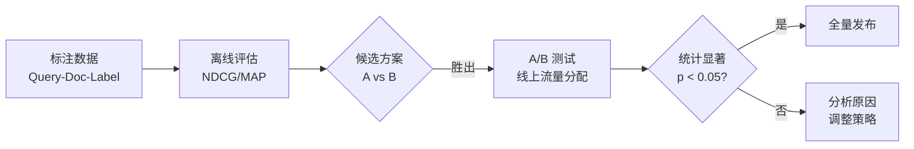
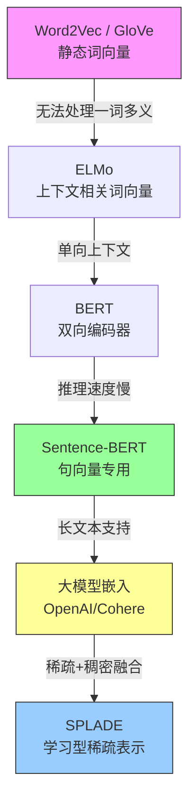
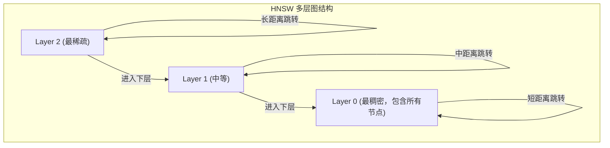
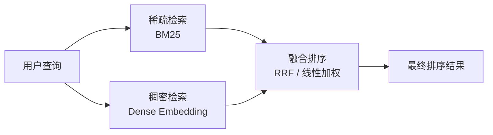
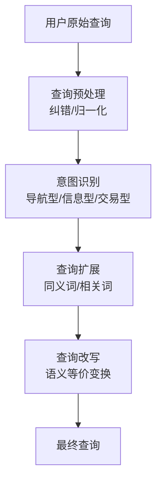
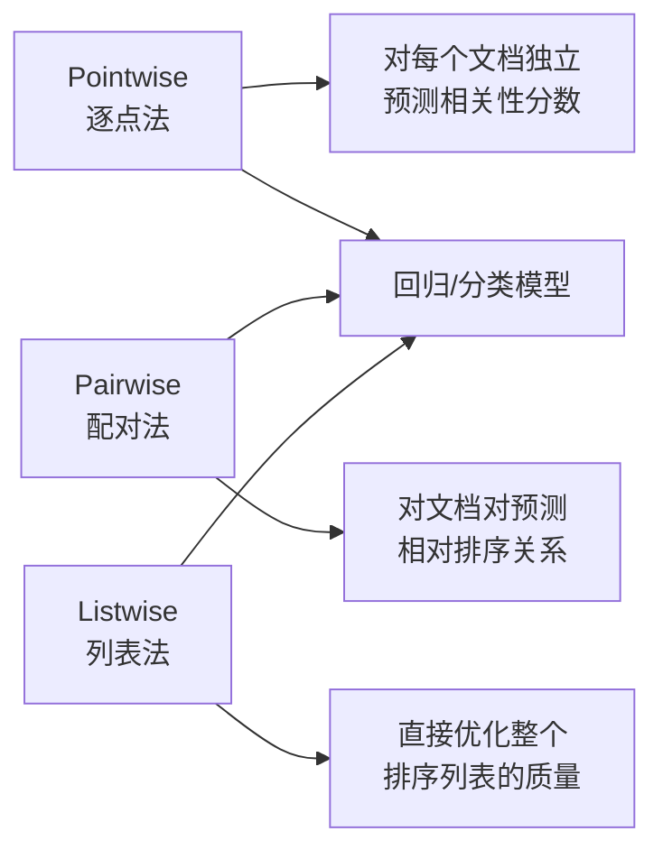
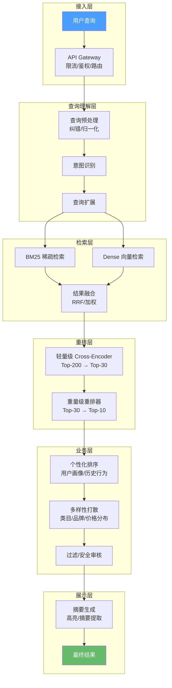

## 理论延伸

本节在核心概念的基础上，深入探讨搜索引擎领域的进阶理论：从经典评价指标的数学本质，到向量检索的完整技术栈，再到混合检索、重排序与端到端搜索架构的工程实践。这些内容构成了现代搜索系统从"能用"到"好用"的关键桥梁。

---

### 一、信息检索评价指标体系

评价指标是搜索系统迭代优化的指南针。没有科学的评价体系，任何优化都是盲人摸象——你不知道改动是让结果变好还是变差。本节从数学定义、直觉含义、适用场景三个维度系统梳理核心指标，并延伸到评价方法论。

#### 1.1 基础指标：Precision@K 与 Recall@K

**Precision@K（前K精确率）** 衡量的是"返回的结果中有多少是用户想要的"：

Precision@K = |{相关文档} ∩ {前K个结果}| / K

**Recall@K（前K召回率）** 衡量的是"用户想要的结果中有多少被返回了"：

Recall@K = |{相关文档} ∩ {前K个结果}| / |{所有相关文档}|

这两个指标天然矛盾：想提高召回率就要多返回文档，但多返回往往会引入不相关的结果，降低精确率。实际系统中需要根据业务场景权衡——法律文献检索要求高召回率（漏掉一份关键文件可能败诉），而电商搜索更看重精确率（前3个结果不相关用户就会离开）。

```python
def precision_at_k(retrieved, relevant, k):
    """retrieved: 排序后的文档ID列表, relevant: 相关文档ID集合"""
    retrieved_k = retrieved[:k]
    hits = len(set(retrieved_k) &amp; relevant)
    return hits / k

def recall_at_k(retrieved, relevant, k):
    retrieved_k = retrieved[:k]
    hits = len(set(retrieved_k) &amp; relevant)
    return hits / len(relevant) if relevant else 0
```

#### 1.2 排序感知指标：MAP、MRR 与 NDCG

Precision@K 和 Recall@K 不考虑排序位置——第1名和第10名的相关文档权重相同。但用户体验对排序高度敏感：用户更关注排在前面的结果。因此需要排序感知的指标。

**MAP（Mean Average Precision）**

对单个查询，先计算每个相关文档位置处的精确率，再求平均：

AP(q) = Σ_{k=1}^{n} (Precision@k × rel(k)) / |{相关文档}|
MAP = Σ_{q∈Q} AP(q) / |Q|

其中 `rel(k)` 是第k个结果是否相关（0或1）。MAP 综合考虑了精确率和排序质量：相关文档排得越靠前，AP 值越高。

```python
def average_precision(retrieved, relevant):
    """计算单个查询的AP"""
    hits = 0
    sum_precisions = 0
    for i, doc in enumerate(retrieved):
        if doc in relevant:
            hits += 1
            sum_precisions += hits / (i + 1)
    return sum_precisions / len(relevant) if relevant else 0

def mean_average_precision(queries_results):
    """queries_results: [(retrieved_list, relevant_set), ...]"""
    aps = [average_precision(r, rel) for r, rel in queries_results]
    return sum(aps) / len(aps) if aps else 0
```

**MRR（Mean Reciprocal Rank）**

只关心第一个相关文档出现在第几位：

RR(q) = 1 / rank(first relevant document)
MRR = Σ_{q∈Q} RR(q) / |Q|

MRR 适合"只要找到一个好结果就够"的场景，例如导航型搜索（用户搜索某个特定网站）。如果第一个相关结果排在第1位，RR=1.0；排在第3位，RR=0.333。

**NDCG（Normalized Discounted Cumulative Gain）**

NDCG 是目前最广泛使用的排序评价指标，它有两个关键优势：支持非二元相关性评分（不只是"相关/不相关"，而是0-4级评分）；通过位置折扣自然惩罚排在后面的相关文档。

```python
import math

def dcg_at_k(relevances, k):
    """relevances: 按排序顺序排列的相关性评分列表"""
    dcg = 0
    for i in range(min(k, len(relevances))):
        dcg += relevances[i] / math.log2(i + 2)  # i+2 因为 log2(1)=0
    return dcg

def ndcg_at_k(relevances, k):
    """计算NDCG@K"""
    actual_dcg = dcg_at_k(relevances, k)
    ideal_dcg = dcg_at_k(sorted(relevances, reverse=True), k)
    return actual_dcg / ideal_dcg if ideal_dcg > 0 else 0

# 示例：5个结果的相关性评分为 [3, 2, 3, 0, 1]（最高级为3）
relevances = [3, 2, 3, 0, 1]
print(f"NDCG@3 = {ndcg_at_k(relevances, 3):.4f}")  # 非理想排序
print(f"NDCG@5 = {ndcg_at_k(relevances, 5):.4f}")  # 考虑全部5个结果
```

NDCG 的值域为 [0, 1]，1 表示完美排序。由于不同查询的相关文档数量和相关性分布不同，NDCG 必须跨多个查询取平均（NDCG@K）才具有可比性。

#### 1.3 指标选择指南

| 指标 | 适用场景 | 优点 | 局限性 |
|------|----------|------|--------|
| Precision@K | 关注前K个结果的质量 | 简单直观 | 不考虑排序位置 |
| Recall@K | 法律/医学等需要全面覆盖 | 衡量覆盖面 | 需要已知全部相关文档 |
| MAP | 多个相关文档、需要整体排序质量 | 综合考虑精确率和排序 | 不支持非二元相关性 |
| MRR | 导航型搜索、只要第一个好结果 | 简单 | 忽略后续结果 |
| NDCG | 通用场景、多级相关性 | 支持分级评分、排序敏感 | 计算相对复杂 |

在工业实践中，NDCG@10 是最常见的单一指标。Google 搜索、Bing、Elasticsearch 的 Learning to Rank 框架都以 NDCG 作为核心优化目标。

#### 1.4 搜索质量评估方法论

仅仅知道指标的定义是不够的——如何构建一套可落地的搜索质量评估体系，才是工程实践的关键。

**标注体系设计**

搜索质量评估的核心挑战是"相关性标注"。常见做法是采用多级标注标准：

标注等级    含义                    典型标准
─────────────────────────────────────────────────────
4 - 完美    完全满足查询意图        精确回答问题，信息完整
3 - 优秀    高度相关                主题一致，内容有用但可能不够全面
2 - 一般    部分相关                涉及查询主题但不完全匹配
1 - 较差    勉强相关                仅关键词匹配，语义关联弱
0 - 不相关  完全无关                无任何信息价值

标注的关键原则：

- **一致性**：同一份标注指南，多人标注相同文档集，计算 Kappa 系数（>0.6 表示标注质量可接受）
- **规模**：每个查询至少标注 Top-50 结果，标注总量覆盖查询集的 80% 以上
- **更新频率**：标注数据会随时间退化（文档内容过时），建议每季度更新一次

**离线评估 vs 在线评估**

离线评估（Offline Evaluation）：
├── 优点：快速、低成本、可重复
├── 缺点：标注偏差、无法反映真实用户行为
├── 适用：模型迭代、参数调优、候选方案筛选
└── 工具：trec_eval、pytrec_eval、ir_measures

在线评估（Online Evaluation / A/B Testing）：
├── 优点：反映真实用户体验、统计显著性
├── 缺点：成本高、周期长、受外部因素影响
├── 适用：最终上线决策、策略对比
└── 指标：CTR、停留时长、转化率、用户满意度

一个完整的搜索质量评估流水线如下：



#### 1.5 常见指标使用误区

| 误区 | 正确做法 |
|------|----------|
| 只看平均 NDCG，忽略查询分布 | 按查询类型分层分析：导航型/信息型/交易型 |
| 在小测试集上宣称大幅提升 | 确保测试集覆盖足够多的查询类型，报告置信区间 |
| 只用单一 K 值（如只看 @10） | 同时报告 @1、@3、@5、@10，观察不同位置的表现 |
| 混淆离线指标与在线效果 | 离线 NDCG 提升 5% 不等于在线 CTR 提升 5%，需 A/B 验证 |
| 忽略新加入查询的覆盖度 | 单独统计长尾查询的指标表现，避免被头部查询"平均"掩盖 |

---

### 二、向量检索与语义搜索

传统搜索基于词项匹配（BM25），无法处理语义等价问题。例如用户搜索"怎么减肥"，文档中写的是"体重管理方法"——两者语义相同但没有词汇重叠，BM25 无法匹配。向量检索通过将文本映射到稠密向量空间，从根本上解决了这个问题。

#### 2.1 文本嵌入模型的演进

文本嵌入（Text Embedding）是向量检索的基础。嵌入模型将变长文本映射为固定维度的稠密向量，语义相近的文本在向量空间中距离更近。

**演进路线：**



| 模型类型 | 代表模型 | 向量维度 | 特点 | 适用场景 |
|----------|----------|----------|------|----------|
| 静态词向量 | Word2Vec, GloVe | 100-300 | 一词一向量，无法处理歧义 | 关键词扩展、简单相似度 |
| 上下文编码器 | BERT, RoBERTa | 768-1024 | 理解上下文，但生成的是token级向量 | 文本分类、NER |
| 句向量模型 | all-MiniLM-L6-v2, BGE | 384-768 | 整句编码，检索速度快 | 中小规模语义搜索 |
| Late交互模型 | ColBERT, ColBERTv2 | 每token 128维 | 保留token级细粒度交互 | 高精度语义搜索 |
| 大模型嵌入 | text-embedding-3, Cohere | 256-3072 | 强语义理解，API调用 | 通用场景、零样本 |
| 学习型稀疏 | SPLADE | 稀疏词典大小 | 融合BM25和语义，可解释 | 混合检索替代方案 |

**Sentence-BERT 架构要点**

Sentence-BERT（SBERT）在BERT基础上增加了孪生/三胞胎网络结构，使BERT能够高效生成句向量：

```python
from sentence_transformers import SentenceTransformer, util

# 加载预训练的句向量模型
model = SentenceTransformer('all-MiniLM-L6-v2')

# 编码文本为向量
sentences = [
    "如何有效减肥",           # 查询
    "体重管理的科学方法",      # 语义相关（不同词汇）
    "搜索引擎技术原理",        # 不相关
    "健康减重指南与饮食计划",   # 语义相关
]
embeddings = model.encode(sentences, convert_to_tensor=True)

# 计算查询与所有文档的余弦相似度
query_embedding = embeddings[0]
doc_embeddings = embeddings[1:]
similarities = util.cos_sim(query_embedding, doc_embeddings)

print("相似度得分：")
for i, (sent, score) in enumerate(zip(sentences[1:], similarities[0])):
    print(f"  {sent}: {score:.4f}")
# 输出示例：
#   体重管理的科学方法: 0.6832    ← 语义相关，高分
#   搜索引擎技术原理: 0.0521      ← 不相关，低分
#   健康减重指南与饮食计划: 0.7241 ← 语义相关，最高分
```

#### 2.2 相似度度量

向量检索中常用的相似度度量有三种，它们适用于不同的场景：

**余弦相似度（Cosine Similarity）**

衡量两个向量方向的一致性，与向量长度无关：

cos(A, B) = (A · B) / (||A|| × ||B||)

值域 [-1, 1]，1 表示完全相同方向，0 表示正交，-1 表示完全相反。大多数句向量模型（包括SBERT）的输出已归一化，此时余弦相似度等价于内积。

**内积（Inner Product / Dot Product）**

IP(A, B) = A · B = Σ(Ai × Bi)

当向量已归一化时，内积 = 余弦相似度。未归一化时，内积同时考虑方向和幅度。在推荐系统中，用户向量和物品向量的内积自然反映匹配强度。

**欧氏距离（L2 Distance）**

L2(A, B) = √(Σ(Ai - Bi)²)

值越小表示越相似。与余弦相似度的关系：对于归一化向量，L2² = 2 × (1 - cos)。

```python
import numpy as np

def similarity_comparison(a, b):
    """对比三种相似度度量"""
    cos_sim = np.dot(a, b) / (np.linalg.norm(a) * np.linalg.norm(b))
    inner_prod = np.dot(a, b)
    l2_dist = np.linalg.norm(a - b)
    return {"cosine": cos_sim, "inner_product": inner_prod, "l2_distance": l2_dist}

# 两个归一化向量
a = np.array([0.6, 0.8])   # ||a|| = 1.0
b = np.array([0.8, 0.6])   # ||b|| = 1.0
print(similarity_comparison(a, b))
# {'cosine': 0.96, 'inner_product': 0.96, 'l2_distance': 0.2828...}
```

选择建议：大多数语义搜索场景使用余弦相似度；如果嵌入模型输出未归一化，优先使用内积；欧氏距离适合对向量绝对值有物理意义的场景（如图像特征）。

#### 2.3 近似最近邻（ANN）算法

在百万甚至亿级文档库中，暴力搜索（逐一计算距离）不可接受。近似最近邻算法通过构建索引结构，在牺牲少量精度的前提下，将搜索速度提升数个数量级。

**主要ANN算法对比：**

| 算法 | 原理 | 时间复杂度 | 空间开销 | 适用场景 |
|------|------|-----------|----------|----------|
| HNSW | 多层跳表图结构 | O(log N) | 较高（~1.5x原始数据） | 通用首选，延迟敏感 |
| IVF | 向量空间分桶（聚类）| O(N/nlist) | 中等 | 超大规模数据 |
| PQ | 向量压缩为短码 | O(N) 但每步极快 | 很低（~原始1/32） | 内存受限场景 |
| IVF+PQ | IVF分桶+PQ压缩 | O(nlist×nprobe) | 低 | 大规模+内存受限 |
| LSH | 局部敏感哈希 | O(1) 查询 | 中等 | 理论优雅但实际少用 |

**HNSW（Hierarchical Navigable Small World）详解**

HNSW 是目前工业界最主流的 ANN 算法，被 Faiss、Milvus、Pinecone、Weaviate 等主流向量数据库采用。

核心思想：构建多层图结构，高层稀疏（用于快速定位区域），低层稠密（用于精确搜索）。类比高速公路→城市道路→小巷的层级导航。



HNSW 的两个关键参数：

- **M（每层最大连接数）**：控制图的密度。M 越大，召回率越高但内存和构建时间增加。通常设为 16-64。
- **efConstruction / efSearch**：构建/搜索时的候选集大小。ef 越大，精度越高但速度越慢。efSearch 通常设为 100-200。

```python
import faiss
import numpy as np

# 生成模拟数据：100万条768维向量
dimension = 768
num_vectors = 1_000_000
np.random.seed(42)
data = np.random.random((num_vectors, dimension)).astype('float32')
queries = np.random.random((100, dimension)).astype('float32')

# --- 方案1：暴力搜索（精确但慢） ---
index_flat = faiss.IndexFlatIP(dimension)  # 内积搜索
index_flat.add(data)
%%time
D_flat, I_flat = index_flat.search(queries, k=10)  # 约需数秒

# --- 方案2：IVF+PQ（大规模场景） ---
nlist = 1024       # 聚类中心数
m_pq = 64          # PQ子空间数
quantizer = faiss.IndexFlatIP(dimension)
index_ivfpq = faiss.IndexIVFPQ(quantizer, dimension, nlist, m_pq, 8)
index_ivfpq.train(data)       # IVF+PQ需要训练
index_ivfpq.add(data)
index_ivfpq.nprobe = 32       # 搜索时访问的聚类中心数
D_ivf, I_ivf = index_ivfpq.search(queries, k=10)

# --- 方案3：HNSW（通用首选） ---
index_hnsw = faiss.IndexHNSWFlat(dimension, 32)  # M=32
index_hnsw.hnsw.efSearch = 128
index_hnsw.add(data)
D_hnsw, I_hnsw = index_hnsw.search(queries, k=10)

# 对比召回率（以暴力搜索为ground truth）
hits_flat = sum(len(set(I_flat[i]) &amp; set(I_hnsw[i])) for i in range(100))
recall_hnsw = hits_flat / (100 * 10)
print(f"HNSW Recall@10 vs Flat: {recall_hnsw:.4f}")  # 通常 > 0.95
```

**选型决策树：**

数据规模 < 100万？ → HNSW（简单高效）
数据规模 100万-1亿 + 内存充足？ → IVFFlat
数据规模 100万-1亿 + 内存受限？ → IVF+PQ
数据规模 > 1亿？ → IVF+PQ + 分布式分片
需要100%精确？ → Flat（暴力搜索），仅适合小规模

#### 2.4 向量检索的常见陷阱与最佳实践

向量检索虽然强大，但初学者容易踩坑。以下是工程实践中总结的关键经验：

**陷阱一：Embedding 模型选错场景**

不同嵌入模型有不同的训练数据分布和擅长领域。通用模型（如 text-embedding-3-small）在特定领域（医疗、法律、代码）可能表现平庸。

场景                    推荐模型
────────────────────────────────────────
通用中英文混合           BGE-M3、jina-embeddings-v3
法律/医疗等专业文本      基于领域数据微调后的 BGE
代码检索                 CodeBERT、UniXcoder
电商商品                基于用户点击数据微调的定制模型
多语言场景              multilingual-e5-large、BGE-M3

**陷阱二：索引参数设置不合理**

HNSW 的 M 和 efSearch 参数需要根据精度-延迟的业务要求来调整。常见的错误是使用默认参数不做调优：

```python
# 常见错误：使用默认参数
index = faiss.IndexHNSWFlat(768, 16)  # M=16，可能召回率不够
index.hnsw.efSearch = 64              # efSearch太小

# 正确做法：根据精度要求调整
index = faiss.IndexHNSWFlat(768, 32)  # M=32，平衡精度和内存
index.hnsw.efSearch = 128             # 足够的搜索宽度

# 验证召回率
# recall_at_10 >= 0.95 才是生产可用的标准
```

**陷阱三：忽略向量归一化**

许多向量数据库默认使用内积而非余弦相似度。如果嵌入模型输出的向量未归一化，内积的结果会受向量长度影响，导致短文本总是得分偏低。解决方案：在索引前对所有向量做 L2 归一化。

```python
# L2 归一化
faiss.normalize_L2(data)  # 原地归一化，每个向量的 L2 范数为 1
```

**陷阱四：混合检索中分数尺度不统一**

BM25 的分数范围（0到数十）和向量余弦相似度的范围（0到1）完全不同。直接做加权融合会导致一方完全压制另一方。解决方案：使用 RRF（倒数排名融合）或先做 Min-Max 归一化。

---

### 三、混合检索策略

单一检索方式各有局限：BM25 擅长精确关键词匹配但不理解语义，向量检索理解语义但对精确关键词（如产品型号"iPhone 16 Pro Max"、法律条文编号）表现不佳。混合检索（Hybrid Search）将两者结合，取长补短。

#### 3.1 混合检索架构



**融合策略一：线性加权（Convex Combination）**

final_score = α × bm25_score + (1 - α) × dense_score

α 为混合权重，需要在验证集上通过网格搜索调优。典型值 α∈[0.3, 0.7]，具体取决于数据特征——如果查询中精确关键词多，α 偏大；如果语义理解需求强，α 偏小。

```python
# α 调优示例：在验证集上网格搜索最优权重
import numpy as np

def evaluate_alpha(queries, bm25_scores, dense_scores, relevances, alpha_values):
    """在不同 alpha 下评估 NDCG@10"""
    results = []
    for alpha in alpha_values:
        ndcg_scores = []
        for q_idx in range(len(queries)):
            combined = alpha * bm25_scores[q_idx] + (1 - alpha) * dense_scores[q_idx]
            # 按 combined score 排序，计算 NDCG@10
            top_indices = np.argsort(combined)[::-1][:10]
            top_rels = [relevances[q_idx][i] for i in top_indices]
            ndcg_scores.append(ndcg_at_k(top_rels, 10))
        results.append((alpha, np.mean(ndcg_scores)))
    return results

# 搜索最优 alpha
for alpha, score in evaluate_alpha(queries, bm25_s, dense_s, rels, 
                                    np.arange(0.0, 1.01, 0.1)):
    print(f"alpha={alpha:.1f} → NDCG@10={score:.4f}")
```

**融合策略二：倒数排名融合（Reciprocal Rank Fusion, RRF）**

RRF 是一种无需归一化分数的简单融合方法：

RRF_score(d) = Σ_{r∈R} 1 / (k + rank_r(d))

其中 R 是各检索器的结果集，rank_r(d) 是文档 d 在检索器 r 中的排名，k 是平滑常数（通常为 60）。

RRF 的优势在于：不需要对不同检索器的分数进行归一化（BM25 和余弦相似度的分数尺度完全不同），实现简单，效果稳健。

```python
def reciprocal_rank_fusion(ranked_lists, k=60):
    """
    ranked_lists: 多个检索器返回的排序文档列表
    [[doc_a, doc_b, doc_c], [doc_b, doc_a, doc_d]]
    """
    scores = {}
    for ranked in ranked_lists:
        for rank, doc in enumerate(ranked):
            if doc not in scores:
                scores[doc] = 0
            scores[doc] += 1 / (k + rank + 1)  # rank从0开始
    # 按融合分数降序排列
    return sorted(scores.keys(), key=lambda d: scores[d], reverse=True)

# 示例
bm25_results = ["doc1", "doc3", "doc2", "doc5", "doc4"]
dense_results = ["doc2", "doc1", "doc4", "doc3", "doc6"]
fused = reciprocal_rank_fusion([bm25_results, dense_results])
print(f"融合排序: {fused}")
# doc1: 1/(60+1) + 1/(60+2) = 0.01639 + 0.01613 = 0.03252
# doc2: 1/(60+3) + 1/(60+1) = 0.01587 + 0.01639 = 0.03226
```

**融合策略三：学习融合（Learned Fusion）**

通过训练一个小型模型（如线性模型或浅层神经网络）来学习最优融合权重。输入 BM25 分数和向量相似度，输出最终排序分数。这种方法效果最好但需要标注数据。

```python
# 学习融合的简化实现
from sklearn.linear_model import LogisticRegression
from sklearn.model_selection import cross_val_score
import numpy as np

def learned_fusion_train(bm25_scores, dense_scores, labels):
    """
    训练学习融合模型
    bm25_scores, dense_scores: 各查询的特征分数矩阵
    labels: 相关性标注（0/1）
    """
    # 构造特征：BM25分数、余弦相似度、两者乘积
    features = np.column_stack([
        bm25_scores,
        dense_scores,
        bm25_scores * dense_scores  # 交叉特征
    ])
    
    model = LogisticRegression()
    scores = cross_val_score(model, features, labels, cv=5, scoring='roc_auc')
    print(f"5折交叉验证 AUC: {scores.mean():.4f} ± {scores.std():.4f}")
    
    model.fit(features, labels)
    return model

def learned_fusion_predict(model, bm25_scores, dense_scores):
    """使用训练好的模型预测融合分数"""
    features = np.column_stack([
        bm25_scores,
        dense_scores,
        bm25_scores * dense_scores
    ])
    return model.predict_proba(features)[:, 1]  # 返回正类概率
```

#### 3.2 Elasticsearch 中的混合检索

Elasticsearch 8.x 原生支持向量检索（kNN 查询），可以方便地实现混合检索：

```json
GET /products/_search
{
  "query": {
    "bool": {
      "should": [
        {
          "match": {
            "title": {
              "query": "轻薄笔记本电脑",
              "boost": 1.0
            }
          }
        },
        {
          "match": {
            "description": {
              "query": "轻薄笔记本电脑",
              "boost": 0.5
            }
          }
        }
      ],
      "filter": [
        { "term": { "in_stock": true } },
        { "range": { "price": { "gte": 3000, "lte": 10000 } } }
      ]
    }
  },
  "knn": {
    "field": "embedding",
    "query_vector": [0.1, 0.2, ...],
    "k": 10,
    "num_candidates": 100,
    "boost": 0.3
  },
  "rank": {
    "rrf": {
      "window_size": 50,
      "rank_constant": 60
    }
  }
}
```

#### 3.3 实际效果对比

在实际业务中，混合检索相比单一检索的提升幅度取决于数据和查询特征：

| 场景 | BM25 单独 | 向量单独 | 混合检索 | 提升幅度 |
|------|-----------|----------|----------|----------|
| 电商商品搜索 | NDCG@10: 0.62 | NDCG@10: 0.58 | NDCG@10: 0.71 | +14.5% |
| 法律文档检索 | NDCG@10: 0.74 | NDCG@10: 0.45 | NDCG@10: 0.79 | +6.8% |
| 客服问答匹配 | NDCG@10: 0.55 | NDCG@10: 0.69 | NDCG@10: 0.76 | +10.1% |

法律文档检索中 BM25 远优于纯向量检索，因为法律条文高度依赖精确引用；而混合检索在 BM25 基础上仍能小幅提升，因为向量检索可以捕获语义相关的判例。

---

### 四、重排序（Re-ranking）

检索阶段（Retrieval）的目标是从海量候选中快速筛选出 Top-K 候选集，而重排序阶段（Re-ranking）对这 K 个候选进行精细排序。这种"召回-重排"的两阶段架构是工业界的标准范式。

#### 4.1 为什么需要重排序

检索阶段受限于效率，无法使用计算开销大的模型。例如 BM25 或向量检索可以在毫秒级处理百万文档，但 Cross-Encoder 对每对（查询, 文档）都需要完整推理，无法对所有文档执行。因此：

第一阶段（检索）：从100万文档中快速召回 Top-100
第二阶段（重排）：对 Top-100 用 Cross-Encoder 精排，返回 Top-10

这个"漏斗"架构的本质是**精度与效率的平衡**——第一阶段用低精度但高速度的方法快速缩小范围，第二阶段用高精度但低速度的方法精细排序。

#### 4.2 Cross-Encoder 重排序

Cross-Encoder 将（查询, 文档）对一起输入 BERT 类模型，通过 [CLS] token 的输出预测相关性分数：

```python
from sentence_transformers import CrossEncoder

# 加载重排序模型
reranker = CrossEncoder('cross-encoder/ms-marco-MiniLM-L-6-v2')

# 查询和候选文档
query = "Python如何实现多线程"
candidates = [
    "Python多线程编程入门教程",
    "Java并发编程最佳实践",
    "Python threading模块详解与GIL问题分析",
    "Python asyncio异步编程完全指南",
]

# 计算每对（查询, 文档）的相关性分数
pairs = [(query, doc) for doc in candidates]
scores = reranker.predict(pairs)

# 按分数重排
ranked = sorted(zip(candidates, scores), key=lambda x: x[1], reverse=True)
for doc, score in ranked:
    print(f"  [{score:.4f}] {doc}")
# 输出示例：
#   [9.8234] Python threading模块详解与GIL问题分析  ← 最相关
#   [7.5612] Python多线程编程入门教程
#   [2.1043] Python asyncio异步编程完全指南
#   [-3.4521] Java并发编程最佳实践                    ← 不相关
```

**Bi-Encoder vs Cross-Encoder 的本质区别**

Bi-Encoder（用于检索阶段）：
  Query → [Encoder] → q_vec ─┐
                              ├→ 余弦相似度 → 分数
  Doc   → [Encoder] → d_vec ─┘
  ✅ 文档向量可预计算，在线延迟极低
  ❌ query和doc独立编码，交互能力弱

Cross-Encoder（用于重排阶段）：
  [Query; Doc] → [Encoder] → [CLS] → 分类头 → 分数
  ✅ query和doc深度交互，精度高
  ❌ 每对都需要在线推理，无法预计算

#### 4.3 ColBERT：延迟交互模型

ColBERT 是介于 Bi-Encoder 和 Cross-Encoder 之间的方案。它为查询和文档中的每个 token 生成向量，在检索时通过 MaxSim 操作计算细粒度匹配：

ColBERT_score(Q, D) = Σ_{q∈Q} max_{d∈D} sim(q, d)

即查询中每个 token 与文档中最相似 token 的相似度之和。这既保留了 token 级交互的精度，又通过预计算文档向量避免了在线推理的高开销。

ColBERT 的工程优势在于：文档端的 token 向量可以离线预计算并存储，查询时只需计算查询端的 token 向量并执行 MaxSim 操作。这使得 ColBERT 的在线延迟接近 Bi-Encoder（~20-80ms），但精度显著优于 Bi-Encoder。

#### 4.4 LLM 重排序：大模型精排

随着大语言模型的普及，基于 LLM 的重排序成为新的技术方向。与传统的 Cross-Encoder 不同，LLM 重排序利用模型的语言理解能力进行更深层次的相关性判断。

```python
# LLM 重排序的 Prompt 工程方法
RERANK_PROMPT = """请根据查询对以下文档进行相关性排序。

查询：{query}

候选文档：
{documents}

请为每个文档打分（0-10分），并按相关性从高到低排序。
评分标准：
- 10分：完全回答查询问题
- 7-9分：高度相关，提供有价值的信息
- 4-6分：部分相关
- 1-3分：勉强相关
- 0分：完全无关

输出格式：
1. [分数] 文档内容摘要
2. [分数] 文档内容摘要
...
"""
```

LLM 重排序的优缺点：

- **优点**：零样本能力极强，无需训练数据即可泛化到新领域；能理解复杂查询意图
- **缺点**：延迟高（500ms-2s），成本高，只能处理少量候选（Top-10~50）
- **适用**：高价值搜索场景（如医疗问诊、法律咨询），对精度要求极高且候选集较小

#### 4.5 重排序的代价与权衡

| 方案 | 精度 | 延迟（每查询） | 适用候选规模 |
|------|------|----------------|-------------|
| Bi-Encoder 检索 | 基线 | < 10ms | 百万级 |
| Cross-Encoder 重排 | +10-20% | 50-200ms | Top-50~200 |
| ColBERT | +8-15% | 20-80ms | Top-100~500 |
| LLM Rerank（GPT-4等）| +15-25% | 500ms-2s | Top-10~50 |

经验法则：候选集规模超过 200 时，先用轻量级重排器（如 MiniLM Cross-Encoder）处理 Top-200，再用重量级模型处理 Top-20，形成三级漏斗。

---

### 五、查询理解与扩展

搜索质量的瓶颈往往不在排序算法，而在"理解用户到底想要什么"。查询理解（Query Understanding）是搜索引擎的"大脑"，负责解析用户输入、理解真实意图、并在必要时改写查询。

#### 5.1 查询理解的核心模块



**查询纠错（Spell Correction）**

用户输入常常包含拼写错误或同音词混淆。搜索引擎需要自动检测并纠正：

```python
# 基于编辑距离的简单查询纠错
def spell_correction(query, dictionary, max_distance=2):
    """对查询中的每个词进行拼写纠错"""
    corrected_words = []
    for word in query.split():
        if word in dictionary:
            corrected_words.append(word)
        else:
            # 找字典中编辑距离最小的词
            candidates = []
            for dict_word in dictionary:
                dist = levenshtein_distance(word, dict_word)
                if dist <= max_distance:
                    candidates.append((dict_word, dist))
            if candidates:
                candidates.sort(key=lambda x: x[1])
                corrected_words.append(candidates[0][0])
            else:
                corrected_words.append(word)  # 找不到候选，保留原文
    return ' '.join(corrected_words)
```

**查询意图分类**

搜索引擎需要识别用户查询的意图类型，不同意图需要不同的排序策略：

意图类型    特征                          排序策略
──────────────────────────────────────────────────────
导航型      查询特定网站/品牌/产品名      MRR优化，第一个结果至关重要
信息型      疑问句或知识查询              NDCG优化，全面覆盖相关文档
交易型      包含购买/下载/注册等意图      转化率优化，优先展示可操作结果
本地型      包含地点信息                  LBS加权，距离排序

#### 5.2 查询扩展技术

查询扩展（Query Expansion）通过添加相关词汇来提高召回率，是搜索引擎的核心技术之一。

**基于同义词的扩展**

```python
# 同义词扩展示例
synonym_dict = {
    "减肥": ["瘦身", "减重", "体重管理", "控制体重"],
    "手机": ["智能手机", "移动电话", "cell phone"],
    "编程": ["编码", "写代码", "程序开发"],
}

def expand_query(query, synonym_dict):
    """用同义词扩展查询"""
    expanded_terms = []
    for word in query.split():
        expanded_terms.append(word)
        if word in synonym_dict:
            expanded_terms.extend(synonym_dict[word])
    return ' '.join(expanded_terms)

# "如何减肥" → "如何 减肥 瘦身 减重 体重管理 控制体重"
```

**基于伪相关反馈的扩展（PRF, Pseudo-Relevance Feedback）**

PRF 的思想是：先用原始查询检索 Top-K 结果，从这些结果中提取高频词作为扩展词。经典的 RM3（Relevance Model 3）算法就是这种方法的代表：

步骤1：用原始查询检索 Top-10 文档
步骤2：统计 Top-10 文档中出现频率最高的词（排除停用词）
步骤3：将这些高频词加入原始查询，赋予较低权重
步骤4：用扩展后的查询重新检索

**基于用户行为的扩展**

利用用户的实际搜索和点击行为来扩展查询：

- **搜索日志分析**：统计用户在搜索"减肥"后还搜索了什么词
- **点击日志分析**：用户搜索"减肥"后点击了包含"体重管理"的文档，说明这两个词在用户心中是相关的
- **Session 挖掘**：分析一次搜索会话中连续的查询，发现查询之间的语义关联

---

### 六、Learning to Rank（排序学习）

BM25 和向量检索的分数本质上是单个特征的简单计算。而排序的核心问题往往涉及多个特征的复杂组合——文档长度、词频、字段匹配、点击率、新鲜度、权威性等。Learning to Rank（LTR）正是解决"如何组合多个特征来得到最优排序"的方法。

#### 6.1 LTR 的三种范式



| 范式 | 核心思想 | 代表算法 | 优点 | 缺点 |
|------|----------|----------|------|------|
| Pointwise | 把排序当回归/分类 | Prank, RankNet | 实现简单，可复用现有ML框架 | 忽略文档间的相对关系 |
| Pairwise | 预测文档对的偏序 | RankSVM, LambdaRank | 关注相对排序，更贴合实际 | 计算复杂度高，对噪声敏感 |
| Listwise | 直接优化列表指标 | LambdaMART, AdaRank | 与评价指标直接对齐 | 实现复杂，训练慢 |

工业界最广泛使用的 LTR 算法是 **LambdaMART**（LambdaRank + MART/GBDT），XGBoost 和 LightGBM 都内置了 LambdaMART 实现。

#### 6.2 LTR 特征工程

LTR 的效果很大程度上取决于特征质量。以下是搜索排序中最常用的特征类别：

特征类别        具体特征                              说明
──────────────────────────────────────────────────────────────
查询相关特征    BM25分数、TF-IDF分数                  传统文本匹配信号
                词频（query term在doc中的频率）
                文档匹配的query term比例

向量检索特征    余弦相似度、内积                       语义匹配信号
                Cross-Encoder分数

文档质量特征    PageRank/权威度分数                     文档本身的重要性
                文档长度、段落数
                文档新鲜度（发布/更新时间）

用户行为特征    点击率（CTR）                          用户反馈信号
                停留时长
                跳出率

字段特征        标题匹配分数、描述匹配分数              不同字段的匹配质量
                URL匹配分数

#### 6.3 LTR 在 Elasticsearch 中的实现

Elasticsearch 内置了 LTR 插件，可以直接在搜索引擎中训练和使用 LTR 模型：

```json
// 1. 定义特征集
POST _ltr/_featureset/product_search_features
{
  "features": [
    {
      "name": "title_bm25",
      "params": ["keywords"],
      "template": {
        "match": { "title": "{{keywords}}" }
      }
    },
    {
      "name": "description_bm25",
      "params": ["keywords"],
      "template": {
        "match": { "description": "{{keywords}}" }
      }
    },
    {
      "name": "price_field",
      "template": {
        "script_score": {
          "query": { "match_all": {} },
          "script": { "source": "1.0 / (Math.abs(doc['price'].value - 5000) + 1)" }
        }
      }
    }
  ]
}

// 2. 存储训练数据
POST _ltr/_judgments
{
  "judgments": [
    { "query": 1, "doc": 101, "grade": 4 },
    { "query": 1, "doc": 102, "grade": 2 },
    { "query": 1, "doc": 103, "grade": 0 }
  ]
}

// 3. 训练模型（外部训练后上传）
POST _ltr/_model/lambdamart_model
{
  "model": {
    "type": "LambdaMART",
    "definition": "<base64编码的模型文件>"
  }
}

// 4. 使用 LTR 模型搜索
GET /products/_search
{
  "query": {
    "bool": {
      "should": [
        { "match": { "title": "笔记本电脑" } },
        { "match": { "description": "笔记本电脑" } }
      ]
    }
  },
  "rescore": {
    "query": {
      "rescore_query": {
        "sltr": {
          "params": { "keywords": "笔记本电脑" },
          "model": "lambdamart_model"
        }
      }
    }
  }
}
```

---

### 七、端到端搜索系统架构

理解了各个组件之后，需要将它们组合成一个完整的搜索系统。现代搜索系统通常采用分层架构，每一层负责特定的功能。

#### 7.1 架构全景图



#### 7.2 各层设计要点

**检索层设计**

候选集生成策略：
├── BM25 Top-500        → 覆盖精确关键词匹配
├── Dense Top-200       → 覆盖语义相关文档
├── 规则匹配 Top-50     → 覆盖特定业务规则（如品牌直营优先）
└── 历史行为 Top-50     → 覆盖用户个性化偏好

融合后的候选集约 500-700 个文档，进入重排阶段。

**重排层设计**

重排层通常采用多级漏斗策略，平衡精度和延迟：

候选集（500-700）
    ↓
轻量级 Cross-Encoder / ColBERT（延迟 <50ms）
    ↓ Top-50
重量级 Cross-Encoder（延迟 ~100ms）
    ↓ Top-20
业务规则调整（多样性打散、去重、安全过滤）
    ↓
最终 Top-10 展示给用户

**个性化层设计**

个性化是搜索体验差异化的核心。常见的个性化策略：

信号类型          数据来源              权重建议
──────────────────────────────────────────────
用户历史点击      点击日志              中（可能有偏）
用户搜索历史      搜索日志              中
用户偏好画像      注册信息+行为建模      低-中
用户设备/地域    请求头信息             低
短期实时兴趣      最近5分钟行为          高（时效性强）

个性化需要注意的红线：

- **隐私合规**：GDPR、个人信息保护法要求用户知情同意
- **过滤气泡**：过度个性化会导致用户只看到自己"想看的"，需要保留一定的探索性
- **冷启动**：新用户没有行为数据，需要降级到非个性化排序

#### 7.3 搜索系统的可观测性

一个生产级搜索系统必须具备完善的监控和可观测性：

监控维度          关键指标                  告警阈值
──────────────────────────────────────────────────────
延迟              P50/P95/P99 延迟          P99 > 500ms
吞吐              QPS（每秒查询数）         持续 > 预期 150%
准确率            NDCG@10（离线日志评估）   下降 > 5%
召回率            搜索无结果率              > 2%
错误率            5xx 错误比例              > 0.1%
资源利用率        CPU / 内存 / 磁盘        CPU > 80% 持续5min
分片健康          未分配分片数              > 0

---

### 八、向量数据库选型

向量数据库是向量检索的基础设施，选型时需要综合考虑性能、功能、运维复杂度和成本。

#### 8.1 主流向量数据库对比

| 特性 | Milvus | Pinecone | Weaviate | Qdrant | pgvector |
|------|--------|----------|----------|--------|----------|
| 部署方式 | 自部署/云 | 纯托管云 | 自部署/云 | 自部署/云 | PostgreSQL扩展 |
| 索引算法 | IVF/HNSW/DiskANN | 自研 | HNSW | HNSW | IVFFlat/HNSW |
| 标量过滤 | ✅ | ✅ | ✅ | ✅ | ✅ |
| 混合检索 | ✅ | ✅ | ✅ BM25+向量 | ✅ | ✅ |
| 分布式 | ✅ 原生 | ✅ 服务端 | ✅ | ✅ | ❌ 需要Citus |
| 最大数据规模 | 十亿级 | 十亿级 | 亿级 | 亿级 | 千万级 |
| 开源 | ✅ Apache 2.0 | ❌ | ✅ BSD-3 | ✅ Apache 2.0 | ✅ PostgreSQL |
| 运维复杂度 | 中 | 无 | 中 | 低 | 低 |

#### 8.2 选型决策

- **快速原型验证**：pgvector（已有PostgreSQL就装个扩展）或 Qdrant（单Docker启动）
- **中小规模生产（<1亿向量）**：Qdrant 或 Weaviate（运维简单，功能齐全）
- **大规模生产（>1亿向量）**：Milvus（原生分布式，支持磁盘索引）
- **不想运维**：Pinecone（全托管，但成本较高）

**选型时容易忽略的维度**

被忽略的维度          为什么重要                    如何评估
──────────────────────────────────────────────────────────────
混合检索支持           BM25+向量混合是主流需求        实测混合查询的延迟和效果
过滤性能              带标量过滤的向量查询            构造大规模过滤条件进行压测
写入吞吐              日增量大的场景需要高写入能力     测试批量写入速度
元数据管理            文档的结构化字段查询            测试过滤+排序的组合查询
运维工具              监控、备份、恢复的便捷性        评估运维文档和社区活跃度
成本                  内存成本是向量数据库的主要开支    估算生产环境的月度成本

---

### 九、常见误区与最佳实践

#### 9.1 搜索系统设计误区

| 误区 | 问题描述 | 正确做法 |
|------|----------|----------|
| 过度依赖向量检索 | 认为 BM25 已经过时，全面转向向量 | 大多数场景混合检索效果最佳，BM25 在精确匹配上仍然不可替代 |
| 忽视查询理解 | 直接将用户输入扔给检索引擎 | 投资查询纠错、意图分类、查询扩展，这些"前置处理"的投入产出比最高 |
| 只优化算法不优化数据 | 用更复杂的模型但数据质量差 | 清洗文档数据、优化标注质量、构建高质量的训练集 |
| 忽视长尾查询 | 只关注头部查询的指标 | 长尾查询（出现次数少的查询）往往占总查询量的60%以上，需要单独优化 |
| 离线指标等同在线效果 | NDCG 提升 5% 就上线 | 离线提升需要通过 A/B 测试验证，线上效果可能因用户行为差异而不同 |

#### 9.2 性能优化最佳实践

**索引优化**

优化措施                          预期收益          适用场景
──────────────────────────────────────────────────────────────
字段裁剪（只索引需要的字段）       减少30-50%索引体积  所有场景
关闭不需要搜索的字段的 norms       减少内存占用       长文本字段
使用 keyword 类型代替 text         提升精确查询性能   不需要分词的字段
合理设置分片数（10-50GB/分片）     避免分片碎片化     所有场景

**查询优化**

优化措施                          预期收益          适用场景
──────────────────────────────────────────────────────────────
精确条件用 filter 而非 query       减少50%+查询延迟   结构化过滤条件
使用 search_after 替代深度分页     大幅提升深分页性能  需要翻页的场景
避免 wildcard 前缀通配           避免全量扫描       所有场景
预热缓存（indices.warmers）       首次查询不超时     高频查询模式

#### 9.3 向量检索优化检查清单

□ 向量维度是否合理？（768维通常够用，384维更快）
□ 是否做了 L2 归一化？
□ HNSW 的 M 参数是否经过调优？（默认16通常偏小）
□ efSearch 是否满足召回率要求？（recall@10 ≥ 0.95）
□ 是否需要支持标量过滤？（过滤性能是否可接受）
□ 嵌入模型是否适合当前领域？（是否需要微调）
□ 批量查询是否利用了向量数据库的批处理接口？
□ 内存是否充足？（向量数据通常需要全量加载到内存）

---

### 十、本节小结

本节从评价指标、向量检索、混合检索、重排序、查询理解、排序学习、系统架构、向量数据库选型八个维度扩展了搜索引擎的理论深度：

- **评价指标**是系统优化的指南针，NDCG@10 是工业界最通用的排序评价指标，但要配合完整的标注体系和 A/B 测试才能真正发挥作用
- **向量检索**通过语义编码突破了关键词匹配的局限，HNSW 是当前最主流的 ANN 算法，但要注意模型选型和参数调优
- **混合检索**结合 BM25 和向量检索的优势，在几乎所有场景下都优于单一方案，RRF 融合是最低成本的实现方式
- **重排序**通过 Cross-Encoder 等模型在候选集上实现精细排序，是"召回-重排"架构的关键环节，多级漏斗是工程最佳实践
- **查询理解**是搜索质量的"上游瓶颈"，查询纠错、意图分类、查询扩展的投入产出比往往高于排序算法优化
- **Learning to Rank** 是将多种信号融合为最优排序的核心方法，LambdaMART 是工业界的事实标准
- **端到端架构**将所有组件有机组合，从查询理解到检索、重排、个性化、展示，每一层都有其不可替代的价值

这些理论共同构成了现代搜索系统的完整技术栈——从理解用户意图到精准匹配文档，从大规模粗排到小规模精排，每一层都有其不可替代的价值。掌握了这套理论体系，你就能在面对实际搜索系统设计和优化时，从"碰运气式调参"升级为"基于原理做决策"。
