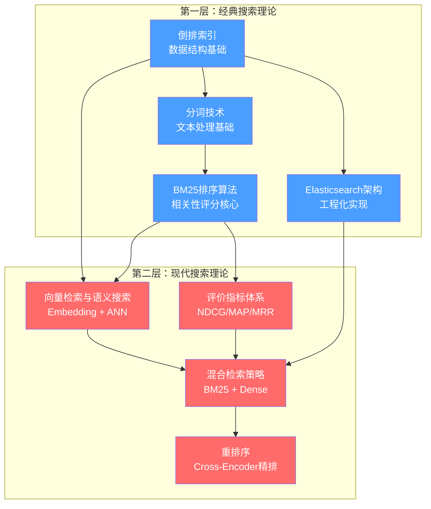

# 搜索引擎理论基础

搜索引擎是现代信息社会的基础设施。当你在Google中输入一个关键词，在电商平台搜索一件商品，在代码仓库中检索一段函数——背后都是搜索引擎在毫秒级时间内从数十亿文档中找到最相关的结果。理解搜索引擎的理论基础，不仅是后端工程师的必备技能，更是理解整个信息检索领域的钥匙。

本节系统性地讲解搜索引擎的核心理论体系，从底层数据结构到上层排序策略，从经典算法到前沿技术，构建完整的知识图谱。

---

## 为什么需要学习理论基础

很多开发者的第一反应是："直接用Elasticsearch不就行了，为什么要学理论？" 这种想法在简单场景下没问题——配置好mapping、写几个match查询就能跑。但当遇到以下情况时，缺乏理论基础就会成为瓶颈：

| 问题场景 | 缺乏理论基础的表现 | 理论支撑的解决方案 |
|----------|-------------------|-------------------|
| 搜索结果不相关 | 不知道该调什么参数，盲目尝试 | 理解BM25参数含义，有针对性地调优 |
| 索引性能瓶颈 | 不知道分片数该设多少 | 理解分片机制和Lucene段合并策略 |
| 语义搜索需求 | 只会用BM25，无法处理同义词 | 理解向量检索和混合检索架构 |
| 精度与召回的权衡 | 不知道"搜得多"和"搜得准"如何平衡 | 理解Precision/Recall/NDCG指标体系 |
| 大规模系统优化 | 排序延迟高但不知道瓶颈在哪 | 理解"召回-重排"两阶段架构 |

理论不是空中楼阁——它是你在实际工程中做出正确决策的依据。本节的目标是让你在面对搜索系统设计和优化时，能从原理层面理解问题，而不是停留在"试一试"的层面。

---

## 知识体系全景图

搜索引擎的理论基础可以分为两大层次、六大核心模块。下图展示了各模块之间的依赖关系和学习路径：

### 第一层：经典搜索理论（本节第一部分详细讲解）

这一层构成了搜索引擎的技术基石，从数据结构到算法到系统架构，层层递进：

**1. 倒排索引（Inverted Index）**

倒排索引是搜索引擎最核心的数据结构，也是理解后续所有内容的前提。它的核心思想极其朴素——与其从"文档包含哪些词"出发查找（正排索引），不如反过来从"这个词出现在哪些文档中"出发查找（倒排索引）。这种反转使得搜索引擎能在毫秒级时间内从数十亿文档中找到包含特定关键词的所有文档。

倒排索引由两个核心组件构成：
- **词典（Dictionary）**：存储所有词条（Term），支持快速查找。工程上常用哈希表、B+树或FST（有限状态转换器）实现
- **倒排列表（Posting List）**：对每个词条，记录包含该词条的所有文档ID，以及词频、位置等附加信息

倒排索引的构建涉及文档预处理、分词、归一化等步骤。由于倒排列表可能极其庞大（一个常见词条可能出现在数百万文档中），压缩技术至关重要——差值编码、变长编码、PForDelta、Roaring Bitmap等都是工业界广泛使用的压缩方案。

**2. 分词技术（Tokenization）**

分词是将连续文本切分为独立词条的过程。英文分词相对简单（空格是天然分隔符），但需要处理词干提取、词形还原、停用词过滤等问题。中文分词则是公认的技术难题——中文没有天然词边界，"南京市长江大桥"到底是"南京市长/江大桥"还是"南京/市/长江/大桥"？分词质量直接影响搜索结果的准确性。

分词技术经历了三个阶段的演进：基于词典的规则方法（最大正向匹配）→ 基于统计的机器学习方法（HMM、CRF）→ 基于深度学习的方法（BiLSTM+CRF、BERT）。现代中文分词器（如jieba、HanLP、IK Analyzer）通常融合了多种方法。

**3. BM25排序算法**

BM25（Best Matching 25）是信息检索领域最经典的排序算法，至今仍被Google、Elasticsearch等广泛使用。它是TF-IDF的改进版本，解决了TF-IDF的两个关键问题：

- **词频饱和**：TF-IDF中词频越高分数越高，但实际中一个词出现10次并不比出现5次重要2倍。BM25通过饱和函数限制了TF的增长
- **文档长度归一化**：长文档天然包含更多词项，在TF-IDF中会获得不公平的高分。BM25引入文档长度归一化因子，消除了这种偏差

BM25的两个核心参数k1和b分别控制词频饱和速度和文档长度归一化强度，理解它们的含义是搜索调优的基础。

**4. Elasticsearch架构**

Elasticsearch是目前最主流的分布式搜索引擎，它基于Apache Lucene构建。理解Elasticsearch的架构需要理解几个关键层次：

- **Lucene段（Segment）**：不可变的倒排索引结构，是搜索的基本单位
- **分片（Shard）**：索引的水平切分，分布在不同节点上实现并行搜索
- **副本（Replica）**：分片的备份，提供高可用和读扩展
- **Refresh与Flush**：写入流程中的关键操作，Refresh将内存数据变为可搜索状态（近实时），Flush将数据持久化到磁盘

Elasticsearch的写入和搜索流程体现了"以空间换时间"和"最终一致性"的工程哲学。

### 第二层：现代搜索理论（本节第二部分详细讲解）

这一层在经典理论基础上，引入了更先进的技术和方法：

**5. 评价指标体系**

"无法度量，就无法优化。" 搜索系统的迭代优化依赖科学的评价指标。本节覆盖了信息检索领域的完整指标体系：

| 指标 | 核心思想 | 适用场景 |
|------|---------|---------|
| Precision@K | 前K个结果中有多少是相关的 | 关注结果质量的场景 |
| Recall@K | 所有相关结果中有多少被返回 | 法律/医学等要求全面覆盖的场景 |
| MAP | 综合考虑精确率和排序位置 | 多个相关文档的整体排序质量 |
| MRR | 第一个相关结果排在第几位 | 导航型搜索（找到一个就好） |
| NDCG | 支持多级相关性评分的排序指标 | 通用场景，工业界最广泛使用 |

NDCG是目前工业界的事实标准——Google搜索、Bing、Elasticsearch的LTR框架都以NDCG@10作为核心优化目标。理解NDCG的计算原理（DCG的对数折扣 + 归一化），是进行搜索优化的必要前提。

**6. 向量检索与语义搜索**

传统搜索（BM25）基于词项匹配，存在一个根本性缺陷：无法处理语义等价问题。用户搜索"怎么减肥"，文档中写的是"体重管理方法"——两者语义完全相同，但没有任何词汇重叠，BM25无法匹配。

向量检索通过嵌入模型（如Sentence-BERT）将文本映射为稠密向量，语义相近的文本在向量空间中距离更近，从根本上解决了这个问题。向量检索的技术栈包括：

- **文本嵌入模型**：从Word2Vec到BERT到大模型嵌入，如何将文本编码为向量
- **相似度度量**：余弦相似度、内积、欧氏距离的区别和适用场景
- **近似最近邻（ANN）算法**：HNSW、IVF、PQ等算法，在百万/亿级数据中实现毫秒级检索

**7. 混合检索策略**

BM25擅长精确关键词匹配但不理解语义，向量检索理解语义但对精确关键词（如产品型号"iPhone 16 Pro Max"）表现不佳。混合检索将两者结合，取长补短。融合策略包括：

- **线性加权**：`final_score = α × bm25 + (1-α) × dense`，简单但需要调参
- **倒数排名融合（RRF）**：基于排名而非分数融合，无需归一化，实现简单且效果稳健
- **学习融合**：用模型学习最优融合权重，效果最好但需要标注数据

实际业务中，混合检索相比单一检索通常能带来10-15%的NDCG提升。

**8. 重排序（Re-ranking）**

检索阶段（BM25/向量检索）的目标是从海量候选中快速召回Top-K候选集，而重排序阶段对这K个候选进行精细排序。这种"召回-重排"的两阶段架构是工业界的标准范式：

第一阶段（检索）：从100万文档中快速召回 Top-100  → 毫秒级
第二阶段（重排）：对 Top-100 用 Cross-Encoder 精排 → 返回 Top-10

Cross-Encoder将（查询, 文档）对一起输入BERT类模型，通过[CLS] token的输出预测相关性分数，精度远高于Bi-Encoder，但计算开销也大得多——这正是"两阶段"架构存在的原因。

---

## 本节内容导读

本节包含两篇详细的讲解文档，建议按顺序阅读：

### 第一部分：倒排列表的基本结构

这是搜索引擎的底层基石。本篇从正排索引与倒排索引的对比出发，深入讲解：

- 倒排索引的完整结构（词典 + 倒排列表）及其工程实现
- 倒排索引的构建流程（预处理→分词→归一化→写入）
- 倒排列表的压缩技术（变长编码、差值编码、PForDelta、Roaring Bitmap）
- 分词技术的完整体系：英文分词（词干提取、词形还原、停用词过滤）和中文分词（基于词典、基于统计、基于深度学习）
- BM25排序算法的数学原理和参数调优
- BM25F多字段加权扩展
- Elasticsearch的核心架构和写入/搜索流程
- 搜索排序的多因子融合和Learning to Rank
- 查询理解、自动补全和模糊搜索

**适合读者**：所有搜索引擎学习者的必读起点。

### 第二部分：向量检索与现代搜索理论

这是搜索引擎从"能用"到"好用"的关键。本篇深入讲解：

- 信息检索评价指标体系：Precision@K、Recall@K、MAP、MRR、NDCG的数学原理和适用场景
- 文本嵌入模型的演进：从Word2Vec到BERT到大模型嵌入
- 相似度度量对比：余弦相似度、内积、欧氏距离
- 近似最近邻（ANN）算法详解：HNSW、IVF、PQ的原理和选型
- 混合检索策略：线性加权、RRF、学习融合
- Elasticsearch 8.x中的混合检索实战
- 重排序架构：Cross-Encoder精排的原理和实现
- 端到端搜索系统架构设计

**适合读者**：已掌握第一部分内容，希望构建现代化搜索系统的工程师。

---

## 学习路径建议

根据你的背景和目标，推荐以下学习路径：

### 路径一：快速上手（1-2天）

如果你只需要使用Elasticsearch，按以下顺序学习：

1. **倒排索引** → 理解搜索引擎"为什么快"
2. **BM25排序** → 理解搜索结果"为什么这样排"
3. **Elasticsearch架构** → 理解分布式搜索"怎么做"
4. **评价指标** → 知道如何衡量搜索质量

### 路径二：系统掌握（3-5天）

如果你想深入理解搜索引擎原理：

1. 完成路径一的全部内容
2. **分词技术** → 理解文本处理的关键环节
3. **向量检索** → 理解语义搜索的技术原理
4. **混合检索** → 理解如何结合多种检索方式
5. **重排序** → 理解"召回-重排"架构

### 路径三：深入研究（1-2周）

如果你想成为搜索引擎领域的专家：

1. 完成路径二的全部内容
2. 深入阅读每个主题的数学推导和工程实现
3. 动手实现倒排索引、BM25评分、简单的向量检索
4. 用Elasticsearch搭建完整的混合检索系统
5. 研究Learning to Rank和推荐系统中的排序理论

---

## 从理论到实践的桥梁

理论学习的最终目的是指导实践。以下是理论知识在实际工程中的直接映射：

| 理论知识 | 工程实践 |
|---------|---------|
| 倒排索引结构 | 设计ES的mapping和字段类型 |
| 分词算法 | 选择和配置中文分词器（jieba/IK/HanLP） |
| BM25参数k1和b | 调优搜索相关性 |
| NDCG指标 | 搭建搜索质量评估体系 |
| HNSW/IVF/PQ | 选择向量数据库和ANN索引类型 |
| RRF融合 | 实现混合检索排序 |
| Cross-Encoder | 构建搜索结果重排序管线 |
| 段合并策略 | 优化ES索引性能和存储效率 |

搜索引擎是一个理论与实践高度结合的领域。扎实的理论基础能让你在面对实际问题时，不再是"碰运气式调参"，而是"基于原理做决策"。

接下来，让我们从倒排索引开始，一步步构建搜索引擎的完整知识体系。
