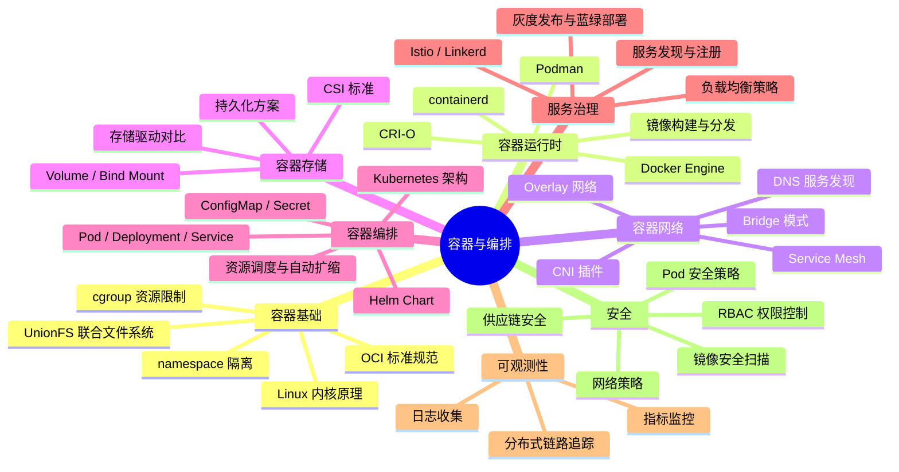
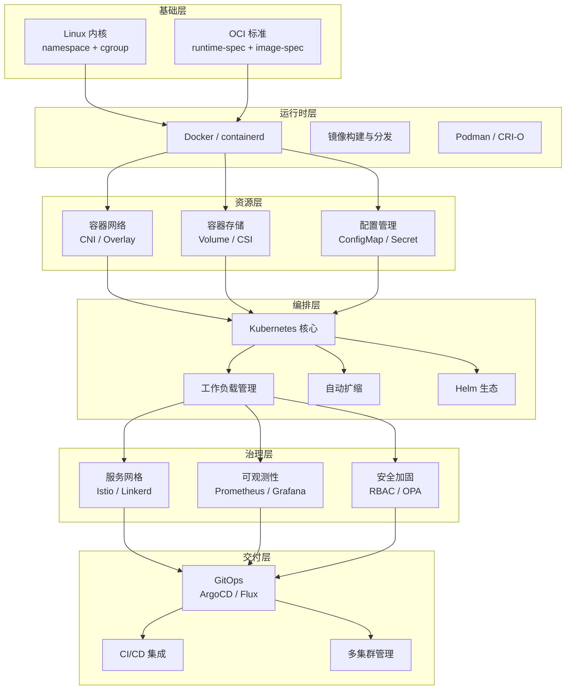
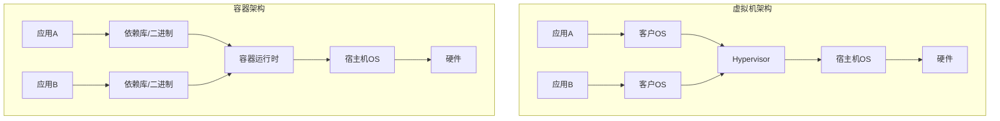
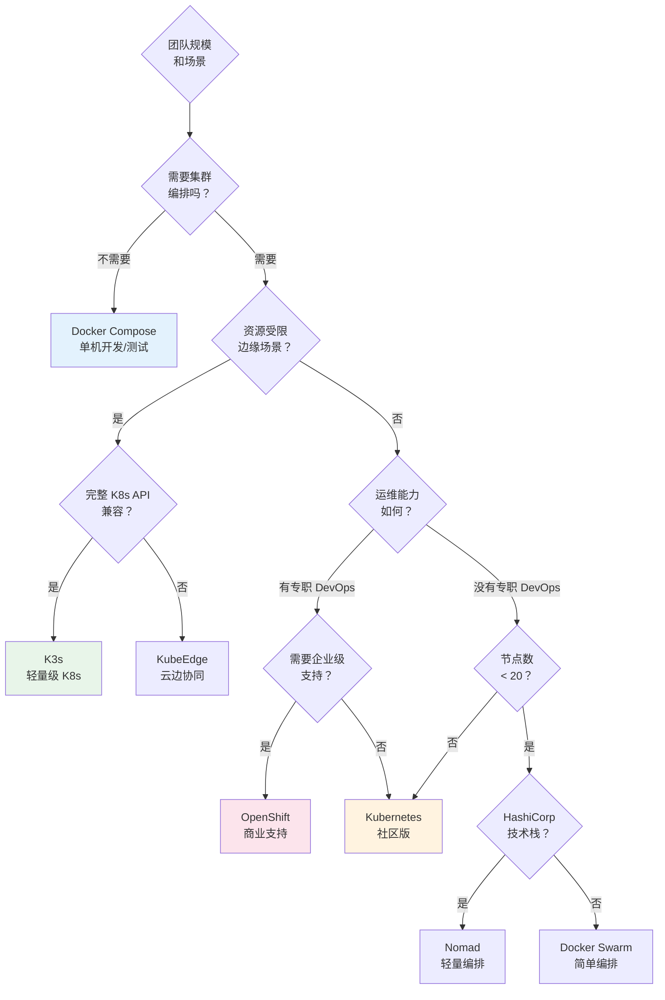
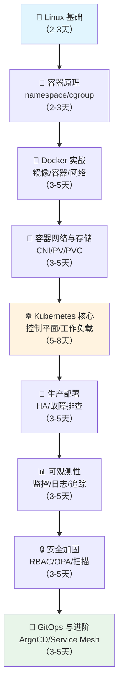

## 第40章 容器与编排

### 一、本章定位与学习目标

容器技术与容器编排是现代软件工程的基础设施级能力。从 2013 年 Docker 开源引发的"容器革命"，到 Kubernetes 成为事实上的云原生操作系统，容器与编排已经从可选工具演变为生产环境的默认选择。据 CNCF 2025 年度调查，超过 96% 的组织在使用或评估 Kubernetes，全球前 100 家银行中有 71% 运行着 Kubernetes 集群。

本章是软件工程全书容器化领域的完整知识体系，从 Linux 内核隔离机制到生产级 Kubernetes 运维，覆盖"道法术器"四个层次。读完本章，你将获得：

1. **理解本质**：掌握 Linux 内核级隔离机制（namespace、cgroup、UnionFS），理解容器与虚拟机的根本区别，建立正确的容器心智模型
2. **熟练使用**：精通 Docker / containerd 的镜像管理、网络模型、存储方案，能够编写生产级 Dockerfile
3. **生产编排**：系统掌握 Kubernetes 架构设计、资源调度、服务治理、可观测性与故障恢复
4. **架构决策**：能够在 Swarm、Kubernetes、Nomad、K3s 等编排方案之间做出合理技术选型
5. **安全与优化**：建立容器安全纵深防御体系，掌握性能调优与成本控制方法论
6. **工程实践**：通过 Helm 打包、GitOps 部署、Service Mesh 治理，构建完整的容器化交付体系

### 二、知识体系全景

容器与编排不是一个孤立的技术点，而是横跨操作系统、网络、存储、安全、分布式系统的交叉领域。以下知识图谱展示了本章覆盖的完整技术栈及其关联关系：

| 知识域 | 核心内容 | 难度层级 | 预计学时 | 对应小节 |
|--------|---------|---------|---------|---------|
| 操作系统基础 | namespace、cgroup v2、seccomp、AppArmor、SELinux | ⭐⭐⭐ | 8-12h | 40.1 |
| 容器运行时 | Docker、containerd、CRI-O、runc、Podman | ⭐⭐ | 6-10h | 40.1-40.2 |
| 镜像与分发 | Dockerfile 最佳实践、多阶段构建、镜像仓库、镜像安全扫描 | ⭐⭐ | 6-8h | 40.2 + 核心技巧 |
| 容器网络 | Bridge、Host、None、Overlay、CNI、Service Mesh | ⭐⭐⭐ | 10-14h | 40.2 |
| 容器存储 | Volume、Bind Mount、tmpfs、CSI、存储编排 | ⭐⭐ | 4-6h | 40.2 |
| Kubernetes 核心 | 控制平面、kubelet、Pod 生命周期、调度器 | ⭐⭐⭐⭐ | 12-16h | 40.3 |
| Kubernetes 工作负载 | Deployment、StatefulSet、DaemonSet、Job、CronJob | ⭐⭐⭐ | 8-12h | 40.3 |
| Kubernetes 网络 | Service（ClusterIP/NodePort/LoadBalancer）、Ingress、NetworkPolicy | ⭐⭐⭐ | 8-10h | 40.3 |
| Kubernetes 存储 | PV/PVC、StorageClass、StatefulSet 持久化 | ⭐⭐⭐ | 4-6h | 40.3 |
| 应用配置管理 | ConfigMap、Secret、环境变量注入、配置热更新 | ⭐⭐ | 3-4h | 40.3 |
| 自动扩缩 | HPA、VPA、KEDA、Cluster Autoscaler、Karpenter | ⭐⭐⭐ | 6-8h | 40.3 |
| 服务治理 | 负载均衡、灰度发布、蓝绿/金丝雀部署、Istio/Linkerd | ⭐⭐⭐⭐ | 10-14h | 40.3-40.4 |
| 可观测性 | Prometheus + Grafana、EFK/ELK、OpenTelemetry、Jaeger | ⭐⭐⭐ | 8-12h | 40.4 |
| 安全加固 | 镜像扫描(Trivy)、RBAC、OPA/Gatekeeper、网络隔离、供应链安全(Sigstore) | ⭐⭐⭐⭐ | 8-12h | 40.4 |
| GitOps 与 CI/CD | ArgoCD、Flux、Tekton、GitHub Actions 与容器化部署 | ⭐⭐⭐ | 6-8h | 40.4 |
| 性能调优 | 资源限制调优、内核参数优化、cgroup v2 细粒度控制 | ⭐⭐⭐⭐ | 6-8h | 40.4 |

> **总计预估学时**：110-160 小时（含动手实操时间）。建议按每天 2-3 小时、每周 5 天的节奏，6-10 周完成全部学习。

### 三、容器技术的本质：为什么不是虚拟机？

理解容器的第一道门槛是厘清它与虚拟机的本质区别。这不是"容器比虚拟机好"的简单结论，而是不同抽象层级带来不同的权衡。本节从架构差异入手，为后续深入容器原理建立正确的认知框架。

| 对比维度 | 虚拟机 | 容器 |
|---------|--------|------|
| 隔离层级 | 硬件级（Hypervisor） | 进程级（namespace + cgroup） |
| 启动时间 | 分钟级 | 秒级甚至毫秒级 |
| 资源占用 | GB 级（含客户 OS） | MB 级（共享宿主内核） |
| 镜像大小 | 数 GB | 数十 MB ~ 数百 MB |
| 安全边界 | 强（独立内核） | 弱（共享内核，需额外加固） |
| 密度 | 单机数十个 | 单机数百甚至数千个 |
| 适用场景 | 强隔离、传统应用迁移 | 微服务、CI/CD、弹性伸缩 |

**关键认知**：容器的本质是**受限的、隔离的 Linux 进程**。它不是轻量虚拟机，而是利用 Linux 内核原生能力实现的进程隔离机制。这意味着：

- 容器共享宿主机内核，内核漏洞（如脏牛 CVE-2016-5195）直接影响所有容器
- 容器的文件系统是只读层 + 可写层的叠加（OverlayFS），不包含完整 OS
- 容器的资源使用由 cgroup 精确控制，可以实现 CPU、内存、IO 的细粒度限制
- 容器没有 Hypervisor 这一层抽象，隔离强度天然弱于虚拟机

**何时选虚拟机而非容器**：
- 需要运行不同内核版本的应用（如内核模块开发）
- 合规性要求强隔离（金融、政务、多租户场景）
- 应用本身需要完整 OS 能力（如传统单体应用迁云）
- 安全敏感场景需要硬件级隔离边界（可用 Kata Containers 或 gVisor 作为折中方案）

### 四、本章内容导航

本章按**由内而外、由底层到应用层**的逻辑展开，共分 7 个知识层次。每个层次都遵循"原理→方法→实操→工具"的递进结构，确保读者既能理解"为什么"，也能掌握"怎么做"。

#### 第一部分：容器基础原理（道）— 建立心智模型

> 🎯 **目标**：理解容器"是什么"和"为什么能工作"
> ⏱ **预计用时**：10-15 小时

| 知识点 | 核心内容 | 深度 |
|--------|---------|------|
| Linux 内核隔离机制 | namespace（PID/NET/MNT/UTS/IPC/USER/cgroup/Time 共 8 种）的实现原理，结合 /proc 和 /sys 文件系统演示隔离效果 | 深入内核源码级 |
| cgroup 资源控制 | 从 cgroup v1 到 v2 的演进，CPU 限流（CFS bandwidth/完全公平调度器）、内存限制（OOM killer 触发条件与调优）、IO 限速（blkio/io.max）、网络带宽控制 | 实操为主 |
| 联合文件系统 | OverlayFS 的分层原理（lower/upper/merged/work），copy-on-write 的性能影响，overlay2 存储驱动配置 | 原理 + 实操 |
| OCI 标准 | runtime-spec 和 image-spec 的核心定义，理解"容器"的标准化边界，为什么 OCI 标准让容器生态能够互通 | 概念理解 |

**关键问题**：为什么 Docker 从 2013 年的"新事物"变成了今天的"基础设施标准"？答案在于：Linux 内核早已具备了构建容器的核心能力（namespace + cgroup），Docker 只是提供了一个极佳的用户体验层，将这些内核能力包装成了开发者友好的工具链。

#### 第二部分：容器运行时与生态（法）— 掌握工具链

> 🎯 **目标**：精通 Docker 生态，理解容器运行时全景
> ⏱ **预计用时**：12-18 小时

| 知识点 | 核心内容 | 深度 |
|--------|---------|------|
| Docker 深度解析 | Docker Engine 四层架构（dockerd → containerd → containerd-shim → runc）、镜像构建最佳实践（多阶段构建、.dockerignore、缓存优化）、Dockerfile 反模式与修复 | 完整实战 |
| containerd 与 CRI | 从 Docker 到 containerd 的演进史、CRI（Container Runtime Interface）标准设计、Kubernetes 为什么从 dockershim 迁移到 CRI、crictl 调试工具 | 架构 + 实操 |
| Podman 与无守护进程容器 | rootless 容器原理、pod 概念、与 Docker 的兼容性对比、迁移路径 | 对比实操 |
| 镜像安全 | 镜像签名（Cosign/Sigstore）、漏洞扫描（Trivy/Grype/Grype）、镜像来源策略（仅允许受信任仓库）、distroless 基础镜像 | 安全实操 |

**实践项目**：为一个真实应用编写多阶段构建的 Dockerfile，使用 Trivy 扫描漏洞，推送到私有镜像仓库，并验证镜像签名。

#### 第三部分：容器网络与存储（术）— 理解数据通路

> 🎯 **目标**：理解容器间、容器与外部的通信机制，掌握持久化存储方案
> ⏱ **预计用时**：14-20 小时

| 知识点 | 核心内容 | 深度 |
|--------|---------|------|
| Docker 网络模型 | bridge/host/none/macvlan/overlay 五种驱动的原理与适用场景、veth pair 通信机制、iptables 规则生成逻辑 | 原理 + 实操 |
| Kubernetes 网络模型 | Pod 网络（CNI 插件对比：Calico/Cilium/Flannel/Weave）、Service 网络（iptables vs IPVS）、DNS 服务发现（CoreDNS）、NetworkPolicy 精细化控制 | 架构 + 实操 |
| 存储方案 | Volume / Bind Mount / tmpfs 对比、Kubernetes PV/PVC/StorageClass 生命周期、CSI 驱动开发接口、本地存储 vs 网络存储（NFS/Ceph/云盘）、StatefulSet 持久化方案 | 方案对比 + 实操 |

**关键区分**：Docker 网络解决的是"单机多容器如何通信"的问题，Kubernetes 网络解决的是"跨节点多 Pod 如何通信"的问题。理解这个跨越是掌握容器网络的关键。

#### 第四部分：Kubernetes 编排实战（器）— 生产级编排

> 🎯 **目标**：系统掌握 Kubernetes 核心能力，具备生产级部署能力
> ⏱ **预计用时**：30-40 小时（本章最核心的部分）

| 知识点 | 核心内容 | 深度 |
|--------|---------|------|
| 控制平面解剖 | kube-apiserver（聚合层、准入控制 Webhook）、etcd（Raft 一致性协议、备份恢复策略）、kube-scheduler（调度策略、亲和性/反亲和性、污点与容忍 Taint/Toleration）、kube-controller-manager（各类控制器的 reconcile 循环原理） | 架构级 |
| 工作负载管理 | Pod 生命周期（init container、sidecar 模式、探针机制 liveness/readiness/startup）、Deployment（滚动更新策略 maxSurge/maxUnavailable、回滚机制）、StatefulSet（有序部署、稳定网络标识 headless service）、DaemonSet、Job/CronJob | 全面实操 |
| 配置与密钥管理 | ConfigMap / Secret 的创建方式（字面量 vs 文件 vs 生成器 kustomize）、挂载 vs 环境变量注入、配置热更新机制、外部密钥管理（HashiCorp Vault、云 KMS） | 实操 + 架构 |
| 自动扩缩体系 | HPA（指标源 CPU/Memory/Custom、算法公式、冷却期）、VPA（推荐 vs 自动模式的冲突处理）、KEDA（事件驱动扩缩的 ScaledObject CRD）、Cluster Autoscaler（节点级弹性与缩容策略）、Karpenter（更细粒度的节点供应与优化） | 架构 + 实操 |
| Helm 生态 | Chart 结构、模板语法（Go template）、values.yaml 设计模式、Chart 仓库管理、依赖管理与版本控制、Helm Hooks | 完整实操 |

**实践项目**：使用 kind/minikube 搭建本地集群，部署一个包含 Deployment + StatefulSet + DaemonSet + Service + ConfigMap + PVC 的完整应用栈，配置 HPA 自动扩缩，使用 Helm 打包为 Chart。

#### 第五部分：服务治理与可观测性（进阶）— 生产级运营

> 🎯 **目标**：具备生产环境的流量管理、监控告警、故障定位能力
> ⏱ **预计用时**：20-28 小时

| 知识点 | 核心内容 | 深度 |
|--------|---------|------|
| 流量管理 | 负载均衡（Round Robin / 一致性哈希 / 加权轮询）、Ingress Controller（Nginx/Envoy/Traefik 三者对比选型）、Gateway API（Ingress 的下一代替代） | 架构对比 |
| 发布策略 | 滚动更新、蓝绿部署、金丝雀发布、A/B 测试、Argo Rollouts 实现、每种策略的适用场景与回滚机制 | 策略对比 + 实操 |
| Service Mesh | Istio 架构（Envoy sidecar 拦截机制、istiod 控制平面）、流量管理/安全/可观测性三大能力、Ambient Mesh 新范式（去掉 sidecar）、Linkerd 轻量方案对比 | 架构级 |
| 日志体系 | 容器日志驱动（json-file/syslog/fluentd）、集中式日志（EFK/ELK/Loki 三方案对比）、日志格式规范化（JSON 结构化日志） | 方案对比 + 实操 |
| 监控体系 | Prometheus 指标采集（ServiceMonitor/PodMonitor）、Grafana 可视化、告警规则（AlertManager 路由与抑制）、常用 Dashboard 模板（Kubernetes Cluster Monitoring） | 完整实操 |
| 分布式追踪 | OpenTelemetry 标准（Trace/Metrics/Logs 三支柱）、Jaeger/Tempo 部署、Trace 关联到日志和指标 | 架构 + 实操 |

#### 第六部分：安全与生产加固（防御）— 纵深防御体系

> 🎯 **目标**：建立容器安全纵深防御思维，从镜像到运行时到网络到权限
> ⏱ **预计用时**：10-14 小时

| 知识点 | 核心内容 | 深度 |
|--------|---------|------|
| 镜像安全 | 最小基础镜像（distroless/scratch/alpine 选型）、镜像扫描集成 CI/CD（Trivy + GitHub Actions）、漏洞修复策略分级（紧急/计划/接受） | 安全实操 |
| 运行时安全 | Pod Security Standards（Privileged/Baseline/Restricted 三级）、Seccomp Profile（系统调用白名单）、AppArmor/SELinux 配置、非 root 运行（securityContext）、只读根文件系统（readOnlyRootFilesystem） | 配置实操 |
| 网络安全 | NetworkPolicy 精细化控制（ingress/egress 规则）、服务间 mTLS（Istio 自动注入）、入口流量限制（Rate Limiting） | 策略实操 |
| RBAC 与权限 | Role/ClusterRole/RoleBinding/ClusterRoleBinding 四象限、ServiceAccount 管理、最小权限原则实践 | 配置实操 |
| 供应链安全 | SLSA 框架（Level 1-4）、Sigstore 签名验证链、SBOM 生成与审计（Syft + Grype）、GitOps 中的密钥管理（Sealed Secrets/SOPS） | 安全架构 |
| 审计与合规 | Kubernetes Audit Policy、OPA/Gatekeeper 策略即代码（ConstraintTemplate）、Kyverno 策略引擎（声明式策略） | 架构 + 实操 |

#### 第七部分：生产实践与运维（实战）— 面向真实场景

> 🎯 **目标**：具备生产环境的部署、运维、故障排查和成本优化能力
> ⏱ **预计用时**：16-22 小时

| 知识点 | 核心内容 | 深度 |
|--------|---------|------|
| 高可用部署 | 控制平面高可用（多 master/stacked etcd/external etcd）、应用高可用（PodDisruptionBudget、TopologySpreadConstraints、PodAffinity） | 架构 + 实操 |
| 故障排查 | 常见故障模式（CrashLoopBackOff/Pending/ImagePullBackOff/OOMKilled/NodeNotReady）、kubectl debug/Ephemeral Container、网络连通性排查完整流程（从 Pod → Service → Ingress → DNS） | 完整流程 |
| 成本优化 | resources requests/limits 合理设置（requests 是调度依据、limits 是隔离边界）、Spot/抢占式实例策略、Pod 资源右sizing（VPA 推荐 + VPA 调整）、命名空间级 ResourceQuota/LimitRange | 策略 + 实操 |
| GitOps 实践 | ArgoCD 部署架构（Application Controller + Repo Server + Dex）、ApplicationSet 模板化、多集群管理、环境一致性保障、Flux 作为替代方案 | 完整实操 |
| 多集群与边缘 | 集群联邦（Karmada/Admiralty）、多集群服务发现（Submariner/Skupper）、KubeEdge/K3s/K3s 轻量方案、边缘自治能力 | 架构选型 |

### 五、技术选型决策框架

在容器编排领域，Kubernetes 已成为事实标准，但并非唯一选择。选型时不应只看功能对比，更要评估团队能力、运维成本和业务场景的匹配度。

#### 5.1 主流方案对比

| 方案 | 适用规模 | 复杂度 | 优势 | 劣势 | 适合团队 |
|------|---------|--------|------|------|---------|
| **Docker Compose** | 单机 / 开发测试 | 低 | 简单直观、快速上手、单文件定义 | 无集群能力、无自动恢复、无滚动更新 | 个人开发者、小团队原型验证 |
| **Docker Swarm** | 中小规模（<50 节点） | 中 | 简单、与 Docker 兼容好、内置 TLS | 社区萎缩、功能有限、缺乏高级调度 | 已有 Docker 经验的小团队 |
| **Kubernetes** | 任意规模 | 高 | 生态丰富、功能全面、社区活跃、API 标准化 | 学习曲线陡峭、运维复杂、资源开销 | 有专职 DevOps 的中大型团队 |
| **Nomad** | 任意规模 | 中 | 轻量、支持多运行时（Docker/VM/Java）、HCL 语法简洁 | 生态较小、社区较小、高级功能需企业版 | HashiCorp 技术栈用户 |
| **K3s** | 边缘 / IoT / 轻量 | 低 | 单二进制、资源占用小（<512MB RAM）、完整 K8s API 兼容 | 部分功能精简（如 cloud provider）、SQLite 默认存储 | 边缘计算、资源受限场景 |
| **KubeEdge** | 边缘计算 | 中 | 云边协同、边缘自治、原生支持设备管理 | 特定场景、社区相对较小 | IoT/边缘计算场景 |
| **OpenShift** | 企业级 | 高 | 开箱即用的安全与 CI/CD、企业支持、内置 Operator Hub | 商业成本高（订阅制）、较重、锁定 Red Hat 生态 | 有预算的大型企业 |

#### 5.2 选型决策树

> **行业现状**：截至 2025 年，CNCF 调研显示超过 96% 的组织在使用或评估 Kubernetes。即使最终选择其他方案，理解 Kubernetes 的设计理念和 API 模型也是容器领域的基础素养——它是"容器世界的 Linux"，不懂 K8s 就无法与整个生态对话。

### 六、前置知识与学习路径

#### 6.1 前置知识清单

阅读本章前，建议具备以下基础。如果在某个领域不熟悉，可以先通过本章的相关部分补充学习，但完全零基础会显著增加学习难度：

| 前置知识 | 要求程度 | 自测标准 | 推荐补充资源 |
|---------|---------|---------|------------|
| Linux 基础 | 熟练 | 能独立完成：进程管理（ps/top/kill）、文件系统操作（chmod/chown/mount）、用户管理（useradd/sudo） | 《鸟哥的 Linux 私房菜》基础篇 |
| 命令行操作 | 熟练 | 能熟练使用：Bash 脚本、管道（pipe）、重定向（> >> 2>）、文本处理（grep/awk/sed） | 《Linux 命令行与 Shell 脚本编程大全》 |
| 网络基础 | 了解 | 能解释：TCP 三次握手、DNS 解析流程、HTTP 状态码、端口与套接字的概念 | 《计算机网络：自顶向下方法》第 1-5 章 |
| Docker 基础 | 了解 | 能完成：docker run/build/push/pull/logs/stats 基本操作 | Docker 官方 Get Started 教程 |
| YAML 语法 | 了解 | 能读懂：嵌套结构、列表、键值对、多行字符串 | YAML 在线教程（yaml.org） |

#### 6.2 推荐学习路径

**学习节奏建议**：
- **快速路径**（有 Linux/Docker 基础）：跳过 A-B，从 C 开始，4-6 周完成核心部分
- **完整路径**（基础薄弱）：从 A 开始，按部就班，8-12 周系统学习
- **专题深入**（已有 K8s 经验）：直接进入第五/六/七部分，3-4 周补齐进阶知识

### 七、常见挑战与应对策略

学习容器与编排过程中，以下是最常遇到的困难。提前了解这些挑战，有助于在遇到时保持耐心：

| 挑战 | 典型表现 | 根因分析 | 应对策略 |
|------|---------|---------|---------|
| 网络模型混乱 | 分不清 bridge/host/overlay/ClusterIP 的区别 | Docker 和 K8s 有两套不同的网络模型，概念容易混淆 | 先在单机上用 Docker 网络实验，理解 veth pair 和 bridge 原理，再进入 K8s 网络 |
| K8s 概念爆炸 | 被 Pod/Deployment/Service/Ingress/PV/PVC/ConfigMap 淹没 | Kubernetes 是声明式系统，每个概念对应一种"期望状态"的声明 | 先聚焦 Pod → Deployment → Service 三件套，其他概念按需引入 |
| 故障排查无从下手 | CrashLoopBackOff 不知道看哪里 | 不理解容器生命周期和 K8s 事件流 | 掌握"kubectl describe + kubectl logs + kubectl get events"三板斧，按层级排查 |
| 配置管理混乱 | Secret 泄露、ConfigMap 不更新、环境变量冲突 | 没有统一的配置管理策略 | 建立规范：Secret 用 Vault/Sealed Secrets，ConfigMap 用挂载方式（支持热更新） |
| 安全意识不足 | 以 root 运行容器、使用 latest 标签、不做镜像扫描 | 认为"开发环境不需要安全" | 从第一个 Dockerfile 开始就养成安全习惯：非 root、固定标签、最小镜像、自动扫描 |

### 八、学习建议

1. **动手为先**：容器与编排是极强实操性的领域。建议使用 minikube / kind / k3d 搭建本地集群，边学边练。每个小节的实操环节都要亲手执行，不要只看不练。**看懂 ≠ 会做，会做 ≠ 做对，做对 ≠ 能排错**

2. **从 Docker 到 K8s**：不要跳过 Docker 直接学 Kubernetes。Docker 的镜像、网络、存储概念是理解 K8s 的基石。跳过 Docker 直学 K8s，等于跳过地基直接建楼

3. **理解原理再用工具**：先理解 namespace/cgroup 的底层机制，再学 Docker；先理解 control loop（控制循环），再学 K8s 控制器。知其然更要知其所以然——这是区分"会用工具"和"能解决问题"的关键

4. **建立故障思维**：生产环境中容器编排的故障模式与传统部署截然不同。学习时要同步建立"如果这个组件挂了会怎样"的故障思维。问自己：kube-apiserver 挂了会怎样？etcd 数据丢了怎么恢复？节点突然断网 Pod 会怎样？

5. **关注安全**：容器安全不是可选项，而是底线。从第一次写 Dockerfile 开始就养成安全习惯：不用 root 运行、扫描镜像漏洞、最小化基础镜像、不在镜像中硬编码密钥。安全漏洞在容器环境中传播速度远超传统部署

6. **渐进式深入**：初学者按这个路径走：单机容器 → 简单编排 → K8s 核心功能 → 生产级部署 → 服务网格/高级特性。每个阶段都要有实际项目支撑，不要在理论阶段停留太久

7. **建立知识网络**：容器不是孤立技术。它与本书的"分布式系统"、"云原生架构"、"DevOps 实践"等章节有深度交叉。学习过程中注意建立跨章节的知识连接

### 九、实战项目预览

本章配套的实战项目贯穿全部 7 个部分，读者将从零构建一个完整的容器化应用部署体系：

| 阶段 | 项目内容 | 对应知识 |
|------|---------|---------|
| 阶段一 | 为一个 Web 应用编写 Dockerfile，构建镜像，推送到 Harbor 仓库 | 容器基础 + 镜像构建 |
| 阶段二 | 在本地 kind 集群部署应用，配置 Service/Ingress/ConfigMap | K8s 核心概念 |
| 阶段三 | 配置 HPA 自动扩缩，使用 StatefulSet 部署有状态组件（Redis/PostgreSQL） | 工作负载 + 自动扩缩 |
| 阶段四 | 部署 Prometheus + Grafana 监控体系，配置告警规则和通知 | 可观测性 |
| 阶段五 | 实施安全加固：Pod Security Standards + NetworkPolicy + RBAC | 安全加固 |
| 阶段六 | 使用 ArgoCD 实现 GitOps 部署流水线，配置多环境（dev/staging/prod） | GitOps + 生产运维 |
| 阶段七 | 部署 Istio Service Mesh，实现灰度发布和链路追踪 | 服务治理进阶 |

> **核心理念**：容器技术的核心价值不是"把应用打包"，而是**标准化应用的交付方式**——从开发环境到测试环境到生产环境，从物理机到虚拟机到云，应用以完全一致的方式运行。编排系统的核心价值不是"管理容器"，而是**让应用具备自愈、弹性、可观测的云原生能力**。理解这两点，才能在实际工作中做出正确的架构决策。

---

*下一节：[40.1 Linux 内核隔离机制 — namespace 与 cgroup 深度解析](/docs/engineering/第40章-容器与编排/01-内核隔离机制/)*
