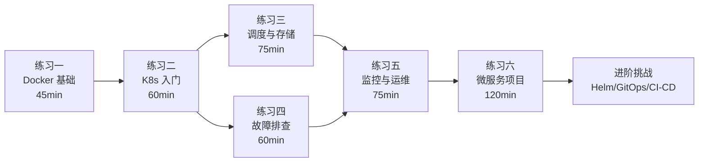

## 练习方法

容器与编排是现代云原生架构的基石。本章通过 6 个递进式练习，覆盖从 Docker 镜像构建到 Kubernetes 集群运维的完整知识链。每个练习都包含理论背景、真实命令、预期输出和验证步骤，确保你不仅"做了"，而且"理解了为什么这样做"。

### 学习路线总览



### 环境与工具准备

在开始练习之前，确保你的环境满足以下要求：

| 组件 | 最低要求 | 推荐配置 | 安装方式 |
|------|----------|----------|----------|
| 操作系统 | Linux / macOS / WSL2 | Ubuntu 22.04+ | — |
| CPU | 2 核 | 4 核 | — |
| 内存 | 4 GB | 8 GB | — |
| 磁盘 | 20 GB 可用 | 50 GB SSD | — |
| Docker | 24.0+ | 最新稳定版 | [docs.docker.com](https://docs.docker.com/engine/install/) |
| kubectl | 与集群版本匹配 | 最新 | `curl -LO "https://dl.k8s.io/release/$(curl -L -s https://dl.k8s.io/release/stable.txt)/bin/linux/amd64/kubectl"` |
| minikube | 1.30+ | 最新 | 练习二中安装 |
| Helm | 3.12+ | 最新 | 练习五中安装 |

**可选但推荐的效率工具**：

| 工具 | 用途 | 安装 |
|------|------|------|
| [k9s](https://k9scli.io/) | 终端 UI 实时查看集群状态 | `brew install k9s` 或 `snap install k9s` |
| [dive](https://github.com/wagoodman/dive) | 逐层分析 Docker 镜像 | `brew install dive` 或 `apt install dive` |
| [kubectx/kubens](https://github.com/ahmetb/kubectx) | 快速切换 context/namespace | `brew install kubectx` |
| [stern](https://github.com/stern/stern) | 多 Pod 日志聚合查看 | `brew install stern` |
| [hey](https://github.com/rakyll/hey) | HTTP 压测工具 | `go install github.com/rakyll/hey@latest` |

> **学习建议**：每天完成 1-2 个练习，总计 5-7 天。每个练习结束后做一次清理（见各练习末尾的清理步骤），再进入下一个。遇到问题时优先使用 `kubectl describe` 和 `kubectl logs`，养成"先观察再行动"的排障习惯。

---

### 练习一：Docker 基础操作（预计 45 分钟）

> **为什么从 Docker 开始？** Kubernetes 的最小调度单元是 Pod，而 Pod 的核心是容器。不理解镜像分层、缓存机制和容器生命周期，后续的 K8s 资源配置就只是"复制粘贴 YAML"。本练习让你建立起"容器思维"——如何把应用打包成可移植、可复现的单元。

**目标**：掌握 Docker 镜像构建、容器生命周期管理和基础网络配置，能够在本地环境中独立运行容器化应用。

**步骤**：

1. **环境准备与镜像拉取**（10 分钟）

   ```bash
   # 确认 Docker 安装正常
   docker version
   docker info

   # 拉取官方 nginx 镜像并观察分层结构
   docker pull nginx:1.25-alpine
   docker inspect nginx:1.25-alpine --format '{{.RootFS.Layers}}'

   # 对比不同基础镜像的大小差异
   docker images | grep nginx
   # REPOSITORY   TAG            SIZE
   # nginx        1.25-alpine    ~42MB
   # nginx        1.25           ~187MB

   # 使用 dive 工具分析镜像层（如未安装：apt install dive 或 brew install dive）
   # dive nginx:1.25-alpine
   ```

   **理解镜像分层**：Docker 镜像是由多个只读层（Layer）叠加而成。每一层对应 Dockerfile 中的一条指令。Alpine 镜像小是因为它基于 Alpine Linux（~5MB）而非 Debian（~70MB）。实际项目中，选择 Alpine 或 `slim` 变体可以将最终镜像缩小 50%-75%。

2. **编写与构建 Dockerfile**（15 分钟）

   创建一个 Python Web 应用并容器化：

   ```bash
   mkdir -p ~/docker-lab &amp;&amp; cd ~/docker-lab
   ```

   创建 `app.py`：

   ```python
   from flask import Flask
   import os
   app = Flask(__name__)

   @app.route('/')
   def hello():
       return f"Hello from {os.uname().nodename}\n"

   @app.route('/health')
   def health():
       return "OK\n"

   if __name__ == '__main__':
       app.run(host='0.0.0.0', port=5000)
   ```

   创建 `requirements.txt`：

   ```text
   flask==3.0.0
   ```

   创建 `.dockerignore`（容易遗漏但影响巨大——缺少此文件会导致构建上下文包含所有文件，拖慢构建速度并可能泄露敏感信息）：

   ```text
   __pycache__
   *.pyc
   .git
   .env
   venv/
   node_modules/
   *.md
   ```

   创建 `Dockerfile`（使用多阶段构建和缓存优化）：

   ```dockerfile
   # 构建阶段
   FROM python:3.11-slim AS builder
   WORKDIR /build
   COPY requirements.txt .
   RUN pip install --no-cache-dir --prefix=/install -r requirements.txt

   # 运行阶段
   FROM python:3.11-slim
   RUN groupadd -r appuser &amp;&amp; useradd -r -g appuser appuser
   WORKDIR /app
   COPY --from=builder /install /usr/local
   COPY app.py .
   USER appuser
   EXPOSE 5000
   CMD ["python", "app.py"]
   ```

   **关键设计决策解析**：

   | 技术点 | 做法 | 为什么 |
   |--------|------|--------|
   | 多阶段构建 | `AS builder` + `COPY --from=builder` | 编译工具不进入最终镜像，减小体积 |
   | 非 root 用户 | `USER appuser` | 安全最佳实践——容器逃逸后仍是低权限用户 |
   | `--no-cache-dir` | pip 安装时禁用缓存 | 避免缓存文件占用镜像空间 |
   | 层顺序优化 | `COPY requirements.txt` 在 `COPY app.py` 之前 | 依赖不变时命中缓存，代码改动不触发重装 |

   构建并验证镜像大小：

   ```bash
   docker build -t my-webapp:v1 .

   # 查看镜像层，确认构建缓存生效
   docker history my-webapp:v1

   # 重新构建（代码无变化时应秒级完成，命中缓存）
   docker build -t my-webapp:v1 .
   ```

3. **容器运行与生命周期管理**（10 分钟）

   ```bash
   # 启动容器（后台运行，端口映射）
   docker run -d --name web1 -p 8080:5000 my-webapp:v1

   # 验证服务可用
   curl http://localhost:8080/
   curl http://localhost:8080/health

   # 查看容器运行状态
   docker ps
   docker stats web1 --no-stream

   # 查看容器日志
   docker logs web1 --tail 20

   # 进入容器内部调试
   docker exec -it web1 /bin/bash
   # 在容器内执行：whoami / curl localhost:5000/health / exit

   # 停止并删除容器
   docker stop web1 &amp;&amp; docker rm web1
   ```

   **容器生命周期状态机**：`created` → `running` → `paused`（`docker pause`）→ `running`（`docker unpause`）→ `stopped`（`docker stop`，发送 SIGTERM 后等待 10s 再 SIGKILL）→ `deleted`（`docker rm`）。理解这个流程有助于排查"为什么容器停不掉"之类的问题。

4. **Volume 数据持久化**（10 分钟）

   ```bash
   # 使用命名卷持久化数据
   docker volume create app-data
   docker run -d --name web2 \
     -v app-data:/app/data \
     -p 8081:5000 \
     my-webapp:v1

   # 查看卷挂载详情
   docker inspect web2 --format '{{json .Mounts}}' | python3 -m json.tool

   # 停止容器后卷数据仍然存在
   docker stop web2 &amp;&amp; docker rm web2
   docker volume inspect app-data  # 卷依然存在

   # 清理
   docker volume rm app-data
   ```

   **三种挂载方式对比**：

   | 类型 | 命令示例 | 数据位置 | 适用场景 |
   |------|----------|----------|----------|
   | 命名卷（Volume） | `-v mydata:/app/data` | Docker 管理的目录（`/var/lib/docker/volumes/`） | 数据库、持久化数据 |
   | 绑定挂载（Bind Mount） | `-v /host/path:/app/data` | 宿主机指定路径 | 开发时热重载、配置文件挂载 |
   | tmpfs 挂载 | `--tmpfs /app/cache` | 内存 | 敏感信息、临时缓存 |

**检查标准**：

- [ ] 能够编写包含多阶段构建的 Dockerfile
- [ ] 能构建、运行、调试和清理容器
- [ ] 理解镜像层和缓存机制
- [ ] 能够使用 Volume 持久化数据
- [ ] 能以非 root 用户运行容器

**常见问题**：

| 问题 | 症状 | 解决方案 |
|------|------|----------|
| 端口冲突 | `Bind for 0.0.0.0:8080 failed: port is already allocated` | `docker ps` 查看已占用端口，更换宿主机端口 |
| 镜像过大 | 构建结果远超预期大小 | 检查是否遗漏 `.dockerignore`；是否在最终镜像中包含编译工具；是否使用了 Alpine/slim 基础镜像 |
| 构建缓存失效 | 每次构建都从 `pip install` 开始 | 将不常变化的 `COPY` 指令放在 Dockerfile 靠前位置；`requirements.txt` 在 `app.py` 之前 COPY |
| 容器启动即退出 | `docker ps` 看不到容器 | `docker logs <name>` 查看输出；确认 `CMD`/`ENTRYPOINT` 命令不会立即退出 |

**清理**：

```bash
docker rm -f $(docker ps -aq) 2>/dev/null   # 删除所有容器
docker rmi my-webapp:v1 2>/dev/null          # 删除构建的镜像
```

---

### 练习二：Kubernetes 集群搭建与基础操作（预计 60 分钟）

> **为什么需要 Kubernetes？** 单机 Docker 可以运行容器，但当你需要多副本、自动重启、滚动更新、服务发现时，手动管理 Docker Compose 会变得脆弱且不可维护。Kubernetes 是一个声明式编排系统——你描述"期望状态"，它负责"达成并维持"这个状态。

**目标**：搭建本地 Kubernetes 集群，掌握 Pod、Deployment、Service 的创建与管理，理解 K8s 的声明式 API 工作流。

**步骤**：

1. **搭建本地集群**（15 分钟）

   ```bash
   # 方案一：minikube（推荐个人学习）
   # 安装 minikube
   curl -LO https://storage.googleapis.com/minikube/releases/latest/minikube-linux-amd64
   sudo install minikube-linux-amd64 /usr/local/bin/minikube

   # 启动集群（分配 2 CPU + 4GB 内存以获得足够资源）
   minikube start --cpus=2 --memory=4096 --driver=docker

   # 验证集群状态
   kubectl cluster-info
   kubectl get nodes
   # NAME       STATUS   ROLES           AGE   VERSION
   # minikube   Ready    control-plane   30s   v1.30.0
   ```

   ```bash
   # 方案二：kind（轻量级，适合 CI/CD 测试）
   # go install sigs.k8s.io/kind@latest
   # kind create cluster --name dev --config - <<EOF
   # kind: Cluster
   # apiVersion: kind.x-k8s.io/v1alpha4
   # nodes:
   # - role: control-plane
   # - role: worker
   # - role: worker
   # EOF
   ```

   **minikube vs kind 选型**：

   | 特性 | minikube | kind |
   |------|----------|------|
   | 多节点模拟 | 需 `minikube node add` | 原生支持多节点配置 |
   | 启动速度 | 较慢（30-60s） | 快（10-20s） |
   | Docker 集成 | 独立 Docker daemon（需 `eval $(minikube docker-env)`） | 共享宿主机 Docker |
   | 适用场景 | 学习、功能验证 | CI/CD、多节点测试 |
   | Dashboard | 内置 `minikube dashboard` | 需手动安装 |

2. **部署应用到集群**（15 分钟）

   创建 `webapp-deployment.yaml`：

   ```yaml
   apiVersion: apps/v1
   kind: Deployment
   metadata:
     name: webapp
   spec:
     replicas: 3
     selector:
       matchLabels:
         app: webapp
     template:
       metadata:
         labels:
           app: webapp
       spec:
         containers:
         - name: webapp
           image: my-webapp:v1
           ports:
           - containerPort: 5000
           resources:
             requests:
               cpu: "100m"
               memory: "128Mi"
             limits:
               cpu: "250m"
               memory: "256Mi"
           readinessProbe:
             httpGet:
               path: /health
               port: 5000
             initialDelaySeconds: 5
             periodSeconds: 10
           livenessProbe:
             httpGet:
               path: /health
               port: 5000
             initialDelaySeconds: 15
             periodSeconds: 20
   ```

   **理解资源请求与限制**：

   ```mermaid
   graph LR
       A[requests] -->|调度依据| B[Node 选择]
       C[limits] -->|运行时强制| D[CPU 限流 / OOM Kill]
   ```

   - `requests`：调度器据此选择 Node（确保 Node 有足够资源）
   - `limits`：运行时硬上限——CPU 超限被限流（throttle），内存超限被 OOM Kill
   - **最佳实践**：requests 设为实际使用量的 70%-80%，limits 设为 requests 的 1.5-2 倍

   ```bash
   # 将本地镜像导入 minikube（minikube 使用独立的 Docker daemon）
   eval $(minikube docker-env)
   docker build -t my-webapp:v1 .
   # 注意：导入后需退出 minikube 环境或在 minikube 内操作

   # 部署
   kubectl apply -f webapp-deployment.yaml

   # 观察 Pod 启动过程（等待所有 Pod 变为 Running）
   kubectl get pods -w

   # 查看 Pod 详情，确认资源请求和探针配置
   kubectl describe pod -l app=webapp | grep -A5 "Limits\|Requests\|Probes"
   ```

3. **Service 暴露与流量路由**（15 分钟）

   创建 `webapp-service.yaml`：

   ```yaml
   apiVersion: v1
   kind: Service
   metadata:
     name: webapp
   spec:
     type: NodePort
     selector:
       app: webapp
     ports:
     - port: 5000
       targetPort: 5000
       protocol: TCP
   ```

   > **为什么不用 LoadBalancer？** LoadBalancer 类型需要云厂商的负载均衡器支持（如 AWS ELB、GCP Cloud Load Balancer）。在本地 minikube 环境中，NodePort 是最实际的选择——它在每个 Node 上开放一个端口（范围 30000-32767），通过 `minikube service` 或 `port-forward` 访问。

   ```bash
   # 创建 Service
   kubectl apply -f webapp-service.yaml

   # 获取访问地址
   # minikube 方式
   minikube service webapp --url
   # 输出类似：http://192.168.49.2:31234

   # 或使用 kubectl port-forward（开发调试推荐）
   kubectl port-forward service/webapp 9090:5000 &amp;
   curl http://localhost:9090/
   # Hello from webapp-xxxx-xxxxx

   # 查看 Service 的 Endpoints，确认 3 个 Pod IP 被正确选中
   kubectl get endpoints webapp
   # NAME      ENDPOINTS                                       AGE
   # webapp    10.244.1.5:5000,10.244.2.8:5000,10.244.3.3:5000   30s
   ```

   **Service 类型速查**：

   | 类型 | 访问范围 | 典型场景 |
   |------|----------|----------|
   | ClusterIP（默认） | 集群内部 | 内部微服务通信 |
   | NodePort | 集群外部（通过 Node IP:Port） | 本地测试、开发环境 |
   | LoadBalancer | 集群外部（通过云 LB） | 生产环境对外暴露 |
   | ExternalName | 集群外部（DNS CNAME） | 访问集群外部服务 |

4. **声明式管理与更新**（15 分钟）

   ```bash
   # 查看当前 Deployment 状态
   kubectl rollout status deployment/webapp

   # 修改镜像版本触发滚动更新
   kubectl set image deployment/webapp webapp=my-webapp:v2

   # 观察滚动更新过程（maxUnavailable=25%, maxSurge=25% 是默认值）
   kubectl rollout status deployment/webapp

   # 查看更新历史
   kubectl rollout history deployment/webapp

   # 验证：逐个替换，始终有可用 Pod
   kubectl get pods -l app=webapp -o wide

   # 如果更新有问题，一键回滚
   kubectl rollout undo deployment/webapp
   kubectl rollout status deployment/webapp
   # 回滚完成后验证版本
   kubectl get deployment webapp -o jsonpath='{.spec.template.spec.containers[0].image}'
   ```

   **滚动更新策略解析**：Kubernetes 默认使用 `RollingUpdate` 策略，通过 `maxSurge`（最多多出几个 Pod）和 `maxUnavailable`（最多几个 Pod 不可用）控制更新节奏。设为 `maxSurge: 1, maxUnavailable: 0` 可以保证零停机更新——先创建新 Pod，健康检查通过后再终止旧 Pod。

**检查标准**：

- [ ] 集群搭建成功，节点状态为 Ready
- [ ] Deployment 的 3 个 Pod 全部 Running 且通过健康检查
- [ ] 能通过 Service 或 port-forward 访问应用
- [ ] 能执行滚动更新并回滚
- [ ] 理解声明式 API 的 apply/update/delete 语义

**常见问题**：

| 问题 | 诊断方法 | 解决方案 |
|------|----------|----------|
| Pod 处于 Pending | `kubectl describe pod <name>` 查看 Events | 资源不足（调整 requests）或镜像拉取失败（检查镜像名和 registry 连通性） |
| minikube 中镜像不可用 | Pod 事件显示 `ImagePullBackOff` | 需先 `eval $(minikube docker-env)` 在 minikube 的 Docker 环境中构建 |
| Service 无 Endpoints | `kubectl get endpoints <svc>` 显示 `<none>` | 检查 Pod 的 `app` 标签是否与 Service 的 `selector` 匹配 |
| Pod 反复重启 | `kubectl get pods -w` 看 RESTARTS 增长 | `kubectl logs <pod> --previous` 查看崩溃日志 |

**清理**：

```bash
kubectl delete -f webapp-service.yaml
kubectl delete -f webapp-deployment.yaml
```

---

### 练习三：Kubernetes 高级调度与存储（预计 75 分钟）

> **为什么需要调度策略？** 在单节点 minikube 中，所有 Pod 都跑在同一个 Node 上。但在生产环境的多节点集群中，你需要控制"Pod 跑在哪个节点"以及"同类 Pod 是否分散部署"——这直接决定了应用的高可用性和性能。

**目标**：掌握节点亲和性、Pod 反亲和性、ConfigMap/Secret、PV/PVC 存储配置，理解有状态应用的部署策略。

**步骤**：

1. **节点标签与亲和性调度**（15 分钟）

   ```bash
   # 给节点打标签
   kubectl label nodes minikube disk-type=ssd
   kubectl label nodes minikube workload=frontend

   # 查看节点标签
   kubectl get nodes --show-labels

   # 创建一个要求调度到 ssd 节点的 Pod
   cat <<EOF | kubectl apply -f -
   apiVersion: v1
   kind: Pod
   metadata:
     name: ssd-pod
   spec:
     affinity:
       nodeAffinity:
         requiredDuringSchedulingIgnoredDuringExecution:
           nodeSelectorTerms:
           - matchExpressions:
             - key: disk-type
               operator: In
               values: ["ssd"]
     containers:
     - name: pause
       image: registry.k8s.io/pause:3.9
   EOF

   # 验证调度结果
   kubectl get pod ssd-pod -o wide
   # 确认 NODE 列是 minikube
   ```

   **节点亲和性运算符**：

   | operator | 含义 | 示例 |
   |----------|------|------|
   | `In` | 值在列表中 | `values: ["ssd", "nvme"]` |
   | `NotIn` | 值不在列表中 | `values: ["hdd"]` |
   | `Exists` | 标签存在（不需要 values） | `key: gpu` |
   | `DoesNotExist` | 标签不存在 | `key: spot` |
   | `Gt` / `Lt` | 大于 / 小于（数值比较） | `values: ["8"]`（如核数） |

2. **Pod 反亲和性 — 高可用部署**（20 分钟）

   创建 `ha-deployment.yaml`：

   ```yaml
   apiVersion: apps/v1
   kind: Deployment
   metadata:
     name: ha-web
   spec:
     replicas: 3
     selector:
       matchLabels:
         app: ha-web
     template:
       metadata:
         labels:
           app: ha-web
       spec:
         affinity:
           podAntiAffinity:
             # 软反亲和：尽量分散，但不强制
             preferredDuringSchedulingIgnoredDuringExecution:
             - weight: 100
               podAffinityTerm:
                 labelSelector:
                   matchExpressions:
                   - key: app
                     operator: In
                     values: ["ha-web"]
                 topologyKey: kubernetes.io/hostname
         containers:
         - name: web
           image: nginx:1.25-alpine
           resources:
             requests:
               cpu: "50m"
               memory: "64Mi"
   ```

   ```bash
   kubectl apply -f ha-deployment.yaml
   # 验证 Pod 分布在不同节点（minikube 单节点下会退回到同一节点）
   kubectl get pods -l app=ha-web -o wide
   # 但在多节点集群中，应看到每个 Pod 在不同 Node
   ```

   **硬亲和 vs 软亲和**：

   | 策略 | 效果 | 风险 |
   |------|------|------|
   | `requiredDuring...`（硬） | 不满足则 Pod 不调度 | 节点不足时 Pod 永远 Pending |
   | `preferredDuring...`（软） | 尽量满足，不满足也能调度 | 可能分布不均匀但不会阻塞 |

   **生产建议**：高可用服务用软反亲和（weight 100），保证"尽量分散"；关键组件（如数据库主从）用硬亲和，确保"一定分散"。

3. **ConfigMap 与 Secret 管理**（20 分钟）

   ```bash
   # 创建 ConfigMap
   kubectl create configmap app-config --from-literal=LOG_LEVEL=debug \
     --from-literal=APP_PORT=5000

   # 创建 Secret（注意：base64 编码不是加密）
   kubectl create secret generic app-secrets \
     --from-literal=DB_PASSWORD='p@ssw0rd123' \
     --from-literal=API_KEY='***'

   # 创建使用这些配置的 Pod
   cat <<EOF | kubectl apply -f -
   apiVersion: v1
   kind: Pod
   metadata:
     name: config-demo
   spec:
     containers:
     - name: demo
       image: busybox:1.36
       command: ["sleep", "3600"]
       envFrom:
       - configMapRef:
           name: app-config
       - secretRef:
           name: app-secrets
       volumeMounts:
       - name: config-vol
         mountPath: /etc/config
         readOnly: true
   volumes:
   - name: config-vol
     configMap:
       name: app-config
   EOF

   # 验证环境变量注入
   kubectl exec config-demo -- env | grep -E "LOG_LEVEL|APP_PORT|DB_PASSWORD"
   # LOG_LEVEL=debug
   # APP_PORT=5000
   # DB_PASSWORD=p@ssw0rd123

   # 验证挂载的文件
   kubectl exec config-demo -- cat /etc/config/LOG_LEVEL
   # debug

   # 清理
   kubectl delete pod config-demo
   ```

   **ConfigMap vs Secret**：

   | 维度 | ConfigMap | Secret |
   |------|-----------|--------|
   | 数据编码 | 明文 | Base64（注意：不是加密） |
   | 存储位置 | etcd（明文） | etcd（加密需要 KMS 配置） |
   | 用途 | 非敏感配置（端口、日志级别、特性开关） | 敏感信息（密码、Token、证书） |
   | 注入方式 | 环境变量 / 卷挂载 | 环境变量 / 卷挂载（同 ConfigMap） |
   | 生产安全 | 注意 etcd 加密 | 配合 Vault / 云 KMS 使用 |

   > **安全提醒**：Kubernetes Secret 的 base64 编码不提供任何安全性——任何人都可以用 `kubectl get secret -o yaml` 解码。生产环境应启用 [etcd 加密](https://kubernetes.io/docs/tasks/administer-cluster/encrypt-data/) 或使用外部密钥管理（如 HashiCorp Vault、AWS Secrets Manager）。

4. **存储：PVC 动态供给**（20 分钟）

   ```bash
   # minikube 默认提供 standard StorageClass
   kubectl get storageclass
   # NAME                 PROVISIONER                RECLAIMPOLICY
   # standard (default)   k8s.io/minikube-hostpath   Delete

   # 创建 PVC
   cat <<EOF | kubectl apply -f -
   apiVersion: v1
   kind: PersistentVolumeClaim
   metadata:
     name: data-pvc
   spec:
     accessModes:
     - ReadWriteOnce
     resources:
       requests:
         storage: 1Gi
     storageClassName: standard
   EOF

   # 创建使用 PVC 的 Pod
   cat <<EOF | kubectl apply -f -
   apiVersion: v1
   kind: Pod
   metadata:
     name: storage-demo
   spec:
     containers:
     - name: writer
       image: busybox:1.36
       command: ["sh", "-c", "echo 'Hello PVC' > /data/test.txt &amp;&amp; sleep 3600"]
       volumeMounts:
       - name: data
         mountPath: /data
     volumes:
     - name: data
       persistentVolumeClaim:
         claimName: data-pvc
   EOF

   # 验证数据写入
   kubectl exec storage-demo -- cat /data/test.txt
   # Hello PVC

   # 删除 Pod 后重新创建，验证数据持久化
   kubectl delete pod storage-demo
   # 重新创建同名 Pod 使用同一 PVC
   # kubectl apply -f （上面的 Pod YAML）
   kubectl get pod storage-demo
   kubectl exec storage-demo -- cat /data/test.txt
   # Hello PVC — 数据保留
   ```

   **存储对象关系**：

   ```mermaid
   graph LR
       SC[StorageClass<br/>定义存储类型] -->|动态创建| PV[PersistentVolume<br/>实际存储]
       PVC[PersistentVolumeClaim<br/>存储申请] -->|绑定| PV
       Pod -->|挂载| PVC
   ```

   **访问模式**：

   | 模式 | 缩写 | 含义 | 典型场景 |
   |------|------|------|----------|
   | ReadWriteOnce | RWO | 单 Node 读写 | 数据库、单副本应用 |
   | ReadOnlyMany | ROX | 多 Node 只读 | 静态资源、共享配置 |
   | ReadWriteMany | RWX | 多 Node 读写 | 文件服务器、共享存储 |

**检查标准**：

- [ ] 能够给节点打标签并使用 nodeAffinity 调度 Pod
- [ ] 理解 podAntiAffinity 在高可用部署中的作用
- [ ] 能创建 ConfigMap/Secret 并注入到 Pod
- [ ] 能通过 PVC 动态创建存储并验证数据持久化

**清理**：

```bash
kubectl delete pod ssd-pod
kubectl delete -f ha-deployment.yaml
kubectl delete configmap app-config
kubectl delete secret app-secrets
kubectl delete pod storage-demo
kubectl delete pvc data-pvc
```

---

### 练习四：容器故障排查实战（预计 60 分钟）

> **为什么排查能力比编写能力更重要？** 在生产环境中，你会花更多时间诊断"为什么 Pod 没有正常运行"，而不是写 YAML。掌握系统化的排障流程——从事件、日志、指标三个维度定位根因——是 K8s 运维工程师的核心竞争力。

**目标**：能够系统化地诊断 Pod 启动失败、CrashLoopBackOff、OOMKilled、网络不通等常见问题，掌握 kubectl debug 和日志分析技巧。

**步骤**：

1. **模拟并排查 CrashLoopBackOff**（15 分钟）

   ```bash
   # 创建一个会崩溃的 Pod
   cat <<EOF | kubectl apply -f -
   apiVersion: v1
   kind: Pod
   metadata:
     name: crash-pod
   spec:
     containers:
     - name: buggy
       image: busybox:1.36
       command: ["sh", "-c", "echo starting; sleep 2; echo 'FATAL: something broke'; exit 1"]
   EOF

   # 等待 Pod 进入 CrashLoopBackOff
   kubectl get pod crash-pod -w
   # NAME        READY   STATUS             RESTARTS   AGE
   # crash-pod   0/1     CrashLoopBackOff   2          30s

   # 第一步：查看 Pod 事件（包含退出码）
   kubectl describe pod crash-pod | tail -20
   # 关注：Exit Code: 1, Reason: Error, Last State: Terminated

   # 第二步：查看已终止容器的日志（即使 Pod 已重启）
   kubectl logs crash-pod --previous
   # starting
   # FATAL: something broke

   # 第三步：检查容器退出码含义
   # Exit Code 1   — 应用错误
   # Exit Code 137  — SIGKILL（OOMKilled 或手动 kill）
   # Exit Code 139  — SIGSEGV（段错误）
   # Exit Code 143  — SIGTERM（优雅终止）
   ```

   **容器退出码速查表**：

   | 退出码 | 信号 | 含义 | 常见原因 |
   |--------|------|------|----------|
   | 0 | — | 正常退出 | 脚本执行完毕、应用 graceful shutdown |
   | 1 | SIGHUP | 应用错误 | 代码 bug、配置错误、依赖不可用 |
   | 126 | — | 权限不足 | 启动命令无执行权限 |
   | 127 | — | 命令未找到 | Dockerfile 中 CMD/ENTRYPOINT 路径错误 |
   | 137 | SIGKILL | 被强制终止 | OOMKilled（内存超限）或 `kubectl delete` |
   | 139 | SIGSEGV | 段错误 | 空指针、内存越界（C/C++/Rust 应用常见） |
   | 143 | SIGTERM | 优雅终止 | `terminationGracePeriodSeconds` 超时后被强杀 |

2. **模拟并排查 OOMKilled**（15 分钟）

   ```bash
   # 创建一个内存超出限制的 Pod
   cat <<EOF | kubectl apply -f -
   apiVersion: v1
   kind: Pod
   metadata:
     name: oom-pod
   spec:
     containers:
     - name: memory-hog
       image: busybox:1.36
       command: ["sh", "-c", "a=''; while true; do a=\$a\$a\$a; done"]
       resources:
         limits:
           memory: "50Mi"
         requests:
           memory: "32Mi"
   EOF

   # 等待 OOMKilled 发生
   kubectl get pod oom-pod -w
   # NAME       READY   STATUS      RESTARTS   AGE
   # oom-pod    0/1     OOMKilled   1          45s

   # 排查
   kubectl describe pod oom-pod | grep -A5 "Last State"
   # Last State: Terminated
   #   Reason: OOMKilled
   #   Exit Code: 137
   #   Memory Limit: 50Mi

   # 查看监控指标（如果安装了 metrics-server）
   # kubectl top pod oom-pod
   ```

   **OOM 排障决策树**：

   ```mermaid
   graph TD
       A[Pod OOMKilled] --> B{limits 设置是否合理?}
       B -->|过低| C[调高 memory limits]
       B -->|合理| D{应用本身内存泄漏?}
       D -->|是| E[修复应用内存问题]
       D -->|否| F{requests 是否导致<br/>调度到小节点?}
       F -->|是| G[调整 requests 或<br/>选择更大节点]
       F -->|否| H[检查是否需要<br/>JVM/Go GC 调优]
   ```

3. **网络问题排查**（15 分钟）

   ```bash
   # 创建一个 Service 指向不存在的 Pod 标签
   cat <<EOF | kubectl apply -f -
   apiVersion: v1
   kind: Service
   metadata:
     name: broken-svc
   spec:
     selector:
       app: nonexistent
     ports:
     - port: 80
       targetPort: 80
   EOF

   # 问题：Service 没有 Endpoints
   kubectl get endpoints broken-svc
   # NAME         ENDPOINTS   AGE
   # broken-svc   <none>      10s

   # 使用 debug 容器排查网络连通性
   kubectl run debug --rm -it --image=nicolaka/netshoot -- bash

   # 在 debug 容器中执行（以下命令在 kubectl run 的容器内）：
   # nslookup broken-svc.default.svc.cluster.local
   # curl -v http://broken-svc:80
   # curl -v http://kubernetes.default.svc:443
   # cat /etc/resolv.conf

   # 也可以使用 kubectl exec 进入已有 Pod 进行排查
   # kubectl exec <existing-pod> -- curl -s http://service-name:port/health
   ```

   **Kubernetes DNS 解析规则**：

   | 服务类型 | DNS 名称 | 示例 |
   |----------|----------|------|
   | 集群内 Service | `<svc>.<ns>.svc.cluster.local` | `backend.default.svc.cluster.local` |
   | 跨命名空间 | 需完整 FQDN | `mysql.team-backend.svc.cluster.local` |
   | 简写（同命名空间） | `<svc>` | `backend` |
   | Headless Service | `<pod>.<svc>.<ns>.svc.cluster.local` | `mysql-0.mysql.default.svc.cluster.local` |

4. **kubectl debug 高级调试**（15 分钟）

   ```bash
   # 在运行中的 Pod 上附加临时调试容器（需要 K8s 1.25+，EphemeralContainers 特性）
   # 注意：minikube 默认不支持，需要启用 feature gate
   # 以下演示通用的排查流程

   # 方式一：kubectl exec 进入现有容器
   kubectl exec -it deployment/webapp -- /bin/sh
   # 在容器内执行：
   # ps aux            — 查看进程
   # netstat -tlnp     — 查看监听端口
   # cat /proc/1/cgroup — 确认 cgroup 归属
   # strace -p 1       — 追踪系统调用（需要容器有 strace）

   # 方式二：使用临时调试容器（支持的集群）
   # kubectl debug -it <pod-name> --image=busybox:1.36 --target=<container-name>

   # 方式三：使用 node-level debug（需要特权节点）
   # kubectl debug node/minikube -it --image=ubuntu:22.04
   # 在 node debug shell 中：
   # chroot /host      — 进入宿主机文件系统
   # crictl ps          — 查看节点上的容器
   # journalctl -u kubelet | tail -50
   ```

   **系统化排障流程**：

   ```mermaid
   graph TD
       A[Pod 异常] --> B[kubectl get pods<br/>查看状态和重启次数]
       B --> C[kubectl describe pod<br/>查看 Events]
       C --> D{事件中是否有<br/>明确线索?}
       D -->|镜像拉取失败| E[检查镜像名/<br/>Registry 权限]
       D -->|资源不足| F[调整 requests/limits]
       D -->|探针失败| G[检查探针配置/<br/>应用端口]
       D -->|无明确信息| H[kubectl logs<br/>查看应用日志]
       H --> I{日志有错误?}
       I -->|是| J[修复应用代码/配置]
       I -->|否| K[检查网络/DNS/<br/>依赖服务]
   ```

   **通用诊断命令清单**：

   | 命令 | 用途 | 适用场景 |
   |------|------|----------|
   | `kubectl get events --sort-by='.lastTimestamp'` | 查看集群事件时间线 | 快速定位最近发生的异常 |
   | `kubectl describe <resource> <name>` | 查看资源详情和事件 | 排查任何资源问题的第一步 |
   | `kubectl logs <pod> [--previous] [--tail=100]` | 查看日志 | 应用级错误排查 |
   | `kubectl get pod <name> -o yaml` | 查看完整 Pod 定义 | 检查配置是否正确应用 |
   | `kubectl logs -l app=xxx --all-containers=true` | 按标签查看所有 Pod 日志 | 批量检查同组 Pod |
   | `kubectl exec -it <pod> -- /bin/sh` | 进入容器内部 | 网络连通性、文件系统检查 |

**检查标准**：

- [ ] 能根据退出码判断 CrashLoopBackOff 的原因
- [ ] 能识别 OOMKilled 并合理调整内存限制
- [ ] 能排查 Service Endpoints 为空的问题
- [ ] 熟练使用 kubectl describe/logs/exec 进行诊断

**清理**：

```bash
kubectl delete pod crash-pod oom-pod
kubectl delete svc broken-svc
```

---

### 练习五：监控告警与集群运维（预计 75 分钟）

> **没有监控的集群是盲人开车。** 你需要知道集群的健康状态、资源使用趋势、异常事件——而不是等到用户投诉才去排查。Prometheus + Grafana 是 K8s 原生监控的事实标准，掌握这套工具链是运维工程师的必备技能。

**目标**：搭建 Prometheus + Grafana 监控栈，配置告警规则，掌握集群扩容、资源配额管理和 RBAC 权限控制。

**步骤**：

1. **安装监控栈**（20 分钟）

   ```bash
   # 使用 Helm 安装 Prometheus Operator（推荐的 K8s 原生监控方案）
   # 安装 Helm（如未安装）
   curl https://raw.githubusercontent.com/helm/helm/main/scripts/get-helm-3 | bash

   # 添加 Prometheus 社区 Helm 仓库
   helm repo add prometheus-community https://prometheus-community.github.io/helm-charts
   helm repo update

   # 创建监控命名空间
   kubectl create namespace monitoring

   # 安装 kube-prometheus-stack（包含 Prometheus + Grafana + AlertManager）
   helm install prometheus prometheus-community/kube-prometheus-stack \
     --namespace monitoring \
     --set grafana.adminPassword=admin123

   # 等待所有组件就绪
   kubectl get pods -n monitoring -w

   # 验证 Prometheus 正在采集指标
   kubectl port-forward -n monitoring svc/prometheus-kube-prometheus-prometheus 9090:9090
   # 访问 http://localhost:9090/targets 查看采集目标

   # 验证 Grafana 可访问
   kubectl port-forward -n monitoring svc/prometheus-grafana 3000:80
   # 访问 http://localhost:3000，用户名 admin，密码 admin123
   ```

   **监控栈组件关系**：

   ```mermaid
   graph TD
       A[应用 Pod<br/>+ /metrics 端点] -->|暴露指标| B[Prometheus<br/>主动拉取采集]
       B -->|存储时序数据| C[Prometheus TSDB]
       B -->|触发告警规则| D[AlertManager<br/>告警路由与去重]
       D -->|通知| E[Slack/Email/PagerDuty]
       B -->|查询数据源| F[Grafana<br/>可视化仪表板]
   ```

2. **查看集群关键指标**（15 分钟）

   ```bash
   # 通过 Prometheus API 查询指标

   # Pod CPU 使用率
   # 在 Grafana 中查询：rate(container_cpu_usage_seconds_total{namespace="default"}[5m])

   # 内存使用率
   # container_memory_usage_bytes{namespace="default"} / container_spec_memory_limit_bytes * 100

   # 网络流量
   # rate(container_network_receive_bytes_total{namespace="default"}[5m])

   # 如果安装了 metrics-server，也可以用 kubectl top
   kubectl top nodes
   kubectl top pods -l app=webapp
   # NAME          CPU(cores)   MEMORY(bytes)
   # webapp-xxx    5m           32Mi
   # webapp-yyy    3m           28Mi
   ```

   **需要关注的核心指标**：

   | 指标类别 | 关键指标 | 告警阈值建议 |
   |----------|----------|--------------|
   | CPU | `container_cpu_usage_seconds_total` | > 80% 持续 5 分钟 |
   | 内存 | `container_memory_working_set_bytes / limit` | > 85% 持续 5 分钟 |
   | 网络 | `container_network_receive/transmit_bytes_total` | 突增 300% |
   | 磁盘 | `node_filesystem_avail_bytes` | < 15% |
   | Pod | `kube_pod_container_status_restarts_total` | 1 小时内 > 3 次重启 |
   | 节点 | `kube_node_status_condition` | NotReady 持续 > 5 分钟 |

3. **配置告警规则**（20 分钟）

   在 Grafana 中创建告警，或直接配置 Prometheus 告警规则：

   ```yaml
   # 在 Grafana 中创建一个仪表板面板（推荐初学者）：
   # 1. 进入 Grafana → Dashboards → New Dashboard
   # 2. 添加面板，查询 PromQL：
   #    - Pod CPU: sum(rate(container_cpu_usage_seconds_total{namespace="default"}[5m])) by (pod)
   #    - Pod Memory: sum(container_memory_working_set_bytes{namespace="default"}) by (pod)
   #    - Pod Restart Count: increase(kube_pod_container_status_restarts_total{namespace="default"}[1h])
   # 3. 设置面板阈值：CPU > 80% 红色，Memory > 85% 红色

   # 配置 Prometheus 告警规则（通过 PrometheusRule CRD）：
   cat <<EOF | kubectl apply -f -
   apiVersion: monitoring.coreos.com/v1
   kind: PrometheusRule
   metadata:
     name: pod-alerts
     namespace: monitoring
   spec:
     groups:
     - name: pod-health
       rules:
       - alert: PodHighMemoryUsage
         expr: |
           (container_memory_working_set_bytes{namespace="default"} /
            container_spec_memory_limit_bytes{namespace="default"}) > 0.85
         for: 5m
         labels:
           severity: warning
         annotations:
           summary: "Pod {{ \$labels.pod }} 内存使用率超过 85%"
       - alert: PodCrashLooping
         expr: |
           increase(kube_pod_container_status_restarts_total{namespace="default"}[1h]) > 3
         for: 5m
         labels:
           severity: critical
         annotations:
           summary: "Pod {{ \$labels.pod }} 在 1 小时内重启超过 3 次"
   EOF
   ```

   **告警级别设计**：

   | 级别 | 含义 | 响应时间 | 示例 |
   |------|------|----------|------|
   | critical | 服务中断或即将中断 | 5 分钟内 | Pod 持续崩溃、节点 NotReady |
   | warning | 资源告警，需关注 | 1 小时内 | 内存 > 85%、磁盘 < 20% |
   | info | 信息通知 | 低优先级 | 扩容事件、证书即将过期 |

4. **集群资源管理与 RBAC**（20 分钟）

   ```bash
   # 创建命名空间并设置资源配额
   cat <<EOF | kubectl apply -f -
   apiVersion: v1
   kind: Namespace
   metadata:
     name: team-frontend
   ---
   apiVersion: v1
   kind: ResourceQuota
   metadata:
     name: team-quota
     namespace: team-frontend
   spec:
     hard:
       requests.cpu: "4"
       requests.memory: "8Gi"
       limits.cpu: "8"
       limits.memory: "16Gi"
       pods: "20"
   ---
   apiVersion: v1
   kind: LimitRange
   metadata:
     name: default-limits
     namespace: team-frontend
   spec:
     limits:
     - default:
         cpu: "500m"
         memory: "512Mi"
       defaultRequest:
         cpu: "100m"
         memory: "128Mi"
       type: Container
   EOF

   # 创建 RBAC 角色（只读用户）
   cat <<EOF | kubectl apply -f -
   apiVersion: rbac.authorization.k8s.io/v1
   kind: Role
   metadata:
     name: pod-reader
     namespace: team-frontend
   rules:
   - apiGroups: [""]
     resources: ["pods", "pods/log"]
     verbs: ["get", "list", "watch"]
   - apiGroups: ["apps"]
     resources: ["deployments"]
     verbs: ["get", "list"]
   ---
   apiVersion: v1
   kind: ServiceAccount
   metadata:
     name: readonly-user
     namespace: team-frontend
   ---
   apiVersion: rbac.authorization.k8s.io/v1
   kind: RoleBinding
   metadata:
     name: read-pods
     namespace: team-frontend
   subjects:
   - kind: ServiceAccount
     name: readonly-user
     namespace: team-frontend
   roleRef:
     kind: Role
     name: pod-reader
     apiGroup: rbac.authorization.k8s.io
   EOF

   # 为 readonly-user 创建 kubeconfig 并验证权限
   # readonly-user 可以查看 Pod，但不能删除或创建
   # kubectl auth can-i list pods --as=system:serviceaccount:team-frontend:readonly-user
   # yes
   # kubectl auth can-i delete pods --as=system:serviceaccount:team-frontend:readonly-user
   # no
   ```

   **资源管控三件套**：

   | 对象 | 作用范围 | 控制什么 |
   |------|----------|----------|
   | ResourceQuota | 命名空间级别 | 该命名空间的 CPU/内存/Pod 总量上限 |
   | LimitRange | 命名空间级别 | 单个 Pod/Container 的默认 limits 和请求范围 |
   | ResourceQuota + LimitRange 组合 | — | 防止单个团队耗尽集群资源 |

   > **RBAC 最小权限原则**：永远只授予必要的权限。开发人员通常只需要 `get`、`list`、`watch` 权限查看资源；CI/CD 流水线需要 `create`、`update`、`patch` 部署权限；运维人员需要 `delete`、`exec` 等高权限操作但应限定命名空间范围。

**检查标准**：

- [ ] Prometheus + Grafana 监控栈部署成功
- [ ] 能查看 Pod/Node 的 CPU 和内存指标
- [ ] 能配置基本的告警规则
- [ ] 理解 ResourceQuota 和 LimitRange 的作用
- [ ] 能创建 RBAC 角色并验证权限

**清理**：

```bash
kubectl delete namespace team-frontend
kubectl delete -n monitoring prometheusrule pod-alerts
# 如需完全卸载监控栈：
# helm uninstall prometheus -n monitoring
# kubectl delete namespace monitoring
```

---

### 练习六：综合项目 — 微服务应用部署（预计 120 分钟）

> **这是前面所有练习的集大成。** 你将把一个包含前端、API 网关、后端服务、数据库的微服务架构完整部署到 Kubernetes——从配置管理、健康检查到自动伸缩、滚动更新，模拟真实的生产部署流程。

**目标**：将一个包含前端、API 网关、后端服务、数据库的微服务架构完整部署到 Kubernetes，涵盖配置管理、健康检查、自动伸缩、滚动更新全流程。

**步骤**：

1. **架构设计**（15 分钟）

   ```mermaid
   graph TD
       A[Ingress] -->|HTTP| B[Frontend]
       A -->|/api/*| C[API Gateway]
       C -->|HTTP| D[Backend Service]
       C -->|HTTP| E[User Service]
       D -->|TCP| F[(MySQL)]
       E -->|TCP| F
       D -->|TCP| G[(Redis Cache)]
   ```

   **各组件职责**：

   | 组件 | 职责 | 副本策略 | 资源需求 |
   |------|------|----------|----------|
   | Frontend | 静态页面渲染 | 2 副本 | 低 CPU，低内存 |
   | API Gateway | 路由、限流、认证 | 2 副本 | 中 CPU，低内存 |
   | Backend Service | 业务逻辑处理 | 2 副本（HPA 2-10） | 中 CPU，中内存 |
   | User Service | 用户管理 | 2 副本 | 中 CPU，低内存 |
   | MySQL | 持久化数据存储 | StatefulSet（1 副本） | 高内存，高存储 |
   | Redis | 缓存和会话管理 | 单副本（学习用） | 低 CPU，中内存 |

   准备以下 YAML 文件：

   ```bash
   mkdir -p ~/k8s-project
   cd ~/k8s-project
   ```

2. **创建 ConfigMap 和 Secret**（10 分钟）

   ```yaml
   # 01-config.yaml
   apiVersion: v1
   kind: ConfigMap
   metadata:
     name: app-config
   data:
     MYSQL_HOST: mysql-service
     REDIS_HOST: redis-service
     LOG_LEVEL: info
     API_RATE_LIMIT: "100"
   ---
   apiVersion: v1
   kind: Secret
   metadata:
     name: app-secrets
   type: Opaque
   data:
     MYSQL_ROOT_PASSWORD: cm9vdHBhc3N3b3Jk
     API_SECRET_KEY: c2VjcmV0a2V5MTIz
   ```

3. **部署 MySQL 有状态服务**（15 分钟）

   ```yaml
   # 02-mysql.yaml
   apiVersion: apps/v1
   kind: StatefulSet
   metadata:
     name: mysql
   spec:
     serviceName: mysql-service
     replicas: 1
     selector:
       matchLabels:
         app: mysql
     template:
       metadata:
         labels:
           app: mysql
       spec:
         containers:
         - name: mysql
           image: mysql:8.0
           env:
           - name: MYSQL_ROOT_PASSWORD
             valueFrom:
               secretKeyRef:
                 name: app-secrets
                 key: MYSQL_ROOT_PASSWORD
           - name: MYSQL_DATABASE
             value: "myapp"
           ports:
           - containerPort: 3306
           resources:
             requests:
               cpu: "250m"
               memory: "512Mi"
             limits:
               cpu: "500m"
               memory: "1Gi"
           volumeMounts:
           - name: mysql-data
             mountPath: /var/lib/mysql
     volumeClaimTemplates:
     - metadata:
         name: mysql-data
       spec:
         accessModes: ["ReadWriteOnce"]
         resources:
           requests:
             storage: 5Gi
   ---
   apiVersion: v1
   kind: Service
   metadata:
     name: mysql-service
   spec:
     selector:
       app: mysql
     ports:
     - port: 3306
   ```

   **StatefulSet vs Deployment**：

   | 维度 | Deployment | StatefulSet |
   |------|------------|-------------|
   | Pod 名称 | 随机后缀（webapp-xxx-yyy） | 有序编号（mysql-0, mysql-1） |
   | 启动/终止顺序 | 无序 | 按序号从大到小终止，从小到大启动 |
   | 网络标识 | 通过 Service 随机路由 | 稳定的 DNS（`mysql-0.mysql-service.default.svc.cluster.local`） |
   | 存储 | 共享或独立 Volume | 每个 Pod 绑定独立 PVC |
   | 适用场景 | 无状态应用 | 数据库、消息队列、分布式存储 |

4. **部署后端服务**（20 分钟）

   ```yaml
   # 03-backend.yaml
   apiVersion: apps/v1
   kind: Deployment
   metadata:
     name: backend
   spec:
     replicas: 2
     selector:
       matchLabels:
         app: backend
     strategy:
       type: RollingUpdate
       rollingUpdate:
         maxSurge: 1
         maxUnavailable: 0
     template:
       metadata:
         labels:
           app: backend
       spec:
         terminationGracePeriodSeconds: 30
         containers:
         - name: backend
           image: backend-app:v1
           ports:
           - containerPort: 8080
           envFrom:
           - configMapRef:
               name: app-config
           - secretRef:
               name: app-secrets
           resources:
             requests:
               cpu: "200m"
               memory: "256Mi"
             limits:
               cpu: "500m"
               memory: "512Mi"
           readinessProbe:
             httpGet:
               path: /health/ready
               port: 8080
             initialDelaySeconds: 10
             periodSeconds: 5
           livenessProbe:
             httpGet:
               path: /health/live
               port: 8080
             initialDelaySeconds: 30
             periodSeconds: 10
           startupProbe:
             httpGet:
               path: /health/started
               port: 8080
             failureThreshold: 30
             periodSeconds: 5
   ---
   apiVersion: v1
   kind: Service
   metadata:
     name: backend-service
   spec:
     selector:
       app: backend
     ports:
     - port: 80
       targetPort: 8080
   ```

   **三种探针的协作机制**：

   ```mermaid
   graph TD
       A[Pod 启动] --> B[startupProbe<br/>检查应用是否启动完成]
       B -->|成功| C[readinessProbe<br/>检查是否可以接收流量]
       B -->|失败| D[Kill Pod 重启]
       C -->|成功| E[加入 Service Endpoints<br/>接收用户流量]
       C -->|失败| F[从 Endpoints 移除<br/>不接收流量]
       E --> G[livenessProbe<br/>持续检查应用是否存活]
       G -->|成功| E
       G -->|失败| H[Kill Pod 重启]
   ```

   | 探针 | 作用 | 失败后果 | 典型配置 |
   |------|------|----------|----------|
   | startupProbe | 启动期检查 | Pod 被 Kill 重启 | `failureThreshold: 30, periodSeconds: 5`（允许最长 150s 启动） |
   | readinessProbe | 就绪检查 | 从 Service Endpoints 移除 | `periodSeconds: 5`（快速响应流量变化） |
   | livenessProbe | 存活检查 | Pod 被 Kill 重启 | `periodSeconds: 10`（避免过于频繁的检查） |

5. **配置 HPA 自动伸缩**（15 分钟）

   ```yaml
   # 04-hpa.yaml
   apiVersion: autoscaling/v2
   kind: HorizontalPodAutoscaler
   metadata:
     name: backend-hpa
   spec:
     scaleTargetRef:
       apiVersion: apps/v1
       kind: Deployment
       name: backend
     minReplicas: 2
     maxReplicas: 10
     metrics:
     - type: Resource
       resource:
         name: cpu
         target:
           type: Utilization
           averageUtilization: 70
     behavior:
       scaleUp:
         stabilizationWindowSeconds: 60
         policies:
         - type: Pods
           value: 2
           periodSeconds: 60
       scaleDown:
         stabilizationWindowSeconds: 300
         policies:
         - type: Percent
           value: 10
           periodSeconds: 120
   ```

   **HPA 行为策略解析**：

   | 策略 | 参数 | 效果 |
   |------|------|------|
   | 快速扩容 | `scaleUp.stabilizationWindowSeconds: 60` | 60 秒内检测到 CPU > 70% 即扩容 |
   | 稳健缩容 | `scaleDown.stabilizationWindowSeconds: 300` | 5 分钟内 CPU 持续 < 70% 才缩容 |
   | 扩容速度 | `scaleUp: value 2, period 60` | 每分钟最多增加 2 个 Pod |
   | 缩容速度 | `scaleDown: value 10%, period 120` | 每 2 分钟最多减少 10% Pod |

   > **为什么要区分缩容和扩容的速度？** 扩容慢会导致用户在流量突增时体验劣化（响应变慢、超时）；缩容快会导致在流量波动时频繁扩缩（Pod 抖动），增加系统不稳定性。因此生产环境通常是"快扩慢缩"。

6. **验证与压测**（25 分钟）

   ```bash
   # 部署所有资源
   kubectl apply -f 01-config.yaml
   kubectl apply -f 02-mysql.yaml
   kubectl apply -f 03-backend.yaml
   kubectl apply -f 04-hpa.yaml

   # 验证部署状态
   kubectl get all -l app=backend
   kubectl get hpa backend-hpa

   # 模拟负载测试（使用 hey 工具，go install github.com/rakyll/hey@latest）
   # 压测前的 HPA 状态
   kubectl get hpa backend-hpa
   # NAME         REFERENCE        TARGETS   MINPODS   MAXPODS   REPLICAS
   # backend-hpa   Deployment/backend   35%/70%   2         10        2

   # 发送 10000 个请求，50 并发
   # hey -n 10000 -c 50 http://localhost:8080/api/data

   # 观察 HPA 自动扩容
   kubectl get hpa backend-hpa -w
   # 目标 CPU 利用率超过 70% 时，副本数应增加

   # 执行滚动更新
   kubectl set image deployment/backend backend=backend-app:v2

   # 观察更新过程（maxUnavailable=0 保证服务不中断）
   kubectl rollout status deployment/backend

   # 回滚测试
   kubectl rollout undo deployment/backend
   kubectl rollout status deployment/backend
   ```

**检查标准**：

- [ ] 所有微服务组件部署成功且通过健康检查
- [ ] HPA 能根据 CPU 使用率自动伸缩
- [ ] 滚动更新和回滚正常工作
- [ ] 能通过日志和指标排查问题

**清理**：

```bash
kubectl delete -f 04-hpa.yaml
kubectl delete -f 03-backend.yaml
kubectl delete -f 02-mysql.yaml
kubectl delete -f 01-config.yaml
kubectl delete pvc -l app=mysql  # 清理 StatefulSet 的 PVC
```

---

### 进阶挑战（选做）

完成以上练习后，以下进阶内容将帮助你向生产级运维迈进。每个挑战都是独立的，可以按兴趣选择。

**挑战一：Helm Chart 开发**

Helm 是 Kubernetes 的包管理器，将多层 YAML 模板化、变量化、版本化。

```bash
# 创建自定义 Helm Chart 骨架
helm create my-chart

# 了解目录结构
# my-chart/
#   Chart.yaml        — 元数据（名称、版本、依赖）
#   values.yaml       — 默认配置值
#   templates/        — K8s YAML 模板
#     deployment.yaml
#     service.yaml
#     ingress.yaml
#     _helpers.tpl    — 模板辅助函数

# 修改 templates/deployment.yaml，将硬编码值替换为模板变量
# 例如：{{ .Values.replicaCount }}、{{ .Values.image.tag }}

# 安装并验证
helm install my-release ./my-chart --set replicaCount=3
helm list
helm status my-release

# 打包并检查
helm package my-chart
helm lint my-chart
```

**挑战二：GitOps 工作流**

GitOps 的核心理念是"Git 是唯一可信源"——所有集群变更通过 Git 提交触发，而非手动 kubectl apply。

```bash
# 安装 ArgoCD（Kubernetes 原生 GitOps 工具）
kubectl create namespace argocd
kubectl apply -n argocd -f https://raw.githubusercontent.com/argoproj/argo-cd/stable/manifests/install.yaml

# 等待 ArgoCD 就绪
kubectl get pods -n argocd -w

# 获取初始管理员密码
kubectl -n argocd get secret argocd-initial-admin-secret -o jsonpath="{.data.password}" | base64 -d

# 访问 ArgoCD UI
kubectl port-forward -n argocd svc/argocd-server 8080:443

# 在 ArgoCD 中创建 Application，指向你的 Git 仓库中的 K8s YAML 目录
# 推送 YAML 变更到 Git → ArgoCD 自动检测 → 同步到集群
```

**GitOps 工作流**：


**挑战三：集群安全加固**

```bash
# 使用 kube-bench 执行 CIS Kubernetes 安全基准检查
# kube-bench 会检查 100+ 项安全配置是否符合 CIS Benchmark 标准
docker run --pid=host -v /etc:/node/etc:ro -v /var:/node/var:ro \
  -v /proc:/node/proc:ro aquasec/kube-bench node

# 网络策略：零信任网络
# 默认禁止所有 Pod 间的通信，然后逐个开放需要的路径
cat <<EOF | kubectl apply -f -
apiVersion: networking.k8s.io/v1
kind: NetworkPolicy
metadata:
  name: default-deny-all
spec:
  podSelector: {}
  policyTypes:
  - Ingress
  - Egress
EOF

# 仅允许 backend Pod 访问 MySQL
cat <<EOF | kubectl apply -f -
apiVersion: networking.k8s.io/v1
kind: NetworkPolicy
metadata:
  name: allow-backend-to-mysql
spec:
  podSelector:
    matchLabels:
      app: mysql
  policyTypes:
  - Ingress
  ingress:
  - from:
    - podSelector:
        matchLabels:
          app: backend
    ports:
    - port: 3306
      protocol: TCP
EOF
```

**挑战四：生产级 CI/CD 流水线**

完整的 CI/CD 流水线设计：

代码推送 → GitHub Actions 触发 → 单元测试 + 代码扫描
→ Docker 构建并推送镜像到 Registry
→ 更新 Git 仓库中的 K8s Deployment 镜像版本
→ ArgoCD 检测变更 → 金丝雀发布（10% 流量）
→ 集成测试通过 → 全量发布 / 测试失败则回滚

**金丝雀发布策略**：

| 阶段 | 新版本流量比例 | 持续时间 | 回滚条件 |
|------|----------------|----------|----------|
| 金丝雀 | 10% | 10 分钟 | 错误率 > 1% 或 P99 延迟 > 500ms |
| 渐进 | 30% | 10 分钟 | 错误率 > 0.5% |
| 半量 | 50% | 10 分钟 | 错误率 > 0.1% |
| 全量 | 100% | — | 监控 30 分钟确认稳定 |

---

### 工具与效率提升

在日常 K8s 运维中，以下工具能显著提升效率：

| 工具 | 用途 | 推荐度 |
|------|------|--------|
| [k9s](https://k9scli.io/) | 终端 UI 实时查看/管理集群资源 | ★★★★★ 必装 |
| [stern](https://github.com/stern/stern) | 多 Pod 日志聚合（支持正则过滤） | ★★★★★ 排障利器 |
| [kubectx/kubens](https://github.com/ahmetb/kubectx) | 快速切换 context 和 namespace | ★★★★☆ 多集群必备 |
| [kubeseal](https://github.com/bitnami-labs/sealed-secrets) | 加密 Secret 并安全存入 Git | ★★★★☆ GitOps 必备 |
| [kubeconform](https://github.com/yannh/kubeconform) | YAML 校验（CI/CD 中使用） | ★★★★☆ |
| [popeye](https://github.com/derailed/popeye) | 集群资源健康扫描 | ★★★☆☆ 定期巡检 |

---

### 学习路径建议

| 阶段 | 内容 | 建议时长 | 前置条件 | 核心收获 |
|------|------|----------|----------|----------|
| 入门 | 练习一：Docker 基础 | 45 分钟 | Linux 基础 | 能独立打包和运行容器化应用 |
| 基础 | 练习二：K8s 入门 | 60 分钟 | 完成练习一 | 能部署和管理无状态应用 |
| 进阶 | 练习三：调度与存储 | 75 分钟 | 完成练习二 | 掌握调度策略和有状态应用部署 |
| 排障 | 练习四：故障排查 | 60 分钟 | 完成练习二 | 能系统化诊断 K8s 集群问题 |
| 运维 | 练习五：监控与运维 | 75 分钟 | 完成练习三 | 搭建监控告警体系和权限管控 |
| 综合 | 练习六：微服务项目 | 120 分钟 | 完成全部练习 | 端到端部署微服务架构 |
| 进阶 | 挑战：Helm/GitOps/安全 | 按需 | 完成练习六 | 向生产级运维迈进 |

**推荐学习节奏**：每天 1-2 个练习，总计约 5-7 天完成全部内容。遇到问题时优先查看 `kubectl describe` 事件和 Pod 日志，养成"先观察再行动"的习惯。完成全部练习后，建议将练习六的微服务项目作为个人作品集——这是面试中展示 Kubernetes 能力的最佳方式。

**常见学习瓶颈与突破**：

| 阶段 | 典型瓶颈 | 突破方法 |
|------|----------|----------|
| Docker → K8s | 不理解"为什么需要编排" | 先手动用 Docker Compose 管理 3+ 服务，体会手动运维的痛苦 |
| K8s 基础 → 进阶 | YAML 太多记不住 | 理解"声明式"思维——描述期望状态，让 K8s 负责达成 |
| 进阶 → 排障 | 遇到问题不知从何下手 | 建立排障清单：describe → events → logs → exec → top |
| 排障 → 运维 | 不确定告警阈值怎么设 | 从"默认值 + 观察"开始，运行 1 周后根据实际数据调整 |
