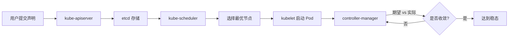

## 本章小结

本章从 Linux 内核隔离机制出发，经由 Docker 引擎与镜像体系，深入 Kubernetes 编排架构，最终落地到生产级实战场景与性能调优方法论。以下对全章核心知识进行系统回顾，帮助读者建立完整的知识框架，并为后续持续学习提供清晰的路径指引。

---

### 核心知识点回顾

#### 1. 容器技术的本质：不是虚拟机，是受限进程

容器的核心认知是：**容器是一个利用 Linux 内核隔离机制运行的受限进程**，而非轻量虚拟机。这一本质决定了容器的所有特性——启动速度快（毫秒级 vs 虚拟机分钟级）、资源开销小（共享宿主机内核）、密度高（单机可运行数百容器）。

三大内核支柱：

| 支撑技术 | 作用 | 隔离维度 | 实际效果 |
|----------|------|----------|----------|
| **Namespace** | 资源视图隔离 | PID、NET、MNT、UTS、IPC、USER | 容器内 PID 1 ≠ 宿主机 PID 1；容器网络栈完全独立 |
| **Cgroup v2** | 资源使用限制 | CPU、内存、I/O、网络带宽 | 限制单容器最多用 2 核 CPU、512MB 内存 |
| **UnionFS（overlay2）** | 文件系统分层共享 | 镜像层 + 容器层 | 多容器共享基础镜像层，节省磁盘空间 |

容器与虚拟机的根本区别：

虚拟机架构（完全隔离）          容器架构（进程级隔离）
┌──────────────────┐          ┌──────────────────┐
│   App A   App B  │          │   App A   App B  │
├──────────────────┤          ├──────────────────┤
│ Guest OS × 2     │          │    共享宿主内核   │  ← 关键差异
├──────────────────┤          ├──────────────────┤
│    Hypervisor    │          │ Container Runtime│
├──────────────────┤          ├──────────────────┤
│    Host OS       │          │    Host OS       │
├──────────────────┤          ├──────────────────┤
│    Hardware      │          │    Hardware      │
└──────────────────┘          └──────────────────┘

> 容器隔离 ≠ 虚拟机隔离。容器共享宿主机内核，因此容器逃逸风险始终存在，生产环境必须配合 seccomp、AppArmor/SELinux 等安全机制。

---

#### 2. Docker 引擎：从 Dockerfile 到运行时的完整技术栈

Docker 不是单一程序，而是一个分层架构。理解组件边界是排查问题和优化性能的前提：

┌────────────────────────────────────────────────────┐
│               Docker Client (CLI / API)            │
└───────────────────────┬────────────────────────────┘
                        │ REST API (unix socket / TCP)
                        ▼
┌────────────────────────────────────────────────────┐
│            Docker Daemon (dockerd)                  │
│  ┌─────────────┐  ┌──────────────┐  ┌──────────┐ │
│  │ 镜像管理     │  │ 网络管理     │  │ 卷管理   │ │
│  │ (镜像/容器)  │  │ (bridge/     │  │ (volumes/│ │
│  │             │  │  overlay)    │  │  bind)   │ │
│  └──────┬──────┘  └──────┬───────┘  └────┬─────┘ │
│         └────────────────┼───────────────┘        │
│                          ▼                        │
│              containerd (容器运行时)                │
│                          │                        │
│                          ▼                        │
│              runc (OCI 运行时)                     │
└────────────────────────────────────────────────────┘

**镜像层模型**是 Docker 最精妙的设计。每条 Dockerfile 指令创建一层，层与层之间通过 union mount 叠加。这意味着：

- **缓存复用**：未变化的层直接从缓存加载，构建速度从分钟级降到秒级
- **分发高效**：推送/拉取镜像时只传输变化的层，大幅减少网络带宽
- **基础镜像共享**：100 个基于 `python:3.11-slim` 的镜像在宿主机只占一份基础层

**存储卷的三种模式**决定了数据持久化的可靠性：

| 模式 | 命令 | 数据位置 | 持久性 | 适用场景 |
|------|------|----------|--------|----------|
| **Named Volume** | `docker volume create` | Docker 管理的目录 | 容器删除后保留 | 数据库、持久化数据 |
| **Bind Mount** | `-v /host/path:/container/path` | 宿主机指定目录 | 与宿主机同步 | 开发环境热加载 |
| **tmpfs Mount** | `--tmpfs /path` | 内存 | 容器停止即消失 | 敏感数据、临时缓存 |

**网络模型**的演进：Docker 默认的 bridge 网络存在局限（容器间通过 NAT 通信，性能损耗约 5-15%），生产环境推荐使用 **overlay 网络**或 **macvlan 网络**实现跨主机容器通信，直接二层转发，延迟与裸机接近。

---

#### 3. Kubernetes 架构：声明式控制循环

Kubernetes 的核心设计哲学是**声明式控制循环（Reconciliation Loop）**：你描述期望状态（Desired State），系统持续将实际状态（Actual State）向期望状态收敛。

**控制平面组件及职责**：

| 组件 | 职责 | 关键机制 |
|------|------|----------|
| **kube-apiserver** | 集群网关，所有操作的统一入口 | 认证、授权、准入控制、API 版本管理 |
| **etcd** | 分布式 KV 存储，集群状态的唯一真相源 | Raft 一致性协议，奇数节点部署 |
| **kube-scheduler** | 将 Pod 分配到最优节点 | 预选（过滤）→ 优选（打分）→ 绑定 |
| **kube-controller-manager** | 维护期望状态 | Deployment/ReplicaSet/Node 等控制器循环 |
| **cloud-controller-manager** | 云厂商适配层 | 对接云 LB、存储、节点生命周期 |

**数据平面（Worker Node）核心组件**：

- **kubelet**：节点代理，负责 Pod 生命周期管理、健康检查、资源上报
- **kube-proxy**：维护 Service → Pod 的网络规则，支持 iptables 和 IPVS 两种模式
- **Container Runtime**：实际运行容器（containerd + runc），通过 CRI（Container Runtime Interface）与 kubelet 通信

**调度流程的三阶段**：

1. **过滤（Predicates）**：排除不满足条件的节点（资源不足、标签不匹配、污点不容忍等）
2. **打分（Priorities）**：对剩余节点按策略加权评分（资源均衡度、亲和性、拓扑分布等）
3. **绑定（Binding）**：选择得分最高的节点，将 Pod 绑定到该节点

**服务发现与负载均衡**：Service 是 Kubernetes 的抽象层，将一组 Pod 封装为稳定的网络端点。核心类型：

| Service 类型 | 网络行为 | 典型场景 |
|-------------|---------|---------|
| ClusterIP（默认） | 集群内部 VIP | 微服务间通信 |
| NodePort | 在每个节点开放固定端口 | 开发/测试环境外部访问 |
| LoadBalancer | 云厂商 LB + NodePort | 生产环境外部入口 |
| ExternalName | DNS CNAME 映射 | 引用集群外部服务 |

---

#### 4. 关键指标与技术选型

> "技术选型不是选最先进的，而是选最匹配的。"

**五大评估维度**：

| 维度 | 量化指标 | 为什么重要 |
|------|---------|-----------|
| **延迟（Latency）** | P50/P95/P99 延迟分布 | P99 从 100ms 升到 200ms，1% 用户感知明显卡顿 |
| **吞吐量（Throughput）** | QPS/RPS | 与延迟需权衡——盲目追高 QPS 可能导致延迟恶化 |
| **可用性（Availability）** | MTBF / MTTR | 99.9% = 8.76小时/年停机；99.99% = 52分钟/年 |
| **一致性（Consistency）** | CAP 定理下的 CP/AP 选择 | etcd 选择 CP，牺牲部分可用性换取强一致 |
| **可扩展性（Scalability）** | 水平扩展线性度 | 加 2 倍资源是否接近 2 倍性能 |

**编排方案对比**：

| 方案 | 优势 | 劣势 | 适用场景 |
|------|------|------|---------|
| **Kubernetes** | 生态完善、社区强大、功能全面 | 学习曲线陡峭、资源消耗大（控制平面 ~2GB） | 中大型团队、云原生架构 |
| **Docker Swarm** | 简单易用、部署快（分钟级） | 功能有限、社区萎缩 | 小团队、快速原型 |
| **Nomad** | 单二进制、多工作负载（VM/容器/Java） | 生态较小 | 混合负载、HashiCorp 技术栈 |

---

#### 5. 实战技能体系

本章通过三大核心技巧构建实战能力：

**技巧一：Dockerfile 最佳实践**

核心原则是**减小镜像体积、加速构建、提升安全性**：

- **多阶段构建**：构建阶段和运行阶段分离，最终镜像只包含运行时必要文件。一个 Go 应用从 800MB 的构建镜像缩减到 15MB 的运行镜像
- **层合并与缓存优化**：将不常变化的操作（系统依赖安装）放在 Dockerfile 前部，常变化的（应用代码 COPY）放在后部，充分利用 BuildKit 缓存
- **基础镜像选择**：生产环境使用 `-slim` 或 `-alpine` 变体；极端场景可使用 `distroless` 镜像（无 shell、无包管理器，攻击面最小）
- **安全扫描**：使用 Trivy、Snyk 等工具扫描镜像漏洞，CI 流程中集成自动扫描

**技巧二：Kubernetes 故障排查**

排查方法论遵循"**自外向内、逐层深入**"原则：

排查路径：集群事件 → Node 状态 → Pod 状态 → Container → Application

高频故障场景与定位方法：

| 故障现象 | 首要检查 | 常见原因 |
|---------|---------|---------|
| Pod 处于 Pending | `kubectl describe pod` 的 Events | 资源不足、PVC 未绑定、nodeSelector 不匹配 |
| Pod 处于 CrashLoopBackOff | `kubectl logs --previous` | 应用启动失败、OOMKilled、配置错误 |
| Pod 处于 ImagePullBackOff | 检查镜像名/tag、registry 凭据 | 镜像不存在、网络不通、Secret 未挂载 |
| Service 无法访问 | Endpoints 是否为空 | Pod 标签与 Service selector 不匹配 |
| 节点 NotReady | `kubectl describe node` | kubelet 停止运行、磁盘/内存压力 |

核心排查命令对比：

| 命令 | 用途 | 适用场景 |
|------|------|---------|
| `kubectl get -o yaml` | 获取完整 YAML 定义 | 查看配置细节和运行状态 |
| `kubectl describe` | 查看资源详情 + Events | 排查故障的首选命令 |
| `kubectl logs` | 查看容器日志 | 应用层问题定位 |

**技巧三：Helm 模板技巧**

Helm 是 Kubernetes 的包管理器，将应用资源打包为可复用的 Chart：

- **Chart 结构**：`Chart.yaml`（元数据）+ `values.yaml`（默认参数）+ `templates/`（Kubernetes 资源模板）
- **模板函数**：`{{ .Values.name }}`、`{{ .Release.Name }}`、`{{ include "chart.fullname" . }}`、条件判断 `{{ if }}`、循环 `{{ range }}`
- **Helm 3 vs Helm 2**：Helm 3 移除了 Tiller 服务端组件，纯客户端架构，Release 信息存储在 Secret 中，支持 OCI 镜像仓库

---

#### 6. 生产级实战案例

本章通过五个完整案例展示容器与编排的生产级应用：

1. **微服务应用容器化**：电商平台全栈部署（用户/商品/订单/网关四大服务），覆盖 Service 发现、ConfigMap 配置管理、HPA 自动伸缩、链路追踪
2. **CI/CD 流水线**：从代码提交到容器化部署的自动化流程，集成镜像构建、安全扫描、灰度发布
3. **有状态应用部署**：MySQL/Redis/ES 等有状态服务的 StatefulSet 部署方案
4. **混合云架构**：跨云/跨机房的 Kubernetes 集群联邦
5. **故障演练与恢复**：Pod 驱逐、节点故障、网络分区等场景下的自愈能力验证

---

### 关键公式与模型

| 概念 | 公式/模型 | 说明 |
|------|-----------|------|
| **Little 定律** | L = λ × W（并发数 = 吞吐率 × 平均延迟） | 容量规划基础：知道 QPS 和延迟就能算出所需并发连接数 |
| **可用性计算** | SLA = 正常运行时间 / 总时间 | 99.9% = 8.76h/年停机；99.99% = 52min/年；99.999% = 5.26min/年 |
| **尾延迟** | P99 = 第 99 百分位值 | 比平均延迟更能反映用户体验——1% 用户遇到的最差体验 |
| **容量规划** | QPS × 单次请求资源 = 总资源需求 | 留 30-50% 余量应对突发流量 |
| **容器密度估算** | 单机容器数 = (可用内存 - 系统预留) / 单容器内存 | 系统预留建议 1-2GB，避免 OOM Kill |
| **镜像层缓存命中率** | 缓存命中率 = 命中层数 / 总层数 | 优化 Dockerfile 层顺序可将命中率从 30% 提升到 90%+ |
| **Kubernetes 调度延迟** | 调度延迟 = 过滤时间 + 打分时间 + 绑定时间 | 正常 < 100ms，异常时需排查 etcd 延迟或调度器插件 |

---

### 最佳实践清单

**容器设计阶段**：

- [ ] 确定单个容器的职责边界——一个容器只运行一个进程
- [ ] 选择合适的基础镜像（`-slim` / `alpine` / `distroless`）
- [ ] 编写多阶段 Dockerfile，分离构建和运行环境
- [ ] 定义明确的健康检查（liveness probe + readiness probe）
- [ ] 设计优雅退出机制（处理 SIGTERM 信号，设置合理的 `terminationGracePeriodSeconds`）

**镜像构建阶段**：

- [ ] 合理利用 BuildKit 缓存，将稳定层放在前部
- [ ] 合并 RUN 指令减少层数（每层有额外开销）
- [ ] 使用 `.dockerignore` 排除不必要的文件（`.git`、`node_modules`、测试文件）
- [ ] CI 集成 Trivy/Snyk 镜像漏洞扫描，阻断高危漏洞
- [ ] 为镜像打语义化版本标签，同时维护 `latest` 标签

**Kubernetes 编排阶段**：

- [ ] 为所有 Pod 设置 requests 和 limits（防止资源争抢和 OOM Kill）
- [ ] 配置 PodDisruptionBudget 保证滚动更新时的最小可用副本数
- [ ] 设置 Pod 反亲和性（anti-affinity）分散副本到不同节点，提升容错能力
- [ ] 使用 ConfigMap + Secret 分离配置和敏感信息
- [ ] 为有状态服务使用 StatefulSet + Headless Service + PVC

**运维监控阶段**：

- [ ] 部署 Prometheus + Grafana 监控集群指标（CPU/内存/网络/磁盘）
- [ ] 配置合理的告警规则（CPU > 80%、内存 > 85%、Pod 重启 > 3 次/小时）
- [ ] 实现日志集中收集（EFK/Loki 栈），确保可检索
- [ ] 定期演练故障场景（节点故障、Pod 驱逐、网络分区）
- [ ] 维护 runbook 文档，将故障处理流程标准化

---

### 常见误区与纠正

| 误区 | 正确做法 | 根因 |
|------|---------|------|
| 容器内以 root 身份运行进程 | Dockerfile 中 `USER` 指令切换到非 root 用户，Pod 中设置 `securityContext.runAsNonRoot: true` | 容器逃逸时 root 权限可直接控制宿主机 |
| 镜像标签用 `latest` 且不做版本管理 | 使用语义化版本标签（`v1.2.3`）+ SHA 摘要锁定 | `latest` 不可追溯，回滚困难 |
| 不设置资源 limits，靠"默认值" | 所有 Pod 显式声明 requests 和 limits | 单个容器可能耗尽节点资源，触发 OOM Kill 或"吵闹邻居"问题 |
| K8s 部署后不设健康检查 | 同时配置 liveness probe（存活）和 readiness probe（就绪） | 应用假死时无法自动重启，流量仍导入故障 Pod |
| Helm values.yaml 硬编码密钥 | 使用 Secret 对象 + 环境变量注入，或 Sealed Secrets | values.yaml 提交到 Git 后密钥泄露 |
| 只关注 QPS，忽略延迟 | 同时监控 P50/P95/P99 延迟分布 | P99 延迟从 100ms 恶化到 500ms 时 1% 用户体验严重下降 |
| 所有服务都用 Deployment | 有状态服务（DB/Redis/ES）使用 StatefulSet | Deployment 的 Pod 名随机，无法保证稳定的网络标识和存储绑定 |

---

### 思考题

1. **原理层面**：容器和虚拟机的核心区别是什么？为什么容器启动速度能达到毫秒级而虚拟机需要分钟级？从内核机制角度解释。

2. **架构层面**：Kubernetes 采用声明式控制循环而非命令式操作，请设计一个场景说明声明式的优势——当 Node 故障导致 Pod 丢失时，声明式系统如何自动恢复？

3. **选型层面**：一个 5 人团队开发内部工具，预估日活 50 人，你会推荐 Kubernetes 还是 Docker Compose？说明决策依据和预期运维成本。

4. **故障排查**：某 Pod 部署后一直处于 CrashLoopBackOff 状态，描述你的完整排查流程，列出每一步使用的命令和判断标准。

5. **性能优化**：某 Docker 镜像体积为 1.2GB，构建时间 15 分钟。从 Dockerfile 编写、多阶段构建、基础镜像选择三个维度给出优化方案，并估算优化后的体积和构建时间。

6. **安全防御**：一个容器以 root 身份运行且未设置 seccomp profile，描述可能的安全风险链——从容器逃逸到宿主机控制的完整攻击路径，以及对应的防御措施。

7. **进阶思考**：当 Kubernetes 集群规模达到 5000+ 节点时，etcd 会成为性能瓶颈。讨论 etcd 在大规模集群下面临的挑战（写延迟、存储容量、网络带宽），以及 Kubernetes 社区正在推进的解决方向（如分片、Kine 等替代后端）。

---

### 进阶学习路径

#### 深度学习方向

1. **内核原理深入**：阅读 Linux namespace 和 cgroup v2 的内核文档，理解 `clone()` 系统调用如何创建容器；研究 seccomp-bpf 如何限制容器的系统调用
2. **容器运行时源码**：阅读 containerd 源码，理解 CRI 接口的实现；研究 gVisor / Kata Containers 等安全容器的隔离原理
3. **Kubernetes 内部机制**：阅读 Kubernetes controller-runtime 源码，理解 Informer/Lister/WorkQueue 模式；研究 etcd 的 Raft 实现
4. **网络与存储**：深入 CNI（Container Network Interface）插件（Calico/Cilium）的实现原理；研究 CSI（Container Storage Interface）的存储编排机制

#### 推荐资源

| 类型 | 资源 | 适合阶段 |
|------|------|---------|
| **官方文档** | [Kubernetes 官方文档](https://kubernetes.io/docs/) | 全阶段参考手册 |
| **书籍** | 《Kubernetes in Action》（Marko Lukša） | 入门到进阶 |
| **书籍** | 《Docker Deep Dive》（Nigel Poulton） | Docker 深度理解 |
| **书籍** | 《Programming Kubernetes》（Michael Hausenblas） | K8s 扩展开发 |
| **实战** | killercoda.com 交互式 K8s 实验 | 动手练习 |
| **社区** | CNCF 云原生全景图（landscape.cncf.io） | 技术选型参考 |
| **源码** | Kubernetes GitHub 仓库 + good first issue | 源码贡献入门 |

#### 认证路径

- **CKA**（Certified Kubernetes Administrator）：集群管理、故障排查、安全加固
- **CKAD**（Certified Kubernetes Application Developer）：应用部署、调试、Service/Ingress 配置
- **CKS**（Certified Kubernetes Security Specialist）：容器安全、集群安全、运行时防护

---

### 一句话总结

**容器是受限的进程，不是虚拟机；编排是声明式的控制循环，不是命令式的操作。掌握这两条核心认知，就抓住了整个容器与编排技术栈的纲领。**
