# 第40章 容器与编排

## 为什么需要容器技术？

在传统的软件部署模式中，开发团队编写代码后将其打包部署到服务器上，然而"在我的机器上能运行"这句经典名言深刻地揭示了环境不一致带来的巨大困扰。操作系统版本差异、系统库缺失、配置文件不匹配等问题层出不穷，导致开发、测试与生产环境之间存在难以弥合的鸿沟。

容器技术的出现正是为了解决这一根本性问题：它将应用及其所有依赖打包成一个标准化、可移植的单元，确保应用在任何环境中都能一致地运行。从 2013 年 Docker 开源至今，容器技术已经从一种新颖的部署方式演变为现代软件工程的基础设施标准。CNCF 2024 年度调查显示，超过 92% 的企业正在生产环境中使用容器技术，Kubernetes 已成为事实上的容器编排标准。

---

## 本章核心内容

本章将系统性地介绍容器与编排技术的理论基础和工程实践，涵盖以下关键主题：

**容器基础技术**：深入探讨 Linux 内核提供的 Namespace 和 Cgroups 机制，理解容器隔离与资源限制的底层原理。同时介绍 Union 文件系统（如 OverlayFS）如何实现镜像的分层存储与写时复制（Copy-on-Write），从而大幅提高存储效率。

**Docker 生态系统**：全面介绍 Docker 的架构设计，包括 Docker Daemon、containerd、runc 等组件的职责划分，以及 OCI（Open Container Initiative）标准如何确保容器运行时的互操作性。同时讲解 Dockerfile 的编写规范、镜像构建流程与最佳实践。

**Kubernetes 编排平台**：深入分析 Kubernetes 的控制平面（API Server、etcd、Scheduler、Controller Manager）和数据平面（kubelet、kube-proxy）的设计理念。详细讲解 Pod 的生命周期管理、容器网络模型（CNI）、存储抽象（PV/PVC/StorageClass）以及各种工作负载类型（Deployment、StatefulSet、DaemonSet 等）。

**容器安全与监控**：系统介绍容器安全加固策略，包括镜像安全、运行时防护、网络策略和 RBAC 访问控制。同时讲解容器化应用的可观测性方案，涵盖日志收集、指标监控和分布式追踪。

**Helm 包管理**：介绍 Helm 作为 Kubernetes 包管理器的核心概念（Chart、Release、Repository），讲解模板语法、Values 管理和 Chart 开发实践。

**生产环境实践**：提供微服务容器化、CI/CD 流水线集成、有状态应用部署等实战案例，帮助读者将理论知识转化为实际工程能力。

---

## 学习目标

完成本章学习后，读者应当能够：

1. 理解容器技术的底层原理，包括命名空间、控制组和联合文件系统
2. 掌握 Docker 镜像构建、容器管理和网络配置的技能
3. 深入理解 Kubernetes 的架构设计和核心概念
4. 能够将微服务应用容器化并部署到 Kubernetes 集群
5. 了解容器安全、资源管理和高可用部署的最佳实践
6. 熟练使用 Helm 打包和管理 Kubernetes 应用
7. 具备容器化应用的故障排查和监控能力
8. 避免容器化过程中的常见误区和反模式

---

## 适用读者

本章适合所有希望掌握现代应用部署技术的软件工程师、DevOps 工程师和系统架构师。无论你是初次接触容器技术的新手，还是希望深入理解 Kubernetes 内部机制的有经验开发者，都能从本章中获得有价值的知识和技能。建议读者具备基本的 Linux 系统管理和网络知识，以便更好地理解本章的技术细节。

---
---

# 第40章 容器与编排 — 理论基础

## 1. 容器技术的本质

容器并非一种全新的虚拟化技术，而是基于 Linux 内核已有特性构建的轻量级隔离方案。理解容器的底层原理对于正确使用和排错容器化应用至关重要。

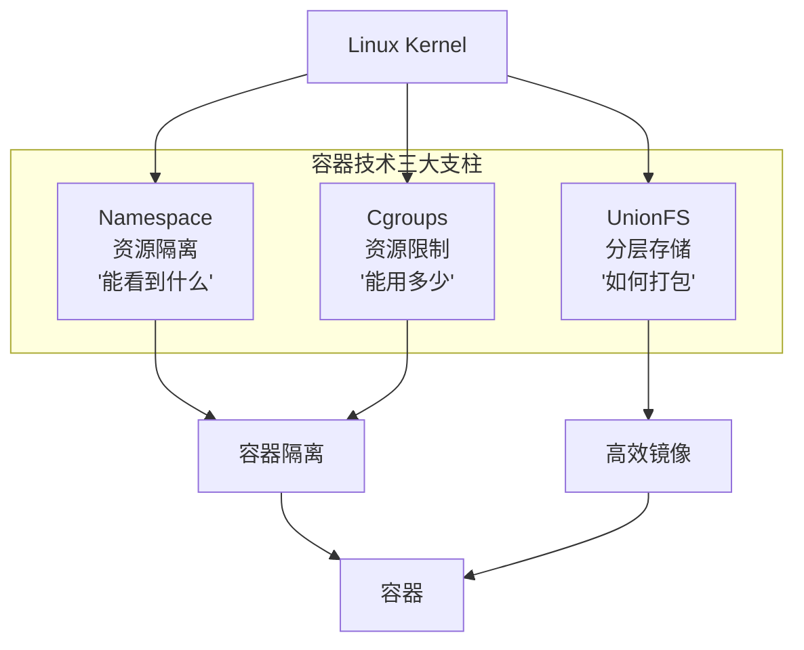

### 1.1 Namespace（命名空间）

Namespace 是 Linux 内核提供的一种资源隔离机制，它使得每个进程拥有独立的系统资源视图。容器中的进程认为自己运行在一个独立的操作系统中，但实际上它们共享同一个内核。Linux 内核支持以下几种主要的 Namespace 类型：

| Namespace | 隔离内容 | 系统调用标志 | 典型用途 |
|-----------|----------|-------------|----------|
| **PID** | 进程 ID 空间 | `CLONE_NEWPID` | 容器内进程互不干扰 |
| **Network** | 网络栈（接口、路由、iptables） | `CLONE_NEWNET` | 独立 IP 和端口空间 |
| **Mount** | 文件系统挂载点 | `CLONE_NEWNS` | 独立根文件系统 |
| **UTS** | 主机名和域名 | `CLONE_NEWUTS` | 独立主机名标识 |
| **IPC** | 进程间通信（共享内存、信号量） | `CLONE_NEWIPC` | 隔离进程通信 |
| **User** | 用户和组 ID | `CLONE_NEWUSER` | 非特权容器安全 |
| **Cgroup** | Cgroup 根目录视图 | `CLONE_NEWCGROUP` | 隔离 cgroup 层级 |
| **Time** | 系统时钟（Linux 5.6+） | `CLONE_NEWTIME` | 容器内时间偏移 |

**PID Namespace**：隔离进程 ID 空间。容器内的进程拥有独立的 PID 编号，从 1 开始。容器内的进程无法看到或影响宿主机或其他容器中的进程。这提供了进程级别的隔离能力。

```bash
# 创建新的 PID namespace 并运行 bash
sudo unshare --pid --fork --mount-proc bash
# 在新的 namespace 中，当前 bash 的 PID 为 1
echo $$
# 1
# 使用 ps 命令只能看到该 namespace 中的进程
ps aux
# USER  PID %CPU %MEM    VSZ   RSS TTY  STAT START   TIME COMMAND
# root    1  0.0  0.0   7232  3916 pts/1 S    14:23   0:00 bash
```

**Network Namespace**：隔离网络栈，包括网络接口、路由表、iptables 规则等。每个容器可以拥有独立的 IP 地址和端口空间，这使得多个容器可以绑定相同的端口而互不冲突。

```bash
# 创建新的网络命名空间
sudo ip netns add my-namespace
# 在该命名空间中查看网络接口
sudo ip netns exec my-namespace ip addr
# 1: lo: <LOOPBACK> mtu 65536 qdisc noop state DOWN
#     link/loopback 00:00:00:00:00:00 brd 00:00:00:00:00:00

# 通过 veth pair 连接两个 namespace
sudo ip link add veth0 type veth peer name veth1
sudo ip link set veth1 netns my-namespace
# 在宿主机侧配置 IP
sudo ip addr add 10.0.0.1/24 dev veth0
sudo ip link set veth0 up
# 在目标 namespace 中配置 IP
sudo ip netns exec my-namespace ip addr add 10.0.0.2/24 dev veth1
sudo ip netns exec my-namespace ip link set veth1 up
sudo ip netns exec my-namespace ip link set lo up
# 测试连通性
ping 10.0.0.2
```

**Mount Namespace**：隔离文件系统挂载点。容器内的进程拥有独立的文件系统视图，可以挂载不同的文件系统而不会影响宿主机。这是实现容器独立根文件系统的关键机制。Docker 镜像的各个层就是通过 Mount Namespace 叠加呈现给容器的。

**UTS Namespace**：隔离主机名和域名。每个容器可以拥有独立的 hostname，这对于需要基于主机名进行服务发现的场景非常重要。

```bash
# 创建 UTS namespace 并修改主机名
sudo unshare --uts bash
hostname container-demo
hostname
# container-demo
# 宿主机的主机名不受影响
```

**IPC Namespace**：隔离进程间通信资源，包括共享内存、信号量和消息队列。这确保了容器间的进程无法通过 IPC 机制进行意外的通信。

**User Namespace**：隔离用户和组 ID。容器内的 root 用户（UID 0）可以映射到宿主机的非特权用户，这大大提高了容器的安全性。即使容器内的进程获得了 root 权限，对宿主机的实际影响也非常有限。

```bash
# 查看用户命名空间映射
cat /proc/self/uid_map
#          0       1000          1
# 这表示容器内的 UID 0 映射到宿主机的 UID 1000

# 创建 user namespace 实际演示
sudo unshare --user --map-root-user bash
cat /proc/self/uid_map
#          0          0          1
# 容器内的 root 仍然是 root（因为在新的 user namespace 中）
# 但在宿主机视角，这个进程以普通用户身份运行
```

### 1.2 Cgroups（控制组）

Cgroups（Control Groups）是 Linux 内核提供的另一种关键机制，用于限制、记录和隔离进程组使用的物理资源（CPU、内存、IO 等）。如果说 Namespace 解决了"能看到什么"的问题，那么 Cgroups 解决的就是"能用多少"的问题。

Linux 内核目前有两个版本的 Cgroups 接口：

| 特性 | Cgroups v1 | Cgroups v2 |
|------|-----------|-----------|
| 层级结构 | 每种资源独立层级 | 统一层级 |
| 挂载点 | `/sys/fs/cgroup/<resource>/` | `/sys/fs/cgroup/` |
| 接口文件 | `cpu.shares`, `memory.limit_in_bytes` | `cpu.max`, `memory.max` |
| 资源分配 | 各控制器独立管理 | 统一的权重分配（`cpu.weight`） |
| PSI 压力信息 | 不支持 | 支持（`/proc/pressure/`） |
| 默认内核版本 | Linux 2.6.24+ | Linux 4.5+，主流发行版默认 |

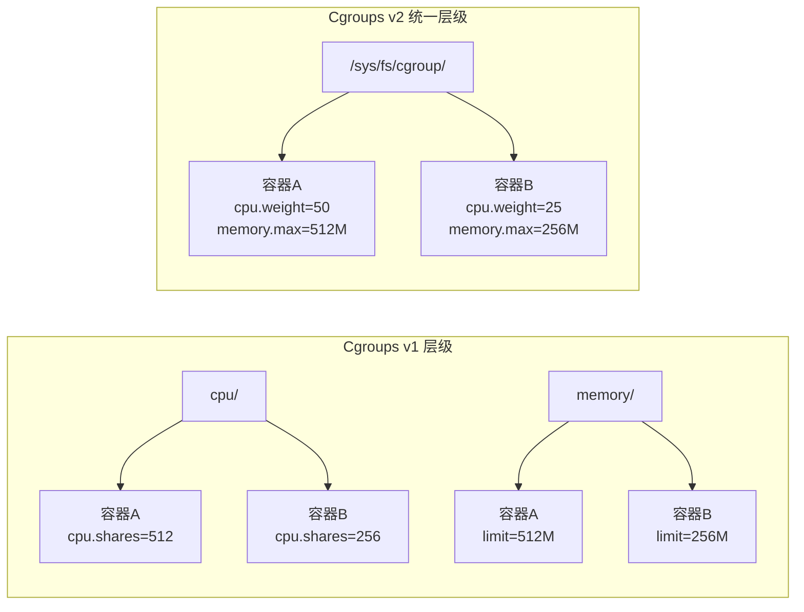

**CPU 资源限制**：Cgroups 可以控制进程组使用的 CPU 时间比例。在 Docker 中，`--cpus` 参数实际上就是设置了对应的 cgroup 参数。

```bash
# Cgroups v2 方式限制 CPU
# 创建一个 cgroup 来限制 CPU 使用
sudo mkdir -p /sys/fs/cgroup/my-container
# 设置 CPU 配额：每 100000 微秒的周期内，只能使用 50000 微秒的 CPU 时间
echo "50000 100000" | sudo tee /sys/fs/cgroup/my-container/cpu.max
# 这相当于限制了 0.5 个 CPU 核心的使用量
# 将进程加入该 cgroup
echo $PID | sudo tee /sys/fs/cgroup/my-container/cgroup.procs

# Docker 中使用
docker run --cpus=0.5 nginx    # 限制 0.5 个 CPU 核心
docker run --cpu-shares=512 nginx  # 相对权重（默认1024）
```

**内存资源限制**：Cgroups 可以设置内存使用上限，当进程超过限制时，内核会触发 OOM（Out of Memory）机制来终止进程。

```bash
# 在 Docker 中限制内存
docker run -m 512m --memory-swap 1g nginx
# -m 512m: 限制容器内存使用为 512MB
# --memory-swap 1g: 限制内存+交换空间总和为 1GB
# 查看容器的内存使用情况
docker stats --no-stream
# CONTAINER ID   NAME      CPU %   MEM USAGE / LIMIT   MEM %   NET I/O       BLOCK I/O
# abc123         my-app    0.50%   128MiB / 512MiB     25.00%  1.2kB / 0B    0B / 0B

# 内存限制的三个层次：
# 1. memory.max: 硬限制，超过触发 OOM Kill
# 2. memory.high: 软限制，超过会触发内存回收（throttle）
# 3. memory.low: 保护线，尽量不回收此范围内的内存
```

**IO 资源限制**：Cgroups 还可以限制块设备的读写速度，防止单个容器占用过多的磁盘 IO 带宽。

```bash
# 限制容器的磁盘读写速度
docker run --device-read-bps /dev/sda:10mb \
           --device-write-bps /dev/sda:5mb nginx

# 限制每秒 IOPS
docker run --device-read-iops /dev/sda:1000 \
           --device-write-iops /dev/sda:500 nginx
```

### 1.3 Union 文件系统

Union 文件系统（UnionFS）是实现 Docker 镜像分层存储的核心技术。它能够将多个目录（称为"层"）叠加在一起，对外呈现为一个统一的文件系统视图。

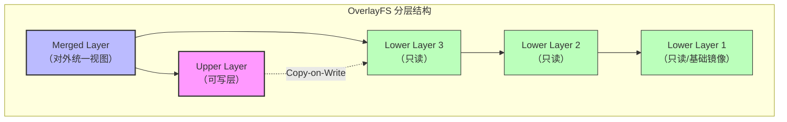

**OverlayFS** 是目前最广泛使用的 Union 文件系统实现，它由以下几部分组成：

- **Lower Layer（底层）**：只读的基础镜像层，可以有多层叠加
- **Upper Layer（上层）**：可写的容器修改层，所有写操作都发生在这里
- **Merged Layer（合并层）**：对外呈现的统一视图，是 Lower 和 Upper 的叠加结果
- **Work Directory**：OverlayFS 内部使用的工作目录，用于原子操作

```bash
# 查看 Docker 镜像的层结构
docker inspect nginx --format '{{.RootFS.Layers}}'
# [sha256:a2abf6c4d29d... sha256:a9edb18cadd1... sha256:589b7251471a...]

# 查看每一层的大小和内容
docker history nginx:latest
# IMAGE     CREATED   CREATED BY                                      SIZE
# <missing> 2 weeks   /bin/sh -c #(nop)  CMD ["nginx" "-g" "daemon…   0B
# <missing> 2 weeks   /bin/sh -c #(nop) STOPSIGNAL SIGQUIT            0B
# <missing> 2 weeks   /bin/sh -c #(nop) EXPOSE map[80/tcp:{}]         0B
# <missing> 2 weeks   /bin/sh -c #(nop) COPY file:...                 1.4kB
# <missing> 2 weeks   /bin/sh -c set -x     &amp;&amp; groupadd --system --…  113MB

# 创建 OverlayFS 挂载演示
sudo mkdir -p /overlay/{lower,upper,merged,work}
echo "base file" | sudo tee /overlay/lower/base.txt
# 挂载 OverlayFS
sudo mount -t overlay overlay \
  -o lowerdir=/overlay/lower,upperdir=/overlay/upper,workdir=/overlay/work \
  /overlay/merged
# 在 merged 目录中可以看到底层的文件
cat /overlay/merged/base.txt
# base file
# 在 merged 目录中创建新文件，实际存储在 upper 层
echo "new file" | sudo tee /overlay/merged/new.txt
ls /overlay/upper/
# new.txt
# 删除 lower 层的文件时，会在 upper 层创建一个 "whiteout" 标记文件
rm /overlay/merged/base.txt
ls /overlay/upper/
# new.txt  base.txt   ← whiteout 文件
```

**写时复制（Copy-on-Write）** 是容器存储的关键优化策略。当容器需要修改某个只读层中的文件时，内核不会修改原始文件，而是将其复制到可写层后再进行修改。这使得多个容器可以共享相同的基础镜像层，显著节省磁盘空间并加快容器启动速度。

实际效果：假设一个 Python 基础镜像 900MB，基于它运行 10 个容器。使用 OverlayFS，磁盘上只有一份 900MB 的基础镜像 + 10 个几乎为空的可写层（每个容器修改的文件不同），总磁盘占用可能只有 950MB。如果没有分层存储，则需要 9GB。

### 1.4 容器与虚拟机对比

理解容器和虚拟机的本质区别，是正确选择部署方案的前提：

| 维度 | 容器 | 虚拟机 |
|------|------|--------|
| **虚拟化层级** | 操作系统级（共享内核） | 硬件级（独立内核） |
| **隔离机制** | Namespace + Cgroups | Hypervisor（KVM/VMware） |
| **启动时间** | 毫秒~秒级 | 分钟级 |
| **资源占用** | MB 级（无内核开销） | GB 级（含完整 OS） |
| **密度** | 单机可运行数百个 | 单机通常十几个 |
| **隔离强度** | 较弱（共享内核，存在逃逸风险） | 很强（硬件级隔离） |
| **镜像大小** | 通常 10MB~500MB | 通常 1GB~20GB |
| **适用场景** | 微服务、CI/CD、快速扩缩容 | 强隔离需求、不同 OS、传统应用 |
| **安全边界** | 内核共享，需额外加固 | 硬件边界，天然更强 |

> **实践建议**：在大多数现代应用部署场景中，容器是首选方案。但在以下场景应考虑虚拟机或混合方案：需要运行不同内核版本的应用、合规性要求强隔离（如金融、政务）、多租户环境中租户间需要硬件级隔离。

---

## 2. Docker 深度解析

### 2.1 组件层次结构

Docker 的架构经历了多次演进，目前采用分层的组件设计。理解这层架构对于理解容器生态系统至关重要：

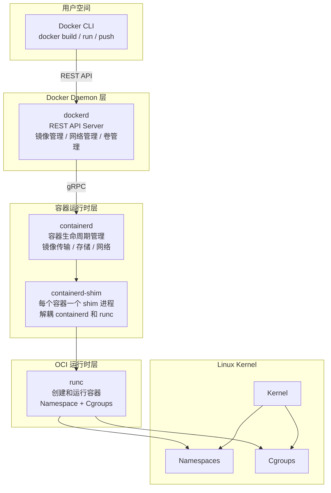

**Docker CLI**：用户与 Docker 交互的命令行工具，通过 REST API 与 Docker Daemon 通信。CLI 本身是无状态的，所有状态由 Daemon 管理。

**Docker Daemon（dockerd）**：Docker 的守护进程，负责管理 Docker 对象（镜像、容器、网络、卷等）。它接收来自 CLI 的请求，并将其委托给 containerd 处理。Docker Daemon 是 Docker 特有的组件，这也是 Docker 与纯容器运行时的主要区别。

**containerd**：一个行业标准的容器运行时，负责管理容器的完整生命周期，包括镜像传输、容器执行、存储和网络等。containerd 是 CNCF 的毕业项目，可以在没有 Docker Daemon 的情况下独立使用。Kubernetes 直接使用 containerd 作为 CRI（Container Runtime Interface）运行时。

**runc**：一个轻量级的、符合 OCI 标准的容器运行时，负责实际创建和运行容器。runc 直接与 Linux 内核的 Namespace 和 Cgroups 交互，是容器执行的最底层组件。当 runc 完成容器创建后，它会退出，由 containerd-shim 接管容器的运行时监控。

**OCI 标准**：Open Container Initiative 定义了容器镜像格式（Image Specification）和容器运行时（Runtime Specification）的行业标准，确保不同容器工具之间的互操作性。

```bash
# 查看 Docker 的进程层次结构
ps aux | grep -E "docker|containerd|runc"
# root   dockerd --containerd...
# root   containerd
# root   containerd-shim-runc-v2 -namespace moby -id abc123...
# root   runc --root /var/run/docker/runtime-runc/moby ...

# 直接使用 containerd 管理容器（不通过 Docker Daemon）
sudo ctr images pull docker.io/library/nginx:latest
sudo ctr run docker.io/library/nginx:latest my-nginx
sudo ctr tasks list
# TASK    PID     STATUS
# my-nginx 12345  RUNNING
```

### 2.2 容器运行时生态

除了 Docker，容器运行时生态中还有其他重要的组件：

| 组件 | 类型 | 说明 | 典型使用场景 |
|------|------|------|------------|
| **Docker Engine** | 高级运行时 | 完整的容器平台（CLI+Daemon+镜像构建） | 开发环境、CI/CD |
| **containerd** | 高级运行时 | Kubernetes CRI 运行时 | 生产集群 |
| **CRI-O** | 高级运行时 | 专为 Kubernetes 设计的轻量运行时 | OpenShift、SUSE |
| **runc** | 低级运行时 | OCI 标准的容器运行时 | 底层创建容器 |
| **crun** | 低级运行时 | C 语言实现的 OCI 运行时，性能优于 runc | 高性能场景 |
| **Kata Containers** | 沙箱运行时 | 轻量虚拟机级隔离 | 多租户、强隔离 |
| **gVisor** | 沙箱运行时 | 用户态内核拦截系统调用 | 安全敏感场景 |
| **Firecracker** | 微虚拟机 | AWS Lambda 使用的轻量 VMM | Serverless |

### 2.3 镜像构建与分发

Docker 镜像采用分层构建策略，每个 Dockerfile 指令都会创建一个新的镜像层：

```mermaid
graph TB
    subgraph "镜像分层构建过程"
        L1["Layer 0: FROM python:3.11-slim<br/>（基础镜像，~150MB）"]
        L2["Layer 1: RUN apt-get install gcc<br/>（系统依赖，~15MB）"]
        L3["Layer 2: WORKDIR /app<br/>（空层，0B）"]
        L4["Layer 3: COPY requirements.txt<br/>（依赖声明，~1KB）"]
        L5["Layer 4: RUN pip install<br/>（Python 依赖，~80MB）"]
        L6["Layer 5: COPY . .<br/>（应用代码，~5MB）"]
        L7["Layer 6: CMD [\"python\", \"app.py\"]<br/>（启动命令，0B）"]
    end
    L1 --> L2 --> L3 --> L4 --> L5 --> L6 --> L7
```

```dockerfile
# 基础镜像层（只读）
FROM python:3.11-slim

# 安装系统依赖（创建新的层）
RUN apt-get update &amp;&amp; apt-get install -y \
    gcc \
    &amp;&amp; rm -rf /var/lib/apt/lists/*

# 设置工作目录（创建新的层）
WORKDIR /app

# 复制依赖文件（创建新的层）
COPY requirements.txt .
RUN pip install --no-cache-dir -r requirements.txt

# 复制应用代码（创建新的层）
COPY . .

# 设置启动命令
CMD ["python", "app.py"]
```

```bash
# 查看镜像的构建历史和每一层的大小
docker history python:3.11-slim
# IMAGE          CREATED       CREATED BY                                      SIZE
# abc123         2 weeks ago   CMD ["python3"]                                 0B
# def456         2 weeks ago   RUN /bin/sh -c apt-get update &amp;&amp; apt-get...     15.3MB
# ...

# 将镜像推送到镜像仓库
docker tag my-app:latest registry.example.com/my-app:v1.0
docker push registry.example.com/my-app:v1.0
```

**镜像分发的关键概念**：

- **镜像标签（Tag）**：标识镜像版本，默认是 `latest`，生产环境应使用语义化版本号（如 `v1.2.3`）或 Git commit SHA
- **镜像仓库（Registry）**：存储和分发镜像的服务，如 Docker Hub、阿里云 ACR、Harbor
- **镜像签名**：使用 Docker Content Trust 或 cosign 对镜像进行签名，确保镜像完整性和来源可信

---

### 2.4 Docker Compose 多容器编排

Docker Compose 是 Docker 官方提供的多容器编排工具，通过 YAML 文件定义和管理多个容器组成的应用栈。它适用于本地开发、测试环境和简单的单机生产部署。

**核心概念**：

| 概念 | 说明 | 对应文件 |
|------|------|----------|
| **Services** | 应用的各个组件（容器） | docker-compose.yml 中的 services |
| **Networks** | 容器间的通信网络 | 定义在 networks 字段 |
| **Volumes** | 持久化数据存储 | 定义在 volumes 字段 |
| **Configs** | 配置文件管理 | 定义在 configs 字段 |

```yaml
# docker-compose.yml — 完整的微服务开发环境
version: "3.8"

services:
  # 前端服务
  frontend:
    build:
      context: ./frontend
      dockerfile: Dockerfile
      args:
        - NODE_ENV=development
    ports:
      - "3000:3000"
    volumes:
      - ./frontend/src:/app/src  # 热重载：源码挂载
    environment:
      - REACT_APP_API_URL=http://backend:8080
    depends_on:
      backend:
        condition: service_healthy

  # 后端 API 服务
  backend:
    build:
      context: ./backend
      dockerfile: Dockerfile
    ports:
      - "8080:8080"
    environment:
      - DB_HOST=postgres
      - DB_PORT=5432
      - DB_NAME=appdb
      - REDIS_URL=redis://redis:6379
    depends_on:
      postgres:
        condition: service_healthy
      redis:
        condition: service_started
    healthcheck:
      test: ["CMD", "curl", "-f", "http://localhost:8080/healthz"]
      interval: 10s
      timeout: 5s
      retries: 3

  # PostgreSQL 数据库
  postgres:
    image: postgres:16-alpine
    ports:
      - "5432:5432"
    environment:
      - POSTGRES_DB=appdb
      - POSTGRES_USER=appuser
      - POSTGRES_PASSWORD=apppass
    volumes:
      - postgres-data:/var/lib/postgresql/data
      - ./sql/init.sql:/docker-entrypoint-initdb.d/init.sql
    healthcheck:
      test: ["CMD-SHELL", "pg_isready -U appuser -d appdb"]
      interval: 5s
      timeout: 5s
      retries: 5

  # Redis 缓存
  redis:
    image: redis:7-alpine
    ports:
      - "6379:6379"
    command: redis-server --maxmemory 256mb --maxmemory-policy allkeys-lru
    volumes:
      - redis-data:/data

  # Nginx 反向代理
  nginx:
    image: nginx:1.25-alpine
    ports:
      - "80:80"
      - "443:443"
    volumes:
      - ./nginx/nginx.conf:/etc/nginx/nginx.conf:ro
      - ./nginx/certs:/etc/nginx/certs:ro
    depends_on:
      - frontend
      - backend

volumes:
  postgres-data:
    driver: local
  redis-data:
    driver: local

networks:
  default:
    driver: bridge
    ipam:
      config:
        - subnet: 172.28.0.0/16
```

```bash
# Docker Compose 常用命令
docker compose up -d                    # 后台启动所有服务
docker compose up -d --build            # 重新构建后启动
docker compose ps                       # 查看服务状态
docker compose logs -f backend          # 查看特定服务日志
docker compose exec backend bash        # 进入运行中的容器
docker compose down                     # 停止并移除容器
docker compose down -v                  # 停止并移除容器和数据卷
docker compose config                   # 验证配置文件
docker compose pull                     # 拉取最新镜像
docker compose restart backend          # 重启特定服务

# 生产环境配置覆盖
docker compose -f docker-compose.yml -f docker-compose.prod.yml up -d
```

**Docker Compose vs Kubernetes 对比**：

| 维度 | Docker Compose | Kubernetes |
|------|---------------|------------|
| **适用规模** | 单机，2-20 个容器 | 集群，数百~数千个容器 |
| **服务发现** | 通过容器名 DNS | Service + CoreDNS |
| **负载均衡** | 不支持（单实例） | 内置 Service 负载均衡 |
| **自动恢复** | `restart: always` | `Deployment` + 健康检查 |
| **滚动更新** | `docker compose up --no-deps` | `kubectl rollout` |
| **配置复杂度** | YAML，约 50-100 行 | YAML，约 200-500 行 |
| **学习曲线** | 低（1-2 天） | 高（2-4 周） |
| **最佳场景** | 本地开发、CI 测试、单机部署 | 生产环境、微服务集群、需要弹性伸缩 |

> **实践建议**：开发阶段用 Docker Compose 快速搭建本地环境，生产阶段用 Kubernetes 管理集群。两者不是替代关系，而是互补关系。许多团队在 CI/CD 流水线中使用 Docker Compose 运行集成测试，然后用 Kubernetes 部署到生产环境。


---

## 3. Kubernetes 架构深入解析

Kubernetes（简称 K8s）是 Google 基于 Borg 系统的设计理念开源的容器编排平台。它的核心设计哲学是**声明式 API** 和**控制循环（Reconciliation Loop）**：用户声明期望状态，控制器持续监控实际状态并自动纠正偏差。

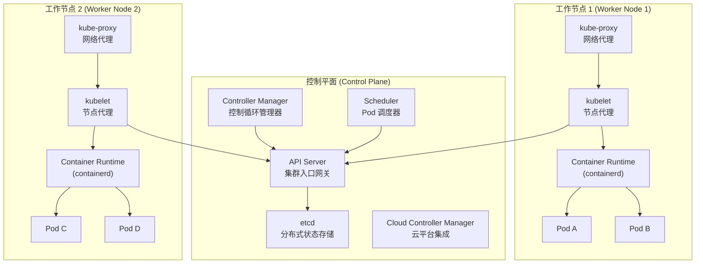

### 3.1 控制平面（Control Plane）

Kubernetes 的控制平面负责维护集群的期望状态，是整个集群的"大脑"。

**API Server（kube-apiserver）**：集群的入口网关，所有组件之间的通信都通过 API Server 进行。它提供了 RESTful API 接口，负责认证（Authentication）、授权（Authorization）、准入控制（Admission Control）和数据验证。API Server 是唯一直接与 etcd 通信的组件，其他组件必须通过 API Server 来读写集群状态。

API Server 的请求处理流程：

请求 → 认证(AuthN) → 授权(AuthZ) → 准入控制(Admission) → 验证(Validation) → etcd 写入
         │              │                │
         │              │                ├── MutatingAdmissionWebhook（修改请求）
         │              │                └── ValidatingAdmissionWebhook（校验请求）
         │              ├── RBAC（基于角色的访问控制）
         │              ├── ABAC（基于属性的访问控制）
         │              └── Webhook（外部授权服务）
         ├── X.509 证书
         ├── Service Account Token
         └── Bearer Token

```bash
# 通过 kubectl 与 API Server 交互（-v=8 显示实际 HTTP 请求）
kubectl get pods -v=8
# I0101 00:00:00.000000   12345 rest.go.go:246] GET https://10.0.0.1:6443/api/v1/namespaces/default/pods?limit=500

# 直接访问 API Server（在集群内部）
TOKEN=$(cat /var/run/secrets/kubernetes.io/serviceaccount/token)
curl -s -k https://kubernetes.default.svc/api/v1/namespaces/default/pods \
  -H "Authorization: Bearer $TOKEN" | jq '.items[].metadata.name'
# "web-app-5d4f8b7c9-x7k2m"
# "api-server-7c8d9e5f6-abc12"
```

**etcd**：分布式键值存储系统，是 Kubernetes 集群的唯一数据源。所有集群状态信息（Pod、Service、ConfigMap 等）都存储在 etcd 中。etcd 采用 Raft 一致性算法确保数据的强一致性，通常以奇数个节点（3个或5个）组成集群以实现高可用。

```bash
# 查看 etcd 中存储的键
ETCDCTL_API=3 etcdctl --endpoints=https://127.0.0.1:2379 \
  --cacert=/etc/kubernetes/pki/etcd/ca.crt \
  --cert=/etc/kubernetes/pki/etcd/server.crt \
  --key=/etc/kubernetes/pki/etcd/server.key \
  get / --prefix --keys-only | head -20
# /registry/deployments/default/my-app
# /registry/pods/default/my-app-5d4f8b7c9-x7k2m
# /registry/services/specs/default/kubernetes

# etcd 集群健康检查
ETCDCTL_API=3 etcdctl endpoint health --cluster
# https://127.0.0.1:2379 is healthy: committed proposal latency
```

**Scheduler（kube-scheduler）**：负责将新创建的 Pod 分配到合适的节点上。调度过程分为两个阶段：

1. **过滤（Filtering）**：排除不满足条件的节点（资源不足、标签不匹配、污点不容忍等）
2. **打分（Scoring）**：对剩余节点进行评分（资源均衡、亲和性、数据本地性等），选择得分最高的节点

```yaml
# Pod 亲和性与反亲和性配置示例
apiVersion: v1
kind: Pod
metadata:
  name: web-app
spec:
  affinity:
    podAntiAffinity:
      # 确保同一应用的 Pod 不会调度到同一个节点（高可用）
      requiredDuringSchedulingIgnoredDuringExecution:
      - labelSelector:
          matchExpressions:
          - key: app
            operator: In
            values: ["web"]
        topologyKey: "kubernetes.io/hostname"
    nodeAffinity:
      # 优先调度到带有 ssd 标签的节点（性能优化）
      preferredDuringSchedulingIgnoredDuringExecution:
      - weight: 100
        preference:
          matchExpressions:
          - key: disk-type
            operator: In
            values: ["ssd"]
  tolerations:
  # 容忍特定污点的节点
  - key: "dedicated"
    operator: "Equal"
    value: "web"
    effect: "NoSchedule"
  containers:
  - name: web
    image: nginx:1.25
```

**Controller Manager（kube-controller-manager）**：运行各种控制器进程，每个控制器都负责监视集群状态并在实际状态与期望状态不一致时采取纠正措施。主要的控制器包括：

- **ReplicaSet Controller**：确保指定数量的 Pod 副本始终处于运行状态
- **Deployment Controller**：管理 ReplicaSet 的创建、更新和回滚
- **Node Controller**：监控节点状态，在节点故障时驱逐 Pod 并重新调度
- **Service Controller**：管理云提供商的负载均衡器资源
- **Endpoint Controller**：维护 Service 与 Pod 之间的映射关系
- **Job/CronJob Controller**：管理一次性任务和定时任务

### 3.2 数据平面（Data Plane）

数据平面由工作节点上的组件组成，负责实际运行容器和管理节点资源。

**kubelet**：运行在每个工作节点上的代理，负责管理节点上的 Pod 生命周期。它通过 CRI（Container Runtime Interface）与容器运行时交互，通过 CSI（Container Storage Interface）管理存储，通过 CNI（Container Network Interface）配置网络。

```bash
# 查看 kubelet 的配置
cat /var/lib/kubelet/config.yaml
# apiVersion: kubelet.config.k8s.io/v1beta1
# kind: KubeletConfiguration
# maxPods: 110
# evictionHard:
#   memory.available: "200Mi"
#   nodefs.available: "10%"
#   imagefs.available: "15%"

# 查看 kubelet 日志
journalctl -u kubelet -f --lines=50

# kubelet 关键指标
kubectl top nodes
# NAME     CPU(cores)   CPU%   MEMORY(bytes)   MEMORY%
# node1    250m         12%    1024Mi          25%
# node2    180m         9%     768Mi           19%
```

**kube-proxy**：运行在每个节点上的网络代理，负责实现 Service 的网络规则。kube-proxy 有三种工作模式：

| 模式 | 实现方式 | 性能 | 适用场景 |
|------|---------|------|---------|
| **iptables** | 使用 iptables 规则做 DNAT | 中等（O(n) 匹配） | 小规模集群（<1000 Service） |
| **ipvs** | 使用 ipvs 模块做负载均衡 | 高（O(1) 哈希查找） | 大规模集群 |
| **nftables** | 使用 nftables（Linux 5.10+） | 高 | 新版内核集群 |
| **userspace** | 用户态代理（已废弃） | 低 | 不推荐使用 |

```bash
# 查看 kube-proxy 使用的模式
kubectl get configmap kube-proxy -n kube-system -o yaml | grep -A1 mode
# mode: "ipvs"

# 查看 ipvs 中的 Service 规则
sudo ipvsadm -Ln | head -20
# IP Virtual Server version 1.2.1
# Prot LocalAddress:Port Scheduler Flags
#   -> RemoteAddress:Port   Forward Weight ActiveConn InActConn
# TCP  10.96.0.1:443 rr
#   -> 192.168.1.10:6443    Masq    1      0          0

# 查看 iptables 中的 Service 规则（iptables 模式下）
sudo iptables -t nat -L KUBE-SERVICES -n | head -20
```

### 3.3 Pod 生命周期

Pod 是 Kubernetes 中最小的可部署单元，理解 Pod 的生命周期对于正确管理应用至关重要：

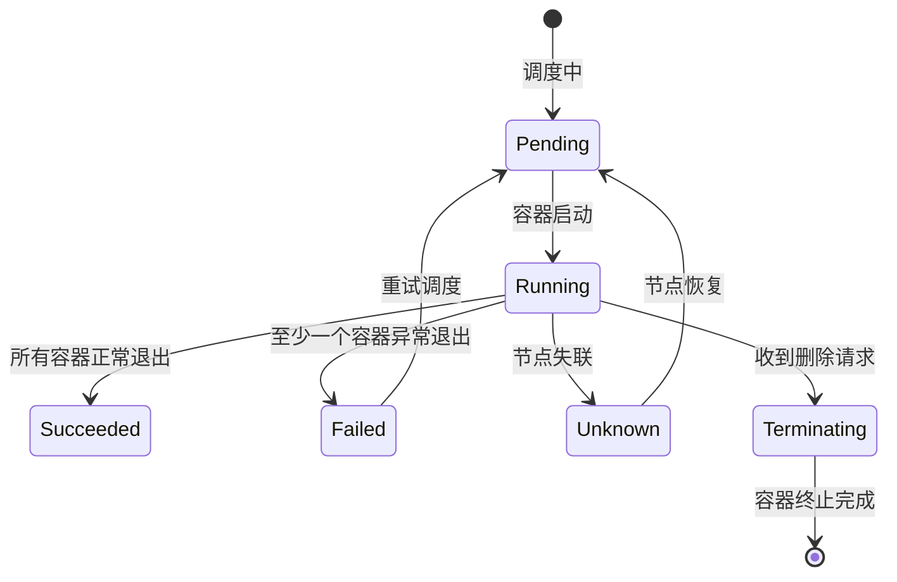

```yaml
apiVersion: v1
kind: Pod
metadata:
  name: lifecycle-demo
spec:
  initContainers:
  # 初始化容器：在主容器之前按顺序运行，全部成功后才启动主容器
  - name: init-db
    image: busybox:1.36
    command: ['sh', '-c', 'until nslookup mysql-service; do echo waiting; sleep 2; done']
  - name: init-config
    image: busybox:1.36
    command: ['sh', '-c', 'until [ -f /shared/config.yaml ]; do sleep 1; done']
  containers:
  - name: app
    image: nginx:1.25
    lifecycle:
      postStart:
        # 容器启动后立即执行（与 ENTRYPOINT 并行执行）
        exec:
          command: ["/bin/sh", "-c", "echo 'Container started' > /tmp/start.log"]
      preStop:
        # 容器终止前执行（优雅关闭的关键）
        # Kubernetes 先执行 preStop，等待 terminationGracePeriodSeconds 后才发送 SIGKILL
        exec:
          command: ["/bin/sh", "-c", "nginx -s quit; while killall -0 nginx; do sleep 1; done"]
    readinessProbe:
      # 就绪探针：决定容器是否可以接收流量
      # 失败 → 从 Service 的 Endpoints 中移除 → 不接收新流量
      # 不影响容器生命周期
      httpGet:
        path: /healthz
        port: 80
      initialDelaySeconds: 5
      periodSeconds: 10
      successThreshold: 1
      failureThreshold: 3
    livenessProbe:
      # 存活探针：决定容器是否需要重启
      # 失败 → kubelet 重启容器（CrashLoopBackOff 风险）
      httpGet:
        path: /healthz
        port: 80
      initialDelaySeconds: 15
      periodSeconds: 20
      failureThreshold: 3
    startupProbe:
      # 启动探针：保护慢启动应用
      # 在 startupProbe 成功之前，liveness/readiness 探针都不会执行
      # 适合 Java/Spring Boot 等启动较慢的应用
      httpGet:
        path: /healthz
        port: 80
      failureThreshold: 30
      periodSeconds: 10
      # 最长等待 30 × 10 = 300 秒
  terminationGracePeriodSeconds: 60
  # 优雅终止流程：
  # 1. Pod 状态变为 Terminating
  # 2. 从 Service Endpoints 移除（停止接收新流量）
  # 3. 执行 preStop hook
  # 4. 发送 SIGTERM 给容器进程
  # 5. 等待 terminationGracePeriodSeconds
  # 6. 如果容器仍在运行，发送 SIGKILL
```

Pod 的探针是 Kubernetes 健康检查的核心机制，理解三者的区别至关重要：

| 探针类型 | 用途 | 失败后果 | 典型配置 |
|----------|------|---------|---------|
| **startupProbe** | 检测应用是否启动完成 | 阻止 liveness/readiness 探针执行 | failureThreshold × periodSeconds = 最大启动时间 |
| **livenessProbe** | 检测应用是否存活 | kubelet 重启容器 | 间隔较长，容忍临时故障 |
| **readinessProbe** | 检测应用是否就绪接收流量 | 从 Endpoints 移除 | 间隔较短，快速响应 |

### 3.4 工作负载类型

Kubernetes 提供了多种工作负载类型，适用于不同的应用场景：

| 工作负载 | 适用场景 | Pod 管理 | 网络标识 | 存储 | 典型用法 |
|----------|---------|---------|---------|------|---------|
| **Deployment** | 无状态应用 | ReplicaSet（可滚动更新） | 临时 Pod 名 | 共享/临时 | Web 服务、API 服务 |
| **StatefulSet** | 有状态应用 | 有序部署/删除 | 稳定 DNS（pod-0, pod-1） | 独立持久卷 | 数据库、消息队列 |
| **DaemonSet** | 每节点一个 Pod | 自动在新节点创建 | 临时 Pod 名 | 可选 | 日志收集、监控代理 |
| **Job** | 一次性任务 | 运行到完成 | 临时 Pod 名 | 可选 | 批处理、数据迁移 |
| **CronJob** | 定时任务 | 按计划创建 Job | 临时 Pod 名 | 可选 | 定时报表、清理任务 |
| **ReplicaSet** | Pod 副本管理 | 维持指定数量 | 临时 Pod 名 | — | 通常由 Deployment 管理 |

```yaml
# DaemonSet：在每个节点上运行一个日志收集器
apiVersion: apps/v1
kind: DaemonSet
metadata:
  name: fluentd
  namespace: logging
spec:
  selector:
    matchLabels:
      app: fluentd
  template:
    metadata:
      labels:
        app: fluentd
    spec:
      containers:
      - name: fluentd
        image: fluentd:v1.16
        volumeMounts:
        - name: varlog
          mountPath: /var/log
          readOnly: true
        - name: containers
          mountPath: /var/lib/docker/containers
          readOnly: true
      tolerations:
      # 允许在 master 节点上运行
      - operator: Exists
      volumes:
      - name: varlog
        hostPath:
          path: /var/log
      - name: containers
        hostPath:
          path: /var/lib/docker/containers

---
# Job：执行一次性的数据库迁移
apiVersion: batch/v1
kind: Job
metadata:
  name: db-migration
spec:
  backoffLimit: 3          # 最多重试 3 次
  activeDeadlineSeconds: 600  # 最长运行 10 分钟
  ttlSecondsAfterFinished: 3600  # 完成 1 小时后自动清理
  template:
    spec:
      restartPolicy: Never   # Job 必须用 Never 或 OnFailure
      containers:
      - name: migrate
        image: my-app:v2.0
        command: ["python", "manage.py", "migrate"]
```

---

## 4. 容器网络

### 4.1 网络模型

Kubernetes 的网络模型有三个基本原则：

1. **每个 Pod 拥有独立的 IP 地址**：Pod 之间可以直接通信，不需要 NAT
2. **节点与 Pod 之间可以直接通信**：节点可以访问其上所有 Pod 的 IP
3. **Pod 看到的自己的 IP 与其它 Pod 看到的相同**：没有 NAT 转换

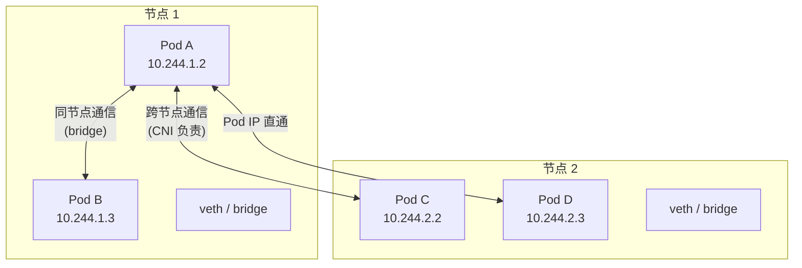

### 4.2 CNI（Container Network Interface）

CNI 是 CNCF 制定的容器网络标准，定义了容器网络插件的接口规范。Kubernetes 通过 CNI 插件实现 Pod 之间的网络通信。

| CNI 插件 | 网络模式 | 性能 | 网络策略 | 适用场景 |
|----------|---------|------|---------|---------|
| **Calico** | BGP 路由 / IPIP / VXLAN | 高（BGP 模式无封装开销） | 支持（L3/L4） | 生产集群首选 |
| **Flannel** | VXLAN / host-gw / UDP | 中等 | 不支持 | 开发/测试环境 |
| **Cilium** | eBPF（替代 kube-proxy） | 最高（内核态处理） | 支持（L3/L4/L7） | 大规模、安全敏感集群 |
| **Weave Net** | VXLAN + 加密 | 中等 | 支持（L3） | 多集群网络 |
| **Antrea** | Open vSwitch / Geneve | 高 | 支持（L3/L4） | VMware 环境 |

```yaml
# Calico 网络策略示例：只允许前端访问后端
apiVersion: networking.k8s.io/v1
kind: NetworkPolicy
metadata:
  name: allow-frontend-to-backend
  namespace: production
spec:
  podSelector:
    matchLabels:
      app: backend
  policyTypes:
  - Ingress
  ingress:
  - from:
    - podSelector:
        matchLabels:
          app: frontend
    ports:
    - protocol: TCP
      port: 8080
  # 未匹配到的流量将被默认拒绝
```

```yaml
# Cilium L7 网络策略示例：基于 HTTP 方法和路径的细粒度控制
apiVersion: cilium.io/v2
kind: CiliumNetworkPolicy
metadata:
  name: allow-get-only
spec:
  endpointSelector:
    matchLabels:
      app: api-server
  ingress:
  - fromEndpoints:
    - matchLabels:
        app: web-client
    toPorts:
    - ports:
      - port: "8080"
        protocol: TCP
      rules:
        http:
        - method: "GET"
          path: "/api/v1/.*"
        # 仅允许 GET 请求访问 /api/v1/ 路径
        # POST、DELETE 等其他方法将被拒绝
```

### 4.3 Service 网络

Kubernetes 的 Service 抽象为 Pod 提供了稳定的网络访问入口，解决了 Pod IP 不稳定的问题：

```bash
# Service 的五种主要类型

# 1. ClusterIP（默认）：仅集群内部可访问
kubectl expose deployment my-app --port=80 --type=ClusterIP
# 为 Service 分配一个集群内部虚拟 IP（如 10.96.0.100）
# 同一集群内的其他 Pod 可以通过 Service 名或 VIP 访问

# 2. NodePort：通过节点端口从外部访问（范围 30000-32767）
kubectl expose deployment my-app --port=80 --type=NodePort
# 所有节点的 30080 端口都会转发到 Pod

# 3. LoadBalancer：使用云提供商的负载均衡器
kubectl expose deployment my-app --port=80 --type=LoadBalancer
# 自动创建外部 LB（需要云环境支持）

# 4. ExternalName：将 Service 映射到外部 DNS（CNAME 记录）
# 适用于访问集群外部服务

# 5. Headless Service（clusterIP: None）：直接返回 Pod IP
# 适用于 StatefulSet、服务发现场景

# 查看 Service 的 Endpoints
kubectl get endpoints my-app
# NAME      ENDPOINTS                                AGE
# my-app    10.244.1.5:80,10.244.2.8:80             5d
```

### 4.4 Ingress 流量管理

Ingress 提供了七层（HTTP/HTTPS）路由和 TLS 终止能力，是集群外部流量进入的统一入口：

```yaml
apiVersion: networking.k8s.io/v1
kind: Ingress
metadata:
  name: app-ingress
  annotations:
    # Nginx Ingress Controller 特定配置
    nginx.ingress.kubernetes.io/ssl-redirect: "true"
    nginx.ingress.kubernetes.io/proxy-body-size: "50m"
    nginx.ingress.kubernetes.io/rate-limit: "100"
    # 自动 TLS 证书管理
    cert-manager.io/cluster-issuer: "letsencrypt-prod"
    # 跨域配置
    nginx.ingress.kubernetes.io/enable-cors: "true"
    nginx.ingress.kubernetes.io/cors-allow-origin: "https://app.example.com"
spec:
  ingressClassName: nginx
  tls:
  - hosts:
    - app.example.com
    secretName: app-tls
  rules:
  - host: app.example.com
    http:
      paths:
      - path: /
        pathType: Prefix
        backend:
          service:
            name: frontend
            port:
              number: 80
      - path: /api
        pathType: Prefix
        backend:
          service:
            name: backend-api
            port:
              number: 8080
```

**Ingress Controller 对比**：

| Controller | 性能 | 特点 | 适用场景 |
|-----------|------|------|---------|
| **Nginx Ingress** | 高 | 社区活跃，功能丰富 | 通用场景首选 |
| **Traefik** | 高 | 自动发现，配置热更新 | 微服务、动态环境 |
| **Istio Gateway** | 中等 | Service Mesh 集成 | 已使用 Istio 的集群 |
| **Kong** | 高 | API 网关功能 | 需要 API 管理的场景 |
| **AWS ALB Controller** | 高 | 原生 AWS ALB 集成 | AWS 环境 |

---

## 5. 容器存储

### 5.1 持久化存储体系

Kubernetes 提供了完整的存储抽象体系，将存储的供给与消费解耦：

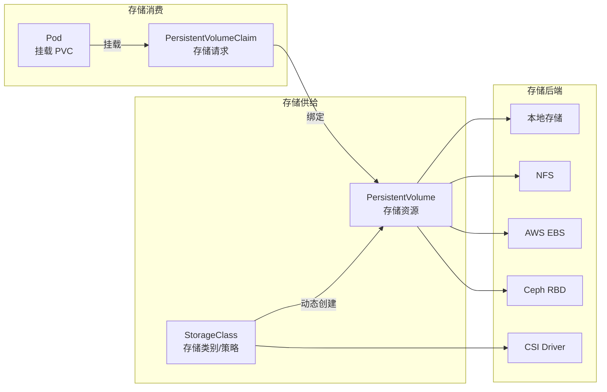

```yaml
# StorageClass 定义
apiVersion: storage.k8s.io/v1
kind: StorageClass
metadata:
  name: fast-ssd
provisioner: kubernetes.io/aws-ebs
parameters:
  type: gp3
  iopsPerGB: "50"
reclaimPolicy: Retain          # 删除 PVC 后保留 PV（数据安全）
allowVolumeExpansion: true     # 允许在线扩容
volumeBindingMode: WaitForFirstConsumer  # 延迟绑定（等待 Pod 调度）
---
# PVC 使用 StorageClass 动态创建存储
apiVersion: v1
kind: PersistentVolumeClaim
metadata:
  name: data-pvc
spec:
  accessModes:
  - ReadWriteOnce
  storageClassName: fast-ssd
  resources:
    requests:
      storage: 100Gi
---
# Pod 挂载 PVC
apiVersion: v1
kind: Pod
metadata:
  name: database
spec:
  containers:
  - name: mysql
    image: mysql:8.0
    volumeMounts:
    - mountPath: /var/lib/mysql
      name: data
  volumes:
  - name: data
    persistentVolumeClaim:
      claimName: data-pvc
```

### 5.2 存储访问模式

Kubernetes 定义了三种存储访问模式：

| 访问模式 | 缩写 | 含义 | 典型后端 |
|----------|------|------|---------|
| **ReadWriteOnce** | RWO | 单节点读写 | AWS EBS, Azure Disk, GCE PD |
| **ReadOnlyMany** | ROX | 多节点只读 | NFS, CephFS, AWS EFS |
| **ReadWriteMany** | RWX | 多节点读写 | NFS, CephFS, AWS EFS, Azure Files |
| **ReadWriteOncePod** | RWOP | 单 Pod 读写（K8s 1.27+） | CSI 驱动支持 |

> **选择建议**：数据库类应用通常使用 RWO；共享配置/日志使用 ROX；多个只读副本共享数据使用 RWX。不同存储后端支持的访问模式不同，选择时需要确认后端能力。

### 5.3 CSI 驱动

CSI（Container Storage Interface）是 Kubernetes 存储的标准接口，使得第三方存储厂商可以独立开发和分发存储驱动：

```bash
# 查看集群中已安装的 CSI 驱动
kubectl get csidrivers
# NAME                  ATTACHREQUIRED   PODINFOONVOLUME   STORAGECAPACITY
# ebs.csi.aws.com       true             true              true
# efs.csi.aws.com       false            true              false

# 查看存储类
kubectl get storageclass
# NAME                 PROVISIONER                    RECLAIMPOLICY   VOLUMEBINDINGMODE
# gp2 (default)        kubernetes.io/aws-ebs          Delete          WaitForFirstConsumer
# fast-ssd             kubernetes.io/aws-ebs          Retain          WaitForFirstConsumer
```

---
---

# 第40章 容器与编排 — 核心技巧

## 6. Dockerfile 最佳实践

### 6.1 多阶段构建

多阶段构建是优化镜像大小的最重要技巧。它允许在一个 Dockerfile 中使用多个 FROM 指令，最终只保留最后一个阶段的产物，从而丢弃编译时依赖，减小镜像体积。

```dockerfile
# ============ 第一阶段：编译阶段 ============
FROM golang:1.21-alpine AS builder
WORKDIR /app
# 先复制依赖文件，利用 Docker 缓存机制（依赖不变时不重新下载）
COPY go.mod go.sum ./
RUN go mod download
# 再复制源代码并编译
COPY . .
RUN CGO_ENABLED=0 GOOS=linux go build -o /app/server ./cmd/server

# ============ 第二阶段：运行阶段 ============
# 仅包含编译产物，基础镜像极小
FROM alpine:3.18
RUN apk --no-cache add ca-certificates tzdata
WORKDIR /app
COPY --from=builder /app/server .
COPY --from=builder /app/configs ./configs
EXPOSE 8080
USER nobody:nobody
CMD ["./server"]

# 构建结果：从 ~800MB（编译镜像）缩小到 ~15MB（运行镜像）
# 多阶段构建适用于各种语言：
# - Java: maven:3.9-eclipse-temurin-21 → eclipse-temurin:21-jre-alpine
# - Rust: rust:1.75 → scratch 或 debian:bookworm-slim
# - Node.js: node:18-alpine（含 devDependencies） → node:18-alpine（仅 prodDependencies）
# - Python: python:3.11 → python:3.11-slim
```

### 6.2 缓存优化

合理利用 Docker 的构建缓存可以显著加快构建速度。核心原则：**将变化频率低的指令放在前面，变化频率高的指令放在后面**。

```dockerfile
# ❌ 不好的实践：每次代码变化都会重新安装依赖（~5 分钟）
FROM node:18-alpine
WORKDIR /app
COPY . .               # 代码变化 → 缓存失效
RUN npm install         # 重新安装全部依赖（~5 分钟）
CMD ["node", "app.js"]

# ✅ 好的实践：依赖层被缓存，只重新复制代码（~5 秒）
FROM node:18-alpine
WORKDIR /app
COPY package.json package-lock.json ./   # 仅依赖声明变化时才失效
RUN npm ci --only=production             # 缓存命中时跳过
COPY . .                                 # 仅复制应用代码（~50MB）
CMD ["node", "app.js"]

# 进阶技巧：使用 BuildKit 的 mount=cache
# RUN --mount=type=cache,target=/root/.cache/go-build \
#     go build -o /app/server .
```

### 6.3 .dockerignore 文件

合理的 `.dockerignore` 文件可以减小构建上下文的大小（docker build 会发送整个目录给 Daemon），加快构建速度并避免将敏感文件意外包含在镜像中：

```gitignore
# .dockerignore 示例
.git
.gitignore
node_modules
npm-debug.log
Dockerfile
docker-compose.yml
.env
.env.*
*.md
tests/
coverage/
.github/
.vscode/
__pycache__
*.pyc
.venv
.idea/
*.swp
```

### 6.4 镜像安全加固

```dockerfile
FROM node:18-alpine AS builder
WORKDIR /app
COPY package*.json ./
RUN npm ci
COPY . .
RUN npm run build

FROM node:18-alpine
WORKDIR /app
# 使用非 root 用户运行（安全最佳实践）
RUN addgroup -S appgroup &amp;&amp; adduser -S appuser -G appgroup
# 只复制生产依赖和构建产物
COPY --from=builder --chown=appuser:appgroup /app/dist ./dist
COPY --from=builder --chown=appuser:appgroup /app/node_modules ./node_modules
COPY --from=builder --chown=appuser:appgroup /app/package.json ./
# 切换到非 root 用户
USER appuser
EXPOSE 3000
CMD ["node", "dist/main.js"]
```

### 6.5 多架构镜像构建

随着 ARM 服务器（如 AWS Graviton、Apple Silicon）的普及，构建支持多 CPU 架构的镜像已成为生产标配。Docker Buildx 配合 QEMU 可以在单机上交叉编译多架构镜像。

```bash
# 安装 Buildx（Docker 20.10+ 已内置）
docker buildx create --name multiarch --use
docker buildx inspect --bootstrap

# 构建多架构镜像并推送到仓库
docker buildx build   --platform linux/amd64,linux/arm64   -t registry.example.com/my-app:v1.0   --push   .

# 验证多架构镜像
docker manifest inspect registry.example.com/my-app:v1.0
# {
#   "mediaType": "application/vnd.docker.distribution.manifest.list.v2+json",
#   "manifests": [
#     {"platform": {"architecture": "amd64", "os": "linux"}},
#     {"platform": {"architecture": "arm64", "os": "linux"}}
#   ]
# }

# GitHub Actions 自动构建多架构镜像
# .github/workflows/build.yml
# jobs:
#   build:
#     runs-on: ubuntu-latest
#     steps:
#     - uses: docker/setup-buildx-action@v3
#     - uses: docker/setup-qemu-action@v3  # QEMU 模拟器
#     - uses: docker/build-push-action@v5
#       with:
#         platforms: linux/amd64,linux/arm64
#         push: true
#         tags: registry.example.com/my-app:${{ github.sha }}
```

> **注意事项**：QEMU 模拟的交叉编译比原生编译慢 5-10 倍。对于编译密集型项目，建议使用 GitHub Actions 的矩阵构建（matrix build）分别在 amd64 和 arm64 runner 上原生构建，最后合并为多架构 manifest。


---

## 7. Kubernetes 资源管理

### 7.1 资源请求与限制

正确配置资源请求（requests）和限制（limits）是确保应用稳定运行的关键：

```yaml
apiVersion: apps/v1
kind: Deployment
metadata:
  name: web-app
spec:
  replicas: 3
  selector:
    matchLabels:
      app: web
  template:
    metadata:
      labels:
        app: web
    spec:
      containers:
      - name: app
        image: web-app:v1.0
        resources:
          requests:
            cpu: "250m"       # 请求 0.25 个 CPU 核心（用于调度决策）
            memory: "256Mi"   # 请求 256MB 内存（用于调度决策）
          limits:
            cpu: "500m"       # 最多使用 0.5 个 CPU 核心（可被 throttle）
            memory: "512Mi"   # 最多使用 512MB 内存（超过触发 OOM Kill）
```

**QoS（Quality of Service）类别**：Kubernetes 根据 requests 和 limits 的配置自动为 Pod 分配 QoS 类别，这决定了节点资源紧张时 Pod 被驱逐的优先级：

| QoS 类别 | 条件 | 驱逐优先级 | 说明 |
|----------|------|-----------|------|
| **Guaranteed** | requests == limits | 最后驱逐 | 最关键的工作负载 |
| **Burstable** | requests < limits | 中间驱逐 | 有弹性需求的应用 |
| **BestEffort** | 未设置 requests/limits | 最先驱逐 | 临时/可丢失的任务 |

### 7.2 自动伸缩

**Horizontal Pod Autoscaler（HPA）**：根据 CPU、内存或自定义指标自动调整 Pod 副本数。

```yaml
apiVersion: autoscaling/v2
kind: HorizontalPodAutoscaler
metadata:
  name: web-app-hpa
spec:
  scaleTargetRef:
    apiVersion: apps/v1
    kind: Deployment
    name: web-app
  minReplicas: 2
  maxReplicas: 20
  metrics:
  - type: Resource
    resource:
      name: cpu
      target:
        type: Utilization
        averageUtilization: 70    # CPU 平均使用率超过 70% 时扩容
  - type: Resource
    resource:
      name: memory
      target:
        type: Utilization
        averageUtilization: 80
  - type: Pods                     # 自定义指标：每秒请求数
    pods:
      metric:
        name: requests_per_second
      target:
        type: AverageValue
        averageValue: "1000"
  behavior:
    scaleUp:
      stabilizationWindowSeconds: 60    # 扩容稳定窗口 60 秒
      policies:
      - type: Percent
        value: 100                       # 每分钟最多翻倍
        periodSeconds: 60
    scaleDown:
      stabilizationWindowSeconds: 300   # 缩容稳定窗口 5 分钟（防止抖动）
      policies:
      - type: Percent
        value: 10                        # 每分钟最多缩 10%
        periodSeconds: 60
```

**Vertical Pod Autoscaler（VPA）**：自动调整 Pod 的资源请求和限制。

```yaml
apiVersion: autoscaling.k8s.io/v1
kind: VerticalPodAutoscaler
metadata:
  name: web-app-vpa
spec:
  targetRef:
    apiVersion: apps/v1
    kind: Deployment
    name: web-app
  updatePolicy:
    updateMode: "Auto"    # Auto: 自动重启 Pod 调整资源
                          # Initial: 仅在 Pod 创建时提供建议
                          # Off: 仅提供建议，不自动调整
  resourcePolicy:
    containerPolicies:
    - containerName: app
      minAllowed:
        cpu: "100m"
        memory: "128Mi"
      maxAllowed:
        cpu: "2"
        memory: "2Gi"
```

### 7.3 ResourceQuota 与 LimitRange

```yaml
# 命名空间级别的资源配额：防止团队过度消耗集群资源
apiVersion: v1
kind: ResourceQuota
metadata:
  name: team-quota
  namespace: team-a
spec:
  hard:
    requests.cpu: "10"           # CPU 请求总量不超过 10 核
    requests.memory: "20Gi"      # 内存请求总量不超过 20Gi
    limits.cpu: "20"             # CPU 限制总量不超过 20 核
    limits.memory: "40Gi"        # 内存限制总量不超过 40Gi
    pods: "50"                   # Pod 数量不超过 50
    services: "10"               # Service 数量不超过 10
    persistentvolumeclaims: "20" # PVC 数量不超过 20
    requests.nvidia.com/gpu: "4" # GPU 数量限制
---
# 默认资源限制：为未设置资源的容器提供默认值
apiVersion: v1
kind: LimitRange
metadata:
  name: default-limits
  namespace: team-a
spec:
  limits:
  - default:                     # 容器默认 limits
      cpu: "500m"
      memory: "512Mi"
    defaultRequest:              # 容器默认 requests
      cpu: "100m"
      memory: "128Mi"
    max:                         # 容器最大允许值
      cpu: "2"
      memory: "4Gi"
    min:                         # 容器最小必须设置
      cpu: "50m"
      memory: "64Mi"
    type: Container
  - max:                         # PVC 最大容量
      storage: "500Gi"
    type: PersistentVolumeClaim
```

---

## 8. Helm Chart 实践

Helm 是 Kubernetes 的包管理器，类似于 Linux 的 apt/yum 或 Node.js 的 npm。它将 Kubernetes 清单文件打包为可复用的 Chart，并支持参数化配置。

### 8.1 核心概念

| 概念 | 说明 | 类比 |
|------|------|------|
| **Chart** | 一组 Kubernetes 清单文件的模板包 | 安装包（.deb / .rpm） |
| **Release** | Chart 的一次部署实例 | 已安装的软件 |
| **Repository** | Chart 的存储仓库 | apt/yum 源 |
| **Values** | Chart 的参数配置 | 软件配置文件 |

### 8.2 Chart 结构

my-chart/
├── Chart.yaml          # Chart 元数据（名称、版本、依赖）
├── Chart.lock          # 依赖锁定文件
├── values.yaml         # 默认配置值
├── charts/             # 依赖的子 Chart
├── templates/          # Kubernetes 清单模板
│   ├── deployment.yaml
│   ├── service.yaml
│   ├── ingress.yaml
│   ├── configmap.yaml
│   ├── _helpers.tpl    # 模板辅助函数
│   └── NOTES.txt       # 安装后提示信息
└── .helmignore         # 打包时忽略的文件

### 8.3 模板语法与实践

```yaml
# templates/deployment.yaml
apiVersion: apps/v1
kind: Deployment
metadata:
  name: {{ include "mychart.fullname" . }}
  labels:
    {{- include "mychart.labels" . | nindent 4 }}
spec:
  replicas: {{ .Values.replicaCount }}
  selector:
    matchLabels:
      {{- include "mychart.selectorLabels" . | nindent 6 }}
  template:
    metadata:
      labels:
        {{- include "mychart.selectorLabels" . | nindent 8 }}
    spec:
      containers:
      - name: {{ .Chart.Name }}
        image: "{{ .Values.image.repository }}:{{ .Values.image.tag }}"
        ports:
        - containerPort: {{ .Values.service.targetPort }}
        resources:
          {{- toYaml .Values.resources | nindent 10 }}
        {{- if .Values.livenessProbe.enabled }}
        livenessProbe:
          httpGet:
            path: {{ .Values.livenessProbe.path }}
            port: {{ .Values.service.targetPort }}
          initialDelaySeconds: {{ .Values.livenessProbe.initialDelaySeconds }}
        {{- end }}
```

```yaml
# values.yaml（默认配置）
replicaCount: 3

image:
  repository: registry.example.com/my-app
  tag: "v1.0.0"
  pullPolicy: IfNotPresent

service:
  type: ClusterIP
  port: 80
  targetPort: 8080

resources:
  requests:
    cpu: "200m"
    memory: "256Mi"
  limits:
    cpu: "500m"
    memory: "512Mi"

livenessProbe:
  enabled: true
  path: /healthz
  initialDelaySeconds: 15
```

```bash
# Helm 常用命令
# 安装 Chart
helm install my-release ./my-chart \
  --namespace production \
  --set image.tag=v2.0.0 \
  --set replicaCount=5

# 使用 values 文件安装
helm install my-release ./my-chart -f custom-values.yaml

# 升级版本
helm upgrade my-release ./my-chart --set image.tag=v2.1.0

# 回滚
helm rollback my-release 1     # 回滚到版本 1

# 查看 Release 状态
helm list -n production
helm status my-release -n production

# 模板渲染调试（不实际安装）
helm template my-release ./my-chart -f custom-values.yaml
```

---

## 9. 故障排查方法论

容器化应用的故障排查需要系统性的方法论。以下是经过实战验证的排查框架：

### 9.1 Pod 状态排查流程

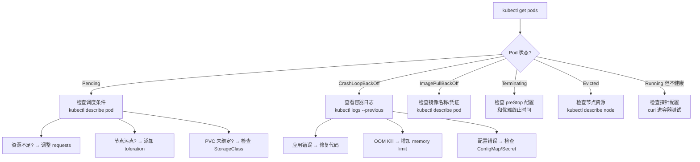

### 9.2 常见故障及排查命令

```bash
# ============ 1. Pod 无法启动 ============
# 查看 Pod 详情（含事件信息，是最关键的排查起点）
kubectl describe pod <pod-name> -n <namespace>
# 关注 Events 部分的错误信息

# 查看容器日志（含上次崩溃的日志）
kubectl logs <pod-name> -c <container-name> --previous

# ============ 2. 网络不通 ============
# 进入 Pod 测试网络
kubectl exec -it <pod-name> -- sh
# 测试 DNS 解析
nslookup <service-name>.<namespace>.svc.cluster.local
# 测试连通性
curl -v http://<service-name>:<port>/healthz
# 查看 Service 的 Endpoints（是否为空？）
kubectl get endpoints <service-name>
# 检查 NetworkPolicy 是否阻止了流量
kubectl get networkpolicy -n <namespace>

# ============ 3. 性能问题 ============
# 查看资源使用
kubectl top pods -n <namespace>
kubectl top nodes
# 查看容器的 cgroup 限制
cat /sys/fs/cgroup/memory.max    # cgroups v2
cat /sys/fs/cgroup/memory/memory.limit_in_bytes  # cgroups v1
# 检查 HPA 状态
kubectl describe hpa <hpa-name>

# ============ 4. 存储问题 ============
# 检查 PVC 状态
kubectl get pvc -n <namespace>
kubectl describe pvc <pvc-name>
# 检查 PV
kubectl get pv
kubectl describe pv <pv-name>
# 检查 StorageClass
kubectl get storageclass

# ============ 5. 节点问题 ============
kubectl describe node <node-name>
# 关注 Conditions: Ready, MemoryPressure, DiskPressure, PIDPressure
# 关注 Taints 和 Allocatable 资源
```

### 9.3 调试技巧

```bash
# 使用临时调试容器（Kubernetes 1.23+，需要 ephemeral containers 支持）
kubectl debug -it <pod-name> --image=busybox:1.36 --target=<container-name>
# 在调试容器中共享目标容器的进程和网络命名空间

# 使用 node-level 调试容器
kubectl debug node/<node-name> -it --image=ubuntu:22.04
# 可以查看节点上的所有容器和系统状态

# 端口转发（本地调试远程 Pod）
kubectl port-forward <pod-name> 8080:8080
# 然后在本地浏览器访问 http://localhost:8080

# 查看 Pod 的环境变量
kubectl exec <pod-name> -- env | sort

# 检查 kubelet 日志
ssh <node-name>
journalctl -u kubelet -f --since "10 minutes ago"
```

---

## 10. 容器安全加固

### 10.1 安全层次模型

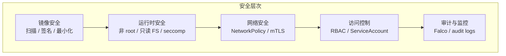

### 10.2 镜像安全

```bash
# 使用 Trivy 扫描镜像漏洞
trivy image my-app:v1.0
# Results:
# my-app:v1.0 (debian 11.7)
# Total: 156 (UNKNOWN: 0, LOW: 87, MEDIUM: 48, HIGH: 18, CRITICAL: 3)
#
# CRITICAL: CVE-2023-XXXX - Remote Code Execution in openssl
#   Fix: Upgrade to openssl 3.0.10
#   Path: /usr/lib/x86_64-linux-gnu/libssl.so

# 在 CI/CD 中集成镜像扫描（阻止有 CRITICAL 漏洞的镜像部署）
trivy image --severity CRITICAL --exit-code 1 my-app:v1.0

# 使用 cosign 签名和验证镜像
cosign sign --yes registry.example.com/my-app:v1.0
cosign verify --key cosign.pub registry.example.com/my-app:v1.0
```

### 10.3 运行时安全

```yaml
# Pod 安全标准最佳实践
apiVersion: v1
kind: Pod
metadata:
  name: secure-pod
spec:
  securityContext:
    runAsNonRoot: true                # 强制非 root 运行
    runAsUser: 1000                   # 指定 UID
    fsGroup: 2000                     # 文件系统组
    seccompProfile:
      type: RuntimeDefault            # 使用容器运行时默认的 seccomp 配置
  containers:
  - name: app
    image: my-app:v1
    securityContext:
      allowPrivilegeEscalation: false # 禁止提权
      readOnlyRootFilesystem: true    # 只读根文件系统
      capabilities:
        drop:
          - ALL                       # 丢弃所有 Linux capabilities
        # 添加必要的 capabilities
        # add:
        #   - NET_BIND_SERVICE
    resources:
      requests:
        cpu: "100m"
        memory: "128Mi"
      limits:
        cpu: "500m"
        memory: "256Mi"
    volumeMounts:
    - name: tmp
      mountPath: /tmp                 # 可写的临时目录
    - name: cache
      mountPath: /app/cache
  volumes:
  - name: tmp
    emptyDir:
      sizeLimit: "100Mi"
  - name: cache
    emptyDir:
      sizeLimit: "200Mi"
```

### 10.4 RBAC 访问控制

```yaml
# 创建只读权限的 ServiceAccount
apiVersion: v1
kind: ServiceAccount
metadata:
  name: readonly-user
  namespace: production
---
# 定义 Role：只允许查看资源
apiVersion: rbac.authorization.k8s.io/v1
kind: Role
metadata:
  name: pod-reader
  namespace: production
rules:
- apiGroups: [""]
  resources: ["pods", "pods/log"]
  verbs: ["get", "list", "watch"]
- apiGroups: ["apps"]
  resources: ["deployments", "replicasets"]
  verbs: ["get", "list"]
---
# 绑定 Role 到 ServiceAccount
apiVersion: rbac.authorization.k8s.io/v1
kind: RoleBinding
metadata:
  name: read-pods
  namespace: production
subjects:
- kind: ServiceAccount
  name: readonly-user
  namespace: production
roleRef:
  kind: Role
  name: pod-reader
  apiGroup: rbac.authorization.k8s.io
```

---

## 11. 可观测性与监控

容器化应用的可观测性是生产环境运维的基石。CNCF 将可观测性定义为三大支柱：**指标（Metrics）**、**日志（Logs）** 和 **追踪（Traces）**。在 Kubernetes 环境中，这三者需要协同工作才能实现全面的系统可见性。

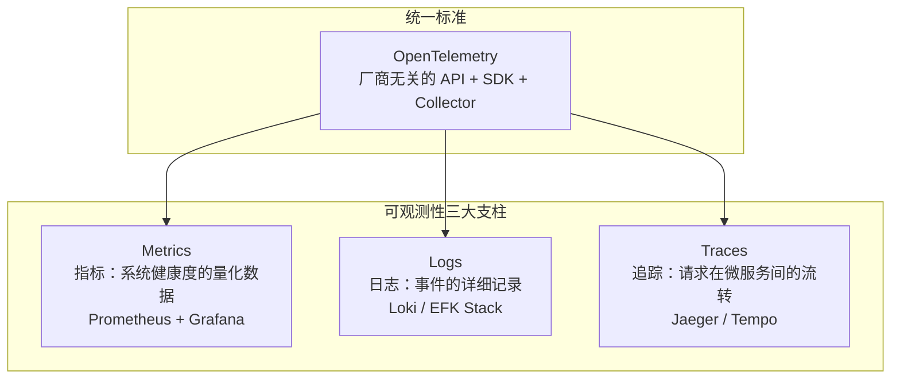

### 11.1 指标监控（Metrics）

**Prometheus + Grafana** 是 Kubernetes 生态中最主流的监控方案。Prometheus 通过 pull 模式定期从目标端点抓取指标数据，Grafana 负责可视化和告警。

```yaml
# Prometheus Operator 的 ServiceMonitor 配置
# 自动发现并抓取 Pod 暴露的 /metrics 端点
apiVersion: monitoring.coreos.com/v1
kind: ServiceMonitor
metadata:
  name: user-service-monitor
  namespace: monitoring
  labels:
    release: prometheus  # 匹配 Prometheus Operator 的选择器
spec:
  selector:
    matchLabels:
      app: user-service  # 匹配 Service 的标签
  endpoints:
  - port: http-metrics   # Service 中定义的端口名
    path: /actuator/prometheus
    interval: 15s        # 抓取间隔
    scrapeTimeout: 10s
  namespaceSelector:
    matchNames:
    - production         # 只监控生产命名空间
```

```yaml
# Grafana Dashboard ConfigMap（关键指标面板）
# 核心监控指标清单：
# 1. 集群级：节点 CPU/内存使用率、Pod 数量、API Server 请求延迟
# 2. 应用级：请求 QPS、错误率（5xx）、P99 延迟
# 3. 资源级：容器 CPU throttling、内存 OOM Kill 次数
# 4. 业务级：订单量、支付成功率、用户活跃度

# 常用 PromQL 查询示例
# CPU 使用率
# rate(container_cpu_usage_seconds_total{namespace="production"}[5m])
# 内存使用率
# container_memory_working_set_bytes / container_memory_limit_bytes
# Pod 重启次数
# increase(kube_pod_container_status_restarts_total[1h])
# 请求错误率
# sum(rate(http_requests_total{code=~"5.."}[5m])) / sum(rate(http_requests_total[5m]))
```

```bash
# 部署 Prometheus + Grafana（使用 kube-prometheus-stack Helm Chart）
helm repo add prometheus-community https://prometheus-community.github.io/helm-charts
helm install prometheus prometheus-community/kube-prometheus-stack   --namespace monitoring   --create-namespace   --set grafana.adminPassword=admin123   --set prometheus.prometheusSpec.retention=30d   --set prometheus.prometheusSpec.storageSpec.volumeClaimTemplate.spec.resources.requests.storage=50Gi

# 访问 Grafana Dashboard
kubectl port-forward -n monitoring svc/prometheus-grafana 3000:80
# 浏览器访问 http://localhost:3000
```

### 11.2 日志收集（Logging）

容器日志收集有三种主流架构：

| 架构 | 方案 | 优点 | 缺点 |
|------|------|------|------|
| **Sidecar** | 每个 Pod 部署日志收集容器 | 隔离性好，可独立升级 | 资源开销大（每 Pod 额外一个容器） |
| **节点级** | DaemonSet 部署日志收集器 | 资源开销小，统一管理 | 与应用耦合，需要共享日志目录 |
| **应用内** | 应用直接推送日志到后端 | 架构最简单 | 应用侵入性强，需要修改代码 |

```yaml
# 节点级日志收集：Fluent Bit DaemonSet（轻量级日志处理器）
apiVersion: apps/v1
kind: DaemonSet
metadata:
  name: fluent-bit
  namespace: logging
spec:
  selector:
    matchLabels:
      app: fluent-bit
  template:
    metadata:
      labels:
        app: fluent-bit
    spec:
      containers:
      - name: fluent-bit
        image: fluent/fluent-bit:2.2
        resources:
          requests:
            cpu: "50m"
            memory: "64Mi"
          limits:
            cpu: "200m"
            memory: "256Mi"
        volumeMounts:
        - name: varlog
          mountPath: /var/log
          readOnly: true
        - name: containers
          mountPath: /var/lib/docker/containers
          readOnly: true
        - name: config
          mountPath: /fluent-bit/etc/
      volumes:
      - name: varlog
        hostPath:
          path: /var/log
      - name: containers
        hostPath:
          path: /var/lib/docker/containers
      - name: config
        configMap:
          name: fluent-bit-config
```

```yaml
# Loki + Promtail 方案（轻量级，Grafana 原生集成）
# Promtail DaemonSet 配置
# promtail-config.yaml
server:
  http_listen_port: 9080
positions:
  filename: /tmp/positions.yaml
clients:
  - url: http://loki.logging.svc.cluster.local:3100/loki/api/v1/push
scrape_configs:
  - job_name: kubernetes-pods
    kubernetes_sd_configs:
      - role: pod
    relabel_configs:
      - source_labels: [__meta_kubernetes_pod_annotation_prometheus_io_scrape]
        action: keep
        regex: true
      - source_labels: [__meta_kubernetes_namespace]
        target_label: namespace
      - source_labels: [__meta_kubernetes_pod_name]
        target_label: pod
```

### 11.3 分布式追踪（Tracing）

在微服务架构中，一个用户请求可能跨越多个服务。分布式追踪通过 Trace ID 将所有服务的日志和指标关联起来，是定位性能瓶颈的利器。

```yaml
# OpenTelemetry Collector 配置（统一收集 Metrics、Logs、Traces）
apiVersion: v1
kind: ConfigMap
metadata:
  name: otel-collector-config
  namespace: observability
data:
  config.yaml: |
    receivers:
      otlp:
        protocols:
          grpc:
            endpoint: 0.0.0.0:4317
          http:
            endpoint: 0.0.0.0:4318
    processors:
      batch:
        timeout: 1s
        send_batch_size: 1024
      memory_limiter:
        check_interval: 1s
        limit_mib: 512
        spike_limit_mib: 128
    exporters:
      # 指标 → Prometheus
      prometheus:
        endpoint: "0.0.0.0:8889"
      # 追踪 → Jaeger
      otlp/jaeger:
        endpoint: jaeger-collector.observability.svc.cluster.local:4317
        tls:
          insecure: true
    service:
      pipelines:
        metrics:
          receivers: [otlp]
          processors: [memory_limiter, batch]
          exporters: [prometheus]
        traces:
          receivers: [otlp]
          processors: [memory_limiter, batch]
          exporters: [otlp/jaeger]
```

```java
// Java 应用接入 OpenTelemetry（Spring Boot 示例）
// application.yml
// management:
//   tracing:
//     sampling:
//       probability: 0.1  // 采样率 10%（生产环境推荐）
// opentelemetry:
//   exporter:
//     otlp:
//       endpoint: http://otel-collector.observability.svc.cluster.local:4318

// 关键概念：
// - Trace：一个完整请求链路，由全局唯一的 Trace ID 标识
// - Span：单个服务内的一次操作，包含开始时间、结束时间、状态
// - Context Propagation：通过 HTTP Header（traceparent）在服务间传递追踪上下文
// - Sampling：全量采样（开发）vs 概率采样（生产）vs 尾采样（按错误率）
```

### 11.4 告警策略

合理的告警策略是可观测性的最后一公里。告警过多会导致"告警疲劳"，过少则会遗漏故障。

```yaml
# PrometheusRule：关键告警规则
apiVersion: monitoring.coreos.com/v1
kind: PrometheusRule
metadata:
  name: app-alerts
  namespace: monitoring
spec:
  groups:
  - name: application
    rules:
    # Pod 重启过于频繁（可能有 Bug）
    - alert: PodRestartingTooFrequently
      expr: increase(kube_pod_container_status_restarts_total[1h]) > 5
      for: 5m
      labels:
        severity: warning
      annotations:
        summary: "Pod {{ $labels.pod }} 在 1 小时内重启超过 5 次"

    # 内存接近 OOM
    - alert: ContainerMemoryHigh
      expr: container_memory_working_set_bytes / container_memory_limit_bytes > 0.9
      for: 5m
      labels:
        severity: critical
      annotations:
        summary: "容器 {{ $labels.container }} 内存使用率超过 90%"

    # CPU 被 throttle
    - alert: ContainerCPUThrottling
      expr: rate(container_cpu_cfs_throttled_seconds_total[5m]) > 0.5
      for: 10m
      labels:
        severity: warning
      annotations:
        summary: "容器 {{ $labels.container }} CPU throttle 严重，建议增加 limits"

    # HTTP 错误率
    - alert: HighErrorRate
      expr: sum(rate(http_requests_total{code=~"5.."}[5m])) / sum(rate(http_requests_total[5m])) > 0.05
      for: 5m
      labels:
        severity: critical
      annotations:
        summary: "HTTP 5xx 错误率超过 5%"

    # PVC 存储即将满
    - alert: PVCStorageAlmostFull
      expr: kubelet_volume_stats_used_bytes / kubelet_volume_stats_capacity_bytes > 0.85
      for: 10m
      labels:
        severity: warning
      annotations:
        summary: "PVC {{ $labels.persistentvolumeclaim }} 使用率超过 85%"
```

> **告警分级原则**：Critical 告警需要立即处理（影响用户），Warning 告警需要关注但不必立即响应（潜在风险），Info 仅记录不告警。每个告警必须有明确的处理手册（Runbook），否则告警本身就失去了价值。

---

## 12. 部署策略

### 12.1 滚动更新（Rolling Update）

```yaml
apiVersion: apps/v1
kind: Deployment
metadata:
  name: web-app
spec:
  replicas: 5
  strategy:
    type: RollingUpdate
    rollingUpdate:
      maxSurge: 1        # 更新过程中最多比期望数量多 1 个 Pod
      maxUnavailable: 0   # 更新过程中不允许有 Pod 不可用
  template:
    spec:
      containers:
      - name: app
        image: web-app:v2.0
```

### 12.2 金丝雀发布（Canary）

```yaml
# 稳定版 Deployment（90% 流量）
apiVersion: apps/v1
kind: Deployment
metadata:
  name: web-app-stable
  labels:
    app: web
    version: stable
spec:
  replicas: 9
  selector:
    matchLabels:
      app: web
      version: stable
  template:
    metadata:
      labels:
        app: web
        version: stable
    spec:
      containers:
      - name: app
        image: web-app:v1.0
---
# 金丝雀版 Deployment（10% 流量）
apiVersion: apps/v1
kind: Deployment
metadata:
  name: web-app-canary
  labels:
    app: web
    version: canary
spec:
  replicas: 1
  selector:
    matchLabels:
      app: web
      version: canary
  template:
    metadata:
      labels:
        app: web
        version: canary
    spec:
      containers:
      - name: app
        image: web-app:v2.0
---
# Service 同时匹配两个版本，按 Pod 数量比例分配流量
apiVersion: v1
kind: Service
metadata:
  name: web-app
spec:
  selector:
    app: web  # 不指定 version，同时匹配 stable 和 canary
  ports:
  - port: 80
```

### 12.3 蓝绿部署

```yaml
# 使用 Argo Rollouts 实现蓝绿部署
apiVersion: argoproj.io/v1alpha1
kind: Rollout
metadata:
  name: web-app
spec:
  replicas: 5
  strategy:
    blueGreen:
      activeService: web-app-active       # 流量指向的 Service
      previewService: web-app-preview     # 预览版 Service
      autoPromotionEnabled: false         # 手动确认后切换流量
      prePromotionAnalysis:
        templates:
        - templateName: success-rate
      scaleDownDelaySeconds: 300          # 旧版本延迟 5 分钟下线
  selector:
    matchLabels:
      app: web
  template:
    metadata:
      labels:
        app: web
    spec:
      containers:
      - name: app
        image: web-app:v2.0
```

**部署策略对比**：

| 策略 | 服务中断 | 回滚速度 | 资源开销 | 适用场景 |
|------|---------|---------|---------|---------|
| **滚动更新** | 无（零停机） | 秒级 | 低（+1 Pod） | 通用场景 |
| **金丝雀发布** | 无 | 秒级 | 低（+1 Pod） | 需要验证新版本稳定性 |
| **蓝绿部署** | 无 | 秒级（瞬间切换） | 高（2x 资源） | 需要瞬间切换、快速回滚 |
| **A/B 测试** | 无 | 秒级 | 低 | 需要按用户/地域分流 |

---
---

# 第40章 容器与编排 — 实战案例

## 13. 案例一：微服务应用容器化

### 场景描述

一个典型的电商系统由用户服务、商品服务、订单服务和网关服务组成。本案例展示如何将这些微服务容器化并部署到 Kubernetes 集群。

### 用户服务完整部署

```yaml
# 1. ConfigMap：外部化配置
apiVersion: v1
kind: ConfigMap
metadata:
  name: user-service-config
data:
  application.yml: |
    server:
      port: 8080
    spring:
      datasource:
        url: jdbc:mysql://mysql-service:3306/userdb
        driver-class-name: com.mysql.cj.jdbc.Driver
      redis:
        host: redis-service
        port: 6379
    logging:
      level:
        com.example: INFO
---
# 2. Deployment：声明式部署
apiVersion: apps/v1
kind: Deployment
metadata:
  name: user-service
  labels:
    app: user-service
    version: v1
spec:
  replicas: 3
  selector:
    matchLabels:
      app: user-service
  template:
    metadata:
      labels:
        app: user-service
      annotations:
        prometheus.io/scrape: "true"
        prometheus.io/port: "8080"
        prometheus.io/path: "/actuator/prometheus"
    spec:
      containers:
      - name: user-service
        image: registry.example.com/user-service:v1.2.0
        ports:
        - containerPort: 8080
          name: http
        resources:
          requests:
            cpu: "200m"
            memory: "256Mi"
          limits:
            cpu: "500m"
            memory: "512Mi"
        readinessProbe:
          httpGet:
            path: /actuator/health/readiness
            port: 8080
          initialDelaySeconds: 30
          periodSeconds: 10
          timeoutSeconds: 5
          failureThreshold: 3
        livenessProbe:
          httpGet:
            path: /actuator/health/liveness
            port: 8080
          initialDelaySeconds: 60
          periodSeconds: 15
          timeoutSeconds: 5
          failureThreshold: 3
        env:
        - name: SPRING_PROFILES_ACTIVE
          value: "kubernetes"
        - name: JAVA_OPTS
          value: "-Xms256m -Xmx384m -XX:+UseG1GC"
        volumeMounts:
        - name: config-volume
          mountPath: /app/config
          readOnly: true
      volumes:
      - name: config-volume
        configMap:
          name: user-service-config
---
# 3. Service
apiVersion: v1
kind: Service
metadata:
  name: user-service
  labels:
    app: user-service
spec:
  selector:
    app: user-service
  ports:
  - port: 8080
    targetPort: 8080
    name: http
---
# 4. HPA
apiVersion: autoscaling/v2
kind: HorizontalPodAutoscaler
metadata:
  name: user-service-hpa
spec:
  scaleTargetRef:
    apiVersion: apps/v1
    kind: Deployment
    name: user-service
  minReplicas: 3
  maxReplicas: 15
  metrics:
  - type: Resource
    resource:
      name: cpu
      target:
        type: Utilization
        averageUtilization: 70
  - type: Resource
    resource:
      name: memory
      target:
        type: Utilization
        averageUtilization: 80
```

### 统一网关配置

```yaml
apiVersion: networking.k8s.io/v1
kind: Ingress
metadata:
  name: api-gateway
  annotations:
    nginx.ingress.kubernetes.io/ssl-redirect: "true"
    nginx.ingress.kubernetes.io/proxy-body-size: "10m"
    nginx.ingress.kubernetes.io/rate-limit-connections: "100"
    nginx.ingress.kubernetes.io/cors-allow-origin: "https://www.example.com"
    nginx.ingress.kubernetes.io/enable-cors: "true"
spec:
  ingressClassName: nginx
  tls:
  - hosts:
    - api.example.com
    secretName: api-tls
  rules:
  - host: api.example.com
    http:
      paths:
      - path: /api/users
        pathType: Prefix
        backend:
          service:
            name: user-service
            port:
              number: 8080
      - path: /api/products
        pathType: Prefix
        backend:
          service:
            name: product-service
            port:
              number: 8080
      - path: /api/orders
        pathType: Prefix
        backend:
          service:
            name: order-service
            port:
              number: 8080
```

---

## 14. 案例二：CI/CD 流水线集成

### GitLab CI/CD 流水线

```yaml
# .gitlab-ci.yml
stages:
  - test
  - build
  - security-scan
  - deploy

variables:
  DOCKER_REGISTRY: registry.example.com
  IMAGE_NAME: ${DOCKER_REGISTRY}/${CI_PROJECT_NAME}

# 测试阶段
test:
  stage: test
  image: python:3.11
  script:
    - pip install -r requirements.txt
    - pip install pytest pytest-cov
    - pytest --cov=app tests/ --cov-report=xml
    - coverage report --fail-under=80
  artifacts:
    reports:
      coverage_report:
        coverage_format: cobertura
        path: coverage.xml

# 构建镜像
build:
  stage: build
  image: docker:24.0
  services:
    - docker:24.0-dind
  before_script:
    - docker login -u $CI_REGISTRY_USER -p $CI_REGISTRY_PASSWORD $CI_REGISTRY
  script:
    - export IMAGE_TAG=${CI_COMMIT_SHORT_SHA}
    - docker build -t ${IMAGE_NAME}:${IMAGE_TAG} .
    - docker tag ${IMAGE_NAME}:${IMAGE_TAG} ${IMAGE_NAME}:latest
    - docker push ${IMAGE_NAME}:${IMAGE_TAG}
    - docker push ${IMAGE_NAME}:latest
  only:
    - main
    - tags

# 镜像安全扫描
security-scan:
  stage: security-scan
  image:
    name: aquasec/trivy:latest
    entrypoint: [""]
  script:
    - trivy image --exit-code 1 --severity CRITICAL ${IMAGE_NAME}:${CI_COMMIT_SHORT_SHA}
  allow_failure: false
  only:
    - main

# 部署到 staging
deploy-staging:
  stage: deploy
  image: bitnami/kubectl:latest
  script:
    - kubectl config use-context staging
    - kubectl set image deployment/my-app app=${IMAGE_NAME}:${CI_COMMIT_SHORT_SHA}
    - kubectl rollout status deployment/my-app --timeout=300s
  environment:
    name: staging
    url: https://staging.example.com
  only:
    - main

# 部署到 production（手动触发）
deploy-production:
  stage: deploy
  image: bitnami/kubectl:latest
  script:
    - kubectl config use-context production
    - kubectl set image deployment/my-app app=${IMAGE_NAME}:${CI_COMMIT_SHORT_SHA}
    - kubectl rollout status deployment/my-app --timeout=600s
  environment:
    name: production
    url: https://www.example.com
  when: manual
  only:
    - tags
```

---

## 15. 案例三：StatefulSet 部署 MySQL 主从集群

### 完整的 MySQL 高可用方案

```yaml
# Headless Service（为 StatefulSet 提供稳定 DNS）
apiVersion: v1
kind: Service
metadata:
  name: mysql
  labels:
    app: mysql
spec:
  ports:
  - port: 3306
    name: mysql
  clusterIP: None
  selector:
    app: mysql
---
# ConfigMap：MySQL 主从配置
apiVersion: v1
kind: ConfigMap
metadata:
  name: mysql-config
data:
  primary.cnf: |
    [mysqld]
    log-bin=mysql-bin
    server-id=1
    binlog-format=ROW
    gtid-mode=ON
    enforce-gtid-consistency=ON
  replica.cnf: |
    [mysqld]
    super-read-only
    server-id=2
    gtid-mode=ON
    enforce-gtid-consistency=ON
---
# Secret：MySQL 密码
apiVersion: v1
kind: Secret
metadata:
  name: mysql-secret
type: Opaque
data:
  root-password: cm9vdHBhc3N3b3JkMTIz  # base64 of "rootpassword123"
---
# StatefulSet：有状态应用部署
apiVersion: apps/v1
kind: StatefulSet
metadata:
  name: mysql
spec:
  selector:
    matchLabels:
      app: mysql
  serviceName: mysql
  replicas: 3
  template:
    metadata:
      labels:
        app: mysql
    spec:
      initContainers:
      - name: init-mysql
        image: mysql:8.0
        command:
        - bash
        - "-c"
        - |
          set -ex
          # 根据 Pod 序号（hostname）生成 server-id
          [[ $(hostname) =~ -([0-9]+)$ ]] || exit 1
          ordinal=${BASH_REMATCH[1]}
          echo "[mysqld]" > /mnt/conf.d/server-id.cnf
          echo "server-id=$((100 + ordinal))" >> /mnt/conf.d/server-id.cnf
          # mysql-0 使用 primary.cnf（主节点），其他使用 replica.cnf
          if [[ $ordinal -eq 0 ]]; then
            cp /mnt/config-map/primary.cnf /mnt/conf.d/
          else
            cp /mnt/config-map/replica.cnf /mnt/conf.d/
          fi
        volumeMounts:
        - name: conf
          mountPath: /mnt/conf.d
        - name: config-map
          mountPath: /mnt/config-map
      containers:
      - name: mysql
        image: mysql:8.0
        ports:
        - containerPort: 3306
          name: mysql
        env:
        - name: MYSQL_ROOT_PASSWORD
          valueFrom:
            secretKeyRef:
              name: mysql-secret
              key: root-password
        resources:
          requests:
            cpu: "500m"
            memory: "1Gi"
          limits:
            cpu: "2"
            memory: "4Gi"
        volumeMounts:
        - name: data
          mountPath: /var/lib/mysql
          subPath: mysql
        - name: conf
          mountPath: /etc/mysql/conf.d
        livenessProbe:
          exec:
            command: ["mysqladmin", "ping"]
          initialDelaySeconds: 30
          periodSeconds: 10
          timeoutSeconds: 5
        readinessProbe:
          exec:
            command: ["mysql", "-e", "SELECT 1"]
          initialDelaySeconds: 5
          periodSeconds: 2
          timeoutSeconds: 1
      volumes:
      - name: conf
        emptyDir: {}
      - name: config-map
        configMap:
          name: mysql-config
  volumeClaimTemplates:
  - metadata:
      name: data
    spec:
      accessModes: ["ReadWriteOnce"]
      storageClassName: fast-ssd
      resources:
        requests:
          storage: 50Gi
```

这个 StatefulSet 配置确保了 MySQL 集群中 Pod 的稳定网络标识（`mysql-0`、`mysql-1`、`mysql-2`），每个 Pod 拥有独立的持久化存储，并通过 initContainer 自动配置主从复制关系。`mysql-0` 作为主节点接收写入，`mysql-1` 和 `mysql-2` 作为从节点提供读取能力。

StatefulSet 的关键特性：

- **稳定网络标识**：Pod 名称按序号分配（mysql-0, mysql-1, mysql-2），不会因重建而改变
- **稳定持久化存储**：每个 Pod 拥有独立的 PVC，即使 Pod 被驱逐，数据仍然保留
- **有序部署和扩缩容**：Pod 按顺序创建（0 → 1 → 2）和删除（2 → 1 → 0）
- **Headless Service**：通过 DNS 直接访问特定 Pod（`mysql-0.mysql.default.svc.cluster.local`）

---
---

# 第40章 容器与编排 — 常见误区

## 16. 误区一：容器等同于虚拟机

这是初学者最常见的误解。许多人初次接触容器时，会将其视为一种轻量级虚拟机，认为容器内运行着一个完整的操作系统。

**事实**：容器和虚拟机有着根本性的区别。虚拟机通过 Hypervisor 在硬件层面进行虚拟化，每个虚拟机运行独立的操作系统内核，拥有完整的系统资源。容器则基于操作系统内核的 Namespace 和 Cgroups 机制，共享宿主机的内核，只是进程级别的隔离。

**实际影响**：容器不适合运行需要不同内核版本的应用；容器内的进程在 `/proc` 和 `/sys` 中看到的是宿主机的部分信息；容器安全需要额外关注容器逃逸问题。在生产环境中，需要根据安全隔离需求选择合适的方案。

## 17. 误区二：所有应用都应该容器化

容器技术虽然强大，但并非所有应用都适合容器化：

- **需要特殊硬件的应用**：虽然 Kubernetes 提供了 Device Plugin 机制来支持 GPU/FPGA 设备直通，但配置复杂且可能影响稳定性。对于简单的 GPU 使用场景，直接在虚拟机上运行可能更加可靠。
- **有状态的单体数据库**：将核心数据库容器化需要团队具备足够的运维经验。数据库对 IO 性能极其敏感，容器的存储抽象层可能引入额外延迟。缺乏容器运维经验的团队，使用云托管数据库（如 RDS）可能更务实。
- **桌面应用程序**：容器设计用于运行无头服务（headless service），不适合需要图形界面的应用。
- **极度 IO 敏感的应用**：高性能计算或实时数据处理应用对 IO 延迟有极高要求，容器的存储和网络抽象可能引入不可接受的性能损耗。

## 18. 误区三：Kubernetes 过于复杂，小团队不适用

现代的 Kubernetes 发行版和托管服务已经大大降低了入门门槛。云厂商的托管 K8s 服务（EKS、GKE、AKS）已经抽象了控制平面运维。如果应用已经是微服务架构或有明确的扩展性需求，使用托管 K8s 值得投入。但应用规模很小且没有扩展需求时，Docker Compose 或 PaaS 服务可能更合适。关键是不要过度工程化。

## 19. 误区四：忽视容器安全

容器安全是经常被忽视的重要领域：

- **不安全的基础镜像**：直接使用 Docker Hub 上的官方镜像而不扫描漏洞。应使用经过安全扫描的镜像仓库，定期更新基础镜像。
- **以 root 用户运行**：容器逃逸后攻击者将获得宿主机 root 权限。应在 Dockerfile 中使用 `USER` 指令切换到非 root 用户。
- **敏感信息硬编码**：将密码、API 密钥写在 Dockerfile 或配置文件中。应使用 Secret 对象配合外部密钥管理系统（如 HashiCorp Vault）。
- **缺少网络策略**：默认情况下所有 Pod 都可互相通信。应实施最小权限原则，配置 NetworkPolicy。
- **未设置资源限制**：失控容器可能消耗所有节点资源。必须设置 CPU 和内存限制。

## 20. 误区五：镜像越大功能越完整

使用完整版基础镜像（如 `ubuntu:latest`）会带来镜像体积过大（拉取缓慢）和攻击面增大两个问题。正确做法是：编译型语言用多阶段构建最终基于 `scratch` 或 `alpine`；解释型语言用 `-slim` 或 `-alpine` 变体；调试需求通过 `kubectl debug` 满足，不在生产镜像中包含调试工具。

---
---

# 第40章 容器与编排 — 练习方法

## 21. 阶段一：Docker 基础操作

### 练习 1.1：构建你的第一个镜像

从一个简单的静态网站开始，学习 Dockerfile 的编写和镜像构建流程。

```html
<!-- index.html -->
<!DOCTYPE html>
<html>
<head><title>My Docker App</title></head>
<body>
  <h1>Hello from Docker!</h1>
  <p>This page is served by Nginx in a Docker container.</p>
</body>
</html>
```

```dockerfile
# Dockerfile
FROM nginx:1.25-alpine
COPY index.html /usr/share/nginx/html/index.html
EXPOSE 80
```

```bash
# 构建镜像
docker build -t my-website:v1 .
# 运行容器
docker run -d -p 8080:80 --name web my-website:v1
# 访问测试
curl http://localhost:8080
# 查看镜像层
docker history my-website:v1
```

**练习目标**：成功构建镜像并运行容器；理解 `docker build`、`docker run`、`docker ps`、`docker logs` 等基础命令；能够通过端口映射从宿主机访问容器内的服务。

### 练习 1.2：容器网络与数据卷

创建一个由 Web 应用和数据库组成的多容器应用，学习 Docker 网络和数据持久化。

```bash
# 创建自定义网络
docker network create app-network

# 运行 MySQL 容器
docker run -d \
  --name mysql-db \
  --network app-network \
  -e MYSQL_ROOT_PASSWORD=rootpass \
  -e MYSQL_DATABASE=testdb \
  -v mysql-data:/var/lib/mysql \
  mysql:8.0

# 运行应用容器（与 MySQL 在同一网络中）
docker run -d \
  --name web-app \
  --network app-network \
  -p 8080:3000 \
  -e DB_HOST=mysql-db \
  -e DB_PASSWORD=rootpass \
  my-node-app:v1

# 验证容器间通信
docker exec web-app ping mysql-db
# 查看数据卷
docker volume inspect mysql-data
```

**练习目标**：理解 Docker 网络的工作原理；掌握容器间通过服务名进行通信；学会使用数据卷实现数据持久化。

---

## 22. 阶段二：Docker Compose 编排

### 练习 2.1：完整的 Web 应用栈

使用 Docker Compose 编排一个包含前端、后端、数据库和缓存的完整应用栈。

```yaml
# docker-compose.yml
version: "3.8"
services:
  frontend:
    build: ./frontend
    ports:
      - "3000:3000"
    depends_on:
      - backend
    environment:
      - REACT_APP_API_URL=http://backend:8080

  backend:
    build: ./backend
    ports:
      - "8080:8080"
    depends_on:
      db:
        condition: service_healthy
      redis:
        condition: service_started
    environment:
      - DB_HOST=db
      - DB_PORT=5432
      - DB_NAME=appdb
      - DB_USER=appuser
      - DB_PASSWORD=apppass
      - REDIS_URL=redis://redis:6379

  db:
    image: postgres:15-alpine
    volumes:
      - postgres-data:/var/lib/postgresql/data
      - ./init.sql:/docker-entrypoint-initdb.d/init.sql
    environment:
      - POSTGRES_DB=appdb
      - POSTGRES_USER=appuser
      - POSTGRES_PASSWORD=apppass
    healthcheck:
      test: ["CMD-SHELL", "pg_isready -U appuser -d appdb"]
      interval: 5s
      timeout: 5s
      retries: 5

  redis:
    image: redis:7-alpine
    command: redis-server --maxmemory 256mb --maxmemory-policy allkeys-lru

volumes:
  postgres-data:
```

```bash
# 启动整个应用栈
docker-compose up -d
# 查看服务状态
docker-compose ps
# 查看日志
docker-compose logs -f backend
# 停止并清理
docker-compose down -v
```

**练习目标**：掌握 Docker Compose 的配置语法；理解服务依赖和健康检查；学会管理多容器应用的生命周期。

---

## 23. 阶段三：Kubernetes 集群搭建

### 练习 3.1：使用 kind 搭建本地集群

kind（Kubernetes in Docker）是在本地快速搭建 Kubernetes 集群的最佳工具。

```yaml
# kind-config.yaml
kind: Cluster
apiVersion: kind.x-k8s.io/v1alpha4
nodes:
- role: control-plane
  kubeadmConfigPatches:
  - |
    kind: InitConfiguration
    nodeRegistration:
      kubeletExtraArgs:
        node-labels: "ingress-ready=true"
  extraPortMappings:
  - containerPort: 80
    hostPort: 80
    protocol: TCP
  - containerPort: 443
    hostPort: 443
    protocol: TCP
- role: worker
- role: worker
```

```bash
# 创建集群
kind create cluster --config kind-config.yaml --name learning
# 验证集群状态
kubectl cluster-info --context kind-learning
kubectl get nodes
# 安装 Ingress Controller
kubectl apply -f https://raw.githubusercontent.com/kubernetes/ingress-nginx/main/deploy/static/provider/kind/deploy.yaml
```

**练习目标**：成功搭建包含一个控制平面和两个工作节点的本地集群；理解 Kubernetes 集群的组成结构。

### 练习 3.2：部署你的第一个应用

```bash
# 创建 Deployment
kubectl create deployment web-app --image=nginx:1.25 --replicas=3
# 暴露为 Service
kubectl expose deployment web-app --port=80 --type=NodePort
# 查看资源状态
kubectl get deployments,pods,services
# 扩缩容
kubectl scale deployment web-app --replicas=5
# 滚动更新
kubectl set image deployment/web-app nginx=nginx:1.26
kubectl rollout status deployment/web-app
# 回滚
kubectl rollout undo deployment/web-app
```

**练习目标**：掌握 kubectl 的基本操作；理解 Deployment、Pod 和 Service 之间的关系；学会扩缩容和滚动更新操作。

---

## 24. 阶段四：CI/CD 集成

### 练习 4.1：完整的 CI/CD 流水线

选择一个实际项目（如个人博客、API 服务），完成从代码提交到自动部署的完整流程：

1. 将应用 Dockerfile 编写完成并通过本地测试
2. 配置 GitHub Actions 或 GitLab CI 进行自动构建
3. 将构建的镜像推送到容器镜像仓库（如 Docker Hub、阿里云 ACR）
4. 配置 Kubernetes 清单文件（Deployment、Service、Ingress）
5. 实现自动化部署到测试环境
6. 添加手动审批步骤用于生产环境部署

**练习目标**：将容器技术与 CI/CD 实践结合；体验自动化的构建-测试-部署流程；理解 GitOps 的基本理念。

### 进阶练习建议

完成以上基础练习后，可以挑战以下进阶内容：

- **Helm**：使用 Helm 打包和分发 Kubernetes 应用，编写自定义 Chart
- **监控**：配置 Prometheus 和 Grafana 监控容器化应用，设置告警规则
- **服务网格**：学习 Istio 进行流量管理、mTLS 加密和可观测性
- **GitOps**：使用 ArgoCD 或 Flux 实现声明式部署和自动同步
- **安全**：集成 Trivy 进行镜像扫描，配置 OPA/Gatekeeper 策略引擎

---
---

# 第40章 容器与编排 — 本章小结

## 25. 核心知识回顾

本章系统地介绍了容器与编排技术的理论基础和工程实践。

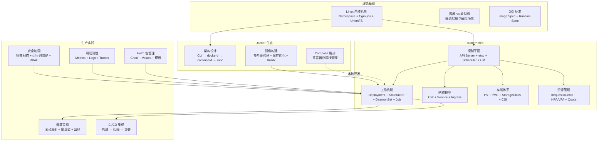

本章系统地介绍了容器与编排技术的理论基础和工程实践。

### 容器技术的本质

容器并非一种全新的虚拟化技术，而是基于 Linux 内核已有特性构建的轻量级隔离方案。Namespace 提供了资源隔离能力（PID、Network、Mount、UTS、IPC、User、Cgroup、Time），Cgroups 提供了资源限制能力（CPU、内存、IO），Union 文件系统（OverlayFS）实现了镜像的分层存储与写时复制。这三大技术共同构成了容器的基础设施。

理解这些底层原理对于正确使用和排错容器化应用至关重要。当遇到容器网络不通的问题时，你需要理解 Network Namespace 的工作原理；当容器被 OOM Kill 时，你需要查看 Cgroups 的内存限制配置；当容器文件系统出现问题时，你需要理解 OverlayFS 的分层机制。

### Docker 的架构与实践

Docker 的架构采用了分层设计：Docker CLI → Docker Daemon → containerd → runc。OCI 标准确保了容器运行时的互操作性。在镜像构建方面，多阶段构建是最重要的技巧，可以将编译时依赖与运行时依赖分离，显著减小镜像体积。

### Kubernetes 的设计理念

Kubernetes 的设计遵循了声明式 API 和控制循环（Reconciliation Loop）的核心理念。控制平面（API Server、etcd、Scheduler、Controller Manager）负责集群的全局决策，数据平面（kubelet、kube-proxy）负责节点级别的容器管理。Pod 作为最小的可部署单元，其生命周期管理（Init Container、探针、优雅终止）是理解 Kubernetes 工作负载管理的基础。

### 网络与存储

Kubernetes 的网络模型要求每个 Pod 拥有独立的 IP 地址，Pod 之间可以直接通信。CNI 插件（Calico、Flannel、Cilium）负责实现这一网络模型。Service 为 Pod 提供了稳定的网络访问入口，Ingress 则提供了七层路由和 TLS 终止能力。存储方面，PV/PVC/StorageClass 的三层抽象将存储的供给与消费解耦。

### 安全与运维

容器安全需要从镜像、运行时、网络、访问控制到审计监控的全栈防护。Helm 作为 Kubernetes 的包管理器，通过模板化和参数化管理，使得应用部署更加标准化和可复用。系统性的故障排查方法论（Pod 状态 → 日志 → 网络 → 资源 → 存储）是容器运维的核心能力。

---

## 26. 关键技能清单

完成本章学习后，你应当具备以下核心技能：

- **容器构建能力**：能够为各种语言的应用编写高效的 Dockerfile，掌握多阶段构建、缓存优化、镜像安全加固等最佳实践
- **Kubernetes 应用管理**：能够编写完整的 Kubernetes 清单文件（Deployment、Service、ConfigMap、Secret、Ingress、HPA 等），将应用部署到 Kubernetes 集群并进行管理
- **资源管理能力**：正确配置资源请求和限制，设置自动伸缩策略，使用 ResourceQuota 和 LimitRange 管理命名空间级别的资源分配
- **部署策略实施**：理解并能够实施滚动更新、金丝雀发布、蓝绿部署等部署策略，实现应用的平滑升级和快速回滚
- **CI/CD 集成能力**：将容器构建和 Kubernetes 部署集成到 CI/CD 流水线中，实现自动化的构建-测试-部署流程
- **安全意识**：了解容器安全的常见风险和最佳实践，能够配置安全上下文、网络策略、RBAC 和镜像扫描
- **故障排查能力**：掌握系统性的容器化应用排查方法论，能够快速定位和解决 Pod 状态异常、网络不通、资源不足等问题
- **Helm 使用能力**：能够使用 Helm 管理 Kubernetes 应用的部署、升级和回滚，理解 Chart 的结构和模板语法

---

## 27. 常见误区提醒

在学习和使用容器技术时，请牢记以下几点：

容器不是虚拟机，它们共享宿主机内核，隔离性较弱但更加轻量高效。不要将所有应用都容器化，应根据应用特点和团队能力做出合理选择。Kubernetes 的复杂性不应成为拒绝它的理由，托管服务已经大幅降低了入门门槛。安全不应被忽视，从镜像构建到运行时防护都需要系统性的安全策略。镜像并非越大越好，最小化镜像既能提高部署效率也能减少攻击面。

---

## 28. 延伸学习方向

容器与编排技术仍在快速发展，以下方向值得深入探索。每个方向都标注了推荐的学习资源和实践路径。

### 28.1 服务网格（Service Mesh）

当微服务数量超过 20 个时，服务间的流量管理、安全加密和可观测性会变得极其复杂。服务网格通过在每个 Pod 旁部署 sidecar 代理（如 Envoy），将这些横切关注点从业务代码中解耦。

- **Istio**：功能最全面的 Service Mesh，支持流量管理（灰度发布、故障注入）、安全（mTLS、JWT 验证）、可观测性（分布式追踪、指标聚合）。学习路径：先掌握 VirtualService/DestinationRule 流量规则，再学习 mTLS 配置，最后实践故障注入和混沌工程
- **Linkerd**：轻量级 Service Mesh，基于 Rust 编写的 linkerd2-proxy，资源占用仅为 Istio 的 1/10。适合对性能敏感的场景
- **Cilium Service Mesh**：基于 eBPF 实现的无 sidecar 服务网格，代表了 Service Mesh 的未来方向

### 28.2 GitOps 与声明式运维

GitOps 将 Git 仓库作为基础设施和应用配置的唯一真实来源（Single Source of Truth），通过自动化同步确保集群状态与 Git 一致。

- **ArgoCD**：Kubernetes 原生的 GitOps 持续交付工具，支持多集群管理、RBAC、SSO。学习路径：先理解 Application/ApplicationSet CRD，再实践多环境（dev/staging/prod）配置管理，最后集成 Image Updater 实现自动镜像更新
- **Flux**：CNCF 毕业项目，更轻量的 GitOps 工具，适合与 Helm/Kustomize 深度集成
- **实践建议**：从"手动 kubectl apply"到"ArgoCD 自动同步"的迁移通常需要 1-2 周。建议先在非生产环境验证，逐步切换

### 28.3 容器安全深度实践

容器安全不是一次性配置，而是需要持续投入的系统工程。

- **运行时安全**：Falco 通过监控系统调用检测异常行为（如容器内执行 shell、读取 /etc/shadow）。学习路径：先部署 Falco + 默认规则，再编写自定义规则，最后集成 Slack/钉钉告警
- **策略引擎**：OPA/Gatekeeper 或 Kyverno 通过准入控制策略（Admission Policy）阻止不安全的资源创建。例如：禁止使用 latest 标签、强制设置资源限制、只允许拉取内部仓库镜像
- **供应链安全**：Sigstore/cosign 实现镜像签名和验证，SLSA（Supply-chain Levels for Software Artifacts）框架确保构建过程的可追溯性

### 28.4 Serverless 容器

Serverless 容器进一步抽象了基础设施管理，让开发者只需关注代码。

- **Knative**：基于 Kubernetes 的 Serverless 平台，支持自动扩缩容到零（Scale-to-Zero）。适合事件驱动型应用和按需计算场景
- **AWS Fargate / 阿里云 ECI**：无需管理节点的容器运行环境，按实际使用的 CPU/内存和时长计费。适合突发性工作负载和不想维护集群的团队
- **OpenFunction**：CNCF Sandbox 项目，提供函数即服务（FaaS）能力，支持同步和异步函数

### 28.5 边缘计算与轻量级 K8s

将 Kubernetes 能力延伸到边缘设备和资源受限环境。

- **K3s**：Rancher 开源的轻量级 Kubernetes 发行版，二进制文件仅 100MB，SQLite 替代 etcd，适合 ARM 设备和 IoT 场景
- **KubeEdge**：华为开源的边缘计算框架，将云端 K8s 的管理能力延伸到边缘节点，支持离线自治和边缘智能
- **MicroK8s**：Canonical 维护的轻量 K8s，单节点即可运行，适合开发测试和边缘部署

### 28.6 可观测性进阶

从基础监控到 AIOps 的演进路径。

- **OpenTelemetry**：CNCF 统一的可观测性标准，提供 Metrics/Logs/Traces 三大信号的统一 API 和 SDK。学习路径：先接入 Tracing（对微服务排障最有价值），再接入 Metrics，最后接入 Logs
- **eBPF 可观测性**：Pixie、Cilium Hubble 等工具利用 eBPF 在内核态采集数据，无需修改应用代码即可获得深度可观测性
- **Grafana Stack**：Prometheus（指标）+ Loki（日志）+ Tempo（追踪）+ Grafana（可视化）构成完整的可观测性平台

### 28.7 推荐学习资源

| 资源类型 | 推荐 | 说明 |
|----------|------|------|
| **官方文档** | Kubernetes.io/docs | 最权威的 K8s 文档，包含大量交互式教程 |
| **认证考试** | CKA / CKAD / CKS | CNCF 官方认证，CKA 侧重运维，CKAD 侧重开发，CKS 侧重安全 |
| **实战平台** | Killercoda / Katacoda | 浏览器内直接操作 K8s 集群，零配置练习 |
| **书籍** | 《Kubernetes in Action》 | 目前最全面的 K8s 技术书籍 |
| **视频课程** | KillerCoda / KodeKloud | 从入门到 CKA 认证的系统课程 |
| **开源项目** | kubernetes/sample-apps | K8s 官方示例应用，学习最佳实践 |
| **社区** | CNCF Slack / K8s Slack | 全球最大的容器技术社区 |

> **学习路线建议**：初级（1-3 月）掌握 Docker + K8s 基础操作 → 中级（3-6 月）深入 K8s 网络/存储/安全 + Helm + CI/CD → 高级（6-12 月）Service Mesh + GitOps + 可观测性 → 专家级（12+ 月）CKA/CKS 认证 + 内核级调试 + 自定义 Operator 开发。

容器技术已经成为现代软件工程的基础设施，掌握这些技术将为你的职业生涯提供强大的竞争力。持续学习和实践，将这些知识转化为真正的工程能力。
