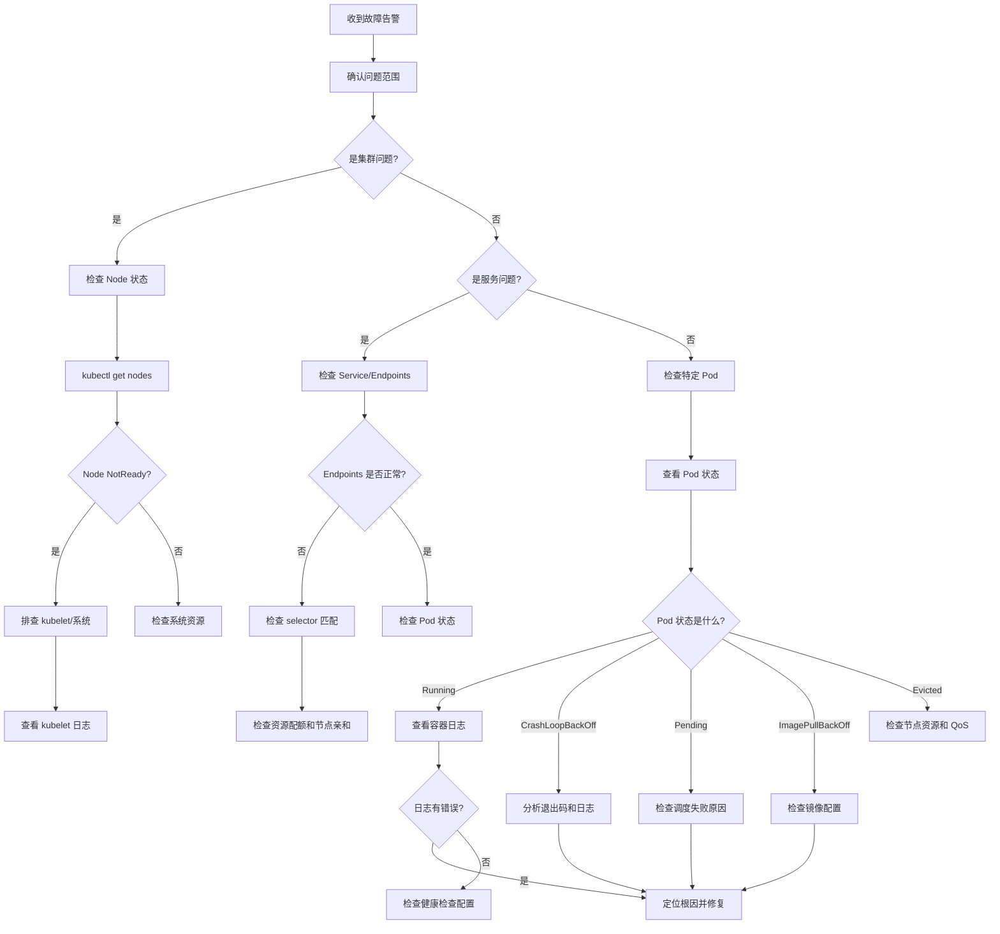
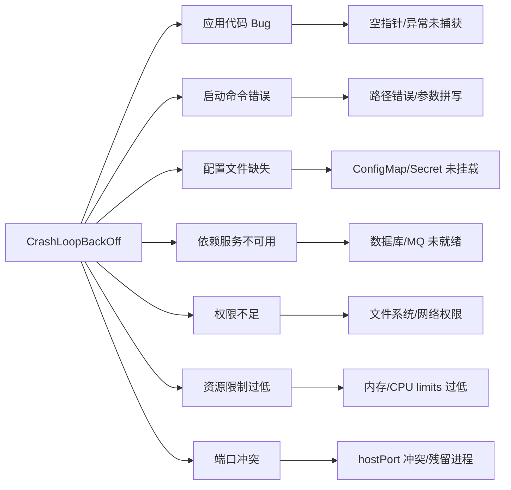
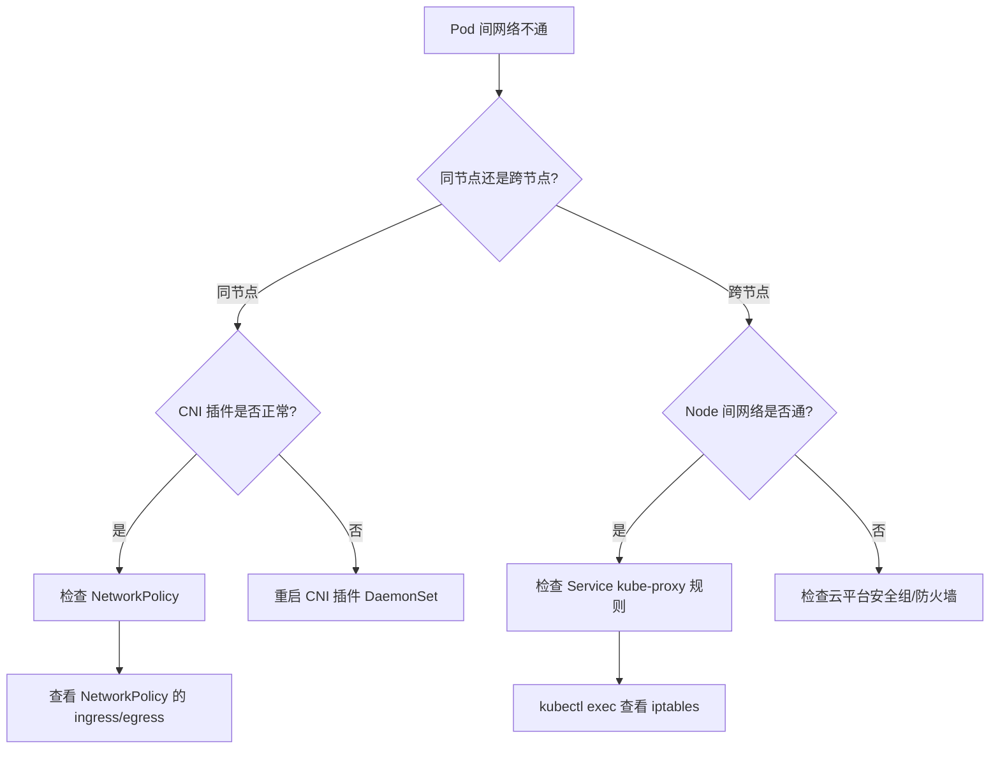
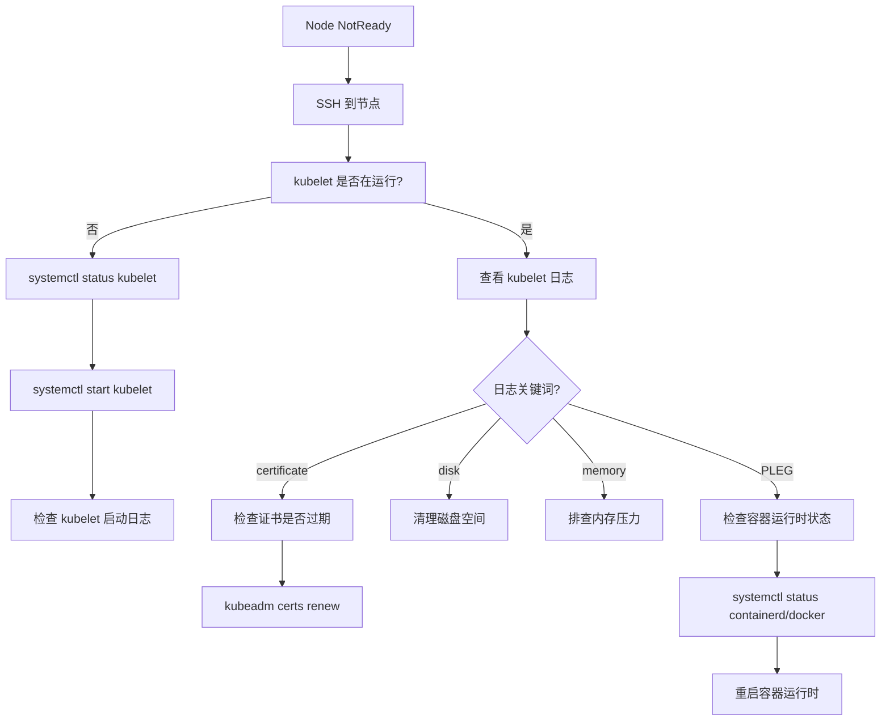
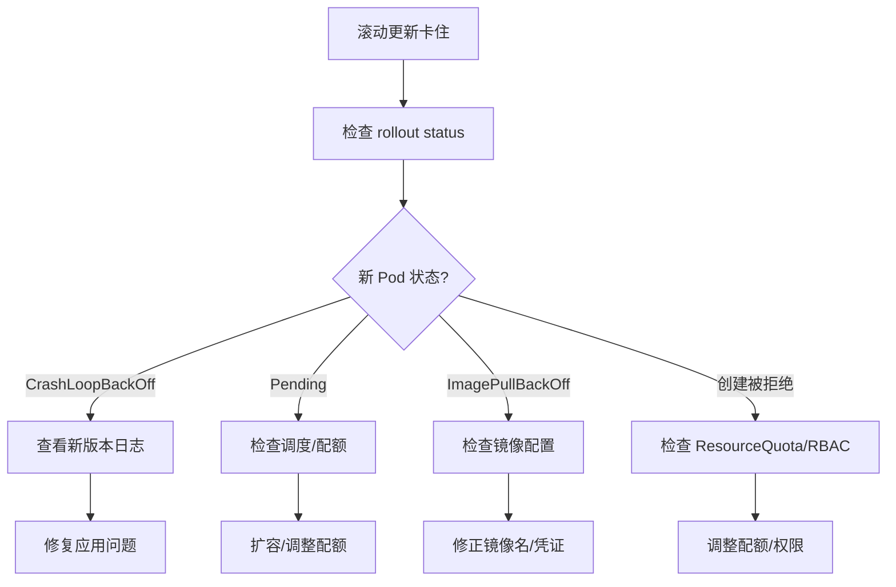

# 技巧二 Kubernetes 故障排查

在生产环境中，Kubernetes 集群的稳定性直接影响业务的可用性。当问题出现时，快速定位并解决故障是每个 Kubernetes 运维工程师必须掌握的核心技能。本章将系统地介绍 Kubernetes 故障排查的方法论、常见问题及其解决方案，并提供实用的排查工具和实战案例。

## 1. 故障排查方法论

### 1.1 系统化排查思路

Kubernetes 故障排查应遵循"自外向内、逐层深入"的原则。当收到告警时，不要立即跳进容器内部查看日志，而应按照以下顺序进行排查：

1. **确认问题范围**：是个别 Pod 还是整个服务？是新部署的还是突然出现的？影响范围有多大？
2. **检查集群事件**：Events 是 Kubernetes 最重要的故障信息来源，包含了系统级和应用级的所有重要事件
3. **逐层排查**：Node → Pod → Container → Application，每一层都有对应的排查手段
4. **收集信息**：使用 kubectl 获取详细状态和日志，不要遗漏任何有价值的线索
5. **分析根因**：结合事件、日志和配置找出根本原因，而不是停留在表面现象
6. **验证修复**：实施修复后确认问题是否解决，并观察一段时间确保稳定

在实际排查过程中，时间就是金钱。建议建立标准化的排查流程文档，团队成员按照统一的步骤进行排查，这样可以大幅缩短故障恢复时间。同时，养成记录排查过程的习惯，将每次故障的处理过程和解决方案整理成文档，形成团队的知识库，避免同样的问题反复发生。

### 1.2 核心命令对比

在故障排查中，三个核心 kubectl 命令各有其用途和适用场景：

| 命令 | 输出格式 | 适用场景 | 优势 | 局限 |
|------|---------|---------|------|------|
| `kubectl get -o yaml/json` | 结构化数据 | 自动化脚本、工具链集成 | 精确提取字段，可管道处理 | 信息密度高，人工阅读困难 |
| `kubectl describe` | 可读文本 | 人工排查、现场诊断 | 信息全面，Events 直观 | 不便自动化处理 |
| `kubectl logs` | 日志流 | 应用层问题排查 | 直接定位应用错误 | 需要容器运行中才能查看 |

```bash
# 获取 Pod 的完整状态（适合自动化分析）
kubectl get pod my-pod -o yaml

# 查看 Pod 的详细信息（适合人工排查）
kubectl describe pod my-pod

# 查看容器日志（适合应用层排查）
kubectl logs my-pod -c my-container

# 组合使用：获取事件和状态信息
kubectl get pod my-pod -o jsonpath='{.status.conditions[*].message}'
kubectl get pod my-pod -o jsonpath='{.status.containerStatuses[*].state}'
```

### 1.3 事件驱动的调试方法

Kubernetes Events 记录了集群中发生的所有重要事件，是故障排查的第一手资料。事件通常包含以下关键信息：事件类型（Normal 或 Warning）、事件原因（Reason）、发生对象（Object）以及详细消息（Message）。

```bash
# 查看最近的事件（按时间排序）
kubectl get events --sort-by=.lastTimestamp -n production

# 输出示例：
# LAST SEEN   TYPE      REASON      OBJECT              MESSAGE
# 15m         Warning   BackOff     pod/api-server-xxx  Back-off restarting failed container
# 12m         Warning   Unhealthy   pod/api-server-xxx  Readiness probe failed: HTTP probe failed
# 10m         Normal    Pulled      pod/api-server-xxx  Container image "nginx:1.21" already present on machine
# 8m          Normal    Created     pod/api-server-xxx  Created container api-server
# 8m          Normal    Started     pod/api-server-xxx  Started container api-server

# 查看特定资源的事件
kubectl describe deployment api-server -n production | grep -A 20 Events

# 查看特定命名空间的 Warning 事件
kubectl get events -n production --field-selector type=Warning

# 查看最近 10 分钟的事件
kubectl get events --since=10m --sort-by=.lastTimestamp

# 按资源类型过滤事件
kubectl get events --field-selector involvedObject.kind=Pod --sort-by=.lastTimestamp
```

事件排查的要点：
- 关注 Warning 类型的事件，它们通常表示异常情况
- 注意事件的时间戳，确认事件发生的时间顺序
- 事件中的 Reason 字段是快速定位问题的关键信息
- 如果事件太多，可以使用 field-selector 进行过滤

### 1.4 分层排查策略

故障排查应按照以下层次逐层深入，每一层都有对应的检查要点和命令：

| 层次 | 关注点 | 关键命令 | 检查内容 |
|------|--------|----------|----------|
| Node 层 | 节点状态、资源压力 | `kubectl describe node`、`kubectl top nodes` | 节点是否 Ready、是否有资源压力、kubelet 是否正常运行 |
| Pod 层 | 调度状态、重启次数 | `kubectl get pods -o wide`、`kubectl describe pod` | Pod 状态、重启次数、调度失败原因、事件信息 |
| Container 层 | 启动失败、OOM、健康检查 | `kubectl logs`、`kubectl logs --previous` | 容器退出码、日志输出、健康检查结果 |
| Application 层 | 应用逻辑、依赖服务 | 进入容器调试、应用日志分析 | 代码错误、配置问题、依赖服务不可用 |

### 1.5 故障排查决策流程



## 2. Pod 状态故障排查

### 2.1 CrashLoopBackOff

CrashLoopBackOff 是 Kubernetes 中最常见的故障状态之一，表示容器反复崩溃重启。这个状态的出现意味着容器在启动后不久就退出了，Kubernetes 会尝试重新启动它，但会采用指数退避策略来避免频繁重启对系统造成压力。

**退避算法详解**：Kubernetes 采用指数退避策略，重启间隔从 10 秒开始，每次翻倍（10s → 20s → 40s → 80s → 160s → 320s），最大不超过 5 分钟。计算公式为 `min(10 * 2^(restartCount-1), 300)` 秒。这意味着如果容器持续崩溃，重启间隔会越来越长，直到达到 5 分钟的上限。这种设计是为了防止系统资源被无限重启的容器耗尽。

**常见原因分析**：



**排查步骤**：

```bash
# 1. 查看 Pod 状态和重启次数
kubectl get pod crash-loop-pod -o wide
# NAME              READY   STATUS             RESTARTS   AGE
# crash-loop-pod    0/1     CrashLoopBackOff   5          10m

# 2. 查看 Pod 详细信息（关注 Events）
kubectl describe pod crash-loop-pod | tail -30

# 3. 查看当前容器日志
kubectl logs crash-loop-pod
# Error: Configuration file /etc/app/config.yaml not found

# 4. 查看上一次崩溃的日志（关键！当前日志可能为空）
kubectl logs crash-loop-pod --previous
# Error: Configuration file /etc/app/config.yaml not found

# 5. 检查容器退出码
kubectl get pod crash-loop-pod -o jsonpath='{.status.containerStatuses[0].lastState.terminated.exitCode}'

# 6. 查看完整的容器状态信息
kubectl get pod crash-loop-pod -o jsonpath='{.status.containerStatuses[0].state}' | jq .
```

**容器退出码含义详解**：

容器退出码是诊断 CrashLoopBackOff 问题的关键线索。当容器退出时，操作系统会返回一个退出码，表示退出的原因：

| 退出码 | 含义 | 常见场景 | 排查方向 |
|--------|------|----------|----------|
| 0 | 正常退出 | 应用执行完毕后正常退出 | 检查应用是否应该是长期运行的服务 |
| 1 | 应用错误 | 代码异常、未捕获的错误 | 查看应用日志，定位代码问题 |
| 126 | 命令不可执行 | 权限不足或文件不是可执行格式 | 检查文件权限和格式 |
| 127 | 命令未找到 | 启动命令路径错误 | 检查 command 和 args 配置 |
| 137 | 被 SIGKILL 终止 | OOMKilled 或手动 kill | 检查内存限制和资源使用 |
| 139 | 段错误 | 内存访问越界、空指针 | 分析核心转储文件，检查代码逻辑 |
| 143 | 被 SIGTERM 终止 | 正常的优雅关闭 | 检查 preStop hook 和 terminationGracePeriodSeconds |

退出码的计算规则：退出码 = 128 + 信号编号。例如 SIGKILL 是信号 9，所以退出码是 128 + 9 = 137。理解这个规则有助于快速判断容器崩溃的原因。

**实战案例**：

```bash
# 场景：API 服务启动后立即崩溃
kubectl logs api-service-7d8b9c6f5-x2k4m
# Error: listen EADDRINUSE: address already in use :::8080
#     at Server.setupListenHandle [as _listen2] (net.js:1318:16)

# 分析：端口被占用，可能是上一个实例未完全退出
# 排查步骤：
# 1. 检查是否有多个 Pod 共享同一个 IP
kubectl get pods -o wide | grep api-service
# 2. 检查是否有 hostPort 配置冲突
kubectl get pod api-service-7d8b9c6f5-x2k4m -o jsonpath='{.spec.containers[*].ports}'
# 3. 检查是否有其他进程占用端口

# 解决方案：修改启动端口或确保前一个实例完全退出
# 或者添加 preStop hook 确保优雅关闭
```

### 2.2 Pending 状态

Pending 表示 Pod 已被 Kubernetes API Server 接受，但尚未调度到任何 Node 上运行。这个状态可能由多种原因引起，需要仔细分析。

**排查步骤**：

```bash
# 1. 查看 Pending 的 Pod
kubectl get pods --field-selector=status.phase=Pending
# NAME                       READY   STATUS    RESTARTS   AGE
# pending-pod                0/1     Pending   0          5m

# 2. 查看详细信息（Events 是关键）
kubectl describe pod pending-pod | grep -A 20 Events
# Events:
#   Type     Reason            Age   From               Message
#   ----     ------            ----   ----               -------
#   Warning  FailedScheduling  5m    default-scheduler  0/3 nodes are available: 1 Insufficient cpu, 2 node(s) had taint {node-role.kubernetes.io/master: }, that the pod didn't tolerate.

# 3. 检查资源请求是否过大
kubectl get pod pending-pod -o jsonpath='{.spec.containers[*].resources}'
# {"requests":{"cpu":"4","memory":"8Gi"},"limits":{"cpu":"4","memory":"8Gi"}}

# 4. 检查节点资源
kubectl top nodes
# NAME      CPU(cores)   CPU%   MEMORY(bytes)   MEMORY%
# master    500m         25%    2Gi             50%
# worker-1  1500m        75%    6Gi             75%

# 5. 检查节点标签
kubectl get nodes --show-labels
```

**常见原因及解决方案**：

- **资源不足**：减少 requests 或扩容节点。检查当前节点的资源使用情况，确认是否有足够的资源满足 Pod 的请求。
- **NodeSelector 不匹配**：修改 nodeSelector 标签或修改 Pod 配置。确保 Pod 的 nodeSelector 标签与节点标签一致。
- **Taint 不容忍**：添加 tolerations。如果节点设置了 taint，Pod 必须有对应的 toleration 才能调度到该节点。
- **PVC Pending**：检查 StorageClass 和存储后端。PersistentVolumeClaim 未绑定会导致 Pod 无法调度。
- **亲和性规则冲突**：检查 nodeAffinity 和 podAffinity 配置，确保不会产生冲突。

**NodeSelector 不匹配案例详解**：

```yaml
# 错误配置：节点没有 app=frontend 标签
apiVersion: apps/v1
kind: Deployment
metadata:
  name: frontend
spec:
  replicas: 3
  selector:
    matchLabels:
      app: frontend
  template:
    metadata:
      labels:
        app: frontend
    spec:
      nodeSelector:
        app: frontend  # 不存在的标签
      containers:
      - name: nginx
        image: nginx:1.21
```

```bash
# 排查过程：
# 1. 检查节点标签
kubectl get nodes --show-labels | grep app
# 无输出，说明没有 app=frontend 的标签

# 2. 查看调度失败原因
kubectl describe pod frontend-xxx | grep -A 5 Events
# Warning  FailedScheduling  default-scheduler  0/3 nodes are available: 3 node(s) had match node selector.

# 解决方案：
# 方案1：给节点打标签（推荐）
kubectl label nodes worker-1 app=frontend
kubectl label nodes worker-2 app=frontend

# 方案2：修改 Pod 的 nodeSelector
kubectl patch deployment frontend -p '{"spec":{"template":{"spec":{"nodeSelector":{"app":"worker"}}}}}'
```

### 2.3 ImagePullBackOff / ErrImagePull

ImagePullBackOff 表示 Kubernetes 无法拉取容器镜像，正在反复尝试。ErrImagePull 表示最近一次拉取失败。这两个状态通常同时出现，需要仔细分析错误原因。

**常见原因详细分析**：
- **镜像名称或标签拼写错误**：这是最常见的原因，仔细检查镜像名称、标签和仓库地址
- **私有仓库认证失败**：访问私有镜像仓库需要正确的凭证，包括 username、password 和 email
- **网络问题导致无法访问镜像仓库**：DNS 解析失败、防火墙规则、代理配置等都可能导致拉取失败
- **镜像仓库配额限制**：Docker Hub 等公共仓库有拉取频率限制，私有仓库可能有存储配额
- **镜像不存在**：镜像可能已被删除或从未创建

**排查步骤**：

```bash
# 1. 查看 Pod 状态
kubectl get pod image-pull-pod
# NAME             READY   STATUS             RESTARTS   AGE
# image-pull-pod   0/1     ImagePullBackOff   0          5m

# 2. 查看详细错误信息
kubectl describe pod image-pull-pod | grep -A 10 Events
# Events:
#   Warning  Failed          5m   kubelet, worker-1  Failed to pull image "myregistry/myapp:v2": rpc error: code = Unknown desc = failed to pull and unpack image: failed to resolve reference: pulling from host myregistry.io failed with status code [manifests v2]: 401 Unauthorized

# 3. 手动测试镜像拉取
docker pull myregistry.io/myapp:v2
# Error: unauthorized: authentication required

# 4. 检查 imagePullSecrets
kubectl get pod image-pull-pod -o jsonpath='{.spec.imagePullSecrets}'

# 5. 检查 Secret 是否存在
kubectl get secret registry-secret -n default
```

**配置 imagePullSecrets**：

```yaml
# 创建 Secret
apiVersion: v1
kind: Secret
metadata:
  name: registry-secret
  namespace: default
type: kubernetes.io/dockerconfigjson
data:
  .dockerconfigjson: <base64 encoded docker config>

# 创建 Secret 的命令行方式
kubectl create secret docker-registry registry-secret \
  --docker-server=myregistry.io \
  --docker-username=myuser \
  --docker-password=mypassword \
  --docker-email=myuser@example.com

# 在 Pod 中引用
apiVersion: v1
kind: Pod
metadata:
  name: my-pod
spec:
  imagePullSecrets:
  - name: registry-secret
  containers:
  - name: app
    image: myregistry.io/myapp:v2
```

### 2.4 OOMKilled

OOMKilled（Out Of Memory Killed）表示容器内存使用超过了设置的 limits，Linux 内核的 OOM Killer 机制会终止进程。这是生产环境中非常常见的问题，需要认真对待。

**排查步骤**：

```bash
# 1. 查看 Pod 是否 OOMKilled
kubectl describe pod oom-pod | grep -A 5 "Last State"
# Last State:     Terminated
#       Reason:       OOMKilled
#       Exit Code:    137
#       Started:      Mon, 15 Jan 2024 10:25:00 +0800
#       Finished:     Mon, 15 Jan 2024 10:30:00 +0800

# 2. 通过 JSON 查看
kubectl get pod oom-pod -o jsonpath='{.status.containerStatuses[0].lastState.terminated}'
# {"exitCode":137,"finishedAt":"2024-01-15T10:30:00Z","reason":"OOMKilled","startedAt":"2024-01-15T10:25:00Z"}

# 3. 查看资源限制
kubectl get pod oom-pod -o jsonpath='{.spec.containers[*].resources.limits.memory}'
# 256Mi

# 4. 在容器运行时监控内存（需要节点权限）
kubectl top pod oom-pod --containers
# NAME        CPU(cores)   MEMORY(bytes)
# my-app      100m         240Mi

# 5. 检查 Pod 的资源使用历史（如果启用了 metrics-server）
kubectl top pod oom-pod --containers
```

**OOMKilled 的根本原因分析**：

1. **内存泄漏**：应用程序存在内存泄漏，随着时间推移内存使用持续增长
2. **Limits 设置过低**：应用程序正常运行所需的内存超过了设置的 limits
3. **突发流量**：流量突增导致应用需要更多内存处理请求
4. **缓存未清理**：应用缓存了大量数据但未及时清理
5. **JVM 配置不当**：Java 应用的堆内存设置过大

**JVM 特别注意事项**：

对于 Java 应用，JVM 堆内存（-Xmx）只是 JVM 使用的一部分内存。JVM 还会使用以下内存区域：
- **Metaspace**：存储类元数据，默认无上限
- **线程栈**：每个线程默认 1MB，Java 应用通常有大量线程
- **NIO DirectBuffers**：直接内存缓冲区，用于网络和文件 I/O
- **JIT 编译器**：编译后的机器码占用内存
- **GC 开销**：垃圾回收过程中的临时内存使用

```yaml
# 推荐配置：JVM 容器内存至少为 -Xmx 的 1.5 倍
resources:
  limits:
    memory: "1Gi"
  requests:
    memory: "512Mi"
env:
- name: JAVA_OPTS
  value: "-Xmx512m -XX:MaxMetaspaceSize=256m -XX:ReservedCodeCacheSize=128m"
```

**最佳实践**：
- 设置合理的内存 limits，留出足够的缓冲空间
- 使用 Guaranteed QoS（requests == limits）避免被驱逐
- 监控内存使用趋势，提前预警
- 配置合理的 GC 策略，减少内存占用

### 2.5 Init Container 失败

Init 容器在主容器启动前执行，用于初始化环境、等待依赖服务就绪或执行预配置任务。如果 Init 容器失败，主容器永远不会启动。

**Init 容器失败的常见原因**：
- 依赖服务未就绪（数据库、消息队列等）
- 配置文件或密钥未正确挂载
- 网络策略阻止了 Init 容器访问外部服务
- Init 容器本身存在 Bug

**排查步骤**：

```bash
# 1. 查看 Init 容器状态
kubectl get pod init-pod -o jsonpath='{.status.initContainerStatuses[*].state}'
# {"waiting":{"reason":"CrashLoopBackOff","message":"back-off 5m0s restarting failed container=init-db pod=init-pod"}}

# 2. 查看 Init 容器日志
kubectl logs init-pod -c init-db
# ERROR: Connection to database refused (host: db-service, port: 5432)
# Waiting for database to be ready...

# 3. 检查 Init 容器是否因依赖服务未就绪而失败
kubectl get svc db-service
# NAME         TYPE        CLUSTER-IP      EXTERNAL-IP   PORT(S)          AGE
# db-service   ClusterIP   10.96.100.300   <none>        5432/TCP         5d

# 4. 检查数据库 Pod 是否正常运行
kubectl get pods -l app=database
# NAME                      READY   STATUS    AGE
# database-7d8b9c6f5-xyz   0/1     Pending   30m
```

**常见模式**：等待依赖服务就绪

```yaml
initContainers:
- name: wait-for-db
  image: busybox:1.36
  command: ['sh', '-c', 'until nc -z db-service 5432; do echo waiting for db; sleep 2; done']
  resources:
    limits:
      memory: "64Mi"
      cpu: "100m"
```

**更好的模式**：使用 wget 而不是 nc（某些精简镜像没有 nc）

```yaml
initContainers:
- name: wait-for-db
  image: busybox:1.36
  command: ['sh', '-c', 'until wget -q -O /dev/null http://db-service:5432/health; do echo waiting for db; sleep 2; done']
```

## 3. Service 网络故障排查

### 3.1 Service 没有 Endpoints

当 Service 无法将流量路由到 Pod 时，首先要检查 Endpoints 是否存在。Endpoints 为空通常意味着 Service 的 selector 与 Pod 的 labels 不匹配，或者 Pod 的 readiness probe 失败。

```bash
# 1. 检查 Service 的 Endpoints
kubectl get endpoints my-service
# NAME         ENDPOINTS   AGE
# my-service   <none>      30m

# 2. 检查 selector 是否匹配
kubectl get svc my-service -o jsonpath='{.spec.selector}'
# {"app":"myapp","version":"v2"}

kubectl get pods --selector=app=myapp,version=v2
# NAME                      READY   STATUS    AGE
# myapp-v2-7d8b9c6f5-x2k4m  1/1     Running   30m

# 3. 检查 Pod 的 readiness probe
kubectl describe pod myapp-v2-7d8b9c6f5-x2k4m | grep -A 5 "Readiness"
# Readiness:  http-get http://:8080/healthz delay=5s timeout=3s period=10s #success=1 #failure=3

# 4. 测试 readiness probe 是否成功
kubectl exec -it myapp-v2-7d8b9c6f5-x2k4m -- curl -s http://localhost:8080/healthz
# {"status":"ok"}
```

### 3.2 DNS 解析故障

DNS 是 Kubernetes 网络的基础，DNS 解析失败会导致服务发现失败。CoreDNS 是 Kubernetes 默认的 DNS 服务器。

```bash
# 1. 启动 dnsutils 测试 Pod
kubectl run dns-test --image=infoblox/dnstools --rm -it --restart=Never -- /bin/sh

# 2. 在 Pod 内测试 DNS 解析
nslookup my-service
nslookup my-service.default.svc.cluster.local
nslookup kubernetes.default.svc.cluster.local

# 3. 检查 CoreDNS 状态
kubectl get pods -n kube-system -l k8s-app=kube-dns
# NAME                       READY   STATUS    RESTARTS   AGE
# coredns-5d78c9869d-8k2jz   1/1     Running   0          30d

kubectl logs -n kube-system -l k8s-app=kube-dns --tail=50

# 4. 测试集群内 DNS
kubectl run dns-test --image=busybox:1.36 --rm -it --restart=Never -- nslookup kubernetes.default

# 5. 检查 CoreDNS 配置
kubectl get configmap coredns -n kube-system -o yaml
```

**DNS 故障的常见原因与解决方案**：

| 故障现象 | 根本原因 | 排查命令 | 解决方案 |
|---------|---------|---------|---------|
| 所有服务 DNS 解析失败 | CoreDNS Pod 异常 | `kubectl get pods -n kube-system -l k8s-app=kube-dns` | 重启 CoreDNS，检查资源配额 |
| 特定服务 DNS 解析失败 | Service 不存在或标签不匹配 | `kubectl get svc -A \| grep <name>` | 检查 Service 名称和命名空间 |
| 集群内可解析，跨命名空间失败 | 未使用 FQDN 或命名空间错误 | `nslookup svc.namespace.svc.cluster.local` | 使用完整 FQDN 格式 |
| CoreDNS 日志报 plugin Error | 上游 DNS 不可达 | `kubectl logs -n kube-system -l k8s-app=kube-dns` | 检查 /etc/resolv.conf 和网络 |

### 3.3 网络连通性测试

```bash
# 使用 nicolaka/netshoot 进行全面网络诊断
kubectl run nettest --image=nicolaka/netshoot --rm -it --restart=Never -- /bin/bash

# 在 netshoot Pod 内执行
curl -v http://my-service:8080
ping my-service
traceroute my-service
dig my-service.default.svc.cluster.local
netstat -tlnp
ss -tlnp

# 检查 iptables 规则（需要特权容器）
iptables -t nat -L -n
iptables -t filter -L -n
```

**常见网络问题排查路径**：



### 3.4 NetworkPolicy 阻止流量

NetworkPolicy 可以控制 Pod 之间的网络流量。不当的配置可能导致合法流量被阻止。

```bash
# 1. 查看所有 NetworkPolicy
kubectl get networkpolicy -A
# NAMESPACE   NAME         POD-SELECTOR   AGE
# production  deny-all     <none>         5d
# production  allow-web    app=web        3d

# 2. 检查是否有策略限制了流量
kubectl describe networkpolicy deny-all -n production
# Spec:
#   PodSelector:     <none> (Matching all pods)
#   Ingress:         <none> (Blocking all incoming traffic)
#   Egress:          <none> (Blocking all outgoing traffic)

# 3. 临时删除 NetworkPolicy 测试（生产环境慎用）
kubectl delete networkpolicy deny-all -n production
```

**NetworkPolicy 排查要点**：

- Kubernetes 中的 NetworkPolicy 是"白名单"模式——一旦有任何 NetworkPolicy 选中了一个 Pod，该 Pod 就只能接受策略中明确允许的流量
- 常见错误：创建了 Ingress 白名单但忘记添加 Egress 规则，导致 Pod 无法访问外部服务
- 不同 CNI 插件对 NetworkPolicy 的支持程度不同：Calico 支持完整的 NetworkPolicy 功能，Flannel 不支持 NetworkPolicy，Cilium 提供增强的策略能力
- 调试时可以临时添加一条全放通的策略来确认是否是 NetworkPolicy 导致的问题

## 4. Node 级别故障排查

### 4.1 Node NotReady

Node NotReady 表示 kubelet 无法与 API Server 通信，或者节点本身出现了问题。这是比较严重的故障，会影响该节点上所有 Pod 的运行。

```bash
# 1. 检查 Node 状态
kubectl get nodes
# NAME      STATUS     ROLES    AGE   VERSION
# master    Ready      master   60d   v1.28.4
# worker-1  NotReady   <none>   60d   v1.28.4

# 2. 查看 Node 详细信息
kubectl describe node worker-1 | grep -A 20 Conditions
# Conditions:
#   Type             Status  Reason                       Message
#   ----             ------  ------                       -------
#   MemoryPressure   True    KubeletHasMemory             kubelet has memory pressure
#   DiskPressure     False   KubeletHasDiskPressure       kubelet has no disk pressure
#   PIDPressure      False   KubeletHasPIDPressure        kubelet has no PID pressure
#   Ready            False   KubeletNotReady               PLEG is not healthy

# 3. SSH 到节点查看 kubelet 日志
ssh worker-1
journalctl -u kubelet -f --no-pager | tail -50
```

**Node Conditions 说明**：

| Condition | 含义 | 可能原因 | 处理方式 |
|-----------|------|---------|---------|
| Ready | 节点是否可以接受调度 | kubelet 停止、网络不通 | 检查 kubelet 服务状态和日志 |
| MemoryPressure | 节点内存不足 | 运行了过多 Pod 或内存泄漏 | 调整 Pod 资源限制、扩容节点 |
| DiskPressure | 节点磁盘空间不足 | 日志过多、临时文件堆积 | 清理磁盘、配置日志轮转 |
| PIDPressure | 节点进程数过多 | Fork 炸弹、进程泄漏 | 排查异常进程、调整 PID 限制 |
| NetworkUnavailable | 节点网络配置不正确 | CNI 插件异常、网络配置错误 | 检查 CNI 插件和网络配置 |

**Node NotReady 排查流程**：



### 4.2 节点资源压力

```bash
# 检查节点资源使用情况
kubectl top nodes
# NAME      CPU(cores)   CPU%   MEMORY(bytes)   MEMORY%
# master    500m         25%    2Gi             50%
# worker-1  1500m        75%    6Gi             75%

# 查看节点上的 Pod
kubectl get pods --all-namespaces --field-selector spec.nodeName=worker-1

# Drain 节点（排空 Pod 后维护）
# 这个命令会驱逐节点上的所有 Pod（除了 DaemonSet），并将节点标记为不可调度
kubectl drain worker-1 --ignore-daemonsets --delete-emptydir-data --force

# Cordon 节点（标记不可调度）
kubectl cordon worker-1

# Uncordon 节点（恢复调度）
kubectl uncordon worker-1
```

**节点维护的标准流程**：


```bash
# 标准维护流程
kubectl cordon worker-1
kubectl drain worker-1 --ignore-daemonsets --delete-emptydir-data --grace-period=60
# 执行维护操作...
kubectl uncordon worker-1

# 验证节点恢复
kubectl get nodes
kubectl get pods --all-namespaces --field-selector spec.nodeName=worker-1
```

### 4.3 kubelet 日志分析

kubelet 是每个节点上的代理，负责管理 Pod 的生命周期。kubelet 日志是排查节点级别问题的关键。

```bash
# 查看 kubelet 日志
journalctl -u kubelet -f --no-pager

# 查看 kubelet 启动参数
cat /var/lib/kubelet/config.yaml

# 检查 kubelet 健康状态
curl -k https://localhost:10250/healthz

# 查看 kubelet 的指标
curl -k https://localhost:10250/metrics
```

**kubelet 常见错误日志及含义**：

| 日志关键词 | 含义 | 处理方式 |
|-----------|------|---------|
| `PLEG is not healthy` | Pod 生命周期事件生成器异常 | 检查容器运行时是否正常 |
| `failed to pull image` | 镜像拉取失败 | 检查网络和 registry 认证 |
| `failed to start container` | 容器启动失败 | 检查容器运行时日志 |
| `certificate has expired` | TLS 证书过期 | 执行证书续签 |
| `failed to kubelet client certificate rotation` | 证书轮转失败 | 检查 kubelet 的 bootstrap 配置 |

## 5. 资源相关问题排查

### 5.1 ResourceQuota 限制

ResourceQuota 可以限制命名空间内资源的使用总量。当超过配额时，新的 Pod 将无法创建。

```bash
# 1. 查看命名空间的 ResourceQuota
kubectl get resourcequota -n production
# NAME       AGE    REQUEST                                         LIMIT
# quota-xx   30d    cpu: 16/20, memory: 32Gi/40Gi, pods: 50/100   cpu: 40, memory: 80Gi

# 2. 查看详细使用情况
kubectl describe resourcequota quota-xx -n production
# Name:                   quota-xx
# Resource                Used    Hard
# --------                ----    ----
# cpu                     16      20
# memory                  32Gi    40Gi
# pods                    50      100

# 3. 当 Pod 因 Quota 不足而 Pending 时
kubectl describe pod pending-pod | grep -i quota
# Warning  FailedCreate  5m   replicaset-controller  Error creating: pods "xxx" is forbidden: exceeded quota: quota-xx, requested: cpu=1, memory=512Mi, used: cpu=19, memory=39Gi, limited: cpu=20, memory=40Gi
```

### 5.2 LimitRange 默认值

LimitRange 可以为命名空间内的 Pod 和 Container 设置默认的资源限制。这有助于防止资源浪费和确保公平分配。

```yaml
# LimitRange 为 Pod 设置默认资源限制
apiVersion: v1
kind: LimitRange
metadata:
  name: default-limits
  namespace: production
spec:
  limits:
  - type: Container
    default:
      cpu: "500m"
      memory: "256Mi"
    defaultRequest:
      cpu: "100m"
      memory: "128Mi"
    max:
      cpu: "2"
      memory: "2Gi"
    min:
      cpu: "50m"
      memory: "64Mi"
```

**ResourceQuota 与 LimitRange 的关系**：

- ResourceQuota 作用于命名空间级别，限制所有资源的总和
- LimitRange 作用于单个 Pod/Container 级别，设置单个资源的上下限
- 两者配合使用：LimitRange 保证每个容器的资源在合理范围内，ResourceQuota 保证整个命名空间的资源不超标
- 当 Pod 未设置资源请求时，LimitRange 的 defaultRequest 会自动填充，这也会被 ResourceQuota 计入使用量

### 5.3 Pod 驱逐（Eviction）

当节点资源不足时，kubelet 会根据 QoS（Quality of Service）等级驱逐 Pod。驱逐顺序为：BestEffort → Burstable → Guaranteed。

```bash
# 1. 查看被驱逐的 Pod
kubectl get events --field-selector reason=Evicted
# LAST SEEN   TYPE      REASON    OBJECT              MESSAGE
# 5m          Warning   Evicted   pod/best-effort-pod  The node was low on resource: memory

# 2. 查看节点资源使用率
kubectl describe node worker-1 | grep -A 10 "Allocated resources"
# Allocated resources:
#   (Total limits may be over 100 percent, i.e., overcommitted.)
#   Resource           Requests     Limits
#   --------           --------     ------
#   cpu                6 (300%)     8 (400%)
#   memory             12Gi (75%)   16Gi (100%)
```

**QoS 等级与驱逐优先级**：

| QoS 等级 | 条件 | 驱逐优先级 | 设计目标 |
|----------|------|-----------|---------|
| BestEffort | 未设置任何 requests/limits | 最先被驱逐 | 尽力而为，可容忍中断 |
| Burstable | 设置了 requests 但 requests < limits | 中等 | 弹性伸缩，可短暂中断 |
| Guaranteed | requests == limits | 最后被驱逐 | 关键服务，尽量不中断 |

**预防驱逐的最佳实践**：
- 关键服务使用 Guaranteed QoS（requests == limits）
- 配置 PodDisruptionBudget 保护关键服务的最小可用副本数
- 监控节点资源使用率，在达到阈值前主动扩容
- 为不同优先级的服务使用 PriorityClass

### 5.4 CPU Throttling

CPU Throttling 是指容器的 CPU 使用被限制在 limits 以下，导致性能下降。这在生产环境中很常见，特别是对延迟敏感的应用。

```bash
# 查看 CPU 限制和使用率
kubectl top pod --containers

# 通过 Prometheus 查询 CPU throttling
# container_cpu_cfs_throttled_seconds_total / container_cpu_cfs_periods_total

# 优化建议：
# 1. 不要设置过低的 CPU limits
# 2. 使用 Burstable QoS（不设置 CPU limits）
# 3. 合理设置 requests，让调度器有更多信息做决策
```

**CPU Throttling 的影响与应对**：

CPU throttling 的本质是 Linux CFS（Completely Fair Scheduler）调度器在容器的 CPU 配额用完后的限流行为。当容器在一个 CFS 周期（默认 100ms）内用完了分配的 CPU 时间，进程就会被暂停直到下一个周期开始。

对延迟敏感的应用，CPU throttling 可能导致：
- 响应时间增加（p99 延迟飙升）
- 吞吐量下降
- 请求排队

建议：对于延迟敏感型服务，可以考虑不设置 CPU limits（只设 requests），让节点超分配 CPU。这样虽然可能在高负载时出现竞争，但避免了 throttling 导致的硬性延迟。

## 6. Deployment 与控制器故障排查

### 6.1 Deployment 滚动更新失败

当 Deployment 执行滚动更新时，新版本 Pod 可能无法正常启动，导致更新卡住。

```bash
# 1. 查看 Deployment 状态
kubectl rollout status deployment/my-app -n production
# error: deployment "my-app" exceeded its progress deadline

# 2. 查看 Deployment 详情
kubectl describe deployment my-app -n production
# Conditions:
#   Type           Status  Reason
#   ----           ------  ------
#   Available      True    MinimumReplicasAvailable
#   Progressing    False   ProgressDeadlineExceeded  ReplicaSet "my-app-xxx" is taking longer than expected

# 3. 查看 ReplicaSet 状态
kubectl get rs -n production | grep my-app
# NAME                  DESIRED   CURRENT   READY   AGE
# my-app-abc123         0         0         0       5d
# my-app-def456         3         3         3       10m
# my-app-ghi789         1         0         0       5m    ← 新版本无法就绪

# 4. 查看新版本 ReplicaSet 的事件
kubectl describe rs my-app-ghi789 -n production | grep -A 10 Events
# Warning  FailedCreate  5m   replicaset-controller  Error creating: pods "my-app-xxx" is forbidden: exceeded quota
```



```bash
# 常用操作
# 回滚到上一个版本
kubectl rollout undo deployment/my-app -n production

# 回滚到指定版本
kubectl rollout undo deployment/my-app -n production --to-revision=2

# 暂停和恢复滚动更新
kubectl rollout pause deployment/my-app -n production
kubectl rollout resume deployment/my-app -n production

# 查看滚动更新历史
kubectl rollout history deployment/my-app -n production
```

### 6.2 PodDisruptionBudget 配置

PodDisruptionBudget（PDB）用于限制自愿中断（如节点 drain、升级）期间可以同时不可用的 Pod 数量。

```yaml
apiVersion: policy/v1
kind: PodDisruptionBudget
metadata:
  name: my-app-pdb
  namespace: production
spec:
  minAvailable: 2    # 至少保持 2 个 Pod 可用（或使用 maxUnavailable）
  selector:
    matchLabels:
      app: my-app
```

```bash
# 查看 PDB 状态
kubectl get pdb -n production
# NAME         MIN AVAILABLE   MAX UNAVAILABLE   ALLOWED DISRUPTIONS   AGE
# my-app-pdb   2               N/A               1                     5d

# 当 PDB 阻止 drain 时
kubectl drain worker-1 --ignore-daemonsets
# error: cannot delete Pods declare same controller as PodDisruptionBudget "my-app-pdb" (min-available: 2; min-count: 1)
```

## 7. PVC 与存储故障排查

### 7.1 PVC Pending

PersistentVolumeClaim 处于 Pending 状态通常意味着存储绑定失败，这会阻止使用该 PVC 的 Pod 被调度。

```bash
# 1. 查看 PVC 状态
kubectl get pvc -n production
# NAME         STATUS    VOLUME   CAPACITY   ACCESS MODES   STORAGECLASS   AGE
# data-pvc     Pending                                      gp3            30m

# 2. 查看 PVC 详细信息
kubectl describe pvc data-pvc -n production
# Events:
#   Warning  ProvisioningFailed  5m  persistentvolume-controller  Failed to provision volume with StorageClass "gp3": couldn't create AWS EBS: UnauthorizedOperation

# 3. 检查 StorageClass 是否存在
kubectl get storageclass
# NAME                 PROVISIONER                    RECLAIMPOLICY   VOLUMEBINDINGMODE
# gp3                  ebs.csi.aws.com                 Delete          WaitForFirstConsumer

# 4. 检查是否有可用的 PV
kubectl get pv
```

**PVC Pending 的常见原因与解决方案**：

| 故障现象 | 根本原因 | 解决方案 |
|---------|---------|---------|
| StorageClass 不存在 | 名称拼写错误或未创建 | `kubectl get sc` 确认名称 |
| 存储后端 API 不通 | 云平台凭证过期或网络问题 | 检查 CSI 驱动日志和凭证 |
| 容量不匹配 | PV 容量小于 PVC 请求 | 调整 PVC requests 或创建合适的 PV |
| AccessMode 不匹配 | PVC 请求的模式没有对应的 PV | 检查 PVC 和 PV 的 accessModes |
| WaitForFirstConsumer 模式 | PVC 在 Pod 调度前不会绑定 | 确保有 Pod 引用该 PVC |

## 8. RBAC 与权限故障排查

### 8.1 权限不足（Forbidden）

当 ServiceAccount 或用户没有足够的权限执行操作时，会收到 Forbidden 错误。

```bash
# 1. 测试当前用户是否有权限
kubectl auth can-i create pods -n production
# yes

kubectl auth can-i delete deployments -n production
# no

# 2. 查看当前用户的权限
kubectl auth can-i --list -n production
# Resources   Non-Resource URLs   Resource Names   Verbs
# pods        []                  []               [get list watch]
# deployments []                  []               [get list]

# 3. 检查 ServiceAccount 的角色绑定
kubectl get rolebinding,clusterrolebinding -A | grep my-service-account
# RoleBinding/my-app-binding in namespace production   my-role   ServiceAccount/production/my-service-account

# 4. 查看角色权限
kubectl describe role my-role -n production
# Rules:
#   Resources   API Groups   Resource Names   Verbs
#   pods        []           []               [get list watch]
#   configmaps  []           []               [get]
```

**RBAC 排查清单**：

1. 确认 ServiceAccount 是否正确挂载到 Pod：`kubectl get pod <name> -o jsonpath='{.spec.serviceAccountName}'`
2. 确认 Role/ClusterRole 是否包含需要的权限
3. 确认 RoleBinding/ClusterRoleBinding 是否将角色绑定到了正确的 ServiceAccount
4. 注意 RoleBinding 是命名空间级别的，ClusterRoleBinding 是集群级别的
5. 使用 `kubectl auth can-i` 命令快速验证权限

## 9. 常用排查工具箱

### 9.1 kubectl debug（临时容器）

当容器崩溃无法进入时，可以使用临时容器（Ephemeral Container）进行调试。这是 Kubernetes 1.23+ 引入的实验性功能。

```bash
# 使用临时容器调试
kubectl debug -it crash-loop-pod --image=busybox:1.36 --target=main-container

# 复制 Pod 配置进行调试
kubectl debug crash-loop-pod -it --copy-to=debug-pod --container=debug-session --image=busybox:1.36

# 查看节点上的进程（Node 级别调试）
kubectl debug node/worker-1 -it --image=busybox:1.36

# 使用 GDB 调试崩溃的进程
kubectl debug -it pod-name --image=nicolaka/netshoot --target=main-container
```

**kubectl debug 的三种模式**：

| 模式 | 命令 | 适用场景 | 前提条件 |
|------|------|---------|---------|
| 临时容器 | `kubectl debug -it <pod> --target=<container>` | 在运行中 Pod 里附加调试容器 | K8s 1.23+，Pod 处于 Running 状态 |
| 复制 Pod | `kubectl debug <pod> --copy-to=<debug-pod>` | 创建新 Pod 进行独立调试 | 任何状态 |
| 节点调试 | `kubectl debug node/<node>` | 在节点命名空间中调试系统级问题 | 节点 SSH 不可用时使用 |

### 9.2 kubectl top（资源使用）

```bash
# 查看 Pod 资源使用
kubectl top pods
# NAME                       CPU(cores)   MEMORY(bytes)
# api-server-7d8b9c6f5-abc   100m         256Mi
# web-app-5d8b9c6f5-x2k4m    50m          128Mi

# 查看 Pod 内各容器的资源使用
kubectl top pods --containers

# 查看 Node 资源使用
kubectl top nodes

# 按命名空间查看
kubectl top pods -n production --sort-by=memory

# 监视资源使用变化（需要 watch 命令）
watch -n 5 kubectl top pods --containers
```

### 9.3 容器内调试工具

```bash
# 进入运行中的容器
kubectl exec -it running-pod -- /bin/sh

# 进入特定容器
kubectl exec -it my-pod -c my-container -- /bin/bash

# 执行单个命令
kubectl exec my-pod -- ls -la /etc/app/

# 使用 nsenter 进入节点命名空间（需要节点访问权限）
nsenter -t $(docker inspect -f '{{.State.Pid}}' <container_id>) -n -m

# 在容器内抓包
kubectl exec -it running-pod -- tcpdump -i eth0 -w /tmp/capture.pcap

# 使用 strace 跟踪系统调用（需要 privileged 容器）
kubectl debug -it pod-name --profile=sysadmin --image=busybox
```

**容器内常用调试命令**：

| 命令 | 用途 | 安装方式 |
|------|------|---------|
| `curl` | 测试 HTTP 连通性 | 大多数镜像自带 |
| `wget` | 下载文件/测试 HTTP | busybox 镜像自带 |
| `nslookup`/`dig` | DNS 解析测试 | `apt install dnsutils` |
| `netstat`/`ss` | 查看端口和连接 | `apt install net-tools` |
| `tcpdump` | 网络抓包分析 | 使用 netshoot 镜像 |
| `strace` | 系统调用跟踪 | 使用 `--profile=sysadmin` |
| `lsof` | 查看打开的文件和端口 | `apt install lsof` |

### 9.4 查看崩溃容器的历史日志

```bash
# 查看上一次容器日志（当容器崩溃重启后，当前日志可能为空）
kubectl logs crash-pod --previous
# 2024-01-15T10:25:00Z ERROR Failed to connect to database: connection refused
# 2024-01-15T10:25:01Z ERROR Application failed to start

# 查看特定容器的日志
kubectl logs my-pod -c init-container

# 查看带有时间戳的日志
kubectl logs my-pod --timestamps
# 2024-01-15T10:25:00Z INFO  Application starting...
# 2024-01-15T10:25:01Z INFO  Connected to database

# 只查看最近 100 行
kubectl logs my-pod --tail=100

# 实时跟踪日志
kubectl logs my-pod -f

# 查看标签为 app=web 的所有 Pod 的日志
kubectl logs -l app=web --all-containers
```

**日志高级技巧**：

```bash
# 使用 stern 同时查看多个 Pod 的日志（需要安装 stern）
stern -n production -l app=my-app --since 10m

# 按正则过滤日志
kubectl logs -l app=my-app --all-containers | grep -E "ERROR|WARN"

# 使用 jq 解析 JSON 格式日志
kubectl logs -l app=my-app --all-containers | jq '.level, .message'
```

### 9.5 Port Forwarding 调试

Port Forwarding 可以将本地端口转发到集群内的 Pod 或 Service，方便本地调试。

```bash
# 转发本地端口到 Pod
kubectl port-forward pod/my-pod 8080:8080
# Forwarding from 127.0.0.1:8080 -> 8080
# Forwarding from [::1]:8080 -> 8080

# 转发到 Service
kubectl port-forward svc/my-service 8080:80

# 转发到远程集群的 Pod（需要监听所有接口）
kubectl port-forward --address 0.0.0.0 pod/my-pod 8080:8080

# 在后台运行 port-forward
kubectl port-forward pod/my-pod 8080:8080 &amp;
```

### 9.6 字段选择器过滤

```bash
# 按状态过滤 Pending 的 Pod
kubectl get pods --field-selector=status.phase=Pending

# 按节点过滤
kubectl get pods --field-selector=spec.nodeName=worker-1

# 过滤特定条件的事件
kubectl get events --field-selector reason=FailedScheduling

# 组合过滤：特定命名空间中特定状态的 Pod
kubectl get pods -n production --field-selector=status.phase=Failed
```

### 9.7 推荐排查工具

除了 kubectl 内置功能，以下第三方工具可以大幅提升排查效率：

| 工具 | 用途 | 安装方式 | 适用场景 |
|------|------|---------|---------|
| [k9s](https://k9scli.io/) | 终端 UI 管理集群 | `brew install k9s` | 日常运维、实时监控 |
| [stern](https://github.com/stern/stern) | 多 Pod 日志聚合 | `brew install stern` | 集中查看分布式日志 |
| [netshoot](https://github.com/nicolaka/netshoot) | 网络诊断工具箱 | `kubectl run netshoot` | 网络连通性排查 |
| [popeye](https://github.com/derailed/popeye) | 集群配置扫描 | `brew install popeye` | 预防性检查，发现潜在问题 |
| [kubectl-explore](https://github.com/ahmetb/kubectl-explore) | 交互式字段探索 | `kubectl krew install explore` | 不确定字段名时使用 |

## 10. 故障排查速查表

| 故障现象 | 可能原因 | 诊断命令 | 解决方案 |
|---------|---------|---------|---------|
| CrashLoopBackOff | 应用崩溃、配置错误 | `kubectl logs <pod> --previous` | 修复应用代码或配置 |
| Pending | 资源不足、调度失败 | `kubectl describe pod <pod>` | 调整 requests 或扩容 |
| ImagePullBackOff | 镜像不存在、认证失败 | `kubectl describe pod <pod>` | 检查镜像名和 registry 凭证 |
| OOMKilled | 内存超限、内存泄漏 | `kubectl describe pod <pod>` | 增大 limits 或修复泄漏 |
| Node NotReady | kubelet 异常、系统故障 | `journalctl -u kubelet -f` | 重启 kubelet 或节点 |
| Service 无 Endpoints | selector 不匹配 | `kubectl get endpoints <svc>` | 修正 selector 标签 |
| DNS 解析失败 | CoreDNS 异常 | `nslookup <svc>` | 重启 CoreDNS Pod |
| Eviction | 节点资源不足 | `kubectl describe node <node>` | 扩容或降低 requests |
| Pod 创建被拒绝 | ResourceQuota 超限 | `kubectl get resourcequota` | 调整配额或清理资源 |
| 健康检查失败 | 应用未就绪、端口错误 | `kubectl describe pod <pod>` | 检查 readiness/liveness 配置 |
| ConfigMap/Secret 未挂载 | 名称错误、权限问题 | `kubectl describe pod <pod>` | 检查挂载配置和访问权限 |
| PVC Pending | StorageClass 缺失 | `kubectl get pvc` | 创建 StorageClass 或检查 PV |
| 容器启动超时 | 启动命令过慢 | `kubectl describe pod <pod>` | 优化启动逻辑或增大 timeoutSeconds |
| NetworkPolicy 阻断 | 策略配置过于严格 | `kubectl get networkpolicy` | 调整 ingress/egress 规则 |
| Pod 间网络不通 | 网络插件问题、iptables 规则 | `kubectl exec -it <pod> -- ping <target-ip>` | 检查 CNI 插件和网络配置 |
| ConfigMap 更新不生效 | ConfigMap 修改后未重启 Pod | `kubectl rollout restart deployment/<name>` | 滚动重启 Deployment |
| RBAC Forbidden | 权限不足 | `kubectl auth can-i <verb> <resource>` | 添加正确的 Role/Binding |
| 滚动更新卡住 | 新版本 Pod 无法就绪 | `kubectl rollout status deployment/<name>` | 检查新版本 Pod 日志和事件 |
| CPU Throttling | CPU limits 过低 | Prometheus: `throttled_seconds/periods_total` | 提高 CPU limits 或移除 limits |

## 11. 实战案例

### 案例一：生产服务返回 503 错误

**场景描述**：用户报告 API 网关返回 503 Service Unavailable，需要快速定位并解决问题。

**排查过程**：

```bash
# 1. 确认服务状态
kubectl get svc api-gateway -n production
# NAME           TYPE        CLUSTER-IP      EXTERNAL-IP   PORT(S)   AGE
# api-gateway    ClusterIP   10.96.100.200   <none>        80/TCP    30d

kubectl get endpoints api-gateway -n production
# NAME           ENDPOINTS                                    AGE
# api-gateway    <none>                                       30m

# 2. Endpoints 为空，说明 selector 不匹配
kubectl get svc api-gateway -n production -o jsonpath='{.spec.selector}'
# {"app":"api-gateway","version":"v3"}

kubectl get pods -n production --selector=app=api-gateway,version=v3
# NAME                          READY   STATUS    AGE
# api-gateway-v3-6b8c9d7f5-abc12   1/1     Running   10m

# 3. 发现问题：Pod 存在但 Endpoints 为空，检查 readiness probe
kubectl describe pod api-gateway-v3-6b8c9d7f5-abc12 | grep -A 10 "Readiness"
# Readiness:  http-get http://:8080/healthz delay=5s timeout=3s period=10s #success=1 #failure=3

kubectl logs api-gateway-v3-6b8c9d7f5-abc12 | grep -i "health"
# INFO  Started server on port 8080

# 4. 测试健康检查端点
kubectl exec -it api-gateway-v3-6b8c9d7f5-abc12 -- curl -s http://localhost:8080/healthz
# Connection refused

# 5. 发现问题：应用监听在 8081 端口，但 readiness probe 配置为 8080
kubectl logs api-gateway-v3-6b8c9d7f5-abc12 | grep "listen"
# INFO  Server started on 0.0.0.0:8081

# 6. 修复 Deployment：将端口改为 8081
kubectl patch deployment api-gateway -n production -p '{"spec":{"template":{"spec":{"containers":[{"name":"api-gateway","ports":[{"containerPort":8081}],"readinessProbe":{"httpGet":{"port":8081,"path":"/healthz"}}}]}}}}'

# 7. 验证修复
kubectl get endpoints api-gateway -n production
# NAME           ENDPOINTS                                    AGE
# api-gateway    10.244.1.15:8081                             2m
```

**根本原因**：应用监听端口为 8081，但 Deployment 的 readiness probe 配置为 8080，导致健康检查失败，Pod 不被加入 Endpoints。

**经验总结**：
- 503 错误不一定意味着服务宕机，可能是 Endpoints 为空
- readiness probe 配置错误是常见的配置问题
- 排查时要同时检查应用日志和 Kubernetes 事件

### 案例二：Pod 持续 CrashLoopBackOff（ConfigMap 挂载问题）

**场景描述**：新部署的应用 Pod 反复重启，一直处于 CrashLoopBackOff 状态。

**排查过程**：

```bash
# 1. 查看 Pod 状态
kubectl get pods -n production | grep web-app
# NAME                       READY   STATUS             RESTARTS   AGE
# web-app-5d8b9c6f5-x2k4m   0/1     CrashLoopBackOff   8          20m

# 2. 查看退出码
kubectl get pod web-app-5d8b9c6f5-x2k4m -o jsonpath='{.status.containerStatuses[0].lastState.terminated.exitCode}'
# 1

# 3. 查看容器日志
kubectl logs web-app-5d8b9c6f5-x2k4m
# ERROR: Failed to load configuration from /etc/config/app.yaml
# FileNotFoundError: [Errno 2] No such file or directory: '/etc/config/app.yaml'

# 4. 检查 ConfigMap 是否存在
kubectl get configmap web-app-config -n production
# Error from server (NotFound): configmaps "web-app-config" not found

# 5. 发现问题：ConfigMap 名称拼写错误
# Deployment 中引用的是 web-app-config，但实际创建的是 webapp-config
kubectl get configmap -n production | grep web
# NAME              DATA   AGE
# webapp-config     3      5d

# 6. 修复方案：重新创建正确的 ConfigMap
kubectl create configmap web-app-config --from-literal=database.host=postgres-prod -n production

# 7. 验证 Pod 恢复
kubectl get pods -n production | grep web-app
# NAME                       READY   STATUS    RESTARTS   AGE
# web-app-5d8b9c6f5-x2k4m   1/1     Running   0          30s
```

**根本原因**：ConfigMap 名称拼写错误，导致配置文件无法挂载到容器中。

**经验总结**：
- ConfigMap/Secret 名称不匹配是常见的配置错误
- 使用 --dry-run=client -o yaml 可以预览资源创建
- 建议使用 GitOps 工具管理配置，避免手动操作错误

### 案例三：新部署 Pod 卡在 Pending（ResourceQuota 限制）

**场景描述**：开发团队尝试部署新服务，但 Pod 一直处于 Pending 状态。

**排查过程**：

```bash
# 1. 查看 Pending 的 Pod
kubectl get pods -n production --field-selector=status.phase=Pending
# NAME                       READY   STATUS    RESTARTS   AGE
# new-service-7b9c6d8f5-xyz   0/1     Pending   0          15m

# 2. 查看详细原因
kubectl describe pod new-service-7b9c6d8f5-xyz -n production | grep -A 5 Events
# Events:
#   Type     Reason            Age   From               Message
#   ----     ------            ----   ----               -------
#   Warning  FailedScheduling  15m   default-scheduler  0/3 nodes are available: insufficient cpu. preemption: 0/3 nodes are available: 3 No preemption victims found for incoming pod.

# 3. 检查 ResourceQuota
kubectl get resourcequota -n production
# NAME       AGE    REQUEST                                         LIMIT
# quota-xx   30d    cpu: 19/20, memory: 39Gi/40Gi, pods: 98/100   cpu: 40, memory: 80Gi

# 4. CPU 请求已接近上限（19/20），Pod 请求 1 个 CPU 无法满足
kubectl get pod new-service-7b9c6d8f5-xyz -o jsonpath='{.spec.containers[*].resources.requests}'
# {"cpu":"1","memory":"512Mi"}

# 5. 解决方案：降低 CPU 请求
kubectl patch deployment new-service -n production -p '{"spec":{"template":{"spec":{"containers":[{"name":"new-service","resources":{"requests":{"cpu":"200m"}}}]}}}}'

# 6. 验证
kubectl get pods -n production | grep new-service
# NAME                       READY   STATUS    RESTARTS   AGE
# new-service-7b9c6d8f5-abc   1/1     Running   0          30s
```

**根本原因**：命名空间的 CPU ResourceQuota 已接近上限，新 Pod 的 CPU 请求超过了剩余配额。

**经验总结**：
- ResourceQuota 会限制新 Pod 的创建，需要提前规划资源
- 使用 `kubectl describe resourcequota` 可以查看详细的资源使用情况
- 建议设置合理的配额告警阈值，提前预警资源不足

### 案例四：集群升级后 Pod 大面积 CrashLoopBackOff

**场景描述**：Kubernetes 集群从 1.27 升级到 1.28 后，多个 Deployment 的 Pod 出现 CrashLoopBackOff，退出码均为 137。

**排查过程**：

```bash
# 1. 检查退出码
kubectl get pods -A | grep CrashLoop
# NAME                          READY   STATUS             RESTARTS   AGE
# api-server-abc123             0/1     CrashLoopBackOff   5          10m
# worker-svc-def456             0/1     CrashLoopBackOff   3          10m
# processor-ghi789              0/1     CrashLoopBackOff   4          10m

# 2. 所有 Pod 都是退出码 137，说明 OOMKilled
kubectl get pods -A -o jsonpath='{range .items[*]}{.metadata.name}{"\t"}{.status.containerStatuses[0].lastState.terminated.reason}{"\n"}{end}' | grep OOMKilled
# api-server-abc123    OOMKilled
# worker-svc-def456    OOMKilled
# processor-ghi789     OOMKilled

# 3. 检查资源限制
kubectl get pod api-server-abc123 -o jsonpath='{.spec.containers[*].resources.limits.memory}'
# 256Mi

# 4. 分析原因：升级后 kubelet 的 cgroup 版本从 v1 切换到 v2，
#    内存 accounting 行为发生变化，实际使用量比之前多了约 20%

# 5. 解决方案：增大内存 limits
kubectl patch deployment api-server -p '{"spec":{"template":{"spec":{"containers":[{"name":"api-server","resources":{"limits":{"memory":"512Mi"}}}]}}}}'
kubectl patch deployment worker-svc -p '{"spec":{"template":{"spec":{"containers":[{"name":"worker-svc","resources":{"limits":{"memory":"384Mi"}}}]}}}}'
```

**根本原因**：集群升级导致 cgroup 版本从 v1 切换到 v2，内存计量方式变化使得相同的 limits 在新版本下更容易触发 OOMKilled。

**经验总结**：
- 集群升级后要密切关注 Pod 的 OOMKilled 事件
- cgroup v1 到 v2 的迁移会影响资源限制的实际效果
- 升级前建议先在测试环境验证，提前调整资源 limits

## 总结

Kubernetes 故障排查是一项需要经验和技巧的工作。掌握以下关键点可以大大提高排查效率：

1. **优先查看 Events**：Events 是故障排查的第一手资料，往往能直接指向问题
2. **逐层排查**：从 Node → Pod → Container → Application，不要跳过任何一层
3. **善用 describe**：`kubectl describe` 提供了最全面的状态信息
4. **日志要完整**：使用 `--previous` 查看崩溃容器的历史日志
5. **理解退出码**：不同的退出码指示不同的故障原因
6. **监控先行**：建立完善的监控体系，故障发生时能快速定位范围
7. **文档化**：将排查经验整理成文档，形成团队知识库

故障排查的核心在于：快速定位问题、准确分析根因、有效实施修复。通过不断实践和积累，你将能够快速准确地定位和解决 Kubernetes 集群中的各种故障，保障业务的稳定运行。记住，预防永远比治疗更重要——建立完善的监控告警体系、规范化的部署流程和应急预案，才能真正实现高可用的 Kubernetes 集群。
