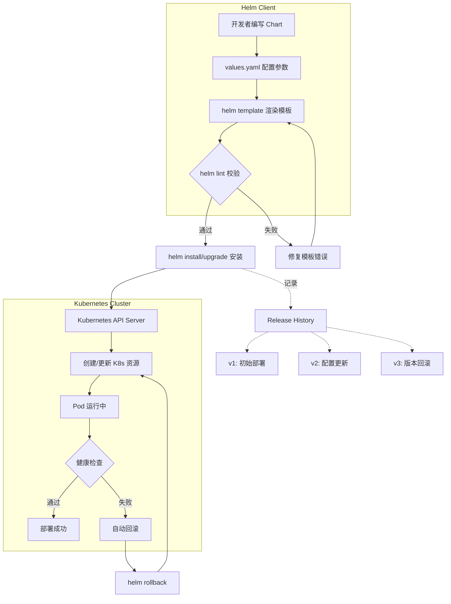
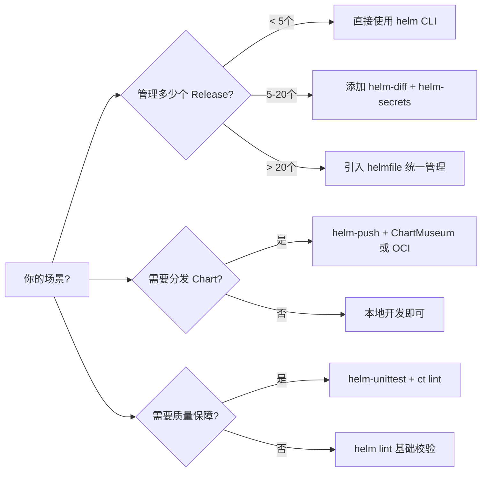
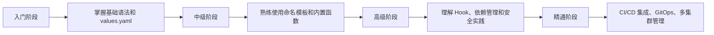

# Helm 模板技巧

## 1. Helm 概述与核心概念

Helm 是 Kubernetes 的包管理器，类似于 Linux 系统中的 apt 或 yum。它将 Kubernetes 应用所需的所有资源（Deployment、Service、ConfigMap 等）打包成一个可复用的单元——**Chart**，使得应用的安装、升级、回滚和版本管理变得标准化且简单高效。

### 核心概念

- **Chart（图表）**：一组描述 Kubernetes 资源的模板文件，相当于一个"安装包"。一个 Chart 可以包含 Deployment、Service、Ingress、ConfigMap 等多种 Kubernetes 资源的模板定义。
- **Repository（仓库）**：Chart 的分发源，可以是 HTTP 服务器、OCI 镜像仓库或本地目录。常用公共仓库如 Artifact Hub（https://artifacthub.io）。
- **Release（发行版）**：Chart 在 Kubernetes 集群中的一次具体部署实例。同一个 Chart 可以在同一个集群中部署多次，每次部署形成一个独立的 Release。
- **Values（值）**：用于覆盖 Chart 默认配置的参数。用户通过 values.yaml 或 `--set` 参数传入自定义值，模板渲染时使用这些值替换模板中的占位符。

### Helm 2 vs Helm 3

Helm 3 是当前推荐使用的版本，相比 Helm 2 有重大架构变化：

| 特性 | Helm 2 | Helm 3 |
|------|--------|--------|
| 组件 | 需要 Tiller（服务端组件） | 无需 Tiller，纯客户端架构 |
| Release 信息存储 | 存储在 Kubernetes ConfigMap 中 | 默认存储在 Kubernetes Secret 中 |
| 认证 | 依赖 Tiller 的 RBAC 配置 | 直接使用 kubeconfig 认证 |
| Chart 仓库 | 仅支持 HTTP 仓库 | 支持 OCI 镜像仓库（`oci://` 协议） |
| 插件系统 | 有限 | 增强，支持更多内置函数 |

### Chart 目录结构（Helm 3 推荐）

mychart/
├── Chart.yaml          # Chart 元数据（名称、版本、描述、依赖）
├── Chart.lock          # 依赖锁定文件（自动生成）
├── values.yaml         # 默认配置值
├── charts/             # 依赖的子 Chart 目录
│   └── mysubchart/     # 子 Chart 会被自动下载到此目录
├── templates/          # Kubernetes 资源模板
│   ├── deployment.yaml
│   ├── service.yaml
│   ├── ingress.yaml
│   ├── configmap.yaml
│   ├── _helpers.tpl    # 模板辅助函数（不直接渲染为文件）
│   ├── NOTES.txt       # 安装后显示的提示信息
│   └── tests/          # Chart 测试模板
│       └── test-connection.yaml
├── .helmignore         # 打包时忽略的文件
└── README.md           # Chart 使用说明

### Helm 发布工作流程




### Helm vs 原始 YAML vs Kustomize

| 方案 | 适用场景 | 优势 | 劣势 |
|------|---------|------|------|
| 原始 YAML | 简单、少量不变的资源 | 直观、无额外工具依赖 | 缺乏参数化，重复代码多 |
| Kustomize | 同一应用的多环境配置 | 无模板语法，原生 kubectl 支持 | 不适合跨应用共享，复杂逻辑能力有限 |
| Helm | 复杂应用打包分发、需要版本管理 | 功能强大，生态系统成熟，支持版本控制和回滚 | 学习曲线较陡，模板调试复杂 |

**最佳实践建议**：如果团队已深度使用 Kubernetes，且需要将应用打包分发给多个团队或客户，Helm 是最佳选择。对于团队内部的简单环境差异化，Kustomize 可能更轻量。

---

## 2. Chart 目录结构详解

### Chart.yaml

`Chart.yaml` 是 Chart 的元数据文件，定义了 Chart 的名称、版本、描述和依赖关系：

```yaml
apiVersion: v2                    # Helm 3 使用 v2，Helm 2 使用 v1
name: my-webapp                   # Chart 名称，必填
description: A production-ready web application Helm chart  # 描述
type: application                 # application 或 library
version: 1.2.3                    # Chart 版本号（遵循 SemVer 2）
appVersion: "2.1.0"              # 应用本身的版本
keywords:                        # 关键词列表，用于搜索
  - web
  - api
  - nginx
maintainers:                     # 维护者信息
  - name: 张三
    email: zhangsan@example.com
    url: https://github.com/zhangsan
home: https://github.com/example/my-webapp
sources:                         # 源码地址
  - https://github.com/example/my-webapp
icon: https://example.com/icon.png
deprecated: false                # 是否已废弃
dependencies:                    # 子 Chart 依赖
  - name: redis
    version: "17.x"             # 使用 x 作为通配符
    repository: "https://charts.bitnami.com/bitnami"
    condition: redis.enabled     # 条件开关
    tags:                        # 标签分组
      - cache
```

### values.yaml

`values.yaml` 提供 Chart 的默认配置值，用户可以通过自定义 values 文件或 `--set` 参数覆盖这些值：

```yaml
# 应用配置
replicaCount: 2

image:
  repository: my-webapp
  pullPolicy: IfNotPresent
  tag: ""  # 默认使用 Chart 的 appVersion

# 资源限制
resources:
  limits:
    cpu: 500m
    memory: 256Mi
  requests:
    cpu: 100m
    memory: 128Mi

# 环境变量
env: []
# - name: DATABASE_URL
#   value: "postgres://localhost:5432/mydb"

# 健康检查
livenessProbe:
  enabled: true
  path: /healthz
  port: 8080

readinessProbe:
  enabled: true
  path: /readyz
  port: 8080
```

### templates/_helpers.tpl

`_helpers.tpl` 文件以 `.` 开头，不会被渲染为 Kubernetes 资源。它定义可复用的模板辅助函数：

```yaml
{{/*
生成应用的全名（Release名称-Chart名称）
*/}}
{{- define "my-webapp.fullname" -}}
{{- if .Values.fullnameOverride }}
{{- .Values.fullnameOverride | trunc 63 | trimSuffix "-" }}
{{- else }}
{{- $name := default .Chart.Name .Values.nameOverride }}
{{- if contains $name .Release.Name }}
{{- .Release.Name | trunc 63 | trimSuffix "-" }}
{{- else }}
{{- printf "%s-%s" .Release.Name $name | trunc 63 | trimSuffix "-" }}
{{- end }}
{{- end }}
{{- end }}

{{/*
标准标签
*/}}
{{- define "my-webapp.labels" -}}
helm.sh/chart: {{ printf "%s-%s" .Chart.Name .Chart.Version | replace "+" "_" | trunc 63 }}
{{ include "my-webapp.selectorLabels" . }}
app.kubernetes.io/version: {{ .Chart.AppVersion | quote }}
app.kubernetes.io/managed-by: {{ .Release.Service }}
{{- end }}

{{/*
选择器标签
*/}}
{{- define "my-webapp.selectorLabels" -}}
app.kubernetes.io/name: {{ include "my-webapp.name" . }}
app.kubernetes.io/instance: {{ .Release.Name }}
{{- end }}
```

### .helmignore

# 打包时忽略的文件
.git
.gitignore
.DS_Store
*.swp
*.bak
*.tmp
README.md
LICENSE

---

## 3. Go Template 语法精讲

Helm 使用 Go 的 `text/template` 引擎渲染模板。所有模板语法都包裹在 `{{ }}` 双花括号中。

### 访问 Values

```yaml
# 访问 values.yaml 中的简单值
image: {{ .Values.image.repository }}:{{ .Values.image.tag }}

# 使用管道符（|）传递给函数
image: {{ .Values.image.repository | default "nginx" }}

# 访问嵌套值
{{ .Values.resources.limits.cpu }}

# 访问数组/列表中的元素
{{ index .Values.tolerations 0 }}

# 遍历列表
{{- range .Values.tolerations }}
- key: {{ .key }}
  operator: {{ .operator }}
  value: {{ .value }}
{{- end }}
```

### 内置对象

Helm 提供了一组内置对象，可以在模板中直接使用：

```yaml
# .Release - 当前 release 的信息
{{ .Release.Name }}       # release 名称
{{ .Release.Namespace }}  # 部署的 namespace
{{ .Release.Service }}    # 总是 "Helm"
{{ .Release.IsUpgrade }}  # 是否是升级操作
{{ .Release.IsInstall }}  # 是否是安装操作

# .Chart - Chart.yaml 中的元数据
{{ .Chart.Name }}         # chart 名称
{{ .Chart.Version }}      # chart 版本
{{ .Chart.AppVersion }}   # 应用版本
{{ .Chart.Description }}  # chart 描述

# .Capabilities - 集群能力信息
{{ .Capabilities.KubeVersion.Version }}  # K8s 版本
{{ .Capabilities.HelmVersion.Version }}  # Helm 版本

# .Template - 当前模板的信息
{{ .Template.Name }}      # 模板文件名
```

### 条件判断：if/else/end

```yaml
{{- if .Values.ingress.enabled }}
apiVersion: networking.k8s.io/v1
kind: Ingress
metadata:
  name: {{ include "my-webapp.fullname" . }}
spec:
  rules:
    - host: {{ .Values.ingress.host | quote }}
      http:
        paths:
          - path: {{ .Values.ingress.path | default "/" }}
            pathType: Prefix
            backend:
              service:
                name: {{ include "my-webapp.fullname" . }}
                port:
                  number: {{ .Values.service.port }}
{{- end }}

# if/else 嵌套
{{- if .Values.autoscaling.enabled }}
  replicas: {{ .Values.autoscaling.minReplicas }}
{{- else if .Values.replicaCount }}
  replicas: {{ .Values.replicaCount }}
{{- else }}
  replicas: 1
{{- end }}
```

### 循环遍历：range/end

```yaml
# 遍历列表
{{- range .Values.env }}
- name: {{ .name }}
  value: {{ .value | quote }}
{{- end }}

# 遍历字典
{{- range $key, $value := .Values.labels }}
  {{ $key }}: {{ $value | quote }}
{{- end }}

# 遍历并获取索引
{{- range $index, $element := .Values.tolerations }}
- index: {{ $index }}
  key: {{ $element.key }}
{{- end }}

# 使用 nolint 注释消除空列表时的空行
{{- range .Values.nodeSelector }}
  {{- $key := . }}
  {{- $val := index $.Values.nodeSelector $key }}
  {{ $key }}: {{ $val | quote }}
{{- end }}
```

### 作用域控制：with/end

`with` 改变 `.` 的作用域，避免重复访问深层嵌套：

```yaml
# 不使用 with
{{ .Values.resources.limits.cpu }}
{{ .Values.resources.limits.memory }}
{{ .Values.resources.requests.cpu }}
{{ .Values.resources.requests.memory }}

# 使用 with 简化
{{- with .Values.resources }}
limits:
  cpu: {{ .limits.cpu }}
  memory: {{ .limits.memory }}
requests:
  cpu: {{ .requests.cpu }}
  memory: {{ .requests.memory }}
{{- end }}
```

> **注意**：`with` 块内部的 `.` 指向了新的上下文，如果需要访问外层上下文，使用 `$` 符号（如 `$.Release.Name`）。

### 根上下文 `$` 深入理解

在 Go Template 中，`$` 始终指向模板的根上下文（即 `.` 的初始值）。这在多层嵌套和 `range` 循环中尤为重要：

```yaml
# range 循环中，. 指向当前迭代元素，$ 指向根上下文
{{- range $index, $value := .Values.env }}
- name: {{ $value.name }}
  value: {{ $value.value }}
  release: {{ $.Release.Name }}        # 通过 $ 访问根上下文
  chart: {{ $.Chart.Name }}
{{- end }}

# with 块中同理
{{- with .Values.resources }}
limits:
  cpu: {{ .limits.cpu }}               # . 现在指向 .Values.resources
  memory: {{ .limits.memory }}
  release: {{ $.Release.Name }}        # $ 访问根上下文
{{- end }}

# 多层嵌套中的 $ 传递
{{- range .Values.ingress.hosts }}
- host: {{ .host }}
  backend: {{ include "my-webapp.fullname" $ }}
  # ↑ 必须传 $，因为 include 内部需要访问 $.Chart.Name 等
{{- end }}
```

**关键规则**：
- `.` 始终指向当前代码块的上下文对象（`with` 改变它，`range` 也改变它）
- `$` 始终指向模板渲染时的根上下文，永远不会被 `with` 或 `range` 改变
- 调用 `include` 时，如果被调用的模板内部访问了 `$`，则必须传入 `$` 而非 `.`

### 命名模板：define/template/include

```yaml
# define 定义模板（通常放在 _helpers.tpl 中）
{{- define "my-webapp.labels" -}}
app.kubernetes.io/name: {{ include "my-webapp.name" . }}
app.kubernetes.io/instance: {{ .Release.Name }}
{{- end }}

# template 调用模板（渲染输出）
{{ template "my-webapp.labels" . }}

# include 调用模板并返回字符串（可配合管道符使用）
{{ include "my-webapp.labels" . | indent 4 }}

# 模板局部变量
{{- define "my-webapp.selectorLabels" -}}
{{- $name := default .Chart.Name .Values.nameOverride -}}
app.kubernetes.io/name: {{ $name }}
app.kubernetes.io/instance: {{ .Release.Name }}
{{- end }}
```

**`template` vs `include` 的区别**：
- `template` 直接将模板内容渲染到当前位置
- `include` 将模板内容作为字符串返回，可以配合管道符（`|`）使用

```yaml
# 使用 include 配合 nindent
labels:
  {{- include "my-webapp.labels" . | nindent 4 }}

# 使用 template 不太方便配合管道符
labels:
  {{- template "my-webapp.labels" . }}   # 缩进需手动处理
```

### 常用内置函数

```yaml
# 字符串处理
{{ "hello" | upper }}              # HELLO
{{ "HELLO" | lower }}              # hello
{{ "hello world" | title }}        # Hello World
{{ "  hello  " | trim }}           # hello
{{ "hello" | replace "h" "H" }}    # Hello
{{ "hello" | contains "ell" }}     # true
{{ "hello" | indent 4 }}           # 缩进 4 个空格
{{ "hello" | nindent 4 }}          # 换行后缩进 4 个空格
{{ "hello" | quote }}              # "hello"
{{ "hello" | squote }}             # 'hello'
{{ "hello" | trunc 3 }}            # hel
{{ "hello" | trunc -3 }}           # llo
{{ "hello" | repeat 3 }}           # hellohellohello

# 数字处理
{{ 42 | toString }}                # "42"
{{ "42" | toInt }}                 # 42
{{ add 1 2 }}                      # 3
{{ sub 5 3 }}                      # 2
{{ mul 2 3 }}                      # 6
{{ div 6 3 }}                      # 2
{{ mod 5 2 }}                      # 1

# 类型与集合
{{ kindOf .Values.image }}         # map（判断类型）
{{ list "a" "b" "c" }}             # [a b c]
{{ dict "key1" "val1" "key2" "val2" }}  # map[key1:val1 key2:val2]
{{ has "a" (list "a" "b" "c") }}   # true
{{ first (list "a" "b" "c") }}     # a
{{ last (list "a" "b" "c") }}      # c
{{ reverse (list "a" "b" "c") }}   # [c b a]
{{ sort (list "c" "a" "b") }}      # [a b c]
{{ uniq (list "a" "a" "b") }}      # [a b]
{{ keys .Values.image }}           # [repository pullPolicy tag]
{{ merge (dict "a" 1) (dict "b" 2) }}  # map[a:1 b:2]

# 编码与哈希
{{ "hello" | b64enc }}             # aGVsbG8=
{{ "aGVsbG8=" | b64dec }}         # hello
{{ "hello" | sha256sum }}          # 2cf24dba5fb0a30e26e83b2ac5b9e29e...
{{ "hello" | toJson }}             # "hello"
{{ dict "a" 1 | toJson }}          # {"a":1}

# 日期与时间
{{ now | date "2006-01-02" }}       # 2024-01-15
{{ now | dateModify "-24h" }}       # 24 小时前

# 正则表达式
{{ "hello-world" | regexFind "^[a-z]+" }}  # hello
{{ "hello-world" | regexReplaceAll "-" "_" }}  # hello_world

# 语义化版本比较
{{ semverCompare ">=1.19" .Capabilities.KubeVersion.Version }}  # true/false
```

### 文件操作函数

```yaml
# Files.Get 读取模板目录中的文件内容
{{ .Files.Get "config/app.conf" }}

# Files.Glob 获取匹配的文件
{{- range $path, $_ := .Files.Glob "config/**/*" }}
---
apiVersion: v1
kind: ConfigMap
metadata:
  name: {{ $path | replace "/" "-" | replace "." "-" }}
data:
  {{ $path }}: |
{{ $.Files.Get $path | indent 4 }}
{{- end }}

# Files.AsConfig 将文件列表转为 ConfigMap 的 data 格式
data:
  {{ .Files.Glob "config/*" | AsConfig }}

# Files.AsSecrets 将文件列表转为 Secret 的 data 格式
data:
  {{ .Files.Glob "config/*" | AsSecrets }}
```

### 校验函数：required 和 fail

```yaml
# required：如果值为空则报错
image:
  repository: {{ required "image.repository 必须指定!" .Values.image.repository }}

# fail：无条件终止渲染并显示错误消息
{{- if not .Values.ingress.host }}
{{- fail "当 ingress 启用时，ingress.host 必须指定" }}
{{- end }}
```

---

## 4. 模板函数实战

### default：提供回退值

`default` 函数在值为零值（空字符串、nil、false、0、空列表等）时返回默认值：

```yaml
image:
  repository: {{ .Values.image.repository | default "nginx" }}
  tag: {{ .Values.image.tag | default .Chart.AppVersion }}
  pullPolicy: {{ .Values.image.pullPolicy | default "IfNotPresent" }}

# 为数字提供默认值
replicas: {{ .Values.replicaCount | default 1 }}

# 为布尔值提供默认值
create: {{ .Values.serviceAccount.create | default true }}

# 为列表提供默认值
{{- with .Values.nodeSelector }}
nodeSelector:
  {{- toYaml . | nindent 2 }}
{{- end }}
```

### required：强制必填值

```yaml
# 要求某个值必须提供
{{- required "请指定数据库地址" .Values.database.host | quote }}

# 在 with 块中使用
{{- with required "请提供 image 配置" .Values.image }}
image:
  repository: {{ .repository }}
  tag: {{ .tag | default $.Chart.AppVersion }}
{{- end }}
```

### indent/nindent：YAML 缩进

```yaml
# indent：在字符串前添加空格
{{ .Files.Get "config/nginx.conf" | indent 4 }}

# nindent：先添加换行符，再缩进（更常用）
data:
  nginx.conf: |
{{ .Files.Get "config/nginx.conf" | nindent 4 }}

# 在 labels 中使用
labels:
  {{- include "my-app.labels" . | nindent 4 }}
```

### toYaml/fromYaml：对象转换

```yaml
# toYaml：将对象转为 YAML 字符串
containers:
  - name: app
    {{- toYaml .Values.containers | nindent 4 }}

# fromYaml：将 YAML 字符串转为对象（用于处理 values 中包含 YAML 字符串的情况）
{{- $customConfig := fromYaml .Values.customAnnotations }}
annotations:
  {{- toYaml $customConfig | nindent 4 }}
```

### tpl：模板渲染

`tpl` 函数允许将字符串值当作模板来渲染，非常强大：

```yaml
# values.yaml 中定义包含模板语法的字符串
customEnv: |
  DB_HOST={{ .Release.Name }}-mysql
  APP_URL=https://{{ .Values.ingress.host }}

# 在模板中渲染
env:
  - name: DB_HOST
    value: {{ tpl .Values.customEnv . | trim }}
```

```yaml
# 也可以用于渲染 ConfigMap 的内容
# values.yaml
config:
  nginx.conf: |
    server {
      listen {{ .Values.service.port }};
      server_name {{ .Release.Name }}.example.com;
    }

# templates/configmap.yaml
data:
  nginx.conf: |
{{ tpl .Values.config.nginxConf . | nindent 4 }}
```

### lookup：查询已有资源

`lookup` 函数可以在模板渲染时查询集群中已存在的资源：

```yaml
# 查询已有的 Secret
{{- $existingSecret := lookup "v1" "Secret" .Release.Namespace "my-secret" }}
{{- if $existingSecret }}
# Secret 已存在，保留其数据
data:
  {{- range $key, $val := $existingSecret.data }}
  {{ $key }}: {{ $val }}
  {{- end }}
{{- else }}
# Secret 不存在，创建新的
data:
  token: {{ randAlphaNum 32 | b64enc | quote }}
{{- end }}

# 查询 Service 获取 ClusterIP
{{- $svc := lookup "v1" "Service" .Release.Namespace "existing-svc" }}
{{- if $svc.spec.clusterIP }}
  clusterIP: {{ $svc.spec.clusterIP }}
{{- end }}
```

### semverCompare：版本比较

```yaml
# 根据 K8s 版本动态选择 API 版本
{{- if semverCompare ">=1.22" .Capabilities.KubeVersion.Version }}
apiVersion: networking.k8s.io/v1
{{- else if semverCompare ">=1.19" .Capabilities.KubeVersion.Version }}
apiVersion: networking.k8s.io/v1beta1
{{- else }}
apiVersion: extensions/v1beta1
{{- end }}

# 根据应用版本选择配置
{{- if semverCompare ">=2.0.0" .Chart.AppVersion }}
{{- /* 新版应用使用新的配置格式 */}}
apiVersion: v2
{{- else }}
apiVersion: v1
{{- end }}
```

### Files.Glob 与 AsConfig/AsSecrets

```yaml
# 将 config 目录下的所有文件嵌入为 ConfigMap
apiVersion: v1
kind: ConfigMap
metadata:
  name: {{ include "my-app.fullname" . }}-config
data:
  {{- range $path, $_ := .Files.Glob "config/*" }}
  {{ $path }}: |
{{ $.Files.Get $path | nindent 4 }}
  {{- end }}

# 使用 AsConfig 一行搞定
data:
  {{- .Files.Glob "config/*" | AsConfig | nindent 2 }}

# 使用 AsSecrets 嵌入为 Secret
data:
  {{- .Files.Glob "secrets/*" | AsSecrets | nindent 2 }}
```

---

## 5. 高级模板模式

### Named Templates（DRY 原则）

命名模板是实现代码复用的核心机制。将通用逻辑抽取到 `_helpers.tpl` 中，避免在多个模板中重复编写相同的代码：

```yaml
# _helpers.tpl
{{/*
生成安全的资源名称（限制长度为 63 个字符）
*/}}
{{- define "my-webapp.name" -}}
{{- default .Chart.Name .Values.nameOverride | trunc 63 | trimSuffix "-" }}
{{- end }}

{{/*
生成全名：Release名称-Chart名称
*/}}
{{- define "my-webapp.fullname" -}}
{{- if .Values.fullnameOverride }}
{{- .Values.fullnameOverride | trunc 63 | trimSuffix "-" }}
{{- else }}
{{- $name := default .Chart.Name .Values.nameOverride }}
{{- if contains $name .Release.Name }}
{{- .Release.Name | trunc 63 | trimSuffix "-" }}
{{- else }}
{{- printf "%s-%s" .Release.Name $name | trunc 63 | trimSuffix "-" }}
{{- end }}
{{- end }}
{{- end }}

{{/*
标准标签
*/}}
{{- define "my-webapp.labels" -}}
helm.sh/chart: {{ include "my-webapp.chart" . }}
{{ include "my-webapp.selectorLabels" . }}
app.kubernetes.io/version: {{ .Chart.AppVersion | quote }}
app.kubernetes.io/managed-by: {{ .Release.Service }}
{{- end }}

{{/*
选择器标签（用于 Deployment 的 spec.selector.matchLabels）
*/}}
{{- define "my-webapp.selectorLabels" -}}
app.kubernetes.io/name: {{ include "my-webapp.name" . }}
app.kubernetes.io/instance: {{ .Release.Name }}
{{- end }}

{{/*
Pod 模板注解（用于添加部署时间戳等）
*/}}
{{- define "my-webapp.podAnnotations" -}}
checksum/config: {{ include (print $.Template.BasePath "/configmap.yaml") . | sha256sum }}
{{- with .Values.podAnnotations }}
{{ toYaml . }}
{{- end }}
{{- end }}
```

### 模板组合：define/template/include

```yaml
# 定义一个可复用的容器模板
{{- define "my-webapp.container" -}}
name: {{ .name | default "app" }}
image: "{{ .image.repository }}:{{ .image.tag | default $.Chart.AppVersion }}"
imagePullPolicy: {{ .image.pullPolicy | default "IfNotPresent" }}
ports:
  - containerPort: {{ .port | default 8080 }}
{{- if .env }}
env:
  {{- toYaml .env | nindent 2 }}
{{- end }}
{{- if .resources }}
resources:
  {{- toYaml .resources | nindent 2 }}
{{- end }}
{{- end }}

# 在 Deployment 中使用
containers:
  - {{ include "my-webapp.container" (dict
        "name" "main"
        "image" .Values.image
        "port" .Values.service.port
        "env" .Values.env
        "resources" .Values.resources
        "$" $  # 传递根上下文
      ) | nindent 6 }}
```

### 条件创建资源

```yaml
{{- if .Values.redis.enabled }}
apiVersion: apps/v1
kind: Deployment
metadata:
  name: {{ include "my-webapp.fullname" . }}-redis
spec:
  # ...redis 部署配置
{{- end }}
---
{{- if .Values.cronjob.enabled }}
apiVersion: batch/v1
kind: CronJob
metadata:
  name: {{ include "my-webapp.fullname" . }}-cron
spec:
  schedule: {{ .Values.cronjob.schedule | quote }}
  jobTemplate:
    spec:
      template:
        spec:
          containers:
            - name: {{ .Chart.Name }}-cron
              image: "{{ .Values.image.repository }}:{{ .Values.image.tag }}"
              command: {{ .Values.cronjob.command | toYaml | nindent 16 }}
{{- end }}
```

### 动态标签和注解

```yaml
apiVersion: apps/v1
kind: Deployment
metadata:
  name: {{ include "my-webapp.fullname" . }}
  labels:
    {{- include "my-webapp.labels" . | nindent 4 }}
    {{- if .Values.extraLabels }}
    {{- toYaml .Values.extraLabels | nindent 4 }}
    {{- end }}
  annotations:
    {{- if .Values.deploymentAnnotations }}
    {{- toYaml .Values.deploymentAnnotations | nindent 4 }}
    {{- end }}
    {{/* 每次更新 ConfigMap 内容时自动触发 Pod 重启 */}}
    checksum/config: {{ include (print $.Template.BasePath "/configmap.yaml") . | sha256sum }}
spec:
  selector:
    matchLabels:
      {{- include "my-webapp.selectorLabels" . | nindent 6 }}
  template:
    metadata:
      labels:
        {{- include "my-webapp.labels" . | nindent 8 }}
        {{- with .Values.podLabels }}
        {{- toYaml . | nindent 8 }}
        {{- end }}
```

### Multi-document YAML（多文档分隔符）

使用 `---` 分隔符在单个模板文件中定义多个 Kubernetes 资源：

```yaml
{{- if .Values.ingress.enabled }}
apiVersion: networking.k8s.io/v1
kind: Ingress
metadata:
  name: {{ include "my-webapp.fullname" . }}
spec:
  rules:
    - host: {{ .Values.ingress.host }}
      http:
        paths:
          - path: /
            pathType: Prefix
            backend:
              service:
                name: {{ include "my-webapp.fullname" . }}
                port:
                  number: {{ .Values.service.port }}
---
{{- end }}
apiVersion: v1
kind: Service
metadata:
  name: {{ include "my-webapp.fullname" . }}
spec:
  ports:
    - port: {{ .Values.service.port }}
```

### ConfigMap/Secret 从文件或字面量创建

```yaml
# 从字面量创建 ConfigMap
apiVersion: v1
kind: ConfigMap
metadata:
  name: {{ include "my-webapp.fullname" . }}-env
data:
  {{- range $key, $value := .Values.envConfig }}
  {{ $key }}: {{ $value | quote }}
  {{- end }}

---
# 从文件创建 ConfigMap
apiVersion: v1
kind: ConfigMap
metadata:
  name: {{ include "my-webapp.fullname" . }}-files
binaryData:
  {{- (.Files.Glob "config/*.conf").AsSecrets | nindent 2 }}

---
# 创建 Secret
apiVersion: v1
kind: Secret
metadata:
  name: {{ include "my-webapp.fullname" . }}
type: Opaque
data:
  {{- range $key, $value := .Values.secrets }}
  {{ $key }}: {{ $value | b64enc | quote }}
  {{- end }}
```

---

## 6. values.yaml 设计原则

### Flat vs Nested

```yaml
# ❌ 扁平化设计（不推荐，难以组织和阅读）
replicaCount: 2
imageRepository: nginx
imageTag: latest
imagePullPolicy: IfNotPresent
serviceType: ClusterIP
servicePort: 80
ingressEnabled: false
ingressHost: example.com
resourceLimitsCpu: 500m
resourceLimitsMemory: 256Mi
resourceRequestsCpu: 100m
resourceRequestsMemory: 128Mi

# ✅ 嵌套结构设计（推荐，清晰的层级关系）
replicaCount: 2

image:
  repository: nginx
  tag: latest
  pullPolicy: IfNotPresent

service:
  type: ClusterIP
  port: 80

ingress:
  enabled: false
  host: example.com

resources:
  limits:
    cpu: 500m
    memory: 256Mi
  requests:
    cpu: 100m
    memory: 128Mi
```

### Resource 配置模式

```yaml
# 标准的资源配置模式
resources: {}
#  resources:
#    limits:
#      cpu: 500m
#      memory: 256Mi
#    requests:
#      cpu: 100m
#      memory: 128Mi

# 在模板中使用
{{- if .Values.resources }}
resources:
  {{- toYaml .Values.resources | nindent 2 }}
{{- end }}
```

### 环境覆盖模式

```yaml
# values.yaml（默认值，适用于开发环境）
replicaCount: 1
image:
  repository: my-app
  tag: latest
  pullPolicy: Always
resources:
  limits:
    cpu: 200m
    memory: 128Mi
  requests:
    cpu: 100m
    memory: 64Mi
autoscaling:
  enabled: false

# values-prod.yaml（生产环境覆盖）
replicaCount: 3
image:
  tag: "2.1.0"
  pullPolicy: IfNotPresent
resources:
  limits:
    cpu: 1000m
    memory: 512Mi
  requests:
    cpu: 500m
    memory: 256Mi
autoscaling:
  enabled: true
  minReplicas: 3
  maxReplicas: 10
  targetCPUUtilizationPercentage: 70
```

使用命令覆盖：

```bash
# 使用自定义 values 文件
helm install my-release ./my-chart -f values-prod.yaml

# 使用 --set 逐个覆盖
helm install my-release ./my-chart \
  --set replicaCount=5 \
  --set image.tag=v1.0.0 \
  --set resources.limits.cpu=2000m

# 多个 values 文件（后者覆盖前者）
helm install my-release ./my-chart \
  -f values.yaml \
  -f values-prod.yaml \
  -f values-secrets.yaml
```

### Values 验证（JSON Schema）

从 Helm 3 开始，可以在 Chart 中嵌入 JSON Schema 来验证 values：

```yaml
# ci/values-schema.json
{
  "$schema": "http://json-schema.org/draft-07/schema#",
  "type": "object",
  "properties": {
    "replicaCount": {
      "type": "integer",
      "minimum": 1,
      "maximum": 100,
      "description": "副本数量"
    },
    "image": {
      "type": "object",
      "properties": {
        "repository": {
          "type": "string",
          "minLength": 1,
          "description": "镜像仓库地址"
        },
        "tag": {
          "type": "string",
          "pattern": "^[a-zA-Z0-9._-]+$",
          "description": "镜像标签"
        }
      },
      "required": ["repository"]
    }
  },
  "required": ["replicaCount", "image"]
}
```

### 文档注释最佳实践

```yaml
# ==============================
# 应用配置
# ==============================

# -- 副本数量（推荐值：生产环境至少 2）
replicaCount: 2

# -- 镜像配置
image:
  # -- 镜像仓库地址（必填）
  repository: ""
  # -- 镜像标签（默认使用 Chart 的 appVersion）
  tag: ""
  # -- 镜像拉取策略: Always | IfNotPresent | Never
  pullPolicy: IfNotPresent
  # -- 镜像拉取 Secret 名称（用于私有仓库）
  pullSecrets: []
  # - name: my-registry-secret
```

---

## 7. Chart 依赖管理

### dependencies 配置

在 `Chart.yaml` 中声明依赖：

```yaml
apiVersion: v2
name: my-webapp
version: 1.0.0
dependencies:
  # 依赖 Redis
  - name: redis
    version: "17.15.2"
    repository: "https://charts.bitnami.com/bitnami"
    condition: redis.enabled     # 条件开关
    tags:
      - cache
      - database

  # 依赖 PostgreSQL
  - name: postgresql
    version: "12.12.10"
    repository: "https://charts.bitnami.com/bitnami"
    condition: postgresql.enabled

  # 本地子 Chart（放在 charts/ 目录下）
  - name: common-lib
    version: "0.1.0"
    repository: "file://../common-lib"
```

### OCI 协议（私有仓库）

Helm 3.8+ 原生支持 OCI 镜像仓库作为 Chart 存储：

```yaml
# 添加 OCI 仓库
helm repo add my-oci-repo oci://ghcr.io/my-org/charts

# Chart.yaml 中声明 OCI 依赖
dependencies:
  - name: my-private-lib
    version: "1.0.0"
    repository: "oci://ghcr.io/my-org/charts"
```

```bash
# 推送 Chart 到 OCI 仓库
helm push mychart-1.0.0.tgz oci://ghcr.io/my-org/charts

# 拉取 OCI Chart
helm pull oci://ghcr.io/my-org/charts/mychart --version 1.0.0
```

### Chart.lock 与依赖更新

```bash
# 更新依赖（下载 Chart.yaml 中声明的依赖到 charts/ 目录）
helm dependency update ./my-chart

# 打包 Chart（会自动更新依赖）
helm package ./my-chart

# 查看依赖状态
helm dependency list ./my-chart
```

`Chart.lock` 文件会自动生成并记录所有依赖的实际解析版本：

```yaml
# Chart.lock（自动生成，应提交到版本控制）
dependencies:
  - name: redis
    repository: https://charts.bitnami.com/bitnami
    version: 17.15.2
digest: sha256:abc123...
generated: "2024-01-15T10:00:00Z"
```

### Umbrella Chart 模式

Umbrella Chart（伞图）是一种将多个独立 Chart 组合为一个完整应用部署的模式：

umbrella-chart/
├── Chart.yaml                    # 声明所有子 Chart 依赖
├── values.yaml                   # 聚合所有子 Chart 的配置
├── charts/
│   ├── frontend/                 # 前端子 Chart
│   ├── backend/                  # 后端子 Chart
│   ├── database/                 # 数据库子 Chart
│   └── cache/                    # 缓存子 Chart
└── templates/
    └── _helpers.tpl              # 共享的模板辅助函数

```yaml
# umbrella-chart/Chart.yaml
apiVersion: v2
name: full-stack-app
version: 1.0.0
dependencies:
  - name: frontend
    version: "1.x"
    repository: "file://./charts/frontend"
  - name: backend
    version: "1.x"
    repository: "file://./charts/backend"
  - name: postgresql
    version: "12.x"
    repository: "https://charts.bitnami.com/bitnami"
    condition: postgresql.enabled
```

### 子 Chart 值传递

```yaml
# umbrella-chart/values.yaml
# 全局值（所有子 Chart 可访问）
global:
  imageRegistry: registry.example.com
  imagePullSecrets:
    - name: regcred
  namespace: production

# 子 Chart 专属配置（与子 Chart 名称对应）
frontend:
  replicaCount: 3
  image:
    repository: frontend
    tag: "1.0.0"
  ingress:
    enabled: true
    host: app.example.com

backend:
  replicaCount: 5
  image:
    repository: backend
    tag: "1.0.0"
  database:
    host: full-stack-app-postgresql   # Release名称-子Chart名称
    port: 5432

postgresql:
  enabled: true
  auth:
    postgresPassword: "s3cret"
```

---

## 8. Helm 插件生态与工具链

Helm 的插件系统极大地扩展了其能力边界。掌握常用插件是提高生产效率的关键。

### 插件安装与管理

```bash
# 查看已安装插件
helm plugin list

# 安装插件
helm plugin install https://github.com/databus23/helm-diff
helm plugin install https://github.com/jkroepke/helm-secrets --version v4.5.1
helm plugin install https://github.com/chartmuseum/helm-push

# 更新所有插件
helm plugin update --all

# 卸载插件
helm plugin uninstall diff
```

### 必备插件详解

| 插件 | 用途 | 安装命令 | 适用场景 |
|------|------|---------|---------|
| helm-diff | 升级前预览变更 | `helm plugin install https://github.com/databus23/helm-diff` | 每次升级前确认影响范围 |
| helm-secrets | 加密管理 values | `helm plugin install https://github.com/jkroepke/helm-secrets` | 生产环境敏感配置管理 |
| helm-push | 推送 Chart 到仓库 | `helm plugin install https://github.com/chartmuseum/helm-push` | Chart 分发与版本管理 |
| helm-unittest | Chart 单元测试 | `helm plugin install https://github.com/helm-unittest/helm-unittest` | Chart 质量保障 |
| helmfile | 声明式多 Release 管理 | `brew install helmfile` | 多环境多应用统一管理 |
| cr (Chart Releaser) | GitHub Pages 仓库托管 | `brew install chart-releaser` | 开源 Chart 自动发布 |

### helm-diff：升级前的变更预览

```bash
# 对比当前部署与即将升级的差异
helm diff upgrade my-release ./my-chart -f values-prod.yaml

# 输出示例：
# my-webapp, Deployment, modified
# - image: "registry.example.com/my-webapp:2.0.0"
# + image: "registry.example.com/my-webapp:2.1.0"
# - replicas: 2
# + replicas: 3

# 仅显示关键资源的变更
helm diff upgrade my-release ./my-chart -f values-prod.yaml \
  --context 3 \
  --suppress "Secret"

# 配合 --dry-run 使用
helm diff upgrade my-release ./my-chart -f values-prod.yaml --dry-run

# 在 CI/CD 中自动检查（返回非零表示有变更）
helm diff upgrade my-release ./my-chart -f values-prod.yaml --color
```

**实际工作流**：在生产部署中，`helm diff` 是不可省略的步骤。它让你在真正执行升级前看到每一个字段的变化，避免意外修改。

### helm-secrets：安全的密钥管理

```bash
# 使用 SOPS 加密 values 文件
# 1. 安装 SOPS 和 age（现代加密工具）
# brew install sops age

# 2. 创建 age 密钥
age-keygen -o ~/.config/sops/age/keys.txt
# 公钥: age1xxxxxxxxxxxxxxxxxxxxxxxxxxxxxxxxxxxxxxx

# 3. 创建 .sops.yaml 配置
cat > .sops.yaml <<'EOF'
creation_rules:
  - path_regex: secrets\.yaml$
    age: age1xxxxxxxxxxxxxxxxxxxxxxxxxxxxxxxxxxxxxxx
EOF

# 4. 加密 secrets 文件
sops -e secrets.yaml > secrets.enc.yaml

# 5. 使用 helm-secrets 安装
helm secrets upgrade my-release ./my-chart \
  -f values.yaml \
  -f secrets://secrets.enc.yaml \
  --namespace production
```

```yaml
# secrets.enc.yaml 加密前的内容
database:
  password: "s3cret-db-password"
apiKeys:
  stripe: "sk_live_****"
  sendgrid: "SG.xxxxxxxxxxxxxxxx"
```

**为什么不用 Kubernetes Secret？** Kubernetes Secret 仅对 etcd 数据进行 base64 编码（不是加密），且需要 RBAC 保护。`helm-secrets` 在部署前就完成解密，确保敏感数据不在 Git、CI 日志或 Helm Release 元数据中明文出现。

### helmfile：声明式多应用管理

当管理数十个 Release 时，逐个执行 `helm install/upgrade` 不再可行。`helmfile` 提供声明式配置：

```yaml
# helmfile.yaml
repositories:
  - name: bitnami
    url: https://charts.bitnami.com/bitnami
  - name: ingress-nginx
    url: https://kubernetes.github.io/ingress-nginx

releases:
  - name: ingress-nginx
    namespace: ingress-system
    chart: ingress-nginx/ingress-nginx
    version: 4.x
    values:
      - controller.replicaCount: 3

  - name: monitoring
    namespace: monitoring
    chart: prometheus-community/prometheus
    version: 25.x
    values:
      - alertmanager.enabled: false
    secrets:
      - secrets/monitoring-enc.yaml

  - name: my-webapp
    namespace: production
    chart: ./charts/my-webapp
    values:
      - values/prod.yaml
    secrets:
      - secrets/webapp-enc.yaml
    hooks:
      - events: ["postsync"]
        command: "kubectl"
        args: ["rollout", "restart", "deployment/my-webapp", "-n", "production"]
```

```bash
# 一次性部署所有应用
helmfile apply

# 仅同步指定应用
helmfile sync -l name=my-webapp

# 查看差异
helmfile diff

# 按顺序执行（有依赖关系时）
helmfile sync --args '--wait'
```

### helm-unittest：Chart 单元测试

```yaml
# tests/deployment_test.yaml
suite: deployment 测试
templates:
  - deployment.yaml
tests:
  - it: 应设置正确的副本数
    set:
      replicaCount: 3
    asserts:
      - equal:
          path: spec.replicas
          value: 3

  - it: 应使用正确的镜像
    set:
      image:
        repository: my-app
        tag: "1.0.0"
    asserts:
      - contains:
          path: spec.template.spec.containers
          content:
            image: "my-app:1.0.0"
          any: true

  - it: HPA 启用时不设置副本数
    set:
      autoscaling:
        enabled: true
    asserts:
      - isNull:
          path: spec.replicas

  - it: 应设置资源限制
    set:
      resources:
        limits:
          cpu: 500m
          memory: 256Mi
    asserts:
      - contains:
          path: spec.template.spec.containers
          content:
            resources:
              limits:
                cpu: 500m
                memory: 256Mi
          any: true
```

```bash
# 运行所有测试
helm unittest ./my-chart

# 运行指定测试文件
helm unittest ./my-chart -f 'tests/*_test.yaml'

# 带详细输出
helm unittest ./my-chart -t 3
```

### 插件选型建议



## 9. Helm Hooks

Helm Hooks 允许在 release 生命周期的特定时刻执行自定义操作。Hook 资源会在指定时间点由 Helm 管理执行。

### Hook 类型

| Hook | 触发时机 |
|------|---------|
| `pre-install` | 在所有资源安装之前执行 |
| `post-install` | 在所有资源安装之后执行 |
| `pre-upgrade` | 在所有资源升级之前执行 |
| `post-upgrade` | 在所有资源升级之后执行 |
| `pre-delete` | 在资源删除之前执行 |
| `post-delete` | 在资源删除之后执行 |
| `pre-rollback` | 在回滚之前执行 |
| `post-rollback` | 在回滚之后执行 |
| `test` | `helm test` 命令执行时触发 |

### Hook Weight 和删除策略

```yaml
apiVersion: batch/v1
kind: Job
metadata:
  name: {{ include "my-webapp.fullname" . }}-db-migration
  annotations:
    # Hook 类型
    "helm.sh/hook": pre-install,pre-upgrade
    # Hook 执行顺序（越小越先执行）
    "helm.sh/hook-weight": "-5"
    # Hook 删除策略
    "helm.sh/hook-delete-policy": before-hook-creation,hook-succeeded
spec:
  template:
    spec:
      containers:
        - name: db-migrate
          image: "{{ .Values.image.repository }}:{{ .Values.image.tag }}"
          command: ["/bin/sh", "-c", "python manage.py migrate"]
      restartPolicy: Never
  backoffLimit: 1
```

**Hook 删除策略**：
- `before-hook-creation`：在创建新 Hook 之前删除之前的 Hook 资源
- `hook-succeeded`：Hook 执行成功后删除
- `hook-failed`：Hook 执行失败后删除
- `hook-succeeded-failed`：无论成功失败都删除

### 常见应用场景

#### 数据库迁移

```yaml
apiVersion: batch/v1
kind: Job
metadata:
  name: {{ include "my-webapp.fullname" . }}-migrate
  annotations:
    "helm.sh/hook": pre-install,pre-upgrade
    "helm.sh/hook-weight": "0"
    "helm.sh/hook-delete-policy": before-hook-creation
spec:
  template:
    spec:
      containers:
        - name: migrate
          image: "{{ .Values.image.repository }}:{{ .Values.image.tag }}"
          env:
            - name: DATABASE_URL
              valueFrom:
                secretKeyRef:
                  name: {{ include "my-webapp.fullname" . }}-db
                  key: url
          command:
            - /bin/sh
            - -c
            - |
              echo "Running database migrations..."
              python manage.py migrate --no-input
              echo "Migrations completed successfully!"
      restartPolicy: Never
  backoffLimit: 3
```

#### CRD 安装

```yaml
apiVersion: apiextensions.k8s.io/v1
kind: CustomResourceDefinition
metadata:
  name: myresources.example.com
  annotations:
    "helm.sh/hook": pre-install,pre-upgrade
    "helm.sh/hook-weight": "-10"
    "helm.sh/hook-delete-policy": hook-succeeded
spec:
  group: example.com
  names:
    kind: MyResource
    plural: myresources
  scope: Namespaced
  versions:
    - name: v1
      served: true
      storage: true
      schema:
        openAPIV3Schema:
          type: object
          properties:
            spec:
              type: object
```

#### 备份 Hook

```yaml
apiVersion: batch/v1
kind: Job
metadata:
  name: {{ include "my-webapp.fullname" . }}-backup
  annotations:
    "helm.sh/hook": pre-delete
    "helm.sh/hook-weight": "0"
    "helm.sh/hook-delete-policy": hook-succeeded
spec:
  template:
    spec:
      containers:
        - name: backup
          image: "bitnami/kubectl:latest"
          command:
            - kubectl
            - get
            - all
            - -n
            - {{ .Release.Namespace }}
            - -o
            - yaml
            - >
            curl -X POST https://backup-service/backup
            --data-binary @-
      restartPolicy: Never
```

#### 测试 Hook

```yaml
apiVersion: v1
kind: Pod
metadata:
  name: {{ include "my-webapp.fullname" . }}-test-connection
  annotations:
    "helm.sh/hook": test
spec:
  containers:
    - name: wget
      image: busybox
      command: ['wget']
      args: ['{{ include "my-webapp.fullname" . }}:{{ .Values.service.port }}']
  restartPolicy: Never
```

---

## 10. 安全最佳实践

Helm Chart 的安全设计直接关系到运行时集群的安全态势。以下是生产环境中必须遵循的安全原则。

### 最小权限原则

```yaml
# values.yaml 中的安全上下文配置
podSecurityContext:
  runAsNonRoot: true           # 禁止以 root 运行
  runAsUser: 1000              # 使用非特权用户
  runAsGroup: 1000
  fsGroup: 1000
  seccompProfile:
    type: RuntimeDefault       # 启用 seccomp 沙箱

securityContext:
  allowPrivilegeEscalation: false  # 禁止提权
  readOnlyRootFilesystem: true     # 只读文件系统
  capabilities:
    drop:
      - ALL                         # 移除所有 Linux capabilities
  # 仅在必要时添加最小权限
  # capabilities:
  #   add:
  #     - NET_BIND_SERVICE  # 仅当需要绑定 1024 以下端口时
```

### ServiceAccount 安全

```yaml
apiVersion: v1
kind: ServiceAccount
metadata:
  name: {{ include "my-webapp.serviceAccountName" . }}
automountServiceAccountToken: false  # 默认不挂载 Token
---
# 仅在需要访问 K8s API 时才挂载，且通过 RBAC 限制权限
{{- if .Values.serviceAccount.automount }}
apiVersion: apps/v1
kind: Deployment
spec:
  template:
    spec:
      serviceAccountName: {{ include "my-webapp.serviceAccountName" . }}
      automountServiceAccountToken: true
      containers:
        - name: app
          volumeMounts:
            - name: sa-token
              mountPath: /var/run/secrets/kubernetes.io/serviceaccount
              readOnly: true
      volumes:
        - name: sa-token
          projected:
            sources:
              - serviceAccountToken:
                  path: token
                  expirationSeconds: 3600   # Token 1 小时自动过期
                  audience: api
{{- end }}
```

### NetworkPolicy 集成

```yaml
{{- if .Values.networkPolicy.enabled }}
apiVersion: networking.k8s.io/v1
kind: NetworkPolicy
metadata:
  name: {{ include "my-webapp.fullname" . }}
  labels:
    {{- include "my-webapp.labels" . | nindent 4 }}
spec:
  podSelector:
    matchLabels:
      {{- include "my-webapp.selectorLabels" . | nindent 6 }}
  policyTypes:
    - Ingress
    - Egress
  ingress:
    # 仅允许 Ingress Controller 访问
    - from:
        - namespaceSelector:
            matchLabels:
              kubernetes.io/metadata.name: ingress-nginx
      ports:
        - protocol: TCP
          port: {{ .Values.service.targetPort }}
  egress:
    # 允许访问 DNS
    - to:
        - namespaceSelector: {}
      ports:
        - protocol: UDP
          port: 53
        - protocol: TCP
          port: 53
    # 允许访问数据库（同命名空间）
    - to:
        - podSelector:
            matchLabels:
              app.kubernetes.io/name: postgresql
      ports:
        - protocol: TCP
          port: 5432
{{- end }}
```

### Chart 签名与验证

```bash
# 生成 PGP 密钥对用于 Chart 签名
helm repo add myrepo https://charts.example.com --keyring ~/.gnupg/secring.gpg

# 签名打包
helm package mychart --sign --keyring ~/.gnupg/secring.gpg --key "my-key-id"

# 安装时验证签名
helm install my-release myrepo/mychart \
  --verify \
  --keyring ~/.gnupg/pubring.gpg \
  --key "my-key-id"
```

### 安全检查清单

| 检查项 | 说明 | 实施方式 |
|--------|------|---------|
| 非 root 运行 | Pod 不以 root 用户运行 | `podSecurityContext.runAsNonRoot: true` |
| 只读文件系统 | 容器文件系统不可写 | `securityContext.readOnlyRootFilesystem: true` |
| 无特权升级 | 禁止容器提权 | `securityContext.allowPrivilegeEscalation: false` |
| Seccomp 沙箱 | 限制系统调用 | `seccompProfile.type: RuntimeDefault` |
| 资源限制 | 防止资源耗尽 | `resources.limits` 必须设置 |
| NetworkPolicy | 网络访问控制 | `networkPolicy.enabled: true` |
| Secret 加密 | 敏感数据加密存储 | `helm-secrets` + SOPS |
| ServiceAccount 最小权限 | 减小攻击面 | `automountServiceAccountToken: false` |
| 镜像标签固定 | 避免使用 latest | `image.tag` 指定具体版本 |
| 健康检查 | 自动检测和恢复故障 | `livenessProbe` + `readinessProbe` |

---

## 11. CI/CD 集成模式

将 Helm 融入 CI/CD 流水线是实现持续交付的关键环节。

### GitHub Actions 示例

```yaml
# .github/workflows/helm-deploy.yaml
name: Helm Deploy
on:
  push:
    branches: [main]
  pull_request:
    branches: [main]

env:
  CHART_PATH: ./charts/my-webapp
  RELEASE_NAME: my-webapp
  NAMESPACE: production

jobs:
  lint-and-test:
    runs-on: ubuntu-latest
    steps:
      - uses: actions/checkout@v4

      - name: Set up Helm
        uses: azure/setup-helm@v3
        with:
          version: 'v3.14.0'

      - name: Helm Lint
        run: helm lint ${{ env.CHART_PATH }}

      - name: Helm Template (validate YAML)
        run: |
          helm template ${{ env.RELEASE_NAME }} ${{ env.CHART_PATH }} \
            -f ${{ env.CHART_PATH }}/values-prod.yaml \
            | kubectl apply --dry-run=client -f -

      - name: Run Unit Tests
        uses: helm-unittest/helm-unittest@v2
        with:
          charts: ${{ env.CHART_PATH }}

  deploy:
    needs: lint-and-test
    if: github.ref == 'refs/heads/main'
    runs-on: ubuntu-latest
    environment: production
    steps:
      - uses: actions/checkout@v4

      - name: Set up Helm
        uses: azure/setup-helm@v3

      - name: Configure kubeconfig
        run: |
          mkdir -p $HOME/.kube
          echo "${{ secrets.KUBE_CONFIG }}" | base64 -d > $HOME/.kube/config

      - name: Helm Diff
        run: |
          helm plugin install https://github.com/databus23/helm-diff
          helm diff upgrade ${{ env.RELEASE_NAME }} ${{ env.CHART_PATH }} \
            -f ${{ env.CHART_PATH }}/values-prod.yaml \
            --namespace ${{ env.NAMESPACE }}

      - name: Helm Upgrade
        run: |
          helm upgrade --install ${{ env.RELEASE_NAME }} ${{ env.CHART_PATH }} \
            -f ${{ env.CHART_PATH }}/values-prod.yaml \
            --namespace ${{ env.NAMESPACE }} \
            --create-namespace \
            --wait \
            --timeout 5m

      - name: Verify Deployment
        run: |
          kubectl rollout status deployment/${{ env.RELEASE_NAME }} \
            -n ${{ env.NAMESPACE }} \
            --timeout=3m
```

### Chart 版本管理策略

```bash
# 语义化版本（SemVer）发布流程
# 1. 修改 Chart.yaml 中的 version 字段
# 2. 提交并打 Tag
git tag v1.2.3
git push origin v1.2.3

# CI 自动执行：
# - helm package 打包
# - helm push 推送到 Chart 仓库
# - 更新 index.yaml
```

```yaml
# Chart.yaml 版本号规则
version: 1.2.3          # Chart 版本：MAJOR.MINOR.PATCH
# MAJOR: 不兼容的 API 变更（如删除资源、重命名模板）
# MINOR: 向后兼容的功能新增（如新增 Ingress 模板）
# PATCH: 向后兼容的缺陷修复（如修复缩进问题）

appVersion: "2.1.0"     # 应用版本（独立于 Chart 版本）
```

### GitOps 工作流（ArgoCD / Flux）

```yaml
# ArgoCD Application 定义
apiVersion: argoproj.io/v1alpha1
kind: Application
metadata:
  name: my-webapp
  namespace: argocd
spec:
  project: default
  source:
    repoURL: https://github.com/my-org/my-charts.git
    targetRevision: main
    path: charts/my-webapp
    helm:
      valueFiles:
        - values.yaml
        - values-prod.yaml
  destination:
    server: https://kubernetes.default.svc
    namespace: production
  syncPolicy:
    automated:
      prune: true          # 自动删除 Git 中已移除的资源
      selfHeal: true       # 自动修复手动更改（Drift Detection）
    syncOptions:
      - CreateNamespace=true
```

**GitOps 核心原则**：Git 仓库是唯一真实来源（Single Source of Truth）。所有变更通过 PR → Review → Merge → ArgoCD 自动同步，禁止直接 `kubectl apply`。Helm Chart 的 values 文件也存储在 Git 中，确保可审计、可回滚。

---

## 12. 常见问题与调试

### helm template：本地渲染

```bash
# 渲染模板（不安装到集群）
helm template my-release ./my-chart

# 渲染指定模板
helm template my-release ./my-chart --show-only templates/deployment.yaml

# 使用自定义 values 文件
helm template my-release ./my-chart -f values-prod.yaml

# 输出到文件检查
helm template my-release ./my-chart > rendered.yaml

# 通过管道传给 kubectl 验证
helm template my-release ./my-chart | kubectl apply --dry-run=client -f -
```

### helm lint：验证 Chart 结构

```bash
# 检查 Chart 结构和语法
helm lint ./my-chart

# 使用特定 values 文件进行 lint
helm lint ./my-chart -f values-prod.yaml

# 严格模式（警告也会报错）
helm lint --strict ./my-chart
```

### --dry-run：模拟安装

```bash
# 模拟安装（会连接集群验证资源）
helm install my-release ./my-chart --dry-run

# 模拟升级
helm upgrade my-release ./my-chart --dry-run

# 模拟卸载
helm uninstall my-release --dry-run

# 配合详细输出
helm install my-release ./my-chart --dry-run --debug
```

### 调试模板渲染

```bash
# 使用 --debug 显示渲染后的模板
helm install my-release ./my-chart --dry-run --debug

# 逐步排查
# 1. 先检查 values 是否正确
cat values.yaml

# 2. 渲染并检查输出
helm template my-release ./my-chart -f my-values.yaml --debug

# 3. 使用 kubectl 验证渲染结果
helm template my-release ./my-chart | kubectl validate -f -
```

### 常见错误及解决方案

**1. 缩进错误**

```yaml
# ❌ 错误：缩进不正确
containers:
- name: app     # 缺少 2 个空格
  image: nginx

# ✅ 正确：保持一致的缩进
containers:
  - name: app
    image: nginx
```

**2. 未定义的值**

```yaml
# ❌ 错误：访问不存在的值
image: {{ .Values.image.nonexistent.field }}

# ✅ 正确：使用 default 或条件判断
image: {{ .Values.image.nonexistent.field | default "nginx" }}
```

**3. 缺少引号**

```yaml
# ❌ 错误：字符串值缺少引号
host: {{ .Values.ingress.host }}

# ✅ 正确：字符串值加引号
host: {{ .Values.ingress.host | quote }}
```

**4. 模板语法错误**

```yaml
# ❌ 错误：使用了错误的语法
{{ if .Values.enabled = true }}

# ✅ 正确：比较运算符
{{- if eq .Values.enabled true }}
{{- end }}

# 简写方式（推荐）
{{- if .Values.enabled }}
{{- end }}
```

**5. with 块内无法访问外层变量**

```yaml
# ❌ 错误：with 块内 . 指向了新上下文
{{- with .Values.labels }}
  release: {{ .Release.Name }}  # .Release.Name 不可用
{{- end }}

# ✅ 正确：使用 $ 引用根上下文
{{- with .Values.labels }}
  release: {{ $.Release.Name }}
{{- end }}
```

**6. 空行和空块问题**

```yaml
# ❌ 问题：条件为 false 时产生空行
{{ if .Values.ingress.enabled }}
  annotations:
    key: value
{{ end }}

# ✅ 正确：使用 - 去除空行
{{- if .Values.ingress.enabled }}
  annotations:
    key: value
{{- end }}
```

**7. range 中意外的空字符串**

```yaml
# ❌ 问题：nodeSelector 为空字典时，range 产生空行
nodeSelector:
  {{- range $key, $value := .Values.nodeSelector }}
  {{ $key }}: {{ $value | quote }}
  {{- end }}

# ✅ 正确：先检查是否为空
{{- with .Values.nodeSelector }}
nodeSelector:
  {{- toYaml . | nindent 2 }}
{{- end }}
```

**8. 数字类型被引号包裹**

```yaml
# ❌ 问题：端口号被 quote 变成字符串 "8080"
containerPort: {{ .Values.service.targetPort | quote }}

# ✅ 正确：数字不需要引号
containerPort: {{ .Values.service.targetPort }}
```

### 系统化调试流程

当遇到模板错误时，按以下顺序排查：

```bash
# 第一步：确认 Chart 结构完整
helm lint ./my-chart --strict

# 第二步：本地渲染查看输出（不需要集群连接）
helm template my-release ./my-chart -f values-prod.yaml > output.yaml

# 第三步：对比渲染前后差异
diff <(helm template my-release ./my-chart) <(helm template my-release ./my-chart -f values-prod.yaml)

# 第四步：验证 YAML 语法
kubectl apply --dry-run=client -f - < output.yaml
# 或使用 yq 校验
yq '.' output.yaml

# 第五步：检查特定模板
helm template my-release ./my-chart \
  --show-only templates/deployment.yaml \
  --debug
```

### 常见错误码对照表

| 错误信息 | 根因 | 修复方式 |
|----------|------|---------|
| `Error: template: ... parse error` | Go Template 语法错误 | 检查 `{{ }}` 配对和管道符 |
| `Error: ... map has no entry for key` | 访问不存在的 map key | 使用 `default` 或 `hasKey` 判断 |
| `Error: ... cannot create X` | RBAC 权限不足 | 检查 ServiceAccount 的 ClusterRole |
| `Error: ... release ... failed` | 部署超时或健康检查失败 | 检查 Pod 状态和探针配置 |
| `Error: ... chart not found` | Chart 路径或仓库配置错误 | 检查 Chart.yaml 和 repo 配置 |
| `Error: ... cannot patch ...` | 字段不可变（Immutable） | 删除后重建或使用 `--force` |

---

## 13. 实战案例：生产级 Web 应用 Helm Chart

下面是一个完整的生产级 Helm Chart 示例，包含 Deployment、Service、Ingress、ConfigMap、Secret、HPA、PDB 和 ServiceAccount。

### 目录结构

my-webapp/
├── Chart.yaml
├── values.yaml
├── values-prod.yaml
├── .helmignore
├── charts/
├── templates/
│   ├── _helpers.tpl
│   ├── deployment.yaml
│   ├── service.yaml
│   ├── ingress.yaml
│   ├── configmap.yaml
│   ├── secret.yaml
│   ├── hpa.yaml
│   ├── pdb.yaml
│   ├── serviceaccount.yaml
│   └── NOTES.txt
└── README.md

### Chart.yaml

```yaml
apiVersion: v2
name: my-webapp
description: 一个生产级的 Web 应用 Helm Chart
type: application
version: 1.0.0
appVersion: "2.1.0"
maintainers:
  - name: DevOps Team
    email: devops@example.com
dependencies:
  - name: redis
    version: "17.x"
    repository: "https://charts.bitnami.com/bitnami"
    condition: redis.enabled
```

### values.yaml

```yaml
# 应用名称
nameOverride: ""
fullnameOverride: ""

# 副本数
replicaCount: 2

# 镜像配置
image:
  repository: registry.example.com/my-webapp
  pullPolicy: IfNotPresent
  tag: ""  # 默认使用 appVersion
imagePullSecrets:
  - name: regcred

# ServiceAccount
serviceAccount:
  create: true
  name: ""
  annotations: {}
  automount: true

# Pod 注解和标签
podAnnotations: {}
podLabels: {}

# Pod 安全上下文
podSecurityContext:
  runAsNonRoot: true
  runAsUser: 1000
  fsGroup: 1000
  seccompProfile:
    type: RuntimeDefault

# 容器安全上下文
securityContext:
  allowPrivilegeEscalation: false
  readOnlyRootFilesystem: true
  capabilities:
    drop:
      - ALL

# 服务配置
service:
  type: ClusterIP
  port: 80
  targetPort: 8080

# Ingress 配置
ingress:
  enabled: false
  className: nginx
  annotations: {}
    # nginx.ingress.kubernetes.io/ssl-redirect: "true"
  hosts:
    - host: app.example.com
      paths:
        - path: /
          pathType: Prefix
  tls: []
  #  - secretName: app-tls
  #    hosts:
  #      - app.example.com

# 资源限制
resources:
  limits:
    cpu: 500m
    memory: 256Mi
  requests:
    cpu: 100m
    memory: 128Mi

# 健康检查
livenessProbe:
  enabled: true
  httpGet:
    path: /healthz
    port: http
  initialDelaySeconds: 30
  periodSeconds: 10
  timeoutSeconds: 5
  failureThreshold: 3

readinessProbe:
  enabled: true
  httpGet:
    path: /readyz
    port: http
  initialDelaySeconds: 5
  periodSeconds: 5
  timeoutSeconds: 3
  failureThreshold: 3

startupProbe:
  enabled: false
  httpGet:
    path: /healthz
    port: http
  initialDelaySeconds: 10
  periodSeconds: 5
  failureThreshold: 30

# 自动扩缩容
autoscaling:
  enabled: false
  minReplicas: 2
  maxReplicas: 10
  targetCPUUtilizationPercentage: 70
  targetMemoryUtilizationPercentage: 80

# Pod 中断预算
podDisruptionBudget:
  enabled: false
  minAvailable: 1
  # maxUnavailable: 1

# 节点选择
nodeSelector: {}

# 容忍
tolerations: []

# 亲和性
affinity: {}

# 环境变量
env: []
# - name: DATABASE_URL
#   valueFrom:
#     secretKeyRef:
#       name: db-secret
#       key: url

# ConfigMap 配置
config:
  APP_ENV: "production"
  LOG_LEVEL: "info"
  PORT: "8080"

# Secret 配置
secrets: {}
#  DB_PASSWORD: "s3cret"

# Redis（子 Chart 开关）
redis:
  enabled: false
```

### templates/_helpers.tpl

```yaml
{{/*
Chart 名称
*/}}
{{- define "my-webapp.name" -}}
{{- default .Chart.Name .Values.nameOverride | trunc 63 | trimSuffix "-" }}
{{- end }}

{{/*
全名（Release名称-Chart名称）
*/}}
{{- define "my-webapp.fullname" -}}
{{- if .Values.fullnameOverride }}
{{- .Values.fullnameOverride | trunc 63 | trimSuffix "-" }}
{{- else }}
{{- $name := default .Chart.Name .Values.nameOverride }}
{{- if contains $name .Release.Name }}
{{- .Release.Name | trunc 63 | trimSuffix "-" }}
{{- else }}
{{- printf "%s-%s" .Release.Name $name | trunc 63 | trimSuffix "-" }}
{{- end }}
{{- end }}
{{- end }}

{{/*
Chart 标签
*/}}
{{- define "my-webapp.chart" -}}
{{- printf "%s-%s" .Chart.Name .Chart.Version | replace "+" "_" | trunc 63 | trimSuffix "-" }}
{{- end }}

{{/*
通用标签
*/}}
{{- define "my-webapp.labels" -}}
helm.sh/chart: {{ include "my-webapp.chart" . }}
{{ include "my-webapp.selectorLabels" . }}
app.kubernetes.io/version: {{ .Chart.AppVersion | quote }}
app.kubernetes.io/managed-by: {{ .Release.Service }}
{{- end }}

{{/*
选择器标签
*/}}
{{- define "my-webapp.selectorLabels" -}}
app.kubernetes.io/name: {{ include "my-webapp.name" . }}
app.kubernetes.io/instance: {{ .Release.Name }}
{{- end }}

{{/*
ServiceAccount 名称
*/}}
{{- define "my-webapp.serviceAccountName" -}}
{{- if .Values.serviceAccount.create }}
{{- default (include "my-webapp.fullname" .) .Values.serviceAccount.name }}
{{- else }}
{{- default "default" .Values.serviceAccount.name }}
{{- end }}
{{- end }}
```

### templates/deployment.yaml

```yaml
apiVersion: apps/v1
kind: Deployment
metadata:
  name: {{ include "my-webapp.fullname" . }}
  labels:
    {{- include "my-webapp.labels" . | nindent 4 }}
spec:
  {{- if not .Values.autoscaling.enabled }}
  replicas: {{ .Values.replicaCount }}
  {{- end }}
  selector:
    matchLabels:
      {{- include "my-webapp.selectorLabels" . | nindent 6 }}
  template:
    metadata:
      annotations:
        checksum/config: {{ include (print $.Template.BasePath "/configmap.yaml") . | sha256sum }}
        checksum/secret: {{ include (print $.Template.BasePath "/secret.yaml") . | sha256sum }}
        {{- with .Values.podAnnotations }}
        {{- toYaml . | nindent 8 }}
        {{- end }}
      labels:
        {{- include "my-webapp.labels" . | nindent 8 }}
        {{- with .Values.podLabels }}
        {{- toYaml . | nindent 8 }}
        {{- end }}
    spec:
      serviceAccountName: {{ include "my-webapp.serviceAccountName" . }}
      automountServiceAccountToken: {{ .Values.serviceAccount.automount }}
      securityContext:
        {{- toYaml .Values.podSecurityContext | nindent 8 }}
      {{- with .Values.imagePullSecrets }}
      imagePullSecrets:
        {{- toYaml . | nindent 8 }}
      {{- end }}
      containers:
        - name: {{ .Chart.Name }}
          securityContext:
            {{- toYaml .Values.securityContext | nindent 12 }}
          image: "{{ .Values.image.repository }}:{{ .Values.image.tag | default .Chart.AppVersion }}"
          imagePullPolicy: {{ .Values.image.pullPolicy }}
          ports:
            - name: http
              containerPort: {{ .Values.service.targetPort }}
              protocol: TCP
          {{- if .Values.livenessProbe.enabled }}
          livenessProbe:
            {{- toYaml .Values.livenessProbe | nindent 12 }}
            httpGet:
              path: {{ .Values.livenessProbe.httpGet.path }}
              port: http
          {{- end }}
          {{- if .Values.readinessProbe.enabled }}
          readinessProbe:
            {{- toYaml .Values.readinessProbe | nindent 12 }}
            httpGet:
              path: {{ .Values.readinessProbe.httpGet.path }}
              port: http
          {{- end }}
          {{- if .Values.startupProbe.enabled }}
          startupProbe:
            {{- toYaml .Values.startupProbe | nindent 12 }}
            httpGet:
              path: {{ .Values.startupProbe.httpGet.path }}
              port: http
          {{- end }}
          envFrom:
            - configMapRef:
                name: {{ include "my-webapp.fullname" . }}
            - secretRef:
                name: {{ include "my-webapp.fullname" . }}
          {{- with .Values.env }}
          env:
            {{- toYaml . | nindent 12 }}
          {{- end }}
          resources:
            {{- toYaml .Values.resources | nindent 12 }}
      {{- with .Values.nodeSelector }}
      nodeSelector:
        {{- toYaml . | nindent 8 }}
      {{- end }}
      {{- with .Values.affinity }}
      affinity:
        {{- toYaml . | nindent 8 }}
      {{- end }}
      {{- with .Values.tolerations }}
      tolerations:
        {{- toYaml . | nindent 8 }}
      {{- end }}
```

### templates/service.yaml

```yaml
apiVersion: v1
kind: Service
metadata:
  name: {{ include "my-webapp.fullname" . }}
  labels:
    {{- include "my-webapp.labels" . | nindent 4 }}
spec:
  type: {{ .Values.service.type }}
  ports:
    - port: {{ .Values.service.port }}
      targetPort: http
      protocol: TCP
      name: http
  selector:
    {{- include "my-webapp.selectorLabels" . | nindent 4 }}
```

### templates/ingress.yaml

```yaml
{{- if .Values.ingress.enabled }}
apiVersion: networking.k8s.io/v1
kind: Ingress
metadata:
  name: {{ include "my-webapp.fullname" . }}
  labels:
    {{- include "my-webapp.labels" . | nindent 4 }}
  {{- with .Values.ingress.annotations }}
  annotations:
    {{- toYaml . | nindent 4 }}
  {{- end }}
spec:
  {{- if .Values.ingress.className }}
  ingressClassName: {{ .Values.ingress.className }}
  {{- end }}
  {{- if .Values.ingress.tls }}
  tls:
    {{- range .Values.ingress.tls }}
    - hosts:
        {{- range .hosts }}
        - {{ . | quote }}
        {{- end }}
      secretName: {{ .secretName }}
    {{- end }}
  {{- end }}
  rules:
    {{- range .Values.ingress.hosts }}
    - host: {{ .host | quote }}
      http:
        paths:
          {{- range .paths }}
          - path: {{ .path }}
            pathType: {{ .pathType }}
            backend:
              service:
                name: {{ include "my-webapp.fullname" $ }}
                port:
                  number: {{ $.Values.service.port }}
          {{- end }}
    {{- end }}
{{- end }}
```

### templates/configmap.yaml

```yaml
apiVersion: v1
kind: ConfigMap
metadata:
  name: {{ include "my-webapp.fullname" . }}
  labels:
    {{- include "my-webapp.labels" . | nindent 4 }}
data:
  {{- range $key, $value := .Values.config }}
  {{ $key }}: {{ $value | quote }}
  {{- end }}
```

### templates/secret.yaml

```yaml
apiVersion: v1
kind: Secret
metadata:
  name: {{ include "my-webapp.fullname" . }}
  labels:
    {{- include "my-webapp.labels" . | nindent 4 }}
type: Opaque
data:
  {{- range $key, $value := .Values.secrets }}
  {{ $key }}: {{ $value | b64enc | quote }}
  {{- end }}
```

### templates/hpa.yaml

```yaml
{{- if .Values.autoscaling.enabled }}
apiVersion: autoscaling/v2
kind: HorizontalPodAutoscaler
metadata:
  name: {{ include "my-webapp.fullname" . }}
  labels:
    {{- include "my-webapp.labels" . | nindent 4 }}
spec:
  scaleTargetRef:
    apiVersion: apps/v1
    kind: Deployment
    name: {{ include "my-webapp.fullname" . }}
  minReplicas: {{ .Values.autoscaling.minReplicas }}
  maxReplicas: {{ .Values.autoscaling.maxReplicas }}
  metrics:
    {{- if .Values.autoscaling.targetCPUUtilizationPercentage }}
    - type: Resource
      resource:
        name: cpu
        target:
          type: Utilization
          averageUtilization: {{ .Values.autoscaling.targetCPUUtilizationPercentage }}
    {{- end }}
    {{- if .Values.autoscaling.targetMemoryUtilizationPercentage }}
    - type: Resource
      resource:
        name: memory
        target:
          type: Utilization
          averageUtilization: {{ .Values.autoscaling.targetMemoryUtilizationPercentage }}
    {{- end }}
{{- end }}
```

### templates/pdb.yaml

```yaml
{{- if .Values.podDisruptionBudget.enabled }}
apiVersion: policy/v1
kind: PodDisruptionBudget
metadata:
  name: {{ include "my-webapp.fullname" . }}
  labels:
    {{- include "my-webapp.labels" . | nindent 4 }}
spec:
  {{- if .Values.podDisruptionBudget.minAvailable }}
  minAvailable: {{ .Values.podDisruptionBudget.minAvailable }}
  {{- end }}
  {{- if .Values.podDisruptionBudget.maxUnavailable }}
  maxUnavailable: {{ .Values.podDisruptionBudget.maxUnavailable }}
  {{- end }}
  selector:
    matchLabels:
      {{- include "my-webapp.selectorLabels" . | nindent 6 }}
{{- end }}
```

### templates/serviceaccount.yaml

```yaml
{{- if .Values.serviceAccount.create }}
apiVersion: v1
kind: ServiceAccount
metadata:
  name: {{ include "my-webapp.serviceAccountName" . }}
  labels:
    {{- include "my-webapp.labels" . | nindent 4 }}
  {{- with .Values.serviceAccount.annotations }}
  annotations:
    {{- toYaml . | nindent 4 }}
  {{- end }}
automountServiceAccountToken: {{ .Values.serviceAccount.automount }}
{{- end }}
```

### templates/NOTES.txt

🚀 {{ include "my-webapp.fullname" . }} 已成功部署！

📋 获取应用 URL:
{{- if .Values.ingress.enabled }}
{{- range $host := .Values.ingress.hosts }}
  http{{ if $.Values.ingress.tls }}s{{ end }}://{{ $host.host }}{{ (first $host.paths).path }}
{{- end }}
{{- else if contains "NodePort" .Values.service.type }}
  export NODE_PORT=$(kubectl get --namespace {{ .Release.Namespace }} -o jsonpath="{.spec.ports[0].nodePort}" services {{ include "my-webapp.fullname" . }})
  export NODE_IP=$(kubectl get nodes --namespace {{ .Release.Namespace }} -o jsonpath="{.items[0].status.addresses[0].address}")
  echo http://$NODE_IP:$NODE_PORT
{{- else if contains "LoadBalancer" .Values.service.type }}
  NOTE: 需要等待 LoadBalancer 获取 IP 地址
  kubectl get --namespace {{ .Release.Namespace }} svc {{ include "my-webapp.fullname" . }} -w
{{- else if contains "ClusterIP" .Values.service.type }}
  kubectl port-forward --namespace {{ .Release.Namespace }} svc/{{ include "my-webapp.fullname" . }} 8080:{{ .Values.service.port }}
  echo "访问 http://127.0.0.1:8080"
{{- end }}

### values-prod.yaml（生产环境覆盖）

```yaml
# 生产环境配置
replicaCount: 3

image:
  tag: "2.1.0"
  pullPolicy: IfNotPresent

resources:
  limits:
    cpu: 1000m
    memory: 512Mi
  requests:
    cpu: 500m
    memory: 256Mi

autoscaling:
  enabled: true
  minReplicas: 3
  maxReplicas: 15
  targetCPUUtilizationPercentage: 65
  targetMemoryUtilizationPercentage: 75

podDisruptionBudget:
  enabled: true
  minAvailable: 2

ingress:
  enabled: true
  className: nginx
  annotations:
    nginx.ingress.kubernetes.io/ssl-redirect: "true"
    nginx.ingress.kubernetes.io/proxy-body-size: "50m"
    cert-manager.io/cluster-issuer: "letsencrypt-prod"
  hosts:
    - host: app.example.com
      paths:
        - path: /
          pathType: Prefix
  tls:
    - secretName: app-tls
      hosts:
        - app.example.com

config:
  APP_ENV: "production"
  LOG_LEVEL: "warn"
  PORT: "8080"
  MAX_CONNECTIONS: "100"
  CACHE_TTL: "300"

redis:
  enabled: true

podSecurityContext:
  runAsNonRoot: true
  runAsUser: 1000
  fsGroup: 1000
  seccompProfile:
    type: RuntimeDefault

securityContext:
  allowPrivilegeEscalation: false
  readOnlyRootFilesystem: true
  capabilities:
    drop:
      - ALL
```

### 部署命令

```bash
# 开发环境部署
helm install my-webapp ./my-webapp \
  --namespace development \
  --create-namespace

# 生产环境部署
helm install my-webapp ./my-webapp \
  -f values-prod.yaml \
  --namespace production \
  --create-namespace

# 升级
helm upgrade my-webapp ./my-webapp \
  -f values-prod.yaml \
  --namespace production

# 回滚
helm rollback my-webapp 1 --namespace production

# 查看历史
helm history my-webapp --namespace production

# 卸载
helm uninstall my-webapp --namespace production
```

### 环境覆盖模式总结

values.yaml          → 默认配置（开发环境）
├── values-staging.yaml → 预发布环境覆盖
├── values-prod.yaml   → 生产环境覆盖
└── values-secrets.yaml → 敏感信息（不提交到 Git）

部署流程：
helm install app ./chart -f values.yaml -f values-prod.yaml -f values-secrets.yaml

---

## 总结

Helm 是 Kubernetes 应用管理的事实标准工具。本文从模板语法到生产实践，系统性地覆盖了 Helm 模板的核心知识体系。以下是贯穿全文的核心要点：

### 基础能力

1. **理解内置对象**：`.Values`、`.Release`、`.Chart`、`.Capabilities` 是模板渲染的核心数据源，理解它们的层级关系是编写正确模板的前提
2. **掌握 `$` 根上下文**：`range` 和 `with` 都会改变 `.` 的指向，`$` 是访问外层数据的唯一可靠方式
3. **善用命名模板**：通过 `_helpers.tpl` 中的 `define`/`include` 实现 DRY 原则，避免模板代码重复
4. **合理组织 values.yaml**：嵌套结构 + `# --` 文档注释 + JSON Schema 验证，三者缺一不可

### 生产实践

5. **环境覆盖模式**：`values.yaml`（开发）→ `values-prod.yaml`（生产）→ `values-secrets.yaml`（加密），层层叠加
6. **Hook 是运维利器**：数据库迁移、CRD 安装、备份等场景都依赖 Hooks，合理设置 `hook-weight` 控制执行顺序
7. **安全不可妥协**：非 root 运行、只读文件系统、NetworkPolicy、Secret 加密——这四项是生产环境的底线
8. **插件扩展能力**：`helm-diff` 预览变更、`helm-secrets` 管理密钥、`helmfile` 声明式管理多 Release

### 工程效率

9. **CI/CD 集成**：`helm lint` → `helm template --dry-run` → `helm diff` → `helm upgrade`，形成完整的质量门禁
10. **调试三板斧**：`helm template` + `helm lint` + `--dry-run --debug` 能解决 90% 的问题
11. **Chart 单元测试**：`helm-unittest` 让 Chart 变更可回归，避免模板修改引入意外破坏

### 学习路径建议



Helm 的学习曲线虽然陡峭，但投入产出比极高。建议从简单的 Chart 开始练习（`helm create` 生成脚手架），逐步尝试更复杂的模板模式，最终构建出符合团队规范的生产级应用 Chart。记住：**好的 Helm Chart 不仅能部署应用，还能约束配置、保障安全、提升效率**。
