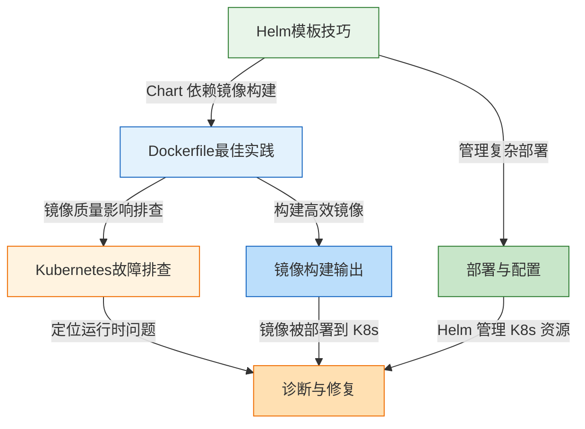

# 核心技巧：从理论到实战的桥梁

> "徒有理论而不掌握技巧，是空中楼阁；只凭技巧而不理解理论，是盲人摸象。" —— 容器与编排学习的第二条铁律

理论基础回答了"为什么"，核心技巧回答"怎么做"。

在上一节中，你已经理解了 Linux Namespace 的隔离机制、Cgroups 的资源限制原理、Docker 的分层镜像体系，以及 Kubernetes 的控制循环与架构全貌。这些都是不可或缺的"道"与"法"——但仅有这些还不够。知道 Docker 的分层存储原理，并不意味着你能写出高效的 Dockerfile；理解 Kubernetes 的调度机制，并不意味着你能排查生产环境的 CrashLoopBackOff；明白 Helm 的设计理念，并不意味着你能设计出优雅的 Chart 结构。

现实中，大量团队在容器化转型中遇到的困难，往往不是"不知道原理"，而是"知道原理但不会用"。一个 3GB 的 Java 应用镜像在生产环境中拉取需要十分钟，而通过多阶段构建可以压缩到 200MB 以内，三十秒就能拉取完毕——这不是理论问题，而是技巧问题。一个微服务部署在 Kubernetes 上频繁重启，运维工程师花了半天时间逐个排查，而掌握系统化排查方法的人十分钟就能定位到根因——这不是智力问题，而是方法论问题。一个团队有二十个微服务，每个服务的部署配置都用原始 YAML 文件管理，配置漂移和环境差异让发布变成噩梦——而用好 Helm 模板，这些问题可以从根本上消除。

**本节的任务是把理论转化为可操作的技巧。** 这三个技巧不是随便挑选的——它们是在数以百计的容器工程实践问题中，被反复验证为最基础、最高频、最具杠杆效应的核心能力。掌握了它们，你才能在后续的实战案例中游刃有余。

## 道法术器定位

在本章"道法术器"的体系中，核心技巧处于**"术"与"器"**的层面：

| 层次 | 含义 | 理论基础 | 核心技巧 | 实战案例 |
|------|------|----------|----------|----------|
| **道** | 为什么这样做 | 容器内核原理、K8s 控制循环 | — | — |
| **法** | 怎么做是对的 | 镜像规范、网络选型 | Dockerfile 编写规范、故障排查方法论、Helm 最佳实践 | — |
| **术** | 具体怎么做 | — | 多阶段构建、诊断流程、模板函数 | 业务场景实战 |
| **器** | 用什么工具 | Docker / containerd / K8s | Docker CLI、kubectl debug、Helm CLI | CI/CD 工具链 |

理论基础建立了"为什么"的认知框架，核心技巧则在这个框架上构建具体的"怎么做"能力。两者不是替代关系，而是递进关系——没有理论基础的技巧是脆弱的，没有技巧落地的理论是苍白的。

## 本节知识地图

三个核心技巧之间存在清晰的依赖与协作关系：



三个技巧构成了一个完整的容器工程闭环：**构建（Build）→ 部署（Deploy）→ 运维（Operate）**。Dockerfile 最佳实践解决"怎么构建高质量镜像"，Helm 模板技巧解决"怎么高效管理部署配置"，Kubernetes 故障排查解决"出了问题怎么定位修复"。三者缺一不可。

## 三大核心技巧总览

| 技巧 | 解决的问题 | 核心知识要点 | 难度 | 建议学时 |
|------|------------|-------------|------|----------|
| Dockerfile 最佳实践 | 镜像臃肿、构建缓慢、安全隐患 | 多阶段构建、层缓存优化、安全基线、镜像瘦身 | ★★☆ | 2-3 小时 |
| Kubernetes 故障排查 | Pod 异常、服务不可用、性能劣化 | CrashLoopBackOff 诊断、Pending 分析、OOMKilled 排查、网络连通性 | ★★★ | 3-4 小时 |
| Helm 模板技巧 | 配置管理混乱、Chart 复用困难 | 模板函数、values 设计、依赖管理、Hook 模式 | ★★☆ | 2-3 小时 |

这三种技巧分别覆盖容器工程的三个核心阶段，形成从构建到部署再到运维的完整能力链。总计约 7-10 小时的学习时间，建议分 3-4 天完成，每天聚焦一个技巧并完成配套练习。

## 为什么选择这三个技巧

面对容器与编排领域浩如烟海的知识点，我们精选了三个核心技巧，基于以下四个筛选标准：

**标准一：高频实用。** 每一个技巧都对应日常工作中反复出现的问题。Dockerfile 编写是每个容器化项目的起点，Kubernetes 故障排查是运维工程师的日常，Helm 是生产环境中事实上的包管理标准。不是"学了可能用得上"，而是"几乎一定会用到"。

**标准二：杠杆效应。** 掌握这些技巧的投入产出比极高。一个多阶段构建的优化可以将镜像体积缩减 70%、构建时间减少 50%；一套系统化的故障排查方法可以将平均修复时间（MTTR）从小时级缩短到分钟级；熟练的 Helm 模板能力可以让环境配置的管理效率提升数倍。

**标准三：覆盖完整生命周期。** 三个技巧恰好对应容器工程的三个阶段——构建（Dockerfile）、部署（Helm）、运维（故障排查）。这种覆盖不是刻意为之，而是这三个环节确实是容器化项目中最容易出问题、最需要技巧的阶段。

**标准四：理论与实践的桥梁。** 每一个技巧都深刻依赖理论基础。多阶段构建依赖对镜像分层机制的理解，故障排查依赖对 K8s 控制循环和 Pod 生命周期的掌握，Helm 模板依赖对 K8s 资源模型的理解。这使得本节成为理论基础与实战案例之间不可或缺的过渡。

## 三大工具速查

在深入学习之前，先了解本节涉及的核心工具及其用途：

| 工具 | 用途 | 关键命令 | 所属技巧 |
|------|------|----------|----------|
| Docker CLI | 镜像构建与管理 | `docker build`、`docker images`、`docker history` | Dockerfile 最佳实践 |
| hadolint | Dockerfile 静态检查 | `hadolint Dockerfile` | Dockerfile 最佳实践 |
| dive | 镜像层分析可视化 | `dive <image>` | Dockerfile 最佳实践 |
| Trivy | 镜像漏洞扫描 | `trivy image <image>` | Dockerfile 最佳实践 |
| kubectl | K8s 集群操作 | `kubectl get`、`kubectl describe`、`kubectl logs` | K8s 故障排查 |
| kubectl-debug | 运行中容器诊断 | `kubectl debug pod/<pod> -it --image=busybox` | K8s 故障排查 |
| cAdvisor | 容器资源监控 | Web UI 或 Prometheus 集成 | K8s 故障排查 |
| Helm CLI | Chart 管理与部署 | `helm install`、`helm template`、`helm lint` | Helm 模板技巧 |
| jsonnet | 模板逻辑测试 | `helm template --debug` | Helm 模板技巧 |

这些工具将在各技巧的详细讲解中反复使用。建议先确保本地环境已安装 Docker 和 kubectl，Helm 可以在学到第三部分时再安装。

## 技巧一：Dockerfile 最佳实践

> 一个 Dockerfile 写得好不好，不是看它能不能跑起来，而是看它的镜像是否精简、构建是否高效、运行是否安全。

Dockerfile 是容器化的起点，但大多数工程师写出的 Dockerfile 都存在严重问题。根据行业调研，生产环境中的容器镜像平均有 60% 以上的体积是不需要的，构建时间中有 40% 以上浪费在不必要的层重建上。更危险的是，许多镜像以 root 用户运行、包含已知漏洞的系统包、甚至在镜像中硬编码了数据库密码——这些都是严重的安全隐患。

本节将深入讲解四个核心维度：

**多阶段构建（Multi-stage Build）。** 通过将构建环境与运行环境分离，用一个大型构建镜像编译应用，再将产物复制到一个极小的运行镜像中。这是将一个 1.2GB 的 Java 应用镜像压缩到 200MB 以内的关键技术。多阶段构建的精髓在于"用完即弃"——构建阶段安装编译器、下载依赖、编译代码，但这些工具链在运行时完全不需要，通过 `COPY --from=builder` 只复制最终产物，实现了构建环境与运行环境的彻底隔离。

举一个直观的例子。一个典型的 Go Web 服务，不使用多阶段构建时：

```dockerfile
# ❌ 错误示例：单阶段构建，最终镜像约 800MB
FROM golang:1.22
WORKDIR /app
COPY . .
RUN go build -o server .
EXPOSE 8080
CMD ["./server"]
```

使用多阶段构建后：

```dockerfile
# ✅ 正确示例：多阶段构建，最终镜像约 15MB
FROM golang:1.22 AS builder
WORKDIR /app
COPY go.mod go.sum ./
RUN go mod download          # 利用缓存：依赖不变时跳过
COPY . .
RUN CGO_ENABLED=0 go build -o server .

FROM gcr.io/distroless/static:nonroot
COPY --from=builder /app/server /server
USER nonroot:nonroot
EXPOSE 8080
CMD ["/server"]
```

同一个应用，镜像从 800MB 缩减到 15MB，拉取时间从分钟级降到秒级。这不是优化，而是质变。

**层缓存优化。** Docker 的构建缓存机制意味着指令顺序直接影响构建速度。Docker 会逐层检查指令是否发生变化，一旦某一层发生变化，其后所有层都需要重新构建。将不常变化的指令（如系统依赖安装、pip/npm 包下载）放在前面，将经常变化的指令（如代码复制、配置文件更新）放在后面——这一简单的重排可以将重复构建时间从 5 分钟缩短到 30 秒。理解缓存失效的粒度（整个指令级别，不是文件级别）是优化的关键。

一个典型的反面教材与优化对比：

```dockerfile
# ❌ 反面教材：每次代码改动都重新安装依赖（约 5 分钟）
COPY . .
RUN npm install
RUN npm run build

# ✅ 正确做法：先复制依赖声明，再复制代码（约 30 秒）
COPY package.json package-lock.json ./
RUN npm ci --production
COPY . .
RUN npm run build
```

区别在于：优化后的写法将 `package.json` 的复制和 `npm ci` 放在前面。只要依赖声明文件不变，这一层就会命中缓存，跳过耗时的 `npm ci` 过程。

**安全基线。** 不以 root 用户运行容器、使用官方最小基础镜像、不在镜像中硬编码密钥、使用 .dockerignore 排除敏感文件——这些不是"最佳实践建议"，而是生产环境的硬性要求。一个以 root 运行的容器一旦被攻破，攻击者就获得了容器内的最高权限，而合理的 USER 指令可以大幅缩小攻击面。配合 Trivy 等镜像扫描工具，可以在构建阶段就发现已知漏洞。

安全基线检查清单：

| 检查项 | 风险等级 | 说明 |
|--------|----------|------|
| 以 root 运行 | 🔴 高 | 攻击者获得容器内最高权限 |
| 使用 `latest` 标签 | 🔴 高 | 构建不可复现，可能引入未知变更 |
| 镜像中包含 secrets | 🔴 高 | 密钥通过 `docker history` 或层提取泄露 |
| 未使用 .dockerignore | 🟡 中 | 可能将 .git、.env 等敏感文件打包进镜像 |
| 使用过时基础镜像 | 🟡 中 | 包含已知 CVE 漏洞 |
| 安装不必要的包 | 🟢 低 | 增大攻击面和镜像体积 |

**镜像瘦身。** 合理选择基础镜像（alpine 仅 5MB、distroless 无 shell 但极安全、scratch 完全空白但需要静态编译）、合并 RUN 指令减少层数、在同一个 RUN 中安装并清理缓存——每一步都在为更快的拉取速度和更小的存储开销贡献力量。在大规模集群中，镜像瘦身的意义不仅在于节省磁盘空间，更在于减少节点间镜像同步的带宽消耗。

基础镜像选择对比：

| 基础镜像 | 体积 | 包含 Shell | 适用场景 |
|----------|------|-----------|----------|
| `ubuntu:22.04` | ~77MB | ✅ | 开发调试、需要完整工具链 |
| `alpine:3.19` | ~5MB | ✅ | 通用生产环境、追求极小体积 |
| `distroless/static` | ~2MB | ❌ | Go/Rust 静态编译产物 |
| `distroless/java17-debian12` | ~200MB | ❌ | Java 应用生产环境 |
| `scratch` | 0MB | ❌ | 纯静态二进制、极致最小化 |

### 常见误区预览

在详细学习本技巧前，先了解几个高频误区，带着问题去学效果更好：

1. **"RUN 合并越多越好"** —— 合并 RUN 指令确实能减少层数，但过度合并会导致缓存粒度过粗：一个字符的变更就触发整条指令链重建。正确做法是按"变化频率"分组，而非一味合并。

2. **"alpine 一定比 debian 小所以一定更好"** —— alpine 使用 musl libc 而非 glibc，某些 C 扩展库（如 Pillow 的某些功能）在 musl 上会出问题或性能劣化。选择基础镜像时需要验证应用兼容性。

3. **"docker build --no-cache 能解决所有缓存问题"** —— 禁用缓存会显著增加构建时间。正确做法是理解缓存失效机制，只在必要时（如安全补丁更新）使用 `--no-cache`。

4. **".dockerignore 写不写无所谓"** —— 没有 .dockerignore 的构建会将 .git（可能数百 MB）、node_modules、.env 等全部发送到 Docker 守护进程，不仅浪费时间，还可能泄露 secrets。

## 技巧二：Kubernetes 故障排查

> Kubernetes 的错误信息往往只告诉你"什么坏了"，而不会告诉你"为什么坏了"。排查的艺术在于从现象追溯到根因。

Kubernetes 环境中的故障排查是容器工程师最具挑战性的工作之一。当 Pod 处于异常状态时，问题可能出在应用代码、镜像构建、资源配置、网络策略、存储挂载、调度约束等多个层面。没有系统化的排查方法，你只能在黑暗中摸索。更棘手的是，Kubernetes 的错误信息往往高度概括——一个 "CrashLoopBackOff" 状态背后可能隐藏着十几种不同的根因，需要逐层剥开才能找到真正的问题所在。

本节将建立四个典型故障的诊断流程，每个流程都包含从现象到根因的完整排查路径：

**CrashLoopBackOff 诊断。** 当 Pod 反复崩溃重启时，排查路径是：检查容器退出码（137=OOM、1=应用错误、0=正常退出但被主动关闭）→ 查看 Pod 日志（`kubectl logs` 加 `--previous` 参数查看上次崩溃的日志）→ 检查资源 limits 是否合理 → 审查启动命令和环境变量是否正确。退避算法从 10 秒指数增长到 5 分钟，理解这个机制有助于判断是"真的崩溃"还是"启动慢"。很多初学者会误判——一个应用启动需要 90 秒，但 Kubernetes 的 `timeoutSeconds` 默认只有 60 秒，就会被判定为超时而反复重启。

退出码速查表——排查的第一步永远是看退出码：

| 退出码 | 含义 | 典型原因 | 排查方向 |
|--------|------|----------|----------|
| 0 | 正常退出 | 应用执行完后退出（非守护进程模式） | 检查 CMD/ENTRYPOINT 是否正确 |
| 1 | 应用错误 | 代码异常、配置错误、依赖缺失 | 查看 `kubectl logs` 和 `kubectl logs --previous` |
| 126 | 权限问题 | 启动命令无执行权限 | 检查 Dockerfile 中的 `chmod` |
| 127 | 命令未找到 | 启动命令路径错误或不存在 | 检查 ENTRYPOINT/CMD 指定的路径 |
| 137 | OOM Kill | 内存超限被 SIGKILL | 检查 limits.memory、应用内存使用 |
| 139 | 段错误 | 空指针、内存越界 | 应用代码 bug，需要 core dump 分析 |
| 143 | SIGTERM | 收到终止信号后优雅退出 | 正常行为，检查 preStop hook 配置 |

**Pending 状态分析。** Pod 长时间处于 Pending 通常意味着调度失败。常见原因包括：节点资源不足（检查 requests vs available，注意 requests 是调度依据而非 limits）、节点亲和性或反亲和性约束冲突、PVC 无法绑定到可用的存储类、污点（Taint）与容忍度（Toleration）不匹配、命名空间的 ResourceQuota 已耗尽。每一种原因都有对应的 `kubectl describe pod` 输出中的 Events 信息可以快速定位。

排查 Pending 状态的决策树：

Pod Pending
├── Events: "Insufficient cpu/memory"
│   └── 节点资源不足 → 降低 requests 或扩容节点
├── Events: "0/N nodes are available"
│   ├── "node(s) had taint" → 添加 Toleration 或移除 Taint
│   ├── "node(s) didn't match Pod's node affinity" → 调整 Affinity 规则
│   └── "node(s) had volume node affinity conflict" → 检查 PVC 与节点拓扑
├── Events: "waiting for a volume to be created"
│   └── PVC Pending → 检查 StorageClass 和 PV 可用性
├── Events: "exceeded quota"
│   └── ResourceQuota 耗尽 → 检查命名空间配额
└── Events: （无明确信息）
    └── 使用 `kubectl get events --field-selector reason=FailedScheduling` 深入排查

**ImagePullBackOff 排查。** 镜像拉取失败看似简单，实际原因多样：镜像名称或 tag 拼写错误、私有仓库的 imagePullSecrets 配置缺失或过期、节点到镜像仓库的网络不通（防火墙规则、DNS 解析失败）、镜像体积过大导致拉取超时、运行时配额限制。掌握 `kubectl describe pod` 的 Events 输出解读是排查这类问题的关键技能，其中的 Warning 信息通常会直接指向失败原因。

一个快速排查流程：

```bash
# 第一步：查看事件中的具体错误信息
kubectl describe pod <pod-name> | grep -A 5 "Events"

# 第二步：检查 imagePullSecrets 是否存在且正确
kubectl get secret <secret-name> -o yaml | grep -A 2 ".dockerconfigjson"

# 第三步：在节点上手动测试拉取
crictl pull <image>
# 或
docker pull <image>

# 第四步：检查 DNS 解析是否正常
kubectl run debug --rm -it --image=busybox -- nslookup <registry-domain>
```

**OOMKilled 分析。** 容器因内存超限被内核直接 SIGKILL 是最常见的生产故障之一。排查要点：理解 cgroup memory.max 的行为——这是一个硬限制，进程触及限制时内核直接发送 SIGKILL，没有任何优雅退出的机会；查看容器的实际内存使用（`kubectl top pod`、`/sys/fs/cgroup/memory.usage_in_bytes`）；合理设置 requests 与 limits 的比值（requests 用于调度，limits 用于运行时保护）；对于内存使用波动大的应用，考虑使用 Vertical Pod Autoscaler 进行容量规划。值得注意的是，OOMKilled 发生时应用无法执行任何清理操作，因此有状态服务需要特别注意持久化设计。

requests 与 limits 的最佳实践比值：

| 应用类型 | 建议 requests:limits 比 | 说明 |
|----------|------------------------|------|
| 无状态 Web 服务 | 1:1 | 内存使用稳定，硬限制无副作用 |
| Java 应用 | 1:1.5 | JVM 堆内存有波动，预留缓冲 |
| 数据处理/批处理 | 1:2 | 内存峰值可能是均值的两倍 |
| 缓存类应用 | 1:3 或不设 limits | 允许弹性使用内存，由系统 OOM 兜底 |

### 常见误区预览

1. **"kubectl logs 看不到日志就是没日志"** —— 容器崩溃后日志不会丢失，使用 `kubectl logs <pod> --previous` 查看上次崩溃的日志。很多初学者在这一步就放弃了，错过了关键线索。

2. **"OOMKilled 一定是代码内存泄漏"** —— 也可能是 limits 设置过低、GC 压力导致的周期性内存尖峰、或者 JVM 的堆外内存未被计入 cgroup。需要区分"真泄漏"和"配置不当"。

3. **"Pod 重启了就一定是 CrashLoopBackOff"** —— 正常的滚动更新也会导致 Pod 重启。用 `kubectl get pods --watch` 观察重启模式，如果重启后新 Pod 正常运行，那是部署行为而非故障。

4. **"网络不通就改 firewall"** —— K8s 网络问题有多个层面：Service 网络、Pod 网络、节点网络、外部网络。需要逐层排查，而非直接改防火墙规则。

## 技巧三：Helm 模板技巧

> Helm Chart 不是一堆 YAML 文件的集合，而是一个可编程的部署模板系统。用好模板，才能管理好复杂度。

在生产环境中，直接使用 kubectl apply 管理原始 YAML 文件很快就会失控——环境差异、配置复用、版本回滚、多组件依赖等问题会让维护成本急剧上升。你可能需要为开发、测试、生产三个环境维护三套几乎相同的 YAML 文件，每次改一个环境变量都要手动修改三处配置，稍有不慎就会遗漏。Helm 作为 Kubernetes 事实上的包管理器，提供了声明式部署管理的能力，将这些问题从根源上化解。

本节将聚焦四个关键技巧：

**模板函数与管道。** Helm 的 Go template 引擎提供了丰富的内置函数：`default` 设置默认值（当 values 中未定义时使用备选值）、`required` 强制必填（缺少必要配置时直接报错而不是静默使用空值）、`toYaml`/`fromYaml` 处理结构化数据（在模板中动态生成或解析 YAML 片段）、`lookup` 查询集群状态（在渲染时获取当前集群的实时信息）。掌握这些函数可以实现复杂的条件渲染和数据转换，避免在 values.yaml 中堆砌冗余配置。管道语法（`|`）允许函数链式调用，使得模板逻辑既简洁又强大。

一个实用的模板示例——根据环境动态配置资源：

```yaml
# templates/deployment.yaml
containers:
  - name: {{ .Chart.Name }}
    image: "{{ .Values.image.repository }}:{{ .Values.image.tag | default .Chart.AppVersion }}"
    resources:
      {{- if eq .Values.environment "production" }}
      requests:
        cpu: "500m"
        memory: "512Mi"
      limits:
        cpu: "1000m"
        memory: "1Gi"
      {{- else }}
      requests:
        cpu: "100m"
        memory: "128Mi"
      limits:
        cpu: "200m"
        memory: "256Mi"
      {{- end }}
```

注意 `image.tag | default .Chart.AppVersion` 的管道写法——如果 values 中没有指定 tag，自动使用 Chart 版本作为镜像标签，保证版本一致性。

**values 设计原则。** values.yaml 是 Helm Chart 的"用户接口"，它的设计质量直接决定了 Chart 的易用性和可维护性。好的设计应该：层次清晰（按功能模块分组，如 image、resources、ingress 各自成组）、有合理的默认值（开箱即用，最小化配置量）、有完整的注释说明（每个关键字段都注明用途和可选值）、使用 `required` 标记必须覆盖的值（如域名、数据库连接地址等环境相关配置）。设计不当的 values 会导致 Chart 难以理解和使用，甚至产生隐性的配置错误。

values.yaml 设计对比：

```yaml
# ❌ 反面教材：扁平结构，无注释，无默认值
dbHost: ""
dbPort: ""
dbUser: ""
dbPass: ""
imageName: ""
replicas: ""

# ✅ 正确示范：分组清晰，有注释，有合理默认值
# ============================================
# 应用配置
# ============================================
app:
  # 副本数（生产环境建议 >= 2 以保证高可用）
  replicas: 2
  # 滚动更新策略
  strategy:
    type: RollingUpdate
    maxSurge: 1
    maxUnavailable: 0

# ============================================
# 镜像配置
# ============================================
image:
  # 镜像仓库地址
  repository: myregistry/app
  # 镜像标签（默认使用 Chart 版本）
  tag: ""
  # 拉取策略：Always / IfNotPresent / Never
  pullPolicy: IfNotPresent

# ============================================
# 数据库配置（必填）
# ============================================
database:
  host:
    value: ""
    description: "数据库主机地址（必填）"
  port:
    value: 5432
    description: "数据库端口"
  name:
    value: ""
    description: "数据库名称（必填）"
```

**Chart 依赖管理。** 复杂的应用通常由多个组件构成（如应用服务 + 数据库 + Redis + Ingress）。通过 `dependencies` 声明子 Chart、使用条件渲染控制组件启停（`enabled: true/false`）、通过全局 values（`global`）在父子 Chart 间传递共享配置——这些能力使得 Helm 可以管理整个应用栈的部署。依赖管理的核心挑战在于版本控制和冲突解决，需要理解语义化版本约束和 `helm dependency update` 的工作机制。

```yaml
# Chart.yaml 中声明依赖
dependencies:
  - name: postgresql
    version: "12.x.x"
    repository: "https://charts.bitnami.com/bitnami"
    condition: postgresql.enabled
  - name: redis
    version: "17.x.x"
    repository: "https://charts.bitnami.com/bitnami"
    condition: redis.enabled
```

通过 `condition` 字段，可以在 values.yaml 中用 `postgresql.enabled: true/false` 控制是否部署 PostgreSQL，实现组件的按需启停。

**Hook 模式。** Helm Hook 允许在部署生命周期的特定时刻执行自定义操作：`pre-install` 执行数据库迁移、`post-upgrade` 运行健康检查、`pre-delete` 清理外部资源、`test` 在部署后验证服务可用性。Hook 的执行由 Kubernetes Job 或 Pod 承载，支持注解控制执行顺序（`helm.sh/hook-weight`）和删除策略（`helm.sh/hook-delete-policy`）。Hook 机制将 Helm 从简单的"渲染+应用"工具提升为可编程的部署编排引擎。

Hook 执行时机与典型用途一览：

| Hook | 触发时机 | 典型用途 | 承载资源 |
|------|----------|----------|----------|
| `pre-install` | 首次安装前 | 创建命名空间、初始化数据库 | Job |
| `post-install` | 首次安装后 | 发送部署通知、初始化数据 | Job |
| `pre-upgrade` | 升级前 | 数据库迁移、备份 | Job |
| `post-upgrade` | 升级后 | 健康检查、集成测试 | Job |
| `pre-delete` | 删除前 | 清理外部资源（S3 Bucket 等） | Job |
| `post-delete` | 删除后 | 发送清理通知 | Job |
| `test` | `helm test` 时 | 验证服务可用性、连通性 | Pod/Job |

### 常见误区预览

1. **"Helm 模板能做的事越多越好"** —— 模板中应避免复杂逻辑。如果模板包含大量 if/else 和计算，说明 values 设计有问题，应该把逻辑提到 values.yaml 或外部工具中。模板保持"渲染"而非"编程"的定位。

2. **"Chart 依赖越多越好"** —— 依赖链过长会导致升级困难和版本冲突。核心原则：每个 Chart 聚焦一个关注点，依赖关系保持扁平。

3. **"Hook 可以替代 CI/CD"** —— Hook 适合与部署强相关的操作（迁移、检查），不适合构建、推送镜像等 CI/CD 流程。混淆职责会导致部署流程难以理解和调试。

4. **"values.yaml 里的值就是全部配置"** —— 生产环境通常需要通过 `--set`、外部 Secret 管理器（如 Sealed Secrets）、或 ConfigMap 挂载来补充敏感配置。不要在 values.yaml 中存放密码、证书等敏感信息。

## 学习成果检验

学完本节全部内容后，你应该能够独立完成以下任务：

| 能力维度 | 检验标准 | 对应技巧 |
|----------|----------|----------|
| 镜像构建 | 将一个 Java/Go/Node.js 应用的镜像体积缩减 50% 以上 | Dockerfile 最佳实践 |
| 安全基线 | 通过 Trivy 扫描零高危漏洞，镜像以非 root 运行 | Dockerfile 最佳实践 |
| 构建效率 | 重复构建时间缩短到首次构建的 10% 以内 | Dockerfile 层缓存优化 |
| 故障诊断 | 10 分钟内定位 Pod 的 CrashLoopBackOff 根因 | K8s 故障排查 |
| 状态分析 | 正确识别 Pending 状态的 5 种以上可能原因 | K8s 故障排查 |
| 内存排查 | 区分 OOMKilled 是代码问题还是配置问题 | K8s 故障排查 |
| 模板编写 | 编写支持多环境（dev/staging/prod）的 Helm Chart | Helm 模板技巧 |
| 依赖管理 | 管理包含 3 个以上子 Chart 的应用栈部署 | Helm 模板技巧 |
| Hook 运用 | 在部署流程中正确使用 pre/post Hook | Helm 模板技巧 |

如果你能在不查文档的情况下完成其中 7 项以上，说明核心技巧已经扎实掌握。

## 学习路径

建议按照以下顺序学习本节内容，每个技巧都建立在前一个的基础之上：


**前置条件：** 在开始学习本节之前，你应该已经掌握理论基础中的核心概念——至少理解 Docker 的镜像分层机制和 Kubernetes 的 Pod 生命周期。如果对这些概念还比较模糊，建议先回顾理论基础的第二、三节。

**建议时间安排：**

| 阶段 | 内容 | 建议时长 | 产出 |
|------|------|----------|------|
| Day 1 | 理论回顾 + Dockerfile 最佳实践 | 2-3 小时 | 一个优化后的 Dockerfile |
| Day 2 | Helm 模板技巧 | 2-3 小时 | 一个可部署的 Helm Chart |
| Day 3 | Kubernetes 故障排查 | 3-4 小时 | 一份个人排查手册 |
| Day 4 | 综合练习 + 进入实战案例 | 2-3 小时 | 完整的构建→部署→排障闭环 |

**学习建议：**

1. **先通读，后深钻**：快速浏览三个技巧的全文，建立整体认知框架，再逐个深入。不要在第一个技巧上花太多时间而忽略了全局。

2. **动手比阅读更重要**：每个技巧都附带实操练习。Dockerfile 最佳实践要求你用多阶段构建优化一个真实项目；Kubernetes 故障排查要求你在本地集群中模拟故障并诊断；Helm 模板技巧要求你为一个微服务应用编写完整的 Chart。不实践，等于没学。

3. **带着已知问题学习**：回想你在工作中遇到的容器相关问题——镜像太大拉不动、Pod 莫名重启、配置管理一团糟——带着这些问题去学，你会发现每个技巧都有对应的答案。

4. **建立自己的排查手册**：Kubernetes 故障排查部分建议做成可随时查阅的 SOP（标准操作流程）。生产环境出问题时，你没有时间从头推理，一份结构化的排查手册可以救命。

5. **与理论交叉验证**：遇到不理解的技巧，回头查阅理论基础。多阶段构建不理解？回去看镜像分层机制。OOMKilled 排查不清楚？回去看 cgroup 的 OOM 行为。理论和技巧要反复对照，形成立体认知。

> **一句话总结**：核心技巧不是"会用就行"的操作手册，而是"必须精通"的工程能力。Dockerfile 决定了你的镜像质量，Helm 决定了你的部署效率，故障排查决定了你的系统可靠性——这三者共同构成了容器工程师的核心竞争力。

---

## 本节目录

1. [技巧一：Dockerfile最佳实践](01-技巧一Dockerfile最佳实践.md) — 多阶段构建、层缓存优化、安全基线、镜像瘦身
2. [技巧二：Kubernetes故障排查](02-技巧二Kubernetes故障排查.md) — CrashLoopBackOff 诊断、Pending 分析、ImagePullBackOff 排查、OOMKilled 分析
3. [技巧三：Helm模板技巧](03-技巧三Helm模板技巧.md) — 模板函数与管道、values 设计、Chart 依赖管理、Hook 模式
