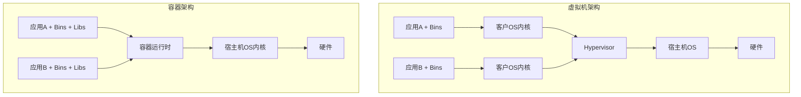
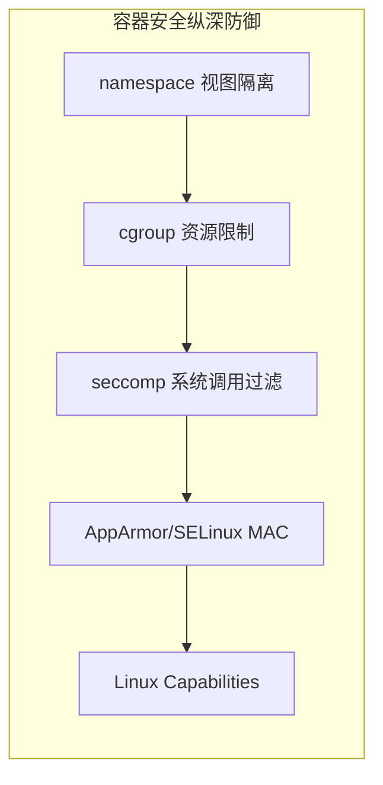
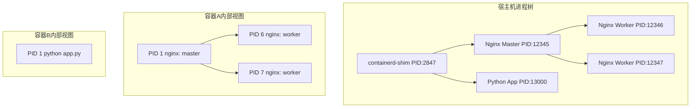
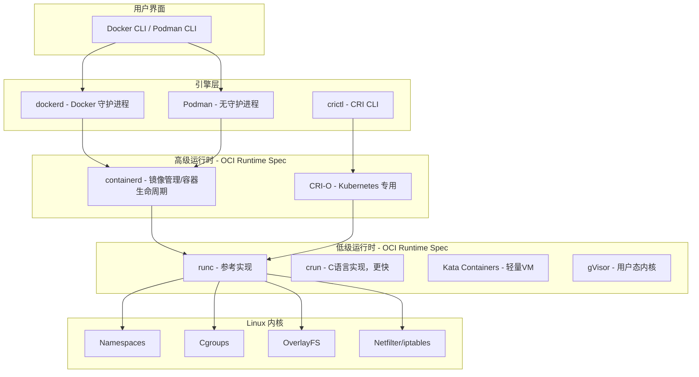
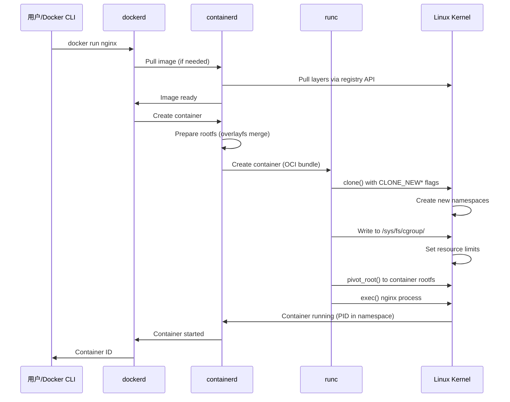
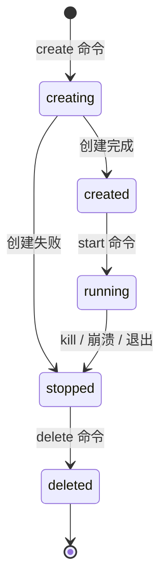
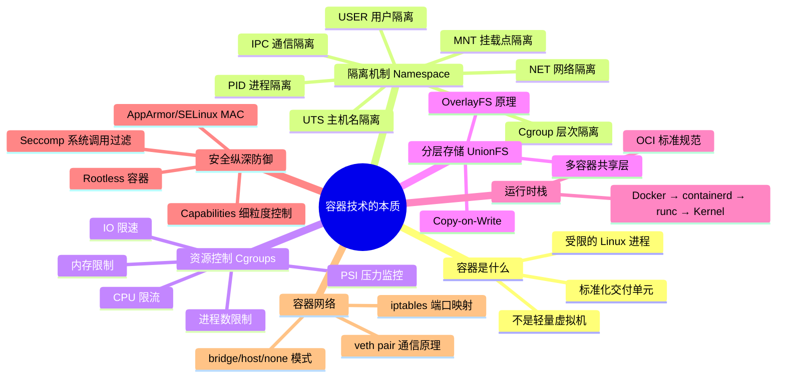

## 一、容器技术的本质

> **核心认知**：容器的本质是受限的、隔离的 Linux 进程，而非轻量虚拟机。理解这一点是掌握整个容器技术栈的起点。

### 1.1 什么是容器

**一句话定义**：容器是利用 Linux 内核的隔离机制（namespace + cgroup），将应用及其所有依赖打包成一个标准化、可移植的运行单元。

**类比理解**：
- **虚拟机** = 独立的房子（有自己的地基、水电、网络，完全自治）
- **容器** = 公寓的隔间（共享大楼的基础设施，但各自独立生活）



**关键区别**：

| 对比维度 | 虚拟机 | 容器 |
|---------|--------|------|
| 隔离层级 | 硬件级（Hypervisor虚拟化CPU/内存/设备） | 进程级（namespace + cgroup） |
| 启动时间 | 分钟级（需启动完整Guest OS） | 秒级甚至毫秒级（共享宿主内核） |
| 资源占用 | GB级（每个VM运行完整OS） | MB级（仅包含应用依赖） |
| 性能损耗 | 5-15%（硬件虚拟化开销） | < 2%（接近原生性能） |
| 镜像大小 | 数GB（含完整OS） | 数十MB ~ 数百MB |
| 安全边界 | 强（独立内核，攻击面隔离） | 弱（共享内核，需额外加固） |
| 部署密度 | 单机10-20个 | 单机数百甚至数千个 |
| 适用场景 | 强隔离需求、传统应用迁移、多租户 | 微服务、CI/CD、弹性伸缩、云原生 |

**为什么容器共享内核却能安全运行？**

容器并非"不安全"，而是安全模型不同。Linux 内核提供了多层防御：

1. **namespace** 提供视图隔离——容器看不到宿主机的其他进程、网络、文件系统
2. **cgroup** 提供资源边界——容器无法耗尽宿主机的 CPU、内存、IO
3. **seccomp** 提供系统调用过滤——限制容器可用的内核系统调用（约300个中仅开放约40个）
4. **AppArmor / SELinux** 提供强制访问控制——限制容器对文件、网络、 capabilities 的访问
5. **Linux capabilities** 提供细粒度权限——默认丢弃 `CAP_NET_RAW` 等危险能力



### 1.2 容器技术发展简史

理解容器的历史，才能理解当前技术选择背后的逻辑。

| 年份 | 里程碑 | 意义 |
|------|--------|------|
| 1979 | Unix V7 chroot | 最早的文件系统隔离，将进程的根目录切换到指定位置 |
| 2000 | FreeBSD Jails | 第一个完整的操作系统级虚拟化方案，隔离进程、网络、文件系统 |
| 2001 | Linux VServer | Linux 上的轻量级虚拟化，共享内核但隔离资源 |
| 2006 | Google 开发 process containers（后改名cgroup） | 控制进程组的资源使用，后来合入Linux内核2.6.24 |
| 2008 | LXC (Linux Containers) | 第一个完整的 Linux 容器方案，组合 namespace + cgroup |
| 2013 | Docker 发布 | 容器技术的"iPhone时刻"——将容器封装为开发者友好的体验 |
| 2014 | Kubernetes 发布 | Google 开源的容器编排系统，基于 Borg 内部系统经验 |
| 2015 | OCI 成立 | Open Container Initiative——容器运行时和镜像的标准化 |
| 2016 | containerd 成为 CNCF 项目 | Docker 将核心运行时剥离为独立项目 |
| 2017 | Kubernetes 1.6 引入 CRI | Container Runtime Interface——K8s 不再绑定 Docker |
| 2020 | Docker Desktop 商业化限制 | 推动 Podman、nerdctl 等替代方案发展 |
| 2023 | K8s 1.28 移除 dockershim | Kubernetes 彻底脱离 Docker 运行时依赖 |
| 2024 | Kubernetes 1.30 GA sidecar containers | 原生 sidecar 支持改变了服务网格和可观测性部署模式 |
| 2025 | Kata Containers 3.x + QEMU 9.0 | 轻量 VM 容器启动时间降至 < 100ms，模糊容器与 VM 边界 |

> **关键启示**：容器技术的核心（namespace + cgroup）早在 Docker 之前就已存在。Docker 的真正贡献是**标准化了容器的打包、分发和运行体验**，而非发明了容器本身。

### 1.3 Linux Namespace — 视图隔离机制

Namespace 是 Linux 内核提供的资源隔离机制，让每个容器看到自己独立的系统视图。核心思想是：**对容器内的进程而言，它以为自己独占整个系统**。

**7种Namespace详解**：

| Namespace | 隔离内容 | 系统调用标志 | 内核版本 | 效果 |
|-----------|----------|-------------|---------|------|
| **PID** | 进程ID空间 | CLONE_NEWPID | 2.6.24 | 容器内PID从1开始，看不到宿主机和其他容器的进程 |
| **NET** | 网络栈（IP、路由表、iptables、/proc/net） | CLONE_NEWNET | 2.6.29 | 容器拥有独立的网络接口、IP地址、端口空间 |
| **MNT** | 文件系统挂载点 | CLONE_NEWNS | 2.4.19 | 容器有自己的文件系统视图，mount/umount互不影响 |
| **UTS** | 主机名和域名 | CLONE_NEWUTS | 2.6.19 | 容器可以有独立的hostname，不影响宿主机 |
| **IPC** | 进程间通信（共享内存、信号量、消息队列） | CLONE_NEWIPC | 2.6.19 | 容器间的IPC资源完全隔离 |
| **USER** | 用户和组ID映射 | CLONE_NEWUSER | 3.8 | 容器内root映射到宿主机普通用户，降低提权风险 |
| **Cgroup** | Cgroup根目录视图 | CLONE_NEWCGROUP | 4.6 | 容器看不到宿主机的完整cgroup层次结构 |

**PID Namespace 深度解析**：

```bash
# === 在宿主机上查看容器进程 ===
# 容器内的 PID 1，在宿主机上可能对应 PID 12345
ps aux | grep nginx
# root 12345 0.0 0.1 nginx: master process

# === 进入容器内部查看 ===
docker exec -it web ps aux
# PID USER COMMAND
#   1 root  nginx: master process
#   6 root  nginx: worker process
#   7 root  nginx: worker process

# === 验证 PID 隔离 ===
# 在容器内，PID 1 是 nginx；在宿主机上，它有自己的 PID
docker exec web cat /proc/1/cmdline | tr '\0' ' '
# nginx: master process

# 查看容器进程的父进程
ps -ef | grep 12345
# root 12345 2847 ... nginx    # 父进程是 PID 2847（containerd-shim）
```



**PID 1 的特殊性与僵尸进程问题**：

在 Linux 中，PID 1 进程承担着特殊的"init"角色——它必须负责回收孤儿进程（成为其父进程），否则这些孤儿进程会变成僵尸进程（zombie），占用 PID 资源。但很多应用作为 PID 1 运行时并不处理这个职责，导致生产环境中出现僵尸进程堆积的问题。

```bash
# === 僵尸进程问题演示 ===
# 启动一个简单的 shell 容器
docker run -d --name zombie-test alpine sh -c \
  "sh -c 'sleep 1 &amp; wait' &amp;&amp; while true; do sleep 10; done"

# 进入容器查看，会发现僵尸进程
docker exec zombie-test ps aux
# PID   USER     COMMAND
#   1   root     sh -c sleep 1 &amp; wait    ← 应用进程
#   ?   root     [sleep 1] <defunct>     ← 僵尸进程（标记为 <defunct>）

# === 解决方案：使用 init 进程 ===

# 方案一：Docker 内置 --init 参数（使用 tini）
docker run -d --name no-zombie --init alpine sh -c \
  "sh -c 'sleep 1 &amp; wait' &amp;&amp; while true; do sleep 10; done"
# tini 作为 PID 1，正确回收子进程

# 方案二：在 Dockerfile 中使用 tini
# FROM alpine:3.19
# RUN apk add --no-cache tini
# ENTRYPOINT ["/sbin/tini", "--"]
# CMD ["your-app"]

# 方案三：使用 dumb-init（Python 生态常用）
# pip install dumb-init &amp;&amp; dumb-init -- your-app
```

> **生产经验**：任何会产生子进程的应用（shell 脚本、并发框架、worker 进程）都应该使用 `--init` 或在镜像中内置 tini，否则在长时间运行的容器中会逐渐积累僵尸进程，最终可能耗尽 PID 空间。

**NET Namespace 深度解析**：

```bash
# === 查看容器网络命名空间 ===
# 容器有独立的网络栈
docker exec web ip addr show
# 1: lo: <LOOPBACK,UP> ...
#     inet 127.0.0.1/8 ...
# 15: eth0@if16: <BROADCAST,MULTICAST,UP> ...
#     inet 172.17.0.2/16 ...

# === 宿主机网络 vs 容器网络 ===
ip addr show docker0
# docker0: <BROADCAST,MULTICAST,UP> ...
#     inet 172.17.0.1/16 ...    # Docker 网桥

# === 端口映射的本质 ===
# -p 8080:80 的实质是宿主机的 iptables 规则：
iptables -t nat -L -n | grep 8080
# DNAT tcp -- 0.0.0.0/0 0.0.0.0/0 tcp dpt:8080 to:172.17.0.2:80
```

**容器网络模式详解**：

Docker 提供四种网络模式，每种对应不同的 NET namespace 使用方式：

| 网络模式 | 说明 | NET namespace | 适用场景 |
|---------|------|---------------|---------|
| **bridge**（默认） | 容器通过虚拟网桥互联，通过 NAT 访问外网 | 独立 namespace + veth pair 连接 docker0 | 大多数场景，容器间需隔离又需通信 |
| **host** | 容器直接使用宿主机的网络栈 | 共享宿主机 namespace | 对网络性能极度敏感的场景（如高性能代理） |
| **none** | 完全无网络 | 独立 namespace，无网络接口 | 安全敏感或纯计算任务 |
| **overlay** | 跨主机容器通信（Swarm/K8s） | 独立 namespace + VXLAN 隧道 | 多节点集群环境 |

```bash
# === bridge 模式（默认） ===
docker run -d --name web nginx
docker inspect --format '{{.NetworkSettings.Networks}}' web
# map[bridge:0xc0001234]

# === host 模式：容器直接用宿主机网络 ===
docker run -d --network host nginx
# 容器直接监听宿主机的 80 端口，无需 -p 映射
# 优势：无 NAT 开销，延迟最低
# 劣势：端口冲突风险，无网络隔离

# === none 模式：完全无网络 ===
docker run -d --network none alpine sleep 3600
docker exec <id> ip addr show
# 1: lo: <LOOPBACK,UP> ...    # 只有 loopback

# === 容器间通信原理 ===
# 两个 bridge 模式的容器通过 docker0 网桥互通
docker run -d --name test1 alpine sleep 3600
docker run -d --name test2 alpine sleep 3600
# test1 → veth pair → docker0 → veth pair → test2
# 都在同一个 172.17.0.0/16 子网内
```

**USER Namespace 深度解析**：

```bash
# === 用户命名空间隔离 ===
# 容器内 UID 0 (root) 映射到宿主机 UID 100000
docker run --rm -it alpine cat /proc/1/uid_map
#          0     100000      65536
# 容器UID 0 → 宿主机UID 100000，范围65536个

# === Rootless 容器（Podman 默认模式）===
# 无需 root 权限即可运行容器
podman run --rm hello-world
# 容器内看到的是 root，但宿主机上是普通用户
```

**查看和操作 Namespace 的实用命令**：

```bash
# 查看容器的所有 namespace
ls -la /proc/<container_pid>/ns/
# lrwxrwxrwx 1 root root 0 cgroup -> cgroup:[4026532XXX]
# lrwxrwxrwx 1 root root 0 ipc -> ipc:[4026532XXX]
# lrwxrwxrwx 1 root root 0 mnt -> mnt:[4026532XXX]
# lrwxrwxrwx 1 root root 0 net -> net:[4026532XXX]
# lrwxrwxrwx 1 root root 0 pid -> pid:[4026532XXX]
# lrwxrwxrwx 1 root root 0 user -> user:[4026532XXX]
# lrwxrwxrwx 1 root root 0 uts -> uts:[4026532XXX]

# 比较两个进程是否在同一个 namespace
readlink /proc/<pid1>/ns/net
readlink /proc/<pid2>/ns/net
# 如果 inode 相同，则共享网络命名空间

# 使用 nsenter 进入容器的 namespace
PID=$(docker inspect --format '{{.State.Pid}}' web)
nsenter --target $PID --pid --net --mount -- ps aux
# 这等同于"进入容器内部"，但不需要容器内有 shell
```

### 1.4 Cgroups — 资源限制与控制

Cgroups（Control Groups）是 Linux 内核的资源限制机制，控制容器能使用的 CPU、内存、IO 等资源。如果 namespace 是"看到什么"，cgroup 就是"能用多少"。

**Cgroups v1 vs v2 演进**：

| 对比维度 | Cgroups v1 | Cgroups v2 |
|---------|-----------|-----------|
| 控制器层次 | 每个控制器独立树 | 统一层次结构 |
| 资源分配 | 各控制器独立管理 | 统一的资源分配模型 |
| 内存管理 | memory.max + memory.oom_control | memory.max + memory.high + memory.pressure |
| CPU 带宽 | cpu.cfs_quota_us / cpu.cfs_period_us | cpu.max（合并为一个文件） |
| IO 控制 | blkio.* 控制器 | io.max + io.latency + io.weight |
| 压力监测 | 无 | PSI（Pressure Stall Information） |
| 嵌套支持 | 复杂且不一致 | 原生支持嵌套 |
| 主流采用 | Docker 默认（正在迁移） | Kubernetes 1.25+ 默认 |

**Cgroups v2 核心文件**：

/sys/fs/cgroup/
├── cgroup.controllers        # 当前层级可用的控制器列表
├── cgroup.subtree_control    # 启用到子组的控制器
├── cpu.max                   # CPU 带宽限制（格式：quota period）
├── cpu.weight                # CPU 权重（1-10000，默认100）
├── cpu.stat                  # CPU 使用统计
├── memory.max                # 内存硬限制（超过触发OOM）
├── memory.high               # 内存软限制（超过触发回收）
├── memory.current            # 当前内存使用量
├── memory.pressure           # PSI 内存压力指标
├── io.max                    # IO 限速（格式：MAJ:MIN rbps=wbps riops=wiops）
├── io.weight                 # IO 权重
├── io.stat                   # IO 使用统计
├── pids.max                  # 最大进程数
├── pids.current              # 当前进程数
└── cgroup.procs              # 属于该组的进程列表

**关键资源限制参数与实战**：

```bash
# === CPU 限制 ===
# 限制为 50% CPU（100ms 周期内最多用 50ms）
echo "50000 100000" > cpu.max

# 限制为 200% CPU（2核）
echo "200000 100000" > cpu.max

# CPU 权重（相对份额，范围1-10000，默认100）
echo "200" > cpu.weight    # 2倍于默认权重
echo "50" > cpu.weight     # 0.5倍于默认权重

# === 内存限制 ===
# 硬限制：512MB（超过触发 OOM Killer）
echo "536870912" > memory.max

# 软限制：1GB（超过时优先回收，但不立即杀死）
echo "1073741824" > memory.high

# swap 限制
echo "536870912" > memory.swap.max   # 限制 swap 使用量

# === IO 限制 ===
# 限制 /dev/sda 的读速率为 100MB/s，写速率为 50MB/s
echo "8:0 rbps=104857600 wbps=52428800" > io.max

# 限制 IOPS：读1000次/秒，写500次/秒
echo "8:0 riops=1000 wiops=500" > io.max

# === 进程数限制 ===
# 防止 fork bomb
echo "100" > pids.max
```

**Docker 中使用 Cgroups 的实际效果**：

```bash
# 限制容器 CPU 和内存
docker run -d \
  --cpus="1.5" \           # 限制使用1.5核
  --cpu-shares=512 \       # CPU份额（相对权重）
  --memory=512m \          # 内存硬限制
  --memory-swap=1g \       # 内存+swap总量
  --memory-reservation=256m \  # 内存软限制
  --pids-limit=200 \       # 进程数限制
  --device-read-bps /dev/sda:10mb \   # 读带宽限制
  --device-write-bps /dev/sda:5mb \   # 写带宽限制
  nginx

# 查看容器的 cgroup 配置
docker stats --no-stream
# CONTAINER   CPU %   MEM USAGE / LIMIT   MEM %   NET I/O       BLOCK I/O
# web         0.50%   256MiB / 512MiB     50.00%  1.2kB / 648B  12MB / 0B

# 查看 cgroup 文件的实际内容
cat /sys/fs/cgroup/system.slice/docker-<container_id>.scope/memory.max
```

**OOM Killer 行为解析**：

当容器内存使用超过 `memory.max` 时，Linux OOM Killer 会杀死容器内消耗内存最多的进程（PID 1）。理解这个行为对生产环境至关重要：

```bash
# OOM 触发时的日志
docker logs web 2>&amp;1 | grep -i oom
# "Killed process 1 (node) total-vm:536870kB, anon-rss:524288kB"

# 查看 OOM 事件
docker inspect --format '{{.State.OOMKilled}}' web
# true

# 预防 OOM 的最佳实践：
# 1. 设置 memory.high 作为预警线（默认无限制）
# 2. 在应用层做好内存管理（连接池、缓存淘汰）
# 3. 监控 memory.current / memory.max 比值
```

**PSI（Pressure Stall Information）—— cgroup v2 的杀手锏**：

cgroup v2 引入的 PSI 指标是生产环境监控的关键工具，它提供三个维度的压力数据：

```bash
# 查看内存压力
cat memory.pressure
# some avg10=0.00 avg60=0.00 avg300=0.00 total=0
# full avg10=0.00 avg60=0.00 avg300=0.00 total=0
# some: 有进程因内存不足而等待的时间占比
# full: 所有进程都因内存不足而等待的时间占比

# 查看 CPU 压力
cat cpu.pressure
# some avg10=2.50 avg60=1.20 avg300=0.80 total=123456
# some > 10% 意味着 CPU 资源不足，需要扩容

# 查看 IO 压力
cat io.pressure
# some avg10=5.00 avg60=3.00 avg300=2.00 total=456789
# full avg10=1.00 avg60=0.50 avg300=0.30 total=12345
# full > 5% 意味着 IO 是瓶颈，需要升级存储
```

> **生产经验**：PSI 比传统的 CPU/内存使用率更能反映真实的服务质量。一个容器可能显示 90% CPU 使用率但 PSI some 为 0%（说明 CPU 虽然忙但没有进程在等待），也可能显示 50% CPU 使用率但 PSI some 很高（说明 CPU 不够用）。结合两者判断才准确。

### 1.5 Union 文件系统 — 分层存储

Union FS（联合文件系统）实现镜像的分层存储，多个容器可以共享相同的基础层，大幅减少磁盘占用和镜像拉取时间。

**分层原理**：

```mermaid
graph TB
    subgraph 容器A的视图
        W1[可写层 Container A] 
    end
    subgraph 容器B的视图
        W2[可写层 Container B]
    end
    subgraph 共享镜像层（只读）
        L3[Layer 3: apt-get install nginx]
        L2[Layer 2: COPY app.conf]
        L1[Layer 1: FROM ubuntu:22.04]
    end
    
    W1 -.-> L3
    W2 -.-> L3
    L3 --> L2
    L2 --> L1
```

| 层级 | 内容 | 特点 |
|------|------|------|
| 可写层 (Container Layer) | 容器运行时产生的文件变更 | 每个容器独立，容器删除后丢失 |
| 镜像层 N (Image Layer) | 最后一条 Dockerfile 指令产生的变更 | 只读，多容器共享 |
| ... | ... | 可以有任意多个镜像层 |
| 镜像层 1 (Base Layer) | 基础镜像（如 ubuntu:22.04） | 几乎所有容器共享 |

**Copy-on-Write (CoW) 机制**：

当容器修改一个来自只读层的文件时，系统执行以下步骤：

1. 从上到下查找该文件所在的最高层
2. 将该文件复制到容器的可写层
3. 在可写层中修改副本
4. 之后的读取操作优先从可写层读取

```bash
# === 验证 CoW 行为 ===
# 启动一个容器
docker run -d --name cow-test nginx

# 查看修改前的文件
docker exec cow-test cat /etc/nginx/nginx.conf | head -5

# 修改文件
docker exec cow-test sh -c "echo 'modified' >> /etc/nginx/nginx.conf"

# 查看容器的可写层（overlay2 的 upperdir）
docker inspect --format '{{.GraphDriver.Data.UpperDir}}' cow-test
# /var/lib/docker/overlay2/<id>/diff

# 在 upperdir 中查看被修改的文件
ls /var/lib/docker/overlay2/<id>/diff/etc/nginx/
# nginx.conf    ← 被复制到可写层的副本
```

**OverlayFS 实现详解**：

OverlayFS 是 Docker 默认的存储驱动（overlay2），它将两个目录叠加为一个统一视图：

┌──────────────────────────────────────────────┐
│                  Merged (联合视图)             │  ← 容器看到的文件系统
├──────────────────────────────────────────────┤
│                  Upper (可写层)                │  ← 容器修改写入这里
├──────────────────────────────────────────────┤
│                  Lower (只读层，可多层叠加)     │  ← 镜像的只读层
└──────────────────────────────────────────────┘

```bash
# === 查看 Docker 的存储驱动信息 ===
docker info | grep -A2 "Storage Driver"
# Storage Driver: overlay2
#   Backing Filesystem: ext4
#   Supports d_type: true
#   Native Overlay Diff: true

# === 查看容器的层结构 ===
# LowerDir：所有只读层（镜像层）
docker inspect --format '{{.GraphDriver.Data.LowerDir}}' web
# /var/lib/docker/overlay2/<layer3>:/var/lib/docker/overlay2/<layer2>:/var/lib/docker/overlay2/<layer1>

# UpperDir：可写层
docker inspect --format '{{.GraphDriver.Data.UpperDir}}' web

# MergedDir：联合视图（容器的根文件系统）
docker inspect --format '{{.GraphDriver.Data.MergedDir}}' web

# WorkDir：OverlayFS 内部使用的工作目录
docker inspect --format '{{.GraphDriver.Data.WorkDir}}' web

# === 查看镜像层的实际大小 ===
docker history nginx:latest --format "{{.Size}}\t{{.CreatedBy}}"
# 77.8MB  /bin/sh -c #(nop)  CMD ["nginx" "-g" "daemon off;"]
# 0B      /bin/sh -c #(nop)  STOPSIGNAL SIGQUIT
# 77.8MB  /bin/sh -c set -x     &amp;&amp; groupadd --system --gid 101 nginx ...
# ...
```

**分层存储的优势与代价**：

| 优势 | 说明 |
|------|------|
| 磁盘空间节省 | 10个基于 ubuntu:22.04 的容器只存储一份基础镜像 |
| 网络传输优化 | 拉取新版本镜像只需下载变更的层 |
| 构建缓存 | 未变更的层直接复用，加速镜像构建 |
| 快速启动 | 容器启动只需创建薄薄的可写层 |

| 代价 | 说明 |
|------|------|
| 写性能下降 | CoW 复制操作带来额外 I/O 开销 |
| 不适合 I/O 密集型应用 | 频繁写入的数据库等应使用 Volume 挂载 |
| 层数限制 | Docker 建议不超过 127 层（实际很少超过 20 层） |
| 镜像膨胀 | 不合理的 Dockerfile 会导致中间层堆积 |

**其他 Union 文件系统对比**：

| 存储驱动 | 内核要求 | 特点 | 适用场景 |
|---------|---------|------|---------|
| overlay2 | 3.18+ (推荐4.x+) | Docker 默认，性能稳定，社区活跃 | 生产环境首选 |
| btrfs | 3.18+ | 原生快照、压缩、校验 | 使用 Btrfs 文件系统的环境 |
| zfs | 4.x+ | 原生快照、压缩、去重 | 使用 ZFS 文件系统的环境 |
| devicemapper | 3.10+ | 基于块设备，曾用于 RHEL | 已被 overlay2 取代 |
| fuse-overlayfs | 4.x+ | 用户态 overlay，支持 rootless | Podman rootless 模式 |

### 1.6 容器运行时栈

现代容器运行时采用分层架构，从高层到底层分别是：引擎层 → 高级运行时 → 低级运行时 → 内核接口。



**各组件职责**：

| 组件 | 层级 | 职责 | 适用场景 |
|------|------|------|---------|
| **dockerd** | 引擎层 | REST API、镜像构建、网络管理、卷管理、Swarm 编排 | Docker 生态开发和部署 |
| **containerd** | 高级运行时 | 镜像拉取/推送、容器生命周期管理、快照管理、CRI接口 | Kubernetes 默认运行时 |
| **CRI-O** | 高级运行时 | 专为 Kubernetes 设计的轻量运行时，仅实现 CRI 接口 | Kubernetes 生产环境 |
| **Podman** | 引擎层（无守护进程） | rootless 容器、Pod 概式、Docker 兼容 CLI | 安全敏感环境、无 daemon 架构 |
| **runc** | 低级运行时 | 创建和运行 OCI 容器（设置 namespace/cgroup/rootfs） | 所有高级运行时的底层实现 |
| **crun** | 低级运行时 | runc 的 C 语言替代品，启动更快、内存占用更少 | 性能敏感场景 |
| **Kata Containers** | 低级运行时 | 每个容器运行在轻量虚拟机中，提供硬件级隔离 | 强隔离需求、多租户 |
| **gVisor** | 低级运行时 | 在用户态实现 Linux 内核接口，拦截系统调用 | 不可信代码执行 |

**一个容器启动的完整流程**：



**runc vs crun vs Kata vs gVisor 选型对比**：

| 特性 | runc | crun | Kata Containers | gVisor (runsc) |
|------|------|------|----------------|----------------|
| 实现语言 | Go | C | Go + QEMU/Cloud-Hypervisor | Go |
| 启动时间 | ~500ms | ~300ms | ~800ms-1.5s | ~600ms |
| 内存开销 | ~10MB | ~5MB | ~30-130MB | ~15MB |
| 安全边界 | 进程级 | 进程级 | VM 级（独立内核） | 用户态内核 |
| 系统调用兼容 | 完全兼容 | 完全兼容 | 完全兼容 | 部分兼容（~70%） |
| 适用场景 | 通用 | 通用（性能更优） | 多租户/不可信负载 | 不可信代码/沙箱 |

### 1.7 OCI 标准规范

OCI（Open Container Initiative）成立于2015年，由 Docker 和 CoreOS 联合发起，旨在定义容器行业的开放标准。OCI 核心规范有两个：

**Runtime Specification（运行时规范）**：

定义了如何运行一个容器——从解压镜像到执行用户进程的完整流程。

| 核心概念 | 说明 |
|---------|------|
| **Bundle** | 一个包含 config.json 和 rootfs 的目录，描述容器的完整配置 |
| **config.json** | 容器配置：rootfs路径、namespace、cgroup、mounts、capabilities、seccomp等 |
| **rootfs** | 容器的根文件系统，来自镜像的解压层 |
| **Lifecycle** | 容器状态机：create → running → stopped → delete |

**容器状态机**：



**Image Specification（镜像规范）**：

定义了容器镜像的格式——如何打包、存储和分发容器镜像。

| 核心组件 | 说明 |
|---------|------|
| **Manifest** | 描述镜像的层列表、配置文件摘要 |
| **Image Index** | 多架构镜像的入口（如同时包含 amd64/arm64） |
| **Config** | 镜像配置：环境变量、CMD、ENTRYPOINT、标签等 |
| **Layer** | 文件系统变更的 tar 包，按顺序叠加形成完整文件系统 |

```bash
# === 用 crane/ocidist 查看镜像 OCI 结构 ===
# 查看 manifest
docker manifest inspect nginx:latest
# {
#   "schemaVersion": 2,
#   "mediaType": "application/vnd.docker.distribution.manifest.v2+json",
#   "config": { "digest": "sha256:..." },
#   "layers": [
#     { "digest": "sha256:...", "size": 77822435 },
#     ...
#   ]
# }

# === 使用 skopeo 查看镜像详情（无需拉取）===
skopeo inspect docker://docker.io/library/nginx:latest | jq '.Os, .Architecture, .Created'
# "linux"
# "amd64"
# "2025-01-15T..."
```

> **为什么 OCI 标准重要？** OCI 标准确保了容器的可移植性——你用 Docker 构建的镜像可以在 containerd、CRI-O、Podman 等任何 OCI 兼容运行时上运行。这是容器"一次构建，到处运行"的技术基础。

### 1.8 容器网络基础

理解容器网络是理解容器间通信和外部访问的基础。本节聚焦容器网络的内核实现机制。

**veth pair — 容器网络的基石**：

veth（Virtual Ethernet）是一种虚拟网络设备，总是成对出现——一端在容器内（eth0），另一端连接到宿主机的网桥（vethxxxx）。数据从一端进入，必然从另一端出来，像一根虚拟网线。

```bash
# === 查看容器的 veth pair ===
# 容器内看到的 eth0
docker exec web ip link show eth0
# 15: eth0@if16: <BROADCAST,MULTICAST,UP,LOWER_UP> ...

# 宿主机上对应的 veth 端
ip link show | grep veth
# 16: veth3a2f1c7@if15: <BROADCAST,MULTICAST,UP,LOWER_UP> ...
# 15 和 16 是配对的

# 验证：通过 ethtool 查看 peer
ethtool -i veth3a2f1c7
# peer_ifindex: 15    ← 对应容器内的 eth0 (ifindex 15)
```

**docker0 网桥 — 默认的容器交换机**：

```bash
# 查看 docker0 网桥
brctl show docker0
# bridge name    bridge id          STP enabled    interfaces
# docker0        8000.0242ac110001  no             veth3a2f1c7
#                                                veth7b8d2e1

# 查看网桥上的转发规则
brctl showmacs docker0
# port no    mac addr                is local?
# 1          02:42:ac:11:00:02       yes    ← 容器1的MAC
# 2          02:42:ac:11:00:03       yes    ← 容器2的MAC
```

**端口映射的 iptables 实现**：

```bash
# Docker -p 8080:80 的底层是三条 iptables 规则：

# 1. DNAT（目的地址转换）—— 外部流量转发到容器
iptables -t nat -A DOCKER -p tcp --dport 8080 \
  -j DNAT --to-destination 172.17.0.2:80

# 2. MASQUERADE（容器出站流量伪装）
iptables -t nat -A POSTROUTING -s 172.17.0.0/16 \
  -j MASQUERADE

# 3. FILTER（允许转发）
iptables -A DOCKER -d 172.17.0.2/32 \
  -j ACCEPT

# 这解释了为什么端口映射只能绑定宿主机的端口，
# 而容器内部可以任意使用端口——因为容器有自己的 NET namespace。
```

### 1.9 Rootless 容器 — 安全范式的转变

传统的容器运行时（Docker、containerd）需要 root 权限来管理 namespace 和 cgroup，这带来了一个根本性的安全矛盾：**一个需要 root 权限的守护进程来运行"隔离"的应用**。如果攻击者突破容器隔离并获取了宿主机 root 权限，他们可以创建新的 namespace 来完全控制宿主机。Rootless 容器解决了这个问题。

**Rootless 的核心原理**：

1. **USER namespace**：容器内的 root (UID 0) 映射到宿主机的普通用户（如 UID 100000）
2. **非特权 cgroup**：通过 cgroup v2 的无特权模式限制资源
3. **用户态网络栈**：使用 slirp4netns 或 pasta 实现网络（避免直接操作 veth）

传统容器（rootful）                    Rootless 容器
┌──────────────┐                      ┌──────────────┐
│  容器内 root  │  UID 0              │  容器内 root  │  UID 0
│  (实际 root) │  → 宿主机 root      │  (映射 UID)  │  → 宿主机 UID 100000
└──────────────┘                      └──────────────┘
    ↑ 高风险                              ↑ 低风险
  即使逃逸也是 root                     逃逸后只是普通用户

**Podman Rootless 实战**：

```bash
# === 安装 Podman（大多数发行版已内置） ===
# Ubuntu/Debian
apt install podman

# === 以普通用户运行容器 ===
# Podman 默认就是 rootless，无需额外配置
podman run --rm docker.io/library/alpine:3.19 cat /proc/1/uid_map
#          0     100000      65536
# UID 0 (容器root) → UID 100000 (宿主机普通用户)

# === 验证无法获取宿主机 root ===
podman run --rm alpine cat /proc/1/status | grep Cap
# CapPrm: 0000000000000000   ← 几乎所有 capabilities 都被移除
# CapEff: 0000000000000000

# === rootless 的限制 ===
# 1. 无法绑定 <1024 端口（可用 sysctl 或端口映射绕过）
# 2. 无法使用 host 网络模式
# 3. 需要用户态网络栈（slirp4netns），性能略低于 rootful
# 4. 某些存储驱动不可用（overlay2 需要 /etc/subuid 配置）

# === 配置 subuid/subgid ===
# 让普通用户 kyle 可以映射 65536 个 UID
echo "kyle:100000:65536" >> /etc/subuid
echo "kyle:100000:65536" >> /etc/subgid
```

**Rootless 容器的性能权衡**：

| 维度 | Rootful | Rootless | 差距 |
|------|---------|----------|------|
| 启动时间 | ~500ms | ~600-800ms | 慢 20-60% |
| 网络吞吐 | 原生 veth | slirp4netns/pasta | 慢 5-15%（pasta 可接近原生） |
| 存储性能 | overlay2 原生 | fuse-overlayfs | 慢 10-30% |
| 安全性 | 需 root 守护进程 | 完全非特权 | 显著提升 |

> **选型建议**：开发环境和安全敏感场景优先使用 rootless；高性能生产环境如果安全模型允许，可以使用 rootful 配合 seccomp 和 AppArmor 加固。

### 1.10 容器安全的内核视角

容器共享宿主机内核的特性决定了其安全模型与虚拟机有本质区别。生产环境中必须建立纵深防御体系。

**内核漏洞的直接影响**：

| CVE 编号 | 漏洞名称 | 影响 | 容器特殊性 |
|---------|---------|------|-----------|
| CVE-2016-5195 | Dirty COW | 利用 CoW 竞态条件提权 | 容器内攻击者可提权至宿主机 root |
| CVE-2022-0185 | Heap Overflow | 文件系统解析器漏洞 | 容器逃逸到宿主机 |
| CVE-2022-0492 | cgroup逃逸 | cgroup v1 release_agent | 容器内进程突破隔离边界 |
| CVE-2024-21626 | runc逃逸 | runc 工作目录设置缺陷 | 通过恶意镜像实现容器逃逸 |

**Linux Capabilities 细粒度控制**：

Linux 内核将 root 权限拆分为约 40 个独立 capability，Docker 默认仅保留最小集合：

```bash
# === 查看容器默认 capabilities ===
docker run --rm alpine sh -c "cat /proc/1/status | grep Cap"
# CapPrm: 00000000a80425fb   # 允许的 capabilities
# CapEff: 00000000a80425fb   # 有效的 capabilities
# CapBnd: 00000000a80425fb   # 边界（能获得的最大集合）

# === 解码 capabilities ===
# Docker 默认保留的 capabilities：
# CAP_CHOWN, CAP_DAC_OVERRIDE, CAP_FSETID, CAP_FOWNER,
# CAP_MKNOD, CAP_NET_RAW, CAP_SETGID, CAP_SETUID,
# CAP_SETFCAP, CAP_SETPCAP, CAP_NET_BIND_SERVICE,
# CAP_SYS_CHROOT, CAP_KILL, CAP_AUDIT_WRITE

# Docker 默认丢弃的危险 capabilities：
# CAP_SYS_ADMIN    ← 挂载文件系统、配置cgroup等（最重要！）
# CAP_NET_ADMIN    ← 修改网络配置
# CAP_SYS_PTRACE   ← 追踪其他进程
# CAP_SYS_MODULE   ← 加载内核模块
# CAP_SYS_RAWIO    ← 直接IO操作

# === 自定义 capabilities ===
docker run --cap-drop ALL --cap-add NET_BIND_SERVICE nginx
# 丢弃所有 capabilities，仅保留端口绑定
```

**Seccomp 系统调用过滤**：

```bash
# 查看 Docker 默认的 seccomp profile 允许的系统调用数
wget -q https://raw.githubusercontent.com/moby/moby/master/profiles/seccomp/default.json
jq '.syscalls | length' default.json
# 约 300+ 个系统调用被允许

# 总共 Linux 有约 330+ 个系统调用
# Docker 默认拒绝的危险系统调用包括：
# reboot, mount, umount2, swapon, swapoff, init_module, delete_module,
# kexec_load, ptrace, process_vm_readv, process_vm_writev 等

# === 使用自定义 seccomp profile ===
docker run --security-opt seccomp=custom-profile.json nginx
```

**生产环境容器安全加固清单**：

容器安全加固 10 项检查：

□ 1. 非 root 运行
  docker run --user 1000:1000 your-app
  # 或在 Dockerfile 中：USER 1000

□ 2. 只读根文件系统
  docker run --read-only --tmpfs /tmp:rw,noexec,nosuid your-app
  # 防止攻击者写入恶意文件

□ 3. 最小 capabilities
  docker run --cap-drop ALL --cap-add <需要的> your-app
  # 99% 的应用不需要任何额外 capability

□ 4. 禁用特权模式
  # 永远不要在生产中使用 --privileged
  # --privileged 等于关闭了所有安全机制

□ 5. 资源限制
  docker run --memory=512m --cpus=1 --pids-limit=200 your-app
  # 防止资源耗尽攻击

□ 6. 日志驱动限制
  docker run --log-driver=json-file --log-opt max-size=10m \
    --log-opt max-file=3 your-app
  # 防止日志文件撑爆磁盘

□ 7. 安全扫描
  trivy image your-app:latest
  # CI/CD 中集成镜像漏洞扫描

□ 8. 网络隔离
  docker network create --internal isolated-net
  # 内部网络不与外部通信

□ 9. 禁用不需要的端口
  # 不暴露不必要的端口
  # 使用 -p 127.0.0.1:8080:80 而非 -p 8080:80

□ 10. 审计和监控
  # 启用 Docker 事件审计
  auditctl -w /usr/bin/docker -p rwxa -k docker

### 1.11 动手验证：容器隔离实验

以下是验证容器隔离机制的完整实验，建议在测试环境中动手操作。

**实验一：验证 PID 隔离**：

```bash
# 启动一个长时间运行的容器
docker run -d --name pid-test alpine sleep 3600

# 在宿主机上查看
ps aux | grep sleep
# root  15234  0.0  0.1  sleep 3600

# 在容器内查看
docker exec pid-test ps aux
# PID  USER  COMMAND
#   1  root  sleep 3600     ← 容器内 PID=1，宿主机 PID=15234

# 在容器内尝试查看宿主机进程（应该看不到）
docker exec pid-test ps aux | wc -l
# 3（只有 ps 自身和 sleep）
```

**实验二：验证网络隔离**：

```bash
# 启动两个容器
docker run -d --name net-test1 alpine sleep 3600
docker run -d --name net-test2 alpine sleep 3600

# 各自查看 IP 地址
docker exec net-test1 ip addr show eth0 | grep inet
# inet 172.17.0.2/16
docker exec net-test2 ip addr show eth0 | grep inet
# inet 172.17.0.3/16

# 容器间可以互相 ping（Docker 默认 bridge 网络允许）
docker exec net-test1 ping -c 1 172.17.0.3
# 64 bytes from 172.17.0.3: icmp_seq=1 ttl=64 time=0.089 ms

# 验证端口空间隔离：两个容器都可以绑定 80 端口
docker run -d --name web1 -p 8081:80 nginx
docker run -d --name web2 -p 8082:80 nginx
# 均成功，因为它们的 80 端口在各自的 NET namespace 中
```

**实验三：验证 cgroup 资源限制**：

```bash
# 创建一个限制 50% CPU 和 100MB 内存的容器
docker run -d --name cg-test \
  --cpus="0.5" \
  --memory=100m \
  alpine sh -c "while true; do :; done"  # CPU 密集型死循环

# 查看实际资源使用
docker stats cg-test --no-stream
# CONTAINER  CPU %     MEM USAGE / LIMIT
# cg-test    49.87%    3.5MiB / 100MiB    ← CPU 被限制在 50%

# 查看 cgroup 文件
CONTAINER_ID=$(docker inspect --format '{{.Id}}' cg-test)
cat /sys/fs/cgroup/system.slice/docker-${CONTAINER_ID}.scope/cpu.max
# 50000 100000     ← 50ms/100ms = 50% CPU
```

**实验四：验证 Union 文件系统**：

```bash
# 查看镜像的分层结构
docker history nginx:latest --format "table {{.Size}}\t{{.CreatedBy}}"

# 创建容器并修改文件
docker run -d --name union-test nginx
docker exec union-test sh -c "echo 'modified' > /tmp/test.txt"

# 查看可写层中产生的变更
UPPER_DIR=$(docker inspect --format '{{.GraphDriver.Data.UpperDir}}' union-test)
find "$UPPER_DIR" -type f
# /var/lib/docker/overlay2/<id>/diff/tmp/test.txt   ← 新增文件
# /var/lib/docker/overlay2/<id>/diff/etc/nginx/nginx.conf  ← 被修改的文件

# 删除容器后，可写层被清理
docker rm -f union-test
# /var/lib/docker/overlay2/<id>/  被删除
# 但镜像层仍然存在，供其他容器使用
```

**实验五：验证 rootless 容器隔离**：

```bash
# 安装 podman（如果尚未安装）
# apt install podman

# 以普通用户运行，验证 UID 映射
podman run --rm docker.io/library/alpine:3.19 cat /proc/1/uid_map
#          0     100000      65536
# 容器内 root (UID 0) → 宿主机 UID 100000

# 验证 capabilities 被大幅削减
podman run --rm docker.io/library/alpine:3.19 cat /proc/1/status | grep Cap
# CapPrm: 0000000000000000   ← 几乎为零

# 对比 rootful Docker
docker run --rm alpine cat /proc/1/status | grep Cap
# CapPrm: 00000000a80425fb   ← 保留了14个 capabilities
```

### 1.12 常见误区与纠正

| 误区 | 正确理解 | 为什么重要 |
|------|---------|-----------|
| "容器是轻量虚拟机" | 容器是隔离的进程，共享宿主机内核 | 内核漏洞直接影响所有容器，安全模型完全不同 |
| "容器内 root 等于宿主机 root" | 容器内 root 被 namespace 和 capabilities 限制 | 但仍需避免不必要的 root 运行，纵深防御 |
| "容器是无状态的" | 容器的可写层支持状态，但容器删除后丢失 | 需要持久化数据必须使用 Volume |
| "Docker 就是容器" | Docker 是容器引擎之一，容器是 Linux 内核能力 | containerd/Podman/Kata 都是容器运行时 |
| "容器比虚拟机更安全" | 取决于场景。强隔离需求虚拟机更安全 | 容器共享内核，攻击面更大 |
| "Cgroup 限制内存 = 容器只能用这么多" | memory.max 是硬限制，memory.high 是软限制 | 合理设置两者可平衡性能和稳定性 |
| "镜像层数越多越好" | 合并不必要的层可以减小镜像和加速构建 | 每层都有元数据开销，推荐控制在 20 层以内 |
| "容器启动快 = 没有开销" | namespace 创建和 cgroup 配置有微秒级开销 | 对延迟极度敏感的场景需评估 |
| "bridge 网络是唯一选择" | host/none/overlay 各有适用场景 | 性能敏感场景用 host，安全场景用 none |
| "rootless 容器性能差很多" | 现代 rootless 实现（pasta、fuse-overlayfs）已大幅缩小差距 | 大多数场景可接受，安全收益远大于性能损失 |

### 1.13 本节核心要点



> **下一节预告**：在理解了容器的本质原理之后，下一节将深入 Docker 的具体实现——镜像构建最佳实践、Dockerfile 反模式、多阶段构建优化，以及 containerd 与 CRI 的标准化演进。

---

*下一节：[40.2 Docker 深度解析 — 镜像构建与运行时演进](/docs/engineering/第40章-容器与编排/理论基础/02-二Docker深度解析/)*
