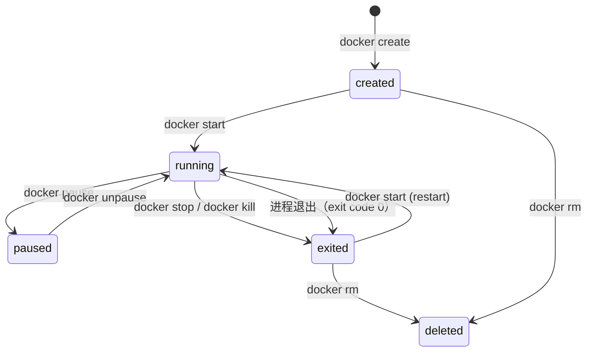

## 二、Docker深度解析

上一节我们从Linux内核层面理解了容器的本质——Namespace、Cgroups和UnionFS。Docker正是将这三者封装成了一套完整的工具链，让"构建、分发、运行"容器变得标准化。本节将深入Docker的技术栈，从引擎架构到镜像构建，从存储机制到网络模型，建立对Docker的系统性认知。

---

### 2.1 Docker引擎架构

Docker并非一个单一程序，而是一个分层架构。理解其组件边界，是排查问题和优化性能的前提。

#### 整体架构

┌──────────────────────────────────────────────────────────────┐
│                     Docker Client                            │
│              (docker CLI / Docker API)                       │
└──────────────────────┬───────────────────────────────────────┘
                       │ REST API (unix socket / TCP)
                       ▼
┌──────────────────────────────────────────────────────────────┐
│                    Docker Daemon (dockerd)                    │
│   ┌─────────────┐  ┌──────────────┐  ┌──────────────────┐  │
│   │ 镜像管理     │  │ 网络管理     │  │ 卷管理           │  │
│   │ Image Mgmt  │  │ Network Mgmt │  │ Volume Mgmt      │  │
│   └──────┬──────┘  └──────┬───────┘  └────────┬─────────┘  │
│          └────────┬───────┴───────────────┬────┘            │
│                   ▼                       ▼                  │
│          ┌─────────────────┐     ┌────────────────┐         │
│          │   containerd    │     │  BuildKit      │         │
│          │  (容器运行时)    │     │  (镜像构建)    │         │
│          └────────┬────────┘     └────────────────┘         │
│                   │ gRPC                                   │
│                   ▼                                         │
│          ┌─────────────────┐                                │
│          │   containerd-shim│                               │
│          │  (进程监护)      │                                │
│          └────────┬────────┘                                │
│                   │                                         │
└───────────────────┼─────────────────────────────────────────┘
                    │
                    ▼
         ┌──────────────────┐
         │       runc        │
         │  (OCI运行时)      │
         └────────┬─────────┘
                  │ clone() + namespaces + cgroups
                  ▼
         ┌──────────────────┐
         │   容器进程        │
         └──────────────────┘

**各组件职责**：

| 组件 | 职责 | 通信方式 |
|------|------|----------|
| **Docker Client** | 接收用户命令，转换为API调用 | REST over unix socket |
| **dockerd** | 镜像管理、网络编排、卷管理、API路由 | 内部模块 |
| **containerd** | 容器生命周期管理（pull/create/start/stop/delete） | gRPC |
| **containerd-shim** | 容器进程的直接监护者，解耦containerd与容器进程 | stdin/stdout管道 |
| **runc** | 创建OCI兼容容器（调用namespace/cgroup系统调用） | exec方式启动 |

**为什么需要shim？** 这是Docker架构中容易被忽略的设计。shim进程有两个关键作用：

1. **解耦重启**：dockerd或containerd升级/崩溃时，容器进程不受影响。shim作为孤儿进程被systemd接管，容器持续运行。这在生产环境中至关重要——升级Docker引擎不需要重启所有容器。
2. **回收标准输出**：shim负责读取容器的stdout/stderr并写入日志驱动，防止管道阻塞导致容器hang住。如果管道无人消费，容器的write()调用会阻塞，导致进程假死。

```bash
# 验证shim进程
docker exec -it web sh -c 'cat /proc/1/status | head -3'
# Name:   nginx
# State:  running (sleeping)

# 在宿主机上查看shim进程
ps aux | grep containerd-shim
# containerd-shim-runc-v2 -namespace moby -id <container_id>
```

#### containerd vs dockerd的边界

Docker 1.12之后引入containerd，将容器运行时从dockerd中分离。这带来了标准容器生态：

- **dockerd**：面向开发者，提供易用的CLI和高级功能（Docker Compose、Docker Swarm、BuildKit）
- **containerd**：面向运维，Kubernetes可以直接使用containerd作为CRI（Container Runtime Interface），跳过dockerd

```bash
# Kubernetes使用containerd的场景
# /var/lib/kubelet/config.yaml
containerRuntimeEndpoint: unix:///run/containerd/containerd.sock
```

这意味着同一台机器上，Docker和Kubernetes可以共存但走不同的运行时通道。

```bash
# 验证系统中运行的容器运行时
docker info | grep -i runtime
# Runtimes: io.containerd.runc.v2 runc

# 查看containerd管理的所有容器
crictl ps
# CONTAINER    IMAGE          STATE
# abc123       nginx:1.25     Running
```

#### OCI标准与运行时规范

Docker容器遵循OCI（Open Container Initiative）规范，这使得不同运行时可以互换：

- **runtime-spec**：定义容器运行时行为（如何创建、启动、停止容器）
- **image-spec**：定义镜像格式（层的组织、配置结构）
- **distribution-spec**：定义镜像分发协议（Registry API）

除了runc，还有其他OCI兼容运行时：

| 运行时 | 定位 | 特点 |
|--------|------|------|
| **runc** | Docker默认运行时 | 通用，功能完整 |
| **crun** | 高性能运行时 | C语言实现，启动速度比runc快约50% |
| **gVisor (runsc)** | 沙箱运行时 | 用户态内核，提供额外隔离层 |
| **Kata Containers** | 轻量虚拟机 | 每个容器运行在独立微VM中 |
| **youki** | Rust实现 | 安全性好，内存安全 |

```bash
# 指定使用crun作为运行时（需要预安装crun）
docker run --runtime=crun nginx

# 在Kubernetes中配置runtimeClass
# runtimeClassName: gvisor
```

---

### 2.2 Docker镜像构建原理

#### 构建上下文（Build Context）

执行`docker build`时，Docker CLI将当前目录（或指定路径）的文件打包发送给Docker daemon，这个目录就是构建上下文。理解这一点对构建性能至关重要。

```bash
# 构建上下文的发送过程（verbose模式查看）
docker build --progress=plain -t myapp . 2>&amp;1 | head -3
# Sending build context to Docker daemon  45.2MB
# 这45.2MB需要通过socket传输给daemon，包含.git/、node_modules/等不需要的文件

# 排除无关文件可以显著加速构建
# .dockerignore（类似.gitignore）
.git
.gitignore
node_modules
npm-debug.log*
dist
build
.env*
*.md
docker-compose*.yml
.github
.vscode
```

**构建上下文的关键理解**：Docker CLI和Docker daemon可以不在同一台机器上（通过TCP连接）。CLI将构建上下文打包成tar流发送给daemon，daemon在其中执行Dockerfile指令。这就是为什么`COPY . .`不能访问上下文之外的文件——daemon看不到宿主机的文件系统。

```bash
# 远程构建场景（CLI在笔记本，daemon在服务器）
docker -H tcp://build-server:2375 build -t myapp .
# 构建上下文通过网络传输，排除大文件更加重要
```

#### Dockerfile指令与镜像层

Dockerfile中的每一条指令（除元数据指令外）都会创建一个新的只读层（layer）。理解层的生成机制是优化构建速度和镜像大小的基础。

```dockerfile
# 层的生成过程
FROM ubuntu:22.04          # 层1：基础文件系统（~77MB）
RUN apt-get update         # 层2：包索引变更（~25MB）
RUN apt-get install -y nginx  # 层3：nginx二进制+依赖（~30MB）
COPY nginx.conf /etc/nginx/   # 层4：配置文件（~1KB）
EXPOSE 80                 # 元数据，不创建层
CMD ["nginx", "-g", "daemon off;"]  # 元数据，不创建层
```

**元数据指令（不创建层）**：`EXPOSE`、`CMD`、`ENTRYPOINT`、`ENV`、`LABEL`、`USER`、`WORKDIR`、`ARG`——这些指令修改的是镜像的JSON配置，不影响文件系统层。

**实际层数验证**：

```bash
# 查看镜像的层信息
docker history myapp:v1
# IMAGE          CREATED         CREATED BY                                      SIZE
# <missing>      2 minutes ago  CMD ["nginx" "-g" "daemon off;"]                0B
# <missing>      2 minutes ago  EXPOSE 80                                       0B
# <missing>      2 minutes ago  COPY nginx.conf /etc/nginx/                     1KB
# <missing>      5 minutes ago  RUN /bin/sh -c apt-get install -y nginx         30.2MB
# <missing>      5 minutes ago  RUN /bin/sh -c apt-get update                   25.1MB
# <missing>      3 weeks ago    /bin/sh -c #(nop) ADD file:... in /             77.4MB
```

**层的共享机制**：多个镜像可以共享相同的基础层。如果100个镜像都基于`ubuntu:22.04`，磁盘上只存储一份基础层。这就是为什么小基础镜像（alpine、distroless）能显著节省存储空间。

```bash
# 查看本地所有层及其共享情况
docker system df -v
# REPOSITORY    TAG     IMAGE ID       CREATED       SIZE
# myapp         v1      abc123         2 hours ago   135MB
# myapp         v2      def456         1 hour ago    136MB
#
# 这两个镜像共享前3层，只有第4层不同
```

#### 构建缓存机制

Docker按层顺序检查缓存。一旦某一层失效，其后所有层都会重新构建（cache miss cascade）。这是Dockerfile编写中最需要理解的行为模式。

```bash
# 第一次构建
docker build -t myapp:v1 .
# => [1/5] FROM ubuntu:22.04                         0.0s (cached)
# => [2/5] RUN apt-get update                         10.5s
# => [3/5] RUN apt-get install -y nginx               45.2s
# => [4/5] COPY nginx.conf /etc/nginx/                0.1s
# => [5/5] CMD ["nginx", "-g", "daemon off;"]          0.0s

# 修改nginx.conf后重新构建
docker build -t myapp:v2 .
# => [1/5] FROM ubuntu:22.04                         0.0s (cached)
# => [2/5] RUN apt-get update                         0.0s (cached) ← 缓存命中
# => [3/5] RUN apt-get install -y nginx               0.0s (cached) ← 缓存命中
# => [4/5] COPY nginx.conf /etc/nginx/                0.1s ← 重建！
# => [5/5] CMD ["nginx", "-g", "daemon off;"]          0.0s ← 重建！
```

**缓存失效的常见陷阱**：

| 指令 | 缓存条件 | 陷阱场景 | 解决方案 |
|------|----------|----------|----------|
| `COPY . .` | 文件内容hash变化 | 源码变更导致依赖安装层也失效 | 先COPY依赖文件，后COPY源码 |
| `RUN apt-get update` | 上一次执行的命令 | 经常被跳过导致包索引过期 | 和install合并为一条RUN |
| `ARG` | 值变化 | `ARG VERSION=1.0` 改动使后续层全部失效 | 将ARG放在不影响缓存的位置 |
| `ADD/COPY` | 指令文件列表的hash | 改动任一文件导致层重建 | 按变化频率分层COPY |

**进阶：使用`--no-cache`和`--cache-from`精确控制缓存**：

```bash
# 强制忽略所有缓存（用于CI发布构建）
docker build --no-cache -t myapp:release .

# 从远程缓存拉取（CI/CD场景）
docker build --cache-from registry/myapp:cache -t myapp .
```

#### BuildKit与构建优化

Docker 18.09+默认使用BuildKit构建引擎，相比传统引擎有显著提升：

```bash
# 启用BuildKit（默认已启用）
DOCKER_BUILDKIT=1 docker build -t myapp .
```

**BuildKit特性对照**：

| 特性 | 传统引擎 | BuildKit |
|------|----------|----------|
| 并行构建 | 不支持 | 自动识别无依赖层并行 |
| 缓存导入/导出 | 仅本地 | 支持远程缓存（registry/local/gcs） |
| Secret挂载 | 不支持 | `--mount=type=secret` 安全注入 |
| SSH挂载 | 不支持 | `--mount=type=ssh` 转发SSH agent |
| 多阶段构建缓存 | 仅当前阶段 | 跨阶段缓存共享 |
| 构建输出 | 串行日志 | 交互式进度条 |
| 错误恢复 | 从头开始 | 从断点继续（缓存复用） |

```dockerfile
# BuildKit Secret挂载：构建时访问私钥/Token但不写入镜像层
# --mount=type=secret不会出现在镜像层中，不会泄露
FROM python:3.12-slim
RUN --mount=type=secret,id=pip_conf,target=/etc/pip.conf \
    pip install --no-cache-dir -r requirements.txt
# 构建命令：docker build --secret id=pip_conf,src=$HOME/.pip/pip.conf .

# BuildKit SSH挂载：构建时访问私有Git仓库
RUN --mount=type=ssh \
    git clone git@github.com:private/repo.git /app
# 构建命令：docker build --ssh default=$SSH_AUTH_SOCK .
```

```dockerfile
# 利用BuildKit远程缓存加速CI/CD
# 开发机构建
docker build --cache-from type=registry,ref=myregistry/myapp:cache \
  -t myapp .

# CI服务器推送缓存
docker build --cache-to type=registry,ref=myregistry/myapp:cache,mode=max \
  -t myapp .
# mode=max：导出所有层的缓存（包括中间阶段）
# mode=min（默认）：只导出最终阶段的缓存
```

#### Buildx：多平台构建

Docker Buildx是BuildKit的前端扩展，支持构建多平台镜像（同时生成linux/amd64和linux/arm64版本）。

```bash
# 创建支持多平台的构建器
docker buildx create --name multiarch --driver docker-container --use
docker buildx inspect --bootstrap

# 构建并推送多平台镜像（通过QEMU模拟）
docker buildx build \
  --platform linux/amd64,linux/arm64 \
  -t myregistry/myapp:latest \
  --push .
# 一次构建生成两个架构的镜像，推送到Registry
# 生成的manifest list自动路由到对应架构

# 查看远程镜像的平台支持
docker manifest inspect myregistry/myapp:latest
# [
#   {"platform": {"architecture": "amd64", "os": "linux"}},
#   {"platform": {"architecture": "arm64", "os": "linux"}}
# ]
```

**多平台构建的性能考量**：QEMU模拟比原生构建慢5-10倍。生产环境中，推荐使用远程构建器（如GitHub Actions的`docker/build-push-action`）在对应架构的原生机器上分别构建，再合并为manifest list。

---

### 2.3 多阶段构建与镜像瘦身

多阶段构建是减小镜像体积的核心手段。其原理是利用多个`FROM`指令创建多个阶段，最终镜像只包含最后一个阶段的文件系统。

#### Go应用：从1.2GB到8MB

```dockerfile
# 阶段1：编译环境（~800MB）
FROM golang:1.21 AS builder
WORKDIR /app
COPY go.* ./
RUN go mod download
COPY . .
RUN CGO_ENABLED=0 GOOS=linux go build -ldflags="-s -w" -o /server .

# 阶段2：运行环境（~7MB）
FROM scratch
COPY --from=builder /server /server
COPY --from=builder /etc/ssl/certs/ca-certificates.crt /etc/ssl/certs/
EXPOSE 8080
ENTRYPOINT ["/server"]
```

**镜像大小对比**：

| 构建方式 | 基础镜像 | 编译工具 | 最终大小 | 攻击面 |
|----------|----------|----------|----------|--------|
| 单阶段golang:1.21 | 1.2GB | gcc/make/源码 | ~1.2GB | 极大 |
| 多阶段+alpine | 7MB | 无 | ~15MB | 较小 |
| 多阶段+scratch | 0MB | 无 | ~8MB | 最小 |

**Go构建参数优化**：

```bash
# -ldflags="-s -w"：去除符号表和调试信息，减少~30%体积
# CGO_ENABLED=0：纯静态链接，不依赖libc
# GOOS=linux：交叉编译为Linux（可在macOS/Windows上构建Linux镜像）
```

#### Java应用：分层瘦身

```dockerfile
FROM eclipse-temurin:21-jdk AS builder
WORKDIR /app
COPY gradle/ gradle/
COPY gradlew build.gradle settings.gradle ./
RUN ./gradlew dependencies --no-daemon
COPY src/ src/
RUN ./gradlew bootJar --no-daemon

# 运行时只保留JRE，不包含JDK
FROM eclipse-temurin:21-jre
COPY --from=builder /app/build/libs/app.jar /app/app.jar
RUN addgroup --system spring &amp;&amp; adduser --system --ingroup spring spring
USER spring:spring
EXPOSE 8080
ENTRYPOINT ["java", "-jar", "/app/app.jar"]
```

**Java镜像优化的关键点**：
- JDK（~300MB）→ JRE（~200MB），减少编译工具
- 使用`spring`用户而非root运行
- 多阶段构建分离依赖下载（利用缓存）

#### 前端应用：Node + Nginx

```dockerfile
# 阶段1：构建前端资源
FROM node:20-alpine AS builder
WORKDIR /app
COPY package.json package-lock.json ./
RUN npm ci --production=false
COPY . .
RUN npm run build

# 阶段2：仅保留静态文件
FROM nginx:alpine
COPY --from=builder /app/dist /usr/share/nginx/html
COPY nginx.conf /etc/nginx/nginx.conf
EXPOSE 80
```

**前端镜像优化的关键点**：
- `npm ci`比`npm install`更快且可复现（严格按lockfile安装）
- `--production=false`安装devDependencies（构建需要）
- 运行时只保留Nginx + 静态文件，Node.js完全移除

#### scratch镜像的限制

`scratch`是Docker的空镜像，不包含任何文件。适合静态链接的Go/Rust二进制，但有以下限制：

- 无shell：调试困难，`docker exec -it container sh`会失败
- 无ca-certificates：HTTPS请求失败
- 无timezone数据：时区转换异常
- 解决方案：从builder阶段复制所需文件

```dockerfile
# 解决scratch的常见问题
FROM scratch
COPY --from=builder /server /server
COPY --from=builder /etc/ssl/certs/ /etc/ssl/certs/           # CA证书
COPY --from=builder /usr/share/zoneinfo/ /usr/share/zoneinfo/  # 时区数据
ENV TZ=Asia/Shanghai
```

**替代scratch的最小镜像**：

| 镜像 | 大小 | 包含内容 | 适用场景 |
|------|------|----------|----------|
| scratch | 0MB | 什么都没有 | 纯静态二进制 |
| gcr.io/distroless/static | ~2MB | CA证书、时区、passwd | 静态二进制（推荐替代scratch） |
| gcr.io/distroless/base | ~20MB | glibc、SSL、CA | 需要libc的动态链接二进制 |
| alpine:3.19 | ~7MB | busybox、apk包管理器 | 需要shell调试 |

#### 镜像层合并与压缩

```bash
# 使用docker-squash合并多层为一层（减小镜像体积，加速拉取）
pip install docker-squash
docker-squash -t myapp:squashed myapp:latest

# 使用BuildKit导出压缩格式
# OCI tar格式（比Docker格式更通用）
docker build --output type=oci,dest=myapp.tar .
```

---

### 2.4 Docker存储机制

容器运行时产生的数据需要持久化存储。Docker提供多种存储方案，各自适用于不同场景。

#### 存储类型对比

| 类型 | 命令 | 数据位置 | 生命周期 | 性能 |
|------|------|----------|----------|------|
| **可写层** | 默认 | `/var/lib/docker/overlay2/` | 容器删除即丢失 | 最慢（CoW） |
| **volume** | `-v mydata:/data` | `/var/lib/docker/volumes/` | 独立于容器 | 最快（原生IO） |
| **bind mount** | `-v /host/path:/container/path` | 宿主机指定路径 | 依赖宿主机 | 接近原生 |
| **tmpfs** | `--tmpfs /tmp` | 内存 | 容器删除即丢失 | 极快（纯内存） |

#### 可写层的性能问题

Docker使用Copy-on-Write（CoW）策略：当容器需要修改只读层的文件时，Docker会将该文件完整复制到可写层再修改。对于大量小文件写入的场景（如数据库、编译缓存），这个开销非常显著。

```bash
# 测试CoW性能影响
# 创建容器并写入大量小文件
docker run --rm -v /data/test:/test alpine sh -c '
  time for i in $(seq 1 10000); do echo "file$i" > /tmp/test_$i.txt; done
'
# 输出：real  0m2.3s（可写层，CoW开销）

docker run --rm -v /data/test:/data alpine sh -c '
  time for i in $(seq 1 10000); do echo "file$i" > /data/test_$i.txt; done
'
# 输出：real  0m0.8s（volume直接写入，快3倍）
```

**实践建议**：写密集型应用（数据库、日志收集、编译缓存）务必使用volume或bind mount，避免可写层的CoW性能惩罚。

#### overlay2存储驱动详解

overlay2是Docker默认的存储驱动，它利用UnionFS的overlay机制将多层只读层和一个可写层合并为统一视图：

宿主机文件系统结构：
/var/lib/docker/overlay2/
├── l/                           # 符号链接目录（加速层引用）
│   ├── 3G   → ../diff1/link    # 各层的短标识
│   ├── K4   → ../diff2/link
│   └── ...
├── <diff1-id>/                  # 层1的内容
│   ├── diff/                    # 该层的文件变更
│   └── link                     # 短标识符
├── <diff2-id>/                  # 层2的内容
│   ├── diff/
│   ├── lower                    # 指向下层的路径
│   └── link
└── <container-id>/              # 容器的可写层
    ├── diff/                    # 容器运行时的文件变更
    ├── lower                    # 指向所有只读层
    ├── merged/                  # 合并后的统一视图（容器实际使用的文件系统）
    └── work/                    # overlay2内部使用的工作目录

```bash
# 查看容器实际使用的存储驱动和层信息
docker info | grep "Storage Driver"
# Storage Driver: overlay2

# 查看某个容器的overlay2详细信息
docker inspect <container_id> | jq '.[0].GraphDriver'
# {
#   "Data": {
#     "LowerDir": "/var/lib/docker/overlay2/xxx/diff:/var/lib/docker/overlay2/yyy/diff",
#     "MergedDir": "/var/lib/docker/overlay2/zzz/merged",
#     "UpperDir": "/var/lib/docker/overlay2/zzz/diff",
#     "WorkDir": "/var/lib/docker/overlay2/zzz/work"
#   },
#   "Name": "overlay2"
# }
```

#### Volume管理

```bash
# 创建命名volume
docker volume create mydata

# 查看volume详情
docker volume inspect mydata
# {
#     "Mountpoint": "/var/lib/docker/volumes/mydata/_data",
#     "Driver": "local",
#     "Labels": {},
#     "Scope": "local"
# }

# 使用volume启动容器
docker run -d --name mysql \
  -v mydata:/var/lib/mysql \
  -e MYSQL_ROOT_PASSWORD=secret \
  mysql:8.0

# 备份volume数据
docker run --rm -v mydata:/source -v /backup:/backup alpine \
  tar czf /backup/mydata-backup.tar.gz -C /source .

# 恢复volume数据
docker run --rm -v mydata:/target -v /backup:/backup alpine \
  tar xzf /backup/mydata-backup.tar.gz -C /target
```

**Volume类型与外部存储驱动**：

| 驱动 | 数据位置 | 适用场景 |
|------|----------|----------|
| local（默认） | 本机磁盘 | 单机部署 |
| local (NFS) | NFS共享目录 | 多主机共享 |
| local (CIFS) | SMB/CIFS共享 | Windows文件共享 |
| azure | Azure File Storage | Azure环境 |
| cloudstor | AWS EBS / DigitalOcean | 云环境 |
| rex-ray | 多云存储 | 跨云统一存储 |

```bash
# 创建NFS volume
docker volume create --driver local \
  --opt type=nfs \
  --opt o=addr=192.168.1.100,rw \
  --opt device=:/exports/shared \
  nfsshare

# 使用NFS volume
docker run -d -v nfsshare:/data myapp
```

#### 绑定挂载的权限问题

bind mount最常见的问题是宿主机与容器的用户ID不匹配：

```bash
# 宿主机用户UID=1000，容器内进程以root(UID=0)运行
docker run -v ./app:/app myapp
# 容器内创建的文件owner是root:root
# 宿主机上ls -la显示为root

# 解决方案1：指定用户运行
docker run --user $(id -u):$(id -g) -v ./app:/app myapp

# 解决方案2：Dockerfile中创建匹配UID的用户
FROM node:20-alpine
RUN addgroup -g 1000 appgroup &amp;&amp; adduser -u 1000 -G appgroup -s /bin/sh -D appuser
USER appuser
```

#### 数据管理最佳实践

```bash
# 查看Docker磁盘使用情况
docker system df
# TYPE          TOTAL     ACTIVE    SIZE      RECLAIMABLE
# Images        15        5         3.2GB     2.1GB (65%)
# Containers    8         3         120MB     85MB (70%)
# Local Volumes 12        5         1.5GB     800MB (53%)
# Build Cache   50        0         2.8GB     2.8GB (100%)

# 清理未使用的资源
docker system prune          # 删除停止的容器、未使用的网络、悬空镜像
docker system prune -a       # 额外删除所有未使用的镜像（慎用）
docker volume prune          # 删除未被任何容器使用的volume
docker builder prune         # 清理构建缓存
docker builder prune --all   # 清理所有构建缓存

# 只清理特定时间之前的资源
docker system prune --filter "until=72h"   # 清理72小时前的资源
```

---

### 2.5 容器网络模型

Docker的网络架构基于libnetwork库，通过驱动插件化实现不同的网络方案。

#### 五种网络驱动详解

| 驱动 | 隔离级别 | 通信方式 | 性能开销 | 适用场景 |
|------|----------|----------|----------|----------|
| **bridge** | 单机容器间 | 虚拟网桥 + iptables NAT | ~5-10% | 单机多容器默认方案 |
| **host** | 无隔离 | 共享宿主机网络栈 | 0% | 高性能网络应用 |
| **none** | 完全隔离 | 无网络 | - | 安全敏感/批处理任务 |
| **overlay** | 跨主机 | VXLAN隧道封装 | ~10-15% | Docker Swarm集群 |
| **macvlan** | 独立MAC | 直接接入物理网络 | ~0% | 需要独立IP的遗留应用 |

#### Bridge网络工作原理

```bash
# Docker默认bridge网络
docker network inspect bridge
# "IPAM": {
#     "Config": [{"Subnet": "172.17.0.0/16", "Gateway": "172.17.0.1"}]
# }

# 容器加入bridge网络后获得IP
docker run -d --name web nginx
docker inspect web | grep IPAddress
# "IPAddress": "172.17.0.2"

# 容器间通信通过iptables规则转发
iptables -t nat -L DOCKER -n
# DNAT  tcp  --  0.0.0.0/0  0.0.0.0/0  tcp dpt:32768 to:172.17.0.2:80
```

**Bridge网络的底层数据包流向**：

容器A → veth pair → docker0网桥 → iptables规则 → veth pair → 容器B
         ↑                         ↑                         ↑
    容器A的网卡              NAT/过滤在这里发生            容器B的网卡

```bash
# 查看容器的veth pair
docker exec web ip link show
# 1: lo: <LOOPBACK,UP,LOWER_UP>
# 15: eth0@if16: <BROADCAST,MULTICAST,UP,LOWER_UP>    ← 这就是veth pair
#     link/ether 02:42:ac:11:00:02

# 在宿主机上找到对应的veth接口
ip link show | grep veth
# 16: veth3f2a1b2@if15: <BROADCAST,MULTICAST,UP,LOWER_UP>
```

**默认bridge的限制**：容器间只能通过IP通信，不能通过容器名解析。自定义bridge网络解决了这个问题：

```bash
# 创建自定义bridge网络
docker network create --driver bridge \
  --subnet 172.20.0.0/16 \
  --gateway 172.20.0.1 \
  --opt com.docker.network.bridge.name=docker-br0 \
  mynetwork

# 容器加入自定义网络后，支持DNS自动解析
docker run -d --network mynetwork --name web nginx
docker run -d --network mynetwork --name app myapp
# app容器内可以直接 ping web 或 curl http://web
# Docker内置DNS服务器(127.0.0.11)负责解析
```

#### 端口映射底层机制

`docker run -p 8080:80`实际在宿主机上创建了两条iptables规则：

```bash
# 查看端口映射的iptables规则
iptables -t nat -L -n | grep 8080
# DNAT  tcp  --  0.0.0.0/0  0.0.0.0/0  tcp dpt:8080 to:172.17.0.2:80
# MASQUERADE  tcp  --  172.17.0.0/16  0.0.0.0/0  tcp dpt:80

# 完整流量路径
# 客户端 → 192.168.1.100:8080
# → iptables DNAT → 172.17.0.2:80
# → 容器内nginx处理
# → 响应通过MASQUERADE返回客户端
```

**端口映射的高级选项**：

```bash
# 只绑定127.0.0.1（只允许本机访问）
docker run -p 127.0.0.1:8080:80 nginx

# 绑定到特定网卡IP
docker run -p 192.168.1.100:8080:80 nginx

# 随机分配宿主机端口
docker run -p 80 nginx
# docker inspect 查看分配的端口

# 映射UDP端口
docker run -p 5353:53/udp dns-server

# 同时映射TCP和UDP
docker run -p 5353:53/tcp -p 5353:53/udp dns-server
```

#### 自定义网络的DNS机制

Docker在自定义网络中启动内置DNS服务器（127.0.0.11），为容器提供名称解析：

```bash
# 验证DNS解析
docker run --network mynetwork --rm alpine nslookup web
# Name:      web
# Address 1: 172.20.0.2

# 查看DNS配置
docker run --network mynetwork --rm alpine cat /etc/resolv.conf
# nameserver 127.0.0.11
# options ndots:0
```

#### 跨网络通信

一个容器可以同时加入多个网络，实现网络隔离的同时保持必要连通性：

```bash
# web服务同时在frontend和backend网络
docker run -d --network frontend --name web nginx
docker network connect backend web

# app只能访问backend
docker run -d --network backend --name app myapp
# app可以访问web（同在backend网络）
# 但外部用户只能通过frontend访问web

# 查看容器的多网络配置
docker inspect web | jq '.[0].NetworkSettings.Networks'
# {
#   "frontend": {"IPAddress": "172.21.0.2"},
#   "backend": {"IPAddress": "172.22.0.3"}
# }
```

#### 网络故障排查

```bash
# 进入容器网络命名空间排查
docker exec -it web sh
ping -c 3 web              # 测试DNS解析和连通性
nslookup db                # 测试DNS解析
curl -v http://db:5432     # 测试HTTP连通性

# 从宿主机排查
docker network inspect mynetwork    # 查看网络配置
docker exec web ip addr             # 查看容器IP
docker exec web ip route            # 查看容器路由表
iptables -t nat -L -n              # 查看NAT规则

# 使用抓包工具分析网络问题
docker run --rm --net container:web nicolaka/netshoot tcpdump -i eth0 port 80
# nicolaka/netshoot是一个网络调试工具镜像，包含tcpdump/iperf/nmap等工具
```

---

### 2.6 容器日志与调试

#### 日志驱动

Docker支持多种日志驱动，控制容器stdout/stderr的输出方式：

| 驱动 | 输出目标 | 适用场景 | 特点 |
|------|----------|----------|------|
| **json-file** | 本地JSON文件（默认） | 开发环境 | 支持`docker logs`查看 |
| **syslog** | 系统日志 | 传统日志收集 | 需要syslog服务器 |
| **journald** | systemd日志 | systemd集成环境 | 与journalctl集成 |
| **fluentd** | Fluentd采集器 | 集中式日志架构 | 需要Fluentd服务 |
| **awslogs** | AWS CloudWatch | AWS环境 | 自动上传到CloudWatch |
| **none** | 无输出 | 不需要日志 | 高性能场景 |

```bash
# 查看容器日志
docker logs web
docker logs -f web          # 实时跟踪
docker logs --tail 100 web  # 最后100行
docker logs --since 1h web  # 最近1小时
docker logs --since 2024-01-01T00:00:00 web  # 指定时间之后

# 配置日志轮转（防止磁盘占满）
docker run -d \
  --log-driver json-file \
  --log-opt max-size=10m \
  --log-opt max-file=3 \
  nginx
# 最多保留3个日志文件，每个最大10MB，总计不超过30MB
```

**日志轮转配置陷阱**：`max-file`在Docker 18.06之前的行为是保留N-1个文件，18.06+改为保留N个文件。升级Docker后需注意此行为变化。

**日志文件的物理位置**：

```bash
# json-file驱动的日志实际存储在
ls /var/lib/docker/containers/<container-id>/
# <container-id>-json.log    # 日志文件
# config.json               # 容器配置
# ...

# 查看日志文件大小
du -sh /var/lib/docker/containers/*/*-json.log

# 不配置日志轮转时，日志文件会无限增长，可能撑爆磁盘！
```

#### docker events：实时监控系统事件

`docker events`是Docker内置的事件流，可以实时监控容器生命周期变化：

```bash
# 监听所有事件
docker events

# 只监听容器事件
docker events --filter 'type=container'

# 监听特定容器的事件
docker events --filter 'container=web'

# 只监听特定事件类型
docker events --filter 'event=start'
docker events --filter 'event=stop,die,kill'

# 输出格式化
docker events --format '{{.Time}} {{.Type}} {{.Action}} {{.Actor.Attributes.name}}'
# 1719420000 container start web
# 1719420010 container die web

# 时间范围过滤
docker events --since 2024-01-01 --until 2024-01-02
```

#### docker system：系统维护

```bash
# 磁盘使用概览
docker system df
# TYPE          TOTAL     ACTIVE    SIZE      RECLAIMABLE
# Images        15        5         3.2GB     2.1GB (65%)
# Containers    8         3         120MB     85MB (70%)
# Local Volumes 12        5         1.5GB     800MB (53%)
# Build Cache   50        0         2.8GB     2.8GB (100%)

# 详细磁盘使用
docker system df -v

# 分层清理
docker container prune      # 删除停止的容器
docker image prune          # 删除悬空镜像（dangling images）
docker image prune -a       # 删除所有未使用的镜像
docker volume prune         # 删除未使用的volume
docker network prune        # 删除未使用的网络
docker builder prune        # 删除构建缓存
```

#### 容器调试技巧

```bash
# 查看容器的详细信息
docker inspect web
docker inspect --format='{{.State.Status}}' web
docker inspect --format='{{.NetworkSettings.IPAddress}}' web
docker inspect --format='{{.Mounts}}' web

# 查看容器的资源使用
docker stats web
# CONTAINER   CPU %   MEM USAGE / LIMIT   MEM %   NET I/O
# web         0.05%   15.2MiB / 128MiB    11.88%  1.2kB / 648B

# 查看容器进程
docker top web
# UID    PID    PPID   C  STIME  TTY  TIME      CMD
# root   12345  12300  0  14:30  ?    00:00:00  nginx: master process

# 查看容器文件系统变更
docker diff web
# C /var/log/nginx/        （Changed）
# A /tmp/nginx.pid          （Added）

# 进入容器调试
docker exec -it web sh
docker exec -it web cat /etc/nginx/nginx.conf
docker exec -it web nginx -t  # 测试配置

# 从容器复制文件到宿主机
docker cp web:/var/log/nginx/error.log ./error.log
```

#### 临时调试容器

当目标容器没有shell（如scratch镜像构建的应用）时，可以使用sidecar模式调试：

```bash
# 使用共享网络命名空间的调试容器
docker run -it --rm --network container:web alpine sh
# 此容器与web共享网络栈
# 可以用wget/nc/curl测试web容器的端口

# 使用共享PID命名空间
docker run -it --rm --pid container:web alpine sh
# 可以用ps看到web容器内的进程

# 同时共享网络和PID（最全面的调试模式）
docker run -it --rm --network container:web --pid container:web alpine sh
```

#### 容器崩溃排查流程

```bash
# 1. 查看容器退出原因
docker inspect web | jq '.[0].State'
# {
#   "Status": "exited",
#   "ExitCode": 1,
#   "Error": "",
#   "StartedAt": "2024-01-01T00:00:00Z",
#   "FinishedAt": "2024-01-01T00:05:00Z"
# }
# ExitCode=137 表示被OOM Kill
# ExitCode=139 表示段错误(Segfault)
# ExitCode=143 表示收到SIGTERM后优雅退出

# 2. 查看日志中的错误信息
docker logs --tail 50 web 2>&amp;1

# 3. 查看容器退出前的最后状态
docker inspect web | jq '.[0].State.OOMKilled'
# true 表示因内存不足被终止

# 4. 使用debug模式运行（添加调试标签重新构建）
docker run -it --rm --entrypoint sh myapp:debug
```

---

### 2.7 Docker Compose：多容器编排

Docker Compose是定义和运行多容器应用的工具，通过YAML文件描述服务拓扑。

#### Compose文件结构

```yaml
# docker-compose.yml
version: "3.8"

services:
  web:
    build:
      context: .
      dockerfile: Dockerfile
    ports:
      - "8080:80"
    environment:
      - DB_HOST=db
      - DB_PORT=5432
    depends_on:
      db:
        condition: service_healthy
    networks:
      - frontend
      - backend
    deploy:
      resources:
        limits:
          cpus: "0.5"
          memory: 256M
        reservations:
          cpus: "0.25"
          memory: 128M

  db:
    image: postgres:15-alpine
    volumes:
      - pgdata:/var/lib/postgresql/data
    environment:
      POSTGRES_DB: myapp
      POSTGRES_PASSWORD: ${DB_PASSWORD}
    healthcheck:
      test: ["CMD-SHELL", "pg_isready -U postgres"]
      interval: 5s
      timeout: 3s
      retries: 5
    networks:
      - backend

  redis:
    image: redis:7-alpine
    command: redis-server --maxmemory 128mb --maxmemory-policy allkeys-lru
    networks:
      - backend

volumes:
  pgdata:

networks:
  frontend:
  backend:
    driver: bridge
```

#### 环境变量管理

Compose支持多种方式注入环境变量，优先级从高到低：

```bash
# 1. Shell环境变量（最高优先级）
export DB_PASSWORD=secret123
docker compose up -d

# 2. .env文件（项目目录下）
# .env
DB_PASSWORD=secret123
APP_ENV=production
# docker-compose.yml中使用 ${DB_PASSWORD}

# 3. env_file（指定文件）
# docker-compose.yml
services:
  web:
    env_file:
      - .env
      - ./secrets.env

# 4. environment字段（最低优先级）
services:
  web:
    environment:
      - DB_PASSWORD=${DB_PASSWORD}
```

**环境变量的陷阱**：`environment`中的值是字符串，数字和布尔值需要用引号包裹：

```yaml
# 错误：会被解析为整数
environment:
  - PORT=8080
  - DEBUG=true

# 正确：明确指定字符串类型
environment:
  - PORT=8080
  - DEBUG=true
```

#### Compose Profiles与服务选择

```yaml
# 使用profiles按场景选择性启动服务
services:
  web:
    image: nginx
    # 无profiles，始终启动

  debug:
    image: nicolaka/netshoot
    profiles: ["debug"]   # 只在指定debug profile时启动
    command: sleep infinity

  monitor:
    image: prom/prometheus
    profiles: ["monitor", "debug"]  # 多个profile

# 启动命令
docker compose up -d                    # 只启动web
docker compose --profile debug up -d    # 启动web + debug
docker compose --profile monitor up -d  # 启动web + monitor
docker compose --profile debug --profile monitor up -d  # 全部启动
```

#### Compose的depends_on与健康检查

`depends_on`默认只保证启动顺序，不保证服务就绪。结合`healthcheck`才能实现真正的依赖等待：

```yaml
services:
  web:
    depends_on:
      db:
        condition: service_healthy    # 等待db健康检查通过
      redis:
        condition: service_started    # 只需redis启动即可

  db:
    healthcheck:
      test: ["CMD-SHELL", "pg_isready -U postgres"]
      interval: 5s
      timeout: 3s
      retries: 5
      start_period: 10s    # 给postgres 10秒启动时间
```

**healthcheck的最佳实践**：

```yaml
# Web服务健康检查
healthcheck:
  test: ["CMD", "curl", "-f", "http://localhost:8080/health"]
  interval: 10s
  timeout: 5s
  retries: 3
  start_period: 30s     # 启动后30秒内不计入失败次数

# 数据库健康检查
healthcheck:
  test: ["CMD-SHELL", "pg_isready -U postgres &amp;&amp; psql -U postgres -c 'SELECT 1'"]
  interval: 5s
  timeout: 3s
  retries: 5
  start_period: 15s

# 自定义健康检查脚本
healthcheck:
  test: ["CMD", "/bin/sh", "-c", "curl -sf http://localhost:8080/ready || exit 1"]
  interval: 15s
  timeout: 10s
  retries: 3
  start_period: 60s
  start_interval: 2s    # Docker 25.0+：启动期间的检查间隔（比start_period期间的interval更频繁）
```

#### 常用命令

```bash
# 启动所有服务
docker compose up -d

# 查看服务状态
docker compose ps

# 查看日志
docker compose logs -f web
docker compose logs --tail 50

# 扩缩容
docker compose up -d --scale web=3

# 重建镜像并启动
docker compose up -d --build

# 停止并清理
docker compose down           # 停止容器，保留volume
docker compose down -v        # 停止容器，删除volume
docker compose down --rmi all  # 停止容器，删除镜像和volume

# 只构建不启动
docker compose build

# 执行一次性命令
docker compose run --rm web python manage.py migrate

# 查看资源使用
docker compose top
docker compose stats
```

---

### 2.8 Docker安全加固

容器安全是一个多层防护体系，从镜像构建到运行时配置都需要关注。

#### 镜像安全扫描

```bash
# 扫描镜像漏洞
docker scout cves myapp:latest
# 输出CVE编号、严重等级、修复建议

# 使用Trivy扫描（更通用）
trivy image myapp:latest
# myapp:latest (debian 12.4)
# Total: 156 (UNKNOWN: 0, LOW: 80, MEDIUM: 55, HIGH: 18, CRITICAL: 3)

# CI/CD集成：漏洞阈值检查
trivy image --exit-code 1 --severity HIGH,CRITICAL myapp:latest
# 发现HIGH或CRITICAL级别漏洞时返回非零退出码，阻止部署
```

**漏洞严重等级的含义**：

| 等级 | CVSS分数 | 响应时间 | 示例 |
|------|----------|----------|------|
| CRITICAL | 9.0-10.0 | 立即修复 | 远程代码执行、认证绕过 |
| HIGH | 7.0-8.9 | 24小时内 | 本地提权、敏感信息泄露 |
| MEDIUM | 4.0-6.9 | 7天内 | 跨站脚本、信息泄露 |
| LOW | 0.1-3.9 | 30天内 | 低影响的信息泄露 |

#### 安全构建原则

```dockerfile
# 1. 使用最小基础镜像
FROM alpine:3.19           # 7MB vs ubuntu:22.04 的 77MB

# 2. 不以root运行
RUN addgroup -g 1001 app &amp;&amp; adduser -u 1001 -G app -s /bin/sh -D app
USER app

# 3. 不安装不必要的包
RUN apk add --no-cache ca-certificates  # 只装必须的

# 4. 清理构建缓存
RUN apk add --no-cache gcc musl-dev &amp;&amp; \
    go build -o /server . &amp;&amp; \
    apk del gcc musl-dev  # 编译完删除工具链

# 5. 固定依赖版本
FROM python:3.12.4-slim   # 而非 python:3.12-slim

# 6. 使用非root用户运行（Dockerfile最佳实践）
# 使用distroless镜像，不包含shell和包管理器
FROM gcr.io/distroless/static:nonroot
USER nonroot:nonroot
```

#### 运行时安全

```bash
# 限制容器能力
docker run --cap-drop ALL --cap-add NET_BIND_SERVICE nginx
# 只保留绑定低端口的能力

# 只读文件系统
docker run --read-only --tmpfs /tmp nginx
# 只有/tmp可写（tmpfs挂载）

# 禁止提权
docker run --security-opt no-new-privileges:true nginx

# 使用seccomp配置文件
docker run --security-opt seccomp=custom-profile.json nginx

# 使用AppArmor配置文件
docker run --security-opt apparmor=docker-nginx nginx

# 资源限制
docker run -d \
  --memory 512m \
  --memory-swap 512m \      # 禁用swap（等于memory值）
  --cpus 1.5 \              # 限制为1.5核
  --pids-limit 200 \        # 最多200个进程
  --ulimit nofile=1024:2048 \  # 文件描述符限制
  nginx
```

**Linux Capabilities详解**：Linux将传统root权限拆分为多个独立的能力（capability），Docker默认赋予容器以下能力：

| 能力 | 作用 | 风险 | 建议 |
|------|------|------|------|
| CAP_NET_BIND_SERVICE | 绑定1024以下端口 | 低 | 可保留 |
| CAP_NET_RAW | 使用原始套接字（ping） | 中 | 可选 |
| CAP_SYS_ADMIN | 系统管理（挂载、网络配置等） | 极高 | 应移除 |
| CAP_SYS_PTRACE | 调试其他进程 | 高 | 应移除 |
| CAP_DAC_OVERRIDE | 绕过文件权限检查 | 高 | 应移除 |
| CAP_SETUID / CAP_SETGID | 切换用户ID | 中 | 可选 |

```bash
# 最小化能力集
docker run --cap-drop ALL --cap-add NET_BIND_SERVICE --cap-add CHOWN nginx

# 查看容器实际拥有的能力
docker inspect web | jq '.[0].HostConfig.CapAdd'
# ["NET_BIND_SERVICE"]
```

#### Docker守护进程安全

```json
// /etc/docker/daemon.json 安全配置
{
  "icc": false,                    // 禁止容器间直接通信（需通过网络）
  "userns-remap": "default",      // 启用用户命名空间隔离
  "no-new-privileges": true,      // 全局禁止提权
  "live-restore": true,           // dockerd重启时容器不中断
  "userland-proxy": false,        // 禁用用户态代理（用iptables替代）
  "log-driver": "json-file",
  "log-opts": {
    "max-size": "10m",
    "max-file": "3"
  }
}
```

**用户命名空间（User Namespace）隔离**的效果：

```bash
# 容器内root(UID=0)映射到宿主机UID=100000
# 容器内进程实际以非特权用户运行
cat /proc/self/uid_map
#          0     100000      65536

# 即使容器被攻破，攻击者也无法获得宿主机root权限
```

#### 镜像签名与供应链安全

```bash
# Docker Content Trust（DCT）提供镜像签名验证
export DOCKER_CONTENT_TRUST=1

# 推送时自动签名
docker push registry.example.com/myapp:v1.0
# 签名通过Notary服务完成

# 拉取时自动验证签名
docker pull registry.example.com/myapp:v1.0
# 未签名镜像会被拒绝

# 使用SBOM（Software Bill of Materials）生成软件物料清单
docker sbom myapp:latest
# 列出镜像中所有软件包及其版本
```

---

### 2.9 Docker性能调优

#### 镜像构建加速

```bash
# 1. 使用.dockerignore排除无关文件
# .dockerignore
.git
node_modules
*.md
docker-compose*.yml
.env*

# 2. 合并RUN指令减少层数
# 差：3层
RUN apt-get update
RUN apt-get install -y gcc
RUN apt-get clean

# 好：1层，减少镜像体积
RUN apt-get update &amp;&amp; \
    apt-get install -y --no-install-recommends gcc &amp;&amp; \
    apt-get clean &amp;&amp; \
    rm -rf /var/lib/apt/lists/*

# 3. 利用缓存：先复制依赖文件，再复制源码
COPY package.json package-lock.json ./
RUN npm ci --production
COPY . .                  # 源码变更不会影响npm ci的缓存
```

#### 容器运行时调优

```bash
# 1. 使用overlay2存储驱动（默认且最优）
# /etc/docker/daemon.json
{"storage-driver": "overlay2"}

# 2. 日志驱动选择
# 生产环境使用local驱动（压缩存储）
docker run -d --log-driver=local nginx

# 3. 内存限制与OOM
docker run -d \
  --memory 512m \
  --oom-kill-disable \     # 禁止OOM Kill（谨慎使用）
  --oom-score-adj -500 \   # 降低被OOM Kill的优先级
  myapp

# 4. CPU亲和性（绑核）
docker run -d --cpuset-cpus="0,1" nginx  # 只使用CPU 0和1
docker run -d --cpuset-cpus="0-3" nginx  # 使用CPU 0到3

# 5. 文件描述符和进程数限制
docker run -d \
  --ulimit nofile=65536:65536 \   # 打开文件数限制
  --ulimit nproc=65536 \          # 进程数限制
  --ulimit memlock=-1:-1 \        # 内存锁定（数据库常用）
  myapp
```

#### 守护进程性能配置

```json
// /etc/docker/daemon.json 性能优化配置
{
  "storage-driver": "overlay2",
  "max-concurrent-downloads": 10,     // 最大并发下载数
  "max-concurrent-uploads": 5,        // 最大并发上传数
  "max-download-attempts": 5,         // 下载重试次数
  "default-shm-size": "128M",         // 默认共享内存大小
  "default-ulimits": {
    "nofile": { "Name": "nofile", "Hard": 65536, "Soft": 65536 }
  },
  "log-driver": "local",
  "log-opts": {
    "max-size": "10m",
    "max-file": "3"
  }
}
```

---

### 2.10 容器生命周期管理

理解容器的状态转换，是正确操作容器的基础。

#### 状态机



#### 重启策略（Restart Policy）

重启策略决定了容器退出后Docker是否自动重启它。生产环境中这是保障服务可用性的关键配置。

| 策略 | 行为 | 适用场景 |
|------|------|----------|
| `no` | 不自动重启（默认） | 一次性任务 |
| `on-failure[:max]` | 非零退出码时重启，可限制次数 | 短暂故障可恢复的场景 |
| `always` | 始终重启，包括daemon启动时 | 无状态服务（推荐） |
| `unless-stopped` | 始终重启，但手动停止后不重启 | 有状态服务 |

```bash
# 使用重启策略
docker run -d --restart=always --name web nginx
# 即使web崩溃，Docker也会自动重启它

# 限制重启次数（5次以内）
docker run -d --restart=on-failure:5 --name web nginx

# 手动停止后不再重启
docker run -d --restart=unless-stopped --name web nginx
# 手动docker stop web后，daemon重启时也不会自动启动web

# 注意：restart策略只在容器退出时生效
# 如果是docker stop手动停止，策略不会触发重启（unless-stopped例外）
```

#### 容器优雅关闭

```bash
# docker stop 的完整流程：
# 1. 发送 SIGTERM 给容器内 PID 1 进程
# 2. 等待 grace period（默认10秒）
# 3. 如果进程仍在运行，发送 SIGKILL 强制终止

# 自定义优雅关闭时间
docker stop -t 30 web    # 等待30秒后再发SIGKILL

# 应用端处理SIGTERM的示例（Go）
# signal.Notify(stopChan, syscall.SIGTERM)
# <-stopChan
# server.Shutdown(ctx)  // 优雅关闭HTTP服务器
# close(doneChan)
```

**优雅关闭的最佳实践**：

```dockerfile
# Dockerfile中使用exec格式的CMD/ENTRYPOINT
# exec格式：信号直接发送给进程（正确）
ENTRYPOINT ["nginx", "-g", "daemon off;"]

# shell格式：信号发送给shell，需要转发给子进程（可能丢失信号）
ENTRYPOINT nginx -g "daemon off;"
```

#### 状态机完整操作

```bash
# 容器生命周期操作
docker create --name web nginx       # 创建但不启动
docker start web                      # 启动已停止的容器
docker stop web                       # SIGTERM → 10s → SIGKILL
docker stop -t 30 web                 # 等待30秒后SIGKILL
docker restart web                    # stop + start
docker pause web                      # 暂停（冻结进程，SIGSTOP）
docker unpause web                    # 恢复（SIGCONT）
docker kill web                       # 直接发SIGKILL（或指定信号）
docker kill -s SIGUSR1 web            # 发送自定义信号（如nginx重新加载配置）
docker rm web                         # 删除已停止的容器
docker rm -f web                      # 强制删除运行中的容器
docker update --memory 1g web         # 更新资源限制（不重启）
```

**stop vs kill的区别**：`docker stop`先发SIGTERM，给容器10秒优雅关闭时间，超时后发SIGKILL强制终止。`docker kill`直接发SIGKILL（或指定信号），容器立即终止。生产环境应确保应用能正确处理SIGTERM信号。

---

### 2.11 Docker镜像分发与仓库

#### 镜像命名规则

[registry-host[:port]/][namespace/]repository[:tag|@digest]

示例：
docker.io/library/nginx:1.25           # 官方镜像，完整域名docker.io
ghcr.io/owner/app:latest               # GitHub Container Registry
registry.cn-hangzhou.aliyuncs.com/myapp:v1.0  # 阿里云私有仓库

#### 镜像推送与拉取

```bash
# 标记镜像
docker tag myapp:latest registry.example.com/myapp:v1.0

# 登录仓库
docker login registry.example.com

# 推送镜像
docker push registry.example.com/myapp:v1.0

# 拉取镜像（指定平台）
docker pull --platform linux/arm64 nginx:1.25

# 使用摘要拉取（不可变版本，比tag更安全）
docker pull nginx@sha256:abc123...
```

#### 私有Registry搭建

```bash
# 使用Docker官方registry镜像快速搭建
docker run -d -p 5000:5000 \
  -v /data/registry:/var/lib/registry \
  --restart=always \
  --name registry \
  registry:2

# 标记并推送镜像
docker tag myapp:latest localhost:5000/myapp:v1.0
docker push localhost:5000/myapp:v1.0

# 从私有Registry拉取
docker pull localhost:5000/myapp:v1.0

# 为私有Registry启用HTTPS（生产必须）
# 使用自签名证书
mkdir -p certs
openssl req -newkey rsa:4096 -nodes -sha256 \
  -keyout certs/registry.key -x509 -days 365 \
  -out certs/registry.crt \
  -subj "/CN=registry.example.com"

docker run -d -p 443:443 \
  -v /data/registry:/var/lib/registry \
  -v $(pwd)/certs:/certs \
  -e REGISTRY_HTTP_ADDR=0.0.0.0:443 \
  -e REGISTRY_HTTP_TLS_CERTIFICATE=/certs/registry.crt \
  -e REGISTRY_HTTP_TLS_KEY=/certs/registry.key \
  --restart=always \
  --name registry \
  registry:2
```

#### 镜像版本管理最佳实践

```bash
# 使用语义化版本标签
docker tag myapp:latest myregistry/myapp:1.2.3
docker tag myapp:latest myregistry/myapp:1.2
docker tag myapp:latest myregistry/myapp:1
docker tag myapp:latest myregistry/myapp:latest

# 使用Git SHA作为版本标签（CI/CD推荐）
SHORT_SHA=$(git rev-parse --short HEAD)
docker tag myapp:latest myregistry/myapp:${SHORT_SHA}

# 使用日期时间标签
docker tag myapp:latest myregistry/myapp:$(date +%Y%m%d-%H%M%S)

# 镜像版本清理策略
# 保留最近10个版本，删除更早的
docker images myregistry/myapp --format "{{.Tag}} {{.CreatedAt}}" | \
  sort -k2 -r | tail -n +11 | \
  awk '{print $1}' | \
  xargs -I {} docker rmi myregistry/myapp:{}
```

#### 镜像分发的安全机制

Docker Content Trust（DCT）提供镜像签名验证：

```bash
# 启用DCT
export DOCKER_CONTENT_TRUST=1

# 推送时自动签名
docker push registry.example.com/myapp:v1.0
# 签名通过Notary服务完成

# 拉取时自动验证签名
docker pull registry.example.com/myapp:v1.0
# 未签名镜像会被拒绝
```

---

### 本节小结

Docker的技术栈可以分为三个层次理解：

| 层次 | 组件 | 核心职责 |
|------|------|----------|
| **构建层** | Dockerfile + BuildKit + Buildx | 定义镜像内容，优化构建缓存，多平台构建 |
| **分发层** | Registry + 镜像签名 + 标签管理 | 标准化打包与安全传输 |
| **运行层** | containerd + runc + shim | 容器生命周期管理与资源隔离 |

掌握这三层的关系，才能在实际工作中做出正确的技术选择——什么时候该优化Dockerfile，什么时候该调整存储驱动，什么时候需要升级运行时。下一节将在此基础上，讲解Kubernetes如何将单机容器编排扩展为分布式集群。
