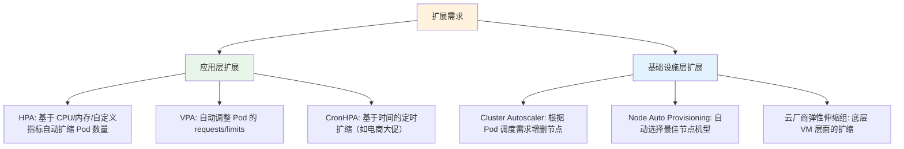
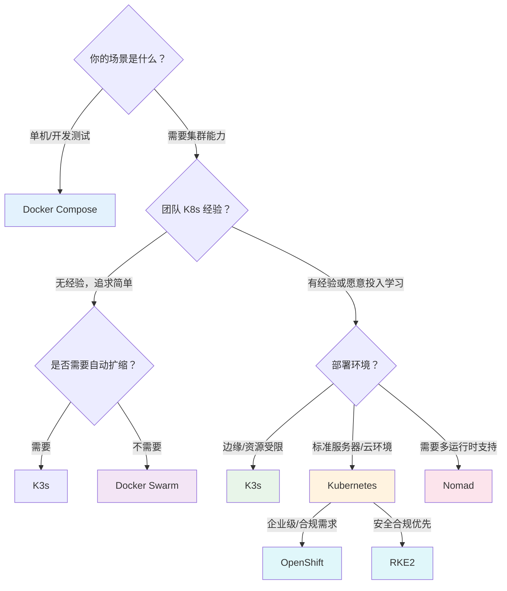

## 关键指标与编排选型

> "技术选型不是选最先进的，而是选最匹配的。" —— 容器编排领域的一条铁律

经过前三节的学习，我们已经掌握了容器的内核原理（Namespace、Cgroups、UnionFS）、Docker 的镜像构建与网络模型、Kubernetes 的控制平面架构与调度机制。这些是"道"和"法"的层面——知道原理、理解机制。而本节要回答的是最后一个关键问题：**面对真实业务场景，如何在多种编排方案中做出合理的技术选型？**

选型不是拍脑袋决策。它需要两个支柱：**评估指标体系**（用什么标准衡量）和**方案能力图谱**（各个方案能提供什么）。本节将从这两个维度展开，最终给出一套可操作的决策框架。

---

### 核心评估指标体系

选择容器编排方案时，不能只看"功能多不多"，而要围绕**六个核心维度**进行系统评估。这六个维度构成了一个完整的性能、可靠性与成本评估框架：

| 维度 | 含义 | 为什么重要 | 量化方法 |
|------|------|-----------|----------|
| **延迟（Latency）** | 请求从发出到收到响应的时间 | 直接影响用户体验和 SLA 达成 | P50/P95/P99 延迟分布，关注长尾 |
| **吞吐量（Throughput）** | 单位时间内系统能处理的请求数 | 决定系统能否扛住业务峰值 | QPS/RPS 压测结果，注意与延迟的权衡 |
| **可用性（Availability）** | 系统正常运行时间占总时间的比例 | 99.9%（8.76小时/年宕机）vs 99.99%（52分钟/年）差距巨大 | MTBF（平均故障间隔）/ MTTR（平均恢复时间） |
| **一致性（Consistency）** | 数据在分布式节点间保持一致的程度 | 强一致影响性能，弱一致可能丢数据 | CAP 定理框架下的选择：CP 还是 AP |
| **可扩展性（Scalability）** | 系统通过增加资源来提升处理能力的能力 | 业务增长时能否平滑扩容 | 水平扩展的线性度：加 2 倍资源是否接近 2 倍性能 |
| **安全性（Security）** | 编排系统提供的隔离、认证、授权和审计能力 | 容器逃逸、供应链攻击、权限失控等风险的防线 | 漏洞扫描覆盖率、RBAC 策略粒度、运行时检测能力 |

> **为什么从"四"变成了"六"？** 早期业界讨论常聚焦于延迟、吞吐、可用性、可扩展性四个"性能指标"，但在生产环境中，**一致性**和**安全性**同样是编排选型的决定性因素。CAP 定理决定了你的故障模式，安全能力决定了你的合规边界。本节以六个维度作为完整的评估框架。

---

#### 延迟：被忽视的关键指标

很多团队只关注 QPS（吞吐量），忽略延迟。但在实际业务中，延迟才是用户体验的第一杀手：

- **电商场景**：P99 延迟超过 3 秒，用户流失率增加 30%。Amazon 的内部研究显示，每增加 100ms 延迟，销售额下降 1%
- **支付场景**：延迟波动导致超时重试，可能引发重复扣款。金融级系统的 P99 延迟要求通常在 50ms 以内
- **API 网关**：上游延迟波动会像多米诺骨牌一样传播到整个调用链。一个下游服务的延迟飙升，会导致所有依赖它的服务排队等待，线程池耗尽，最终引发级联故障

**容器编排系统引入的额外延迟**：容器化并非零成本。每个请求经过的网络跳数（Pod → Service → Ingress → 外部）都会增加延迟：

# 容器网络路径与延迟示例
Client → Ingress Controller (~0.5ms) → Service Proxy (~0.3ms) → Pod (~0.2ms) → App
                                                    ↑
                                          kube-proxy iptables/IPVS 规则

典型数据参考：
- **kube-proxy iptables 模式**：每条规则约增加 0.05ms，规则数量超过 5000 条后性能显著下降
- **kube-proxy IPVS 模式**：O(1) 复杂度，万级规则下延迟仍稳定在 0.1ms 以内
- **Istio sidecar**：Envoy 代理会增加约 0.5-1ms 延迟（首次请求因 TLS 握手可能达 5-10ms）
- **Cilium eBPF**：绕过 iptables，内核态直接处理，延迟与裸机网络接近

**各编排方案的延迟特性对比**：

| 方案 | 网络开销 | 调度延迟 | 典型额外延迟 | 优化手段 |
|------|---------|---------|-------------|---------|
| Docker Compose | 极低（同主机 bridge 网络） | 无调度 | < 0.1ms | N/A |
| Docker Swarm | 低（overlay 网络） | 秒级 | 0.2-0.5ms | 优化 Routing Mesh |
| Kubernetes（iptables） | 中等 | 秒级 | 0.3-1ms | 切换 IPVS 模式 |
| Kubernetes（Cilium eBPF） | 极低 | 秒级 | < 0.1ms | 启用 eBPF host routing |
| K3s（内置 Traefik） | 低 | 秒级 | 0.2-0.5ms | 精简中间件栈 |
| Nomad（bridge 网络） | 低 | 秒级 | 0.1-0.3ms | 减少网络跳数 |

**如何测量容器环境的延迟**：

```bash
# 使用 k6 进行延迟压测
k6 run --out prometheus http://grafana-agent:9090/api/v1/write \
  --vus 100 --duration 60s \
  -e TARGET_URL=http://my-service.default.svc:8080/api/orders

# 关键延迟指标关注点
# P50: 一般用户体感
# P95: 边缘用户体验
# P99: SLA 合规的关键阈值
# P999: 需要特别关注的长尾异常
```

应用层面埋点（以 Go 为例）：

```go
// Prometheus Histogram 埋点
prometheus.NewHistogram(prometheus.HistogramOpts{
    Name:    "http_request_duration_seconds",
    Buckets: []float64{0.001, 0.005, 0.01, 0.025, 0.05, 0.1, 0.25, 0.5, 1, 2.5, 5},
})
```

**延迟与吞吐量的权衡**：这两个指标往往存在矛盾关系——提高吞吐量（增加并发）通常会增加延迟。在容器编排场景中，需要找到两者的最佳平衡点：


实践中的判断标准：如果 P99 延迟超过目标值的 2 倍，说明系统已接近过载临界点，需要优先扩容而非继续加压。

---

#### 吞吐量：不只是 QPS

吞吐量的衡量不能只看请求数（QPS/RPS），还需要考虑请求的复杂度：

| 业务类型 | 吞吐量指标 | 参考量级 | 说明 |
|---------|-----------|---------|------|
| 简单 CRUD API | QPS（每秒请求数） | 10K-100K QPS | 单个请求处理轻量 |
| 复杂数据处理 | TPS（每秒事务数） | 1K-10K TPS | 涉及多表操作/外部调用 |
| 流式处理 | EPS（每秒事件数） | 100K-1M EPS | 日志/消息/IoT 数据 |
| 批量计算 | Jobs/min | 视任务大小 | 大数据 ETL/ML 训练 |

**各方案的吞吐量特征**：

- **Docker Compose**：单机性能最优，无编排层开销，适合对吞吐量要求极高的单机场景
- **Docker Swarm**：overlay 网络在跨主机通信时有 5%-15% 的吞吐量损耗
- **Kubernetes**：Service 负载均衡引入一定开销，但在大规模场景下通过 IPVS/Cilium 可保持高效
- **K3s**：轻量化设计使其在边缘设备上也能维持较高吞吐
- **Nomad**：非 Kubernetes 生态，网络开销取决于所选网络模式

容器编排系统本身的开销也会影响有效吞吐量。在 Kubernetes 中，每个 Pod 的启动时间（从调度到 Ready）通常在 5-30 秒，这意味着 HPA 的扩容响应存在固有延迟——对于突发流量，需要结合预热策略（如提前扩容、Pod 预热池）来弥补。

**吞吐量优化的编排层手段**：

```yaml
# HPA 基于自定义指标扩缩（如 QPS）
apiVersion: autoscaling/v2
kind: HorizontalPodAutoscaler
metadata:
  name: web-hpa
spec:
  scaleTargetRef:
    apiVersion: apps/v1
    kind: Deployment
    name: web
  minReplicas: 3
  maxReplicas: 100
  behavior:
    scaleUp:
      stabilizationWindowSeconds: 30    # 快速扩容
      policies:
      - type: Pods
        value: 10
        periodSeconds: 60
    scaleDown:
      stabilizationWindowSeconds: 300   # 缓慢缩容
      policies:
      - type: Percent
        value: 10
        periodSeconds: 60
  metrics:
  - type: Resource
    resource:
      name: cpu
      target:
        type: Utilization
        averageUtilization: 70
  - type: Pods
    pods:
      metric:
        name: http_requests_per_second
      target:
        type: AverageValue
        averageValue: "1000"
```

---

#### 可用性：从 99.9% 到 99.999% 的代价

可用性是业务连续性的基石，但提升可用性的边际成本呈指数增长：

| 可用性等级 | 年宕机时间 | 典型实现 | 成本倍数 | 典型业务场景 |
|-----------|-----------|---------|---------|------------|
| 99.9%（三个九） | 8 小时 45 分 | 单集群 + 自动重启 | 1x | 内部工具、开发测试环境 |
| 99.95% | 4 小时 22 分 | 主备 + 健康检查 | 2-3x | 中小企业核心业务 |
| 99.99%（四个九） | 52 分钟 | 多可用区 + 自动故障转移 | 5-10x | 电商、金融交易 |
| 99.999%（五个九） | 5 分钟 | 多地域 + 全自动运维 | 10-50x | 支付清算、医疗系统 |

**成本拆解分析**：从三个九到四个九，可用性提升不到 1%，但成本可能翻 5-10 倍。这个成本主要来自：

1. **基础设施冗余**：需要至少 2 个可用区（AZ），每个 AZ 独立供电、网络、冷却
2. **数据同步成本**：跨 AZ 数据复制的带宽和延迟开销
3. **运维复杂度**：需要自动化故障检测和切换机制，监控覆盖率要求从 80% 提升到 99%+
4. **人员成本**：7×24 on-call 团队、定期故障演练、SRE 团队建设

**选型时的可用性决策原则**：选型必须结合业务实际需求，避免过度设计。一个简单的判断标准：

- 服务每分钟宕机损失 < 100 元 → 三个九足够
- 服务每分钟宕机损失 100-1000 元 → 四个九
- 服务每分钟宕机损失 > 1000 元 → 需要评估五个九的必要性

**各编排方案的可用性能力差异**：

| 方案 | 单点故障风险 | 跨主机恢复 | 跨 AZ 能力 | 多地域能力 |
|------|------------|-----------|-----------|-----------|
| Docker Compose | 主机级（主机挂=服务挂） | ✗ | ✗ | ✗ |
| Docker Swarm | Manager 节点（3节点 Raft） | ✓ | 有限 | ✗ |
| Kubernetes | etcd 集群（3-5节点） | ✓ | ✓（拓扑感知调度） | ✓（多集群联邦） |
| K3s | 嵌入式 SQLite 单点（可换外部 etcd） | ✓（外部 etcd 时） | ✓（外部 etcd 时） | ✓ |
| Nomad | Server 集群（3-5节点） | ✓ | ✓ | ✓ |

**关键差异解读**：Docker Compose 无法跨主机故障恢复——主机宕机意味着所有服务中断。Kubernetes 通过 Pod 自动重调度、节点故障自动驱逐、多 AZ 拓扑感知调度，提供了最完整的高可用能力链。K3s 的嵌入式 SQLite 是一把双刃剑：单节点模式下它是单点故障，但如果配置外部 etcd 集群，可获得与标准 K8s 相当的可用性。

---

#### 一致性：CAP 定理在编排中的体现

CAP 定理指出：分布式系统不可能同时满足一致性（Consistency）、可用性（Availability）、分区容错性（Partition tolerance）三者，最多只能满足其中两个。在容器编排场景中，这个定理的具体体现是：

| 编排组件 | CAP 倾斜 | 说明 |
|---------|---------|------|
| **etcd**（K8s 数据存储） | CP | Raft 协议保证强一致，网络分区时少数派不可用 |
| **Docker Swarm Raft** | CP | 与 etcd 类似，Manager 节点间 Raft 共识 |
| **Consul**（Nomad 服务发现） | CP（可调） | 默认强一致，支持调低为 AP 模式 |
| **DNS 服务发现** | AP | DNS 天然弱一致，TTL 缓存导致服务列表可能过时 |
| **K3s 嵌入式 SQLite** | 单节点强一致 | 无分布式一致性保障，故障即丢失调度状态 |

**实际影响**：当 Kubernetes 的 etcd 集群出现网络分区时，少数派的 API Server 无法写入新状态，已有的 Pod 调度不受影响，但新的调度请求会失败。这意味着编排系统的 CAP 选择直接影响业务的故障模式——理解这一点对于设计高可用架构至关重要。

**CAP 选型的实践指导**：

- **编排元数据（etcd/Raft）**：必须选 CP。编排系统的"大脑"不能出现数据不一致，否则会出现"脑裂"——两个 Scheduler 同时调度同一个 Pod
- **服务发现**：根据业务容忍度选择。金融系统倾向于 CP（Consul），互联网应用可以接受 AP（DNS + 健康检查补偿）
- **应用数据**：不在编排系统管辖范围内，但编排系统应支持对接不同一致性的存储后端（CP 的 PostgreSQL、AP 的 Cassandra）

---

#### 可扩展性：水平扩展的真相

可扩展性不只是"加机器就行"。评估可扩展性需要关注三个子维度：

1. **线性扩展度**：加 N 倍资源，性能是否接近 N 倍？实际系统中，由于锁竞争、数据倾斜、网络开销等因素，线性度通常在 70%-90%
2. **扩展速度**：从触发扩容到新实例就绪的时间。Kubernetes HPA 默认冷却期 5 分钟，Cluster Autoscaler 新节点启动需 2-5 分钟
3. **扩展上限**：系统能管理的最大规模。Kubernetes 官方建议单集群不超过 5000 节点/150000 Pod



**各方案的扩展能力对比**：

| 方案 | 应用层自动扩缩 | 节点层自动扩缩 | 最大集群规模 | 扩展响应时间 |
|------|-------------|-------------|------------|------------|
| Docker Compose | ✗ | ✗ | 1 台主机 | 手动 |
| Docker Swarm | ✗（需外部工具） | ✗ | 数十台 | 手动 |
| Kubernetes | ✓（HPA/VPA） | ✓（Cluster Autoscaler） | 5000 节点/150K Pod | 2-5 分钟 |
| K3s | ✓（完整 HPA） | ✓（需外部集成） | 数百节点 | 1-3 分钟 |
| Nomad | ✗（需外部集成） | ✗ | 数千节点 | 手动 |

---

#### 安全性：编排选型中被低估的维度

容器环境的安全挑战与传统 VM 环境截然不同。容器共享宿主机内核，攻击面更广，隔离边界更薄。编排系统的安全能力直接影响生产环境的风险敞口：

**安全能力分层**：

| 安全层级 | 关注点 | 各方案能力 |
|---------|-------|-----------|
| **镜像安全** | 漏洞扫描、签名验证、供应链安全 | 所有方案均需外部工具（Trivy、Cosign） |
| **运行时安全** | 容器逃逸防护、系统调用限制 | K8s: Seccomp/AppArmor/SELinux profile；Compose: 有限 |
| **网络安全** | 网络策略、微隔离、加密通信 | K8s: NetworkPolicy + Service Mesh；Swarm: 有限；Compose: 无 |
| **身份认证** | RBAC、ServiceAccount、证书管理 | K8s: 成熟的 RBAC 体系；Swarm: TLS 证书；Nomad: ACL |
| **审计合规** | 操作日志、策略执行、合规报告 | K8s: Audit Policy + OPA/Gatekeeper；其他方案：有限 |

**Kubernetes 安全加固示例**：

```yaml
# NetworkPolicy: 限制 Pod 间通信（零信任网络）
apiVersion: networking.k8s.io/v1
kind: NetworkPolicy
metadata:
  name: deny-all-ingress
spec:
  podSelector: {}
  policyTypes:
  - Ingress

---
# Pod Security Standards: 强制安全基线
apiVersion: v1
kind: Namespace
metadata:
  name: production
  labels:
    pod-security.kubernetes.io/enforce: restricted
    pod-security.kubernetes.io/audit: restricted
    pod-security.kubernetes.io/warn: restricted
```

**选型时的安全决策原则**：

- 合规要求严格的行业（金融、医疗、政务）：必须选择支持 RBAC、审计日志、策略引擎的方案（Kubernetes 或 OpenShift）
- 小型团队、内部工具：基本的 Docker Secrets + 镜像扫描即可满足需求
- 多租户场景：需要 Namespace 级别的资源隔离和权限控制，Kubernetes 是唯一成熟选择

---

### 主流编排方案深度对比

#### Docker Compose：单机场景的最佳选择

```yaml
# 典型的 docker-compose.yml（生产级配置）
version: '3.8'
services:
  web:
    image: nginx:1.25
    ports: ["80:80"]
    depends_on:
      app:
        condition: service_healthy
    deploy:
      resources:
        limits:
          cpus: '1.0'
          memory: 512M
    restart: unless-stopped
  app:
    image: myapp:v1
    environment:
      - DB_HOST=db
    depends_on:
      db:
        condition: service_healthy
    healthcheck:
      test: ["CMD", "curl", "-f", "http://localhost:8080/health"]
      interval: 10s
      timeout: 5s
      retries: 3
      start_period: 30s
  db:
    image: postgres:16
    volumes: [pgdata:/var/lib/postgresql/data]
    environment:
      POSTGRES_PASSWORD: secret
    healthcheck:
      test: ["CMD-SHELL", "pg_isready -U postgres"]
      interval: 5s
      timeout: 3s
      retries: 5
volumes:
  pgdata:
```

**适用场景**：本地开发、CI/CD 构建环境、单机部署的小型应用、技术验证（PoC）、个人项目

**优势**：
- 配置即文档：`docker-compose.yml` 就是服务架构的可执行描述
- 零学习成本：Docker 用户几乎无额外学习负担
- 快速启动：`docker compose up` 一条命令拉起完整环境
- 版本控制友好：YAML 文件可直接纳入 Git 管理

**局限性**：
- 无跨主机通信（需要额外配置 Docker Overlay 网络）
- 无自动故障恢复（进程崩溃后 Docker daemon 会重启，但主机故障无法恢复）
- 无滚动更新（`docker-compose up -d` 会导致短暂服务中断）
- 无服务发现（服务间通过容器名 DNS 解析，无健康检查路由）
- 无资源调度（所有容器共享主机资源，无法智能分配）

**什么时候不该用 Compose**：当你发现需要手动管理多个 `docker-compose.yml` 文件、需要编写复杂的部署脚本来协调更新顺序、或者需要在多台机器上保持一致的服务状态时，说明你的需求已经超出了 Compose 的能力边界。

---

#### Docker Swarm：简单集群的过渡方案

```bash
# 初始化 Swarm 集群
docker swarm init --advertise-addr 192.168.1.100

# 在其他节点加入
docker swarm join --token SWMTKN-1-xxx 192.168.1.100:2377

# 部署服务（带资源限制和健康检查）
docker service create \
  --replicas 3 \
  --name web \
  --limit-cpu 1.0 \
  --limit-memory 512M \
  --reserve-cpu 0.5 \
  --reserve-memory 256M \
  --health-cmd "curl -f http://localhost/health || exit 1" \
  --health-interval 10s \
  --update-parallelism 1 \
  --update-delay 30s \
  --restart-condition on-failure \
  nginx:1.25
```

**优势**：
- 与 Docker CLI 完全兼容，学习成本极低
- 部署命令极简，适合快速搭建测试集群
- 内置服务发现（基于 DNS）和负载均衡（Routing Mesh）
- 支持滚动更新和回滚
- 内置加密的节点间通信（TLS 双向认证）

**劣势**：
- Docker 公司已将开发重心转向 Docker Desktop 和 Docker Hub，Swarm 社区活跃度持续下降
- 缺少自动扩缩容能力（需要外部工具集成）
- 自定义调度策略能力有限（无法像 K8s 那样通过亲和性/污点精确控制 Pod 调度）
- 插件生态匮乏（没有类似 Helm 的包管理器、没有 Service Mesh 集成）
- 跨数据中心能力弱，不适合混合云场景

**Swarm 的合理定位**：如果你的团队在 3-10 人之间、服务数量不超过 20 个、不需要自动扩缩容、且不想投入学习 Kubernetes 的成本，Docker Swarm 仍然是一个务实的选择。它在"够用"和"易用"之间取得了不错的平衡。但要清醒认识到：Swarm 的生态正在萎缩，未来可获得的社区支持和第三方工具会越来越少。

---

#### Kubernetes：事实标准

```bash
# 用 kind 快速创建本地集群
kind create cluster --name dev

# 部署应用（完整的生产级配置）
kubectl create deployment web --image=nginx:1.25 --replicas=3
kubectl expose deployment web --port=80 --type=LoadBalancer
```

更推荐的方式——使用 YAML 声明式配置：

```yaml
apiVersion: apps/v1
kind: Deployment
metadata:
  name: web
spec:
  replicas: 3
  selector:
    matchLabels:
      app: web
  strategy:
    type: RollingUpdate
    rollingUpdate:
      maxSurge: 1
      maxUnavailable: 0
  template:
    metadata:
      labels:
        app: web
    spec:
      containers:
      - name: nginx
        image: nginx:1.25
        ports:
        - containerPort: 80
        resources:
          requests:
            cpu: "100m"
            memory: "128Mi"
          limits:
            cpu: "500m"
            memory: "256Mi"
        readinessProbe:
          httpGet:
            path: /healthz
            port: 80
          initialDelaySeconds: 5
          periodSeconds: 10
        livenessProbe:
          httpGet:
            path: /healthz
            port: 80
          initialDelaySeconds: 15
          periodSeconds: 20
```

**核心优势**：
- **声明式 API**：描述期望状态，系统自动协调。修改 YAML 后，Kubernetes 会自动将实际状态收敛到期望状态，这是控制论（Cybernetics）在基础设施领域的经典应用
- **丰富的生态系统**：Helm（包管理）、Istio（服务网格）、ArgoCD（GitOps）、Prometheus（监控）等数千个成熟工具
- **强大的调度能力**：亲和性/反亲和性（控制 Pod 分布）、污点与容忍（隔离特殊节点）、拓扑感知调度（跨 AZ 均衡）、Gang Scheduling（批量调度）
- **自动化运维**：滚动更新（zero-downtime deployment）、HPA/VPA 自动扩缩、自愈机制（Pod 崩溃自动重启、节点故障自动驱逐）
- **可扩展性**：CRD（自定义资源定义）+ Operator 模式，可以用 Kubernetes 管理几乎任何有状态系统（数据库、消息队列、机器学习训练任务）

**主要挑战**：
- **学习曲线陡峭**：核心概念超过 30 个（Pod、Deployment、StatefulSet、DaemonSet、Service、Ingress、ConfigMap、Secret、PV/PVC、RBAC、NetworkPolicy……），新手需要 3-6 个月才能熟练使用
- **运维复杂度高**：etcd 集群维护（备份、恢复、性能调优）、证书管理（kubeadm 证书一年过期）、版本升级策略（逐组件升级，兼容性矩阵）
- **资源开销不小**：控制平面组件（API Server、etcd、Controller Manager、Scheduler）本身需要 2-4GB 内存和 2-4 核 CPU
- **排查困难**：当出现 "Pod 处于 Pending 状态" 或 "Service 无法访问" 时，需要理解调度器、网络插件、存储 provisioner 等多个组件的交互

---

#### Nomad：轻量级替代方案

```hcl
# Nomad 任务定义（HCL 语法）
job "web" {
  datacenters = ["dc1"]
  
  # 更新策略
  update {
    max_parallel     = 1
    health_check     = "checks"
    min_healthy_time = "10s"
    healthy_deadline = "5m"
    auto_revert      = true
  }
  
  group "app" {
    count = 3
    
    # 服务发现（通过 Consul）
    service {
      name = "web"
      port = "http"
      
      check {
        type     = "http"
        path     = "/health"
        interval = "10s"
        timeout  = "3s"
      }
    }
    
    task "server" {
      driver = "docker"
      
      config {
        image = "nginx:1.25"
        ports = ["http"]
      }
      
      resources {
        cpu    = 500
        memory = 256
        
        network {
          port "http" {}
        }
      }
      
      # 服务模板（动态生成配置）
      template {
        data = "{{ key \"config/nginx.conf\" }}"
        destination = "local/nginx.conf"
      }
    }
  }
}
```

**适用场景**：
- 希望保持轻量、不想承担 Kubernetes 复杂度的团队
- 非 Kubernetes 生态的技术栈
- 多运行时需求：Nomad 原生支持 Docker、Java（JVM）、Exec（直接进程）、QEMU（虚拟机）、Podman 等 7 种任务驱动
- 需要调度传统非容器化应用的场景（如遗留的 Java 应用）
- 需要原生多数据中心调度的场景（Nomad 的 Federation 功能是其独特优势）

**局限性**：
- 社区规模远小于 Kubernetes（GitHub stars 约 14K vs K8s 的 110K+）
- 企业级功能生态不成熟（没有成熟的 Service Mesh、GitOps 工具链）
- 招聘市场上 Nomad 工程师稀缺，团队扩展困难
- 需要配合 Consul（服务发现）和 Vault（密钥管理）使用，增加了技术栈复杂度

---

#### K3s：边缘与轻量场景

```bash
# 一条命令安装完整 K8s 集群
curl -sfL https://get.k3s.io | sh -

# 查看集群状态
kubectl get nodes
# NAME     STATUS   ROLES                  AGE   VERSION
# master   Ready    control-plane,master   30s   v1.29.x+k3s1

# 部署应用（与标准 K8s 完全兼容）
kubectl apply -f deployment.yaml
```

**技术特性**：
- 单二进制文件约 70MB，对比标准 K8s 需要多个组件安装包
- 内存占用约 512MB（对比标准 K8s 控制平面约 2-4GB）
- 嵌入式 SQLite 替代 etcd（也可选外部 etcd 或 MySQL/PostgreSQL）
- 内置 Traefik 作为 Ingress Controller
- 完整的 Kubernetes API 兼容（通过 CNCF conformance 认证）

**适用场景**：边缘计算（CDN 节点、零售门店）、IoT 网关（工厂产线、智能设备集群）、开发测试环境（本地模拟生产集群）、资源受限的服务器（ARM 设备、树莓派集群）

**注意**：K3s 的轻量化是通过裁剪和替换实现的（SQLite 替代 etcd、内置组件替代独立部署），在大规模（500+ 节点）或对 etcd 性能有极高要求的场景下，标准 Kubernetes 仍是更稳妥的选择。

---

#### 其他值得关注的方案

| 方案 | 定位 | 适用场景 | 备注 |
|------|------|---------|------|
| **OpenShift** | 企业级 Kubernetes 平台 | 大型企业、需要完整 DevOps 工具链 | 基于 K8s 增强，商业支持，成本较高 |
| **RKE2** | 安全加固的 K8s 发行版 | 合规要求严格的行业（金融、政府） | Rancher 出品，CIS 基线默认合规 |
| **MicroK8s** | 开发者友好的 K8s | 个人开发、边缘 IoT | Canonical 出品，`snap install microk8s` |
| **K0s** | 零依赖 K8s | 极简部署、嵌入式系统 | 单二进制，无外部依赖 |
| **Docker Desktop K8s** | 桌面端 K8s | 本地开发调试 | 一键开启，资源占用约 2GB |
| **containerd + crictl** | 容器运行时（非编排） | 需要极致控制的场景 | K8s 默认运行时，需搭配其他编排工具 |

---

### 编排方案能力矩阵

下表从 14 个关键维度全面对比各方案的能力：

| 能力维度 | Docker Compose | Docker Swarm | Kubernetes | Nomad | K3s |
|---------|---------------|-------------|-----------|-------|-----|
| 跨主机部署 | ✗ | ✓ | ✓ | ✓ | ✓ |
| 自动故障恢复 | ✗ | ✓ | ✓ | ✓ | ✓ |
| 滚动更新 | ✗ | ✓ | ✓ | ✓ | ✓ |
| 自动扩缩容 | ✗ | ✗ | ✓（HPA/VPA） | ✗（需外部集成） | ✓（完整 HPA） |
| 服务发现 | 手动 | 内置 DNS | CoreDNS + Service | 内置 Consul 集成 | CoreDNS + Service |
| 负载均衡 | ✗ | 内置 | Service + Ingress | 内置 | Service + Ingress |
| 存储编排 | Volume | Volume | PV/PVC/StorageClass | CSI | PV/PVC/StorageClass |
| 密钥管理 | 环境变量 | Docker Secrets | Secret + Vault 集成 | Vault 集成 | Secret + Vault 集成 |
| 网络策略 | 无 | 有限 | NetworkPolicy | 有限 | NetworkPolicy |
| 多租户 | ✗ | ✗ | Namespace + RBAC | Namespace + ACL | Namespace + RBAC |
| 运行时安全 | 基础（seccomp） | 基础（seccomp） | 丰富（Pod Security Standards） | 基础 | 丰富（K8s 兼容） |
| GPU 支持 | 有限 | 有限 | ✓（device plugin） | 有限 | ✓（device plugin） |
| 云原生生态 | 有限 | 有限 | 极其丰富 | 有限 | 完整兼容 K8s 生态 |
| 运维复杂度 | 极低 | 低 | 高 | 中 | 低-中 |

**如何使用这张表**：不要试图找到"所有维度都最优"的方案——不存在。选型的核心是**识别你的核心需求，然后在次要维度上接受妥协**。例如：

- 如果你只需要跨主机部署和自动故障恢复，Docker Swarm 就够了
- 如果你需要完整的自动扩缩容和云原生生态，Kubernetes 是唯一选择
- 如果你想要 K8s 的能力但团队规模小，K3s 是最佳折中
- 如果你需要多运行时（容器+虚拟机+裸进程）统一调度，Nomad 值得考虑

---

### 选型决策框架

#### 决策树：从场景到方案



#### 选型决策的四大原则

**原则一：不要为了未来可能的需求现在就选最重的方案**

很多团队在只有 3-5 个服务时就上 Kubernetes，结果 80% 的 K8s 功能用不到，反而增加了运维负担。一个常见的反模式是："我们以后会需要微服务，所以现在就上 K8s。" 但"以后"可能是 2 年后，而在这 2 年里，团队要为一个用不上的复杂系统买单。

**判断标准**：
- 3-5 个服务、团队 < 5 人 → Docker Compose 可能就够了
- 5-20 个服务、需要基本集群能力 → K3s 或 Docker Swarm
- 20+ 个服务、需要完整微服务基础设施 → Kubernetes
- 特殊场景（多运行时、遗留系统整合） → Nomad

**原则二：团队能力决定上限**

Kubernetes 再强大，如果团队没有人能排查 etcd 集群故障、理解 kubelet 的 PLEG（Pod Lifecycle Event Generator）问题，它反而会成为最大的风险点。选型时要评估：

| 评估维度 | 评估问题 | 通过标准 |
|---------|---------|---------|
| 当前经验 | 团队有多少人有 K8s 生产运维经验？ | 至少 1-2 人有半年以上经验 |
| 故障排查 | 出现 Pod Pending/CrashLoopBackOff 时能快速定位吗？ | 能在 30 分钟内定位 80% 的常见问题 |
| 版本升级 | 能独立完成 K8s 版本升级吗？ | 了解升级路径、兼容性矩阵、回滚方案 |
| 安全运维 | 能处理证书轮换、RBAC 策略、网络策略吗？ | 有安全加固的 SOP 文档 |
| 成本控制 | 理解 requests/limits 对成本的影响吗？ | 能通过资源优化降低 30%+ 的资源浪费 |

**原则三：从最小可行开始，渐进式演进**

推荐的演进路径：

单机 Docker → Docker Compose → K3s（轻量集群） → 标准 Kubernetes → 企业级 K8s（OpenShift/托管 K8s）

每一步都让团队充分消化后再进入下一步，而不是一步到位。关键的"晋级信号"：

- **Compose → K3s/Swarm**：当你需要跨主机部署、自动故障恢复、或服务发现时
- **K3s/Swarm → 标准 K8s**：当你需要 HPA 自动扩缩、NetworkPolicy 网络隔离、或复杂调度策略时
- **标准 K8s → 企业级 K8s**：当你需要多租户隔离、企业级安全合规、或商业技术支持时

**原则四：关注生态而非功能列表**

选择 Kubernetes 而不是其他方案的核心理由，往往不是某个特定功能，而是其**生态系统的广度和深度**：

| 领域 | K8s 生态工具 | 说明 |
|------|-------------|------|
| 监控 | Prometheus + Grafana | 已成为容器监控的事实标准 |
| 日志 | EFK/ELK 栈、Loki | Loki 与 Grafana 深度集成，成本远低于 ELK |
| CI/CD | ArgoCD、Flux、Tekton | GitOps 工具链，声明式流水线 |
| 安全 | Trivy、Falco、OPA/Gatekeeper | 从镜像扫描到运行时检测到策略管理 |
| 服务网格 | Istio、Linkerd、Cilium Service Mesh | 微服务间流量管理、可观测性、安全 |
| 包管理 | Helm、Kustomize | 应用打包和配置管理 |
| 数据库 | CloudNativePG、MongoDB Operator、Vitess | 有状态应用的 K8s 原生管理 |

这个生态优势是其他方案短期内无法复制的。即使你今天选择了 K3s，未来也可以无缝迁移到标准 K8s——因为它们共享同一个 API 和生态。

---

#### 选型评估检查清单

在做最终决策前，逐一回答以下问题：

□ 业务规模：当前/预计 1-3 年内的服务数量和流量规模？
□ 团队能力：运维团队的技术栈经验和人员规模？
□ 部署环境：物理机/虚拟机/云服务器？单机房/多机房/混合云？
□ 可用性要求：业务可接受的宕机时间上限？
□ 合规要求：行业是否有特殊的安全/审计/数据驻留要求？
□ 预算限制：基础设施预算和人力成本预算？
□ 迁移成本：从当前方案迁移的预估工作量？
□ 生态需求：需要集成哪些中间件/监控/CI/CD 工具？
□ 安全要求：是否需要零信任网络、运行时检测、审计日志？

#### 选型评估打分模板

将定性判断转化为定量评分，帮助团队达成共识。评分标准：1=不满足，2=基本满足，3=满足，4=超出预期。

评估维度        权重    Docker Compose  Docker Swarm  Kubernetes  Nomad  K3s
─────────────────────────────────────────────────────────────────────────
部署复杂度      15%     [ ]             [ ]           [ ]         [ ]    [ ]
运维成本        20%     [ ]             [ ]           [ ]         [ ]    [ ]
可扩展性        20%     [ ]             [ ]           [ ]         [ ]    [ ]
高可用能力      15%     [ ]             [ ]           [ ]         [ ]    [ ]
安全合规        15%     [ ]             [ ]           [ ]         [ ]    [ ]
生态支持        10%     [ ]             [ ]           [ ]         [ ]    [ ]
团队匹配度       5%     [ ]             [ ]           [ ]         [ ]    [ ]
─────────────────────────────────────────────────────────────────────────
加权总分        100%    [ ]             [ ]           [ ]         [ ]    [ ]

使用方法：每个团队成员独立打分，然后汇总讨论差异最大的维度。选型不是一个人的决定，而是团队共识。

---

### 编排选型的常见误区

#### 误区一："Kubernetes 是万能的"

Kubernetes 擅长的是**无状态服务编排**和**声明式基础设施管理**。但它不是银弹：

- **有状态应用**：虽然 StatefulSet 支持有状态部署，但数据库的主从切换、分片管理等仍需要 Operator 的深度支持，复杂度远高于直接使用云数据库服务
- **批处理任务**：Kubernetes 的 Job/CronJob 能处理简单批处理，但大规模数据处理（如 Spark on K8s）需要额外的资源调度框架
- **GPU 任务**：K8s 对 GPU 的支持需要 device plugin 和调度器扩展，配置不当会导致 GPU 资源浪费

#### 误区二："轻量方案不够生产用"

K3s 通过了 CNCF 的 Kubernetes 一致性认证，其 API 与标准 K8s 完全兼容。在以下场景中，K3s 是完全生产就绪的：

- 边缘计算节点（全球部署 1000+ 零售门店）
- IoT 网关（工厂产线设备管理）
- 小型 SaaS 产品（10 个以内微服务）

关键不在于用什么发行版，而在于是否有配套的监控、日志、告警体系。

#### 误区三："选了方案就不能换"

容器化的核心价值之一是**应用与基础设施解耦**。只要应用遵循了 12-Factor App 原则（环境变量配置、无状态、端口绑定），从一个编排方案迁移到另一个的成本远比想象中低：

- Docker Compose → K3s：几乎只需要将 `docker-compose.yml` 翻译为 K8s YAML
- Docker Swarm → K8s：服务定义和网络模型有差异，但应用本身不需要修改
- K3s → 标准 K8s：API 完全兼容，迁移仅涉及控制平面组件替换
- Nomad → K8s：需要将 HCL 重写为 K8s YAML，但容器镜像和应用逻辑无需改动

#### 误区四："先上 K8s 再说"

一步到位上 Kubernetes 的"先上再说"策略，往往导致：
- 团队花大量时间学习 K8s 概念，忽略了业务开发
- 运维团队疲于应付集群故障，无暇优化应用架构
- 基础设施成本远超预期（K8s 控制平面 + 节点资源 + 运维人力）

**正确做法**：先用最简单的方案（Docker Compose）跑通业务，积累容器化经验后再逐步升级。

#### 误区五："选型是一次性决策"

技术选型不是签字画押——它是一个持续评估的过程。建议每 6-12 个月重新审视选型：

- 团队规模是否变化？（5 人变 15 人可能需要更复杂的编排）
- 业务规模是否变化？（10 个服务变 50 个可能需要 K8s）
- 技术生态是否变化？（Nomad 社区萎缩可能影响长期可维护性）
- 云厂商策略是否变化？（托管 K8s 的价格和功能可能已大幅改进）

---

### 行业趋势与技术前瞻

截至 2025 年，容器与编排领域有几个不可忽视的趋势：

#### 趋势一：Kubernetes 已成事实标准

CNCF 年度调查显示超过 96% 的受访组织在使用或评估 Kubernetes。即使最终选择了其他方案（如 Nomad、Docker Swarm），理解 Kubernetes 的设计理念也是必要的——因为它定义了容器编排的"行业语言"。面试、技术交流、开源协作中，Kubernetes 知识已成为容器领域的通用货币。

#### 趋势二：Serverless 容器正在重塑部署模式

传统容器化需要管理节点（即使是托管 K8s 也需要管理节点池），而 Serverless 容器将节点管理完全抽象：

| 平台 | 特点 | 计费模式 | 适用场景 |
|------|------|---------|---------|
| AWS Fargate | 与 ECS/EKS 深度集成 | 按 vCPU·小时 + GB·小时 | AWS 生态内的批处理/Web 服务 |
| Google Cloud Run | 自动缩至零，支持并发请求 | 按请求次数 + vCPU·秒 | 突发流量型 API |
| 阿里云 ECI | 与 ACK（托管 K8s）集成 | 按规格·小时 | 国内合规场景 |
| Azure Container Apps | 基于 Dapr 构建 | 按 vCPU·秒 + GiB·秒 | 微服务、事件驱动 |

**Serverless 容器的优势**：无需管理节点、按实际使用付费、自动扩缩至零（idle 时零成本）
**Serverless 容器的局限**：冷启动延迟（首次请求可能增加 1-10 秒）、不支持 GPU、长时间运行任务成本可能高于传统 VM

#### 趋势三：WebAssembly（Wasm）作为新容器运行时

WebAssembly 正在从浏览器走向服务端，成为比容器更轻量的隔离方案：

- **SpinKube**：将 Wasm 工作负载集成到 Kubernetes 调度，启动时间 < 1ms（对比容器 5-30 秒）
- **containerd 的 runwasi**：允许 containerd 直接运行 Wasm 工作负载，无需额外编排层
- **Fermyon Spin、WasmEdge、wasmtime**：主流 Wasm 运行时

Wasm 的核心优势是**极快的冷启动**（微秒级 vs 容器的秒级）和**极小的内存占用**（MB 级 vs 容器的百 MB 级），但它目前仍面临生态不成熟、语言支持有限（Rust/Go/JS 为主）、系统调用受限等挑战。

#### 趋势四：eBPF 重塑容器网络与安全

传统容器网络基于 iptables 规则进行流量转发和策略执行，规则数量增多后性能显著下降。eBPF（extended Berkeley Packet Filter）提供了一种在内核态直接处理网络流量的新范式：

| 方案 | 实现方式 | 性能 | 功能 |
|------|---------|------|------|
| kube-proxy iptables | 用户态规则注入 | 万级规则后下降 | 基础的 Service 负载均衡 |
| kube-proxy IPVS | 内核态 L4 负载均衡 | 万级规则仍稳定 | 更好的性能和连接跟踪 |
| Cilium eBPF | 内核态可编程网络 | 接近裸机性能 | L3/L4/L7 网络策略、透明加密、可观测性 |

Cilium 已被选为 Kubernetes 1.29+ 的默认 CNI 选项之一，代表了容器网络的未来方向。

#### 趋势五：平台工程（Platform Engineering）的兴起

越来越多的团队开始构建内部开发者平台（Internal Developer Platform），将 Kubernetes 的复杂性封装为简单的抽象层。开发者不再直接编写 K8s YAML，而是通过平台提供的 API 或 CLI 提交工作负载，由平台自动处理调度、扩缩、监控等运维工作。

平台工程的典型技术栈：Backstage（开发者门户）+ Crossplane（基础设施即代码）+ ArgoCD（GitOps 部署）+ Backstage + Terraform/Pulumi（IaC）。这种模式正在成为中大型团队的标准实践。

> **核心判断**：无论技术如何演进，"标准化交付、声明式管理、自动化运维"这三个核心理念不会变。掌握了本节的评估框架和选型方法论，你就能从容应对未来的技术变化——因为新工具只是这三个理念的新实现，而非新范式。
