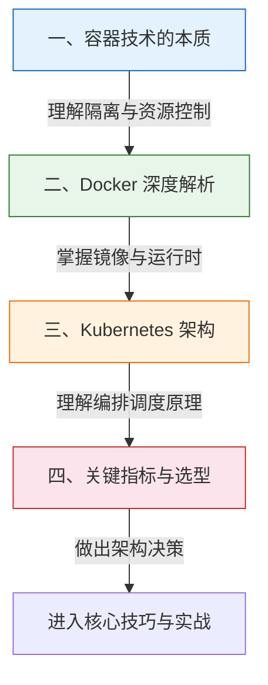
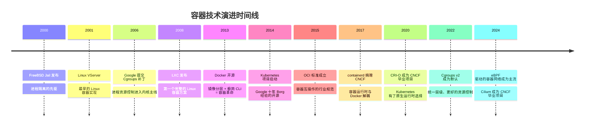

# 理论基础：容器与编排的根基

> "不理解 namespace，你就不理解容器；不理解控制循环，你就不理解 Kubernetes。" —— 本节的核心信条

---

## 一个真实的"翻车"场景

2023 年，某电商平台在双十一前进行容器化迁移，将 200+ 微服务从物理机迁移到 Kubernetes 集群。上线当天，订单服务突发大面积 OOMKilled，自动扩容触发后新 Pod 也迅速被 kill，最终导致级联故障，持续 47 分钟。

事后复盘发现问题出在三个层面：

1. **Cgroups 层面**：团队把内存 limits 设成了 requests 的两倍，但没有理解 `memory.max` 和 `memory.high` 的区别——应用在触及 hard limit 时被 SIGKILL 直接杀掉，没有任何优雅退出的机会
2. **Namespace 层面**：日志采集 sidecar 因为 PID namespace 隔离，无法通过 `/proc/1/cmdline` 看到主容器的进程，导致健康检查逻辑判断错误
3. **控制循环层面**：Deployment 的 `maxSurge` 和 `maxUnavailable` 配置不当，滚动更新时同时驱逐了过多旧 Pod，新的还没 ready

**这三类问题有一个共同点：如果工程师理解底层原理，每一个都可以在事前预防。**

容器与编排不是某个工具的使用手册，而是一套**建立在 Linux 内核之上的分布式系统基础设施**。很多工程师会用 `docker run` 和 `kubectl apply`，但当生产环境出现诡异的 OOMKilled、网络不通、调度失败时，缺乏理论根基的人只能靠猜和试，而理解底层原理的人能直接定位根因。

本节正是为了解决这个问题——在你深入动手之前（或者在你已经踩过坑之后），把容器与编排的底层原理讲透。

---

## 本节知识地图

理论基础共分四个层次，从内核级机制到架构级决策，层层递进：

这四个层次的关系不是并列的，而是**自下而上的依赖关系**——没有对 Namespace 和 Cgroups 的理解，就无法真正看懂 Docker 的镜像分层和容器隔离；没有 Docker 的知识，就无法理解 Kubernetes 为什么需要 CRI 这一层抽象；没有前三者的积累，面对编排方案选型时就只能人云亦云。

### 知识节点详解

| 序号 | 主题 | 核心问题 | 回答的内容 |
|------|------|----------|-----------|
| 一 | 容器技术的本质 | 容器到底是什么？它和虚拟机有什么根本区别？ | 7+1 种 Linux Namespace 的隔离机制、Cgroups v1/v2 的资源限制原理、OverlayFS 联合文件系统的分层存储与写时复制 |
| 二 | Docker 深度解析 | Docker 是怎么把"打包"这件事做到极致的？ | Dockerfile 指令与镜像层的映射关系、构建缓存机制与优化策略、多阶段构建减小镜像体积、容器网络模型（bridge/host/overlay/macvlan） |
| 三 | Kubernetes 架构 | 为什么需要编排？Kubernetes 的核心控制循环是怎么运转的？ | 控制平面四大组件（API Server / etcd / Scheduler / Controller Manager）、Pod 生命周期与状态机、Service 负载均衡的 iptables/IPVS 实现、Deployment 滚动更新的渐进式策略 |
| 四 | 关键指标与选型 | 在众多编排方案中，怎么做出合理的技术选型？ | 容器编排的核心评估维度（延迟/吞吐/可用性/一致性/运维复杂度）、Docker Compose vs Swarm vs Kubernetes vs Nomad vs K3s 的适用场景对比与决策树 |

---

## 为什么理论基础如此重要

### 原因一：工具会变，原理不变

Docker 曾是唯一的容器运行时，后来 Kubernetes 从 dockershim 迁移到 CRI（containerd/CRI-O）；容器网络从 Docker 内置网络演进到 CNI 插件体系；存储从 Docker Volume 演进到 CSI 标准。**工具在不断迭代，但 namespace、cgroup、OverlayFS 这些内核机制从未改变。**

回顾这条演进线：

| 时期 | 工具/标准 | 内核原理（未变） |
|------|----------|-----------------|
| 2013-2016 | Docker Engine（一体化） | Namespace + Cgroups |
| 2016-2019 | CRI 标准化（containerd / CRI-O 分离） | 仍是 Namespace + Cgroups |
| 2020-至今 | eBPF 网络（Cilium）、沙箱运行时（Kata） | 内核机制 + 新内核能力扩展 |
| 未来 | WebAssembly 容器、Unikernel | 仍有隔离与资源控制的核心诉求 |

理解了原理，你面对任何新工具都能快速上手——因为它们本质上都是对同一组内核能力的不同封装。

### 原因二：生产故障的根本原因在底层

以下是容器环境中最高频的生产故障。每一个表象背后，都指向一个底层原理的缺失：

| 故障现象 | 表面原因 | 根本原因（理论解释） | 如何用理论知识预防 |
|----------|----------|---------------------|-------------------|
| **OOMKilled** | 内存不够 | 未理解 cgroup `memory.max` 的行为：进程触及 hard limit 时内核直接发送 SIGKILL，没有任何优雅退出机会 | 设置 `memory.high` 作为软限制（触发回收但不杀进程），`memory.max` 留足 headroom |
| **CrashLoopBackOff** | 应用崩溃 | 未理解 Pod 重启策略（`restartPolicy`）与指数退避算法（10s→20s→40s→…最大 5 分钟） | 理解退避机制后，合理设置 `terminationGracePeriodSeconds`，让应用有机会优雅退出 |
| **容器间无法通信** | 网络配置错误 | 未理解 bridge 网络下容器通过 docker0 网桥通信，iptables NAT 规则决定了流量走向 | 用 `iptables -L -n -t nat` 和 `ip addr show docker0` 直接排查网络路径 |
| **镜像拉取超时** | 网络问题 | 未理解镜像分层机制——即使只改了一个文件，也会重新下载整个变化的层 | 优化 Dockerfile 层顺序，利用构建缓存，使用多阶段构建 |
| **Pod 调度 Pending** | 资源不足 | 未理解 `requests`/`limits` 的语义：requests 是调度依据（Scheduler 只看 requests），limits 是运行时硬限制 | requests 按实际用量设置，limits 留合理 buffer |
| **容器时间不对** | 时区设置问题 | 未理解 UTS Namespace 默认继承宿主机时钟，容器内没有 `/etc/localtime` | 挂载时区文件 `TZ=Asia/Shanghai` 或 `-v /etc/localtime:/etc/localtime:ro` |
| **PID 1 僵尸进程** | 容器退出后残留 | 未理解 PID Namespace 中 PID 1 的特殊角色：init 进程必须回收子进程，否则变成僵尸 | 使用 `tini` 作为 entrypoint，或用 `--init` flag |

### 原因三：架构决策需要理论支撑

当你需要在团队中推动容器化时，面对的决策远不止"用不用 Docker"：

- **单机还是集群？** —— 需要理解容器编排解决的核心问题（服务发现、故障恢复、滚动更新），评估你的团队是否真的需要这些能力
- **用 Kubernetes 还是轻量方案？** —— 需要理解 K8s 的架构复杂度（控制平面 4 个组件 + 每个节点的 kubelet + kube-proxy）与团队运维能力的匹配
- **选哪个 CNI 插件？** —— 需要理解网络模型：Calico 的 BGP 路由（高性能，适合大二层网络）、Flannel 的 VXLAN 封装（简单，适合小集群）、Cilium 的 eBPF（内核级数据面，适合安全和可观测性要求高的场景）
- **怎么控制成本？** —— 需要理解 requests/limits、HPA、Cluster Autoscaler 的协作机制——requests 决定调度密度，limits 防止单容器失控，HPA 根据指标弹性伸缩，CA 根据 pending pod 决定是否加节点

这些决策都需要扎实的理论基础作为判断依据。没有理论支撑的选型，最终都会变成"别人用什么我也用什么"。

---

## 容器技术发展简史：理解来龙去脉

在深入原理之前，了解容器技术的演进脉络，能帮助你理解"为什么是这样设计"：

关键里程碑的意义：

- **Cgroups 进入内核主线（2006）**：没有资源限制能力，容器就只是"伪装的进程"，无法在多租户环境安全使用
- **Docker 开源（2013）**：发明了镜像分层和 Dockerfile 标准，让"打包"这件事从黑科技变成了傻瓜操作
- **Kubernetes 开源（2014）**：解决了"10 个容器怎么管"的问题，将 Google 内部 Borg 的十年经验带给了全世界
- **CRI 标准化（2016-2017）**：Kubernetes 不再绑定 Docker，containerd/CRI-O 等专业运行时崛起，生态更加开放

---

## 本节的定位：道法术器

借鉴本章的组织哲学，理论基础对应的是"道"与"法"的层面：

| 层次 | 含义 | 本节内容 | 后续章节 |
|------|------|----------|----------|
| **道** | 为什么这样做 | 容器的内核原理（Namespace/Cgroups/UnionFS）、Docker 的分层设计哲学、Kubernetes 的控制循环思想 | — |
| **法** | 怎么做是对的 | 镜像构建规范（层顺序优化/多阶段构建）、网络模型选型原则（Calico/Flannel/Cilium 的适用边界）、资源限制最佳实践（requests/limits 策略） | 核心技巧篇 |
| **术** | 具体怎么做 | — | 实战案例篇 |
| **器** | 用什么工具 | Docker / containerd / CRI-O / K8s / Helm / Kustomize | 核心技巧篇 |

理论基础不涉及具体工具的安装和操作（那是核心技巧和实战案例的任务），而是回答**"为什么"和"怎么想"**的问题。掌握了这些，你在后续学习任何工具时都会事半功倍。

打个比方：如果说实战是"开车"，那么理论基础就是"理解发动机原理、交通规则、路况判断"。你可以在不理解发动机原理的情况下开车，但当发动机故障灯亮了的时候，不懂原理的人只能靠边停车叫救援，而懂原理的人能判断是继续开还是必须停下。

---

## 前置知识：读本节之前你应该知道

本节假定读者具备以下基础。如果某些概念不熟悉，建议先补充：

| 知识领域 | 需要掌握的程度 | 不需要精通的场景 |
|----------|--------------|----------------|
| **Linux 基础** | 了解文件系统层级（/proc, /sys）、基本的进程管理（ps, top）、文件权限 | 内核编译、内核模块开发 |
| **命令行操作** | 能够在终端中执行命令、理解管道和重定向 | 高级 shell 脚本编写 |
| **网络基础** | 理解 IP 地址、端口、TCP/UDP、DNS 的基本概念 | 详细配置 iptables/nftables 规则 |
| **Docker 基础** | 至少用过 `docker run`、`docker build`、`docker-compose` | 了解 Docker 内部架构和实现原理（这正是本节要讲的） |
| **编程经验** | 能看懂 YAML 和 JSON 配置 | Kubernetes API 的完整参考 |

> **零基础读者怎么办？** 如果你从未接触过容器技术，建议先花 2-3 小时完成 Docker 官方 Get Started 教程（https://docs.docker.com/get-started/），获得基本的感性认识后，再来读本节会事半功倍。理论不是空中楼阁——先有实践经验，再用理论打通"知其然"到"知其所以然"的路径，效果最佳。

---

## 预期学习成果

完成本节理论基础的学习后，你将能够：

### 知识层面
1. **解释容器的本质**：用一句话说明容器不是虚拟机，而是受 Namespace 和 Cgroups 约束的受限进程
2. **描述分层存储原理**：解释 OverlayFS 的 lower/upper/merged 三层结构，以及 Copy-on-Write 如何在写入时才复制文件
3. **区分 Docker 架构层次**：画出 CLI → dockerd → containerd → runc → Kernel 的调用链
4. **阐述 Kubernetes 控制循环**：解释"声明式 API + 调谐循环"如何实现自愈和渐进式更新
5. **对比编排方案**：基于团队规模、运维能力、安全需求三个维度，给出 Compose/Swarm/K8s/Nomad/K3s 的选型建议

### 能力层面
1. **诊断容器故障**：根据 OOMKilled、CrashLoopBackOff、Pending 等症状，快速定位到底层原理层面的原因
2. **阅读和理解** `/proc/<pid>/ns/*`、`/sys/fs/cgroup/*`、`docker inspect`、`kubectl describe` 的输出
3. **预判架构选型后果**：在选择 CNI 插件、存储方案、运行时之前，能基于理论分析各方案的性能和运维影响

---

## 常见误区预警

在学习本节内容之前，先了解这些常见认知误区，避免走弯路：

| 误区 | 纠正 |
|------|------|
| "容器就是轻量虚拟机" | 容器是共享内核的受限进程，虚拟机是独立内核的完整系统。隔离强度、资源占用、启动速度完全不同 |
| "Docker = 容器" | Docker 是容器生态中的一个工具（镜像构建 + 运行时管理），容器技术本身是 Linux 内核能力。你可以在没有 Docker 的情况下运行容器（用 LXC、containerd 直接跑） |
| "Kubernetes 一定比 Docker Swarm 好" | 取决于场景。10 个以内的服务、小团队、简单部署需求，Swarm 甚至 Docker Compose 就够了。K8s 的优势在 50+ 服务、复杂调度、多团队协作时才显现 |
| "设置 limits 就能防止 OOM" | limits 触发的 OOM Kill 没有优雅退出机会。正确做法是设置 `memory.high` 作为预警线，让应用有时间释放缓存、完成请求 |
| "latest 标签很方便" | `latest` 在生产环境中是灾难——每次拉取可能拿到不同版本，无法回滚，无法复现。必须使用语义化版本号或 commit SHA |
| "容器内不需要关注进程管理" | PID 1 在 Linux 中有特殊角色（回收僵尸进程）。如果你的应用不是 init 进程（PID != 1），需要用 `tini` 或 `--init` 来正确管理子进程 |

---

## 学习建议

### 阅读策略

1. **带着问题阅读**：每个小节都围绕一个核心问题展开（如"容器到底是什么？"）。建议先看问题，用自己的理解尝试回答，再与书中的解答对照。这种"主动回忆"比被动阅读的记忆留存率高 50%+
2. **动手验证原理**：Namespace 的隔离效果、Cgroups 的资源限制、OverlayFS 的分层——这些都可以用最简单的命令验证。不要只看文字，要亲手跑一遍。本节每个知识点都附带了可执行的命令示例
3. **画出知识关联**：容器技术的本质 → Docker 如何利用这些本质 → Kubernetes 如何在此基础上构建编排能力 → 最终如何做出选型决策。这条线索要时刻清晰
4. **不急于跳到实战**：很多工程师急于上手 K8s，跳过了底层原理。当生产环境出问题时，缺乏理论根基会导致排查效率极低。花在理论上的时间会在实战中十倍回报

### 验证学习效果

学完每个小节后，用以下问题自测：

- **学完"容器技术的本质"**：能否不查资料，画出容器启动时 Namespace 和 Cgroups 的创建过程？
- **学完"Docker 深度解析"**：能否解释 `docker build` 过程中每一层的缓存命中逻辑？
- **学完"Kubernetes 架构"**：能否画出一个 Pod 从创建到 Ready 的完整生命周期状态机？
- **学完"关键指标与选型"**：能否根据团队情况，给出一个有理有据的编排方案推荐？

如果任何一个问题答不上来，说明对应部分需要重新阅读和实操。

### 阅读时间预估

| 小节 | 建议学习时间 | 包含实操 |
|------|------------|---------|
| 一、容器技术的本质 | 2-3 小时 | 1 小时动手验证 Namespace/Cgroups |
| 二、Docker 深度解析 | 2-3 小时 | 1 小时构建和分析镜像 |
| 三、Kubernetes 架构 | 3-4 小时 | 1.5 小时在 minikube/kind 上观察 Pod 生命周期 |
| 四、关键指标与选型 | 1-2 小时 | 0.5 小时对比测试编排方案 |
| **总计** | **8-12 小时** | **4 小时实操** |

> 不建议一天内全部读完。建议分 2-3 天消化，每天读一个小节 + 动手验证。深度学习需要间隔重复。

---

## 关键术语速查

在进入正文之前，先熟悉以下核心术语。这些术语会贯穿本节所有内容：

| 术语 | 英文 | 一句话定义 | 详细解释 |
|------|------|-----------|---------|
| **Namespace** | Namespace | Linux 内核的资源隔离机制 | 让进程拥有独立的视图（PID/网络/文件系统等），是容器隔离的基础 |
| **Cgroups** | Control Groups | Linux 内核的资源限制机制 | 控制进程组能使用多少 CPU、内存、IO，是容器资源管理的基础 |
| **OverlayFS** | Overlay Filesystem | 联合文件系统，实现镜像分层 | 将多个只读层叠加成统一视图，配合 Copy-on-Write 实现高效存储 |
| **镜像层** | Image Layer | Docker 镜像的不可变存储单元 | 每条 Dockerfile 指令创建一层，层可以跨镜像共享，未修改的层直接复用 |
| **容器运行时** | Container Runtime | 创建和管理容器的软件 | 分为高级运行时（containerd）和低级运行时（runc），K8s 通过 CRI 接口调用 |
| **控制循环** | Control Loop | Kubernetes 的核心运行模式 | "观察当前状态 → 对比期望状态 → 执行调谐动作"的无限循环，实现声明式管理 |
| **Pod** | Pod | Kubernetes 中最小的调度单元 | 一个或多个共享网络和存储的容器组合，是 K8s 的原子部署单位 |
| **CNI** | Container Network Interface | 容器网络插件标准 | 定义了容器网络的创建/删除/配置接口，Calico/Flannel/Cilium 都是 CNI 实现 |
| **CSI** | Container Storage Interface | 容器存储插件标准 | 定义了存储的挂载/卸载/快照接口，将存储从 Kubernetes 中解耦 |
| **声明式 API** | Declarative API | "告诉系统想要什么状态"而非"执行什么操作" | Kubernetes 的核心设计理念，用户声明期望状态，系统自动调谐实现 |

---

## 一句话总结

> 理论基础不是"知道就行"的背景知识，而是"用得上"的实战武器。理解了 namespace 的 PID 隔离，你才能读懂 `docker exec` 的输出；理解了 cgroup 的 OOM 行为，你才能排查 OOMKilled；理解了 Kubernetes 的控制循环，你才能理解为什么 Deployment 会在你修改 spec 后"自动"创建 Pod。**学完本节，你将从"会用容器"升级到"理解容器"——这两者之间的差距，就是高级工程师和初级工程师的差距。**

---

## 本节目录

1. [一、容器技术的本质](01-一容器技术的本质.md) — Linux Namespace 隔离机制、Cgroups v1/v2 资源限制、OverlayFS 联合文件系统与写时复制
2. [二、Docker 深度解析](02-二Docker深度解析.md) — Dockerfile 镜像构建原理、构建缓存与多阶段构建、容器运行时架构（dockerd → containerd → runc）、容器网络模型
3. [三、Kubernetes 架构](03-三Kubernetes架构.md) — 控制平面四大组件、Pod 生命周期与状态机、Service 负载均衡（iptables/IPVS）、Deployment 滚动更新机制
4. [四、关键指标与选型](04-四关键指标与选型.md) — 容器编排评估指标体系、主流方案对比（Docker Compose / Swarm / Kubernetes / Nomad / K3s）、选型决策树
