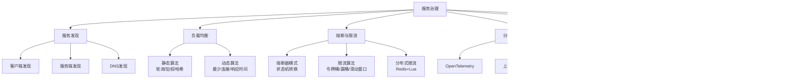
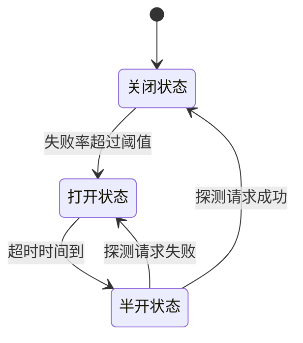

# 第41章 服务治理 — 章节概览

## 为什么服务治理如此重要

想象一个场景：你的电商平台在双11零点迎来了流量洪峰，瞬时请求量达到日常的50倍。订单服务、库存服务、支付服务、用户服务之间的调用链长达6层。突然，库存服务因为Redis缓存击穿而响应变慢，平均延迟从20ms飙升到2秒。如果没有服务治理，这个慢响应会像多米诺骨牌一样沿调用链向上传播——订单服务的线程池被占满，支付服务开始超时，最终整个系统雪崩。

这就是服务治理要解决的核心问题：**在分布式系统中，如何保证服务之间的调用可靠、高效、可控**。

单体应用时代，所有模块运行在同一个进程内，函数调用是本地的，不存在网络延迟、服务发现、负载均衡等问题。而微服务架构将应用拆分为数十甚至数百个独立服务后，每一个跨服务调用都面临一系列挑战：

- **服务在哪里？** 服务实例的IP地址随扩缩容、故障转移动态变化
- **选哪个实例？** 同一个服务有多个实例，如何合理分配请求
- **故障怎么办？** 某个服务挂了，如何防止级联失败拖垮整个系统
- **流量怎么控？** 突发流量如何限流保护，防止系统过载
- **请求怎么追？** 一个请求经过多个服务，如何定位性能瓶颈
- **配置怎么改？** 数百个服务的配置参数如何集中管理和动态下发
- **版本怎么换？** 新版本上线如何灰度发布，控制爆炸半径

服务治理就是围绕这些问题构建的一套完整的基础设施能力。

## 知识体系全景图

这张图展示了服务治理的六大核心能力及其子领域。它们不是孤立的，而是相互配合形成完整的治理体系：服务发现是基石，负载均衡是调度核心，熔断限流是保护机制，分布式追踪是可观测性基础，配置管理是运维抓手，灰度发布是变更安全网。

## 本章内容导航

本章共包含6个核心模块，按从基础到高级的顺序组织，每个模块都遵循"理论→原理→实践→调优"的递进逻辑。

### 模块一：服务发现（41.2节）

**解决的问题：** 服务在哪里？

在云原生环境中，服务实例的IP地址是动态分配的，重启后可能变化。服务发现引入中心化的注册中心，让服务能"找到彼此"。

本节覆盖三种发现模式的完整对比：

| 模式 | 代表实现 | 调用方式 | 优点 | 缺点 |
|------|----------|----------|------|------|
| 客户端发现 | Eureka + Ribbon | 客户端查询注册中心并自行选择实例 | 无额外网络跳转，延迟低 | 客户端与注册中心耦合，多语言需各实现一套 |
| 服务端发现 | Kubernetes Service | 通过负载均衡器转发 | 客户端简单，不需额外SDK | 增加一跳延迟，LB可能成为瓶颈 |
| DNS发现 | Consul DNS接口 | DNS解析获取IP列表 | 通用性强，几乎所有语言支持 | DNS缓存导致更新不及时，负载均衡策略粗糙 |

**关键概念：** CAP权衡（AP型Eureka vs CP型Consul/ZK）、健康检查机制（心跳+探测）、多级缓存与推拉结合的更新策略。

**代码示例：** Go实现客户端发现模式、Python实现DNS服务发现。

### 模块二：负载均衡（41.3节）

**解决的问题：** 选哪个实例？

负载均衡将请求合理分配到多个服务实例，是资源利用最大化和服务质量保障的关键。

**静态算法**不感知服务器实时状态：

- **轮询（Round Robin）：** 依次分配，最简单但忽略性能差异
- **加权轮询（Weighted Round Robin）：** 引入权重，Nginx使用的平滑加权轮询算法避免了请求突发
- **哈希（Hash）：** 按用户ID/IP哈希实现会话保持，但服务器变化导致大量重映射
- **一致性哈希（Consistent Hash）：** 虚拟环+虚拟节点，服务器变化只影响环上相邻请求

**动态算法**感知服务器实时状态：

- **最少连接（Least Connections）：** 分配给活跃连接数最少的实例，自适应处理能力差异
- **加权最少连接：** 结合权重与连接数，选择 `连接数/权重` 最小的实例
- **响应时间（Response Time）：** 选择平均响应时间最短的实例，AWS ALB使用此思路
- **自适应负载均衡：** 综合CPU、内存、IO等多指标加权评分，Envoy的Subset Load Balancing

**最佳实践：** 避免惊群效应（缓存过期同时刷新）、会话保持策略、连接预热机制。

### 模块三：熔断与限流（41.4节 + 41.5节）

**解决的问题：** 故障如何隔离？流量如何控制？

#### 熔断器模式

灵感来自电路断路器——当电流过大时自动断开保护电路。熔断器有三种状态的自动状态机：

- **关闭（Closed）：** 正常工作，记录成功/失败计数
- **打开（Open）：** 快速失败，不调用下游，保护调用方线程资源
- **半开（Half-Open）：** 试探恢复，允许少量请求探测下游是否恢复

**关键实现：** 滑动窗口计数解决"临界突变"问题，将时间窗口细分为多个桶精确统计错误率。

#### 限流算法

四种经典限流算法的原理与适用场景：

| 算法 | 核心思想 | 突发处理 | 内存开销 | 适用场景 |
|------|----------|----------|----------|----------|
| 令牌桶 | 恒定速率生成令牌，请求消耗令牌 | 允许突发（桶满时） | 低 | API网关限流 |
| 漏桶 | 固定速率流出请求 | 严格平滑 | 低 | 流量整形 |
| 滑动窗口计数 | 时间窗口内统计请求数 | 取决于窗口大小 | 中 | 精确计数 |
| 滑动窗口日志 | 记录每个请求时间戳 | 精确但开销大 | 高 | 低流量精确限流 |

**分布式限流：** 基于Redis + Lua脚本实现跨实例的统一限流，Lua脚本的原子性保证了并发安全。

### 模块四：分布式追踪（41.6节）

**解决的问题：** 请求如何追踪？

一个用户请求可能经过5-10个服务，当某个环节出现延迟时，如何快速定位瓶颈？分布式追踪通过在请求链路中注入唯一的TraceID，串联所有服务的处理过程。

**OpenTelemetry标准**统一了Tracing、Metrics、Logs三大可观测性信号。其核心概念：

- **Trace：** 一次完整的请求链路
- **Span：** 链路中的一个处理单元（如一次RPC调用、一次数据库查询）
- **Context Propagation：** 跨服务传递TraceID和SpanID的机制（HTTP Header、gRPC Metadata）

**采样策略**决定了追踪数据的收集粒度：

- **头部采样（Head Sampling）：** 在请求入口决定是否追踪，简单但可能丢失关键信息
- **尾部采样（Tail Sampling）：** 根据完整的Trace结果决定是否保留，能捕获异常链路
- **自适应采样：** 高频路径降低采样率，异常路径提高采样率

### 模块五：配置中心（41.7节）

**解决的问题：** 配置如何下发？

数百个服务的数据库连接串、超时阈值、功能开关等参数，不可能硬编码在代码中或散落在配置文件里。配置中心提供集中管理、动态下发、版本回滚的能力。

核心设计需求：

- **实时性：** 配置变更后毫秒级推送到所有服务实例
- **一致性：** 所有实例在同一时刻看到相同的配置值
- **高可用：** 配置中心本身不能成为单点故障
- **安全性：** 敏感配置（密码、密钥）加密存储和传输

典型架构：配置中心 + 客户端SDK + 长轮询/WebSocket推送 + 本地缓存兜底。

### 模块六：灰度发布（41.8节）

**解决的问题：** 变更如何安全上线？

新版本直接全量发布风险巨大，灰度发布通过逐步放量的方式，让问题在影响最小的范围内暴露。

两种核心策略：

| 策略 | 原理 | 优点 | 缺点 | 适用场景 |
|------|------|------|------|----------|
| 金丝雀发布 | 新版本接收少量流量（如5%），观察无异常后逐步扩大 | 风险最小，可随时回滚 | 发布周期长 | 核心服务、支付链路 |
| 蓝绿部署 | 维护两套完整环境，切换流量 | 切换瞬间完成，回滚极快 | 资源占用翻倍 | 对切换速度要求高的场景 |

灰度规则维度：按用户ID尾号、地域、设备类型、请求Header、用户标签等维度进行流量染色和路由。

## 前置知识要求

学习本章前，建议读者具备以下基础知识：

| 前置知识 | 对应章节 | 与服务治理的关联 |
|----------|----------|-------------------|
| 分布式系统基本概念 | 第21章 | CAP/BASE理论、一致性模型是理解服务治理的理论基础 |
| 容器与编排技术 | 第40章 | Kubernetes是服务治理的运行环境，Service/Ingress是服务发现的实现 |
| 网络协议基础 | 第18-19章 | HTTP/gRPC协议是服务间通信的基础，DNS是服务发现的一种模式 |
| 消息队列原理 | 第35章 | 异步解耦场景下的服务治理策略有所不同 |

## 学习路径建议

**入门路径（1-2天）：** 概述 → 服务发现三种模式 → 负载均衡基本算法 → 熔断器三状态

**进阶路径（3-5天）：** 限流算法深入 → 分布式追踪与OpenTelemetry → 配置中心设计 → 灰度发布实践

**实战路径（持续）：** 电商/金融系统实战案例 → 调优技巧 → 常见误区避坑 → 本章小结复盘

## 服务治理技术选型速查

在实际项目中，服务治理的技术选型需要根据团队规模、技术栈、业务场景综合考量。以下是主流技术栈的对照：

| 能力 | Spring Cloud生态 | Kubernetes原生 | 云服务托管 |
|------|-------------------|----------------|------------|
| 服务发现 | Eureka / Nacos / Consul | CoreDNS + kube-proxy | 阿里云MSE / AWS Cloud Map |
| 负载均衡 | Ribbon / Spring Cloud LoadBalancer | kube-proxy (iptables/IPVS) | 阿里云SLB / AWS ELB |
| 熔断限流 | Resilience4j / Sentinel | Istio CircuitBreaker | 阿里云AHAS |
| 分布式追踪 | Spring Cloud Sleuth + Zipkin | Jaeger / Tempo | 阿里云ARMS / AWS X-Ray |
| 配置管理 | Spring Cloud Config / Nacos | ConfigMap / Secret | 阿里云ACM / AWS SSM |
| 灰度发布 | 自定义 + Nginx | Istio Traffic Management | 阿里云MSE灰度 |

**选型原则：** 已有Kubernetes集群的团队优先使用原生能力（Service/ConfigMap/Istio），避免引入额外组件增加运维负担；没有容器化的团队可以使用Nacos（同时提供配置中心和注册中心）降低技术栈复杂度。

---

> **下一节 →** [理论基础](../01-理论基础/) — 深入理解服务治理的理论根基与技术演进历程
