# 服务治理理论基础

## 1. 什么是服务治理

### 1.1 定义与核心目标

服务治理（Service Governance）是指在分布式微服务架构中，对服务的生命周期、通信行为、质量保障和运维管理进行系统化管控的一系列机制与实践。其核心目标可以用四个维度概括：

- **可观测（Observability）**：服务调用链路透明化，任何一次请求的完整路径都能被追踪和分析
- **可控性（Controllability）**：在运行时能够动态调整服务行为，如限流阈值、路由规则、流量分配
- **高可用（High Availability）**：通过容错机制确保单点故障不影响整体系统可用性
- **高性能（High Performance）**：在大规模服务调用场景下，维持低延迟和高吞吐

### 1.2 为什么需要服务治理

当系统从单体架构演进到微服务架构后，服务数量从几个增长到几十甚至几百个。此时面临的核心挑战是：

单体时代：1个应用 = 1个进程 = 1个日志 = 1份配置
微服务时代：N个服务 = M个实例 = N×M个日志 = N份配置

这种复杂度的跃升带来了以下具体问题：

| 问题维度 | 单体架构 | 微服务架构 | 治理手段 |
|----------|----------|------------|----------|
| 服务间通信 | 函数调用（本地） | 网络调用（远程） | 服务发现、负载均衡 |
| 故障传播 | 一个bug影响全局 | 故障可隔离 | 熔断、降级、隔离 |
| 数据一致性 | 单数据库事务 | 分布式事务 | Saga、TCC、最终一致性 |
| 部署发布 | 整体发布 | 独立发布 | 灰度发布、流量治理 |
| 可观测性 | 单一日志系统 | 分布式日志 | 链路追踪、指标监控 |

### 1.3 服务治理的全景图

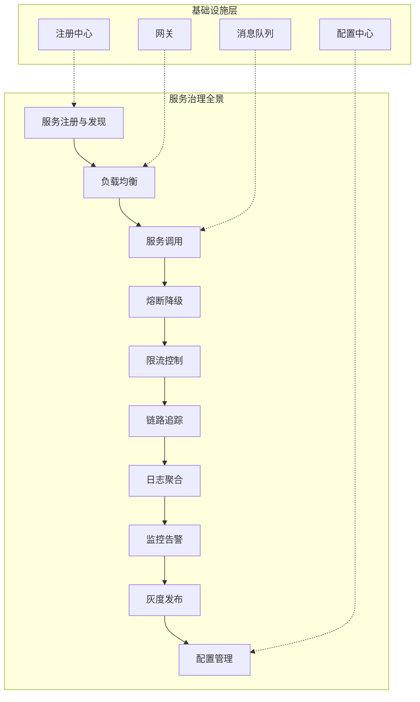

## 2. 理论基石

### 2.1 CAP 定理

CAP 定理是分布式系统设计的理论基石，由 Eric Brewer 在 2000 年提出，后由 Gilbert 和 Lynch 在 2002 年严格证明。它指出在分布式系统中，以下三个属性最多只能同时满足两个：

- **一致性（Consistency）**：所有节点在同一时间看到相同的数据
- **可用性（Availability）**：每个请求都能在合理时间内得到响应
- **分区容错性（Partition Tolerance）**：网络分区发生时系统仍能继续运行


**实际选型决策：**

在实际的微服务场景中，由于网络分区是不可避免的（网络不可能100%可靠），系统设计实质上是在 CP 和 AP 之间做选择：

| 选型 | 特征 | 典型系统 | 适用场景 |
|------|------|----------|----------|
| CP 系统 | 优先保证一致性，牺牲部分可用性 | ZooKeeper、etcd、HBase | 配置中心、分布式锁、主节点选举 |
| AP 系统 | 优先保证可用性，接受最终一致性 | Eureka、Consul（默认）、Nacos | 服务注册发现、DNS 服务 |

> **实践建议**：服务注册发现场景通常选择 AP 模式——注册中心短暂的数据不一致（如新服务注册后其他节点尚未同步）通常可以接受，但如果注册中心不可用导致所有服务无法发现彼此，后果更严重。

### 2.2 BASE 理论

BASE 理论是 CAP 中 AP 选择的延伸，由 eBay 架构师 Dan Pritchett 在 2008 年提出，是对大规模互联网系统实践经验的总结：

- **基本可用（Basically Available）**：系统在出现故障时，允许损失部分非核心功能的可用性（如响应时间延长、功能降级），但核心功能仍然可用
- **软状态（Soft State）**：允许系统中的数据存在中间状态，且这个中间状态不影响系统整体可用性
- **最终一致性（Eventually Consistent）**：系统保证在没有新的更新操作后，经过一定时间，所有数据副本最终能够达到一致状态

**BASE 与 ACID 的对比：**

| 特性 | ACID | BASE |
|------|------|------|
| 设计哲学 | 强调一致性 | 强调可用性 |
| 事务模型 | 刚性事务 | 柔性事务 |
| 数据状态 | 严格一致 | 最终一致 |
| 性能 | 相对较低 | 高吞吐 |
| 适用场景 | 金融核心交易 | 电商、社交、内容 |
| 典型实现 | 两阶段提交(2PC) | Saga、TCC、本地消息表 |

### 2.3 一致性模型谱系

分布式系统中的一致性模型从强到弱形成了一个谱系，理解这个谱系对服务治理至关重要：

强一致性端                                              弱一致性端
  |                                                       |
  线性一致性 → 顺序一致性 → 因果一致性 → 最终一致性 → 读写一致性
 (Linearizable) (Sequential) (Causal)  (Eventual)  (Read-your-writes)

**各一致性模型详解：**

- **线性一致性（Linearizability）**：最强的一致性保证。任何读操作都能看到最新的写操作结果，且所有操作表现得像是在单一节点上按某个全局时序执行的。代价是性能最低，通常需要同步复制。

- **顺序一致性（Sequential Consistency）**：所有操作的结果与某个全局顺序一致，且每个节点上的操作顺序与该节点的程序顺序一致。不需要实时性，允许延迟。

- **因果一致性（Causal Consistency）**：有因果关系的操作保持一致顺序，无因果关系的操作可以以任意顺序出现。例如：先评论后点赞，其他用户一定先看到评论再看到点赞。

- **最终一致性（Eventually Consistency）**：在没有新写入的情况下，经过足够长的时间，所有副本最终会收敛到相同的值。这是大多数互联网服务采用的模型。

- **读写一致性（Read-your-writes Consistency）**：保证用户总能读到自己最新写入的数据，但不保证能看到其他用户的最新写入。

### 2.4 服务通信模式

微服务间的通信模式是服务治理的基础问题，主要分为同步和异步两大类：

**同步通信模式：**

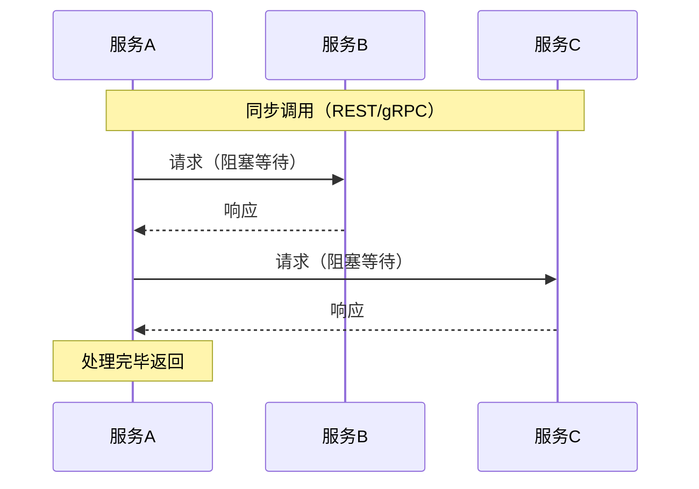

同步通信的特点是调用方发出请求后阻塞等待响应，适用于对实时性要求高的场景，但存在级联故障风险。

**异步通信模式：**

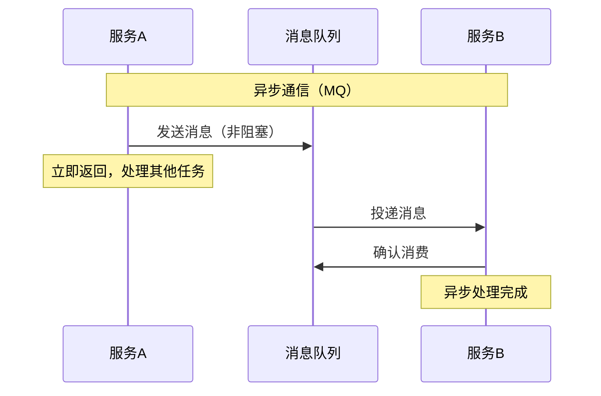

异步通信通过消息队列解耦生产者和消费者，提高了系统弹性和可用性，但增加了系统复杂度和延迟。

**两种模式的对比与选型：**

| 维度 | 同步通信（REST/gRPC） | 异步通信（MQ/事件） |
|------|----------------------|---------------------|
| 延迟 | 低（毫秒级） | 较高（取决于队列积压） |
| 耦合度 | 强耦合（调用方依赖被调方） | 松耦合（通过消息解耦） |
| 可靠性 | 低（任一环节故障影响链路） | 高（消息持久化，可重试） |
| 吞吐量 | 受限于调用链最慢环节 | 高（可削峰填谷） |
| 数据一致性 | 容易保证（同步事务） | 需要额外机制（最终一致） |
| 适用场景 | 查询、实时交互、对账 | 订单创建、异步通知、日志采集 |

## 3. 服务注册与发现

### 3.1 核心问题

在微服务架构中，服务实例的数量和位置是动态变化的（自动扩缩容、滚动更新、故障迁移）。服务注册与发现机制解决的核心问题是：**服务A如何找到服务B的可用实例？**

### 3.2 架构模式

**客户端发现模式：**

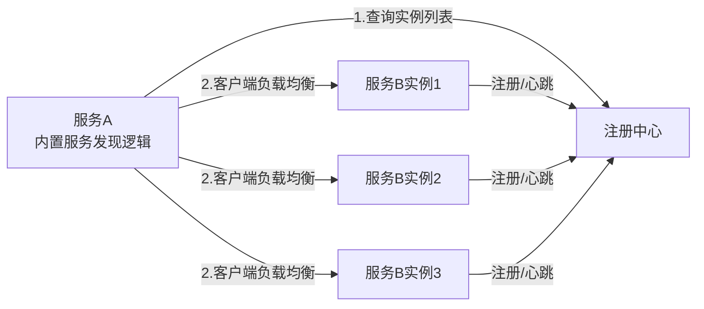

客户端发现模式下，客户端直接从注册中心获取实例列表并自行做负载均衡。代表实现：Eureka + Ribbon、Nacos + OpenFeign。

**服务端发现模式：**

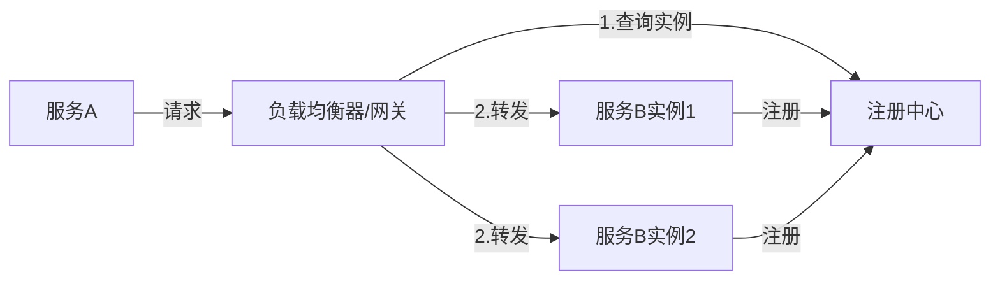

服务端发现模式下，客户端请求先到达负载均衡器，由负载均衡器查询注册中心并转发请求。代表实现：Kubernetes Service + kube-proxy、AWS ELB。

### 3.3 主流注册中心对比

| 特性 | Eureka | Nacos | Consul | ZooKeeper |
|------|--------|-------|--------|-----------|
| 开发方 | Netflix | Alibaba | HashiCorp | Apache |
| 一致性模型 | AP | AP/CP可切换 | CP | CP |
| 健康检查 | 心跳 | 心跳+主动探测 | TCP/HTTP/gRPC/脚本 | 心跳（Session） |
| 雪崩保护 | 支持 | 支持 | 不支持 | 不支持 |
| 配置中心 | 不支持 | 内置支持 | KV存储 | 不支持 |
| 多数据中心 | 不支持 | 支持 | 原生支持 | 不支持 |
| 访问协议 | HTTP | HTTP/DNS/gRPC | HTTP/DNS | TCP |
| 社区活跃度 | 停止维护 | 活跃 | 活跃 | 活跃 |
| 适用场景 | 遗留系统 | 阿里生态/Java | 多云/多数据中心 | Hadoop生态 |

> **选型建议**：对于新的 Java 微服务项目，Nacos 是综合最优选择——兼具服务发现和配置管理能力，社区活跃，且支持 AP/CP 模式切换以适应不同场景。

### 3.4 服务注册的实现要点

**心跳机制设计：**

注册中心通常通过心跳检测来判断服务实例是否存活。心跳参数的设计需要权衡：

心跳间隔太短 → 注册中心压力大，网络开销高
心跳间隔太长 → 故障检测延迟高，流量可能打到已死节点

推荐配置：
  心跳间隔: 5-10秒
  超时阈值: 30-60秒（3-6次心跳未响应判定为下线）
  临时实例: 服务停止后自动注销（Eureka默认行为）
  永久实例: 需要手动注销或通过管理接口操作

**自保护机制（以 Eureka 为例）：**

当注册中心在短时间内丢失过多心跳（如网络分区导致大量实例无法续约），Eureka 会触发自我保护模式——不再剔除实例，宁可保留可能已死的实例，也不冒风险将健康的实例误判下线。

判断条件：`心跳续约频率 < 预期心跳 × 自保护阈值（默认85%）`

## 4. 负载均衡理论

### 4.1 负载均衡的层次

负载均衡可以在不同层次发挥作用：

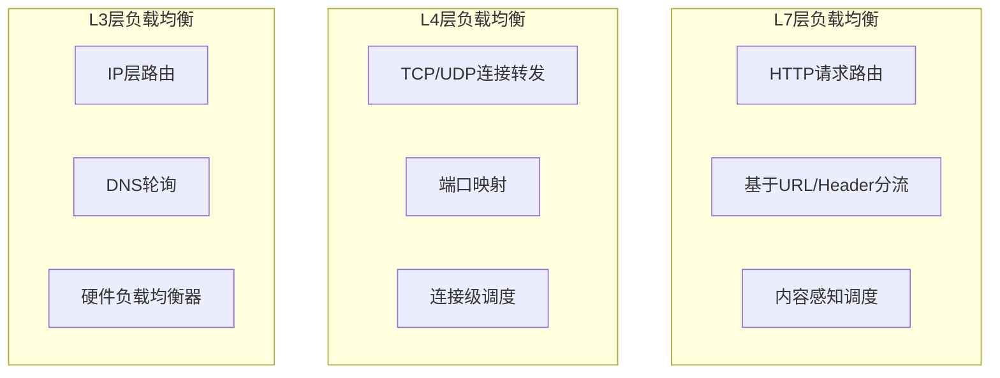

### 4.2 经典调度算法

**轮询（Round Robin）：**
按顺序将请求分配给每个后端服务器。适用于各实例性能一致的场景。

```python
class RoundRobinBalancer:
    def __init__(self, servers):
        self.servers = servers
        self.current = 0
    
    def next(self):
        server = self.servers[self.current]
        self.current = (self.current + 1) % len(self.servers)
        return server
```

**加权轮询（Weighted Round Robin）：**
根据服务器性能分配不同权重，性能强的服务器接收更多请求。Nginx 的默认实现使用平滑加权轮询算法，避免了权重差异大时的请求突刺问题。

**最少连接（Least Connections）：**
将新请求分配给当前活跃连接数最少的服务器。适用于请求处理时间差异较大的场景（如慢查询和快查询混合）。

**一致性哈希（Consistent Hashing）：**
通过哈希环将请求映射到特定的服务器节点，保证相同 key 的请求总是路由到同一节点。适用于有状态服务和缓存场景。

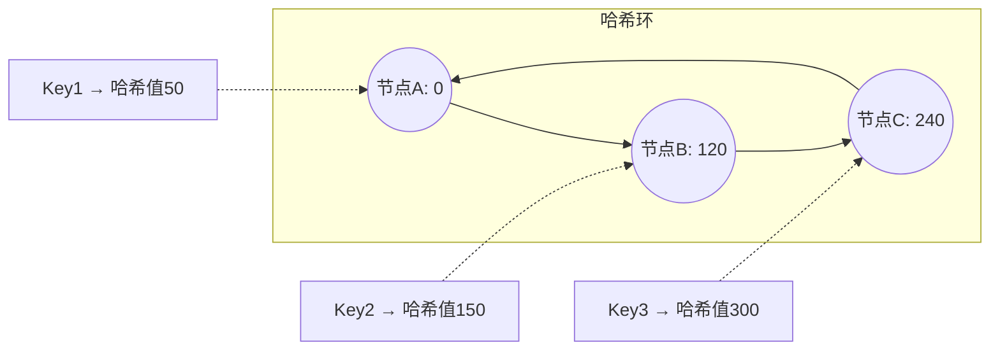

**一致性哈希的优势**：当新增或移除节点时，只有相邻区间的请求需要重新分配，影响范围从 O(N) 降低到 O(1)，非常适合缓存场景。

### 4.3 高级负载均衡策略

**自适应负载均衡：**
基于实时反馈数据（响应时间、错误率、CPU使用率）动态调整权重。例如 gRPC 的 Pick-First + Load Balancing 策略，以及 Envoy 的EWMA（指数加权移动平均）算法。

**灰度流量调度：**
根据请求属性（用户ID、地域、设备类型、HTTP Header）将流量路由到特定版本的服务实例：

```yaml
# Istio VirtualService 灰度示例
apiVersion: networking.istio.io/v1beta1
kind: VirtualService
metadata:
  name: order-service
spec:
  hosts:
    - order-service
  http:
    - match:
        - headers:
            x-canary:
              exact: "true"
      route:
        - destination:
            host: order-service
            subset: v2
    - route:
        - destination:
            host: order-service
            subset: v1
          weight: 90
        - destination:
            host: order-service
            subset: v2
          weight: 10
```

## 5. 容错与熔断

### 5.1 故障类型与传播

在分布式系统中，故障是常态而非异常。常见的故障类型包括：

- **瞬态故障（Transient Fault）**：网络抖动、GC停顿、临时过载，通常自动恢复
- **持久故障（Persistent Fault）**：硬件损坏、配置错误、代码缺陷，需要人工介入
- **级联故障（Cascading Fault）**：一个服务的故障导致上游服务连锁超时，最终雪崩

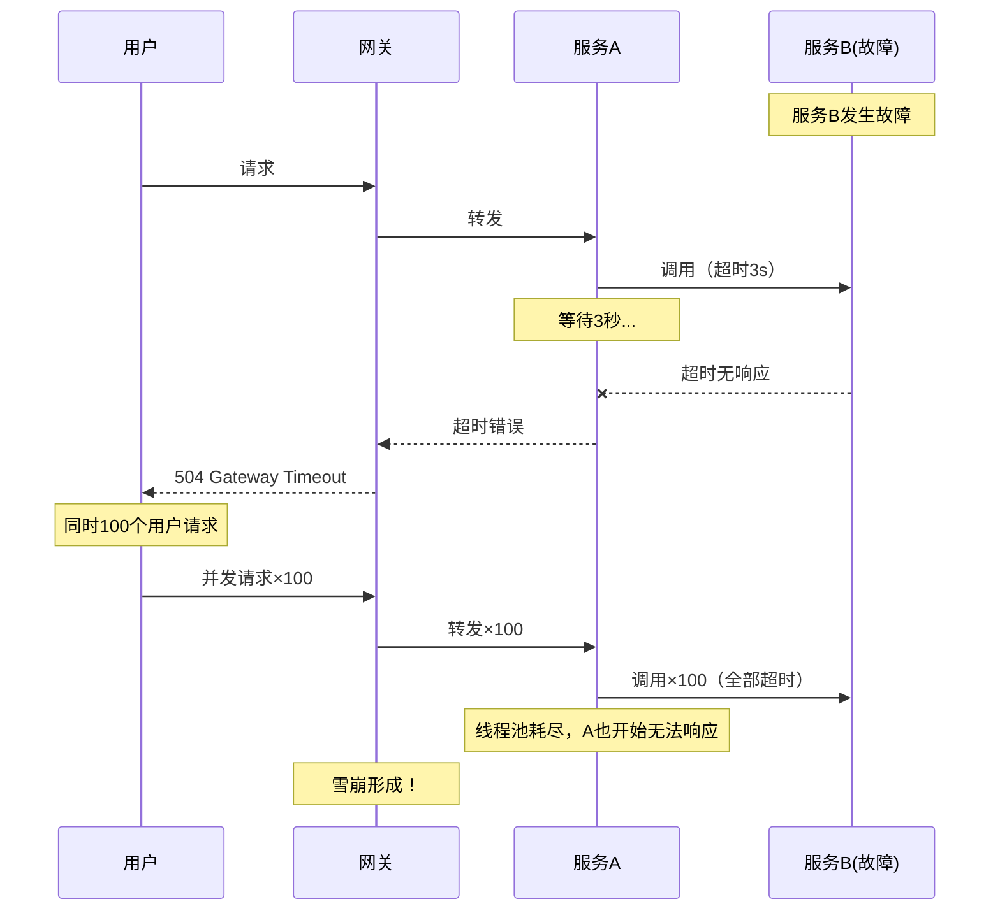

### 5.2 熔断器模式（Circuit Breaker）

熔断器模式由 Michael Nygard 在《Release It!》一书中推广，灵感来源于电路中的保险丝——当电流过大时自动断开，防止损坏设备。

**三态模型：**

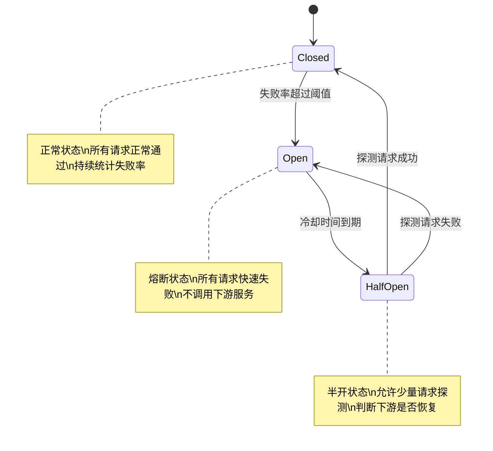

**关键参数设计：**

| 参数 | 含义 | 推荐值 | 说明 |
|------|------|--------|------|
| failureRateThreshold | 失败率阈值 | 50% | 超过此比例触发熔断 |
| slidingWindowSize | 滑动窗口大小 | 100次调用 或 10秒 | 统计失败率的时间/次数窗口 |
| minimumNumberOfCalls | 最小调用数 | 20次 | 窗口内调用数不足时不触发熔断 |
| waitDurationInOpenState | 熔断持续时间 | 5-30秒 | 熔断后等待进入半开状态 |
| permittedNumberOfCallsInHalfOpenState | 半开状态探测数 | 5次 | 半开状态允许通过的请求量 |

**Hystrix / Resilience4j 实现对比：**

| 特性 | Hystrix（Netflix，已停止维护） | Resilience4j（活跃维护） |
|------|-------------------------------|--------------------------|
| 线程模型 | 线程隔离 | 信号量隔离（可选线程隔离） |
| 熔断算法 | 滑动窗口 | 滑动窗口 + 指数分布 |
| 降级机制 | fallback方法 | fallback方法 + 降级链 |
| 事件流 | RxJava Observable | Reactor / RxJava |
| Spring集成 | @HystrixCommand注解 | @CircuitBreaker注解 |
| 包体大小 | 较大（依赖Hystrix core） | 轻量（模块化按需引入） |

### 5.3 降级策略

当熔断触发或服务异常时，降级策略是保障用户体验的最后防线：

- **返回默认值**：查询商品详情失败时返回缓存中的旧数据或空数据
- **功能降级**：关闭非核心功能（如推荐算法关闭，仅展示热门商品）
- **排队等待**：高并发时让用户排队而非直接拒绝
- **读写降级**：写操作暂存到本地队列，优先保证读操作
- **远程调用降级**：调用远程服务失败时改用本地缓存数据

## 6. 限流与流量控制

### 6.1 为什么需要限流

如果没有限流机制，突发流量会导致：
- 服务器资源耗尽（CPU、内存、连接数）
- 响应时间急剧上升，用户体验恶化
- 故障扩散，引发级联雪崩

限流的本质是在系统容量有限的前提下，通过控制单位时间内处理的请求数量，保护系统不被过载。

### 6.2 经典限流算法

**固定窗口计数器（Fixed Window Counter）：**

将时间轴切分为固定长度的窗口（如1秒），每个窗口维护一个计数器。请求到来时计数器+1，超过阈值则拒绝。

```python
import time

class FixedWindowLimiter:
    def __init__(self, max_requests, window_seconds):
        self.max_requests = max_requests
        self.window_seconds = window_seconds
        self.window_start = time.time()
        self.count = 0
    
    def allow(self):
        now = time.time()
        if now - self.window_start >= self.window_seconds:
            self.window_start = now
            self.count = 0
        if self.count < self.max_requests:
            self.count += 1
            return True
        return False
```

**问题**：存在窗口边界突发问题——如果100个请求集中在第0.99秒到第1.01秒之间到达，虽然跨越了两个窗口，但在极短时间内实际通过了200个请求。

**滑动窗口计数器（Sliding Window Log）：**

记录每个请求的时间戳，通过滑动窗口精确统计窗口内的请求数。

```python
import time
from collections import deque

class SlidingWindowLogLimiter:
    def __init__(self, max_requests, window_seconds):
        self.max_requests = max_requests
        self.window_seconds = window_seconds
        self.timestamps = deque()
    
    def allow(self):
        now = time.time()
        # 移除窗口外的过期记录
        while self.timestamps and self.timestamps[0] <= now - self.window_seconds:
            self.timestamps.popleft()
        if len(self.timestamps) < self.max_requests:
            self.timestamps.append(now)
            return True
        return False
```

**缺点**：需要存储每个请求的时间戳，内存消耗较大。

**滑动窗口日志+计数器混合（Sliding Window Counter）：**

综合前两种算法的优点，用上一窗口的计数和当前窗口的计数按时间比例加权计算。这是 Nginx 和 Sentinel 采用的方案。

**令牌桶（Token Bucket）：**

以恒定速率向桶中放入令牌，每个请求需要消耗一个令牌。桶有最大容量，超出部分的令牌被丢弃。允许突发流量（桶满时可以一次性消耗多个令牌）。

```python
import time

class TokenBucketLimiter:
    def __init__(self, rate, capacity):
        self.rate = rate              # 令牌生成速率（个/秒）
        self.capacity = capacity      # 桶最大容量
        self.tokens = capacity        # 当前令牌数
        self.last_time = time.time()  # 上次补充时间
    
    def allow(self):
        now = time.time()
        # 按时间差补充令牌
        elapsed = now - self.last_time
        self.tokens = min(self.capacity, self.tokens + elapsed * self.rate)
        self.last_time = now
        if self.tokens >= 1:
            self.tokens -= 1
            return True
        return False
```

**漏桶（Leaky Bucket）：**

请求进入桶中排队，以固定速率流出处理。无论入桶速率多快，出桶速率恒定。适合需要严格平滑流量的场景。

```python
import time
import deque

class LeakyBucketLimiter:
    def __init__(self, rate, capacity):
        self.rate = rate              # 处理速率（个/秒）
        self.capacity = capacity      # 桶容量
        self.water = 0                # 当前水量
        self.last_time = time.time()  # 上次漏水时间
    
    def allow(self):
        now = time.time()
        # 漏水
        leaked = (now - self.last_time) * self.rate
        self.water = max(0, self.water - leaked)
        self.last_time = now
        if self.water < self.capacity:
            self.water += 1
            return True
        return False
```

**四种算法对比：**

| 算法 | 突发流量 | 内存消耗 | 精确度 | 实现复杂度 | 适用场景 |
|------|---------|----------|--------|-----------|----------|
| 固定窗口 | 支持（有边界问题） | 极低 | 低 | 简单 | 简单限流场景 |
| 滑动窗口日志 | 不支持 | 高 | 高 | 中等 | 精确限流 |
| 滑动窗口计数器 | 有限支持 | 低 | 较高 | 中等 | 通用场景（推荐） |
| 令牌桶 | 支持 | 低 | 高 | 中等 | API限流（推荐） |
| 漏桶 | 不支持 | 低 | 高 | 中等 | 流量整形 |

### 6.3 分布式限流

在多实例部署场景下，单机限流无法达到全局一致的限流效果。分布式限流通常基于 Redis 实现：

```lua
-- Redis + Lua 分布式令牌桶
local key = KEYS[1]
local rate = tonumber(ARGV[1])        -- 令牌速率
local capacity = tonumber(ARGV[2])    -- 桶容量
local now = tonumber(ARGV[3])         -- 当前时间戳(ms)
local requested = tonumber(ARGV[4])   -- 请求的令牌数

local last_tokens = tonumber(redis.call("get", key .. ":tokens") or capacity)
local last_time = tonumber(redis.call("get", key .. ":time") or now)

-- 计算时间差并补充令牌
local delta = math.max(0, now - last_time)
local tokens = math.min(capacity, last_tokens + (delta * rate / 1000))

local allowed = 0
if tokens >= requested then
    tokens = tokens - requested
    allowed = 1
end

redis.call("setex", key .. ":tokens", math.ceil(capacity / rate * 2) * 1000, tokens)
redis.call("setex", key .. ":time", math.ceil(capacity / rate * 2) * 1000, now)

return allowed
```

**常用分布式限流方案：**

| 方案 | 实现方式 | 精确度 | 性能 |
|------|---------|--------|------|
| Redis + Lua | 单Redis节点原子操作 | 中等 | 高 |
| Redis Cluster | 按key hash到固定节点 | 中等 | 高 |
| Sentinel集群 | 网关层集中限流 | 高 | 中等 |
| Envoy + 本地限流 | 每个实例独立限流 | 低（需配置权重） | 极高 |

## 7. 链路追踪与可观测性

### 7.1 三大支柱

可观测性（Observability）建立在三大支柱之上：

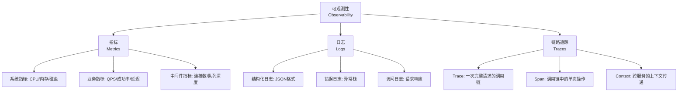

- **指标（Metrics）**：可聚合的数值型数据，适合监控趋势和设置告警。如 QPS、错误率、P99 延迟。
- **日志（Logs）**：离散的事件记录，适合问题排查和审计。关键在于结构化（JSON格式）。
- **链路追踪（Traces）**：一次请求在多个服务间的完整调用路径，适合定位分布式系统的性能瓶颈和错误根因。

### 7.2 OpenTelemetry 标准

OpenTelemetry 是 CNCF 的可观测性标准项目，统一了 Metrics、Logs 和 Traces 的采集协议和 SDK：

应用代码
  ↓ (SDK自动/手动埋点)
OpenTelemetry SDK
  ↓ (OTLP协议)
OpenTelemetry Collector
  ↓ (Exporter)
├── Prometheus (Metrics)
├── Jaeger / Zipkin (Traces)
├── Loki / Elasticsearch (Logs)
└── 各云厂商的APM服务

**核心概念：**

- **Trace**：一个完整的请求链路，由唯一的 TraceID 标识
- **Span**：Trace 中的一个操作单元，包含操作名、耗时、状态、Attributes
- **Context Propagation**：通过 HTTP Header（如 `traceparent`）在服务间传递追踪上下文
- **Sampling**：采样策略，在高吞吐场景下避免全量采集带来的性能和存储压力

### 7.3 采样策略

在高吞吐系统中，全量采集链路数据的成本极高。常见的采样策略：

| 策略 | 描述 | 优点 | 缺点 |
|------|------|------|------|
| 固定概率采样 | 按固定比例（如1%）采集 | 简单，资源可控 | 可能漏掉异常请求 |
| 自适应采样 | 根据系统负载动态调整比例 | 资源利用率高 | 实现复杂 |
| 尾部采样 | 请求完成后根据结果决定是否采集 | 可保留所有异常请求 | 需要收集完整链路后决策 |
| 限速采样 | 每秒最多采集N条 | 精确控制资源 | 高峰期可能丢失重要数据 |

> **实践建议**：生产环境推荐使用尾部采样（Tail-based Sampling），确保100%采集错误请求和慢请求，对正常请求按比例采样。OpenTelemetry Collector 的 `tail_sampling` processor 原生支持此策略。

## 8. API 网关与流量入口治理

### 8.1 网关的核心职责

API 网关是微服务架构的流量入口，承担了服务治理中多个关键职能：

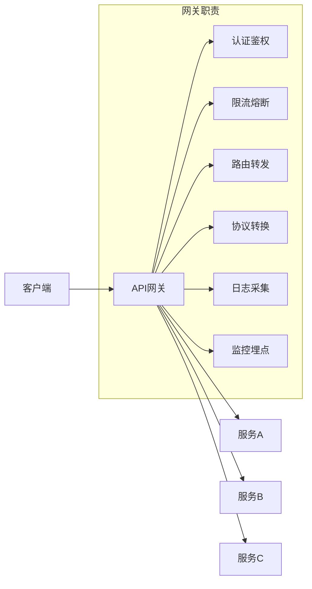

### 8.2 主流网关对比

| 特性 | Nginx/OpenResty | Kong | APISIX | Spring Cloud Gateway | Envoy |
|------|----------------|------|--------|---------------------|-------|
| 语言 | Lua | Lua | Lua | Java | C++ |
| 性能 | 极高 | 高 | 极高 | 中等 | 极高 |
| 配置方式 | 静态文件 | Admin API | Admin API | 代码/配置 | xDS API |
| 插件生态 | Lua模块 | 丰富 | 丰富 | Spring生态 | Filter链 |
| 服务发现 | 第三方 | DNS/第三方 | DNS/内置 | Eureka/Nacos等 | xDS |
| 热加载 | reload | 是 | 是 | 重启 | 是 |
| 适用场景 | 高性能反向代理 | 企业API管理 | 云原生网关 | Java微服务 | Service Mesh |

## 9. 服务治理成熟度模型

评估一个组织的服务治理水平，可以参考以下成熟度模型：

| 等级 | 名称 | 特征 | 关键能力 |
|------|------|------|----------|
| L1 | 初始级 | 无系统化治理，靠人工处理 | 基本的服务拆分 |
| L2 | 基础级 | 引入服务发现和基础负载均衡 | 注册中心、基本监控 |
| L3 | 标准化 | 统一的容错、限流、链路追踪 | 熔断降级、分布式追踪、结构化日志 |
| L4 | 可量化 | 完善的SLA/SLO体系，全链路灰度 | 混沌工程、自动化告警、SLA看板 |
| L5 | 优化级 | 智能化运维，自适应治理 | AIOps、自适应限流、故障自愈 |

**SLA 与 SLO 的关系：**

- **SLI（Service Level Indicator）**：服务等级指标，如可用性=99.95%、P99延迟=200ms
- **SLO（Service Level Objective）**：服务等级目标，如"99.9%的请求在300ms内完成"
- **SLA（Service Level Agreement）**：服务等级协议，是SLO的对外承诺，附带违约赔偿条款

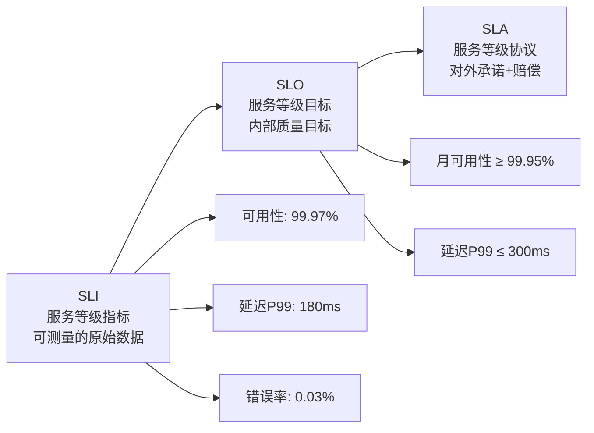

**错误预算（Error Budget）：**

如果SLO设定为99.95%可用性，那么每月允许的不可用时间约为21.6分钟（30天 × 24小时 × 60分钟 × 0.0005）。这就是"错误预算"——在预算范围内可以安全地进行变更和发布，预算耗尽时则应冻结变更优先修复稳定性。

## 10. 总结与实践路线

### 10.1 服务治理实施路线图

```mermaid
graph TB
    subgraph 第一阶段：基础治理
        A1[服务注册发现]
        A2[基础负载均衡]
        A3[统一日志格式]
    end
    
    subgraph 第二阶段：高可用治理
        B1[熔断降级]
        B2[限流控制]
        B3[链路追踪]
    end
    
    subgraph 第三阶段：精细治理
        C1[全链路灰度]
        C2[流量染色]
        C3[混沌工程]
    end
    
    subgraph 第四阶段：智能治理
        D1[AIOps告警]
        D2[自适应治理]
        D3[故障自愈]
    end
    
    A1 --> A2 --> A3
    A3 --> B1 --> B2 --> B3
    B3 --> C1 --> C2 --> C3
    C3 --> D1 --> D2 --> D3
```

### 10.2 核心要点回顾

| 治理领域 | 核心问题 | 解决方案 | 推荐工具 |
|----------|----------|----------|----------|
| 服务发现 | 如何找到服务实例 | 注册中心 + 健康检查 | Nacos、Consul |
| 负载均衡 | 如何分配请求 | 多种调度算法 | Ribbon、Envoy |
| 容错保护 | 如何应对服务故障 | 熔断 + 降级 + 重试 | Resilience4j、Sentinel |
| 流量控制 | 如何防止系统过载 | 限流 + 熔断 | Sentinel、Envoy |
| 可观测性 | 如何了解系统状态 | Metrics + Logs + Traces | Prometheus、Jaeger、OpenTelemetry |
| 流量治理 | 如何精细化管理流量 | 网关 + 灰度 + 路由 | APISIX、Istio |

服务治理不是一蹴而就的工程，而是一个持续演进的过程。从最基础的服务注册发现开始，逐步引入容错、限流、链路追踪等能力，最终实现智能化的自适应治理。关键在于**量力而行**——根据团队规模和业务复杂度选择合适的治理深度，避免过度治理带来的认知负担和维护成本。
