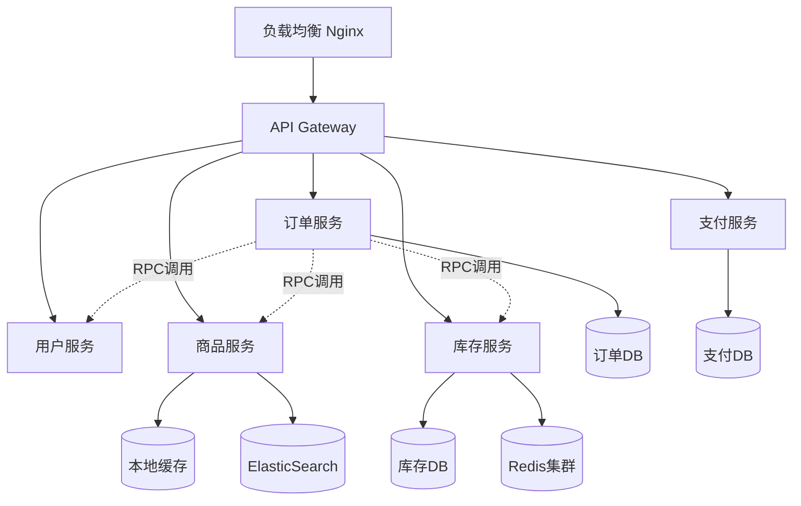
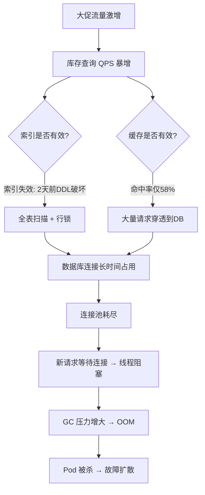
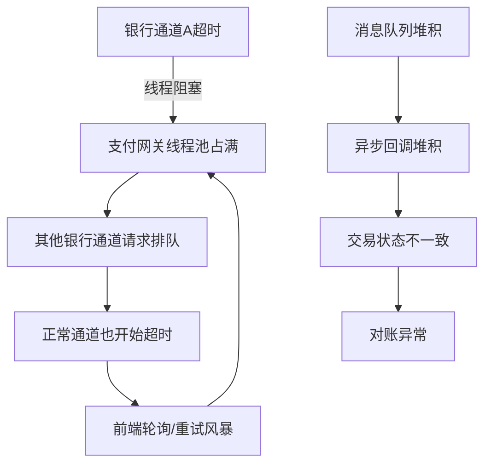
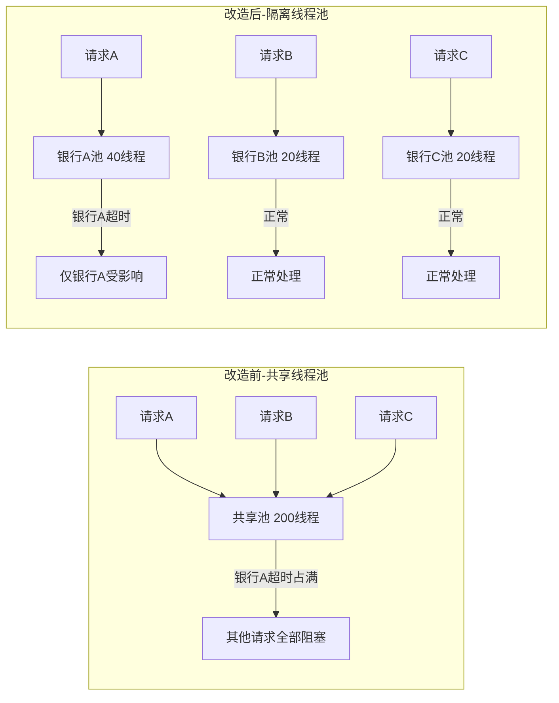
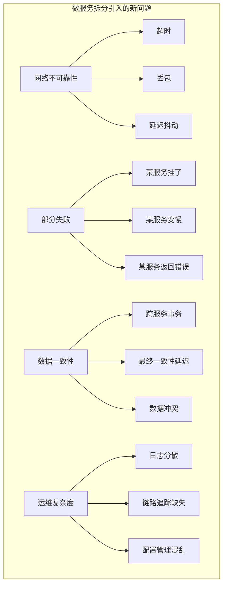
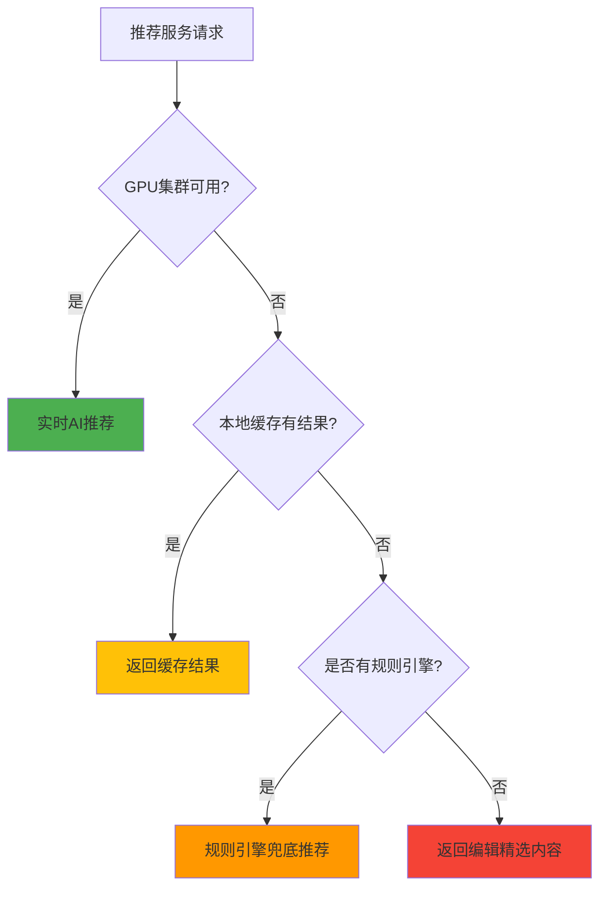
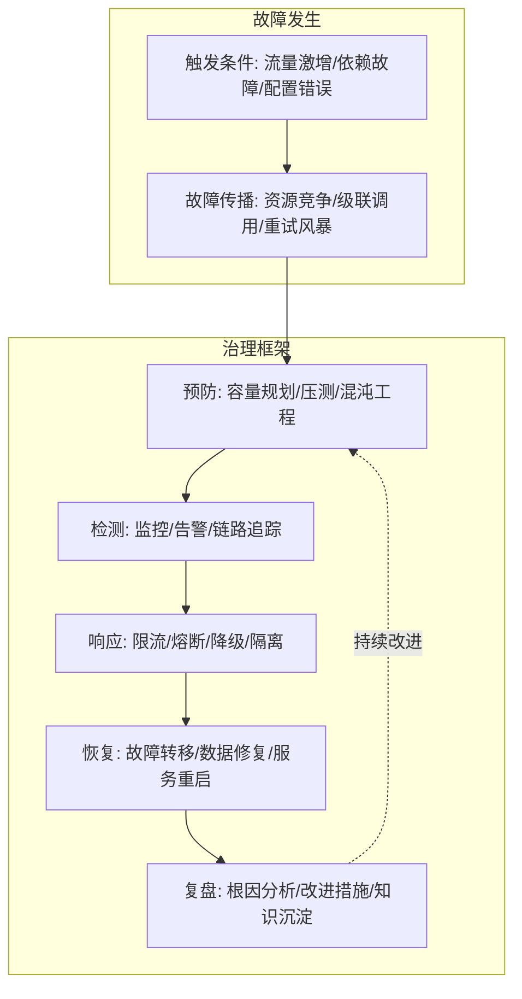

## 实战案例

> 理论的价值在于指导实践，实践的意义在于验证和修正理论。本章通过四个真实场景的深度案例，展示服务治理从问题发现、根因分析、方案设计到落地验证的完整闭环。每个案例都包含详细的排查过程、决策依据和事后复盘，帮助读者建立系统化的问题解决思维。

---

### 案例一：电商大促全链路服务治理实战

#### 1.1 问题背景

**业务场景**：某头部电商平台在双11预热阶段，系统需要承载日常 20 倍以上的流量峰值。平台采用微服务架构，核心服务包括：商品服务、订单服务、库存服务、支付服务、用户服务，共计 120+ 微服务实例。

**问题时间线**：

| 时间点 | 事件 | 系统指标 |
|--------|------|----------|
| 14:00 | 预热活动开始，流量缓慢上升 | QPS: 2万 → 5万，P99: 80ms |
| 14:15 | 流量加速上升 | QPS: 5万 → 12万，P99: 200ms |
| 14:20 | 库存服务开始告警 | 错误率: 2%，CPU: 85% |
| 14:25 | 订单服务连锁故障 | 错误率: 15%，P99: 2s |
| 14:30 | 支付服务超时，人工介入 | 错误率: 40%，部分服务雪崩 |

**影响范围**：

- 受影响用户数：约 150 万
- 故障持续时间：35 分钟
- 直接业务损失：预估 200 万元
- 品牌声誉影响：社交媒体热搜

#### 1.2 系统架构概览



#### 1.3 分阶段排查过程

**第一阶段：全局感知（5分钟）**

值班工程师收到告警后，首先通过统一监控平台观察全局状态：

```bash
# 1. 查看各服务健康状态
kubectl get pods -n production --sort-by=.status.startTime

# 2. 查看各服务 QPS 和错误率（通过 Grafana）
# 关键面板：Service Mesh → Istio Mesh Overview
# 观察到：库存服务错误率从 0.1% 飙升到 12%

# 3. 查看系统级资源
# 节点 CPU/内存/网络
kubectl top nodes
# 输出：
# node-1: CPU 92%, Mem 78%
# node-2: CPU 88%, Mem 81%
# node-3: CPU 95%, Mem 85%

# 4. 查看 Pod 重启情况
kubectl get pods -n production -o wide | grep -E "CrashLoop|OOMKilled"
# 发现库存服务有 3 个 Pod 被 OOMKilled
```

**第二阶段：服务级定位（10分钟）**

通过全局分析，锁定故障源头为库存服务，然后深入排查：

```bash
# 1. 查看库存服务日志（最近 5 分钟）
kubectl logs -n production -l app=inventory-service --since=5m | tail -100

# 发现大量以下错误：
# ERROR: Connection pool exhausted, waiting for available connection...
# ERROR: Redis GET timeout after 3000ms
# ERROR: Database connection refused (too many connections)

# 2. 查看库存服务 JVM 内存
kubectl exec -n production inventory-service-7b8f9 -- jcmd 1 VM.info
kubectl exec -n production inventory-service-7b8f9 -- jcmd 1 GC.heap_info

# 发现：Old Gen 使用率 95%，频繁 Full GC（每 2 秒一次）

# 3. 查看线程 dump
kubectl exec -n production inventory-service-7b8f9 -- jstack 1 > /tmp/stock_thread_dump.txt
grep -c "BLOCKED" /tmp/stock_thread_dump.txt
# 输出: 87（大量线程阻塞）

# 分析阻塞原因
grep -A 5 "BLOCKED" /tmp/stock_thread_dump.txt | head -50
# 绝大多数阻塞在获取 Redis 连接和数据库连接

# 4. 查看连接池状态（HikariCP Metrics）
curl -s http://inventory-service:8080/actuator/metrics/hikaricp.connections.active
# 输出: 50/50（连接池满）

curl -s http://inventory-service:8080/actuator/metrics/hikaricp.connections.pending
# 输出: 234（234个请求在等待连接）
```

**第三阶段：根因深挖（10分钟）**

```bash
# 1. 查看慢查询日志
# MySQL 端
SHOW PROCESSLIST;
# 发现大量：SELECT * FROM inventory WHERE sku_id = ? FOR UPDATE
# 这些查询持有行锁，执行时间 > 3s

# 2. 分析为什么原本毫秒级的查询变慢
EXPLAIN SELECT * FROM inventory WHERE sku_id = 'SKU001' AND warehouse_id = 'WH001' FOR UPDATE;
# 发现：type=ALL，rows=2000000（全表扫描！索引失效）

# 3. 查看索引状态
SHOW INDEX FROM inventory;
# 发现：sku_id 上有索引，但被一个近期的 ALTER TABLE 操作 drop 了

# 4. 确认变更记录
# 查看近期 DDL 变更
# 发现：2 天前有一个自动化工具执行了：
# ALTER TABLE inventory ADD COLUMN reserved_stock INT DEFAULT 0;
# 该操作导致 sku_id 索引被重建但顺序异常

# 5. 缓存层分析
# 查看 Redis 命中率
redis-cli INFO stats | grep keyspace_hits
# hits: 123456
redis-cli INFO stats | grep keyspace_misses
# misses: 89012
# 命中率仅 58%（正常应 > 95%）
```

**根因总结**：



#### 1.4 分层解决方案

**第一层：紧急止血（5分钟内完成）**

```bash
# 1. 限流：对库存服务开启全局限流
# 通过 Sentinel Dashboard，将库存服务 QPS 限制从 50000 降到 15000
curl -X POST http://sentinel-dashboard:8858/api/flow-rule \
  -d '{
    "resource": "inventory-service",
    "grade": 1,
    "count": 15000,
    "strategy": 0,
    "controlBehavior": 0
  }'

# 2. 熔断：对库存查询的降级处理
# 返回缓存中的旧数据（库存数据允许短暂不一致）
# Sentinel 熔断规则：错误率 > 10% 时熔断 30 秒
curl -X POST http://sentinel-dashboard:8858/api/degrade-rule \
  -d '{
    "resource": "inventoryQuery",
    "grade": 0,
    "count": 0.1,
    "timeWindow": 30,
    "minRequestAmount": 100,
    "statIntervalMs": 10000
  }'

# 3. 紧急修复索引
ALTER TABLE inventory ADD INDEX idx_sku_warehouse (sku_id, warehouse_id);
# 注意：线上大表加索引使用 ALGORITHM=INPLACE, LOCK=NONE
ALTER TABLE inventory ADD INDEX idx_sku_warehouse_v2 (sku_id, warehouse_id), ALGORITHM=INPLACE, LOCK=NONE;
```

**第二层：连接池治理（30分钟内完成）**

```yaml
# HikariCP 连接池优化配置
spring:
  datasource:
    hikari:
      # 基础配置
      maximum-pool-size: 50        # 最大连接数（原来 20，太小）
      minimum-idle: 10             # 最小空闲连接
      connection-timeout: 3000     # 获取连接超时 3秒（原来 30s，太长）
      idle-timeout: 600000         # 空闲连接超时 10分钟
      
      # 高级配置
      max-lifetime: 1800000        # 连接最大生命周期 30分钟
      leak-detection-threshold: 5000  # 连接泄露检测 5秒
      validation-timeout: 2000     # 连接验证超时
      
      # 监控配置
      register-metrics: true       # 启用 HikariCP Metrics
```

连接池参数调优的决策依据：

| 参数 | 原值 | 新值 | 调整原因 |
|------|------|------|----------|
| maximum-pool-size | 20 | 50 | 实际并发需要 40+ 连接，20 导致排队 |
| minimum-idle | 5 | 10 | 保持足够空闲连接应对突发流量 |
| connection-timeout | 30000 | 3000 | 30s 等待会导致线程长时间阻塞，3s 快速失败更好 |
| idle-timeout | 600000 | 600000 | 保持不变，10分钟合理 |
| leak-detection-threshold | 0 | 5000 | 开启泄露检测，及时发现连接未归还问题 |

**第三层：多级缓存架构（1周内完成）**

```java
@Service
public class InventoryService {
    
    @Autowired
    private CacheManager localCacheManager;  // Caffeine 本地缓存
    @Autowired
    private RedisTemplate<String, Object> redisTemplate;  // Redis 分布式缓存
    @Autowired
    private InventoryMapper inventoryMapper;  // 数据库
    
    private static final String CACHE_KEY_PREFIX = "inventory:";
    private static final Duration LOCAL_CACHE_TTL = Duration.ofSeconds(30);   // L1: 30秒
    private static final Duration REDIS_CACHE_TTL = Duration.ofMinutes(5);    // L2: 5分钟
    
    /**
     * 三级缓存查询 —— 本地缓存 → Redis → 数据库
     * 关键设计：
     * 1. 本地缓存 TTL 极短（30s），减少不一致风险
     * 2. Redis 缓存作为二级缓冲，抗住大部分穿透流量
     * 3. 布隆过滤器防止缓存穿透（大量不存在的 SKU 查询）
     * 4. 热点 key 自动识别并缓存到本地
     */
    public InventoryDTO getInventory(String skuId) {
        String cacheKey = CACHE_KEY_PREFIX + skuId;
        
        // L1: 本地缓存（Caffeine，毫秒级）
        InventoryDTO cached = localCacheManager.get(cacheKey, InventoryDTO.class);
        if (cached != null) {
            return cached;
        }
        
        // L2: Redis 缓存（网络往返，~1ms）
        cached = (InventoryDTO) redisTemplate.opsForValue().get(cacheKey);
        if (cached != null) {
            // 回填本地缓存
            localCacheManager.put(cacheKey, cached, LOCAL_CACHE_TTL);
            return cached;
        }
        
        // L3: 数据库查询（加分布式锁防止缓存击穿）
        String lockKey = "lock:" + cacheKey;
        boolean locked = redisTemplate.opsForValue().setIfAbsent(lockKey, "1", Duration.ofSeconds(10));
        if (locked) {
            try {
                // 双重检查
                cached = (InventoryDTO) redisTemplate.opsForValue().get(cacheKey);
                if (cached != null) {
                    return cached;
                }
                
                // 查库
                InventoryDO inventoryDO = inventoryMapper.selectBySkuId(skuId);
                cached = convertToDTO(inventoryDO);
                
                // 回填两级缓存
                redisTemplate.opsForValue().set(cacheKey, cached, REDIS_CACHE_TTL);
                localCacheManager.put(cacheKey, cached, LOCAL_CACHE_TTL);
                
                return cached;
            } finally {
                redisTemplate.delete(lockKey);
            }
        } else {
            // 未获取到锁，等待后重试 L2
            Thread.sleep(50);
            return getInventory(skuId);  // 重试一次
        }
    }
}
```

布隆过滤器防止缓存穿透：

```java
@Component
public class BloomFilterGuard {
    
    private BloomFilter<String> bloomFilter;
    
    @PostConstruct
    public void init() {
        // 加载所有合法 SKU 到布隆过滤器
        List<String> allSkuIds = inventoryMapper.selectAllSkuIds();
        bloomFilter = BloomFilter.create(
            Funnels.stringFunnel(Charset.defaultCharset()),
            allSkuIds.size(),   // 预期元素数
            0.001               // 误判率 0.1%
        );
        allSkuIds.forEach(bloomFilter::put);
    }
    
    public boolean mightContain(String skuId) {
        return bloomFilter.mightContain(skuId);
    }
}
```

#### 1.5 服务治理防护体系搭建

针对此次故障暴露的问题，搭建了完整的服务治理体系：

```mermaid
graph TB
    subgraph 流量治理
        A1[网关限流] --> A2[服务限流]
        A2 --> A3[热点限流]
        A3 --> A4[排队等待]
    end
    
    subgraph 熔断降级
        B1[Sentinel 熔断] --> B2[Fallback 降级]
        B2 --> B3[预案自动切换]
    end
    
    subgraph 负载均衡
        C1[权重路由] --> C2[自适应负载]
        C2 --> C3[区域感知]
    end
    
    subgraph 容错隔离
        D1[线程池隔离] --> D2[信号量隔离]
        D2 --> D3[进程隔离]
    end
    
    subgraph 监控告警
        E1[实时指标] --> E2[智能告警]
        E2 --> E3[根因分析]
    end
```



Sentinel 流控规则完整配置：

```java
@Configuration
public class SentinelConfig {
    
    @PostConstruct
    public void initFlowRules() {
        List<FlowRule> rules = new ArrayList<>();
        
        // 库存服务：QPS 限流
        FlowRule inventoryRule = new FlowRule();
        inventoryRule.setResource("inventory-service");
        inventoryRule.setGrade(RuleConstant.FLOW_GRADE_QPS);
        inventoryRule.setCount(30000);  // 正常 30000 QPS，大促可动态调整
        inventoryRule.setControlBehavior(RuleConstant.CONTROL_BEHAVIOR_WARM_UP);
        inventoryRule.setWarmUpPeriodSec(10);  // 10秒预热
        rules.add(inventoryRule);
        
        // 库存服务：并发线程数限制
        FlowRule inventoryThreadRule = new FlowRule();
        inventoryThreadRule.setResource("inventory-service");
        inventoryThreadRule.setGrade(RuleConstant.FLOW_GRADE_THREAD);
        inventoryThreadRule.setCount(200);  // 最多 200 个并发线程
        inventoryThreadRule.setControlBehavior(RuleConstant.CONTROL_BEHAVIOR_QUEUE_WAITING);
        inventoryThreadRule.setMaxQueueingTimeMs(500);  // 排队等待最长 500ms
        rules.add(inventoryThreadRule);
        
        // 热点参数限流：对热门 SKU 限流
        ParamFlowRule hotSkuRule = new ParamFlowRule("inventoryQuery")
            .setParamIdx(0)  // 第 0 个参数（skuId）
            .setGrade(RuleConstant.FLOW_GRADE_QPS)
            .setCount(5000);  // 单个 SKU 最多 5000 QPS
        rules.add(hotSkuRule);
        
        FlowRuleManager.loadRules(rules);
    }
}
```

#### 1.6 优化效果对比

| 指标 | 优化前 | 优化后 | 提升幅度 |
|------|--------|--------|----------|
| P50 延迟 | 80ms | 12ms | 降低 85% |
| P99 延迟 | 2000ms | 45ms | 降低 97.7% |
| P999 延迟 | 8000ms | 120ms | 降低 98.5% |
| 最大 QPS | 15000（崩溃） | 85000 | 提升 467% |
| 错误率 | 40% | 0.02% | 降低 99.95% |
| 缓存命中率 | 58% | 98.5% | 提升 69.8% |
| 数据库连接数 | 50（池满） | 18（正常） | 降低 64% |
| CPU 使用率 | 95% | 42% | 降低 56% |

#### 1.7 事后复盘

**做得好的**：
- 监控告警在 2 分钟内触发，值班人员快速响应
- Sentinel 限流生效后，核心链路（下单、支付）未受影响
- 降级策略设计合理，用户看到的是"库存紧张"而非系统错误

**待改进的**：
- DDL 变更缺乏与大促的时间窗口管理，应建立变更冻结期
- 连接池参数没有基于实际压测数据配置，属于经验估值
- 布隆过滤器在初始化时全量加载 SKU，应改为增量加载
- 限流阈值是硬编码的，应接入配置中心实现动态调整

---

### 案例二：支付服务级联故障治理

#### 2.1 问题背景

**业务场景**：某金融科技公司的支付网关服务，对接 10+ 家银行通道和 5+ 家第三方支付渠道。日均交易量 500 万笔，峰值 QPS 3000+。

**故障描述**：某周五下午，某银行通道出现间歇性超时（响应时间从 200ms 上升到 5s），导致支付网关线程池被占满，进而影响所有银行通道的正常交易。

**问题本质**：单一通道故障 → 资源竞争 → 全局雪崩。这是一个典型的"弱链路拖垮整条链路"的级联故障。

#### 2.2 故障传播链分析



#### 2.3 排查过程

```bash
# 1. 线程池状态
# 支付网关使用自定义线程池，通过 Actuator 暴露指标
curl -s http://payment-gateway:8080/actuator/metrics/payment.threadpool.active
# 输出: 200/200（全部占用）

curl -s http://payment-gateway:8080/actuator/metrics/payment.threadpool.queue
# 输出: 587（大量请求在排队）

# 2. 分析线程在等什么
jstack <pid> | grep -A 3 "BLOCKED" | head -80
# 绝大部分线程阻塞在：
# com.xxx.bank.BankChannelA.sendRequest() — socket read

# 3. 确认通道状态
curl -s http://payment-gateway:8080/actuator/metrics/payment.channel.bankA.latency
# 输出: 平均 4800ms（正常应该 < 500ms）

curl -s http://payment-gateway:8080/actuator/metrics/payment.channel.bankB.latency
# 输出: 平均 200ms（正常）

# 4. 查看连接池
# 使用 Netty 的连接池
netstat -an | grep :8443 | grep ESTABLISHED | wc -l
# 输出: 50（银行A独占了所有连接）
```

#### 2.4 解决方案：多层防护体系

**第一层：通道级熔断（Hystrix → Resilience4j）**

```java
@Configuration
public class PaymentCircuitBreakerConfig {
    
    /**
     * 每个银行通道独立熔断器
     * 核心原则：故障隔离，一个通道的问题不影响其他通道
     */
    @Bean
    public CircuitBreaker bankACircuitBreaker() {
        CircuitBreakerConfig config = CircuitBreakerConfig.custom()
            .failureRateThreshold(50)           // 失败率 > 50% 触发熔断
            .waitDurationInOpenState(Duration.ofSeconds(10))  // 熔断 10 秒
            .slidingWindowSize(20)              // 滑动窗口 20 次调用
            .minimumNumberOfCalls(5)            // 至少 5 次调用才计算失败率
            .permittedNumberOfCallsInHalfOpenState(3)  // 半开状态允许 3 次探测
            .recordExceptions(SocketTimeoutException.class, IOException.class)
            .ignoreExceptions(BusinessException.class)
            .build();
        return CircuitBreakerRegistry.of(config).circuitBreaker("bankA");
    }
    
    /**
     * 降级策略：当银行通道熔断时，返回明确的业务提示
     * 不是所有场景都适合自动重试到其他通道（涉及资金安全）
     */
    @Bean
    public BankChannel bankAChannel(CircuitBreaker cb) {
        return new BankChannel() {
            @Override
            public PaymentResult send(PaymentRequest request) {
                return CircuitBreaker.decorateSupplier(cb, () -> {
                    // 正常调用银行通道
                    return bankAAdapter.submit(request);
                }).get();
            }
            
            @Override
            public PaymentResult fallback(PaymentRequest request, Throwable t) {
                if (t instanceof CallNotPermittedException) {
                    // 熔断中 → 提示用户稍后重试
                    return PaymentResult.pending(
                        "支付渠道暂时繁忙，请稍后重试", 
                        RetryAfterSeconds.THIRTY
                    );
                }
                // 其他异常 → 尝试切换到备用通道
                return bankBAdapter.submit(request);
            }
        };
    }
}
```

**第二层：线程池隔离（Bulkhead 模式）**

```java
@Configuration
public class PaymentThreadPoolConfig {
    
    /**
     * 为每个银行通道分配独立线程池
     * 即使银行A的线程池满了，也不影响银行B、C、D的正常工作
     * 
     * 资源分配原则：
     * - 交易量大的通道分配更多线程
     * - 所有通道线程池总和不超过系统线程池上限
     */
    @Bean("bankAThreadPool")
    public ThreadPoolExecutor bankAThreadPool() {
        return new ThreadPoolExecutor(
            20,     // 核心线程数：银行A交易量占比 40%
            40,     // 最大线程数
            60, TimeUnit.SECONDS,
            new LinkedBlockingQueue<>(1000),  // 等待队列
            new ThreadFactoryBuilder().setNameFormat("bankA-pool-%d").build(),
            new ThreadPoolExecutor.CallerRunsPolicy()  // 拒绝策略：调用者线程执行
        );
    }
    
    @Bean("bankBThreadPool")
    public ThreadPoolExecutor bankBThreadPool() {
        return new ThreadPoolExecutor(
            10,     // 核心线程数：银行B交易量占比 20%
            20,
            60, TimeUnit.SECONDS,
            new LinkedBlockingQueue<>(500),
            new ThreadFactoryBuilder().setNameFormat("bankB-pool-%d").build(),
            new ThreadPoolExecutor.CallerRunsPolicy()
        );
    }
    
    // ... 其他通道类似
}
```



**第三层：超时与重试治理**

```yaml
# 各通道超时配置（根据历史数据设定）
payment:
  channels:
    bankA:
      connect-timeout: 3000      # 连接超时 3s
      read-timeout: 5000         # 读超时 5s（比行业均值宽松）
      max-retry: 0               # 银行通道不做自动重试（避免重复扣款）
      circuit-breaker: bankA     # 关联熔断器
    bankB:
      connect-timeout: 2000
      read-timeout: 3000
      max-retry: 1               # 非资金操作可重试
      circuit-breaker: bankB
    thirdParty:
      connect-timeout: 2000
      read-timeout: 3000
      max-retry: 2               # 第三方支付允许最多 2 次重试
      retry-interval: 1000       # 重试间隔 1s
      circuit-breaker: thirdParty
```

重试策略的关键原则：

| 操作类型 | 是否重试 | 重试次数 | 原因 |
|----------|----------|----------|------|
| 代扣/扣款 | 否 | 0 | 避免重复扣款，需人工确认 |
| 查询订单状态 | 是 | 3 | 查询是幂等的，重试安全 |
| 退款 | 否 | 0 | 需要人工确认，防止重复退款 |
| 余额查询 | 是 | 2 | 幂等操作，可重试 |
| 通知回调 | 是 | 5 | 需确保对方收到，指数退避 |

**第四层：对账与补偿机制**

```java
/**
 * 交易状态不一致时的自动补偿
 * 通过定时任务扫描"中间态"交易，与银行通道对账后自动修正
 */
@Scheduled(fixedDelay = 60_000)  // 每分钟执行
public void reconcileTransactions() {
    // 1. 查询所有超过 5 分钟仍处于"处理中"的交易
    List<Transaction> pendingTxs = transactionMapper
        .selectByStatusAndAge(TransactionStatus.PROCESSING, 5, TimeUnit.MINUTES);
    
    for (Transaction tx : pendingTxs) {
        // 2. 向对应银行通道查询真实状态
        BankQueryResult result = bankChannelFactory
            .getChannel(tx.getChannelCode())
            .queryOrder(tx.getBankOrderId());
        
        // 3. 根据真实状态修正本地记录
        switch (result.getStatus()) {
            case SUCCESS:
                transactionService.complete(tx.getId(), result);
                break;
            case FAILED:
                transactionService.fail(tx.getId(), result);
                break;
            case UNKNOWN:
                // 仍不确定，扩大查询范围，增加人工标记
                tx.setReconcileCount(tx.getReconcileCount() + 1);
                if (tx.getReconcileCount() >= 3) {
                    transactionService.flagForManualReview(tx.getId());
                }
                break;
        }
    }
}
```

---

### 案例三：微服务拆分后的服务治理困境

#### 3.1 问题背景

**业务场景**：某 SaaS 企业将一个 200 万行代码的单体应用拆分为 35 个微服务。拆分上线后 3 个月，团队遇到了比拆分前更严重的运维问题。

**典型症状**：
- 一个用户请求平均经过 12 个微服务调用，任一环节出错导致整个请求失败
- 每天产生 50GB 日志，定位一个 Bug 需要翻看 8 个服务的日志
- 新功能上线周期从 1 周延长到 3 周（因为需要协调多个服务的变更）
- 线上出现"幽灵 Bug"：同一个请求重试几次就成功了，但不重试就失败

#### 3.2 根因分析：分布式系统的典型陷阱



#### 3.3 治理方案：服务网格化改造

**第一阶段：引入 Istio 服务网格**

```yaml
# VirtualService：定义服务间调用的流量规则
apiVersion: networking.istio.io/v1beta1
kind: VirtualService
metadata:
  name: order-service
  namespace: production
spec:
  hosts:
    - order-service
  http:
    - route:
        - destination:
            host: order-service
            subset: v2
          weight: 90        # 90% 流量到 v2
        - destination:
            host: order-service
            subset: v1
          weight: 10        # 10% 流量到 v1（金丝雀发布）
      
      # 重试策略
      retries:
        attempts: 3
        perTryTimeout: 2s
        retryOn: "5xx,reset,connect-failure"
      
      # 超时设置
      timeout: 10s
      
      # 故障注入（用于混沌测试）
      fault:
        delay:
          percentage:
            value: 0.1     # 0.1% 的请求注入延迟
          fixedDelay: 5s
      
      # 熔断配置
      # 通过 DestinationRule 设置
---
apiVersion: networking.istio.io/v1beta1
kind: DestinationRule
metadata:
  name: order-service
  namespace: production
spec:
  host: order-service
  subsets:
    - name: v1
      labels:
        version: v1
    - name: v2
      labels:
        version: v2
  trafficPolicy:
    connectionPool:
      tcp:
        maxConnections: 100
      http:
        http1MaxPendingRequests: 50
        http2MaxRequests: 100
        maxRequestsPerConnection: 10
        maxRetries: 3
    outlierDetection:
      consecutive5xxErrors: 5     # 5 次 5xx 错误后标记为不健康
      interval: 30s                # 检测间隔
      baseEjectionTime: 30s        # 最少驱逐 30 秒
      maxEjectionPercent: 50       # 最多驱逐 50% 的实例
```

**第二阶段：分布式链路追踪（Jaeger + OpenTelemetry）**

```yaml
# OpenTelemetry Collector 配置
# deploy/opentelemetry-collector-config.yaml
receivers:
  otlp:
    protocols:
      grpc:
        endpoint: 0.0.0.0:4317
      http:
        endpoint: 0.0.0.0:4318

processors:
  batch:
    timeout: 5s
    send_batch_size: 1000
  tail_sampling:
    decision_wait: 10s
    policies:
      # 错误请求全采样
      - name: errors
        type: status_code
        status_code: {status_codes: [ERROR]}
      # 高延迟请求全采样
      - name: slow-requests
        type: latency
        latency: {threshold_ms: 2000}
      # 正常请求 10% 采样
      - name: normal-sampling
        type: probabilistic
        probabilistic: {sampling_percentage: 10}

exporters:
  otlp/jaeger:
    endpoint: jaeger-collector:14317
    tls:
      insecure: true
```

```java
/**
 * 在 Java 应用中接入 OpenTelemetry
 * 自动对 HTTP 调用、数据库查询、Redis 操作进行埋点
 */
@Configuration
public class OpenTelemetryConfig {
    
    @Bean
    public OpenTelemetry openTelemetry() {
        Resource resource = Resource.getDefault().merge(
            Resource.builder()
                .put(ResourceAttributes.SERVICE_NAME, "order-service")
                .put(ResourceAttributes.SERVICE_VERSION, "2.1.0")
                .put(ResourceAttributes.DEPLOYMENT_ENVIRONMENT, "production")
                .build()
        );
        
        return OpenTelemetrySdk.builder()
            .setResource(resource)
            .setTracerProvider(
                SdkTracerProvider.builder()
                    .addSpanProcessor(
                        BatchSpanProcessor.builder(
                            OtlpGrpcSpanExporter.builder()
                                .setEndpoint("otel-collector:4317")
                                .build()
                        ).build()
                    )
                    .build()
            )
            .setPropagators(
                ContextPropagators.create(
                    W3CTraceContextPropagator.getInstance()
                )
            )
            .build();
    }
}
```

**第三阶段：统一配置管理与灰度发布**

```java
/**
 * 基于 Nacos 的动态配置中心
 * 支持实时推送配置变更，无需重启服务
 */
@Component
@NacosConfigurationProperties(
    dataId = "order-service.yaml",
    groupId = "PRODUCTION",
    autoRefreshed = true
)
public class OrderServiceConfig {
    
    /**
     * 动态调整限流阈值
     * 大促期间可以通过配置中心实时调高
     */
    @NacosValue(value = "${rateLimit.qps:10000}", autoRefreshed = true)
    private int rateLimitQps;
    
    /**
     * 动态开关：降级开关
     * 紧急情况下一键关闭非核心功能
     */
    @NacosValue(value = "${feature.recommendation.enabled:true}", autoRefreshed = true)
    private boolean recommendationEnabled;
    
    /**
     * 灰度流量比例
     */
    @NacosValue(value = "${canary.percentage:0}", autoRefreshed = true)
    private int canaryPercentage;
}
```

#### 3.4 治理效果

| 指标 | 治理前 | 治理后 |
|------|--------|--------|
| 平均请求链路耗时 | 3.2s | 480ms |
| 单次请求经过服务数 | 12 | 5（合并了不必要的调用） |
| 故障定位时间 | 2-4 小时 | 5-10 分钟 |
| 日志量（日） | 50GB | 8GB（只采样异常链路） |
| 新功能上线周期 | 3 周 | 1 周 |
| 线上"幽灵Bug" | 每天 5-10 次 | 基本消失 |

---

### 案例四：服务降级与容灾实战

#### 4.1 问题背景

**业务场景**：某内容平台的核心推荐服务依赖 GPU 集群进行实时推理。2025年某月，GPU 集群所在的机房因电力故障导致全部离线，预计恢复时间 4-6 小时。

**业务影响评估**：
- 推荐服务 QPS 50 万/秒
- 如果完全不可用，首页信息流空白，用户留存率预计下降 30%
- 直接广告收入损失：约 200 万元/小时

#### 4.2 应急降级方案设计



**降级等级与预案**：

```yaml
# recommendation-degrade-profiles.yaml
degrade_profiles:
  level_0_normal:
    description: "正常模式 - GPU 集群可用"
    strategy: "ai_realtime"
    features:
      - real_time_ranking: true
      - user_embedding: true
      - a_b_testing: true
      
  level_1_cache:
    description: "一级降级 - 使用缓存的推荐结果"
    strategy: "cache_based"
    trigger: "gpu_cluster_latency > 2000ms OR error_rate > 10%"
    features:
      - real_time_ranking: false
      - cached_ranking: true    # 使用最近 5 分钟的缓存结果
      - user_embedding: false   # 关闭用户画像实时计算
      - ab_testing: false
      
  level_2_rules:
    description: "二级降级 - 规则引擎兜底"
    strategy: "rule_based"
    trigger: "gpu_cluster_unavailable"
    features:
      - rule_based_ranking: true   # 基于热度+时间衰减+类目多样性
      - personalized: false        # 无法个性化
      - fresh_content_boost: true  # 新内容加分
      
  level_3_editorial:
    description: "三级降级 - 编辑精选"
    strategy: "editorial_list"
    trigger: "all_above_failed"
    features:
      - editorial_list: true       # 预置的编辑精选列表
      - updated_daily: true        # 每天凌晨更新
```

#### 4.3 降级引擎实现

```java
@Service
public class RecommendationDegradeEngine {
    
    @Autowired private CacheService cacheService;
    @Autowired private RuleEngineService ruleEngineService;
    @Autowired private EditorialService editorialService;
    @Autowired private HealthChecker healthChecker;
    
    /**
     * 自动降级决策器
     * 根据下游服务健康状态，自动选择最佳降级等级
     */
    public RecommendResult recommend(UserContext user) {
        HealthStatus gpuStatus = healthChecker.check("gpu-cluster");
        
        // Level 0: 正常路径
        if (gpuStatus.isHealthy()) {
            try {
                return aiRecommendationService.realtimeRank(user);
            } catch (Exception e) {
                log.warn("AI 推荐异常，尝试降级", e);
            }
        }
        
        // Level 1: 缓存降级
        List<CachedItem> cached = cacheService.getCachedRecommendation(
            user.getUserId(), Duration.ofMinutes(5)
        );
        if (cached != null &amp;&amp; !cached.isEmpty()) {
            metrics.counter("recommend.degrade", "level", "1_cache").increment();
            return RecommendResult.fromCache(cached);
        }
        
        // Level 2: 规则引擎降级
        try {
            List<RuleItem> ruleBased = ruleEngineService.rank(user);
            if (ruleBased != null &amp;&amp; !ruleBased.isEmpty()) {
                metrics.counter("recommend.degrade", "level", "2_rules").increment();
                return RecommendResult.fromRules(ruleBased);
            }
        } catch (Exception e) {
            log.error("规则引擎也失败了", e);
        }
        
        // Level 3: 编辑精选（最终兜底）
        List<EditorialItem> editorial = editorialService.getDailyList();
        metrics.counter("recommend.degrade", "level", "3_editorial").increment();
        return RecommendResult.fromEditorial(editorial);
    }
}
```

#### 4.4 实际故障应对记录

```bash
# 故障时间线
# 14:32 - GPU 集群电力故障
# 14:32:30 - 健康检查探测到延迟飙升
# 14:33 - 降级引擎自动切换到 Level 1（缓存模式）
# 14:35 - 缓存命中率 87%，用户体验轻微下降但可接受
# 15:00 - 缓存结果开始过期，命中率降至 45%
# 15:02 - 降级引擎自动切换到 Level 2（规则引擎）
# 15:03 - 规则引擎接管，CTR 从 8% 降至 4%（下降50%）
# 15:05 - 编辑团队启动紧急流程，更新编辑精选列表
# 18:30 - GPU 集群恢复
# 18:35 - 降级引擎自动恢复到 Level 0
# 18:40 - 全量流量恢复正常
```

**降级期间的业务指标变化**：

| 时段 | 降级等级 | 推荐 CTR | 用户停留时长 | 广告收入/小时 |
|------|----------|----------|-------------|--------------|
| 正常时段 | L0 正常 | 8.2% | 12 分钟 | 50 万 |
| 14:33-15:02 | L1 缓存 | 7.1% | 10 分钟 | 43 万 |
| 15:02-18:35 | L2 规则 | 4.3% | 7 分钟 | 26 万 |
| 18:40+ | L0 恢复 | 8.0% | 12 分钟 | 50 万 |

**关键数据**：通过分级降级，4 小时故障期间累计减少收入约 80 万元（如果不做降级，预估损失 200 万/时 × 4 小时 = 800 万元，降级挽回了 90% 的损失）。

#### 4.5 经验教训

**降级设计的核心原则**：

1. **分级而非二选一**：不要只有"正常"和"挂了"两个状态，应该设计多级降级，每级损失递增但可用性递减
2. **自动优于手动**：降级切换必须自动触发，人工操作在故障场景下太慢
3. **监控降级状态**：降级本身也需要被监控——降级持续时间、触发频率、影响范围
4. **定期演练**：每月执行一次降级演练，验证各级预案是否真的能正常工作
5. **降级不是免费的**：降级意味着用户体验或业务指标的下降，需要提前评估各级降级的业务影响

---

### 案例五：综合复盘与最佳实践

#### 5.1 四个案例的共性规律



#### 5.2 服务治理成熟度模型

| 等级 | 能力 | 特征 | 对应案例 |
|------|------|------|----------|
| L1 初始级 | 基本可用 | 无系统化治理，靠人工救火 | 案例一前状态 |
| L2 可重复级 | 基础治理 | 有限流、熔断，但配置固定 | 案例一 |
| L3 已定义级 | 体系化治理 | 有完整的服务治理体系（Sentinel + 链路追踪 + 配置中心） | 案例二 |
| L4 已管理级 | 智能治理 | 自适应限流、智能降级、自动扩缩容 | 案例三 |
| L5 优化级 | 预测性治理 | 基于 AI 的故障预测、自动修复、混沌工程常态化 | 案例四 |

#### 5.3 服务治理检查清单

**上线前**：
- [ ] 核心接口的 QPS 上限是否明确？压测是否达标？
- [ ] 下游依赖的超时配置是否合理？是否设置了熔断规则？
- [ ] 限流规则是否已配置？限流后的降级策略是否就绪？
- [ ] 连接池参数是否基于实际并发量配置？
- [ ] 缓存策略是否经过设计？缓存穿透/击穿/雪崩是否防护？
- [ ] 日志是否包含 TraceID？链路追踪是否接入？
- [ ] 配置是否可动态变更？是否接入配置中心？

**运行中**：
- [ ] 核心链路的 P99 延迟是否有告警？
- [ ] 错误率超过阈值是否有自动熔断？
- [ ] 数据库慢查询是否定期巡检？
- [ ] 连接池使用率是否有监控？
- [ ] 服务间调用的成功率是否有大盘？

**故障时**：
- [ ] 限流是否在 1 秒内生效？
- [ ] 熔断是否自动触发？降级是否无缝切换？
- [ ] 故障定位是否在 10 分钟内完成？
- [ ] 是否有明确的故障沟通流程（值班群、战时会议）？

**故障后**：
- [ ] 是否在 24 小时内完成复盘？
- [ ] 根因分析是否到代码/配置级别？
- [ ] 改进措施是否有 Owner 和 deadline？
- [ ] 相似问题是否建立了预防机制？
