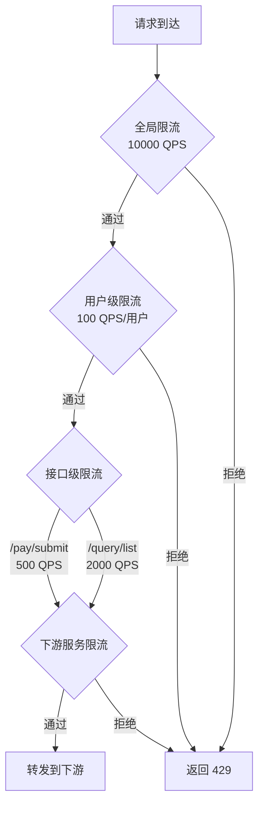

## 常见误区

服务治理是微服务架构中最具实践性的领域之一。理论看起来清晰，但落地时处处是坑。本节梳理工程实践中反复出现的十大误区，每个误区都来自真实生产事故，给出根因分析和纠正方案。

---

### 误区一：忽略监控先行，治理全凭直觉

**典型表现**

团队上线了微服务架构，部署了注册中心、熔断器、限流器，但没有搭建监控体系。出了问题只能登录服务器看日志，靠经验猜测瓶颈在哪里。最常见的情况是：熔断器触发了，但没人知道为什么触发、是什么时候恢复的。

**根因分析**

服务治理的所有组件——熔断器、限流器、负载均衡器——都需要可观测数据来验证其效果。没有监控的治理就像蒙着眼睛开车：规则是有的，但你不知道车在不在路上。

具体来说，缺少监控会导致三个问题：

- **无法设定合理阈值**：熔断器的失败率阈值设多少？限流器的 QPS 上限设多少？没有历史数据，就只能拍脑袋。
- **无法验证治理效果**：引入熔断器后，级联失败真的减少了吗？限流器真的保护了后端服务吗？没有指标就没有答案。
- **无法进行容量规划**：不知道流量增长趋势，就不知道什么时候该扩容。

**纠正方案**

部署完整的可观测性栈，按以下优先级实施：

```yaml
# Prometheus 配置示例：采集服务治理关键指标
scrape_configs:
  - job_name: 'order-service'
    metrics_path: '/actuator/prometheus'
    static_configs:
      - targets: ['order-service:8080']
    # 采集间隔
    scrape_interval: 15s

  - job_name: 'gateway'
    metrics_path: '/metrics'
    static_configs:
      - targets: ['gateway:9090']
```

需要监控的核心指标：

| 治理组件 | 关键指标 | 告警阈值建议 | 监控目的 |
|----------|----------|-------------|----------|
| 熔断器 | 状态变化事件、打开次数、恢复时间 | 连续打开 > 5分钟 | 及时发现下游故障 |
| 限流器 | 被拒绝的请求数、当前令牌数 | 拒绝率 > 10% | 评估限流策略是否合理 |
| 负载均衡 | 各实例的请求分布、响应时间、错误率 | P99 > 500ms | 发现负载不均或慢实例 |
| 服务发现 | 注册/注销事件、实例数变化 | 实例数 < 预期的 80% | 发现实例异常下线 |

```python
# Python中用Prometheus客户端暴露治理指标
from prometheus_client import Counter, Histogram, Gauge

# 熔断器状态监控
circuit_breaker_state = Gauge(
    'circuit_breaker_state',
    'Circuit breaker state (0=closed, 1=open, 2=half_open)',
    ['service', 'target']
)

circuit_breaker_trips = Counter(
    'circuit_breaker_trips_total',
    'Total circuit breaker trips',
    ['service', 'target']
)

# 限流器监控
rate_limit_rejected = Counter(
    'rate_limit_rejected_total',
    'Requests rejected by rate limiter',
    ['service']
)

# 负载均衡延迟
lb_request_duration = Histogram(
    'lb_request_duration_seconds',
    'Request duration by load balancer',
    ['service', 'instance'],
    buckets=[0.01, 0.025, 0.05, 0.1, 0.25, 0.5, 1.0]
)

# 在熔断器状态变化时更新指标
def on_circuit_breaker_state_change(service, target, new_state):
    circuit_breaker_state.labels(service=service, target=target).set(new_state)
    if new_state == 1:  # Open
        circuit_breaker_trips.labels(service=service, target=target).inc()
```

**进阶建议**：建立服务治理的"仪表盘矩阵"——每个服务至少一个 Grafana Dashboard，包含黄金指标（RED：Rate、Errors、Duration）和治理指标（熔断状态、限流情况、实例健康度）。

---

### 误区二：熔断器阈值设置不合理

**典型表现**

团队在代码中加了熔断器，但阈值配置一成不变：所有服务统一 50% 失败率触发熔断、超时时间 30 秒、半开状态允许 10 个探测请求。结果要么是熔断器几乎从不触发（阈值过高），要么是正常的毛刺导致频繁熔断（阈值过低）。

**根因分析**

不同服务的流量特征、容错能力、下游依赖完全不同：

- **核心交易服务**：P99 延迟通常在 50ms 以内，偶尔出现 200ms 的毛刺属于正常波动。如果失败率阈值设为 10%，一次网络抖动就可能触发熔断。
- **报表查询服务**：本身就有大查询，P99 可能达到 5 秒。如果超时设为 30 秒，可能导致线程池被慢查询耗尽。
- **通知服务**：依赖第三方短信/邮件通道，失败率天然较高。用同样的阈值会导致通知服务几乎一直处于熔断状态。

**纠正方案**

按服务特征分层配置：

```go
// 不同服务使用不同的熔断器配置
type BreakerConfig struct {
    FailureRate     float64       // 失败率阈值
    MinRequests     int           // 最小请求数（避免小样本误判）
    Timeout         time.Duration // 熔断持续时间
    HalfOpenMax     int           // 半开状态探测请求数
    HalfOpenSuccess int           // 半开状态恢复所需成功数
}

// 配置模板：根据服务特征选择
var breakerConfigs = map[string]BreakerConfig{
    // 核心交易：严格阈值，快速恢复
    "order-service": {
        FailureRate:     0.10,  // 10% 失败率即熔断
        MinRequests:     20,    // 至少 20 个请求才开始计算
        Timeout:         10 * time.Second,  // 快速探测恢复
        HalfOpenMax:     5,
        HalfOpenSuccess: 3,
    },
    // 报表查询：宽松阈值，长超时
    "report-service": {
        FailureRate:     0.30,  // 30% 失败率才熔断
        MinRequests:     10,
        Timeout:         60 * time.Second,  // 给足恢复时间
        HalfOpenMax:     3,
        HalfOpenSuccess: 2,
    },
    // 第三方依赖：容忍高失败率
    "sms-service": {
        FailureRate:     0.50,  // 第三方不稳定，允许 50%
        MinRequests:     30,
        Timeout:         30 * time.Second,
        HalfOpenMax:     5,
        HalfOpenSuccess: 3,
    },
}
```

**关键原则**：

1. **最小请求数（MinRequests）不能设太低**：如果只有 3 个请求失败了 2 个，失败率 66%，但这不代表服务有问题。小样本统计不可靠，建议核心服务至少 20 个请求。
2. **超时时间要配合探测间隔**：太短会导致频繁探测加重下游负担，太长会导致故障恢复延迟。一般 10-30 秒是合理区间。
3. **定期根据实际数据调优**：每周Review熔断日志，对误触发率高的服务调高阈值，对迟迟不触发的调低阈值。

---

### 误区三：超时、重试、熔断组合配置不当

**典型表现**

团队设置了超时 5 秒、重试 3 次、熔断阈值 50%。看起来每个参数都合理，但组合在一起出了问题：一个请求超时后重试 3 次，每次都要等 5 秒，一个用户操作实际要等 20 秒。而且重试风暴会放大下游压力——当下游服务已经过载时，重试会让情况雪上加霜。

**根因分析**

超时、重试、熔断三者之间存在微妙的相互作用：

- **超时 × 重试**：用户感知延迟 = 超时时间 × (重试次数 + 1)。如果超时 5 秒重试 3 次，最坏情况是 20 秒。
- **重试 × 下游负载**：假设下游服务已经过载，每秒只能处理 500 个请求。如果上游重试 3 次，实际压力变成 2000 QPS，过载恶化，失败率进一步上升，触发更多重试——形成正反馈的"重试风暴"。
- **超时 × 熔断**：如果超时时间过长（如 30 秒），在熔断器触发前，大量线程会被阻塞。线程池耗尽后，整个服务不可用，连健康检查都失败。

**纠正方案**

```yaml
# 合理的超时-重试-熔断组合配置
resilience:
  # 超时设置
  timeout:
    connect: 2000    # 连接超时 2 秒（不应更长）
    read: 3000       # 读取超时 3 秒（根据P99设置）
    
  # 重试设置
  retry:
    max_attempts: 3           # 最多重试 3 次（含首次）
    wait_duration: 500ms      # 重试间隔 500ms
    retry_on:
      - connection_error      # 只在网络错误时重试
      - 503                   # 服务暂时不可用
    # 不要在以下情况重试：
    # - 400 Bad Request（客户端错误，重试也没用）
    # - 429 Too Many Requests（应该等待而非重试）
    # - 500 Internal Server Error（服务端错误，重试可能加重问题）
    
  # 熔断设置
  circuit_breaker:
    failure_rate_threshold: 50%
    slow_call_rate_threshold: 80%
    slow_call_duration: 5s
    minimum_number_of_calls: 20
    wait_duration_in_open_state: 30s
```

**重试的正确姿势**：

```go
// 带退避和抖动的重试
func retryWithBackoff(ctx context.Context, maxRetries int, fn func() error) error {
    var lastErr error
    
    for attempt := 0; attempt < maxRetries; attempt++ {
        err := fn()
        if err == nil {
            return nil
        }
        lastErr = err
        
        // 不可重试的错误直接返回
        if !isRetryable(err) {
            return err
        }
        
        // 最后一次不等待
        if attempt == maxRetries-1 {
            break
        }
        
        // 指数退避 + 随机抖动
        baseDelay := time.Duration(math.Pow(2, float64(attempt))) * 200 * time.Millisecond
        jitter := time.Duration(rand.Int63n(int64(baseDelay / 2)))
        delay := baseDelay + jitter
        
        select {
        case <-ctx.Done():
            return ctx.Err()
        case <-time.After(delay):
        }
    }
    return lastErr
}

func isRetryable(err error) bool {
    // 只对以下错误进行重试
    if errors.Is(err, context.DeadlineExceeded) {
        return true // 超时可重试
    }
    if errors.Is(err, io.EOF) || errors.Is(err, io.ErrUnexpectedEOF) {
        return true // 连接中断可重试
    }
    // 业务错误不重试
    return false
}
```

**核心原则**：重试只应在"瞬时故障"（网络抖动、连接重置）时使用，对"持续性故障"（下游过载、逻辑错误）不应该重试。宁可快速失败触发熔断，也不要通过重试放大问题。

---

### 误区四：服务发现配置"一刀切"

**典型表现**

所有服务使用同一个注册中心实例，同一个健康检查间隔（10 秒），同一个心跳超时（90 秒）。核心交易服务和边缘推送服务使用完全相同的服务发现配置。

**根因分析**

不同服务对服务发现的需求差异极大：

- **核心服务**需要秒级感知实例变化，健康检查间隔 5 秒、超时 15 秒比较合理。
- **非核心服务**可以容忍更长的感知延迟，健康检查间隔 30 秒就够用，还能减轻注册中心压力。
- **无状态服务**适合用客户端发现，减少网络跳转。
- **多语言团队**可能更适合服务端发现（如 Kubernetes Service），避免每种语言都集成 SDK。

如果统一配置，会出现两个极端问题：

1. **健康检查太频繁**：注册中心承受巨大压力。假设有 500 个服务实例，每个 5 秒检查一次，注册中心每秒要处理 100 个 HTTP 探针，还可能产生大量日志。
2. **健康检查太稀疏**：故障实例不能被及时摘除。如果检查间隔是 60 秒，故障实例最多要 60 秒后才会被发现，这段时间内的请求全部失败。

**纠正方案**

按服务分级配置：

```yaml
# 服务发现分级配置
service_tier:
  tier_1_critical:
    # 核心交易链路：快速感知，严格健康检查
    health_check:
      interval: 5s
      timeout: 3s
      failure_threshold: 2      # 连续 2 次失败即摘除
      success_threshold: 3      # 连续 3 次成功才恢复
    deregister_critical_service: true
    lease_renewal_interval: 5s
    instance_eviction_timeout: 15s
    
  tier_2_important:
    # 重要服务：平衡感知速度和资源消耗
    health_check:
      interval: 15s
      timeout: 5s
      failure_threshold: 3
      success_threshold: 2
    lease_renewal_interval: 15s
    instance_eviction_timeout: 45s
    
  tier_3_standard:
    # 普通服务：标准配置
    health_check:
      interval: 30s
      timeout: 10s
      failure_threshold: 3
      success_threshold: 2
    lease_renewal_interval: 30s
    instance_eviction_timeout: 90s
```

**Kubernetes 环境下的实践**：

```yaml
# 使用 readinessProbe 和 livenessProbe 分级配置
apiVersion: apps/v1
kind: Deployment
metadata:
  name: order-service
spec:
  replicas: 3
  selector:
    matchLabels:
      app: order-service
  template:
    spec:
      containers:
        - name: order-service
          readinessProbe:
            httpGet:
              path: /health/ready
              port: 8080
            initialDelaySeconds: 5
            periodSeconds: 5        # 核心服务：5秒检查一次
            failureThreshold: 2
            successThreshold: 2
          livenessProbe:
            httpGet:
              path: /health/live
              port: 8080
            initialDelaySeconds: 10
            periodSeconds: 10
            failureThreshold: 3
---
# 非核心服务使用更宽松的配置
apiVersion: apps/v1
kind: Deployment
metadata:
  name: notification-service
spec:
  replicas: 2
  template:
    spec:
      containers:
        - name: notification-service
          readinessProbe:
            httpGet:
              path: /health/ready
              port: 8081
            initialDelaySeconds: 10
            periodSeconds: 30       # 非核心服务：30秒检查一次
            failureThreshold: 3
            successThreshold: 2
```

---

### 误区五：限流策略过于粗放

**典型表现**

团队在 API 网关上设置了全局限流：每秒 10,000 请求。看起来能保护后端服务，但实际上某些用户占据了绝大部分流量，而一些关键接口（如支付回调）没有独立的限流保护，被普通流量挤占。

**根因分析**

"一个限流规则保护所有"是最常见的错误。不同维度的限流需要叠加使用：

- **全局限流**：保护整体系统不被打垮。
- **用户级限流**：防止个别用户占用过多资源。
- **接口级限流**：保护关键接口的 SLA。
- **服务级限流**：保护下游服务不被调用方压垮。



**纠正方案**

分层限流配置：

```go
// 分层限流器
type LayeredRateLimiter struct {
    global     *SlidingWindowLimiter  // 全局限流
    userLimits map[string]*SlidingWindowLimiter  // 用户级限流
    endpointLimits map[string]*SlidingWindowLimiter  // 接口级限流
    mu         sync.RWMutex
}

func NewLayeredRateLimiter(config RateLimitConfig) *LayeredRateLimiter {
    return &amp;LayeredRateLimiter{
        global: NewSlidingWindowLimiter(config.GlobalQPS, config.GlobalBurst),
        userLimits: make(map[string]*SlidingWindowLimiter),
        endpointLimits: map[string]*SlidingWindowLimiter{
            "/pay/submit":  NewSlidingWindowLimiter(500, 50),
            "/pay/query":   NewSlidingWindowLimiter(1000, 100),
            "/user/info":   NewSlidingWindowLimiter(2000, 200),
            "/query/list":  NewSlidingWindowLimiter(5000, 500),
        },
    }
}

func (lrl *LayeredRateLimiter) Allow(userID, endpoint string) bool {
    // 第一层：全局限流
    if !lrl.global.Allow() {
        return false
    }
    
    // 第二层：接口级限流
    if limiter, ok := lrl.endpointLimits[endpoint]; ok {
        if !limiter.Allow() {
            return false
        }
    }
    
    // 第三层：用户级限流
    userLimiter := lrl.getOrCreateUserLimiter(userID, 100)  // 默认 100 QPS
    if !userLimiter.Allow() {
        return false
    }
    
    return true
}
```

**限流算法选型建议**：

| 算法 | 适用场景 | 优点 | 缺点 |
|------|---------|------|------|
| 令牌桶 | 允许突发流量 | 平滑限流+允许突发 | 实现相对复杂 |
| 漏桶 | 严格匀速输出 | 输出速率恒定 | 不允许突发 |
| 滑动窗口 | 精确计数 | 统计精确 | 内存开销较大 |
| 固定窗口 | 简单限流 | 实现简单 | 有临界突变问题 |
| 信号量 | 并发控制 | 控制同时执行数 | 不控制速率 |

---

### 误区六：负载均衡选择不当

**典型表现**

所有服务都使用默认的轮询（Round Robin）负载均衡，不考虑后端实例的差异。结果是：配置 4C8G 的小实例和 16C32G 的大实例接收相同数量的请求，小实例过载而大实例空闲。

**根因分析**

轮询算法假设所有后端实例的处理能力相同，这在实际环境中几乎不成立：

- **实例规格不同**：灰度发布期间，新老版本可能运行在不同规格的机器上。
- **实例负载不同**：某些实例可能正在执行批量任务，CPU 使用率很高。
- **请求成本不同**：查询接口和写入接口消耗的资源差异巨大。
- **地理位置不同**：跨机房部署时，应该优先选择同机房的实例。

**纠正方案**

根据场景选择合适的负载均衡策略：

```yaml
# Envoy 负载均衡配置示例
clusters:
  - name: order-service
    lb_policy: LEAST_REQUEST     # 默认：最少请求
    load_balancing_config:
      - least_request:
          choice_count: 2        # 从 2 个候选中选择（减少锁竞争）
          slow_start_config:
            slow_start_window: 60s  # 新实例启动时逐渐增加流量
          
  - name: payment-service
    lb_policy: RING_HASH          # 支付服务：一致性哈希保证顺序
    load_balancing_config:
      - ring_hash:
          minimum_ring_size: 1024
          
  - name: static-resource-service
    lb_policy: ROUND_ROBIN        # 静态资源：轮询即可
```

**灰度发布中的负载均衡技巧**：

```go
// 基于元数据的子集负载均衡
// 新版本实例标记 weight=10，老版本 weight=100
// 灰度初期只分配 10% 流量到新版本

func selectInstance(instances []ServiceInstance, metadata FilterMetadata) *ServiceInstance {
    var filtered []ServiceInstance
    for _, inst := range instances {
        // 根据灰度规则过滤
        if metadata.Version != "" &amp;&amp; inst.Version != metadata.Version {
            continue
        }
        filtered = append(filtered, inst)
    }
    
    if len(filtered) == 0 {
        // 降级到全量实例
        filtered = instances
    }
    
    // 使用加权选择
    return weightedSelect(filtered)
}
```

---

### 误区七：忽视分布式追踪的上下文传播

**典型表现**

团队在每个服务都接入了 OpenTelemetry SDK，但调用链只显示第一跳，后续服务的 Span 全部丢失。或者追踪数据有了，但无法关联到具体的用户请求。

**根因分析**

分布式追踪的核心是上下文传播（Context Propagation）。每个服务在发起下游调用时，需要将 Trace ID、Span ID 等信息注入到请求头中；被调用方需要从请求头中提取这些信息并继续传播。只要有一个环节遗漏，链路就会断裂。

最常见的遗漏点：

- **消息队列消费者**：Kafka/RabbitMQ 的消费者拿到消息后，直接处理而不提取追踪上下文。
- **异步线程池**：在新线程中发起 HTTP 调用，但没有传递上下文。
- **定时任务**：Cron Job 发起的请求没有携带追踪信息。
- **HTTP 客户端未配置**：使用了没有注入追踪头的 HTTP 客户端。

**纠正方案**

```python
# 正确的上下文传播实践

from opentelemetry import trace
from opentelemetry.propagate import inject
import requests

tracer = trace.get_tracer(__name__)

def call_downstream_service():
    with tracer.start_as_current_span("call-order-service") as span:
        # 1. 创建 HTTP 请求头
        headers = {}
        inject(headers)  # 自动注入 traceparent 等追踪头
        
        # 2. 发起请求时携带追踪上下文
        response = requests.get(
            "http://order-service/api/orders",
            headers=headers,
            timeout=5
        )
        span.set_attribute("http.status_code", response.status_code)
        return response


# Kafka 消费者中正确传播上下文
from opentelemetry.propagate import extract

def kafka_message_handler(message):
    # 1. 从 Kafka 消息头中提取追踪上下文
    ctx = extract(carrier=message.headers)
    
    # 2. 在提取的上下文中创建 Span
    with tracer.start_as_current_span(
        "process-kafka-message",
        context=ctx
    ) as span:
        span.set_attribute("messaging.system", "kafka")
        span.set_attribute("messaging.destination", message.topic)
        
        # 3. 处理消息
        process_message(message.value)
```

**上下文传播的标准格式**：

# W3C Trace Context 标准（推荐）
traceparent: 00-4bf92f3577b34da6a3ce929d0e0e4736-00f067aa0ba902b7-01
              ^^^ ^^^^^^^^^^^^^^^^^^^^^^^^^^^^ ^^^^^^^^^^^^^^^^ ^^
            版本  Trace ID                      Span ID        采样标志

# 附加的 Baggage 信息（可选）
tracestate: rojo=00f067aa0ba902b7,congo=t61rcWkgMzE
baggage: userId=12345,tenantId=abc

**验证传播是否完整的检查清单**：

| 检查项 | 方法 | 通过标准 |
|--------|------|---------|
| HTTP 调用 | 检查请求头是否有 traceparent | 每个 HTTP 调用都携带 |
| 消息队列 | 检查消息头是否有追踪信息 | 生产者注入，消费者提取 |
| 异步线程 | 代码Review线程池调用 | 上下文正确传递 |
| 数据库查询 | 检查 Span 是否关联到调用方 | 数据库 Span 是调用方的子 Span |
| 跨服务 | 在 Jaeger/Zipkin 中查看完整链路 | 一条请求的所有 Span 连在一起 |

---

### 误区八：配置中心变成"万能药"

**典型表现**

团队把所有配置都放到配置中心，包括数据库密码、服务端口、日志级别、业务规则、Feature Flag……结果配置中心挂了，所有服务都启动不了。或者配置中心的网络延迟导致配置拉取超时，服务重启变慢。

**根因分析**

配置中心的核心价值是**动态配置热更新**——在不重启服务的情况下修改运行时参数。但它不是所有配置的最佳存储位置：

- **启动配置**（端口、注册中心地址、日志路径）：这些配置在服务启动时读取一次，之后不会变化。放在配置中心会引入不必要的依赖，而且如果配置中心不可用，服务连启动都做不到。
- **敏感配置**（密码、密钥、证书）：应该使用专门的密钥管理系统（如 Vault、AWS Secrets Manager），而非配置中心的明文存储。
- **热更新配置**（Feature Flag、限流阈值、日志级别）：这才是配置中心的正确用武之地。

**纠正方案**

配置分层管理：

```yaml
# 配置分层策略
config_layers:
  layer_1_local:
    # 本地配置文件：服务启动必需，不依赖外部服务
    # 通常在 src/main/resources/application.yml 或 /etc/app/config.yaml
    description: "启动配置，本地文件，不可热更新"
    includes:
      - server.port
      - spring.datasource.url
      - logging.level
      - registration.center.address
    
  layer_2_config_center:
    # 配置中心：运行时动态配置，可热更新
    description: "动态配置，可热更新，配置中心不可用时使用本地缓存"
    includes:
      - rate_limit.qps
      - circuit_breaker.threshold
      - feature_flags.*
      - log_level_override
    fallback: "本地缓存（last-known-good）"
    
  layer_3_secret_manager:
    # 密钥管理：敏感配置，加密存储
    description: "敏感配置，加密存储，访问审计"
    includes:
      - database.password
      - api_key.*
      - jwt.private_key
    tool: "HashiCorp Vault / AWS Secrets Manager"
```

**配置中心的高可用保障**：

```python
# 配置拉取的容错机制
import json
import os
from pathlib import Path

class ResilientConfigClient:
    def __init__(self, config_center_url, local_cache_dir):
        self.config_center_url = config_center_url
        self.cache_dir = Path(local_cache_dir)
        self.cache_dir.mkdir(parents=True, exist_ok=True)
    
    def get_config(self, key, default=None):
        # 第一优先：从配置中心获取
        try:
            value = self._fetch_from_center(key)
            # 成功后更新本地缓存
            self._update_cache(key, value)
            return value
        except Exception as e:
            logger.warning(f"Config center unreachable: {e}")
        
        # 第二优先：从本地缓存获取
        cached = self._read_cache(key)
        if cached is not None:
            logger.info(f"Using cached config for {key}")
            return cached
        
        # 第三优先：使用默认值
        if default is not None:
            logger.info(f"Using default config for {key}")
            return default
        
        raise ConfigNotFoundError(f"Config {key} unavailable")
    
    def _fetch_from_center(self, key):
        import requests
        resp = requests.get(
            f"{self.config_center_url}/configs/{key}",
            timeout=2,  # 短超时，快速失败
        )
        resp.raise_for_status()
        return resp.json()["value"]
    
    def _update_cache(self, key, value):
        cache_file = self.cache_dir / f"{key}.json"
        cache_file.write_text(json.dumps({"value": value, "ts": time.time()}))
    
    def _read_cache(self, key):
        cache_file = self.cache_dir / f"{key}.json"
        if cache_file.exists():
            data = json.loads(cache_file.read_text())
            # 缓存不超过 24 小时
            if time.time() - data.get("ts", 0) < 86400:
                return data["value"]
        return None
```

---

### 误区九：忽略优雅关闭和启动顺序

**典型表现**

Kubernetes 滚动更新时，新 Pod 启动后立即开始接收流量，但数据库连接还没建立；旧 Pod 收到 SIGTERM 后立即退出，正在处理中的请求被强制中断。或者微服务 A 启动时依赖服务 B，但 B 还没就绪，A 启动失败不断重启。

**根因分析**

服务治理只关注了运行时的流量管理，忽略了生命周期管理：

- **关闭阶段**：SIGTERM 信号到达后，服务应该先停止接收新请求，等待正在处理的请求完成，然后释放资源（关闭数据库连接、刷新缓冲区），最后退出。
- **启动阶段**：服务应该先完成自身初始化（加载配置、建立连接），然后向注册中心注册，注册成功后再开始接收流量。
- **依赖启动顺序**：当服务 A 依赖服务 B 时，A 应该等待 B 就绪后再启动，或者 A 应该在启动时对 B 的依赖做容错处理。

**纠正方案**

优雅关闭实现：

```go
// Go 服务的优雅关闭
func main() {
    server := &amp;http.Server{Addr: ":8080"}
    
    // 启动服务
    go func() {
        if err := server.ListenAndServe(); err != http.ErrServerClosed {
            log.Fatalf("HTTP server error: %v", err)
        }
    }()
    
    // 等待中断信号
    quit := make(chan os.Signal, 1)
    signal.Notify(quit, syscall.SIGINT, syscall.SIGTERM)
    <-quit
    
    log.Println("Shutting down server...")
    
    // 第一步：从注册中心注销（停止接收新流量）
    deregisterFromRegistry()
    
    // 第二步：设置关闭超时，等待正在处理的请求完成
    ctx, cancel := context.WithTimeout(context.Background(), 30*time.Second)
    defer cancel()
    
    if err := server.Shutdown(ctx); err != nil {
        log.Fatalf("Server forced to shutdown: %v", err)
    }
    
    // 第三步：释放资源
    closeDatabaseConnections()
    flushBuffers()
    
    log.Println("Server exited gracefully")
}
```

Kubernetes 配置：

```yaml
apiVersion: apps/v1
kind: Deployment
metadata:
  name: order-service
spec:
  replicas: 3
  strategy:
    rollingUpdate:
      maxSurge: 1           # 更新时最多多 1 个 Pod
      maxUnavailable: 0     # 更新时不允许有 Pod 不可用
  template:
    spec:
      terminationGracePeriodSeconds: 60  # 优雅关闭超时
      containers:
        - name: order-service
          lifecycle:
            preStop:
              exec:
                command: ["sh", "-c", "sleep 5"]  # 给 LB 时间摘除流量
          startupProbe:
            httpGet:
              path: /health/startup
              port: 8080
            failureThreshold: 30    # 最多等 30 次（60秒）
            periodSeconds: 2
          readinessProbe:
            httpGet:
              path: /health/ready
              port: 8080
            initialDelaySeconds: 10
            periodSeconds: 5
```

**启动依赖处理**：

```python
# 使用 Kubernetes initContainer 或应用内等待
import time
import sys
import requests

def wait_for_dependency(service_name, url, max_wait=60):
    """等待依赖服务就绪"""
    start = time.time()
    while time.time() - start < max_wait:
        try:
            resp = requests.get(url, timeout=2)
            if resp.status_code == 200:
                print(f"{service_name} is ready")
                return True
        except requests.ConnectionError:
            pass
        print(f"Waiting for {service_name}...")
        time.sleep(2)
    
    print(f"Failed to connect to {service_name} after {max_wait}s")
    return False

# 启动时等待依赖
if not wait_for_dependency("order-service", "http://order-service:8080/health"):
    sys.exit(1)
```

---

### 误区十：安全与治理脱节

**典型表现**

服务间调用使用明文 HTTP，没有任何认证。mTLS 配置了但证书过期没续。API 网关的认证检查可以被绕过。服务治理工具（如 Istio）的管理端口暴露在公网。

**根因分析**

安全是服务治理的基石，但在快速迭代中常被忽视。以下是最常见的安全隐患：

- **服务间零信任缺失**：假设内网环境安全，服务间调用不做认证。但一旦某个服务被攻破，攻击者可以横向移动到整个集群。
- **证书管理混乱**：手动签发的证书没有自动续期机制，过期后服务间调用全部失败。
- **配置泄露**：配置中心的密码以明文存储，或者日志中打印了敏感信息。
- **管理端口暴露**：Istio 的 Pilot 端口、Envoy 的管理端口直接暴露，攻击者可以修改路由规则。

**纠正方案**

```yaml
# Istio mTLS 强制配置
apiVersion: security.istio.io/v1beta1
kind: PeerAuthentication
metadata:
  name: default
  namespace: production
spec:
  mtls:
    mode: STRICT    # 强制 mTLS，拒绝明文通信
---
# 服务间授权策略：只有特定服务可以调用
apiVersion: security.istio.io/v1beta1
kind: AuthorizationPolicy
metadata:
  name: order-service-policy
  namespace: production
spec:
  selector:
    matchLabels:
      app: order-service
  rules:
    - from:
        - source:
            principals:
              - cluster.local/ns/production/sa/gateway-sa
              - cluster.local/ns/production/sa/payment-sa
      to:
        - operation:
            methods: ["GET", "POST"]
            paths: ["/api/orders*"]
```

**安全检查清单**：

| 检查项 | 风险等级 | 检查方法 | 修复方案 |
|--------|---------|---------|---------|
| 服务间 mTLS | 高 | 检查 Istio PeerAuthentication | 设为 STRICT |
| 证书自动轮换 | 高 | 检查 cert-manager 配置 | 配置自动续期 |
| API 网关认证 | 高 | 测试不带 Token 的请求 | 确保所有路由都有认证 |
| 管理端口隔离 | 中 | 检查端口绑定地址 | 绑定 127.0.0.1 或内网 |
| 敏感配置加密 | 高 | 检查配置中心存储方式 | 使用 Vault |
| 日志脱敏 | 中 | 搜索日志中的敏感字段 | 配置日志脱敏规则 |

---

### 误区总结与最佳实践对照

| 误区 | 根本原因 | 最佳实践 | 优先级 |
|------|---------|---------|--------|
| 忽略监控 | 认为治理组件自带足够信息 | 监控先行，治理效果可量化 | P0 |
| 熔断阈值一刀切 | 不同服务特征不同 | 按服务分级配置 | P0 |
| 超时重试组合不当 | 各组件独立配置，缺乏全局视角 | 统一规划，重试只对瞬时故障 | P0 |
| 服务发现一刀切 | 假设所有服务需求相同 | 按核心/非核心分级配置 | P1 |
| 限流策略粗放 | 只做全局限流 | 分层限流（全局+用户+接口） | P1 |
| 负载均衡选择不当 | 默认轮询不考虑实例差异 | 根据场景选择算法 | P1 |
| 追踪上下文丢失 | 只关注接入 SDK，忽视传播 | 确保每个环节正确传播上下文 | P1 |
| 配置中心万能化 | 把所有配置都放中心 | 配置分层：本地+中心+密钥管理 | P2 |
| 忽略优雅关闭 | 只关注运行时，不关注生命周期 | 正确处理 SIGTERM 和启动顺序 | P2 |
| 安全与治理脱节 | 快速迭代中忽视安全 | mTLS + 证书管理 + 端口隔离 | P0 |

**最终建议**：服务治理不是一次性工作。每次生产事故后，都应该复盘是否涉及上述误区，将经验沉淀为配置和流程。建立"服务治理检查清单"，在每次上线前逐项确认，才能真正将治理落到实处。
