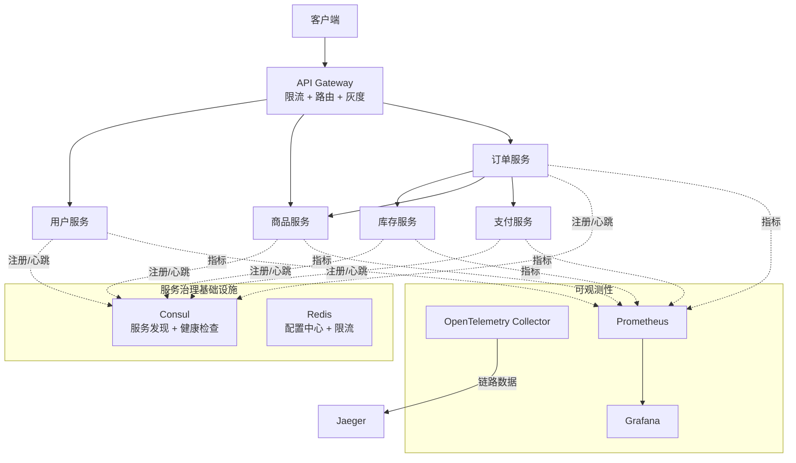
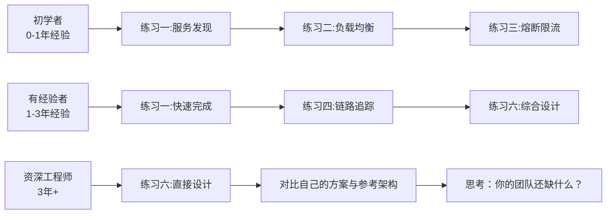

## 练习方法

> 服务治理的知识最终要落实到工程实践中。本节设计了六个递进式练习，从基础概念理解到完整架构设计，覆盖服务发现、负载均衡、熔断限流、链路追踪、配置管理、灰度发布六大领域。每个练习都基于真实的生产场景，提供可执行的代码和配置，帮助读者在动手过程中深化理解。

---

### 练习一：服务注册与发现实战（预计 45 分钟）

**目标**：搭建一个最小可用的服务注册与发现环境，理解注册中心的工作原理，掌握服务注册、发现、健康检查的完整流程。

#### 1.1 选择注册中心并部署

以 Consul 为例（跨语言、支持 DNS 和 HTTP 两种发现方式），启动单节点开发模式：

```bash
# 使用 Docker 快速启动 Consul 开发模式
docker run -d --name=consul-dev \
  -p 8500:8500 -p 8600:8600/udp \
  consul:1.17 agent -dev -client=0.0.0.0

# 验证 Consul 是否就绪
curl http://localhost:8500/v1/status/leader
# 预期返回: "127.0.0.1:8300"

# 查看 Consul Web UI
echo "打开浏览器访问: http://localhost:8500/ui"
```

如果团队偏好 Nacos，可替换为：

```bash
docker run -d --name=nacos-standalone \
  -e MODE=standalone \
  -p 8848:8848 -p 9848:9848 \
  nacos/nacos-server:v2.3.0
```

#### 1.2 编写服务注册代码

用 Python 模拟一个微服务启动时向 Consul 注册自身的过程：

```python
import requests
import uuid
import signal
import sys
import threading
import time

class ConsulRegistrar:
    """服务注册到 Consul，并维持心跳续约"""

    def __init__(self, consul_addr="http://localhost:8500"):
        self.consul_addr = consul_addr
        self.service_id = None

    def register(self, service_name, host, port, tags=None):
        """注册服务实例"""
        self.service_id = f"{service_name}-{uuid.uuid4().hex[:8]}"
        payload = {
            "ID": self.service_id,
            "Name": service_name,
            "Address": host,
            "Port": port,
            "Tags": tags or [],
            "Check": {
                "HTTP": f"http://{host}:{port}/health",
                "Interval": "10s",
                "Timeout": "3s",
                "DeregisterCriticalServiceAfter": "60s"
            }
        }
        resp = requests.put(
            f"{self.consul_addr}/v1/agent/service/register",
            json=payload
        )
        if resp.status_code == 200:
            print(f"[注册成功] {self.service_id} -> {host}:{port}")
        else:
            print(f"[注册失败] HTTP {resp.status_code}: {resp.text}")
        return resp.status_code == 200

    def deregister(self):
        """注销服务"""
        if self.service_id:
            url = f"{self.consul_addr}/v1/agent/service/deregister/{self.service_id}"
            requests.put(url)
            print(f"[已注销] {self.service_id}")

    def start_heartbeat(self):
        """启动后台心跳线程"""
        def _heartbeat():
            while True:
                time.sleep(5)
                try:
                    url = f"{self.consul_addr}/v1/agent/check/pass/service:{self.service_id}"
                    requests.put(url)
                except Exception as e:
                    print(f"[心跳异常] {e}")
        t = threading.Thread(target=_heartbeat, daemon=True)
        t.start()


# ---- 使用示例 ----
registrar = ConsulRegistrar()
registrar.register(
    service_name="order-service",
    host="127.0.0.1",
    port=8080,
    tags=["v2.1.0", "cn-east"]
)

# 注册 SIGTERM 信号，优雅关闭时自动注销
def shutdown(sig, frame):
    registrar.deregister()
    sys.exit(0)

signal.signal(signal.SIGTERM, shutdown)
signal.signal(signal.SIGINT, shutdown)

print("服务运行中... 按 Ctrl+C 停止")
```

#### 1.3 实现服务发现

```python
import random
import time

class ConsulDiscovery:
    """从 Consul 查询服务实例列表"""

    def __init__(self, consul_addr="http://localhost:8500"):
        self.consul_addr = consul_addr
        self.cache = {}          # service_name -> (instances, timestamp)
        self.cache_ttl = 10      # 缓存有效期（秒）

    def get_instances(self, service_name):
        """获取服务实例列表，带本地缓存"""
        now = time.time()

        # 检查缓存
        if service_name in self.cache:
            instances, ts = self.cache[service_name]
            if now - ts < self.cache_ttl:
                return instances

        # 从 Consul 查询
        resp = requests.get(
            f"{self.consul_addr}/v1/health/service/{service_name}",
            params={"passing": True}   # 只返回健康实例
        )
        instances = []
        for item in resp.json():
            svc = item["Service"]
            instances.append({
                "id": item["Service"]["ID"],
                "host": item["Service"]["Address"],
                "port": item["Service"]["Port"],
                "tags": item["Service"]["Tags"]
            })

        self.cache[service_name] = (instances, now)
        return instances

    def select_random(self, service_name):
        """随机选择一个实例"""
        instances = self.get_instances(service_name)
        if not instances:
            raise Exception(f"无可用实例: {service_name}")
        return random.choice(instances)

    def select_by_tag(self, service_name, tag):
        """按标签筛选实例（灰度发布场景）"""
        instances = self.get_instances(service_name)
        filtered = [i for i in instances if tag in i["tags"]]
        if not filtered:
            raise Exception(f"标签 {tag} 无匹配实例")
        return random.choice(filtered)


# ---- 验证 ----
discovery = ConsulDiscovery()
instances = discovery.get_instances("order-service")
print(f"发现 {len(instances)} 个 order-service 实例:")
for inst in instances:
    print(f"  - {inst['id']}: {inst['host']}:{inst['port']} {inst['tags']}")
```

#### 1.4 通过 DNS 发现服务

```bash
# Consul 支持 DNS 查询服务（默认端口 8600）
# A 记录查询
dig @127.0.0.1 -p 8600 order-service.service.consul SRV +short
# 预期返回类似: 1 10 8080 order-service-xxxx.node.dc1.consul.

# 直接用 nslookup
nslookup -port=8600 order-service.service.consul 127.0.0.1
```

**检查标准**：
- [ ] Consul 启动成功，Web UI 可访问
- [ ] 服务注册后在 Consul UI 中可见，状态为健康
- [ ] 服务发现能获取到正确的实例列表
- [ ] 健康检查失败后实例自动被剔除
- [ ] DNS 查询能解析到服务地址

---

### 练习二：负载均衡算法实现与对比（预计 50 分钟）

**目标**：从零实现四种经典负载均衡算法，通过模拟测试对比它们的行为差异，理解每种算法的适用场景。

#### 2.1 实现四种负载均衡器

```python
import threading
import time
import random
from collections import defaultdict

# ---- 模拟后端服务 ----
class FakeServer:
    """模拟后端服务，可设置不同的处理延迟"""
    def __init__(self, name, avg_latency_ms=50):
        self.name = name
        self.avg_latency_ms = avg_latency_ms
        self.conn_count = 0
        self.total_requests = 0

    def handle(self):
        self.conn_count += 1
        self.total_requests += 1
        # 模拟处理延迟
        jitter = random.gauss(self.avg_latency_ms, self.avg_latency_ms * 0.2)
        time.sleep(max(1, jitter) / 1000)
        self.conn_count -= 1
        return self.name


# ---- 算法一：轮询 ----
class RoundRobin:
    def __init__(self, servers):
        self.servers = servers
        self.index = 0
        self.lock = threading.Lock()

    def pick(self):
        with self.lock:
            server = self.servers[self.index % len(self.servers)]
            self.index += 1
            return server


# ---- 算法二：加权轮询（Nginx 平滑算法）----
class WeightedRoundRobin:
    def __init__(self, servers, weights):
        self.servers = servers
        self.weights = weights
        self.current_weights = [0] * len(servers)
        self.lock = threading.Lock()

    def pick(self):
        with self.lock:
            total = sum(self.weights)
            best_idx = 0
            for i in range(len(self.servers)):
                self.current_weights[i] += self.weights[i]
                if self.current_weights[i] > self.current_weights[best_idx]:
                    best_idx = i
            self.current_weights[best_idx] -= total
            return self.servers[best_idx]


# ---- 算法三：随机 ----
class RandomBalancer:
    def __init__(self, servers):
        self.servers = servers

    def pick(self):
        return random.choice(self.servers)


# ---- 算法四：最少连接 ----
class LeastConnections:
    def __init__(self, servers):
        self.servers = servers
        self.lock = threading.Lock()

    def pick(self):
        with self.lock:
            return min(self.servers, key=lambda s: s.conn_count)


# ---- 压测对比 ----
def benchmark(balancer, name, num_requests=200, concurrency=20):
    results = defaultdict(int)

    def worker():
        for _ in range(num_requests // concurrency):
            server = balancer.pick()
            server.handle()
            results[server.name] += 1

    threads = [threading.Thread(target=worker) for _ in range(concurrency)]
    start = time.time()
    for t in threads:
        t.start()
    for t in threads:
        t.join()
    elapsed = time.time() - start

    print(f"\n{'='*50}")
    print(f"算法: {name}  |  耗时: {elapsed:.2f}s")
    print(f"{'='*50}")
    for server_name, count in sorted(results.items()):
        bar = '█' * (count // 5)
        print(f"  {server_name}: {count:>4} 次  {bar}")
    # 计算负载不均衡度（标准差/均值）
    counts = list(results.values())
    avg = sum(counts) / len(counts)
    std = (sum((c - avg) ** 2 for c in counts) / len(counts)) ** 0.5
    imbalance = (std / avg * 100) if avg > 0 else 0
    print(f"  负载不均衡度: {imbalance:.1f}%（越小越均匀）")


# ---- 运行对比 ----
# 设置三台模拟服务器，处理能力不同
s1 = FakeServer("Server-A（高性能）", avg_latency_ms=30)
s2 = FakeServer("Server-B（中等）", avg_latency_ms=50)
s3 = FakeServer("Server-C（低性能）", avg_latency_ms=80)

print("对比四种负载均衡算法的请求分配情况:")
benchmark(RoundRobin([s1, s2, s3]), "轮询")
benchmark(WeightedRoundRobin([s1, s2, s3], [5, 3, 2]), "加权轮询(5:3:2)")
benchmark(RandomBalancer([s1, s2, s3]), "随机")
benchmark(LeastConnections([s1, s2, s3]), "最少连接")
```

#### 2.2 一致性哈希专项练习

```python
import hashlib
from collections import Counter

class ConsistentHashRing:
    """一致性哈希环，含虚拟节点"""
    def __init__(self, virtual_nodes=150):
        self.virtual_nodes = virtual_nodes
        self.ring = {}
        self.sorted_keys = []

    def _hash(self, key):
        return int(hashlib.md5(key.encode()).hexdigest(), 16)

    def add_node(self, node):
        for i in range(self.virtual_nodes):
            h = self._hash(f"{node}#{i}")
            self.ring[h] = node
            self.sorted_keys.append(h)
        self.sorted_keys.sort()

    def remove_node(self, node):
        for i in range(self.virtual_nodes):
            h = self._hash(f"{node}#{i}")
            self.ring.pop(h, None)
            self.sorted_keys.remove(h)

    def get_node(self, key):
        h = self._hash(key)
        # 二分查找顺时针第一个节点
        import bisect
        idx = bisect.bisect_right(self.sorted_keys, h)
        if idx == len(self.sorted_keys):
            idx = 0
        return self.ring[self.sorted_keys[idx]]


def test_consistent_hash():
    ring = ConsistentHashRing(virtual_nodes=150)

    # 初始 3 个节点
    for node in ["Server-A", "Server-B", "Server-C"]:
        ring.add_node(node)

    # 对 10000 个 key 映射
    keys = [f"user-{i}" for i in range(10000)]
    original_mapping = {k: ring.get_node(k) for k in keys}
    original_dist = Counter(original_mapping.values())
    print("初始分布:", dict(original_dist))

    # 模拟节点变更：移除 Server-B，新增 Server-D
    ring.remove_node("Server-B")
    ring.add_node("Server-D")
    new_mapping = {k: ring.get_node(k) for k in keys}

    # 计算受影响的 key 比例
    affected = sum(1 for k in keys if original_mapping[k] != new_mapping[k])
    print(f"节点变更后，受影响的 key: {affected}/{len(keys)} = {affected/len(keys)*100:.1f}%")
    print("理论值: 约 33%（1/N，N=3）")

    new_dist = Counter(new_mapping.values())
    print("变更后分布:", dict(new_dist))


test_consistent_hash()
```

**检查标准**：
- [ ] 四种负载均衡算法均能正确运行
- [ ] 能解读输出结果中各算法的分配差异
- [ ] 一致性哈希在节点变更后，受影响 key 比例接近理论值 1/N
- [ ] 理解为什么加权轮询比普通轮询更适合异构服务器

---

### 练习三：熔断器与限流实现（预计 60 分钟）

**目标**：实现一个完整的熔断器状态机和令牌桶限流器，通过模拟故障场景验证其保护效果。

#### 3.1 熔断器完整实现

```python
import time
import random
import threading
from enum import Enum

class State(Enum):
    CLOSED = "关闭"
    OPEN = "打开"
    HALF_OPEN = "半开"

class CircuitBreaker:
    def __init__(self, failure_threshold=5, timeout=10, half_open_max=3):
        self.state = State.CLOSED
        self.failure_count = 0
        self.failure_threshold = failure_threshold
        self.timeout = timeout                  # 打开状态持续时间（秒）
        self.half_open_max = half_open_max      # 半开状态允许的探测请求数
        self.half_open_count = 0
        self.success_count = 0
        self.last_failure_time = 0
        self.history = []                       # 记录状态变化用于验证
        self.lock = threading.Lock()

    def _record(self, event):
        self.history.append((time.time(), self.state.value, event))

    def call(self, fn):
        with self.lock:
            # Open → Half-Open 转换
            if self.state == State.OPEN:
                if time.time() - self.last_failure_time > self.timeout:
                    self.state = State.HALF_OPEN
                    self.half_open_count = 0
                    self.success_count = 0
                    self._record("→ 半开（超时到期，开始探测）")
                else:
                    self._record("× 拒绝（熔断中）")
                    raise RuntimeError("Circuit breaker is OPEN")

            # Half-Open 限流
            if self.state == State.HALF_OPEN:
                if self.half_open_count >= self.half_open_max:
                    self._record("× 拒绝（探测名额已满）")
                    raise RuntimeError("Circuit breaker is OPEN (half-open limit)")
                self.half_open_count += 1

        # 执行实际调用（不持锁）
        try:
            result = fn()
            self._on_success()
            return result
        except Exception as e:
            self._on_failure()
            raise

    def _on_success(self):
        with self.lock:
            if self.state == State.CLOSED:
                self.failure_count = 0
            elif self.state == State.HALF_OPEN:
                self.success_count += 1
                if self.success_count >= self.half_open_max:
                    self.state = State.CLOSED
                    self.failure_count = 0
                    self._record("→ 关闭（探测成功，恢复正常）")

    def _on_failure(self):
        with self.lock:
            self.failure_count += 1
            self.last_failure_time = time.time()
            if self.state == State.CLOSED:
                if self.failure_count >= self.failure_threshold:
                    self.state = State.OPEN
                    self._record("→ 打开（连续失败达阈值）")
            elif self.state == State.HALF_OPEN:
                self.state = State.OPEN
                self._record("→ 重新打开（探测失败）")


# ---- 模拟故障场景 ----
def simulate():
    cb = CircuitBreaker(failure_threshold=5, timeout=3, half_open_max=3)

    def unstable_service():
        """模拟一个不稳定的服务：70% 概率失败"""
        if random.random() < 0.7:
            raise ConnectionError("下游服务超时")
        return "OK"

    print("=== 熔断器状态转换模拟 ===\n")

    for round_num in range(1, 4):
        print(f"--- 第 {round_num} 轮（每轮 8 个请求）---")
        for i in range(8):
            try:
                result = cb.call(unstable_service)
                print(f"  请求 {i+1}: ✓ {result}  状态={cb.state.value}")
            except RuntimeError as e:
                print(f"  请求 {i+1}: ✗ {e}  状态={cb.state.value}")
            except ConnectionError:
                print(f"  请求 {i+1}: ✗ 调用失败  状态={cb.state.value}")
            time.sleep(0.2)

        # 第一轮后等待一段时间观察 Open→Half-Open
        if round_num == 1:
            print(f"\n  [等待 {cb.timeout} 秒观察超时转换...]\n")
            time.sleep(cb.timeout + 0.5)

    # 打印完整状态变化日志
    print("\n=== 状态变化日志 ===")
    for ts, state, event in cb.history:
        print(f"  [{state}] {event}")


simulate()
```

#### 3.2 令牌桶限流器

```python
import time
import threading

class TokenBucket:
    """令牌桶限流器"""

    def __init__(self, rate, capacity):
        """
        rate: 令牌生成速率（个/秒）
        capacity: 桶容量（最大令牌数）
        """
        self.rate = rate
        self.capacity = capacity
        self.tokens = capacity      # 初始满桶
        self.last_refill = time.time()
        self.lock = threading.Lock()
        self.rejected = 0
        self.passed = 0

    def _refill(self):
        """按时间差补充令牌"""
        now = time.time()
        elapsed = now - self.last_refill
        new_tokens = elapsed * self.rate
        self.tokens = min(self.capacity, self.tokens + new_tokens)
        self.last_refill = now

    def allow(self):
        """尝试获取一个令牌"""
        with self.lock:
            self._refill()
            if self.tokens >= 1:
                self.tokens -= 1
                self.passed += 1
                return True
            else:
                self.rejected += 1
                return False

    def stats(self):
        total = self.passed + self.rejected
        reject_rate = (self.rejected / total * 100) if total > 0 else 0
        return {
            "total": total,
            "passed": self.passed,
            "rejected": self.rejected,
            "reject_rate": f"{reject_rate:.1f}%"
        }


def test_rate_limiter():
    """模拟 1000 个请求，限速 100 QPS"""
    limiter = TokenBucket(rate=100, capacity=100)

    print("=== 令牌桶限流测试 ===")
    print(f"限速: 100 QPS, 桶容量: 100\n")

    # 第一波：突发 200 个请求（瞬间打满）
    for _ in range(200):
        limiter.allow()
    print(f"突发 200 请求后: {limiter.stats()}")

    # 等待 1 秒，令牌恢复 100 个
    time.sleep(1)

    # 第二波：再次突发 200 个
    for _ in range(200):
        limiter.allow()
    print(f"等待 1s 后再突发 200: {limiter.stats()}")

    # 第三波：匀速发送 10 秒，每秒 150 请求（超过限速）
    for _ in range(10):
        for _ in range(150):
            limiter.allow()
        time.sleep(1)
        stats = limiter.stats()
        print(f"  匀速 150 QPS 持续中... 累计: {stats}")


test_rate_limiter()
```

#### 3.3 滑动窗口限流器

```python
import time
import collections

class SlidingWindowRateLimiter:
    """滑动窗口限流器——比固定窗口更精确"""

    def __init__(self, window_size=1.0, max_requests=100):
        self.window_size = window_size    # 窗口大小（秒）
        self.max_requests = max_requests  # 窗口内最大请求数
        self.timestamps = collections.deque()

    def allow(self):
        now = time.time()
        # 移除窗口外的旧时间戳
        while self.timestamps and self.timestamps[0] <= now - self.window_size:
            self.timestamps.popleft()

        if len(self.timestamps) < self.max_requests:
            self.timestamps.append(now)
            return True
        return False


def test_sliding_window():
    limiter = SlidingWindowRateLimiter(window_size=1.0, max_requests=10)

    print("=== 滑动窗口限流 vs 固定窗口限流 ===")
    print("场景：固定窗口在边界处可能放过 2x 流量\n")

    # 模拟：第 0.9 秒发 10 个，第 1.0 秒发 10 个
    # 固定窗口（0-1秒）：前 10 个放行；（1-2秒）后 10 个放行 → 全部放行
    # 滑动窗口：1 秒内总共 20 个请求，只放 10 个

    for i in range(20):
        result = limiter.allow()
        status = "✓ 放行" if result else "✗ 拒绝"
        print(f"  请求 {i+1:>2}: {status}")
        if i == 9:
            # 第 10 个请求后暂停到边界
            time.sleep(0.1)


test_sliding_window()
```

**检查标准**：
- [ ] 熔断器在连续失败达阈值后正确打开
- [ ] 超时后能自动进入半开状态进行探测
- [ ] 半开状态下探测成功能恢复到关闭状态
- [ ] 令牌桶在突发流量下正确限速，匀速流量下稳定通过
- [ ] 滑动窗口比固定窗口更能处理边界突发

---

### 练习四：分布式链路追踪实践（预计 50 分钟）

**目标**：理解分布式追踪的核心概念（Trace、Span、Context Propagation），实现一个最小化的链路追踪系统。

#### 4.1 理解追踪模型

在开始编码之前，先理清核心概念：

| 概念 | 含义 | 类比 |
|------|------|------|
| Trace | 一个完整请求的全链路记录 | 快递单号 |
| Span | 链路中的一个操作单元 | 快递经过的每个中转站 |
| Trace ID | 全链路唯一标识 | 快递单号 |
| Span ID | 单个操作的唯一标识 | 中转站编号 |
| Parent Span ID | 父操作标识，形成调用树 | 上一站编号 |
| Context Propagation | 跨服务传递追踪上下文 | 快递单在中转站间传递 |

#### 4.2 实现最小化追踪系统

```python
import uuid
import time
import json
from contextlib import contextmanager
from collections import defaultdict

class Tracer:
    """最小化分布式追踪器"""

    def __init__(self, service_name):
        self.service_name = service_name
        self.spans = []

    @contextmanager
    def start_span(self, operation_name, parent_span_id=None, trace_id=None):
        """创建并管理一个 Span 的生命周期"""
        span = Span(
            trace_id=trace_id or str(uuid.uuid4()),
            span_id=str(uuid.uuid4())[:8],
            parent_span_id=parent_span_id,
            service_name=self.service_name,
            operation_name=operation_name
        )
        try:
            yield span
        except Exception as e:
            span.set_error(str(e))
            raise
        finally:
            span.finish()
            self.spans.append(span)

    def export_spans(self):
        """导出所有 Span 为 JSON"""
        return [span.to_dict() for span in self.spans]

    def print_trace(self):
        """可视化打印调用链"""
        trace_map = {}
        for span in self.spans:
            trace_map[span.span_id] = span

        # 找根 Span
        roots = [s for s in self.spans if s.parent_span_id is None]
        for root in roots:
            self._print_span(root, trace_map, indent=0)

    def _print_span(self, span, trace_map, indent):
        prefix = "  " * indent + ("└─ " if indent > 0 else "")
        duration = f"{span.duration_ms:.1f}ms"
        error = " ⚠ ERROR" if span.error else ""
        print(f"{prefix}[{span.service_name}] {span.operation_name} ({duration}){error}")
        children = [s for s in trace_map.values() if s.parent_span_id == span.span_id]
        for child in children:
            self._print_span(child, trace_map, indent + 1)


class Span:
    def __init__(self, trace_id, span_id, parent_span_id, service_name, operation_name):
        self.trace_id = trace_id
        self.span_id = span_id
        self.parent_span_id = parent_span_id
        self.service_name = service_name
        self.operation_name = operation_name
        self.start_time = time.time()
        self.end_time = None
        self.duration_ms = 0
        self.error = None
        self.tags = {}

    def set_error(self, message):
        self.error = message
        self.tags["error"] = True
        self.tags["error.message"] = message

    def finish(self):
        self.end_time = time.time()
        self.duration_ms = (self.end_time - self.start_time) * 1000

    def to_dict(self):
        return {
            "traceId": self.trace_id,
            "spanId": self.span_id,
            "parentSpanId": self.parent_span_id,
            "service": self.service_name,
            "operation": self.operation_name,
            "durationMs": round(self.duration_ms, 2),
            "error": self.error,
            "tags": self.tags
        }


# ---- Context Propagation 模拟 ----
def propagate_context(span):
    """将追踪上下文序列化为字典，用于跨服务传递"""
    return {
        "trace-id": span.trace_id,
        "parent-span-id": span.span_id
    }


# ---- 模拟多服务调用链 ----
def simulate_order_flow():
    """模拟：用户下单 → 订单服务 → 库存服务 → 支付服务"""

    # 服务 A: API 网关
    gateway_tracer = Tracer("api-gateway")
    with gateway_tracer.start_span("HTTP POST /api/orders") as root_span:
        ctx = propagate_context(root_span)

        # 服务 B: 订单服务（收到上下文）
        order_tracer = Tracer("order-service")
        with order_tracer.start_span(
            "createOrder",
            parent_span_id=ctx["parent-span-id"],
            trace_id=ctx["trace-id"]
        ) as order_span:

            # 服务 C1: 库存服务
            inv_tracer = Tracer("inventory-service")
            with inv_tracer.start_span(
                "checkStock",
                parent_span_id=order_span.span_id,
                trace_id=ctx["trace-id"]
            ):
                time.sleep(random.uniform(0.01, 0.03))  # 模拟 DB 查询

            # 服务 C2: 支付服务
            pay_tracer = Tracer("payment-service")
            with pay_tracer.start_span(
                "processPayment",
                parent_span_id=order_span.span_id,
                trace_id=ctx["trace-id"]
            ):
                time.sleep(random.uniform(0.05, 0.1))  # 模拟支付网关调用

    # 合并所有 Span 并可视化
    all_tracer = Tracer("aggregator")
    all_tracer.spans = (
        gateway_tracer.spans +
        order_tracer.spans +
        inv_tracer.spans +
        pay_tracer.spans
    )

    print("=== 链路追踪可视化 ===\n")
    all_tracer.print_trace()

    print("\n=== Span 详情 (JSON) ===\n")
    for span_data in all_tracer.export_spans():
        print(json.dumps(span_data, indent=2, ensure_ascii=False))


simulate_order_flow()
```

#### 4.3 采样策略实验

```python
import random

class SamplingStrategies:
    """不同采样策略的实现"""

    @staticmethod
    def always_sample(trace_id):
        """全量采集：100% 采样"""
        return True

    @staticmethod
    def probabilistic_sample(trace_id, rate=0.1):
        """概率采样：按固定比例"""
        # 用 trace_id 的哈希值保证同一请求的采样决定一致
        h = hash(trace_id) % 1000
        return h < (rate * 1000)

    @staticmethod
    def rate_limiting_sample(trace_id, max_per_second=100):
        """速率限制采样：每秒最多采样 N 条"""
        # 简化实现：用时间戳取模
        import time
        current_second = int(time.time())
        # 用 trace_id + 时间戳生成确定性的决定
        h = hash(f"{trace_id}{current_second}") % 1000
        return h < max_per_second

    @staticmethod
    def adaptive_sample(trace_id, error_rate=0.05, normal_rate=0.01):
        """自适应采样：出错时全采，正常时低比例采"""
        # 实际中需要根据运行时指标判断
        # 这里用 trace_id 的特殊标记模拟
        return random.random() < normal_rate


def compare_sampling():
    """对比不同采样策略的效果"""
    strategies = {
        "全量采集": lambda tid: True,
        "10% 概率采样": lambda tid: SamplingStrategies.probabilistic_sample(tid, 0.1),
        "1% 概率采样": lambda tid: SamplingStrategies.probabilistic_sample(tid, 0.01),
    }

    trace_ids = [f"trace-{i}" for i in range(10000)]

    print("=== 采样策略对比（10000 条请求）===\n")
    for name, strategy in strategies.items():
        sampled = sum(1 for tid in trace_ids if strategy(tid))
        print(f"  {name}: 采样 {sampled} 条, 存储节省 {(1 - sampled/10000)*100:.1f}%")

    print("\n选择建议:")
    print("  - 开发环境: 全量采集，便于调试")
    print("  - 生产环境正常流量: 1%-5% 概率采样")
    print("  - 生产环境异常流量: 100% 采集或动态提高采样率")


compare_sampling()
```

**检查标准**：
- [ ] 能画出 Trace/Span 的层级关系图
- [ ] 追踪系统能正确记录跨服务调用链
- [ ] 能解释 Context Propagation 如何跨服务传递
- [ ] 理解不同采样策略的权衡：存储成本 vs 可观测性

---

### 练习五：配置中心与动态配置（预计 40 分钟）

**目标**：搭建一个基于 Redis 的轻量配置中心，实现配置的集中管理、动态下发和版本回滚。

#### 5.1 基于 Redis 的配置中心

```python
import json
import time
import hashlib

class ConfigCenter:
    """简易配置中心，支持版本管理和监听变更"""

    def __init__(self, redis_client):
        self.redis = redis_client
        self.prefix = "config:center:"

    def set_config(self, namespace, key, value, operator="system"):
        """设置配置项并记录版本"""
        full_key = f"{self.prefix}{namespace}:{key}"

        # 读取当前值（用于记录变更历史）
        current = self.redis.get(full_key)

        # 写入新值
        self.redis.set(full_key, json.dumps(value))

        # 记录版本历史
        version_key = f"{full_key}:history"
        version_entry = {
            "value": value,
            "operator": operator,
            "timestamp": time.time(),
            "previous_hash": hashlib.md5(
                (current or "null").encode()
            ).hexdigest()[:8]
        }
        self.redis.rpush(version_key, json.dumps(version_entry))
        # 保留最近 50 个版本
        self.redis.ltrim(version_key, -50, -1)

        # 发布变更通知
        self.redis.publish(f"{self.prefix}{namespace}:changes", json.dumps({
            "key": key,
            "operator": operator,
            "timestamp": time.time()
        }))

        print(f"[配置更新] {namespace}/{key} by {operator}")

    def get_config(self, namespace, key):
        """读取配置项"""
        full_key = f"{self.prefix}{namespace}:{key}"
        value = self.redis.get(full_key)
        return json.loads(value) if value else None

    def rollback(self, namespace, key, version=-2):
        """回滚到指定版本"""
        full_key = f"{self.prefix}{namespace}:{key}"
        history_key = f"{full_key}:history"
        history = self.redis.lrange(history_key, 0, -1)
        if not history:
            print("无历史版本可回滚")
            return False

        target = json.loads(history[version])
        print(f"[回滚] {namespace}/{key} -> 版本 {version}")
        self.set_config(namespace, key, target["value"], operator=f"rollback-from:{version}")
        return True

    def list_configs(self, namespace):
        """列出某个命名空间下所有配置"""
        pattern = f"{self.prefix}{namespace}:*"
        keys = [k.decode() for k in self.redis.keys(pattern) if not k.decode().endswith(":history")]
        configs = {}
        for key in keys:
            short_key = key.replace(f"{self.prefix}{namespace}:", "")
            configs[short_key] = json.loads(self.redis.get(key))
        return configs
```

#### 5.2 配置热更新监听

```python
import threading
import redis

class ConfigWatcher:
    """配置变更监听器——类似 Nacos 的监听推送"""

    def __init__(self, redis_client, namespace):
        self.redis = redis_client
        self.namespace = namespace
        self.callbacks = {}
        self.running = False

    def watch(self, key, callback):
        """注册配置变更回调"""
        self.callbacks[key] = callback
        print(f"[监听] 已注册 {self.namespace}/{key} 的变更监听")

    def start(self):
        """启动后台监听"""
        self.running = True
        pubsub = self.redis.pubsub()
        pubsub.subscribe(f"config:center:{self.namespace}:changes")

        def _listener():
            for message in pubsub.listen():
                if not self.running:
                    break
                if message["type"] == "message":
                    data = json.loads(message["data"])
                    changed_key = data["key"]
                    if changed_key in self.callbacks:
                        print(f"\n[变更通知] {self.namespace}/{changed_key} 被 {data['operator']} 更新")
                        self.callbacks[changed_key]()

        thread = threading.Thread(target=_listener, daemon=True)
        thread.start()
        return thread

    def stop(self):
        self.running = False
```

#### 5.3 配置灰度（灰度规则配置）

```yaml
# 灰度发布配置模板
canary:
  service: order-service
  strategy: header-based     # 基于请求头路由
  rules:
    - header: X-User-Id
      pattern: "^1[0-9]{9}$"  # 手机号格式的用户 ID
      target: v2.1.0
      percentage: 10           # 10% 流量走新版本
    - header: X-Customer-Type
      value: "vip"
      target: v2.1.0
      percentage: 50           # VIP 用户 50% 走新版本
  fallback:
    target: v2.0.0
    percentage: 100            # 默认流量走旧版本
  rollback:
    error_threshold: 5.0       # 错误率超 5% 自动回滚
    latency_threshold: 2000    # P99 延迟超 2s 自动回滚
    check_interval: 60         # 每 60 秒检查一次
```

**检查标准**：
- [ ] 能成功设置和读取配置项
- [ ] 配置变更时监听器能收到通知
- [ ] 配置历史版本可追溯，能回滚到指定版本
- [ ] 理解灰度配置的路由规则设计

---

### 练习六：综合实战——设计完整服务治理方案（预计 90 分钟）

**目标**：面对一个具体业务场景，综合运用前五个练习的知识，设计完整的服务治理方案。

#### 6.1 业务场景

> **场景**：你所在的团队正在将一个电商系统从单体架构迁移为微服务架构。系统包含以下核心服务：
> - 用户服务（user-service）：认证、用户信息
> - 商品服务（product-service）：商品详情、搜索
> - 订单服务（order-service）：下单、订单管理
> - 库存服务（inventory-service）：库存查询与扣减
> - 支付服务（payment-service）：支付处理
>
> **约束条件**：
> - 团队 15 人，Go + Python 混合技术栈
> - 日均 PV 500 万，峰值 QPS 约 5000
> - 无 Kubernetes，使用 Docker Compose 部署
> - 预算有限，优先使用开源方案

#### 6.2 方案设计清单

逐项完成以下设计，写出具体的配置和代码片段：

**（1）服务发现方案选型**
思考题：
- 你的技术栈是 Go + Python 混合，哪个注册中心最合适？为什么？
- Docker Compose 环境下如何部署和配置注册中心？
- 服务实例如何注册和发现？画出调用关系图。

**（2）负载均衡策略**
思考题：
- 各服务的负载特征是什么？（无状态 vs 有状态）
- 订单服务需要会话保持吗？用什么策略？
- 商品服务搜索接口用什么负载均衡算法？为什么？

**（3）熔断与限流设计**
思考题：
- 哪些调用链路需要熔断保护？画出关键调用链。
- 限流应该在哪一层做？网关层 vs 服务层分别限什么？
- 库存服务被击穿时的降级策略是什么？

**（4）链路追踪部署**
思考题：
- 选择哪种追踪系统？Jaeger / Zipkin / 自建？
- 采样率设多少合适？为什么？
- 哪些关键操作必须添加 Span？（如 DB 查询、HTTP 调用、消息发送）

**（5）灰度发布流程**
思考题：
- 新版本如何逐步放量？1% → 10% → 50% → 100%？
- 灰度期间监控哪些指标？什么条件下自动回滚？
- 如何保证灰度流量的确定性（同一用户始终命中同一版本）？

#### 6.3 评分标准

| 维度 | 优秀（5分） | 合格（3分） | 需改进（1分） |
|------|-----------|-----------|-------------|
| 服务发现 | 选型有理有据，覆盖异常处理和健康检查 | 能正确选型并部署 | 仅列出工具名，无具体方案 |
| 负载均衡 | 根据服务特征差异化选择，含权重调优 | 使用默认配置 | 未考虑负载均衡 |
| 熔断限流 | 分层设计，有降级预案和自动回滚 | 配置了基本熔断 | 仅有理论描述 |
| 链路追踪 | 全链路覆盖，采样策略合理 | 关键路径有追踪 | 未部署追踪 |
| 灰度发布 | 完整的灰度策略和回滚机制 | 有基本灰度流程 | 无灰度方案 |
| **总分** | **25-30 分：可指导生产落地** | **15-24 分：基本可行** | **< 15 分：需重新设计** |

#### 6.4 参考架构图



**检查标准**：
- [ ] 方案选型有明确理由，不是随意选择
- [ ] 各组件之间的集成关系清晰
- [ ] 异常场景有降级预案
- [ ] 方案能在约束条件下落地实施

---

### 学习路径建议

对于不同背景的读者，推荐以下练习路径：



| 读者类型 | 推荐练习 | 总时长 | 关注重点 |
|---------|---------|--------|---------|
| 初学者 | 练习一 → 二 → 三 | 约 2.5 小时 | 理解基本概念，能跑通代码 |
| 有经验者 | 练习一（快速）→ 四 → 五 → 六 | 约 3.5 小时 | 掌握追踪和配置管理，能设计方案 |
| 资深工程师 | 练习六 → 对比优化 | 约 1.5 小时 | 架构决策、方案对比、生产经验 |
