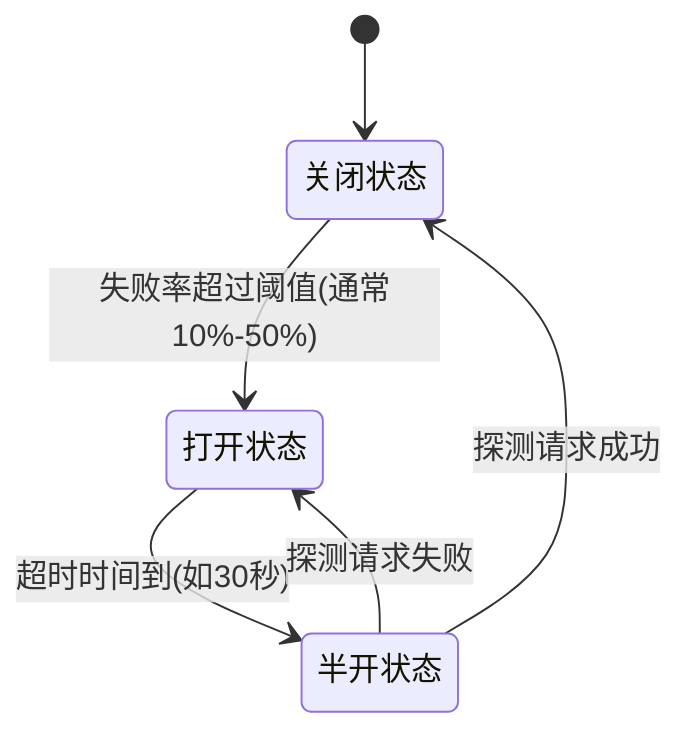
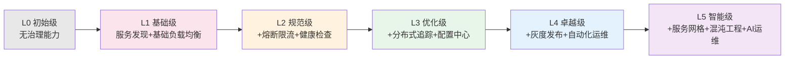

## 本章小结

本章围绕微服务架构中最核心的基础设施——服务治理，系统性地讲解了服务发现、负载均衡、熔断限流、分布式追踪、配置管理和灰度发布六大技术领域。这些能力共同构成了分布式系统稳定运行的"神经系统"，缺一不可。下面从知识回顾、核心模型、工程实践、成熟度评估四个层面进行系统总结。

---

## 服务治理知识体系全景图

```mermaid
graph TB
    SG[服务治理<br/>分布式系统的神经系统] --> SD[服务发现<br/>解决'服务在哪里']
    SG --> LB[负载均衡<br/>解决'选哪个实例']
    SG --> CB[熔断与限流<br/>解决'故障如何隔离']
    SG --> DT[分布式追踪<br/>解决'请求如何追踪']
    SG --> CM[配置管理<br/>解决'配置如何下发']
    SG --> GR[灰度发布<br/>解决'变更如何安全']

    SD --> SD1[客户端发现<br/>Eureka+Ribbon]
    SD --> SD2[服务端发现<br/>K8s Service]
    SD --> SD3[DNS发现<br/>Consul DNS]

    LB --> LB1[静态算法<br/>轮询/加权/一致性哈希]
    LB --> LB2[动态算法<br/>最少连接/响应时间]

    CB --> CB1[熔断器<br/>三态状态机]
    CB --> CB2[限流算法<br/>令牌桶/漏桶/滑动窗口]
    CB --> CB3[分布式限流<br/>Redis+Lua]

    DT --> DT1[OpenTelemetry标准]
    DT --> DT2[上下文传播<br/>W3C TraceContext]
    DT --> DT3[采样策略<br/>头部/尾部/自适应]

    CM --> CM1[推拉结合通知]
    CM --> CM2[三级配置架构]

    GR --> GR1[金丝雀发布]
    GR --> GR2[蓝绿部署]
    GR --> GR3[自动化灰度<br/>Argo Rollouts]

    SG -.-> OBS[可观测性<br/>日志/指标/追踪]
    OBS -.-> CHAOS[混沌工程<br/>故障注入验证]
    OBS -.-> MESH[服务网格<br/>治理能力下沉]

    style SG fill:#1a73e8,color:#fff
    style OBS fill:#f9ab00,color:#fff
    style CHAOS fill:#ea4335,color:#fff
    style MESH fill:#34a853,color:#fff
```

六大能力并非孤立存在，而是形成一个相互配合的治理体系：**服务发现是基石**，让服务能彼此找到；**负载均衡是调度核心**，将请求合理分配；**熔断限流是保护机制**，防止故障扩散和系统过载；**分布式追踪是可观测性基础**，让请求链路透明可见；**配置管理是运维抓手**，支持参数的集中管理与动态更新；**灰度发布是变更安全网**，确保版本切换的风险可控。它们与可观测性三支柱、混沌工程、服务网格共同构成完整的微服务治理生态。

---

## 核心知识点回顾

### 服务发现：让服务找到彼此

服务发现是所有治理能力的基石，解决"服务在哪里"这一根本问题。在云原生环境中，服务实例的IP地址随扩缩容、故障转移动态变化，硬编码地址的方案完全不可行。

三种发现模式各有优劣，选择取决于团队技术栈和架构需求：

| 模式 | 代表实现 | 优点 | 缺点 | 适用场景 |
|------|----------|------|------|----------|
| 客户端发现 | Eureka + Ribbon | 架构简单，无额外网络跳转，延迟低 | 客户端与注册中心耦合，多语言需各自实现SDK | Java生态，Spring Cloud项目 |
| 服务端发现 | Kubernetes Service | 客户端逻辑简单，无需集成SDK | 增加一跳网络延迟，负载均衡器可能成为瓶颈 | Kubernetes环境，多语言混合栈 |
| DNS发现 | Consul DNS | 通用性最强，所有语言原生支持DNS解析 | DNS缓存导致更新延迟，负载均衡策略简单 | 跨语言环境，轻量级服务发现 |

**CAP权衡与选型决策**：注册中心的选型需要在CAP之间权衡。AP型注册中心（Eureka、Nacos AP模式）在网络分区时仍可返回服务实例列表，短暂的数据不一致通常可以接受——一个已下线的实例最多导致少量请求失败，客户端自动重试其他实例即可。CP型注册中心（ZooKeeper、Consul）保证数据强一致，但网络分区时可能完全不可用，所有服务调用都会受影响。生产环境中，除非有分布式锁、Leader选举等强一致性需求，否则优先选择AP型注册中心。

**健康检查设计原则**：健康检查是服务发现的关键环节。推荐做法是实现轻量级HTTP健康检查端点，检查数据库、缓存、消息队列等关键依赖的连通性，但不要做过于深入的检查（如数据库数据一致性校验），否则健康检查本身可能成为性能瓶颈。检查间隔建议10-30秒，超时时间设为检查间隔的1/3。

**本地缓存兜底**：客户端必须维护本地缓存作为"最后一道防线"。当注册中心短暂不可用时，本地缓存可以保证服务调用不中断。这也是AP型注册中心的核心设计哲学——宁可返回过期数据，也不能完全拒绝服务。

### 负载均衡：合理分配请求

负载均衡解决"选择哪个实例"的问题，核心目标是充分利用资源、避免单点过载。

**静态算法**在运行时不考虑服务器实际状态：

- **轮询（Round Robin）**：最简单，依次分配请求，适合实例性能均匀的场景。但存在"惊群效应"——多个客户端的缓存同时过期，同时刷新导致瞬时大量请求涌入
- **加权轮询（Weighted Round Robin）**：按权重分配，Nginx使用的平滑加权轮询算法能避免流量突变。每次选择时当前权重增加配置权重，选中后减去总权重，实现均匀分布
- **哈希（Hash）**：按属性（用户ID、IP）分配，实现会话保持，但节点变化时映射大面积改变
- **一致性哈希（Consistent Hash）**：哈希环 + 虚拟节点，节点增减只影响1/N的请求映射，是分布式缓存（如Memcached集群）的核心算法。虚拟节点数量直接影响负载均匀性——太少（<50）导致分布不均，太多（>500）增加内存和查找开销，推荐范围100-200个

**动态算法**根据服务器实时状态决策：

- **最少连接（Least Connections）**：分配给活跃连接数最少的实例，自适应处理能力差异
- **加权最少连接**：选择 `当前连接数 / 权重` 比值最小的实例
- **响应时间（Response Time）**：选择平均响应时间最短的实例，AWS ALB的"最少未完成请求"就是这种思路的变体
- **自适应负载均衡**：综合CPU、内存、IO等多指标加权评分，Envoy的Subset Load Balancing支持根据请求元数据路由到特定子集

**连接预热机制**：新实例上线时需要连接预热——初始权重为0，随时间线性增加到目标权重。这避免了大量流量突然涌入未预热的实例，导致JVM冷启动、缓存未填充、连接池未建立等问题。预热时间通常为30-120秒，取决于应用的启动特性。

### 熔断器模式：故障快速隔离

熔断器由Michael Nygard在《Release It!》中提出，灵感来自电路断路器。它通过三态状态机实现故障的快速隔离和自动恢复：

- **关闭状态（Closed）**：正常工作，记录成功/失败次数。失败率超过阈值时转为打开状态。需要设置最小请求数（如100次），避免低流量下少数失败就触发熔断
- **打开状态（Open）**：所有请求直接快速失败，不调用下游服务，持续一段时间（如30秒）后转为半开状态
- **半开状态（Half-Open）**：允许少量请求通过以探测服务恢复情况。探测成功则恢复到关闭状态；失败则重新打开。半开状态必须限制并发请求数（如最多5个），防止大量请求涌入尚未恢复的服务

**熔断器高级特性**：

| 特性 | 说明 | 实现要点 |
|------|------|----------|
| 慢调用检测 | 响应时间超过阈值的比例过高时也触发熔断 | 设置慢调用阈值（如P99 > 2s）和慢调用比例阈值（如50%） |
| 异常分类 | 区分客户端错误和服务端错误 | 4xx不计入失败率，只统计5xx、超时、连接拒绝 |
| 并发限制 | 半开状态下限制探测请求并发数 | 使用信号量（Semaphore）控制最大并发探测数 |
| 失败率滑动窗口 | 精确统计时间窗口内的失败率 | 将窗口细分为多个桶，加权计算当前失败率 |
| 状态转换事件 | 监控熔断状态变化 | 注册状态变更监听器，记录日志并触发告警 |

**降级策略设计**：熔断后必须配合降级策略，而不是简单返回错误。常见的降级手段：

1. **缓存降级**：返回上次成功的缓存数据（如商品详情页展示缓存的价格）
2. **默认值降级**：返回预设的默认值（如评分服务不可用时返回"暂无评分"）
3. **备用服务降级**：调用功能等价的备用服务（如主支付渠道不可用时切换到备用渠道）
4. **简化流程降级**：跳过非核心步骤（如推荐服务不可用时跳过个性化推荐，展示热门商品）
5. **排队等待降级**：将请求放入队列异步处理（如秒杀场景下的排队机制）

### 限流算法：保护系统不被压垮

限流是防止过载流量摧毁系统的第一道防线。四种主流算法各有特点：

| 算法 | 核心思想 | 突发处理 | 内存开销 | 适用场景 |
|------|----------|----------|----------|----------|
| 令牌桶(Token Bucket) | 恒定速率产生令牌，请求消耗令牌 | 允许桶中积累令牌的突发 | 低 | API限流，大多数通用场景 |
| 漏桶(Leaky Bucket) | 请求进入桶，恒定速率处理 | 完全平滑，无突发 | 低 | 需要严格平滑输出的场景 |
| 滑动窗口计数 | 细分时间窗口统计请求数 | 精确控制窗口内速率 | 中 | 需要精确限流的场景 |
| 滑动窗口日志 | 记录每个请求时间戳 | 精确但开销大 | 高 | 低流量精确限流 |

**令牌桶参数调优**：令牌桶是最广泛使用的算法。关键参数是桶的容量（最大突发量）和令牌产生速率（稳态速率）。例如，API限流设置为"每秒100个令牌，桶容量500"，意味着稳态下每秒处理100个请求，突发时最多允许500个请求同时通过。桶容量太小会拒绝合理的突发流量，太大会让下游服务承受过大压力。

**分布式限流实现**：分布式限流使用Redis的Lua脚本保证原子性，通过Sorted Set存储请求时间戳，利用`ZREMRANGEBYSCORE`清理过期记录，`ZCARD`统计当前窗口请求数。关键点是Lua脚本在Redis中原子执行，避免了竞态条件。但如果Redis本身出现故障，需要降级为本地限流（每个实例独立限流），此时总限流值会放大为单实例的N倍，需要提前规划好降级后的限流阈值。

**限流响应规范**：限流的响应应返回明确的HTTP状态码和Header信息，告知客户端限流状态和重试时机：

HTTP/1.1 429 Too Many Requests
X-RateLimit-Limit: 100
X-RateLimit-Remaining: 0
X-RateLimit-Reset: 1625000060
Retry-After: 5
Content-Type: application/json

{
  "error": "rate_limit_exceeded",
  "message": "请求频率超过限制，请稍后重试",
  "retry_after": 5
}

**多层限流架构**：限流应在多个层级协同工作：

- **网络层（WAF/CDN）**：拦截恶意流量（DDoS、CC攻击），过滤明显异常的请求
- **网关层（API Gateway）**：实施全局限流策略，保护后端服务
- **应用层**：实施细粒度限流（如单用户维度、单接口维度）
- **数据库层**：限制并发查询数，防止慢查询耗尽连接池

### 分布式追踪：看清请求全貌

在微服务架构中，一个用户请求可能经过5-20个服务。分布式追踪通过Trace和Span两个核心概念记录完整的调用链路：

- **Trace**：一个完整请求链路，由唯一Trace ID标识，包含多个Span
- **Span**：一个操作单元，包含操作名称、时间、标签、日志，通过Parent Span ID建立父子关系

**OpenTelemetry标准**：OpenTelemetry是CNCF孵化的可观测性标准，由OpenTracing和OpenCensus合并而来，提供统一的API、SDK和工具链。它是新项目的首选方案，避免被特定供应商（Zipkin、Jaeger等）锁定。其核心价值在于：一次埋点，数据可导出到任何后端（Jaeger、Zipkin、Datadog、Prometheus等）。

**上下文传播机制**：上下文传播是分布式追踪的关键环节。W3C制定了标准的Trace Context传播格式：

traceparent: 00-0af7651916cd43dd8448eb211c80319c-b7ad6b7169203331-01
tracestate: congo=t61rcWkgMzE

传播载体包括HTTP Header（同步调用）、gRPC Metadata（RPC调用）、消息队列Message Header（异步调用）。必须在所有跨服务调用中传播Trace Context，包括异步任务和消息队列消费，否则链路会断裂，无法追踪完整的请求生命周期。

**采样策略设计**：采样策略用于平衡追踪精度和系统开销：

| 采样策略 | 实现方式 | 优点 | 缺点 | 适用场景 |
|----------|----------|------|------|----------|
| 固定比例采样 | 对1%-10%的正常请求采样 | 实现简单，开销可控 | 可能遗漏关键链路 | 正常流量监控 |
| 自适应采样 | 根据系统负载动态调整采样率 | 高负载时自动降低开销 | 实现复杂 | 生产环境通用方案 |
| 尾部采样 | 请求完成后，根据特征决定是否保留 | 能捕获所有异常链路 | 需要收集完整Trace后再决策 | 需要完整异常分析的场景 |
| 始终采样 | 出错请求、延迟超标请求100%采样 | 不遗漏任何异常 | 存储压力大 | 关键业务流程（支付、下单） |

### 配置中心：集中管理与动态更新

配置中心解决了微服务架构中配置分散、变更困难、无法审计的痛点。一个完善的配置中心应满足：集中管理、多环境隔离、动态热更新、版本控制与回滚、灰度发布配置。

**推拉结合的通知机制**：服务端配置变更后，通过长轮询（Long Polling）或WebSocket推送变更通知；客户端收到通知后拉取最新配置并更新本地缓存。Nacos使用长轮询（默认30秒超时），客户端在超时前收到变更则立即返回，超时后重新建立连接。这种方式比纯推送更可靠（不受网络波动影响），比纯拉取更实时（变更后立即通知）。

**配置变更安全保障**：

1. 关键配置变更需要双人审批，避免单人误操作
2. 变更前自动备份当前配置，支持一键回滚到任意历史版本
3. 配置变更灰度发布，先在少量实例上验证效果
4. 敏感配置（密码、密钥）加密存储和传输，使用KMS管理密钥

**三级配置架构**在生产环境中被广泛采用：

| 配置层级 | 内容 | 变更频率 | 审批级别 | 示例 |
|----------|------|----------|----------|------|
| 全局配置 | 公共参数 | 低 | 技术负责人审批 | 数据库连接池大小、公共超时时间 |
| 服务配置 | 业务参数 | 中 | 团队负责人审批 | 特性开关、业务阈值 |
| 实例配置 | 临时参数 | 高 | 开发人员自行操作 | 调试日志级别、临时限流阈值 |

### 灰度发布：安全变更的关键

灰度发布是渐进式发布策略，通过流量路由将新版本逐步推送给用户。核心策略包括：

**金丝雀发布**：新版本先部署到少量实例，导入5%-10%的流量。通过监控错误率、延迟、业务指标判断新版本是否正常。异常时立即切回旧版本。金丝雀发布的精髓在于"小步快跑"——每次只暴露少量用户给新版本，问题发现后影响范围极小。

**蓝绿部署**：维护两套完全相同的环境（蓝/绿），新版本部署到空闲环境，验证后一次性切换流量。优点是切换速度快（秒级）、回滚简单（切回旧环境），缺点是需要双倍服务器资源。

**自动化灰度发布系统**（如Argo Rollouts）能根据预定义指标自动调整流量比例。例如：10%流量→观察5分钟→检查成功率≥99.9%→增加到30%→观察10分钟→检查P99延迟≤500ms→增加到60%→观察10分钟→100%。如果任何阶段指标异常，自动回滚到旧版本。

**灰度规则维度**：流量染色和路由可以基于多种维度：

- 用户维度：用户ID尾号、VIP等级、地域
- 设备维度：设备类型（iOS/Android/Web）、操作系统版本
- 流量维度：请求Header、Cookie、百分比
- 标签维度：用户标签、灰度标签、内部测试账号

---

## 关键公式与核心模型

| 概念 | 公式/模型 | 实际意义 |
|------|-----------|----------|
| Little定律 | QPS = 并发数 / 平均延迟 | 容量规划的基础公式，知道并发数和延迟就能估算吞吐量 |
| 可用性 | SLA = 正常时间 / 总时间 | 99.9% = 8.76小时/年停机，99.99% = 52.6分钟/年 |
| 尾延迟 | P99 = 排序后第99百分位值 | 比平均延迟更能反映用户体验，1%的慢请求可能拖垮整体 |
| 一致性哈希偏移 | 偏移量 ≈ 1/N × 100% | 节点增减时，只有约1/N的请求需要重新映射 |
| 令牌桶突发 | 最大突发量 = 桶容量 | 突发流量的上限由桶容量决定，稳态速率由产生速率决定 |
| 熔断恢复时间 | 恢复时间 = 半开状态持续时间 × 探测次数 | 从熔断到完全恢复需要的时间取决于半开状态的探测策略 |

---

## 服务治理能力成熟度模型

在实施服务治理时，不同阶段的团队需要不同的能力组合。以下成熟度模型帮助团队评估当前状态并规划演进路径：

| 成熟度等级 | 核心能力 | 典型团队规模 | 关键指标 | 演进重点 |
|------------|----------|--------------|----------|----------|
| L0 初始级 | 无服务治理，硬编码地址 | 1-5人 | 应用可用性无保障 | 引入服务发现 |
| L1 基础级 | 服务发现 + 基础负载均衡 | 5-20人 | 服务调用成功率 > 99% | 引入熔断限流 |
| L2 规范级 | + 熔断限流 + 健康检查 + 基础监控 | 20-50人 | 故障恢复时间 < 5分钟 | 引入分布式追踪 |
| L3 优化级 | + 分布式追踪 + 配置中心 + 灰度发布 | 50-200人 | 发布频率 > 每周一次 | 引入自动化运维 |
| L4 卓越级 | + 自动化灰度 + 全链路可观测 + SRE实践 | 200-1000人 | 可用性 > 99.95% | 引入服务网格 |
| L5 智能级 | + 服务网格 + 混沌工程 + AI辅助运维 | 1000+人 | 可用性 > 99.99% | 持续优化 |

**演进原则**：不要跳级。很多团队试图直接上服务网格（L5能力），但基础的服务发现和熔断都没做好，结果是"用大炮打蚊子"——增加了复杂度却没解决核心问题。每升一级，先巩固上一级的能力，再引入新能力。

---

## 关键技术选型指南

| 能力 | 推荐方案 | 备选方案 | 选型依据 |
|------|----------|----------|----------|
| 服务注册中心 | Nacos | Consul | Nacos同时支持AP/CP，与Spring Cloud Alibaba深度集成；Consul适合多语言+DNS接口需求 |
| 熔断限流 | Sentinel | Resilience4j | Sentinel提供丰富 Dashboard 和实时监控；Resilience4j更轻量，适合非Spring项目 |
| 分布式追踪 | OpenTelemetry | Zipkin | OTel是CNCF标准，厂商中立；Zipkin适合已有部署的团队 |
| 配置中心 | Nacos | Apollo | Nacos与服务发现统一平台；Apollo权限管理更完善 |
| 灰度发布 | Argo Rollouts | Istio VirtualService | Argo原生Kubernetes，支持自动化灰度；Istio功能更全但复杂度更高 |
| API网关 | Kong | APISIX | Kong生态成熟；APISIX性能更优，插件机制更灵活 |

**选型原则**：已有Kubernetes集群的团队优先使用原生能力（Service/ConfigMap/Istio），避免引入额外组件增加运维负担；没有容器化的团队可以使用Nacos（同时提供配置中心和注册中心）降低技术栈复杂度。核心原则是"够用就好"——不要为了技术先进性引入超出团队运维能力的组件。

---

## 最佳实践清单

### 设计阶段

- [ ] 明确服务治理的优先级：可观测性先行（日志、指标、追踪），再引入熔断限流等控制能力
- [ ] 选择AP型注册中心（除非有强一致性需求），客户端维护本地缓存作为"最后一道防线"
- [ ] 设计降级策略：熔断后不能只返回错误，必须有缓存降级、默认值、备用服务等手段
- [ ] 制定灰度发布流程：定义清晰的成功/失败指标，建立自动化回滚机制
- [ ] 评估团队成熟度，选择对应等级的能力组合，不要跳级实施
- [ ] 设计限流的降级策略：Redis不可用时降级为本地限流，明确降级后的限流阈值

### 实现阶段

- [ ] 健康检查端点检查关键依赖（DB、Redis、MQ），但避免过于深入导致检查本身成为瓶颈
- [ ] 负载均衡实现连接预热：新实例从低权重开始，线性增长到目标权重
- [ ] 限流在多层实施：网络层（WAF）→ 网关层（API Gateway）→ 应用层
- [ ] 分布式限流使用Redis Lua脚本保证原子性，避免每个实例独立限流导致总量放大
- [ ] 追踪上下文必须在所有跨服务调用中传播，包括异步任务和消息队列
- [ ] 熔断器设置最小请求数，避免低流量下少数失败就触发误熔断
- [ ] 限流响应返回规范的 `429` 状态码和 `Retry-After` Header，告知客户端重试时机

### 运维阶段

- [ ] 监控四类核心指标（RED方法）：延迟（P99）、吞吐量（QPS）、错误率、饱和度（CPU/内存/连接数）
- [ ] 熔断阈值根据历史错误率设置（通常10%-50%），设置最小请求数避免低流量误触发
- [ ] 限流响应返回 `429` 状态码和 `Retry-After` Header，让客户端知道重试时机
- [ ] 配置变更审计：记录操作人、原因、新旧值，关键配置双人审批
- [ ] 追踪采样率按需调整：正常请求1%-10%，异常请求100%，关键业务100%
- [ ] 定期进行混沌工程演练，验证熔断降级策略是否真正生效
- [ ] 建立服务治理能力的度量看板，持续跟踪各项指标的趋势变化

---

## 常见误区速查

| 误区 | 正确做法 | 根因分析 |
|------|----------|----------|
| 过度依赖注册中心可用性 | 客户端始终维护本地缓存 | 注册中心只是发现手段，缓存才是"最后防线" |
| 健康检查只返回200 | 检查DB、Redis、MQ等关键依赖 | 无法正常处理请求的实例不应被标记为"健康" |
| 新实例直接接收全量流量 | 实现连接预热，权重从0线性增长 | JVM冷启动、缓存未填充、连接池未建立需要时间 |
| 熔断后直接返回错误 | 设计降级策略（缓存/默认值/备用服务） | 熔断是保护机制，降级是用户体验保障 |
| 4xx错误也触发熔断 | 只对5xx、超时、连接拒绝触发熔断 | 4xx是客户端问题，不应影响服务端健康判定 |
| 只在应用层限流 | 多层限流：WAF → 网关 → 应用 | 恶意流量到达应用层时已消耗连接和计算资源 |
| 每个实例独立限流 | 使用Redis集中式限流 | N个实例独立限流，总量是单实例的N倍 |
| 追踪所有请求 | 设置采样率，异常/关键请求100%采样 | 全量追踪产生海量数据，存储和带宽压力巨大 |
| 异步调用不传播追踪上下文 | 所有跨服务调用（含MQ、异步任务）都传播 | 链路断裂导致无法追踪完整的请求生命周期 |
| 低流量就熔断 | 设置最小请求数（如100次）再判断失败率 | 10次请求失败2次=20%失败率，但样本太少没有统计意义 |
| 限流阈值一成不变 | 根据业务时段动态调整（如大促期间提升阈值） | 固定阈值无法适应流量的潮汐变化 |

---

## 快速参考卡

### 服务治理能力矩阵

| 需要解决的问题 | 对应能力 | 核心组件 | 关键配置 |
|----------------|----------|----------|----------|
| 服务实例动态变化 | 服务发现 | Nacos/Eureka/Consul | 注册间隔、健康检查周期、本地缓存TTL |
| 多实例请求分配 | 负载均衡 | Ribbon/kube-proxy/Envoy | 负载均衡策略、权重、连接预热时间 |
| 下游服务故障隔离 | 熔断器 | Sentinel/Resilience4j | 失败率阈值、超时时间、半开并发数 |
| 流量过载保护 | 限流 | Sentinel/Redis+Lua | 令牌速率、桶容量、滑动窗口大小 |
| 请求链路追踪 | 分布式追踪 | OpenTelemetry/Jaeger | 采样率、传播格式、导出端点 |
| 配置集中管理 | 配置中心 | Nacos/Apollo | 长轮询超时、本地缓存策略、加密方式 |
| 安全版本发布 | 灰度发布 | Argo Rollouts/Istio | 流量比例、成功指标、回滚条件 |

### 常用监控指标（RED方法）

| 指标 | 含义 | 采集方式 | 告警阈值建议 |
|------|------|----------|--------------|
| Rate（速率） | 每秒请求数（QPS） | Prometheus counter | 突增50%或骤降80% |
| Errors（错误） | 失败请求比例 | HTTP 5xx / 总请求数 | > 1%触发P2告警，> 5%触发P1 |
| Duration（延迟） | 请求响应时间 | Histogram/P99 | P99 > 1s触发P2，> 3s触发P1 |
| Saturation（饱和度） | 资源使用率 | CPU/内存/连接数/线程池 | CPU > 80%，连接池 > 90% |

### 熔断器参数速查

| 参数 | 推荐值 | 说明 |
|------|--------|------|
| 失败率阈值 | 10%-50% | 根据服务容忍度调整，核心服务设低（10%），非核心服务设高（50%） |
| 最小请求数 | 50-200 | 低于此数量不触发熔断判断，避免低流量误触发 |
| 滑动窗口大小 | 10-30秒 | 统计失败率的时间窗口 |
| 熔断超时时间 | 10-60秒 | 打开状态持续时间，过短则频繁探测，过长则恢复慢 |
| 半开最大并发 | 3-10 | 半开状态下允许通过的探测请求数 |

---

## 下一步学习建议

### 深入方向

1. **服务网格（Service Mesh）**：Istio、Linkerd等方案将治理能力下沉到Sidecar代理层，应用代码无需感知。学习Sidecar模式、xDS协议、mTLS通信。参见第58章。

2. **可观测性三支柱**：日志（Logging）、指标（Metrics）、追踪（Tracing）的完整实践。学习Prometheus监控体系、Grafana可视化、ELK日志平台。参见第42章。

3. **混沌工程**：通过主动注入故障（网络延迟、服务不可用、资源耗尽）来验证系统的容错能力。学习Chaos Monkey、Litmus Chaos、ChaosBlade等工具。

4. **平台工程**：将服务治理的各种能力封装成内部开发者平台（Internal Developer Platform），降低微服务治理的认知负担。学习Backstage、Kubernetes Operator模式。

5. **SRE实践**：Google SRE方法论中的错误预算（Error Budget）、SLI/SLO/SLA体系、事后复盘（Post-mortem）等实践，为服务治理提供度量和改进的框架。

### 推荐资源

- **书籍**：《Release It!》（Michael Nygard）——熔断器模式的原始出处；《微服务架构设计模式》（Chris Richardson）——微服务治理的全面实践指南；《Building Microservices》（Sam Newman）——微服务拆分与治理的经典著作
- **论文**：Google SRE Book（免费在线阅读）——大规模分布式系统的运维哲学；Dapper论文（Google）——分布式追踪系统的奠基之作
- **开源项目**：OpenTelemetry（可观测性标准）、Envoy Proxy（现代服务代理）、Istio（服务网格）、Nacos（服务发现+配置中心）
- **标准文档**：W3C Trace Context（追踪上下文传播标准）、OpenMetrics（指标暴露标准）

---

## 思考题

1. **架构决策**：如果你的团队正在从单体架构迁移到微服务，服务治理能力应该按什么顺序引入？为什么"可观测性先行"是最佳策略？请结合成熟度模型分析各阶段的引入重点。

2. **技术选型**：在AP型和CP型注册中心之间如何做出选择？请结合具体业务场景（如电商交易 vs 内容推荐）分析两者的利弊，并给出选型决策树。

3. **故障设计**：设计一个熔断降级方案：当订单服务的库存查询接口触发熔断时，如何在不牺牲用户体验的前提下保证系统可用？请考虑缓存降级、默认值降级、备用服务降级三种方案的组合使用。

4. **性能权衡**：分布式限流使用Redis集中式方案，但如果Redis本身出现故障怎么办？请设计一个"Redis不可用时的降级限流策略"，包括降级触发条件、降级后的限流阈值计算、恢复后的状态同步。

5. **灰度策略**：某金融系统需要发布一个涉及资金计算的核心变更，你会选择金丝雀发布还是蓝绿部署？如何设计灰度规则来最小化风险？请考虑灰度维度选择、监控指标设计、回滚条件定义。

6. **系统演进**：服务网格（Service Mesh）将治理能力下沉到Sidecar代理层，这种做法有哪些优势和代价？在什么情况下不应该使用服务网格？请从团队规模、技术栈、运维能力三个维度分析。

7. **综合设计**：为一个日均千万级订单的电商平台设计完整的服务治理方案，覆盖六大能力领域。要求给出技术选型理由、关键参数配置、监控告警策略、故障演练计划。
