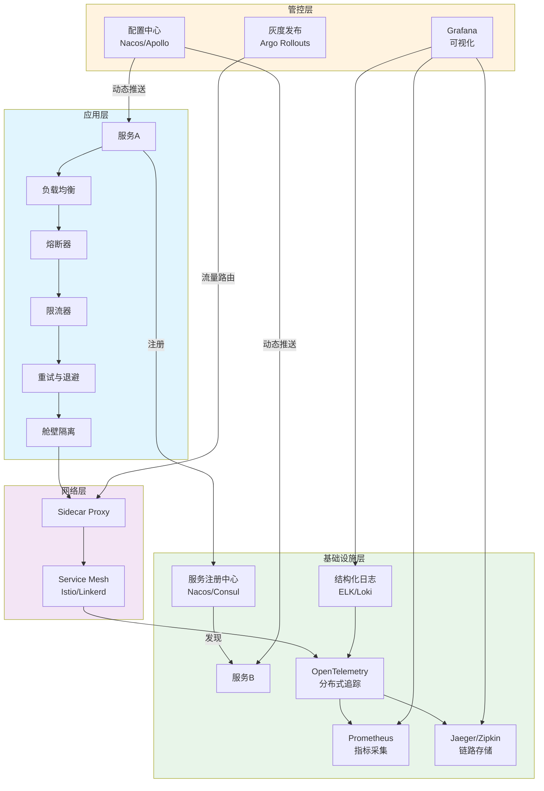
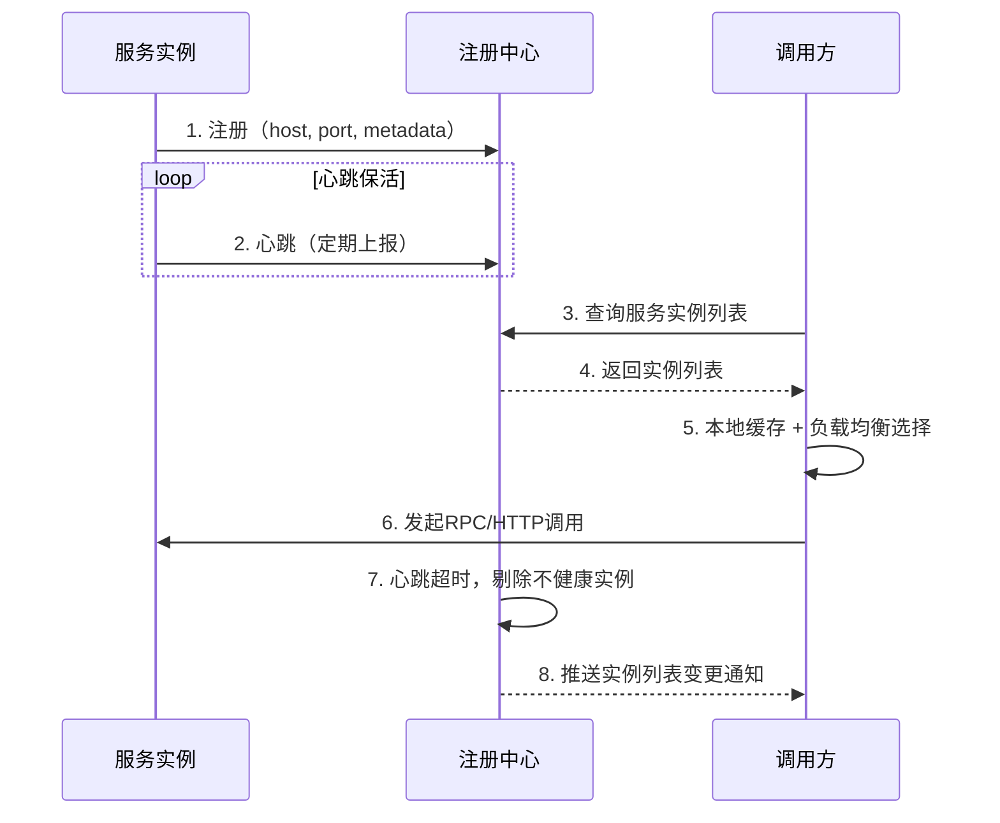
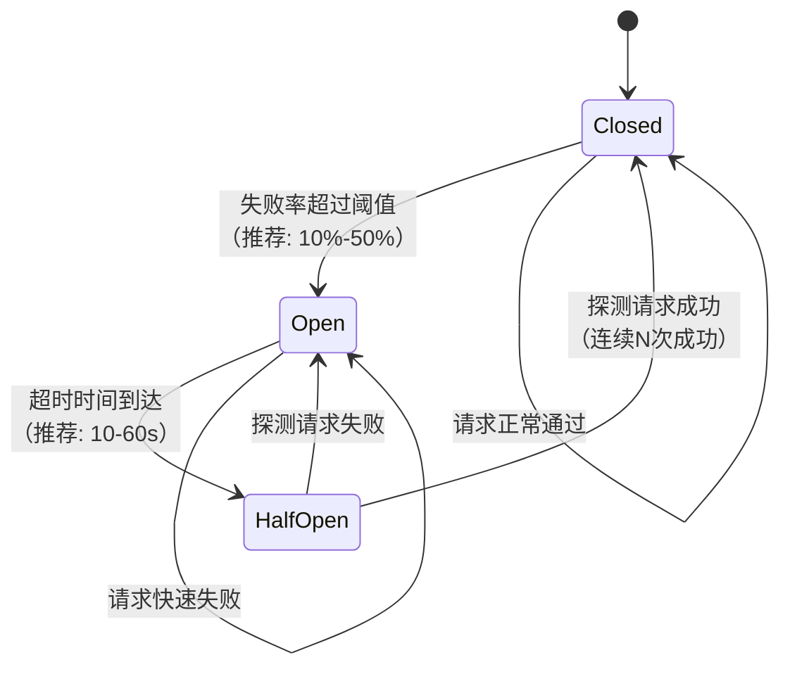
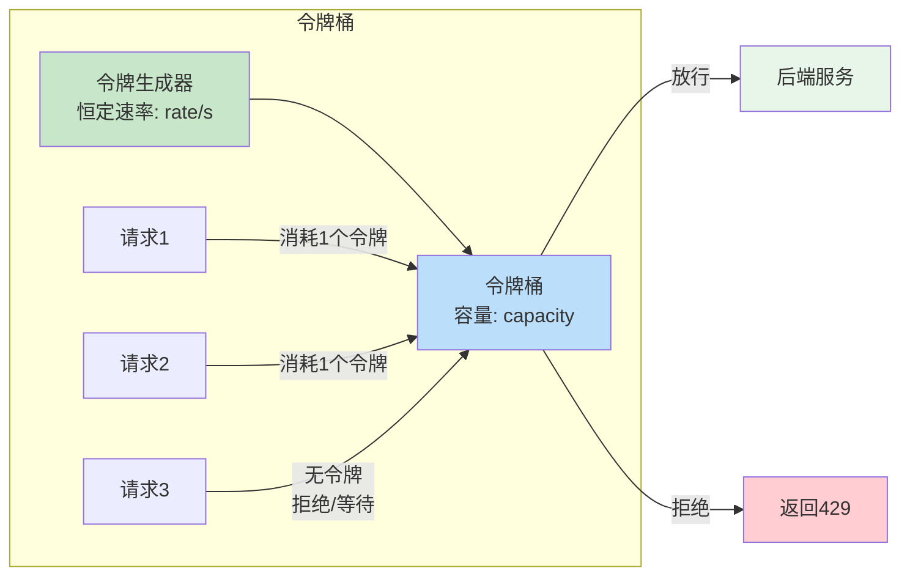
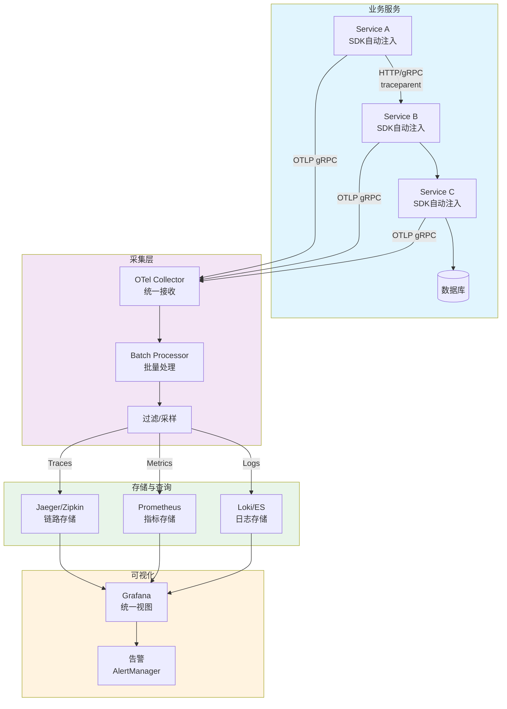
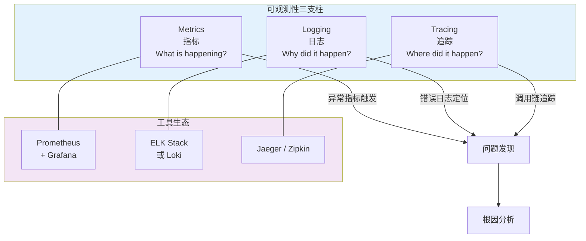
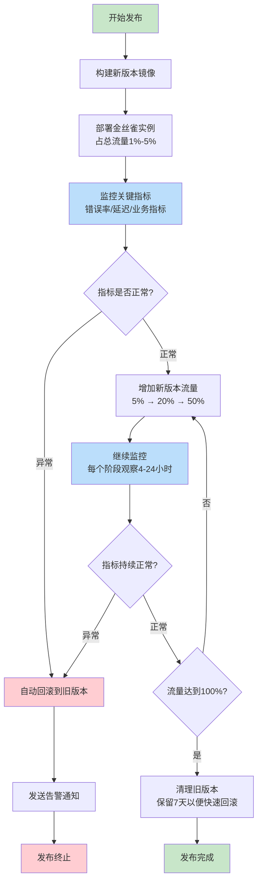
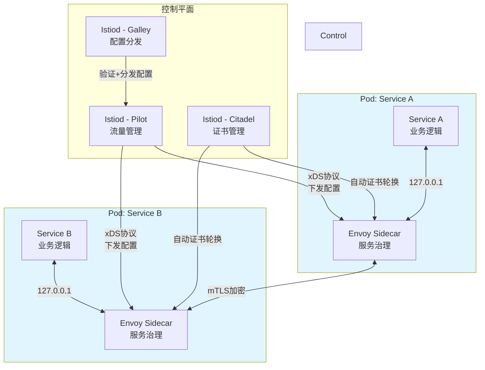
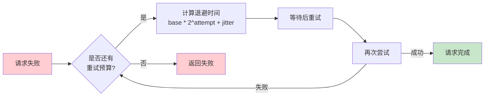

# 第41章 服务治理

## 章节定位

在微服务架构中，随着服务数量的急剧增长，服务之间的调用关系变得错综复杂。服务治理是保障分布式系统稳定运行的关键能力，它涵盖了服务发现、负载均衡、熔断限流、分布式追踪、配置管理等多个维度。本章将系统性地介绍服务治理的核心概念、技术方案与实践经验。

## 章节结构

本章从服务治理的理论基础出发，首先讲解服务发现的三种主要模式：客户端发现、服务端发现和DNS发现，分析每种模式的适用场景与实现原理。随后深入探讨负载均衡的各种算法，从简单的轮询到基于权重、连接数的智能负载均衡策略。在服务容错方面，详细分析熔断器模式的工作原理与状态机转换。限流部分涵盖令牌桶、漏桶、滑动窗口等经典算法。分布式追踪部分以OpenTelemetry标准为核心，讲解全链路追踪的实现原理，并扩展到可观测性的三大支柱（Metrics、Logging、Tracing）。接着介绍配置中心的设计思路与灰度发布的实践方案。最后引入服务网格（Service Mesh）作为下一代服务治理范式，对比SDK治理与网格治理的差异与选型。

## 学习目标

通过本章的学习，读者应能：

1. 理解服务治理在微服务架构中的重要性与核心组成
2. 掌握服务发现的三种模式及其工程实现
3. 熟悉主流负载均衡算法的原理与适用场景
4. 深入理解熔断器模式与限流算法的实现机制
5. 掌握重试退避、舱壁模式等高级容错策略
6. 了解OpenTelemetry标准及可观测性三大支柱
7. 掌握配置中心与灰度发布的工程实践
8. 理解服务网格（Service Mesh）的架构与适用场景
9. 能够设计和实现完整的服务治理方案

## 前置知识

学习本章前，建议读者具备以下基础知识：

- 分布式系统的基本概念（第21章）
- 容器与编排技术（第40章）
- 网络协议基础（第18-19章）
- 消息队列的基本原理（第35章）
## 本节目录

> **"道法术器"框架**：本章遵循"道→法→术→器"的认知递进。**道**（为什么需要服务治理）、**法**（治理的核心模式与原则）、**术**（具体算法与策略）、**器**（开源框架与工具选型）。

| 章节 | 主题 | 核心关键词 |
|------|------|-----------|
| 41.1 | 服务治理概述 | 微服务挑战、治理能力矩阵 |
| 41.2 | 服务发现 | 注册中心、客户端/服务端/DNS发现 |
| 41.3 | 负载均衡算法 | 轮询、一致性哈希、最少连接 |
| 41.4 | 熔断器模式 | 三态状态机、滑动窗口、慢调用检测 |
| 41.5 | 限流算法 | 令牌桶、漏桶、滑动窗口、分布式限流 |
| 41.6 | 分布式追踪 | OpenTelemetry、可观测性三支柱 |
| 41.7 | 配置中心 | 推拉结合、灰度配置、审计日志 |
| 41.8 | 灰度发布 | 金丝雀、蓝绿部署、自动化灰度 |
| 41.9 | 服务网格 | Sidecar模式、Istio、Linkerd |

## 服务治理全景图

下图展示了服务治理的完整能力全景，各组件协同工作构成微服务稳定运行的基石：




***

# 第41章 服务治理 - 理论基础

## 41.1 服务治理概述

服务治理是微服务架构中最为核心的基础设施之一。在单体应用时代，所有功能模块运行在同一个进程中，模块之间的调用是本地函数调用，不存在网络延迟、服务发现、负载均衡等问题。然而，随着业务规模的增长和团队的扩大，单体架构逐渐暴露出部署耦合、技术栈单一、扩展困难等问题，微服务架构应运而生。

微服务架构将一个大型应用拆分为多个独立的服务，每个服务负责一个特定的业务功能，拥有自己的数据库和部署流程。这种架构带来了灵活性和可扩展性，但也引入了新的挑战：服务实例动态变化（扩缩容、故障转移），如何让调用方找到可用的服务实例？多个实例如何分配请求？某个服务出现故障时如何防止级联失败？这些问题正是服务治理要解决的核心问题。

服务治理的核心能力可以归纳为以下几个方面：

**服务发现**是服务治理的基石，解决"服务在哪里"的问题。当服务A需要调用服务B时，它需要知道服务B的网络地址。在云原生环境中，服务实例的IP地址是动态分配的，重启后可能发生变化，因此不能将地址硬编码在配置文件中。

**负载均衡**解决"选择哪个实例"的问题。当一个服务有多个实例时，需要合理地将请求分配到各个实例上，以充分利用资源并保证服务质量。

**熔断与限流**解决"故障如何隔离"的问题。当某个服务出现故障或过载时，需要快速失败而不是让调用方无限等待，同时要防止故障在调用链中传播。

**分布式追踪**解决"请求如何追踪"的问题。在一个请求经过多个服务的调用链中，如何快速定位性能瓶颈和故障点。

**配置管理**解决"配置如何下发"的问题。服务的运行参数需要集中管理，支持动态更新而无需重启服务。

**灰度发布**解决"变更如何安全"的问题。新版本上线时，需要逐步将流量从旧版本切换到新版本，以便及时发现和回滚问题。

***

## 41.2 服务发现

### 41.2.1 服务注册与发现的基本模型

服务发现的核心思想是引入一个中心化的注册中心（Service Registry），所有服务实例在启动时向注册中心注册自己的地址信息，在停止时注销。调用方通过查询注册中心获取目标服务的可用实例列表。

一个服务实例注册到注册中心时，通常需要提供以下信息：

```json
{
  "serviceName": "order-service",
  "instanceId": "order-service-192.168.1.10-8080",
  "host": "192.168.1.10",
  "port": 8080,
  "metadata": {
    "version": "2.1.0",
    "region": "cn-east",
    "weight": 100
  },
  "healthCheck": {
    "type": "HTTP",
    "path": "/actuator/health",
    "interval": 10
  }
}
```

服务注册与发现的完整流程如下图所示：



注册中心需要解决的关键问题包括：

**一致性与可用性的权衡**。根据CAP定理，注册中心只能在一致性（C）和可用性（A）之间做出选择。AP型注册中心（如Eureka）在网络分区时仍可提供服务，但可能返回过期数据；CP型注册中心（如ZooKeeper、Consul）保证数据一致性，但在网络分区时可能不可用。在实际生产环境中，通常选择AP型注册中心，因为短暂的不一致比服务不可用的影响更小。

**健康检查机制**。注册中心需要定期检查服务实例是否健康，及时剔除不健康的实例。常见的健康检查方式包括：客户端心跳（服务实例定期向注册中心发送心跳）、服务端探测（注册中心主动检查服务实例的健康端点）、以及两者的结合。

**多级缓存**。为减轻注册中心的负载并提高查询性能，客户端通常会缓存服务实例列表。当注册中心的数据发生变化时，通过推送机制通知客户端更新缓存。这种"推拉结合"的方式既保证了数据的及时性，又降低了注册中心的压力。

### 41.2.2 客户端发现模式

在客户端发现模式中，调用方直接查询注册中心获取服务实例列表，然后自行选择一个实例进行调用。这种模式将负载均衡的逻辑放在了客户端，因此客户端需要内置一个负载均衡组件。

```go
// Go语言实现客户端发现模式
type ServiceDiscovery struct {
    registry RegistryClient
    lb       LoadBalancer
    cache    map[string][]ServiceInstance
    mu       sync.RWMutex
}

func (sd *ServiceDiscovery) GetInstance(serviceName string) (*ServiceInstance, error) {
    // 先从本地缓存查找
    sd.mu.RLock()
    instances, exists := sd.cache[serviceName]
    sd.mu.RUnlock()
    
    if !exists || len(instances) == 0 {
        // 缓存未命中，从注册中心查询
        var err error
        instances, err = sd.registry.FetchInstances(serviceName)
        if err != nil {
            return nil, fmt.Errorf("fetch instances failed: %w", err)
        }
        // 更新本地缓存
        sd.mu.Lock()
        sd.cache[serviceName] = instances
        sd.mu.Unlock()
    }
    
    // 使用负载均衡算法选择实例
    return sd.lb.Select(instances)
}
```

客户端发现模式的优点是架构简单，没有额外的网络跳转，延迟较低。缺点是客户端与注册中心耦合，每种编程语言都需要实现一套发现逻辑。Netflix的Eureka配合Ribbon就是典型的客户端发现模式。

### 41.2.3 服务端发现模式

在服务端发现模式中，调用方不直接与注册中心交互，而是通过一个负载均衡器（Load Balancer）或路由器来转发请求。负载均衡器查询注册中心获取服务实例列表，并根据负载均衡策略选择一个实例进行转发。

```yaml
# Kubernetes Service就是服务端发现模式的典型实现
apiVersion: v1
kind: Service
metadata:
  name: order-service
spec:
  selector:
    app: order-service
  ports:
    - protocol: TCP
      port: 80
      targetPort: 8080
  type: ClusterIP
```

在Kubernetes中，每个Service有一个稳定的虚拟IP（ClusterIP）和DNS名称。kube-proxy组件负责维护Service与后端Pod之间的映射关系，通过iptables或IPVS规则将请求转发到健康的Pod上。调用方只需要访问Service的DNS名称，不需要关心后端有多少个Pod以及它们的IP地址。

服务端发现模式的优点是客户端逻辑简单，不需要集成额外的SDK。缺点是增加了一跳网络延迟，负载均衡器可能成为性能瓶颈和单点故障。为了提高可用性，通常需要部署多个负载均衡器实例，并使用DNS轮询或VIP漂移来实现高可用。

### 41.2.4 DNS发现模式

DNS发现模式利用DNS系统来实现服务发现。每个服务对应一个DNS名称，DNS记录指向服务实例的IP地址。当调用方解析该DNS名称时，可以获取到一个或多个IP地址。

```bash
# 使用DNS SRV记录实现服务发现
# SRV记录格式: _service._proto.name TTL class priority weight port target
_order._tcp.order-service.example.com. 300 IN SRV 10 60 8080 instance1.example.com.
_order._tcp.order-service.example.com. 300 IN SRV 10 40 8080 instance2.example.com.

# 使用A记录实现简单的服务发现
order-service.example.com. 300 IN A 192.168.1.10
order-service.example.com. 300 IN A 192.168.1.11
```

DNS发现模式的优点是通用性强，几乎所有编程语言都支持DNS解析，不需要额外的SDK。Consul就是通过DNS接口来提供服务发现功能的典型系统。其缺点是DNS有缓存机制，服务实例的变化不能立即生效（受TTL影响），且DNS轮询是一种相对简单的负载均衡策略，无法感知后端实例的实际负载情况。

### 41.2.5 服务发现模式对比

三种服务发现模式各有优劣，下表从多个维度进行了全面对比：

| 对比维度 | 客户端发现 | 服务端发现 | DNS发现 |
|----------|-----------|-----------|---------|
| **典型实现** | Eureka + Ribbon, Consul + 自研 | Kubernetes Service, AWS ELB | Consul DNS, CoreDNS |
| **负载均衡位置** | 客户端（SDK内置） | 服务端（LB/Proxy） | DNS轮询（简单） |
| **客户端复杂度** | 高（需集成SDK） | 低（直接访问） | 低（DNS解析） |
| **多语言支持** | 需各语言实现SDK | 语言无关 | 语言无关 |
| **额外网络跳转** | 无 | 有（多一跳） | 有（DNS + 可能的LB） |
| **负载均衡精度** | 高（可实现复杂算法） | 中（依赖LB能力） | 低（仅DNS轮询） |
| **实例变更感知** | 快（推送 + 长轮询） | 快（取决于实现） | 慢（受TTL缓存影响） |
| **对注册中心的依赖** | 直接依赖 | 仅LB依赖 | 依赖DNS |
| **故障影响范围** | 客户端降级可隔离 | LB故障影响全局 | DNS故障影响全局 |
| **适用场景** | 对延迟敏感、需精细控制 | K8s环境、快速接入 | 跨语言、简单场景 |
| **推荐配置** | 缓存刷新间隔5-10s | 超时设置3-5s | TTL设置10-30s |

> **实践经验**：在实际生产环境中，客户端发现和服务端发现往往混合使用。例如，在Kubernetes环境中，服务间调用使用Kubernetes Service（服务端发现），而需要精细流量控制的场景通过Istio Envoy Proxy（本质上也是一种服务端发现 + 客户端策略）实现。

```python
# Python中使用DNS进行服务发现
import dns.resolver
import random

def discover_service(service_name, domain="service.consul"):
    """通过DNS发现服务实例"""
    fqdn = f"{service_name}.{domain}"
    try:
        # 查询SRV记录获取端口和主机
        srv_records = dns.resolver.resolve(fqdn, 'SRV')
        instances = []
        for record in srv_records:
            instances.append({
                'host': str(record.target).rstrip('.'),
                'port': record.port,
                'weight': record.weight,
                'priority': record.priority
            })
        # 按优先级分组，然后按权重选择
        instances.sort(key=lambda x: (x['priority'], -x['weight']))
        return instances
    except dns.resolver.NXDOMAIN:
        raise ServiceNotFoundError(f"Service {service_name} not found")
    except dns.resolver.NoAnswer:
        raise ServiceNotFoundError(f"No records for {service_name}")
```

***

## 41.3 负载均衡算法

### 41.3.1 静态负载均衡算法

静态负载均衡算法在运行时不考虑服务器的实际负载状态，按照预设的规则分配请求。

**轮询（Round Robin）**是最简单的负载均衡算法，将请求依次分配给每个服务器实例。实现简单，但没有考虑服务器之间的性能差异。

```python
class RoundRobinBalancer:
    def __init__(self, instances):
        self.instances = instances
        self.index = 0
        self.lock = threading.Lock()
    
    def select(self):
        with self.lock:
            instance = self.instances[self.index % len(self.instances)]
            self.index += 1
            return instance
```

**加权轮询（Weighted Round Robin）**在轮询的基础上引入权重概念，性能更强的服务器分配更多的请求。Nginx使用的就是加权轮询算法的改进版本。

```go
// 平滑加权轮询算法（Nginx使用的算法）
type WeightedRoundRobin struct {
    instances []*WeightedInstance
}

type WeightedInstance struct {
    Instance     *ServiceInstance
    Weight       int  // 配置权重
    CurrentWeight int // 当前权重
    EffectiveWeight int // 有效权重
}

func (wrr *WeightedRoundRobin) Select() *ServiceInstance {
    total := 0
    var best *WeightedInstance
    
    for _, inst := range wrr.instances {
        // 当前权重加上配置权重
        inst.CurrentWeight += inst.EffectiveWeight
        total += inst.EffectiveWeight
        
        if best == nil || inst.CurrentWeight > best.CurrentWeight {
            best = inst
        }
    }
    
    if best == nil {
        return nil
    }
    
    // 选中实例的当前权重减去总权重
    best.CurrentWeight -= total
    return best.Instance
}
```

**哈希（Hash）**算法通过对请求的某个属性（如用户ID、IP地址）进行哈希计算，将同一属性的请求始终分配到同一台服务器。这种方式可以实现会话保持（Session Affinity），但当服务器数量变化时，大部分请求的映射关系会改变。

**一致性哈希（Consistent Hash）**是哈希算法的改进版本。它将哈希值空间组织成一个虚拟环，服务器节点和请求都被映射到环上，请求顺时针找到第一个服务器节点进行分配。当一个服务器节点加入或离开时，只影响环上相邻的一小部分请求，大幅减少了重新映射的范围。

```python
import hashlib
from bisect import bisect_right

class ConsistentHash:
    def __init__(self, nodes=None, virtual_nodes=150):
        self.virtual_nodes = virtual_nodes
        self.ring = {}
        self.sorted_keys = []
        if nodes:
            for node in nodes:
                self.add_node(node)
    
    def _hash(self, key):
        return int(hashlib.md5(key.encode()).hexdigest(), 16)
    
    def add_node(self, node):
        for i in range(self.virtual_nodes):
            virtual_key = f"{node}#{i}"
            hash_val = self._hash(virtual_key)
            self.ring[hash_val] = node
            self.sorted_keys.append(hash_val)
        self.sorted_keys.sort()
    
    def remove_node(self, node):
        for i in range(self.virtual_nodes):
            virtual_key = f"{node}#{i}"
            hash_val = self._hash(virtual_key)
            del self.ring[hash_val]
            self.sorted_keys.remove(hash_val)
    
    def get_node(self, key):
        if not self.ring:
            return None
        hash_val = self._hash(key)
        idx = bisect_right(self.sorted_keys, hash_val)
        if idx == len(self.sorted_keys):
            idx = 0
        return self.ring[self.sorted_keys[idx]]
```

### 41.3.2 动态负载均衡算法

动态负载均衡算法会根据服务器的实时状态（如响应时间、连接数、CPU使用率）来做出分配决策。

**最少连接（Least Connections）**将新请求分配给当前活跃连接数最少的服务器。这种算法能够自适应服务器的处理能力差异，因为处理能力弱的服务器连接数会自然增长较慢。

```go
type LeastConnectionsBalancer struct {
    instances []*InstanceWithConnCount
    mu        sync.Mutex
}

type InstanceWithConnCount struct {
    instance  *ServiceInstance
    connCount int64
}

func (lb *LeastConnectionsBalancer) Select() *ServiceInstance {
    lb.mu.Lock()
    defer lb.mu.Unlock()
    
    var selected *InstanceWithConnCount
    for _, inst := range lb.instances {
        if selected == nil || inst.connCount < selected.connCount {
            selected = inst
        }
    }
    if selected != nil {
        atomic.AddInt64(&amp;selected.connCount, 1)
    }
    return selected.instance
}
```

**加权最少连接（Weighted Least Connections）**结合了权重和连接数，选择的依据是 `当前连接数 / 权重` 的比值最小的服务器。

**响应时间（Response Time）**算法选择平均响应时间最短的服务器。这种算法能够自动避开性能差的服务器，但需要持续收集各服务器的响应时间数据。AWS ALB使用的"最少未完成请求"算法就是这种思路的变体。

**自适应负载均衡**是更高级的算法，它综合考虑多个指标（CPU使用率、内存使用率、磁盘IO、网络带宽等），通过加权评分来选择最优的服务器。Envoy代理支持的"负载均衡子集"（Subset Load Balancing）就是一种自适应方案，可以根据请求的元数据将流量路由到特定的服务器子集。

### 41.3.3 负载均衡算法对比

| 算法 | 类型 | 实现复杂度 | 均匀性 | 自适应能力 | 会话保持 | 适用场景 |
|------|------|-----------|--------|-----------|---------|---------|
| **轮询** | 静态 | ⭐ | ✅ 均匀（同构实例） | ❌ 无 | ❌ 不支持 | 实例性能一致的简单场景 |
| **加权轮询** | 静态 | ⭐⭐ | ✅ 按权重分布 | ⚠️ 手动调整权重 | ❌ 不支持 | 异构实例环境 |
| **随机** | 静态 | ⭐ | ⚠️ 统计均匀 | ❌ 无 | ❌ 不支持 | 大量请求下的简单选择 |
| **哈希** | 静态 | ⭐⭐ | ⚠️ 取决于哈希分布 | ❌ 无 | ✅ 相同key同实例 | 有状态服务、会话保持 |
| **一致性哈希** | 静态 | ⭐⭐⭐ | ✅ 虚拟节点保证 | ❌ 无 | ✅ 稳定映射 | 缓存分片、有状态服务 |
| **最少连接** | 动态 | ⭐⭐ | ✅ 自适应 | ✅ 感知实时负载 | ❌ 不支持 | 长连接、处理时间差异大 |
| **加权最少连接** | 动态 | ⭐⭐⭐ | ✅ 按权重自适应 | ✅ 感知负载+权重 | ❌ 不支持 | 异构实例 + 负载差异大 |
| **响应时间** | 动态 | ⭐⭐⭐ | ✅ 自适应 | ✅ 感知延迟 | ❌ 不支持 | 对延迟敏感的服务 |
| **自适应评分** | 动态 | ⭐⭐⭐⭐ | ✅ 综合最优 | ✅ 多维度感知 | ⚠️ 可定制 | 复杂生产环境 |

> **推荐选择策略**：80%的场景使用加权轮询或一致性哈希即可满足需求。只有在实例性能差异大或对延迟极度敏感时，才需要引入动态算法。一致性哈希的虚拟节点数推荐设置为100-200个。

***

## 41.4 熔断器模式

### 41.4.1 熔断器的状态机

熔断器模式（Circuit Breaker Pattern）由Michael Nygard在《Release It!》一书中提出，灵感来源于电路中的断路器。当电路中的电流过大时，断路器会自动断开以保护电路。类似地，当某个服务的错误率超过阈值时，熔断器会"打开"，直接拒绝后续请求，避免调用方因等待超时而浪费资源，同时给故障服务恢复的时间。

熔断器的状态转换如下图所示：



熔断器有三种状态：

**关闭状态（Closed）**是正常工作状态，请求正常通过。熔断器会记录请求的成功和失败次数。当失败次数超过设定的阈值时，状态转换为"打开"。

**打开状态（Open）**是熔断状态，所有请求直接失败（快速失败），不实际调用下游服务。打开状态会持续一段时间（超时时间），超时后状态转换为"半开"。

**半开状态（Half-Open）**是试探状态，允许少量请求通过以探测下游服务是否恢复。如果探测请求成功，则状态转换为"关闭"；如果探测请求失败，则状态重新转换为"打开"。

```go
// 熔断器的完整实现
type CircuitBreaker struct {
    mu              sync.Mutex
    state           State
    failureCount    int
    successCount    int
    failureThreshold int
    successThreshold int
    timeout         time.Duration
    lastFailureTime time.Time
    halfOpenMax     int
    halfOpenCount   int
}

type State int

const (
    StateClosed   State = iota
    StateOpen
    StateHalfOpen
)

func (cb *CircuitBreaker) Execute(fn func() error) error {
    cb.mu.Lock()
    
    // 检查是否需要从Open转换到HalfOpen
    if cb.state == StateOpen {
        if time.Since(cb.lastFailureTime) > cb.timeout {
            cb.state = StateHalfOpen
            cb.halfOpenCount = 0
            cb.successCount = 0
        } else {
            cb.mu.Unlock()
            return ErrCircuitOpen
        }
    }
    
    // HalfOpen状态下限制请求数
    if cb.state == StateHalfOpen &amp;&amp; cb.halfOpenCount >= cb.halfOpenMax {
        cb.mu.Unlock()
        return ErrCircuitOpen
    }
    
    if cb.state == StateHalfOpen {
        cb.halfOpenCount++
    }
    
    cb.mu.Unlock()
    
    // 执行实际调用
    err := fn()
    
    cb.mu.Lock()
    defer cb.mu.Unlock()
    
    if err != nil {
        return cb.onFailure()
    }
    return cb.onSuccess()
}

func (cb *CircuitBreaker) onFailure() error {
    cb.failureCount++
    cb.lastFailureTime = time.Now()
    
    switch cb.state {
    case StateClosed:
        if cb.failureCount >= cb.failureThreshold {
            cb.state = StateOpen
        }
    case StateHalfOpen:
        cb.state = StateOpen
    }
    return fmt.Errorf("request failed")
}

func (cb *CircuitBreaker) onSuccess() error {
    switch cb.state {
    case StateClosed:
        cb.failureCount = 0
    case StateHalfOpen:
        cb.successCount++
        if cb.successCount >= cb.successThreshold {
            cb.state = StateClosed
            cb.failureCount = 0
        }
    }
    return nil
}
```

### 41.4.2 滑动窗口计数

简单的计数器方式存在"临界突变"问题：在时间窗口的边界处，可能出现短时间内大量失败被分散到两个窗口，导致熔断器无法及时触发。滑动窗口计数通过将时间窗口细分为多个桶（bucket），更精确地统计错误率。

```go
type SlidingWindowCounter struct {
    windowSize    time.Duration
    bucketCount   int
    bucketDuration time.Duration
    buckets       []Bucket
    currentBucket int
    mu            sync.Mutex
}

type Bucket struct {
    startTime time.Time
    successes int
    failures  int
}

func (sw *SlidingWindowCounter) Record(success bool) {
    sw.mu.Lock()
    defer sw.mu.Unlock()
    
    sw.rotateIfNeeded()
    if success {
        sw.buckets[sw.currentBucket].successes++
    } else {
        sw.buckets[sw.currentBucket].failures++
    }
}

func (sw *SlidingWindowCounter) GetFailureRate() float64 {
    sw.mu.Lock()
    defer sw.mu.Unlock()
    
    sw.rotateIfNeeded()
    
    totalSuccess, totalFailure := 0, 0
    now := time.Now()
    
    for _, bucket := range sw.buckets {
        if now.Sub(bucket.startTime) <= sw.windowSize {
            totalSuccess += bucket.successes
            totalFailure += bucket.failures
        }
    }
    
    total := totalSuccess + totalFailure
    if total == 0 {
        return 0
    }
    return float64(totalFailure) / float64(total)
}
```

### 41.4.3 熔断器的高级特性

现代熔断器实现通常还包含以下高级特性：

### 41.4.4 熔断器实现对比

| 特性 | Hystrix | Resil4j | Sentinel | 原生实现 |
|------|---------|---------|----------|---------|
| **维护状态** | ❌ 已停止维护 | ✅ 活跃 | ✅ 活跃 | N/A |
| **编程语言** | Java | Java（Kotlin） | Java | 任意 |
| **隔离策略** | 线程池 / 信号量 | 舱壁（线程池/信号量） | 信号量 | 自定义 |
| **熔断算法** | 滑动窗口 | 滑动窗口 | 滑动窗口 | 自定义 |
| **限流能力** | ❌ 无（需配合其他组件） | ❌ 无（需配合） | ✅ 内置（令牌桶、滑动窗口） | 自定义 |
| **动态规则** | ✅ 支持 | ✅ 支持 | ✅ 支持（推送+拉取） | 需自行实现 |
| **Dashboard** | ❌ 官方已停止 | ❌ 无官方 | ✅ Sentinel Dashboard | 需自行开发 |
| **Spring Cloud集成** | ✅ 深度集成 | ✅ 良好 | ✅ Spring Cloud Alibaba | 需自行集成 |
| **多语言支持** | ❌ 仅Java | ❌ 仅Java | ⚠️ Go/Python社区版 | 任意 |
| **推荐指数** | ⭐（新项目不推荐） | ⭐⭐⭐⭐ | ⭐⭐⭐⭐⭐ | ⭐⭐（学习用途） |

> **选型建议**：Java新项目推荐Sentinel（熔断+限流一体化，生态完善）或Resil4j（轻量级、函数式友好）。非Java项目建议根据语言生态选择或自行实现轻量级熔断器。Hystrix仅在维护旧项目时使用。

**慢调用检测**。除了错误率之外，当请求的响应时间超过阈值的比例过高时，也应该触发熔断。这是因为某些故障模式不会产生明确的错误，而是表现为响应极慢（如数据库连接池耗尽、线程池饱和等）。

**异常分类**。不是所有的异常都应该触发熔断。例如，参数校验失败（4xx错误）是客户端的问题，不应该计入失败率；只有服务端错误（5xx）和超时才应该触发熔断。

**并发限制**。在半开状态下，限制并发请求数量，避免大量请求同时涌入尚未完全恢复的服务。

***

## 41.5 限流算法

### 41.5.1 令牌桶算法

令牌桶算法（Token Bucket）是目前应用最广泛的限流算法。系统以恒定速率向桶中放入令牌，每个请求需要消耗一个令牌。当桶中没有令牌时，请求被拒绝或排队等待。

```python
import time
import threading

class TokenBucket:
    def __init__(self, rate, capacity):
        """
        rate: 每秒产生的令牌数
        capacity: 桶的最大容量
        """
        self.rate = rate
        self.capacity = capacity
        self.tokens = capacity
        self.last_time = time.time()
        self.lock = threading.Lock()
    
    def acquire(self, tokens=1):
        with self.lock:
            now = time.time()
            # 计算从上次请求到现在产生的令牌数
            elapsed = now - self.last_time
            self.tokens = min(
                self.capacity,
                self.tokens + elapsed * self.rate
            )
            self.last_time = now
            
            if self.tokens >= tokens:
                self.tokens -= tokens
                return True
            return False
    
    def acquire_with_wait(self, tokens=1, max_wait=5.0):
        """尝试获取令牌，如果不够则等待"""
        start = time.time()
        while time.time() - start < max_wait:
            if self.acquire(tokens):
                return True
            time.sleep(0.01)  # 短暂等待后重试
        return False
```

令牌桶的工作原理如下图所示：



令牌桶算法的一个重要特性是允许突发流量。当桶中有积累的令牌时，可以一次性处理多个请求。通过调整桶的容量和令牌产生速率，可以精确控制突发流量的大小和平滑程度。

> **参数推荐**：令牌速率（rate）设置为目标QPS的80%-100%，桶容量（capacity）设置为速率的2-5倍以允许合理突发。例如，目标QPS为1000时，设置rate=800, capacity=2000。

### 41.5.2 漏桶算法

漏桶算法（Leaky Bucket）将请求看作水滴，进入一个固定容量的桶。桶以恒定速率处理请求（漏水），当桶满时，新来的请求被丢弃。漏桶算法能够将不规则的请求流量整形为平滑的输出速率。

```go
type LeakyBucket struct {
    capacity   int
    water      int
    leakRate   float64 // 每秒漏出的请求数
    lastLeakTime time.Time
    mu         sync.Mutex
}

func (lb *LeakyBucket) Allow() bool {
    lb.mu.Lock()
    defer lb.mu.Unlock()
    
    now := time.Now()
    elapsed := now.Sub(lb.lastLeakTime).Seconds()
    // 计算这段时间漏出了多少
    leaked := int(elapsed * lb.leakRate)
    if leaked > 0 {
        lb.water = max(0, lb.water-leaked)
        lb.lastLeakTime = now
    }
    
    if lb.water < lb.capacity {
        lb.water++
        return true
    }
    return false
}
```

### 41.5.3 滑动窗口限流

滑动窗口限流算法将时间窗口划分为多个小的时间片，统计每个时间片内的请求数。与固定窗口相比，滑动窗口能更精确地控制请求速率，避免了窗口边界的突发问题。

```python
import time
from collections import deque

class SlidingWindowRateLimiter:
    def __init__(self, max_requests, window_seconds):
        self.max_requests = max_requests
        self.window_seconds = window_seconds
        self.requests = deque()  # 存储请求的时间戳
        self.lock = threading.Lock()
    
    def allow(self):
        with self.lock:
            now = time.time()
            window_start = now - self.window_seconds
            
            # 移除窗口外的请求记录
            while self.requests and self.requests[0] < window_start:
                self.requests.popleft()
            
            if len(self.requests) < self.max_requests:
                self.requests.append(now)
                return True
            return False
```

### 41.5.4 分布式限流

在分布式环境中，限流需要在多个实例之间协调。通常使用Redis来实现分布式限流，利用Redis的原子操作保证计数的准确性。

### 41.5.5 限流算法对比

| 算法 | 突发流量处理 | 实现复杂度 | 内存消耗 | 精确度 | 适用场景 |
|------|-------------|-----------|---------|--------|---------|
| **固定窗口** | ⚠️ 窗口边界突发 | ⭐ | 低 | 低（临界问题） | 简单场景、粗粒度限流 |
| **滑动窗口（日志）** | ✅ 平滑 | ⭐⭐ | 高（存储时间戳） | 高 | 精确限流、低并发场景 |
| **滑动窗口（计数）** | ✅ 平滑 | ⭐⭐ | 低 | 中高 | 高并发精确限流 |
| **令牌桶** | ✅ 允许可控突发 | ⭐⭐ | 低 | 高 | API限流、大多数生产场景 |
| **漏桶** | ❌ 完全平滑 | ⭐⭐ | 低 | 高 | 需要严格匀速输出的场景 |

> **实践建议**：大多数API限流场景推荐使用令牌桶算法，它在突发流量和精确限流之间取得了最佳平衡。对延迟敏感的场景可使用滑动窗口（计数）以减少令牌填充的开销。固定窗口仅用于对精确度要求极低的场景。

```python
import redis
import time

class DistributedRateLimiter:
    def __init__(self, redis_client, key, max_requests, window_seconds):
        self.redis = redis_client
        self.key = f"rate_limit:{key}"
        self.max_requests = max_requests
        self.window_seconds = window_seconds
    
    def allow(self):
        """使用Redis的滑动窗口实现分布式限流"""
        now = time.time()
        window_start = now - self.window_seconds
        pipe = self.redis.pipeline()
        
        # 使用Lua脚本保证原子性
        lua_script = """
        local key = KEYS[1]
        local window_start = tonumber(ARGV[1])
        local now = tonumber(ARGV[2])
        local max_requests = tonumber(ARGV[3])
        local window_seconds = tonumber(ARGV[4])
        
        -- 移除窗口外的记录
        redis.call('ZREMRANGEBYSCORE', key, '-inf', window_start)
        
        -- 获取当前窗口内的请求数
        local count = redis.call('ZCARD', key)
        
        if count < max_requests then
            -- 添加当前请求
            redis.call('ZADD', key, now, now .. math.random())
            redis.call('EXPIRE', key, window_seconds)
            return 1
        end
        return 0
        """
        
        result = self.redis.eval(
            lua_script, 1,
            self.key, window_start, now,
            self.max_requests, self.window_seconds
        )
        return result == 1
```

***

## 41.6 分布式追踪

### 41.6.1 分布式追踪的基本概念

在微服务架构中，一个用户请求可能经过多个服务的处理。分布式追踪系统通过在服务之间传递追踪上下文（Trace Context），记录每个服务处理请求的详细信息，形成一个完整的调用链路。

分布式追踪的核心概念包括：

**Trace**表示一个完整的请求链路，由一个唯一的Trace ID标识。一个Trace由多个Span组成。

**Span**表示一个操作单元，是追踪的基本单位。每个Span包含操作名称、开始时间、结束时间、标签（Tags）和日志（Logs）。Span之间通过Parent Span ID建立父子关系。

**Trace Context**是跨服务传递的追踪上下文，至少包含Trace ID和Span ID。W3C制定了标准的Trace Context传播格式。

```go
// Span的基本结构
type Span struct {
    TraceID    [16]byte
    SpanID     [8]byte
    ParentSpanID [8]byte
    Name       string
    StartTime  time.Time
    EndTime    time.Time
    Attributes map[string]interface{}
    Events     []Event
    Status     SpanStatus
    Kind       SpanKind  // CLIENT, SERVER, PRODUCER, CONSUMER
}

type SpanStatus struct {
    Code    StatusCode
    Message string
}

type Event struct {
    Name       string
    Timestamp  time.Time
    Attributes map[string]interface{}
}
```

### 41.6.2 OpenTelemetry

OpenTelemetry是CNCF孵化的可观测性标准，由OpenTracing和OpenCensus合并而来。它提供了一套统一的API、SDK和工具，用于生成、收集和导出遥测数据（Traces、Metrics、Logs）。

```go
// 使用OpenTelemetry Go SDK进行追踪
package main

import (
    "context"
    "go.opentelemetry.io/otel"
    "go.opentelemetry.io/otel/exporters/otlp/otlptrace/otlptracegrpc"
    "go.opentelemetry.io/otel/sdk/resource"
    sdktrace "go.opentelemetry.io/otel/sdk/trace"
    semconv "go.opentelemetry.io/otel/semconv/v1.17.0"
)

func initTracer() (*sdktrace.TracerProvider, error) {
    // 创建OTLP gRPC导出器
    exporter, err := otlptracegrpc.New(
        context.Background(),
        otlptracegrpc.WithEndpoint("localhost:4317"),
        otlptracegrpc.WithInsecure(),
    )
    if err != nil {
        return nil, err
    }
    
    // 创建资源描述
    res := resource.NewWithAttributes(
        semconv.SchemaURL,
        semconv.ServiceName("order-service"),
        semconv.ServiceVersion("1.0.0"),
        semconv.DeploymentEnvironment("production"),
    )
    
    // 创建TracerProvider
    tp := sdktrace.NewTracerProvider(
        sdktrace.WithBatcher(exporter),
        sdktrace.WithResource(res),
        sdktrace.WithSampler(sdktrace.TraceIDRatioBased(0.1)),
    )
    
    otel.SetTracerProvider(tp)
    return tp, nil
}

// 在业务代码中使用追踪
func processOrder(ctx context.Context, orderID string) error {
    tracer := otel.Tracer("order-service")
    ctx, span := tracer.Start(ctx, "processOrder",
        trace.WithAttributes(
            attribute.String("order.id", orderID),
        ),
    )
    defer span.End()
    
    // 调用库存服务
    if err := deductInventory(ctx, orderID); err != nil {
        span.RecordError(err)
        span.SetStatus(codes.Error, "inventory deduction failed")
        return err
    }
    
    // 调用支付服务
    if err := processPayment(ctx, orderID); err != nil {
        span.RecordError(err)
        span.SetStatus(codes.Error, "payment failed")
        return err
    }
    
    span.SetStatus(codes.Ok, "order processed")
    return nil
}
```

### 41.6.3 上下文传播

分布式追踪的关键在于上下文传播，即如何在跨服务调用时传递Trace Context。常见的传播方式包括：

### 41.6.4 分布式追踪架构

一个完整的分布式追踪系统架构如下图所示：



**HTTP Header传播**是最常见的方式。W3C Trace Context标准定义了`traceparent`和`tracestate`两个HTTP Header。

traceparent: 00-0af7651916cd43dd8448eb211c80319c-b7ad6b7169203331-01
tracestate: congo=t61rcWkgMzE

**gRPC Metadata传播**使用gRPC的元数据机制传递追踪上下文。

**消息队列传播**将追踪上下文嵌入到消息的Header中。

### 41.6.5 可观测性三支柱

分布式追踪只是可观测性（Observability）的三大支柱之一。完善的可观测性体系需要Metrics、Logging、Tracing三者协同工作：



#### Metrics（指标）

指标是可聚合的数值型时间序列数据，用于描述系统的运行状态。Prometheus是云原生时代最主流的指标采集和存储系统。对于服务治理，需要重点关注**RED指标**：

- **R**ate（请求速率）：每秒请求数（QPS/RPS），反映服务的流量大小
- **E**rrors（错误率）：失败请求占总请求的比例，反映服务的健康程度
- **D**uration（延迟）：请求处理时间的分布（P50/P90/P99），反映服务的响应能力

```yaml
# Prometheus关键指标配置（使用OpenTelemetry Collector导出）
processors:
  metricstransform:
    transforms:
      - include: http_server_request_duration_seconds
        action: update
        operations:
          - action: add_label
            new_label: service.method
            new_value: "${method}"

# 核心RED指标PromQL示例
# 请求速率
# sum(rate(http_requests_total{service="order-service"}[5m]))

# 错误率
# sum(rate(http_requests_total{service="order-service",status=~"5.."}[5m]))
# / sum(rate(http_requests_total{service="order-service"}[5m]))

# P99延迟
# histogram_quantile(0.99, sum(rate(http_request_duration_seconds_bucket{service="order-service"}[5m])) by (le))
```

#### Logging（日志）

结构化日志是排查问题的第一手资料。在微服务架构中，日志必须包含**关联ID**（Trace ID），才能将分散在不同服务中的日志串联成完整的调用链路。

```go
// 结构化日志最佳实践
import "go.uber.org/zap"

func handleOrder(ctx context.Context, orderID string) {
    // 从上下文提取Trace ID，注入到日志中
    spanCtx := trace.SpanContextFromContext(ctx)
    logger := zap.L().With(
        zap.String("trace_id", spanCtx.TraceID().String()),
        zap.String("span_id", spanCtx.SpanID().String()),
        zap.String("order_id", orderID),
        zap.String("service", "order-service"),
    )

    logger.Info("处理订单开始",
        zap.String("action", "create_order"),
    )

    if err := processPayment(ctx, orderID); err != nil {
        // 错误日志包含完整上下文
        logger.Error("支付处理失败",
            zap.Error(err),
            zap.String("phase", "payment"),
        )
    }

    logger.Info("处理订单完成",
        zap.Duration("latency", time.Since(start)),
    )
}
```

> **日志规范建议**：① 所有日志必须包含trace_id字段以便与追踪系统关联；② 使用JSON格式输出，便于ELK/Loki解析；③ 日志级别规范：ERROR（需要立即处理的故障）、WARN（异常但可自动恢复）、INFO（关键业务节点）、DEBUG（调试信息，生产环境默认关闭）；④ 敏感信息（密码、Token）禁止写入日志。

```python
# 使用OpenTelemetry Python SDK进行上下文传播
from opentelemetry import trace
from opentelemetry.propagate import inject, extract
import requests

def call_downstream_service(ctx, url, data):
    # 将追踪上下文注入到HTTP Header中
    headers = {}
    inject(headers, context=ctx)
    
    response = requests.post(url, json=data, headers=headers)
    return response.json()

def handle_request(request):
    # 从HTTP Header中提取追踪上下文
    ctx = extract(request.headers)
    tracer = trace.get_tracer("my-service")
    
    with tracer.start_as_current_span("handle_request", context=ctx) as span:
        span.set_attribute("http.method", request.method)
        span.set_attribute("http.url", request.url)
        
        # 处理业务逻辑
        result = process_business_logic(ctx, request)
        return result
```

***

## 41.7 配置中心

### 41.7.1 配置中心的设计需求

在微服务架构中，配置管理面临以下挑战：配置分散在各个服务中，修改配置需要登录不同的服务器；配置变更无法追踪历史记录；不同环境（开发、测试、生产）的配置管理混乱；配置变更需要重启服务才能生效。

一个完善的配置中心应该满足以下需求：集中管理所有服务的配置；支持多环境配置隔离；支持配置的动态更新（热更新）；配置变更可审计和回滚；支持灰度发布配置。

### 41.7.2 配置中心的实现架构

```yaml
# Nacos配置示例
spring:
  cloud:
    nacos:
      config:
        server-addr: nacos-server:8848
        namespace: production
        group: DEFAULT_GROUP
        file-extension: yaml
        # 配置的Data ID格式: ${prefix}-${spring.profile.active}.${file-extension}
```

配置中心通常采用推拉结合的方式通知客户端配置变更。服务端配置变更后，通过长轮询（Long Polling）或WebSocket向客户端推送变更通知。客户端收到通知后，拉取最新的配置并更新本地配置。

### 41.7.3 配置中心对比

| 特性 | Nacos | Apollo | Consul | Spring Cloud Config |
|------|-------|--------|--------|-------------------|
| **开发公司** | 阿里巴巴 | 携程 | HashiCorp | Spring/Pivotal |
| **配置格式** | YAML/Properties/JSON/XML | YAML/Properties/JSON/XML | KV（任意格式） | YAML/Properties |
| **配置变更推送** | ✅ 长轮询 | ✅ 长轮询 | ✅ Watch机制 | ❌ 需要Spring Cloud Bus |
| **版本管理** | ✅ 基线+灰度 | ✅ 基线+灰度+多环境 | ⚠️ KV版本历史 | ✅ Git版本管理 |
| **灰度发布** | ✅ 内置 | ✅ 内置（灰度规则丰富） | ❌ 无 | ❌ 无 |
| **权限管理** | ✅ 命名空间+Group | ✅ 完善（项目/环境/集群维度） | ✅ ACL策略 | ⚠️ 依赖Git权限 |
| **审计日志** | ✅ 支持 | ✅ 支持 | ⚠️ 有限 | ⚠️ Git提交记录 |
| **服务发现集成** | ✅ 内置 | ❌ 无 | ✅ 内置 | ❌ 无 |
| **高可用** | ✅ AP/CP可切换 | ✅ 多实例+数据库 | ✅ Raft协议 | ⚠️ 依赖Git Server |
| **客户端语言** | Java/Go/Python/... | Java | 任意（HTTP/DNS） | Java |
| **适用场景** | 大规模微服务、需要统一平台 | 配置管理要求严格的中大型团队 | 多语言+服务发现统一 | Spring Cloud轻量级项目 |
| **推荐指数** | ⭐⭐⭐⭐⭐ | ⭐⭐⭐⭐⭐ | ⭐⭐⭐⭐ | ⭐⭐⭐ |

> **选型建议**：如果已经使用Nacos作为注册中心，配置中心也选择Nacos可以实现统一管控。如果需要更完善的配置管理能力（灰度规则、权限管理、审批流程），Apollo是更专业的选择。Consul适合需要同时使用服务发现和配置管理的多语言环境。

```go
// 配置监听器的实现
type ConfigWatcher struct {
    configCenter ConfigCenterClient
    listeners    map[string][]ConfigListener
    cache        map[string]string
    mu           sync.RWMutex
}

type ConfigListener interface {
    OnConfigChange(namespace, key, oldValue, newValue string)
}

func (cw *ConfigWatcher) Watch(namespace, key string, listener ConfigListener) {
    cw.mu.Lock()
    cw.listeners[key] = append(cw.listeners[key], listener)
    cw.mu.Unlock()
    
    // 启动后台协程监听配置变更
    go func() {
        for {
            // 长轮询等待配置变更
            changes, err := cw.configCenter.LongPoll(namespace, key, 30*time.Second)
            if err != nil {
                time.Sleep(5 * time.Second)
                continue
            }
            
            for _, change := range changes {
                cw.mu.RLock()
                oldValue := cw.cache[change.Key]
                cw.mu.RUnlock()
                
                // 更新本地缓存
                cw.mu.Lock()
                cw.cache[change.Key] = change.Value
                cw.mu.Unlock()
                
                // 通知所有监听器
                cw.mu.RLock()
                for _, l := range cw.listeners[change.Key] {
                    go l.OnConfigChange(namespace, change.Key, oldValue, change.Value)
                }
                cw.mu.RUnlock()
            }
        }
    }()
}
```

***

## 41.8 灰度发布

### 41.8.1 灰度发布的基本概念

灰度发布（Canary Release）是一种渐进式的发布策略，将新版本逐步部署到一小部分服务器上，让一小部分用户体验新版本，观察系统的运行状况。如果一切正常，逐步扩大新版本的部署范围，直到完全替换旧版本。

灰度发布的核心是流量路由，即将特定的用户请求路由到新版本的服务实例上。常见的路由规则包括：

按用户ID路由：将特定用户的请求路由到新版本。按百分比路由：按一定比例将流量分配到新版本。按地域路由：将特定地域的用户路由到新版本。按Header路由：根据请求Header中的特定字段决定路由。

```yaml
# Kubernetes + Istio实现灰度发布
apiVersion: networking.istio.io/v1beta1
kind: VirtualService
metadata:
  name: order-service
spec:
  hosts:
    - order-service
  http:
    - match:
        - headers:
            x-canary:
              exact: "true"
      route:
        - destination:
            host: order-service
            subset: v2
            port:
              number: 8080
    - route:
        - destination:
            host: order-service
            subset: v1
            port:
              number: 8080
          weight: 90
        - destination:
            host: order-service
            subset: v2
            port:
              number: 8080
          weight: 10
***
apiVersion: networking.istio.io/v1beta1
kind: DestinationRule
metadata:
  name: order-service
spec:
  host: order-service
  subsets:
    - name: v1
      labels:
        version: v1
    - name: v2
      labels:
        version: v2
```

### 41.8.2 金丝雀发布与蓝绿部署

金丝雀发布是灰度发布的一种形式，名字来源于矿井中使用金丝雀检测有毒气体的做法。在金丝雀发布中，新版本首先部署到少量服务器上，然后将一小部分流量（通常5%-10%）路由到新版本。通过监控新版本的关键指标（错误率、延迟、业务指标），判断新版本是否正常。如果出现问题，立即将流量切回旧版本。

蓝绿部署是另一种发布策略，维护两个完全相同的生产环境：蓝色环境运行当前版本，绿色环境运行新版本。发布时，将流量从蓝色环境一次性切换到绿色环境。如果出现问题，可以快速切换回蓝色环境。蓝绿部署的优点是切换速度快、回滚简单，缺点是需要双倍的服务器资源。

### 41.8.3 灰度发布流程

一次完整的灰度发布流程如下图所示：



> **关键实践**：灰度发布的每个阶段都应设置明确的通过标准。推荐阈值：错误率 < 0.1%，P99延迟增幅 < 10%，核心业务指标波动 < 5%。任何一个指标超标都应自动触发回滚。


***

# 第41章 服务治理 - 核心技巧

---

## 41.9 服务网格

在前面的章节中，服务治理的能力（服务发现、负载均衡、熔断限流、灰度发布等）都是通过SDK嵌入到业务代码中实现的。这种方式被称为"侵入式治理"。服务网格（Service Mesh）提出了另一种范式：将治理逻辑从应用代码中剥离，下沉到网络层，通过Sidecar代理透明地实现。

### 41.9.1 Sidecar模式

Sidecar模式的核心思想是：每个服务实例旁边部署一个轻量级代理（Sidecar Proxy），所有进出该服务的流量都经过这个代理。代理负责处理所有服务治理逻辑，业务代码无需感知。



Sidecar模式的工作流程：

1. **出站请求**：Service A发起请求 → Envoy A拦截 → 服务发现 + 负载均衡选择 → mTLS加密 → 发送到Envoy B
2. **入站请求**：Envoy B接收 → mTLS解密 → 限流/认证检查 → 转发到Service B
3. **策略执行**：Envoy从控制平面获取最新的路由规则、限流策略、熔断配置，实时生效

### 41.9.2 Istio架构

Istio是目前最流行的服务网格实现，其架构分为**数据平面**和**控制平面**两部分：

**数据平面（Data Plane）**：由一组Envoy代理组成，每个服务实例部署一个Sidecar。Envoy是高性能的C++代理，支持HTTP/1.1、HTTP/2、gRPC、TCP等多种协议。数据平面负责：

- 流量拦截与转发（iptables/IPVS重定向）
- 负载均衡（支持轮询、最少连接、一致性哈希等）
- 熔断（连接池限制、异常检测）
- 限流（本地/全局限流）
- mTLS（自动证书管理、双向TLS认证）
- 灰度发布（基于权重/Header/URI的流量路由）

**控制平面（Control Plane）**：Istio 1.5+将Pilot、Citadel、Galley合并为单一的Istiod进程，负责：

- **Pilot**：通过xDS协议向Envoy下发服务发现、路由规则、负载均衡策略等配置
- **Citadel**：管理证书的签发、轮换和吊销，实现自动mTLS
- **Galley**：验证用户提交的配置（如VirtualService、DestinationRule），并分发给Pilot

```yaml
# Istio VirtualService：将10%流量路由到v2版本
apiVersion: networking.istio.io/v1beta1
kind: VirtualService
metadata:
  name: order-service
spec:
  hosts:
    - order-service
  http:
    - route:
        - destination:
            host: order-service
            subset: v1
          weight: 90
        - destination:
            host: order-service
            subset: v2
          weight: 10
---
# Istio DestinationRule：定义服务子集和熔断策略
apiVersion: networking.istio.io/v1beta1
kind: DestinationRule
metadata:
  name: order-service
spec:
  host: order-service
  trafficPolicy:
    connectionPool:
      tcp:
        maxConnections: 100
      http:
        h2UpgradePolicy: DEFAULT
        maxRequestsPerConnection: 10
    outlierDetection:
      consecutive5xxErrors: 5
      interval: 30s
      baseEjectionTime: 30s
      maxEjectionPercent: 50
  subsets:
    - name: v1
      labels:
        version: v1
    - name: v2
      labels:
        version: v2
```

### 41.9.3 Linkerd对比

Linkerd是另一个成熟的服务网格实现，与Istio在设计理念上有显著差异：

| 对比维度 | Istio | Linkerd |
|----------|-------|---------|
| **数据平面代理** | Envoy（C++，功能全面） | linkerd2-proxy（Rust，极轻量） |
| **代理资源消耗** | 内存：50-100MB/实例 | 内存：10-20MB/实例 |
| **启动延迟** | 较高（秒级） | 极低（毫秒级） |
| **协议支持** | HTTP/1.1, HTTP/2, gRPC, TCP, WebSocket | HTTP/1.1, HTTP/2, gRPC, TCP |
| **配置复杂度** | 高（丰富的CRD，学习曲线陡峭） | 低（简化的API，开箱即用） |
| **流量管理** | ✅ 极其丰富（故障注入、镜像、重试、超时等） | ⚠️ 基础（重试、超时、金丝雀） |
| **安全特性** | ✅ 完善（mTLS、JWT认证、授权策略） | ✅ 完善（mTLS、ServerAuthorization） |
| **多集群支持** | ✅ 成熟 | ✅ 支持 |
| **扩展性** | ✅ Wasm插件扩展 | ⚠️ 有限 |
| **运维复杂度** | 高 | 低 |
| **适用场景** | 大型企业、需要精细流量控制 | 中小团队、追求简单运维 |

### 41.9.4 服务网格 vs 传统SDK治理

| 对比维度 | SDK治理（传统方式） | 服务网格（Service Mesh） |
|----------|-------------------|----------------------|
| **治理逻辑位置** | 嵌入应用代码（SDK） | 独立进程（Sidecar Proxy） |
| **语言绑定** | 每种语言需独立实现SDK | 语言无关，代理处理所有协议 |
| **升级方式** | 需要重新编译和部署应用 | 升级Sidecar即可，业务无感 |
| **性能开销** | 低（进程内调用） | 中（多一跳网络延迟，约1-3ms） |
| **资源消耗** | 低（共享进程内存） | 较高（每个实例多一个Sidecar进程） |
| **功能丰富度** | 取决于SDK实现 | 通常更丰富（Envoy功能全面） |
| **调试难度** | 中等（可直接调试代码） | 较高（需理解代理行为） |
| **故障影响** | SDK故障影响应用进程 | Sidecar故障影响网络流量 |
| **适用阶段** | 任何阶段均可引入 | 建议在Kubernetes环境成熟后引入 |
| **典型项目** | Sentinel, Hystrix, gRPC内置 | Istio, Linkerd, Consul Connect |

### 41.9.5 何时选择服务网格

**推荐使用服务网格的场景**：

- **多语言微服务**：团队使用多种编程语言，SDK治理需要每种语言独立实现
- **Kubernetes环境成熟**：已全面容器化，运行在Kubernetes上，具备足够的运维能力
- **需要精细化流量管理**：如故障注入、流量镜像、金丝雀发布、A/B测试等
- **安全合规要求高**：需要mTLS加密服务间通信，统一的认证授权策略
- **治理能力需要统一**：不同团队的服务需要统一的治理策略和可观测性

**不推荐使用服务网格的场景**：

- **单体或少量微服务**：服务数量少于20个，引入网格的运维成本不值得
- **非Kubernetes环境**：虚拟机部署的场景下，网格的部署和管理非常复杂
- **对延迟极度敏感**：Sidecar增加的1-3ms延迟在某些实时场景下不可接受
- **团队运维能力不足**：网格增加了可观测的复杂度，需要专业的运维团队
- **资源受限**：每个实例额外消耗50-100MB内存，在大规模部署时成本显著

> **演进建议**：对于大多数团队，建议采用渐进式策略——初期使用SDK治理（如Sentinel），当微服务规模超过50个且运维能力成熟后，再逐步引入服务网格。也可以采用混合模式：核心链路使用SDK治理保证低延迟，非核心链路使用网格实现统一管控。

## 41.1 服务发现的最佳实践

### 选择合适的注册中心

不同的注册中心适用于不同的场景。Eureka是Java生态中最成熟的服务发现组件，与Spring Cloud深度集成，采用AP设计，适合对可用性要求高的场景。Consul提供了服务发现、健康检查、KV存储、多数据中心等完整功能，支持DNS和HTTP两种接口，适合多语言环境。Nacos是阿里巴巴开源的服务发现和配置管理平台，同时支持AP和CP模式，特别适合大规模微服务场景。ZooKeeper基于ZAB协议实现强一致性，适合对数据一致性要求极高的场景，如分布式锁、Leader选举。

```yaml
# Consul服务注册示例
service:
  name: order-service
  id: order-service-1
  port: 8080
  tags:
    - v2
    - canary
  meta:
    version: "2.1.0"
    region: "cn-east"
  check:
    http: http://localhost:8080/actuator/health
    interval: 10s
    timeout: 3s
    deregister_critical_service_after: 60m
```

### 健康检查策略

健康检查是服务发现的关键环节。过于频繁的检查会增加服务负担，检查间隔过长则无法及时发现故障。推荐的做法是：轻量级的HTTP健康检查端点，检查间隔设为10-30秒，超时时间设为检查间隔的1/3。健康检查端点应该检查关键依赖（数据库连接、缓存连接、消息队列连接），但要避免过于深入的检查导致检查本身成为负担。

```go
// 自定义健康检查端点
func healthHandler(w http.ResponseWriter, r *http.Request) {
    checks := map[string]string{
        "database": checkDatabase(),
        "redis":    checkRedis(),
        "kafka":    checkKafka(),
    }
    
    status := "UP"
    httpStatus := http.StatusOK
    
    for _, check := range checks {
        if check != "UP" {
            status = "DOWN"
            httpStatus = http.StatusServiceUnavailable
            break
        }
    }
    
    response := map[string]interface{}{
        "status":  status,
        "details": checks,
    }
    
    w.WriteHeader(httpStatus)
    json.NewEncoder(w).Encode(response)
}
```

***

## 41.2 负载均衡的调优技巧

### 避免惊群效应

当一个服务实例重启时，大量客户端缓存同时失效，可能同时向该实例发送大量请求，导致"惊群效应"。解决方案是在缓存失效时间上添加随机抖动。

```go
func (sd *ServiceDiscovery) refreshCache(serviceName string) {
    for {
        instances, err := sd.registry.FetchInstances(serviceName)
        if err == nil {
            sd.updateCache(serviceName, instances)
        }
        
        // 基础刷新间隔加上随机抖动
        jitter := time.Duration(rand.Int63n(int64(sd.refreshInterval / 2)))
        time.Sleep(sd.refreshInterval + jitter)
    }
}
```

### 会话保持与一致性哈希

对于有状态服务（如WebSocket连接、文件上传），需要将同一用户的请求路由到同一服务实例。一致性哈希是实现会话保持的最佳方案，当实例数量变化时，只影响少部分用户的路由。

### 连接预热

新上线的服务实例需要一个"预热"阶段，逐渐增加接收的流量。可以在权重中实现预热逻辑，新实例的初始权重设为0，然后随时间线性增加到目标权重。

```go
type WarmupBalancer struct {
    instances []*WarmupInstance
}

type WarmupInstance struct {
    instance   *ServiceInstance
    startTime  time.Time
    warmupDuration time.Duration
    targetWeight   int
}

func (wi *WarmupInstance) CurrentWeight() int {
    elapsed := time.Since(wi.startTime)
    if elapsed >= wi.warmupDuration {
        return wi.targetWeight
    }
    ratio := float64(elapsed) / float64(wi.warmupDuration)
    return int(float64(wi.targetWeight) * ratio)
}
```

***

## 41.3 熔断器的使用策略

### 熔断粒度的选择

熔断可以在不同的粒度上实施：方法级别（每个API接口独立熔断）、服务级别（整个服务一个熔断器）、实例级别（每个实例独立熔断）。推荐的做法是组合使用：实例级别的熔断用于快速隔离故障实例，服务级别的熔断用于防止整个服务的故障传播。

### 熔断与降级的配合

熔断后需要提供降级策略，而不是简单地返回错误。常见的降级策略包括：返回缓存数据、返回默认值、调用备用服务、执行简化流程。

```go
func getOrderDetail(ctx context.Context, orderID string) (*Order, error) {
    var order *Order
    err := circuitBreaker.Execute(func() error {
        var err error
        order, err = orderServiceClient.GetOrder(ctx, orderID)
        return err
    })
    
    if err != nil {
        // 熔断后的降级策略
        if errors.Is(err, ErrCircuitOpen) {
            // 1. 尝试从缓存获取
            cached, cacheErr := cache.Get("order:" + orderID)
            if cacheErr == nil {
                return cached.(*Order), nil
            }
            // 2. 返回简化数据
            return &amp;Order{
                ID:     orderID,
                Status: "unknown",
                Message: "服务暂时不可用，请稍后重试",
            }, nil
        }
        return nil, err
    }
    return order, nil
}
```

***

## 41.4 限流的实践技巧

### 多维度限流

单一维度的限流往往不够精细。实际生产中通常需要多维度限流：全局限流（保护整个系统不超过容量上限）、用户限流（防止单个用户滥用API）、接口限流（保护特定的热点接口）、IP限流（防止单个IP的攻击）。

### 限流的响应策略

当请求被限流时，应该返回明确的HTTP状态码和Header信息，告知客户端限流状态和重试时机。

```go
func rateLimitMiddleware(next http.Handler) http.Handler {
    return http.HandlerFunc(func(w http.ResponseWriter, r *http.Request) {
        // 获取限流信息
        key := extractRateLimitKey(r)
        limiter := getRateLimiter(key)
        
        if !limiter.Allow() {
            // 返回429状态码和限流信息
            w.Header().Set("X-RateLimit-Limit", strconv.Itoa(limiter.MaxRequests))
            w.Header().Set("X-RateLimit-Remaining", "0")
            w.Header().Set("Retry-After", strconv.Itoa(int(limiter.RetryAfter.Seconds())))
            w.WriteHeader(http.StatusTooManyRequests)
            json.NewEncoder(w).Encode(map[string]string{
                "error": "rate limit exceeded",
                "message": "请求过于频繁，请稍后重试",
            })
            return
        }
        
        next.ServeHTTP(w, r)
    })
}
```

***

## 41.5 重试与退避策略

在微服务架构中，网络瞬时故障（如TCP RST、连接超时）是常态而非异常。合理的重试机制可以提高系统的自愈能力，但不当的重试反而会加剧故障。

### 41.5.1 指数退避与抖动

简单的固定间隔重试会导致"惊群效应"：当一个服务从故障中恢复时，所有客户端同时重试，瞬间产生巨大流量。**指数退避（Exponential Backoff）**让重试间隔按指数增长，**抖动（Jitter）**在退避时间上加入随机性，避免多个客户端同时重试。



```go
import (
    "context"
    "math"
    "math/rand"
    "time"
)

// RetryConfig 重试配置
type RetryConfig struct {
    MaxAttempts     int           // 最大重试次数（含首次请求），推荐: 3-5
    BaseDelay       time.Duration // 基础延迟，推荐: 100ms-1s
    MaxDelay        time.Duration // 最大延迟上限，推荐: 10-30s
    Multiplier      float64       // 退避乘数，推荐: 2.0
    JitterFraction  float64       // 抖动比例（0-1），推荐: 0.1-0.3
}

// Retrier 带指数退避和抖动的重试器
type Retrier struct {
    config RetryConfig
}

func (r *Retrier) Execute(ctx context.Context, fn func(context.Context) error) error {
    var lastErr error

    for attempt := 0; attempt < r.config.MaxAttempts; attempt++ {
        // 每次重试创建新的context，避免前次调用残留
        attemptCtx, cancel := context.WithTimeout(ctx, 5*time.Second)
        err := fn(attemptCtx)
        cancel()

        if err == nil {
            return nil // 成功，直接返回
        }
        lastErr = err

        // 最后一次尝试不再等待
        if attempt == r.config.MaxAttempts-1 {
            break
        }

        // 计算指数退避时间
        delay := time.Duration(
            float64(r.config.BaseDelay) * math.Pow(r.config.Multiplier, float64(attempt)),
        )

        // 加入随机抖动，避免惊群效应
        jitter := time.Duration(
            float64(delay) * r.config.JitterFraction * rand.Float64(),
        )
        delay = delay + jitter

        // 确保不超过最大延迟
        if delay > r.config.MaxDelay {
            delay = r.config.MaxDelay
        }

        select {
        case <-ctx.Done():
            return ctx.Err()
        case <-time.After(delay):
            // 继续重试
        }
    }

    return fmt.Errorf("all %d attempts failed: %w", r.config.MaxAttempts, lastErr)
}

// 使用示例
func callUserService(ctx context.Context) (*User, error) {
    retrier := &amp;Retrier{
        config: RetryConfig{
            MaxAttempts:    3,
            BaseDelay:      200 * time.Millisecond,
            MaxDelay:       5 * time.Second,
            Multiplier:     2.0,
            JitterFraction: 0.2,
        },
    }

    var user *User
    err := retrier.Execute(ctx, func(ctx context.Context) error {
        var err error
        user, err = userServiceClient.GetUser(ctx, "user-123")
        return err
    })
    return user, err
}
```

### 41.5.2 重试预算

重试预算（Retry Budget）是一种更高级的重试策略，它限制重试请求占正常请求的比例。即使单个请求的重试次数合理，在大规模集群中，累积的重试流量也可能压垮已经过载的服务。

```go
// 重试预算器：限制重试请求不超过正常流量的指定比例
type RetryBudget struct {
    retryRatio   float64       // 重试比例上限，推荐: 10%-20%
    minRetries   int           // 最小重试保底数，推荐: 3-5
    ttl          time.Duration // 预算窗口，推荐: 10s
    retryCount   int64         // 窗口内重试次数
    totalCount   int64         // 窗口内总请求次数
    windowStart  time.Time
    mu           sync.Mutex
}

func (rb *RetryBudget) AllowRetry() bool {
    rb.mu.Lock()
    defer rb.mu.Unlock()

    now := time.Now()
    // 重置窗口
    if now.Sub(rb.windowStart) > rb.ttl {
        rb.retryCount = 0
        rb.totalCount = 0
        rb.windowStart = now
    }

    rb.totalCount++

    // 如果重试次数在保底范围内，允许重试
    if int(rb.retryCount) < rb.minRetries {
        rb.retryCount++
        return true
    }

    // 检查是否超出重试比例上限
    if rb.totalCount == 0 {
        return true
    }
    currentRatio := float64(rb.retryCount) / float64(rb.totalCount)
    if currentRatio < rb.retryRatio {
        rb.retryCount++
        return true
    }

    return false
}
```

### 41.5.3 不应重试的场景

重试并非万能药。以下场景**不应该重试**：

| 场景 | 原因 | 正确做法 |
|------|------|---------|
| **非幂等写操作**（如扣款、发邮件） | 重试可能导致重复执行 | 使用幂等Token或唯一约束 |
| **400/401/403/404错误** | 客户端错误，重试不会成功 | 直接返回错误 |
| **业务校验失败** | 业务逻辑错误，非瞬时故障 | 返回明确错误信息 |
| **系统过载**（503 + Retry-After） | 重试会加剧过载 | 遵循Retry-After指示等待 |
| **数据不一致** | 重试无法修复数据问题 | 触发告警，人工介入 |

> **幂等性原则**：所有可能被重试的写操作都应该是幂等的。可以通过幂等Token（客户端生成唯一ID，服务端去重）或数据库唯一约束来保证。推荐在API设计时就内置幂等性支持。

***

## 41.6 舱壁模式

舱壁模式（Bulkhead Pattern）源自轮船设计：船体被分隔成多个密封的舱室，即使一个舱室进水，其他舱室仍然安全。在服务治理中，舱壁模式通过资源隔离，防止一个故障服务耗尽所有资源，影响其他正常服务。

### 41.6.1 线程池隔离 vs 连接池隔离

| 隔离方式 | 原理 | 优点 | 缺点 | 适用场景 |
|----------|------|------|------|---------|
| **线程池隔离** | 每个下游服务使用独立的线程池 | 隔离彻底，一个服务的线程耗尽不影响其他服务 | 线程上下文切换开销大，线程池数量多时内存消耗高 | 长耗时操作、不确定下游延迟 |
| **信号量隔离** | 使用计数器限制并发数，复用调用线程 | 无线程切换开销，资源消耗低 | 隔离不彻底，无法控制超时 | 短耗时操作、高并发场景 |
| **连接池隔离** | 每个下游服务使用独立的数据库/HTTP连接池 | 避免连接池竞争 | 需要维护多个连接池 | 数据库访问隔离 |

### 41.6.2 舱壁模式实现

```go
// Bulkhead 舱壁隔离器
type Bulkhead struct {
    name            string
    maxConcurrent   int           // 最大并发数
    maxWaitQueue    int           // 最大等待队列长度
    currentCount    int64         // 当前并发数
    waitQueue       chan struct{}  // 等待队列
    mu              sync.Mutex
}

func NewBulkhead(name string, maxConcurrent, maxWait int) *Bulkhead {
    return &amp;Bulkhead{
        name:          name,
        maxConcurrent: maxConcurrent,
        maxWaitQueue:  maxWait,
        waitQueue:     make(chan struct{}, maxWait),
    }
}

// Execute 在舱壁保护下执行操作
func (b *Bulkhead) Execute(fn func() error) error {
    b.mu.Lock()
    if int(b.currentCount) >= b.maxConcurrent {
        // 已满，尝试进入等待队列
        b.mu.Unlock()
        select {
        case b.waitQueue <- struct{}{}:
            // 在等待队列中排队
            defer func() { <-b.waitQueue }()
        default:
            // 等待队列也满了，直接拒绝
            return fmt.Errorf("bulkhead %s: rejected, too many concurrent requests", b.name)
        }
        // 等待获取执行槽位
        b.mu.Lock()
        for int(b.currentCount) >= b.maxConcurrent {
            b.mu.Unlock()
            time.Sleep(10 * time.Millisecond)
            b.mu.Lock()
        }
    }
    b.currentCount++
    b.mu.Unlock()

    defer func() {
        b.mu.Lock()
        b.currentCount--
        b.mu.Unlock()
    }()

    return fn()
}
```

### 41.6.3 舱壁与熔断器的配合

舱壁模式和熔断器是互补的关系：

- **舱壁**负责**隔离**：限制对某个下游服务的并发调用数量，防止资源耗尽
- **熔断器**负责**快速失败**：当下游服务持续故障时，快速拒绝请求，避免无意义的等待

最佳实践是**外层熔断 + 内层舱壁**：请求先经过熔断器检查，通过后再进入舱壁限制并发。这样既能在故障时快速失败，又能在正常时控制并发避免过载。

```go
// 熔断器 + 舱壁组合使用
func callWithProtection(ctx context.Context, fn func(context.Context) error) error {
    // 外层：熔断器 —— 快速失败
    return circuitBreaker.Execute(func() error {
        // 内层：舱壁 —— 并发控制
        return bulkhead.Execute(func() error {
            return fn(ctx)
        })
    })
}
```

> **参数推荐**：舱壁的最大并发数设置为正常负载的1.5-2倍。例如，正常QPS为1000，平均延迟100ms，则正常并发约为100（1000 * 0.1），舱壁并发上限推荐设为150-200。

---

## 41.7 分布式追踪的采样策略

### 采样率的设置

在高流量场景下，对每一个请求都进行追踪会产生大量的追踪数据，对存储和网络带宽造成巨大压力。因此需要设置合理的采样率。

常见的采样策略包括：固定比例采样（如10%的请求）、自适应采样（根据系统负载动态调整采样率）、尾部采样（在请求完成后，根据请求的特征决定是否保留追踪数据）。

```go
// 基于规则的采样器
type RuleBasedSampler struct {
    defaultRate float64
    rules       []SamplingRule
}

type SamplingRule struct {
    ServiceName string
    Operation   string
    Rate        float64
    Condition   func(Span) bool
}

func (s *RuleBasedSampler) ShouldSample(params SamplingParameters) SamplingDecision {
    // 先匹配规则
    for _, rule := range s.rules {
        if matchRule(rule, params) {
            if rand.Float64() < rule.Rate {
                return SamplingDecision{Decision: RecordAndSample}
            }
            return SamplingDecision{Decision: Drop}
        }
    }
    
    // 使用默认采样率
    if rand.Float64() < s.defaultRate {
        return SamplingDecision{Decision: RecordAndSample}
    }
    return SamplingDecision{Decision: Drop}
}
```

### 始终采样的场景

某些场景应该始终进行采样，不受采样率限制：出错的请求（用于问题排查）、延迟超过阈值的请求（用于性能优化）、特定用户的请求（用于客户问题排查）、关键业务流程（如支付、下单）。

***

## 41.8 灰度发布的工程实践

### 灰度规则的设计

灰度规则应该支持灵活的组合：用户白名单（特定测试用户始终访问新版本）、用户属性（VIP用户、新用户等）、流量比例（按百分比分流）、地域规则（特定地域的用户优先体验新版本）。

### 灰度监控指标

灰度发布期间需要密切关注以下指标：新版本的错误率是否高于旧版本、新版本的响应延迟是否在可接受范围内、新版本的业务指标（如转化率、下单率）是否正常、新版本的资源消耗是否合理。

### 自动化灰度

高级的灰度发布系统支持自动化灰度，即根据监控指标自动调整新版本的流量比例。如果指标正常，自动增加新版本的流量；如果指标异常，自动回滚到旧版本。这需要定义清晰的"成功"和"失败"标准，以及自动化的决策流程。

```yaml
# Argo Rollouts实现自动化灰度
apiVersion: argoproj.io/v1alpha1
kind: Rollout
metadata:
  name: order-service
spec:
  replicas: 5
  strategy:
    canary:
      steps:
        - setWeight: 10
        - pause: {duration: 5m}
        - analysis:
            templates:
              - templateName: success-rate
            args:
              - name: service-name
                value: order-service
        - setWeight: 30
        - pause: {duration: 10m}
        - setWeight: 60
        - pause: {duration: 10m}
        - setWeight: 100
***
apiVersion: argoproj.io/v1alpha1
kind: AnalysisTemplate
metadata:
  name: success-rate
spec:
  args:
    - name: service-name
  metrics:
    - name: success-rate
      interval: 1m
      successCondition: result[0] >= 0.99
      failureLimit: 3
      provider:
        prometheus:
          address: http://prometheus:9090
          query: |
            sum(rate(http_requests_total{service="{{args.service-name}}",status=~"2.."}[5m]))
            /
            sum(rate(http_requests_total{service="{{args.service-name}}"}[5m]))
```


***

# 第41章 服务治理 - 实战案例

## 41.1 电商系统的服务治理架构

### 背景介绍

某大型电商平台拥有数百个微服务，日均处理数亿次请求。在业务高峰期（如双十一），系统面临的挑战包括：服务实例数量动态变化（弹性伸缩），某个下游服务故障不能影响整个交易链路，新功能需要安全上线，需要快速定位和排查问题。

### 服务发现方案

该平台选择Nacos作为注册中心，采用AP模式部署。每个数据中心部署一个Nacos集群（3节点），不同数据中心之间通过数据同步保持最终一致。服务实例在启动时向Nacos注册，并设置心跳间隔为5秒。客户端本地缓存服务实例列表，每5秒从Nacos拉取增量更新。

```java
// Spring Cloud Alibaba的服务发现配置
@SpringBootApplication
@EnableDiscoveryClient
public class OrderServiceApplication {
    public static void main(String[] args) {
        SpringApplication.run(OrderServiceApplication.class, args);
    }
}

@RestController
public class OrderController {
    @Autowired
    private LoadBalancerClient loadBalancer;
    
    @GetMapping("/order/{id}")
    public Order getOrder(@PathVariable String id) {
        // 通过负载均衡选择库存服务实例
        ServiceInstance instance = loadBalancer.choose("inventory-service");
        String url = String.format("http://%s:%d/inventory/%s",
            instance.getHost(), instance.getPort(), id);
        
        // 使用RestTemplate调用
        return restTemplate.getForObject(url, Order.class);
    }
}
```

### 熔断限流实践

该平台使用Sentinel实现熔断限流。针对订单创建接口，设置了以下规则：全局限流为每秒10万QPS，单用户限流为每秒10次，当错误率超过50%时触发熔断，熔断持续30秒后进入半开状态。

```java
// Sentinel限流规则配置
@Configuration
public class SentinelConfig {
    @PostConstruct
    public void initFlowRules() {
        // 全局限流规则
        FlowRule globalRule = new FlowRule();
        globalRule.setResource("createOrder");
        globalRule.setGrade(RuleConstant.FLOW_GRADE_QPS);
        globalRule.setCount(100000);
        globalRule.setControlBehavior(RuleConstant.CONTROL_BEHAVIOR_WARM_UP);
        globalRule.setWarmUpPeriodSec(10);
        
        // 熔断规则
        DegradeRule degradeRule = new DegradeRule();
        degradeRule.setResource("createOrder");
        degradeRule.setGrade(CircuitBreakerStrategy.ERROR_RATIO.getType());
        degradeRule.setCount(0.5); // 50%错误率
        degradeRule.setTimeWindow(30); // 熔断持续30秒
        degradeRule.setMinRequestAmount(100);
        degradeRule.setStatIntervalMs(10000);
        
        FlowRuleManager.loadRules(Collections.singletonList(globalRule));
        DegradeRuleManager.loadRules(Collections.singletonList(degradeRule));
    }
}
```

### 全链路追踪

该平台接入OpenTelemetry进行全链路追踪。每个服务在接收到请求时自动创建Span，调用下游服务时自动传播Trace Context。通过Jaeger作为后端存储和查询，Grafana用于展示调用链路和性能指标。

一次完整的下单请求链路如下：用户请求经过API网关，调用订单服务创建订单，订单服务调用库存服务扣减库存，调用支付服务发起支付，调用物流服务创建运单。通过追踪系统，可以在1秒内定位到整个链路中哪个环节出现了延迟。

***

## 41.2 金融系统的灰度发布实践

### 背景介绍

某支付公司的核心交易系统对稳定性和安全性要求极高。任何代码变更都需要经过严格的灰度发布流程，确保不会影响线上交易。

### 灰度发布流程

该公司的灰度发布流程分为五个阶段：

第一阶段：内部测试。新版本首先部署到内部测试环境，由QA团队进行功能验证。

第二阶段：金丝雀发布。新版本部署到1-2台服务器，将公司内部员工的流量路由到新版本。观察1-2天，确认无异常。

第三阶段：小流量灰度。将1%的真实用户流量路由到新版本。持续监控错误率、延迟、交易成功率等核心指标。观察24小时。

第四阶段：大流量灰度。逐步增加新版本的流量比例：5% -> 20% -> 50% -> 100%。每个阶段观察至少4小时。

第五阶段：全量发布。确认所有指标正常后，完成全量发布。旧版本保留7天，以便快速回滚。

```python
# 灰度发布脚本示例
import requests
import time
import json

class CanaryDeployer:
    def __init__(self, service_name, new_version):
        self.service_name = service_name
        self.new_version = new_version
        self.current_weight = 0
        self.prometheus_url = "http://prometheus:9090"
    
    def set_traffic_weight(self, new_weight):
        """设置新版本的流量权重"""
        config = {
            "virtualService": {
                "http": [{
                    "route": [
                        {"destination": {"subset": "v1"}, "weight": 100 - new_weight},
                        {"destination": {"subset": "v2"}, "weight": new_weight}
                    ]
                }]
            }
        }
        # 通过Istio API更新VirtualService
        requests.put(
            f"http://istio-api/apis/networking.istio.io/v1beta1/namespaces/default/virtualservices/{self.service_name}",
            json=config
        )
        self.current_weight = new_weight
    
    def check_metrics(self, duration_minutes=5):
        """检查关键指标"""
        query = f'''
        sum(rate(http_requests_total{{service="{self.service_name}",version="{self.new_version}",status=~"5.."}}[{duration_minutes}m]))
        /
        sum(rate(http_requests_total{{service="{self.service_name}",version="{self.new_version}"}}[{duration_minutes}m]))
        '''
        result = requests.get(f"{self.prometheus_url}/api/v1/query", params={"query": query})
        error_rate = float(result.json()["data"]["result"][0]["value"][1])
        
        # 检查延迟
        latency_query = f'''
        histogram_quantile(0.99, rate(http_request_duration_seconds_bucket{{service="{self.service_name}",version="{self.new_version}"}}[{duration_minutes}m]))
        '''
        latency_result = requests.get(f"{self.prometheus_url}/api/v1/query", params={"query": latency_query})
        p99_latency = float(latency_result.json()["data"]["result"][0]["value"][1])
        
        return {
            "error_rate": error_rate,
            "p99_latency": p99_latency,
            "healthy": error_rate < 0.01 and p99_latency < 0.5
        }
    
    def rollback(self):
        """回滚到旧版本"""
        self.set_traffic_weight(0)
        print(f"已回滚 {self.service_name} 到旧版本")
    
    def auto_canary(self, stages):
        """自动化灰度发布"""
        for weight, wait_minutes in stages:
            print(f"设置流量权重为 {weight}%")
            self.set_traffic_weight(weight)
            
            print(f"等待 {wait_minutes} 分钟...")
            time.sleep(wait_minutes * 60)
            
            metrics = self.check_metrics()
            print(f"指标检查: {json.dumps(metrics, indent=2)}")
            
            if not metrics["healthy"]:
                print("指标异常，执行回滚！")
                self.rollback()
                return False
        
        print("灰度发布完成！")
        return True

# 执行自动化灰度
deployer = CanaryDeployer("payment-service", "v2.1.0")
stages = [(1, 60), (5, 120), (20, 240), (50, 240), (100, 0)]
deployer.auto_canary(stages)
```

***

## 41.3 配置中心的高可用实践

### 多级配置架构

某互联网公司的配置中心采用三级架构：全局配置（适用于所有服务的公共配置，如数据库连接池参数、日志级别）、服务配置（每个服务的特定配置，如业务参数、特性开关）、实例配置（单个实例的特殊配置，用于调试和临时调整）。

### 配置变更的安全保障

配置变更可能直接影响线上服务的行为，因此需要严格的安全保障措施：配置变更需要审批流程，关键配置变更需要双人审批；配置变更前自动备份当前配置；支持一键回滚到任意历史版本；配置变更灰度发布，先在少量实例上验证。

```go
// 配置变更审计日志
type ConfigAuditLog struct {
    ID          int64     `json:"id"`
    Namespace   string    `json:"namespace"`
    Key         string    `json:"key"`
    OldValue    string    `json:"old_value"`
    NewValue    string    `json:"new_value"`
    Operator    string    `json:"operator"`
    Reason      string    `json:"reason"`
    Timestamp   time.Time `json:"timestamp"`
    ApprovedBy  string    `json:"approved_by"`
    RollbackTo  *int64    `json:"rollback_to,omitempty"`
}

func (cm *ConfigManager) UpdateConfig(namespace, key, newValue, operator, reason string) error {
    // 获取当前值
    oldValue, err := cm.GetConfig(namespace, key)
    if err != nil {
        return err
    }
    
    // 记录审计日志
    auditLog := ConfigAuditLog{
        Namespace: namespace,
        Key:       key,
        OldValue:  oldValue,
        NewValue:  newValue,
        Operator:  operator,
        Reason:    reason,
        Timestamp: time.Now(),
    }
    cm.auditLog.Save(auditLog)
    
    // 更新配置
    return cm.configStore.Set(namespace, key, newValue)
}
```


***

# 第41章 服务治理 - 常见误区

## 41.1 服务发现的误区

### 误区一：过度依赖注册中心

很多团队将注册中心视为服务调用的唯一依赖，一旦注册中心出现故障，整个系统就不可用。实际上，注册中心只是服务发现的一种手段，客户端缓存才是服务调用的"最后一道防线"。正确做法是客户端始终维护本地缓存，即使注册中心不可用，也能使用缓存中的服务实例列表继续工作。只有当缓存过期且注册中心不可用时，才会影响服务调用。

### 误区二：忽略健康检查的深度

有些团队的健康检查只是简单地返回200状态码，没有检查服务的真实健康状况。这会导致注册中心认为一个无法正常处理请求的服务实例是"健康"的，流量仍然会被路由到该实例。健康检查应该验证关键依赖的连通性，但不能过于深入（如检查数据库的数据一致性），否则健康检查本身可能成为性能瓶颈。

### 误区三：使用CP型注册中心追求强一致性

在服务发现场景中，短暂的数据不一致通常是可以接受的。例如，一个已经下线的服务实例在注册中心的记录还存在几秒钟，最多导致少量请求失败（客户端会自动重试其他实例）。但如果注册中心因为追求强一致性而不可用，所有服务调用都会受到影响。因此，除非有特殊需求，否则应该选择AP型注册中心。

***

## 41.2 负载均衡的误区

### 误区四：忽视连接预热

新上线的服务实例通常需要一个"预热"过程。JVM需要加载类和JIT编译，缓存需要填充数据，连接池需要建立连接。如果立即将大量流量路由到新实例，可能导致该实例过载。正确做法是实现连接预热，新实例从较低的权重开始，逐渐增加到正常权重。

### 误区五：一致性哈希的虚拟节点设置不当

一致性哈希的虚拟节点数量直接影响负载均衡的均匀性。虚拟节点太少会导致请求分布不均匀，某些节点承担过多流量；虚拟节点太多会增加内存消耗和查找时间。通常建议每个物理节点设置100-200个虚拟节点。

### 误区六：只考虑请求数不考虑请求复杂度

简单的轮询或最少连接算法可能无法反映真实的负载情况。一个处理复杂查询的请求消耗的资源可能是简单查询的10倍以上。更合理的做法是引入加权机制，根据请求的实际处理时间来分配权重。

***

## 41.3 熔断器的误区

### 误区七：熔断阈值设置过于敏感

如果熔断阈值设置过低（如错误率超过1%就熔断），正常情况下偶发的少量错误就可能触发熔断，导致服务频繁抖动。正确做法是根据服务的历史错误率设置合理的阈值，通常建议在10%-50%之间。同时设置最小请求数，避免在低流量时因少量错误触发熔断。

### 误区八：忽略熔断后的降级策略

有些团队实现了熔断器但没有提供降级策略，熔断后直接返回错误给用户。正确的做法是根据业务场景设计降级策略：返回缓存数据、返回默认值、调用备用服务、或者执行简化流程。

### 误区九：熔断器配置不区分异常类型

并非所有异常都应该触发熔断。参数校验失败（4xx错误）是客户端问题，不应该计入失败率。只有服务端错误（5xx）、超时和连接拒绝才应该触发熔断。应该配置异常分类器，区分不同类型的异常。

***

## 41.4 限流的误区

### 误区十：限流只在应用层实施

有些团队只在应用层实施限流，忽略了网关层的限流。如果恶意流量能够到达应用层，即使被限流也会消耗服务器的连接和计算资源。正确做法是在多层实施限流：网络层（防火墙、WAF）、网关层（API Gateway）、应用层。

### 误区十一：限流后不返回有用信息

当请求被限流时，仅仅返回"请求过多"的错误信息是不够的。应该在响应Header中包含限流信息（如X-RateLimit-Limit、X-RateLimit-Remaining、Retry-After），让客户端知道限流状态和重试时机。

### 误区十二：分布式限流使用不当

在分布式环境中，如果每个实例独立限流，N个实例的总限流就是单实例的N倍，可能导致后端服务过载。正确做法是使用集中式限流（如基于Redis的分布式限流），或者在网关层统一限流。

***

## 41.5 分布式追踪的误区

### 误区十三：追踪所有请求

在高流量场景下，追踪所有请求会产生海量数据，对存储和网络带宽造成巨大压力。正确做法是设置合理的采样率，对正常请求采样1%-10%，对异常请求100%采样。

### 误区十四：忽略追踪上下文的传播

有些团队在异步调用（如消息队列、异步任务）中忘记传播追踪上下文，导致追踪链路断裂。正确做法是在所有跨服务调用（包括同步和异步）中都传播Trace Context。

### 误区十五：只关注延迟不关注业务指标

追踪系统不仅用于排查延迟问题，还应该关联业务指标。例如，在一个订单处理的Span中，除了记录延迟，还应该记录订单金额、商品数量等业务信息，便于分析业务问题。


***

# 第41章 服务治理 - 练习方法

## 41.1 基础练习

### 练习一：实现一个简单的服务注册中心

目标：理解服务注册与发现的基本原理。

步骤：
1. 使用Go或Java实现一个简单的注册中心，支持服务注册、注销、心跳检测
2. 实现一个简单的客户端SDK，支持注册、发现、本地缓存
3. 模拟服务实例的上下线，观察客户端的行为

关键代码结构：

```go
// 注册中心核心接口
type Registry interface {
    Register(instance *ServiceInstance) error
    Deregister(instanceID string) error
    Heartbeat(instanceID string) error
    Fetch(serviceName string) ([]*ServiceInstance, error)
    Subscribe(serviceName string, listener chan ServiceEvent) error
}

// 客户端接口
type DiscoveryClient interface {
    Register(instance *ServiceInstance) error
    GetInstances(serviceName string) ([]*ServiceInstance, error)
    GetInstance(serviceName string) (*ServiceInstance, error) // 负载均衡选择
}
```

评估标准：注册中心能正确处理并发注册和查询；客户端缓存能正确更新；心跳超时后实例能被自动剔除。

***

### 练习二：实现一致性哈希负载均衡

目标：深入理解一致性哈希算法的原理和实现。

步骤：
1. 实现基础的一致性哈希环
2. 添加虚拟节点支持
3. 测试节点增减时的请求分布变化
4. 对比不同虚拟节点数量对均匀性的影响

```python
# 测试脚本
import collections

def test_consistent_hash():
    ch = ConsistentHash(virtual_nodes=150)
    
    # 添加10个节点
    for i in range(10):
        ch.add_node(f"node-{i}")
    
    # 模拟10000个请求
    distribution = collections.Counter()
    for i in range(10000):
        node = ch.get_node(f"request-{i}")
        distribution[node] += 1
    
    print("请求分布:")
    for node, count in sorted(distribution.items()):
        print(f"  {node}: {count} ({count/100:.1f}%)")
    
    # 移除一个节点，观察分布变化
    ch.remove_node("node-5")
    new_distribution = collections.Counter()
    for i in range(10000):
        node = ch.get_node(f"request-{i}")
        new_distribution[node] += 1
    
    print("\n移除node-5后的分布:")
    for node, count in sorted(new_distribution.items()):
        print(f"  {node}: {count} ({count/100:.1f}%)")
```

***

## 41.2 进阶练习

### 练习三：实现熔断器

目标：掌握熔断器模式的状态转换和实现细节。

步骤：
1. 实现三态熔断器（Closed、Open、Half-Open）
2. 添加滑动窗口计数器
3. 实现慢调用检测
4. 编写单元测试覆盖各种状态转换场景

### 练习四：实现分布式限流器

目标：掌握分布式环境下的限流实现。

步骤：
1. 使用Redis实现基于滑动窗口的分布式限流
2. 实现多维度限流（全局、用户、接口）
3. 测试在高并发场景下的限流准确性
4. 添加限流降级策略

### 练习五：搭建完整的微服务治理环境

目标：综合运用服务治理的各项技术。

步骤：
1. 使用Docker Compose搭建微服务环境（3-5个服务）
2. 部署Nacos作为注册中心和配置中心
3. 集成Sentinel实现熔断限流
4. 集成OpenTelemetry实现分布式追踪
5. 部署Jaeger和Grafana进行可视化
6. 模拟各种故障场景，验证治理效果

```yaml
# docker-compose.yml
version: '3.8'
services:
  nacos:
    image: nacos/nacos-server:v2.2.0
    ports:
      - "8848:8848"
    environment:
      MODE: standalone
  
  jaeger:
    image: jaegertracing/all-in-one:1.42
    ports:
      - "16686:16686"
      - "4317:4317"
  
  prometheus:
    image: prom/prometheus:v2.42.0
    ports:
      - "9090:9090"
    volumes:
      - ./prometheus.yml:/etc/prometheus/prometheus.yml
  
  grafana:
    image: grafana/grafana:9.3.6
    ports:
      - "3000:3000"
```

***

## 41.3 高级挑战

### 挑战一：设计一个多租户的服务治理平台

要求：支持不同团队独立管理自己的服务；租户之间的服务发现相互隔离；限流策略按租户隔离；提供统一的管理控制台。

### 挑战二：实现自适应负载均衡

要求：根据服务实例的实时指标（CPU、内存、响应时间）动态调整权重；在高负载时自动降级到简单算法；支持A/B测试不同负载均衡策略的效果。

### 挑战三：设计一个完整的灰度发布系统

要求：支持基于用户属性、流量比例、地域等多种灰度规则；支持自动化灰度（根据监控指标自动调整流量）；支持一键回滚；提供灰度发布的历史记录和审计日志。


***

# 第41章 服务治理 - 本章小结

## 核心概念回顾

本章系统性地介绍了服务治理的完整技术体系，包括服务发现、负载均衡、熔断限流、重试退避、舱壁隔离、分布式追踪、可观测性、配置管理、灰度发布以及服务网格。这些技术共同构成了微服务架构的治理基础设施，保障分布式系统的稳定运行。

### 服务发现

服务发现是服务治理的基石，解决了"服务在哪里"的问题。本章介绍了三种主要的服务发现模式：客户端发现模式（调用方直接查询注册中心，如Eureka+Ribbon）、服务端发现模式（通过负载均衡器转发，如Kubernetes Service）、DNS发现模式（利用DNS系统，如Consul DNS）。在选择注册中心时，需要在一致性和可用性之间做出权衡：AP型注册中心（Eureka、Nacos）适合对可用性要求高的场景，CP型注册中心（ZooKeeper、Consul）适合对数据一致性要求高的场景。

### 负载均衡

负载均衡解决了"选择哪个实例"的问题。静态算法（轮询、加权轮询、哈希、一致性哈希）不考虑服务器的实时状态，实现简单但缺乏自适应能力。动态算法（最少连接、加权最少连接、响应时间）能够根据服务器的实际负载情况做出更优的决策。一致性哈希是分布式系统中最重要的负载均衡算法之一，通过虚拟节点技术实现均匀的请求分布，同时在节点增减时最小化重新映射的范围。实践表明，80%的场景使用加权轮询或一致性哈希即可满足需求。

### 熔断器模式

熔断器模式是微服务容错的核心机制，通过三态状态机（Closed、Open、Half-Open）实现故障的快速隔离和自动恢复。滑动窗口计数器解决了固定窗口的"临界突变"问题。现代熔断器还支持慢调用检测、异常分类、并发限制等高级特性。熔断后需要配合降级策略（缓存降级、默认值、备用服务）来保证用户体验。推荐使用Sentinel（Java生态）或自研轻量级熔断器。

### 限流算法

限流是保护系统不被过载流量压垮的关键机制。令牌桶算法允许突发流量，适合大多数场景；漏桶算法将不规则流量整形为平滑输出；滑动窗口算法更精确地控制请求速率。在分布式环境中，需要使用Redis等集中式存储实现分布式限流，保证多个实例之间的限流一致性。多维度限流（全局+用户+接口+IP）是生产环境的标配。

### 重试与退避

合理的重试机制可以提高系统的自愈能力，但不当的重试反而会加剧故障。指数退避（Exponential Backoff）让重试间隔按指数增长，抖动（Jitter）在退避时间上加入随机性，避免多个客户端同时重试产生"惊群效应"。重试预算（Retry Budget）限制重试请求占正常请求的比例（推荐10%-20%），防止大规模集群中累积的重试流量压垮下游服务。关键原则：非幂等写操作不应重试，客户端错误（4xx）不应重试。

### 舱壁模式

舱壁模式通过资源隔离，防止一个故障服务耗尽所有资源，影响其他正常服务。最大并发数设置为正常负载的1.5-2倍。最佳实践是"外层熔断 + 内层舱壁"：请求先经过熔断器检查，通过后再进入舱壁限制并发。这样既能在故障时快速失败，又能在正常时控制并发避免过载。

### 分布式追踪与可观测性

分布式追踪通过Trace和Span两个核心概念，记录请求在多个服务之间的调用链路。OpenTelemetry是当前最主流的可观测性标准，提供了统一的API和SDK，同时覆盖了可观测性的三大支柱：**追踪（Tracing）**记录请求的完整调用链路，**指标（Metrics）**通过RED指标（Rate、Errors、Duration）监控系统健康度，**日志（Logging）**通过结构化日志和关联ID实现问题定位。采样策略（固定比例、自适应、尾部采样）用于平衡追踪精度和系统开销。

### 配置中心

配置中心实现了配置的集中管理、动态更新和版本控制。推拉结合的通知机制保证了配置变更的及时性和系统的稳定性。配置变更需要严格的审计流程和回滚机制，关键配置的变更应该有审批流程和灰度发布策略。Nacos适合与服务发现统一管理，Apollo适合需要完善权限控制的场景。

### 灰度发布

灰度发布是安全上线新版本的关键实践。通过流量路由将一部分用户引导到新版本，根据监控指标判断新版本是否正常。常见的灰度策略包括金丝雀发布（渐进式流量切换）和蓝绿部署（环境级切换）。自动化灰度发布系统（如Argo Rollouts）能够根据预定义的指标自动调整流量比例，实现"无人值守"的安全发布。

### 服务网格

服务网格（Service Mesh）是下一代服务治理范式，通过Sidecar代理模式将治理逻辑从应用代码中剥离。Istio提供了最丰富的流量管理能力（故障注入、镜像、重试、超时），适合需要精细化治理的大规模Kubernetes集群。Linkerd以轻量和高性能著称，适合对资源开销敏感的场景。选择建议：小规模或非Kubernetes环境用SDK方案（Sentinel+OpenTelemetry），大规模Kubernetes环境考虑Service Mesh。

## 关键技术选型

| 能力 | 推荐方案 | 适用场景 |
|------|----------|----------|
| 服务注册中心 | Nacos | 大规模微服务、阿里生态 |
| 服务注册中心 | Consul | 多语言环境、需要DNS接口 |
| 服务注册中心 | Eureka | Spring Cloud生态、AP优先 |
| 熔断限流 | Sentinel | Java生态、Spring Cloud |
| 熔断限流 | Resilience4j | 轻量级、函数式友好 |
| 重试退避 | 自研/Resilience4j | 需要定制退避策略 |
| 舱壁隔离 | Sentinel/Resilience4j | 需要精细化资源隔离 |
| 分布式追踪 | OpenTelemetry | 新项目首选，标准化 |
| 指标监控 | Prometheus + Grafana | 云原生标配 |
| 日志中心 | ELK/Loki | 结构化日志聚合 |
| 配置中心 | Nacos | 与服务发现统一平台 |
| 配置中心 | Apollo | 需要完善权限管理的场景 |
| 灰度发布 | Argo Rollouts | Kubernetes原生方案 |
| 服务网格 | Istio | 大规模K8s、精细治理 |
| 服务网格 | Linkerd | 轻量级、高性能 |

## 实践建议

在实施服务治理时，建议遵循以下原则：

1. **渐进式引入**：不要试图一次性实施所有治理能力，而是根据实际需求逐步引入。推荐顺序：服务发现 → 负载均衡 → 熔断限流 → 分布式追踪 → 配置中心 → 灰度发布 → 重试退避 → 舱壁隔离 → 服务网格。

2. **标准化优先**：优先使用标准化的方案（如OpenTelemetry），避免被特定供应商锁定。标准化方案的生态更丰富，社区支持更持久。

3. **自动化驱动**：将治理规则的配置和管理自动化，减少人工操作的风险。灰度发布、配置变更、熔断阈值调整都应该支持自动化。

4. **可观测性先行**：在实施其他治理能力之前，先建立完善的可观测性基础设施（日志、指标、追踪），为后续的治理决策提供数据支撑。没有可观测性的治理就是盲人摸象。

5. **防御性设计**：假设任何组件都可能故障。服务发现挂了有本地缓存，熔断了有降级策略，限流了有友好提示，配置错了有回滚机制。每一层都要有兜底方案。

6. **度量驱动决策**：所有治理策略的参数（熔断阈值、限流值、采样率等）都应该基于实际的流量数据和性能指标来设定，而不是凭经验拍脑袋。
