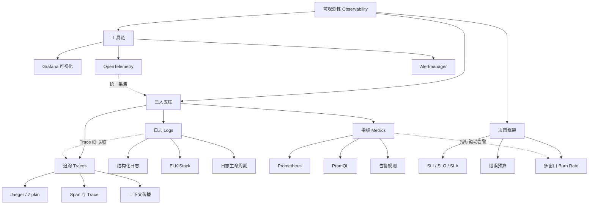

## 本章概览

在分布式系统中，故障不是"是否会发生"的问题，而是"何时发生"的问题。当一个用户请求横跨 15 个微服务、经过 3 个数据中心时，一次 500 错误可能涉及网络分区、数据库慢查询、缓存雪崩中的任意组合。传统监控告诉你"系统挂了"，但可观测性回答"为什么挂了、挂在哪里、影响了谁"。

本章从控制论中的可观测性定义出发，系统讲解可观测性的三大支柱——日志（Logs）、指标（Metrics）、追踪（Traces）——的理论基础、工程实践和工具链。最终目标是让读者具备设计和实施完整可观测性方案的能力。

## 为什么这一章重要

可观测性在现代软件工程中的地位可以类比为"诊断医学之于临床医学"。没有 X 光、CT、血液检测，医生只能凭经验猜测病因；没有日志、指标、追踪，工程师也只能凭经验猜测系统状态。区别在于：猜测的准确率直接决定了故障恢复的 MTTR（平均恢复时间）。

具体来说，可观测性解决以下关键问题：

- **故障定位**：从发现异常到定位根因，从小时级缩短到分钟级。Google SRE 实践表明，完善的可观测性体系可以将 MTTR 降低 60%-80%。
- **容量规划**：通过历史趋势数据预测资源需求，避免"突发流量→服务雪崩→紧急扩容"的恶性循环。
- **性能优化**：用数据驱动优化决策，而非"我觉得这里慢"的主观判断。P99 延迟从 500ms 优化到 100ms，需要知道瓶颈在哪个服务、哪个函数、哪个 SQL 查询。
- **架构演进**：可观测性数据揭示服务间的实际依赖关系，帮助识别单点故障、过度耦合、循环依赖等架构问题。
- **SLO 驱动开发**：将"系统有多好"从定性描述转化为定量指标，用错误预算机制平衡可靠性与创新速度。

## 核心概念速览

在深入各节内容之前，先建立几个核心概念的认知框架：

| 概念 | 一句话定义 | 与传统监控的关系 |
|------|-----------|-----------------|
| 监控（Monitoring） | 预定义指标 + 阈值告警，检测"已知的未知" | 可观测性的子集 |
| 可观测性（Observability） | 从外部输出推断内部状态，诊断"未知的未知" | 包含监控的超集 |
| SLO/SLI/SLA | 用量化目标定义"多好算足够好" | 可观测性的决策框架 |
| 错误预算 | 1 - SLO，为可靠性与创新提供量化权衡依据 | SLO 的核心机制 |
| 三大支柱 | 日志 + 指标 + 追踪，覆盖系统输出的三个维度 | 可观测性的数据基础 |
| OpenTelemetry | CNCF 标准化遥测数据采集框架 | 统一三大支柱的采集层 |

## 本章结构与学习路线

本章共 7 节，按"理论 → 工具 → 实践 → 综合"的逻辑递进组织：

第42章 监控与可观测性
├── 42.1 章节概览（本节）
│   └── 本节内容：概念框架、学习路线、全章地图
├── 42.2 理论基础
│   ├── 可观测性的起源：从控制论到软件工程
│   ├── 三大支柱的理论基础：信息论与系统科学视角
│   ├── 数据模型与语义约定：OpenTelemetry 标准
│   ├── SLO/SLI/SLA 框架与错误预算理论
│   └── 告警理论：信号处理与告警疲劳对策
├── 42.3 核心技巧
│   ├── 结构化日志设计与日志级别语义
│   ├── ELK Stack 架构与日志生命周期管理
│   ├── Prometheus 架构、指标类型与 PromQL 查询
│   ├── 告警规则设计与 Alertmanager 路由
│   ├── 分布式追踪架构与上下文传播
│   ├── Grafana 可视化与仪表盘设计
│   └── OpenTelemetry 统一采集框架
├── 42.4 实战案例
│   ├── 电商平台可观测性方案设计
│   ├── 微服务故障排障实战流程
│   └── 高并发场景的监控调优
├── 42.5 常见误区
│   ├── 误区1：监控越多越好（告警疲劳的成因）
│   ├── 误区2：只看指标不看追踪（定位深度不足）
│   ├── 误区3：日志级别随意设置（信息丢失或噪声过大）
│   └── 误区4：SLO 设置脱离实际（目标过高或过低）
├── 42.6 练习方法
│   ├── 从零搭建 Prometheus + Grafana 监控栈
│   ├── 用 OpenTelemetry 为现有服务添加追踪
│   └── 设计并实施 SLO + 错误预算告警
└── 42.7 本章小结
    └── 知识图谱、关键结论与延伸阅读

## 各节内容导读

### 第一节：理论基础（42.2）

这是本章的认知地基。我们从 1960 年代卡尔曼的控制论可观测性定义出发，解释"可观测性"这一概念的数学本质——**系统内部状态与外部输出之间的信息通道质量**。然后将其迁移到软件工程领域，阐述 Charity Majors（Honeycomb 联合创始人）在 2017 年前后系统性提出的软件可观测性理论。

三大支柱的讲解不是简单罗列"日志是什么、指标是什么、追踪是什么"，而是从信息论角度解释为什么恰好是这三个维度，以及它们各自的数学模型和信息特性：

- **日志**：离散事件的有序记录，信息密度最高但存储成本也最高
- **指标**：时序数据的聚合，存储效率高但丢失了个体细节
- **追踪**：因果关系的有向图，提供了最直观的跨服务调用链路

本节还详细讲解了 SLO/SLI/SLA 框架和错误预算理论，这是将可观测性数据转化为工程决策的桥梁。特别介绍了 Google SRE 团队提出的多窗口 burn rate 告警模型，这是目前业界检测故障的最佳实践。

**前置知识要求**：分布式系统基本概念（第21章）、网络协议基础（第18-19章）。

### 第二节：核心技巧（42.3）

这是本章的实操核心。每一项技术都包含完整的架构讲解、配置示例和最佳实践：

| 技术领域 | 覆盖内容 | 关键工具 |
|---------|---------|---------|
| 日志系统 | 结构化日志设计、ELK Stack 完整配置、日志生命周期管理 | Filebeat + Kafka + Logstash + Elasticsearch + Kibana |
| 指标系统 | Prometheus 四种指标类型、PromQL 查询语言、告警规则设计 | Prometheus + Alertmanager + 各种 Exporter |
| 追踪系统 | 分布式追踪架构、Span 数据模型、上下文传播机制 | Jaeger / Zipkin / OpenTelemetry SDK |
| 可视化 | Grafana 数据源配置、仪表盘设计、变量与模板 | Grafana |
| 统一采集 | OpenTelemetry Collector 配置、SDK 集成 | OpenTelemetry |

本节的代码示例涵盖 Go、Python、Java、Kubernetes YAML 等多种语言和环境，确保读者可以直接参考使用。

### 第三节：实战案例（42.4）

从理论到实践的关键跨越。通过三个真实场景展示可观测性方案的完整设计过程：

**案例一：电商平台可观测性方案设计**
- 从零设计一个日均千万级请求的电商平台的可观测性体系
- 覆盖指标规划、日志采集架构、追踪采样策略、SLO 定义、告警规则设计
- 包含容量评估和成本估算

**案例二：微服务故障排障实战**
- 模拟一个真实的"用户反馈下单失败"故障场景
- 演示从指标发现异常 → 日志定位错误 → 追踪调用链路的完整排障流程
- 展现三大支柱如何协同工作

**案例三：高并发场景的监控调优**
- 双十一大促场景下的监控系统自身性能调优
- 覆盖 Prometheus 高可用部署、Elasticsearch 索引优化、告警降级策略

### 第四节：常见误区（42.5）

总结工程实践中最容易踩的坑：

1. **监控越多越好**：设置过多的告警规则导致告警疲劳，真正重要的告警被淹没在噪声中
2. **只看指标不看追踪**：指标告诉你"延迟高了"，但不知道是哪个服务、哪个接口、哪个 SQL 查询导致的
3. **日志级别随意设置**：DEBUG 日志在生产环境未关闭导致存储爆满，或者 INFO 级别过于稀疏导致排障信息不足
4. **SLO 设置脱离实际**：99.999% 的可用性目标对于初创团队是不切实际的，会将所有工程资源消耗在可靠性上而无法创新
5. **忽视追踪数据的采样策略**：全量采集导致存储成本爆炸，或者采样率过低导致关键异常请求被丢弃
6. **三大支柱割裂使用**：日志、指标、追踪各自独立，没有通过 Trace ID 关联，排障时需要在多个系统间反复切换

### 第五节：练习方法（42.6）

提供动手实践的路径：

- **入门级**：在本地用 Docker Compose 搭建 Prometheus + Grafana + Node Exporter，观察系统指标的实时变化
- **进阶级**：用 OpenTelemetry 为一个简单的微服务应用添加追踪，理解 Span 的创建和上下文传播
- **实战级**：设计一个完整的服务等级目标体系，配置 burn rate 告警，并模拟故障验证告警是否按预期触发

### 第六节：本章小结（42.7）

对本章核心知识点的回顾和串联，包括：

- 可观测性三大支柱的知识图谱
- 工具选型决策树（什么场景用什么工具）
- 从传统监控迁移到可观观测性的路径规划
- 延伸阅读推荐（Google SRE Book、OpenTelemetry 官方文档、《Observability Engineering》）

## 关键术语表

| 术语 | 英文 | 定义 |
|------|------|------|
| 可观测性 | Observability | 从系统外部输出推断内部状态的能力 |
| SLI | Service Level Indicator | 服务等级指标，对服务关键维度的定量度量 |
| SLO | Service Level Objective | 服务等级目标，SLI 的目标值 |
| SLA | Service Level Agreement | 服务等级协议，低于 SLO 时的后果约定 |
| 错误预算 | Error Budget | 1 - SLO，量化可靠性与创新的权衡空间 |
| Burn Rate | Burn Rate | 错误预算的消耗速率，1x 表示正常消耗 |
| Span | Span | 分布式追踪中的最小操作单元 |
| Trace ID | Trace ID | 贯穿整个请求链路的全局唯一标识 |
| Pull Model | Pull Model | Prometheus 主动从目标拉取指标的采集模式 |
| Push Model | Push Model | 应用主动推送指标到收集器的采集模式 |
| 告警疲劳 | Alert Fatigue | 因过度告警导致对真正问题麻木的现象 |
| 降采样 | Downsampling | 对历史时序数据降低精度以节省存储 |
| 热温冷架构 | Hot-Warm-Cold | 按数据访问频率分层存储的架构模式 |

## 全章知识图谱

## 适合哪些读者

- **初中级后端工程师**：了解监控的基本概念，但缺乏系统性的可观测性知识。本章提供从理论到实践的完整学习路径。
- **SRE / 运维工程师**：已经在使用 Prometheus/Grafana，但希望深入理解背后的理论和最佳实践，特别是 SLO/SLA 框架和告警设计。
- **架构师 / 技术负责人**：需要为团队设计可观测性方案，需要理解工具选型、成本评估和组织实践。
- **全栈开发者**：希望理解"为什么我的服务出了问题，运维说看不到足够信息"——答案往往是可观测性设计不足。

## 预计学习时间

| 读者类型 | 预计时间 | 重点章节 |
|---------|---------|---------|
| 有监控经验，想系统化 | 6-8 小时 | 理论基础 + SLO 框架 + 实战案例 |
| 从零开始学习 | 12-15 小时 | 全部章节，配合动手练习 |
| 快速了解工具选型 | 3-4 小时 | 核心技巧中的工具对比表 + 常见误区 |

---

> **阅读建议**：本章内容密度较高，建议按"理论基础 → 核心技巧 → 实战案例"的顺序阅读。理论基础部分虽然偏抽象，但它是理解后续所有内容的前提。如果时间有限，可以先快速浏览理论基础的关键概念，然后重点阅读核心技巧和实战案例，在实践中回过头来补充理论理解。
