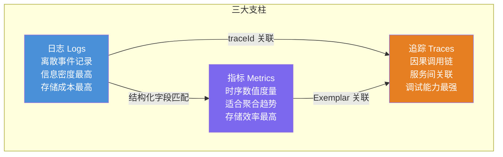
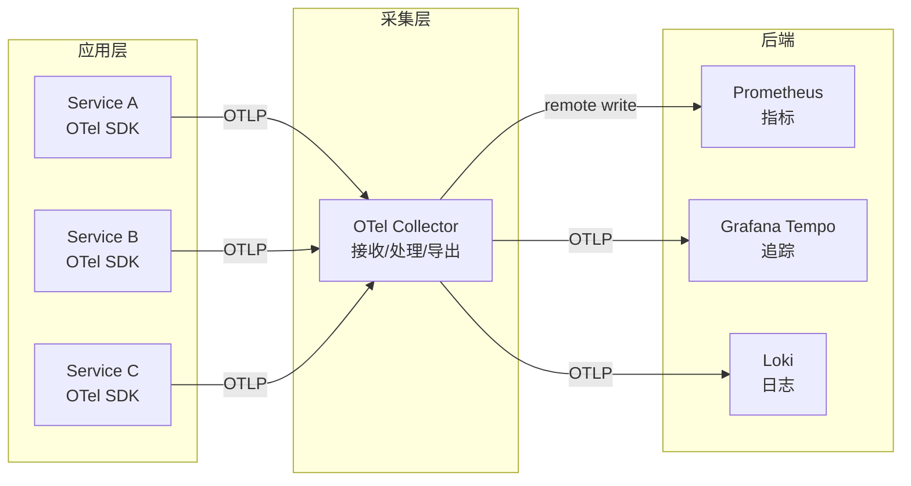
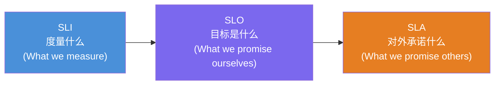

## 理论基础

本节建立监控与可观测性的完整认知框架，从控制论的数学定义出发，逐步推导到软件工程中的实践方法论。理解这些理论是后续章节实操内容的前提。

### 1. 可观测性的起源与定义

#### 1.1 控制论中的可观测性

可观测性（Observability）这一概念最早源自经典控制理论。1960年代，卡尔曼（Rudolf Kalman）在研究线性动态系统时提出了可观测性的数学定义：**如果系统的任意内部状态都可以通过有限时间内的输出观测来唯一确定，则称该系统是可观测的。**

用数学语言表述，对于线性时不变系统：

dx/dt = Ax + Bu
y = Cx

其中 x 是系统内部状态向量，u 是输入，y 是输出，A、B、C 是系统矩阵。系统的可观测性矩阵为：

O = [C; CA; CA²; ...; CA^(n-1)]

当且仅当矩阵 O 的秩等于系统维度 n 时，系统是完全可观测的。这意味着从输出 y 的历史数据中，可以唯一反推出初始状态 x(0)，进而确定任意时刻的内部状态。

这个数学定义揭示了一个核心洞察：**可观测性描述的是系统内部状态与外部输出之间的信息通道质量**。如果外部输出携带了足够的内部状态信息，系统就是高可观测的；反之，如果大量内部状态无法从输出中推断，系统就是低可观测的。

可以用一个直观的比喻来理解：想象你面对一个密封的黑盒子，里面有若干齿轮和电路。如果你只能看到盒子外面的一盏指示灯亮或灭，这个系统的可观测性就很低——你几乎无法推断内部发生了什么。如果盒子外面有温度计、压力表、转速计、电流表等多种输出仪表，你就能从这些读数推断出内部齿轮的运转状态。仪表越多、越精确，可观测性越高。

#### 1.2 从控制论到软件工程

将控制论的可观测性迁移到软件工程领域，最早由 Charity Majors（Honeycomb 联合创始人）在 2017 年前后系统性地提出。她指出了传统监控在面对微服务架构时的根本困境：**当系统由数百个服务组成，每个服务有数十个维度的参数时，你无法预先枚举所有可能的故障模式来设置告警规则。**

传统监控的思路是"已知的未知"——你必须先知道问题长什么样，才能设置对应的告警。但分布式系统中大量的故障是"未知的未知"：多个服务之间微妙的交互、特定请求模式下的竞态条件、由外部依赖引起的级联退化——这些场景不可能被事先枚举。

软件系统可观测性的定义可以表述为：**通过分析系统的外部输出（日志、指标、追踪），能够充分推断系统内部状态及其变化的能力。** 一个高可观测性的系统应该满足以下特征：

- **可查询性（Queryability）**：能够对任意维度组合进行即席查询，而不仅限于预定义的面板
- **高基数支持（High Cardinality）**：能够处理具有大量唯一值的标签维度（如 user_id、request_id）
- **事件关联（Event Correlation）**：能够将不同来源的数据（日志、指标、追踪）通过统一标识关联起来
- **因果推理（Causal Reasoning）**：能够从观察到的现象推断出根本原因

#### 1.3 监控与可观测性的本质区别

理解两者区别是掌握本章内容的关键起点：

| 维度 | 传统监控（Monitoring） | 可观测性（Observability） |
|------|------------------------|--------------------------|
| 思维模式 | 自上而下：先假设问题，再设置监控 | 自下而上：从数据出发，探索问题 |
| 问题类型 | 已知的未知（Known Unknowns） | 未知的未知（Unknown Unknowns） |
| 数据模型 | 预定义的仪表盘和告警规则 | 即席查询和自由探索 |
| 维度支持 | 低基数（主机名、服务名） | 高基数（请求ID、用户ID） |
| 核心能力 | 检测（Detection） | 诊断（Diagnosis） |
| 典型问题 | "系统正常吗？" | "系统为什么异常？" |
| 技术栈代表 | Nagios、Zabbix、Cacti | Prometheus + Grafana + Jaeger + OpenTelemetry |

一个形象的类比：**监控就像在工厂的生产线上安装固定位置的传感器，检测温度、压力是否超标；可观测性则像给每个零件都装上了 RFID 标签，你可以追踪任何一个零件从进料到成品的完整旅程，并在出现问题时追溯到具体的工序和参数。**

在实践中，监控是可观测性的子集。高可观测性的系统自然具备强大的监控能力，但仅有监控的系统往往缺乏深层诊断能力。两者并非对立关系，而是演进关系——可观测性是在监控基础上的能力扩展。

### 2. 三大支柱的理论基础

可观测性的三大支柱——日志（Logs）、指标（Metrics）、追踪（Traces）——并非随意组合，而是从信息论和系统科学的角度，分别覆盖了系统输出的不同维度。



三者的核心区别在于粒度和用途：

| 维度 | 日志 | 指标 | 追踪 |
|------|------|------|------|
| 数据形态 | 离散事件序列 | 连续时序数值 | 调用链 DAG |
| 信息粒度 | 最细（单次事件） | 中等（聚合值） | 中等（单次请求链路） |
| 存储效率 | 最低 | 最高 | 中等 |
| 查询方式 | 关键词/字段过滤 | 聚合函数/范围查询 | 链路遍历 |
| 典型用途 | 排障、审计 | 监控、告警 | 性能分析、依赖分析 |
| 时间跨度 | 单事件时间点 | 时间窗口聚合 | 单次请求全生命周期 |

#### 2.1 日志：离散事件与事件溯源

**理论基础**：日志的本质是离散事件的有序记录。从信息论角度看，每条日志是一个携带信息的信号单元（signal unit），记录了系统在某一时刻发生的特定事件。日志的信息密度最高——一条错误日志可能包含完整的堆栈跟踪、上下文参数和调用链信息——但存储和查询成本也最高。

**日志的数学模型**：可以将日志流建模为一个事件序列：

L = {e₁, e₂, ..., eₙ}
其中每个事件 eᵢ = (tᵢ, levelᵢ, msgᵢ, attrsᵢ)

tᵢ 是时间戳，levelᵢ 是日志级别（DEBUG/INFO/WARN/ERROR/FATAL），msgᵢ 是消息体，attrsᵢ 是键值对属性集合。

**结构化日志的必要性**：非结构化日志（如 `2024-01-15 ERROR order-service: Failed to process order ORD-123`）对人类阅读友好，但机器解析困难。结构化日志采用 JSON 或其他结构化格式，每个字段有明确语义：

```json
{
  "timestamp": "2024-01-15T10:30:45.123Z",
  "level": "ERROR",
  "service": "order-service",
  "traceId": "0af7651916cd43dd8448eb211c80319c",
  "message": "Failed to process order",
  "orderId": "ORD-123",
  "error": "InventoryNotEnoughException",
  "requestedQty": 10,
  "availableQty": 3
}
```

结构化日志使得日志可以被 Elasticsearch 等系统高效索引和聚合，支持按任意字段进行过滤和分析。这是实现高可观测性的基础。结构化日志的关键原则是：**字段语义必须在所有服务间保持一致**——如果 `orderId` 在一个服务中叫 `order_id`，在另一个服务中叫 `order_number`，跨服务的日志关联就会断裂。

**日志级别的语义设计**：日志级别不是随意选择的，每个级别对应不同的运维语义：

| 级别 | 含义 | 典型场景 | 生产环境是否启用 |
|------|------|----------|------------------|
| TRACE | 极细粒度的追踪信息 | 循环内部状态、SQL 参数 | 通常禁用 |
| DEBUG | 开发调试信息 | 函数入口/出口、中间变量 | 通常禁用 |
| INFO | 正常运行的里程碑事件 | 请求处理完成、任务启动/结束 | 启用 |
| WARN | 潜在问题的预警 | 重试即将耗尽、配置回退默认值 | 启用 |
| ERROR | 操作失败需要关注 | 请求处理失败、外部调用超时 | 启用 |
| FATAL | 系统无法继续运行 | 数据库连接池耗尽、磁盘满 | 启用 |

**关键原则**：日志级别应该与后续行动挂钩。如果一条日志不需要任何人做任何事，它可能不应该存在。INFO 级别记录的应该是对运维有信息价值的事件，而不是 `function entered` 这样的噪声。实践中一个实用的判断标准是：**如果你在凌晨3点被这条日志的告警叫醒，你会觉得它值得被叫醒吗？** 如果不会，它就不应该触发告警。

**日志的采样与降噪策略**：在高流量系统中，全量日志的成本不可接受。常见策略包括：

- **按级别采样**：DEBUG/TRACE 日志只在排障时临时开启，通过 Feature Flag 动态调整
- **按采样率采样**：对 INFO 级别的高频日志（如每次请求一条）按 1/100 采样
- **按条件保留**：错误日志全量保留，成功日志采样保留，健康检查日志丢弃
- **结构化去重**：对重复出现的相同错误只保留首条和计数

#### 2.2 指标：时序数据与聚合数学

**理论基础**：指标的本质是随时间变化的数值度量。从数据科学角度看，指标是时间序列数据（Time Series），每个时间序列由一个标识符（metric name + labels）和一系列 (timestamp, value) 数据点组成。

**时序数据的数学模型**：

TS = {(t₁, v₁), (t₂, v₂), ..., (tₙ, vₙ)}
其中 t₁ < t₂ < ... < tₙ，vᵢ ∈ ℝ

时间序列数据有几个独特的数学特性使其区别于普通关系型数据：

- **写入远多于读写**：时间序列数据几乎总是追加写入（append-only），极少更新或删除
- **时间局部性**：最近的数据被查询的频率远高于历史数据
- **天然降采样**：随着数据老化，可以对历史数据进行降采样（downsampling），降低存储成本
- **可压缩性**：时间序列数据通常变化缓慢（slowly changing），相邻数据点之间差异小，压缩率高

这些特性决定了时序数据库（如 Prometheus、InfluxDB、TimescaleDB）采用与传统关系型数据库完全不同的存储引擎设计：使用追加写入的 LSM-Tree 结构，按时间分区，内置降采样策略。

**四种指标类型的设计哲学**：

Prometheus 定义的四种指标类型各有其数学和应用语义：

**Counter（计数器）**：单调递增的累积值。数学模型为 C(t) 满足 C(t₂) ≥ C(t₁) 对所有 t₂ > t₁ 成立。适合记录可累加的事件（如请求总数、错误总数）。计算速率时使用 rate() 函数：

rate(http_requests_total[5m]) = (C(t) - C(t-5m)) / 5m

rate() 函数使用线性回归拟合 Counter 的变化率，能够平滑掉采样间隔带来的噪声，同时正确处理 Counter 重置（如服务重启）。需要注意的是，rate() 的窗口选择直接影响指标的灵敏度——窗口太短容易产生锯齿，窗口太长会延迟反映突变。

**Gauge（仪表）**：可自由增减的数值。数学模型为 G(t) ∈ ℝ，没有单调性约束。适合记录瞬时状态（如 CPU 使用率、内存用量、队列长度、活跃连接数）。Gauge 的查询通常使用瞬时向量（instant vector），不需要 rate() 计算。

**Histogram（直方图）**：将观测值按预定义的桶区间（bucket）进行分桶计数。数学模型为 H = {b₁, b₂, ..., bₖ}，其中 bᵢ 表示落在第 i 个桶内的观测数量。Histogram 同时记录观测值的总和（_sum）和总数量（_count）。

```promql
# HTTP 请求延迟的 Histogram 定义
# bucket boundaries: 0.005s, 0.01s, 0.025s, 0.05s, 0.1s, 0.25s, 0.5s, 1s, 2.5s, 5s, 10s
http_request_duration_seconds_bucket{le="0.05"}  1200
http_request_duration_seconds_bucket{le="0.1"}   3500
http_request_duration_seconds_bucket{le="0.5"}   4800
http_request_duration_seconds_bucket{le="1.0"}   4950
http_request_duration_seconds_bucket{le="+Inf"}  5000
http_request_duration_seconds_sum                850.3
http_request_duration_seconds_count              5000
```

Histogram 的核心优势是**可以在不保留原始数据的情况下计算分位数**。使用 histogram_quantile() 函数可以从桶统计中估算 P50、P95、P99 等分位数。桶边界的设置直接影响分位数的精度——边界越密集的区间，分位数估算越精确。例如，如果所有慢请求都在 200ms-500ms 区间内，但这个区间只有一个桶，P99 的估算误差就会很大。

**Summary（摘要）**：在客户端直接计算分位数。与 Histogram 的区别在于：Summary 的分位数在客户端计算后直接暴露，不支持服务端聚合；Histogram 在服务端聚合桶数据后再计算分位数。在微服务架构中，通常推荐使用 Histogram，因为同一服务的多个实例的 Histogram 可以聚合后计算全局分位数，而 Summary 不行。

**Counter vs Gauge vs Histogram 选型指南**：

| 场景 | 推荐类型 | 原因 |
|------|----------|------|
| 请求总数 | Counter | 单调递增，可计算速率 |
| 当前 QPS | Gauge | 瞬时速率值 |
| 错误率 | Counter + rate() | 从累积计数计算百分比 |
| CPU 使用率 | Gauge | 瞬时百分比，可升可降 |
| 请求延迟分布 | Histogram | 支持分位数计算和聚合 |
| 队列深度 | Gauge | 反映当前积压量 |
| 处理的字节数 | Counter | 可累加，计算吞吐率 |

一个常见的选型错误是将 Gauge 用于应该用 Counter 的场景。例如，用 Gauge 记录"每秒请求数"会在系统重启后丢失历史累积，而 Counter 可以跨重启持续累积，并通过 rate() 计算任意窗口的速率。

#### 2.3 追踪：因果关系与调用图

**理论基础**：分布式追踪的核心是记录请求在多个服务之间的因果调用关系。从图论角度看，一个追踪数据可以建模为一个有向无环图（DAG），其中节点是 Span（操作），边是因果关系（parent-child）。

**追踪数据的数学模型**：

Trace = (T, S, E)
其中：
  T = traceId（全局唯一标识）
  S = {s₁, s₂, ..., sₙ}（Span 集合）
  E = {(sᵢ, sⱼ) | sⱼ 是 sᵢ 的子操作}（因果边集合）

每个 Span 包含以下核心属性：

```go
Span = {
  traceId:    string,    // 全局唯一追踪 ID
  spanId:     string,    // 当前 Span 的唯一 ID
  parentSpanId: string,  // 父 Span ID（根 Span 为空）
  operationName: string, // 操作名称（如 "HTTP GET /api/orders"）
  startTime:  timestamp, // 开始时间
  duration:   duration,  // 持续时间
  status:     enum,      // OK / ERROR / UNSET
  tags:       map,       // 键值对标签（用于过滤和分析）
  logs:       list,      // 时间点事件（用于记录关键时间节点）
  baggage:    map        // 跨服务传播的上下文（不随 Span 存储）
}
```

**Span 之间的因果关系**：追踪系统通过 parentSpanId 建立 Span 之间的父子关系。同一 traceId 下的所有 Span 构成一棵调用树：

[order-service: handleOrder] ── traceId: abc123
  ├── [order-service: validateOrder]
  ├── [inventory-service: deductStock] ── 通过 HTTP 调用
  │     ├── [inventory-service: checkAvailability]
  │     └── [inventory-service: updateDatabase]
  ├── [payment-service: processPayment] ── 通过 gRPC 调用
  │     ├── [payment-service: verifyCard]
  │     └── [payment-service: chargeCard]
  └── [notification-service: sendConfirmation] ── 通过消息队列

**上下文传播机制**：追踪的跨服务传播依赖于上下文传播（Context Propagation）。最常用的方式是通过 HTTP Header 注入：

# W3C Trace Context 标准 Header
traceparent: 00-0af7651916cd43dd8448eb211c80319c-b7ad6b7169203331-01
│            │  │                                │                │ │
version    flags  traceId                      spanId         traceFlags

# B3 格式（Zipkin 使用）
X-B3-TraceId: 0af7651916cd43dd8448eb211c80319c
X-B3-SpanId: b7ad6b7169203331
X-B3-ParentSpanId: 6b221d5bc9e6496c
X-B3-Sampled: 1

当服务 A 调用服务 B 时，服务 A 的 SDK 将追踪上下文注入到 HTTP Header 中；服务 B 的 SDK 从 Header 中提取上下文，创建子 Span 并关联到同一 Trace。这使得分散在数十个服务中的操作能够被串联成一条完整的调用链路。

值得注意的是，W3C Trace Context（`traceparent`）已经成为事实标准，被 OpenTelemetry、Datadog、AWS X-Ray 等主流系统支持。如果你的系统还在使用 B3 格式，建议迁移到 W3C 标准以获得更好的互操作性。

**采样策略的理论依据**：在高流量系统中，全量采集追踪数据的存储成本不可接受。采样策略需要在信息完整性和存储成本之间取得平衡：

| 策略 | 原理 | 适用场景 | 信息损失 |
|------|------|----------|----------|
| 固定比例采样（Probabilistic） | 按固定概率（如 1%）决定是否采集 | 流量均匀的场景 | 可能丢失异常请求 |
| 速率限制采样（Rate Limiting） | 每秒最多采集 N 条 | 控制存储成本 | 流量突增时覆盖不足 |
| 尾部采样（Tail-based） | 在请求完成后根据结果决定是否保留 | 需要保留错误/慢请求 | 需要临时缓冲所有 Span |
| 自适应采样（Adaptive） | 根据系统负载动态调整采样率 | 流量波动大的场景 | 实现复杂度高 |

尾部采样是目前最优的策略，因为它可以确保 100% 保留异常请求（错误、超时、慢请求），同时采样掉大部分正常请求。但它的实现需要一个中心化的决策点（Collector），在高吞吐场景下可能成为瓶颈。实践中，尾部采样通常在 Collector 层实现，通过临时缓冲窗口（如 5-10 秒）收集完整 Trace 后再做决策。

### 3. 可观测性的数据模型与语义约定

#### 3.1 数据模型的层次结构

可观测性数据的组织需要一个清晰的层次模型，以便在不同的系统之间实现互操作：

Resource（资源）
  └── Scope（作用域）
       └── Signal（信号）
            ├── Logs（日志）
            ├── Metrics（指标）
            └── Traces（追踪）
                 └── Span
                      └── SpanEvent

**Resource（资源）**：描述产生遥测数据的实体，通常是服务实例。一个 Resource 是整个生命周期内不变的静态属性集合。

```yaml
Resource:
  service.name: order-service
  service.version: 2.3.1
  service.namespace: ecommerce
  deployment.environment: production
  host.name: order-service-7d8b9c6f4-xk2mv
  k8s.pod.name: order-service-7d8b9c6f4-xk2mv
  k8s.namespace.name: production
```

Resource 属性的设计原则是：**只包含在整个服务实例生命周期内不会变化的属性**。服务版本号会随发布变化，所以它属于 Resource 还是 Span 属性取决于你的发布粒度——如果每次发布都会重启实例，版本号可以放在 Resource 中。

**Scope（作用域）**：描述创建遥测数据的库或组件，用于区分同一服务中不同库产生的数据。例如，一个服务可能同时使用 `net/http` 和 `gRPC` 两个库产生追踪数据，通过 Scope 可以区分它们。

**Signal（信号）**：具体的遥测数据类型（日志、指标、追踪）。

#### 3.2 OpenTelemetry 语义约定

OpenTelemetry 定义了一套标准化的语义约定（Semantic Conventions），确保不同系统产生的遥测数据具有一致的字段含义：

**HTTP 请求的标准指标名**：

```promql
http.server.request.duration          # 服务端请求延迟（Histogram）
http.server.request.body.size         # 请求体大小（Histogram）
http.server.response.body.size        # 响应体大小（Histogram）
http.server.request.count             # 请求总数（Counter）
http.server.active_requests           # 当前活跃请求数（Gauge）
http.server.request.error.count       # 请求错误总数（Counter）
```

**标准 Span 属性**：

```yaml
# HTTP Span
http.request.method       = "GET"
http.response.status_code = 200
url.full                  = "https://api.example.com/orders"
server.address            = "api.example.com"
server.port               = 443
network.peer.address      = "10.0.0.1"

# 数据库 Span
db.system                 = "postgresql"
db.operation.name         = "SELECT"
db.namespace              = "orders_db"
db.query.text             = "SELECT * FROM orders WHERE id = $1"
db.query.parameter.id     = "ORD-123"
```

语义约定的价值在于：当你看到 `http.server.request.duration` 时，你知道它测量的是 HTTP 服务端的请求延迟，而不需要阅读文档或查看代码。这使得 Grafana 仪表盘、告警规则可以在不同服务之间复用。

#### 3.3 OpenTelemetry 的架构设计

OpenTelemetry（OTel）是 CNCF 的可观测性标准项目，提供了统一的 API、SDK 和工具链来采集遥测数据。其架构设计遵循"一次采集，多处导出"的原则：



**OTel Collector 的管道架构**：Collector 内部由 Receiver → Processor → Exporter 三段管道组成：

Receivers          Processors          Exporters
─────────────     ──────────────     ──────────────
OTLP Receiver  →  Batch       →     Prometheus Remote Write
Jaeger Receiver →  Filter      →     OTLP Exporter (Tempo)
Zipkin Receiver →  Attributes  →     Loki Exporter
Prometheus      →  Sampling    →     Kafka Exporter
  Receiver         Processor

OTel Collector 的关键价值在于：应用层只需要集成一次 OTel SDK，通过 OTLP 协议发送数据到 Collector，由 Collector 负责路由到不同的后端存储。这使得更换后端存储不需要修改应用代码。

### 4. SLO/SLI/SLA 框架

SLO/SLI/SLA 框架是将可观测性数据转化为工程决策的理论基础。

#### 4.1 核心概念

**SLI（Service Level Indicator，服务等级指标）**：对服务某个关键维度的定量度量。SLI 必须是可测量的、与用户体验直接相关的指标。

SLI = (满足目标的请求数) / (总请求数)

常见 SLI 定义：
  可用性 SLI = 非 5xx 请求数 / 总请求数
  延迟 SLI   = 满足延迟目标的请求数 / 总请求数
  正确性 SLI = 正确处理的请求数 / 总请求数
  吞吐量 SLI = 成功处理的请求数 / 用户请求的请求数

SLI 的设计原则是**以用户体验为中心**。一个好的 SLI 应该直接反映用户感知到的服务质量，而不是系统内部的某个技术指标。例如，"CPU 使用率 < 80%"不是好的 SLI，因为它不直接反映用户体验；"P99 延迟 < 200ms"是好的 SLI，因为它直接描述了用户的等待时间。

**SLO（Service Level Objective，服务等级目标）**：SLI 的目标值。SLO 定义了"多好算足够好"。

示例：
  可用性 SLO: 99.9%（每月允许停机 43.8 分钟）
  延迟 SLO: P99 < 200ms（99% 的请求在 200ms 内完成）
  正确性 SLO: 99.99%（万分之一的错误率）

SLO 的设定需要考虑两个约束：**用户期望**（太低的 SLO 无法满足业务需求）和**工程成本**（太高的 SLO 需要巨大的工程投入）。99.9% 到 99.99% 之间每增加一个"9"，工程投入通常要翻倍。

**SLA（Service Level Agreement，服务等级协议）**：与客户或内部团队签订的正式协议，定义了低于 SLO 时的后果（如赔偿、降级处理）。SLA 通常比 SLO 更宽松，因为 SLO 需要留有余量。



#### 4.2 错误预算理论

错误预算（Error Budget）是 SLO 框架的核心机制，它为可靠性与创新之间的权衡提供了量化依据：

错误预算 = 1 - SLO
例如：SLO = 99.9% → 错误预算 = 0.1%
每月错误预算 = 0.1% × 30天 × 24小时 × 60分钟 = 43.2 分钟

**错误预算的工作流程**：

1. **月初**：错误预算为满额（如 43.2 分钟）
2. **正常消耗**：每次故障事件消耗对应的停机时间
3. **预算充足时**：团队可以自由发布新功能、进行架构变更
4. **预算接近耗尽**：冻结非关键变更，专注于提升可靠性
5. **预算耗尽**：所有发布暂停，直到下月预算重置或可靠性提升

错误预算机制的核心价值是**将可靠性决策从主观判断变为客观数据驱动**。没有错误预算时，"是否应该在周五发布"往往取决于个人判断或团队惯例；有了错误预算，决策变得清晰——预算充足就发布，预算紧张就暂缓。

**Burn Rate 的数学推导**：

Burn Rate（消耗速率）是错误预算框架中最关键的概念。它的数学定义为：

Burn Rate = (实际错误率) / (SLO 允许的错误率)

示例：SLO = 99.9%，当前错误率 = 0.5%
Burn Rate = 0.5% / 0.1% = 5
含义：错误预算以 5 倍速率消耗
如果保持当前速率，预算将在 1/5 个窗口周期内耗尽

不同 Burn Rate 对应的预算耗尽时间：

| Burn Rate | 预算耗尽时间（30天窗口） | 含义 |
|-----------|--------------------------|------|
| 1x | 30 天 | 正常消耗速率 |
| 2x | 15 天 | 预算将在半月内耗尽 |
| 10x | 3 天 | 严重退化 |
| 14.4x | 2 天 | 快速故障 |
| 72x | 10 小时 | 紧急状态 |

**错误预算的告警阈值设计**：

```yaml
# 当错误预算消耗超过 50% 时发出警告（慢速检测）
- alert: ErrorBudgetBurnRateSlow
  expr: |
    (
      1 - (
        sum_over_time(http_requests_total{status!~"5.."}[6h])
        / sum_over_time(http_requests_total[6h])
      )
    ) > (1 - 0.999) * 3
  for: 5m
  labels:
    severity: warning
  annotations:
    summary: "错误预算消耗速率过快（慢速检测）"

# 当错误预算消耗超过 90% 时发出严重告警（快速检测）
- alert: ErrorBudgetBurnRateFast
  expr: |
    (
      1 - (
        sum_over_time(http_requests_total{status!~"5.."}[5m])
        / sum_over_time(http_requests_total[5m])
      )
    ) > (1 - 0.999) * 14.4
  for: 2m
  labels:
    severity: critical
  annotations:
    summary: "错误预算即将耗尽（快速检测）"
```

#### 4.3 SLO 的多窗口告警模型

Google SRE 团队提出的多窗口 burn rate 告警是目前业界最佳实践，它同时检测快速消耗和慢速消耗两种故障模式：

快速故障检测（短窗口 + 高 burn rate）：
  短窗口: 5 分钟
  长窗口: 1 小时（作为保护，避免误报）
  Burn Rate 阈值: 14.4x
  → 在 1 小时窗口内，错误预算消耗速率超过 14.4 倍

慢速故障检测（长窗口 + 低 burn rate）：
  短窗口: 6 小时
  长窗口: 3 天
  Burn Rate 阈值: 3x
  → 在 3 天窗口内，错误预算消耗速率超过 3 倍

这种多窗口模型的优势在于：短窗口对突发故障响应迅速，长窗口对渐进式退化（如内存泄漏、性能缓慢劣化）也能及时检测，而不需要为每种故障模式单独设计告警规则。

**为什么需要双窗口而非单窗口**：如果只用短窗口（如5分钟），在流量低谷时，5分钟内的样本量可能不足以产生统计显著的错误率，导致漏报。长窗口作为保护机制，确保即使在短窗口内样本不足，长窗口的累积数据也能检测到异常。反过来，如果只用长窗口，突发故障的响应时间会过长。双窗口结合既保证了灵敏度，又保证了统计显著性。

### 5. 告警理论与信号处理

#### 5.1 信号与噪声

告警系统的核心挑战是从信号（真正需要关注的事件）中区分噪声（无意义的干扰）。一个好的告警系统需要同时优化两个指标：

- **精确率（Precision）**：触发的告警中有多少是真正需要关注的。精确率低意味着大量误报，导致告警疲劳。
- **召回率（Recall）**：所有需要关注的事件中有多少被告警捕获。召回率低意味着漏报，可能导致故障未被及时处理。

精确率 = TP / (TP + FP)     # TP: 真阳性, FP: 假阳性
召回率 = TP / (TP + FN)     # FN: 假阴性（漏报）
F1 = 2 × (精确率 × 召回率) / (精确率 + 召回率)

在告警系统设计中，精确率和召回率之间存在天然的权衡。追求高召回率（不漏过任何故障）往往导致低精确率（大量误报）；追求高精确率（只在确定有问题时才告警）往往导致低召回率（漏掉某些故障）。工程实践中，**通常优先保证召回率**（宁可误报也不要漏报），然后通过分组、抑制等机制降低误报的影响。

#### 5.2 告警疲劳的成因与对策

告警疲劳（Alert Fatigue）是指运维人员因长期暴露在大量告警中而产生麻木心理，导致真正重要的告警被忽略。告警疲劳的典型成因：

- **阈值设置过严**：如 CPU > 70% 就告警，在正常业务高峰期间频繁触发
- **缺乏分组和抑制**：一个底层故障引发上游服务的连锁告警，产生"告警风暴"
- **缺少去重**：同一问题在不同实例上触发多条告警
- **无上下文信息**：告警只说"CPU 过高"，但不说明影响范围、可能原因和处理建议

**对策——告警设计的四项原则**：

1. **可操作性（Actionability）**：每条告警必须对应一个明确的响应动作。如果收到告警后不知道该做什么，这条告警就不应该存在。

2. **分级和路由（Severity & Routing）**：根据严重程度和影响范围将告警路由到不同的通知渠道和响应流程：

```yaml
# Alertmanager 路由配置
route:
  receiver: default
  group_by: ['alertname', 'service']
  group_wait: 30s        # 首次告警等待 30s 收集相关告警
  group_interval: 5m     # 同组告警的最小间隔
  repeat_interval: 4h    # 重复告警的间隔
  
  routes:
    - match:
        severity: critical
      receiver: pagerduty-oncall    # 严重告警走 PagerDuty
      repeat_interval: 15m
      
    - match:
        severity: warning
      receiver: slack-alerts        # 警告告警走 Slack
      repeat_interval: 1h
      
    - match:
        severity: info
      receiver: email-digest        # 信息告警发邮件摘要
      repeat_interval: 24h
```

3. **上下文丰富性（Contextualization）**：告警消息应包含足够的上下文信息，帮助值班人员快速判断问题：

```markdown
# 差的告警
"CPU 使用率过高"

# 好的告警
"服务 order-service 的 CPU 使用率在过去 15 分钟内持续超过 90%
（当前: 94.3%，基线: 45%）
影响范围: 3/5 个 Pod 实例
可能原因: 近期发布 v2.3.1 引入的正则表达式回溯
相关追踪: https://grafana.example.com/trace/abc123
SLO 影响: 本周错误预算已消耗 62%
处理 Runbook: https://runbook.example.com/high-cpu-order-service"
```

4. **分组与聚合（Grouping & Aggregation）**：将相关的告警聚合为单条通知，避免告警风暴。Alertmanager 的 group_by 功能可以将同一服务、同一告警名称的多条告警合并为一条通知。

#### 5.3 基于症状 vs 基于原因的告警

| 类型 | 基于症状（Symptom-based） | 基于原因（Cause-based） |
|------|---------------------------|-------------------------|
| 定义 | 监控用户可感知的症状 | 监控系统内部指标 |
| 示例 | "API 延迟 > 2s" | "CPU 使用率 > 90%" |
| 优势 | 直接反映用户体验 | 可以提前预警 |
| 劣势 | 可能响应滞后 | 可能产生误报 |
| 推荐度 | 首选（与 SLO 对齐） | 辅助（作为早期预警） |

最佳实践是**以基于症状的告警为主**（与 SLO/SLI 对齐），以基于原因的告警为辅（作为 SLO 即将违反的早期预警）。例如："P99 延迟 > 200ms" 是基于症状的告警，"数据库连接池使用率 > 80%" 是基于原因的告警。两者结合使用，既能在用户体验受损时及时响应，又能在问题恶化前介入。

#### 5.4 On-Call 轮值与事故响应的理论

告警系统的设计不仅要考虑"告什么"，还要考虑"谁来响应"和"怎么响应"。

**On-Call 轮值的基本原则**：

- **单一责任人（Single On-Call）**：每个时间段只有一个主要值班人，避免责任分散
- **合理的轮换周期**：通常 1 周轮换，避免长期值班导致疲劳
- **升级机制（Escalation）**：初级值班人无法处理时，自动升级到高级工程师
- **覆盖时段**：工作时间外的告警需要有明确的响应 SLA（如 15 分钟内确认）

**事故严重度分级**：

| 级别 | 定义 | 响应时间 | 示例 |
|------|------|----------|------|
| P1 | 核心服务完全不可用 | 5 分钟内 | 支付系统宕机、数据库集群故障 |
| P2 | 核心服务严重降级 | 15 分钟内 | API 延迟 >10s、错误率 >10% |
| P3 | 非核心功能受影响 | 1 小时内 | 推荐服务超时、报表延迟 |
| P4 | 轻微影响或潜在风险 | 下个工作日 | 单实例重启、磁盘使用率 >80% |

**事故响应的标准流程**：

1. 检测（Detection）：告警触发或用户报告
2. 响应（Response）：值班人确认并开始处理
3. 缓解（Mitigation）：优先恢复服务（回滚、扩容、降级）
4. 根因分析（Root Cause）：找到根本原因
5. 修复（Remediation）：实施长期修复
6. 复盘（Postmortem）：总结教训，改进流程

事故响应的关键原则是**缓解优先于修复**。在生产事故中，首要目标是恢复服务（如回滚到上一个稳定版本），而不是花时间找到根本原因。根因分析可以在事后进行，但服务恢复不能等。

### 6. 高基数问题与维度爆炸

#### 6.1 什么是维度爆炸

维度爆炸（Cardinality Explosion）是指标系统面临的最大挑战之一。当一个指标标签的唯一值组合（基数，cardinality）过高时，会导致：

- **存储爆炸**：每个唯一标签组合产生一个独立的时间序列。如果一个指标有 10 个标签，每个标签有 100 个唯一值，理论上有 100^10 = 10^20 个时间序列
- **查询变慢**：聚合查询需要扫描大量时间序列
- **内存压力**：Prometheus 在查询时需要将匹配的时间序列加载到内存

**典型基数爆炸场景**：

```python
# 危险：request_id 作为标签 —— 每个请求一个唯一值
http_requests_total{request_id="abc123", ...}  

# 危险：user_id 作为标签 —— 百万级用户
http_requests_total{user_id="U-123456", ...}

# 危险：timestamp 作为标签
http_requests_total{timestamp="2024-01-15T10:30:45Z", ...}

# 安全：用有限枚举值
http_requests_total{method="GET", path="/api/orders", status="200", ...}
```

基数爆炸的后果在 Prometheus 中有一个量化指标：`prometheus_tsdb_head_series`。当这个值超过 100 万时，Prometheus 的查询性能会显著下降；超过 500 万时，可能会导致 OOM。

#### 6.2 高基数数据的处理策略

**策略一：将高基数数据推送到日志或追踪系统**。user_id、request_id 等高基数标识符更适合放在日志和追踪中，而非指标中。指标系统适合低基数的聚合数据（如服务名、HTTP 方法、状态码）。

**策略二：使用 Exemplar 关联指标与追踪**。Exemplar 是 Prometheus 提供的一种机制，允许在指标数据上附加一个示例性的 Trace ID，从而在发现指标异常时快速跳转到相关的追踪数据：

```promql
# Histogram 附带 Exemplar
http_request_duration_seconds_bucket{le="0.5"} 1200 # {trace_id="abc123"} 0.3
```

**策略三：服务端聚合**。在应用层先进行聚合计算，再暴露聚合后的指标：

```python
# 反模式：暴露每个用户的延迟
for user_id in active_users:
    metrics.record(f"user_request_duration", user_id=user_id, duration=d)

# 正确：只暴露聚合后的 P99 延迟
histogram.observe(duration)  # Prometheus 自动聚合
```

**策略四：使用 Recording Rules 预聚合**。对于复杂的查询，可以在 Prometheus 中使用 Recording Rules 预先计算并存储聚合结果，避免每次查询都重复计算：

```yaml
# 预计算 5 分钟窗口的请求速率
- record: job:http_requests:rate5m
  expr: sum(rate(http_requests_total[5m])) by (job)
```

### 7. 可观测性驱动的系统设计

#### 7.1 Design for Observability

可观测性不是事后添加的功能，而应该在系统设计阶段就纳入考量。可观测性驱动的设计原则：

**原则一：每个服务必须暴露标准化的健康检查端点**

```yaml
# Kubernetes 健康检查配置
livenessProbe:
  httpGet:
    path: /health/live      # 进程是否存活
    port: 8080
  initialDelaySeconds: 10
  periodSeconds: 5

readinessProbe:
  httpGet:
    path: /health/ready     # 是否可以接收流量
    port: 8080
  initialDelaySeconds: 15
  periodSeconds: 10

startupProbe:
  httpGet:
    path: /health/startup   # 是否完成初始化
    port: 8080
  failureThreshold: 30
  periodSeconds: 2
```

三种健康检查的区别：
- **Liveness**：进程是否存活。失败则重启容器。
- **Readiness**：是否可以接收流量。失败则从 Service 端点中移除，不接收新请求。
- **Startup**：初始化是否完成。在初始化完成前，Liveness 和 Readiness 探针都会被禁用，避免误杀正在启动的慢启动服务。

一个常见的错误是将 Liveness 探针设置为检查外部依赖（如数据库连接）。这会导致数据库短暂不可用时，所有服务实例被重启，产生级联故障。Liveness 探针应该只检查进程本身是否健康（如内存是否溢出、死锁检测），外部依赖的健康检查应该放在 Readiness 探针中。

**原则二：关键操作必须产生追踪 Span**

```go
func handleOrder(ctx context.Context, req *OrderRequest) (*OrderResponse, error) {
    ctx, span := tracer.Start(ctx, "handleOrder")
    defer span.End()
    
    // 验证订单
    ctx, validateSpan := tracer.Start(ctx, "validateOrder")
    if err := validate(req); err != nil {
        validateSpan.SetStatus(codes.Error, err.Error())
        validateSpan.RecordError(err)
        return nil, err
    }
    validateSpan.End()
    
    // 扣减库存（跨服务调用）
    ctx, inventorySpan := tracer.Start(ctx, "deductInventory")
    if err := inventoryClient.Deduct(ctx, req.SkuID, req.Quantity); err != nil {
        inventorySpan.SetStatus(codes.Error, err.Error())
        inventorySpan.RecordError(err)
        return nil, err
    }
    inventorySpan.End()
    
    return &amp;OrderResponse{OrderID: orderID}, nil
}
```

Span 的粒度设计原则是：**每个外部调用（HTTP、gRPC、数据库、消息队列）必须是一个独立的 Span**，内部逻辑可以按业务操作拆分。Span 名称应该包含操作类型和关键参数，便于在追踪系统中快速定位。

**原则三：日志必须包含追踪上下文**

```go
// 将 traceId 和 spanId 注入日志上下文
logger := zap.L().With(
    zap.String("trace_id", traceIDFromContext(ctx)),
    zap.String("span_id", spanIDFromContext(ctx)),
)
```

这样在 Grafana 中看到一条错误日志时，可以直接点击 trace_id 跳转到完整的调用链路，实现日志→追踪的无缝关联。

**原则四：错误信息必须包含足够的诊断上下文**

```go
// 差的错误信息
return fmt.Errorf("database query failed")

// 好的错误信息
return fmt.Errorf(
    "database query failed: query=%s, params=%v, latency=%v, pool_active=%d, pool_idle=%d",
    query, params, time.Since(start), pool.Stats().ActiveCount, pool.Stats().IdleCount,
)
```

错误信息的质量直接影响排障效率。一个好的错误信息应该包含：**什么操作失败了**（query）、**输入是什么**（params）、**耗时多久**（latency）、**系统状态如何**（pool stats）。这些信息在事后复盘时尤其有价值。

#### 7.2 可观测性成本模型

可观测性不是免费的。构建和运维可观测性基础设施需要投入服务器、存储、工程师时间和 API 调用费用。一个实用的成本模型：

可观测性成本 = 采集成本 + 存储成本 + 查询成本 + 人力成本

采集成本：
  - Agent 资源开销（CPU、内存）
  - 网络带宽（遥测数据的传输）
  - 采样率（全量 vs 采样）

存储成本：
  - 日志: ~100-500 GB/天（中等规模微服务集群）
  - 指标: ~10-50 GB/天
  - 追踪: ~50-200 GB/天
  - 保留策略: 热数据 3-7 天，温数据 30 天，冷数据 90-365 天

查询成本：
  - 自托管: 服务器计算资源
  - SaaS: 按查询量计费（如 Datadog 按主机数 + 自定义指标数）

**成本优化策略**：

1. **降低基数**：精简标签维度，避免高基数标签
2. **智能采样**：对追踪数据使用尾部采样，保留错误请求，采样正常请求
3. **分级存储**：热温冷架构，自动降级存储介质
4. **日志降采样**：DEBUG 日志只在排障时临时开启
5. **Prometheus 联邦**：使用联邦集群分层聚合，减少单个实例的压力

**SaaS vs 自托管的成本对比**：

| 维度 | SaaS（Datadog/Grafana Cloud） | 自托管（Prometheus+Grafana+ELK） |
|------|-------------------------------|----------------------------------|
| 初始投入 | 低（按月付费） | 高（需要工程师搭建运维） |
| 边际成本 | 高（按主机数/指标数计费） | 低（增加主机不增加许可费） |
| 运维成本 | 低（供应商负责） | 高（需要专职运维） |
| 灵活性 | 中（受限于供应商功能） | 高（完全自定义） |
| 适用规模 | 小中型团队 | 大型团队/合规要求高 |

经验法则：当团队规模超过 20 人、主机数超过 100 台时，自托管的总拥有成本（TCO）通常低于 SaaS。但在团队规模较小时，SaaS 的人力成本节省往往超过许可费的差异。

### 8. 可观测性的成熟度模型

评估一个组织的可观测性成熟度，可以参考以下五级模型：

| 等级 | 名称 | 特征 | 典型工具 | 核心能力 |
|------|------|------|----------|----------|
| L1 | 被动响应 | 出了问题才看日志，没有系统化监控 | tail -f, grep | 事后排查 |
| L2 | 基础监控 | 有指标采集和基础告警，但以基础设施为主 | Zabbix, Nagios | 故障检测 |
| L3 | 应用可观测性 | 三大支柱初步建立，告警与 SLI 关联 | Prometheus + ELK + Jaeger | 故障诊断 |
| L4 | 全栈可观测性 | OpenTelemetry 统一采集，SLO 驱动运维 | OTel + Grafana + PagerDuty | 预防故障 |
| L5 | 智能可观测性 | AIOps 辅助，自动异常检测，预测性运维 | ML 驱动的异常检测 + 自动根因分析 | 预测故障 |

大多数团队处于 L1 到 L3 之间。从 L2 到 L3 的跃迁是最关键的，需要完成三大支柱的建设和告警体系的重构。从 L3 到 L4 需要组织层面的投入，包括统一标准、建立 SLO 文化和培训。L5 是目前只有少数领先公司（Google、Netflix、LinkedIn）达到的水平。

**各等级的典型升级路径**：

L1 → L2: 部署 Prometheus 采集基础设施指标，设置基础告警（CPU/内存/磁盘）
L2 → L3: 引入结构化日志（ELK），部署分布式追踪（Jaeger），建立 SLI 定义
L3 → L4: 迁移到 OpenTelemetry 统一采集，建立 SLO 文化，实施错误预算机制
L4 → L5: 引入 ML 异常检测，构建自动根因分析，实现预测性扩缩容

**常见误区**：

| 误区 | 正确做法 |
|------|----------|
| 直接从 L1 跳到 L4 | 逐级提升，每级扎实后再进入下一级 |
| 追求工具数量而非能力建设 | 工具是手段，能力（检测、诊断、预防）才是目标 |
| 所有服务都用相同级别的可观测性 | 按关键程度分级：核心服务 L4，非核心服务 L2-L3 |
| 监控团队独立于开发团队 | 可观测性应该是每个开发者的责任，而非专职团队的工作 |
| 忽视监控本身的可靠性 | 监控系统也需要监控——你需要监控监控系统的健康状态 |

### 本节小结

理论基础部分建立了监控与可观测性的认知框架：

1. **可观测性**源自控制论，描述的是从外部输出推断内部状态的能力，是传统监控的超集。核心区别在于监控是"已知的未知"，可观测性是"未知的未知"
2. **三大支柱**分别覆盖了系统输出的不同维度：日志记录离散事件，指标记录趋势变化，追踪记录因果关系。三者通过 traceId、Exemplar 等机制关联，形成完整的可观测性数据网络
3. **SLO/SLI/SLA 框架**提供了将可观测性数据转化为工程决策的量化方法，错误预算是连接可靠性和创新的核心机制
4. **告警设计**需要平衡精确率和召回率，基于症状的告警应优先于基于原因的告警。告警必须可操作、有上下文、分级路由
5. **维度爆炸**是指标系统的主要挑战，需要通过合理的标签设计、Exemplar 关联和数据分层来控制
6. **可观测性**应该是设计阶段的考量，而非事后添加的功能。OpenTelemetry 提供了统一的采集标准和架构
7. **成熟度模型**提供了组织级的演进路径，从被动响应到智能可观测性，逐级提升

这些理论基础将在后续的核心技巧、实战案例等小节中得到具体的工程实践验证。理解这些理论的关键不仅是记住概念，更是在遇到具体问题时能够快速定位到对应的理论框架，从而找到正确的解决方向。
