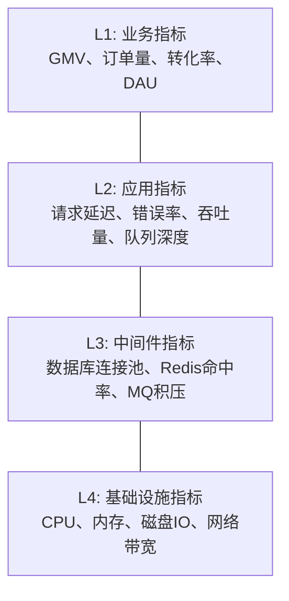
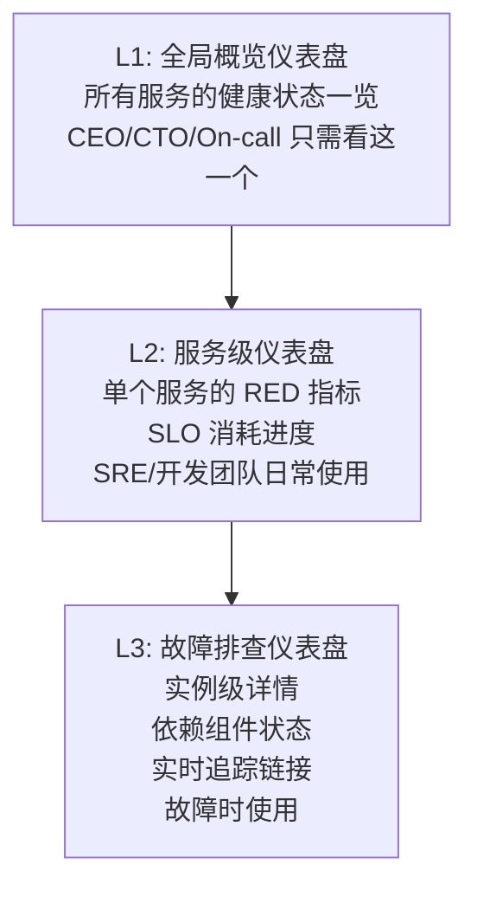
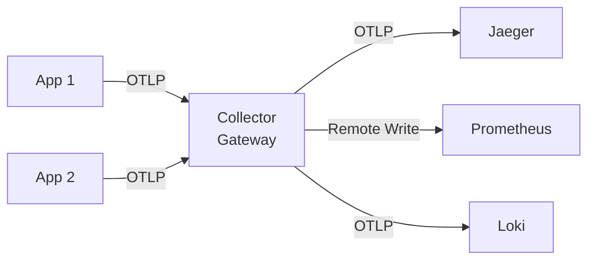
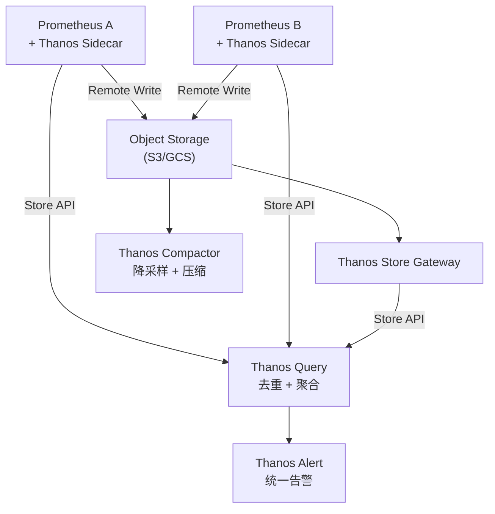
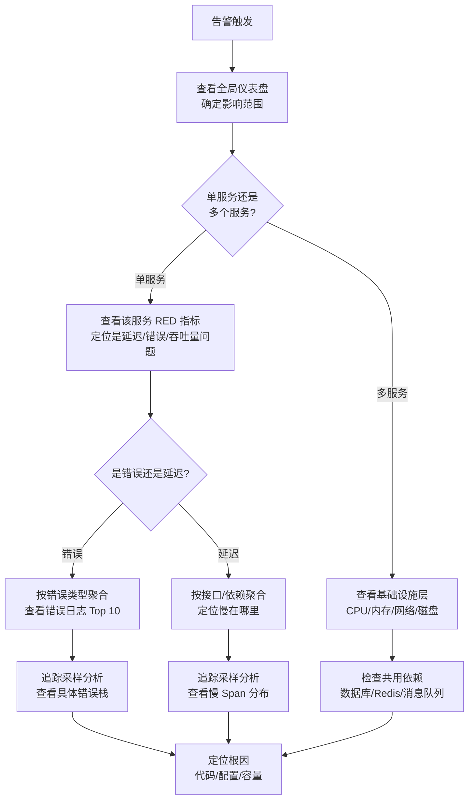

## 核心技巧

本章从理论基础出发，聚焦于监控与可观测性领域的核心实操技巧。掌握这些技巧意味着你不仅能"看见"系统，还能"理解"系统并"预判"问题。

### 1. 结构化日志：从文本到可查询数据

#### 1.1 为什么结构化日志是可观测性的基石

非结构化日志（如 `2024-01-15 ERROR order-service: Failed to process order ORD-123`）对人类阅读尚可，但对机器而言是"一坨文本"。你无法高效地按 `orderId`、`error type`、`user_id` 等维度做聚合分析。结构化日志将每一行日志变成一个结构化文档，使日志从"可读的文本"升级为"可查询的数据"。

**结构化日志的核心设计原则：**

- **每个字段都有明确语义**：不要把所有信息塞进 message 字段
- **统一的字段命名**：全公司使用同一套字段名，避免 `userId`、`user_id`、`uid` 混用
- **日志级别与后续行动挂钩**：如果一条日志不需要任何人做任何事，它就不应该存在
- **上下文自动注入**：traceId、spanId、service.name 等字段由框架自动填充，不要靠开发者手动传递

#### 1.2 Go 语言结构化日志实战（以 slog 为例）

Go 1.21+ 引入了标准库 `slog`，取代了第三方日志库的垄断地位：

```go
package main

import (
    "context"
    "log/slog"
    "os"
    "time"
)

func main() {
    // 创建 JSON 格式的日志处理器
    handler := slog.NewJSONHandler(os.Stdout, &amp;slog.HandlerOptions{
        Level:     slog.LevelInfo,
        AddSource: true, // 添加源文件位置，方便定位代码
    })
    logger := slog.New(handler)

    // 注入公共字段（所有日志都会携带）
    logger = logger.With(
        slog.String("service", "order-service"),
        slog.String("version", "2.3.1"),
    )

    // 记录业务事件
    orderId := "ORD-2024-001"
    userId := "U-9876"
    amount := 299.00

    logger.Info("order created",
        slog.String("orderId", orderId),
        slog.String("userId", userId),
        slog.Float64("amount", amount),
        slog.String("traceId", "0af7651916cd43dd8448eb211c80319c"),
    )

    // 记录错误时附带完整上下文
    err := processPayment(orderId, amount)
    if err != nil {
        logger.Error("payment failed",
            slog.String("orderId", orderId),
            slog.Float64("amount", amount),
            slog.String("error", err.Error()),
            slog.Duration("retryAfter", 30*time.Second),
        )
    }
}

func processPayment(orderId string, amount float64) error {
    // 模拟支付处理
    return nil
}
```

**输出的 JSON 日志：**

```json
{
  "time": "2024-01-15T10:30:45.123Z",
  "level": "INFO",
  "source": {"function": "main", "file": "main.go", "line": 32},
  "msg": "order created",
  "service": "order-service",
  "version": "2.3.1",
  "orderId": "ORD-2024-001",
  "userId": "U-9876",
  "amount": 299.00,
  "traceId": "0af7651916cd43dd8448eb211c80319c"
}
```

#### 1.3 Python 结构化日志实战（以 structlog 为例）

```python
import structlog
import logging
import json
from datetime import datetime, timezone

# 配置 structlog
structlog.configure(
    processors=[
        structlog.contextvars.merge_contextvars,  # 自动注入上下文变量
        structlog.processors.add_log_level,       # 添加日志级别
        structlog.processors.TimeStamper(fmt="iso"),  # ISO 格式时间戳
        structlog.processors.StackInfoRenderer(),  # 堆栈信息
        structlog.processors.format_exc_info,      # 异常格式化
        structlog.processors.JSONRenderer(),        # 输出 JSON
    ],
    wrapper_class=structlog.make_filtering_bound_logger(logging.INFO),
    context_class=dict,
    logger_factory=structlog.PrintLoggerFactory(),
)

logger = structlog.get_logger()

# 使用示例
def handle_order(order_id: str, user_id: str, items: list):
    """处理订单的完整示例"""
    log = logger.bind(order_id=order_id, user_id=user_id)

    log.info("order_received",
             item_count=len(items),
             total_amount=sum(item["price"] for item in items))

    for item in items:
        log.info("order_item_validated",
                 sku=item["sku"],
                 quantity=item["quantity"],
                 price=item["price"])

    try:
        result = process_payment(order_id, items)
        log.info("payment_completed",
                 transaction_id=result["txn_id"],
                 amount=result["amount"])
    except PaymentError as e:
        log.error("payment_failed",
                  error_type=type(e).__name__,
                  error_message=str(e),
                  retry_suggested=True)
        raise
```

#### 1.4 日志级别的实战决策框架

选择日志级别时，问自己一个问题："收到这条日志后，谁需要做什么？做什么？"

| 级别 | 后续行动 | 示例 |
|------|---------|------|
| TRACE | 只在调试时临时开启 | SQL 参数绑定值、循环内变量 |
| DEBUG | 开发人员排查问题时开启 | 函数入参/返回值、缓存命中/未命中 |
| INFO | 运维人员了解系统状态 | 请求处理完成、任务启动/结束、配置变更 |
| WARN | 需要关注但不影响当前请求 | 重试即将耗尽、使用了默认配置、响应时间偏高 |
| ERROR | 需要立即处理 | 请求处理失败、外部调用超时、数据不一致 |
| FATAL | 系统无法继续运行 | 数据库连接池耗尽、磁盘满、配置文件缺失 |

**关键原则：生产环境通常只开启 INFO 及以上级别。** DEBUG 日志的信息密度高但量巨大，开启后可能使日志存储成本增加 10-100 倍，且拖慢系统性能。

#### 1.5 日志采样：控制存储成本

在高流量系统中，全量记录所有 INFO 日志的存储成本可能难以承受。日志采样通过有选择地丢弃部分日志来控制成本：

```python
# 按用户维度采样：普通用户 10%，VIP 用户 100%
class AdaptiveSampler:
    def __init__(self):
        self.vip_users = {"vip-001", "vip-002", "vip-003"}

    def should_log(self, user_id: str, level: str) -> bool:
        # ERROR 及以上级别永远记录
        if level in ("ERROR", "FATAL", "CRITICAL"):
            return True
        # VIP 用户全量记录
        if user_id in self.vip_users:
            return True
        # 普通用户 10% 采样
        import random
        return random.random() < 0.1
```

**日志采样的最佳实践：**
- **错误日志永不采样**：ERROR、FATAL 级别必须 100% 记录
- **按业务维度采样**：VIP 用户、大额交易、异常行为全量记录
- **保留采样元信息**：在日志中标注 `"_sampled": true`，避免分析时产生偏差
- **与追踪采样协同**：如果某个请求已被追踪采样选中，其日志应同步全量记录

---

### 2. 指标埋点：从原始数据到可操作洞察

#### 2.1 指标埋点的分层模型

一个成熟的监控体系中，指标通常分为四个层次：



- **L1 业务指标**：反映业务健康度，是最终目标
- **L2 应用指标**：反映服务运行状态，与 SLO 直接相关
- **L3 中间件指标**：反映依赖组件的健康度
- **L4 基础设施指标**：反映底层资源的使用情况

**告警应优先建立在 L1-L2 层。** 如果只监控 L3-L4 层（CPU、内存），你会频繁收到无意义的告警（CPU 高但不影响用户体验）。

#### 2.2 RED 方法与 USE 方法

业界有两种经典的指标埋点框架，分别面向不同场景：

**RED 方法**（面向请求驱动的服务）：

| 指标 | 含义 | Prometheus 指标 |
|------|------|----------------|
| Rate | 每秒请求速率 | `rate(http_requests_total[5m])` |
| Errors | 每秒错误速率 | `rate(http_requests_total{status=~"5.."}[5m])` |
| Duration | 请求延迟分布 | `histogram_quantile(0.99, http_request_duration_seconds_bucket)` |

```python
# Prometheus 客户端埋点示例 (Python)
from prometheus_client import Counter, Histogram, Gauge
import time

# 定义指标
http_requests_total = Counter(
    'http_requests_total',
    'Total HTTP requests',
    ['method', 'endpoint', 'status']
)

http_request_duration_seconds = Histogram(
    'http_request_duration_seconds',
    'HTTP request latency in seconds',
    ['method', 'endpoint'],
    buckets=[0.01, 0.025, 0.05, 0.1, 0.25, 0.5, 1.0, 2.5, 5.0, 10.0]
)

active_requests = Gauge(
    'active_requests',
    'Number of currently active requests',
    ['endpoint']
)

# 使用示例
def handle_request(endpoint: str, method: str = "GET"):
    active_requests.labels(endpoint=endpoint).inc()
    start = time.time()
    try:
        # 业务处理
        result = process(endpoint)
        duration = time.time() - start
        http_requests_total.labels(
            method=method, endpoint=endpoint, status="200"
        ).inc()
        http_request_duration_seconds.labels(
            method=method, endpoint=endpoint
        ).observe(duration)
        return result
    except Exception as e:
        duration = time.time() - start
        http_requests_total.labels(
            method=method, endpoint=endpoint, status="500"
        ).inc()
        http_request_duration_seconds.labels(
            method=method, endpoint=endpoint
        ).observe(duration)
        raise
    finally:
        active_requests.labels(endpoint=endpoint).dec()
```

**USE 方法**（面向资源/系统层）：

| 指标 | 含义 | 适用资源 |
|------|------|---------|
| Utilization | 资源使用率 | CPU、内存、磁盘、网络 |
| Saturation | 资源饱和度（排队程度） | CPU 队列、磁盘 IO 队列、网络缓冲区 |
| Errors | 资源错误计数 | 磁盘错误、网络丢包、ECC 内存错误 |

```bash
# USE 方法的命令行采集
# Utilization
mpstat -P ALL 1           # CPU 使用率
free -m                   # 内存使用率
df -h                     # 磁盘使用率

# Saturation
cat /proc/loadavg         # CPU 队列长度
iostat -x 1               # 磁盘 IO 队列 (avgqu-sz)
ss -s                     # 网络 socket 队列

# Errors
dmesg | grep -i error     # 内核错误日志
ethtool -S eth0 | grep -i error  # 网络接口错误
smartctl -a /dev/sda      # 磁盘 SMART 错误
```

#### 2.3 Histogram 桶边界的科学设置

Histogram 的桶边界设置直接影响分位数估算的精度。桶边界应按对数间距设置，而非线性间距：

```python
# 推荐的 HTTP 延迟 Histogram 桶边界
# 覆盖 10ms 到 30s 的范围，按对数间距
HTTP_DURATION_BUCKETS = [
    0.010,   # 10ms
    0.025,   # 25ms
    0.050,   # 50ms
    0.100,   # 100ms
    0.250,   # 250ms
    0.500,   # 500ms
    1.000,   # 1s
    2.500,   # 2.5s
    5.000,   # 5s
    10.000,  # 10s
    30.000,  # 30s
    float("inf"),  # +Inf
]

# 为什么是对数间距？因为延迟分布通常是右偏的：
# - 大部分请求在 50-200ms 完成（需要高精度）
# - 少量请求在 1-10s 完成（需要覆盖但不需要高精度）
# 对数间距在低延迟区间提供更高的分辨率
```

**桶边界设置的三条原则：**
1. **覆盖 99.9% 的数据**：最后一个桶（不包括 +Inf）应该覆盖 P99.9
2. **低延迟区更密集**：大多数请求应该落在密集桶区间内
3. **+Inf 桶必须存在**：捕获所有超出范围的异常值

#### 2.4 Counter 重置与 rate() 的正确使用

Counter 在服务重启后会重置为零。`rate()` 函数通过线性回归自动处理 Counter 重置，但窗口大小的选择至关重要：

```promql
# 窗口大小选择指南
# 1. 最小窗口 >= 4x 副本数 × scrape 间隔
#    例如：每 15s 采集，3 个副本 → 最小窗口 = 4 × 3 × 15s = 180s ≈ 3 分钟

# 推荐的 rate() 窗口配置
rate(http_requests_total[5m])       # 生产环境告警用（足够平滑）
rate(http_requests_total[1m])       # Grafana 仪表盘实时展示用
irate(http_requests_total[5m])      # 展示瞬时波动（不推荐用于告警）

# 错误率计算（带除零保护）
sum(rate(http_requests_total{status=~"5.."}[5m]))
/
(sum(rate(http_requests_total[5m])) > 0)

# 分位数计算
histogram_quantile(0.99,
  rate(http_request_duration_seconds_bucket[5m])
)
```

**常见的 rate() 陷阱：**
- **不要对 Gauge 使用 rate()**：rate() 是 Counter 专用函数，Gauge 应该直接查询瞬时值
- **窗口不能太短**：如果窗口 < 4x 副本数 × 采集间隔，可能因 Counter 重置产生虚假峰值
- **irate() vs rate()**：irate 只用最后两个数据点，对突变敏感但噪声大，告警用 rate() 更稳定

---

### 3. 分布式追踪：构建请求全景图

#### 3.1 OpenTelemetry 实战集成

OpenTelemetry 是分布式追踪的行业标准。以下是 Java 和 Go 的集成示例：

**Java（Spring Boot + OpenTelemetry Java Agent）：**

```bash
# 最简方式：通过 Java Agent 无侵入接入
# 下载 OpenTelemetry Java Agent
curl -LO https://github.com/open-telemetry/opentelemetry-java-instrumentation/releases/latest/download/opentelemetry-javaagent.jar

# 启动时注入 Agent
java -javaagent:opentelemetry-javaagent.jar \
  -Dotel.service.name=order-service \
  -Dotel.exporter.otlp.endpoint=http://otel-collector:4317 \
  -Dotel.traces.sampler=parentbased_traceidratio \
  -Dotel.traces.sampler.arg=0.1 \
  -Dotel.resource.attributes=service.version=2.3.1,deployment.environment=production \
  -jar order-service.jar
```

Java Agent 的优势在于**零代码修改**即可获取 HTTP、gRPC、数据库、Redis、Kafka 等主流框架的自动埋点。你只需要在启动参数中配置 Agent 和 exporter 即可。

**Go（手动埋点 + OpenTelemetry SDK）：**

```go
package main

import (
    "context"
    "go.opentelemetry.io/otel"
    "go.opentelemetry.io/otel/attribute"
    "go.opentelemetry.io/otel/codes"
    "go.opentelemetry.io/otel/exporters/otlp/otlptrace/otlptracegrpc"
    "go.opentelemetry.io/otel/sdk/resource"
    sdktrace "go.opentelemetry.io/otel/sdk/trace"
    semconv "go.opentelemetry.io/otel/semconv/v1.24.0"
    "time"
)

// 初始化 Tracer Provider
func initTracer(ctx context.Context) (func(), error) {
    exporter, err := otlptracegrpc.New(ctx,
        otlptracegrpc.WithEndpoint("otel-collector:4317"),
        otlptracegrpc.WithInsecure(),
    )
    if err != nil {
        return nil, err
    }

    res, _ := resource.Merge(
        resource.Default(),
        resource.NewWithAttributes(
            semconv.SchemaURL,
            semconv.ServiceNameKey.String("order-service"),
            semconv.ServiceVersion("2.3.1"),
            semconv.DeploymentEnvironment("production"),
        ),
    )

    tp := sdktrace.NewTracerProvider(
        sdktrace.WithBatcher(exporter),
        sdktrace.WithResource(res),
        sdktrace.WithSampler(sdktrace.ParentBased(
            sdktrace.TraceIDRatioBased(0.1), // 10% 采样率
        )),
    )
    otel.SetTracerProvider(tp)

    return func() { _ = tp.Shutdown(ctx) }, nil
}

// 业务埋点示例
func processOrder(ctx context.Context, orderId string) error {
    tracer := otel.Tracer("order-service")

    // 创建 Span
    ctx, span := tracer.Start(ctx, "processOrder",
        trace.WithAttributes(
            attribute.String("order.id", orderId),
        ),
    )
    defer span.End()

    // 子操作 1：校验库存
    _, stockSpan := tracer.Start(ctx, "checkStock")
    available, err := checkInventory(orderId)
    if err != nil {
        stockSpan.RecordError(err)
        stockSpan.SetStatus(codes.Error, err.Error())
        stockSpan.End()
        span.SetStatus(codes.Error, "inventory check failed")
        return err
    }
    stockSpan.SetAttributes(
        attribute.Int("stock.available", available),
    )
    stockSpan.End()

    // 子操作 2：扣减库存
    _, deductSpan := tracer.Start(ctx, "deductStock")
    if err := deductInventory(orderId); err != nil {
        deductSpan.RecordError(err)
        deductSpan.End()
        return err
    }
    deductSpan.End()

    span.SetAttributes(attribute.Bool("order.success", true))
    return nil
}
```

#### 3.2 采样策略的选择与配置

采样策略直接影响追踪数据的价值和存储成本。以下是不同场景的推荐配置：

| 场景 | 推荐策略 | 采样率 | 原因 |
|------|---------|--------|------|
| 开发环境 | 全量采集 | 100% | 需要完整调用链路排查问题 |
| 测试环境 | 全量采集 | 100% | 需要完整数据进行性能分析 |
| 预发布环境 | 概率采样 | 50% | 模拟生产环境，控制成本 |
| 生产环境（低流量） | 概率采样 | 10% | 低流量场景下 10% 已能提供统计意义 |
| 生产环境（高流量） | 尾部采样 | 自适应 | 保留所有错误/慢请求，采样正常请求 |
| 金融/支付链路 | 全量或高比例 | 100% | 关键链路需要完整审计 |

**尾部采样的 OpenTelemetry Collector 配置：**

```yaml
# otel-collector-config.yaml
receivers:
  otlp:
    protocols:
      grpc:
        endpoint: 0.0.0.0:4317
      http:
        endpoint: 0.0.0.0:4318

processors:
  tail_sampling:
    decision_wait: 10s          # 等待 10s 收集完整 trace 后决策
    num_traces: 100000          # 内存中最多缓冲 10 万条 trace
    expected_new_traces_per_sec: 1000

    policies:
      # 策略 1：错误请求 100% 保留
      - name: errors-policy
        type: status_code
        status_code: {status_codes: [ERROR]}

      # 策略 2：延迟超过 2s 的请求 100% 保留
      - name: slow-requests
        type: latency
        latency: {threshold_ms: 2000}

      # 策略 3：正常请求 10% 概率采样
      - name: normal-requests
        type: probabilistic
        probabilistic: {sampling_percentage: 10}

      # 策略 4：新部署 5 分钟内 100% 采样
      - name: new-deployment
        type: string_attribute
        string_attribute: {key: deployment.environment, values: [canary]}

      # 组合策略：满足任一条件即保留
      - name: composite-policy
        type: composite
        composite:
          max_total_spans_per_second: 5000
          policy_order: [errors-policy, slow-requests, new-deployment, normal-requests]
          rate_allocation:
            - policy: errors-policy
              percent: 40
            - policy: slow-requests
              percent: 30
            - policy: new-deployment
              percent: 20
            - policy: normal-requests
              percent: 10

exporters:
  otlp:
    endpoint: jaeger-collector:4317
    tls:
      insecure: true

service:
  pipelines:
    traces:
      receivers: [otlp]
      processors: [tail_sampling]
      exporters: [otlp]
```

#### 3.3 Span 属性设计的最佳实践

Span 属性是追踪数据中最重要的元信息。好的属性设计使你能在 Jaeger/Grafana Tempo 中高效地搜索和分析：

**必设属性（每个 Span 都应该有）：**

```python
# 每个 Span 都应携带的通用属性
span.set_attribute("http.method", "GET")                        # 请求方法
span.set_attribute("http.url", "/api/orders/ORD-123")           # 请求路径（不含查询参数）
span.set_attribute("http.status_code", 200)                     # 响应状态码
span.set_attribute("db.system", "postgresql")                   # 数据库类型
span.set_attribute("db.statement", "SELECT * FROM orders WHERE id = $1")  # SQL 语句
span.set_attribute("messaging.system", "kafka")                 # 消息系统类型
span.set_attribute("messaging.destination", "order-events")     # 消息目标

# 业务属性（与你的业务直接相关）
span.set_attribute("order.id", "ORD-123")
span.set_attribute("user.id", "U-9876")
span.set_attribute("order.amount", 299.00)
```

**属性设计的三条原则：**
1. **属性值只能是字符串、数字或布尔值**：不要嵌套对象，不要放数组（除非 OpenTelemetry 语义约定明确支持）
2. **基数控制**：高基数属性（如 request_id）用于搜索，低基数属性（如 status_code）用于聚合
3. **避免敏感数据**：不要将密码、token、身份证号等 PII 数据放入 Span 属性

---

### 4. 告警设计：从噪音到精准信号

#### 4.1 告警规则的工程化管理

告警规则不是写在 Grafana UI 里的临时代码，而是应该像应用代码一样进行版本控制和代码审查：

```yaml
# alerts/orders-service.yaml
# 告警规则文件结构：按服务组织，每个文件独立
groups:
  - name: orders-service-slo
    interval: 30s
    rules:
      # 基于 SLO 的多窗口 burn rate 告警
      # 短窗口（5min + 1h）：检测快速故障，约 10 分钟响应
      - alert: OrderServiceHighErrorBurnRate_Fast
        expr: |
          (
            1 - (
              sum(rate(http_requests_total{service="orders", status=~"5.."}[5m]))
              /
              sum(rate(http_requests_total{service="orders"}[5m]))
            )
          ) > 14.4 * (1 - 0.999)
          and
          (
            1 - (
              sum(rate(http_requests_total{service="orders", status=~"5.."}[1h]))
              /
              sum(rate(http_requests_total{service="orders"}[1h]))
            )
          ) > 14.4 * (1 - 0.999)
        for: 2m
        labels:
          severity: critical
          service: orders
          slo_target: "99.9%"
        annotations:
          summary: "订单服务错误率快速飙升，错误预算可能在 1.67 小时内耗尽"
          description: |
            当前 5 分钟窗口错误率: {{ $value | humanizePercentage }}
            SLO 目标: 99.9%
            影响: 订单处理可能中断
          runbook_url: "https://runbook.example.com/orders-high-error-rate"
          dashboard_url: "https://grafana.example.com/d/orders-slo"

      # 长窗口（6h + 3d）：检测慢速退化
      - alert: OrderServiceHighErrorBurnRate_Slow
        expr: |
          (
            1 - (
              sum(rate(http_requests_total{service="orders", status=~"5.."}[6h]))
              /
              sum(rate(http_requests_total{service="orders"}[6h]))
            )
          ) > 3 * (1 - 0.999)
          and
          (
            1 - (
              sum(rate(http_requests_total{service="orders", status=~"5.."}[3d]))
              /
              sum(rate(http_requests_total{service="orders"}[3d]))
            )
          ) > 3 * (1 - 0.999)
        for: 5m
        labels:
          severity: warning
          service: orders
        annotations:
          summary: "订单服务错误率持续偏高，正在缓慢消耗错误预算"

  - name: orders-service-application
    rules:
      # 基于症状的延迟告警
      - alert: OrderServiceHighLatency_P99
        expr: |
          histogram_quantile(0.99,
            rate(http_request_duration_seconds_bucket{service="orders"}[5m])
          ) > 2.0
        for: 5m
        labels:
          severity: warning
          service: orders
        annotations:
          summary: "订单服务 P99 延迟超过 2 秒"
          description: "当前 P99: {{ $value }}s"

      # 基于原因的饱和度告警（辅助预警）
      - alert: OrderServiceHighCPU
        expr: |
          avg(rate(process_cpu_seconds_total{service="orders"}[5m])) > 0.9
        for: 10m
        labels:
          severity: info
          service: orders
        annotations:
          summary: "订单服务 CPU 使用率偏高，可能影响延迟"
```

#### 4.2 告警分级与路由策略

不同严重程度的告警应该走不同的通知渠道和响应流程：

```yaml
# Alertmanager 路由配置
# alertmanager-config.yaml
global:
  resolve_timeout: 5m
  slack_api_url: "https://hooks.slack.com/services/xxx"

route:
  receiver: default-slack
  group_by: ['alertname', 'service', 'severity']
  group_wait: 30s
  group_interval: 5m
  repeat_interval: 4h

  routes:
    # P0 - 需要立即响应，电话通知
    - match:
        severity: critical
      receiver: pagerduty-oncall
      group_wait: 10s
      repeat_interval: 15m
      continue: false

    # P1 - 15 分钟内响应，Slack + 短信
    - match:
        severity: warning
      receiver: slack-alerts
      group_wait: 30s
      repeat_interval: 1h

    # P2 - 工作时间处理，邮件摘要
    - match:
        severity: info
      receiver: email-digest
      group_wait: 5m
      repeat_interval: 24h

# 通知模板
templates:
  - '/etc/alertmanager/templates/*.tmpl'

# 静默规则：非工作时间降低 info 级别告警
# 在 Grafana 或 Alertmanager 中配置静默窗口
```

**告警分级的决策矩阵：**

| 级别 | 影响范围 | 响应时间 | 通知方式 | 示例 |
|------|---------|---------|---------|------|
| Critical (P0) | 用户可见的服务中断 | 5 分钟 | 电话 + PagerDuty + Slack | 核心 API 全面 5xx |
| Warning (P1) | 性能退化或部分功能异常 | 15 分钟 | Slack + 短信 | P99 延迟超阈值 |
| Info (P2) | 潜在风险，不影响当前服务 | 工作时间 | 邮件摘要 | 磁盘使用 > 80% |

#### 4.3 告警静默与维护窗口

在发布、扩容、故障演练等场景中，需要临时屏蔽告警：

```python
# 通过 Alertmanager API 创建维护窗口静默
import requests
from datetime import datetime, timedelta

def create_maintenance_silence(
    alertmanager_url: str,
    matchers: dict,          # 要静默的告警匹配条件
    duration_minutes: int,
    comment: str,
    creator: str
):
    """创建告警静默规则"""
    now = datetime.utcnow()
    payload = {
        "matchers": [
            {"name": k, "value": v, "isRegex": False}
            for k, v in matchers.items()
        ],
        "startsAt": now.isoformat() + "Z",
        "endsAt": (now + timedelta(minutes=duration_minutes)).isoformat() + "Z",
        "createdBy": creator,
        "comment": comment,
    }

    resp = requests.post(
        f"{alertmanager_url}/api/v2/silences",
        json=payload
    )
    return resp.json()

# 使用示例：发布期间静默 orders 服务的告警
create_maintenance_silence(
    alertmanager_url="http://alertmanager:9093",
    matchers={"service": "orders"},
    duration_minutes=30,
    comment="v2.4.0 发布，预计 30 分钟",
    creator="kyle-deploy-bot"
)
```

---

### 5. Grafana 仪表盘设计

#### 5.1 仪表盘的分层架构

一个成熟的监控体系应该有三层仪表盘，从宏观到微观逐层下钻：



#### 5.2 RED 仪表盘模板

以下是使用 Prometheus + Grafana 构建服务级 RED 仪表盘的核心面板：

**Grafana Dashboard JSON 关键面板：**

```json
{
  "panels": [
    {
      "title": "请求速率 (QPS)",
      "type": "timeseries",
      "targets": [
        {
          "expr": "sum(rate(http_requests_total{service=\"orders\"}[5m])) by (endpoint)",
          "legendFormat": "{{endpoint}}"
        }
      ]
    },
    {
      "title": "错误率",
      "type": "stat",
      "targets": [
        {
          "expr": "sum(rate(http_requests_total{service=\"orders\", status=~\"5..\"}[5m])) / sum(rate(http_requests_total{service=\"orders\"}[5m])) > 0",
          "legendFormat": "Error Rate"
        }
      ],
      "fieldConfig": {
        "defaults": {
          "thresholds": {
            "steps": [
              {"value": 0, "color": "green"},
              {"value": 0.001, "color": "yellow"},
              {"value": 0.01, "color": "red"}
            ]
          }
        }
      }
    },
    {
      "title": "延迟分位数 (P50 / P95 / P99)",
      "type": "timeseries",
      "targets": [
        {
          "expr": "histogram_quantile(0.50, rate(http_request_duration_seconds_bucket{service=\"orders\"}[5m]))",
          "legendFormat": "P50"
        },
        {
          "expr": "histogram_quantile(0.95, rate(http_request_duration_seconds_bucket{service=\"orders\"}[5m]))",
          "legendFormat": "P95"
        },
        {
          "expr": "histogram_quantile(0.99, rate(http_request_duration_seconds_bucket{service=\"orders\"}[5m]))",
          "legendFormat": "P99"
        }
      ]
    },
    {
      "title": "SLO 消耗进度",
      "type": "gauge",
      "targets": [
        {
          "expr": "(1 - (1 - 0.999) * 30 * 24 * 60 * (1 - (sum(increase(http_requests_total{service=\"orders\", status!~\"5..\"}[24h])) / sum(increase(http_requests_total{service=\"orders\"}[24h])))))) / ((1 - 0.999) * 30 * 24 * 60)",
          "legendFormat": "Error Budget Remaining"
        }
      ]
    }
  ]
}
```

#### 5.3 仪表盘设计的五条原则

1. **从上到下，从宏观到微观**：最重要的指标放在左上角，按重要性递减排列
2. **每个面板都有明确目的**：删除"看起来有用但没人看"的面板，面板越少越好
3. **使用一致的时间范围**：默认时间范围应该覆盖一个完整的故障检测-响应周期（通常 1-4 小时）
4. **颜色编码要有意义**：绿色=正常、黄色=预警、红色=异常，不要用自定义颜色
5. **每个面板标注数据来源**：在面板标题或描述中注明数据来自哪个数据源和查询

---

### 6. OpenTelemetry Collector 管道配置

#### 6.1 Collector 的架构角色

OpenTelemetry Collector 是遥测数据的中转站，承担接收（Receive）、处理（Process）、导出（Export）三大职责。在生产环境中，Collector 通常部署为独立服务，充当所有应用与后端存储之间的中间层：



#### 6.2 生产级 Collector 配置

```yaml
# otel-collector-config.yaml
# 生产级 OpenTelemetry Collector 配置

receivers:
  otlp:
    protocols:
      grpc:
        endpoint: 0.0.0.0:4317
        max_recv_msg_size_mib: 4       # 最大接收消息大小
        max_concurrent_streams: 100    # 最大并发流
      http:
        endpoint: 0.0.0.0:4318
        cors:
          allowed_origins: ["*"]

  # 指标拉取（用于非 OTLP 来源的指标）
  prometheus:
    config:
      scrape_configs:
        - job_name: 'node-exporters'
          scrape_interval: 15s
          static_configs:
            - targets: ['node-exporter:9100']

processors:
  # 批量处理：减少网络请求
  batch:
    timeout: 5s              # 最长等待时间
    send_batch_size: 8192    # 单批最大条目数
    send_batch_max_size: 16384

  # 资源属性注入
  resource:
    attributes:
      - key: deployment.environment
        value: production
        action: upsert
      - key: collector.region
        value: ap-southeast-1
        action: upsert

  # 内存限制保护
  memory_limiter:
    check_interval: 5s
    limit_mib: 2048          # 内存使用硬限制
    spike_limit_mib: 512     # 允许的突发增量

  # 过滤掉不需要的遥测数据
  filter:
    error_mode: ignore
    traces:
      span:
        - 'attributes["http.target"] == "/health"'
        - 'attributes["http.target"] == "/metrics"'
        - 'attributes["http.target"] == "/ready"'
    metrics:
      metric:
        - 'name == "go_goroutines"'    # 过滤掉某些不需要的内置指标

  # 尾部采样（traces 专用）
  tail_sampling:
    decision_wait: 10s
    num_traces: 200000
    policies:
      - name: errors
        type: status_code
        status_code: {status_codes: [ERROR]}
      - name: slow
        type: latency
        latency: {threshold_ms: 2000}
      - name: probabilistic
        type: probabilistic
        probabilistic: {sampling_percentage: 10}

exporters:
  # 追踪数据导出到 Jaeger
  otlp/jaeger:
    endpoint: jaeger-collector:4317
    tls:
      insecure: true

  # 指标数据导出到 Prometheus
  prometheusremotewrite:
    endpoint: http://thanos-receive:19291/api/v1/receive

  # 日志数据导出到 Loki
  loki:
    endpoint: http://loki-gateway:3100/loki/api/v1/push

  # 兜底：失败的遥测数据写入本地文件
  file:
    path: /var/log/otel-fallback/
    rotation:
      max_megabytes: 1000
      max_days: 7

extensions:
  health_check:
    endpoint: 0.0.0.0:13133
  zpages:
    endpoint: 0.0.0.0:55679

service:
  extensions: [health_check, zpages]
  pipelines:
    traces:
      receivers: [otlp]
      processors: [memory_limiter, filter, tail_sampling, batch]
      exporters: [otlp/jaeger]
    metrics:
      receivers: [otlp, prometheus]
      processors: [memory_limiter, resource, batch]
      exporters: [prometheusremotewrite]
    logs:
      receivers: [otlp]
      processors: [memory_limiter, resource, batch]
      exporters: [loki, file]
```

#### 6.3 Collector 的部署拓扑

根据规模选择不同的部署拓扑：

| 拓扑 | 适用规模 | 优势 | 劣势 |
|------|---------|------|------|
| Agent 模式 | 小型（<10 服务） | 部署简单，无需额外基础设施 | 无法做全局聚合和采样 |
| Gateway 模式 | 中大型（10-500 服务） | 集中处理、全局采样、统一出口 | 增加一跳网络延迟 |
| 两级模式 | 超大规模（500+ 服务） | Agent 本地预处理 + Gateway 全局聚合 | 运维复杂度高 |

**Agent 模式（Sidecar/DaemonSet）配置：**

```yaml
# 作为 Kubernetes DaemonSet 部署的 Agent 模式
# 只做接收和预处理，快速转发
receivers:
  otlp:
    protocols:
      grpc:
        endpoint: 0.0.0.0:4317

processors:
  memory_limiter:
    limit_mib: 256
    check_interval: 5s
  batch:
    timeout: 1s
    send_batch_size: 1024

exporters:
  otlp/gateway:
    endpoint: otel-collector-gateway:4317
    tls:
      insecure: true
    retry_on_failure:
      enabled: true
      initial_interval: 5s
      max_interval: 30s
      max_elapsed_time: 300s

service:
  pipelines:
    traces:
      receivers: [otlp]
      processors: [memory_limiter, batch]
      exporters: [otlp/gateway]
    metrics:
      receivers: [otlp]
      processors: [memory_limiter, batch]
      exporters: [otlp/gateway]
    logs:
      receivers: [otlp]
      processors: [memory_limiter, batch]
      exporters: [otlp/gateway]
```

---

### 7. 高可用监控架构设计

#### 7.1 监控系统本身的可靠性

监控系统是系统可靠性的最后一道防线。如果监控系统自身宕机，你将在"盲飞"状态下处理故障——这是最危险的情况。

**高可用架构的核心原则：**

1. **监控系统的监控**：Prometheus 需要被另一个 Prometheus 监控（Federation 或外部探测）
2. **数据冗余**：关键指标至少有两个独立的数据副本（双写或 Thanos 复制）
3. **无单点故障**：Alertmanager 使用 Gossip 协议组建集群，避免通知中心成为单点
4. **持久化与降级**：即使后端存储暂时不可用，Collector 也应缓存数据并在恢复后补推

#### 7.2 Prometheus 高可用方案

```yaml
# Prometheus 双实例高可用配置
# prometheus-ha.yaml
global:
  scrape_interval: 15s
  evaluation_interval: 15s

# 两个完全相同的 Prometheus 实例同时采集相同的目标
# 实例 A
# --config.file=prometheus.yaml --storage.tsdb.path=/data/prometheus-a

# 实例 B
# --config.file=prometheus.yaml --storage.tsdb.path=/data/prometheus-b

# Thanos Sidecar 配置（可选，用于长期存储）
# 每个 Prometheus 实例挂载一个 Thanos Sidecar
# sidecar 将数据上传到对象存储（S3/GCS）并暴露 Store API

# Thanos Querier 统一查询入口
# 它同时查询本地 Prometheus 和远程对象存储
# 提供去重和降采样功能
```

**Thanos 架构全景：**



---

### 8. 可观测性的成本管理

#### 8.1 数据量估算模型

在规划可观测性基础设施之前，必须估算数据量和存储需求：

```python
# 可观测性数据量估算器
def estimate_observability_costs(
    services: int,              # 服务数量
    instances_per_service: int, # 每服务实例数
    requests_per_second: float, # 总 QPS
    spans_per_request: float,   # 每请求平均 Span 数
    avg_span_size_bytes: int,   # 平均 Span 大小
    log_events_per_request: int, # 每请求日志条数
    avg_log_size_bytes: int,    # 平均日志大小
    retention_days: int = 30,   # 数据保留天数
):
    """估算追踪、指标、日志的每日数据量和存储需求"""

    daily_seconds = 86400

    # 追踪数据
    daily_spans = requests_per_second * spans_per_request * daily_seconds
    daily_trace_bytes = daily_spans * avg_span_size_bytes
    daily_trace_gb = daily_trace_bytes / (1024**3)

    # 指标数据（简化估算）
    # 每个指标时间序列约 1-2 bytes/point，15s 采集间隔
    time_series_count = services * instances_per_service * 50  # 每实例约 50 个时间序列
    daily_metric_points = time_series_count * (daily_seconds / 15)
    daily_metric_bytes = daily_metric_points * 2  # 平均 2 bytes/point
    daily_metric_gb = daily_metric_bytes / (1024**3)

    # 日志数据
    daily_logs = requests_per_second * log_events_per_request * daily_seconds
    daily_log_bytes = daily_logs * avg_log_size_bytes
    daily_log_gb = daily_log_bytes / (1024**3)

    # 总存储（含索引开销约 1.5x）
    total_daily_gb = (daily_trace_gb + daily_metric_gb + daily_log_gb) * 1.5
    total_storage_gb = total_daily_gb * retention_days

    print(f"=== 可观测性数据量估算 ===")
    print(f"服务数: {services}, 实例数: {services * instances_per_service}")
    print(f"")
    print(f"追踪: {daily_spans:,.0f} spans/天, {daily_trace_gb:.1f} GB/天")
    print(f"指标: {time_series_count:,} 个时间序列, {daily_metric_gb:.1f} GB/天")
    print(f"日志: {daily_logs:,.0f} 条/天, {daily_log_gb:.1f} GB/天")
    print(f"")
    print(f"每日总数据量: {total_daily_gb:.1f} GB")
    print(f"{retention_days} 天存储需求: {total_storage_gb:.0f} GB")
    print(f"")
    print(f"=== 成本估算（按 S3 标准存储 $0.023/GB/月）===")
    print(f"月存储成本: ${total_storage_gb * 0.023:.1f}")

    return {
        "daily_trace_gb": daily_trace_gb,
        "daily_metric_gb": daily_metric_gb,
        "daily_log_gb": daily_log_gb,
        "total_storage_gb": total_storage_gb,
    }

# 示例：10 个服务，每服务 3 实例，5000 QPS
estimate_observability_costs(
    services=10,
    instances_per_service=3,
    requests_per_second=5000,
    spans_per_request=5,
    avg_span_size_bytes=500,
    log_events_per_request=3,
    avg_log_size_bytes=200,
    retention_days=30,
)
```

#### 8.2 降低可观测性成本的七种策略

| 策略 | 实现方式 | 预期节省 |
|------|---------|---------|
| 采样 | 追踪尾部采样，日志按用户采样 | 50-90% |
| 降采样 | 历史指标从 15s 降到 5m 或 1h | 90-99%（长期存储） |
| 过滤 | 删除无价值的 Span/日志（健康检查等） | 10-30% |
| 压缩 | 使用 Zstd 压缩传输和存储数据 | 50-70% |
| 分级存储 | 热数据 SSD + 温数据 HDD + 冷数据对象存储 | 60-80%（存储成本） |
| 标签基数控制 | 避免高基数标签（如 user_id）作为指标标签 | 30-50%（指标存储） |
| 共享 Collector | 多服务共享一个 Collector 实例 | 40-60%（基础设施成本） |

**标签基数控制的反面案例：**

```python
# 错误做法：将 user_id 作为 Gauge 标签
# 这会导致时间序列爆炸（每个用户一个时间序列）
active_users = Gauge('active_users', 'Active users', ['user_id'])  # ❌

# 正确做法：只记录总数
active_users = Gauge('active_users_total', 'Total active users')  # ✅
# 如果需要按用户维度分析，使用追踪或日志
```

---

### 9. 故障排查的系统化方法

#### 9.1 基于可观测性数据的排查流程

当告警触发后，按照以下流程从宏观到微观定位问题：



#### 9.2 常用的排查 SQL/PromQL

以下是 SRE 日常排查中最常用的 PromQL 查询：

```promql
# 1. 查看某个服务当前的错误率
sum(rate(http_requests_total{service="orders", status=~"5.."}[5m]))
/ sum(rate(http_requests_total{service="orders"}[5m]))

# 2. 查看错误率最高的 5 个接口
topk(5,
  sum by (endpoint) (
    rate(http_requests_total{status=~"5.."}[5m])
  )
  / sum by (endpoint) (
    rate(http_requests_total[5m])
  )
)

# 3. 查看延迟分布（P99 最高的 5 个接口）
topk(5,
  histogram_quantile(0.99,
    rate(http_request_duration_seconds_bucket[5m])
  )
)

# 4. 查看是否有实例被摘除
count(kube_pod_status_ready{condition="true", namespace="production"})
< count(kube_pod_info{namespace="production"}) * 0.8

# 5. 查看数据库连接池使用率
db_connection_pool_active / db_connection_pool_max > 0.8

# 6. 查看 Goroutine 泄漏趋势
go_goroutines{service="orders"}
> 2 * go_goroutines{service="orders"} offset 1h

# 7. 查看错误预算剩余时间
(1 - 0.999) * 30 * 24 * 60 * (1 -
  (1 - (
    sum(increase(http_requests_total{service="orders", status!~"5.."}[24h]))
    / sum(increase(http_requests_total{service="orders"}[24h]))
  )) / (1 - 0.999)
)
```

#### 9.3 常见误区与纠正

| 误区 | 问题 | 正确做法 |
|------|------|---------|
| 按 CPU 使用率告警 | CPU 高不一定影响用户体验 | 基于 SLO（延迟/错误率）告警 |
| 告警规则不版本控制 | 无法追溯谁改了什么，无法 Code Review | 告警规则放入 Git，PR 审查后合并 |
| 仪表盘面板越多越好 | 面板太多反而找不到关键信息 | 每层仪表盘面板 < 12 个 |
| 采样率越低越好 | 丢失关键故障数据 | 尾部采样保留所有异常，正常请求可采样 |
| 日志和追踪独立管理 | 关联问题时需要手动拼接 | 使用 traceId 关联日志和追踪 |
| 只监控不设 SLO | 告警阈值随意设定，缺乏科学依据 | 先定义 SLO，再基于 SLO 设定告警 |
| 追踪数据全量存储 | 存储成本爆炸 | 尾部采样 + 分级存储 + 定期清理 |
| 只看均值 | P99 的延迟被均值掩盖 | 始终看分位数（P50/P95/P99），不看均值 |

---

### 10. 核心技巧总结

监控与可观测性的核心技巧可以归纳为以下知识图谱：

```mermaid
graph TB
    O["可观测性核心技巧"]
    O --> L1["结构化日志"]
    O --> L2["指标埋点"]
    O --> L3["分布式追踪"]
    O --> L4["告警设计"]
    O --> L5["仪表盘"]
    O --> L6["基础设施"]
    O --> L7["成本管理"]

    L1 --> L1A["JSON格式输出"]
    L1 --> L1B["字段语义约定"]
    L1 --> L1C["日志采样策略"]

    L2 --> L2A["RED/USE方法"]
    L2 --> L2B["Histogram桶设计"]
    L2 --> L2C["Counter/Gauge选型"]

    L3 --> L3A["OpenTelemetry集成"]
    L3 --> L3B["采样策略配置"]
    L3 --> L3C["Span属性设计"]

    L4 --> L4A["SLO驱动告警"]
    L4 --> L4B["多窗口Burn Rate"]
    L4 --> L4C["分级路由策略"]

    L5 --> L5A["三层仪表盘架构"]
    L5 --> L5B["RED指标面板"]
    L5 --> L5C["SLO消耗进度"]

    L6 --> L6A["Collector管道"]
    L6 --> L6B["高可用架构"]
    L6 --> L6C["Prometheus+Thanos"]

    L7 --> L7A["数据量估算"]
    L7 --> L7B["采样+降采样+过滤"]
    L7 --> L7C["分级存储"]
```



**十条核心原则：**

1. **结构化日志是基础**：所有日志必须是 JSON 格式，每个字段有明确语义
2. **指标埋点分四层**：业务→应用→中间件→基础设施，告警优先建在上层
3. **追踪要关联一切**：traceId 是连接日志、指标、追踪的纽带
4. **告警必须可操作**：每条告警对应一个明确的响应动作和 Runbook
5. **SLO 驱动告警阈值**：先定义 SLO，再基于错误预算设定告警
6. **只看分位数不看均值**：P95/P99 才是用户体验的真实反映
7. **采样是成本控制利器**：尾部采样保留所有异常，正常请求按比例采样
8. **监控系统要监控自身**：Prometheus 被另一个 Prometheus 监控
9. **告警规则要版本控制**：和应用代码一样，放入 Git，PR 审查
10. **由外向内排查故障**：从用户感知（症状）到系统内部（原因），逐层下钻
