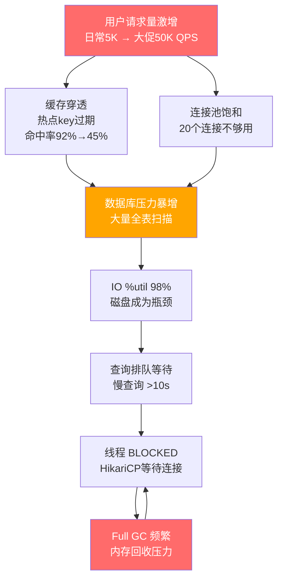
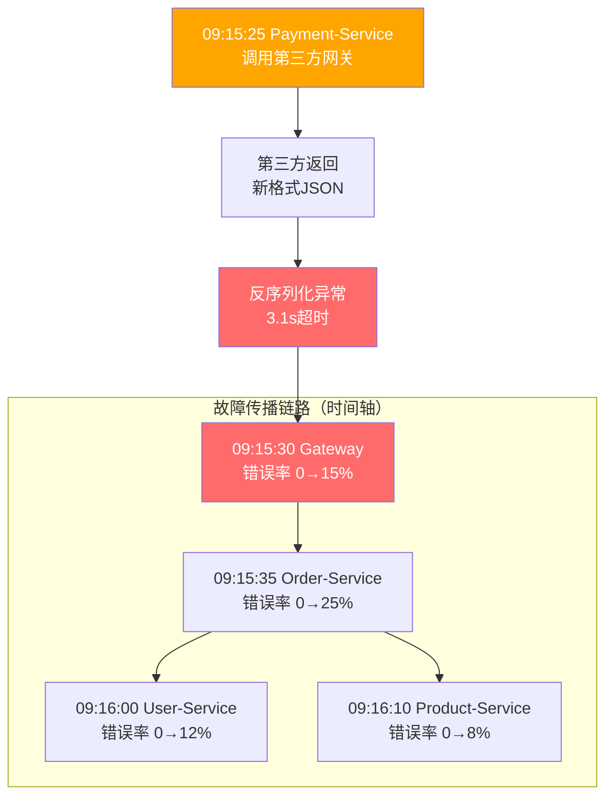
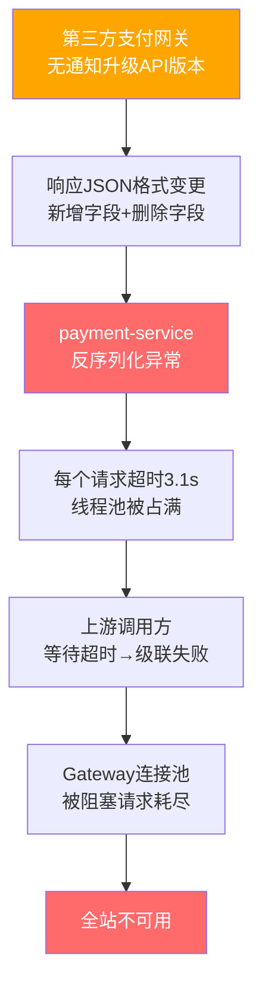
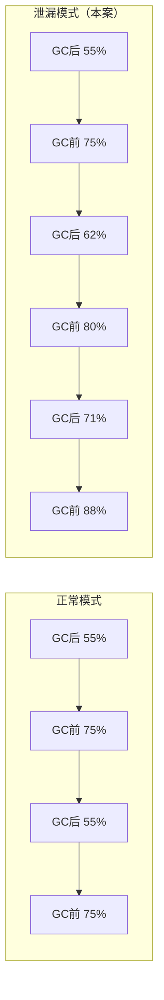
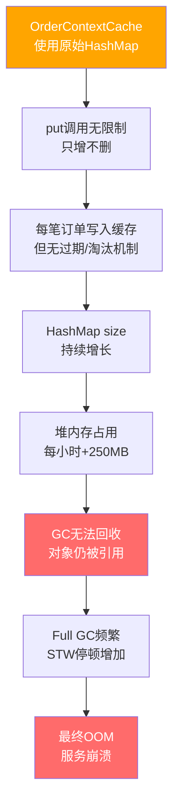

## 实战案例

本节通过三个不同类型的生产事故案例，完整演示从发现问题到根因定位、从制定方案到验证效果的全过程。每个案例均包含真实的时间线、排查路径、使用的可观测性工具和具体命令，帮助读者建立系统化的故障排查思维。

---

### 案例一：电商大促期间的级联性能崩溃

#### 1.1 事件概要

| 维度 | 详情 |
|------|------|
| 时间 | 2024年6月17日 14:00 - 14:35（618大促预热阶段） |
| 业务影响 | 约100万用户受影响，预估直接损失数十万元 |
| 严重等级 | P1（核心交易链路受损） |
| 根因 | 数据库索引缺失 + 连接池配置不当 + 缓存穿透 |
| 恢复时间 | 35分钟（14:00发现 → 14:35完全恢复） |

#### 1.2 事件时间线

14:00  Grafana 延迟面板触发告警：order-service P99 > 500ms
14:02  值班工程师响应，打开 Grafana 总览仪表盘
14:05  确认影响范围：订单创建接口、支付回调接口均受影响
14:08  开始分层排查：网络层 → 应用层 → 数据层
14:12  应用层：发现大量 BLOCKED 线程，GC 日志显示频繁 Full GC
14:15  数据层：SHOW PROCESSLIST 发现大量慢查询（>5s）
14:18  定位到 orders 表缺少 (user_id, status) 复合索引
14:20  紧急添加索引（使用 pt-online-schema-change 避免锁表）
14:25  索引生效，慢查询消除，但连接池仍处于饱和状态
14:28  调整 HikariCP 连接池参数（maximum-pool-size: 20 → 50）
14:30  缓存命中率从 45% 恢复到 92%（热点数据预热完成）
14:35  所有指标恢复正常，告警解除

#### 1.3 排查过程详解

**第一步：系统级指标确认**

通过 Prometheus + node_exporter 的实时数据，快速判断故障层级：

```bash
# 查看系统负载（通过 SSH 登录目标机器）
uptime
# 输出: load average: 25.50, 23.20, 20.10
# 解读：1分钟/5分钟/15分钟负载均远超CPU核数(8核)，系统严重过载

# 查看各维度资源使用
top -c -bn1 | head -20
# 关键输出：
#   %Cpu(s): 95.2 us,  2.1 sy,  0.0 ni,  1.3 id,  0.8 wa,  0.0 hi
#   KiB Mem:  16384000 total,  2457600 free,  13107200 used
# 解读：用户态CPU 95%，IO等待 0.8%（后续发现IO是瓶颈），内存使用 80%

# 查看磁盘IO（核心瓶颈指标）
iostat -x 1 3
# 关键输出：
# Device  r/s    w/s   rkB/s   wkB/s  await  svctm  %util
# sda    320.0  480.0 12800.0 19200.0  45.2   12.3   98.4%
# 解读：%util 98.4% 表示磁盘几乎满载，await 45ms 说明IO延迟很高
```

**第二步：Prometheus PromQL 深入分析**

通过 PromQL 查询定位具体的服务和接口：

```promql
# 1. 查看哪个服务的请求延迟最高
histogram_quantile(0.99,
  sum(rate(http_request_duration_seconds_bucket[5m])) by (service, le)
)
# 结果：order-service P99=1.2s, payment-service P99=800ms, 其他服务正常

# 2. 查看订单服务的错误率趋势
sum(rate(http_requests_total{service="order-service", status=~"5.."}[5m]))
/ sum(rate(http_requests_total{service="order-service"}[5m]))
# 结果：错误率从正常的 0.01% 飙升到 5.2%

# 3. 查看数据库连接池使用率
db_connection_pool_active / db_connection_pool_max
# 结果：order-service 的连接池使用率 100%（20/20），持续 15 分钟

# 4. 查看 Redis 缓存命中率
redis_keyspace_hits / (redis_keyspace_hits + redis_keyspace_misses)
# 结果：缓存命中率从 92% 降到 45%，大量请求穿透到数据库
```

**第三步：应用层 Java 诊断**

```bash
# 查看 Java 线程状态分布（order-service PID=12345）
jstack 12345 | grep "java.lang.Thread.State" | sort | uniq -c | sort -rn
# 输出：
#    187 BLOCKED       ← 异常！大量线程阻塞
#     45 RUNNABLE
#     12 TIMED_WAITING
#      3 WAITING

# 查看 BLOCKED 线程的阻塞原因（取前3个样本）
jstack 12345 | grep -A 15 '"order-pool-'" | head -50
# 发现大量线程阻塞在 HikariCP 的 getConnection() 调用上

# 查看 GC 状况
jstat -gcutil 12345 1000 5
# 输出：
#   S0     S1     E      O      M     CCS    YGC  YGCT   FGC  FGCT   GCT
#   0.00  98.50  87.30  92.10  95.40  93.20  245  8.230   38  12.450  20.680
# 解读：Old区 92.1%，Full GC 38次耗时 12.45s，GC压力巨大
```

**第四步：数据库层 SQL 诊断**

```sql
-- 查看当前正在执行的慢查询
SELECT id, user, host, db, command, time, state, LEFT(info, 100) AS query
FROM information_schema.processlist
WHERE command != 'Sleep' AND time > 5
ORDER BY time DESC;
-- 结果：15条查询执行超过10秒，均为 SELECT * FROM orders WHERE user_id = ?

-- 查看具体慢查询的执行计划
EXPLAIN SELECT * FROM orders WHERE user_id = 123 AND status = 'pending';
-- 结果：
-- type: ALL          ← 全表扫描！
-- rows: 5,234,891    ← 扫描了523万行
-- Extra: Using where

-- 查看 InnoDB 锁等待情况
SELECT * FROM information_schema.innodb_lock_waits
WHERE wait_started < NOW() - INTERVAL 5 SECOND;
-- 结果：8个锁等待事件，最长等待 12 秒

-- 查看表的索引情况
SHOW INDEX FROM orders;
-- 结果：仅有主键索引，无 user_id 相关索引
```

#### 1.4 根因分析

通过分层排查，确认三个互相关联的根因：



| 根因 | 具体问题 | 影响链路 | 严重程度 |
|------|---------|---------|---------|
| 索引缺失 | orders表仅有主键索引，user_id查询全表扫描 | 每次查询扫描523万行 → IO打满 → 查询排队 | 致命 |
| 连接池过小 | HikariCP maximum-pool-size=20，无法支撑高并发 | 所有连接被慢查询占用 → 新请求排队 → 超时 | 严重 |
| 缓存穿透 | 热点key同时过期，大量请求直接打到数据库 | 缓存命中率45% → 数据库QPS暴增 | 严重 |

#### 1.5 解决方案与实施

**方案一：紧急止血——添加数据库索引**

使用 `pt-online-schema-change` 在线添加索引，避免锁表：

```bash
# 安装 percona-toolkit
apt-get install -y percona-toolkit

# 在线添加复合索引（不锁表）
pt-online-schema-change \
  --alter "ADD INDEX idx_user_status (user_id, status)" \
  D=mydb,t=orders \
  --execute

# 添加覆盖索引（消除回表查询）
pt-online-schema-change \
  --alter "ADD INDEX idx_user_time_status (user_id, created_at, status, amount)" \
  D=mydb,t=orders \
  --execute
```

验证索引效果：

```sql
-- 添加索引后的执行计划
EXPLAIN SELECT * FROM orders WHERE user_id = 123 AND status = 'pending';
-- 结果：
-- type: ref             ← 从 ALL(全表扫描) 变为 ref(索引查找)
-- key: idx_user_status  ← 使用了新索引
-- rows: 12              ← 从523万行减少到12行
-- Extra: NULL
```

**方案二：调整连接池配置**

```yaml
# application.yml - HikariCP 配置优化
spring:
  datasource:
    hikari:
      # 核心参数调整
      maximum-pool-size: 50          # 20→50，匹配业务并发量
      minimum-idle: 15               # 10→15，保持更多空闲连接
      connection-timeout: 5000       # 30000→5000，快速失败而非长等待
      idle-timeout: 300000           # 600000→300000，5分钟释放空闲连接
      max-lifetime: 1200000          # 20分钟，避免使用过期连接
      
      # 监控指标暴露
      pool-name: OrderServicePool
      register-metrics: true         # 暴露到 Micrometer/Prometheus
```

连接池配置的计算依据：

最大连接数 = (单次查询平均耗时 × 目标QPS) / 到达率系数
           = (10ms × 50000) / 1000
           = 500 → 取上限50（受数据库max_connections约束）

最小空闲连接 = 最大连接数 × 30%
            = 50 × 0.3
            = 15

**方案三：多级缓存防穿透**

```python
import redis
import time
import hashlib
from functools import lru_cache

class MultiLevelCache:
    """多级缓存：L1(本地) + L2(Redis) + 布隆过滤器"""
    
    def __init__(self, redis_client, local_ttl=60, redis_ttl=3600):
        self.redis = redis_client
        self.local_ttl = local_ttl      # 本地缓存1分钟
        self.redis_ttl = redis_ttl      # Redis缓存1小时
        self.local_cache = {}           # 简易本地缓存（生产用Caffeine/Guava）
        self.NULL_PLACEHOLDER = "NULL"  # 空值占位符，防止穿透
    
    def get(self, key):
        # L1：本地缓存（最快的路径）
        local_val = self.local_cache.get(key)
        if local_val is not None:
            if local_val[1] > time.time():
                return local_val[0]
            else:
                del self.local_cache[key]
        
        # L2：Redis缓存
        redis_val = self.redis.get(key)
        if redis_val is not None:
            if redis_val == self.NULL_PLACEHOLDER:
                # 空值也缓存，防止缓存穿透
                self.local_cache[key] = (None, time.time() + self.local_ttl)
                return None
            self.local_cache[key] = (redis_val, time.time() + self.local_ttl)
            return redis_val
        
        # L3：数据库查询
        data = self._query_database(key)
        if data is None:
            # 缓存空值，防止缓存穿透
            self.redis.setex(key, 60, self.NULL_PLACEHOLDER)
            self.local_cache[key] = (None, time.time() + self.local_ttl)
        else:
            self.redis.setex(key, self.redis_ttl, data)
            self.local_cache[key] = (data, time.time() + self.local_ttl)
        return data
    
    def _query_database(self, key):
        """实际数据库查询"""
        # 实际实现中这里调用数据库ORM
        pass
```

关键设计要点：
- **空值缓存**：数据库查不到的key也缓存一个NULL占位符，TTL设为60秒，防止恶意/异常请求穿透到数据库
- **热点key预加载**：大促前主动将热点数据加载到缓存中，避免冷启动穿透
- **互斥锁**：对同一key的并发查询使用分布式锁（如Redis SETNX），只让一个线程去查库

#### 1.6 优化效果验证

```promql
# 优化前后的关键指标对比（Prometheus查询）

# 延迟对比
histogram_quantile(0.99, rate(http_request_duration_seconds_bucket{service="order-service"}[5m]))
# 优化前: 500ms → 优化后: 45ms

# 吞吐量对比
sum(rate(http_requests_total{service="order-service"}[5m]))
# 优化前: 5000 QPS → 优化后: 52000 QPS

# 错误率对比
sum(rate(http_requests_total{status=~"5.."}[5m])) / sum(rate(http_requests_total[5m]))
# 优化前: 5.2% → 优化后: 0.08%
```

| 指标 | 优化前 | 优化后 | 提升幅度 |
|------|--------|--------|---------|
| P99 延迟 | 500ms | 45ms | 降低 91% |
| P50 延迟 | 200ms | 12ms | 降低 94% |
| QPS 吞吐 | 5,000 | 52,000 | 提升 10.4 倍 |
| 错误率 | 5.2% | 0.08% | 降低 98.5% |
| 数据库慢查询 | 15条/分钟 | 0条 | 消除 |
| 连接池使用率 | 100% | 45% | 恢复健康 |
| GC Full GC 次数 | 38次/小时 | 0次 | 消除 |

---

### 案例二：微服务级联故障导致全站不可用

#### 2.1 事件概要

| 维度 | 详情 |
|------|------|
| 时间 | 2024年9月3日 09:15 - 09:52（工作日早高峰） |
| 业务影响 | 全站所有面向用户的服务不可用，约300万用户受影响 |
| 严重等级 | P0（全站不可用） |
| 根因 | 支付服务依赖的第三方API变更响应格式，导致反序列化异常 |
| 恢复时间 | 37分钟（含5分钟定位 + 20分钟修复部署 + 12分钟验证） |

#### 2.2 事件时间线

09:15  Prometheus 告警风暴：12个服务同时触发 error_rate > 1% 告警
09:17  值班工程师查看 Grafana，发现所有服务错误率同步飙升
09:19  怀疑是公共依赖故障，查看 Jaeger 分布式追踪
09:21  追踪分析：所有故障请求最终都调用了 payment-service
09:23  深入 payment-service：发现其调用的第三方支付网关返回了新格式
09:25  确认根因：第三方网关未通知就升级了API版本
09:28  实施止血方案：开启降级开关，跳过第三方网关，使用本地缓存的订单状态
09:32  降级生效，核心交易链路恢复
09:45  联系第三方修复API兼容性问题
09:52  第三方修复完成，关闭降级开关，全链路恢复

#### 2.3 利用 Jaeger 追踪定位级联故障

**核心排查思路**：当多个服务同时报错时，不要逐个排查，而是从追踪数据中找到"公共节点"。

**步骤一：在 Jaeger 中搜索故障时段的所有错误追踪**

```bash
# 使用 Jaeger CLI 查询错误追踪
jaeger-cli query \
  --service gateway \
  --start "2024-09-03T01:15:00Z" \
  --end "2024-09-03T01:20:00Z" \
  --tags "error=true" \
  --limit 50

# 输出显示：所有错误追踪都经过 payment-service
```

**步骤二：分析故障追踪的调用链路**

Gateway (200 OK)
  └── User-Service (200 OK, 15ms)
  └── Order-Service (200 OK, 25ms)
  └── Payment-Service (500 ERROR, 3200ms)  ← 故障点
        └── ThirdParty-Pay-Gateway (200 OK, 50ms)  ← 返回了意外的响应格式
              └── DeserializeResponse (ERROR, 3150ms)  ← 异常抛出
                    └── JsonParseException: Unexpected character '}' at position 42

**步骤三：在 Grafana 中验证级联影响**

```promql
# 查看故障传播时间线
# Gateway 错误率
sum(rate(http_requests_total{service="gateway", status="500"}[1m]))
# 在 09:15:30 开始飙升

# Order-Service 错误率（受 Payment-Service 故障影响）
sum(rate(http_requests_total{service="order-service", status="500"}[1m]))
# 在 09:15:35 开始飙升（5秒后，级联传播）

# User-Service 错误率（被 Order-Service 的超时阻塞）
sum(rate(http_requests_total{service="user-service", status="500"}[1m]))
# 在 09:16:00 开始飙升（45秒后，连接池被占满）
```



#### 2.4 根因分析



根本原因是**缺乏对第三方依赖的防御性编程和降级机制**：

| 设计缺陷 | 具体表现 | 应有的防御 |
|----------|---------|-----------|
| 无响应格式校验 | JSON反序列化直接使用第三方字段 | 兼容性解析：新旧字段双支持，忽略未知字段 |
| 无超时熔断 | 单个第三方调用超时导致线程池耗尽 | 超时200ms + Circuit Breaker + 快速失败 |
| 无降级策略 | 第三方不可用时整个链路崩溃 | 降级到本地缓存的订单状态 |
| 无API版本管理 | 第三方升级API但无通知机制 | 签订SLA + 定期兼容性检查 |

#### 2.5 解决方案

**方案一：熔断器保护（Circuit Breaker）**

```python
from circuitbreaker import circuit
import time

@circuit(
    failure_threshold=5,        # 5次失败后触发熔断
    recovery_timeout=30,        # 30秒后尝试恢复
    expected_exception=Exception,
    name="third-party-pay-gateway"
)
def call_payment_gateway(order_id, amount):
    """调用第三方支付网关"""
    response = http_client.post(
        "https://pay-gateway.example.com/charge",
        json={"order_id": order_id, "amount": amount},
        timeout=0.2,  # 200ms 超时（正常响应时间约50ms）
        headers={"X-API-Version": "2.0"}  # 显式指定API版本
    )
    
    # 防御性解析：容错处理
    try:
        result = response.json()
        # 校验必要字段是否存在
        required_fields = ["status", "transaction_id"]
        for field in required_fields:
            if field not in result:
                raise ValueError(f"Missing required field: {field}")
        return result
    except (json.JSONDecodeError, ValueError) as e:
        # 记录异常响应格式，便于后续分析
        logger.error("Third-party response format error",
                     extra={"response": response.text[:500], "error": str(e)})
        raise


def process_payment(order_id, amount):
    """带降级策略的支付处理"""
    try:
        # 尝试调用第三方网关
        result = call_payment_gateway(order_id, amount)
        # 成功：更新本地缓存
        cache.set(f"order_status:{order_id}", result["status"], ttl=3600)
        return result
    except CircuitBreakerError:
        # 熔断器打开：降级到本地缓存
        logger.warning("Circuit breaker open, falling back to local cache",
                       extra={"order_id": order_id})
        cached_status = cache.get(f"order_status:{order_id}")
        return {
            "status": cached_status or "processing",
            "message": "Payment is being processed asynchronously",
            "degraded": True  # 标记为降级响应
        }
    except Exception as e:
        # 其他异常：同样降级
        logger.error("Payment gateway error, falling back",
                     extra={"order_id": order_id, "error": str(e)})
        return {"status": "processing", "message": "Payment queued for retry"}
```

**方案二：架构层面的防御性设计**

```yaml
# 针对第三方依赖的 Resilience4j 配置（Java/Spring Boot）
resilience4j:
  circuitbreaker:
    instances:
      payment-gateway:
        failure-rate-threshold: 50       # 失败率超过50%触发熔断
        slow-call-rate-threshold: 80     # 慢调用率超过80%触发熔断
        slow-call-duration-threshold: 200ms  # 超过200ms算慢调用
        wait-duration-in-open-state: 30s     # 熔断30秒后尝试恢复
        permitted-number-of-calls-in-half-open-state: 3  # 半开状态允许3个探测请求
        sliding-window-size: 100         # 滑动窗口100个请求
        
  timelimiter:
    instances:
      payment-gateway:
        timeout-duration: 200ms          # 200ms超时
        cancel-running-future: true      # 超时后取消正在执行的请求
        
  retry:
    instances:
      payment-gateway:
        max-attempts: 2                  # 最多重试2次
        wait-duration: 100ms             # 重试间隔100ms
        retry-exceptions:
          - java.util.concurrent.TimeoutException
          - java.io.IOException
```

**方案三：可观测性增强——添加依赖健康看板**

```yaml
# Grafana Dashboard JSON 片段：第三方依赖健康面板
# 监控所有外部依赖的可用性、延迟、错误率
panels:
  - title: "Third-Party Dependencies Health"
    type: "stat"
    targets:
      - expr: |
          (
            1 - (
              sum(rate(external_call_total{status="error"}[5m])) by (dependency)
              / sum(rate(external_call_total[5m])) by (dependency)
            )
          ) * 100
        legendFormat: "{{dependency}} Availability %"
    thresholds:
      - value: 99
        color: green
      - value: 95
        color: yellow
      - value: 90
        color: red
```

---

### 案例三：内存泄漏导致服务缓慢退化

#### 3.1 事件概要

| 维度 | 详情 |
|------|------|
| 时间 | 持续一周（2024年11月18日-25日），最终在11月25日凌晨OOM崩溃 |
| 业务影响 | 服务响应时间从3天前开始逐日缓慢增长，最终完全不可用 |
| 严重等级 | P1（服务OOM崩溃） |
| 根因 | 本地缓存使用HashMap未设置过期策略，数据持续累积导致内存溢出 |
| 发现方式 | Prometheus内存使用率趋势告警 + Grafana面板趋势分析 |

#### 3.2 事件时间线——一个典型的"温水煮青蛙"

11月22日  内存使用率从 55% 上升到 62%（在正常波动范围内，未触发告警）
11月23日  内存使用率从 62% 上升到 71%（触发 Info 级别趋势告警）
11月24日  内存使用率从 71% 上升到 79%（触发 Warning 级别告警）
          值班工程师查看后判断为"业务增长导致的正常上升"
11月25日  02:15 内存使用率突破 90%，GC频率急剧增加
          02:18 P99延迟从 50ms 升到 500ms（Full GC 导致 STW）
          02:22 内存使用率 98%，触发 Critical 告警
          02:23 服务 OOM 崩溃，Kubernetes 自动重启
          02:25 服务重启后内存又开始增长...

#### 3.3 排查过程——利用 Prometheus 趋势分析发现泄漏

**步骤一：查看内存趋势（Prometheus + Grafana）**

```promql
# JVM 堆内存使用趋势（过去7天）
jvm_memory_used_bytes{area="heap"} / jvm_memory_max_bytes{area="heap"} * 100

# 关键发现：内存使用量呈现"锯齿上升"模式
# 正常模式：锯齿但底部不变（GC后回到基线）
# 泄漏模式：锯齿且底部持续上升（GC后无法回到基线）
```



**步骤二：JVM 诊断——Heap Dump 分析**

```bash
# 在服务内存使用率 80% 时抓取 Heap Dump（不等 OOM）
jmap -dump:live,format=b,file=/tmp/heapdump.hprof <pid>

# 使用 Eclipse MAT 分析
# 1. 打开 heapdump.hprof
# 2. 查看 Leak Suspects Report
# 结果：发现 HashMap<String, OrderContext> 占用 4.2GB（总堆 6GB 的 70%）
# 3. 查看 Dominator Tree
# 结果：OrderContextCache 类持有最大的对象 retained size
```

```bash
# 使用 jmap 查看对象直方图（快速定位大对象）
jmap -histo:live <pid> | head -20
# 输出：
#   num     #instances         #bytes  class name
#    1:       12845678      4294967296  java.util.HashMap$Node
#    2:       12845678       513787120  com.example.cache.OrderContext
#    3:         234567        23456700  java.lang.String
```

**步骤三：代码审查定位泄漏点**

```java
// 问题代码：OrderContextCache.java
public class OrderContextCache {
    // 危险！使用原始 HashMap，无大小限制，无过期策略
    private static final Map<String, OrderContext> cache = new HashMap<>();
    
    public void put(String orderId, OrderContext context) {
        cache.put(orderId, context);  // 只进不出！
    }
    
    public OrderContext get(String orderId) {
        return cache.get(orderId);
    }
    
    // 没有 evict / clear / size 检查方法
}
```

**步骤四：验证泄漏速率**

```promql
# 通过 Prometheus 计算内存增长速率
deriv(jvm_memory_used_bytes{area="heap", service="order-service"}[1h])
# 结果：每小时增长约 250MB
# 6GB 堆空间 / 250MB/h ≈ 24小时后 OOM（与实际时间线吻合）
```

#### 3.4 根因分析



#### 3.5 解决方案

**方案一：使用带容量限制和过期策略的缓存**

```java
import com.github.benmanes.caffeine.cache.Cache;
import com.github.benmanes.caffeine.cache.Caffeine;
import java.util.concurrent.TimeUnit;

// 替换方案：使用 Caffeine 缓存
public class OrderContextCache {
    private static final Cache<String, OrderContext> cache = Caffeine.newBuilder()
        .maximumSize(10_000)                    // 最多10000条
        .expireAfterWrite(30, TimeUnit.MINUTES) // 写入30分钟后过期
        .expireAfterAccess(10, TimeUnit.MINUTES) // 10分钟无访问后过期
        .recordStats()                          // 记录命中率等统计信息
        .build();
    
    public void put(String orderId, OrderContext context) {
        cache.put(orderId, context);
    }
    
    public OrderContext get(String orderId) {
        return cache.getIfPresent(orderId);  // 不存在返回null，不创建占位
    }
    
    // 暴露监控指标
    public CacheStats getStats() {
        return cache.stats();
    }
}
```

**方案二：添加内存泄漏检测告警**

```yaml
# Prometheus 告警规则：检测内存泄漏特征（锯齿上升模式）
groups:
  - name: memory_leak_detection
    rules:
      # 检测1：GC后内存基线持续上升
      - alert: HeapMemoryBaselineRising
        expr: |
          (
            min_over_time(jvm_memory_used_bytes{area="heap"}[6h])
            - min_over_time(jvm_memory_used_bytes{area="heap"}[24h])
          ) > 500 * 1024 * 1024
        for: 6h
        labels:
          severity: warning
        annotations:
          summary: "可能内存泄漏：6小时内堆内存基线上升超过500MB"
          
      # 检测2：GC效率持续下降
      - alert: GCEfficiencyDeclining
        expr: |
          (
            rate(jvm_gc_duration_seconds_sum[1h]) 
            / rate(jvm_gc_duration_seconds_count[1h])
          ) > 2 * (
            rate(jvm_gc_duration_seconds_sum[1d] offset 1d) 
            / rate(jvm_gc_duration_seconds_count[1d] offset 1d)
          )
        for: 4h
        labels:
          severity: warning
        annotations:
          summary: "GC平均耗时翻倍，可能存在内存泄漏"
          
      # 检测3：对象数量持续增长
      - alert: ObjectCountGrowing
        expr: |
          deriv(jvm_memory_pool_used_bytes{pool="Eden Space"}[12h]) > 0
          and
          deriv(jvm_memory_pool_used_bytes{pool="Old Gen"}[12h]) > 10 * 1024 * 1024
        for: 12h
        labels:
          severity: critical
        annotations:
          summary: "老年代内存持续增长12小时以上，高度疑似内存泄漏"
```

**方案三：定期 Heap Dump 自动检测**

```bash
#!/bin/bash
# heap_dump_monitor.sh - 定期检测内存泄漏特征

PID=$1
THRESHOLD_MB=4096  # 4GB 阈值

# 获取当前堆内存使用量
HEAP_USED=$(jstat -gcutil $PID 1000 1 | awk 'NR==2 {print $4}')
HEAP_SIZE=$(jstat -gccapacity $PID 1000 1 | awk 'NR==2 {print $NF}')

echo "$(date) - Heap used: ${HEAP_USED}%, Size: ${HEAP_SIZE}KB"

# 如果使用率超过80%，自动抓取 Heap Dump 并发送分析报告
if (( $(echo "$HEAP_USED > 80" | bc -l) )); then
    jmap -dump:live,format=b,file="/tmp/heapdump_$(date +%Y%m%d_%H%M%S).hprof" $PID
    echo "Heap dump saved. Analyzing with jhat..."
    
    # 自动分析大对象
    jhat -parseonly /tmp/heapdump_*.hprof 2>&amp;1 | head -50
    
    # 发送告警通知
    curl -X POST "https://hooks.slack.com/services/xxx" \
      -d "{\"text\": \"⚠️ Heap Dump抓取完成: 服务 ${SERVICE_NAME} 内存使用率 ${HEAP_USED}%\"}"
fi
```

#### 3.6 修复后的监控验证

```promql
# 修复后监控：堆内存使用趋势
# 应该看到稳定的锯齿模式，底部不再上升

# Caffeine 缓存命中率（验证缓存正常工作）
caffeine_cache_hit_total / (caffeine_cache_hit_total + caffeine_cache_miss_total)
# 目标: > 90%

# Caffeine 缓存驱逐速率（验证过期淘汰正常）
rate(caffeine_cache_eviction_total[5m])
# 正常值: 非零但稳定，表示旧数据在正常过期
```

---

### 案例四：Post-Mortem 复盘模板

每次重大故障后，都应该进行结构化的复盘。以下是一个经过实践验证的 Post-Mortem 模板：

```markdown
# Post-Mortem: [事件标题]

## 基本信息
- 事件日期: YYYY-MM-DD
- 持续时间: XX 分钟
- 严重等级: P0/P1/P2/P3
- 影响范围: [具体受影响的用户数/服务/地区]
- 值班工程师: [姓名]
- 复盘主持人: [姓名]
- 参与人员: [列表]

## 事件摘要
[用3-5句话描述发生了什么、影响多大、如何恢复的]

## 时间线
| 时间(UTC) | 事件 | 操作人 |
|-----------|------|--------|
| HH:MM | 告警触发 | 自动 |
| HH:MM | 开始排查 | @name |
| HH:MM | 根因定位 | @name |
| HH:MM | 实施修复 | @name |
| HH:MM | 完全恢复 | 自动确认 |

## 根因分析（5 Whys）
1. 为什么服务不可用？→ 因为 OOM 崩溃
2. 为什么 OOM？→ 因为堆内存被 HashMap 占满
3. 为什么 HashMap 会占满？→ 因为只增不删，无过期策略
4. 为什么没有过期策略？→ 因为上线时使用了临时方案，未做代码审查
5. 为什么未做代码审查？→ 因为紧急上线，跳过了常规流程

## 影响评估
- 用户影响: [具体数字]
- 业务损失: [具体金额或等价]
- SLI 偏差: [可用性从 99.95% 降到 98.2%]
- 错误预算消耗: [消耗了本月预算的 XX%]

## 修复措施
### 即时修复（止血）
- [x] 重启服务，恢复可用性
- [x] 临时增大内存限制

### 短期修复（根治）
- [x] 替换 HashMap 为 Caffeine 缓存
- [x] 添加内存泄漏检测告警
- [ ] 完成回归测试

### 长期预防
- [ ] 建立代码审查清单：包含缓存使用规范
- [ ] 引入内存泄漏混沌工程测试
- [ ] 所有缓存必须设置最大容量和过期时间（写入编码规范）

## 经验教训
### 做得好的
- 告警系统在内存使用率 71% 时就发出了趋势告警
- 值班工程师在 OOM 前主动抓取了 Heap Dump

### 需要改进的
- 趋势告警的响应流程不够清晰（Info 级别被忽略）
- 缺少对"锯齿上升"模式的自动检测
- 临时代码上线后缺少定期清理机制

## Action Items
| 优先级 | 事项 | 负责人 | 截止日期 | 状态 |
|--------|------|--------|---------|------|
| P0 | 替换所有 HashMap 缓存为 Caffeine | @name | MM-DD | 进行中 |
| P1 | 添加内存泄漏自动检测告警 | @name | MM-DD | 待开始 |
| P2 | 更新编码规范：缓存使用强制要求 | @name | MM-DD | 待开始 |
| P3 | 混沌工程：定期注入内存泄漏 | @name | MM-DD | 待开始 |
```

---

### 经验总结与最佳实践

#### 故障排查的通用方法论


#### 四个核心经验

| 经验 | 含义 | 具体实践 |
|------|------|---------|
| 可观测性是基础设施 | 没有监控就像蒙眼开车 | 三大支柱（日志/指标/追踪）全覆盖，统一标识串联 |
| 数据驱动决策 | 凭感觉优化不如看数据排查 | 所有变更前后都用 Prometheus 对比关键指标 |
| 防御性编程 | 第三方不可靠，自己要兜底 | 超时+重试+熔断+降级，四件套缺一不可 |
| 复盘是资产 | 每次故障都是学习机会 | 结构化复盘→Action Items→跟踪闭环 |

#### 监控系统的自检清单

定期对照以下清单检查监控体系的完备性：

□ 核心服务的 RED 指标（Rate/Error/Duration）是否已监控？
□ 三大支柱（日志/指标/追踪）是否已关联？
□ 告警是否按 SLO 错误预算设计（多窗口 burn rate）？
□ 所有第三方依赖是否有独立的健康检查？
□ 内存/GC 趋势是否有自动检测告警？
□ 告警消息是否包含上下文、Runbook 和 SLO 影响？
□ 复盘 Action Items 是否在跟踪系统中闭环？
□ 缓存命中率、连接池使用率是否在 Grafana 面板中展示？
□ 是否定期进行故障演练（Chaos Engineering）？
□ 新上线的服务是否遵循了可观测性规范（日志格式、指标命名、Span属性）？
