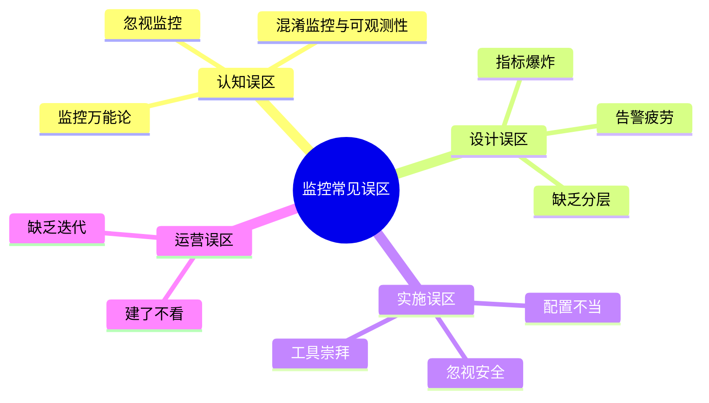
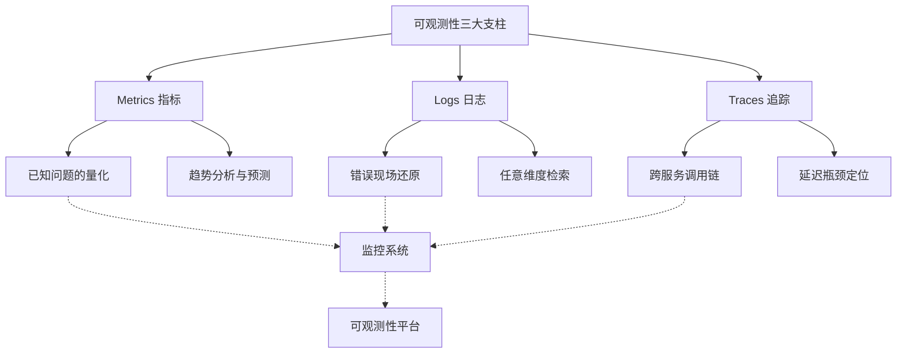
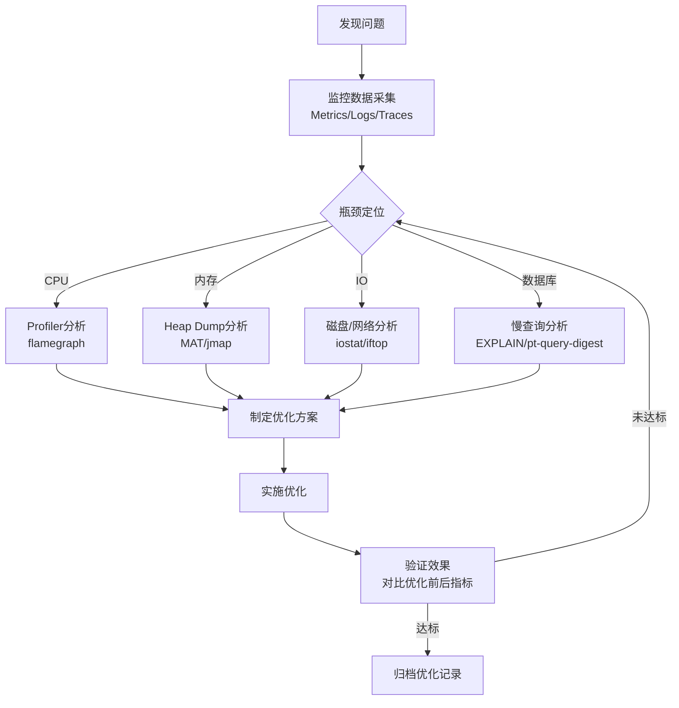
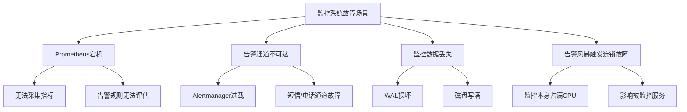
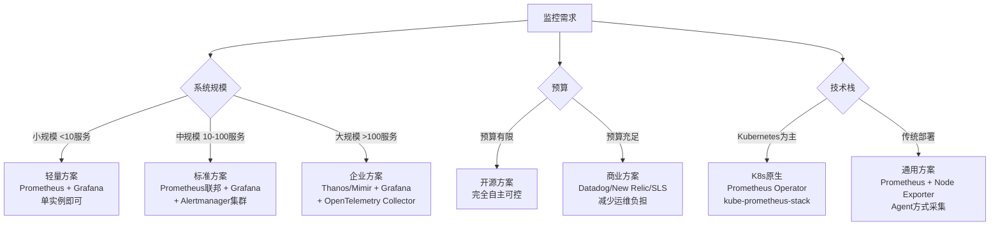

## 常见误区

监控与可观测性是分布式系统工程中实践门槛最高的领域之一。理论知识看似简单——采集指标、收集日志、链路追踪——但实际落地时，团队往往会反复踩入相同的坑。本章系统梳理了监控与可观测性建设中最常见的十大误区，每个误区都配有真实场景、根因分析和可执行的纠正方案。



---

### 误区一：监控无用论——"系统没出过事，不需要监控"

这是最危险的误区。很多中小团队在早期发展阶段，系统规模小、架构简单，出问题时凭经验和日志就能定位。于是产生了"监控没用"的错觉。等到业务爆发式增长、系统复杂度上升时，才发现缺少监控体系意味着完全没有"眼睛"——故障来了只能盲人摸象。

#### 根因分析

| 心理因素 | 具体表现 |
|---------|---------|
| 幸存者偏差 | "之前没监控也跑得好好的"，忽略了那些因为没有监控而未被发现的隐患 |
| 短期成本思维 | 搭建监控需要投入时间精力，短期内看不到直接收益 |
| 经验主义陷阱 | 依赖个人经验排障，忽略了经验无法覆盖所有场景 |

#### 真实案例

某金融支付系统在上线初期未部署监控。某日凌晨3点，数据库主从同步延迟从毫秒级飙升到10秒，但由于没有监控告警，值班人员完全不知情。等到早上9点用户大量投诉"支付成功但余额未更新"时，故障已持续6小时。事后复盘发现：如果部署了MySQL主从延迟监控（Seconds_Behind_Master），在延迟超过1秒时就能告警，问题可在10分钟内被发现并处理。

#### 纠正方案：分阶段建设监控

```yaml
# 第一阶段：基础监控（1-2天可完成）
# prometheus-base.yaml
global:
  scrape_interval: 15s

scrape_configs:
  # 主机层：CPU、内存、磁盘、网络
  - job_name: 'node'
    static_configs:
      - targets: ['node1:9100', 'node2:9100']

  # 应用层：HTTP请求指标
  - job_name: 'app'
    static_configs:
      - targets: ['app1:8080', 'app2:8080']
    metrics_path: '/metrics'

  # 中间件：Redis、MySQL、Kafka
  - job_name: 'redis'
    static_configs:
      - targets: ['redis:9121']
```

```bash
# 一键启动基础监控栈
docker compose -f docker-compose.monitoring.yml up -d
# 包含：Prometheus + Grafana + Node Exporter + Alertmanager
```

> **核心原则：先有再好。** 第一阶段不需要完美覆盖，只需要保证核心服务有基本的指标采集和告警。哪怕只是一个Prometheus加几个基础dashboard，也比零监控强一百倍。

---

### 误区二：混淆"监控"与"可观测性"

很多团队把"部署了Prometheus + Grafana"等同于"实现了可观测性"。实际上，监控（Monitoring）和可观测性（Observability）是两个不同层次的概念。

| 维度 | 监控（Monitoring） | 可观测性（Observability） |
|------|-------------------|------------------------|
| 核心问题 | "系统是否正常？" | "系统为什么不正常？" |
| 数据类型 | 预定义的指标（Metrics） | 指标 + 日志 + 追踪（三大支柱） |
| 适用场景 | 已知问题的检测 | 未知问题的诊断 |
| 思路 | 告驱动：指标超阈值→告警 | 探索驱动：从任意维度切片分析 |
| 典型工具 | Nagios、Zabbix、CloudWatch | OpenTelemetry、Jaeger、Tempo |

#### 典型症状

团队已经部署了完善的Prometheus监控，Grafana上密密麻麻几百个dashboard。但当一个新类型的慢查询出现时，所有人盯着dashboard看不出问题——因为这个"未知的未知"不在预定义的指标中。这时就需要可观测性的另外两大支柱：

- **日志（Logging）**：记录每次请求的详细上下文，事后可按任意维度检索
- **追踪（Tracing）**：记录请求在微服务间的完整调用链，定位跨服务瓶颈



#### 纠正方案：构建完整的可观测性体系

```python
# 使用OpenTelemetry统一采集三大支柱数据
from opentelemetry import trace, metrics
from opentelemetry.sdk.trace import TracerProvider
from opentelemetry.sdk.metrics import MeterProvider
from opentelemetry.exporter.otlp.proto.grpc.trace_exporter import OTLPSpanExporter
from opentelemetry.exporter.otlp.proto.grpc.metric_exporter import OTLPMetricExporter
from opentelemetry.exporter.otlp.proto.grpc.log_exporter import OTLPLogExporter
import logging

# 1. 初始化追踪（Traces）
trace_provider = TracerProvider()
trace_provider.add_span_processor(
    BatchSpanProcessor(OTLPSpanExporter(endpoint="http://otel-collector:4317"))
)
trace.set_tracer_provider(trace_provider)
tracer = trace.get_tracer("order-service")

# 2. 初始化指标（Metrics）
meter_provider = MeterProvider()
meter_provider.add_metric_reader(
    PeriodicExportingMetricReader(OTLPMetricExporter(endpoint="http://otel-collector:4317"))
)
meter = metrics.get_meter("order-service")
request_counter = meter.create_counter("http.requests", description="Total HTTP requests")
latency_histogram = meter.create_histogram("http.latency", description="Request latency in ms")

# 3. 初始化日志（Logs），与trace关联
class OTLPLogHandler(logging.Handler):
    def __init__(self, exporter):
        self.exporter = exporter
    def emit(self, record):
        span = trace.get_current_span()
        # 日志自动关联到当前trace
        log_record = {
            "message": record.getMessage(),
            "severity": record.levelname,
            "trace_id": span.get_span_context().trace_id,
            "span_id": span.get_span_context().span_id,
            "timestamp": record.created,
        }
        self.exporter.export([log_record])

logging.getLogger().addHandler(OTLPLogHandler(OTLPLogExporter()))

# 4. 业务代码中同时产生三种数据
def process_order(order_id):
    with tracer.start_as_current_span("process_order") as span:
        span.set_attribute("order.id", order_id)

        # Metrics：记录请求计数和延迟
        start = time.time()
        result = db.query_order(order_id)
        latency = (time.time() - start) * 1000
        request_counter.add(1, {"method": "query"})
        latency_histogram.record(latency, {"method": "query"})

        # Logs：记录关键业务事件（自动关联trace_id）
        logging.info(f"Query order {order_id}, latency={latency:.1f}ms")

        return result
```

---

### 误区三：指标爆炸——"什么都想监控，指标越多越好"

与误区一相反，另一种极端是"指标恐惧症"——觉得每个变量都需要监控。于是部署了几十个exporter，采集上千个指标，Grafana dashboard建了几百个。结果：

- Prometheus存储成本飙升（一个指标×1000个时间序列×30天 = 巨大的存储开销）
- 查询变慢，dashboard加载超过10秒
- 指标之间互相干扰，真正重要的信号被噪声淹没
- 团队成员根本看不完，告警规则也写不完

#### 指标膨胀的计算

假设一个服务有100个API，每个API有5个维度标签（method、status、endpoint、region、version），每个维度组合产生10个指标：

100 × 5 × 10 = 5,000 个时间序列
如果集群有50个实例：5,000 × 50 = 250,000 个时间序列
按每个时间序列每分钟1个采样点，保留30天：
250,000 × 1,440点/天 × 30天 ≈ 108亿个数据点

#### 纠正方案：指标分类与精简

采用USE方法（Utilization, Saturation, Errors）和RED方法（Rate, Errors, Duration）进行有选择的指标采集：

| 方法 | 适用场景 | 核心指标 | 示例 |
|------|---------|---------|------|
| USE方法 | 资源类（CPU、内存、网络、磁盘） | 利用率、饱和度、错误数 | CPU使用率>80%、磁盘队列长度>10、网络丢包率>0.1% |
| RED方法 | 服务类（API、微服务） | 请求速率、错误率、延迟 | QPS>1000、5xx错误率>1%、P99延迟>500ms |
| 四大黄金信号 | 用户体验 | 延迟、流量、错误、饱和度 | 响应时间、并发用户数、HTTP 5xx、资源饱和度 |

```yaml
# 精简后的告警规则示例（而非监控所有指标）
groups:
  - name: service-golden-signals
    rules:
      # RED方法 - 错误率
      - alert: HighErrorRate
        expr: |
          sum(rate(http_requests_total{status=~"5.."}[5m]))
          / sum(rate(http_requests_total[5m]))
          > 0.01
        for: 5m
        labels:
          severity: critical
        annotations:
          summary: "HTTP 5xx 错误率超过1%"

      # RED方法 - 延迟
      - alert: HighLatency
        expr: |
          histogram_quantile(0.99, rate(http_request_duration_seconds_bucket[5m]))
          > 0.5
        for: 5m
        labels:
          severity: warning
        annotations:
          summary: "P99延迟超过500ms"

  - name: resource-health
    rules:
      # USE方法 - CPU饱和度
      - alert: HighCPUUtilization
        expr: |
          100 - (avg(rate(node_cpu_seconds_total{mode="idle"}[5m])) * 100)
          > 85
        for: 10m
        labels:
          severity: warning

      # USE方法 - 磁盘饱和度
      - alert: DiskSpaceRunningOut
        expr: |
          (node_filesystem_avail_bytes / node_filesystem_size_bytes) * 100
          < 15
        for: 5m
        labels:
          severity: critical
```

> **经验法则：** 如果一个指标在故障时不会帮助你诊断问题，在平时也不会帮助你优化系统——那就不需要采集它。好的监控系统不是指标最多的那个，而是"每个指标都有人看、有人管"的那个。

---

### 误区四：告警疲劳——"告警太多，麻木了"

告警疲劳（Alert Fatigue）是监控系统最常见的慢性病。团队最初满怀热情地设置告警规则，很快发现每天收到几十甚至上百条告警。值班人员从"立即响应"逐渐变成"等一等看"，最后变成"先忽略，等出大问题再说"。这直接导致了经典的"狼来了"效应——真正致命的告警淹没在噪声中。

#### 告警疲劳的形成过程


#### 真实案例

Netflix在其工程博客中分享过一个数据：在2018年，他们的监控系统每天产生超过1万条告警，而其中只有不到5%是真正需要人类干预的。为了解决这个问题，他们实施了告警分级和自动修复机制，将需要人工处理的告警数量降低了80%。

#### 纠正方案：建立告警治理框架

**原则一：告警必须是可操作的（Actionable）**

```yaml
# ❌ 错误示例：不可操作的告警
- alert: CPUMaybeHigh
  expr: node_cpu_seconds_total > 0.5
  # 问题：什么阈值？什么持续时间？收到后该干什么？

# ✅ 正确示例：可操作的告警
- alert: WebServerCPUOverload
  expr: |
    100 - (avg by(instance)(rate(node_cpu_seconds_total{mode="idle", job="web"}[5m])) * 100)
    > 85
  for: 10m
  labels:
    severity: warning
    team: platform
    runbook_url: https://wiki.internal/runbooks/cpu-high
  annotations:
    summary: "{{ $labels.instance }} CPU使用率超过85%已持续10分钟"
    description: |
      当前值: {{ $value | printf "%.1f" }}%
      处理步骤:
      1. 登录服务器 top -c 查看CPU占用最高的进程
      2. 检查是否为已知的批量任务，可临时忽略
      3. 如非已知原因，执行 curl https://wiki.internal/runbooks/cpu-high
      4. 5分钟内无法定位，升级至P2值班
```

**原则二：告警分级**

| 级别 | 含义 | 响应时间 | 通知方式 | 示例 |
|------|------|---------|---------|------|
| P0/Critical | 服务完全不可用 | 5分钟 | 电话+短信+IM | 数据库宕机、支付通道中断 |
| P1/High | 核心功能严重降级 | 15分钟 | 短信+IM | P99延迟>2s、错误率>5% |
| P2/Medium | 非核心功能受损 | 1小时 | IM | 缓存命中率下降、日志采集延迟 |
| P3/Low | 潜在风险预警 | 24小时 | 邮件 | 磁盘将在7天后用满、SSL证书30天过期 |

**原则三：告警收敛与抑制**

```yaml
# Alertmanager告警收敛配置
route:
  group_by: ['alertname', 'cluster', 'service']
  group_wait: 30s        # 首次告警等待30秒，看是否有关联告警
  group_interval: 5m     # 同组告警间隔5分钟
  repeat_interval: 4h    # 重复告警间隔4小时

  routes:
    - match:
        severity: critical
      receiver: pager-oncall
      continue: true
    - match:
        severity: warning
      receiver: slack-alerts

# 告警抑制规则：P0触发时，抑制同服务的P1/P2告警
inhibit_rules:
  - source_match:
      severity: 'critical'
    target_match:
      severity: 'warning'
    equal: ['service']
```

> **核心原则：每条告警都应该回答两个问题：(1) 什么出了问题？(2) 收到后我该做什么？** 如果回答不了第二个问题，这条告警就不应该存在。

---

### 误区五：过度优化——"先优化性能，再谈监控"

很多团队在系统出现性能问题时，第一反应是"赶紧优化代码"——加缓存、改算法、重构数据库查询。而不是先通过监控系统定位瓶颈。这就像医生在没有做检查之前就直接开刀。

#### 过度优化的典型症状

| 症状 | 错误做法 | 正确做法 |
|------|---------|---------|
| API响应慢 | 直接加Redis缓存 | 先看链路追踪，确认瓶颈是否在网络、数据库、还是应用逻辑 |
| CPU高 | 升级服务器配置 | 先用profiler定位热点函数，可能是死循环或低效算法 |
| 内存泄漏 | 加大JVM堆内存 | 先分析heap dump，找到泄漏对象的引用链 |
| 数据库慢 | 加索引 | 先看慢查询日志，确认是全表扫描、锁等待还是连接池耗尽 |

#### 纠正方案：监控先行的优化流程



```bash
# 示例：使用py-spy定位Python应用CPU瓶颈
pip install py-spy

# 采集30秒的调用栈数据
py-spy record --duration 30 --output profile.svg --pid $(pgrep -f "python app.py")

# 使用pprof分析Go应用的CPU和内存
go tool pprof http://localhost:6060/debug/pprof/profile?seconds=30

# 使用async-profiler分析Java应用（生成火焰图）
java -agentpath:libasyncProfiler.so=start,file=profile.html -jar app.jar
```

> **核心原则：没有数据支撑的优化都是盲目优化。** 先用profiler和监控数据定位到具体瓶颈（精确到函数/SQL/接口），再有针对性地优化。优化后还要用监控数据验证效果是否达到预期。

---

### 误区六：配置不当——"默认配置直接用"

几乎所有的监控工具都有"开箱即用"的默认配置，但这些默认值几乎都是为小规模演示场景设计的。直接用于生产环境会导致一系列问题：

#### 常见配置陷阱

**Prometheus配置陷阱：**

```yaml
# ❌ 默认配置的问题
global:
  scrape_interval: 15s    # 对于高QPS服务太长，可能漏掉突发
  evaluation_interval: 15s # 告警规则评估间隔
  retention: 15d           # 默认只保留15天，无法做趋势分析

# ✅ 生产环境调优配置
global:
  scrape_interval: 10s     # 核心服务5-10秒
  evaluation_interval: 10s
  scrape_timeout: 8s       # 必须小于scrape_interval

storage:
  tsdb:
    retention.time: 90d     # 保留90天，支持季度趋势分析
    retention.size: 200GB   # 按存储大小双重限制
    WALCompressionEnabled: true  # 压缩WAL减少磁盘占用

# 针对不同服务设置不同采集频率
scrape_configs:
  - job_name: 'high-qps-api'
    scrape_interval: 5s     # 高频采集
    metrics_path: '/metrics'
    static_configs:
      - targets: ['api1:8080', 'api2:8080']

  - job_name: 'batch-worker'
    scrape_interval: 60s    # 低频采集，节省资源
    static_configs:
      - targets: ['worker1:9090']
```

**Grafana数据源配置陷阱：**

```json
// ❌ 默认查询不带录制规则，Dashboard每次都实时计算
// 大数据量时Grafana直接超时

// ✅ 使用Recording Rules预计算高频查询
// prometheus-rules.yaml
groups:
  - name: recording-rules
    interval: 30s
    rules:
      - record: job:http_requests:rate5m
        expr: sum(rate(http_requests_total[5m])) by (job)

      - record: job:http_errors:ratio5m
        expr: |
          sum(rate(http_requests_total{status=~"5.."}[5m])) by (job)
          / sum(rate(http_requests_total[5m])) by (job)
```

#### 关键配置清单

| 配置项 | 默认值 | 生产建议值 | 影响 |
|--------|--------|-----------|------|
| scrape_interval | 15s | 5-15s（按服务级别） | 数据粒度 vs 存储成本 |
| retention | 15d | 30-90d | 趋势分析能力 |
| evaluation_interval | 15s | 10-30s | 告警延迟 |
| alertmanager.group_wait | 3m | 30s-1m | 首次告警延迟 |
| alertmanager.repeat_interval | 4h | 1-4h（按级别） | 告警轰炸频率 |
| Grafana数据源timeout | 60s | 30-120s | Dashboard加载失败 |

---

### 误区七：缺乏容错设计——"监控系统自身不用容错"

很多人在设计业务系统时会考虑超时、重试、熔断、降级，但对监控系统本身却假设它永远在线、永远正确。事实上，监控系统也是分布式系统，同样会出故障。

#### 监控系统的常见故障场景



#### 纠正方案：监控系统的自身高可用

```yaml
# Prometheus高可用方案：双副本+Thanos/Sidecar
# docker-compose.monitoring-ha.yml
version: '3.8'
services:
  prometheus-1:
    image: prom/prometheus:v2.53.0
    command:
      - '--config.file=/etc/prometheus/prometheus.yml'
      - '--storage.tsdb.path=/prometheus'
      - '--web.enable-lifecycle'
    volumes:
      - prometheus-1-data:/prometheus

  prometheus-2:
    image: prom/prometheus:v2.53.0
    command:
      - '--config.file=/etc/prometheus/prometheus.yml'
      - '--storage.tsdb.path=/prometheus'
      - '--web.enable-lifecycle'
    volumes:
      - prometheus-2-data:/prometheus

  thanos-sidecar-1:
    image: quay.io/thanos/thanos:v0.35.0
    command:
      - sidecar
      - --prometheus.url=http://prometheus-1:9090
      - --objstore.config-file=/etc/thanos/bucket.yml

  thanos-sidecar-2:
    image: quay.io/thanos/thanos:v0.35.0
    command:
      - sidecar
      - --prometheus.url=http://prometheus-2:9090
      - --objstore.config-file=/etc/thanos/bucket.yml

  alertmanager:
    image: prom/alertmanager:v0.27.0
    command:
      - '--config.file=/etc/alertmanager/alertmanager.yml'
      - '--storage.path=/alertmanager'
    deploy:
      replicas: 2    # Alertmanager集群，至少2个副本
```

```python
# 监控自身的健康检查（监控系统的"监控"）
import time
import requests

def check_monitoring_health():
    """检查监控系统自身健康状态"""
    checks = {}

    # 1. Prometheus是否可访问
    try:
        resp = requests.get("http://prometheus:9090/-/healthy", timeout=5)
        checks["prometheus"] = resp.status_code == 200
    except Exception:
        checks["prometheus"] = False

    # 2. Grafana是否可访问
    try:
        resp = requests.get("http://grafana:3000/api/health", timeout=5)
        checks["grafana"] = resp.status_code == 200
    except Exception:
        checks["grafana"] = False

    # 3. 告警通道是否可达
    try:
        resp = requests.post("https://oapi.dingtalk.com/robot/send",
                           json={"msgtype": "text", "text": {"content": "health_check"}},
                           timeout=5)
        checks["alert_channel"] = resp.status_code == 200
    except Exception:
        checks["alert_channel"] = False

    # 4. 最近5分钟是否有数据（防止Prometheus静默故障）
    try:
        resp = requests.get(
            "http://prometheus:9090/api/v1/query",
            params={"query": "up"},
            timeout=10
        )
        data = resp.json()
        checks["has_data"] = len(data.get("data", {}).get("result", [])) > 0
    except Exception:
        checks["has_data"] = False

    # 如果关键组件不可用，立即通知
    critical_failed = [k for k, v in checks.items()
                       if not v and k in ("prometheus", "alert_channel")]
    if critical_failed:
        send_emergency_alert(
            f"监控系统健康检查失败: {', '.join(critical_failed)}\n"
            f"详细状态: {checks}"
        )

    return checks
```

> **核心原则：监控系统本身必须被监控。** 至少要有一个外部的、独立的健康检查机制，在监控系统自身出现故障时能及时通知运维人员。

---

### 误区八：忽视安全——"监控系统内网部署，不需要安全"

很多团队认为Prometheus、Grafana、Jaeger这些工具部署在内网就不需要安全措施。但实际生产环境中，安全威胁往往来自内部——误操作、权限滥用、数据泄露。

#### 监控系统的安全风险矩阵

| 风险类型 | 具体场景 | 后果 | 严重性 |
|---------|---------|------|--------|
| 未授权访问 | Grafana无认证直接暴露 | 敏感业务指标泄露 | 高 |
| 数据泄露 | 慢查询日志包含用户手机号 | 违反个人信息保护法 | 严重 |
| 注入攻击 | Grafana面板标题注入JavaScript | 窃取管理员Session | 高 |
| 配置篡改 | 未限制Prometheus的API写入 | 攻击者删除历史数据 | 高 |
| 告警滥用 | 告警Webhook被外部调用 | 发送大量虚假告警 | 中 |

#### 纠正方案：监控安全最佳实践

```yaml
# Grafana安全配置
# grafana.ini
[security]
admin_user = admin
admin_password = ${GRAFANA_ADMIN_PASSWORD}  # 使用环境变量，不硬编码
disable_gravatar = true
cookie_secure = true          # HTTPS only cookies
cookie_samesite = lax

[auth]
disable_login_form = false
disable_signout_menu = false

[auth.generic_oauth]
enabled = true
name = "SSO"
client_id = ${OAUTH_CLIENT_ID}
client_secret = ${OAUTH_CLIENT_SECRET}
auth_url = https://sso.internal/auth
token_url = https://sso.internal/token
scopes = openid profile email
role_attribute_path = contains(groups[*], 'platform-admin') &amp;&amp; 'Admin' || 'Viewer'

[users]
allow_sign_up = false          # 禁止自主注册
auto_assign_org = true
auto_assign_org_role = Viewer   # 默认只读权限

[panels]
disable_sanitize_html = true    # 禁止面板中的HTML注入（需要信任的面板）
```

```yaml
# Prometheus安全配置
# 通过nginx反向代理限制访问
# nginx-prometheus.conf
server {
    listen 9090 ssl;
    ssl_certificate /etc/ssl/prometheus.crt;
    ssl_certificate_key /etc/ssl/prometheus.key;

    # 仅允许内部网段
    allow 10.0.0.0/8;
    allow 172.16.0.0/12;
    deny all;

    # 区分读写权限
    location /api/v1/query {
        # 任何内部IP可读
        proxy_pass http://prometheus:9090;
    }

    location /api/v1/admin {
        # 写操作仅限运维IP
        allow 10.0.1.100;
        deny all;
        proxy_pass http://prometheus:9090;
    }

    location / {
        proxy_pass http://prometheus:9090;
    }
}
```

```python
# 日志脱敏：在采集前处理敏感信息
import re

SENSITIVE_PATTERNS = [
    (re.compile(r'1[3-9]\d{9}'), lambda m: m.group()[:3] + '****' + m.group()[-4:]),  # 手机号
    (re.compile(r'\d{17}[\dXx]'), lambda m: m.group()[:6] + '********' + m.group()[-4:]),  # 身份证
    (re.compile(r'[a-zA-Z0-9._%+-]+@[a-zA-Z0-9.-]+\.[a-zA-Z]{2,}'), lambda m: m.group().split('@')[0][:2] + '***@' + m.group().split('@')[1]),  # 邮箱
    (re.compile(r'password["\s:=]+["\']?(\S+)', re.IGNORECASE), lambda m: m.group().split('=')[0] + '=***'),  # 密码
]

def sanitize_log(message: str) -> str:
    """对日志进行脱敏处理"""
    for pattern, replacer in SENSITIVE_PATTERNS:
        message = pattern.sub(replacer, message)
    return message
```

> **核心原则：监控系统是攻击者梦寐以求的目标——它包含系统架构全景、性能基线、业务数据。** 必须像保护生产数据库一样保护监控系统。

---

### 误区九：工具崇拜——"选对工具就成功了一半"

开源监控生态中工具众多：Prometheus、Grafana、Datadog、New Relic、OpenTelemetry、Jaeger、Zipkin、Loki、Elasticsearch、Sentry……团队花了大量时间评估、对比、选型，甚至为了"最佳工具"反复迁移。但监控的核心挑战从来不是工具选择，而是"监控什么、怎么告警、谁来处理"。

#### 工具选型的常见陷阱

| 陷阱 | 表现 | 后果 |
|------|------|------|
| 追新 | 看到新工具就迁移 | 团队精力分散，知识积累断裂 |
| 大而全 | 选了功能最全的工具 | 90%的功能用不到，运维成本高 |
| 跟风 | "大厂都用XXX" | 大厂的场景和你完全不同 |
| 重复造轮子 | 自研采集器/存储引擎 | 忽略了已有的成熟方案 |

#### 纠正方案：以需求驱动选型



> **核心原则：工具是手段，不是目的。** 80%的监控问题用Prometheus + Grafana + Alertmanager + OpenTelemetry就能解决。与其花时间评估工具，不如先把现有工具用好——完善的告警规则、清晰的dashboard、规范的on-call流程，这些比选对工具重要十倍。

---

### 误区十：建了不看——"Dashboard建好就完事了"

这是最隐蔽也最普遍的误区。团队花了大量精力建设监控系统——部署Prometheus、搭建Grafana、配置告警——然后就放在那里，没人看、没人管、没人迭代。Dashboard变成了"一次性工程"，随着时间推移，过时的面板没人清理，新的服务没有对应的监控，告警规则也不再更新。

#### "建了不看"的恶性循环


#### 纠正方案：将监控融入日常运营

**做法一：每日站会Review**

```python
# 自动生成每日监控摘要（可用cron job实现）
# daily_monitoring_report.py
import datetime
from prometheus_api_client import PrometheusConnect

def generate_daily_report(prom_url: str) -> str:
    """生成每日监控摘要报告"""
    prom = PrometheusConnect(url=prom_url)

    report = f"📊 监控日报 - {datetime.date.today()}\n"
    report += "=" * 40 + "\n\n"

    # 1. 过去24小时的告警统计
    alerts = prom.custom_query(
        query='count(ALERTS{alertstate="firing"}) by (alertname, severity)'
    )
    report += "🔔 告警概览\n"
    if alerts:
        for a in alerts:
            name = a["metric"]["alertname"]
            severity = a["metric"].get("severity", "unknown")
            count = a["value"][1]
            report += f"  [{severity.upper()}] {name}: {count}次\n"
    else:
        report += "  ✅ 过去24小时无告警\n"
    report += "\n"

    # 2. 核心服务健康状态
    services = ["order-service", "payment-service", "user-service"]
    report += "💚 服务健康状态\n"
    for svc in services:
        error_rate = prom.custom_query(
            query=f'sum(rate(http_requests_total{{job="{svc}",status=~"5.."}}[5m])) '
                  f'/ sum(rate(http_requests_total{{job="{svc}"}}[5m])) * 100'
        )
        if error_rate and float(error_rate[0]["value"][1]) > 0:
            rate = float(error_rate[0]["value"][1])
            report += f"  ⚠️  {svc}: 错误率 {rate:.2f}%\n"
        else:
            report += f"  ✅ {svc}: 正常\n"
    report += "\n"

    # 3. 资源使用趋势
    report += "📈 资源趋势\n"
    cpu_trend = prom.custom_query(
        query='avg(100 - rate(node_cpu_seconds_total{mode="idle"}[1h]) * 100)'
    )
    if cpu_trend:
        avg_cpu = float(cpu_trend[0]["value"][1])
        report += f"  CPU平均使用率: {avg_cpu:.1f}%"
        if avg_cpu > 80:
            report += " ⚠️ 偏高，建议扩容\n"
        else:
            report += " ✅ 正常\n"

    return report
```

**做法二：季度监控评审**

每季度进行一次监控系统健康度评审：

| 评审维度 | 检查项 | 标准 |
|---------|--------|------|
| 覆盖率 | 新增服务是否都接入了监控 | 100%核心服务覆盖 |
| 有效性 | 过去3个月告警的误报率 | 误报率 < 15% |
| 时效性 | 故障到发现的平均时间(MTTF) | MTTF < 5分钟 |
| 可操作性 | 收到告警后有标准处理流程(Runbook) | 100% P0/P1告警有Runbook |
| 数据保留 | 关键指标是否保留足够长 | 至少保留90天 |
| 成本效率 | 存储成本增长率是否合理 | 月增长 < 20% |

---

### 总结：十大误区速查表

| 序号 | 误区 | 核心原则 | 一句话纠正 |
|------|------|---------|-----------|
| 1 | 监控无用论 | 先有再好 | 先部署最基础的Prometheus + Grafana，哪怕只有CPU和内存监控 |
| 2 | 混淆监控与可观测性 | 三大支柱缺一不可 | Metrics + Logs + Traces，用OpenTelemetry统一采集 |
| 3 | 指标爆炸 | 少即是多 | 用USE/RED方法精选指标，每个指标都要有人看、有人管 |
| 4 | 告警疲劳 | 可操作性优先 | 每条告警必须回答"收到后该做什么"，否则删掉 |
| 5 | 过度优化 | 数据先行 | 先用profiler定位瓶颈，再有针对性地优化 |
| 6 | 配置不当 | 生产级调优 | scrape_interval、retention、group_wait都要按需调整 |
| 7 | 缺乏容错 | 监控也要被监控 | Prometheus双副本 + 外部健康检查 + 告警通道冗余 |
| 8 | 忽视安全 | 与生产数据库同级保护 | 认证+授权+数据脱敏+网络安全 |
| 9 | 工具崇拜 | 以需求驱动选型 | 80%场景Prometheus+Grafana+OpenTelemetry就够了 |
| 10 | 建了不看 | 监控是持续运营 | 每日站会Review + 季度评审 + 持续迭代 |

监控与可观测性不是一次性工程，而是需要持续投入、持续改进的长期实践。避开这十大误区，你的监控体系就能从"聋子的耳朵"变成系统的"眼睛和神经系统"——不仅能告诉你"哪里疼"，还能帮你理解"为什么疼"。
