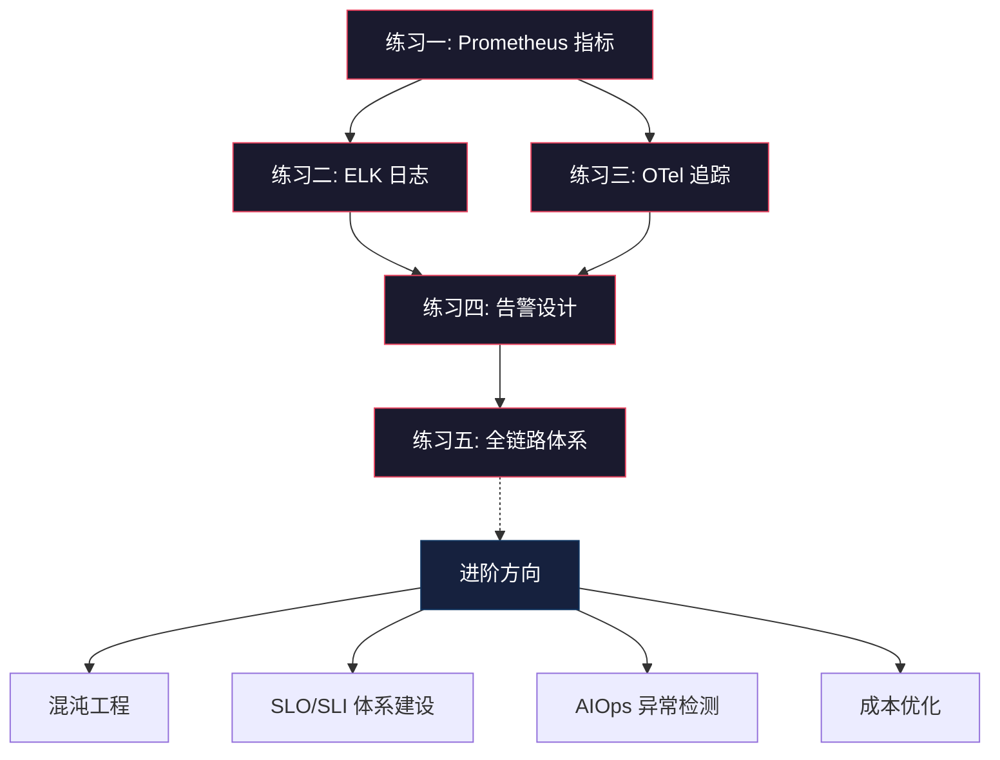

## 练习方法

本章提供五个递进式练习，从基础概念理解到完整可观测性体系搭建。每个练习都基于真实技术栈（Prometheus、Grafana、OpenTelemetry、ELK），包含可直接执行的命令和配置。建议按顺序完成，总时长约 5-6 小时。


---

### 练习一：Prometheus 指标采集与查询（预计 60 分钟）

**目标**：独立搭建 Prometheus + Grafana 监控栈，掌握指标的四种类型、PromQL 查询语言，以及自定义业务指标的暴露方式。

**前置条件**：Docker 已安装，端口 9090 和 3000 未被占用。

#### 步骤一：启动 Prometheus + Grafana（15 分钟）

```yaml
# docker-compose.yml
version: '3.8'
services:
  prometheus:
    image: prom/prometheus:v2.51.0
    ports:
      - "9090:9090"
    volumes:
      - ./prometheus.yml:/etc/prometheus/prometheus.yml
    command:
      - '--config.file=/etc/prometheus/prometheus.yml'
      - '--storage.tsdb.retention.time=15d'

  grafana:
    image: grafana/grafana:10.4.0
    ports:
      - "3000:3000"
    environment:
      GF_SECURITY_ADMIN_PASSWORD: admin
    volumes:
      - grafana_data:/var/lib/grafana

volumes:
  grafana_data:
```

```yaml
# prometheus.yml
global:
  scrape_interval: 15s
  evaluation_interval: 15s

scrape_configs:
  - job_name: 'prometheus'
    static_configs:
      - targets: ['localhost:9090']

  - job_name: 'node-exporter'
    static_configs:
      - targets: ['node-exporter:9100']
```

```bash
# 添加 node-exporter 到 docker-compose.yml，然后启动
docker compose up -d
# 验证 Prometheus 启动
curl -s http://localhost:9090/-/healthy
# 验证 Grafana 启动
curl -s -o /dev/null -w "%{http_code}" http://localhost:3000/api/health
```

#### 步骤二：理解四种指标类型（15 分钟）

Prometheus 定义了四种指标类型，每种解决不同的度量场景。用 PromQL 逐一验证：

| 指标类型 | 语义 | 典型场景 | 累积方式 | PromQL 示例 |
|---------|------|---------|---------|------------|
| **Counter** | 单调递增的计数器 | HTTP 请求总数、错误总数 | 只增不减，重启归零 | `rate(http_requests_total[5m])`（每秒速率） |
| **Gauge** | 可任意增减的瞬时值 | CPU 使用率、内存占用、队列长度 | 实时读取 | `node_memory_MemAvailable_bytes` |
| **Histogram** | 将观测值分桶统计 | 请求延迟分布、响应体大小 | 每个桶独立计数 | `histogram_quantile(0.99, rate(http_request_duration_seconds_bucket[5m]))` |
| **Summary** | 客户端计算分位数 | 类似 Histogram，但分位数在客户端算 | 滑动窗口内计算 | `http_request_duration_seconds{quantile="0.99"}` |

**关键区别——Histogram vs Summary**：

# Histogram: 服务端聚合，支持跨实例聚合
# 原始数据被分到预定义桶中：
# http_request_duration_seconds_bucket{le="0.1"}  8000
# http_request_duration_seconds_bucket{le="0.5"}  9500
# http_request_duration_seconds_bucket{le="1.0"}  9900
# http_request_duration_seconds_bucket{le="+Inf"} 10000

# Summary: 客户端计算，不支持跨实例聚合
# http_request_duration_seconds{quantile="0.5"}  0.12
# http_request_duration_seconds{quantile="0.99"} 0.85

> **实践建议**：大多数场景优先使用 Histogram。Summary 仅在不需要跨实例聚合、且需要精确客户端分位数时使用。Histogram 允许你事后调整分位数计算的桶边界，Summary 则无法回溯。

#### 步骤三：用 Go 编写自定义 Exporter（20 分钟）

```go
package main

import (
    "math/rand"
    "net/http"
    "time"

    "github.com/prometheus/client_golang/prometheus"
    "github.com/prometheus/client_golang/prometheus/promhttp"
)

// 定义业务指标
var (
    // Counter: 订单处理总数
    ordersTotal = prometheus.NewCounterVec(
        prometheus.CounterOpts{
            Namespace: "business",
            Subsystem: "orders",
            Name:      "total",
            Help:      "Total number of orders processed.",
        },
        []string{"status"}, // status: success / failed / timeout
    )

    // Histogram: 订单处理耗时
    orderDuration = prometheus.NewHistogramVec(
        prometheus.HistogramOpts{
            Namespace: "business",
            Subsystem: "orders",
            Name:      "duration_seconds",
            Help:      "Order processing duration in seconds.",
            Buckets:   []float64{0.01, 0.05, 0.1, 0.5, 1, 2, 5, 10},
        },
        []string{"operation"}, // operation: create / pay / ship
    )

    // Gauge: 当前待处理订单数
    pendingOrders = prometheus.NewGauge(
        prometheus.GaugeOpts{
            Namespace: "business",
            Subsystem: "orders",
            Name:      "pending",
            Help:      "Number of orders currently pending.",
        },
    )
)

func init() {
    prometheus.MustRegister(ordersTotal, orderDuration, pendingOrders)
}

func simulateOrderProcessing() {
    for {
        // 模拟订单创建
        duration := 0.05 + rand.Float64()*0.5
        status := "success"
        if rand.Float64() < 0.05 {
            status = "failed"
        }

        timer := prometheus.NewTimer(
            orderDuration.WithLabelValues("create"),
        )
        time.Sleep(time.Duration(duration * float64(time.Second)))
        timer.ObserveDuration()

        ordersTotal.WithLabelValues(status).Inc()
        pendingOrders.Inc()
        time.Sleep(100 * time.Millisecond)
        pendingOrders.Dec()
    }
}

func main() {
    go simulateOrderProcessing()
    http.Handle("/metrics", promhttp.Handler())
    http.ListenAndServe(":8080", nil)
}
```

```bash
# 运行自定义 Exporter
go mod init demo &amp;&amp; go mod tidy
go run main.go &amp;

# 验证指标已暴露
curl -s http://localhost:8080/metrics | grep business_orders

# 在 Prometheus 中查询
# 在 http://localhost:9090/graph 输入：
# rate(business_orders_total[1m])                    # 每秒订单速率
# histogram_quantile(0.99, rate(business_orders_duration_seconds_bucket[5m]))  # P99延迟
# business_orders_pending                             # 当前待处理数
```

#### 步骤四：在 Grafana 中构建仪表盘（10 分钟）

在 Grafana 中创建 Dashboard，添加以下三个面板：

| 面板名称 | 类型 | PromQL 表达式 | 说明 |
|---------|------|--------------|------|
| 订单吞吐量 | Time Series | `sum(rate(business_orders_total[5m])) by (status)` | 按状态分组的每秒订单数 |
| 订单延迟分布 | Heatmap | `rate(business_orders_duration_seconds_bucket[5m])` | 延迟的热力图分布 |
| 待处理订单 | Stat | `business_orders_pending` | 实时待处理队列长度 |

**检查标准**：

- [ ] Prometheus 和 Grafana 均正常启动（端口可达）
- [ ] 能在 Prometheus UI 中执行 PromQL 并看到自定义指标数据
- [ ] 能区分 Counter / Gauge / Histogram 的语义差异和使用场景
- [ ] 能解释 `rate()` 和 `irate()` 的区别：`rate()` 计算区间平均速率（适合告警），`irate()` 基于最后两个点计算瞬时速率（适合仪表盘）
- [ ] Grafana 仪表盘包含至少 3 个有效面板且数据正常刷新

---

### 练习二：结构化日志与 ELK 集成（预计 70 分钟）

**目标**：搭建 ELK（Elasticsearch + Logstash + Kibana）日志管道，将应用日志从文本变为可查询、可聚合的结构化数据。

**前置条件**：Docker 内存分配 ≥ 4GB（Elasticsearch 较耗内存）。

#### 步骤一：搭建 ELK 栈（20 分钟）

```yaml
# docker-compose-elk.yml
version: '3.8'
services:
  elasticsearch:
    image: docker.elastic.co/elasticsearch/elasticsearch:8.13.0
    environment:
      - discovery.type=single-node
      - xpack.security.enabled=false
      - "ES_JAVA_OPTS=-Xms512m -Xmx512m"
    ports:
      - "9200:9200"

  logstash:
    image: docker.elastic.co/logstash/logstash:8.13.0
    volumes:
      - ./logstash.conf:/usr/share/logstash/pipeline/logstash.conf
    ports:
      - "5044:5044"   # Beats input
      - "9600:9600"   # Monitoring API
    depends_on:
      - elasticsearch

  kibana:
    image: docker.elastic.co/kibana/kibana:8.13.0
    ports:
      - "5601:5601"
    depends_on:
      - elasticsearch
```

```ruby
# logstash.conf — 结构化日志解析管道
input {
  beats {
    port => 5044
  }
  # 同时支持从文件读取（开发环境）
  file {
    path => "/var/log/app/*.log"
    codec => json
  }
}

filter {
  # 如果日志不是 JSON，用 Grok 解析非结构化文本
  if ![trace_id] {
    grok {
      match => {
        "message" => "%{TIMESTAMP_ISO8601:timestamp} %{LOGLEVEL:level} \[%{DATA:service}\] %{GREEDYDATA:msg}"
      }
    }
  }

  # 日期解析
  date {
    match => ["timestamp", "ISO8601"]
    target => "@timestamp"
  }

  # 添加环境标签
  mutate {
    add_field => { "environment" => "practice" }
  }

  # 移除不需要的字段
  mutate {
    remove_field => ["timestamp", "host"]
  }
}

output {
  elasticsearch {
    hosts => ["http://elasticsearch:9200"]
    index => "app-logs-%{+YYYY.MM.dd}"
  }
}
```

```bash
# 启动 ELK 栈
docker compose -f docker-compose-elk.yml up -d

# 等待 Elasticsearch 就绪（约 30 秒）
until curl -s http://localhost:9200/_cluster/health | grep -q '"status":"green"\|"status":"yellow"'; do
  echo "等待 Elasticsearch..."
  sleep 5
done
echo "Elasticsearch 就绪"

# 验证 Kibana 可访问
curl -s -o /dev/null -w "%{http_code}" http://localhost:5601/api/status
```

#### 步骤二：理解结构化日志的字段设计（15 分钟）

对比非结构化日志与结构化日志的信息密度差异：

# 非结构化日志 — 人类可读，机器难查
2024-01-15 14:32:01 ERROR [order-service] Failed to process order ORD-789 for user U-456: connection timeout to payment-gateway after 5000ms

# 结构化日志 — 机器可查，人类也易读
{
  "timestamp": "2024-01-15T14:32:01.123Z",
  "level": "ERROR",
  "service": "order-service",
  "trace_id": "abc123def456",
  "span_id": "span789",
  "message": "Failed to process order",
  "order_id": "ORD-789",
  "user_id": "U-456",
  "error": {
    "type": "ConnectionTimeout",
    "message": "connection timeout after 5000ms",
    "target": "payment-gateway"
  },
  "duration_ms": 5012,
  "environment": "production"
}

**字段设计规范**：

| 字段 | 必填 | 说明 | 示例值 |
|------|------|------|--------|
| `timestamp` | 是 | ISO 8601 格式，含时区 | `2024-01-15T14:32:01.123Z` |
| `level` | 是 | 日志级别，全大写 | `INFO` / `WARN` / `ERROR` |
| `service` | 是 | 服务名，与 K8s deployment 同名 | `order-service` |
| `trace_id` | 是 | 分布式追踪 ID，128-bit hex | `abc123def456...` |
| `span_id` | 是 | 当前 span ID | `span789` |
| `message` | 是 | 人可读的事件描述 | `"Order created"` |
| `error.type` | 条件 | 错误发生时必填 | `"ConnectionTimeout"` |
| `error.stack_trace` | 条件 | 未预期异常时必填 | `"at com.example...` |

> **关键原则**：如果你发现一条日志不需要任何人做任何事，它就不应该存在。每条日志都应该对应一个可操作的信号——要么是信息性的上下文记录（用于追踪），要么是需要响应的事件（告警或排查）。

#### 步骤三：模拟多服务日志并查询（25 分钟）

```python
#!/usr/bin/env python3
"""生成模拟的多服务结构化日志，用于 ELK 练习"""
import json
import random
import time
import uuid
from datetime import datetime, timezone

SERVICES = ["gateway", "order-service", "payment-service", "inventory-service"]
ERRORS = [
    {"type": "ConnectionTimeout", "message": "upstream timeout after 3000ms"},
    {"type": "DatabaseError", "message": "deadlock detected on table orders"},
    {"type": "ValidationError", "message": "required field 'amount' is missing"},
    {"type": "RateLimitExceeded", "message": "client exceeded 100 req/s limit"},
]

def generate_log():
    trace_id = uuid.uuid4().hex
    span_id = uuid.uuid4().hex[:16]
    service = random.choice(SERVICES)
    is_error = random.random() < 0.15  # 15% 错误率

    log = {
        "timestamp": datetime.now(timezone.utc).isoformat(),
        "level": "ERROR" if is_error else random.choice(["INFO", "DEBUG"]),
        "service": service,
        "trace_id": trace_id,
        "span_id": span_id,
        "environment": "practice",
    }

    if service == "order-service":
        log["message"] = "Order processing completed"
        log["order_id"] = f"ORD-{random.randint(1000, 9999)}"
        log["user_id"] = f"U-{random.randint(1, 5000)}"
        log["duration_ms"] = random.randint(10, 2000)
    elif service == "payment-service":
        log["message"] = "Payment processed"
        log["payment_id"] = f"PAY-{random.randint(10000, 99999)}"
        log["amount"] = round(random.uniform(1, 5000), 2)
        log["duration_ms"] = random.randint(50, 5000)
    elif service == "inventory-service":
        log["message"] = "Stock check completed"
        log["sku"] = f"SKU-{random.randint(100, 999)}"
        log["available"] = random.randint(0, 100)
    else:
        log["message"] = "Request routed"
        log["method"] = random.choice(["GET", "POST", "PUT"])
        log["path"] = random.choice(["/api/orders", "/api/payments", "/api/inventory"])
        log["status_code"] = random.choice([200, 200, 200, 200, 500, 503])

    if is_error:
        error = random.choice(ERRORS)
        log["error"] = error
        log["level"] = "ERROR"

    return json.dumps(log)

# 每秒生成 5-20 条日志
for _ in range(500):
    print(generate_log(), flush=True)
    time.sleep(random.uniform(0.05, 0.2))
```

```bash
# 运行日志生成器，输出到文件
python3 generate_logs.py > /tmp/app.log &amp;

# 在 Kibana 中创建 Data View：
# 1. 打开 http://localhost:5601
# 2. Management → Stack Management → Data Views → Create data view
# 3. Name: app-logs, Pattern: app-logs-*

# 在 Kibana Discover 中尝试以下查询：
# 1. 按服务过滤：service.name: "payment-service"
# 2. 按错误类型：error.type: "ConnectionTimeout"
# 3. 按延迟范围：duration_ms > 1000
# 4. 组合查询：service: "order-service" AND level: "ERROR" AND duration_ms > 500
# 5. 排除调试日志：NOT level: "DEBUG"
# 6. 按 trace_id 追踪请求链路：trace_id: "abc123..."
```

#### 步骤四：用 Kibana Lens 构建日志分析面板（10 分钟）

在 Kibana 中创建以下可视化面板：

| 面板名称 | 可视化类型 | 配置说明 |
|---------|-----------|---------|
| 各服务错误率 | Bar Chart | X 轴: service, Y 轴: count, Filter: level:ERROR |
| 错误类型分布 | Pie Chart | 按 error.type 聚合 |
| 请求延迟趋势 | Line Chart | X 轴: timestamp, Y 轴: P99(duration_ms) |
| 按 trace_id 的请求追踪 | Data Table | 显示 trace_id, service, message, duration_ms, level |

**检查标准**：

- [ ] ELK 栈三个组件均正常启动
- [ ] 能在 Kibana Discover 中搜索到结构化日志
- [ ] 能使用 KQL 语法进行多条件组合查询
- [ ] 理解结构化日志与非结构化日志的核心区别
- [ ] 能解释为什么 `trace_id` 是连接日志与追踪的桥梁

---

### 练习三：OpenTelemetry 分布式追踪（预计 70 分钟）

**目标**：理解分布式追踪的原理（Trace / Span / Context Propagation），使用 OpenTelemetry SDK 为一个多服务应用添加追踪，将数据导出到 Jaeger 可视化。

**前置条件**：Docker 已安装。

#### 步骤一：启动 Jaeger（10 分钟）

```yaml
# docker-compose-jaeger.yml
version: '3.8'
services:
  jaeger:
    image: jaegertracing/all-in-one:1.55
    ports:
      - "16686:16686"  # Jaeger UI
      - "4317:4317"    # OTLP gRPC
      - "4318:4318"    # OTLP HTTP
    environment:
      COLLECTOR_OTLP_ENABLED: true
```

```bash
docker compose -f docker-compose-jaeger.yml up -d
# 验证 Jaeger UI
curl -s -o /dev/null -w "%{http_code}" http://localhost:16686/
```

#### 步骤二：理解追踪核心概念（15 分钟）

**Trace、Span、Context Propagation 的关系**：

Trace（请求链路）：一次用户请求在多个服务间的完整生命周期

TraceID: abc-123-def-456
│
├─ Span: gateway (10ms)
│  ├─ SpanID: s1
│  ├─ ParentSpanID: -
│  ├─ Status: OK
│  └─ Attributes: http.method=POST, http.url=/api/orders
│
├─ Span: order-service (50ms)
│  ├─ SpanID: s2
│  ├─ ParentSpanID: s1
│  ├─ Status: OK
│  └─ Attributes: db.statement="INSERT INTO orders..."
│
├─ Span: payment-service (200ms)
│  ├─ SpanID: s3
│  ├─ ParentSpanID: s2
│  ├─ Status: ERROR
│  └─ Attributes: payment.provider=stripe, error.type=Timeout
│
└─ Span: inventory-service (30ms)
   ├─ SpanID: s4
   ├─ ParentSpanID: s2
   ├─ Status: OK
   └─ Attributes: inventory.sku=SKU-123, inventory.available=5

**Context Propagation（上下文传播）机制**：

上下文传播是分布式追踪最关键的基础设施——它决定了 TraceID 如何跨服务边界传递。没有正确的传播，各服务的 Span 将变成孤立的片段，无法组装成完整的链路。

| 传播方式 | 载体 | 适用场景 | 标准 |
|---------|------|---------|------|
| W3C TraceContext | HTTP Header: `traceparent` | HTTP/gRPC 调用（推荐） | W3C 标准 |
| B3 (Zipkin) | HTTP Header: `X-B3-TraceId` | Zipkin 生态兼容 | Zipkin 标准 |
| Jaeger | HTTP Header: `uber-trace-id` | Jaeger 生态兼容 | Jaeger 私有 |
| OpenTracing | HTTP Header: `traceparent` | 已废弃，被 W3C 取代 | 已废弃 |

> **W3C TraceContext Header 格式**：`traceparent: 00-abc123def456-span789-01`
> - `00`：版本号
> - `abc123def456`：TraceID（128-bit）
> - `span789`：ParentSpanID（64-bit）
> - `01`：Trace Flags（01 = 采样）

#### 步骤三：为多服务应用添加追踪（35 分钟）

```python
# server.py — 一个模拟的多服务调用链
import time
import random
import requests
from flask import Flask, request
from opentelemetry import trace
from opentelemetry.sdk.trace import TracerProvider
from opentelemetry.sdk.trace.export import BatchSpanProcessor
from opentelemetry.exporter.otlp.proto.grpc.trace_exporter import OTLPSpanExporter
from opentelemetry.sdk.resources import Resource
from opentelemetry.instrumentation.flask import FlaskInstrumentor
from opentelemetry.instrumentation.requests import RequestsInstrumentor

# 初始化 OpenTelemetry
resource = Resource.create({
    "service.name": "order-service",
    "service.version": "1.0.0",
    "deployment.environment": "practice",
})
provider = TracerProvider(resource=resource)
processor = BatchSpanProcessor(
    OTLPSpanExporter(endpoint="http://localhost:4317")
)
provider.add_span_processor(processor)
trace.set_tracer_provider(provider)

app = Flask(__name__)
FlaskInstrumentor().instrument_app(app)       # 自动追踪 HTTP 入站
RequestsInstrumentor().instrument()            # 自动追踪 HTTP 出站

tracer = trace.get_tracer("order-service", "1.0.0")

@app.route("/api/orders", methods=["POST"])
def create_order():
    with tracer.start_as_current_span("validate_order") as span:
        span.set_attribute("order.item_count", 3)
        time.sleep(random.uniform(0.005, 0.02))  # 模拟验证

    with tracer.start_as_current_span("check_inventory") as span:
        # 调用 inventory-service（自动传播 traceparent header）
        resp = requests.get("http://localhost:5002/api/inventory/SKU-123")
        span.set_attribute("inventory.available", resp.json().get("available", 0))
        time.sleep(random.uniform(0.01, 0.05))

    with tracer.start_as_current_span("process_payment") as span:
        resp = requests.post("http://localhost:5003/api/payments", json={
            "order_id": "ORD-789",
            "amount": 299.99
        })
        span.set_attribute("payment.status", resp.json().get("status"))
        span.set_attribute("payment.amount", 299.99)

        if resp.status_code != 200:
            span.set_status(trace.StatusCode.ERROR, "Payment failed")
            span.record_exception(Exception("Payment declined"))
        time.sleep(random.uniform(0.1, 0.3))

    return {"status": "created", "order_id": "ORD-789"}, 201

if __name__ == "__main__":
    app.run(port=5001)
```

```bash
# 安装依赖
pip install flask opentelemetry-api opentelemetry-sdk \
    opentelemetry-exporter-otlp-proto-grpc \
    opentelemetry-instrumentation-flask \
    opentelemetry-instrumentation-requests requests

# 启动服务（3 个终端分别运行）
python server.py                                           # port 5001 (order-service)

# 另外两个简化服务：
python -c "
from flask import Flask, json; app = Flask(__name__)
@app.route('/api/inventory/<sku>')
def check(sku): return {'sku': sku, 'available': random.randint(0, 100)}
import random; app.run(port=5002)
"

python -c "
from flask import Flask, json; app = Flask(__name__)
@app.route('/api/payments', methods=['POST'])
def pay(): return {'status': 'success', 'transaction_id': 'TXN-999'}
import random; app.run(port=5003)
"

# 发送请求触发追踪
curl -X POST http://localhost:5001/api/orders -d '{}'

# 打开 Jaeger UI：http://localhost:16686
# 选择 service: order-service → Find Traces
```

#### 步骤四：在 Jaeger 中分析追踪数据（10 分钟）

在 Jaeger UI 中找到刚才的 Trace，分析以下信息：

| 分析维度 | 观察点 | 意义 |
|---------|--------|------|
| Span 时间轴 | 每个 Span 的起止时间和耗时 | 识别延迟最重的环节 |
| 关键路径 | 整条 Trace 的总耗时 | 等于最长子链路的耗时 |
| Span 属性 | 自定义 Attribute（如 order.item_count） | 丰富排查上下文 |
| 错误标记 | Status: ERROR 的 Span | 快速定位故障服务 |
| 跨服务边界 | traceparent header 是否正确传递 | 验证上下文传播是否正常 |

**检查标准**：

- [ ] Jaeger 能显示完整的调用链路（gateway → order → payment → inventory）
- [ ] 能通过 TraceID 将一条请求在所有服务中的 Span 串联起来
- [ ] 理解 W3C TraceContext Header 的格式和各字段含义
- [ ] 能解释为什么 OpenTelemetry 推荐使用 SDK + OTLP 导出而非直接对接特定后端
- [ ] 能在 Jaeger 中识别出延迟最大的 Span 及其原因

---

### 练习四：告警规则设计与分级响应（预计 60 分钟）

**目标**：设计一套基于 SLO 的告警体系，避免告警疲劳，掌握告警分级、降噪和响应流程。

#### 步骤一：理解告警分级模型（15 分钟）

**四级告警模型**：

| 级别 | 名称 | 响应时效 | 通知方式 | 升级条件 | 典型场景 |
|------|------|---------|---------|---------|---------|
| P0 | 致命 | ≤ 5 分钟 | 电话 + 短信 + IM | 5 分钟未确认自动升级 | 核心交易链路完全中断 |
| P1 | 严重 | ≤ 15 分钟 | 短信 + IM | 15 分钟未处理自动升级 | 核心功能降级，影响 >10% 用户 |
| P2 | 警告 | ≤ 1 小时 | IM + 邮件 | 工作时间未处理升级 | 非核心功能异常，或性能缓慢 |
| P3 | 信息 | 下个工作日 | 邮件 | 不升级 | 预警趋势、资源使用接近阈值 |

**告警疲劳的量化评估**：

告警疲劳指标：
  告警总量/月        → 目标：≤ 50 条/月/团队
  误报率             → 目标：< 10%
  深夜告警占比       → 目标：< 5%
  平均响应时间       → P0: ≤ 5min, P1: ≤ 15min
  告警 → 有效工单转化率 → 目标：> 60%

#### 步骤二：编写 Prometheus 告警规则（25 分钟）

```yaml
# prometheus-rules.yml
groups:
  - name: slo_alerts
    rules:
      # ============================================
      # P0: 核心交易链路完全中断
      # ============================================
      - alert: OrderServiceDown
        expr: up{job="order-service"} == 0
        for: 1m
        labels:
          severity: critical
          team: platform
        annotations:
          summary: "🔴 订单服务不可用"
          description: "订单服务实例 {{ $labels.instance }} 已超过 1 分钟未上报指标"
          runbook_url: "https://wiki.example.com/runbook/order-service-down"
          slo_budget_remaining: "消耗 5% 月度预算/分钟"

      - alert: OrderErrorRateCritical
        expr: |
          (
            sum(rate(business_orders_total{status="failed"}[5m]))
            /
            sum(rate(business_orders_total[5m]))
          ) > 0.05
        for: 2m
        labels:
          severity: critical
          team: platform
        annotations:
          summary: "🔴 订单错误率超 5%"
          description: "当前错误率 {{ $value | humanizePercentage }}，持续超过 2 分钟"

      # ============================================
      # P1: 核心功能降级
      # ============================================
      - alert: OrderLatencyHigh
        expr: |
          histogram_quantile(0.99,
            sum(rate(business_orders_duration_seconds_bucket[5m])) by (le)
          ) > 2
        for: 5m
        labels:
          severity: high
          team: platform
        annotations:
          summary: "🟡 订单 P99 延迟超过 2 秒"
          description: "当前 P99 延迟 {{ $value }}s，影响约 1% 的订单处理"

      - alert: DatabaseConnectionPoolExhausted
        expr: |
          db_connection_pool_active / db_connection_pool_max > 0.85
        for: 3m
        labels:
          severity: high
          team: platform
        annotations:
          summary: "🟡 数据库连接池使用率超过 85%"
          description: "当前使用率 {{ $value | humanizePercentage }}，即将耗尽"

      # ============================================
      # P2: 非核心功能异常
      # ============================================
      - alert: CacheHitRateLow
        expr: |
          cache_hit_rate < 0.7
        for: 10m
        labels:
          severity: warning
          team: platform
        annotations:
          summary: "🟠 缓存命中率低于 70%"
          description: "当前命中率 {{ $value | humanizePercentage }}，可能导致数据库压力上升"

      # ============================================
      # P3: 趋势预警
      # ============================================
      - alert: DiskSpaceWillFillIn7Days
        expr: |
          predict_linear(node_filesystem_avail_bytes[1d], 7 * 24 * 3600) < 0
        for: 30m
        labels:
          severity: info
          team: sre
        annotations:
          summary: "🔵 磁盘空间预计 7 天内耗尽"
          description: "当前可用 {{ $value | humanize1024 }}B，按当前趋势将耗尽"
```

#### 步骤三：设计静默规则和路由（10 分钟）

告警分级只是第一步，还需要解决"告警太多"的问题：

```yaml
# Alertmanager 配置：按级别路由到不同通道
route:
  receiver: 'default'
  group_by: ['alertname', 'cluster', 'service']
  group_wait: 30s        # 首次告警等待 30s 聚合同组
  group_interval: 5m     # 同组后续告警间隔
  repeat_interval: 4h    # 未恢复的告警重复间隔
  routes:
    - match:
        severity: critical
      receiver: 'pager'
      group_wait: 10s    # P0 告警立即发送
    - match:
        severity: high
      receiver: 'slack-high'
    - match:
        severity: warning
      receiver: 'slack-warning'
      group_interval: 15m  # P2 告警更长聚合窗口
    - match:
        severity: info
      receiver: 'email-sre'

# 静默规则：维护窗口自动静默
# 在 Prometheus UI → Alertmanager → Silences 中配置
# 或通过 API：
# curl -X POST http://localhost:9093/api/v2/silences -d '{
#   "matchers": [{"name": "job", "value": "order-service"}],
#   "startsAt": "2024-06-01T02:00:00Z",
#   "endsAt": "2024-06-01T04:00:00Z",
#   "createdBy": "kyle",
#   "comment": "维护窗口静默"
# }'
```

#### 步骤四：模拟告警并验证分级响应（10 分钟）

```bash
# 模拟服务宕机（触发 P0）
docker stop <order-service-container>
# 观察：应在 1 分钟内触发 OrderServiceDown 告警
# 确认收到电话/短信通知

# 恢复服务
docker start <order-service-container>

# 模拟高延迟（触发 P1）
# 在代码中加入 sleep: time.sleep(3)
# 观察：应在 5 分钟内触发 OrderLatencyHigh 告警

# 验证静默规则
# 在维护窗口期间触发告警，确认被自动静默
```

**检查标准**：

- [ ] 能解释 P0-P3 四级告警的定义标准和响应时效
- [ ] 编写的告警规则包含 `for` 持续时间（避免瞬时抖动触发）
- [ ] 每条告警规则都有 `annotations`（summary、description、runbook_url）
- [ ] 能设计合理的聚合策略（group_wait、group_interval）
- [ ] 理解告警疲劳的成因和缓解措施

---

### 练习五：全链路可观测性体系搭建（预计 90 分钟）

**目标**：将前四个练习的技术栈整合为一个完整的可观测性体系，实现三大支柱（Metrics + Logs + Traces）的关联查询，构建"从告警到根因"的一站式排障流程。

#### 步骤一：架构设计（20 分钟）

**目标架构**：

┌─────────────────────────────────────────────────────┐
│                    应用层                             │
│  ┌──────────┐  ┌──────────┐  ┌──────────┐           │
│  │ 服务 A   │  │ 服务 B   │  │ 服务 C   │           │
│  │ OTel SDK │  │ OTel SDK │  │ OTel SDK │           │
│  └────┬─────┘  └────┬─────┘  └────┬─────┘           │
│       │              │              │                 │
│       ▼              ▼              ▼                 │
│  ┌──────────────────────────────────────┐            │
│  │       OTel Collector                 │            │
│  │  ┌─────────┐ ┌────────┐ ┌────────┐  │            │
│  │  │ Traces  │ │ Metrics│ │ Logs   │  │            │
│  │  │ Exporter│ │Exporter│ │Exporter│  │            │
│  │  └────┬────┘ └───┬────┘ └───┬────┘  │            │
│  └───────┼──────────┼──────────┼────────┘            │
└──────────┼──────────┼──────────┼─────────────────────┘
           ▼          ▼          ▼
    ┌──────────┐ ┌────────┐ ┌──────────┐
    │  Jaeger  │ │Promet. │ │ELK Stack │
    │  (Traces)│ │(Metrics│ │  (Logs)  │
    └──────────┘ └────────┘ └──────────┘
           │          │          │
           ▼          ▼          ▼
    ┌─────────────────────────────────────┐
    │           Grafana                    │
    │  Metrics │ Traces │ Logs │ Alerts   │
    └─────────────────────────────────────┘

**三大支柱的关联方式**：

| 关联方向 | 关联键 | 实现方式 | 使用场景 |
|---------|--------|---------|---------|
| Trace → Logs | `trace_id` | 日志中注入 `trace_id` 字段 | 从追踪跳转到相关日志 |
| Trace → Metrics | `service.name` + 时间窗口 | Grafana Tempo → Prometheus | 从慢追踪查看当时系统指标 |
| Metrics → Alerts → Traces | 告警标签中的 `service` | Alertmanager → Grafana Dashboard | 从告警直接打开相关追踪 |
| Logs → Trace | `trace_id` | Kibana 查询中过滤 trace_id | 从错误日志追踪完整链路 |

#### 步骤二：部署 OTel Collector 统一采集（25 分钟）

```yaml
# otel-collector-config.yml
receivers:
  otlp:
    protocols:
      grpc:
        endpoint: 0.0.0.0:4317
      http:
        endpoint: 0.0.0.0:4318

processors:
  batch:
    timeout: 5s
    send_batch_size: 1024

  # 添加环境标签
  resource:
    attributes:
      - key: deployment.environment
        value: "practice"
        action: upsert

exporters:
  # 追踪导出到 Jaeger
  otlp/jaeger:
    endpoint: jaeger:4317
    tls:
      insecure: true

  # 指标导出到 Prometheus
  prometheus:
    endpoint: "0.0.0.0:8889"
    namespace: "otel"

  # 日志导出到 Elasticsearch
  elasticsearch:
    endpoints: ["http://elasticsearch:9200"]
    logs_index: "otel-logs"

service:
  pipelines:
    traces:
      receivers: [otlp]
      processors: [batch, resource]
      exporters: [otlp/jaeger]
    metrics:
      receivers: [otlp]
      processors: [batch, resource]
      exporters: [prometheus]
    logs:
      receivers: [otlp]
      processors: [batch, resource]
      exporters: [elasticsearch]
```

```yaml
# 在 docker-compose.yml 中添加 OTel Collector
  otel-collector:
    image: otel/opentelemetry-collector-contrib:0.97.0
    command: ["--config=/etc/otel/config.yml"]
    volumes:
      - ./otel-collector-config.yml:/etc/otel/config.yml
    ports:
      - "4317:4317"
      - "4318:4318"
      - "8889:8889"  # Prometheus metrics endpoint
    depends_on:
      - jaeger
      - elasticsearch
```

#### 步骤三：实现告警到根因的排障流程（30 分钟）

**场景模拟**：模拟一个完整的"告警 → 定位 → 根因分析"流程。

```bash
# 1. 触发告警：人为制造订单服务超时
# 在 order-service 代码中加入：
import time
time.sleep(random.uniform(3, 8))  # 模拟数据库慢查询

# 2. 告警到达
# Grafana Alert → Slack/PagerDuty 通知：
# "🔴 订单错误率超 5%，当前错误率 12.3%"

# 3. 第一步：打开 Grafana SLO Dashboard
# 确认影响范围：
# - 错误率：12.3%（P0 级别）
# - 受影响服务：order-service
# - 受影响时间：过去 5 分钟

# 4. 第二步：跳转到 Traces（Grafana → Tempo）
# 查询：{service.name="order-service"} | select duration > 2000ms
# 找到慢追踪，发现：
# - Trace 总耗时：6.2s
# - order → inventory span: 50ms（正常）
# - order → payment span: 5.8s（异常！）

# 5. 第三步：从 Trace 跳转到 Logs（Grafana → Loki/ELK）
# 使用 trace_id 过滤：
# trace_id: "abc123def456" AND service: "order-service"
# 发现日志：
# ERROR [order-service] Database query timeout: SELECT * FROM orders
#   WHERE user_id = ? AND status = ? took 5500ms

# 6. 第四步：查看当时系统指标
# Prometheus 查询：
# - db_connection_pool_active: 49/50（连接池几乎耗尽）
# - db_query_duration_seconds P99: 4.2s（数据库查询普遍慢）

# 7. 根因定位
# 数据库连接池耗尽 → 慢查询堆积 → 订单服务超时
# 修复：调整连接池大小 + 添加缺失索引

# 8. 验证恢复
# 监控告警自动恢复，指标回到正常范围
```

#### 步骤四：编写排障 Runbook 模板（15 分钟）

每条高优先级告警都应该配备 Runbook（排障手册），降低响应时的决策成本：

```markdown
# Runbook: 订单错误率超 5%

## 告警含义
订单服务的失败率超过 SLO 阈值（5%），意味着超过 1/20 的订单处理失败。

## 影响范围
- 用户无法完成下单、支付
- 收入直接损失（按错误率 × QPS × 平均客单价估算）

## 排障步骤（按顺序执行）

### Step 1: 确认影响（2 分钟）
- [ ] 打开 Grafana SLO Dashboard
- [ ] 确认错误率数值和趋势（上升/平稳/下降）
- [ ] 确认受影响的服务和实例数

### Step 2: 分层定位（5 分钟）
- [ ] 网络层：`curl` 检查服务可达性
- [ ] 应用层：查看 Pod 状态 `kubectl get pods -l app=order-service`
- [ ] 数据层：检查数据库连接 `SHOW PROCESSLIST`

### Step 3: 关联追踪（5 分钟）
- [ ] 在 Grafana Tempo 中搜索最近 5 分钟的慢追踪
- [ ] 点击错误 Span 查看详细属性
- [ ] 使用 trace_id 在 Kibana 中搜索相关日志

### Step 4: 执行修复（视情况）
| 根因 | 修复方案 | 回滚方案 |
|------|---------|---------|
| 数据库慢查询 | 添加索引 / 优化 SQL | 回退代码变更 |
| 连接池耗尽 | 调大连接池 / 排查泄漏 | 重启服务释放连接 |
| 下游服务超时 | 增加超时时间 / 降级 | 回退到上一版本 |

### Step 5: 验证恢复
- [ ] 错误率回落到 1% 以下
- [ ] P99 延迟恢复到 500ms 以内
- [ ] 告警自动解除

## 升级条件
- 10 分钟内无法定位根因 → 升级到 Tech Lead
- 影响范围扩大到 >20% 用户 → 升级到 CTO
- 数据一致性受影响 → 启动数据恢复流程
```

**检查标准**：

- [ ] OTel Collector 成功接收并转发三大支柱数据
- [ ] 能在 Grafana 中通过 TraceID 关联查询日志和追踪
- [ ] 能描述一个完整的"告警 → 定位 → 根因 → 修复 → 验证"流程
- [ ] 编写的 Runbook 包含具体的命令、检查清单和升级条件
- [ ] 理解为什么三大支柱的关联比单一支柱更强大

---

### 学习路径总结



| 练习 | 核心技术 | 预计时间 | 关键产出 |
|------|---------|---------|---------|
| 练习一 | Prometheus + Grafana | 60 分钟 | 自定义指标 Exporter + Dashboard |
| 练习二 | ELK Stack | 70 分钟 | 结构化日志管道 + Kibana 分析面板 |
| 练习三 | OpenTelemetry + Jaeger | 70 分钟 | 多服务分布式追踪 + 链路分析 |
| 练习四 | 告警规则 + Alertmanager | 60 分钟 | SLO 告警规则 + 分级路由 |
| 练习五 | 全链路整合 | 90 分钟 | 三大支柱关联 + Runbook |

**进阶建议**：

- **混沌工程**：在搭建好的可观测性体系上，引入 Chaos Mesh 或 Litmus 进行故障注入，验证告警和排障流程的有效性
- **SLO/SLI 体系建设**：从告警阈值演进到基于错误预算（Error Budget）的决策模型，将可靠性量化管理
- **AIOps 异常检测**：使用时序异常检测算法（如 Prophet、Isolation Forest）替代静态阈值告警，识别渐进式退化
- **成本优化**：分析 Prometheus / ELK 的存储和查询成本，实施数据分层策略（热/温/冷存储），降低 40-60% 的可观测性基础设施成本
