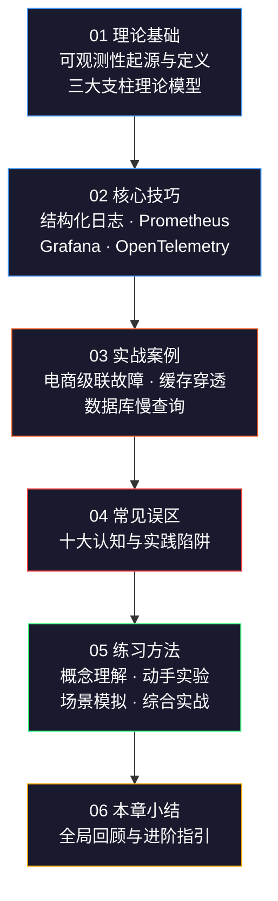
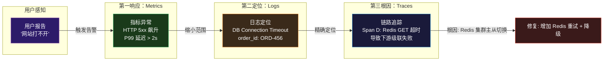
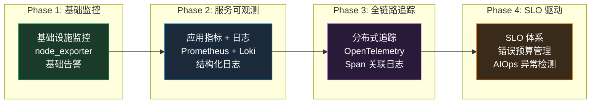

## 本章小结

本章从控制论中的可观测性定义出发，系统构建了现代分布式系统监控与可观测性的完整知识框架。以下是对全章核心内容的提炼与串联，帮助读者建立全局视角、巩固关键认知、明确实践方向。

---

### 一、全章知识脉络

本章六节内容形成了"理论→技术→实践→反思→行动"的完整闭环：



每个阶段的核心命题：

| 阶段 | 核心命题 | 关键收获 |
|------|---------|---------|
| 理论基础 | 可观测性 ≠ 监控，前者回答"未知的未知" | 理解 Kalman 可观测性定义、指标/日志/追踪的数学与工程区别 |
| 核心技巧 | 三大支柱各有最佳实践路径 | 掌握结构化日志设计、PromQL 查询、Grafana Dashboard、OTel 埋点 |
| 实战案例 | 故障排查需要"指标→日志→追踪"的排查路径 | 学会从告警出发，跨支柱关联定位根因 |
| 常见误区 | 多数失败源于认知偏差而非技术问题 | 识别并规避告警泛滥、监控盲区、采样过度等十大陷阱 |
| 练习方法 | 动手实践是内化知识的唯一途径 | 从概念理解到综合实战的四阶练习路径 |

---

### 二、三大支柱的定位与协作

可观测性不是三个独立系统的简单叠加，而是一个有机协作的整体。每个支柱承担不同的诊断职责，彼此互补而非替代：



**定位口诀：指标定趋势，日志定事件，追踪定路径。** 实际排查中，三者的使用顺序几乎总是 Metrics → Logs → Traces，从宏观到微观逐层聚焦。

三大支柱在不同场景下的侧重：

| 场景 | 主要依赖 | 辅助手段 | 说明 |
|------|---------|---------|------|
| 容量规划 | Metrics | — | QPS 趋势、CPU/内存使用率、增长曲线预测 |
| 突发故障 | Metrics + Traces | Logs | 指标先发现异常，追踪快速定位故障服务 |
| 逻辑 Bug | Logs + Traces | Metrics | 业务日志和调用链揭示错误逻辑 |
| 性能优化 | Traces + Metrics | Logs | 追踪找慢 Span，指标量化优化效果 |
| 安全审计 | Logs | — | 结构化日志是审计追踪的核心数据源 |

---

### 三、关键方法论速查

#### 3.1 监控方法论选择

| 方法论 | 适用对象 | 核心指标 | 来源 |
|--------|---------|---------|------|
| **四个黄金信号** | 面向用户的服务 | 延迟、流量、错误率、饱和度 | Google SRE Book |
| **RED 方法论** | 微服务/API | Rate、Errors、Duration | Tom Wilkie (Grafana Labs) |
| **USE 方法论** | 基础设施/资源 | Utilization、Saturation、Errors | Brendan Gregg |

**选择原则：** 用 RED 监控每一个面向用户的服务（"这个服务表现如何？"），用 USE 监控每一台机器和每一个资源（"这个资源够不够用？"），两者叠加形成无盲区的监控覆盖。

#### 3.2 SLO 驱动的可靠性管理

SLO/SLI/SLA 三者形成"承诺→目标→度量"的闭环：

- **SLA**（Service Level Agreement）：面向客户的法律承诺，定义了服务等级和违约后果
- **SLO**（Service Level Objective）：面向团队的内部目标，定义了可量化的可靠性标准
- **SLI**（Service Level Indicator）：面向系统的度量指标，定义了如何测量 SLO 是否达标

错误预算是 SLO 的核心执行工具——它将可靠性问题从"技术争论"转化为"数据决策"。当错误预算充裕时，团队可以大胆创新；当预算告急时，所有人的注意力自动转向稳定性。这种机制避免了"永远在赶功能"和"永远在修 Bug"之间的反复摇摆。

错误预算消耗速率的决策框架：

| 剩余预算 | 策略 | 团队行动 |
|---------|------|---------|
| > 50% | 正常迭代 | 可以推进有风险的架构变更和新功能发布 |
| 25%–50% | 谨慎迭代 | 增加 Code Review 力度，推迟高风险部署 |
| 10%–25% | 可靠性优先 | 暂停功能开发，专注修复已知问题和提升容错能力 |
| < 10% | 冻结变更 | 除安全修复外禁止一切变更，全力恢复可靠性 |
| 耗尽 | 紧急修复 | 回滚近期变更，进入全团队参与的稳定性修复模式 |

#### 3.3 告警设计的黄金法则

好的告警体系应该满足一个标准：**每一条告警都代表一个需要人工介入的真实问题。** 如果你的团队对告警不再紧张，说明告警系统已经失效。

多窗口多烧毁速率（Multi-Window Multi-Burn-Rate）是 Google SRE 验证过的最佳实践：

- **原理：** 用短窗口（5min/30min/6h）检测突发异常，用长窗口（1h/6h/3d）确认持续趋势。只有两个窗口同时确认异常才触发告警
- **效果：** 误报率从传统的 50%+ 降低到 5% 以下，告警疲劳显著缓解
- **配置：** Alertmanager 的 `group_wait`、`group_interval`、`repeat_interval` 三参数协同控制告警收敛行为

告警疲劳的五大对抗手段：

1. **收敛（Grouping）：** 相同来源的告警在 `group_wait` 窗口内合并为一条
2. **抑制（Inhibition）：** P0 触发时自动抑制其下属的 P1/P2 告警
3. **静默（Silencing）：** 计划维护窗口内自动屏蔽相关告警
4. **降级（Throttling）：** 限制同一告警的最大发送频率
5. **定期清理：** 每月回顾告警统计，删除触发但无人处理的"僵尸告警"

---

### 四、技术栈全景与选型指南

#### 4.1 开源技术栈矩阵

| 层级 | 采集层 | 传输层 | 存储层 | 展示层 |
|------|--------|--------|--------|--------|
| **指标** | node_exporter, cAdvisor, OTel SDK | Prometheus Pull / OTLP Push | Prometheus TSDB, VictoriaMetrics, Thanos | Grafana |
| **日志** | Fluent Bit, Filebeat, OTel Logs | Fluent Bit Forward / OTLP | Loki, Elasticsearch, ClickHouse | Grafana, Kibana |
| **追踪** | OTel SDK (auto-instrumentation) | OTLP gRPC | Jaeger, Zipkin, Grafana Tempo | Grafana, Jaeger UI |

#### 4.2 OpenTelemetry：统一标准的必然趋势

OpenTelemetry 不仅是一个工具，更是一个正在成为行业标准的统一层。它的核心价值在于：

- **消除厂商锁定：** 一次埋点，任意后端。今天用 Jaeger，明天切 Tempo，应用代码零改动
- **自动埋点：** 对 HTTP/gRPC/数据库等常见框架自动采集 Trace，大幅降低接入成本
- **标准化语义：** 统一的 Resource 命名（`service.name`）和 Span 属性约定，让不同语言、不同团队的数据可以互通

```python
# OpenTelemetry 三支柱统一接入示例
from opentelemetry import trace, metrics, logs

# 统一初始化
tracer = trace.get_tracer("my-service")
meter = metrics.get_meter("my-service")
logger = logs.get_logger("my-service")

# 指标：自定义业务指标
order_counter = meter.create_counter("orders.total", description="Total orders processed")

# 追踪：自动 + 手动 Span
with tracer.start_as_current_span("process_order") as span:
    span.set_attribute("order.id", order_id)
    order_counter.add(1, {"status": "success"})
    logger.info("Order processed", extra={"order_id": order_id})
```

#### 4.3 商业方案 vs 开源方案

| 维度 | 开源方案（Prometheus + Grafana 全家桶） | 商业方案（Datadog / New Relic） |
|------|----------------------------------------|-------------------------------|
| **成本** | 免费，但需要运维人力 | 按主机/数据量付费，成本随规模线性增长 |
| **灵活性** | 高，可深度定制 | 中，受限于平台功能 |
| **运维负担** | 高，监控系统本身需要监控 | 低，SaaS 免运维 |
| **数据主权** | 数据留在自有集群 | 数据上传到第三方云 |
| **适用团队** | 有 SRE/平台团队的中大型公司 | 小型团队或快速验证期的初创公司 |

**选型建议：** 早期使用开源方案（Prometheus + Grafana）快速搭建，积累监控经验；当团队规模和数据量增长到运维成本不可接受时，再考虑商业方案或混合架构。切忌在没有理解可观测性理念之前就购买昂贵的商业工具。

---

### 五、从理论到落地的实施路线

一个成熟的可观测性建设通常经历四个阶段：



**各阶段关键产出：**

| 阶段 | 核心产出 | 耗时估算 | 前置条件 |
|------|---------|---------|---------|
| Phase 1 | 基础设施 Dashboard + CPU/内存/磁盘告警 | 1-2 周 | 服务器可部署 Exporter |
| Phase 2 | 服务指标面板 + 结构化日志 + Loki 查询 | 2-4 周 | 应用接入 Prometheus SDK |
| Phase 3 | 分布式追踪 + Span-Log 关联 + 调用链可视化 | 4-8 周 | 全服务接入 OTel SDK |
| Phase 4 | SLO 仪表盘 + 错误预算告警 + On-Call 流程 | 8-12 周 | 团队理解 SLO 理念 |

**关键提醒：** 每个阶段都要确保"建了就用"——Dashboard 有人看，告警有人响应，SLO 有人跟踪。建了没人用的监控系统比没有监控更糟糕，因为它给了团队虚假的安全感。

---

### 六、关键公式与速查表

以下公式贯穿本章，是日常运维和架构设计中的高频工具：

| 概念 | 公式 | 典型值 | 实际含义 |
|------|------|--------|---------|
| **SLA 可用性** | 正常运行时间 / 总时间 | 99.95% | 每月允许 21.9 分钟停机 |
| **错误预算** | (1 − SLO) × 时间窗口 | 21.6 分钟/月 | 团队可以"消费"的故障额度 |
| **烧毁速率** | 实际错误率 / SLO 允许错误率 | 14.4x | 1 小时消耗 2% 月度预算 |
| **Little 定律** | L = λ × W | — | 系统内平均请求数 = 到达速率 × 平均处理时间 |
| **尾延迟定律** | P99 ≈ max(各服务 P99) | — | 分布式系统整体 P99 ≈ 最慢服务的 P99 |
| **容量规划** | QPS × 单请求资源 × 安全系数(1.5-2x) | — | 安全系数应对突发流量 |

SLA 等级速查：

| SLA 等级 | 年停机上限 | 月停机上限 | 适用场景 |
|---------|-----------|-----------|---------|
| 99% | 3.65 天 | 7.2 小时 | 内部工具、非关键服务 |
| 99.9% | 8.76 小时 | 43.8 分钟 | 一般业务服务 |
| 99.95% | 4.38 小时 | 21.9 分钟 | 电商、社交平台 |
| 99.99% | 52.6 分钟 | 4.32 分钟 | 支付、金融核心系统 |
| 99.999% | 5.26 分钟 | 26.3 秒 | 电信、医疗生命支持 |

---

### 七、常见陷阱速查

本章第四节详细分析了十大误区，这里提炼为三类根因和对应的防御策略：

| 根因类型 | 典型表现 | 防御策略 |
|---------|---------|---------|
| **认知偏差** | 混淆监控与可观测性；认为"系统正常=业务正常" | 建立四层监控模型（基础设施→中间件→应用→业务），用 SLO 衡量业务健康 |
| **技术债务** | 日志无分级全量输出；追踪上下文未传播 | 结构化日志规范 + OTel 全链路接入；新项目从 Day 1 开始建设 |
| **流程缺失** | 告警无人响应；Runbook 过时；无 On-Call 轮值 | 建立告警→响应→升级→复盘的完整闭环；每月告警质量回顾 |

**最容易被忽视的三个坑：**

1. **监控系统本身没有被监控：** Prometheus 挂了你都不知道。用 `up` 指标 + 独立的外部探测器监控监控系统自身
2. **日志量失控：** DEBUG 级别日志在生产环境未关闭，单日产生 TB 级数据。必须在 CI/CD 流水线中强制校验日志级别配置
3. **告警规则"写了就忘"：** 三个月前为一次线上事故写的告警规则，问题已修复但规则还在。建议每季度进行一次告警规则审计

---

### 八、下一步行动指南

#### 8.1 推荐阅读路径

| 阶段 | 读物 | 核心收获 |
|------|------|---------|
| 入门 | 《Site Reliability Engineering》（Google SRE） | 理解 SLO/错误预算/On-Call 文化的完整理念体系 |
| 进阶 | 《Observability Engineering》（Charity Majors） | 可观测性的设计理念——从"监控系统"到"理解系统"的范式转变 |
| 实操 | 《Prometheus: Up & Running》 | Prometheus 从安装配置到 PromQL 高级查询的完整指南 |
| 标准 | OpenTelemetry 官方文档 (opentelemetry.io) | OTel SDK 各语言接入指南和 Collector 配置参考 |
| 社区 | Grafana Blog + CNCF 可观测性工作组 | 最新的行业趋势和最佳实践案例 |

#### 8.2 推荐实践项目

| 项目 | 难度 | 预计耗时 | 核心技能点 |
|------|------|---------|-----------|
| 搭建完整可观测性栈 | ⭐⭐ | 1 周 | Prometheus + Grafana + Loki + Tempo 全链路部署 |
| 为现有项目接入 OTel | ⭐⭐⭐ | 2 周 | 自动/手动埋点、Span 传播、Collector 配置 |
| 设计并落地 SLO 体系 | ⭐⭐⭐ | 3 周 | SLI 定义、错误预算告警、Dashboard 搭建 |
| 故障注入演练 | ⭐⭐⭐⭐ | 1 周 | Chaos Mesh 部署、网络延迟/Pod 杀死/Pod 驱逐注入 |
| 日志治理专项 | ⭐⭐⭐ | 2 周 | 遗留系统日志分级、结构化改造、成本评估 |

#### 8.3 持续精进的方向

1. **AIOps 与智能告警：** 学习基于时间序列的异常检测（Prophet、Isolation Forest），将"静态阈值"升级为"动态基线"
2. **成本工程：** 研究采样策略（尾采样、自适应采样）、降采样（1m→5m→1h 聚合）、冷热分层存储，平衡可观测性深度与基础设施成本
3. **混沌工程：** 将故障注入从"偶尔演练"升级为"常态化"——Chaos Mesh + LitmusChaos 在 CI/CD 中自动运行，持续验证监控和恢复能力
4. **平台工程：** 将可观测性能力封装为内部平台，通过自助式 Dashboard 和 Self-Service 告警配置赋能业务团队

---

### 总结

监控与可观测性不是"运维的事"，而是整个工程团队的基础能力。一个没有可观测性的分布式系统，就像一辆没有仪表盘的汽车——你不知道它跑得多快、油箱还剩多少、引擎温度是否正常。

全章的核心认知可以浓缩为五句话：

1. **三大支柱缺一不可：** Metrics 定量（趋势和阈值）、Logs 定性（事件和上下文）、Traces 定位（调用链和依赖），三者互补构成完整的可观测性图景
2. **SLO 驱动一切决策：** 用 SLO 和错误预算取代"越多越好"的监控思维，让可靠性投入从"感性争论"变为"数据驱动"
3. **OpenTelemetry 是基础设施：** 统一标准、厂商中立、社区驱动——在 2025 年之后的新项目中，没有理由不使用 OTel
4. **告警是手段不是目的：** 好的告警让人在问题影响用户前介入，差的告警让人麻木到忽略一切。告警质量需要持续经营
5. **可观测性需要三位一体投入：** 工具（技术栈选型与部署）、流程（On-Call 轮值与复盘）、文化（SLO 共识与可靠性意识），缺一不可

掌握本章内容后，你将具备从零设计、分步实施和持续运营一套生产级可观测性系统的完整能力。这不是终点——可观测性是一个持续演进的领域，新的工具和方法论不断涌现，但本章建立的基础框架将帮助你从容应对未来的变化。
