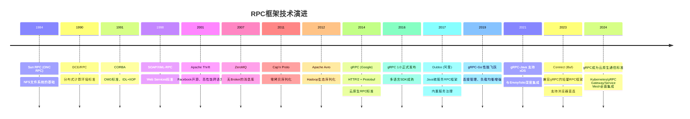
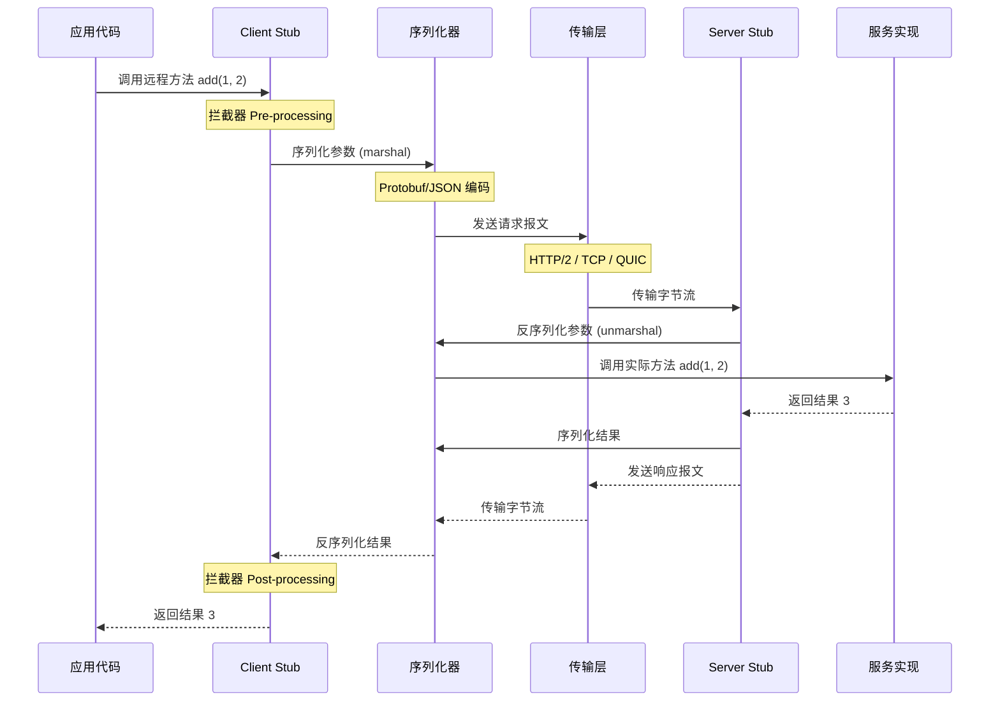

# 第43章 RPC框架 · 章节概览

## 本章定位

RPC（Remote Procedure Call，远程过程调用）是分布式系统中最核心的通信机制，它将复杂的网络通信封装为透明的函数调用，让开发者像调用本地方法一样调用远程服务。在微服务架构已成为主流的今天，RPC框架的选择与使用直接决定了系统的性能上限、可维护性和团队协作效率。

对于后端开发者和架构师而言，理解RPC框架不是"会调接口就行"的表面知识——它涉及序列化编码效率、网络传输模型、服务发现与负载均衡、超时重试与幂等性、安全认证与加密通信等多个维度，每一项都直接影响系统的可靠性与性能表现。以下是一些直观的对比数据：

| 场景 | 技术选型 | 性能差异 |
|------|---------|---------|
| 内部微服务通信 | REST/JSON vs gRPC/Protobuf | 序列化体积差 3-10 倍，编解码速度快 5-100 倍 |
| 高并发调用 | 单连接复用 vs 连接池 | 吞吐量差 2-5 倍，P99 延迟差 30-50% |
| 超时策略 | 无超时 vs 分层超时 | 无超时导致线程泄漏和雪崩；合理超时可快速失败、释放资源 |
| 重试机制 | 盲目重试 vs 指数退避+幂等 | 盲目重试放大流量 2-10 倍引发级联故障 |
| 安全通信 | 明文传输 vs mTLS | 内网嗅探可窃取全部通信内容 |
| 流式传输 | HTTP 长轮询 vs gRPC Streaming | 实时推送延迟从秒级降到毫秒级，带宽消耗降低 60%+ |

理解RPC框架的原理与工程实践，是构建高质量分布式系统的基本功。

## 为什么RPC框架如此重要

### RPC在分布式架构中的核心地位

在微服务体系中，一次用户请求可能触发 5-20 个服务间的 RPC 调用链。以电商下单为例：用户服务 → 商品服务 → 库存服务 → 订单服务 → 支付服务 → 通知服务。如果每次 RPC 调用增加 1ms 的延迟，整条调用链就增加 5-20ms；如果某次调用没有超时控制导致阻塞，整条链路都可能被拖垮。

RPC框架不仅是一个通信工具，它承担着以下关键职责：

- **屏蔽网络复杂性**：序列化/反序列化、连接管理、数据包分帧，让开发者无需关心底层字节流的传输细节
- **保障通信可靠性**：超时控制、重试策略、熔断降级，在网络不稳定时保护系统不被拖垮
- **支撑服务治理**：负载均衡、服务发现、健康检查，让服务实例的上下线对调用方透明
- **确保通信安全**：TLS/mTLS 加密、身份认证、权限控制，在零信任模型下保护服务间通信
- **提供可观测性**：分布式追踪、指标采集、日志关联，让每次调用都有迹可循

### 选择合适的RPC框架

面对 gRPC、Thrift、Dubbo、Cap'n Proto 等众多框架，选型需要综合考虑团队技术栈、性能需求、生态成熟度和运维成本：

| 维度 | gRPC | Apache Thrift | Dubbo | JSON-RPC | REST/HTTP |
|------|------|--------------|-------|----------|-----------|
| 序列化 | Protobuf（二进制） | Binary/Compact（二进制） | Protobuf/JSON | JSON | JSON |
| 传输层 | HTTP/2 | 自定义 TCP | 自定义 TCP | HTTP | HTTP/1.1 或 HTTP/2 |
| 流式支持 | 四种模式 | 不支持 | 不支持 | 不支持 | SSE/WebSocket |
| 跨语言 | 10+ 种语言 | 20+ 种语言 | 主要 Java | 多种 | 所有语言 |
| 代码生成 | protoc + 插件 | thrift 编译器 | dubbo-gen | 无 | OpenAPI |
| 服务治理 | 需外部集成 | 需外部集成 | 内置 | 无 | 需外部集成 |
| 社区生态 | Google 主导，活跃 | Apache 基金会 | 阿里主导 | 轻量 | 最广泛 |
| 适用场景 | 云原生微服务 | 高性能跨语言 | Java 微服务生态 | 简单跨语言 | 对外 API |

## 本章知识图谱

```mermaid
graph TD
    A["RPC框架"] --> B["理论基础"]
    A --> C["核心技巧"]
    A --> D["实战案例"]
    A --> E["常见误区"]
    A --> F["练习与总结"]

    B --> B1["什么是RPC：调用流程与核心组件"]
    B --> B2["IDL与代码生成：Protobuf/Thrift IDL"]
    B --> B3["主流框架对比：gRPC vs Thrift vs Dubbo"]
    B --> B4["协议选型：传输层、序列化、通信模式"]
    B --> B5["序列化性能对比：Protobuf/JSON/MessagePack/Avro"]

    C --> C1["gRPC四种通信模式：Unary/Streaming"]
    C --> C2["拦截器Interceptor：认证、日志、追踪、限流"]
    C --> C3["错误处理：gRPC状态码与错误详情"]
    C --> C4["超时与重试：分层超时、指数退避、重试预算"]
    C --> C5["健康检查：gRPC Health Protocol"]

    D --> D1["案例一：构建生产级gRPC用户服务"]
    D --> D2["案例二：超时与重试导致的级联故障"]
    D --> D3["案例三：mTLS安全通信"]

    E --> E1["设计误区：CRUD映射、版本兼容性、消息体过大"]
    E --> E2["性能误区：连接复用、超时设置、盲目重试"]
    E --> E3["安全误区：内部不加密、证书管理、请求认证"]

    F --> F1["基础：Hello World → Protobuf序列化测试"]
    F --> F2["进阶：拦截器链 → 客户端负载均衡"]
    F --> F3["高级：RPC网关 → 跨数据中心调用 → 版本管理"]
```

## 本章内容结构

本章按照"基础原理 → 框架深入 → 工程实践 → 安全保障 → 误区警示 → 动手实践"的逻辑层层递进，从RPC的哲学思想到生产级部署，构建完整的RPC框架知识体系。

### 第一部分：RPC基本原理（理论基础）

RPC的核心思想是**让远程调用像本地调用一样自然**。本节从餐厅点餐的生活类比入手，逐步揭示RPC的完整调用链路：Client Stub → 序列化 → 网络传输 → 反序列化 → Server Stub → 执行 → 原路返回。

- **调用流程详解**：8步调用链的每一步发生了什么，涉及哪些组件——从应用层发起调用开始，经过Stub代理拦截、参数序列化、网络传输、服务端反序列化、实际方法执行，再到响应原路返回的完整闭环
- **核心组件解析**：Client Stub（客户端代理，负责将本地调用转换为网络请求）、Server Stub（服务端骨架，负责接收请求并调用实际方法）、IDL（接口定义语言，服务间通信的契约）、Serializer（序列化器，负责对象与字节流的转换）、Transport（传输层，负责字节流的可靠传输）
- **RPC vs HTTP API 对比**：从通信效率（二进制 vs 文本）、接口定义（IDL严格约束 vs 自由定义）、传输协议（HTTP/2多路复用 vs HTTP/1.1串行）、适用场景（内部高频调用 vs 对外开放API）四个维度深入对比
- **RPC历史演进**：从 Sun RPC（1985）到 ONC RPC → DCE/RPC → CORBA → SOAP → gRPC（2016）的技术演进脉络，理解每一代RPC框架解决了什么问题、留下了什么遗憾

### 第二部分：IDL与代码生成（理论基础）

IDL（Interface Definition Language）是RPC框架的"契约"，定义了服务接口和消息格式，是跨语言通信的基础。IDL的质量直接决定了API的可维护性和向后兼容能力。

- **Protobuf IDL**：syntax 声明、message 定义、enum 枚举、service 定义、字段编号规则、oneof/optional/repeated/map 等高级特性——重点理解字段编号为何是Protobuf的灵魂（编号一旦分配不可更改），以及如何利用oneof实现消息体的紧凑设计
- **Thrift IDL**：struct/enum/exception/service 定义、required/optional 修饰符、命名空间管理——理解Thrift的required/optional已被废弃的历史背景，以及如何迁移到现代写法
- **代码生成工具**：protoc 编译器与插件体系（grpc-java、grpc-go、grpc-web）、Buf 工具链（现代 Protobuf 管理方案，解决protoc的碎片化问题）、thrift 编译器（支持Java/Python/C++等20+语言的代码生成）
- **Schema演进策略**：向后兼容设计原则（只新增不修改不删除）、reserved 保留字段（防止编号复用）、字段编号的正确使用——这是大规模服务迭代中最容易踩坑的领域，一个错误的字段复用可能导致线上数据错乱

### 第三部分：主流RPC框架对比（理论基础）

在众多RPC框架中选择合适的方案是架构设计的重要决策。本节系统对比 gRPC、Apache Thrift、Dubbo、Cap'n Proto、Apache Arrow Flight 等框架。

- **gRPC**：HTTP/2 + Protobuf，Google 主导，云原生首选——详解HTTP/2多路复用如何解决HTTP/1.1的队头阻塞问题，Protobuf的二进制编码如何实现3-10倍的体积压缩
- **Apache Thrift**：自定义 TCP + 多种序列化，Facebook 开源，极致性能——分析自定义TCP协议相比HTTP/2减少的开销（去掉HTTP头和帧头），以及为何在内部高频调用场景下Thrift比gRPC快20-30%
- **Dubbo**：Java 生态为主，阿里主导，内置服务治理——解析Dubbo的SPI扩展机制如何让开发者自定义负载均衡、路由规则、序列化协议
- **Cap'n Proto**：零拷贝序列化，极致性能，适合超低延迟场景——理解零拷贝原理（直接读取内存中的字段，无需反序列化），以及为何它比Protobuf快一个数量级
- **选型决策树**：根据团队技术栈（Java优先考虑Dubbo，多语言优先gRPC）、性能要求（极致性能考虑Thrift/Cap'n Proto）、生态需求（云原生考虑gRPC，传统Java考虑Dubbo）做出合理选择

### 第四部分：RPC协议选型（理论基础）

RPC框架的协议设计涉及传输层、序列化层和通信模式三个维度的权衡，每一层的选择都会影响整体性能和适用场景。

- **传输层选型**：TCP vs HTTP/2 vs QUIC 的延迟、吞吐量、NATS穿透能力对比——TCP提供最低延迟但缺乏多路复用，HTTP/2通过流复用解决队头阻塞但引入帧头开销，QUIC基于UDP提供0-RTT建连和内置加密，适合移动场景
- **序列化选型**：Protobuf vs JSON vs MessagePack vs Avro vs FlatBuffers 在编码大小、解码速度、Schema演进、跨语言支持等维度的系统对比——Protobuf适合需要Schema约束的场景，MessagePack适合无Schema的轻量交换，FlatBuffers适合游戏和嵌入式场景
- **通信模式选型**：Unary vs Streaming 的适用场景分析——Unary适合简单的请求-响应模式，Server Streaming适合大数据导出和实时推送，Client Streaming适合批量上传，双向流适合实时通信场景
- **负载均衡策略**：客户端负载均衡（gRPC 内置 round_robin/pick_first）vs 服务端负载均衡（Envoy/Nginx）vs Service Mesh（Istio+Envoy）——深入分析每种策略的适用场景、性能影响和运维复杂度

### 第五部分：gRPC四种通信模式（核心技巧）

gRPC提供四种通信模式，覆盖从简单查询到实时双向通信的全场景需求。正确选择通信模式是RPC设计的第一步。

- **Unary RPC（一元调用）**：一请求一响应，最基础的模式，适合普通查询和写操作——最常用的模式，适用于90%的CRUD场景，实现简单，调试方便
- **Server Streaming RPC**：客户端发一个请求，服务端返回一个流，适合大数据导出、实时推送、分页查询——关键在于控制流速（flow control），避免服务端发送过快导致客户端内存溢出
- **Client Streaming RPC**：客户端发送一个流，服务端返回一个响应，适合文件上传、批量导入、日志收集——需要特别注意错误处理：如果流中途失败，已发送的数据如何处理
- **Bidirectional Streaming RPC**：双向独立流，适合实时聊天、状态同步、双向数据管道——最灵活也最复杂的模式，两个流互不依赖，客户端和服务端可以任意顺序发送消息
- **每种模式的完整实现**：服务端代码、客户端代码、错误处理、边界条件（空消息、超大消息、流中断恢复）

### 第六部分：拦截器与中间件（核心技巧）

gRPC拦截器（Interceptor）是实现横切关注点的标准方式，类似于Web框架中的中间件。拦截器是构建生产级RPC服务的必备组件。

- **一元拦截器**：请求/响应前后的处理逻辑——通过 `grpc.UnaryServerInterceptor` 在每次Unary调用前后插入自定义逻辑，是实现认证、日志、追踪的标准方式
- **流式拦截器**：流式RPC的拦截处理——流式拦截器与一元拦截器的关键区别：流式拦截器需要处理流中的每条消息，而非整个请求-响应
- **拦截器链**：多个拦截器的组合与执行顺序——拦截器的执行顺序至关重要：认证拦截器应最先执行（快速拒绝未认证请求），日志拦截器应最后执行（记录完整信息），顺序错误可能导致安全漏洞或性能问题
- **实战拦截器**：
  - 日志记录：请求ID、方法名、耗时、状态码的结构化日志
  - 分布式追踪（OpenTelemetry）：自动生成TraceID/SpanID，跨服务链路追踪
  - JWT认证：验证Token有效性、提取用户身份信息、权限校验
  - 令牌桶限流：控制单个调用方的请求速率，防止突发流量击垮服务
  - 请求ID注入：为每次调用生成唯一ID，支持链路追踪和日志关联
- **客户端拦截器**：请求元数据注入（传递认证Token、链路追踪上下文）、客户端日志、重试拦截（在客户端统一处理重试逻辑）

### 第七部分：错误处理（核心技巧）

gRPC定义了16种标准状态码，正确使用状态码是构建健壮RPC服务的基础。错误处理的质量直接决定了系统的可观测性和可维护性。

- **gRPC状态码详解**：
  - `OK`：请求成功
  - `CANCELLED`：调用被取消（客户端主动取消或超时）
  - `UNKNOWN`：未知错误（通常需要查看服务端日志）
  - `INVALID_ARGUMENT`：参数非法（客户端传参错误）
  - `NOT_FOUND`：资源不存在
  - `ALREADY_EXISTS`：资源已存在（重复创建）
  - `PERMISSION_DENIED`：权限不足（鉴权通过但无权限）
  - `UNAUTHENTICATED`：未认证（缺少或无效的认证信息）
  - `RESOURCE_EXHAUSTED`：资源耗尽（限流触发或内存不足）
  - `FAILED_PRECONDITION`：前置条件不满足（如数据库未就绪）
  - `ABORTED`：操作被中止（如乐观锁冲突）
  - `OUT_OF_RANGE`：超出范围（如分页参数越界）
  - `UNIMPLEMENTED`：方法未实现
  - `INTERNAL`：内部错误（服务端bug）
  - `UNAVAILABLE`：服务不可用（暂时性故障，适合重试）
  - `DEADLINE_EXCEEDED`：超时（调用方设定的截止时间已过）
- **错误详情机制**：通过 `status.WithDetails` 附加结构化错误信息（BadRequest字段校验错误、RetryInfo重试建议、DebugInfo调试信息、ErrorInfo业务错误码），让调用方能精确理解错误原因
- **错误传播**：跨服务的错误码映射（上游服务的INTERNAL不应直接暴露给下游，应包装为适当的业务错误）、错误链追踪（保留完整的错误堆栈和上下文）
- **错误日志分级**：根据状态码选择合适的日志级别——OK/NOT_FOUND用DEBUG，INTERNAL/UNAVAILABLE用ERROR，避免告警疲劳

### 第八部分：超时与重试（核心技巧）

超时和重试是RPC调用中最关键的工程实践，设计不当会导致级联故障。一个没有超时的RPC调用，就像一个没有保险丝的电路——故障会沿着调用链无限传播。

- **分层超时设计**：连接超时（建立TCP连接的时间上限，通常100-500ms）→ 读写超时（单次请求-响应的时间上限）→ 总超时（整个调用链的截止时间），调用链中超时时间逐级递减——例如：网关总超时3s → A服务调用B超时2s → B调用C超时1s
- **指数退避重试**：Base Delay × 2^n + Jitter，避免重试风暴——Jitter（随机抖动）是关键：没有Jitter的指数退避会导致所有客户端在同一时刻重试，形成"重试风暴"
- **重试预算**：限制重试请求占总请求的比例（如10%），防止放大效应——Google SRE实践：当重试比例超过25%时，服务实际上已经过载，重试只会加速崩溃
- **可重试错误类型**：只重试 `UNAVAILABLE`（服务暂时不可用）、`DEADLINE_EXCEEDED`（超时可能是暂时的网络抖动）、`RESOURCE_EXHAUSTED`（资源耗尽可能随负载波动恢复）等瞬时故障；不重试 `INVALID_ARGUMENT`、`NOT_FOUND`、`ALREADY_EXISTS` 等客户端错误
- **幂等性保证**：三种实现方案——唯一请求ID（客户端生成UUID，服务端去重表检查）、乐观锁/版本号（数据库层面防止并发覆盖）、去重表（记录已处理的请求，相同请求直接返回缓存结果）

### 第九部分：健康检查与负载均衡（核心技巧）

在分布式环境中，服务实例的上下线需要被负载均衡器实时感知。一个无法感知服务状态的负载均衡器，可能将流量分发到已经宕机的实例上。

- **gRPC Health Protocol**：标准的健康检查协议（`grpc.health.v1.Health`），支持整体健康和按服务健康——服务启动时注册健康状态，定期更新状态，负载均衡器通过Health Check接口获取最新状态
- **客户端负载均衡**：gRPC内置的 `round_robin`（轮询，适合实例性能均匀的场景）和 `pick_first`（选择第一个可用实例，适合单实例调试）策略——理解gRPC的Name Resolver → Balancer → SubConn 架构
- **自定义Resolver**：与Consul、etcd、Nacos等服务发现系统集成——通过实现 `resolver.Builder` 和 `resolver.Resolver` 接口，将服务发现系统的实例列表注入gRPC的负载均衡器
- **连接池管理**：高并发场景下的连接池设计——单个HTTP/2连接虽然支持多路复用，但在极高并发下仍可能成为瓶颈，需要根据QPS和实例数合理配置连接数

### 第十部分：mTLS安全通信（核心技巧）

在零信任安全模型下，服务间通信必须加密和认证。"内网就是安全的"是一个危险的假设——内网嗅探、DNS劫持、容器逃逸等攻击手段让明文通信成为巨大的安全隐患。

- **TLS vs mTLS**：单向认证（客户端验证服务端身份）vs 双向认证（双方互相验证身份）的区别与适用场景——内部服务间通信应使用mTLS，对外API可使用TLS
- **gRPC mTLS配置**：客户端和服务端的完整配置代码——包括证书加载、TLS配置、自定义验证器、证书轮转时的热加载
- **证书管理自动化**：cert-manager（Kubernetes）自动签发与续期——解决手动管理证书的最大痛点：证书过期导致服务中断，自动续期确保零停机
- **SPIFFE/SPIRE**：为每个服务实例分配唯一身份（SVID），自动化证书轮转——SPIFFE提供统一的服务身份标准，SPIRE是其参考实现，支持Kubernetes、VM、裸机等多种环境

### 第十一部分：实战案例

通过三个真实场景展示RPC框架技术的工程应用：

- **案例一：构建生产级gRPC用户服务**：完整的微服务电商平台RPC架构，涵盖服务接口定义（Protobuf IDL设计）、下单流程实现（跨服务调用链）、错误处理（状态码映射与错误传播）、可观测性（分布式追踪与日志关联）——从零到一的完整实现
- **案例二：超时与重试导致的级联故障**：分析一个因超时设置不当导致雪崩的真实案例——展示根因分析过程（从现象到本质）、修复方案（分层超时+重试预算+熔断器）、预防措施（监控告警阈值设置）
- **案例三：mTLS安全通信**：从零搭建gRPC mTLS双向认证，包括证书签发（使用cfssl或cert-manager）、服务配置（Go/Java双语言示例）、证书轮转（零停机热更新）的完整流程

### 第十二部分：常见误区

揭示RPC框架使用中最容易犯的十大错误，每一条都包含错误做法、真实影响和正确做法：

1. **超时设置过长或不设置**：导致请求堆积、线程泄漏、雪崩效应——正确做法：根据SLA设置合理超时，连接超时100-500ms，读写超时1-5s，总超时不超过30s
2. **重试所有错误**：对参数错误等不可重试错误重试，浪费资源——正确做法：只重试瞬时故障（UNAVAILABLE/DEADLINE_EXCEEDED），客户端错误不应重试
3. **忽略幂等性**：重试导致数据重复，金融场景尤其致命——正确做法：所有写操作必须设计幂等性，使用唯一请求ID+去重表
4. **序列化选择不当**：内部RPC用JSON（慢），对外API用Protobuf（不可调试）——正确做法：内部高频调用用Protobuf/Thrift，对外API用JSON/gRPC-Web
5. **单连接承载所有流量**：连接成为瓶颈，吞吐量上不去——正确做法：根据QPS配置连接池，HTTP/2连接建议1-10个/实例，超高并发考虑连接池
6. **忽略服务端流控**：Server Streaming发送过快，客户端内存溢出——正确做法：配置合理的流控窗口，客户端主动背压（backpressure）
7. **不使用健康检查**：负载均衡器无法感知服务状态，继续分发流量——正确做法：实现gRPC Health Protocol，配置主动和被动健康检查
8. **错误的日志级别**：常见错误用ERROR级别，导致告警疲劳——正确做法：根据状态码分级，OK/NOT_FOUND用DEBUG，UNAVAILABLE用WARN，INTERNAL用ERROR
9. **内部服务不使用TLS**：内网嗅探可窃取通信内容——正确做法：所有服务间通信使用mTLS，即使在内网环境
10. **不做请求认证**：mTLS只保证通信安全，不保证请求合法性——正确做法：mTLS+JWT双重认证，mTLS验证服务身份，JWT验证用户身份和权限

### 第十三部分：练习方法与本章小结

- **五套递进式练习**：
  - 基础：Hello World → Protobuf序列化测试——建立对RPC调用流程的直观理解
  - 进阶：四种通信模式完整实现——掌握gRPC的核心能力
  - 实战：拦截器链 → 客户端负载均衡——构建生产级RPC服务的必备技能
  - 高级：错误处理体系 → 超时重试幂等性——设计健壮的RPC调用策略
  - 综合：跨语言调用 → RPC网关 → 版本管理——解决真实项目中的复杂问题
- **核心知识点回顾**、RPC框架选型决策表、最佳实践清单
- **下一步学习建议**：关联第41章服务治理（服务发现与治理的完整体系）、第48章序列化与编码（深入理解二进制编码原理）、第58章服务网格（Service Mesh如何改变RPC通信模式）

## 本章学习路线

根据读者的背景和目标，推荐以下学习路径：

- **入门路径**：掌握RPC调用流程和核心组件，学会用Protobuf定义服务接口，实现最基础的Unary RPC——这是每个后端开发者的必备技能。建议先阅读「RPC基本原理」建立概念，然后通过「Hello World练习」动手实践
- **进阶路径**：熟练掌握四种通信模式的适用场景，理解拦截器的设计哲学，掌握超时/重试/幂等性的工程实践——这是构建可靠微服务的核心能力。建议结合「实战案例」边学边做，每完成一个模块就验证自己的理解
- **精通路径**：能够设计完整的错误处理体系，搭建mTLS安全通信，进行RPC框架选型和性能调优——这是系统架构师的必备能力。建议阅读「常见误区」反思自己的项目，然后通过「综合练习」巩固高级技能

## 前置知识

学习本章前，建议具备以下基础知识：

| 知识领域 | 具体要求 | 参考章节 |
|----------|---------|---------|
| 网络协议 | 理解TCP连接建立、HTTP/2多路复用与流的概念、TCP粘包拆包问题 | 第18-19章 |
| 分布式基础 | 理解服务发现、负载均衡、分布式一致性的基本概念 | 第21章、第41章 |
| 序列化 | 了解JSON/Protobuf的基本概念，理解二进制编码与文本编码的区别 | 第48章 |
| 密码学 | 了解TLS握手流程、证书验证、公钥/私钥的基本概念 | 第33章 |
| 编程基础 | 至少熟悉一种编程语言（Go/Java/Python），能够阅读示例代码 | — |
| 并发编程 | 理解协程/线程、异步I/O、goroutine等并发模型的基础概念 | 第36章 |

## 关键度量指标

RPC框架的性能评估需要关注以下核心指标：

| 指标 | 含义 | 典型值 | 优化方向 |
|------|------|--------|----------|
| 调用延迟 (Latency) | 从客户端发起调用到收到响应的时间 | P50: < 5ms; P99: < 50ms; P999: < 200ms | 减少序列化开销、优化网络路径、就近部署 |
| 吞吐量 (Throughput) | 单个服务实例每秒处理的请求数 | gRPC Unary: 10K-100K QPS; Streaming: 更高 | 连接池、多路复用、水平扩容 |
| 序列化大小 | 编码后的数据字节量 | Protobuf: 基准; JSON: 3-10倍; MessagePack: 1.5-3倍 | 选择高效序列化格式、字段编号优化 |
| 序列化速度 | 编码/解码的耗时 | Protobuf: 基准; JSON: 5-100倍慢 | 选择高效格式、避免反射 |
| 错误率 | 失败请求占总请求的比例 | < 0.1%（优秀）; < 1%（一般）; > 1%（需优化） | 超时重试策略、熔断降级 |
| 连接复用率 | 一个TCP连接上处理的请求数 | HTTP/2: 1000-10000; HTTP/1.1: 100-1000 | Keep-Alive、多路复用 |
| 可用性 | 服务正常运行时间比例 | 99.9%（3个9）; 99.99%（4个9） | 冗余部署、故障转移、健康检查 |
| P99与P999的差距 | 长尾延迟的严重程度 | P999/P99 < 5x（健康）; > 10x（需排查） | 排查慢查询、GC调优、连接池配置 |

## 技术演进

## RPC调用全流程

理解RPC的完整调用链路是掌握所有RPC框架的基础：

## 主流RPC框架速查对比表

| 特性 | gRPC | Apache Thrift | Dubbo | Cap'n Proto | JSON-RPC |
|------|------|--------------|-------|-------------|----------|
| 开源方 | Google | Apache基金 | 阿里巴巴 | Cap'n Proto社区 | 开放标准 |
| 传输层 | HTTP/2 | 自定义TCP | 自定义TCP | 自定义TCP | HTTP |
| 默认序列化 | Protobuf | Binary | Hessian2/Protobuf | Cap'n Proto | JSON |
| 流式支持 | ✅ 四种模式 | ❌ | ❌ | ❌ | ❌ |
| 代码生成 | ✅ protoc | ✅ thrift | ✅ dubbo-gen | ✅ capnp | ❌ |
| 跨语言 | 10+ 种 | 20+ 种 | 主要Java | C++/Rust/Python等 | 所有语言 |
| 服务治理 | 需外部集成 | 需外部集成 | 内置 | 无 | 无 |
| 浏览器支持 | ✅ gRPC-Web | ❌ | ❌ | ❌ | ✅ |
| 零拷贝 | ❌ | ❌ | ❌ | ✅ | ❌ |
| 生产案例 | Google/Netflix/Uber | Facebook/LinkedIn | 阿里巴巴/字节跳动 | 源石科技等 | 各类Web应用 |

## 参考文献

- M. Burrows. *The Chubby Lock Service for Loosely-Coupled Distributed Systems* (OSDI 2006)
- K. V. Shashidhar et al. *gRPC: A High-Performance Open-Source Universal RPC Framework* (IEEE Internet Computing, 2022)
- Google. *Protocol Buffers Developer Guide* (https://protobuf.dev)
- Apache Thrift Documentation (https://thrift.apache.org)
- W. R. Stevens. *UNIX Network Programming, Volume 1* (Prentice Hall, 1994) — Sun RPC/ONC RPC的经典参考
- C. Paquin. *Google Application Layer Protocol Negotiation (ALPN)* (RFC 7301, 2014)
- A. Bishop et al. *The Hypertext Transfer Protocol Version 3 (HTTP/3)* (RFC 9114, 2022) — gRPC over QUIC的基础
- E. Rescorla. *The Transport Layer Security (TLS) Protocol Version 1.3* (RFC 8446, 2018) — mTLS的安全基础
- SPIFFE/SPIRE Documentation (https://spiffe.io) — 服务身份与证书管理
- OpenTelemetry gRPC Instrumentation (https://opentelemetry.io) — 分布式追踪集成
- J. Bonér et al. *Reactive Manifesto* (https://www.reactivemanifesto.org) — 响应式RPC设计哲学
- J. Whitney. *Practical Distributed Processing* — 分布式系统设计原则
- K. Kleppmann. *Designing Data-Intensive Applications* (O'Reilly, 2017) — 分布式系统通信与一致性设计的经典参考
