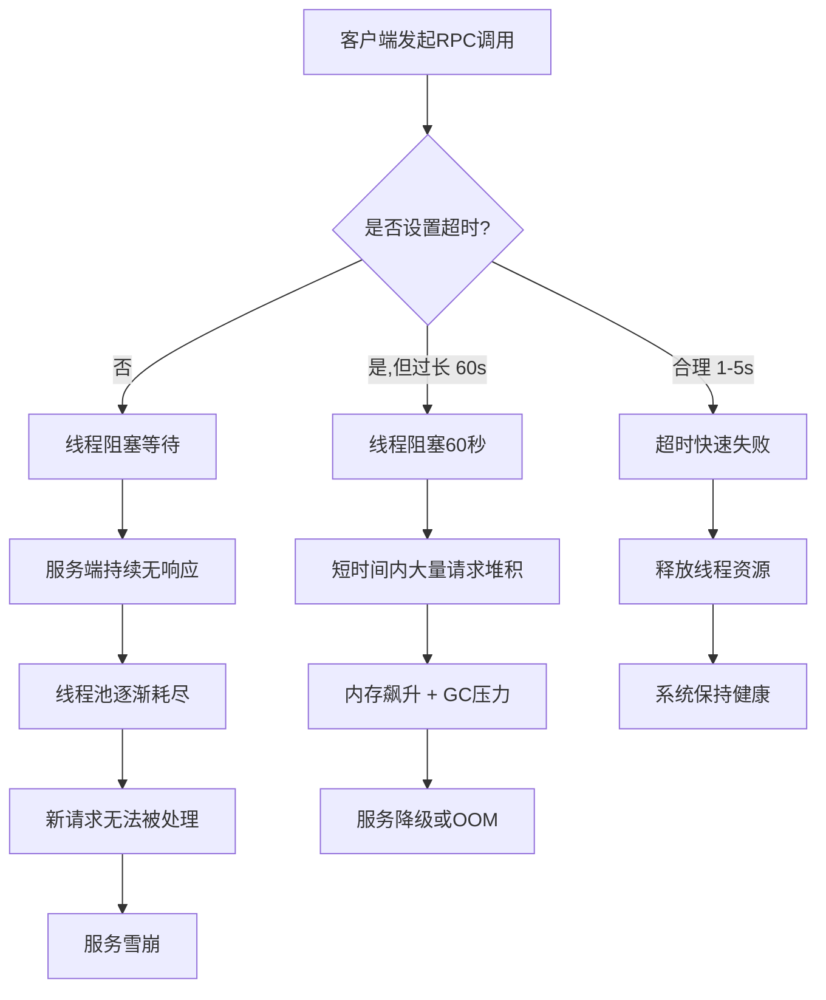
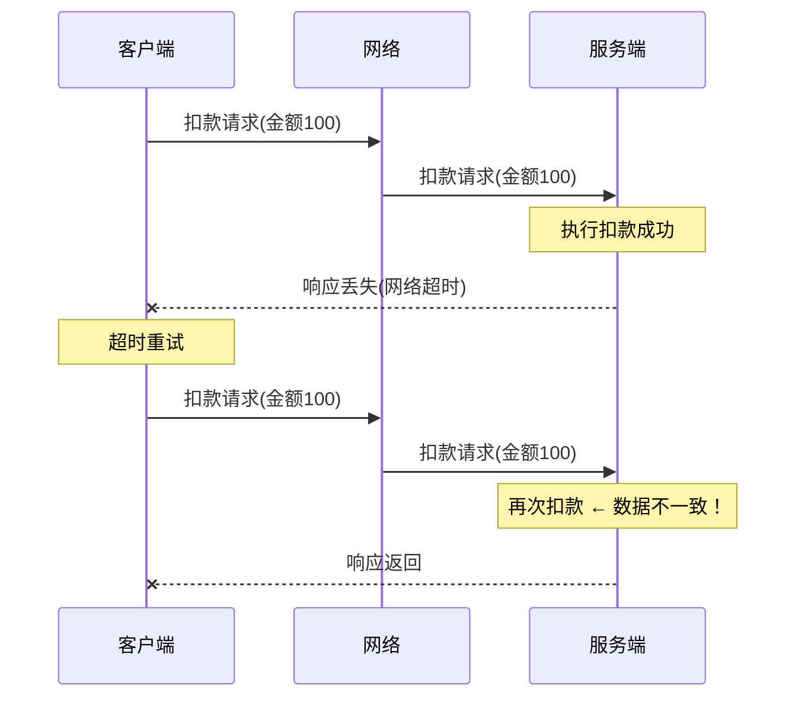
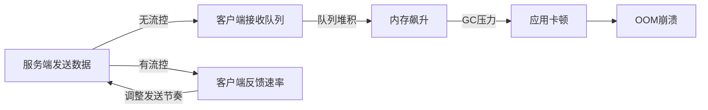

# 第43章 RPC框架 - 常见误区

> 误区是经验的另一种表达方式——每一个"不应该"的背后，都曾有人付出过生产事故的代价。

在 RPC 框架的实践中，开发者往往会陷入一些看似合理但实际危害极大的思维陷阱。这些误区不是初学者的专利——许多拥有数年微服务经验的工程师，仍在反复踩入同样的坑。本章系统梳理 RPC 开发中最常见的 **8 大误区**，每个误区都从错误现象出发，剖析根因，给出经过生产验证的正确方案。

---

## 误区全景图

| 误区类别 | 核心错误 | 后果严重度 | 影响范围 |
|----------|---------|-----------|---------|
| 超时设置 | 不设超时或超时过长 | 🔴 极高 | 全链路 |
| 重试策略 | 盲目重试所有错误 | 🔴 极高 | 下游服务 |
| 幂等性 | 重试不保证幂等 | 🔴 极高 | 数据一致性 |
| 序列化选型 | 格式选择不当 | 🟡 中等 | 性能/可维护性 |
| 连接管理 | 单连接承载所有流量 | 🟡 中等 | 吞吐量 |
| 流控机制 | 流式传输无流控 | 🔴 极高 | 内存稳定性 |
| 健康检查 | 不配置或配置不当 | 🟡 中等 | 可用性 |
| 日志规范 | 错误日志级别混乱 | 🟢 低 | 运维效率 |

---

## 误区一：超时设置过长或不设置

### 错误现象

不设置超时，或设置一个"保险"般的超时值（如 60 秒），认为"给足够的时间总能完成"。这在开发环境中看似无害，但在生产环境中是级联故障的导火索。

### 根因分析

不设超时的本质问题是：**调用方线程会被永久阻塞**。当服务端出现故障时：



典型的雪崩链路：
1. 服务 A 调用服务 B，B 响应变慢（从 50ms 升至 30s）
2. A 不设超时，调用线程被阻塞
3. A 的线程池（默认 200 线程）逐渐被占满
4. A 无法处理新请求，上游调用方也开始超时
5. 整条调用链雪崩

### 正确做法

```go
// ❌ 错误：不设超时 — 线程将无限期阻塞
resp, err := client.GetUser(context.Background(), req)

// ❌ 错误：超时过长 — 60秒足以让线程池堆积
ctx, cancel := context.WithTimeout(context.Background(), 60*time.Second)
defer cancel()

// ✅ 正确：基于业务SLA设置合理超时
func GetUserWithTimeout(ctx context.Context, req *pb.GetUserRequest) (*pb.User, error) {
    // 步骤1：计算剩余时间（尊重调用链上游的超时）
    deadline, ok := ctx.Deadline()
    if ok {
        remaining := time.Until(deadline)
        if remaining < 100*time.Millisecond {
            return nil, status.Error(codes.DeadlineExceeded, "insufficient time remaining")
        }
    }
    
    // 步骤2：为本层调用设置独立超时
    ctx, cancel := context.WithTimeout(ctx, 3*time.Second)
    defer cancel()
    
    // 步骤3：执行RPC调用
    resp, err := client.GetUser(ctx, req)
    if err != nil {
        st, _ := status.FromError(err)
        if st.Code() == codes.DeadlineExceeded {
            // 超时需要特殊处理：不能重试，要快速向上传播
            log.Warn("user service timeout", 
                zap.Duration("elapsed", 3*time.Second),
                zap.String("trace_id", traceIDFromContext(ctx)))
        }
        return nil, err
    }
    return resp, nil
}
```

### 超时时间设定原则

| 业务类型 | 推荐超时 | 依据 |
|---------|---------|------|
| 实时交互（IM消息、在线状态） | 500ms-1s | 用户可感知延迟阈值 |
| 查询类接口（用户信息、商品详情） | 1-3s | 页面加载容忍度 |
| 写入类接口（下单、支付） | 3-5s | 涉及分布式事务 |
| 批量处理（数据导出、报表生成） | 10-30s | 需拆分为异步任务 |
| 跨机房调用 | 基础超时 + 50-100ms | 网络延迟不确定性 |

### 进阶：超时链路传播

在微服务调用链中，超时必须逐层递减，不能每层都设相同的值：

```go
// 反模式：每层都设3秒超时
// A(3s) -> B(3s) -> C(3s) -> D(3s)
// 最坏情况：A实际需要等待12秒！

// 正确做法：超时链路递减
// A(3s) -> B(2.5s) -> C(2s) -> D(1.5s)
// 每层预留网络传输 + 序列化开销

func propagateTimeout(ctx context.Context, rpcTimeout time.Duration) (context.Context, context.CancelFunc) {
    deadline, ok := ctx.Deadline()
    if !ok {
        // 上游没有设超时，使用当前层的默认超时
        return context.WithTimeout(ctx, rpcTimeout)
    }
    
    remaining := time.Until(deadline)
    if remaining <= 0 {
        // 上游已超时，直接失败
        ctx, cancel := context.WithTimeout(ctx, 0)
        cancel()
        return ctx, cancel
    }
    
    // 取上游剩余时间和本层超时的较小值
    effectiveTimeout := min(remaining, rpcTimeout)
    return context.WithTimeout(ctx, effectiveTimeout)
}
```

---

## 误区二：重试所有错误

### 错误现象

捕获所有 `err != nil` 后一律重试，认为"多试几次总能成功"。这不仅无法解决真正的瞬时故障，反而会将压力放大数倍打向已不堪重负的下游。

### 根因分析

RPC 错误可以分为两大类：

| 错误类别 | 典型状态码 | 重试效果 | 示例 |
|---------|-----------|---------|------|
| **可重试错误**（瞬时故障） | `Unavailable`、`DeadlineExceeded`、`ResourceExhausted` | 重试可能成功 | 网络抖动、临时过载 |
| **不可重试错误**（确定性失败） | `InvalidArgument`、`NotFound`、`AlreadyExists`、`PermissionDenied` | 重试100次也不会成功 | 参数错误、资源不存在 |

对不可重试错误进行重试，相当于让一个已经撞上墙的车反复倒车再撞——除了增加损伤（放大流量），毫无意义。

更严重的是**重试风暴**：当下游已经过载时，重试会使其负载翻倍甚至更多，形成恶性循环。

### 正确做法

```go
// ❌ 错误：所有错误无条件重试
func callWithRetry(ctx context.Context, fn func() error) error {
    var err error
    for i := 0; i < 3; i++ {
        err = fn()
        if err == nil {
            return nil
        }
        // 无论什么错误都重试 ← 这是致命的
    }
    return err
}

// ✅ 正确：基于错误码的条件重试 + 退避策略
func callWithSmartRetry(ctx context.Context, fn func() error) error {
    maxRetries := 3
    var lastErr error
    
    for attempt := 0; attempt <= maxRetries; attempt++ {
        lastErr = fn()
        if lastErr == nil {
            return nil
        }
        
        // 判断是否可重试
        st, ok := status.FromError(lastErr)
        if !ok {
            return lastErr // 非gRPC错误，不重试
        }
        
        if !isRetryable(st.Code()) {
            log.Info("non-retryable error, returning immediately",
                zap.String("code", st.Code().String()),
                zap.String("msg", st.Message()))
            return lastErr
        }
        
        // 如果是最后一次尝试，不再等待
        if attempt == maxRetries {
            break
        }
        
        // 指数退避 + 抖动
        backoff := calculateBackoff(attempt, st.Code())
        log.Warn("retrying after backoff",
            zap.Int("attempt", attempt+1),
            zap.Duration("backoff", backoff),
            zap.String("code", st.Code().String()))
        
        select {
        case <-time.After(backoff):
        case <-ctx.Done():
            return ctx.Err()
        }
    }
    return lastErr
}

func isRetryable(code codes.Code) bool {
    switch code {
    case codes.Unavailable,        // 服务暂时不可用
         codes.DeadlineExceeded,   // 超时（可能是瞬时网络问题）
         codes.ResourceExhausted,  // 资源耗尽（过载，等一会可能恢复）
         codes.Aborted,            // 操作被中止（如事务冲突）
         codes.Internal:           // 内部错误（部分情况可重试）
        return true
    default:
        return false
    }
}

func calculateBackoff(attempt int, code codes.Code) time.Duration {
    base := 100 * time.Millisecond
    
    // 指数退避：100ms, 200ms, 400ms
    backoff := base * time.Duration(1<<uint(attempt))
    
    // 加入随机抖动（±30%），避免惊群效应
    jitter := time.Duration(float64(backoff) * (0.7 + rand.Float64()*0.6))
    
    // ResourceExhausted 需要更长的退避时间
    if code == codes.ResourceExhausted {
        jitter *= 3
    }
    
    // 上限10秒
    if jitter > 10*time.Second {
        jitter = 10 * time.Second
    }
    
    return jitter
}
```

### 重试策略决策表

| 错误码 | 是否重试 | 最大重试次数 | 退避基数 | 原因 |
|--------|---------|------------|---------|------|
| `Unavailable` | ✅ | 3 | 100ms | 网络/服务临时不可用 |
| `DeadlineExceeded` | ✅ | 2 | 200ms | 超时可能是瞬时的 |
| `ResourceExhausted` | ✅ | 2 | 500ms | 过载需更长等待 |
| `Aborted` | ✅ | 3 | 100ms | 事务冲突可立即重试 |
| `InvalidArgument` | ❌ | 0 | - | 参数错误，重试无意义 |
| `NotFound` | ❌ | 0 | - | 资源不存在 |
| `AlreadyExists` | ❌ | 0 | - | 重复创建 |
| `PermissionDenied` | ❌ | 0 | - | 权限问题不会自愈 |
| `Unauthenticated` | ❌ | 0 | - | Token过期需重新获取 |

---

## 误区三：忽略幂等性

### 错误现象

重试机制配合了，但服务端操作不幂等——同样的请求重试一次就多执行一次。在金融、电商等场景下，这意味着重复扣款、重复下单、重复发货。

### 根因分析

幂等性的核心定义：**同一个操作执行一次和执行多次，效果相同**。

在 RPC 环境中，重试是常态而非异常。网络超时后客户端重试，但服务端可能已经成功处理了第一次请求。如果操作不幂等，数据就会出现不一致。



### 正确做法：三层幂等保障

#### 第一层：客户端幂等键生成

```go
// 客户端：为每次请求生成唯一的幂等键
type IdempotentClient struct {
    inner  pb.ServiceClient
    prefix string // 通常是机器标识或用户ID
}

func (c *IdempotentClient) Deduct(ctx context.Context, req *pb.DeductRequest) (*pb.DeductResponse, error) {
    // 幂等键 = 服务名 + 操作类型 + 业务唯一标识
    idempotencyKey := fmt.Sprintf("deduct:%s:%s", req.UserId, req.OrderId)
    req.IdempotencyKey = idempotencyKey
    
    // 将幂等键放入metadata，方便链路追踪
    md, _ := metadata.FromOutgoingContext(ctx)
    md = md.Copy()
    md.Set("idempotency-key", idempotencyKey)
    ctx = metadata.NewOutgoingContext(ctx, md)
    
    return c.inner.Deduct(ctx, req)
}
```

#### 第二层：服务端幂等校验

```go
func (s *server) Deduct(ctx context.Context, req *pb.DeductRequest) (*pb.DeductResponse, error) {
    idempotencyKey := req.IdempotencyKey
    if idempotencyKey == "" {
        return nil, status.Error(codes.InvalidArgument, "idempotency_key is required")
    }
    
    // 1. 检查幂等键是否存在（Redis原子操作）
    redisKey := "idempotent:" + idempotencyKey
    exists, err := s.redis.Exists(ctx, redisKey).Result()
    if err != nil {
        // Redis故障时的降级策略：允许请求通过（宁可重复，不可阻塞）
        log.Error("redis check failed, allowing request", zap.Error(err))
    } else if exists > 0 {
        // 幂等键已存在，返回缓存的结果
        cached, _ := s.redis.Get(ctx, redisKey).Result()
        return &amp;pb.DeductResponse{
            Status:  "already_processed",
            Details: cached,
        }, nil
    }
    
    // 2. 执行业务操作（使用分布式锁保证并发安全）
    lockKey := "lock:" + idempotencyKey
    locked, err := s.redis.SetNX(ctx, lockKey, "1", 30*time.Second).Result()
    if err != nil || !locked {
        return nil, status.Error(codes.Aborted, "concurrent request processing")
    }
    defer s.redis.Del(ctx, lockKey)
    
    // 3. 执行扣款
    tx, err := s.db.Begin()
    if err != nil {
        return nil, status.Error(codes.Internal, "failed to begin transaction")
    }
    defer tx.Rollback()
    
    // 查询当前余额（使用SELECT ... FOR UPDATE防止并发）
    var balance int64
    err = tx.QueryRow("SELECT balance FROM accounts WHERE id = $1 FOR UPDATE", req.UserId).Scan(&amp;balance)
    if err != nil {
        return nil, status.Error(codes.NotFound, "account not found")
    }
    
    if balance < req.Amount {
        return nil, status.Error(codes.FailedPrecondition, "insufficient balance")
    }
    
    _, err = tx.Exec("UPDATE accounts SET balance = balance - $1 WHERE id = $2", req.Amount, req.UserId)
    if err != nil {
        return nil, status.Error(codes.Internal, "deduction failed")
    }
    
    if err := tx.Commit(); err != nil {
        return nil, status.Error(codes.Internal, "transaction commit failed")
    }
    
    // 4. 记录幂等键（带过期时间）
    resultJSON, _ := json.Marshal(map[string]interface{}{
        "status": "success",
        "amount": req.Amount,
        "time":   time.Now().Format(time.RFC3339),
    })
    s.redis.Set(ctx, redisKey, string(resultJSON), 24*time.Hour)
    
    return &amp;pb.DeductResponse{Status: "success"}, nil
}
```

#### 第三层：数据库约束兜底

```sql
-- 即使幂等层全部失败，数据库约束是最后的防线
ALTER TABLE transactions ADD CONSTRAINT uk_idempotency UNIQUE (idempotency_key);

-- 或者使用去重表
CREATE TABLE idempotency_log (
    key         VARCHAR(128) PRIMARY KEY,
    result      JSONB,
    created_at  TIMESTAMP DEFAULT NOW()
);
```

### 幂等性设计决策表

| 操作类型 | 幂等方案 | 实现复杂度 | 适用场景 |
|---------|---------|-----------|---------|
| 创建操作 | 数据库唯一约束 + 幂等键 | 低 | 订单创建、用户注册 |
| 扣款/转账 | 事务 + 幂等键 + 乐观锁 | 高 | 金融交易 |
| 状态变更 | 条件更新（WHERE状态=X） | 中 | 订单状态流转 |
| 通知发送 | 幂等键 + 去重表 | 中 | 消息推送 |
| 文件上传 | 内容哈希 + 平台去重 | 低 | 对象存储 |

---

## 误区四：序列化选择不当

### 错误现象

在性能敏感的内部 RPC 中使用 JSON，导致序列化/反序列化成为瓶颈；或在对外 API 中使用 Protobuf，导致第三方对接困难。

### 根因分析

序列化格式的选择本质上是**性能、可读性、Schema演进能力**三者之间的权衡。没有一种格式在所有维度上都最优。

| 格式 | 编码速度 | 解码速度 | 体积 | 可读性 | Schema演进 | 适用场景 |
|------|---------|---------|------|--------|-----------|---------|
| Protobuf | ⭐⭐⭐⭐⭐ | ⭐⭐⭐⭐⭐ | ⭐⭐⭐⭐⭐ | ⭐ | ⭐⭐⭐⭐ | 内部微服务RPC |
| JSON | ⭐⭐⭐ | ⭐⭐⭐ | ⭐⭐ | ⭐⭐⭐⭐⭐ | ⭐⭐⭐ | 对外REST API |
| MessagePack | ⭐⭐⭐⭐ | ⭐⭐⭐⭐ | ⭐⭐⭐⭐ | ⭐⭐ | ⭐⭐ | 日志/缓存 |
| Avro | ⭐⭐⭐⭐ | ⭐⭐⭐⭐ | ⭐⭐⭐⭐⭐ | ⭐ | ⭐⭐⭐⭐⭐ | 大数据ETL |
| Thrift Binary | ⭐⭐⭐⭐⭐ | ⭐⭐⭐⭐⭐ | ⭐⭐⭐⭐⭐ | ⭐ | ⭐⭐⭐ | Thrift生态RPC |

### 正确做法：按场景选型

```go
// 场景1：内部微服务RPC → 使用Protobuf
// proto定义确保类型安全，编码效率最高
// 适用于：服务间高频通信、延迟敏感
rpc GetUser(GetUserRequest) returns (User);

// 场景2：对外REST API → 使用JSON
// 第三方开发者友好，调试方便
// 适用于：开放平台、Web前端、移动端
func HandleGetUser(w http.ResponseWriter, r *http.Request) {
    w.Header().Set("Content-Type", "application/json")
    json.NewEncoder(w).Encode(user)
}

// 场景3：日志传输 → 使用JSON（可搜索）或MessagePack（高效）
// JSON日志便于ELK等工具解析
// MessagePack日志在高吞吐场景下更高效

// 场景4：大数据管道 → 使用Avro
// Schema演进友好，支持前向/后向兼容
```

### 性能实测数据参考

> 以下数据基于序列化一个包含 20 个字段的用户对象（1KB payload），10 万次操作的平均值：

| 格式 | 序列化耗时(μs) | 反序列化耗时(μs) | 编码体积(bytes) |
|------|---------------|-----------------|----------------|
| Protobuf | 2.1 | 2.8 | 312 |
| JSON | 15.3 | 18.7 | 524 |
| MessagePack | 4.2 | 5.1 | 398 |
| Avro (Binary) | 3.5 | 4.0 | 328 |
| JSON (压缩) | 22.1 | 25.3 | 289 |

> **结论**：Protobuf 比 JSON 快约 7 倍，体积小约 40%。在每秒万级 QPS 的内部 RPC 场景中，这个差距直接影响服务器成本。

---

## 误区五：单连接承载所有流量

### 错误现象

所有 RPC 请求共用一个 `ClientConn`，在高并发场景下连接成为吞吐量瓶颈。

### 根因分析

gRPC 基于 HTTP/2，支持**多路复用**（Multiplexing）——多个请求可以在同一个 TCP 连接上并发传输。但这并不意味着单连接就是万能的：

| 限制因素 | 说明 |
|---------|------|
| TCP 窗口大小 | 单连接的吞吐量受 TCP 拥塞控制和窗口大小限制 |
| 服务端单连接处理线程 | 部分框架的服务端对单连接的并发处理有上限 |
| 负载均衡粒度 | 单连接上所有请求路由到同一个后端实例 |
| 故障隔离 | 一个连接出问题影响所有请求 |

### 正确做法

```go
// ❌ 错误：全局单连接
var globalConn *grpc.ClientConn

func init() {
    globalConn, _ = grpc.Dial("server:50051", grpc.WithInsecure())
}

// ✅ 正确方案一：gRPC内置负载均衡 + 多实例地址
conn, _ := grpc.Dial(
    "dns:///server:50051",           // DNS解析获取多实例地址
    grpc.WithDefaultServiceConfig(`{
        "loadBalancingConfig": [{"round_robin":{}}]
    }`),
    grpc.WithInsecure(),
)
// gRPC自动在多个后端实例间分配请求

// ✅ 正确方案二：客户端连接池
type ConnectionPool struct {
    conns    []*grpc.ClientConn
    current  uint64
    mu       sync.Mutex
}

func NewConnectionPool(addr string, size int) (*ConnectionPool, error) {
    pool := &amp;ConnectionPool{
        conns: make([]*grpc.ClientConn, size),
    }
    for i := 0; i < size; i++ {
        conn, err := grpc.Dial(addr, 
            grpc.WithInsecure(),
            grpc.WithKeepaliveParams(keepalive.ClientParameters{
                Time:                10 * time.Second,
                Timeout:             3 * time.Second,
                PermitWithoutStream: true,
            }),
        )
        if err != nil {
            return nil, err
        }
        pool.conns[i] = conn
    }
    return pool, nil
}

func (p *ConnectionPool) Get() *grpc.ClientConn {
    // Round-robin选择
    idx := atomic.AddUint64(&amp;p.current, 1)
    return p.conns[idx%uint64(len(p.conns))]
}

func (p *ConnectionPool) Close() {
    for _, conn := range p.conns {
        conn.Close()
    }
}
```

### 连接配置最佳实践

| 配置项 | 推荐值 | 说明 |
|--------|-------|------|
| Keepalive 时间 | 10-30s | 检测死连接 |
| Keepalive 超时 | 3-5s | 等待ping响应的超时 |
| 最大连接数 | 4-8 | 根据后端实例数调整 |
| MaxConcurrentStreams | 100-1000 | 单连接最大并发流数 |
| TCP keepalive | 开启 | OS层死连接检测 |

---

## 误区六：忽略服务端流控

### 错误现象

Server Streaming 或 Bidirectional Streaming 中，服务端以最大速率发送数据，客户端处理不过来导致内存溢出。

### 根因分析

流式传输打破了"请求-响应"的一次性模式，引入了**背压**（Backpressure）问题：



gRPC 默认的 HTTP/2 流控窗口大小为 **64KB**，但这只控制传输层的流控——应用层的缓冲区如果没有限制，数据仍然会在内存中堆积。

### 正确做法

```go
// ❌ 错误：无节制地发送数据
func (s *server) ExportUsers(req *pb.ExportRequest, stream pb.Service_ExportUsersServer) error {
    users := s.repo.GetAllUsers()
    for _, user := range users {
        if err := stream.Send(user); err != nil {
            return err
        }
    }
    return nil
}

// ✅ 正确：服务端流控 + 客户端限速
// 服务端：控制发送速率
func (s *server) ExportUsers(req *pb.ExportRequest, stream pb.Service_ExportUsersServer) error {
    batchSize := 100
    batchDelay := 10 * time.Millisecond // 每批次间隔
    
    for batch := range s.repo.StreamBatches(stream.Context(), batchSize) {
        for _, user := range batch {
            if err := stream.Send(&amp;pb.User{
                Id:    user.ID,
                Name:  user.Name,
                Email: user.Email,
            }); err != nil {
                // 客户端主动断开或网络异常
                log.Warn("stream send failed", zap.Error(err))
                return err
            }
        }
        
        // 批次间等待，给客户端处理时间
        select {
        case <-stream.Context().Done():
            return stream.Context().Err()
        case <-time.After(batchDelay):
        }
    }
    return nil
}

// 客户端：设置接收缓冲区限制
func downloadUsers(ctx context.Context, client pb.ServiceClient) error {
    ctx, cancel := context.WithTimeout(ctx, 5*time.Minute)
    defer cancel()
    
    stream, err := client.ExportUsers(ctx, &amp;pb.ExportRequest{})
    if err != nil {
        return err
    }
    
    // 使用带缓冲的channel控制并发
    resultCh := make(chan *pb.User, 1000) // 缓冲区1000条
    errCh := make(chan error, 1)
    
    // 消费者：异步处理接收到的数据
    go func() {
        defer close(resultCh)
        for {
            user, err := stream.Recv()
            if err == io.EOF {
                return
            }
            if err != nil {
                errCh <- err
                return
            }
            select {
            case resultCh <- user:
            case <-ctx.Done():
                errCh <- ctx.Err()
                return
            }
        }
    }()
    
    // 处理数据
    count := 0
    for user := range resultCh {
        processUser(user)
        count++
        if count%1000 == 0 {
            log.Info("processed users", zap.Int("count", count))
        }
    }
    
    return <-errCh
}
```

### 流控方案对比

| 方案 | 实现复杂度 | 精确性 | 适用场景 |
|------|-----------|--------|---------|
| `time.Sleep` 固定间隔 | 低 | 低 | 简单批量导出 |
| 基于channel缓冲的背压 | 中 | 中 | 中等规模流式处理 |
| 基于令牌桶的精确限流 | 高 | 高 | 高吞吐生产环境 |
| gRPC FlowControl 窗口 | 高 | 高 | 自定义传输层控制 |

---

## 误区七：不使用健康检查

### 错误现象

不配置 gRPC 健康检查协议，负载均衡器无法感知服务真实状态，继续向已崩溃的实例转发流量。

### 根因分析

在 Kubernetes + gRPC 环境中，健康检查有两个层面：

| 检查类型 | 协议 | 用途 | 配置位置 |
|---------|------|------|---------|
| **存活检查**（Liveness） | HTTP/TCP | 检测进程是否存活，失败则重启Pod | k8s Pod spec |
| **就绪检查**（Readiness） | gRPC Health Protocol | 检测服务是否准备好接受流量 | k8s Pod spec |

仅依赖 Kubernetes 的 `httpGet` 探针检测 gRPC 服务是不够的——HTTP 探针只能检查端口是否可连接，无法检测 gRPC 服务的内部状态。

### 正确做法

```go
import (
    "google.golang.org/grpc/health"
    healthpb "google.golang.org/grpc/health/grpc_health_v1"
)

func main() {
    lis, _ := net.Listen("tcp", ":50051")
    s := grpc.NewServer()
    
    // 1. 注册业务服务
    pb.RegisterUserServiceServer(s, &amp;userService{})
    
    // 2. 注册健康检查服务
    healthServer := health.NewServer()
    healthpb.RegisterHealthServer(s, healthServer)
    
    // 3. 设置初始状态
    healthServer.SetServingStatus("user.UserService", healthpb.HealthCheckResponse_SERVING)
    healthServer.SetServingStatus("", healthpb.HealthCheckResponse_SERVING)
    
    // 4. 监控内部状态变化
    go func() {
        for {
            if !isReady() {
                healthServer.SetServingStatus("user.UserService", 
                    healthpb.HealthCheckResponse_NOT_SERVING)
            } else {
                healthServer.SetServingStatus("user.UserService", 
                    healthpb.HealthCheckResponse_SERVING)
            }
            time.Sleep(5 * time.Second)
        }
    }()
    
    s.Serve(lis)
}
```

Kubernetes 配置：

```yaml
apiVersion: v1
kind: Pod
spec:
  containers:
  - name: user-service
    ports:
    - containerPort: 50051
    livenessProbe:
      exec:
        command: ["grpc_health_probe", "-addr=:50051"]
      initialDelaySeconds: 10
      periodSeconds: 10
      failureThreshold: 3
    readinessProbe:
      exec:
        command: ["grpc_health_probe", "-addr=:50051", "-service=user.UserService"]
      initialDelaySeconds: 5
      periodSeconds: 5
      failureThreshold: 2
```

---

## 误区八：错误的日志级别

### 错误现象

将客户端超时、服务临时不可用等常见错误使用 `ERROR` 级别记录，导致告警风暴——运维人员每天收到数百条"ERROR"告警，真正需要关注的问题被淹没其中。

### 根因分析

日志级别的核心原则是**可操作性**：

| 级别 | 含义 | 运维响应 | 常见错误码 |
|------|------|---------|-----------|
| `ERROR` | 需要立即人工介入 | 告警 + 人工排查 | `Internal`、数据不一致 |
| `WARN` | 需要关注但暂不紧急 | 监控面板 + 适时排查 | `Unavailable`、`ResourceExhausted` |
| `INFO` | 正常业务记录 | 无需响应 | `InvalidArgument`（客户端问题）|
| `DEBUG` | 开发调试用 | 生产环境关闭 | 完整请求/响应 |

### 正确做法

```go
// ✅ 基于错误码的分级日志
func rpcLoggingInterceptor(ctx context.Context, req interface{}, 
    info *grpc.UnaryServerInfo, handler grpc.UnaryHandler) (interface{}, error) {
    
    start := time.Now()
    resp, err := handler(ctx, req)
    duration := time.Since(start)
    
    if err != nil {
        st, _ := status.FromError(err)
        
        // 基础字段
        fields := []zap.Field{
            zap.String("method", info.FullMethod),
            zap.Duration("duration", duration),
            zap.String("code", st.Code().String()),
            zap.String("msg", st.Message()),
        }
        
        switch st.Code() {
        case codes.Unavailable:
            // 服务不可用：WARN级别，关注但不告警
            log.Warn("service unavailable", fields...)
            
        case codes.DeadlineExceeded:
            // 超时：WARN级别，可能是暂时的
            if duration > 10*time.Second {
                // 超时时间特别长才升级为ERROR
                log.Error("severe timeout", fields...)
            } else {
                log.Warn("request timeout", fields...)
            }
            
        case codes.InvalidArgument, codes.NotFound:
            // 客户端错误：INFO级别，无需告警
            log.Info("client error", fields...)
            
        case codes.Unauthenticated, codes.PermissionDenied:
            // 认证/授权问题：WARN级别
            log.Warn("auth error", fields...)
            
        case codes.ResourceExhausted:
            // 资源耗尽：WARN级别，需要关注限流情况
            log.Warn("rate limited", fields...)
            
        default:
            // 其他错误：ERROR级别，需要排查
            log.Error("rpc error", append(fields, zap.Error(err))...)
        }
    } else {
        // 成功请求：INFO级别（慢请求升级为WARN）
        duration := time.Since(start)
        if duration > 5*time.Second {
            log.Warn("slow rpc", 
                zap.String("method", info.FullMethod),
                zap.Duration("duration", duration))
        }
    }
    
    return resp, err
}
```

### 日志告警规则参考

| 日志级别 | 告警策略 | 通知方式 | 响应时效 |
|---------|---------|---------|---------|
| `ERROR` | 任意ERROR触发告警 | 短信 + 电话 | 5分钟内响应 |
| `WARN` | 5分钟内WARN数 > 100 | 钉钉/飞书 | 30分钟内响应 |
| `WARN` | 同一方法WARN率 > 5% | 邮件 | 2小时内响应 |
| `INFO` | 不告警，仅存档 | 日志平台 | 按需查询 |

---

## 误区自查清单

在代码审查和架构评审时，使用以下清单逐项检查：

| 序号 | 检查项 | 验证方法 | 通过标准 |
|------|-------|---------|---------|
| 1 | 所有RPC调用是否设置超时 | `grep -r "context.Background()" --include="*.go"` | 不允许裸 `context.Background()` |
| 2 | 超时值是否合理 | 检查超时配置文档 | 与SLA匹配，逐层递减 |
| 3 | 重试是否只针对可重试错误 | 检查 `retry` 函数实现 | 有错误码过滤逻辑 |
| 4 | 重试有指数退避和抖动 | 检查退避算法 | 非固定间隔 |
| 5 | 涉及写操作是否幂等 | 检查proto定义 | 有 `idempotency_key` 字段 |
| 6 | 服务端是否校验幂等键 | 检查服务端实现 | Redis/DB去重机制 |
| 7 | 序列化格式是否匹配场景 | 架构评审 | 内部RPC用Protobuf |
| 8 | 连接配置是否优化 | 检查连接参数 | Keepalive开启、连接池合理 |
| 9 | 流式传输是否有流控 | 检查stream处理逻辑 | 有背压机制 |
| 10 | 是否配置了gRPC健康检查 | 检查K8s配置 | Health Server已注册 |
| 11 | 日志级别是否合理 | 检查日志配置 | 无ERROR滥用 |

---

## 本章总结

RPC 框架的常见误区可以归结为一个核心命题：**分布式系统不是本地调用的简单扩展，它需要从设计层面就考虑网络的不可靠性**。

| 误区 | 一句话总结 | 核心纠正 |
|------|-----------|---------|
| 超时设置 | 不设超时等于自杀 | 基于SLA设置，逐层递减 |
| 重试策略 | 盲目重试比不重试更危险 | 只重试可恢复错误 + 退避 |
| 幂等性 | 重试不幂等 = 数据不一致 | 幂等键 + DB约束双重保障 |
| 序列化 | 选错格式 = 性能瓶颈或维护噩梦 | 按场景选型，内部RPC用Protobuf |
| 连接管理 | 单连接是隐藏的瓶颈 | 负载均衡 + 连接池 |
| 流控机制 | 无流控 = OOM | 背压机制 + 缓冲区限制 |
| 健康检查 | 无检查 = 流量打向死服务 | gRPC Health Protocol |
| 日志级别 | ERROR滥用 = 告警疲劳 | 基于错误码分级 |

> **记住**：这些误区不是"可能遇到的问题"，而是"一定会遇到的问题"。唯一的区别是：你愿意在生产事故中学习，还是在代码审查中提前预防。
