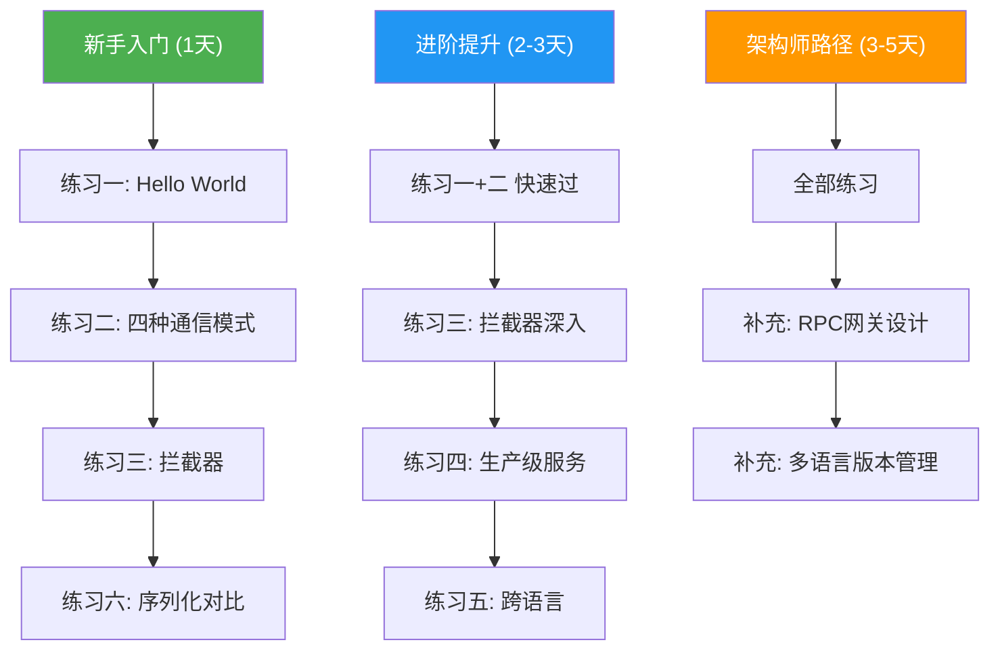

# 第43章 RPC框架 - 练习方法

本章提供了**六套递进式练习**，从 Hello World 入门到生产级架构设计，覆盖 RPC 框架的全部核心知识点。每套练习包含明确的目标、详细的操作步骤、可验证的检查标准和常见问题排查。建议按照顺序完成，每完成一套练习后再进入下一套。

## 练习环境准备

在开始练习之前，确保开发环境满足以下要求：

| 依赖项 | 最低版本 | 安装方式 | 验证命令 |
|--------|---------|---------|---------|
| Go | 1.21+ | `go install golang.org/dl/go1.22.0@latest` | `go version` |
| protoc | 25.0+ | `apt install protobuf-compiler` 或从 GitHub releases 下载 | `protoc --version` |
| protoc-gen-go | v1.32+ | `go install google.golang.org/protobuf/cmd/protoc-gen-go@latest` | `which protoc-gen-go` |
| protoc-gen-go-grpc | v1.3+ | `go install google.golang.org/grpc/cmd/protoc-gen-go-grpc@latest` | `which protoc-gen-go-grpc` |
| ghz（压测） | 0.115+ | `go install github.com/bojand/ghz/cmd/ghz@latest` | `ghz --version` |

**项目初始化：**

```bash
# 创建项目目录
mkdir -p ~/grpc-exercises &amp;&amp; cd ~/grpc-exercises
go mod init grpc-exercises

# 验证 protoc 插件路径
export PATH="$PATH:$(go env GOPATH)/bin"
protoc --go_out=. --go_opt=paths=source_relative \
       --go-grpc_out=. --go-grpc_opt=paths=source_relative \
       --version  # 确认无报错
```

**常见环境问题：**

- `protoc-gen-go: program not found`：确认 `$GOPATH/bin` 已加入 `PATH`
- `proto3 syntax not recognized`：protoc 版本过旧，需 3.15+
- `package google.golang.org/grpc: version mismatch`：执行 `go get google.golang.org/grpc@latest` 同步版本

---

## 练习一：Hello World gRPC 服务（入门，约 45 分钟）

### 目标

搭建第一个 gRPC 服务，理解从 Proto 定义到代码生成再到运行调用的完整流程。这是后续所有练习的基础——如果这一步走不通，后面都无法进行。

### 涉及知识点

本练习对应本章"理论基础"部分的核心概念：

- **IDL 定义**：Proto 文件的 syntax、package、message、service 语法
- **代码生成**：protoc 编译器 + Go 插件的协作流程
- **RPC 调用链**：Client Stub → 序列化 → 网络传输 → 反序列化 → Server Stub 的完整链路

### 详细步骤

**第一步：定义 Proto 文件**

创建 `proto/greeter/greeter.proto`：

```protobuf
syntax = "proto3";
package greeter;
option go_package = "grpc-exercises/proto/greeter";

// 问候服务
service Greeter {
  // 一元RPC：发送名字，返回问候语
  rpc SayHello (HelloRequest) returns (HelloReply);
}

message HelloRequest {
  string name = 1;
}

message HelloReply {
  string message = 1;
}
```

**第二步：生成 Go 代码**

```bash
# 从项目根目录执行
protoc --go_out=. --go_opt=paths=source_relative \
       --go-grpc_out=. --go-grpc_opt=paths=source_relative \
       proto/greeter/greeter.proto

# 验证生成的文件
ls proto/greeter/
# 预期输出：greeter.pb.go  greeter_grpc.pb.go
```

生成的两个文件各有分工：
- `greeter.pb.go`：消息体的序列化/反序列化代码（由 protoc-gen-go 生成）
- `greeter_grpc.pb.go`：服务端和客户端的 Stub 代码（由 protoc-gen-go-grpc 生成）

**第三步：实现服务端**

创建 `cmd/server/main.go`：

```go
package main

import (
    "context"
    "log"
    "net"

    "google.golang.org/grpc"
    pb "grpc-exercises/proto/greeter"
)

type greeterServer struct {
    pb.UnimplementedGreeterServer
}

func (s *greeterServer) SayHello(ctx context.Context, req *pb.HelloRequest) (*pb.HelloReply, error) {
    log.Printf("Received: name=%s", req.GetName())
    return &amp;pb.HelloReply{
        Message: "Hello, " + req.GetName() + "!",
    }, nil
}

func main() {
    lis, err := net.Listen("tcp", ":50051")
    if err != nil {
        log.Fatalf("failed to listen: %v", err)
    }

    server := grpc.NewServer()
    pb.RegisterGreeterServer(server, &amp;greeterServer{})

    log.Println("gRPC server listening on :50051")
    if err := server.Serve(lis); err != nil {
        log.Fatalf("failed to serve: %v", err)
    }
}
```

**第四步：实现客户端**

创建 `cmd/client/main.go`：

```go
package main

import (
    "context"
    "log"
    "time"

    "google.golang.org/grpc"
    "google.golang.org/grpc/credentials/insecure"
    pb "grpc-exercises/proto/greeter"
)

func main() {
    conn, err := grpc.NewClient("localhost:50051",
        grpc.WithTransportCredentials(insecure.NewCredentials()),
    )
    if err != nil {
        log.Fatalf("failed to connect: %v", err)
    }
    defer conn.Close()

    client := pb.NewGreeterClient(conn)

    ctx, cancel := context.WithTimeout(context.Background(), 3*time.Second)
    defer cancel()

    resp, err := client.SayHello(ctx, &amp;pb.HelloRequest{Name: "World"})
    if err != nil {
        log.Fatalf("SayHello failed: %v", err)
    }

    log.Printf("Response: %s", resp.GetMessage())
}
```

**第五步：运行并验证**

```bash
# 终端 1：启动服务端
go run cmd/server/main.go
# 预期输出：gRPC server listening on :50051

# 终端 2：运行客户端
go run cmd/client/main.go
# 预期输出：Response: Hello, World!
```

### 检查标准

- [ ] proto 文件能成功编译，生成 .pb.go 和 _grpc.pb.go 两个文件
- [ ] 服务端正常启动并监听 50051 端口，无 panic 或报错
- [ ] 客户端能收到正确的响应 "Hello, World!"
- [ ] 服务端日志能正确打印收到的请求参数
- [ ] 理解 `pb.RegisterGreeterServer` 和 `pb.NewGreeterClient` 的作用：前者将服务实现注册到 gRPC 服务端，后者创建客户端 Stub 代理
- [ ] 理解 `UnimplementedGreeterServer` 的作用：提供接口的默认实现（返回 Unimplemented 错误），确保向前兼容

### 常见问题

| 症状 | 原因 | 解决方案 |
|------|------|---------|
| `connection refused` | 服务端未启动或端口被占用 | 检查服务端进程，尝试更换端口 |
| `proto file not found` | protoc 的 import path 未正确设置 | 添加 `--proto_path=.` 参数 |
| `undefined: pb.RegisterGreeterServer` | 未生成 _grpc.pb.go 或导入路径错误 | 重新执行 protoc 命令，检查 go_package 选项 |
| `grpc.WithInsecure() not found` | gRPC-Go 版本升级后该函数已移除 | 改用 `grpc.WithTransportCredentials(insecure.NewCredentials())` |

### 进阶挑战

完成基础练习后，尝试以下扩展：

1. **添加第二个 RPC 方法**：在 Proto 中新增 `SayHelloAgain` 方法，服务端返回两次问候。体会 Proto 演进流程
2. **错误处理**：当 `name` 为空时，服务端返回 `InvalidArgument` 状态码而非空响应。练习 gRPC 状态码的正确使用
3. **请求日志**：在服务端手动添加简单的请求日志，记录方法名、参数和耗时。为练习三的拦截器做铺垫

---

## 练习二：四种通信模式实现（进阶，约 90 分钟）

### 目标

分别实现 gRPC 的四种通信模式（Unary、Server Streaming、Client Streaming、Bidirectional Streaming），理解每种模式的适用场景和实现要点。

### 涉及知识点

- **gRPC 四种通信模式**：对应核心技巧第一章，理解 stream 关键字在 Proto 和生成代码中的含义
- **流式传输与 HTTP/2**：理解 gRPC Streaming 是 HTTP/2 DATA 帧的标准化封装
- **EOF 处理**：流式通信中 `io.EOF` 作为流结束信号的机制

### Proto 定义

创建 `proto/user/user.proto`：

```protobuf
syntax = "proto3";
package user;
option go_package = "grpc-exercises/proto/user";

message User {
  int64 id = 1;
  string name = 2;
  string email = 3;
}

message GetUserRequest {
  int64 user_id = 1;
}

message GetUserResponse {
  User user = 1;
}

message ListUsersRequest {
  int32 page_size = 1;
  string page_token = 2;
}

message ListUsersResponse {
  repeated User users = 1;
  string next_page_token = 2;
}

message UploadUsersRequest {
  User user = 1;
}

message UploadUsersResponse {
  int32 success_count = 1;
  int32 fail_count = 2;
}

message ChatMessage {
  string user = 1;
  string content = 2;
  int64 timestamp = 3;
}

service UserService {
  // 模式一：Unary — 查询单个用户
  rpc GetUser (GetUserRequest) returns (GetUserResponse);

  // 模式二：Server Streaming — 分页流式返回用户列表
  rpc ListUsers (ListUsersRequest) returns (stream ListUsersResponse);

  // 模式三：Client Streaming — 批量上传用户
  rpc UploadUsers (stream UploadUsersRequest) returns (UploadUsersResponse);

  // 模式四：Bidirectional Streaming — 实时聊天
  rpc Chat (stream ChatMessage) returns (stream ChatMessage);
}
```

### 各模式实现要点

**模式一：Unary RPC（查询用户）**

这是最基础的模式。服务端接收一个请求，返回一个响应，类似普通 HTTP 请求。

```go
func (s *userServer) GetUser(ctx context.Context, req *pb.GetUserRequest) (*pb.GetUserResponse, error) {
    if req.UserId <= 0 {
        return nil, status.Error(codes.InvalidArgument, "user_id must be positive")
    }
    user, ok := s.users[req.UserId]
    if !ok {
        return nil, status.Errorf(codes.NotFound, "user %d not found", req.UserId)
    }
    return &amp;pb.GetUserResponse{User: user}, nil
}
```

**模式二：Server Streaming（流式列表）**

服务端持续向客户端推送多条消息。关键点：服务端通过 `stream.Send()` 逐条发送，返回 `nil` 表示流正常结束；客户端通过 `stream.Recv()` 循环接收，收到 `io.EOF` 表示流结束。

```go
func (s *userServer) ListUsers(req *pb.ListUsersRequest, stream pb.UserService_ListUsersServer) error {
    pageSize := req.PageSize
    if pageSize <= 0 || pageSize > 100 {
        pageSize = 20
    }

    // 模拟分批查询并流式返回
    for offset := int32(0); offset < int32(len(s.allUsers)); offset += pageSize {
        end := offset + pageSize
        if end > int32(len(s.allUsers)) {
            end = int32(len(s.allUsers))
        }

        batch := &amp;pb.ListUsersResponse{
            Users:         s.allUsers[offset:end],
            NextPageToken: fmt.Sprintf("%d", end),
        }
        if err := stream.Send(batch); err != nil {
            return status.Errorf(codes.Internal, "send failed: %v", err)
        }

        // 模拟数据库查询延迟
        time.Sleep(100 * time.Millisecond)
    }
    return nil // 返回 nil → 客户端收到 io.EOF
}
```

客户端接收代码——注意 `io.EOF` 作为流结束信号：

```go
func listUsers(client pb.UserServiceClient) {
    stream, err := client.ListUsers(context.Background(), &amp;pb.ListUsersRequest{PageSize: 5})
    if err != nil {
        log.Fatalf("ListUsers failed: %v", err)
    }
    for {
        resp, err := stream.Recv()
        if err == io.EOF {
            log.Println("Stream completed")
            break
        }
        if err != nil {
            log.Fatalf("Recv error: %v", err)
        }
        for _, u := range resp.Users {
            log.Printf("User: %d - %s", u.Id, u.Name)
        }
    }
}
```

**模式三：Client Streaming（批量上传）**

客户端通过流持续发送数据，服务端接收完毕后返回一个汇总响应。关键点：客户端发送完毕后必须调用 `CloseAndRecv()`；服务端收到 `io.EOF` 后调用 `SendAndClose()` 返回唯一响应。

```go
func (s *userServer) UploadUsers(stream pb.UserService_UploadUsersServer) error {
    var success, fail int32
    for {
        req, err := stream.Recv()
        if err == io.EOF {
            // 所有消息接收完毕，返回汇总
            return stream.SendAndClose(&amp;pb.UploadUsersResponse{
                SuccessCount: success,
                FailCount:    fail,
            })
        }
        if err != nil {
            return status.Errorf(codes.Internal, "recv failed: %v", err)
        }
        if req.User == nil || req.User.Name == "" {
            fail++
            continue
        }
        // 存储用户（模拟）
        s.users[req.User.Id] = req.User
        success++
    }
}
```

**模式四：Bidirectional Streaming（实时聊天）**

双向独立流，双方可同时收发消息。关键点：两个流完全独立，一方关闭发送不影响另一方。适合实现聊天室、实时状态同步等场景。

```go
func (s *userServer) Chat(stream pb.UserService_ChatServer) error {
    for {
        msg, err := stream.Recv()
        if err == io.EOF {
            return nil // 客户端关闭了发送流
        }
        if err != nil {
            return status.Errorf(codes.Internal, "recv error: %v", err)
        }
        log.Printf("[%s] %s", msg.User, msg.Content)

        // 回显确认
        if err := stream.Send(&amp;pb.ChatMessage{
            User:      "server",
            Content:   "Echo: " + msg.Content,
            Timestamp: time.Now().Unix(),
        }); err != nil {
            return status.Errorf(codes.Internal, "send error: %v", err)
        }
    }
}
```

### 检查标准

- [ ] Unary 模式：正确查询用户，不存在时返回 NotFound 错误
- [ ] Server Streaming：客户端能接收完整分页数据，最终收到 io.EOF
- [ ] Client Streaming：客户端上传多条数据后调用 CloseAndRecv，收到正确的 success/fail 统计
- [ ] Bidirectional Streaming：客户端发送消息后能收到服务端回显，关闭发送后服务端正确退出
- [ ] 理解 `stream` 关键字在 Proto 中对请求和响应的影响
- [ ] 能正确处理 EOF 和错误——流式通信中最容易出错的环节

### 常见问题

| 症状 | 原因 | 解决方案 |
|------|------|---------|
| Server Streaming 客户端阻塞不动 | 未循环调用 Recv() 或遗漏 EOF 判断 | 检查 `for { recv(); if err == io.EOF { break } }` 模式 |
| Client Streaming 死锁 | 未调用 CloseAndRecv() 就尝试读取响应 | 确保 Send 循环结束后调用 `stream.CloseAndRecv()` |
| Bidirectional 服务端提前退出 | Recv 返回 io.EOF 后没有正确 return nil | 检查 EOF 处理逻辑 |
| Stream 发送报错 `context canceled` | 客户端已断开或超时 | 检查 context 生命周期，确保客户端存活期间服务端才发送 |

### 进阶挑战

1. **Server Streaming + 流控**：当客户端断开连接时（网络中断），服务端能检测到并停止发送。提示：检查 `stream.Context().Done()`
2. **Client Streaming + 进度反馈**：将 Client Streaming 改造为 Bidirectional Streaming，服务端每处理 10 条数据返回一次进度
3. **数据量测试**：Server Streaming 模式下，服务端推送 10 万条记录，观察内存使用和传输耗时

---

## 练习三：拦截器与中间件（进阶，约 60 分钟）

### 目标

实现日志记录、认证验证、请求 ID 注入等拦截器，掌握 gRPC 横切关注点的标准实现方式。

### 涉及知识点

- **拦截器机制**：对应核心技巧第二章，理解 Unary 和 Stream 两种拦截器的区别
- **拦截器链**：多个拦截器的组合与执行顺序（洋葱模型）
- **gRPC 元数据（Metadata）**：拦截器间传递信息的标准方式

### 实现步骤

**第一步：实现日志拦截器**

日志拦截器是最基础的拦截器，在请求处理前后记录方法名、耗时和状态码：

```go
func loggingUnaryInterceptor(
    ctx context.Context,
    req interface{},
    info *grpc.UnaryServerInfo,
    handler grpc.UnaryHandler,
) (interface{}, error) {
    start := time.Now()

    // 调用实际的处理方法
    resp, err := handler(ctx, req)

    duration := time.Since(start)
    code := status.Code(err)

    // 根据状态码选择日志级别
    logFunc := log.Printf
    if code != codes.OK {
        logFunc = log.Printf // 实际项目中应使用不同级别
    }
    logFunc("[RPC] %s | status=%s | duration=%v",
        info.FullMethod, code, duration)

    return resp, err
}
```

**第二步：实现认证拦截器**

通过 gRPC Metadata 提取 Token 并验证身份。未认证请求直接返回 `Unauthenticated` 错误：

```go
func authUnaryInterceptor(
    ctx context.Context,
    req interface{},
    info *grpc.UnaryServerInfo,
    handler grpc.UnaryHandler,
) (interface{}, error) {
    // 某些方法不需要认证（如健康检查）
    if info.FullMethod == "/grpc.health.v1.Health/Check" {
        return handler(ctx, req)
    }

    // 从 Metadata 中提取 Token
    md, ok := metadata.FromIncomingContext(ctx)
    if !ok {
        return nil, status.Error(codes.Unauthenticated, "missing metadata")
    }

    tokens := md.Get("authorization")
    if len(tokens) == 0 {
        return nil, status.Error(codes.Unauthenticated, "missing authorization token")
    }

    // 验证 Token（简化示例，实际应调用认证服务）
    if tokens[0] != "Bearer valid-token-123" {
        return nil, status.Error(codes.Unauthenticated, "invalid token")
    }

    // 将用户信息注入到 context，供后续 handler 使用
    ctx = context.WithValue(ctx, "user_id", "user-from-token")
    return handler(ctx, req)
}
```

**第三步：实现请求 ID 注入拦截器（客户端）**

客户端拦截器自动生成唯一请求 ID 并注入到 Metadata 中，用于链路追踪：

```go
func requestIDUnaryInterceptor(
    ctx context.Context,
    method string,
    req, reply interface{},
    cc *grpc.ClientConn,
    invoker grpc.UnaryInvoker,
    opts ...grpc.CallOption,
) error {
    // 生成唯一请求 ID
    requestID := uuid.New().String()

    // 注入到 Metadata
    md, ok := metadata.FromOutgoingContext(ctx)
    if !ok {
        md = metadata.New(nil)
    }
    md.Set("x-request-id", requestID)
    ctx = metadata.NewOutgoingContext(ctx, md)

    log.Printf("[Client] request_id=%s method=%s", requestID, method)
    return invoker(ctx, method, req, reply, cc, opts...)
}
```

**第四步：链式组合拦截器**

使用 `google.golang.org/grpc/middleware` 包或手动串联多个拦截器：

```go
import "google.golang.org/grpc/middleware"

func main() {
    // 服务端链式拦截器
    // 执行顺序：日志 → 认证 → 实际处理
    chain := middleware.ChainUnaryServer(
        loggingUnaryInterceptor,   // 先记录时间
        authUnaryInterceptor,      // 再验证身份
    )

    server := grpc.NewServer(
        grpc.UnaryInterceptor(chain),
    )
    // ...
}
```

**拦截器执行顺序图：**


洋葱模型：第一个注册的拦截器最先执行 Pre 逻辑，最后执行 Post 逻辑。认证拦截器在日志拦截器之后注册，所以认证失败时，日志拦截器仍能记录这次请求的耗时和错误状态。

### 检查标准

- [ ] 日志拦截器能正确打印每个 RPC 调用的方法名、状态码和耗时
- [ ] 认证拦截器能正确拒绝没有 Token 或 Token 无效的请求
- [ ] 认证拦截器对健康检查接口放行
- [ ] 客户端拦截器注入的 x-request-id 能在服务端日志中看到
- [ ] 链式拦截器的执行顺序正确：先日志记录，再认证验证
- [ ] 理解拦截器的洋葱模型——Post 阶段的执行顺序与 Pre 阶段相反

### 常见问题

| 症状 | 原因 | 解决方案 |
|------|------|---------|
| 拦截器未执行 | 未在 grpc.NewServer 中注册 | 确认使用了 `grpc.UnaryInterceptor()` 参数 |
| 认证拦截器无法获取 Token | 客户端未设置 Metadata | 检查 `metadata.NewOutgoingContext` 的使用 |
| 链式拦截器顺序混乱 | 注册顺序不正确 | 理解洋葱模型：先注册的先执行 Pre，后执行的先执行 Post |
| Stream 拦截器无法访问请求内容 | Stream 拦截器的接口不同 | Stream 拦截器只能拦截 stream 对象，不能直接访问消息体 |

### 进阶挑战

1. **限流拦截器**：实现令牌桶算法的限流拦截器，超过阈值返回 `ResourceExhausted` 错误
2. **Stream 拦截器**：为 Streaming RPC 实现对应的 Stream 拦截器，记录流式消息的数量和总耗时
3. **链式配置**：将拦截器链改为可配置的（如通过配置文件决定是否启用认证），体会中间件设计模式

---

## 练习四：生产级 RPC 服务（高级，约 120 分钟）

### 目标

在练习一的基础上，集成健康检查、超时重试、优雅关闭、指标采集、mTLS 安全通信和性能压测，构建具备生产级特性的 RPC 服务。

### 涉及知识点

- **健康检查**：对应核心技巧第五章，gRPC Health Protocol 的注册与使用
- **超时与重试**：对应核心技巧第四章，分层超时、指数退避和重试预算
- **优雅关闭**：对应实战案例一，信号处理与连接排空
- **mTLS**：对应核心技巧第十章（本章略讲），双向认证的配置
- **可观测性**：对应核心技巧第二章中的追踪拦截器

### 实现步骤

**第一步：集成健康检查**

```go
import (
    "google.golang.org/grpc/health"
    healthpb "google.golang.org/grpc/health/grpc_health_v1"
)

func main() {
    server := grpc.NewServer()

    // 注册健康检查服务
    healthSrv := health.NewServer()
    healthpb.RegisterHealthServer(server, healthSrv)
    healthSrv.SetServingStatus("user.UserService", healthpb.HealthCheckResponse_SERVING)

    // 启动服务后标记为 SERVING
    // ...
}
```

客户端验证健康状态：

```go
healthClient := healthpb.NewHealthClient(conn)
resp, err := healthClient.Check(ctx, &amp;healthpb.HealthCheckRequest{
    Service: "user.UserService",
})
// resp.Status == HealthCheckResponse_SERVING 表示服务正常
```

**第二步：配置超时和重试策略**

分层超时设计原则：调用链中超时时间逐级递减，避免子调用超时导致父调用堆积。

```go
// 客户端超时配置
func callWithTimeout(client pb.UserServiceClient, userID int64) (*pb.GetUserResponse, error) {
    // 总超时 3 秒
    ctx, cancel := context.WithTimeout(context.Background(), 3*time.Second)
    defer cancel()

    resp, err := client.GetUser(ctx, &amp;pb.GetUserRequest{UserId: userID})
    if err != nil {
        st, ok := status.FromError(err)
        if ok {
            switch st.Code() {
            case codes.DeadlineExceeded:
                log.Printf("Timeout calling GetUser for user %d", userID)
            case codes.Unavailable:
                log.Printf("Service unavailable: %v", st.Message())
            }
        }
        return nil, err
    }
    return resp, nil
}
```

**重试策略实现（指数退避 + 抖动）：**

```go
func retryWithBackoff(ctx context.Context, maxRetries int, fn func() error) error {
    var lastErr error
    for i := 0; i <= maxRetries; i++ {
        if err := fn(); err != nil {
            st, ok := status.FromError(err)
            if !ok || !isRetryable(st.Code()) {
                return err // 不可重试的错误，直接返回
            }
            lastErr = err

            // 指数退避 + 随机抖动
            delay := time.Duration(1<<uint(i)) * 100 * time.Millisecond
            jitter := time.Duration(rand.Int63n(int64(delay / 2)))
            delay += jitter

            log.Printf("Retry %d/%d after %v: %v", i+1, maxRetries, delay, err)
            select {
            case <-time.After(delay):
            case <-ctx.Done():
                return ctx.Err()
            }
        } else {
            return nil
        }
    }
    return lastErr
}

func isRetryable(code codes.Code) bool {
    switch code {
    case codes.Unavailable, codes.DeadlineExceeded, codes.ResourceExhausted:
        return true
    default:
        return false
    }
}
```

**第三步：实现优雅关闭**

在收到 SIGTERM/SIGINT 信号后，先停止接受新请求，等待正在处理的请求完成，再关闭服务。

```go
import (
    "os"
    "os/signal"
    "syscall"
)

func main() {
    server := grpc.NewServer()
    // ... 注册服务 ...

    // 启动服务
    go func() {
        if err := server.Serve(lis); err != nil {
            log.Printf("Server exited: %v", err)
        }
    }()

    // 优雅关闭
    quit := make(chan os.Signal, 1)
    signal.Notify(quit, syscall.SIGINT, syscall.SIGTERM)
    sig := <-quit
    log.Printf("Received signal %v, shutting down gracefully...", sig)

    // GracefulStop 会：
    // 1. 停止接受新连接
    // 2. 等待所有正在处理的 RPC 完成
    // 3. 关闭所有监听器
    server.GracefulStop()
    log.Println("Server stopped")
}
```

**第四步：Prometheus 指标采集**

```go
import "github.com/grpc-ecosystem/go-grpc-prometheus"

func main() {
    // 创建带拦截器的 gRPC 服务端
    server := grpc.NewServer(
        grpc.UnaryInterceptor(grpc_prometheus.UnaryServerInterceptor),
        grpc.StreamInterceptor(grpc_prometheus.StreamServerInterceptor),
    )

    // 注册 Prometheus 指标
    grpc_prometheus.Register(server)

    // 暴露 /metrics 端点（使用默认 HTTP mux）
    go func() {
        http.ListenAndServe(":9092", nil)
    }()

    // 采集的关键指标：
    // grpc_server_handled_total{grpc_method, grpc_service, grpc_code}
    // grpc_server_started_total{grpc_method, grpc_service}
    // grpc_server_handling_seconds_bucket{grpc_method, grpc_service}
}
```

**第五步：ghz 压测**

```bash
# 基本压测：100 QPS，持续 10 秒
ghz --insecure \
    --proto proto/user/user.proto \
    --call user.UserService.GetUser \
    -d '{"user_id": 1}' \
    -n 1000 \
    -c 10 \
    localhost:50051

# 输出示例：
# Summary:
#   Count:        1000
#   Total:        1.23 s
#   Slowest:      45.21 ms
#   Fastest:      0.87 ms
#   Average:      8.34 ms
#   Requests/sec: 813.01
#
# Latency distribution:
#   10 % in 2.34 ms
#   25 % in 4.12 ms
#   50 % in 7.56 ms
#   75 % in 11.23 ms
#   90 % in 18.67 ms
#   95 % in 25.45 ms
#   99 % in 38.12 ms
#
# Status code distribution:
#   [OK]   998 responses
#   [Unavailable] 2 responses
```

**压测结果分析要点：**

| 指标 | 典型值 | 说明 |
|------|--------|------|
| P50 延迟 | < 5ms | 一半请求的响应时间低于此值 |
| P99 延迟 | < 50ms | 99% 请求的响应时间低于此值 |
| 错误率 | < 0.1% | 优秀；> 1% 需排查 |
| QPS | 5K-50K | 取决于业务复杂度和硬件 |

### 检查标准

- [ ] 健康检查接口返回 SERVING 状态，客户端能正常查询
- [ ] 请求超时后客户端收到 DeadlineExceeded 错误，而非无限等待
- [ ] 重试只针对 Unavailable、DeadlineExceeded 等瞬时故障，不重试 InvalidArgument 等业务错误
- [ ] 优雅关闭时 SIGTERM 信号触发后，正在处理的请求能正常完成
- [ ] Prometheus 能采集到 grpc_server_handled_total 等指标
- [ ] ghz 压测 QPS 达到预期（根据硬件不同，通常 5K+）

### 常见问题

| 症状 | 原因 | 解决方案 |
|------|------|---------|
| GracefulStop 不退出 | 有 Streaming 连接未关闭 | 检查长连接的 context 生命周期 |
| 重试风暴 | 服务端过载导致大量 Unavailable，客户端盲目重试 | 添加重试预算：限制重试占总请求的 10% |
| P99 延迟异常高 | 少量慢请求拉高尾部延迟 | 检查是否有 GC 停顿、锁竞争或数据库慢查询 |
| Prometheus 无数据 | 指标注册顺序错误 | 确保 Register 在 NewServer 之后、Serve 之前 |

---

## 练习五：跨语言 RPC 调用（高级，约 60 分钟）

### 目标

实现 Go 服务端 + Python 客户端的跨语言 RPC 调用，体会 IDL（Protobuf）跨语言代码生成的核心价值。

### 涉及知识点

- **IDL 跨语言代码生成**：对应理论基础第二章，理解 proto 文件是跨语言通信的"契约"
- **gRPC 状态码跨语言传递**：不同语言的 gRPC 实现使用相同的状态码体系

### 实现步骤

**第一步：Python 环境准备**

```bash
# 创建 Python 虚拟环境
python3 -m venv venv
source venv/bin/activate

# 安装 gRPC 依赖
pip install grpcio grpcio-tools

# 生成 Python 代码
python -m grpc_tools.protoc \
    -I. \
    --python_out=. \
    --grpc_python_out=. \
    proto/user/user.proto
```

**第二步：Python 客户端实现**

创建 `cmd/client-python/client.py`：

```python
import grpc
import sys
sys.path.append('proto/user')

import user_pb2
import user_pb2_grpc

def run():
    # 建立连接
    channel = grpc.insecure_channel('localhost:50051')

    # 创建客户端 Stub
    stub = user_pb2_grpc.UserServiceStub(channel)

    try:
        # Unary 调用
        response = stub.GetUser(
            user_pb2.GetUserRequest(user_id=1),
            timeout=3
        )
        print(f"User: {response.user.name} ({response.user.email})")

        # Server Streaming 调用
        print("\n--- User List ---")
        for resp in stub.ListUsers(
            user_pb2.ListUsersRequest(page_size=5)
        ):
            for user in resp.users:
                print(f"  {user.id}: {user.name}")

    except grpc.RpcError as e:
        print(f"RPC failed: code={e.code()}, details={e.details()}")
    finally:
        channel.close()

if __name__ == '__main__':
    run()
```

**第三步：运行验证**

```bash
# 终端 1：启动 Go 服务端
go run cmd/server/main.go

# 终端 2：运行 Python 客户端
cd cmd/client-python
source ../../venv/bin/activate
python client.py

# 预期输出：
# User: Alice (alice@example.com)
#
# --- User List ---
#   1: Alice
#   2: Bob
#   3: Charlie
```

### 检查标准

- [ ] Python 客户端能成功调用 Go 服务端的 Unary 方法
- [ ] Python 客户端能正确接收 Server Streaming 返回的数据流
- [ ] 理解 Protobuf 是跨语言代码生成的"契约"——同一个 proto 文件，不同语言生成对应的 Stub
- [ ] 能处理跨语言的错误传递（Go 服务端返回 NotFound，Python 客户端能正确捕获）

### 跨语言错误处理示例

```python
try:
    response = stub.GetUser(
        user_pb2.GetUserRequest(user_id=99999)
    )
except grpc.RpcError as e:
    print(f"Error code: {e.code()}")        # StatusCode.NOT_FOUND
    print(f"Error details: {e.details()}")  # "user 99999 not found"
    # 注意：状态码在所有 gRPC 实现中保持一致
```

### 进阶挑战

1. **Python 实现 Client Streaming**：Python 客户端通过流式上传数据到 Go 服务端
2. **错误码映射**：Go 服务端返回自定义错误详情（`status.WithDetails`），Python 客户端解析 Protobuf Any 类型获取详情
3. **双向流式**：用 Python 实现一个简单的聊天客户端，与 Go 服务端进行双向消息交互

---

## 练习六：序列化性能对比与 Protobuf 编码分析（高级，约 45 分钟）

### 目标

量化对比 Protobuf 与 JSON 的序列化性能，深入理解 Protobuf 的 wire format 编码机制。

### 涉及知识点

- **序列化性能对比**：对应理论基础第五章，Protobuf 与 JSON 的体积和速度差异
- **Protobuf 编码原理**：Varint 编码、ZigZag 编码、字段编号与 Tag 的关系

### 实现步骤

**第一步：序列化性能基准测试**

创建 `bench/serialize_test.go`：

```go
package bench

import (
    "encoding/json"
    "testing"

    pb "grpc-exercises/proto/user"
)

func createTestUser() *pb.User {
    return &amp;pb.User{
        Id:    12345,
        Name:  "Alice Zhang",
        Email: "alice.zhang@example.com",
    }
}

func BenchmarkProtobufMarshal(b *testing.B) {
    user := createTestUser()
    b.ResetTimer()
    for i := 0; i < b.N; i++ {
        _, _ = user.MarshalVT() // protobuf 序列化
    }
}

func BenchmarkProtobufUnmarshal(b *testing.B) {
    user := createTestUser()
    data, _ := user.MarshalVT()
    b.ResetTimer()
    for i := 0; i < b.N; i++ {
        u := &amp;pb.User{}
        _ = u.UnmarshalVT(data) // protobuf 反序列化
    }
}

func BenchmarkJSONMarshal(b *testing.B) {
    user := map[string]interface{}{
        "id":    12345,
        "name":  "Alice Zhang",
        "email": "alice.zhang@example.com",
    }
    b.ResetTimer()
    for i := 0; i < b.N; i++ {
        _, _ = json.Marshal(user)
    }
}

func BenchmarkJSONUnmarshal(b *testing.B) {
    data, _ := json.Marshal(map[string]interface{}{
        "id":    12345,
        "name":  "Alice Zhang",
        "email": "alice.zhang@example.com",
    })
    b.ResetTimer()
    for i := 0; i < b.N; i++ {
        u := map[string]interface{}{}
        _ = json.Unmarshal(data, &amp;u)
    }
}
```

**预期结果（参考值）：**

| 操作 | Protobuf | JSON | 差异 |
|------|---------|------|------|
| 序列化速度 | ~50 ns/op | ~1000 ns/op | 快 20 倍 |
| 反序列化速度 | ~80 ns/op | ~1500 ns/op | 快 18 倍 |
| 数据体积 | ~45 bytes | ~100 bytes | 小 55% |

**第二步：Protobuf Wire Format 分析**

将 Protobuf 序列化后的二进制数据以十六进制打印，分析每个字节的含义：

```go
func TestWireFormat(t *testing.T) {
    user := &amp;pb.User{
        Id:    150,  // 特意选择这个值来演示 Varint 编码
        Name:  "Alice",
        Email: "alice@example.com",
    }
    data, err := user.MarshalVT()
    if err != nil {
        t.Fatal(err)
    }

    t.Logf("Encoded bytes (hex): %x", data)
    t.Logf("Encoded bytes (len): %d", len(data))

    // 分析 wire format：
    // field 1 (id, int64):    tag=0x08, value=0x96 0x01
    //   0x08 = (1 << 3) | 0   → field_number=1, type=Varint
    //   0x96 0x01 = 150       → ZigZag(150) = 300, Varint(300) = 0x96 0x01
    //
    // field 2 (name, string): tag=0x12, len=5, value="Alice"
    //   0x12 = (2 << 3) | 2   → field_number=2, type=Length-delimited
    //
    // field 3 (email, string): tag=0x1a, len=19, value="alice@example.com"
    //   0x1a = (3 << 3) | 2   → field_number=3, type=Length-delimited
}
```

**第三步：Schema 演进验证**

验证 Protobuf 的向后兼容性——新增字段不影响旧客户端：

```go
// 旧版本的 Proto 只有 id 和 name
// 新版本新增了 email 字段

func TestBackwardCompatibility(t *testing.T) {
    // 用新版本序列化（包含 email）
    newUser := &amp;pb.User{Id: 1, Name: "Bob", Email: "bob@test.com"}
    data, _ := newUser.MarshalVT()

    // 假设旧版本的 Proto 只定义了 id 和 name
    // 旧客户端反序列化时会忽略未知字段（email）
    // 这就是 Protobuf 的向后兼容性保证
    t.Logf("New version data size: %d bytes", len(data))
}
```

### 检查标准

- [ ] 能运行基准测试并得出 Protobuf 比 JSON 快 10-20 倍的结论
- [ ] 能解读 Protobuf 编码后的二进制数据，指出每个字段的 Tag 和 Value
- [ ] 理解 Varint 编码原理：小数字用更少的字节（150 只需 2 字节）
- [ ] 理解 Schema 演进规则：只新增字段、不修改字段编号、不删除字段

### 进阶挑战

1. **大消息体测试**：构造一个包含 1000 个 OrderItem 的消息，分别用 Protobuf 和 JSON 序列化，对比体积差异
2. **嵌套消息分析**：构造嵌套消息，观察 Wire Format 中 Length-delimited 类型的递归编码
3. **字段编号优化**：比较字段编号 1-15 与 16-2048 对 Tag 大小的影响（编号 1-15 的 Tag 只需 1 字节）

---

## 练习规划与时间安排

根据个人基础和时间，选择适合的练习路径：



| 路径 | 适合人群 | 预计时间 | 覆盖练习 |
|------|---------|---------|---------|
| 新手入门 | 刚接触 gRPC 的开发者 | 1 天 | 一 → 二 → 三 → 六 |
| 进阶提升 | 有 gRPC 基础的开发者 | 2-3 天 | 一(快速) → 二(快速) → 三 → 四 → 五 |
| 架构师路径 | 需要全面掌握的架构师 | 3-5 天 | 全部 + 扩展挑战 |

## 练习与章节知识的对应关系

| 练习 | 对应章节内容 | 核心知识点 |
|------|-------------|-----------|
| 练习一 | 理论基础 §1-2 | RPC 调用流程、Proto IDL、代码生成 |
| 练习二 | 核心技巧 §1 | 四种通信模式、流式传输、EOF 处理 |
| 练习三 | 核心技巧 §2 | 拦截器、元数据、洋葱模型 |
| 练习四 | 核心技巧 §3-5 | 健康检查、超时重试、优雅关闭 |
| 练习五 | 理论基础 §2 | IDL 跨语言代码生成 |
| 练习六 | 理论基础 §5 | 序列化性能、Protobuf Wire Format |

## 从练习到生产的过渡

完成上述练习后，以下是从学习到生产环境的关键差距：

| 维度 | 练习环境 | 生产环境 | 需要补充的知识 |
|------|---------|---------|---------------|
| 服务发现 | localhost:50051 | 动态实例地址 | 第41章服务治理、etcd/Consul 集成 |
| 负载均衡 | 单实例 | 多实例 + 负载均衡 | gRPC Resolver + round_robin 策略 |
| 监控告警 | 本地日志 | Prometheus + Grafana | 分布式追踪、SLI/SLO 定义 |
| 安全通信 | 明文 | mTLS | 证书管理、SPIFFE/SPIRE |
| 流量管理 | 无 | 限流 + 熔断 + 降级 | 第42章服务网格、Envoy 配置 |
| 版本管理 | 无 | Proto 版本兼容 | reserved 字段、字段编号策略 |
