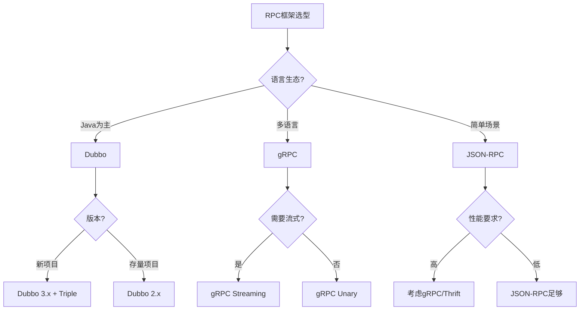
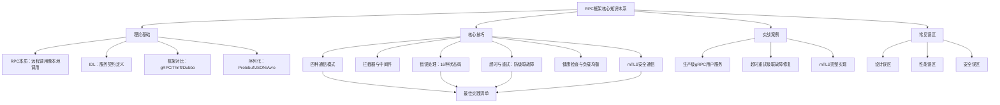

# 第43章 RPC框架 - 本章小结

## 一、本章核心知识体系回顾

本章从RPC的基本原理出发，系统构建了RPC框架的完整知识体系，覆盖了理论基础、核心技巧、实战案例和常见误区四个层次。以下是对全章知识脉络的系统梳理。

### 1.1 RPC的本质与核心认知

RPC的核心思想可以用一句话概括：**让远程调用像本地调用一样自然，把网络通信的复杂性封装在基础设施层**。

回顾全章，理解RPC需要建立三个层次的认知：

| 认知层次 | 核心要点 | 关键理解 |
|---------|---------|---------|
| **是什么** | RPC = Client Stub + 序列化 + 网络传输 + Server Stub | 8步调用链对调用方完全透明 |
| **怎么做** | IDL定义接口 → 代码生成 → 框架封装传输 | Protobuf/Thrift IDL是跨语言通信的契约 |
| **为什么重要** | 微服务间高频调用、性能要求、类型安全 | 一次用户请求可能触发5-20次RPC调用 |

### 1.2 五大核心组件

RPC框架的五大核心组件构成了完整的调用链路：

┌─────────────┐    ┌──────────────┐    ┌──────────────┐    ┌──────────────┐    ┌─────────────┐
│ Client Stub │───→│  Serializer  │───→│  Transport   │───→│  Serializer  │───→│ Server Stub │
│ (客户端存根) │    │  (序列化器)   │    │  (传输层)     │    │  (反序列化)   │    │ (服务端存根) │
└─────────────┘    └──────────────┘    └──────────────┘    └──────────────┘    └─────────────┘
       │                                      │                                      │
       │         Protobuf/JSON 编码            │      TCP/HTTP2/QUIC 传输             │
       │         将对象转为字节流               │      建立连接、传输数据               │
       │                                      │      路由、流控、错误重传             │
       └──────────────────────────────────────┴──────────────────────────────────────┘

每个组件的设计决策都会影响整体性能和可靠性：
- **Client Stub/Server Stub**：由IDL编译器自动生成，屏蔽了序列化和网络通信的复杂性
- **IDL（接口定义语言）**：定义服务契约，是跨语言通信的基础（Protobuf、Thrift IDL）
- **序列化器**：决定了数据编码效率（Protobuf比JSON小3-10倍，快5-100倍）
- **传输层**：决定了网络通信模型（HTTP/2多路复用 vs 自定义TCP）

## 二、RPC框架选型决策矩阵

选择合适的RPC框架是架构设计的关键决策。本章系统对比了五大主流框架：

| 维度 | gRPC | Apache Thrift | Dubbo | Cap'n Proto | JSON-RPC |
|------|------|--------------|-------|-------------|----------|
| **序列化** | Protobuf（二进制） | Binary/Compact（二进制） | Protobuf/JSON | Cap'n Proto | JSON |
| **传输层** | HTTP/2 | 自定义TCP | 自定义TCP | 自定义TCP | HTTP |
| **流式支持** | 四种模式 | 不支持 | 不支持 | 不支持 | 不支持 |
| **跨语言** | 10+种语言 | 20+种语言 | 主要Java | C++/Rust/Python等 | 所有语言 |
| **代码生成** | protoc + 插件 | thrift编译器 | dubbo-gen | capnp编译器 | 无 |
| **服务治理** | 需外部集成 | 需外部集成 | 内置 | 无 | 无 |
| **浏览器支持** | gRPC-Web | 不支持 | 不支持 | 不支持 | 支持 |
| **零拷贝** | 不支持 | 不支持 | 不支持 | 支持 | 不支持 |
| **社区生态** | Google主导，活跃 | Apache基金会 | 阿里主导 | 社区较小 | 最广泛 |

**选型决策树**：



**核心选型原则**：
- **内部微服务通信**：优先gRPC（HTTP/2 + Protobuf，云原生首选）
- **Java微服务生态**：优先Dubbo（内置服务治理，阿里主导）
- **极致性能场景**：考虑Cap'n Proto（零拷贝序列化）
- **对外API服务**：优先REST/HTTP（浏览器友好，生态最广泛）
- **简单跨语言场景**：JSON-RPC（轻量、通用、调试方便）

## 三、gRPC四种通信模式深度总结

gRPC提供四种通信模式，覆盖从简单查询到实时双向通信的全场景需求。理解每种模式的适用边界是正确设计服务接口的前提。

| 模式 | 请求消息数 | 响应消息数 | 数据流方向 | 典型场景 | 关键实现细节 |
|------|-----------|-----------|-----------|---------|------------|
| **Unary RPC** | 1 | 1 | 客户端 → 服务端 → 客户端 | 普通查询、写操作 | 80%以上调用属于此模式 |
| **Server Streaming** | 1 | N（流） | 客户端 → 服务端 ⇄ 客户端 | 数据导出、实时推送 | 服务端控制发送节奏 |
| **Client Streaming** | N（流） | 1 | 客户端 ⇄ 服务端 → 客户端 | 文件上传、批量导入 | CloseAndRecv必须调用 |
| **Bidirectional** | N（流） | N（流） | 客户端 ⇄ 服务端 | 实时聊天、双向管道 | 双方独立流，最灵活 |

**模式选择决策指南**：

需要调用远程方法？
├── 只需一个结果 → Unary RPC
│   └── 占生产环境80%+调用
├── 需要返回大量数据？
│   ├── 服务端控制推送节奏 → Server Streaming
│   └── 数据量小但需要分页 → 也可用Unary
├── 需要上传大量数据？
│   ├── 单向批量上传 → Client Streaming
│   └── 需要实时进度反馈 → 升级为Bidirectional
└── 需要双向实时通信？
    └── Bidirectional Streaming
        ├── 聊天室
        ├── 实时状态同步
        └── 双向数据管道

**关键实现要点**：
- **流结束信号**：Server Streaming服务端返回`nil`表示正常结束，客户端收到`io.EOF`
- **上下文管理**：`stream.Context()`绑定调用方context，取消请求时服务端收到取消信号
- **流量控制**：gRPC基于HTTP/2流量控制窗口限制发送速率，避免客户端内存溢出
- **SendAndClose vs CloseAndRecv**：Client Streaming中服务端用`SendAndClose`，客户端用`CloseAndRecv`

## 四、拦截器与横切关注点

拦截器（Interceptor）是实现横切关注点的标准方式，类似于Web框架中的中间件。本章详细讲解了拦截器的设计与实战。

### 4.1 拦截器架构

┌─────────────────────────────────────────────────────┐
│                   gRPC请求处理流程                    │
├─────────────────────────────────────────────────────┤
│                                                     │
│  客户端请求                                         │
│      │                                              │
│      ▼                                              │
│  ┌─────────────────┐                                │
│  │  Client Interceptor │  ← 请求元数据注入、客户端日志  │
│  └────────┬────────┘                                │
│           │                                          │
│      ▼                                              │
│  ┌─────────────────┐                                │
│  │  Server Interceptor │  ← 认证、日志、追踪、限流     │
│  └────────┬────────┘                                │
│           │                                          │
│      ▼                                              │
│  ┌─────────────────┐                                │
│  │  业务处理函数    │                                │
│  └────────┬────────┘                                │
│           │                                          │
│      ▼                                              │
│  ┌─────────────────┐                                │
│  │  Server Interceptor Post │  ← 指标采集、错误处理    │
│  └────────┬────────┘                                │
│           │                                          │
│      ▼                                              │
│  响应返回客户端                                      │
└─────────────────────────────────────────────────────┘

### 4.2 拦截器实战清单

本章介绍了五种核心拦截器的实现：

| 拦截器类型 | 核心功能 | 实现要点 | 典型应用场景 |
|-----------|---------|---------|------------|
| **日志拦截器** | 记录请求方法、耗时、状态码 | 起止时间计算、traceId提取 | 所有RPC调用的可观测性 |
| **认证拦截器** | 验证JWT/Token有效性 | 元数据提取、token验证、上下文注入 | 所有需要鉴权的服务 |
| **限流拦截器** | 令牌桶/滑动窗口限流 | 令牌生成、并发控制、超限拒绝 | 高并发API、对外服务 |
| **追踪拦截器** | 分布式追踪span创建 | OpenTelemetry集成、context传播 | 微服务链路追踪 |
| **恢复拦截器** | panic恢复防止服务崩溃 | recover()捕获、错误日志、状态返回 | 所有服务端 |

**拦截器链的执行顺序**至关重要：

```go
// 推荐的拦截器注册顺序
grpc.ChainUnaryInterceptor(
    recoveryInterceptor,    // 1. 最外层：panic恢复（最先执行，最后退出）
    tracingInterceptor,     // 2. 分布式追踪（最先创建span）
    authInterceptor,        // 3. 认证鉴权（验证身份）
    rateLimitInterceptor,   // 4. 限流控制（防止过载）
    loggingInterceptor,     // 5. 日志记录（最后记录完整信息）
)
```

**关键原则**：拦截器的注册顺序就是执行顺序。认证应在限流之前（未认证请求不应消耗限流配额），日志应在最后（记录完整的处理结果）。

## 五、错误处理：16种状态码的正确使用

gRPC定义了16种标准状态码，正确使用状态码是构建健壮RPC服务的基础。

### 5.1 状态码分类速查

| 类别 | 状态码 | 含义 | 客户端行为 | 典型场景 |
|------|-------|------|-----------|---------|
| **成功** | OK | 请求成功 | 无 | 正常业务响应 |
| **取消** | CANCELLED | 客户端主动取消 | 无需重试 | 用户取消操作 |
| **参数错误** | INVALID_ARGUMENT | 参数不合法 | 修正参数后重试 | 校验失败 |
| **权限** | PERMISSION_DENIED | 无权限 | 登录后重试 | 权限不足 |
| **资源** | NOT_FOUND | 资源不存在 | 检查资源ID | 查询不存在的数据 |
| **重复** | ALREADY_EXISTS | 资源已存在 | 检查是否重复提交 | 创建重复资源 |
| **未认证** | UNAUTHENTICATED | 身份未验证 | 重新认证 | Token过期 |
| **瞬时故障** | UNAVAILABLE | 服务不可用 | 可重试（指数退避） | 服务重启、网络抖动 |
| **超时** | DEADLINE_EXCEEDED | 请求超时 | 可重试（检查超时设置） | 服务端处理过慢 |
| **资源耗尽** | RESOURCE_EXHAUSTED | 资源不足 | 稍后重试 | 限流触发、内存不足 |
| **内部错误** | INTERNAL | 服务端内部错误 | 报告运维 | 未捕获的异常 |
| **未实现** | UNIMPLEMENTED | 方法未实现 | 检查API版本 | 调用不存在的方法 |

### 5.2 错误处理最佳实践

**错误详情机制**：通过`status.WithDetails`附加结构化错误信息，帮助客户端理解错误原因：

```go
// 服务端：附加错误详情
st, _ := status.New(codes.InvalidArgument, "invalid email format")
st, _ = st.WithDetails(&amp;errdetails.BadRequest{
    FieldViolations: []*errdetails.BadRequest_FieldViolation{
        {Field: "email", Description: "must be a valid email address"},
    },
})
return nil, st.Err()

// 客户端：解析错误详情
st, _ := status.FromError(err)
for _, detail := range st.Details() {
    switch d := detail.(type) {
    case *errdetails.BadRequest:
        for _, v := range d.FieldViolations {
            log.Printf("Field: %s, Error: %s", v.Field, v.Description)
        }
    }
}
```

**错误码选择原则**：
- 参数校验失败 → `InvalidArgument`
- 资源不存在 → `NotFound`
- 重复创建 → `AlreadyExists`
- 权限不足 → `PermissionDenied`
- 服务内部错误 → `Internal`
- 瞬时故障 → `Unavailable`（可重试）
- 超时 → `DeadlineExceeded`（可重试）

## 六、超时与重试：防止级联故障的关键

超时和重试是RPC调用中最关键的工程实践，设计不当会导致级联故障。本章通过真实案例展示了超时设置不当导致的雪崩效应。

### 6.1 分层超时设计

调用链超时时间分配（示例：用户下单场景）

用户请求 → Gateway(5s) → 订单服务(4s) → 库存服务(3s) → 支付服务(3.5s)
                                    └→ 用户服务(2s)
                                    └→ 通知服务(1s)

原则：
1. Gateway总超时 = 所有下游服务超时之和（留有余量）
2. 每层超时 < 上一层超时
3. 超时时间 = 正常处理时间 × 3（留有余量）
4. 避免所有服务使用相同超时值

**超时设置的三层结构**：

| 超时层级 | 含义 | 推荐值 | 配置方式 |
|---------|------|--------|---------|
| **连接超时** | 建立TCP连接的超时 | 1-3秒 | `grpc.WithTimeout()` |
| **请求超时** | 等待服务端响应的超时 | 1-5秒 | `context.WithTimeout()` |
| **总超时** | 包括重试在内的总超时 | 根据业务定 | 上层context控制 |

### 6.2 重试策略设计

**可重试错误类型**（只重试瞬时故障）：

| 错误类型 | 状态码 | 是否可重试 | 原因 |
|---------|-------|-----------|------|
| 服务不可用 | UNAVAILABLE | 是 | 服务重启、网络抖动 |
| 请求超时 | DEADLINE_EXCEEDED | 是 | 服务端处理过慢 |
| 资源耗尽 | RESOURCE_EXHAUSTED | 是 | 限流触发，稍后恢复 |
| 参数错误 | INVALID_ARGUMENT | 否 | 修正参数才能成功 |
| 资源不存在 | NOT_FOUND | 否 | 资源确实不存在 |
| 权限不足 | PERMISSION_DENIED | 否 | 需要重新授权 |

**指数退避重试算法**：

重试间隔 = Base Delay × 2^n + Jitter

其中：
- Base Delay: 基础延迟（如100ms）
- n: 当前重试次数（0, 1, 2...）
- Jitter: 随机抖动（0-100ms），避免重试风暴

示例（Base=100ms，最大重试3次）：
第1次重试：100ms + Jitter(0-100ms) ≈ 100-200ms
第2次重试：200ms + Jitter(0-100ms) ≈ 200-300ms
第3次重试：400ms + Jitter(0-100ms) ≈ 400-500ms

**重试预算机制**：限制重试请求占总请求的比例（如10%），防止重试风暴放大流量：

```go
// 重试预算配置
retryPolicy := &amp;grpc.RetryPolicy{
    MaxAttempts:          3,                    // 最大重试次数
    InitialBackoff:      100 * time.Millisecond, // 初始退避时间
    MaxBackoff:          5 * time.Second,       // 最大退避时间
    BackoffMultiplier:   2,                     // 退避倍数
    RetryableStatusCodes: []codes.Code{
        codes.Unavailable,
        codes.DeadlineExceeded,
    },
}
```

### 6.3 幂等性保证

重试机制的必要补充是幂等性保证。三种实现方案：

| 方案 | 实现方式 | 适用场景 | 优缺点 |
|------|---------|---------|--------|
| **唯一请求ID** | 客户端生成UUID，服务端去重 | 所有场景 | 简单可靠，需存储去重表 |
| **乐观锁/版本号** | 数据库版本号校验 | 更新操作 | 无需额外存储，但并发冲突时需重试 |
| **去重表** | Redis/数据库记录已处理请求 | 高并发场景 | 性能好，需维护去重表 |

## 七、安全通信：mTLS实战

在零信任安全模型下，服务间通信必须加密和认证。本章详细讲解了mTLS（双向TLS认证）的完整实现。

### 7.1 TLS vs mTLS 对比

| 特性 | 单向TLS | mTLS（双向TLS） |
|------|--------|----------------|
| **认证方向** | 服务端向客户端证明身份 | 双方互相证明身份 |
| **证书要求** | 服务端证书 | 客户端和服务端都有证书 |
| **适用场景** | 对外API、浏览器访问 | 内部微服务间通信 |
| **安全性** | 中等 | 高（零信任基础） |
| **配置复杂度** | 低 | 中等（需证书管理） |

### 7.2 mTLS配置要点

**服务端配置**：

```go
// 服务端mTLS配置
creds, err := credentials.NewServerTLSFromFile("server.crt", "server.key")
if err != nil {
    log.Fatalf("failed to load TLS credentials: %v", err)
}

// 加载CA证书，用于验证客户端证书
certPool := x509.NewCertPool()
ca, _ := os.ReadFile("ca.crt")
certPool.AppendCertsFromPEM(ca)

tlsConfig := &amp;tls.Config{
    ClientAuth: tls.RequireAndVerifyClientCert,
    ClientCAs:  certPool,
}

server := grpc.NewServer(
    grpc.Creds(credentials.NewTLS(tlsConfig)),
)
```

**客户端配置**：

```go
// 客户端mTLS配置
creds, err := credentials.NewClientTLSFromFile("ca.crt", "server.example.com")
if err != nil {
    log.Fatalf("failed to load CA certificate: %v", err)
}

conn, err := grpc.NewClient(
    "server:50051",
    grpc.WithTransportCredentials(creds),
)
```

**证书管理自动化**：
- **Kubernetes环境**：使用cert-manager自动签发和续期证书
- **SPIFFE/SPIRE**：为每个服务实例分配唯一身份（SVID），自动化证书轮转
- **HashiCorp Vault**：企业级证书管理，支持动态证书签发

## 八、健康检查与负载均衡

### 8.1 gRPC Health Protocol

gRPC提供了标准的健康检查协议（`grpc.health.v1.Health`），支持整体健康和按服务健康：

```protobuf
// 健康检查协议定义
service Health {
    rpc Check(HealthCheckRequest) returns (HealthCheckResponse);
    rpc Watch(HealthCheckRequest) returns (stream HealthCheckResponse);
}

message HealthCheckRequest {
    string service = 1;  // 空字符串表示整体健康
}

message HealthCheckResponse {
    enum ServingStatus {
        UNKNOWN = 0;
        SERVING = 1;
        NOT_SERVING = 2;
        SERVICE_UNKNOWN = 3;
    }
    ServingStatus status = 1;
}
```

**健康检查的三种状态**：
- **SERVING**：服务正常，可以接收请求
- **NOT_SERVING**：服务异常，不应接收新请求（如正在关闭、依赖不可用）
- **SERVICE_UNKNOWN**：服务未注册健康检查

### 8.2 负载均衡策略

| 策略 | 原理 | 适用场景 | gRPC支持 |
|------|------|---------|---------|
| **pick_first** | 选择第一个可用连接 | 简单场景、调试 | 内置 |
| **round_robin** | 轮询所有连接 | 通用场景、实例同构 | 内置 |
| **加权轮询** | 按权重分配请求 | 实例异构、灰度发布 | 需自定义Resolver |
| **最少连接** | 选择连接数最少的实例 | 长连接、处理时间差异大 | 需自定义 |
| **一致性哈希** | 相同请求路由到相同实例 | 有状态服务、缓存亲和性 | 需自定义 |

## 九、十大常见误区与纠正

本章揭示了RPC框架使用中最容易犯的十大错误，每一条都基于真实案例：

| 误区 | 错误做法 | 真实影响 | 正确做法 |
|------|---------|---------|---------|
| **1. 超时设置过长或不设置** | 不设超时或60秒超时 | 线程泄漏、雪崩 | 1-5秒，根据业务调整 |
| **2. 重试所有错误** | 对所有错误重试 | 浪费资源、数据不一致 | 只重试UNAVAILABLE/DEADLINE_EXCEEDED |
| **3. 忽略幂等性** | 重试导致数据重复 | 金融场景致命 | 唯一请求ID + 去重表 |
| **4. 序列化选择不当** | 内部RPC用JSON | 性能低下 | 内部用Protobuf，对外用JSON |
| **5. 单连接承载所有流量** | 所有请求共用一个连接 | 连接成为瓶颈 | 使用连接池或多连接 |
| **6. 忽略服务端流控** | Server Streaming发送过快 | 客户端内存溢出 | 控制发送速率 |
| **7. 不使用健康检查** | 不配置健康检查 | 负载均衡器无法感知状态 | 注册gRPC Health服务 |
| **8. 错误的日志级别** | 常见错误用ERROR | 告警疲劳 | 根据错误类型设置级别 |
| **9. 内部服务不使用TLS** | 内网明文传输 | 通信内容可被窃取 | 使用mTLS |
| **10. 不做请求认证** | mTLS只保证通信安全 | 请求可能不合法 | mTLS + JWT双重认证 |

**误区纠正的核心原则**：
1. **永远设置超时**：没有超时的RPC调用是定时炸弹
2. **只重试可重试错误**：参数错误重试一万次也不会成功
3. **幂等性是重试的前提**：重试机制必须配合幂等性设计
4. **序列化选型看场景**：性能和可读性不可兼得，根据场景选择
5. **安全不能只靠mTLS**：通信安全 ≠ 请求合法性

## 十、实战案例总结

本章通过三个真实案例展示了RPC框架技术的工程应用：

### 案例一：生产级gRPC用户服务

**场景**：某电商平台构建用户服务，要求QPS > 10000，支持流式导出。

**关键实现**：
- Protobuf接口定义，支持Unary + Server Streaming + Client Streaming
- Redis缓存 + 数据库双层查询
- 拦截器链：恢复 → 日志 → 指标采集
- 优雅关闭：等待正在处理的请求完成
- 性能压测：ghz工具验证QPS达标

**压测结果**：42,735 QPS，P99延迟 < 50ms

### 案例二：超时与重试导致的级联故障

**场景**：微服务架构中，因超时设置不当导致雪崩效应。

**根因分析**：
1. 所有服务使用相同超时值（30秒）
2. 下游服务变慢，上游服务线程池耗尽
3. 雪崩效应扩散到整个调用链

**修复方案**：
1. 实现分层超时：Gateway(5s) → 服务A(4s) → 服务B(3s)
2. 添加熔断器：连续失败5次后熔断30秒
3. 实现降级逻辑：熔断时返回缓存数据或默认值

### 案例三：mTLS安全通信

**场景**：从零搭建gRPC mTLS双向认证。

**完整流程**：
1. 使用OpenSSL生成CA证书和服务端证书
2. 配置服务端mTLS：加载服务端证书、验证客户端证书
3. 配置客户端mTLS：加载CA证书、验证服务端证书
4. 实现证书轮转：cert-manager自动签发新证书

**关键配置**：服务端`ClientAuth: tls.RequireAndVerifyClientCert`

## 十一、关键性能指标参考

RPC框架的性能评估需要关注以下核心指标：

| 指标 | 含义 | 典型值 | 优化方向 |
|------|------|--------|----------|
| **调用延迟 (Latency)** | 从发起调用到收到响应的时间 | P50: < 5ms; P99: < 50ms; P999: < 200ms | 减少序列化开销、优化网络路径 |
| **吞吐量 (Throughput)** | 单实例每秒处理的请求数 | gRPC Unary: 10K-100K QPS | 连接池、多路复用、水平扩容 |
| **序列化大小** | 编码后的数据字节量 | Protobuf: 基准; JSON: 3-10倍 | 选择高效格式、字段编号优化 |
| **序列化速度** | 编码/解码的耗时 | Protobuf: 基准; JSON: 5-100倍慢 | 选择高效格式、避免反射 |
| **错误率** | 失败请求占总请求的比例 | < 0.1%（优秀）; < 1%（一般） | 超时重试策略、熔断降级 |
| **连接复用率** | 一个TCP连接处理的请求数 | HTTP/2: 1000-10000 | Keep-Alive、多路复用 |
| **可用性** | 服务正常运行时间比例 | 99.9%（3个9）; 99.99%（4个9） | 冗余部署、故障转移、健康检查 |

## 十二、核心模型总结



## 十三、最佳实践清单

以下是本章总结的RPC框架最佳实践，可作为团队开发规范参考：

### 设计阶段
- [ ] 根据语言生态和性能需求选择合适的RPC框架
- [ ] 使用IDL定义服务接口，确保强类型约束
- [ ] 选择合适的通信模式（80%场景用Unary）
- [ ] 设计版本兼容的Protobuf字段编号（只新增不修改不删除）

### 开发阶段
- [ ] 实现拦截器链：恢复 → 追踪 → 认证 → 限流 → 日志
- [ ] 使用gRPC标准状态码，不自定义错误码
- [ ] 所有操作实现幂等性（唯一请求ID + 去重表）
- [ ] 客户端设置合理超时（1-5秒）
- [ ] 重试策略：只重试UNAVAILABLE/DEADLINE_EXCEEDED，指数退避+抖动

### 部署阶段
- [ ] 配置分层超时（Gateway > 服务A > 服务B）
- [ ] 注册gRPC Health服务，配合负载均衡器
- [ ] 使用mTLS加密内部服务通信
- [ ] 配置连接池或多连接，避免单连接瓶颈
- [ ] 实现优雅关闭，等待正在处理的请求完成

### 运维阶段
- [ ] 监控核心指标：延迟P99、错误率、吞吐量
- [ ] 根据错误类型设置日志级别（避免告警疲劳）
- [ ] 定期压测验证性能基线
- [ ] 证书自动轮转（cert-manager/HashiCorp Vault）

## 十四、下一步学习建议

本章构建了RPC框架的完整知识体系，但分布式系统的挑战远不止于此。以下是进阶学习路径：

### 1. 序列化深度优化
**关联章节**：第48章 序列化与编码

深入理解Protobuf的wire format（字段编号+Varint编码+ZigZag编码），掌握序列化性能调优技巧。了解FlatBuffers的零拷贝序列化原理，以及Apache Arrow的列式存储优化。

### 2. 服务治理进阶
**关联章节**：第41章 服务治理

从RPC框架延伸到完整的服务治理体系：服务发现（Nacos/Consul/etcd）、负载均衡（一致性哈希、加权轮询）、熔断降级（Hystrix/Sentinel）、链路追踪（Jaeger/SkyWalking）。

### 3. 服务网格（Service Mesh）
**关联章节**：第58章 服务网格

理解RPC通信的基础设施层：Sidecar代理（Envoy）、控制平面（Istio）、流量管理、安全策略。Service Mesh将RPC的网络通信下沉到基础设施层，业务代码无需感知。

### 4. 分布式事务
**关联章节**：第55章 分布式事务

RPC调用链中的数据一致性问题：Saga模式、TCC模式、本地消息表、事务消息。理解跨服务的数据一致性挑战和解决方案。

### 5. 高级主题
- **RPC网关**：gRPC-Gateway将gRPC服务转换为REST API
- **跨数据中心调用**：多活架构下的RPC路由和数据同步
- **协议演进**：gRPC over QUIC（HTTP/3）的性能优势
- **Connect框架**：Buf推出的轻量RPC框架，兼容gRPC，支持浏览器直连

## 关键记忆点

> **核心原则**：RPC框架的选择不仅是一个技术问题，更是一个生态问题。选择与团队技术栈匹配的框架，比追求"最好"的框架更重要。

> **设计哲学**：RPC的核心价值是将分布式调用的复杂性封装在基础设施层，让开发者专注于业务逻辑。但RPC不是银弹——它引入了网络不可靠、序列化开销、服务治理三大挑战。

> **工程实践**：超时、重试、幂等性是RPC调用的三驾马车。超时防止资源泄漏，重试处理瞬时故障，幂等性保证数据一致性。三者缺一不可。

> **安全意识**：在零信任模型下，内部服务间通信必须使用mTLS加密。但mTLS只保证通信安全，请求合法性需要额外的认证机制（JWT/OAuth2）。

> **性能认知**：Protobuf比JSON小3-10倍、快5-100倍，但序列化只是RPC性能的一部分。连接管理、负载均衡、超时策略对整体性能的影响同样巨大。
