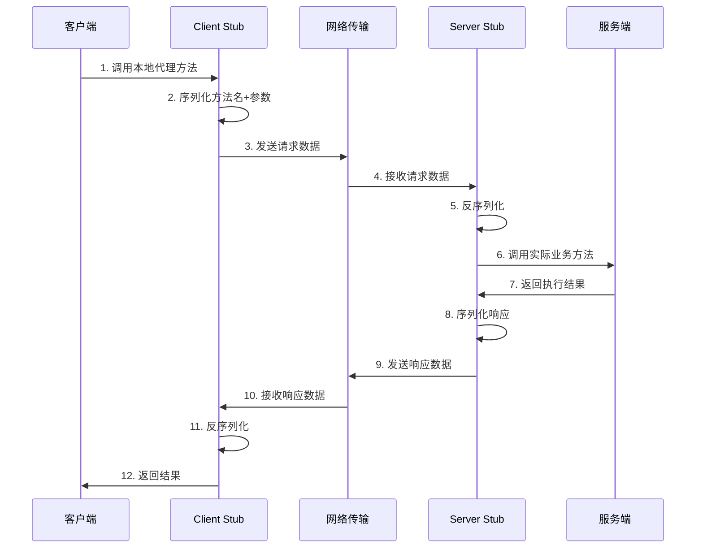
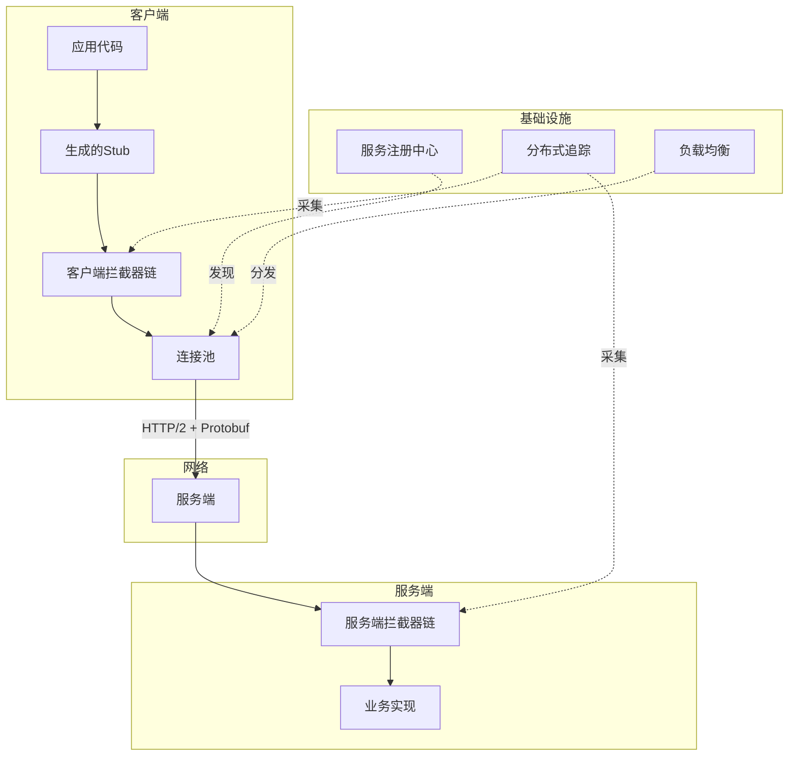
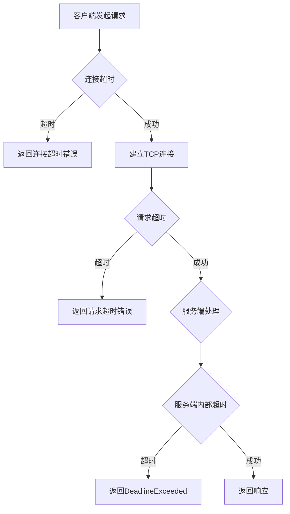
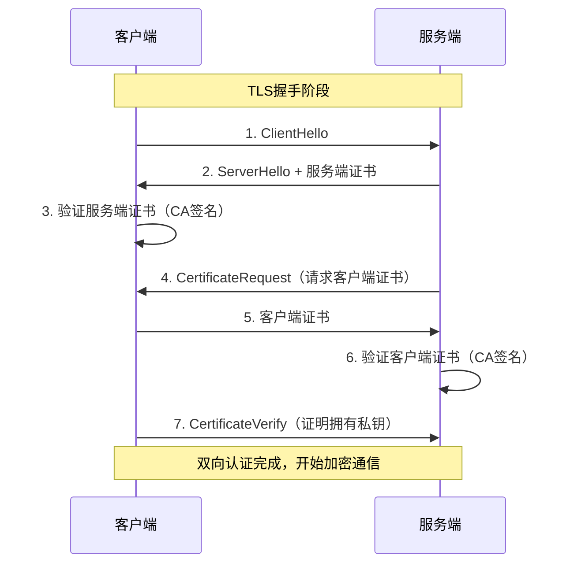
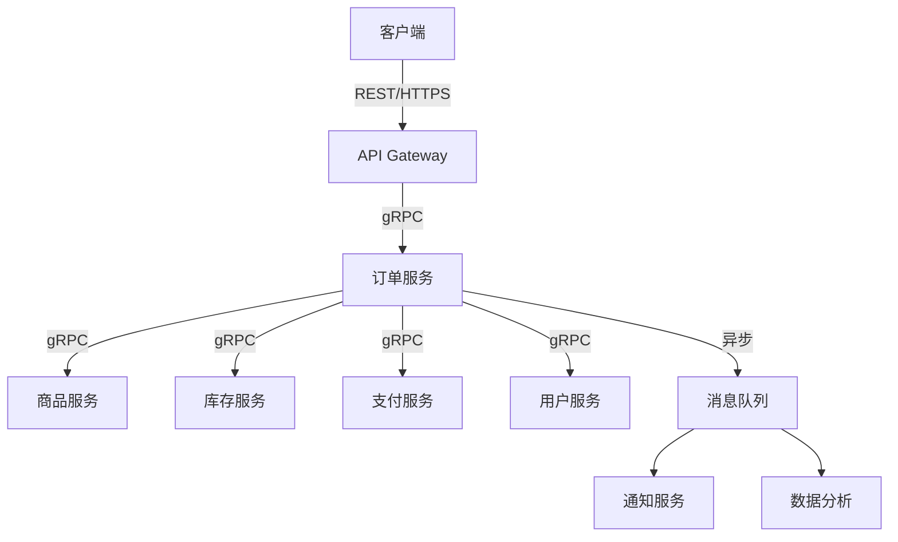

# 第43章 RPC框架

## 章节定位

RPC（Remote Procedure Call，远程过程调用）是分布式系统中最基础的通信机制。它允许程序调用远程服务器上的方法，就像调用本地方法一样，隐藏了网络通信的复杂性。在微服务架构中，服务间通信的质量直接决定了系统的性能、可靠性和可维护性。本章将从RPC的基本原理出发，深入讲解gRPC、Thrift等主流框架的技术细节，并通过电商和实时数据同步两个实战案例展示工程实践。

## 章节结构

本章分为五个部分：

1. **理论基础**（43.1-43.6）：RPC基本原理、gRPC框架详解、Apache Thrift、序列化格式对比、超时重试与幂等性、mTLS安全通信
2. **核心技巧**（43.7-43.11）：gRPC性能优化、Protobuf最佳实践、错误处理、负载均衡策略、服务治理集成
3. **实战案例**（43.12-43.14）：微服务电商平台RPC架构、实时数据同步系统、跨语言RPC互操作
4. **常见误区**（43.15）：设计、性能、安全三大维度的典型错误
5. **练习与总结**（43.16-43.17）：从基础到高级的递进式练习

## 学习目标

通过本章的学习，读者应能：

1. 理解RPC的基本原理和调用流程，能够对比RPC与REST的适用场景
2. 掌握gRPC的四种通信模式（Unary、Server Streaming、Client Streaming、Bidirectional）
3. 熟练使用Protobuf定义服务接口和消息格式，遵循向后兼容的设计原则
4. 理解不同序列化格式（Protobuf、JSON、Avro、MessagePack）的性能差异
5. 掌握RPC框架中超时、重试、幂等性的工程实践
6. 了解mTLS的原理和在RPC通信中的应用
7. 能够设计和实现高性能、高可用的RPC服务

## 前置知识

- 网络协议基础，特别是HTTP/2（第18-19章）
- 服务治理基础（第41章）
- 密码学基础（第33章）

---

# 第43章 RPC框架 - 理论基础

## 43.1 RPC的基本原理

### 43.1.1 什么是RPC

RPC（Remote Procedure Call，远程过程调用）是一种分布式计算的通信协议，它允许程序调用远程服务器上的方法，就像调用本地方法一样。RPC的核心目标是让分布式系统的开发像单机程序一样简单，开发者不需要关心底层的网络通信细节。

RPC的概念最早由Andrew Birrell和Bruce Nelson在1984年的论文《Implementing Remote Procedure Calls》中提出。其核心思想是：通过网络调用远程服务时，使用与调用本地函数相同的编程模型，由底层框架自动处理序列化、网络传输、反序列化等复杂细节。

一个完整的RPC调用流程包括以下步骤：



```go
// RPC调用的客户端视角
// 对于调用方来说，就像调用本地方法一样简单
func main() {
    // 创建RPC客户端连接
    conn, err := grpc.NewClient("order-service:50051",
        grpc.WithTransportCredentials(insecure.NewCredentials()),
    )
    if err != nil {
        log.Fatalf("Failed to connect: %v", err)
    }
    defer conn.Close()
    
    // 创建服务客户端
    orderClient := pb.NewOrderServiceClient(conn)
    
    // 调用远程方法，就像调用本地方法一样
    resp, err := orderClient.CreateOrder(context.Background(), &amp;pb.CreateOrderRequest{
        UserId:    "user-123",
        ProductId: "product-456",
        Quantity:  2,
    })
    if err != nil {
        log.Fatalf("Failed to create order: %v", err)
    }
    
    fmt.Printf("Order created: %s\n", resp.OrderId)
}
```

### 43.1.2 RPC与HTTP API的对比

RPC和HTTP API（如REST）是分布式系统中最常用的两种通信方式。它们各有优缺点，适用于不同的场景。

| 对比维度 | RPC（如gRPC） | HTTP REST API |
|----------|--------------|---------------|
| **序列化格式** | 二进制（Protobuf），体积小、速度快 | 文本（JSON），可读性好但效率低 |
| **接口定义** | IDL强类型约束，自动代码生成 | OpenAPI/Swagger描述，约束力较弱 |
| **传输协议** | gRPC基于HTTP/2；Thrift基于自定义TCP | HTTP/1.1或HTTP/2 |
| **通信模式** | 支持流式、双向通信 | 通常为请求-响应 |
| **浏览器支持** | 需要gRPC-Web代理 | 原生支持 |
| **调试难度** | 二进制格式，需专用工具 | 文本格式，curl即可调试 |
| **适合场景** | 内部服务间高频通信 | 对外暴露的API |

**选型原则**：内部服务间通信优先选择RPC（性能高、强类型），对外API优先选择REST（通用性强、易于集成）。在实际项目中，两者往往并存——对外用REST网关，对内用gRPC直连。

### 43.1.3 主流RPC框架概览

除了gRPC和Thrift，RPC生态中还有多个值得关注的框架：

**Apache Dubbo**：阿里开源的Java RPC框架，提供了完善的服务治理能力（负载均衡、熔断降级、服务注册发现），在国内Java生态中广泛使用。2.7版本后支持多语言，与gRPC兼容。

**Connect（connectrpc.com）**：由前gRPC核心团队成员开发，兼容gRPC协议但提供更好的浏览器支持和调试体验。支持HTTP/1.1和gRPC两种协议，可以无需代理直接从浏览器调用。

**JSON-RPC**：基于JSON的轻量级RPC协议，在以太坊等区块链系统中广泛使用。协议简单（请求：`{"jsonrpc":"2.0","method":"xxx","params":{},"id":1}`），易于实现，但性能不如二进制协议。

**Cap'n Proto RPC**：由Protobuf原作者开发，使用零拷贝序列化，性能极高，但生态相对较小。

---

## 43.2 gRPC框架

### 43.2.1 gRPC的架构

gRPC是Google开源的高性能RPC框架，基于HTTP/2协议和Protobuf序列化格式。gRPC的主要特点包括：

**基于HTTP/2**：支持多路复用，一个TCP连接可以同时传输多个请求和响应；支持头部压缩（HPACK），减少网络传输开销；支持双向流式通信。

**基于Protobuf**：使用Protobuf作为默认的序列化格式，序列化后的数据体积小、速度快。同时Protobuf提供了强类型的IDL，支持代码生成。

**跨语言支持**：gRPC支持Go、Java、Python、C++、C#、Ruby、Node.js等十多种编程语言。通过Protobuf的代码生成工具，可以自动生成各语言的客户端和服务端代码。

**拦截器机制**：gRPC提供了拦截器（Interceptor）机制，可以在请求处理的各个阶段插入自定义逻辑，如认证、日志、追踪、限流等。



```protobuf
// 定义gRPC服务接口
syntax = "proto3";

package order;

option go_package = "github.com/example/proto/order";

// 订单服务定义
service OrderService {
    // 创建订单 - 一元RPC
    rpc CreateOrder(CreateOrderRequest) returns (CreateOrderResponse);
    
    // 查询订单列表 - 服务端流式RPC
    rpc ListOrders(ListOrdersRequest) returns (stream Order);
    
    // 批量上传订单 - 客户端流式RPC
    rpc UploadOrders(stream UploadOrderRequest) returns (UploadOrderResponse);
    
    // 实时订单状态更新 - 双向流式RPC
    rpc WatchOrderStatus(stream WatchOrderRequest) returns (stream OrderStatusUpdate);
}

// 消息定义
message CreateOrderRequest {
    string user_id = 1;
    string product_id = 2;
    int32 quantity = 3;
    Address shipping_address = 4;
}

message CreateOrderResponse {
    string order_id = 1;
    OrderStatus status = 2;
    int64 created_at = 3;
}

message Order {
    string order_id = 1;
    string user_id = 2;
    repeated OrderItem items = 3;
    OrderStatus status = 4;
    int64 created_at = 5;
}

message OrderItem {
    string product_id = 1;
    int32 quantity = 2;
    int64 price = 3;
}

enum OrderStatus {
    ORDER_STATUS_UNKNOWN = 0;
    ORDER_STATUS_PENDING = 1;
    ORDER_STATUS_PAID = 2;
    ORDER_STATUS_SHIPPED = 3;
    ORDER_STATUS_DELIVERED = 4;
    ORDER_STATUS_CANCELLED = 5;
}
```

### 43.2.2 gRPC的四种通信模式

gRPC定义了四种通信模式，覆盖了从简单请求到复杂实时交互的各种场景：

**一元RPC（Unary RPC）**是最基本的通信模式，客户端发送一个请求，服务端返回一个响应。类似于普通的HTTP请求，适用于大多数CRUD操作。

```go
// 一元RPC服务端实现
type orderServer struct {
    pb.UnimplementedOrderServiceServer
}

func (s *orderServer) CreateOrder(ctx context.Context, req *pb.CreateOrderRequest) (*pb.CreateOrderResponse, error) {
    // 参数校验
    if req.UserId == "" || req.ProductId == "" {
        return nil, status.Error(codes.InvalidArgument, "user_id and product_id are required")
    }
    if req.Quantity <= 0 {
        return nil, status.Error(codes.InvalidArgument, "quantity must be positive")
    }
    
    // 业务逻辑处理
    orderID := generateOrderID()
    
    // 保存订单到数据库
    order := &amp;Order{
        ID:        orderID,
        UserID:    req.UserId,
        ProductID: req.ProductId,
        Quantity:  req.Quantity,
        Status:    pb.OrderStatus_ORDER_STATUS_PENDING,
        CreatedAt: time.Now().Unix(),
    }
    
    if err := s.orderRepo.Save(ctx, order); err != nil {
        return nil, status.Errorf(codes.Internal, "failed to save order: %v", err)
    }
    
    return &amp;pb.CreateOrderResponse{
        OrderId:   orderID,
        Status:    pb.OrderStatus_ORDER_STATUS_PENDING,
        CreatedAt: order.CreatedAt,
    }, nil
}
```

**服务端流式RPC（Server Streaming RPC）**：客户端发送一个请求，服务端返回一个流，可以发送多个响应。适合服务端需要返回大量数据的场景，如分页查询、实时推送、日志流。

```go
// 服务端流式RPC实现
func (s *orderServer) ListOrders(req *pb.ListOrdersRequest, stream pb.OrderService_ListOrdersServer) error {
    // 参数校验
    if req.UserId == "" {
        return status.Error(codes.InvalidArgument, "user_id is required")
    }
    
    pageSize := req.PageSize
    if pageSize <= 0 {
        pageSize = 20 // 默认每页20条
    }
    
    // 使用游标分页查询
    var cursor string
    for {
        orders, nextCursor, err := s.orderRepo.ListByUserID(stream.Context(), req.UserId, pageSize, cursor)
        if err != nil {
            return status.Errorf(codes.Internal, "failed to list orders: %v", err)
        }
        
        // 逐个发送订单到客户端
        for _, order := range orders {
            if err := stream.Send(order); err != nil {
                return status.Errorf(codes.Internal, "failed to send order: %v", err)
            }
        }
        
        // 没有更多数据则退出
        if nextCursor == "" {
            break
        }
        cursor = nextCursor
    }
    
    return nil
}
```

**客户端流式RPC（Client Streaming RPC）**：客户端发送一个流，可以发送多个请求，服务端返回一个响应。适合客户端需要上传大量数据的场景，如文件上传、批量导入。

```go
// 客户端流式RPC实现
func (s *orderServer) UploadOrders(stream pb.OrderService_UploadOrdersServer) error {
    var (
        count    int32
        failures []string
    )
    
    for {
        req, err := stream.Recv()
        if err == io.EOF {
            // 客户端发送完毕，返回响应
            return stream.SendAndClose(&amp;pb.UploadOrderResponse{
                SuccessCount: count,
                FailureCount: int32(len(failures)),
                Failures:     failures,
            })
        }
        if err != nil {
            return status.Errorf(codes.Internal, "failed to receive: %v", err)
        }
        
        // 处理每个订单
        if err := s.processOrder(stream.Context(), req); err != nil {
            failures = append(failures, fmt.Sprintf("order at index %d: %v", count, err))
            continue
        }
        count++
    }
}
```

**双向流式RPC（Bidirectional Streaming RPC）**：客户端和服务端都可以发送流，两个流独立运行、互不阻塞。适合实时通信的场景，如聊天、实时状态同步、协同编辑。

```go
// 双向流式RPC实现
func (s *orderServer) WatchOrderStatus(stream pb.OrderService_WatchOrderStatusServer) error {
    for {
        req, err := stream.Recv()
        if err == io.EOF {
            return nil
        }
        if err != nil {
            return err
        }
        
        // 订阅订单状态变更
        go func(orderID string) {
            ch := s.orderEvents.Subscribe(orderID)
            defer s.orderEvents.Unsubscribe(orderID, ch)
            
            for event := range ch {
                update := &amp;pb.OrderStatusUpdate{
                    OrderId:   orderID,
                    NewStatus: event.Status,
                    UpdatedAt: event.Timestamp,
                    Message:   event.Message,
                }
                if err := stream.Send(update); err != nil {
                    return // 客户端断开或发送失败
                }
            }
        }(req.OrderId)
    }
}
```

**四种模式的选型指南**：

| 模式 | 请求/响应数 | 典型场景 | 延迟特征 |
|------|------------|---------|---------|
| Unary | 1→1 | CRUD、查询、命令 | 低延迟，单次往返 |
| Server Streaming | 1→N | 列表查询、日志流、事件推送 | 首次响应快，后续持续推送 |
| Client Streaming | N→1 | 文件上传、批量导入、日志采集 | 等待全部发送完后响应 |
| Bidirectional | N→N | 聊天、实时同步、协同编辑 | 全双工，延迟最低 |

### 43.2.3 gRPC拦截器

gRPC的拦截器（Interceptor）机制允许在RPC调用的各个阶段插入自定义逻辑，是实现横切关注点（如认证、日志、追踪、限流）的标准方式。拦截器分为一元拦截器（Unary Interceptor）和流式拦截器（Stream Interceptor），分别处理一元RPC和流式RPC。

```go
// 一元服务器拦截器 - 日志、追踪和指标
func loggingInterceptor(
    ctx context.Context,
    req interface{},
    info *grpc.UnaryServerInfo,
    handler grpc.UnaryHandler,
) (interface{}, error) {
    start := time.Now()
    
    // 提取追踪上下文
    span := trace.SpanFromContext(ctx)
    traceID := span.SpanContext().TraceID().String()
    
    // 调用实际的处理方法
    resp, err := handler(ctx, req)
    
    // 记录日志
    duration := time.Since(start)
    statusCode := status.Code(err)
    
    log.Printf("RPC %s duration=%v status=%s traceId=%s",
        info.FullMethod,
        duration,
        statusCode,
        traceID,
    )
    
    // 记录指标
    rpcDuration.WithLabelValues(
        info.FullMethod,
        statusCode.String(),
    ).Observe(duration.Seconds())
    
    return resp, err
}

// 流服务器拦截器
func streamLoggingInterceptor(
    srv interface{},
    ss grpc.ServerStream,
    info *grpc.StreamServerInfo,
    handler grpc.StreamHandler,
) error {
    start := time.Now()
    err := handler(srv, ss)
    duration := time.Since(start)
    
    log.Printf("Stream RPC %s duration=%v status=%s",
        info.FullMethod,
        duration,
        status.Code(err),
    )
    
    return err
}

// 拦截器链的组合方式
func main() {
    server := grpc.NewServer(
        // 一元拦截器链（按注册顺序执行）
        grpc.ChainUnaryInterceptor(
            recoveryInterceptor,    // 1. panic恢复（最先执行）
            authInterceptor,        // 2. 认证校验
            rateLimitInterceptor,   // 3. 限流
            loggingInterceptor,     // 4. 日志记录（最后执行）
        ),
        // 流式拦截器链
        grpc.ChainStreamInterceptor(
            streamRecoveryInterceptor,
            streamAuthInterceptor,
            streamLoggingInterceptor,
        ),
    )
    // ...
}
```

### 43.2.4 gRPC健康检查与Keepalive

gRPC定义了标准的健康检查协议（Health Checking Protocol），是Kubernetes等编排系统判断服务就绪/存活的基础。同时，合理的keepalive配置可以及时发现死连接。

```go
// gRPC健康检查实现
import (
    "google.golang.org/grpc/health"
    healthpb "google.golang.org/grpc/health/grpc_health_v1"
)

func main() {
    server := grpc.NewServer()
    
    // 注册健康检查服务
    healthServer := health.NewServer()
    healthpb.RegisterHealthServer(server, healthServer)
    
    // 设置各服务的健康状态
    healthServer.SetServingStatus("order.OrderService", healthpb.HealthCheckResponse_SERVING)
    
    // 启动后，Kubernetes可以通过以下方式检查：
    // grpc-health-probe -addr=:50051
}

// 客户端Keepalive配置
func createGRPCConn(target string) (*grpc.ClientConn, error) {
    return grpc.NewClient(target,
        grpc.WithTransportCredentials(insecure.NewCredentials()),
        grpc.WithKeepaliveParams(keepalive.ClientParameters{
            Time:                10 * time.Second, // 每10秒发送ping
            Timeout:             3 * time.Second,  // ping超时3秒
            PermitWithoutStream: true,             // 无活跃流时也发送ping
        }),
    )
}

// 服务端Keepalive配置
func createGRPCServer() *grpc.Server {
    return grpc.NewServer(
        grpc.KeepaliveParams(keepalive.ServerParameters{
            MaxConnectionIdle:     15 * time.Minute, // 空闲连接最大存活时间
            MaxConnectionAge:      30 * time.Minute, // 连接最大存活时间（强制轮转）
            MaxConnectionAgeGrace: 5 * time.Minute,  // 超时后的宽限期
            Time:                  5 * time.Second,   // 服务端ping间隔
            Timeout:               1 * time.Second,   // ping超时
        }),
        grpc.KeepaliveEnforcementPolicy(keepalive.EnforcementPolicy{
            MinTime:             5 * time.Second,  // 客户端ping最小间隔
            PermitWithoutStream: true,
        }),
    )
}
```

### 43.2.5 gRPC-Web与浏览器支持

gRPC基于HTTP/2，而浏览器的Fetch API不支持HTTP/2流式请求，因此浏览器无法直接调用gRPC服务。gRPC-Web通过Envoy或grpcwebproxy代理解决了这个问题。


gRPC-Web的工作原理：浏览器发送HTTP/1.1请求（Protobuf内容经Base64编码或使用XHR的arraybuffer模式），Envoy代理将请求转换为标准gRPC的HTTP/2格式转发给后端。需要注意gRPC-Web不支持客户端流式和双向流式RPC，仅支持Unary和服务端流式。

```yaml
# Envoy gRPC-Web过滤器配置
static_resources:
  listeners:
  - filter_chains:
    - filters:
      - name: envoy.filters.network.http_connection_manager
        typed_config:
          "@type": type.googleapis.com/envoy.extensions.filters.network.http_connection_manager.v3.HttpConnectionManager
          http_filters:
          - name: envoy.filters.http.grpc_web
            typed_config:
              "@type": type.googleapis.com/envoy.extensions.filters.http.grpc_web.v3.GrpcWeb
          - name: envoy.filters.http.cors
            typed_config:
              "@type": type.googleapis.com/envoy.extensions.filters.http.cors.v3.Cors
          - name: envoy.filters.http.router
```

---

## 43.3 Apache Thrift

### 43.3.1 Thrift的架构

Apache Thrift是Facebook开源的跨语言RPC框架，设计目标是高效的跨语言序列化和通信。与gRPC相比，Thrift更底层、更灵活，但生态和工具链不如gRPC完善。

Thrift的核心架构分为四层：

| 层次 | 功能 | 典型实现 |
|------|------|---------|
| **传输层（Transport）** | 网络I/O抽象 | TSocket、TFramedTransport、THttpTransport |
| **协议层（Protocol）** | 序列化/反序列化 | TBinaryProtocol、TCompactProtocol、TJSONProtocol |
| **处理器层（Processor）** | 服务端请求分发 | 自动生成的Processor类 |
| **服务层（Server）** | 监听和处理连接 | TThreadPoolServer、TNonblockingServer、THsHaServer |

```thrift
// Thrift IDL定义
namespace go order
namespace java com.example.order

struct OrderItem {
    1: required string product_id,
    2: required i32 quantity,
    3: required i64 price,
}

struct Order {
    1: required string order_id,
    2: required string user_id,
    3: required list<OrderItem> items,
    4: required OrderStatus status,
    5: required i64 created_at,
}

enum OrderStatus {
    PENDING = 1,
    PAID = 2,
    SHIPPED = 3,
    DELIVERED = 4,
    CANCELLED = 5,
}

exception OrderException {
    1: required i32 code,
    2: required string message,
}

service OrderService {
    Order createOrder(1: string user_id, 2: list<OrderItem> items) throws (1: OrderException e),
    Order getOrder(1: string order_id) throws (1: OrderException e),
    list<Order> listOrders(1: string user_id, 2: i32 page_size, 3: string cursor),
}
```

### 43.3.2 Thrift服务端实现

```go
// Go Thrift服务端实现
import (
    "git.apache.org/thrift.git/lib/go/thrift"
    "order-service/order"
)

func main() {
    // 创建传输层：TCP + 帧协议
    transport, err := thrift.NewTServerSocket(":9090")
    if err != nil {
        log.Fatal(err)
    }
    
    // 配置协议：Binary协议（高性能）
    protocolFactory := thrift.NewTBinaryProtocolFactoryConf(nil)
    
    // 配置处理器
    handler := &amp;OrderServiceImpl{}
    processor := order.NewOrderServiceProcessor(handler)
    
    // 使用线程池服务器模型
    server := thrift.NewTSimpleServer4(
        processor,
        transport,
        thrift.NewTFramedTransportFactoryConf(thrift.NewTTransportFactory(), nil),
        protocolFactory,
    )
    
    log.Println("Thrift server listening on :9090")
    if err := server.Serve(); err != nil {
        log.Fatal(err)
    }
}
```

### 43.3.3 gRPC与Thrift的对比

| 对比维度 | gRPC | Apache Thrift |
|----------|------|---------------|
| **传输协议** | HTTP/2（标准协议） | 自定义TCP/HTTP |
| **序列化** | Protobuf（默认） | Binary/Compact/JSON可选 |
| **浏览器支持** | gRPC-Web（通过代理） | 不支持 |
| **流式通信** | 原生支持四种模式 | 不支持（需要自行实现） |
| **拦截器** | 内置Unary/Stream拦截器 | 不内置，需手动封装 |
| **健康检查** | 标准Health Protocol | 无标准协议 |
| **代码生成** | protoc + 插件 | thrift编译器 |
| **生态成熟度** | 更活跃（CNCF项目） | 较稳定但发展缓慢 |
| **适用场景** | 现代微服务、云原生 | 遗留系统、高性能内部通信 |

**选型建议**：新项目优先选择gRPC（生态完善、社区活跃、流式支持好）；已有Thrift基础设施的项目可以继续使用；对性能有极致要求且不需要流式的场景，Thrift Binary协议的性能略优于gRPC。

---

## 43.4 序列化格式

### 43.4.1 Protobuf

Protocol Buffers（Protobuf）是Google开发的二进制序列化格式。它使用变长编码（Varint）和ZigZag编码来压缩整数，使用字段编号代替字段名来减少数据体积。

**Protobuf编码原理**：

每个字段由Tag（字段编号 + Wire Type）和Value组成。Tag使用Varint编码，字段编号小于16时仅占1个字节。Wire Type决定了Value的编码方式：

| Wire Type | 含义 | Value编码方式 |
|-----------|------|-------------|
| 0 | Varint | int32、int64、bool、enum |
| 1 | 64-bit | fixed64、double |
| 2 | Length-delimited | string、bytes、嵌套message、repeated |
| 5 | 32-bit | fixed32、float |

**性能优势**：Protobuf序列化后的数据体积通常是JSON的1/3到1/10，序列化/反序列化速度比JSON快5-100倍。对于包含大量字段的消息，优势更加明显。

```go
// Protobuf序列化性能测试
func BenchmarkProtobufMarshal(b *testing.B) {
    order := &amp;pb.Order{
        OrderId: "ORD-001",
        UserId:  "USER-123",
        Items: []*pb.OrderItem{
            {ProductId: "SKU-001", Quantity: 2, Price: 9900},
            {ProductId: "SKU-002", Quantity: 1, Price: 19900},
        },
        Status:    pb.OrderStatus_ORDER_STATUS_PAID,
        CreatedAt: time.Now().Unix(),
    }
    
    b.ResetTimer()
    for i := 0; i < b.N; i++ {
        _, _ = proto.Marshal(order)
    }
}

func BenchmarkJSONMarshal(b *testing.B) {
    order := map[string]interface{}{
        "order_id": "ORD-001",
        "user_id":  "USER-123",
        "items": []map[string]interface{}{
            {"product_id": "SKU-001", "quantity": 2, "price": 9900},
            {"product_id": "SKU-002", "quantity": 1, "price": 19900},
        },
        "status":     2,
        "created_at": time.Now().Unix(),
    }
    
    b.ResetTimer()
    for i := 0; i < b.N; i++ {
        _, _ = json.Marshal(order)
    }
}
```

### 43.4.2 各序列化格式对比

| 格式 | 数据体积 | 编解码速度 | 可读性 | Schema | 压缩支持 | 适用场景 |
|------|----------|-----------|--------|--------|---------|---------|
| Protobuf | 小（1x） | 快 | 二进制 | 强类型 | 自带 | gRPC、内部RPC |
| JSON | 大（3-10x） | 慢 | 文本 | 无/弱 | gzip | REST API、配置文件 |
| MessagePack | 中（1.5x） | 中 | 二进制 | 无 | gzip | 跨语言序列化、Redis缓存 |
| Avro | 小（1.1x） | 快 | 二进制 | 强类型 | 自带 | 大数据、Hadoop、Kafka |
| Thrift Binary | 中（1.2x） | 快 | 二进制 | 强类型 | gzip | Thrift RPC |
| FlatBuffers | 最小（0.7x） | 最快 | 二进制 | 强类型 | gzip | 游戏、嵌入式（零拷贝） |
| CBOR | 中（1.3x） | 中 | 二进制 | 弱 | gzip | IoT、约束环境 |

### 43.4.3 Avro序列化详解

Avro是Apache Hadoop生态中的序列化框架，特点是Schema与数据一起存储（支持Schema演化），特别适合大数据管道。

```json
// Avro Schema定义
{
    "type": "record",
    "name": "Order",
    "namespace": "com.example.order",
    "fields": [
        {"name": "order_id", "type": "string"},
        {"name": "user_id", "type": "string"},
        {"name": "status", "type": {
            "type": "enum",
            "name": "OrderStatus",
            "symbols": ["PENDING", "PAID", "SHIPPED", "DELIVERED", "CANCELLED"]
        }},
        {"name": "created_at", "type": "long", "logicalType": "timestamp-millis"}
    ]
}
```

Avro的核心优势在于Schema演化：发送端和接收端可以使用不同版本的Schema，只要遵循兼容性规则（新增字段设默认值、删除字段必须有默认值），就能无缝通信。这在Kafka等消息系统中非常有用。

---

## 43.5 超时、重试与幂等性

### 43.5.1 超时设置

超时是RPC调用中最重要的配置之一。没有超时的RPC调用可能导致线程池耗尽、资源泄漏等严重问题。超时设置应该在多个层面实施：



**三层超时模型**：

1. **连接超时**：建立TCP连接的超时时间，通常设置为1-5秒。如果服务端宕机或网络不通，连接超时可以快速失败。
2. **请求超时**：等待服务端响应的超时时间，根据服务的P99延迟设置。例如P99延迟为200ms，请求超时可以设为500ms-1s。
3. **总超时**：包括重试在内的总超时时间。当请求超时触发重试时，总超时限制了重试的总时间。

```go
// gRPC客户端超时配置
func createGRPCConn(target string) (*grpc.ClientConn, error) {
    // 连接超时通过context控制
    ctx, cancel := context.WithTimeout(context.Background(), 5*time.Second)
    defer cancel()
    
    return grpc.NewClient(target,
        grpc.WithTransportCredentials(insecure.NewCredentials()),
        grpc.WithContextDialer(func(ctx context.Context, addr string) (net.Conn, error) {
            d := &amp;net.Dialer{}
            return d.DialContext(ctx, "tcp", addr)
        }),
    )
}

// 请求级别的超时（推荐方式）
func callWithTimeout(client pb.OrderServiceClient, orderID string) (*pb.Order, error) {
    ctx, cancel := context.WithTimeout(context.Background(), 3*time.Second)
    defer cancel()
    
    return client.GetOrder(ctx, &amp;pb.GetOrderRequest{OrderId: orderID})
}

// Deadline传播：将客户端的deadline传递给下游服务
func createOrderWithDeadline(parentCtx context.Context, req *pb.CreateOrderRequest) (*pb.CreateOrderResponse, error) {
    // 在父context基础上缩短deadline，预留网络传输时间
    ctx, cancel := context.WithTimeout(parentCtx, 2*time.Second)
    defer cancel()
    
    // ctx中的deadline会自动传递给所有下游gRPC调用
    return orderClient.CreateOrder(ctx, req)
}
```

**超时设置的经验法则**：

| 服务类型 | P99延迟参考 | 建议请求超时 | 建议总超时 |
|----------|-----------|------------|----------|
| 查询服务 | 50-200ms | 500ms | 1s（含1次重试） |
| 写入服务 | 100-500ms | 1s | 3s（含2次重试） |
| 复杂计算 | 1-10s | 30s | 60s |
| 批量操作 | 10-60s | 120s | 300s |

### 43.5.2 重试策略

重试是处理瞬时故障的有效手段，但需要谨慎设计。不合理的重试会导致重试风暴，甚至使故障雪崩式扩大。

```go
// 指数退避重试
func retryWithBackoff(ctx context.Context, fn func() error, maxRetries int) error {
    var lastErr error
    for i := 0; i <= maxRetries; i++ {
        if err := fn(); err != nil {
            lastErr = err
            
            // 检查是否可重试
            if !isRetryable(err) {
                return err
            }
            
            // 计算退避时间：base * 2^i + 随机抖动
            backoff := time.Duration(math.Pow(2, float64(i))) * 100 * time.Millisecond
            jitter := time.Duration(rand.Int63n(int64(backoff / 2)))
            
            log.Printf("retry %d/%d after %v: %v", i, maxRetries, backoff+jitter, err)
            
            select {
            case <-ctx.Done():
                return ctx.Err()
            case <-time.After(backoff + jitter):
                continue
            }
        }
        return nil
    }
    return fmt.Errorf("max retries exceeded: %w", lastErr)
}

// 判断错误是否可重试
func isRetryable(err error) bool {
    st, ok := status.FromError(err)
    if !ok {
        return false
    }
    switch st.Code() {
    case codes.Unavailable:       // 服务不可用（连接失败、服务宕机）
        return true
    case codes.DeadlineExceeded:  // 超时
        return true
    case codes.ResourceExhausted: // 资源耗尽（限流、内存不足）
        return true
    case codes.Aborted:           // 操作被中止（如事务冲突）
        return true
    default:
        return false // 客户端错误、业务错误等不重试
    }
}
```

**gRPC内置重试配置**（通过Service Config）：

```go
// 通过service config配置声明式重试
conn, err := grpc.NewClient(target,
    grpc.WithTransportCredentials(insecure.NewCredentials()),
    grpc.WithDefaultServiceConfig(`{
        "methodConfig": [{
            "name": [{"service": "order.OrderService"}],
            "waitForReady": true,
            "timeout": "3s",
            "retryPolicy": {
                "maxAttempts": 3,
                "initialBackoff": "0.1s",
                "maxBackoff": "5s",
                "backoffMultiplier": 2,
                "retryableStatusCodes": ["UNAVAILABLE", "DEADLINE_EXCEEDED"]
            }
        }]
    }`),
)
```

**重试策略的关键要素**：

| 要素 | 说明 | 推荐值 |
|------|------|--------|
| 最大重试次数 | 限制重试上限 | 2-3次 |
| 退避策略 | 指数退避 + 随机抖动 | base * 2^i + jitter |
| 可重试错误 | 只重试瞬时故障 | Unavailable、DeadlineExceeded、ResourceExhausted |
| 重试预算 | 限制重试请求占总请求比例 | 不超过10% |
| 幂等性检查 | 只重试幂等操作 | 非幂等操作不重试 |

### 43.5.3 幂等性保证

在存在重试的场景下，服务端必须保证操作的幂等性。幂等性意味着同一个请求执行多次的效果与执行一次相同。这是分布式系统可靠性的基石。

**常见幂等性实现方案**：

**方案一：唯一请求ID（推荐）**
客户端为每个请求生成唯一的ID，服务端在处理前先检查该ID是否已经处理过。

```go
// 基于请求ID的幂等性保证
func (s *orderServer) CreateOrder(ctx context.Context, req *pb.CreateOrderRequest) (*pb.CreateOrderResponse, error) {
    // 从Metadata中获取请求ID
    md, _ := metadata.FromIncomingContext(ctx)
    requestIDs := md.Get("x-request-id")
    if len(requestIDs) == 0 {
        return nil, status.Error(codes.InvalidArgument, "missing request id")
    }
    requestID := requestIDs[0]
    
    // 检查是否已经处理过
    existing, err := s.idempotencyStore.Get(ctx, requestID)
    if err == nil {
        // 已经处理过，直接返回之前的结果
        return existing.(*pb.CreateOrderResponse), nil
    }
    
    // 处理请求
    resp, err := s.createOrderInternal(ctx, req)
    if err != nil {
        return nil, err
    }
    
    // 保存结果（设置24小时过期）
    s.idempotencyStore.Set(ctx, requestID, resp, 24*time.Hour)
    
    return resp, nil
}
```

**方案二：乐观锁/版本号**

在数据更新时检查版本号，如果版本号不匹配则拒绝更新，防止并发修改导致数据不一致。

```go
// 基于版本号的幂等性保证
func (s *orderServer) UpdateOrderStatus(ctx context.Context, req *pb.UpdateStatusRequest) (*pb.Order, error) {
    result, err := s.db.ExecContext(ctx,
        `UPDATE orders SET status = ?, version = version + 1 
         WHERE order_id = ? AND version = ?`,
        req.NewStatus, req.OrderId, req.ExpectedVersion,
    )
    if err != nil {
        return nil, status.Errorf(codes.Internal, "failed to update: %v", err)
    }
    
    rows, _ := result.RowsAffected()
    if rows == 0 {
        // 版本不匹配或订单不存在
        return nil, status.Error(codes.Aborted, "concurrent modification, retry")
    }
    
    return s.getOrder(ctx, req.OrderId)
}
```

**方案三：数据库唯一约束**

使用数据库的唯一约束来防止重复处理，是最简单直接的方案。

```sql
-- 去重表：通过唯一约束保证幂等
CREATE TABLE idempotency_keys (
    request_id VARCHAR(64) PRIMARY KEY,
    response_json TEXT NOT NULL,
    created_at TIMESTAMP DEFAULT CURRENT_TIMESTAMP,
    expires_at TIMESTAMP
);

-- 在事务中先插入去重键，如果已存在则冲突报错
INSERT INTO idempotency_keys (request_id, response_json, expires_at)
VALUES (?, ?, NOW() + INTERVAL 24 HOUR)
ON DUPLICATE KEY UPDATE request_id = request_id; -- 静默忽略重复插入
```

---

## 43.6 mTLS安全通信

### 43.6.1 TLS与mTLS

TLS（Transport Layer Security）是网络通信中最常用的安全协议，它提供了数据加密、身份验证和完整性保护。在标准的TLS中，客户端验证服务端的身份（通过服务端证书），但服务端不验证客户端的身份。

mTLS（Mutual TLS）是TLS的扩展，要求客户端和服务端都提供证书，双方互相验证身份。这在微服务架构中尤为重要——它可以防止未授权的服务发起请求，确保只有合法的服务实例才能通信。



```go
// gRPC mTLS配置
func createSecureGRPCConn(target string) (*grpc.ClientConn, error) {
    // 加载CA证书
    caCert, err := os.ReadFile("/etc/certs/ca.crt")
    if err != nil {
        return nil, err
    }
    
    certPool := x509.NewCertPool()
    if !certPool.AppendCertsFromPEM(caCert) {
        return nil, fmt.Errorf("failed to append CA cert")
    }
    
    // 加载客户端证书
    clientCert, err := tls.LoadX509KeyPair(
        "/etc/certs/client.crt",
        "/etc/certs/client.key",
    )
    if err != nil {
        return nil, err
    }
    
    // 配置TLS
    tlsConfig := &amp;tls.Config{
        Certificates: []tls.Certificate{clientCert},
        RootCAs:      certPool,
        ServerName:   "order-service",
        MinVersion:   tls.VersionTLS13, // 强制TLS 1.3
        CipherSuites: []uint16{
            tls.TLS_AES_256_GCM_SHA384,
            tls.TLS_CHACHA20_POLY1305_SHA256,
        },
    }
    
    return grpc.NewClient(target,
        grpc.WithTransportCredentials(credentials.NewTLS(tlsConfig)),
    )
}
```

### 43.6.2 证书管理

在大规模微服务环境中，手动管理证书是非常困难的。通常使用以下方案自动化证书管理：

**cert-manager（Kubernetes环境）**：自动签发和续期证书。当Pod启动时，自动向CA申请证书；当证书即将过期时，自动续期。

```yaml
# cert-manager证书自动签发
apiVersion: cert-manager.io/v1
kind: Certificate
metadata:
  name: order-service-tls
  namespace: production
spec:
  secretName: order-service-tls
  issuerRef:
    name: internal-ca
    kind: ClusterIssuer
  dnsNames:
    - order-service
    - order-service.production.svc.cluster.local
  duration: 24h
  renewBefore: 8h
  usages:
    - server auth
    - client auth  # mTLS需要client auth用途
```

**SPIFFE/SPIRE**：SPIFFE（Secure Production Identity Framework for Everyone）是一个身份标准，SPIRE是其参考实现。它为每个服务实例分配一个唯一的身份（SVID），并自动管理证书的签发和轮转。SPIRE特别适合非Kubernetes环境或多集群场景。

```bash
# SPIRE Agent注册示例
spire-server entry create \
  -spiffeID spiffe://example.org/order-service \
  -selector k8s:pod-label:app:order-service \
  -selector k8s:ns:production \
  -ttl 3600
```

**mTLS的性能影响**：TLS握手会引入额外的延迟（首次连接约1-5ms），但TLS 1.3的1-RTT握手和会话复用（0-RTT恢复）可以显著降低这个开销。在高并发场景下，建议开启TLS会话缓存，避免每次连接都做完整握手。

---

# 第43章 RPC框架 - 核心技巧

## 43.7 gRPC性能优化

### 43.7.1 连接池管理

gRPC基于HTTP/2，支持在一个TCP连接上多路复用多个请求。但在高并发场景下，单个连接可能成为瓶颈——HTTP/2的流数有上限（默认最大100），且单个连接的带宽有限。应该使用连接池来分散压力。

```go
// gRPC连接池实现
type ConnPool struct {
    conns []*grpc.ClientConn
    size  int
    next  uint64
}

func NewConnPool(target string, size int, opts ...grpc.DialOption) (*ConnPool, error) {
    pool := &amp;ConnPool{
        conns: make([]*grpc.ClientConn, size),
        size:  size,
    }
    
    for i := 0; i < size; i++ {
        conn, err := grpc.NewClient(target, opts...)
        if err != nil {
            // 关闭已创建的连接
            for j := 0; j < i; j++ {
                pool.conns[j].Close()
            }
            return nil, fmt.Errorf("failed to create conn %d: %w", i, err)
        }
        pool.conns[i] = conn
    }
    
    return pool, nil
}

// 轮询获取连接
func (p *ConnPool) Get() *grpc.ClientConn {
    idx := atomic.AddUint64(&amp;p.next, 1) % uint64(p.size)
    return p.conns[idx]
}

// 关闭连接池
func (p *ConnPool) Close() {
    for _, conn := range p.conns {
        conn.Close()
    }
}
```

### 43.7.2 消息大小与压缩

gRPC默认的消息大小限制是4MB。对于大消息，需要调整限制或使用压缩。

```go
// 服务端：调整消息大小限制
server := grpc.NewServer(
    grpc.MaxRecvMsgSize(50*1024*1024),  // 50MB接收限制
    grpc.MaxSendMsgSize(50*1024*1024),  // 50MB发送限制
    grpc.MaxConcurrentStreams(1000),     // 最大并发流数
)

// 客户端：开启gzip压缩
conn, err := grpc.NewClient(target,
    grpc.WithTransportCredentials(insecure.NewCredentials()),
    grpc.WithDefaultCallOptions(
        grpc.UseCompressor(gzip.Name),  // 全局开启gzip压缩
    ),
)

// 按需压缩：只对大消息开启
func callWithCompression(client pb.OrderServiceClient, data []byte) error {
    if len(data) > 1024*1024 { // 大于1MB时压缩
        return client.ProcessData(context.Background(), &amp;pb.DataRequest{
            Payload: data,
        }, grpc.UseCompressor(gzip.Name))
    }
    return client.ProcessData(context.Background(), &amp;pb.DataRequest{
        Payload: data,
    })
}
```

**压缩权衡**：gzip压缩可以减少70-90%的网络传输量，但会增加CPU开销。在CPU充足、带宽紧张的场景（如跨机房通信）推荐使用；在CPU紧张、带宽充足的场景（如同机房通信）建议关闭。

### 43.7.3 HTTP/2调优

```go
// HTTP/2 Keepalive和流控调优
server := grpc.NewServer(
    grpc.KeepaliveParams(keepalive.ServerParameters{
        MaxConnectionIdle:  15 * time.Minute,
        MaxConnectionAge:   30 * time.Minute,
        Time:               5 * time.Second,
        Timeout:            1 * time.Second,
    }),
    grpc.InitialWindowSize(1*1024*1024),     // 初始流窗口大小1MB
    grpc.InitialConnWindowSize(4*1024*1024), // 连接级窗口4MB
    grpc.MaxConcurrentStreams(1000),
)
```

---

## 43.8 Protobuf最佳实践

### 43.8.1 消息设计原则

**向后兼容**：新增字段时使用新的字段编号，不要修改或复用已有字段的编号。删除字段时使用`reserved`标记保留字段编号和名称，防止未来误用。

```protobuf
// 好的实践
message User {
    // 使用reserved保留已删除的字段编号和名称
    reserved 3, 4;
    reserved "old_field", "another_old_field";
    
    string id = 1;
    string name = 2;
    // 新增字段使用新的编号
    string email = 5;
    optional string phone = 6;  // 可选字段（proto3 optional语义）
    repeated string roles = 7;
    
    // 使用oneof表示互斥字段
    oneof contact {
        string email_address = 8;
        string phone_number = 9;
    }
}
```

### 43.8.2 枚举设计

枚举的第一个值必须是默认值（值为0），代表未知或未设置。这与Protobuf的零值语义一致——未设置的枚举字段默认为0。

```protobuf
// 好的枚举设计
enum OrderStatus {
    ORDER_STATUS_UNSPECIFIED = 0;  // 默认值，表示未指定
    ORDER_STATUS_PENDING = 1;
    ORDER_STATUS_PAID = 2;
    ORDER_STATUS_SHIPPED = 3;
}

// 错误的设计（缺少默认值）
enum BadOrderStatus {
    PENDING = 0;  // 把有意义的状态设为0，容易产生歧义
    PAID = 1;
}
```

### 43.8.3 版本管理

在微服务架构中，Proto文件的版本管理至关重要。推荐使用目录结构来组织版本：

proto/
├── order/
│   ├── v1/
│   │   └── order.proto
│   └── v2/
│       └── order.proto  # 新版本，不修改v1
└── payment/
    └── v1/
        └── payment.proto

使用Buf工具管理Proto文件可以自动检测破坏性变更：

```yaml
# buf.yaml
version: v1
breaking:
  use:
    - FILE  # 检测文件级破坏性变更
lint:
  use:
    - DEFAULT  # 使用默认lint规则
```

```bash
# 检查是否有破坏性变更
buf breaking --against ".git#branch=main"

# 运行lint检查
buf lint
```

---

## 43.9 错误处理

### 43.9.1 gRPC状态码

gRPC定义了17个标准状态码，应该根据错误的性质选择合适的状态码。正确的状态码选择有助于客户端做出正确的重试决策。

| 状态码 | 含义 | 何时使用 | 客户端应重试 |
|--------|------|---------|-------------|
| OK | 成功 | 正常响应 | - |
| Canceled | 取消 | 客户端主动取消 | 否 |
| Unknown | 未知 | 未分类错误 | 否 |
| InvalidArgument | 参数无效 | 参数校验失败 | 否 |
| DeadlineExceeded | 超时 | 处理超时 | 可能 |
| NotFound | 不存在 | 资源未找到 | 否 |
| AlreadyExists | 已存在 | 重复创建 | 否 |
| PermissionDenied | 无权限 | 权限不足 | 否 |
| ResourceExhausted | 资源耗尽 | 限流、配额不足 | 是（退避后） |
| FailedPrecondition | 前置条件不满足 | 业务前置检查失败 | 否 |
| Aborted | 中止 | 并发冲突 | 是 |
| OutOfRange | 越界 | 分页游标过期 | 否 |
| Unimplemented | 未实现 | 功能未支持 | 否 |
| Internal | 内部错误 | 服务端bug | 否 |
| Unavailable | 不可用 | 服务宕机、连接失败 | 是 |
| DataLoss | 数据丢失 | 不可恢复的数据错误 | 否 |
| Unauthenticated | 未认证 | 认证失败 | 否（需重新认证） |

```go
func (s *orderServer) GetOrder(ctx context.Context, req *pb.GetOrderRequest) (*pb.Order, error) {
    if req.OrderId == "" {
        return nil, status.Error(codes.InvalidArgument, "order_id is required")
    }
    
    order, err := s.orderRepo.FindByID(ctx, req.OrderId)
    if err != nil {
        if errors.Is(err, ErrNotFound) {
            return nil, status.Errorf(codes.NotFound, "order %s not found", req.OrderId)
        }
        return nil, status.Errorf(codes.Internal, "failed to get order: %v", err)
    }
    
    if order.UserID != getUserFromContext(ctx) {
        return nil, status.Error(codes.PermissionDenied, "no access to this order")
    }
    
    return order, nil
}
```

### 43.9.2 错误详情

gRPC支持通过`status.WithDetails`附加结构化的错误详情，提供更丰富的错误信息，便于客户端精确处理。

```go
import (
    "google.golang.org/genproto/googleapis/rpc/errdetails"
    "google.golang.org/grpc/status"
)

func createDetailedError(msg string, violations map[string]string) error {
    st := status.New(codes.InvalidArgument, msg)
    
    var fieldViolations []*errdetails.BadRequest_FieldViolation
    for field, desc := range violations {
        fieldViolations = append(fieldViolations, &amp;errdetails.BadRequest_FieldViolation{
            Field:       field,
            Description: desc,
        })
    }
    
    detailed, _ := st.WithDetails(&amp;errdetails.BadRequest{
        FieldViolations: fieldViolations,
    })
    
    return detailed.Err()
}

// 客户端解析错误详情
func handleGRPCError(err error) {
    st := status.Convert(err)
    for _, detail := range st.Details() {
        switch d := detail.(type) {
        case *errdetails.BadRequest:
            for _, violation := range d.FieldViolations {
                log.Printf("field %s: %s", violation.Field, violation.Description)
            }
        case *errdetails.RetryInfo:
            log.Printf("retry after %v", d.RetryDelay.AsDuration())
        }
    }
}
```

---

## 43.10 负载均衡策略

### 43.10.1 客户端负载均衡

gRPC内置了客户端负载均衡支持，可以在客户端直接完成服务发现和负载均衡，无需额外的负载均衡器。gRPC的负载均衡架构分为两部分：**Name Resolver**负责服务发现（将服务名解析为地址列表），**Balancer**负责将请求分发到各个实例。

```go
import (
    "google.golang.org/grpc"
    "google.golang.org/grpc/balancer/roundrobin"
    "google.golang.org/grpc/resolver"
)

// 注册自定义resolver，与服务发现集成
type consulResolverBuilder struct{}

func (b *consulResolverBuilder) Build(target resolver.Target, cc resolver.ClientConn, opts resolver.BuildOptions) (resolver.Resolver, error) {
    r := &amp;consulResolver{
        cc:     cc,
        target: target,
    }
    go r.watch() // 监听服务实例变化
    return r, nil
}

func (b *consulResolverBuilder) Scheme() string { return "consul" }

type consulResolver struct {
    cc     resolver.ClientConn
    target resolver.Target
}

func (r *consulResolver) watch() {
    for {
        instances, err := consulClient.Service(r.target.Endpoint(), "default")
        if err != nil {
            time.Sleep(5 * time.Second)
            continue
        }
        
        var addrs []resolver.Address
        for _, inst := range instances {
            addrs = append(addrs, resolver.Address{
                Addr: fmt.Sprintf("%s:%d", inst.Address, inst.Port),
            })
        }
        
        r.cc.UpdateState(resolver.State{Addresses: addrs})
        time.Sleep(10 * time.Second) // 定期刷新
    }
}

func (r *consulResolver) ResolveNow(options resolver.ResolveNowOptions) {}

func main() {
    // 注册自定义resolver
    resolver.Register(&amp;consulResolverBuilder{})
    
    conn, err := grpc.NewClient(
        "consul:///order-service",  // 使用consul scheme
        grpc.WithDefaultServiceConfig(`{"loadBalancingPolicy":"round_robin"}`),
        grpc.WithTransportCredentials(insecure.NewCredentials()),
    )
}
```

### 43.10.2 负载均衡策略对比

| 策略 | 原理 | 优点 | 缺点 | 适用场景 |
|------|------|------|------|---------|
| Round Robin | 轮询分发 | 简单均匀 | 不考虑实例负载 | 实例同构、负载均匀 |
| Weighted Round Robin | 按权重轮询 | 支持异构实例 | 静态权重 | 不同规格实例混部 |
| Least Connection | 分发到连接数最少的实例 | 动态感知负载 | 需要连接数统计 | 长连接、负载不均 |
| P2C (Power of Two Choices) | 随机选两个，选负载低的 | 兼顾随机和负载感知 | 实现复杂 | 大规模集群 |
| Consistent Hash | 一致性哈希 | 缓存友好 | 节点变化时影响范围 | 有状态服务 |

### 43.10.3 服务网格中的负载均衡

在Kubernetes + Istio等服务网格环境中，gRPC的负载均衡可以由Sidecar代理（如Envoy）完成，此时客户端使用默认的pick_first策略即可，实际流量由Sidecar按照网格策略分发。

```yaml
# Istio DestinationRule配置gRPC负载均衡
apiVersion: networking.istio.io/v1beta1
kind: DestinationRule
metadata:
  name: order-service
spec:
  host: order-service
  trafficPolicy:
    loadBalancer:
      simple: LEAST_REQUEST  # 选择活跃请求最少的实例
    connectionPool:
      http:
        h2UpgradePolicy: DEFAULT
      tcp:
        maxConnections: 1000
    outlierDetection:
      consecutive5xxErrors: 5
      interval: 30s
      baseEjectionTime: 60s
```

---

## 43.11 服务治理集成

### 43.11.1 分布式追踪集成

分布式追踪是微服务可观测性的三大支柱之一（Logging、Metrics、Tracing）。通过OpenTelemetry可以统一追踪gRPC调用链路。

```go
import (
    "go.opentelemetry.io/contrib/instrumentation/google.golang.org/grpc/otelgrpc"
    "go.opentelemetry.io/otel"
    "go.opentelemetry.io/otel/exporters/otlp/otlptrace/otlptracegrpc"
    sdktrace "go.opentelemetry.io/otel/sdk/trace"
)

func initTracer() func() {
    exporter, _ := otlptracegrpc.New(context.Background(),
        otlptracegrpc.WithEndpoint("jaeger-collector:4317"),
        otlptracegrpc.WithInsecure(),
    )
    
    tp := sdktrace.NewTracerProvider(
        sdktrace.WithBatcher(exporter),
        sdktrace.WithSampler(sdktrace.TraceIDRatioBased(0.1)), // 采样10%
    )
    otel.SetTracerProvider(tp)
    
    return func() { tp.Shutdown(context.Background()) }
}

func main() {
    shutdown := initTracer()
    defer shutdown()
    
    server := grpc.NewServer(
        grpc.StatsHandler(otelgrpc.NewServerHandler()),
    )
}

// 客户端
func dialWithTracing(target string) (*grpc.ClientConn, error) {
    return grpc.NewClient(target,
        grpc.WithStatsHandler(otelgrpc.NewClientHandler()),
        grpc.WithTransportCredentials(insecure.NewCredentials()),
    )
}
```

### 43.11.2 限流集成

限流是保护服务不被过载的关键机制。常见的限流算法有令牌桶（Token Bucket）、漏桶（Leaky Bucket）、滑动窗口（Sliding Window）等。

```go
import "golang.org.org/x/time/rate"

// 基于令牌桶的全局限流拦截器
func rateLimitInterceptor(rps int, burst int) grpc.UnaryServerInterceptor {
    limiter := rate.NewLimiter(rate.Limit(rps), burst)
    
    return func(
        ctx context.Context,
        req interface{},
        info *grpc.UnaryServerInfo,
        handler grpc.UnaryHandler,
    ) (interface{}, error) {
        if !limiter.Allow() {
            return nil, status.Error(codes.ResourceExhausted, "rate limit exceeded")
        }
        return handler(ctx, req)
    }
}

// 基于用户ID的细粒度限流
func perUserRateLimitInterceptor(rpsPerUser int) grpc.UnaryServerInterceptor {
    limiters := sync.Map{} // map[string]*rate.Limiter
    
    return func(
        ctx context.Context,
        req interface{},
        info *grpc.UnaryServerInfo,
        handler grpc.UnaryHandler,
    ) (interface{}, error) {
        userID := getUserIDFromContext(ctx)
        if userID == "" {
            return handler(ctx, req)
        }
        
        limiterI, _ := limiters.LoadOrStore(userID, rate.NewLimiter(rate.Limit(rpsPerUser), rpsPerUser))
        limiter := limiterI.(*rate.Limiter)
        
        if !limiter.Allow() {
            return nil, status.Errorf(codes.ResourceExhausted,
                "user %s rate limit exceeded", userID)
        }
        return handler(ctx, req)
    }
}

// 注册限流拦截器
func main() {
    server := grpc.NewServer(
        grpc.ChainUnaryInterceptor(
            rateLimitInterceptor(1000, 2000),    // 全局：每秒1000请求，突发2000
            perUserRateLimitInterceptor(100),     // 每用户：每秒100请求
        ),
    )
}
```

### 43.11.3 熔断与降级

熔断器（Circuit Breaker）在下游服务故障时快速失败，避免级联故障。gRPC可以结合拦截器实现熔断逻辑。

```go
// 简单的熔断器实现
type CircuitBreaker struct {
    state       string // "closed", "open", "half-open"
    failCount   int
    successCount int
    threshold   int
    resetTimeout time.Duration
    lastFailTime time.Time
    mu          sync.RWMutex
}

func (cb *CircuitBreaker) Execute(fn func() error) error {
    cb.mu.RLock()
    if cb.state == "open" {
        if time.Since(cb.lastFailTime) > cb.resetTimeout {
            cb.mu.RUnlock()
            cb.mu.Lock()
            cb.state = "half-open"
            cb.mu.Unlock()
        } else {
            cb.mu.RUnlock()
            return status.Error(codes.Unavailable, "circuit breaker is open")
        }
    } else {
        cb.mu.RUnlock()
    }
    
    err := fn()
    
    cb.mu.Lock()
    defer cb.mu.Unlock()
    
    if err != nil {
        cb.failCount++
        cb.lastFailTime = time.Now()
        if cb.failCount >= cb.threshold {
            cb.state = "open"
        }
    } else {
        if cb.state == "half-open" {
            cb.state = "closed"
            cb.failCount = 0
        }
        cb.successCount++
    }
    
    return err
}

// 熔断拦截器
func circuitBreakerInterceptor(cb *CircuitBreaker) grpc.UnaryServerInterceptor {
    return func(
        ctx context.Context,
        req interface{},
        info *grpc.UnaryServerInfo,
        handler grpc.UnaryHandler,
    ) (interface{}, error) {
        var resp interface{}
        err := cb.Execute(func() error {
            var err error
            resp, err = handler(ctx, req)
            return err
        })
        return resp, err
    }
}
```

---

# 第43章 RPC框架 - 实战案例

## 43.12 微服务电商平台的RPC架构

### 43.12.1 背景

某电商平台采用微服务架构，日活用户500万，峰值QPS 2万。服务间通信使用gRPC，对外API通过REST网关暴露。系统包含以下核心服务：



### 43.12.2 服务接口定义

```protobuf
syntax = "proto3";
package ecommerce;

service ProductService {
    rpc GetProduct(GetProductRequest) returns (Product);
    rpc ListProducts(ListProductsRequest) returns (ListProductsResponse);
    rpc SearchProducts(SearchRequest) returns (SearchResponse);
}

service InventoryService {
    rpc CheckStock(CheckStockRequest) returns (StockInfo);
    rpc DeductStock(DeductStockRequest) returns (DeductStockResponse);
    rpc RestoreStock(RestoreStockRequest) returns (RestoreStockResponse);
}

service PaymentService {
    rpc CreatePayment(CreatePaymentRequest) returns (Payment);
    rpc QueryPayment(QueryPaymentRequest) returns (Payment);
    rpc Refund(RefundRequest) returns (RefundResponse);
}

message Product {
    string id = 1;
    string name = 2;
    string description = 3;
    int64 price_cents = 4;
    string currency = 5;
    repeated string image_urls = 6;
    map<string, string> attributes = 7;
}
```

### 43.12.3 下单流程实现

下单是电商系统最核心的流程，涉及多个服务的协调调用，需要处理超时、重试、幂等性等分布式问题。

```go
func (s *orderServer) CreateOrder(ctx context.Context, req *pb.CreateOrderRequest) (*pb.CreateOrderResponse, error) {
    // 1. 参数校验
    if req.ProductId == "" || req.UserId == "" || req.Quantity <= 0 {
        return nil, status.Error(codes.InvalidArgument, "invalid request parameters")
    }
    
    // 2. 获取商品信息（快速失败，不重试）
    product, err := s.productClient.GetProduct(ctx, &amp;pb.GetProductRequest{
        Id: req.ProductId,
    })
    if err != nil {
        return nil, status.Errorf(codes.Internal, "failed to get product: %v", err)
    }
    
    // 3. 检查库存
    stockInfo, err := s.inventoryClient.CheckStock(ctx, &amp;pb.CheckStockRequest{
        ProductId: req.ProductId,
        Quantity:  req.Quantity,
    })
    if err != nil {
        return nil, status.Errorf(codes.Internal, "failed to check stock: %v", err)
    }
    if !stockInfo.Available {
        return nil, status.Error(codes.FailedPrecondition, "insufficient stock")
    }
    
    // 4. 扣减库存（使用幂等请求ID，支持重试）
    _, err = s.inventoryClient.DeductStock(ctx, &amp;pb.DeductStockRequest{
        RequestId: req.RequestId + "-stock",
        ProductId: req.ProductId,
        Quantity:  req.Quantity,
    })
    if err != nil {
        return nil, status.Errorf(codes.Internal, "failed to deduct stock: %v", err)
    }
    
    // 5. 创建订单
    orderID := generateOrderID()
    order := &amp;Order{
        ID:        orderID,
        UserID:    req.UserId,
        ProductID: req.ProductId,
        Quantity:  req.Quantity,
        Price:     product.PriceCents,
        Status:    pb.OrderStatus_ORDER_STATUS_PENDING,
        CreatedAt: time.Now().Unix(),
    }
    
    if err := s.orderRepo.Save(ctx, order); err != nil {
        // 创建失败，回滚库存（异步）
        go s.inventoryClient.RestoreStock(context.Background(), &amp;pb.RestoreStockRequest{
            RequestId: req.RequestId + "-restore",
            ProductId: req.ProductId,
            Quantity:  req.Quantity,
        })
        return nil, status.Errorf(codes.Internal, "failed to create order: %v", err)
    }
    
    // 6. 发起支付（异步，通过消息队列解耦）
    s.publishEvent(ctx, "order.created", &amp;OrderCreatedEvent{
        OrderID: orderID,
        Amount:  order.Price * int64(order.Quantity),
        UserId:  req.UserId,
    })
    
    return &amp;pb.CreateOrderResponse{
        OrderId: orderID,
        Status:  order.Status,
    }, nil
}
```

**关键设计点**：

1. **幂等性**：库存扣减使用`RequestId`保证幂等，重试不会导致重复扣减
2. **补偿事务**：订单创建失败时通过异步消息回滚库存，而非分布式事务
3. **超时控制**：每个RPC调用继承父context的deadline，超时自动取消
4. **异步解耦**：支付发起通过消息队列异步处理，降低下单延迟

### 43.12.4 超时链路设计

在微服务调用链中，超时需要逐级递减，确保上游的超时大于下游：

客户端超时(5s)
  └─ API Gateway超时(4.5s)
       └─ 订单服务超时(4s)
            ├─ 商品服务超时(1s)
            ├─ 库存服务超时(1s)
            └─ 支付服务超时(3s)

```go
// 超时链路传播
func (s *orderServer) CreateOrder(ctx context.Context, req *pb.CreateOrderRequest) (*pb.CreateOrderResponse, error) {
    // 从传入的context中提取deadline
    deadline, ok := ctx.Deadline()
    if ok {
        remaining := time.Until(deadline)
        log.Printf("remaining time: %v", remaining)
    }
    
    // 为每个下游调用设置合理的超时
    productCtx, cancel := context.WithTimeout(ctx, 1*time.Second)
    defer cancel()
    product, err := s.productClient.GetProduct(productCtx, &amp;pb.GetProductRequest{Id: req.ProductId})
    // ...
}
```

---

## 43.13 实时数据同步系统

### 43.13.1 背景

某金融公司需要实时同步交易数据到多个下游系统（风控、报表、审计）。数据量：每秒约5000笔交易，每笔交易数据约2KB。要求：端到端延迟 < 100ms，消息不丢失，支持断线重连。

### 43.13.2 设计方案

使用gRPC双向流式RPC实现实时数据推送，结合序列号和ACK机制保证消息可靠投递。

```protobuf
syntax = "proto3";
package datasync;

service DataSyncService {
    // 双向流式RPC：订阅 + 实时推送
    rpc SyncData(stream SyncRequest) returns (stream SyncResponse);
}

message SyncRequest {
    string subscriber_id = 1;
    repeated string topics = 2;
    // 断线恢复：从指定序列号开始
    string resume_from_sequence = 3;
}

message SyncResponse {
    string topic = 1;
    bytes payload = 2;
    int64 timestamp = 3;
    string sequence_id = 4;
    bool is_heartbeat = 5;  // 心跳包，保持连接活跃
}

message SyncAck {
    string sequence_id = 1;  // 确认收到的消息序列号
}
```

```go
// 服务端实现：可靠推送 + 心跳 + 断线恢复
func (s *dataSyncServer) SyncData(stream pb.DataSyncService_SyncDataServer) error {
    // 接收订阅请求
    req, err := stream.Recv()
    if err != nil {
        return err
    }
    
    log.Printf("subscriber %s connected, topics: %v, resume: %s",
        req.SubscriberId, req.Topics, req.ResumeFromSequence)
    
    // 创建订阅，支持从指定位置恢复
    ch := s.eventBus.Subscribe(req.Topics...)
    defer s.eventBus.Unsubscribe(ch)
    
    // 如果指定了恢复位置，先补发历史消息
    if req.ResumeFromSequence != "" {
        history, err := s.eventStore.GetAfter(req.ResumeFromSequence, req.Topics)
        if err == nil {
            for _, event := range history {
                if err := s.sendWithRetry(stream, event); err != nil {
                    return err
                }
            }
        }
    }
    
    // 心跳定时器
    heartbeat := time.NewTicker(30 * time.Second)
    defer heartbeat.Stop()
    
    // ACK接收（在goroutine中处理）
    ackCh := make(chan string, 100)
    go func() {
        for {
            ack, err := stream.Recv()
            if err != nil {
                return
            }
            ackCh <- ack.SequenceId
        }
    }()
    
    // 持续推送数据
    for {
        select {
        case event := <-ch:
            resp := &amp;pb.SyncResponse{
                Topic:      event.Topic,
                Payload:    event.Payload,
                Timestamp:  event.Timestamp,
                SequenceId: event.SequenceID,
            }
            if err := stream.Send(resp); err != nil {
                log.Printf("send failed for %s: %v", req.SubscriberId, err)
                return err
            }
            
        case <-heartbeat.C:
            // 发送心跳包保持连接活跃
            if err := stream.Send(&amp;pb.SyncResponse{
                IsHeartbeat: true,
                Timestamp:   time.Now().UnixMilli(),
            }); err != nil {
                return err
            }
            
        case seq := <-ackCh:
            // 更新已确认的序列号，用于断线恢复
            s.ackStore.Set(req.SubscriberId, seq)
            
        case <-stream.Context().Done():
            return stream.Context().Err()
        }
    }
}

// 带重试的发送
func (s *dataSyncServer) sendWithRetry(stream pb.DataSyncService_SyncDataServer, event *Event) error {
    resp := &amp;pb.SyncResponse{
        Topic:      event.Topic,
        Payload:    event.Payload,
        Timestamp:  event.Timestamp,
        SequenceId: event.SequenceID,
    }
    
    for i := 0; i < 3; i++ {
        if err := stream.Send(resp); err == nil {
            return nil
        }
        time.Sleep(time.Duration(i+1) * 100 * time.Millisecond)
    }
    return fmt.Errorf("failed to send after 3 retries")
}
```

### 43.13.3 客户端实现

```go
func subscribeToDataSync(client pb.DataSyncServiceClient, topics []string) error {
    ctx, cancel := context.WithCancel(context.Background())
    defer cancel()
    
    stream, err := client.SyncData(ctx)
    if err != nil {
        return err
    }
    
    // 发送订阅请求（支持断线恢复）
    resumeFrom := getLastSequenceFromLocal()
    if err := stream.Send(&amp;pb.SyncRequest{
        SubscriberId:       generateSubscriberID(),
        Topics:             topics,
        ResumeFromSequence: resumeFrom,
    }); err != nil {
        return err
    }
    
    // 接收数据
    for {
        resp, err := stream.Recv()
        if err != nil {
            if err == io.EOF {
                return nil
            }
            // 断线重连：指数退避
            log.Printf("connection lost, reconnecting: %v", err)
            time.Sleep(3 * time.Second)
            return subscribeToDataSync(client, topics) // 递归重连
        }
        
        if resp.IsHeartbeat {
            continue // 忽略心跳包
        }
        
        // 处理业务数据
        processEvent(resp)
        
        // 发送ACK
        stream.Send(&amp;pb.SyncAck{SequenceId: resp.SequenceId})
    }
}
```

---

## 43.14 跨语言RPC互操作

### 43.14.1 背景

某公司的技术栈包含Go、Java、Python三种语言。需要实现跨语言的服务间通信。选择gRPC作为统一的RPC框架，使用Protobuf定义共享的服务接口。

### 43.14.2 项目结构

proto/
├── buf.yaml
├── buf.gen.yaml
└── order/
    └── v1/
        └── order.proto

services/
├── order-service-go/      # Go实现的订单服务
├── payment-service-java/  # Java实现的支付服务
└── report-service-python/ # Python实现的报表服务

```yaml
# buf.yaml - Buf配置
version: v1
breaking:
  use:
    - FILE
lint:
  use:
    - DEFAULT

# buf.gen.yaml - 代码生成配置
version: v1
plugins:
  - name: go
    out: gen/go
    opt: paths=source_relative
  - name: go-grpc
    out: gen/go
    opt: paths=source_relative
  - name: java
    out: gen/java
  - name: python
    out: gen/python
```

### 43.14.3 各语言客户端示例

```java
// Java客户端
OrderServiceGrpc.OrderServiceBlockingStub stub =
    OrderServiceGrpc.newBlockingStub(channel)
        .withDeadlineAfter(5, TimeUnit.SECONDS);

CreateOrderResponse response = stub.createOrder(
    CreateOrderRequest.newBuilder()
        .setUserId("user-123")
        .setProductId("product-456")
        .setQuantity(2)
        .build()
);
```

```python
# Python客户端
import grpc
from order_pb2 import CreateOrderRequest
from order_pb2_grpc import OrderServiceStub

channel = grpc.insecure_channel('order-service:50051')
stub = OrderServiceStub(channel)

response = stub.CreateOrder(
    CreateOrderRequest(
        user_id="user-123",
        product_id="product-456",
        quantity=2,
    ),
    timeout=5,
)
```

通过Buf工具，可以从同一份`.proto`文件生成Go、Java、Python三种语言的客户端和服务端代码，确保接口定义的一致性。Proto文件是跨语言通信的"合约"，任何语言的实现都遵循同一份接口定义。

---

# 第43章 RPC框架 - 常见误区

## 43.15 常见误区

### 43.15.1 设计误区

**误区一：将RPC方法设计成数据库CRUD**

很多开发者将RPC接口设计成直接映射数据库表的CRUD操作（如`InsertOrderRow`、`UpdateOrderStatusField`）。这种设计暴露了内部实现细节，导致接口与数据库耦合。一旦数据库表结构变更，所有调用方都需要修改。

正确做法是按照业务操作设计接口：`CreateOrder`（创建订单）、`CancelOrder`（取消订单）、`ShipOrder`（发货）。接口应该表达业务语义，而非数据库操作。

**误区二：忽略版本兼容性**

Protobuf虽然支持向后兼容，但如果不注意设计，仍然可能破坏兼容性。常见错误包括：修改已有字段的类型（如int32改int64）、复用已删除字段的编号、改变枚举值的含义。

应该始终遵循"只新增，不修改，不删除"的原则。删除字段使用`reserved`标记保留编号。变更Protobuf文件后，先运行`buf breaking`检查是否有破坏性变更。

**误区三：消息体过大**

在单个RPC调用中传输大量数据会导致内存占用过高和延迟增加。应该使用流式RPC分批传输，或者将大数据存储在对象存储（如S3、OSS）中，只在RPC消息中传输引用地址。

### 43.15.2 性能误区

**误区四：忽视连接复用**

gRPC基于HTTP/2，支持连接复用。但很多开发者在每次请求时创建新的`grpc.ClientConn`，导致大量的TCP握手和TLS协商开销。应该创建一次连接，复用到连接的生命周期结束。

注意：`grpc.Dial`/`grpc.NewClient`创建的是连接对象，不会立即建立TCP连接（lazy连接）。真正建立连接是在第一次RPC调用时。因此不需要频繁创建连接。

**误区五：不合理的超时设置**

超时设置过短会导致正常请求被误杀（特别是P99尾延迟较高的服务），超时设置过长会导致资源浪费和故障恢复缓慢。应该根据服务的P99延迟设置合理的超时时间，并在调用链中逐级递减。

一个常见的错误是所有服务使用相同的超时值。实际上，查询服务（P99=200ms）应该设置500ms超时，而批量处理服务（P99=5s）应该设置30s超时。

**误区六：盲目重试**

不是所有错误都应该重试。客户端错误（InvalidArgument、NotFound等）不应该重试，因为重试也不会成功。写操作的重试需要保证幂等性。应该限制重试的总次数和总时间，避免重试风暴。

重试风暴是指：当下游服务故障时，所有上游服务同时重试，导致请求量成倍增加，进一步压垮下游服务。解决方法：重试预算（限制重试比例）、指数退避（分散重试时间）、熔断器（快速失败）。

### 43.15.3 安全误区

**误区七：内部服务不使用TLS**

很多团队认为内部服务之间的通信不需要加密，因为"内部网络是安全的"。但实际上，内部网络也可能被攻击（如容器逃逸、横向移动），未加密的通信可能导致数据泄露。应该在所有服务间通信中使用mTLS。

**误区八：证书管理不当**

手动管理证书容易出错，证书过期可能导致服务不可用。应使用自动化工具（如cert-manager、SPIRE）管理证书的签发和续期。证书的有效期不宜过长（推荐24小时到7天），这样可以缩短泄露证书的窗口期。

**误区九：不做请求认证**

即使使用了mTLS，也应该在应用层进行请求认证。TLS只保证通信双方的身份（服务A调用服务B），不保证请求的合法性（服务A是否有权限调用`CreateOrder`）。应该在RPC调用中传递认证信息（如JWT Token），并在服务端验证权限。

```go
// JWT认证拦截器
func authInterceptor(ctx context.Context, req interface{}, info *grpc.UnaryServerInfo, handler grpc.UnaryHandler) (interface{}, error) {
    // 跳过健康检查接口
    if info.FullMethod == "/grpc.health.v1.Health/Check" {
        return handler(ctx, req)
    }
    
    md, ok := metadata.FromIncomingContext(ctx)
    if !ok {
        return nil, status.Error(codes.Unauthenticated, "missing metadata")
    }
    
    tokens := md.Get("authorization")
    if len(tokens) == 0 {
        return nil, status.Error(codes.Unauthenticated, "missing token")
    }
    
    claims, err := validateJWT(tokens[0])
    if err != nil {
        return nil, status.Error(codes.Unauthenticated, "invalid token")
    }
    
    // 将用户信息注入context
    ctx = context.WithValue(ctx, "user_id", claims.UserID)
    ctx = context.WithValue(ctx, "roles", claims.Roles)
    
    return handler(ctx, req)
}
```

---

# 第43章 RPC框架 - 练习方法

## 43.16 练习方法

### 43.16.1 基础练习

**练习一：实现一个简单的RPC框架**

目标：理解RPC的基本原理。

步骤：
1. 定义IDL格式（可以简化版的Protobuf）
2. 实现序列化/反序列化（用JSON先入门）
3. 实现基于TCP的请求/响应传输
4. 实现客户端代理（Stub）——自动生成或手写
5. 实现服务端框架（Skeleton）——反射+路由分发
6. 添加超时机制

```go
// 简化版RPC框架的核心接口
type RPCServer interface {
    Register(serviceName string, impl interface{}) error
    Serve(address string) error
}

type RPCClient interface {
    Call(ctx context.Context, serviceMethod string, args interface{}, reply interface{}) error
    Close() error
}
```

**练习二：使用gRPC实现Hello World**

目标：掌握gRPC的基本使用流程。

步骤：
1. 定义`.proto`文件
2. 安装protoc和Go插件：`go install google.golang.org/protobuf/cmd/protoc-gen-go@latest`
3. 生成Go代码：`protoc --go_out=. --go-grpc_out=. hello.proto`
4. 实现服务端
5. 实现客户端
6. 测试一元RPC和流式RPC
7. 使用grpcurl调试：`grpcurl -plaintext localhost:50051 list`

**练习三：Protobuf序列化性能测试**

目标：理解不同序列化格式的性能差异。

步骤：
1. 定义一个包含各种数据类型（整数、浮点数、字符串、嵌套消息、列表）的消息
2. 分别使用Protobuf、JSON、MessagePack、Avro进行序列化/反序列化
3. 使用Go的`testing.B`基准测试框架测量编解码时间和数据大小
4. 对比不同消息大小（100B、1KB、10KB、100KB）下的性能差异
5. 分析性能差异的根因（编码方式、内存分配、反射使用等）

### 43.16.2 进阶练习

**练习四：实现gRPC拦截器链**

目标：掌握拦截器的实现和组合。

步骤：
1. 实现日志拦截器：记录请求方法、耗时、状态码、TraceID
2. 实现追踪拦截器：集成OpenTelemetry，生成分布式追踪Span
3. 实现认证拦截器：验证JWT Token，提取用户信息注入context
4. 实现限流拦截器：基于令牌桶算法，支持全局限流和用户级限流
5. 将多个拦截器组合成拦截器链，注意执行顺序（日志在最外层，认证在业务前）

**练习五：实现客户端负载均衡**

目标：掌握gRPC的resolver和balancer机制。

步骤：
1. 实现自定义的resolver，从Consul/ZooKeeper获取服务实例
2. 配置round_robin负载均衡策略
3. 测试实例上下线时的行为（resolver自动发现变化）
4. 实现基于延迟的负载均衡策略（统计每个实例的响应延迟，优先选择延迟低的实例）

### 43.16.3 高级挑战

**挑战一：设计一个高性能的RPC网关**

要求：
- 支持HTTP/JSON到gRPC的协议转换（可参考gRPC-Gateway）
- 支持请求路由和负载均衡
- 支持限流和熔断
- 支持分布式追踪和指标采集
- 压力测试：10000 QPS下延迟P99 < 50ms

**挑战二：实现跨数据中心的RPC调用**

要求：
- 支持多数据中心的服务发现
- 实现就近路由（优先调用同数据中心的服务）
- 支持跨数据中心的故障转移
- 处理网络分区的情况（CAP理论的实际应用）

**挑战三：设计RPC接口的版本管理方案**

要求：
- 支持多版本接口并存（v1和v2同时运行）
- 实现客户端到服务端的版本协商
- 支持接口的渐进式迁移（先迁移10%流量到v2）
- 提供接口变更的自动化检测（CI中集成buf breaking检查）

---

# 第43章 RPC框架 - 本章小结

## 43.17 核心概念回顾

本章深入介绍了RPC框架的核心概念和工程实践。RPC是分布式系统中最基础的通信机制，它隐藏了网络通信的复杂性，让远程调用像本地调用一样简单。

### gRPC框架

gRPC是目前最主流的RPC框架，基于HTTP/2和Protobuf。它支持四种通信模式：一元RPC（请求-响应）、服务端流式RPC（一个请求，多个响应）、客户端流式RPC（多个请求，一个响应）、双向流式RPC（双向流）。gRPC的拦截器机制提供了强大的扩展能力，可以方便地集成日志、追踪、认证、限流等横切关注点。

### Protobuf序列化

Protobuf是gRPC默认的序列化格式，相比JSON具有更小的数据体积（1/3-1/10）和更快的编解码速度（5-100倍）。使用Protobuf时需要注意：遵循向后兼容的设计原则（只新增，不修改，不删除）；合理设计消息结构（避免消息体过大）；正确使用字段类型（optional、repeated、map）。

### 超时、重试与幂等性

超时是RPC调用中最重要的配置，没有超时的调用可能导致资源泄漏。重试策略应该包含最大重试次数、指数退避、可重试错误类型等要素。在存在重试的场景下，服务端必须保证操作的幂等性，通常通过唯一请求ID或版本号来实现。

### mTLS安全通信

mTLS提供了双向身份验证和数据加密，是内部服务间安全通信的标准方案。大规模微服务环境中应该使用自动化工具（如cert-manager、SPIRE）管理证书的签发和续期。

## 技术选型建议

| 场景 | 推荐方案 | 理由 |
|------|----------|------|
| 内部服务间通信 | gRPC | 高性能、强类型、流式支持 |
| 对外API | REST/HTTP | 通用性强、易于调试 |
| 跨语言通信 | gRPC + Protobuf | 多语言支持、代码生成 |
| 高吞吐场景 | Thrift Binary | 性能优秀、多传输协议支持 |
| 实时通信 | gRPC双向流 | 原生流式支持 |
| 浏览器直接调用 | gRPC-Web或Connect | 无需代理或HTTP/1.1兼容 |
| 区块链/简单RPC | JSON-RPC | 协议简单、易于实现 |

## 实践建议

**选择合适的序列化格式**：内部服务间通信优先使用Protobuf，对外API使用JSON。不要为了追求性能而牺牲可维护性。

**合理设置超时和重试**：超时时间应该基于服务的P99延迟设置，重试应该有明确的策略和限制。避免重试风暴——使用指数退避、重试预算和熔断器三重保护。

**保证幂等性**：所有写操作都应该支持幂等性，特别是在存在重试的场景下。使用唯一请求ID是最简单有效的方案。

**集成可观测性**：在RPC框架中集成分布式追踪（OpenTelemetry）、指标采集（Prometheus）和日志记录（结构化日志），形成完整的可观测性体系，便于问题排查和性能优化。

**渐进式迁移**：从REST迁移到gRPC时，可以先在内部服务间使用gRPC，对外保留REST网关。通过gRPC-Gateway或Envoy代理实现协议转换，实现平滑过渡。
